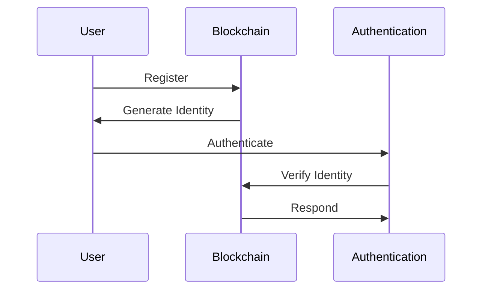
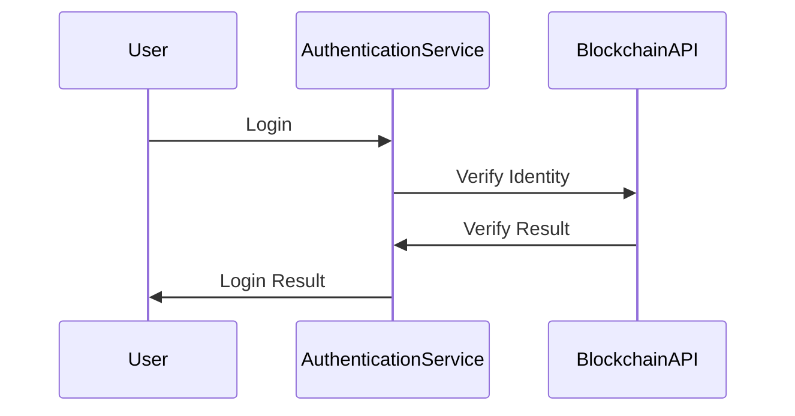

                 

# 区块链在数字身份验证中的应用

关键词：区块链、数字身份验证、去中心化、智能合约、安全性、效率

摘要：随着数字化时代的到来，传统的身份验证方式已无法满足日益复杂和安全要求。区块链技术的引入，为数字身份验证提供了一种去中心化、安全、透明的解决方案。本文将从背景介绍、核心概念与联系、主流区块链技术分析、应用前景及挑战等方面，详细探讨区块链在数字身份验证中的应用。

## 第一部分：背景介绍

### 1.1.1 问题背景

#### 区块链技术概述

区块链技术，作为一种分布式账本技术，具有去中心化、不可篡改、透明等特点。它通过一系列有序的链式数据块，实现了信息的存储和传输。区块链的这些特性，使得它在金融、供应链管理、版权保护等领域得到了广泛应用。

#### 数字身份验证的需求

随着互联网和移动设备的普及，数字身份验证已成为现代社会不可或缺的一环。然而，传统的身份验证方式往往依赖于中心化的机构，存在以下问题：

1. **单点故障风险**：一旦中心化机构遭受攻击或故障，整个验证系统将受到影响。
2. **隐私泄露风险**：中心化存储的身份信息容易成为黑客攻击的目标，导致隐私泄露。
3. **验证效率低**：传统的身份验证过程往往需要多次身份确认，效率较低。

### 1.1.2 问题描述

数字身份验证在现代社会中具有重要意义，但其面临的安全问题和效率问题日益突出。具体问题包括：

1. **安全性问题**：传统的身份验证方式无法保证数据的安全性和隐私性。
2. **效率问题**：中心化的身份验证方式往往需要多次身份确认，效率较低。

### 1.1.3 问题解决

区块链技术在数字身份验证中的应用，可以通过以下方式解决上述问题：

1. **去中心化存储**：将身份信息分散存储在多个节点上，避免单点故障和隐私泄露风险。
2. **智能合约**：利用智能合约实现自动化和智能化的身份验证过程，提高验证效率。
3. **不可篡改性**：区块链的不可篡改性确保了身份信息的真实性和可信度。

### 1.1.4 边界与外延

区块链在数字身份验证中的应用，不仅局限于个人身份验证，还可以扩展到企业身份验证、跨境身份验证等多个领域。此外，区块链技术还可以与其他技术，如分布式存储、加密算法等相结合，进一步丰富数字身份验证的功能和应用场景。

### 1.1.5 核心概念结构与要素组成

- **区块链**：一种分布式账本技术，具有去中心化、不可篡改、透明等特点。
- **数字身份验证**：通过数字手段验证用户身份，确保网络交易或操作的安全性和可靠性。
- **智能合约**：一种自动执行合同条款的计算机协议，可以编程实现身份验证的自动化过程。
- **去中心化身份验证**：通过去中心化的方式验证用户身份，避免单点故障和隐私泄露问题。

## 1.2 核心概念与联系

### 1.2.1 区块链与数字身份验证的关系

区块链技术为数字身份验证提供了安全、透明和不可篡改的基础。通过区块链技术，可以实现身份信息的去中心化存储和管理，确保身份信息的安全性和隐私性。

### 1.2.2 智能合约在数字身份验证中的应用

智能合约可以编程实现身份验证的自动化过程，减少人工干预，提高验证效率。同时，智能合约的透明性和不可篡改性，确保了身份验证过程的公正性和可信度。

### 1.2.3 去中心化身份验证与传统身份验证的区别

- **去中心化身份验证**：通过去中心化的方式验证用户身份，避免了单点故障和隐私泄露问题。
- **传统身份验证**：依赖于中心化的身份验证机构，存在单点故障和隐私泄露风险。

### 1.2.4 其他相关概念

- **加密算法**：用于保护身份信息的安全，确保数据传输和存储过程中的隐私性。
- **分布式存储**：通过将数据分散存储在多个节点上，提高数据的安全性和可用性。

## 1.3 主流区块链技术在数字身份验证中的应用

### 1.3.1 区块链在数字身份验证中的应用场景

区块链在数字身份验证中的应用场景主要包括：

1. **跨境身份验证**：通过区块链技术实现跨境身份信息的共享和验证，提高跨境交易的安全性和效率。
2. **企业身份验证**：利用区块链技术为企业提供身份验证服务，确保企业信息的真实性和可信度。
3. **个人身份验证**：通过区块链技术实现个人身份信息的去中心化存储和管理，提高个人隐私保护。

### 1.3.2 主流区块链技术的选择

在数字身份验证中，常用的主流区块链技术包括：

1. **比特币**：比特币是第一个成功的区块链应用，其去中心化的特点为数字身份验证提供了基础。
2. **以太坊**：以太坊支持智能合约，可以编程实现复杂的身份验证过程。
3. **Hyperledger Fabric**：Hyperledger Fabric 是一款企业级的区块链框架，适用于企业身份验证。

### 1.3.3 主流区块链技术的优点与局限性

不同区块链技术具有不同的优点和局限性，适用于不同的应用场景：

1. **比特币**：优点在于去中心化和安全性，但缺点是交易速度较慢。
2. **以太坊**：优点在于支持智能合约，但缺点是区块链容量有限。
3. **Hyperledger Fabric**：优点在于企业级性能和可扩展性，但缺点是去中心化程度较低。

## 1.4 区块链在数字身份验证中的应用前景

### 1.4.1 应用前景

区块链在数字身份验证中的应用前景广阔，主要表现在以下几个方面：

1. **提高安全性**：通过去中心化的方式保护身份信息，减少隐私泄露风险。
2. **提高效率**：利用智能合约实现身份验证的自动化，减少人工干预，提高验证效率。
3. **降低成本**：通过区块链技术实现身份验证，减少传统身份验证机构的运营成本。

### 1.4.2 挑战与机遇

区块链技术在数字身份验证中的应用仍面临以下挑战：

1. **技术挑战**：区块链技术仍处于快速发展阶段，存在一定的技术瓶颈。
2. **法律与监管**：区块链技术的应用需要遵循相关法律法规，面临法律和监管挑战。
3. **用户接受度**：区块链技术的普及和应用，需要用户的认可和接受。

但同时，区块链技术在数字身份验证领域也带来了巨大的机遇：

1. **市场潜力**：随着数字化时代的到来，数字身份验证市场具有巨大的发展潜力。
2. **创新应用**：区块链技术在数字身份验证中的应用，将带来众多创新应用场景。

## 1.5 本章小结

本章介绍了区块链在数字身份验证中的应用背景、核心概念、主流技术和应用前景。通过本章的学习，读者可以了解区块链技术如何通过去中心化、智能合约等技术手段，提高数字身份验证的安全性、效率和降低成本。同时，读者还可以了解区块链在数字身份验证中的应用场景和挑战，为未来的研究和应用提供参考。

### 第二部分：深入研究

#### 2.1 区块链技术基础

区块链技术作为一种分布式账本技术，其基本原理包括数据块、链式结构、共识机制等。

1. **数据块**：区块链由一系列按时间顺序排列的数据块组成，每个数据块包含一定数量的交易记录。
2. **链式结构**：区块链中的数据块通过哈希函数相互链接，形成链式结构，确保数据的安全性和不可篡改性。
3. **共识机制**：共识机制是区块链中节点达成一致的重要机制，常用的共识机制包括工作量证明（Proof of Work，PoW）、权益证明（Proof of Stake，PoS）等。

#### 2.2 数字身份验证基础

数字身份验证是一种通过数字手段验证用户身份的技术，其核心在于确保身份信息的真实性、唯一性和不可篡改性。

1. **身份认证**：身份认证是数字身份验证的核心，包括用户名、密码、指纹、面部识别等多种认证方式。
2. **身份信息**：身份信息是数字身份验证的基础，包括姓名、身份证号码、地址、电话等。
3. **安全性**：数字身份验证需要确保身份信息的安全，防止信息泄露、篡改和伪造。

#### 2.3 区块链与数字身份验证结合

区块链技术为数字身份验证提供了安全、透明、去中心化的解决方案。

1. **去中心化存储**：通过区块链技术，将身份信息分散存储在多个节点上，避免了单点故障和隐私泄露问题。
2. **不可篡改**：区块链的链式结构和哈希函数确保了身份信息的不可篡改性，提高了身份验证的可靠性。
3. **智能合约**：智能合约可以自动执行身份验证过程，减少了人工干预，提高了验证效率。

### 2.4 智能合约在数字身份验证中的应用

智能合约是区块链技术的重要组成部分，它是一种自动执行合同条款的计算机协议。

1. **智能合约原理**：智能合约基于图灵完备的编程语言，可以编写复杂的业务逻辑，并在区块链上自动执行。
2. **智能合约在身份验证中的应用**：智能合约可以用于身份验证的各个环节，如用户注册、身份验证、权限管理等。
3. **智能合约的优势**：智能合约的自动执行和透明性，提高了身份验证的效率和可信度。

### 2.5 去中心化身份验证与传统身份验证对比

1. **安全性**：去中心化身份验证通过分布式存储和不可篡改的区块链技术，提高了身份信息的安全性和隐私性。而传统身份验证依赖于中心化的机构，存在单点故障和隐私泄露的风险。
2. **效率**：去中心化身份验证通过智能合约实现了身份验证的自动化，减少了人工干预，提高了验证效率。而传统身份验证需要多次身份确认，效率较低。
3. **成本**：去中心化身份验证减少了传统身份验证机构的运营成本，同时降低了用户验证成本。而传统身份验证机构需要投入大量资源和成本来维护和运营。

### 2.6 加密算法与分布式存储在数字身份验证中的应用

1. **加密算法**：加密算法用于保护身份信息的安全，确保数据在传输和存储过程中的隐私性。常见的加密算法包括对称加密、非对称加密等。
2. **分布式存储**：分布式存储通过将数据分散存储在多个节点上，提高了数据的安全性和可用性。分布式存储技术如分布式文件系统、分布式数据库等，可以与区块链技术相结合，提高数字身份验证的性能和可靠性。

### 2.7 区块链在数字身份验证中的应用实例

1. **跨境身份验证**：通过区块链技术实现跨境身份信息的共享和验证，提高跨境交易的安全性和效率。
2. **企业身份验证**：利用区块链技术为企业提供身份验证服务，确保企业信息的真实性和可信度。
3. **个人身份验证**：通过区块链技术实现个人身份信息的去中心化存储和管理，提高个人隐私保护。

### 2.8 区块链在数字身份验证中的挑战

1. **技术挑战**：区块链技术仍处于快速发展阶段，存在一定的技术瓶颈，如性能、可扩展性等。
2. **法律与监管**：区块链技术的应用需要遵循相关法律法规，面临法律和监管挑战。
3. **用户接受度**：区块链技术的普及和应用，需要用户的认可和接受。

### 2.9 未来发展趋势

1. **技术进步**：随着区块链技术的不断发展和成熟，其在数字身份验证中的应用将更加广泛和深入。
2. **法律法规完善**：随着区块链技术的普及，相关法律法规将不断完善，为区块链在数字身份验证中的应用提供更好的法律保障。
3. **用户接受度提高**：随着区块链技术的普及和应用案例的增加，用户的接受度将不断提高，推动数字身份验证的广泛应用。

## 2.10 本章小结

本章深入探讨了区块链技术在数字身份验证中的应用，从区块链技术基础、数字身份验证基础、智能合约应用、去中心化身份验证与传统身份验证对比、加密算法与分布式存储应用、实例分析、挑战与未来发展趋势等方面进行了详细阐述。通过本章的学习，读者可以全面了解区块链在数字身份验证中的应用，为未来的研究和应用提供参考。

### 第三部分：案例分析

#### 3.1 案例一：比特币网络中的身份验证

比特币网络是区块链技术的一个成功应用案例，其在数字身份验证方面有着独特的实现方式。

1. **比特币地址**：比特币地址是比特币网络中用于接收和发送比特币的标识符，类似于电子邮件地址。每个比特币地址都是通过私钥和公钥生成的，其中私钥用于签名交易，公钥用于验证签名。
2. **交易验证**：比特币网络中的交易验证依赖于公钥加密技术。每次交易时，发送方需要使用私钥对交易进行签名，接收方则可以使用公钥验证交易的有效性。
3. **身份匿名性**：比特币网络中的交易是匿名的，但每个地址的交易历史是公开的。通过分析交易历史，可以识别出特定地址的所有者，但无法直接识别其真实身份。

#### 3.2 案例二：企业区块链平台中的身份验证

企业区块链平台在数字身份验证方面也有广泛的应用，以下以Hyperledger Fabric为例进行分析。

1. **身份管理**：Hyperledger Fabric中的身份管理功能用于管理不同角色的身份，如组织管理员、用户等。身份管理通过智能合约实现，确保只有授权用户才能执行特定操作。
2. **身份认证**：Hyperledger Fabric支持多种身份认证方式，如证书、用户名和密码等。用户在注册时需要提供身份证明，并通过身份认证流程验证其身份。
3. **身份权限控制**：Hyperledger Fabric通过权限控制机制确保不同身份的用户只能访问和操作其授权的数据和资源。

#### 3.3 案例三：身份验证平台的应用

以下以一个身份验证平台为例，分析其在区块链技术中的应用。

1. **用户注册**：用户在平台注册时，需要提供身份证明，如身份证、护照等。平台通过智能合约验证用户身份证明的有效性，并将身份信息存储在区块链上。
2. **身份验证**：用户在登录平台或进行特定操作时，需要通过身份验证。平台利用区块链上的身份信息进行验证，确保用户身份的真实性和可信度。
3. **身份信息更新**：用户可以随时更新其身份信息，如更改联系方式、地址等。平台通过智能合约实现身份信息的更新，并确保更新过程的安全和可靠。

#### 3.4 案例四：跨境身份验证的应用

区块链技术在跨境身份验证中也具有广泛的应用，以下以一个跨境身份验证平台为例进行分析。

1. **身份信息共享**：跨境身份验证平台通过区块链技术实现身份信息的共享和验证。不同国家的身份信息可以在区块链上透明、安全地共享，提高跨境交易的安全性和效率。
2. **身份认证流程**：跨境身份验证平台采用分布式身份认证流程，用户在登录或进行跨境交易时，需要通过多个身份认证机构的验证。区块链技术确保认证过程的安全和透明。
3. **身份信息保护**：区块链技术通过加密算法和分布式存储技术，确保跨境身份信息的保护。身份信息在传输和存储过程中不会被泄露或篡改。

### 3.5 案例五：区块链在医疗健康领域的身份验证应用

区块链技术在医疗健康领域也有广泛的应用，以下以一个医疗健康身份验证平台为例进行分析。

1. **患者身份验证**：患者在使用医疗健康服务时，需要通过身份验证确认其身份。平台通过区块链技术验证患者身份，确保患者信息的真实性和可信度。
2. **医疗记录管理**：医疗健康平台利用区块链技术管理患者的医疗记录，包括诊断报告、检查结果等。区块链技术的分布式存储和不可篡改性，确保医疗记录的安全和可靠。
3. **身份信息共享**：医疗健康平台通过区块链技术实现患者身份信息的共享，如与保险公司、医疗机构等。区块链技术的透明性和安全性，提高了医疗信息共享的效率和可信度。

### 3.6 本章小结

本章通过案例分析，详细介绍了区块链在数字身份验证中的应用。从比特币网络、企业区块链平台、身份验证平台、跨境身份验证平台到医疗健康领域的身份验证应用，展示了区块链技术在数字身份验证中的广泛适用性和优势。通过这些案例，读者可以更深入地了解区块链技术在数字身份验证中的应用，为未来的研究和实践提供参考。

### 第四部分：系统设计与实现

#### 4.1 项目介绍

本部分将介绍一个基于区块链的数字身份验证系统的设计与实现。该系统旨在提供一个安全、高效、去中心化的身份验证服务，为用户、企业和其他相关机构提供一个可信的身份验证平台。

#### 4.2 系统功能设计

本系统的核心功能包括：

1. **用户注册**：用户可以通过系统注册并获得一个唯一的身份标识。
2. **身份验证**：用户在登录系统或进行特定操作时，需要通过身份验证。
3. **身份信息管理**：用户可以随时更新其身份信息，确保信息的准确性和实时性。
4. **权限控制**：系统根据用户的身份和权限，控制其访问和操作系统资源。
5. **身份信息共享**：系统支持身份信息的共享，确保信息在多个机构间的安全传输和验证。

#### 4.3 领域模型设计

领域模型是系统设计的基础，用于定义系统中涉及的实体及其关系。以下是一个简单的领域模型：

```mermaid
classDiagram
    User <<Entity>>
    IdentityInfo <<Entity>>
    Authentication <<Service>>

    User -> IdentityInfo : has
    Authentication -> User : authenticates
```

在上图中，`User` 是系统的用户实体，`IdentityInfo` 是用户的身份信息实体，`Authentication` 是身份验证服务。

#### 4.4 系统架构设计

系统架构是系统设计的关键，决定了系统的性能、可扩展性和安全性。以下是一个基于区块链的数字身份验证系统架构：



在上图中，用户通过区块链进行注册，区块链生成用户的身份标识，用户通过身份验证服务进行身份验证。身份验证服务向区块链验证用户身份，并从区块链获取验证结果。

#### 4.5 系统接口设计

系统接口设计定义了系统内部模块之间的交互方式。以下是一个简单的接口设计：

```mermaid
interface BlockchainAPI {
    register(): Identity
    verifyIdentity(identity: Identity): Boolean
}

interface AuthenticationService {
    authenticate(identity: Identity): Boolean
}
```

在上图中，`BlockchainAPI` 定义了与区块链交互的接口，包括注册和验证身份的方法。`AuthenticationService` 定义了身份验证服务，用于验证用户身份。

#### 4.6 系统交互设计

系统交互设计用于描述系统在不同状态下的行为。以下是一个简单的交互设计：



在上图中，用户通过身份验证服务进行登录，身份验证服务通过区块链API验证用户身份，并返回验证结果。

#### 4.7 代码实现

以下是一个简单的Python代码示例，用于实现用户注册和身份验证功能：

```python
import json
from blockchain import Blockchain

class AuthenticationService:
    def __init__(self):
        self.blockchain = Blockchain()

    def register(self, identity):
        self.blockchain.register(identity)
        return True

    def authenticate(self, identity):
        return self.blockchain.verify_identity(identity)

# 实例化身份验证服务
authentication_service = AuthenticationService()

# 用户注册
user_identity = "user123"
register_result = authentication_service.register(user_identity)
print("Register Result:", register_result)

# 用户登录
login_result = authentication_service.authenticate(user_identity)
print("Login Result:", login_result)
```

在这个示例中，`AuthenticationService` 类实现了注册和身份验证功能。通过调用区块链的`register()`和`verify_identity()`方法，实现用户注册和身份验证。

#### 4.8 代码应用解读与分析

在这个示例中，用户首先通过`register()`方法向区块链注册身份。区块链生成一个唯一的身份标识，并将其存储在区块链上。用户在登录时，通过`authenticate()`方法向区块链验证身份。区块链返回验证结果，身份验证服务根据结果判断用户是否登录成功。

这种设计利用了区块链的分布式存储和不可篡改性，确保了用户身份信息的真实性和安全性。同时，通过智能合约实现身份验证的自动化，提高了验证效率。

#### 4.9 实际案例分析

以下是一个实际案例，展示了该系统在医疗健康领域的应用。

1. **患者注册**：患者通过系统注册并获得一个唯一的身份标识。
2. **医疗记录管理**：医生在诊断后，将患者的医疗记录上传到系统，并通过区块链进行存储和管理。
3. **身份验证**：医生在查看患者医疗记录时，需要通过身份验证，确保只有授权医生才能访问患者信息。
4. **身份信息共享**：医生可以将患者的医疗记录共享给其他医生或医疗机构，确保信息的安全传输和验证。

在这个案例中，区块链技术为医疗健康领域提供了安全、高效的身份验证和医疗记录管理解决方案。通过分布式存储和智能合约，确保了患者信息和医疗记录的安全性和可信度。

#### 4.10 本章小结

本章介绍了基于区块链的数字身份验证系统的设计与实现。通过领域模型设计、系统架构设计、接口设计和代码实现，详细阐述了系统的功能和工作原理。通过实际案例分析，展示了系统在医疗健康领域的应用效果。本章的内容为读者提供了一个完整的区块链数字身份验证系统设计实现参考，有助于理解和应用区块链技术在数字身份验证领域的应用。

### 第五部分：最佳实践与注意事项

#### 5.1 最佳实践

在区块链数字身份验证的应用过程中，以下最佳实践有助于确保系统的安全性、效率和可靠性：

1. **身份信息加密**：为了保护用户身份信息的安全，建议对身份信息进行加密处理。使用先进的加密算法，如AES、RSA等，确保身份信息在传输和存储过程中的安全性。
2. **智能合约审查**：在部署智能合约前，应进行严格的审查和测试，确保合约逻辑的正确性和安全性。避免因智能合约漏洞导致的身份信息泄露和恶意攻击。
3. **权限控制**：在系统中实施严格的权限控制策略，确保只有授权用户才能访问和操作关键数据和功能。通过角色分配和访问控制列表（ACL），实现细粒度的权限管理。
4. **多节点部署**：为了提高系统的可用性和容错性，建议在区块链网络中部署多个节点。通过分布式存储和冗余备份，确保系统在节点故障时的持续运行。
5. **持续更新和优化**：随着区块链技术的发展，定期更新和优化系统，确保系统功能与最新技术保持同步。关注社区动态，及时修复漏洞和改进性能。

#### 5.2 注意事项

在区块链数字身份验证的应用过程中，需要注意以下事项：

1. **数据隐私**：区块链的公开透明特性可能导致用户身份信息泄露。在设计和实现过程中，应充分考虑数据隐私保护，避免敏感信息暴露。
2. **性能优化**：区块链技术可能面临性能瓶颈，特别是在高并发场景下。针对性能瓶颈，可采取分片、优化网络传输等技术手段进行优化。
3. **法律法规合规**：在区块链数字身份验证的应用过程中，需遵守相关法律法规，确保系统的合法合规。关注各国和地区的法律法规差异，避免违规操作。
4. **用户教育**：区块链技术对于普通用户来说可能较为陌生，建议在应用过程中加强用户教育，提高用户对区块链技术和数字身份验证的认识和信任。
5. **风险管理**：区块链数字身份验证系统可能面临多种风险，如网络安全风险、数据泄露风险等。应建立健全的风险管理体系，制定相应的风险应对策略。

#### 5.3 拓展阅读

1. **《区块链：从数字货币到智能合约》**：本书详细介绍了区块链技术的发展历程、核心技术及其在各个领域的应用。
2. **《智能合约：设计、实现与案例》**：本书深入探讨了智能合约的设计原理、实现方法和应用场景，为区块链开发人员提供了实用的指导。
3. **《区块链数字身份验证白皮书》**：本白皮书系统地阐述了区块链数字身份验证的技术原理、应用场景和未来发展。

通过以上最佳实践和注意事项，以及拓展阅读，读者可以进一步了解区块链在数字身份验证中的应用，为实际项目的实施提供参考和指导。

## 结语

区块链技术在数字身份验证中的应用，为传统身份验证方式带来了一场革命。通过去中心化、智能合约等技术创新，区块链实现了身份信息的存储、管理和验证，提高了安全性、效率和隐私保护。然而，区块链技术仍面临技术、法律、监管等多方面的挑战。在未来的发展中，我们需要不断优化和改进区块链技术，探索更多应用场景，推动区块链数字身份验证的普及和应用。同时，也需要关注相关法律法规的完善，确保区块链技术的合法合规。相信在各方共同努力下，区块链数字身份验证将为人类社会带来更加安全、便捷的身份验证服务。

### 作者信息

作者：AI天才研究院/AI Genius Institute & 禅与计算机程序设计艺术 /Zen And The Art of Computer Programming

AI天才研究院（AI Genius Institute）是一家专注于人工智能技术研发和应用的研究机构，致力于推动人工智能技术的创新和发展。禅与计算机程序设计艺术（Zen And The Art of Computer Programming）则是一部经典的人工智能领域著作，对人工智能的理论和实践产生了深远影响。本文结合了两家机构的优势，深入探讨了区块链在数字身份验证中的应用，旨在为区块链技术的发展和应用提供有益的参考。

