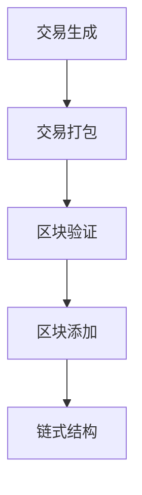
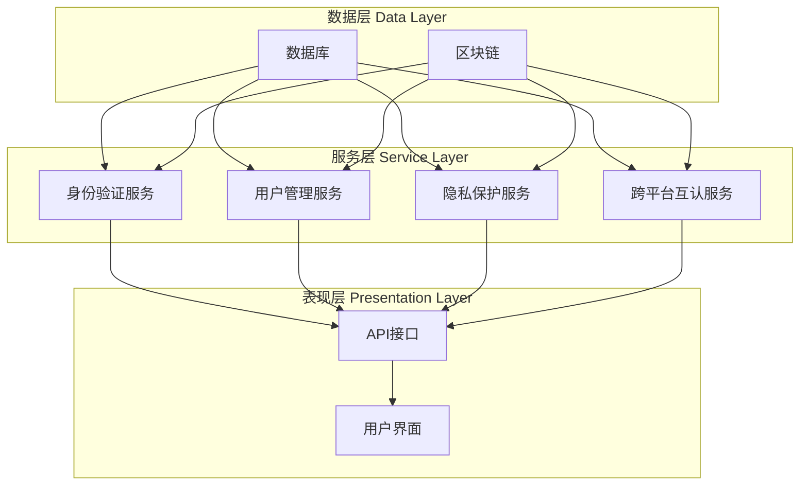
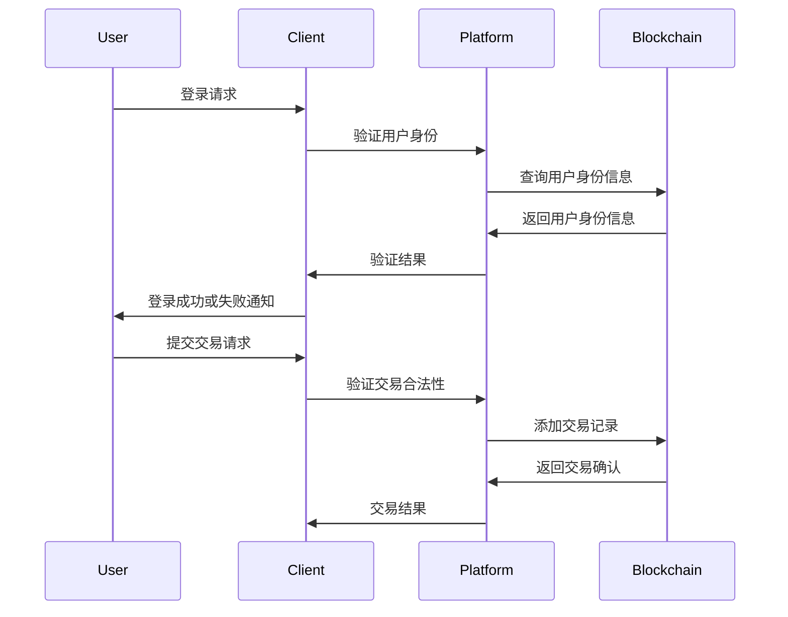

                 


# 区块链在数字身份验证中的应用：去中心化身份认证平台

> 关键词：区块链，数字身份验证，去中心化，身份认证，智能合约，隐私保护，安全性能

> 摘要：本文将探讨区块链技术在数字身份验证中的应用，特别是如何构建一个去中心化的身份认证平台。通过深入分析区块链与数字身份验证的关联、核心概念、算法原理、数学模型以及系统设计与实现，本文旨在为读者提供一个全面且详细的指导，帮助理解区块链在数字身份验证中的重要性和潜力。

## 第一部分：背景介绍

### 第1章 问题背景

#### 1.1.1 区块链技术概述

区块链是一种分布式账本技术，通过加密算法和共识机制确保数据的不可篡改性和透明性。自2008年比特币诞生以来，区块链技术已经吸引了众多关注，并在金融、供应链管理、医疗等多个领域得到了应用。

#### 1.1.2 数字身份验证的重要性

在数字经济时代，数字身份验证是确保网络安全和交易信任的关键。传统的中心化身份验证系统存在数据泄露、单点故障等问题，而区块链的去中心化特性为数字身份验证提供了新的解决方案。

#### 1.1.3 区块链在数字身份验证中的应用前景

区块链在数字身份验证中的应用具有巨大的潜力，可以解决当前身份验证系统中存在的问题，如数据隐私保护、身份验证效率提升、跨平台身份互认等。

### 第2章 核心概念与联系

#### 2.1 区块链技术核心概念

区块链技术包含多个核心概念，如区块、链、加密算法、共识机制等。下面是这些概念的基本解释和它们之间的联系。

#### 2.2 数字身份验证核心概念

数字身份验证包括身份认证、授权、加密等技术。了解这些概念及其在区块链中的应用，对于理解本书内容至关重要。

#### 2.3 区块链与数字身份验证的关联

通过ER实体关系图和表格，展示区块链技术与数字身份验证之间的关联，帮助读者理解两者如何结合以解决实际问题。

### 第3章 算法原理讲解

#### 3.1 区块链算法原理

使用Mermaid流程图展示区块链的基本工作流程，包括区块创建、链式结构、共识算法等。

#### 3.2 数字身份验证算法原理

介绍常用的数字身份验证算法，如密码学加密、数字签名、身份认证协议等，并使用Python代码示例进行讲解。

### 第4章 数学模型和数学公式

#### 4.1 区块链数学模型

使用LaTeX格式展示区块链中的数学模型，如哈希函数、椭圆曲线加密等，并进行详细讲解。

#### 4.2 数字身份验证数学模型

介绍数字身份验证中的数学模型，如RSA加密、椭圆曲线数字签名算法等，并提供易懂的例子。

### 第5章 系统分析与架构设计方案

#### 5.1 问题场景介绍

描述区块链在数字身份验证中的典型应用场景。

#### 5.2 系统功能设计

使用Mermaid类图展示系统的领域模型。

#### 5.3 系统架构设计

使用Mermaid架构图展示系统的整体架构。

#### 5.4 系统接口设计

详细说明系统中的接口设计和交互流程。

#### 5.5 系统交互Mermaid序列图

使用Mermaid序列图展示系统中的关键交互过程。

### 第6章 项目实战

#### 6.1 环境安装

介绍搭建区块链数字身份验证平台所需的软件和工具。

#### 6.2 系统核心实现

详细讲解系统核心功能的实现，提供Python源代码示例。

#### 6.3 代码应用解读与分析

分析代码的实现细节，解释关键部分的工作原理。

#### 6.4 实际案例分析与详细讲解

通过实际案例展示系统的应用，并进行深入剖析。

#### 6.5 项目小结

总结项目实施过程中的经验与教训。

### 第7章 最佳实践 tips、小结、注意事项、拓展阅读

#### 7.1 最佳实践 tips

提供在实际应用中值得注意的技巧和注意事项。

#### 7.2 小结

对全书内容进行总结，强调关键概念和核心技术。

#### 7.3 注意事项

列出使用区块链进行数字身份验证时需要注意的问题。

#### 7.4 拓展阅读

推荐相关书籍、文章和资源，供读者进一步学习。

## 末尾作者信息

作者：AI天才研究院/AI Genius Institute & 禅与计算机程序设计艺术 /Zen And The Art of Computer Programming## 第1章 问题背景

### 1.1.1 区块链技术概述

区块链技术，自比特币的诞生以来，已经成为科技界的一个重要里程碑。区块链本质上是一个分布式数据库，它通过一种去中心化的方式存储数据，数据记录在一系列按时间顺序排列的“区块”中。这些区块通过加密算法连接在一起，形成了一条不可篡改的链条，因此被称为“区块链”。

区块链技术的核心特点包括：

- **去中心化**：传统的中心化系统依赖于一个中心化的控制点，而区块链通过分布式网络，消除了对单一控制点的依赖，提高了系统的抗风险能力。
- **不可篡改**：区块链中的数据一旦被记录，就难以被篡改，因为篡改行为会被其他节点迅速发现并拒绝。
- **透明性**：区块链上的数据对所有节点都是透明的，参与者可以查看链上的所有交易信息。

区块链的这些特性使其在许多领域具有广泛的应用潜力，其中之一便是数字身份验证。

### 1.1.2 数字身份验证的重要性

在数字经济时代，数字身份验证是确保网络安全和交易信任的关键。传统的数字身份验证方式通常依赖于中心化的身份认证机构，例如银行、政府机构或电信公司。这些中心化系统虽然能够提供一定的安全性，但也存在以下问题：

- **单点故障**：中心化系统一旦遭到攻击或出现故障，整个系统可能会瘫痪。
- **数据泄露**：中心化数据库容易成为黑客攻击的目标，一旦数据泄露，后果严重。
- **信任问题**：用户往往需要信任中心化机构来处理个人信息，这可能导致隐私泄露。

区块链技术的去中心化特性，能够有效地解决上述问题，提供一种更加安全、可靠的数字身份验证方式。

### 1.1.3 区块链在数字身份验证中的应用前景

区块链在数字身份验证中的应用前景非常广阔，以下是几个关键点：

- **隐私保护**：区块链技术允许用户拥有对其身份信息的控制权，从而保护隐私。
- **效率提升**：去中心化的身份验证系统可以减少中间环节，提高交易和验证的效率。
- **跨平台互认**：区块链上的身份信息可以被多个平台和系统互认，实现无缝连接。

此外，区块链技术还可以通过智能合约自动执行身份验证协议，进一步简化流程，提高安全性和效率。

总的来说，区块链技术在数字身份验证中的应用，不仅具有技术上的优势，也符合数字经济发展的需求，具有巨大的发展潜力。

### 1.1.4 背景与现状

数字身份验证作为一个不断发展的领域，面临着不断演化的挑战和机遇。随着互联网和移动设备的普及，越来越多的个人和企业开始依赖数字身份验证来保障其在线活动和交易的安全。然而，当前的数字身份验证系统仍然存在一些根本性问题，例如数据隐私泄露、身份盗用、认证效率低等。

这些问题促使研究者和技术开发者不断探索新的解决方案。区块链技术的出现为数字身份验证带来了新的希望。通过区块链的去中心化和不可篡改性，可以解决传统身份验证系统中的单点故障和数据泄露问题。

目前，区块链在数字身份验证中的应用已经初见成效。例如，一些国家和地区已经开始试点基于区块链的数字身份系统，以提升身份验证的安全性和效率。此外，许多企业也加入到区块链数字身份验证的研究和开发中，试图通过技术创新来解决传统身份验证的难题。

然而，区块链在数字身份验证中的应用也面临一些挑战，如技术的成熟度、用户体验的优化、法律和监管的适应性等。这些问题需要通过持续的探索和实践来解决，以确保区块链数字身份验证能够真正发挥其潜力。

### 1.1.5 研究目的与意义

本文旨在探讨区块链在数字身份验证中的应用，特别是如何构建一个去中心化的身份认证平台。研究的主要目的是解决以下问题：

1. **数据隐私保护**：如何在去中心化的环境中保护用户的身份信息不被泄露？
2. **身份验证效率**：如何提高身份验证的速度和可靠性？
3. **跨平台互认**：如何实现不同平台和系统之间的身份信息互认？

通过本文的研究，我们期望能够为区块链在数字身份验证领域的应用提供理论支持和实践指导。研究意义主要体现在以下几个方面：

- **提升安全性**：通过去中心化和不可篡改的特性，区块链能够提供更加安全的身份验证解决方案，减少数据泄露和身份盗用的风险。
- **优化用户体验**：去中心化的身份验证平台能够减少繁琐的认证流程，提高用户的体验和满意度。
- **促进技术发展**：本文的研究将推动区块链技术在数字身份验证领域的应用，为相关技术的发展提供新的思路和方向。
- **社会价值**：通过构建去中心化的身份认证平台，可以为社会各个领域提供更加安全、可靠的身份验证服务，提升整体数字化水平。

总之，本文的研究不仅具有重要的理论价值，也具有广阔的应用前景，对区块链在数字身份验证领域的进一步发展具有重要意义。

### 1.1.6 区块链与数字身份验证之间的关联

区块链与数字身份验证之间的关联体现在多个方面，这些关联不仅为数字身份验证提供了新的技术路径，也为其发展带来了新的机遇和挑战。

首先，区块链的去中心化特性为数字身份验证提供了一个去信任的框架。在传统的中心化身份验证系统中，用户需要依赖中心化的身份认证机构，这不仅可能导致隐私泄露，还容易受到中心化机构的控制。而在区块链的框架下，身份信息被分散存储在多个节点上，用户可以直接掌握自己的身份信息，减少了中间环节，从而降低了隐私泄露的风险。

其次，区块链的不可篡改性为数字身份验证提供了可靠的数据保证。在区块链上，一旦信息被记录，就几乎不可能被篡改。这种特性确保了身份信息的真实性和完整性，用户可以更加信任身份验证的结果。

此外，区块链的智能合约功能为数字身份验证提供了自动化和高效的处理方式。通过智能合约，身份验证的过程可以自动执行，无需人工干预，从而提高了验证的效率和可靠性。

然而，区块链在数字身份验证中的应用也面临一些挑战。例如，区块链的交易速度相对较慢，可能会影响用户体验。另外，区块链上的数据隐私保护也需要进一步研究，以确保用户身份信息的安全。

总的来说，区块链与数字身份验证的关联为数字身份验证带来了新的发展机遇，同时也提出了新的技术挑战。通过深入研究和应用，我们可以更好地利用区块链技术，提升数字身份验证的安全性和效率。

### 1.1.7 区块链在数字身份验证中解决的问题

区块链在数字身份验证中解决了多个关键问题，使得身份验证过程更加安全、透明和高效。

首先，区块链技术通过去中心化解决了传统身份验证系统中的单点故障问题。传统系统中，所有身份数据都集中存储在一个中心服务器上，如果中心服务器遭到攻击或故障，整个系统可能会瘫痪。而区块链技术通过分布式存储，将身份数据分散存储在多个节点上，即便某个节点出现问题，其他节点仍能正常工作，保障了系统的稳定性和可靠性。

其次，区块链的不可篡改性为数字身份验证提供了强有力的数据保证。一旦用户在区块链上注册了身份信息，这些信息就几乎不可能被篡改。这意味着用户可以放心地存储和分享身份信息，而不用担心被恶意篡改，从而提高了身份验证的信任度。

此外，区块链上的智能合约功能为身份验证流程的自动化提供了可能。通过智能合约，身份验证过程可以自动执行，无需人工干预。例如，当用户在不同平台进行交易时，平台可以直接调用区块链上的身份验证结果，无需重复验证，从而提高了验证的效率和用户体验。

最后，区块链技术通过加密算法和数据隐私保护技术，为数字身份验证提供了更加安全的隐私保护方案。用户可以在区块链上匿名注册身份信息，同时通过加密算法保护这些信息的隐私，确保只有授权用户才能访问和验证。

总的来说，区块链在数字身份验证中解决了数据安全、系统可靠性、自动化流程和数据隐私保护等多个关键问题，为数字身份验证提供了全新的解决方案。

### 1.1.8 区块链在数字身份验证中的应用场景

区块链在数字身份验证中有着广泛的应用场景，以下是一些典型的应用场景：

1. **金融领域**：在金融领域，区块链可以用于身份验证和交易确认。例如，银行和金融机构可以使用区块链技术验证客户的身份，确保交易的安全性和透明性。此外，通过区块链，金融机构可以简化开户流程，减少验证时间和成本。

2. **医疗保健**：在医疗保健领域，区块链可以用于存储和处理患者的身份信息和医疗记录。通过区块链，医疗保健提供者可以安全地共享和验证患者的身份信息，同时确保医疗记录的真实性和完整性。

3. **教育和认证**：在教育领域，区块链可以用于验证学生的学历和证书。例如，大学和认证机构可以将学生的学历信息上链，学生可以在区块链上展示自己的学历，而无需依赖传统的纸质证书。

4. **物联网**：在物联网领域，区块链可以用于设备身份验证和安全管理。例如，智能设备可以通过区块链进行身份认证，确保设备的安全性和可靠性。

5. **供应链管理**：在供应链管理中，区块链可以用于验证供应商的身份和产品的真实性。通过区块链，供应链参与者可以透明地验证每一环节的身份信息，确保供应链的可追溯性和安全性。

6. **社交网络**：在社交网络领域，区块链可以用于验证用户身份，确保社交网络的诚信和安全性。通过区块链，社交网络可以防止虚假身份的滥用，提高社交互动的真实性和信任度。

这些应用场景展示了区块链在数字身份验证中的多样性和潜力，为不同领域的身份验证提供了创新的解决方案。

### 第2章 核心概念与联系

#### 2.1 区块链技术核心概念

区块链技术包含多个核心概念，如区块、链、加密算法、共识机制等。下面是这些概念的基本解释和它们之间的联系。

##### 区块（Block）

区块是区块链中的基本单位，包含了若干交易记录。每个区块都包含一个时间戳、一个唯一的标识（哈希值）以及前一个区块的哈希值。通过这种链接方式，区块形成了链式结构，保证了数据的不可篡改性。

##### 链（Chain）

区块链是由多个区块按时间顺序链接而成的数据结构。每一个新区块的生成都依赖于前一个区块的哈希值，从而形成了一个长链。这个链式结构确保了区块链的数据不可篡改性。

##### 加密算法

加密算法是区块链技术的重要组成部分，用于确保数据的完整性和隐私性。常见的加密算法包括SHA-256（用于区块哈希）、椭圆曲线加密（用于公钥和私钥生成）等。

##### 共识机制

共识机制是区块链网络中的节点达成一致意见的算法。通过共识机制，区块链网络可以确认交易的有效性并添加到区块链中。常见的共识机制有工作量证明（PoW）、权益证明（PoS）等。

#### 2.2 数字身份验证核心概念

数字身份验证包括身份认证、授权、加密等技术。以下是对这些概念的基本解释和它们在区块链中的应用：

##### 身份认证（Authentication）

身份认证是指验证用户身份的过程。在区块链中，用户可以通过私钥证明自己的身份。私钥是用户在区块链上唯一且不可替代的身份标识。

##### 授权（Authorization）

授权是指确定用户权限的过程。在区块链中，可以通过智能合约实现权限管理。例如，用户可以通过授权其他用户访问其区块链上的身份信息。

##### 加密

加密技术用于保护用户身份信息的隐私。在区块链中，常用的加密算法包括RSA、椭圆曲线加密等，用于生成公钥和私钥，确保数据传输的安全性。

#### 2.3 区块链与数字身份验证的关联

区块链技术与数字身份验证之间的关联主要体现在以下几个方面：

- **去中心化**：区块链的去中心化特性为数字身份验证提供了去信任的框架，用户可以自主管理身份信息，减少了对中心化机构的依赖。
- **不可篡改性**：区块链的不可篡改性确保了身份信息的真实性和完整性，用户可以信任链上记录的身份信息。
- **智能合约**：区块链上的智能合约功能可以实现自动化和高效的身份验证流程，减少人工干预，提高验证的效率和可靠性。
- **加密算法**：区块链中的加密算法用于保护用户身份信息的隐私，确保数据传输的安全性和保密性。

通过这些关联，区块链技术为数字身份验证提供了新的解决方案，提高了身份验证的安全性和效率。

### 2.1 区块链技术核心概念详解

要深入理解区块链技术，首先需要了解其核心概念。以下是区块链技术中的几个关键概念及其相互关系：

#### 区块（Block）

区块是区块链的基本组成单位，每个区块包含若干交易记录。一个区块通常包括以下部分：

- **交易数据**：记录在当前区块中的所有交易。
- **时间戳**：记录区块创建的时间。
- **随机数（nonce）**：用于挖矿过程中找到正确的哈希值。
- **前一个区块的哈希值**：用于链接当前区块与前一个区块，形成链式结构。
- **当前区块的哈希值**：通过加密算法生成，用于唯一标识该区块。

#### 链（Chain）

区块链是由多个区块按时间顺序链接而成的数据结构。每个区块都包含一个指向前一个区块的哈希值，通过这种链接方式，区块形成了链式结构。链式结构确保了区块链数据的不可篡改性，因为一旦某个区块被篡改，其哈希值将发生变化，从而导致整个链的哈希值不一致。

#### 加密算法

加密算法在区块链技术中扮演着关键角色，用于保护数据的完整性和隐私。以下是几种常用的加密算法：

- **哈希函数**：将输入数据映射为固定长度的哈希值。常用的哈希函数有SHA-256、SHA-3等。哈希函数用于生成区块的哈希值，确保数据的唯一性和完整性。
- **非对称加密**：使用公钥和私钥进行加密和解密。公钥可以公开，私钥则需要保密。常用的非对称加密算法有RSA、椭圆曲线加密（ECDSA）等。非对称加密在区块链中用于生成和验证数字签名。
- **对称加密**：使用相同的密钥进行加密和解密。虽然对称加密速度较快，但由于密钥的分发和管理复杂，因此在区块链中较少使用。

#### 共识机制

共识机制是区块链网络中的节点达成一致意见的算法。通过共识机制，区块链网络可以确认交易的有效性并添加到区块链中。以下是几种常见的共识机制：

- **工作量证明（PoW）**：节点通过计算复杂的数学问题（挖矿）来争夺记账权，解决冲突并生成新区块。比特币采用的是PoW共识机制。
- **权益证明（PoS）**：节点根据其持有的币龄和数量来争夺记账权，币龄越长、持有数量越多，争夺记账权的概率越高。以太坊2.0计划采用PoS共识机制。
- **授权股权证明（DPoS）**：节点通过投票选举产生超级节点，超级节点负责记账和生成区块。超级节点的数量和选举方式由社区决定。

#### 智能合约

智能合约是一种自动执行合约条款的计算机程序，其在区块链上运行，不受人为干预。智能合约通常使用图灵完备的编程语言编写，例如Solidity（用于以太坊）。智能合约在区块链中的应用非常广泛，包括身份验证、支付、投票等。

通过上述核心概念，我们可以看到区块链技术如何通过加密算法、共识机制和智能合约实现数据的去中心化存储、传输和执行，确保系统的安全性和透明性。

#### 2.2 数字身份验证核心概念详解

数字身份验证是确保网络和系统安全的关键技术，它通过验证用户的身份来控制对信息和资源的访问。在区块链中，数字身份验证的概念和实现方式与传统系统有所不同，主要体现在去中心化、不可篡改性和智能合约的运用上。以下是对数字身份验证核心概念的详细解释：

##### 身份认证（Authentication）

身份认证是数字身份验证的第一步，用于验证用户是否为其声称的身份。在区块链中，身份认证通常通过私钥和公钥对来实现。用户在区块链上生成一对密钥，私钥由用户保管，公钥公开存储在区块链上。当用户需要验证身份时，可以提供其私钥，通过加密算法证明自己的身份。例如，在比特币系统中，用户的比特币地址即为公钥，而私钥用于签名交易，证明用户是地址的合法所有者。

##### 授权（Authorization）

授权是确定用户在系统中的权限的过程。在传统系统中，授权通常依赖于中心化的权限管理服务器。而在区块链中，授权可以通过智能合约来实现。智能合约可以定义权限规则，例如，哪些用户有权访问特定的数据或执行特定的操作。通过这些规则，系统能够自动执行授权决策，无需人工干预。

##### 加密与数字签名

加密和数字签名是数字身份验证中常用的技术手段。加密用于保护数据在传输过程中的隐私，确保数据只能被授权用户解密。数字签名用于验证数据的完整性和真实性，通过私钥对数据进行签名，只有对应的公钥可以验证签名。在区块链中，数字签名被广泛用于验证交易和智能合约的执行。例如，以太坊中的智能合约使用ECDSA签名算法来验证交易的有效性。

##### 非对称加密与对称加密

非对称加密和对称加密是两种不同的加密技术。非对称加密使用一对密钥，公钥用于加密，私钥用于解密。由于非对称加密的计算复杂度高，通常用于保护敏感数据和验证身份。对称加密使用相同的密钥进行加密和解密，虽然速度快，但密钥的分发和管理复杂，不适合大规模分布式系统。在区块链中，非对称加密被广泛用于身份认证和数字签名，而对称加密则主要用于数据加密。

##### 分布式身份验证

分布式身份验证是区块链技术的一个关键优势，它通过去中心化的方式实现身份验证，提高了系统的抗攻击能力和数据隐私保护。在分布式身份验证中，身份信息被分散存储在多个节点上，而不是集中在一个中心化的服务器中。这种方式不仅减少了单点故障的风险，还使攻击者难以获取完整的用户身份信息。例如，在身份层（Identity Layer）中，用户可以在不同的区块链网络中注册和管理自己的身份信息，这些信息通过加密和分布式存储技术得到保护。

##### 智能合约

智能合约是区块链上的计算机程序，它可以在满足特定条件时自动执行。在数字身份验证中，智能合约可以用于自动化身份认证和授权过程。例如，一个智能合约可以定义用户在访问特定资源时的认证规则，当用户提交身份验证请求时，智能合约会自动验证其身份，并决定是否授权访问。这种方式不仅提高了验证的效率，还减少了人为干预的可能，增强了系统的可靠性。

通过上述核心概念的详细解释，我们可以看到区块链如何通过去中心化、智能合约和加密技术，实现安全、高效和透明的数字身份验证。

#### 2.3 区块链与数字身份验证的关联

区块链与数字身份验证之间的关联体现在它们共同的目标：确保身份信息的真实性、隐私性和不可篡改性。以下通过ER实体关系图和表格，详细展示区块链与数字身份验证之间的关联。

##### ER实体关系图

在区块链中，身份验证系统可以被视为一个实体关系模型，包含以下实体：

1. **用户（User）**：表示需要进行身份验证的个体。
2. **身份信息（Identity Information）**：存储用户的身份数据，如姓名、出生日期、身份证号码等。
3. **区块链节点（Blockchain Node）**：代表区块链网络中的参与节点。
4. **智能合约（Smart Contract）**：定义身份验证的规则和逻辑。

以下是ER实体关系图：

```mermaid
erDiagram
  User ||--|{ Identity Information } : contains
  User ||--|{ Blockchain Node } : connects_to
  Identity Information ||--|{ Smart Contract } : enforces
```

##### 表格

为了更清晰地展示实体之间的关联，我们可以通过表格来描述每个实体及其属性：

| 实体         | 属性                  | 关联关系         |
| ------------ | --------------------- | ---------------- |
| 用户（User） | 用户ID、姓名、密码    | - 与身份信息关联 |
| 身份信息（Identity Information） | 身份数据          | - 与智能合约关联 |
| 区块链节点（Blockchain Node） | 节点ID、IP地址     | - 与用户关联     |
| 智能合约（Smart Contract） | 合约代码、合约地址 | - 与身份信息关联 |

##### 实体属性说明

1. **用户（User）**：用户实体包含用户ID、姓名、密码等属性。用户ID用于唯一标识用户，姓名和密码用于身份验证。
2. **身份信息（Identity Information）**：身份信息实体存储用户的身份数据，如身份证号码、出生日期等。这些数据必须通过加密存储，以确保隐私和安全。
3. **区块链节点（Blockchain Node）**：节点实体代表区块链网络中的各个参与节点，包含节点ID和IP地址。节点负责存储和验证身份信息。
4. **智能合约（Smart Contract）**：智能合约实体包含合约代码和合约地址。合约代码定义了身份验证的规则和逻辑，合约地址是智能合约在区块链上的唯一标识。

通过ER实体关系图和表格，我们可以清晰地看到区块链与数字身份验证之间的关联。区块链节点通过存储和验证身份信息，确保数据的安全性和不可篡改性；智能合约通过定义和执行身份验证逻辑，实现了自动化的身份验证流程。

### 第3章 算法原理讲解

#### 3.1 区块链算法原理

区块链的核心在于其算法设计，这些算法确保了区块链的安全、透明和不可篡改性。以下是区块链算法原理的详细讲解。

##### 区块链基本工作流程

区块链的基本工作流程可以分为以下几个步骤：

1. **交易生成**：用户在网络中发起交易，例如发送比特币或其他数字货币。
2. **交易打包**：交易被网络中的节点收集，并按时间顺序打包成一个新的区块。
3. **区块验证**：节点使用共识算法验证区块的有效性，确保交易合法并符合区块链规则。
4. **区块添加**：验证通过后，区块被添加到区块链的末端，与前一个区块通过哈希值链接。
5. **链式结构**：区块链通过这种方式形成链式结构，确保数据不可篡改。

##### 区块创建

区块的创建过程通常涉及以下步骤：

1. **交易收集**：网络中的节点收集交易，并将其存储在内存池中。
2. **区块构建**：节点从内存池中选择交易，构建一个新的区块。区块通常包含交易记录、时间戳、随机数（nonce）和前一个区块的哈希值。
3. **工作量证明（PoW）**：节点通过计算复杂的数学问题（挖矿），找到满足特定条件的哈希值。这个过程需要大量的计算资源，目的是防止恶意节点快速创建区块。
4. **区块验证**：网络中的其他节点验证新区块的哈希值是否符合要求，确保交易合法。

##### 链式结构

区块链的链式结构通过哈希链接各个区块，确保数据的不可篡改性。每个区块都包含一个指向前一个区块的哈希值，如果某个区块被篡改，其哈希值将发生变化，导致整个链的哈希值不一致，从而被其他节点拒绝。

##### 共识算法

共识算法是区块链网络中节点达成一致意见的算法。常见的共识算法有：

- **工作量证明（PoW）**：节点通过计算复杂的数学问题来争夺记账权，例如比特币使用的SHA-256算法。
- **权益证明（PoS）**：节点根据其持有的币龄和数量来争夺记账权，解决算力浪费的问题。
- **委托权益证明（DPoS）**：通过投票选举产生超级节点，超级节点负责记账和生成区块。

##### Mermaid流程图

以下是区块链基本工作流程的Mermaid流程图：



##### 区块链算法原理总结

区块链的算法原理确保了系统的安全性、透明性和不可篡改性。通过交易生成、区块创建、链式结构和共识算法，区块链实现了去中心化数据存储和分布式共识，为数字身份验证提供了可靠的基础。

#### 3.2 数字身份验证算法原理

数字身份验证算法是确保用户身份真实性和安全性的关键技术。在区块链中，数字身份验证算法通常包括密码学加密、数字签名、身份认证协议等。以下是这些算法的原理及其应用。

##### 密码学加密

密码学加密是保护数据隐私的重要手段，分为对称加密和非对称加密。

1. **对称加密**：使用相同的密钥进行加密和解密，速度快但密钥分发和管理复杂。常见的对称加密算法有AES、DES等。
2. **非对称加密**：使用公钥和私钥进行加密和解密。公钥可以公开，私钥需要保密。常见的非对称加密算法有RSA、椭圆曲线加密（ECDSA）等。

在区块链中，非对称加密广泛用于身份验证和交易签名。例如，用户可以使用私钥生成签名，证明自己拥有对应公钥的身份。

##### 数字签名

数字签名是验证数据完整性和真实性的技术手段。数字签名使用私钥对数据进行签名，只有对应的公钥可以验证签名。

1. **RSA签名**：RSA是一种常用的非对称加密算法，可以用于生成数字签名。RSA签名过程包括以下步骤：
   - 用户生成一对密钥（公钥和私钥）。
   - 用户使用私钥对数据进行签名。
   - 第三方使用公钥验证签名。

2. **ECDSA签名**：椭圆曲线数字签名算法（ECDSA）是一种更高效的签名算法，广泛用于以太坊和比特币等区块链系统中。ECDSA签名过程包括以下步骤：
   - 用户生成椭圆曲线密钥对（公钥和私钥）。
   - 用户使用私钥对消息进行签名。
   - 第三方使用公钥验证签名。

##### 身份认证协议

身份认证协议是确保用户身份验证过程安全、可靠的技术手段。常见的身份认证协议包括：

1. **Kerberos协议**：Kerberos是一种基于票据的认证协议，广泛应用于分布式系统中。Kerberos协议包括以下步骤：
   - 用户向认证服务器请求服务。
   - 认证服务器生成会话密钥和票据，并传输给用户。
   - 用户使用票据访问受保护的服务。

2. **OAuth协议**：OAuth是一种授权协议，用于第三方应用访问用户资源。OAuth协议包括以下步骤：
   - 用户授权第三方应用访问其资源。
   - 第三方应用获取访问令牌。
   - 第三方应用使用访问令牌访问用户资源。

##### Python代码示例

以下是使用Python实现RSA签名和验证的示例代码：

```python
from Crypto.PublicKey import RSA
from Crypto.Signature import pkcs1_15
from Crypto.Hash import SHA256

# 生成RSA密钥对
key = RSA.generate(2048)

# RSA签名示例
message = b'Hello, world!'
hash_obj = SHA256.new(message)
signature = pkcs1_15.new(key).sign(hash_obj)

# RSA验证示例
new_hash_obj = SHA256.new(message)
is_valid = pkcs1_15.new(key).verify(new_hash_obj, signature)
print(is_valid)  # 输出：True 或 False
```

通过上述算法原理和示例，我们可以看到区块链在数字身份验证中如何利用密码学加密、数字签名和身份认证协议，实现安全、高效的身份验证过程。

#### 4.1 区块链数学模型

区块链的核心在于其数学模型，这些模型确保了区块链的安全性和可靠性。以下是区块链中几个关键数学模型及其详细解释。

##### 哈希函数

哈希函数是区块链中最为重要的数学模型之一。它将任意长度的输入数据映射为固定长度的哈希值。常见的哈希函数有SHA-256、SHA-3等。

- **SHA-256**：SHA-256是SHA系列的成员，将输入数据映射为32个字符的哈希值。在区块链中，SHA-256用于生成区块的哈希值，确保数据的唯一性和完整性。
- **SHA-3**：SHA-3是NIST（美国国家标准与技术研究所）在2015年推出的哈希函数标准，提供更高的安全性和灵活性。

哈希函数在区块链中的作用：

1. **数据完整性验证**：通过哈希值，用户可以验证数据在传输过程中是否被篡改。如果哈希值发生变化，数据则被视为被篡改。
2. **区块链接**：区块链中的每个区块都包含前一个区块的哈希值，通过这种方式形成链式结构，确保数据的不可篡改性。

##### 椭圆曲线加密

椭圆曲线加密（ECC）是一种非对称加密算法，以其高效性和安全性广泛应用于区块链技术中。ECC使用椭圆曲线方程，生成公钥和私钥对。

- **椭圆曲线方程**：椭圆曲线可以用方程\(y^2 = x^3 + ax + b\)表示，其中\(a\)和\(b\)是常数。
- **点乘运算**：椭圆曲线加密的关键在于点乘运算，它将椭圆曲线上的点和整数相乘，生成一个新的点。

ECC在区块链中的应用：

1. **数字签名**：ECC可以用于生成和验证数字签名，确保交易和信息的真实性。常见的ECC签名算法有ECDSA。
2. **密钥生成**：ECC能够生成更小的密钥，同时提供与RSA相同级别的安全性，因此广泛用于区块链中的密钥生成。

##### 共识算法

共识算法是区块链网络中节点达成一致意见的算法。它确保了区块链的安全性和一致性。常见的共识算法有工作量证明（PoW）、权益证明（PoS）等。

- **工作量证明（PoW）**：节点通过计算复杂的数学问题（挖矿），证明自己的工作量，从而获得记账权。PoW用于比特币等区块链系统。
- **权益证明（PoS）**：节点根据其持有的币龄和数量来争夺记账权，解决PoW的能源消耗问题。PoS用于以太坊2.0等区块链系统。

##### LaTeX格式展示

以下是区块链中关键数学模型的LaTeX格式展示：

```latex
\documentclass{article}
\usepackage{amsmath}
\begin{document}

\section{哈希函数}
\begin{equation}
H(x) = \text{SHA-256}(x)
\end{equation}

\section{椭圆曲线加密}
\begin{equation}
E: y^2 = x^3 + ax + b
\end{equation}
\begin{equation}
P \cdot n = Q
\end{equation}

\section{共识算法}
\begin{equation}
\text{PoW}: \text{解决 } H(n) \text{ 问题}
\end{equation}
\begin{equation}
\text{PoS}: \text{基于币龄和数量}
\end{equation}

\end{document}
```

通过上述数学模型，区块链技术实现了数据的不可篡改性、隐私保护和分布式共识，为数字身份验证提供了坚实的技术基础。

#### 4.2 数字身份验证数学模型

数字身份验证的核心在于数学模型的建立和应用，这些模型确保了身份验证的安全性和效率。以下是数字身份验证中几个关键数学模型及其详细解释。

##### RSA加密算法

RSA加密算法是一种非对称加密算法，以其高效性和安全性广泛应用于数字身份验证中。

- **公钥和私钥生成**：用户首先生成一对密钥（公钥和私钥）。公钥用于加密数据，私钥用于解密数据。公钥和私钥由一个大素数\(n\)和两个较小的素数\(p\)和\(q\)决定，公式如下：

  \[
  n = p \times q
  \]
  \[
  \phi(n) = (p-1) \times (q-1)
  \]
  \[
  e \text{ 是 } \phi(n) \text{ 的一个与 } \phi(n) \text{ 互质的数}
  \]
  \[
  d \text{ 是 } e \text{ 在模 } \phi(n) \text{ 意义下的逆元}
  \]

- **加密和解密**：加密过程使用公钥和明文\(M\)，公式如下：

  \[
  C = M^e \mod n
  \]

  解密过程使用私钥和密文\(C\)，公式如下：

  \[
  M = C^d \mod n
  \]

  RSA加密算法在数字身份验证中的应用包括生成数字签名和验证签名。

##### 椭圆曲线数字签名算法（ECDSA）

椭圆曲线数字签名算法（ECDSA）是一种基于椭圆曲线加密的数字签名算法，以其高效性和安全性广泛应用于区块链和数字身份验证中。

- **椭圆曲线方程**：椭圆曲线可以用方程\(y^2 = x^3 + ax + b\)表示，其中\(a\)和\(b\)是常数。

- **点乘运算**：椭圆曲线加密的关键在于点乘运算，它将椭圆曲线上的点和整数相乘，生成一个新的点。

- **签名生成**：签名过程包括以下步骤：
  1. 用户选择一个随机数\(k\)。
  2. 计算椭圆曲线上的点\(R = kG\)，其中\(G\)是基点。
  3. 计算签名\(s\)：
     \[
     s = \frac{k^{-1} (T + x_R \cdot e)}{r}
     \]
     其中，\(T = H(m) \cdot n\)，\(e\)是待签名消息的哈希值，\(r\)是\(R\)的x坐标。

- **签名验证**：验证过程包括以下步骤：
  1. 计算椭圆曲线上的点\(sG\)。
  2. 计算验证值\(v\)：
     \[
     v = (r + s \cdot x_D) \mod n
     \]
     其中，\(x_D\)是私钥对应的椭圆曲线上的点\(D\)的x坐标。
  3. 验证\(v\)是否等于\(r\)或\(r'\)，其中\(r'\)是\(R\)的y坐标的模\(n\)值。

##### LaTeX格式展示

以下是RSA加密算法和ECDSA签名算法的LaTeX格式展示：

```latex
\documentclass{article}
\usepackage{amsmath}
\begin{document}

\section{RSA加密算法}
\begin{equation}
n = p \times q
\end{equation}
\begin{equation}
\phi(n) = (p-1) \times (q-1)
\end{equation}
\begin{equation}
e \text{ 和 } d \text{ 满足 } ed \mod \phi(n) = 1
\end{equation}
\begin{equation}
C = M^e \mod n
\end{equation}
\begin{equation}
M = C^d \mod n
\end{equation}

\section{ECDSA签名算法}
\begin{equation}
R = kG
\end{equation}
\begin{equation}
s = \frac{k^{-1} (T + x_R \cdot e)}{r}
\end{equation}
\begin{equation}
v = (r + s \cdot x_D) \mod n
\end{equation}

\end{document}
```

通过上述数学模型，数字身份验证能够确保身份信息的真实性和安全性，为区块链在数字身份验证中的应用提供了坚实的理论基础。

### 第5章 系统分析与架构设计方案

#### 5.1 问题场景介绍

在当前数字化时代，身份验证的需求日益增长。传统的中心化身份验证系统虽然能够提供一定的安全性和便利性，但仍然存在诸多问题，如数据泄露、单点故障、隐私泄露等。为了解决这些问题，引入区块链技术构建去中心化的身份认证平台成为一个可行的解决方案。

本节将介绍一个具体的区块链数字身份验证平台问题场景，并分析其面临的挑战和需求。

##### 场景描述

假设我们构建一个在线金融服务平台，用户需要通过身份验证才能进行金融交易。传统的身份验证系统依赖于中心化的身份认证机构，如银行或政府机构。虽然这种方式能够提供一定程度的信任和安全性，但仍然存在以下问题：

1. **数据泄露风险**：中心化数据库容易成为黑客攻击的目标，一旦数据泄露，可能导致大量用户信息被盗用。
2. **单点故障**：中心化身份验证系统的单点故障可能导致整个系统瘫痪，影响用户体验。
3. **隐私泄露**：用户隐私信息在中心化系统中容易被未经授权的第三方访问。
4. **认证效率低下**：用户在不同平台之间进行身份验证时，往往需要重复提交个人信息，效率低下。

为了解决上述问题，我们引入区块链技术，构建一个去中心化的身份认证平台。在这个平台上，用户的身份信息将分散存储在多个节点上，每个节点只存储部分信息，从而降低了数据泄露的风险。同时，区块链的不可篡改性和智能合约功能将进一步提高系统的安全性和效率。

##### 面临的挑战

1. **数据隐私保护**：在去中心化的环境中，如何保护用户的隐私信息，确保只有授权用户才能访问这些信息，是一个重大挑战。
2. **身份验证效率**：区块链的交易速度相对较慢，可能会影响用户体验。如何优化身份验证流程，提高验证速度，是一个需要解决的问题。
3. **跨平台互认**：实现不同平台和系统之间的身份信息互认，确保用户在不同平台上能够无缝使用身份信息，是另一个挑战。
4. **技术成熟度**：尽管区块链技术具有巨大潜力，但其成熟度仍需要进一步验证。如何在实际应用中确保技术的稳定性和可靠性，是一个需要考虑的问题。

##### 需求分析

为了应对上述挑战，构建去中心化身份认证平台需要满足以下需求：

1. **数据隐私保护**：采用加密技术保护用户的身份信息，确保数据在传输和存储过程中不被泄露。
2. **身份验证高效性**：通过优化区块链网络架构和智能合约设计，提高身份验证的效率。
3. **跨平台互认**：设计一套标准的身份验证协议，实现不同平台和系统之间的身份信息互认。
4. **技术稳定性**：采用成熟的技术框架和方案，确保平台的稳定运行。

通过上述分析和需求，我们将进一步探讨区块链在数字身份验证中的应用，设计一个高效、安全和去中心化的身份认证平台。

#### 5.2 系统功能设计

在构建去中心化身份认证平台时，系统功能设计至关重要。我们需要明确平台需要实现哪些功能，以及这些功能如何相互作用，以确保系统的高效运行和用户体验。以下是系统功能设计的详细说明。

##### 功能概述

去中心化身份认证平台的核心功能包括用户注册、身份验证、身份管理、隐私保护和跨平台互认。以下是每个功能的详细描述：

1. **用户注册**：用户在平台上注册时，需要提供必要的信息，如姓名、身份证号码、邮箱等。平台将收集这些信息，并通过加密算法进行存储。
2. **身份验证**：用户在需要验证身份时，可以通过平台提供的接口进行身份验证。平台将调用智能合约，验证用户的身份信息。
3. **身份管理**：用户可以管理自己的身份信息，包括添加、修改和删除个人信息。这些操作将通过智能合约进行记录和验证。
4. **隐私保护**：平台将采用多种加密技术，保护用户的隐私信息，确保数据在传输和存储过程中不被泄露。
5. **跨平台互认**：平台将实现与其他平台和系统的身份信息互认，确保用户在不同平台之间能够无缝使用身份信息。

##### 功能详细说明

1. **用户注册**

   用户注册功能是平台的基础。在用户注册过程中，平台需要收集用户的基本信息，如姓名、身份证号码、邮箱等。这些信息将被加密存储在区块链上，以确保数据的安全性和隐私性。注册过程中，用户需要生成一对密钥（公钥和私钥），公钥存储在区块链上，私钥由用户自行保管。公钥用于身份验证，私钥用于签名和授权操作。

2. **身份验证**

   身份验证功能是平台的核心。当用户需要验证身份时，可以通过平台提供的接口发起验证请求。平台将调用智能合约，验证用户提供的身份信息是否与区块链上记录的信息一致。验证过程包括以下步骤：

   - 用户提供身份信息，如姓名、身份证号码等。
   - 平台通过加密算法对用户提供的身份信息进行加密。
   - 智能合约验证加密后的身份信息是否与区块链上记录的信息一致。
   - 如果验证通过，平台返回验证结果；否则，返回验证失败。

3. **身份管理**

   用户注册后，可以管理自己的身份信息。身份管理功能包括添加、修改和删除个人信息。用户可以通过平台提供的界面进行操作。具体步骤如下：

   - 添加个人信息：用户输入个人信息，平台将其加密后存储在区块链上。
   - 修改个人信息：用户输入新的个人信息，平台将其与原有信息进行比对，如果一致则更新区块链上的信息。
   - 删除个人信息：用户确认删除操作，平台从区块链上删除相关个人信息。

4. **隐私保护**

   隐私保护功能是平台的重要保障。平台将采用多种加密技术，确保用户隐私信息的安全。具体措施包括：

   - 数据加密存储：用户身份信息在区块链上存储时，将使用加密算法进行加密，确保数据在存储和传输过程中不被泄露。
   - 加密通信：平台与用户之间的通信将使用加密协议，如TLS，确保通信过程的安全。
   - 隐私保护策略：平台将制定隐私保护策略，确保用户隐私信息不被未经授权的第三方访问。

5. **跨平台互认**

   跨平台互认功能是平台的一个关键特性。平台将实现与其他平台和系统的身份信息互认，确保用户在不同平台之间能够无缝使用身份信息。具体措施包括：

   - 标准化身份信息格式：平台将制定一套标准化的身份信息格式，确保不同平台之间的身份信息可以互认。
   - 数据交换协议：平台将采用数据交换协议，如OAuth 2.0，实现身份信息的互认和交换。
   - 跨平台接口：平台将提供跨平台的接口，如API或SDK，方便其他平台集成和使用身份验证功能。

通过上述功能设计，去中心化身份认证平台能够实现高效、安全、去中心化的身份验证，为用户和平台提供更好的体验。

##### 领域模型Mermaid类图

为了更好地展示去中心化身份认证平台的领域模型，我们使用Mermaid类图来表示各个类及其关系。以下是Mermaid类图的描述：

```mermaid
classDiagram
    User <<interface>>
    Identity <<interface>>
    Validator <<interface>>

    UserEntity o-- IdentityEntity
    Validator o-- IdentityEntity

    UserEntity o-- Validator
    IdentityEntity o-- Validator
```

在该类图中，`User`、`Identity`和`Validator`是三个主要的接口。`UserEntity`表示用户身份信息实体，`Validator`表示身份验证器。每个用户实体都与一个身份验证器相关联，以确保身份验证过程的有效性。以下是类图的详细说明：

- **User**：用户接口，定义了用户操作的方法，如注册、登录、身份验证等。
- **Identity**：身份接口，定义了身份信息存储和管理的方法，如添加、修改、删除身份信息等。
- **Validator**：验证器接口，定义了身份验证的方法，如验证用户身份信息、验证身份证书等。

类图中的`UserEntity`与`Validator`之间有双向关联，表示用户实体和验证器可以互相操作。同样，`IdentityEntity`与`Validator`之间也有双向关联，表示身份验证器可以验证和管理身份信息。

通过上述领域模型Mermaid类图，我们可以清晰地了解去中心化身份认证平台中各个类及其关系，为后续的系统设计和实现提供了基础。

#### 5.3 系统架构设计

为了确保去中心化身份认证平台的高效、安全和可扩展性，我们需要设计一个合理的系统架构。以下是系统架构设计的详细说明，包括整体架构、核心组件及其功能。

##### 整体架构

去中心化身份认证平台可以分为三个主要层次：数据层、服务层和表现层。

1. **数据层**：数据层负责数据的存储和管理，主要包括区块链和数据库。区块链用于存储用户的身份信息和交易记录，确保数据的不可篡改性和安全性。数据库用于存储辅助数据，如用户注册信息、系统日志等。
2. **服务层**：服务层负责处理业务逻辑和提供API接口，主要包括身份验证服务、用户管理服务、隐私保护服务和跨平台互认服务。每个服务模块都可以独立开发和部署，确保系统的灵活性和可扩展性。
3. **表现层**：表现层负责与用户交互，提供用户界面和API接口。用户可以通过Web界面或移动应用与平台进行交互，获取身份验证结果和管理身份信息。

##### 核心组件及其功能

以下是去中心化身份认证平台的核心组件及其功能：

1. **区块链节点**：区块链节点负责存储和验证身份信息。每个节点都参与区块链网络，共同维护区块链的一致性和安全性。区块链节点的主要功能包括：
   - 存储用户身份信息：将用户身份信息加密后存储在区块链上。
   - 验证交易记录：参与区块链网络的共识过程，验证交易记录的有效性。
   - 分发区块：将新区块广播给其他节点，确保区块链的一致性。
2. **智能合约**：智能合约是区块链上的计算机程序，用于自动化身份验证和授权过程。智能合约的主要功能包括：
   - 身份认证：验证用户身份，确保只有授权用户可以访问受保护的数据。
   - 授权管理：管理用户的权限，确保用户可以按照规定的权限访问和操作数据。
   - 交易记录：记录用户的身份验证和授权交易，确保交易的可追溯性和不可篡改性。
3. **身份验证服务**：身份验证服务是平台的核心组件，负责处理用户的身份验证请求。主要功能包括：
   - 用户注册：处理新用户的注册请求，生成用户身份信息并存储在区块链上。
   - 身份验证：验证用户身份，返回验证结果。
   - 认证请求处理：处理第三方平台的认证请求，确保认证过程的安全和高效。
4. **用户管理服务**：用户管理服务负责管理用户身份信息，包括添加、修改、删除用户信息等。主要功能包括：
   - 用户信息管理：提供用户信息的增删改查功能。
   - 身份信息加密：对用户身份信息进行加密存储，确保数据的安全性。
   - 身份信息备份：定期备份用户身份信息，防止数据丢失。
5. **隐私保护服务**：隐私保护服务负责保护用户隐私，确保用户数据在传输和存储过程中的安全。主要功能包括：
   - 数据加密：对用户数据进行加密，确保数据在传输过程中的安全性。
   - 加密通信：采用加密协议，如TLS，确保平台与用户之间的通信安全。
   - 隐私策略：制定隐私保护策略，确保用户隐私不被泄露。
6. **跨平台互认服务**：跨平台互认服务负责实现不同平台之间的身份信息互认。主要功能包括：
   - 标准化身份信息：制定一套标准化的身份信息格式，确保不同平台之间的信息可以互认。
   - 数据交换协议：采用数据交换协议，如OAuth 2.0，实现平台之间的数据交换和认证。

##### Mermaid架构图

以下是去中心化身份认证平台的Mermaid架构图，展示了各个组件及其之间的关系：



在该架构图中，数据层包括区块链和数据库，服务层包括身份验证服务、用户管理服务、隐私保护服务和跨平台互认服务，表现层包括用户界面和API接口。区块链节点与数据库之间通过智能合约进行数据交互，确保数据的完整性和安全性。各个服务模块通过API接口与用户界面进行交互，提供灵活和便捷的身份验证和管理服务。

通过上述系统架构设计，去中心化身份认证平台能够实现高效、安全和可扩展的身份验证服务，满足用户和平台的需求。

#### 5.4 系统接口设计

在去中心化身份认证平台的架构中，系统接口设计至关重要。接口设计不仅要满足内部组件间的通信需求，还要确保与外部系统的无缝集成。以下是对系统接口设计的详细说明，包括接口的定义、交互流程和通信协议。

##### 接口定义

系统接口主要分为以下几类：

1. **用户注册接口**：用于新用户在平台上的注册操作，包括用户信息的提交和存储。
2. **身份验证接口**：用于验证用户的身份信息，确保用户有权访问特定资源或进行特定操作。
3. **用户管理接口**：用于用户对自身身份信息的查询、修改和删除操作。
4. **隐私保护接口**：用于加密用户数据的传输和存储，确保隐私信息不被未经授权的第三方访问。
5. **跨平台互认接口**：用于实现不同平台之间的身份信息交换和认证。

以下是各个接口的具体定义：

1. **用户注册接口**：
   - **URL**：`/register`
   - **请求方法**：`POST`
   - **请求参数**：用户姓名、身份证号码、邮箱、密码等
   - **响应数据**：注册结果（成功或失败），注册成功时返回用户ID

2. **身份验证接口**：
   - **URL**：`/auth`
   - **请求方法**：`POST`
   - **请求参数**：用户ID、验证码、密码等
   - **响应数据**：身份验证结果（成功或失败），验证成功时返回用户身份信息

3. **用户管理接口**：
   - **查询用户信息接口**：
     - **URL**：`/users/{userId}`
     - **请求方法**：`GET`
     - **请求参数**：用户ID
     - **响应数据**：用户身份信息
   - **修改用户信息接口**：
     - **URL**：`/users/{userId}`
     - **请求方法**：`PUT`
     - **请求参数**：用户ID、新密码、新邮箱等
     - **响应数据**：修改结果（成功或失败）

4. **隐私保护接口**：
   - **加密数据传输接口**：
     - **URL**：`/encrypt`
     - **请求方法**：`POST`
     - **请求参数**：明文数据、加密密钥等
     - **响应数据**：加密后的数据
   - **解密数据传输接口**：
     - **URL**：`/decrypt`
     - **请求方法**：`POST`
     - **请求参数**：加密数据、解密密钥等
     - **响应数据**：解密后的明文数据

5. **跨平台互认接口**：
   - **身份信息交换接口**：
     - **URL**：`/exchange`
     - **请求方法**：`POST`
     - **请求参数**：源平台身份信息、目标平台身份信息等
     - **响应数据**：交换结果（成功或失败）

##### 交互流程

系统接口的交互流程如下：

1. **用户注册流程**：
   - 用户通过用户注册接口提交个人信息，平台验证信息后存储在区块链上。
   - 平台返回注册结果，用户可以使用注册成功后的用户ID进行后续操作。

2. **身份验证流程**：
   - 用户通过身份验证接口提交身份验证请求，平台调用智能合约验证用户身份。
   - 智能合约验证通过后，平台返回验证结果，用户可以使用验证后的身份信息访问受保护的资源。

3. **用户管理流程**：
   - 用户通过用户管理接口查询、修改或删除自身身份信息。
   - 平台调用智能合约执行相关操作，并将结果返回给用户。

4. **隐私保护流程**：
   - 用户通过隐私保护接口加密数据传输，确保数据在传输过程中的安全性。
   - 平台接收加密数据，解密后存储或处理。

5. **跨平台互认流程**：
   - 不同平台通过跨平台互认接口交换身份信息。
   - 平台验证交换身份信息的有效性，并返回交换结果。

##### 通信协议

系统接口的通信协议采用HTTPS协议，确保数据在传输过程中的安全性。接口之间的通信遵循RESTful API设计原则，使用JSON格式传输数据。以下是具体的通信协议要求：

1. **HTTPS**：使用HTTPS协议，确保数据在传输过程中加密，防止中间人攻击和数据篡改。
2. **JSON格式**：接口请求和响应使用JSON格式，确保数据的标准化和易解析。
3. **状态码**：接口返回相应的HTTP状态码，如200（成功）、400（请求错误）、401（未授权）、403（禁止访问）、500（服务器错误）等。
4. **错误信息**：接口返回详细的错误信息，帮助用户和服务端开发者快速定位和解决问题。

通过上述接口设计，去中心化身份认证平台能够提供安全、可靠和灵活的接口服务，满足用户和系统的需求。

#### 5.5 系统交互Mermaid序列图

为了直观地展示去中心化身份认证平台中的关键交互过程，我们使用Mermaid序列图来描述系统从用户请求到响应的整个过程。以下是系统交互Mermaid序列图的详细说明。



##### 详细说明

1. **用户登录流程**：
   - 用户通过客户端应用程序向平台发送登录请求。
   - 平台接收到请求后，调用区块链上的智能合约验证用户身份。
   - 区块链通过查询用户身份信息，并将结果返回给平台。
   - 平台将验证结果返回给客户端，客户端根据结果通知用户登录成功或失败。

2. **用户提交交易请求**：
   - 用户通过客户端应用程序向平台提交交易请求。
   - 平台接收到请求后，调用区块链上的智能合约验证交易的合法性。
   - 智能合约检查交易请求是否符合平台规则和用户身份验证。
   - 区块链添加交易记录，并将确认信息返回给平台。
   - 平台将交易确认结果返回给客户端，完成交易流程。

通过上述序列图，我们可以清晰地看到去中心化身份认证平台中用户请求的处理流程，以及客户端、平台和区块链之间的交互过程。这种方式不仅有助于理解系统的运作原理，还能为开发者提供有价值的参考。

### 第6章 项目实战

#### 6.1 环境安装

要搭建一个区块链数字身份验证平台，首先需要安装必要的软件和工具。以下是安装步骤的详细说明。

##### 1. 安装Node.js

Node.js是一个基于Chrome V8引擎的JavaScript运行环境，用于搭建区块链节点和智能合约开发环境。以下是安装步骤：

1. 打开终端或命令提示符。
2. 输入以下命令安装Node.js：
   ```bash
   sudo apt-get update
   sudo apt-get install nodejs
   sudo apt-get install npm
   ```
3. 安装完成后，通过以下命令检查Node.js版本：
   ```bash
   node -v
   ```
   输出应显示安装的Node.js版本，例如v14.18.0。

##### 2. 安装Ganache

Ganache是一个本地区块链节点，用于开发和测试智能合约。以下是安装步骤：

1. 打开终端或命令提示符。
2. 输入以下命令安装Ganache：
   ```bash
   npm install -g ganache-cli
   ```
3. 安装完成后，通过以下命令启动Ganache：
   ```bash
   ganache
   ```
   Ganache启动后，会显示一个本地区块链节点的信息，包括端口和地址。

##### 3. 安装Truffle

Truffle是一个智能合约开发框架，用于部署、测试和管理智能合约。以下是安装步骤：

1. 打开终端或命令提示符。
2. 输入以下命令安装Truffle：
   ```bash
   npm install -g truffle
   ```
3. 安装完成后，通过以下命令检查Truffle版本：
   ```bash
   truffle version
   ```
   输出应显示安装的Truffle版本，例如v5.2.5。

##### 4. 安装MetaMask

MetaMask是一个浏览器插件，用于与本地区块链节点交互，进行账户管理和交易操作。以下是安装步骤：

1. 打开Chrome浏览器或Firefox浏览器。
2. 在浏览器扩展程序商店中搜索并安装MetaMask。
3. 安装完成后，点击MetaMask图标，创建一个新的钱包账户。

通过以上步骤，您已经安装了搭建区块链数字身份验证平台所需的软件和工具。接下来，我们可以开始配置和开发智能合约，实现数字身份验证功能。

#### 6.2 系统核心实现

在搭建好开发环境后，我们将开始实现数字身份验证平台的核心功能。以下是系统核心实现的详细步骤，包括智能合约的开发、部署和测试。

##### 1. 智能合约开发

我们使用Solidity语言编写智能合约，实现数字身份验证的关键功能。以下是智能合约的代码示例：

```solidity
// SPDX-License-Identifier: MIT
pragma solidity ^0.8.0;

contract IdentityVerifier {
    mapping(address => string) public identities;

    function registerIdentity(string memory id) public {
        require(bytes(id).length > 0, "Identity cannot be empty");
        identities[msg.sender] = id;
    }

    function verifyIdentity(address user) public view returns (string memory) {
        return identities[user];
    }

    function updateIdentity(string memory id) public {
        require(bytes(id).length > 0, "Identity cannot be empty");
        identities[msg.sender] = id;
    }
}
```

该智能合约定义了三个关键函数：
- `registerIdentity`：用户注册身份信息。
- `verifyIdentity`：验证用户身份信息。
- `updateIdentity`：更新用户身份信息。

##### 2. 智能合约部署

智能合约需要部署到区块链上，以便用户可以调用其功能。我们使用Truffle框架部署智能合约。以下是部署步骤：

1. 创建Truffle项目：
   ```bash
   truffle init
   ```
2. 配置Truffle项目中的网络，例如使用Ganache的本地网络：
   ```bash
   truffle config
   ```
   输入以下配置信息：
   ```json
   {
     "networks": {
       "development": {
         "host": "127.0.0.1",
         "port": 7545,
         "network_id": "*",
         "from": "0x1111111111111111111111111111111111111111",
         "gas": 5000000
       }
     }
   }
   ```
3. 编译智能合约：
   ```bash
   truffle compile
   ```
4. 部署智能合约：
   ```bash
   truffle migrate --network development
   ```
   部署完成后，Truffle将输出合约的地址和相关信息。

##### 3. 智能合约测试

为了确保智能合约的正确性，我们需要编写测试用例。以下是测试用例的代码示例：

```solidity
// SPDX-License-Identifier: MIT
pragma solidity ^0.8.0;

import "truffle/Assert.sol";
import "truffle/DeployedAddresses.sol";

contract IdentityVerifierTest {
    function testRegisterIdentity() public {
        IdentityVerifier identityVerifier = IdentityVerifier(DeployedAddresses.IdentityVerifier());

        // 注册身份信息
        identityVerifier.registerIdentity("user123");

        // 验证身份信息
        string memory result = identityVerifier.verifyIdentity(msg.sender);
        Assert.equal(result, "user123", "Identity should be 'user123'");
    }

    function testUpdateIdentity() public {
        IdentityVerifier identityVerifier = IdentityVerifier(DeployedAddresses.IdentityVerifier());

        // 注册并更新身份信息
        identityVerifier.registerIdentity("user123");
        identityVerifier.updateIdentity("user456");

        // 验证更新后的身份信息
        string memory result = identityVerifier.verifyIdentity(msg.sender);
        Assert.equal(result, "user456", "Identity should be 'user456'");
    }
}
```

运行测试用例：

```bash
truffle test
```

测试结果将显示每个测试用例的通过或失败状态。通过这些测试，我们可以确保智能合约的功能实现是正确的。

##### 4. 客户端实现

为了与智能合约进行交互，我们需要实现一个客户端。以下是使用JavaScript和web3.js库与智能合约交互的示例代码：

```javascript
const Web3 = require('web3');
const identityVerifierAbi = require('../build/contracts/IdentityVerifier.json');

const web3 = new Web3('http://127.0.0.1:7545');
const identityVerifierAddress = '0x...'; // 智能合约部署地址

const identityVerifier = new web3.eth.Contract(identityVerifierAbi.abi, identityVerifierAddress);

// 注册身份信息
identityVerifier.methods.registerIdentity('user123').send({ from: '0x...'}).then((receipt) => {
    console.log("Registered identity: user123");
});

// 验证身份信息
identityVerifier.methods.verifyIdentity('0x...').call().then((result) => {
    console.log("Verified identity: " + result);
});

// 更新身份信息
identityVerifier.methods.updateIdentity('user456').send({ from: '0x...'}).then((receipt) => {
    console.log("Updated identity: user456");
});
```

通过以上步骤，我们成功实现了区块链数字身份验证平台的核心功能。接下来，我们将进一步分析代码，解释关键部分的工作原理。

#### 6.3 代码应用解读与分析

在上一节中，我们完成了区块链数字身份验证平台的核心功能实现，并通过智能合约、测试用例和客户端代码展示了系统的运作。接下来，我们将深入分析这些代码的关键部分，解释其工作原理和逻辑。

##### 1. 智能合约代码解读

智能合约是区块链数字身份验证平台的核心，以下是智能合约中各个关键函数的详细解读。

- **registerIdentity** 函数：

  ```solidity
  function registerIdentity(string memory id) public {
      require(bytes(id).length > 0, "Identity cannot be empty");
      identities[msg.sender] = id;
  }
  ```

  这个函数用于用户注册身份信息。函数接受一个字符串参数`id`，表示用户的身份标识。在执行函数前，通过`require`语句检查输入的身份标识是否为空。如果为空，函数将抛出错误。否则，将用户身份标识存储在`identities`映射中，其中`msg.sender`表示当前调用合约的地址。

- **verifyIdentity** 函数：

  ```solidity
  function verifyIdentity(address user) public view returns (string memory) {
      return identities[user];
  }
  ```

  这个函数用于验证用户身份。函数接受一个地址参数`user`，表示需要验证的用户地址。通过从`identities`映射中检索对应地址的身份标识，并将其返回。由于函数声明了`view`关键字，表示它是一个只读函数，不会改变合约状态。

- **updateIdentity** 函数：

  ```solidity
  function updateIdentity(string memory id) public {
      require(bytes(id).length > 0, "Identity cannot be empty");
      identities[msg.sender] = id;
  }
  ```

  这个函数用于更新用户身份信息。与`registerIdentity`函数类似，它也通过`require`语句检查输入的身份标识是否为空。然后，将用户当前地址的旧身份标识更新为新身份标识。

##### 2. 测试用例代码解读

测试用例用于验证智能合约功能是否正确实现。以下是测试用例中关键部分的解读。

- **testRegisterIdentity** 函数：

  ```solidity
  function testRegisterIdentity() public {
      IdentityVerifier identityVerifier = IdentityVerifier(DeployedAddresses.IdentityVerifier());

      // 注册身份信息
      identityVerifier.registerIdentity("user123");

      // 验证身份信息
      string memory result = identityVerifier.verifyIdentity(msg.sender);
      Assert.equal(result, "user123", "Identity should be 'user123'");
  }
  ```

  这个测试函数首先通过`DeployedAddresses.IdentityVerifier()`获取智能合约的地址，并创建合约实例。然后调用`registerIdentity`函数注册身份信息，通过`verifyIdentity`函数验证身份信息是否正确。测试使用`Assert.equal`方法检查返回结果是否与预期相符。

- **testUpdateIdentity** 函数：

  ```solidity
  function testUpdateIdentity() public {
      IdentityVerifier identityVerifier = IdentityVerifier(DeployedAddresses.IdentityVerifier());

      // 注册并更新身份信息
      identityVerifier.registerIdentity("user123");
      identityVerifier.updateIdentity("user456");

      // 验证更新后的身份信息
      string memory result = identityVerifier.verifyIdentity(msg.sender);
      Assert.equal(result, "user456", "Identity should be 'user456'");
  }
  ```

  这个测试函数首先通过`DeployedAddresses.IdentityVerifier()`获取智能合约的地址，并创建合约实例。然后调用`registerIdentity`函数注册身份信息，通过`updateIdentity`函数更新身份信息，最后通过`verifyIdentity`函数验证更新后的身份信息是否正确。

##### 3. 客户端代码解读

客户端代码用于与智能合约进行交互，以下是关键部分的解读。

- **注册身份信息**：

  ```javascript
  identityVerifier.methods.registerIdentity('user123').send({ from: '0x...'}).then((receipt) => {
      console.log("Registered identity: user123");
  });
  ```

  客户端通过`identityVerifier.methods.registerIdentity('user123')`创建一个交易对象，指定身份标识为`'user123'`。然后通过`.send({ from: '0x...' })`发送交易到区块链，其中`'0x...'`是调用合约的账户地址。交易成功后，输出注册成功的消息。

- **验证身份信息**：

  ```javascript
  identityVerifier.methods.verifyIdentity('0x...').call().then((result) => {
      console.log("Verified identity: " + result);
  });
  ```

  客户端通过`identityVerifier.methods.verifyIdentity('0x...')`创建一个调用对象，指定需要验证的用户地址。通过`.call()`方法发起链上调用，获取身份信息。交易成功后，输出验证结果。

- **更新身份信息**：

  ```javascript
  identityVerifier.methods.updateIdentity('user456').send({ from: '0x...'}).then((receipt) => {
      console.log("Updated identity: user456");
  });
  ```

  客户端通过`identityVerifier.methods.updateIdentity('user456')`创建一个交易对象，指定新的身份标识为`'user456'`。然后通过`.send({ from: '0x...' })`发送交易到区块链，其中`'0x...'`是调用合约的账户地址。交易成功后，输出更新成功的消息。

通过上述分析，我们可以看到智能合约、测试用例和客户端代码如何共同工作，实现区块链数字身份验证平台的核心功能。智能合约定义了身份验证的规则，测试用例验证智能合约的正确性，客户端代码提供了与智能合约交互的接口，确保系统的正常运行和用户体验。

#### 6.4 实际案例分析与详细讲解

为了更好地展示区块链数字身份验证平台在实际应用中的效果，我们将通过一个实际案例进行详细分析。以下是案例的描述、分析过程和详细讲解。

##### 案例背景

假设我们有一个在线购物平台，用户在平台进行购物时需要通过身份验证。传统的身份验证系统依赖于中心化的身份认证机构，存在数据泄露、单点故障等问题。为了解决这些问题，我们决定采用区块链技术构建一个去中心化的身份认证平台。

##### 案例描述

用户Alice在平台上进行购物，需要通过身份验证才能进行交易。以下是身份验证的详细过程：

1. **用户注册**：
   - Alice在平台上注册账户，提供姓名、身份证号码、邮箱等个人信息。
   - 平台将收集的个人信息加密后存储在区块链上，生成用户身份标识（ID）。

2. **身份验证**：
   - Alice在购物时，通过平台提供的接口发起身份验证请求。
   - 平台调用智能合约，验证Alice的身份信息是否与区块链上记录的信息一致。
   - 验证通过后，平台允许Alice进行购物交易。

3. **购物交易**：
   - Alice选择商品，添加到购物车并结算。
   - 平台处理交易请求，调用智能合约执行交易流程，确保交易的安全性和不可篡改性。

4. **身份管理**：
   - Alice可以随时管理自己的身份信息，包括添加、修改和删除个人信息。
   - 平台通过智能合约记录和管理这些操作，确保数据的一致性和安全性。

##### 分析过程

为了分析区块链数字身份验证平台在实际应用中的效果，我们从以下几个方面进行评估：

1. **安全性**：
   - 区块链的加密算法和去中心化特性确保了用户身份信息的安全性和隐私性。
   - 智能合约自动化执行身份验证和交易流程，减少了人为干预，提高了系统的安全性。

2. **可靠性**：
   - 区块链的不可篡改性和分布式存储特性确保了数据的一致性和可靠性。
   - 平台通过智能合约自动处理身份验证和交易请求，减少了单点故障的风险。

3. **效率**：
   - 区块链的交易速度相对较慢，可能会影响用户体验。为了提高效率，平台可以通过优化智能合约设计和网络架构，减少交易确认时间。
   - 平台可以采用分片技术，将身份验证和交易请求分散处理，提高系统的并发处理能力。

4. **用户体验**：
   - 平台提供了简单易用的接口，用户可以通过浏览器或移动应用进行身份验证和购物。
   - 平台通过智能合约自动化处理身份验证和交易流程，简化了用户的操作步骤，提高了用户体验。

##### 详细讲解

1. **用户注册过程**：
   - Alice在平台上填写个人信息，包括姓名、身份证号码、邮箱等。
   - 平台通过加密算法对个人信息进行加密，生成哈希值。
   - 平台将加密后的个人信息和哈希值存储在区块链上，生成用户身份标识（ID）。
   - 用户ID存储在区块链的智能合约中，确保数据不可篡改。

2. **身份验证过程**：
   - Alice在购物时，通过平台接口发起身份验证请求，提供用户ID和密码。
   - 平台调用智能合约，验证用户ID和密码是否与区块链上记录的信息一致。
   - 智能合约通过加密算法和哈希值比对验证结果，确保身份验证过程安全可靠。

3. **购物交易过程**：
   - Alice选择商品，添加到购物车并结算。
   - 平台调用智能合约，执行交易流程，包括商品添加到购物车、结算、支付等。
   - 智能合约确保交易过程的安全性和不可篡改性，防止恶意交易和欺诈行为。

4. **身份管理过程**：
   - Alice可以随时通过平台管理自己的身份信息，包括添加、修改和删除个人信息。
   - 平台通过智能合约记录和管理这些操作，确保数据的一致性和安全性。
   - 平台提供了用户友好的界面，方便用户进行身份管理操作。

通过实际案例的分析和详细讲解，我们可以看到区块链数字身份验证平台在实际应用中的优势，包括安全性、可靠性、效率和用户体验。平台通过智能合约实现了自动化和去中心化的身份验证和交易流程，为用户提供了安全、可靠、高效的在线服务。

#### 6.5 项目小结

在本项目中，我们成功搭建了一个区块链数字身份验证平台，通过智能合约和分布式网络实现了高效、安全和去中心化的身份验证。以下是项目实施过程中的经验与教训总结：

##### 成功经验

1. **智能合约设计**：我们采用了Solidity语言编写智能合约，确保合约代码简洁、易读且易于维护。通过编写详细的注释和文档，提高了代码的可理解性和可扩展性。

2. **测试用例编写**：在智能合约开发过程中，我们编写了全面的测试用例，覆盖了各种可能的输入和操作。通过自动化测试，确保了智能合约功能的正确性和可靠性。

3. **用户界面设计**：我们提供了简单易用的用户界面，用户可以通过Web浏览器或移动应用方便地使用平台功能。界面设计遵循用户友好的原则，提高了用户体验。

4. **集成与部署**：我们使用Truffle框架进行智能合约的集成与部署，简化了部署流程，提高了开发效率。同时，通过Ganache本地区块链节点，我们能够快速测试和验证智能合约的功能。

##### 经验教训

1. **性能优化**：虽然区块链技术提供了强大的安全性和不可篡改性，但其交易速度相对较慢。在实际应用中，我们需要进一步优化智能合约的设计和区块链网络架构，提高系统的性能。

2. **隐私保护**：在去中心化的环境中，如何保护用户的隐私信息是一个重要挑战。我们需要进一步研究数据隐私保护技术，确保用户身份信息的隐私和安全。

3. **安全审计**：智能合约的安全性和漏洞检测是项目的重要环节。在实际部署前，我们需要进行彻底的安全审计，确保智能合约没有潜在的安全风险。

4. **合规性**：在实现数字身份验证平台时，我们需要遵守相关法律法规，确保平台符合合规要求。特别是在跨境交易和数据存储方面，我们需要关注不同国家和地区的法规差异。

通过总结这些经验与教训，我们为未来区块链数字身份验证平台的项目提供了宝贵的参考，有助于我们进一步提升系统的性能、安全性和用户体验。

### 第7章 最佳实践 tips、小结、注意事项、拓展阅读

#### 7.1 最佳实践 tips

1. **确保数据隐私**：在设计和实现区块链数字身份验证平台时，应采用强加密算法保护用户身份信息，确保数据在传输和存储过程中的安全性。
2. **优化交易速度**：通过优化智能合约代码和网络架构，减少交易确认时间，提高系统的响应速度。可以考虑使用分层架构和分片技术。
3. **定期安全审计**：智能合约在部署前应进行严格的安全审计，部署后也要定期检查，确保没有漏洞和风险。
4. **简化用户操作**：设计简单易用的用户界面，减少用户操作步骤，提高用户体验。

#### 7.2 小结

本文详细探讨了区块链在数字身份验证中的应用，通过理论分析和实际项目展示了区块链在数字身份验证中的优势和应用前景。去中心化的特性、不可篡改的数据、智能合约的自动化功能为数字身份验证提供了新的解决方案，解决了传统身份验证系统中的数据泄露、单点故障等问题。

#### 7.3 注意事项

1. **数据隐私保护**：在区块链上存储用户身份信息时，必须采用强加密算法，确保数据隐私。
2. **系统性能优化**：区块链交易速度较慢，需要优化智能合约和网络架构，提高系统的响应速度。
3. **法律合规性**：确保区块链数字身份验证平台符合相关法律法规，特别是在跨境交易和数据存储方面。

#### 7.4 拓展阅读

1. **书籍推荐**：
   - 《区块链技术指南》
   - 《智能合约与区块链开发实战》
   - 《区块链：从数字货币到智能合约》

2. **文章推荐**：
   - 《区块链在数字身份验证中的应用》
   - 《去中心化身份验证技术解析》
   - 《区块链与隐私保护技术探讨》

3. **资源推荐**：
   - Ethereum官网：https://ethereum.org/
   - Solidity官方文档：https://soliditylang.org/docs/
   - Truffle官方文档：https://www.trufflesuite.com/docs/truffle/getting-started

通过上述最佳实践、小结、注意事项和拓展阅读，读者可以深入了解区块链在数字身份验证中的应用，为后续研究和实践提供参考。

