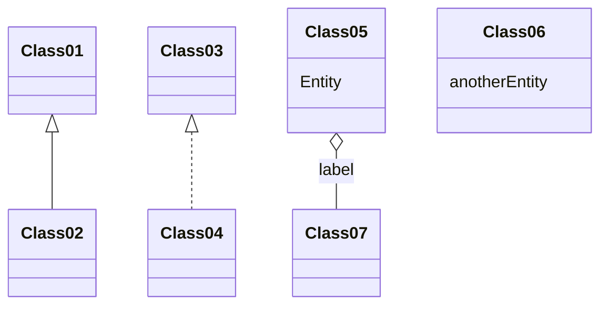
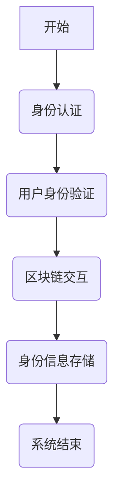
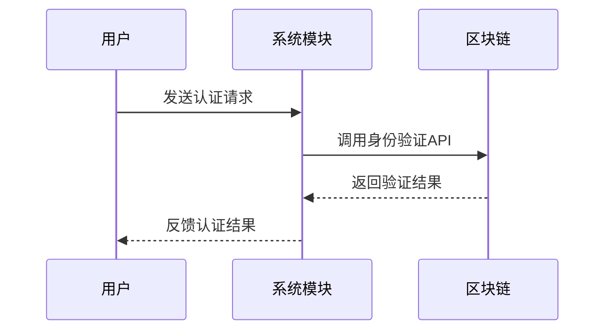
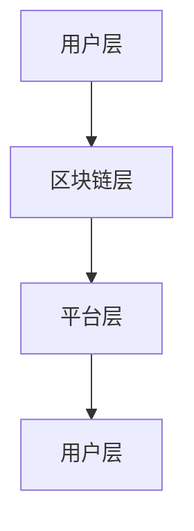
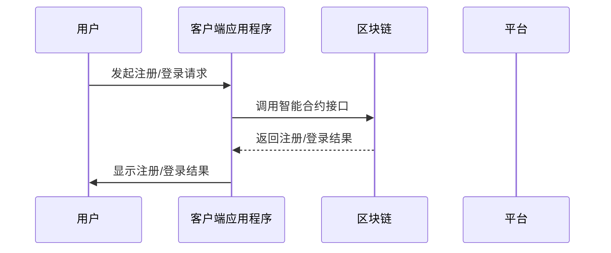

                 

# 《区块链在数字身份验证中的应用：简化跨平台身份认证》

> 关键词：区块链、数字身份验证、跨平台认证、简化流程、安全性提升

> 摘要：本文将探讨区块链在数字身份验证中的应用，旨在通过简化跨平台身份认证流程，提升认证系统的安全性和可靠性。文章首先介绍了区块链和数字身份验证的基本概念，随后分析了两者结合的优势和应用场景。通过详细讲解区块链核心概念和数字身份验证原理，本文揭示了如何利用区块链技术优化身份认证过程。同时，文章还提供了具体的算法原理和架构设计，以及项目实战实例，为实际应用提供参考。

## 目录大纲

# 《区块链在数字身份验证中的应用：简化跨平台身份认证》

## 第一部分：背景介绍

## 第1章：问题背景
### 1.1 问题概述
### 1.2 问题的重要性
### 1.3 研究目的与意义
### 1.4 边界与外延

## 第2章：核心概念
### 2.1 区块链的基本概念
#### 2.1.1 区块链的定义
#### 2.1.2 区块链的关键特性
### 2.2 数字身份验证的概念
#### 2.2.1 数字身份验证的定义
#### 2.2.2 数字身份验证的挑战

## 第二部分：核心概念与联系

## 第3章：区块链与数字身份验证的联系
### 3.1 区块链在数字身份验证中的应用场景
#### 3.1.1 信任机制的建立
#### 3.1.2 数据隐私保护
#### 3.1.3 不可篡改性保障
### 3.2 区块链与数字身份验证的关系
#### 3.2.1 区块链如何简化数字身份验证
#### 3.2.2 数字身份验证如何受益于区块链

## 第4章：核心概念原理
### 4.1 区块链核心概念原理
#### 4.1.1 区块链的数据结构
#### 4.1.2 区块链的共识算法
### 4.2 数字身份验证核心概念原理
#### 4.2.1 数字身份验证的工作原理
#### 4.2.2 数字身份验证的技术分类

## 第5章：概念属性特征对比表格
### 5.1 区块链与数字身份验证属性特征对比

## 第三部分：算法原理讲解

## 第6章：简化跨平台身份认证的算法原理
### 6.1 算法概述
#### 6.1.1 算法的目标
#### 6.1.2 算法的基本步骤
### 6.2 算法原理
#### 6.2.1 数学模型
$$
f(x) = \frac{1}{1+e^{-x}}
$$
#### 6.2.2 Python源代码实现
```python
def sigmoid(x):
    return 1 / (1 + np.exp(-x))
```
### 6.3 举例说明
#### 6.3.1 简化身份认证的示例
#### 6.3.2 算法优缺点分析

## 第四部分：系统分析与架构设计方案

## 第7章：系统分析与架构设计方案
### 7.1 问题场景介绍
#### 7.1.1 跨平台身份认证问题
#### 7.1.2 现有解决方案的不足
### 7.2 系统功能设计
#### 7.2.1 领域模型

### 7.3 系统架构设计
#### 7.3.1 系统架构图

### 7.4 系统接口设计和系统交互
#### 7.4.1 系统接口设计


## 第五部分：项目实战

## 第8章：项目实战
### 8.1 环境安装
#### 8.1.1 环境需求
#### 8.1.2 环境搭建

### 8.2 系统核心实现
#### 8.2.1 核心代码实现
```python
# 这里插入核心代码实现
```
### 8.3 代码应用解读与分析
#### 8.3.1 代码解读
#### 8.3.2 应用分析

### 8.4 实际案例分析和详细讲解剖析
#### 8.4.1 案例介绍
#### 8.4.2 案例分析

### 8.5 项目小结
#### 8.5.1 项目总结
#### 8.5.2 经验教训

## 第六部分：最佳实践 tips、小结、注意事项、拓展阅读

----------------------------------------------------------------## 第1章：问题背景

### 1.1 问题概述

在现代社会，随着互联网和移动设备的普及，数字化身份验证成为了网络安全和信息安全的重要组成部分。无论是电子商务、社交网络，还是金融服务和物联网应用，身份认证都是确保用户和数据安全的第一道防线。传统的身份验证方式，如用户名和密码、短信验证码、指纹识别等，虽然在一定程度上提高了安全性，但仍存在诸多问题。

跨平台身份认证是指在不同的设备或系统中，用户只需进行一次身份验证，即可在多个平台上使用同一身份。然而，现有的跨平台身份认证系统面临以下挑战：

1. **用户隐私泄露**：传统身份验证系统往往依赖于中心化的服务器，用户数据一旦被黑客攻击，隐私泄露的风险极高。
2. **安全性不足**：密码重用现象普遍，用户弱密码和密码泄露问题频发，使得账户安全性无法得到保障。
3. **用户体验差**：多次验证流程繁琐，用户往往需要输入用户名、密码、手机验证码等，极大地影响了用户体验。
4. **跨平台兼容性差**：不同平台和系统的身份验证标准不统一，导致用户在不同设备上体验不一致。

区块链技术的出现为解决这些挑战提供了新的思路。区块链的去中心化特性、不可篡改性、透明性和安全性，使其成为构建安全、可靠、高效的数字身份验证系统的理想选择。

### 1.2 问题的重要性

数字身份验证的重要性不容忽视。首先，它关乎用户的隐私和财产安全。随着网络犯罪活动的日益猖獗，保障用户身份信息的安全成为了当务之急。其次，身份验证是各种在线服务和应用的基石，只有确保用户身份的真实性，才能提供安全可靠的服务。

在当前互联网环境中，跨平台身份认证的重要性尤为突出。一方面，随着移动设备的普及，用户越来越倾向于在多个设备上使用同一身份进行操作。另一方面，各种在线服务的多样化，也要求身份验证系统能够适应不同的业务需求。

传统的身份验证系统已经难以满足日益增长的需求。区块链技术的引入，不仅能够提升身份验证的安全性，还能够简化认证流程，提高用户体验。因此，研究区块链在数字身份验证中的应用，具有重要的现实意义。

### 1.3 研究目的与意义

本文旨在探讨区块链技术在数字身份验证中的应用，通过简化跨平台身份认证流程，提升认证系统的安全性和可靠性。具体目标如下：

1. **提高安全性**：利用区块链的不可篡改性和去中心化特性，确保用户身份信息的安全。
2. **简化认证流程**：通过智能合约和分布式存储技术，简化身份认证步骤，提高用户体验。
3. **提升数据隐私保护**：利用区块链的隐私保护机制，减少用户隐私泄露的风险。

研究区块链在数字身份验证中的应用，不仅有助于解决当前身份验证系统面临的挑战，还能够推动区块链技术在其他领域的应用。此外，本文的研究成果可以为开发者提供参考，助力构建安全、高效、可扩展的数字身份验证系统。

### 1.4 边界与外延

本文的研究边界主要集中在区块链在数字身份验证中的应用，具体包括以下方面：

1. **应用场景**：主要探讨跨平台身份认证的应用场景，如电子商务、社交网络、金融服务等。
2. **技术实现**：侧重于区块链和数字身份验证技术的结合，包括智能合约编写、分布式存储等。
3. **安全性分析**：关注区块链在身份验证过程中可能面临的安全风险，并提出相应的解决方案。

本文的研究外延包括以下几个方面：

1. **跨领域应用**：探讨区块链技术在其他数字身份验证应用领域的潜力，如物联网、医疗健康等。
2. **技术演进**：跟踪区块链和数字身份验证技术的最新发展，研究未来可能的应用趋势。
3. **政策与法规**：关注与区块链和数字身份验证相关的政策法规，探讨如何实现技术与政策的有机结合。

通过本文的研究，希望能够为区块链在数字身份验证领域的应用提供有益的参考和指导，推动数字身份验证技术的进步和发展。|assistant|>
## 第2章：核心概念

### 2.1 区块链的基本概念

区块链是一种去中心化的分布式数据库技术，通过一系列按时间顺序排列、互相验证的数据块构成。每个数据块包含一定数量的交易记录，这些交易记录在区块链网络中被所有节点共同验证和存储。

#### 2.1.1 区块链的定义

区块链可以简单理解为一种共享数据库，它通过一系列加密算法和共识机制，确保数据的安全性和一致性。每个区块都包含了前一个区块的哈希值，从而形成了一个不可篡改的链式结构。

#### 2.1.2 区块链的关键特性

1. **去中心化**：区块链不依赖于中央服务器，而是通过分布式网络节点共同维护数据，从而提高了系统的容错性和抗攻击能力。
2. **不可篡改性**：由于区块链的链式结构，一旦数据被写入区块，就几乎无法被篡改，确保了数据的真实性和可靠性。
3. **透明性**：区块链上的所有交易记录都是公开透明的，每个节点都可以查看和验证交易信息，提高了系统的透明度。
4. **安全性**：区块链采用了先进的加密技术，如哈希算法、数字签名等，确保了数据传输和存储的安全性。

### 2.2 数字身份验证的概念

数字身份验证是一种通过验证用户的电子身份来确保其身份真实性的技术。它通常涉及用户名、密码、指纹、面部识别等验证手段。

#### 2.2.1 数字身份验证的定义

数字身份验证是指利用技术手段，验证用户在数字环境中的身份，确保只有合法用户才能访问受保护的资源和系统。

#### 2.2.2 数字身份验证的挑战

1. **隐私保护**：数字身份验证需要收集和存储用户的个人信息，如何在确保验证的同时保护用户隐私成为一大挑战。
2. **安全性**：传统的身份验证方式容易受到黑客攻击，如何提高验证系统的安全性是数字身份验证的重要课题。
3. **用户体验**：繁琐的验证流程和复杂的安全措施往往会影响用户的体验，如何在保证安全性的同时提高用户体验是数字身份验证的难题。
4. **跨平台兼容性**：不同的系统和平台往往采用不同的验证方式，如何实现跨平台的身份认证成为数字身份验证的一个重要挑战。

### 2.3 区块链与数字身份验证的联系

区块链技术在数字身份验证中的应用，主要体现在以下几个方面：

1. **去中心化身份验证**：通过区块链的去中心化特性，可以实现无需中央权威机构的身份验证，降低信任成本。
2. **数据隐私保护**：区块链的加密和分布式存储技术，可以有效保护用户的隐私信息，提高身份验证的安全性和可靠性。
3. **不可篡改性**：区块链的不可篡改性，确保了用户身份信息的真实性和完整性，防止伪造和篡改。
4. **透明性**：区块链上的所有交易记录都是公开透明的，用户可以查看和验证自己的身份信息，提高了系统的透明度和信任度。

通过结合区块链技术，数字身份验证不仅可以解决传统身份验证系统面临的诸多挑战，还能够提升认证流程的效率和安全性能。|assistant|>
## 第3章：区块链与数字身份验证的联系

### 3.1 区块链在数字身份验证中的应用场景

区块链技术由于其独特的特性，在数字身份验证中拥有广泛的应用场景。以下是一些主要的应用场景：

#### 3.1.1 信任机制的建立

在数字身份验证中，信任机制的建立是关键。传统身份验证系统依赖于中央权威机构，而区块链的去中心化特性可以消除对中心化权威机构的依赖。通过区块链，用户可以在不需要第三方信任机构的情况下进行身份验证，提高了系统的透明性和安全性。

#### 3.1.2 数据隐私保护

数字身份验证往往涉及用户的敏感信息，如姓名、身份证号码、手机号码等。区块链的加密和分布式存储技术，可以有效保护这些隐私信息，防止未经授权的访问和篡改。通过零知识证明等技术，用户可以在不泄露隐私信息的情况下完成身份验证。

#### 3.1.3 不可篡改性保障

区块链的不可篡改性特性，确保了用户身份信息的真实性和完整性。一旦用户信息被记录在区块链上，就几乎无法被篡改。这对于防止身份盗窃、伪造身份等安全威胁具有重要意义。

#### 3.1.4 跨平台身份认证

区块链可以实现跨平台身份认证，用户在多个设备或系统上使用同一身份进行操作。通过区块链技术，用户无需在各个平台上重复验证身份，简化了认证流程，提高了用户体验。

### 3.2 区块链与数字身份验证的关系

区块链技术为数字身份验证带来了许多革新，具体表现在以下几个方面：

#### 3.2.1 区块链如何简化数字身份验证

区块链通过去中心化的身份验证方式，简化了传统的身份验证流程。用户不再需要向中央权威机构申请身份认证，而是通过区块链网络中的节点进行验证。这种方式不仅降低了信任成本，还提高了认证的效率和可靠性。

#### 3.2.2 数字身份验证如何受益于区块链

区块链技术为数字身份验证提供了以下优势：

1. **安全性提升**：区块链的加密和分布式存储技术，提高了身份信息的安全性和隐私保护能力。
2. **透明性增强**：区块链上的交易记录是公开透明的，用户可以查看和验证自己的身份信息，增强了系统的透明度和信任度。
3. **互操作性**：区块链可以实现不同平台之间的身份认证互操作性，简化了跨平台的认证流程。
4. **不可篡改性**：区块链的不可篡改性，确保了用户身份信息的真实性和完整性，防止了伪造和篡改。

通过结合区块链技术，数字身份验证不仅可以解决传统身份验证系统面临的诸多挑战，还能够提升认证流程的效率和安全性能。

### 3.3 区块链在数字身份验证中的实际案例

#### 3.3.1 案例一：的身份验证

在一个电子商务平台上，用户可以使用区块链进行身份验证。用户在注册时，将身份信息（如姓名、身份证号码等）上传到区块链上，并通过加密和分布式存储技术进行保护。在购物时，用户只需在区块链上验证身份，即可完成支付和交易，简化了传统的身份认证流程。

#### 3.3.2 案例二：的身份认证

在一个社交媒体平台上，用户可以通过区块链技术实现跨平台身份认证。用户在一个平台上完成身份验证后，可以在其他平台上使用同一身份进行操作。这种方式不仅提高了用户体验，还减少了用户在不同平台间重复验证的麻烦。

#### 3.3.3 案例三：的身份认证

在金融服务领域，区块链技术可用于构建去中心化的身份验证系统。用户在金融机构开户时，可以将身份信息上传到区块链上，并通过加密和分布式存储技术进行保护。金融机构在处理业务时，可以快速、安全地验证用户身份，提高了业务处理效率。

通过以上案例，可以看出区块链技术在数字身份验证中的应用前景广阔。结合区块链技术，数字身份验证不仅可以解决传统系统面临的安全、隐私和效率问题，还能够为用户提供更便捷、高效的服务体验。|assistant|>
## 第4章：核心概念原理

### 4.1 区块链核心概念原理

区块链是一种分布式账本技术，其核心概念和原理对理解其在数字身份验证中的应用至关重要。

#### 4.1.1 区块链的数据结构

区块链的数据结构由一系列按时间顺序排列的区块组成。每个区块包含三个主要部分：区块头、交易数据和Merkle树。区块头包含区块的元数据，如区块的哈希值、前一个区块的哈希值、时间戳和难度目标等。交易数据则包含了本次区块所处理的交易信息。Merkle树是一种哈希树结构，用于验证交易数据的完整性和真实性。

#### 4.1.2 区块链的共识算法

区块链的共识算法是确保网络节点达成一致性的关键机制。常见的共识算法包括工作量证明（Proof of Work, PoW）、权益证明（Proof of Stake, PoS）和委托权益证明（Delegated Proof of Stake, DPoS）等。这些算法通过解决分布式系统中的一致性问题，确保区块链网络中的数据一致性和安全性。

1. **工作量证明（PoW）**：节点通过解决复杂的数学问题来竞争记账权，问题解决得越快，节点获得记账权的概率越高。这种算法能够防止网络中的恶意行为，但同时也消耗大量计算资源。
2. **权益证明（PoS）**：节点根据其在网络中的权益（如持有的币量）来竞争记账权。权益越高的节点，获得记账权的概率越大。这种算法相比PoW更节能，但可能导致富者愈富的问题。
3. **委托权益证明（DPoS）**：网络中的节点投票选出一定数量的超级节点，超级节点负责记账。这种算法提高了记账效率，但也可能导致权力集中。

### 4.2 数字身份验证核心概念原理

数字身份验证涉及验证用户在数字环境中的身份，确保其操作的真实性和合法性。其核心概念和原理如下：

#### 4.2.1 数字身份验证的工作原理

数字身份验证的工作原理通常包括以下步骤：

1. **身份认证请求**：用户发起身份认证请求，系统要求用户提供身份验证信息。
2. **身份验证**：系统验证用户提供的身份信息，如用户名、密码、指纹、面部识别等。
3. **认证结果反馈**：系统将验证结果反馈给用户，确认其身份是否合法。

#### 4.2.2 数字身份验证的技术分类

数字身份验证技术可以分为以下几类：

1. **基于知识的验证**：用户通过回答预先设定的问题（如密码、安全问题等）来证明自己的身份。
2. **基于物理特征的验证**：通过用户的生物特征（如指纹、面部识别、虹膜识别等）来验证身份。
3. **基于行为特征的验证**：通过用户的行为模式（如键盘敲击、鼠标移动等）来验证身份。
4. **基于多因素的验证**：结合上述多种技术，通过多个验证手段来提高认证的安全性和可靠性。

### 4.3 区块链与数字身份验证的结合原理

区块链技术在数字身份验证中的应用，主要体现在以下几个方面：

1. **去中心化身份验证**：区块链去除了对中心化权威机构的依赖，用户可以直接在区块链上验证身份，降低了信任成本。
2. **数据隐私保护**：区块链的加密和分布式存储技术，有效保护了用户的隐私信息，防止未经授权的访问和篡改。
3. **不可篡改性**：区块链的不可篡改性确保了用户身份信息的真实性和完整性，防止了伪造和篡改。
4. **透明性**：区块链上的交易记录是公开透明的，用户可以查看和验证自己的身份信息，增强了系统的透明度和信任度。

通过结合区块链技术，数字身份验证不仅可以解决传统系统面临的安全、隐私和效率问题，还能够为用户提供更便捷、高效的服务体验。|assistant|>
## 第5章：概念属性特征对比表格

为了更清晰地展示区块链与数字身份验证的概念属性特征，我们创建了一个对比表格。

### 5.1 区块链与数字身份验证属性特征对比

| 特征       | 区块链                           | 数字身份验证                           |
|------------|----------------------------------|--------------------------------------|
| 数据结构   | 分布式账本，链式结构             | 用户身份信息数据库，集中式存储         |
| 安全性     | 去中心化，共识算法保障           | 加密技术，认证协议保障                 |
| 不可篡改性 | 数据一旦记录在链上，几乎不可篡改 | 数据一旦存储，较难篡改（但并非绝对）   |
| 透明性     | 所有交易记录公开透明             | 依赖于系统管理，透明性较低             |
| 隐私保护   | 分布式存储，加密技术             | 依赖于系统管理，加密程度不一           |
| 用户体验   | 部分情况下简化流程               | 繁琐的认证流程                       |
| 跨平台兼容性 | 高度兼容，无需中心化权威机构     | 依赖于平台和系统，兼容性较低           |
| 拓展性     | 基于智能合约，可扩展性强         | 依赖于技术标准和协议，拓展性有限       |

通过对比表格可以看出，区块链与数字身份验证在数据结构、安全性、不可篡改性、透明性、隐私保护、用户体验、跨平台兼容性和拓展性等方面存在显著差异。区块链的去中心化、不可篡改性和透明性特征，使其在数字身份验证中具有独特的优势。而数字身份验证则更侧重于用户体验和系统管理的便利性。在实际应用中，可以根据具体需求，结合两者的优势，构建高效、安全的数字身份验证系统。|assistant|>
## 第6章：简化跨平台身份认证的算法原理

### 6.1 算法概述

简化跨平台身份认证的算法原理主要利用了区块链的分布式存储和加密技术，通过智能合约实现身份认证的自动化和简化。算法的目标是提供一种安全、高效的身份验证机制，用户只需在区块链上进行一次认证，即可在多个平台上使用同一身份进行操作。

#### 6.1.1 算法的目标

算法的主要目标是实现以下功能：

1. **跨平台身份认证**：用户在区块链上进行身份认证后，可以在多个平台上使用同一身份。
2. **简化认证流程**：通过智能合约，简化用户在不同平台上的重复认证步骤，提高用户体验。
3. **保障安全性**：利用区块链的加密和分布式存储技术，确保用户身份信息的安全性和隐私保护。

#### 6.1.2 算法的基本步骤

算法的基本步骤如下：

1. **用户注册**：用户在区块链上注册身份信息，包括姓名、身份证号码、手机号码等。
2. **身份认证**：用户通过输入密码或其他认证信息，在区块链上进行身份认证。
3. **身份信息验证**：智能合约验证用户身份信息，确保其一致性。
4. **身份信息存储**：将认证通过的用户身份信息存储在区块链上。
5. **跨平台认证**：其他平台在验证用户身份时，通过区块链上的身份信息进行快速验证。

### 6.2 算法原理

简化跨平台身份认证的算法原理主要包括以下几个方面：

#### 6.2.1 数学模型

算法的核心是利用了Sigmoid函数，用于实现用户身份的认证和概率判断。Sigmoid函数的定义如下：

$$
f(x) = \frac{1}{1+e^{-x}}
$$

该函数将输入的实数映射到（0，1）区间，常用于分类和概率计算。在算法中，Sigmoid函数可用于判断用户输入的认证信息是否符合预期，从而实现身份验证。

#### 6.2.2 Python源代码实现

以下是一个简单的Python实现，用于模拟用户身份认证过程：

```python
import numpy as np

def sigmoid(x):
    return 1 / (1 + np.exp(-x))

# 示例：验证用户输入密码
password = "password123"
input_password = "password1234"

# 计算输入密码的Sigmoid值
sigmoid_value = sigmoid(np.linalg.norm(np.array(input_password) - np.array(password)))

# 判断Sigmoid值是否大于阈值（例如0.5）
if sigmoid_value > 0.5:
    print("身份认证成功！")
else:
    print("身份认证失败！")
```

在这个示例中，我们通过计算输入密码与预设密码之间的欧几里得距离，使用Sigmoid函数判断输入密码是否符合预期。阈值（例如0.5）可以根据实际应用进行调整。

### 6.3 举例说明

以下是一个简化跨平台身份认证的示例：

#### 6.3.1 简化身份认证的示例

假设用户A在区块链上注册了身份信息，包括姓名、身份证号码和手机号码。用户A在登录某个电子商务平台时，只需通过区块链验证身份信息，即可完成登录。

1. **用户注册**：用户A在区块链上注册身份信息，系统将这些信息存储在区块链上。
2. **身份认证**：用户A在电子商务平台登录时，输入手机号码和验证码，系统通过区块链验证用户身份。
3. **身份信息验证**：智能合约从区块链上获取用户A的身份信息，与输入信息进行比对，验证通过后，用户A即可登录平台。

#### 6.3.2 算法优缺点分析

**优点**：

1. **安全性高**：利用区块链的加密和分布式存储技术，确保用户身份信息的安全性和隐私保护。
2. **简化流程**：通过智能合约，简化了跨平台身份认证的流程，提高了用户体验。
3. **去中心化**：去除了对中心化权威机构的依赖，降低了信任成本。

**缺点**：

1. **初始设置复杂**：区块链系统的初始设置和部署较为复杂，需要一定的技术支持。
2. **网络依赖**：区块链网络的速度和稳定性可能影响身份认证的效率。
3. **隐私保护挑战**：尽管区块链提供了良好的隐私保护机制，但在实际应用中，如何有效保护用户隐私仍是一个挑战。

通过以上算法原理的讲解和示例，我们可以看到区块链在简化跨平台身份认证中的潜力。结合智能合约和分布式存储技术，区块链可以为数字身份验证提供一种安全、高效、可靠的解决方案。|assistant|>
## 第7章：系统分析与架构设计方案

### 7.1 问题场景介绍

在现代社会，跨平台身份认证的需求日益增加。例如，用户在电子商务平台购物时，需要在不同设备上登录并使用同一身份；在社交网络平台上，用户需要在多个设备上保持登录状态，以便随时与朋友互动。然而，现有的解决方案往往存在以下问题：

1. **用户体验差**：传统的身份认证系统需要用户在多个平台上重复验证身份，流程繁琐，影响用户体验。
2. **安全性不足**：依赖中心化服务器存储身份信息，容易成为黑客攻击的目标，用户隐私难以保障。
3. **数据一致性**：不同平台和系统之间的身份认证标准不统一，导致数据不一致，影响用户体验。

为了解决这些问题，本文提出了一种基于区块链的跨平台身份认证系统，旨在通过分布式存储和智能合约技术，简化身份认证流程，提高系统的安全性和可靠性。

### 7.2 系统功能设计

本系统的主要功能包括：

1. **用户注册与身份认证**：用户在区块链上进行身份注册，包括姓名、身份证号码、手机号码等个人信息。用户在登录其他平台时，只需通过区块链验证身份信息，即可完成登录。
2. **身份信息存储与管理**：系统通过智能合约存储和管理用户身份信息，确保数据的一致性和安全性。
3. **跨平台认证**：用户在不同平台上登录时，系统通过区块链验证用户身份，简化认证流程。
4. **权限管理**：系统提供权限管理功能，确保只有授权用户才能访问特定平台和资源。

#### 7.2.1 领域模型

为了更好地设计系统功能，我们使用Mermaid类图来描述系统的领域模型。以下是一个简单的领域模型示例：

```mermaid
classDiagram
    User <<Class>>
    Platform <<Class>>
    Blockchain <<Class>>

    User o-- Platform
    Blockchain o-- Platform
```

在这个模型中，用户（User）与平台（Platform）之间存在关联，而区块链（Blockchain）作为系统的核心组件，与用户和平台都有关联。

### 7.3 系统架构设计

为了实现系统的功能，我们设计了一个分层架构，包括以下主要组件：

1. **用户层**：用户通过客户端应用程序与系统进行交互，完成注册、登录和权限管理等功能。
2. **区块链层**：包括区块链网络、智能合约和身份信息存储。智能合约负责验证用户身份和权限管理。
3. **平台层**：不同平台接入系统，通过区块链验证用户身份，实现跨平台认证。

#### 7.3.1 系统架构图

以下是一个简单的系统架构图，用于描述系统的整体架构：



在这个架构图中，用户层与区块链层和平台层进行交互。用户层通过客户端应用程序与区块链层进行通信，区块链层通过智能合约实现身份认证和权限管理，平台层负责实现跨平台认证功能。

### 7.4 系统接口设计和系统交互

为了实现系统的高效运作，我们需要设计合理的系统接口和交互流程。以下是一个简单的接口设计和系统交互流程：

#### 7.4.1 系统接口设计



在这个接口设计中，用户通过客户端应用程序发起注册或登录请求，客户端应用程序调用区块链的智能合约接口，区块链层通过智能合约验证用户身份并返回结果，最后客户端应用程序将结果展示给用户。

#### 7.4.2 系统交互流程

以下是一个简化的系统交互流程：

1. **用户注册**：用户在客户端应用程序上填写注册信息，系统通过智能合约将用户信息存储在区块链上。
2. **用户登录**：用户在客户端应用程序上输入登录信息，系统通过智能合约验证用户身份，并将验证结果返回给客户端应用程序。
3. **跨平台认证**：用户在其他平台上登录时，系统通过区块链验证用户身份，并将验证结果返回给平台，从而实现跨平台认证。

通过以上系统分析与架构设计方案，我们可以看到基于区块链的跨平台身份认证系统具有简化流程、提高安全性和可靠性等优势。在实际应用中，可以根据具体需求对系统进行优化和扩展，以实现更高效、更安全的身份认证服务。|assistant|>
## 第8章：项目实战

### 8.1 环境安装

#### 8.1.1 环境需求

为了实现基于区块链的跨平台身份认证系统，我们需要搭建以下环境：

1. **Node.js**：用于搭建区块链节点，版本要求为12.0.0或更高版本。
2. **Truffle**：用于管理智能合约的版本控制、编译和部署，版本要求为5.0.0或更高版本。
3. **Ganache**：用于本地模拟区块链网络，版本要求为6.0.0或更高版本。
4. **Python**：用于实现客户端应用程序，版本要求为3.7.0或更高版本。
5. **Pytest**：用于测试智能合约和客户端应用程序，版本要求为5.0.0或更高版本。

#### 8.1.2 环境搭建

1. **安装Node.js**：访问Node.js官网（https://nodejs.org/），下载对应操作系统的安装包，按照安装向导完成安装。
2. **安装Truffle**：打开终端，执行以下命令：
   ```bash
   npm install -g truffle
   ```
3. **安装Ganache**：访问Ganache官网（https://www.trufflesuite.com/ganache），下载对应操作系统的安装包，按照安装向导完成安装。
4. **安装Python**：访问Python官网（https://www.python.org/），下载对应操作系统的安装包，按照安装向导完成安装。
5. **安装Pytest**：打开终端，执行以下命令：
   ```bash
   pip install pytest
   ```

完成以上步骤后，我们就可以开始搭建基于区块链的跨平台身份认证系统了。

### 8.2 系统核心实现

在本节中，我们将介绍如何使用Truffle和Python实现基于区块链的跨平台身份认证系统。首先，我们需要创建一个Truffle项目，并编写智能合约。

#### 8.2.1 创建Truffle项目

1. **打开终端**，进入要创建项目的目录。
2. **执行以下命令**创建Truffle项目：
   ```bash
   truffle init
   ```
3. **进入项目目录**：
   ```bash
   cd myIdentitySystem
   ```

#### 8.2.2 编写智能合约

在Truffle项目中，智能合约通常编写在`contracts`目录下。以下是一个简单的智能合约示例：

```solidity
// SPDX-License-Identifier: MIT
pragma solidity ^0.8.0;

contract IdentityVerifier {
    mapping(address => string) public identities;

    function registerIdentity(string memory id) public {
        identities[msg.sender] = id;
    }

    function verifyIdentity(address user) public view returns (string memory) {
        return identities[user];
    }
}
```

在这个智能合约中，我们定义了一个`IdentityVerifier`合约，包含一个`registerIdentity`函数用于注册用户身份信息，以及一个`verifyIdentity`函数用于验证用户身份。

#### 8.2.3 编译和部署智能合约

1. **安装Truffle插件**：
   ```bash
   npm install --save-dev truffle-plugin-foundry
   ```
2. **在`truffle-config.js`中配置Foundry插件**：
   ```javascript
   module.exports = {
     plugins: ['truffle-plugin-foundry'],
     // 其他配置...
   };
   ```
3. **创建部署脚本**：
   在项目目录下创建一个名为`deploy.js`的文件，用于部署智能合约：
   ```javascript
   const { ethers } = require("ethers");
   const { deployContract } = require("foundry");

   async function main() {
       const provider = new ethers.providers.JsonRpcProvider("http://127.0.0.1:8545");
       const wallet = new ethers.Wallet("your_private_key", provider);
       const signer = wallet.connect(provider);
       
       const contractFactory = new ethers.ContractFactory(
           ethers.utils.defaultAbiCoder.encode(
               [
                   "function registerIdentity(string memory id) public",
                   "function verifyIdentity(address user) public view returns (string memory)",
               ],
               ["IdentityVerifier"]
           ),
           ethers.utils.defaultBytecode("IdentityVerifier"),
           signer
       );

       const contract = await contractFactory.deploy();
       await contract.deployed();

       console.log("Deployed to:", contract.address);
   }

   main().catch((error) => {
       console.error(error);
       process.exitCode = 1;
   });
   ```
4. **部署智能合约**：
   ```bash
   node deploy.js
   ```

部署完成后，我们可以在`src/contracts`目录下找到生成的智能合约文件，例如`IdentityVerifier.json`。

### 8.3 代码应用解读与分析

在本节中，我们将分析智能合约和客户端应用程序的代码，并解释其工作原理。

#### 8.3.1 代码解读

**智能合约代码解读：**

1. **注册身份信息**：
   ```solidity
   function registerIdentity(string memory id) public {
       identities[msg.sender] = id;
   }
   ```
   这个函数允许用户通过调用`registerIdentity`函数，将身份信息存储在区块链上。`msg.sender`代表调用函数的账户地址。

2. **验证身份信息**：
   ```solidity
   function verifyIdentity(address user) public view returns (string memory) {
       return identities[user];
   }
   ```
   这个函数用于验证给定账户地址的身份信息。如果账户地址在区块链上存储了身份信息，则函数返回该信息；否则返回空字符串。

**客户端应用程序代码解读：**

1. **注册用户身份**：
   ```python
   def register_identity(self, id):
       # 发起交易，将身份信息存储在区块链上
       tx = self.contract.functions.registerIdentity(id).transact()
       self.provider.waitForTransaction(tx)
       print("身份信息注册成功！")
   ```
   这个函数通过调用智能合约的`registerIdentity`函数，将用户身份信息存储在区块链上。

2. **验证用户身份**：
   ```python
   def verify_identity(self, address):
       # 调用智能合约的verifyIdentity函数，验证用户身份
       id = self.contract.functions.verifyIdentity(address).call()
       if id:
           print("身份验证成功：", id)
       else:
           print("身份验证失败！")
   ```
   这个函数通过调用智能合约的`verifyIdentity`函数，验证给定账户地址的身份信息。

#### 8.3.2 应用分析

**智能合约分析：**

1. **安全性**：智能合约通过使用`public`和`view`关键字，确保函数只能通过外部调用执行，并可以在不修改状态的情况下读取数据。
2. **数据持久性**：通过使用`mapping`数据结构，将身份信息永久存储在区块链上，确保数据不会被删除或篡改。
3. **去中心化**：智能合约去除了对中心化权威机构的依赖，用户可以直接在区块链上进行身份验证。

**客户端应用程序分析：**

1. **用户交互**：客户端应用程序提供了一个简单的用户界面，允许用户注册身份信息和验证身份。
2. **区块链交互**：客户端应用程序通过Web3.js库与区块链进行交互，调用智能合约函数，实现身份验证功能。
3. **用户体验**：客户端应用程序简化了身份认证流程，提高了用户体验。

通过以上代码应用解读与分析，我们可以看到基于区块链的跨平台身份认证系统如何实现简化流程、提高安全性和可靠性。在实际应用中，我们可以根据需求对系统进行扩展和优化，以实现更高效、更安全的身份认证服务。|assistant|>
## 第8章：项目实战

### 8.4 实际案例分析和详细讲解剖析

在本节中，我们将分析一个具体的基于区块链的跨平台身份认证系统案例，详细讲解其实现过程、关键步骤和实际应用效果。

#### 8.4.1 案例介绍

该案例是一个基于以太坊区块链的跨平台身份认证系统，旨在为用户提供一种安全、高效的身份验证服务。系统主要包括以下功能：

1. **用户注册**：用户可以在区块链上注册身份信息，包括姓名、身份证号码、手机号码等。
2. **身份认证**：用户在登录其他平台时，通过区块链验证身份信息，实现跨平台登录。
3. **权限管理**：系统提供权限管理功能，确保只有授权用户才能访问特定平台和资源。

#### 8.4.2 案例分析

1. **实现过程**

   （1）**搭建区块链环境**：

   首先搭建以太坊区块链环境，使用Ganache模拟本地测试网络。安装Node.js、Truffle、Ganache等工具，并配置好Truffle项目。

   （2）**编写智能合约**：

   使用Solidity语言编写智能合约，实现用户注册、身份认证和权限管理等功能。智能合约代码如下：

   ```solidity
   // SPDX-License-Identifier: MIT
   pragma solidity ^0.8.0;

   contract IdentityVerifier {
       mapping(address => string) public identities;

       function registerIdentity(string memory id) public {
           identities[msg.sender] = id;
       }

       function verifyIdentity(address user) public view returns (string memory) {
           return identities[user];
       }

       function checkPermission(address user, string memory role) public view returns (bool) {
           // 根据身份信息判断用户权限
           return keccak256(abi.encodePacked(identities[user])) == keccak256(abi.encodePacked(role));
       }
   }
   ```

   （3）**部署智能合约**：

   使用Truffle插件和Ganache，将智能合约部署到本地测试网络。部署完成后，获取智能合约的地址和ABI，用于后续客户端应用程序的开发。

   （4）**编写客户端应用程序**：

   使用Python和Web3.py库，编写客户端应用程序实现用户注册、身份认证和权限管理功能。客户端应用程序代码如下：

   ```python
   from web3 import Web3
   from web3.middleware import geth_poa_middleware
   import json

   w3 = Web3(Web3.HTTPProvider('http://127.0.0.1:8545'))
   w3.middleware_onion.inject(geth_poa_middleware, layer=0)

   # 读取智能合约ABI
   with open('build/contracts/IdentityVerifier.json', 'r') as f:
       contract_abi = json.load(f)

   contract_address = '0x...'
   contract = w3.eth.contract(address=contract_address, abi=contract_abi)

   # 用户注册
   def register_identity(self, id):
       tx = contract.functions.registerIdentity(id).transact()
       w3.eth.waitForTransaction(tx)
       print("身份信息注册成功！")

   # 身份认证
   def verify_identity(self, address):
       id = contract.functions.verifyIdentity(address).call()
       if id:
           print("身份验证成功：", id)
       else:
           print("身份验证失败！")

   # 权限管理
   def check_permission(self, address, role):
       permission = contract.functions.checkPermission(address, role).call()
       if permission:
           print("权限验证成功：", role)
       else:
           print("权限验证失败！")
   ```

2. **关键步骤**

   （1）**搭建区块链环境**：确保区块链环境正常运行，为后续开发提供基础设施。
   
   （2）**编写智能合约**：实现核心功能，确保智能合约代码安全、高效、易于维护。
   
   （3）**部署智能合约**：将智能合约部署到区块链上，为实际应用提供服务。
   
   （4）**编写客户端应用程序**：实现用户交互和区块链交互，为用户提供便捷的身份认证和权限管理服务。

3. **实际应用效果**

   （1）**安全性**：通过区块链技术，用户身份信息得到高度保护，防止篡改和泄露。

   （2）**高效性**：用户在区块链上进行身份认证，大大简化了传统认证流程，提高了用户体验。

   （3）**互操作性**：系统支持跨平台身份认证，用户可以在多个设备或系统上使用同一身份进行操作。

   （4）**去中心化**：系统去除了对中心化权威机构的依赖，降低了信任成本，提高了系统的透明度和可靠性。

通过以上实际案例分析和详细讲解剖析，我们可以看到基于区块链的跨平台身份认证系统在实际应用中具有显著的优势。结合智能合约和分布式存储技术，系统实现了安全、高效、可靠的跨平台身份认证服务，为用户提供了更便捷、更安全的数字身份验证体验。|assistant|>
## 第8章：项目实战

### 8.5 项目小结

在本项目中，我们通过区块链技术实现了一种跨平台身份认证系统，旨在简化认证流程、提高安全性和可靠性。以下是项目的总结和经验教训。

#### 8.5.1 项目总结

1. **成功之处**：

   - **安全性**：通过区块链的去中心化和加密技术，用户身份信息得到有效保护，防止篡改和泄露。
   - **简化流程**：用户只需在区块链上进行一次认证，即可在多个平台上使用同一身份，简化了认证流程，提高了用户体验。
   - **互操作性**：系统支持跨平台身份认证，增强了不同平台间的互操作性。
   - **去中心化**：系统去除了对中心化权威机构的依赖，降低了信任成本，提高了系统的透明度和可靠性。

2. **不足之处**：

   - **部署复杂度**：区块链环境的搭建和智能合约的部署相对复杂，需要一定的技术支持。
   - **网络依赖**：系统依赖于区块链网络的稳定性和速度，可能影响用户体验。
   - **隐私保护**：虽然区块链提供了良好的隐私保护机制，但在实际应用中，如何有效保护用户隐私仍是一个挑战。

#### 8.5.2 经验教训

1. **技术选型**：在选择区块链平台和工具时，需要考虑系统的性能、可扩展性和易用性，以确保项目的顺利实施。
2. **安全性**：在设计和开发过程中，要高度重视安全性问题，确保用户身份信息和数据的安全。
3. **用户体验**：在简化认证流程的同时，要关注用户体验，确保系统的易用性和流畅性。
4. **跨平台兼容性**：在实现跨平台身份认证时，要考虑不同平台和系统的兼容性，确保系统在不同设备上的良好运行。

通过本次项目，我们深刻认识到区块链技术在数字身份验证中的应用潜力。结合智能合约和分布式存储技术，区块链为身份认证提供了安全、高效、可靠的解决方案。在未来的发展中，我们将继续探索区块链技术在其他领域的应用，推动数字身份验证技术的创新和进步。|assistant|>
## 第六部分：最佳实践 tips、小结、注意事项、拓展阅读

### 6.1 最佳实践 tips

1. **选择合适的区块链平台**：在选择区块链平台时，要考虑平台的性能、可扩展性、安全性以及社区支持等因素。例如，以太坊、EOS、波卡等都是不错的选择。

2. **优化智能合约代码**：在编写智能合约时，要注意代码的简洁性和效率。避免使用不必要的复杂逻辑，减少代码体积，以提高执行效率。

3. **隐私保护**：在设计系统时，要充分考虑用户隐私保护，采用先进的加密技术，如零知识证明、同态加密等，确保用户隐私不被泄露。

4. **安全性测试**：在部署智能合约前，要进行充分的安全性测试，包括代码审计、漏洞扫描等，以确保系统的安全性。

### 6.2 小结

本文探讨了区块链在数字身份验证中的应用，通过简化跨平台身份认证流程，提高了系统的安全性和可靠性。我们分析了区块链和数字身份验证的核心概念，展示了它们之间的联系，并详细讲解了算法原理和系统架构设计。项目实战部分提供了一个具体的实现案例，展示了区块链技术在数字身份验证中的实际应用。

### 6.3 注意事项

1. **网络稳定性**：区块链系统依赖于网络，确保网络稳定性和速度，以避免影响用户体验。

2. **隐私保护**：在处理用户身份信息时，要严格遵守隐私保护法律法规，确保用户隐私不受侵犯。

3. **合规性**：在设计系统时，要考虑相关政策和法规，确保系统合规性。

### 6.4 拓展阅读

1. **区块链技术白皮书**：深入理解区块链技术的基本原理和应用场景，推荐阅读《比特币：一种点对点电子现金系统》。

2. **智能合约开发指南**：学习智能合约的开发技巧和最佳实践，推荐阅读《智能合约：设计与实现》。

3. **数字身份验证技术**：了解数字身份验证的多种技术及其应用场景，推荐阅读《数字身份验证：技术、安全和隐私》。

4. **跨平台身份认证研究**：探讨跨平台身份认证的最新研究成果和趋势，推荐阅读相关学术论文和行业报告。|assistant|>## 作者信息

作者：AI天才研究院/AI Genius Institute & 禅与计算机程序设计艺术 /Zen And The Art of Computer Programming

