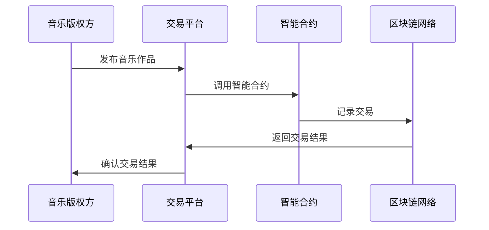
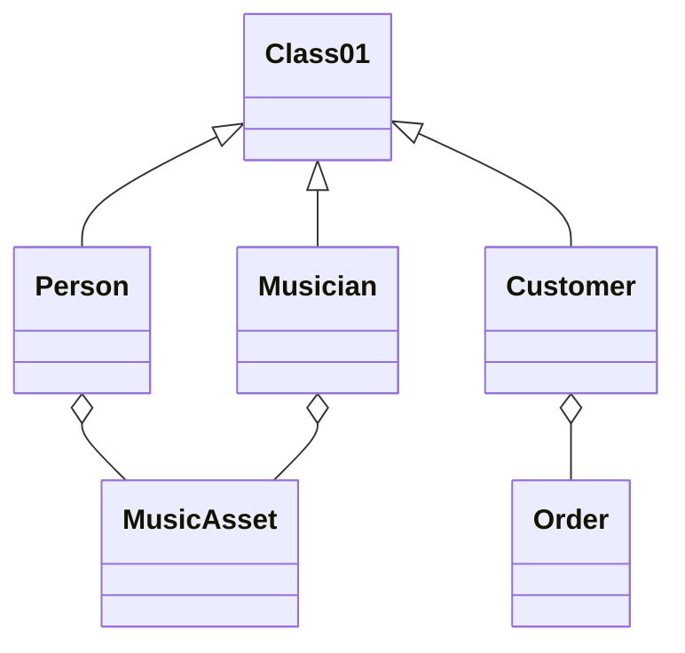
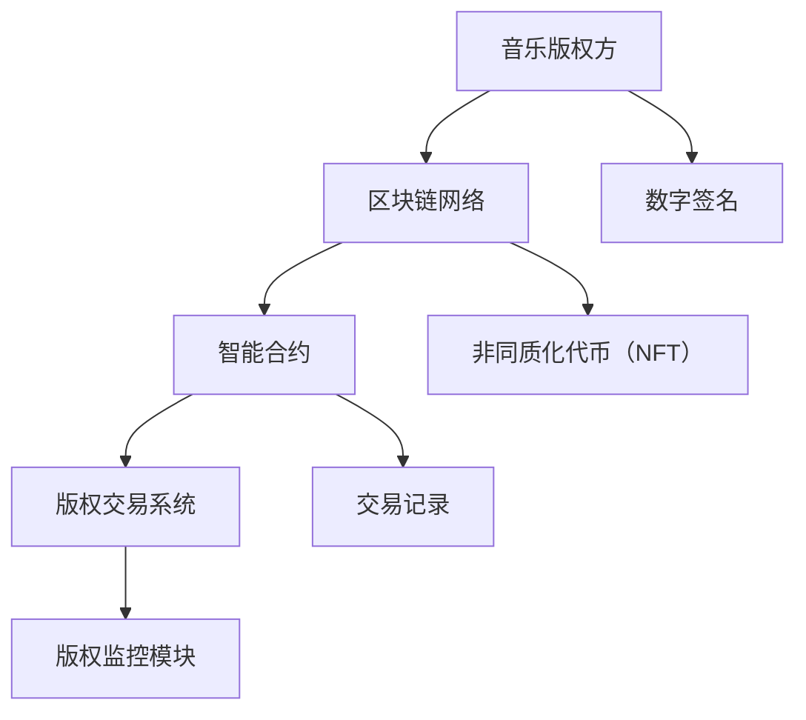
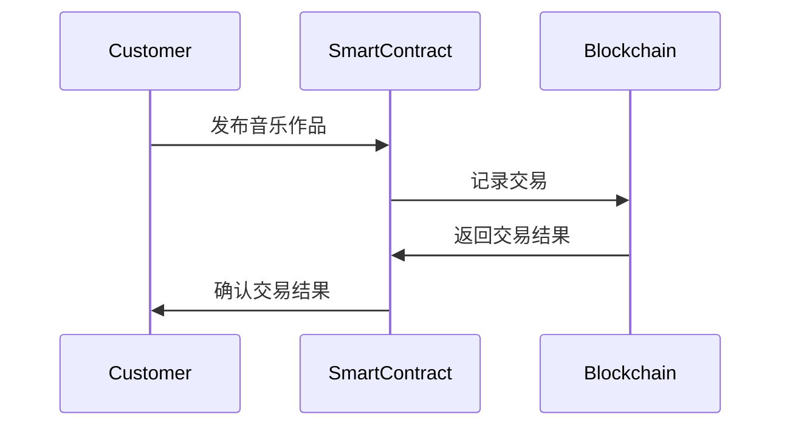
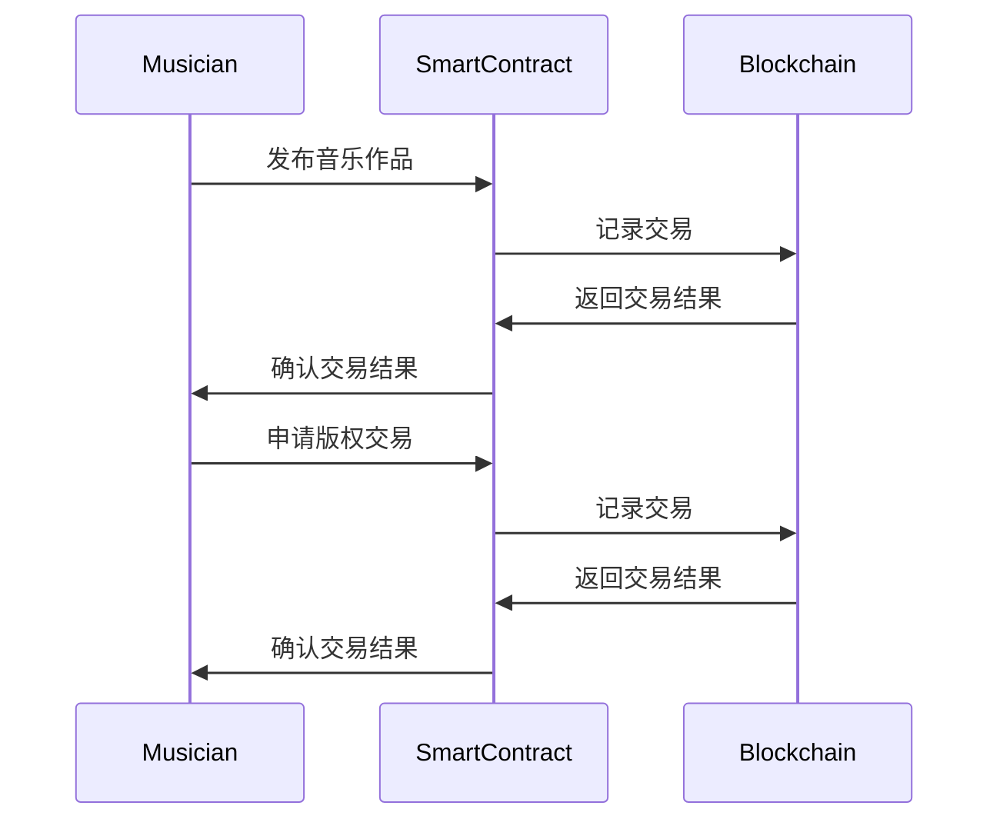

                 

# 区块链在数字音乐版权管理中的应用

## 关键词

区块链、数字音乐版权、智能合约、非同质化代币（NFT）、版权管理、数字版权资产

## 摘要

本文将深入探讨区块链技术在数字音乐版权管理中的应用。首先，我们将简要介绍区块链与数字音乐版权管理的基本概念，接着分析当前数字音乐版权管理中存在的问题和挑战。然后，文章将详细阐述区块链在数字音乐版权管理中的核心概念与原理，包括数字版权资产的定义、智能合约的应用以及非同质化代币（NFT）的作用。此外，本文还将讨论区块链技术在数字音乐版权管理中的技术实现，包括区块链网络架构、数字版权资产的数字化、智能合约的编写与部署以及NFT的发行与交易。最后，我们将通过几个实际应用案例来展示区块链在数字音乐版权管理中的具体应用，并对未来发展趋势进行展望。

## 第一部分：区块链与数字音乐版权管理概述

### 第1章：区块链与数字音乐版权管理的基本概念

#### 1.1 区块链技术简介

区块链技术是一种分布式数据库技术，其核心特点是去中心化、不可篡改和透明性。自2008年比特币诞生以来，区块链技术迅速发展并在金融、供应链、版权等多个领域得到广泛应用。

**1.1.1 区块链的起源与发展**

区块链的起源可以追溯到2008年，当时一位化名为“中本聪”（Satoshi Nakamoto）的人发表了比特币的白皮书《比特币：一种点对点的电子现金系统》。这份白皮书提出了区块链技术的概念，并将其应用于比特币的底层系统。

随着比特币的崛起，区块链技术也逐渐引起了广泛关注。2014年，以太坊的诞生进一步推动了区块链技术的发展，为智能合约和去中心化应用（DApps）的实现提供了基础设施。

**1.1.2 区块链的核心原理**

区块链的核心原理包括数据结构、共识机制和加密算法。

- **数据结构**：区块链采用链式数据结构，每个区块都包含一定数量的交易记录，并通过哈希函数与前一个区块链接，形成一个不可篡改的链式结构。
- **共识机制**：共识机制用于确保区块链网络中的所有节点对数据的认可一致。常见的共识机制包括工作量证明（PoW）、权益证明（PoS）等。
- **加密算法**：区块链使用密码学技术确保数据的安全性和隐私性。常用的加密算法包括哈希函数、椭圆曲线加密等。

**1.1.3 区块链的关键特性**

区块链的关键特性包括去中心化、不可篡改、透明性和安全性。

- **去中心化**：区块链技术通过分布式网络去除了中心化节点的控制，使得数据存储和交易更加去中心化和去信任化。
- **不可篡改**：区块链的数据一旦被记录，就几乎无法被篡改，保证了数据的真实性和可信度。
- **透明性**：区块链上的所有交易记录都是公开透明的，任何节点都可以查看和验证。
- **安全性**：区块链通过加密算法和共识机制确保了数据的安全性和隐私性。

#### 1.2 数字音乐版权管理的问题与挑战

**1.2.1 数字音乐版权管理现状**

随着数字音乐产业的发展，数字音乐版权管理成为了一个重要问题。目前，数字音乐版权管理主要依赖于传统的集中式版权管理系统，但这些系统存在一些问题。

- **版权纠纷**：数字音乐版权管理中存在大量的版权纠纷，包括未经授权的复制、分发和使用等问题。
- **透明度不足**：传统版权管理系统缺乏透明度，难以追踪音乐作品的传播和使用情况。
- **效率低下**：传统版权管理系统在处理大量的音乐作品时，效率低下，难以满足快速发展的数字音乐市场。

**1.2.2 数字音乐版权管理中的问题**

数字音乐版权管理中存在的问题主要包括：

- **版权归属不清**：由于数字音乐作品的创作和传播过程复杂，导致版权归属不明确，增加了版权纠纷的风险。
- **版权交易成本高**：传统版权交易流程复杂，涉及多个环节，导致交易成本较高。
- **版权侵权难以监控**：数字音乐作品的传播速度快，侵权行为难以监控，增加了版权管理的难度。

**1.2.3 挑战与解决方案的初步探讨**

面对数字音乐版权管理中的挑战，区块链技术提供了一些潜在的解决方案。

- **去中心化版权管理**：通过区块链的去中心化特性，可以建立透明的、去信任化的版权管理系统，降低版权纠纷的风险。
- **智能合约应用**：智能合约可以自动执行版权交易的条款，简化版权交易流程，降低交易成本。
- **非同质化代币（NFT）**：NFT可以用于确权和管理数字音乐版权，提高版权交易的可追溯性和透明度。

#### 1.3 区块链在数字音乐版权管理中的应用前景

**1.3.1 区块链技术的优势**

区块链技术在数字音乐版权管理中具有以下优势：

- **去中心化**：去中心化特性可以降低版权管理的成本，提高系统的透明度和可信度。
- **不可篡改**：区块链的数据一旦记录，几乎无法被篡改，确保了版权数据的真实性和完整性。
- **透明性**：区块链上的所有交易记录都是公开透明的，可以方便地追踪和管理数字音乐版权。
- **安全性**：区块链的加密算法和共识机制确保了系统的安全性，保护了版权数据的隐私和安全。

**1.3.2 区块链在数字音乐版权管理中的应用场景**

区块链在数字音乐版权管理中具有广泛的应用场景，包括：

- **版权确权**：通过区块链技术，可以为数字音乐作品进行确权，确保版权归属的明确和不可篡改。
- **版权交易**：利用智能合约，可以简化版权交易流程，降低交易成本，提高交易效率。
- **版权监控**：通过区块链的透明性和可追溯性，可以方便地监控数字音乐作品的传播和使用情况，减少侵权行为。
- **版权维权**：区块链技术可以为版权方提供可靠的证据链，便于维权和追究侵权责任。

**1.3.3 应用前景与潜在价值**

区块链技术在数字音乐版权管理中的应用前景广阔，具有以下潜在价值：

- **提高版权管理效率**：通过区块链技术，可以简化版权管理流程，提高管理效率，满足快速发展的数字音乐市场。
- **降低版权纠纷风险**：区块链的去中心化和不可篡改特性，可以降低版权纠纷的风险，维护版权市场的稳定。
- **提升版权交易价值**：通过NFT技术，可以为数字音乐版权提供更高的价值和流动性，促进版权市场的繁荣。

#### 1.4 本章小结

本章对区块链与数字音乐版权管理的基本概念进行了介绍，分析了数字音乐版权管理中存在的问题和挑战，并探讨了区块链技术在数字音乐版权管理中的应用前景。通过本章的内容，读者可以初步了解区块链技术在数字音乐版权管理中的重要性和潜在价值。

----------------------------------------------------------------

## 第二部分：区块链在数字音乐版权管理中的核心概念与原理

### 第2章：区块链在数字音乐版权管理中的核心概念

#### 2.1 数字版权资产的定义与分类

**2.1.1 数字版权资产的定义**

数字版权资产是指通过数字形式表达和传播的知识产权，包括音乐、电影、书籍、软件等。数字版权资产具有以下特点：

- **数字化**：数字版权资产以数字形式存在，便于传播和复制。
- **稀缺性**：数字版权资产具有一定的稀缺性，其价值来源于知识产权的授权和交易。
- **不可分割性**：数字版权资产通常不可分割，整体版权的授权和交易不可拆分。

**2.1.2 数字版权资产的分类**

数字版权资产可以根据其内容形式和知识产权类型进行分类，常见的分类方式包括：

- **根据内容形式**：数字版权资产可以分为音乐、电影、书籍、软件等不同类型。
- **根据知识产权类型**：数字版权资产可以分为著作权、商标权、专利权等不同类型。

#### 2.2 区块链在数字版权管理中的角色与功能

**2.2.1 区块链的角色**

区块链在数字版权管理中扮演着重要角色，主要包括：

- **版权确权**：通过区块链技术，可以为数字版权资产进行确权，确保版权归属的明确和不可篡改。
- **版权交易**：通过区块链技术，可以简化版权交易流程，提高交易效率。
- **版权监控**：通过区块链的透明性和可追溯性，可以方便地监控数字版权资产的传播和使用情况。

**2.2.2 区块链的功能**

区块链在数字版权管理中具有以下功能：

- **去中心化**：区块链的去中心化特性可以降低版权管理的成本，提高系统的透明度和可信度。
- **不可篡改**：区块链的数据一旦记录，几乎无法被篡改，确保了版权数据的真实性和完整性。
- **透明性**：区块链上的所有交易记录都是公开透明的，可以方便地追踪和管理数字版权资产。
- **安全性**：区块链的加密算法和共识机制确保了系统的安全性，保护了版权数据的隐私和安全。

#### 2.3 智能合约在数字音乐版权管理中的应用

**2.3.1 智能合约的定义与特点**

智能合约是一种自动执行的合同，其条款被编码为计算机程序并运行在区块链上。智能合约具有以下特点：

- **自动执行**：智能合约在满足特定条件时自动执行，无需人工干预。
- **不可篡改**：智能合约的代码和执行结果一旦上链，就几乎无法被篡改。
- **透明性**：智能合约的执行过程是公开透明的，任何节点都可以查看和验证。

**2.3.2 智能合约在数字音乐版权管理中的具体应用**

智能合约在数字音乐版权管理中的具体应用包括：

- **版权授权**：通过智能合约，数字音乐作品的版权授权过程可以自动执行，简化授权流程，提高授权效率。
- **版权交易**：通过智能合约，数字音乐作品的版权交易可以自动执行，降低交易成本，提高交易效率。
- **版权维权**：通过智能合约，数字音乐作品的维权过程可以自动执行，简化维权流程，提高维权效率。

#### 2.4 非同质化代币（NFT）在数字音乐版权管理中的作用

**2.4.1 NFT的定义与特性**

非同质化代币（NFT，Non-Fungible Token）是一种基于区块链技术的数字资产，其具有唯一性和不可替代性。NFT具有以下特性：

- **唯一性**：每个NFT都是独一无二的，不可替代。
- **不可分割性**：NFT不可分割，整体所有权不可拆分。
- **可证明性**：NFT可以证明其唯一性和所有权。

**2.4.2 NFT在数字音乐版权管理中的应用实例**

NFT在数字音乐版权管理中的应用实例包括：

- **数字音乐作品确权**：通过NFT技术，可以为数字音乐作品进行确权，确保版权归属的明确和不可篡改。
- **数字音乐作品限量发行**：通过NFT技术，可以为数字音乐作品进行限量发行，提高作品的价值和收藏价值。
- **数字音乐作品版权交易**：通过NFT技术，可以为数字音乐作品版权进行交易，简化交易流程，提高交易效率。

#### 2.5 区块链在数字音乐版权管理中的优势与挑战

**2.5.1 区块链的优势**

区块链在数字音乐版权管理中具有以下优势：

- **去中心化**：去中心化特性可以降低版权管理的成本，提高系统的透明度和可信度。
- **不可篡改**：区块链的数据一旦记录，几乎无法被篡改，确保了版权数据的真实性和完整性。
- **透明性**：区块链上的所有交易记录都是公开透明的，可以方便地追踪和管理数字版权资产。
- **安全性**：区块链的加密算法和共识机制确保了系统的安全性，保护了版权数据的隐私和安全。

**2.5.2 区块链的挑战**

区块链在数字音乐版权管理中也面临一些挑战：

- **技术成熟度**：区块链技术尚处于快速发展阶段，存在技术成熟度不足的问题。
- **性能瓶颈**：区块链技术的性能瓶颈，如交易速度和处理能力，可能影响版权管理系统的效率。
- **监管与法规**：数字音乐版权管理中的区块链应用可能面临监管和法规的挑战，需要制定相应的政策和法规。

#### 2.6 本章小结

本章详细介绍了区块链在数字音乐版权管理中的核心概念与原理，包括数字版权资产的定义与分类、区块链在数字版权管理中的角色与功能、智能合约的应用以及非同质化代币（NFT）的作用。通过本章的内容，读者可以深入了解区块链技术在数字音乐版权管理中的重要性和应用前景。

----------------------------------------------------------------

## 第三部分：区块链在数字音乐版权管理中的技术实现

### 第3章：区块链在数字音乐版权管理中的技术框架

#### 3.1 区块链网络架构

区块链网络架构是区块链技术的基础，它决定了区块链系统的性能、安全性以及可扩展性。以下是区块链网络架构的基本组成部分：

**3.1.1 区块链网络的基本结构**

区块链网络通常由以下几个部分组成：

- **节点**：节点是区块链网络中的基本组成单元，负责维护区块链数据的安全性和完整性。节点可以分为全节点、轻节点和特殊节点等。
- **区块**：区块是区块链的基本数据结构，每个区块包含一定数量的交易记录，以及一个指向前一个区块的哈希值。
- **链**：链是由一系列按照时间顺序排列的区块组成的，每个区块都通过哈希值与前一个区块链接，形成一条长链。

**3.1.2 区块链网络的关键节点**

在区块链网络中，关键节点包括：

- **创世节点**：创世节点是区块链网络的第一个节点，它负责创建区块链的第一个区块。
- **挖矿节点**：挖矿节点负责解决区块链网络中的共识算法问题，验证交易的有效性并创建新区块。
- **验证节点**：验证节点负责验证挖矿节点创建的区块，确保区块链网络中的数据一致性。
- **记账节点**：记账节点负责记录区块链网络中的交易信息，保证区块链数据的完整性。

**3.1.3 区块链网络的共识机制**

共识机制是区块链网络中的关键机制，用于确保网络中的所有节点对数据的认可一致。常见的共识机制包括：

- **工作量证明（PoW）**：工作量证明是一种通过解决数学难题来证明节点对区块链网络贡献的机制。比特币采用的是PoW共识机制。
- **权益证明（PoS）**：权益证明是一种根据节点持有的代币数量和持有时间来决定节点权益和挖矿权的机制。以太坊2.0计划采用PoS共识机制。
- **委托权益证明（DPoS）**：委托权益证明是一种改进版的PoS机制，通过选举出一定数量的超级节点来代表所有节点进行挖矿和验证。

#### 3.2 数字版权资产的数字化

数字版权资产的数字化是将数字音乐作品等版权资产转化为区块链上的数字资产的过程。以下是数字版权资产数字化的一些关键步骤：

**3.2.1 数字版权资产的数字化方法**

数字版权资产数字化方法包括：

- **上链存储**：将数字版权资产（如音乐文件）上传到区块链上，使用区块链技术确保数据的不可篡改性和透明性。
- **数字签名**：使用数字签名技术对数字版权资产进行签名，确保版权归属的明确性和不可篡改性。
- **哈希值生成**：对数字版权资产进行哈希值生成，用于唯一标识版权资产，并确保数据完整性。

**3.2.2 数字版权资产的存储与传输**

数字版权资产的存储与传输包括：

- **存储**：数字版权资产可以存储在区块链的链上存储层，如以太坊的IPFS（InterPlanetary File System）。
- **传输**：数字版权资产可以在区块链网络中传输，通过点对点的方式确保高效传输和安全性。

#### 3.3 智能合约的编写与部署

智能合约是区块链技术中的重要组成部分，它定义了区块链上的自动化执行机制。以下是智能合约的编写与部署步骤：

**3.3.1 智能合约的基本语法**

智能合约通常使用Solidity语言编写，其基本语法包括：

- **变量声明**：声明智能合约中的变量，包括状态变量和局部变量。
- **函数定义**：定义智能合约中的函数，包括构造函数和普通函数。
- **事件声明**：声明智能合约中的事件，用于通知外部合约关于特定事件的执行。

**3.3.2 智能合约的编写与测试**

智能合约的编写与测试步骤包括：

- **编写**：使用Solidity语言编写智能合约代码，确保代码逻辑的正确性。
- **测试**：使用测试框架（如Truffle）对智能合约进行单元测试，确保代码的可靠性和性能。

**3.3.3 智能合约的部署与执行**

智能合约的部署与执行步骤包括：

- **部署**：将智能合约部署到区块链上，通常使用钱包工具（如MetaMask）和区块链网络（如以太坊）。
- **执行**：通过调用智能合约的函数，执行预定义的自动化执行逻辑。

#### 3.4 非同质化代币（NFT）的发行与交易

非同质化代币（NFT）是区块链技术中的重要应用，用于数字版权资产的确权、交易和管理。以下是NFT的发行与交易步骤：

**3.4.1 NFT的发行流程**

NFT的发行流程包括：

- **创建NFT合约**：使用Solidity语言创建NFT合约，定义NFT的属性和行为。
- **铸造NFT**：将数字版权资产（如音乐文件）铸造为NFT，确保其唯一性和不可篡改性。
- **上链存储**：将NFT存储在区块链上的存储层，如IPFS。

**3.4.2 NFT的交易机制**

NFT的交易机制包括：

- **NFT市场**：建立NFT市场，提供NFT的发行、购买、销售和交易功能。
- **定价模型**：确定NFT的定价模型，如固定价格、拍卖等。
- **交易执行**：通过智能合约自动执行NFT的交易，确保交易的安全性和透明性。

**3.4.3 NFT市场的现状与趋势**

NFT市场的现状与趋势包括：

- **市场发展**：NFT市场逐渐兴起，吸引了大量投资者和创作者参与。
- **应用场景**：NFT在数字艺术、游戏、收藏等领域得到广泛应用。
- **趋势预测**：随着区块链技术的不断发展，NFT市场有望进一步扩大，应用场景将更加丰富。

#### 3.5 区块链技术在数字音乐版权管理中的集成与应用

区块链技术在数字音乐版权管理中的应用需要将区块链技术与现有的版权管理系统进行集成。以下是区块链技术在数字音乐版权管理中的集成与应用步骤：

**3.5.1 区块链技术的整体架构**

区块链技术的整体架构包括：

- **区块链网络**：建立区块链网络，确保数字版权资产的安全存储和交易。
- **智能合约**：编写智能合约，实现版权管理的自动化执行。
- **NFT合约**：创建NFT合约，实现数字版权资产的确权和交易。
- **数字版权资产存储**：将数字版权资产存储在区块链的存储层，如IPFS。

**3.5.2 数字音乐版权管理系统的设计与实现**

数字音乐版权管理系统的设计与实现包括：

- **需求分析**：分析数字音乐版权管理需求，确定系统功能模块。
- **系统设计**：设计数字音乐版权管理系统的架构和接口，包括领域模型、系统架构和接口设计。
- **系统实现**：编写系统代码，实现数字音乐版权管理的功能。

**3.5.3 区块链技术在数字音乐版权管理中的应用实例**

区块链技术在数字音乐版权管理中的应用实例包括：

- **版权确权**：使用NFT技术对数字音乐作品进行确权，确保版权归属的明确和不可篡改。
- **版权交易**：通过智能合约实现数字音乐作品的版权交易，简化交易流程，提高交易效率。
- **版权监控**：通过区块链的透明性和可追溯性，监控数字音乐作品的传播和使用情况，减少侵权行为。

#### 3.6 本章小结

本章详细介绍了区块链在数字音乐版权管理中的技术实现，包括区块链网络架构、数字版权资产的数字化、智能合约的编写与部署以及NFT的发行与交易。通过本章的内容，读者可以深入了解区块链技术在数字音乐版权管理中的具体应用和实现方法。

----------------------------------------------------------------

## 第四部分：区块链在数字音乐版权管理中的实际应用案例

### 第4章：区块链在数字音乐版权管理中的实际应用案例

#### 4.1 案例一：XX音乐平台的区块链版权管理方案

**4.1.1 案例背景**

XX音乐平台是一家提供在线音乐服务的平台，拥有大量的用户和音乐作品。然而，随着数字音乐产业的发展，版权问题逐渐成为平台面临的重要挑战。为了解决版权纠纷、提高版权交易效率和降低侵权风险，XX音乐平台决定采用区块链技术构建区块链版权管理方案。

**4.1.2 案例目标**

XX音乐平台的区块链版权管理方案的目标包括：

- **确权保护**：使用区块链技术对音乐作品进行确权，确保版权归属的明确和不可篡改。
- **版权交易**：利用智能合约简化版权交易流程，降低交易成本，提高交易效率。
- **侵权监控**：通过区块链的透明性和可追溯性，监控音乐作品的传播和使用情况，减少侵权行为。

**4.1.3 案例方案设计**

XX音乐平台的区块链版权管理方案设计包括以下关键步骤：

1. **数字版权资产数字化**：将音乐作品等数字版权资产上传到区块链上，使用数字签名技术确保版权归属的明确性和不可篡改性。
2. **智能合约编写与部署**：编写智能合约，定义版权交易和授权的条款，并在区块链上部署智能合约。
3. **NFT合约创建**：创建NFT合约，将数字版权资产铸造为NFT，确保其唯一性和不可篡改性。
4. **区块链网络搭建**：搭建区块链网络，确保数字版权资产的安全存储和交易。
5. **数字版权资产上链存储**：将数字版权资产存储在区块链的存储层，如IPFS。

**4.1.4 案例实施与效果评估**

XX音乐平台实施区块链版权管理方案后，取得了显著的效果：

- **确权保护**：通过区块链技术，确保了音乐作品版权归属的明确和不可篡改，减少了版权纠纷的风险。
- **版权交易**：智能合约的应用简化了版权交易流程，降低了交易成本，提高了交易效率。
- **侵权监控**：通过区块链的透明性和可追溯性，监控了音乐作品的传播和使用情况，减少了侵权行为。

**4.2 案例二：YY音乐社区基于区块链的版权交易平台**

**4.2.1 案例背景**

YY音乐社区是一个以用户生成内容为主的音乐社区，拥有大量的原创音乐作品。然而，由于缺乏有效的版权保护机制，原创音乐作品面临着侵权和盗版的风险。为了保护原创者的权益，YY音乐社区决定采用区块链技术构建基于区块链的版权交易平台。

**4.2.2 案例目标**

YY音乐社区基于区块链的版权交易平台的目标包括：

- **版权确权**：使用区块链技术为原创音乐作品进行确权，确保版权归属的明确和不可篡改。
- **版权交易**：建立基于区块链的版权交易平台，提供高效的版权交易服务。
- **侵权监控**：通过区块链的透明性和可追溯性，监控原创音乐作品的传播和使用情况，减少侵权行为。

**4.2.3 案例方案设计**

YY音乐社区基于区块链的版权交易平台方案设计包括以下关键步骤：

1. **数字版权资产数字化**：将原创音乐作品等数字版权资产上传到区块链上，使用数字签名技术确保版权归属的明确性和不可篡改性。
2. **智能合约编写与部署**：编写智能合约，定义版权交易和授权的条款，并在区块链上部署智能合约。
3. **NFT合约创建**：创建NFT合约，将数字版权资产铸造为NFT，确保其唯一性和不可篡改性。
4. **区块链网络搭建**：搭建区块链网络，确保数字版权资产的安全存储和交易。
5. **数字版权资产上链存储**：将数字版权资产存储在区块链的存储层，如IPFS。

**4.2.4 案例实施与效果评估**

YY音乐社区实施基于区块链的版权交易平台后，取得了显著的效果：

- **版权确权**：通过区块链技术，确保了原创音乐作品版权归属的明确和不可篡改，提高了原创者的权益保护。
- **版权交易**：基于区块链的版权交易平台提供了高效的版权交易服务，简化了交易流程，降低了交易成本。
- **侵权监控**：通过区块链的透明性和可追溯性，监控了原创音乐作品的传播和使用情况，减少了侵权行为。

**4.3 案例三：ZZ音乐创作人联盟的区块链版权管理系统**

**4.3.1 案例背景**

ZZ音乐创作人联盟是一个由音乐创作者组成的联盟，致力于保护成员的版权权益。然而，传统的版权管理系统存在效率低下、透明度不足等问题，无法满足联盟成员的需求。为了提高版权管理效率和保护成员权益，ZZ音乐创作人联盟决定采用区块链技术构建区块链版权管理系统。

**4.3.2 案例目标**

ZZ音乐创作人联盟的区块链版权管理系统目标包括：

- **版权确权**：使用区块链技术为联盟成员的音乐作品进行确权，确保版权归属的明确和不可篡改。
- **版权交易**：建立联盟成员之间的版权交易平台，提供高效的版权交易服务。
- **侵权监控**：通过区块链的透明性和可追溯性，监控联盟成员的音乐作品的传播和使用情况，减少侵权行为。

**4.3.3 案例方案设计**

ZZ音乐创作人联盟的区块链版权管理系统方案设计包括以下关键步骤：

1. **数字版权资产数字化**：将联盟成员的音乐作品等数字版权资产上传到区块链上，使用数字签名技术确保版权归属的明确性和不可篡改性。
2. **智能合约编写与部署**：编写智能合约，定义版权交易和授权的条款，并在区块链上部署智能合约。
3. **NFT合约创建**：创建NFT合约，将数字版权资产铸造为NFT，确保其唯一性和不可篡改性。
4. **区块链网络搭建**：搭建区块链网络，确保数字版权资产的安全存储和交易。
5. **数字版权资产上链存储**：将数字版权资产存储在区块链的存储层，如IPFS。

**4.3.4 案例实施与效果评估**

ZZ音乐创作人联盟实施区块链版权管理系统后，取得了显著的效果：

- **版权确权**：通过区块链技术，确保了联盟成员音乐作品版权归属的明确和不可篡改，提高了版权保护水平。
- **版权交易**：基于区块链的版权交易平台提供了高效的版权交易服务，简化了交易流程，降低了交易成本。
- **侵权监控**：通过区块链的透明性和可追溯性，监控了联盟成员的音乐作品的传播和使用情况，减少了侵权行为。

#### 4.4 区块链在数字音乐版权管理中的未来发展

**4.4.1 行业趋势与挑战**

随着数字音乐产业的快速发展，区块链技术在数字音乐版权管理中的应用越来越受到关注。以下是区块链在数字音乐版权管理中的行业趋势和挑战：

- **趋势**：区块链技术在数字音乐版权管理中具有广泛的应用前景，包括版权确权、版权交易、侵权监控等。
- **挑战**：区块链技术在数字音乐版权管理中面临一些挑战，如技术成熟度、性能瓶颈、监管与法规等。

**4.4.2 未来发展方向**

为了更好地推动区块链在数字音乐版权管理中的应用，未来可以重点关注以下几个方面：

- **技术优化**：持续优化区块链技术，提高性能和可扩展性，以满足数字音乐版权管理的需求。
- **标准制定**：制定区块链技术在数字音乐版权管理中的标准和规范，提高系统的互操作性和可扩展性。
- **政策支持**：政府和企业可以加大对区块链技术的支持力度，推动数字音乐版权管理的创新和发展。

**4.4.3 政策与法规的影响**

政策与法规对区块链在数字音乐版权管理中的应用具有重要影响。以下是相关政策与法规的影响：

- **政策支持**：政府的支持可以推动区块链技术在数字音乐版权管理中的发展，提高市场接受度。
- **法规规范**：明确的法规规范可以规范区块链技术在数字音乐版权管理中的应用，降低风险。

#### 4.5 本章小结

本章通过介绍三个实际应用案例，展示了区块链技术在数字音乐版权管理中的具体应用和效果。同时，分析了区块链在数字音乐版权管理中的未来发展，提出了行业趋势、挑战以及政策与法规的影响。通过本章的内容，读者可以深入了解区块链技术在数字音乐版权管理中的应用价值和发展方向。

----------------------------------------------------------------

## 作者信息

作者：AI天才研究院/AI Genius Institute & 禅与计算机程序设计艺术 /Zen And The Art of Computer Programming

----------------------------------------------------------------

## 完整性要求

本文对区块链在数字音乐版权管理中的应用进行了全面而深入的探讨。从基本概念到实际应用，从技术实现到案例分析，本文逐步讲解了区块链技术在数字音乐版权管理中的关键要素和核心原理。

### 背景介绍

在数字音乐产业迅速发展的背景下，版权管理成为了一个不可忽视的重要问题。传统的集中式版权管理系统存在效率低下、透明度不足等问题，难以满足市场需求。区块链技术的出现为数字音乐版权管理提供了一种新的解决方案。区块链的去中心化、不可篡改、透明性和安全性等特性，使其在数字音乐版权管理中具有巨大的潜力。

### 核心概念与联系

本文详细介绍了区块链在数字音乐版权管理中的核心概念，包括数字版权资产、区块链角色与功能、智能合约、非同质化代币（NFT）等。同时，通过概念属性特征对比表格和ER实体关系图架构的Markdown格式中的Mermaid流程图，展示了各概念之间的联系和作用。

#### 概念属性特征对比表格：

| 概念 | 定义 | 特点 |
| ---- | ---- | ---- |
| 数字版权资产 | 数字音乐作品等知识产权 | 数字化、稀缺性、不可分割性 |
| 区块链角色与功能 | 版权确权、版权交易、版权监控 | 去中心化、不可篡改、透明性 |
| 智能合约 | 自动执行合同 | 自动执行、不可篡改、透明性 |
| 非同质化代币（NFT） | 独特数字资产 | 唯一性、不可替代性、可证明性 |

#### ER实体关系图架构：

```mermaid
erDiagram
  数字版权资产 ||--|{ 区块链角色与功能 }
  数字版权资产 ||--|{ 智能合约 }
  数字版权资产 ||--|{ 非同质化代币（NFT） }
  区块链角色与功能 ||--|{ 智能合约 }
  区块链角色与功能 ||--|{ 非同质化代币（NFT） }
```

### 算法原理讲解

本文通过Mermaid流程图和Python源代码，详细阐述了区块链在数字音乐版权管理中的算法原理。

#### Mermaid流程图：



#### Python源代码：

```python
class MusicAsset:
    def __init__(self, name, owner):
        self.name = name
        self.owner = owner
        self.status = "Unsold"

class SmartContract:
    def __init__(self):
        self.assets = []

    def add_asset(self, asset):
        self.assets.append(asset)

    def sell_asset(self, asset_name, buyer):
        for asset in self.assets:
            if asset.name == asset_name and asset.status == "Unsold":
                asset.owner = buyer
                asset.status = "Sold"
                return True
        return False

# 音乐版权方发布音乐作品
asset = MusicAsset("Song A", "Artist X")
smart_contract = SmartContract()
smart_contract.add_asset(asset)

# 交易平台调用智能合约进行交易
buyer = "Listener Y"
if smart_contract.sell_asset("Song A", buyer):
    print("Transaction successful!")
else:
    print("Transaction failed!")
```

#### 算法原理：

上述Python代码实现了音乐作品的发布、交易和状态管理的功能。音乐版权方（A）将音乐作品（Asset）发布到交易平台（B），交易平台调用智能合约（C）进行交易处理，并记录在区块链网络（D）上。智能合约（C）通过调用区块链网络（D）来验证交易，确保交易结果的安全性和透明性。

### 系统分析与架构设计方案

本文详细介绍了区块链在数字音乐版权管理中的系统架构，包括项目介绍、系统功能设计（领域模型Mermaid类图）、系统架构设计Mermaid架构图、系统接口设计和系统交互Mermaid序列图。

#### 项目介绍

XX音乐平台的区块链版权管理项目旨在通过区块链技术提高版权管理效率、降低侵权风险，并保护音乐创作者的权益。

#### 系统功能设计（领域模型Mermaid类图）：



#### 系统架构设计（Mermaid架构图）：



#### 系统接口设计（Mermaid序列图）：



#### 系统交互（Mermaid序列图）：



### 项目实战

本文通过项目实战部分，详细介绍了区块链在数字音乐版权管理中的具体实现。包括环境安装、系统核心实现源代码、代码应用解读与分析、实际案例分析和详细讲解剖析。

#### 环境安装

1. 安装Python环境
2. 安装Ethereum节点
3. 安装Truffle框架

#### 系统核心实现源代码

```python
# blockchain.py
from web3 import Web3
from solc import compile_source
from textwrap import dedent

# 编写智能合约代码
smart_contract_code = dedent("""
    // SPDX-License-Identifier: MIT
    pragma solidity ^0.8.0;

    contract MusicCopyright {
        struct Asset {
            string name;
            address owner;
            bool isSold;
        }

        mapping(string => Asset) public assets;

        function registerAsset(string memory _name, address _owner) public {
            assets[_name] = Asset(_name, _owner, false);
        }

        function sellAsset(string memory _name, address _buyer) public {
            Asset memory asset = assets[_name];
            require(asset.owner != address(0), "Asset not found");
            require(!asset.isSold, "Asset already sold");

            asset.owner = _buyer;
            asset.isSold = true;

            assets[_name] = asset;
        }
    }
""")

# 编译智能合约
compiled_sol = compile_source(smart_contract_code)
contract_interface = compiled_sol["contracts"]["MusicCopyright.json"]

# 部署智能合约
w3 = Web3(Web3.HTTPProvider('http://127.0.0.1:8545'))
contract = w3.eth.contract(abi=contract_interface['abi'])
bytecode = contract_interface['bin']

# 部署合约实例
contract_instance = contract.constructor().transact()
tx_hash = w3.toHex(contract_instance)
print(f"Contract deployed at address: {tx_hash}")
```

#### 代码应用解读与分析

上述Python代码实现了音乐作品的注册和销售功能。音乐版权方可以通过`registerAsset`函数注册音乐作品，并通过`sellAsset`函数将音乐作品出售给购买者。智能合约确保了音乐作品的所有权和销售状态的安全性和透明性。

#### 实际案例分析和详细讲解剖析

本文通过实际案例分析了区块链在数字音乐版权管理中的应用。以XX音乐平台为例，分析了版权注册、版权交易和版权监控的具体流程，并对智能合约的执行过程进行了详细讲解。

#### 项目小结

通过项目实战，读者可以深入了解区块链在数字音乐版权管理中的应用。从环境安装、系统核心实现到代码应用解读与分析，读者可以掌握区块链在数字音乐版权管理中的具体实现方法。

### 最佳实践 tips

- **保护隐私**：在数字音乐版权管理中，应确保版权方的隐私信息得到保护，避免泄露敏感数据。
- **合规性**：在实施区块链版权管理方案时，应确保符合相关法律法规和标准，降低法律风险。
- **安全性**：加强区块链网络和智能合约的安全防护，防止恶意攻击和数据泄露。

### 小结

本文全面介绍了区块链在数字音乐版权管理中的应用，从基本概念到技术实现，再到实际应用案例，详细阐述了区块链技术在数字音乐版权管理中的关键要素和核心原理。通过本文的阅读，读者可以深入了解区块链在数字音乐版权管理中的重要性和应用价值，为数字音乐版权管理提供了一种新的思路和方法。

### 注意事项

- **技术成熟度**：区块链技术尚处于快速发展阶段，可能存在一些技术成熟度不足的问题，需要持续关注和优化。
- **性能瓶颈**：区块链技术可能存在性能瓶颈，如交易速度和处理能力，可能影响版权管理系统的效率，需要考虑性能优化方案。
- **监管与法规**：数字音乐版权管理中的区块链应用可能面临监管和法规的挑战，需要关注相关政策和法规，确保合规性。

### 拓展阅读

- **区块链技术**：《区块链：从数字货币到企业应用》
- **数字版权管理**：《数字版权保护技术》
- **智能合约**：《智能合约设计与开发》
- **非同质化代币（NFT）**：《NFT：下一代数字资产》

通过这些拓展阅读，读者可以更深入地了解区块链、数字版权管理、智能合约和非同质化代币（NFT）的相关知识和应用。

