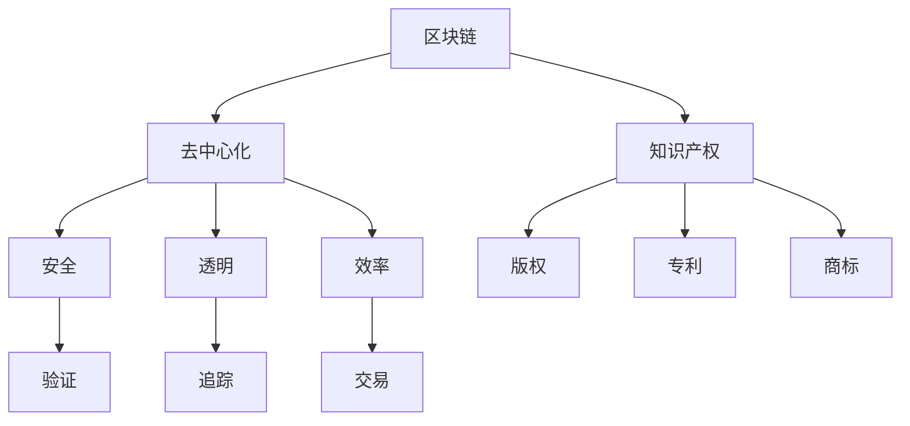

                 

### 第一部分: 背景介绍

#### 第1章: 区块链与知识产权交易

##### 1.1 区块链技术概述

区块链技术作为一种分布式账本技术，最早由中本聪（Satoshi Nakamoto）在2008年提出，并于2009年实现了第一个区块链系统——比特币（Bitcoin）。区块链的基本概念是通过加密算法和共识机制将交易记录（区块）有序地链接成一条不可篡改的链条。每个区块都包含一定数量的交易数据，并通过密码学技术保证数据的完整性和安全性。

区块链技术的主要特性包括：

- **去中心化**：区块链没有中央控制机构，而是通过分布式网络中的多个节点共同维护和验证数据。
- **不可篡改**：区块链上的数据一旦被记录，就几乎无法被篡改，保证了数据的可靠性。
- **透明性**：区块链上的所有数据都是公开透明的，任何人都可以查看和验证。
- **安全性**：区块链使用加密算法来保护数据的安全，使得数据传输过程中难以被窃听或篡改。

##### 1.2 知识产权交易中的问题与挑战

知识产权交易涉及版权、专利、商标等多种形式，传统知识产权交易过程中存在以下问题与挑战：

- **信息不对称**：交易双方的信息不透明，可能导致版权或专利的重复交易或侵权行为。
- **中介环节多**：传统交易过程中需要依靠中介机构，增加了交易成本和时间。
- **验证难度大**：知识产权的验证需要大量人工审核，费时费力。
- **权利保护不力**：由于缺乏有效的保护和追踪机制，知识产权在交易过程中容易被侵权。

##### 1.3 区块链在知识产权交易中的应用前景

区块链技术在知识产权交易中的应用具有广阔的前景，可以有效解决上述问题与挑战：

- **去中心化**：区块链的去中心化特性能够减少中介环节，降低交易成本。
- **透明性**：区块链上的交易记录公开透明，有助于建立可信的交易环境。
- **安全性**：区块链的加密技术和分布式存储能够有效保护知识产权的安全性。
- **验证效率**：区块链上的智能合约可以自动化验证知识产权的真实性，提高交易效率。

##### 1.4 区块链在知识产权交易中的去中心化特性

区块链的去中心化特性主要体现在以下几个方面：

- **数据分布式存储**：区块链上的数据是分布式存储在各个节点上，任何单一节点都无法单独篡改数据。
- **共识机制**：区块链通过共识机制确保数据的准确性，所有节点需要达成一致才能更新数据。
- **加密算法**：区块链使用加密算法保护数据的安全性，确保数据在传输和存储过程中的保密性。

##### 1.5 核心概念与联系

区块链与知识产权交易的核心概念包括：

- **区块链**：分布式账本，记录交易的加密链条。
- **知识产权**：版权、专利、商标等智力成果。
- **去中心化**：没有中央控制，分布式网络维护数据。
- **智能合约**：自动化执行合约条款的计算机程序。

区块链与知识产权交易的关系可以用以下图表示：

##### 1.6 研究目标与意义

本研究的目标是探讨区块链在知识产权交易中的应用，具体目标包括：

- 分析区块链技术在知识产权交易中的优势和应用场景。
- 探索去中心化技术在知识产权交易中的具体实现方案。
- 提出基于区块链的知识产权交易系统设计方案。

研究的意义在于：

- 提高知识产权交易的安全性和透明度。
- 减少交易成本，提高交易效率。
- 为知识产权保护提供新的技术手段。

##### 1.7 边界与外延

边界条件主要涉及：

- **法律**：遵循相关法律法规，保证交易的合法性和安全性。
- **技术**：确保区块链技术的稳定运行和性能优化。

外延领域包括：

- **版权交易**：音乐、影视、文学作品等的版权交易。
- **专利交易**：技术创新的专利转让。
- **商标交易**：品牌价值的交易。

---

通过上述章节，我们对区块链技术和知识产权交易的基本概念、存在的问题、应用前景以及去中心化特性有了初步了解。接下来，我们将进一步探讨区块链在知识产权交易中的应用技术。在第二部分，我们将详细分析区块链的核心技术，如加密算法、分布式存储和共识机制，并解释它们在知识产权交易中的应用原理。

## 第2章: 区块链基础

### 2.1 区块链概述

区块链是一种分布式数据库技术，其核心思想是将交易数据记录在多个独立的节点上，形成一个不可篡改的账本。每个区块包含一定数量的交易记录，并且每个区块通过密码学算法与前一个区块相连，形成一条时间序列的链条。区块链技术的关键特性包括去中心化、不可篡改和透明性。

#### 区块链的组成部分

区块链由以下几个基本组成部分构成：

- **区块（Block）**：包含一定数量的交易记录和数据，每个区块都有一个唯一的哈希值，用于标识和链接到前一个区块。
- **链（Chain）**：由多个区块按照时间顺序链接而成，形成一条完整的区块链。
- **节点（Node）**：区块链网络中的参与者，每个节点都存储完整的一份区块链数据，并参与区块链的维护和验证过程。
- **挖矿（Mining）**：在区块链网络中，节点通过解决数学难题来验证交易记录，并创建新的区块，这个过程被称为挖矿。
- **共识机制（Consensus Mechanism）**：确保区块链网络中所有节点对数据的共识和一致性，常用的共识机制包括工作量证明（Proof of Work, PoW）、权益证明（Proof of Stake, PoS）等。

#### 区块链的工作原理

区块链的工作原理可以概括为以下几个步骤：

1. **交易记录生成**：当用户在区块链上进行交易时，交易信息会被生成并打包成交易记录。
2. **交易验证**：交易记录需要经过网络中的多个节点进行验证，确保交易的合法性和有效性。
3. **区块创建**：验证后的交易记录会被添加到一个新的区块中，新区块需要通过挖矿过程来获得确认。
4. **区块链接**：新的区块通过其哈希值与前一个区块链接，形成一条完整的区块链。
5. **分布式存储**：区块链上的所有数据被分布式存储在各个节点上，每个节点都拥有完整的一份区块链数据。

### 2.2 区块链的核心技术

区块链的核心技术包括加密算法、分布式存储和共识机制，这些技术共同确保了区块链的安全性和去中心化特性。

#### 加密算法

加密算法是区块链技术的重要组成部分，主要用于保障数据的安全性和隐私性。常见的加密算法包括：

- **哈希算法**：用于生成唯一的数据标识，确保数据的完整性和不可篡改性。常见的哈希算法包括SHA-256、SHA-3等。
- **公钥加密**：用于实现数据的安全传输和身份验证。常见的公钥加密算法包括RSA、ECC（椭圆曲线加密算法）等。

#### 分布式存储

分布式存储是区块链技术的基础，通过将数据分散存储在多个节点上，确保数据的可靠性和去中心化。分布式存储的优势包括：

- **容错性**：由于数据被分散存储，任何一个节点的故障都不会导致整个系统的崩溃。
- **扩展性**：系统可以轻松扩展以处理更多的数据，因为新的节点可以随时加入网络。
- **去中心化**：分布式存储避免了中心化的单点故障问题，提高了系统的安全性。

#### 共识机制

共识机制是确保区块链网络中所有节点对数据的共识和一致性的一套规则。常见的共识机制包括：

- **工作量证明（PoW）**：节点通过解决复杂的数学难题来证明自己的工作量，从而获得创建新区块的权力。比特币采用的即是PoW共识机制。
- **权益证明（PoS）**：节点根据其持有的代币数量和持币时间来获得创建新区块的权力。PoS相对于PoW更加节能和环保，但可能存在“富者愈富”的问题。

#### 区块链在网络中的结构

区块链在网络中的结构可以分为以下几个层次：

- **物理网络层**：由物理节点组成，这些节点可以是计算机、服务器等设备。
- **传输层**：负责节点之间的数据传输，通常使用TCP/IP协议。
- **网络层**：负责路由和寻址，确保数据能够正确地从一个节点传输到另一个节点。
- **共识层**：负责实现共识机制，确保所有节点对数据的共识和一致性。
- **应用层**：构建在区块链之上，提供各种应用服务，如智能合约、去中心化金融（DeFi）等。

通过上述分析，我们可以看到区块链技术的基本概念、核心技术和网络结构。在接下来的章节中，我们将进一步探讨智能合约、去中心化身份验证、去中心化存储和去中心化交易所等区块链应用技术，以及它们在知识产权交易中的具体应用。

---

### 2.3 智能合约

智能合约是基于区块链技术的计算机程序，用于自动化和执行合同条款。与传统合同相比，智能合约通过区块链上的加密算法和共识机制来确保合同的执行过程透明、不可篡改且自动化。

#### 智能合约概述

智能合约的基本概念包括：

- **代码**：智能合约的核心是代码，通常使用Solidity等编程语言编写，定义了合同的条款和条件。
- **触发条件**：智能合约的执行通常由特定的触发条件触发，如支付金额达到一定数额、特定时间到达等。
- **执行**：一旦触发条件满足，智能合约会自动执行，执行过程是透明且不可篡改的。
- **安全性**：智能合约的安全性依赖于区块链的安全机制，包括加密算法和共识机制。

#### 智能合约的工作原理

智能合约的工作原理可以概括为以下几个步骤：

1. **编写合约代码**：开发者使用Solidity或其他支持智能合约的编程语言编写智能合约代码。
2. **部署合约**：将智能合约代码部署到区块链上，通常通过以太坊或其他支持智能合约的区块链平台。
3. **合约部署**：区块链上的节点验证并存储智能合约代码，合约状态初始为待执行状态。
4. **触发执行**：当满足合约的触发条件时，智能合约会自动执行，执行结果记录在区块链上。
5. **验证和共识**：区块链上的所有节点对智能合约的执行进行验证和共识，确保合约执行的合法性和一致性。

#### 智能合约的开发与部署

智能合约的开发和部署通常涉及以下几个步骤：

1. **环境搭建**：开发者需要在本地或云服务器上搭建区块链开发环境，如使用Truffle、Ganache等工具。
2. **编写代码**：使用Solidity等编程语言编写智能合约代码，定义合同的条款和条件。
3. **测试合约**：在本地开发环境中对智能合约代码进行测试，确保合约逻辑的正确性和安全性。
4. **部署合约**：将测试通过的智能合约代码部署到区块链上，可以通过以太坊的geth节点或其他支持智能合约的平台进行部署。
5. **验证合约**：区块链上的节点验证并存储智能合约代码，部署完成后，智能合约即可在区块链上运行。

#### 智能合约在知识产权交易中的应用

智能合约在知识产权交易中的应用具有广泛的前景，其主要应用场景包括：

- **版权交易**：智能合约可以自动验证版权的转移和授权，确保版权交易的合法性和透明性。
- **专利交易**：智能合约可以自动化处理专利申请、转让和许可等流程，提高交易效率。
- **商标交易**：智能合约可以自动化处理商标的注册、转让和许可等流程，确保交易的合法性。

通过智能合约，知识产权交易的每个环节都可以实现自动化和透明化，减少人为干预和错误，提高交易的效率和安全。智能合约不仅降低了交易成本，还增强了交易的信任度和可信度。

### 案例分析

以下是一个版权交易中智能合约应用的案例分析：

**案例背景**：某艺术家A创作了一幅画作，希望通过区块链平台将其版权进行数字化和交易。

**解决方案**：艺术家A使用智能合约平台创建一个版权交易的智能合约，合约中包含以下条款：

1. **版权信息**：包括画作名称、作者、创作时间等基本信息。
2. **版权认证**：艺术家A使用数字签名技术对版权进行认证，确保版权信息的真实性和唯一性。
3. **交易条款**：设定购买者的支付金额、支付方式、版权转移的具体条款等。
4. **触发条件**：设定购买者支付完成后，版权自动转移到购买者名下。

**案例效果分析**：

1. **透明性**：智能合约的条款和执行过程都是公开透明的，任何节点都可以查看和验证。
2. **安全性**：智能合约通过区块链的加密技术和共识机制确保交易的安全性，防止侵权行为。
3. **效率**：交易过程自动化，减少了人工干预，提高了交易效率。
4. **降低成本**：智能合约减少了中介环节，降低了交易成本。

通过智能合约的应用，艺术家A的画作版权交易过程更加高效、透明和安全，为知识产权交易提供了新的解决方案。

### 总结

智能合约作为一种去中心化的自动化执行工具，在知识产权交易中具有广泛的应用前景。通过智能合约，可以实现交易的自动化、透明化和安全化，提高交易效率，减少交易成本，并为知识产权保护提供新的技术手段。在接下来的章节中，我们将继续探讨去中心化身份验证、去中心化存储和去中心化交易所在知识产权交易中的应用。

## 第4章: 去中心化身份验证

### 4.1 去中心化身份验证概述

去中心化身份验证（Decentralized Identity Verification，DIV）是一种基于区块链技术的身份验证方法，旨在提供一种无需中心化机构参与的身份验证方式。在传统的身份验证系统中，身份验证通常依赖于中心化的认证机构，如政府机构或金融机构。然而，这种中心化的方式存在诸多问题，如隐私泄露、数据篡改等。去中心化身份验证通过区块链技术解决了这些问题，实现了更安全、透明和高效的验证过程。

#### 去中心化身份验证的核心概念

去中心化身份验证的核心概念包括：

- **数字身份**：用户在区块链上创建和管理的唯一身份标识，通常通过加密算法和数字签名技术实现。
- **隐私保护**：用户的信息不会被存储在中心化的服务器上，而是分散存储在区块链上，确保隐私和安全。
- **可信度**：区块链上的数据是透明和不可篡改的，增强了验证结果的可信度。
- **互操作性**：去中心化身份验证系统支持不同平台和服务之间的身份信息共享，提高了系统的互操作性。

#### 去中心化身份验证的优势

去中心化身份验证相对于传统身份验证具有以下优势：

- **安全性**：区块链的加密技术和分布式存储确保了身份信息的保密性和完整性，降低了隐私泄露和数据篡改的风险。
- **透明性**：区块链上的数据是公开透明的，用户可以随时查看自己的身份信息，提高了验证过程的透明度。
- **效率**：去中心化身份验证通过自动化和智能合约技术简化了验证流程，减少了人工干预，提高了验证效率。
- **灵活性**：去中心化身份验证支持多种身份验证方式，如生物识别技术、多因素验证等，提高了系统的灵活性和适应性。

### 4.2 去中心化身份验证的机制

去中心化身份验证的机制主要包括以下几个方面：

#### 1. 身份信息创建

用户在区块链上创建自己的数字身份，通过注册和身份验证过程生成唯一的身份标识。通常，用户需要提供个人身份证明文件，如身份证、护照等，通过区块链上的智能合约进行验证。

#### 2. 数字签名

用户在区块链上使用数字签名技术对身份信息进行签名，确保身份信息的真实性和唯一性。数字签名利用公钥加密算法，用户持有的私钥用于生成签名，而公钥则用于验证签名。

#### 3. 分布式存储

身份信息在区块链上分布式存储，确保数据的分散性和安全性。区块链上的每个节点都保存一份完整的数据副本，任何单一节点的故障都不会影响整个系统的运行。

#### 4. 智能合约验证

智能合约在去中心化身份验证中扮演关键角色，用于自动化和执行验证流程。智能合约可以根据预设的条件自动验证用户身份，确保验证过程的透明性和一致性。

#### 5. 跨平台互操作

去中心化身份验证支持不同平台和服务之间的身份信息共享，提高了系统的互操作性。用户可以在多个平台上使用自己的数字身份进行验证，而无需重复提交身份证明。

### 4.3 去中心化身份验证的应用场景

去中心化身份验证在多个领域具有广泛的应用场景，以下是一些典型的应用场景：

#### 1. 金融领域

在金融领域，去中心化身份验证可以用于客户身份识别（KYC）和反洗钱（AML）等流程。通过去中心化身份验证，金融机构可以更高效、安全地验证客户身份，减少欺诈风险。

#### 2. 供应链管理

在供应链管理中，去中心化身份验证可以用于验证供应商和合作伙伴的身份，确保供应链的透明性和可信度。通过区块链技术，供应链上的各方可以实时查看和验证身份信息，提高供应链管理的效率。

#### 3. 医疗健康

在医疗健康领域，去中心化身份验证可以用于患者身份验证和病历管理。通过去中心化身份验证，患者可以在多个医疗机构之间共享病历信息，确保医疗信息的真实性和完整性。

#### 4. 教育认证

在教育领域，去中心化身份验证可以用于学生身份验证和学历认证。通过区块链技术，教育机构可以为学生提供透明的学历认证服务，提高学历认证的可信度。

#### 5. 社交网络

在社交网络中，去中心化身份验证可以用于用户身份验证和内容管理。通过去中心化身份验证，社交网络平台可以更有效地防止虚假身份和恶意内容，提高平台的可信度和用户体验。

### 案例分析

以下是一个金融领域去中心化身份验证的案例分析：

**案例背景**：某金融机构希望在客户开户过程中引入去中心化身份验证，以减少欺诈风险和提高开户效率。

**解决方案**：金融机构使用去中心化身份验证平台，通过以下步骤实现客户身份验证：

1. **身份信息创建**：客户在区块链上创建自己的数字身份，提供身份证、护照等身份证明文件。
2. **数字签名**：客户使用私钥对身份信息进行签名，确保身份信息的真实性和唯一性。
3. **智能合约验证**：智能合约根据预设的条件自动验证客户身份，确保验证过程的透明性和一致性。
4. **分布式存储**：身份信息在区块链上分布式存储，确保数据的分散性和安全性。
5. **跨平台互操作**：客户在其他金融服务平台上也可以使用相同的数字身份进行验证，提高了验证的效率和互操作性。

**案例效果分析**：

1. **安全性**：通过区块链技术，客户身份信息得到了高度安全保护，减少了隐私泄露和数据篡改的风险。
2. **透明性**：客户可以随时查看自己的身份信息，提高了验证过程的透明度和可信度。
3. **效率**：智能合约自动化执行身份验证流程，减少了人工干预，提高了开户效率。
4. **互操作性**：客户可以在多个金融服务平台上使用相同的数字身份进行验证，提高了用户体验。

通过去中心化身份验证的应用，金融机构能够更高效、安全地验证客户身份，提高业务运营效率和客户满意度。在接下来的章节中，我们将继续探讨去中心化存储在知识产权交易中的应用。

### 4.4 去中心化存储

去中心化存储（Decentralized Storage）是一种基于区块链技术的数据存储方式，通过分布式网络中的多个节点存储数据，确保数据的可靠性和去中心化。与传统的中心化存储相比，去中心化存储具有更高的安全性、灵活性和扩展性。

#### 去中心化存储的概述

去中心化存储的基本概念包括：

- **分布式存储**：数据被分散存储在多个节点上，而不是集中存储在一个中央服务器上。
- **存储合约**：节点之间通过存储合约来约定存储数据的条款和条件，包括存储费用、数据恢复等。
- **共识机制**：存储系统通过共识机制确保所有节点的数据一致性。
- **加密**：数据在存储过程中进行加密，确保数据的安全性和隐私性。

#### 去中心化存储的原理

去中心化存储的原理可以概括为以下几个步骤：

1. **数据分割**：将原始数据分割成多个小块，每个小块都经过加密处理。
2. **数据分布**：将加密后的数据块分布存储到不同的节点上，每个节点存储一部分数据。
3. **副本存储**：为提高数据可靠性，每个数据块会存储多个副本，分散存储在网络的各个节点上。
4. **数据检索**：用户需要访问数据时，可以通过网络中的多个节点检索和组合数据块，恢复原始数据。

#### 去中心化存储的优势

去中心化存储相对于传统中心化存储具有以下优势：

- **安全性**：去中心化存储通过分布式网络和加密技术确保数据的安全性，避免了中心化存储的单点故障和隐私泄露风险。
- **可靠性**：去中心化存储通过多个节点存储数据的副本，提高了数据的可靠性和容错性。
- **透明性**：去中心化存储的网络结构是公开透明的，用户可以查看和验证数据存储的状态。
- **去中心化**：去中心化存储避免了中心化的控制和管理，提高了系统的去中心化和自治性。
- **灵活性**：去中心化存储支持灵活的存储合约和动态资源分配，可以根据需求调整存储资源。

#### 去中心化存储的应用场景

去中心化存储在多个领域具有广泛的应用场景，以下是一些典型的应用场景：

- **版权保护**：通过去中心化存储，版权方可以将版权文件存储在区块链上，确保数据的完整性和唯一性，同时便于版权追踪和管理。
- **数据备份**：企业可以将重要数据存储在去中心化存储网络中，提高数据备份的可靠性和安全性，降低数据丢失的风险。
- **去中心化应用**：去中心化存储是许多去中心化应用（DApp）的基础设施，如内容存储、文档共享、数据市场等。
- **物联网**：物联网设备可以将其数据存储在去中心化存储网络中，提高数据存储的可靠性和隐私性，同时降低存储成本。

#### 案例分析

以下是一个版权保护中去中心化存储的案例分析：

**案例背景**：某音乐创作人希望通过去中心化存储保护其原创音乐版权。

**解决方案**：音乐创作人通过以下步骤实现原创音乐版权保护：

1. **文件分割**：将原创音乐文件分割成多个小块，每个小块都经过加密处理。
2. **分布式存储**：将加密后的音乐数据块存储到去中心化存储网络中的多个节点上，每个节点存储一部分数据。
3. **副本存储**：为提高数据可靠性，音乐数据块会存储多个副本，分散存储在网络的各个节点上。
4. **版权声明**：音乐创作人通过区块链上的智能合约进行版权声明，确保版权信息的真实性和唯一性。
5. **数据检索**：当需要验证版权或使用音乐时，可以通过去中心化存储网络检索和组合音乐数据块，恢复原始音乐文件。

**案例效果分析**：

1. **安全性**：去中心化存储和加密技术确保了音乐版权数据的完整性和唯一性，降低了侵权风险。
2. **透明性**：版权声明记录在区块链上，任何人都可以查看和验证版权信息，提高了版权保护的透明度。
3. **可靠性**：分布式存储和多副本技术提高了音乐版权数据的可靠性，降低了数据丢失的风险。
4. **去中心化**：去中心化存储避免了中心化控制，确保了音乐版权的自主权和独立性。

通过去中心化存储的应用，音乐创作人能够更高效、安全地保护其原创音乐版权，同时为音乐行业提供了一种新的版权保护模式。在接下来的章节中，我们将继续探讨去中心化交易所在知识产权交易中的应用。

### 4.5 去中心化交易所

去中心化交易所（Decentralized Exchange，DEX）是一种基于区块链技术的去中心化金融平台，用户可以直接在区块链上进行加密货币的交易，无需通过中心化的交易所进行中介。去中心化交易所通过智能合约实现交易流程，确保交易的透明性和安全性。

#### 去中心化交易所概述

去中心化交易所的基本概念包括：

- **去中心化**：用户直接在区块链上进行交易，无需依赖中心化的交易所。
- **智能合约**：交易流程通过智能合约实现，确保交易的自动化和安全性。
- **订单簿**：去中心化交易所使用分布式订单簿记录交易订单，订单簿存储在区块链上。
- **流动性池**：去中心化交易所通过流动性池提供交易对，流动性提供者（Liquidity Providers）将资金存入流动性池，以换取交易费和收益。

#### 去中心化交易所的工作原理

去中心化交易所的工作原理可以概括为以下几个步骤：

1. **流动性提供**：流动性提供者将资金存入流动性池，为交易对提供流动性。
2. **交易订单**：用户在去中心化交易所上创建交易订单，指定交易对、交易数量和价格。
3. **订单匹配**：智能合约根据订单簿自动匹配交易订单，确保交易的成交。
4. **交易结算**：智能合约执行交易结算，将交易结果记录在区块链上。
5. **收益分配**：流动性提供者根据其在流动性池中的贡献获得交易费和收益。

#### 去中心化交易所的发展现状与趋势

去中心化交易所的发展现状和趋势如下：

- **普及度**：随着加密货币市场的不断发展，去中心化交易所的普及度逐渐提高，成为加密货币交易的重要方式。
- **功能增强**：去中心化交易所不断推出新功能，如去中心化金融（DeFi）应用、跨链交易、衍生品交易等，提高用户的交易体验。
- **安全性**：去中心化交易所通过智能合约和区块链技术确保交易的安全性，降低了中心化交易所的风险。
- **监管挑战**：去中心化交易所面临的监管挑战较多，不同国家和地区对去中心化交易所的监管政策不同，需要遵守相关法律法规。
- **生态建设**：去中心化交易所正积极建设生态系统，包括流动性挖矿、交易激励、去中心化金融应用等，吸引更多用户和资金参与。

#### 案例分析

以下是一个去中心化交易所在知识产权交易中的应用案例分析：

**案例背景**：某艺术家希望通过去中心化交易所进行其原创艺术作品的交易。

**解决方案**：艺术家通过以下步骤在去中心化交易所进行艺术作品交易：

1. **数字资产化**：艺术家将原创艺术作品数字化，并通过加密算法生成唯一标识的数字资产。
2. **流动性提供**：艺术家将数字资产存入去中心化交易所的流动性池，为交易对提供流动性。
3. **交易订单**：买家在去中心化交易所上创建交易订单，指定购买数量和价格。
4. **订单匹配**：智能合约根据订单簿自动匹配交易订单，确保交易的成交。
5. **交易结算**：智能合约执行交易结算，将艺术作品的所有权转移给买家。
6. **收益分配**：艺术家根据其在流动性池中的贡献获得交易费和收益。

**案例效果分析**：

1. **去中心化**：去中心化交易所确保了艺术作品交易的自主性和独立性，艺术家可以直接控制其作品的交易，避免了中心化交易所的中介环节。
2. **安全性**：智能合约和区块链技术确保了交易的安全性和透明性，降低了交易风险。
3. **灵活性**：去中心化交易所支持多种交易对和交易方式，提供了更大的交易灵活性和选择。
4. **收益分配**：艺术家可以通过参与流动性池获得额外的收益，提高了交易的积极性。

通过去中心化交易所的应用，艺术家能够更高效、安全地进行原创艺术作品的交易，同时也为艺术市场提供了一种新的交易模式。在接下来的章节中，我们将继续探讨去中心化应用开发工具在知识产权交易中的应用。

### 4.6 去中心化应用开发工具

去中心化应用（Decentralized Application，DApp）开发工具是开发去中心化应用的关键，这些工具提供了一套完整的开发环境和工具链，帮助开发者构建和部署去中心化应用。去中心化应用开发工具的兴起，极大地促进了区块链技术的普及和应用。

#### 去中心化应用开发工具概述

去中心化应用开发工具的主要作用包括：

- **环境搭建**：提供开发者进行DApp开发的集成开发环境（IDE），包括代码编辑器、编译器、调试工具等。
- **合约编写**：提供智能合约编写和部署的框架和库，支持多种区块链平台，如以太坊、Binance Smart Chain等。
- **测试和调试**：提供DApp测试和调试的工具，确保应用在部署到区块链前经过充分的测试和优化。
- **部署和分发**：提供一键部署和分发DApp的工具，简化了开发者的部署流程。

常见的去中心化应用开发工具有：

- **Truffle**：一个用于以太坊区块链的完整开发环境，包括智能合约编写、测试和部署工具。
- **Hardhat**：一个用于以太坊区块链的本地开发环境，提供了强大的调试和性能优化功能。
- **Remix**：一个在线IDE，支持智能合约的编写、编译和部署，方便开发者进行DApp开发。
- **Metamask**：一个浏览器扩展，用于与区块链进行交互，提供了DApp访问和控制的功能。

#### 去中心化应用开发工具的选择

选择合适的去中心化应用开发工具，需要考虑以下几个方面：

- **平台兼容性**：选择支持目标区块链平台的开发工具，确保应用可以顺利部署和运行。
- **功能丰富性**：选择功能强大的开发工具，提供智能合约编写、测试、调试和部署的全方位支持。
- **社区和支持**：选择有活跃社区和良好技术支持的工具，便于开发者解决问题和获取技术资源。
- **学习曲线**：选择易于学习和使用的开发工具，降低开发门槛，提高开发效率。

#### 去中心化应用开发工具的使用方法

以下是一个基于Truffle的简单去中心化应用开发流程：

1. **环境搭建**：安装Node.js和Truffle，配置开发环境。
2. **创建项目**：使用Truffle命令创建一个新的DApp项目。
3. **编写智能合约**：在项目中编写智能合约，使用Solidity语言定义合约逻辑。
4. **测试合约**：使用Truffle的测试框架编写测试用例，确保合约功能的正确性。
5. **本地部署**：使用Truffle的本地节点进行合约部署，模拟区块链环境。
6. **调试和优化**：在本地环境中调试和优化合约，修复潜在问题。
7. **部署到区块链**：将测试通过的合约部署到目标区块链上，如以太坊网络。
8. **DApp前端开发**：使用Web开发技术构建DApp前端，与智能合约进行交互。
9. **测试和发布**：在区块链上进行DApp的测试和发布，确保应用可以正常运行。

#### 去中心化应用开发工具在知识产权交易中的应用

去中心化应用开发工具在知识产权交易中的应用，可以简化知识产权交易的过程，提高交易的效率和透明度。以下是一个基于去中心化应用开发工具的知识产权交易案例：

**案例背景**：某艺术家希望通过区块链平台进行原创艺术作品的交易。

**解决方案**：

1. **项目搭建**：使用Truffle创建一个新的DApp项目，配置以太坊环境。
2. **编写智能合约**：编写一个智能合约，定义艺术作品版权的转移和授权逻辑。
3. **测试合约**：使用Truffle测试框架编写测试用例，确保合约功能的正确性。
4. **本地部署**：在本地环境中部署智能合约，模拟区块链环境。
5. **调试和优化**：在本地环境中调试和优化合约，修复潜在问题。
6. **部署到区块链**：将测试通过的合约部署到以太坊网络上。
7. **前端开发**：使用Web开发技术构建DApp前端，实现艺术作品展示、购买和版权验证等功能。
8. **测试和发布**：在区块链上进行DApp的测试和发布，确保应用可以正常运行。

**案例效果分析**：

1. **去中心化**：去中心化应用确保了艺术作品交易的自主性和独立性，艺术家可以直接控制其作品的交易。
2. **透明性**：智能合约和区块链技术确保了交易过程的透明性和不可篡改性，提高了交易的信任度。
3. **安全性**：去中心化应用通过加密技术和分布式存储确保数据的安全性和隐私性。
4. **效率**：去中心化应用简化了交易流程，提高了交易的效率，降低了交易成本。

通过去中心化应用开发工具的应用，艺术家能够更高效、安全地进行原创艺术作品的交易，同时也为艺术市场提供了一种新的交易模式。在接下来的章节中，我们将继续探讨区块链在知识产权交易中的实际应用案例。

## 第8章: 区块链在知识产权交易中的应用案例

### 8.1 案例一：版权交易的去中心化解决方案

#### 8.1.1 案例背景

版权交易是知识产权交易的重要组成部分，涉及音乐、影视、文学作品等多种形式的创作。然而，传统的版权交易过程复杂、成本高，且存在信息不对称和中介环节多的问题。为了解决这些问题，艺术家和版权持有者迫切需要一个高效、透明且安全的版权交易平台。

#### 8.1.2 案例解决方案

某知名区块链公司开发了一个基于区块链的版权交易平台，为艺术家和版权持有者提供了一个去中心化的版权交易解决方案。该平台利用区块链技术实现了版权的数字化、透明化和高效交易。

1. **版权数字化**：艺术家将原创作品上传到区块链平台，通过加密算法生成数字指纹，确保作品唯一性和不可篡改性。
2. **智能合约应用**：平台使用智能合约来定义版权的转移和授权规则，如版权出售、授权使用等。
3. **分布式存储**：版权信息在区块链上进行分布式存储，确保数据的透明性和安全性。
4. **去中心化验证**：通过去中心化身份验证技术，验证艺术家和版权持有者的身份，确保交易的合法性和安全性。
5. **交易流程优化**：平台简化了交易流程，用户可以通过智能合约自动执行交易，减少人为干预，提高交易效率。

#### 8.1.3 案例效果分析

1. **交易透明度**：区块链上的版权交易记录公开透明，任何用户都可以查看交易详情，提高了交易的信任度。
2. **交易效率**：智能合约自动化执行交易流程，减少了中介环节，提高了交易效率。
3. **交易安全性**：区块链的加密技术和分布式存储确保了版权信息的安全性和隐私性。
4. **版权保护**：去中心化身份验证技术确保了艺术家和版权持有者的身份真实可靠，降低了版权侵权的风险。
5. **成本降低**：去中心化交易减少了中介费用和交易成本，为艺术家和版权持有者提供了更优惠的价格。

### 8.2 案例二：专利交易的区块链应用

#### 8.2.1 案例背景

专利交易是知识产权交易中的重要环节，涉及技术转移和商业化。然而，传统的专利交易过程复杂、耗时，且存在信息不对称和中介环节多的问题。为了提高专利交易的效率，降低交易成本，迫切需要一个高效、透明且安全的专利交易平台。

#### 8.2.2 案例解决方案

某科技巨头公司开发了一个基于区块链的专利交易平台，为专利持有者和需求者提供了一个去中心化的专利交易解决方案。该平台利用区块链技术实现了专利的数字化、透明化和高效交易。

1. **专利数字化**：专利持有者将专利信息上传到区块链平台，通过加密算法生成数字指纹，确保专利唯一性和不可篡改性。
2. **智能合约应用**：平台使用智能合约来定义专利的转移、授权和许可规则，如专利出售、授权使用等。
3. **分布式存储**：专利信息在区块链上进行分布式存储，确保数据的透明性和安全性。
4. **去中心化验证**：通过去中心化身份验证技术，验证专利持有者和需求者的身份，确保交易的合法性和安全性。
5. **交易流程优化**：平台简化了交易流程，用户可以通过智能合约自动执行交易，减少人为干预，提高交易效率。

#### 8.2.3 案例效果分析

1. **交易透明度**：区块链上的专利交易记录公开透明，任何用户都可以查看交易详情，提高了交易的信任度。
2. **交易效率**：智能合约自动化执行交易流程，减少了中介环节，提高了交易效率。
3. **交易安全性**：区块链的加密技术和分布式存储确保了专利信息的安全性和隐私性。
4. **专利保护**：去中心化身份验证技术确保了专利持有者和需求者的身份真实可靠，降低了专利侵权的风险。
5. **成本降低**：去中心化交易减少了中介费用和交易成本，为专利持有者和需求者提供了更优惠的价格。

### 8.3 案例三：商标交易的去中心化平台

#### 8.3.1 案例背景

商标交易是知识产权交易中的重要环节，涉及品牌价值的转移和商业化。然而，传统的商标交易过程复杂、耗时，且存在信息不对称和中介环节多的问题。为了提高商标交易的效率，降低交易成本，迫切需要一个高效、透明且安全的商标交易平台。

#### 8.3.2 案例解决方案

某知识产权服务公司开发了一个基于区块链的商标交易平台，为商标持有者和需求者提供了一个去中心化的商标交易解决方案。该平台利用区块链技术实现了商标的数字化、透明化和高效交易。

1. **商标数字化**：商标持有者将商标信息上传到区块链平台，通过加密算法生成数字指纹，确保商标唯一性和不可篡改性。
2. **智能合约应用**：平台使用智能合约来定义商标的转移、授权和许可规则，如商标出售、授权使用等。
3. **分布式存储**：商标信息在区块链上进行分布式存储，确保数据的透明性和安全性。
4. **去中心化验证**：通过去中心化身份验证技术，验证商标持有者和需求者的身份，确保交易的合法性和安全性。
5. **交易流程优化**：平台简化了交易流程，用户可以通过智能合约自动执行交易，减少人为干预，提高交易效率。

#### 8.3.3 案例效果分析

1. **交易透明度**：区块链上的商标交易记录公开透明，任何用户都可以查看交易详情，提高了交易的信任度。
2. **交易效率**：智能合约自动化执行交易流程，减少了中介环节，提高了交易效率。
3. **交易安全性**：区块链的加密技术和分布式存储确保了商标信息的安全性和隐私性。
4. **商标保护**：去中心化身份验证技术确保了商标持有者和需求者的身份真实可靠，降低了商标侵权的风险。
5. **成本降低**：去中心化交易减少了中介费用和交易成本，为商标持有者和需求者提供了更优惠的价格。

通过上述案例，我们可以看到区块链技术在知识产权交易中的应用，不仅提高了交易的透明度和安全性，还简化了交易流程，降低了交易成本。区块链的去中心化特性为知识产权交易提供了新的解决方案，有助于构建更加高效、透明和安全的知识产权交易市场。

## 第9章: 区块链在知识产权交易中的未来发展趋势

### 9.1 区块链技术的持续发展

区块链技术正处于快速发展和演变阶段，随着技术的不断进步，其在知识产权交易中的应用前景将更加广阔。以下是一些关键发展趋势：

#### 1. 速度和性能的提升

随着Layer 2解决方案（如Rollup、状态通道等）的发展，区块链网络的速度和性能将得到显著提升。这将为知识产权交易提供更高效的交易处理能力，降低交易延迟和费用。

#### 2. 扩展性和可伸缩性

随着区块链网络规模的不断扩大，扩展性和可伸缩性将成为关键挑战。通过分片技术和跨链解决方案，区块链网络将能够支持更多用户和更高频率的交易，满足知识产权交易的规模需求。

#### 3. 用户体验的改善

区块链技术的用户体验正在不断改善，新的界面设计和用户友好型工具将使非技术用户更容易使用区块链服务。这对于普及区块链在知识产权交易中的应用具有重要意义。

#### 4. 合规性和监管适应性

随着区块链技术的普及，合规性和监管适应性将成为重要议题。区块链平台和项目将需要遵循相关法律法规，确保交易的合法性和透明性。

### 9.2 去中心化应用的普及与落地

去中心化应用（DApp）在知识产权交易中的普及和落地将是未来发展的关键趋势。以下是一些具体方向：

#### 1. DApp生态系统建设

区块链平台和项目将致力于构建去中心化应用生态系统，提供丰富的DApp，涵盖版权交易、专利交易、商标交易等多个领域。

#### 2. DApp互操作性

为了提高DApp的互操作性和用户体验，区块链平台将推动跨链技术和标准化的发展，实现不同DApp之间的无缝连接和数据共享。

#### 3. DApp商业模式创新

随着DApp的普及，商业模式将不断创新，包括基于区块链的版权众筹、版权拍卖、版权金融产品等，为知识产权交易带来新的商业模式和机会。

#### 4. DApp安全性和隐私保护

随着DApp的普及，安全性和隐私保护将成为重点。区块链平台将加强安全措施，如多因素身份验证、加密通信等，确保用户数据和交易安全。

### 9.3 区块链与知识产权交易的未来融合

区块链与知识产权交易的融合将更加深入和广泛，以下是一些未来趋势：

#### 1. 数字版权管理

区块链技术将在数字版权管理中发挥关键作用，通过去中心化的版权保护和追踪机制，确保数字内容的版权归属和授权使用。

#### 2. 专利合作与交易

区块链平台将为专利持有者和需求者提供更高效、透明的专利合作和交易环境，促进技术创新和商业化。

#### 3. 商标保护和许可

区块链技术将有助于提高商标保护的效率和透明度，通过去中心化的商标授权和许可系统，确保商标交易的合法性和安全性。

#### 4. 法律和监管融合

区块链平台和项目将与法律和监管部门紧密合作，确保交易的合法性和合规性，同时推动区块链技术的法律规范和监管标准的制定。

### 总结

区块链技术在知识产权交易中的应用具有广阔的发展前景。随着技术的不断进步、去中心化应用的普及以及区块链与知识产权交易的深度融合，知识产权交易将变得更加高效、透明和安全。未来，区块链技术将在推动知识产权交易创新和优化方面发挥重要作用，为创作者、版权持有者和需求者带来更多机会和价值。

## 第10章: 拓展阅读

### 10.1 相关书籍推荐

1. **《区块链：从数字货币到信用社会》**
   - 作者：唐·塔普斯科特、亚历克斯·塔普斯科特
   - 内容简介：深入探讨了区块链技术的起源、原理及其在各个领域的应用，包括知识产权交易。

2. **《智能合约：构建自动化和可信的业务系统》**
   - 作者：安德烈亚斯·安东诺普洛斯
   - 内容简介：介绍了智能合约的基础知识、编程技术以及在实际应用中的使用案例。

3. **《区块链革命：区块链如何重新定义世界》**
   - 作者：唐·塔普斯科特、亚历克斯·塔普斯科特
   - 内容简介：从宏观角度分析了区块链技术对社会、经济和商业的深远影响。

### 10.2 学术论文推荐

1. **"Blockchain and Intellectual Property Rights: A New Paradigm for Licensing and Enforcement"**
   - 作者：Anna V. Y. Kong
   - 发表期刊：Journal of Intellectual Property Law
   - 内容简介：探讨了区块链技术在知识产权交易和执法中的应用，分析了其优势和挑战。

2. **"Smart Contracts: A Game-Changing Technology for Intellectual Property Management"**
   - 作者：Markus Reitberger, Lukas Meyer, and Michael T. Gattiker
   - 发表期刊：Journal of Business Research
   - 内容简介：研究了智能合约在知识产权管理中的应用，探讨了智能合约如何提高知识产权交易的效率和透明度。

3. **"Decentralized Identity Systems: A Blockchain-Based Approach to Personal Data Management"**
   - 作者：Olga Shkapenkova and Jukka K. Nurminen
   - 发表期刊：IEEE Access
   - 内容简介：提出了一种基于区块链的去中心化身份验证系统，探讨了其在隐私保护和数据管理方面的应用。

### 10.3 在线课程推荐

1. **"Introduction to Blockchain and Cryptocurrency"**
   - 提供平台：Coursera
   - 内容简介：从基础概念入手，介绍了区块链技术的工作原理、加密货币以及区块链的应用场景。

2. **"Smart Contracts and Decentralized Applications"**
   - 提供平台：Ethereum.org
   - 内容简介：深入探讨了智能合约和去中心化应用的开发，包括Solidity编程语言和开发工具的使用。

3. **"Intellectual Property Law and Technology"**
   - 提供平台：edX
   - 内容简介：结合知识产权法律和区块链技术，探讨了知识产权在数字化时代的保护和管理。

通过上述书籍、学术论文和在线课程的推荐，读者可以进一步深入学习和了解区块链在知识产权交易中的应用，以及相关技术和法律知识。这些资源将为读者提供更全面的理论和实践指导，帮助他们在相关领域取得更好的成果。

