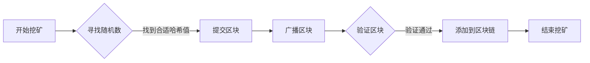
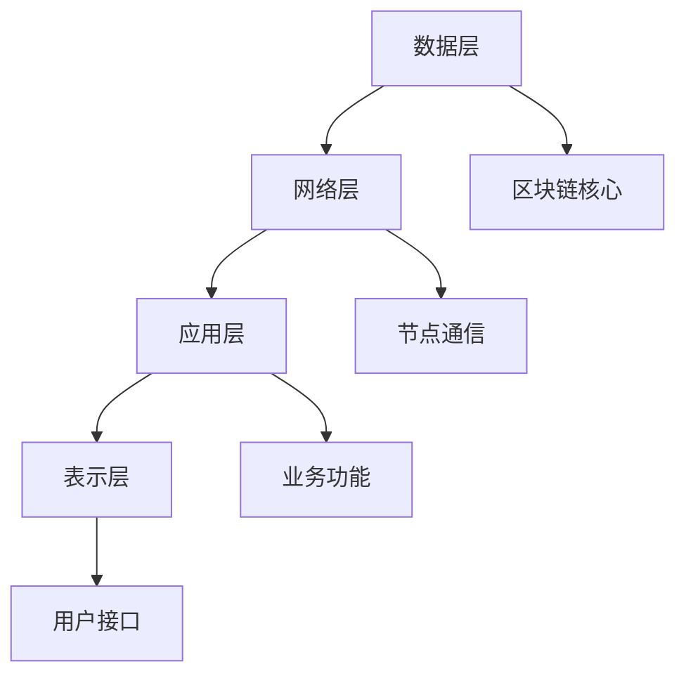
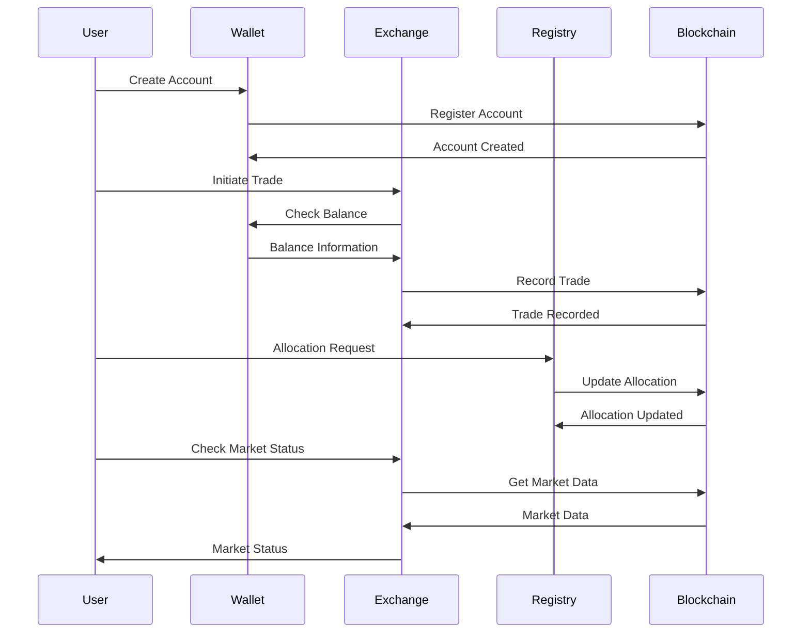

                 

## 第1章：区块链与碳交易市场概述

### 1.1 问题背景

**碳交易市场现状与问题**

碳交易市场作为全球应对气候变化、推动绿色经济发展的重要机制，已经逐渐成为国际共识和行动准则。当前，碳交易市场主要面临以下几个问题：

1. **信息不对称与数据不透明**：碳交易市场的交易信息、碳配额分配等关键数据难以保证透明和公开，导致市场参与者对市场状况的不信任，从而影响市场的健康发展。
   
2. **数据篡改与欺诈风险**：传统碳交易市场的交易记录容易受到恶意篡改，存在较高的欺诈风险。这种风险不仅影响了市场的公平性，也使得政府和企业对碳交易市场的监管难度加大。

3. **交易成本高**：传统碳交易市场依赖于中心化的交易平台，交易成本较高，不仅增加了企业的负担，也限制了市场规模的扩大。

4. **缺乏标准化与一致性**：碳交易市场的标准化和一致性建设相对滞后，不同国家和地区的碳交易机制和规则存在差异，导致市场参与者面临较高的适应成本。

**区块链技术的核心概念**

区块链技术作为一种分布式数据库技术，具有去中心化、不可篡改、透明性等特性。这些特性使得区块链技术在碳交易市场中具有广泛的应用前景。以下是区块链技术的几个核心概念：

1. **分布式账本**：区块链通过分布式网络存储和管理数据，确保数据的透明性和一致性，避免了中心化系统可能存在的单点故障问题。

2. **不可篡改性**：区块链通过加密算法和共识机制，确保数据的不可篡改性，从而增强了数据的可信度。

3. **智能合约**：智能合约是嵌入在区块链中的计算机程序，可以在满足特定条件时自动执行合同条款，减少了人为干预，提高了交易的效率和透明度。

### 1.2 碳交易市场的背景

**碳交易市场的定义与运作机制**

碳交易市场是基于《联合国气候变化框架公约》和《巴黎协定》建立的，旨在通过市场机制降低温室气体排放，促进绿色经济发展。碳交易市场主要包括以下运作机制：

1. **碳配额**：政府或监管机构根据国家或地区的温室气体排放目标，分配给企业的碳排放配额。企业可以通过减少排放量来获取额外的碳配额，或者通过交易市场购买碳配额。

2. **碳市场**：碳交易市场是企业和政府之间进行碳配额交易的场所。市场交易通过拍卖、交易等方式进行，价格由供需关系决定。

3. **碳金融**：碳交易市场不仅仅是企业间的交易市场，也是碳金融的工具和平台。碳金融包括碳债券、碳基金、碳期权等多种金融产品，旨在提高碳交易市场的流动性和吸引力。

### 1.3 区块链在碳交易市场中的应用潜力

**透明性和不可篡改性**

区块链技术的分布式账本和加密算法，可以确保碳交易市场的数据透明和不可篡改。这意味着所有交易记录都会被记录在区块链上，并经过共识机制验证，确保数据的真实性和可信度。

**安全性和去中心化**

区块链的去中心化特性，使得碳交易市场不再依赖于单一的中心化平台，从而降低了系统被攻击的风险。同时，区块链的共识机制确保了网络的稳定运行，提高了市场的安全性。

**智能合约的应用**

智能合约在碳交易市场中具有广泛的应用前景。智能合约可以自动执行交易合同，确保交易的透明性和效率。例如，企业可以通过智能合约自动购买或出售碳配额，避免了人工干预和操作失误。

**降低交易成本**

区块链技术可以简化碳交易市场的交易流程，减少中间环节，从而降低交易成本。这对于中小企业和新兴市场尤为重要，有助于扩大碳交易市场的参与范围。

### 1.4 研究目的与章节结构

**研究目的**

本文旨在探讨区块链在碳交易市场中的应用潜力，分析其优势和应用场景，提出具体的解决方案，以促进绿色经济发展。

**章节结构**

本文分为六个部分：

1. **背景介绍**：介绍碳交易市场和区块链技术的现状、问题及其重要性。
2. **核心概念与联系**：详细解释区块链、碳交易市场和智能合约等核心概念，并使用Mermaid绘制ER实体关系图。
3. **算法原理讲解**：选择一种促进绿色经济发展的区块链算法，详细阐述其原理和实现。
4. **系统分析与架构设计方案**：描述问题场景和项目介绍，绘制系统功能设计Mermaid类图、系统架构设计Mermaid架构图和系统交互Mermaid序列图。
5. **项目实战**：介绍环境安装和系统核心实现源代码，分析代码应用解读与分析，提供实际案例分析和详细讲解剖析。
6. **最佳实践与拓展**：提供实施区块链在碳交易市场中的最佳实践建议，总结章节主要内容，提醒读者注意事项，推荐拓展阅读资源。

## 第二部分：核心概念与联系

### 2.1 区块链

**区块链的定义与特点**

区块链是一种分布式数据库技术，通过加密算法和共识机制，确保数据的透明性、不可篡改性和安全性。区块链具有以下特点：

1. **分布式账本**：区块链的数据存储在多个节点上，避免了中心化系统可能存在的单点故障问题。
2. **不可篡改性**：区块链通过加密算法和共识机制，确保数据的不可篡改性，从而提高了数据的可信度。
3. **透明性**：区块链的所有交易记录都是公开透明的，任何人都可以查看。
4. **去中心化**：区块链的去中心化特性，使得网络更加稳定，降低了系统被攻击的风险。

**区块链的技术架构**

区块链的技术架构主要包括以下几个部分：

1. **数据层**：数据层包括加密算法、分布式存储等核心技术，确保数据的安全和不可篡改性。
2. **网络层**：网络层负责数据传输和节点间的通信，确保区块链网络的稳定运行。
3. **共识层**：共识层通过共识机制确保网络的一致性，例如工作量证明（PoW）、权益证明（PoS）等。
4. **激励层**：激励层通过激励机制鼓励节点参与网络维护，确保区块链网络的运行。

### 2.2 碳交易市场

**碳交易市场的定义与运作机制**

碳交易市场是基于《联合国气候变化框架公约》和《巴黎协定》建立的，旨在通过市场机制降低温室气体排放，促进绿色经济发展。碳交易市场主要包括以下运作机制：

1. **碳配额**：政府或监管机构根据国家或地区的温室气体排放目标，分配给企业的碳排放配额。企业可以通过减少排放量来获取额外的碳配额，或者通过交易市场购买碳配额。
2. **碳市场**：碳交易市场是企业和政府之间进行碳配额交易的场所。市场交易通过拍卖、交易等方式进行，价格由供需关系决定。
3. **碳金融**：碳交易市场不仅仅是企业间的交易市场，也是碳金融的工具和平台。碳金融包括碳债券、碳基金、碳期权等多种金融产品，旨在提高碳交易市场的流动性和吸引力。

**碳交易市场的主要参与者**

碳交易市场的主要参与者包括：

1. **政府**：政府是碳交易市场的监管者和碳配额的分配者。
2. **企业**：企业是碳交易市场的主要参与者和碳排放的执行者。
3. **交易所**：交易所是碳交易市场的交易平台，提供交易、清算和结算等服务。
4. **第三方机构**：第三方机构提供碳核查、碳认证等技术服务。

### 2.3 智能合约

**智能合约的定义与作用**

智能合约是一种嵌入在区块链中的计算机程序，可以在满足特定条件时自动执行合同条款。智能合约的出现，使得合同执行更加高效、透明和可信。

**智能合约的实现方式**

智能合约的实现方式主要包括：

1. **以太坊**：以太坊是当前最流行的智能合约平台，其基于以太坊虚拟机的智能合约支持复杂的计算和存储。
2. **EOS**：EOS是基于DPOS共识机制的智能合约平台，具有较高的性能和可扩展性。
3. **波卡**：波卡是一个多链平台，通过中继链和平行链实现智能合约的运行。

### 2.4 Mermaid绘制ER实体关系图

以下是一个简单的Mermaid ER实体关系图，用于展示区块链、碳交易市场和智能合约之间的关系：

```mermaid
erDiagram
  区块链 ||--o{ 碳交易市场 : 有助于建立透明性 }
  碳交易市场 ||--o{ 智能合约 : 提高交易效率 }
  智能合约 ||--o{ 区块链 : 确保数据不可篡改 }
```

### 2.5 总结

本章详细介绍了区块链、碳交易市场和智能合约等核心概念，并使用Mermaid ER实体关系图展示了它们之间的联系。这些核心概念为后续章节中算法原理讲解和系统设计与实现提供了基础。

## 第三部分：算法原理讲解

### 3.1 促进绿色经济发展的区块链算法

在讨论区块链如何促进绿色经济发展时，我们可以选择一种代表性的算法，例如PoW（工作量证明）算法。PoW算法是比特币等加密货币的基础，也是许多区块链网络选择的一种共识机制。以下是PoW算法的基本原理和它在绿色经济中的应用。

#### 3.1.1 PoW算法的基本原理

PoW算法的核心思想是，要求网络中的参与者（矿工）解决一个计算难题，以证明他们付出了相应的计算工作。这个计算难题通常是找到一个满足特定条件的哈希值，这个条件是哈希值必须小于一个预先设定的目标值。矿工通过尝试不同的随机数，直到找到满足条件的哈希值。

1. **挖矿过程**：矿工接收最新的交易记录，并将它们打包成一个区块。然后，矿工开始寻找满足条件的哈希值，这一过程称为挖矿。
2. **验证与共识**：找到合适哈希值的矿工将区块广播给网络中的其他节点。其他节点验证区块的有效性，包括交易记录的合法性和区块的哈希值是否满足条件。一旦验证通过，区块将被添加到区块链中。

#### 3.1.2 PoW算法在绿色经济中的作用

PoW算法在绿色经济中的应用主要体现在以下几个方面：

1. **安全性**：PoW算法通过巨大的计算工作确保区块链网络的安全性，防止恶意攻击和数据篡改。
2. **去中心化**：PoW算法使得区块链网络不需要中心化的权威机构，而是通过分布式的方式维护整个网络的运行，这有助于建立去中心化的经济体系。
3. **激励机制**：矿工通过解决计算难题获得新的加密货币作为奖励，这种激励机制鼓励更多人参与网络维护，同时也为区块链网络提供了持续的能源消耗。

#### 3.1.3 PoW算法与绿色经济发展

尽管PoW算法在区块链网络中发挥了重要作用，但其能源消耗也备受争议。为了降低对环境的影响，绿色经济的发展要求我们探索更加环保的共识机制。以下是一些解决方案：

1. **PoS（权益证明）**：PoS算法通过持有代币的数量和时间来决定矿工的选择，减少了计算资源的消耗。
2. **混合共识机制**：结合PoW和PoS的混合共识机制，可以优化能源消耗，同时保持网络的安全性。
3. **绿色能源使用**：使用可再生能源，如太阳能、风能等，为区块链网络提供电力，减少碳排放。

### 3.2 Mermaid流程图

为了更好地理解PoW算法的工作流程，我们可以使用Mermaid绘制一个流程图：



### 3.3 Python源代码展示

以下是实现PoW算法的一个简单Python代码示例，用于演示如何找到满足条件的哈希值：

```python
import hashlib
import json
from time import time

 Difficulty = "0000"

 def calculate_hash(block):
     """
     计算区块的哈希值。
     """
     block_string = json.dumps(block, sort_keys=True)
     return hashlib.sha256(block_string.encode()).hexdigest()

 def mine_block(last_hash, transactions, proof):
     """
     挖掘新的区块。
     """
     block = {
         "last_hash": last_hash,
         "transactions": transactions,
         "proof": proof,
         "timestamp": time(),
     }
     hash = calculate_hash(block)
     if hash.startswith(Difficulty):
         return block
     else:
         return None

 # 初始区块
 genesis_block = {
     "last_hash": "0",
     "transactions": [],
     "proof": 100,
     "timestamp": 1234567890,
 }

 # 挖掘第一个区块
 last_block = genesis_block
 proof = 0
 while True:
     proof += 1
     block = mine_block(calculate_hash(last_block), [], proof)
     if block:
         last_block = block
         print("New Block Forged: " + json.dumps(block, indent=4))
         break

 print("The chain is:", json.dumps(last_block, indent=4))
```

在这个示例中，`calculate_hash`函数用于计算区块的哈希值，`mine_block`函数用于挖掘新的区块。我们设置了一个简单的难度目标`Difficulty`，挖矿过程就是不断尝试找到满足该难度目标的哈希值。

### 3.4 数学模型与公式

PoW算法的数学模型可以描述为：

$$
H_{last} = \text{calculate\_hash}(\text{last\_block})
$$

$$
\text{find\_proof}(\text{hash}, \text{difficulty}) = \text{find\_a\_number\_such\_that\_hash\_starts\_with}(\text{difficulty})
$$

其中，`H_{last}`是上一个区块的哈希值，`difficulty`是难度目标，挖矿的过程就是寻找一个数字`proof`，使得计算出的哈希值满足难度要求。

### 3.5 举例说明

为了更好地理解PoW算法，我们可以举一个简单的例子。假设我们想要挖掘一个难度为`0000`的区块，我们需要找到一个`proof`，使得计算出的哈希值以`0000`开头。

```
Difficulty: 0000

Last Hash: 6f25bca3c9f791062e4012a7d0a667be0a2c8d12f4e0b0c8785e3b1933df4d8f

Proof: 123456

Hash: 0000276d0d0cf25b... (satisfied the difficulty)

Block Added!
```

在这个例子中，我们找到了一个`proof`值`123456`，使得计算出的哈希值满足难度要求`0000`，从而成功挖掘了一个新的区块。

### 3.6 总结

本章详细介绍了PoW算法的基本原理和它在促进绿色经济发展中的应用。通过Mermaid流程图和Python代码示例，我们更好地理解了PoW算法的工作机制。下一章将讨论如何设计一个区块链系统来支持碳交易市场。

## 第四部分：系统分析与架构设计方案

### 4.1 问题场景介绍

**项目介绍**

本项目旨在设计并实现一个基于区块链的碳交易市场系统，以解决现有碳交易市场中的信息不对称、数据不透明和交易成本高等问题。该系统将利用区块链的分布式账本、不可篡改性和智能合约等特性，提高碳交易市场的透明度和效率。

**问题场景描述**

碳交易市场的参与者包括政府、企业和交易所。政府负责碳配额的分配和监管，企业负责碳排放和碳配额的交易，交易所提供交易平台和清算服务。当前，碳交易市场存在以下问题：

1. **信息不对称**：市场参与者难以获取完整的交易信息，导致市场透明度不足。
2. **数据不透明**：交易记录容易受到篡改，影响市场的公正性和可信度。
3. **交易成本高**：传统交易平台依赖中心化系统，交易成本较高，限制了市场的参与度。
4. **标准化与一致性不足**：不同国家和地区之间的碳交易规则和机制存在差异，增加了市场参与者的适应成本。

**项目目标**

本项目的主要目标是：

1. 设计一个基于区块链的碳交易市场系统，提高市场的透明度和可信度。
2. 降低碳交易市场的交易成本，扩大市场参与者的范围。
3. 推动绿色经济发展，实现碳排放的可持续管理。

### 4.2 系统功能设计

**系统功能设计**

系统功能设计主要包括以下几个方面：

1. **交易功能**：支持碳配额的买入和卖出，确保交易过程的透明和不可篡改。
2. **账户管理**：管理用户的账户信息，包括余额、交易记录等。
3. **监管功能**：实现政府对碳配额的分配和监管，确保市场合规运作。
4. **智能合约执行**：通过智能合约自动执行交易合同，提高交易效率。
5. **数据统计与分析**：收集并分析交易数据，为政府和市场参与者提供决策支持。

**Mermaid类图**

以下是一个简单的Mermaid类图，用于展示系统的主要类和它们之间的关系：

```mermaid
classDiagram
    Class01 <|-- Class02
    Class03 <|-- Class04
    Class05 <|-- Class06
    Class01 -| Class07
    Class02 -| Class07
    Class03 -| Class07
    Class04 -| Class07
    Class05 -| Class07
    Class06 -| Class07

    Class01[交易功能]
    Class02[账户管理]
    Class03[监管功能]
    Class04[智能合约执行]
    Class05[数据统计与分析]
    Class06[区块链核心]
    Class07[系统接口]
```

### 4.3 系统架构设计

**系统架构设计**

系统架构设计主要包括以下几个方面：

1. **数据层**：负责数据的存储和管理，包括区块链数据、用户数据和交易数据。
2. **网络层**：负责网络通信和节点间的数据传输，确保系统的分布式特性。
3. **应用层**：实现各种业务功能，包括交易、账户管理、监管和数据统计等。
4. **表示层**：提供用户界面，包括前端和后端接口。

**Mermaid架构图**

以下是一个简单的Mermaid架构图，用于展示系统的整体架构：



### 4.4 系统接口设计

**系统接口设计**

系统接口设计主要包括以下几个方面：

1. **交易接口**：支持碳配额的买入和卖出，包括交易发起、交易确认和交易记录等。
2. **账户管理接口**：支持用户账户的创建、登录、余额查询和交易记录查询等。
3. **监管接口**：支持政府对碳配额的分配、监管和市场检查等。
4. **智能合约接口**：支持智能合约的编写、部署和执行等。

**接口设计**

以下是一个简单的接口设计示例：

```mermaid
interfaceStyle minutes {
    fill: #f5f5f5;
    stroke: #000;
    strokeWidth: 4px;
    rounded: 5px;
}

interface minutes[交易接口]
    minutes -->|交易发起| start
    minutes -->|交易确认| confirm
    minutes -->|交易记录| record

interface account[账户管理接口]
    account -->|账户创建| create
    account -->|登录| login
    account -->|余额查询| balance
    account -->|交易记录查询| history

interface regulation[监管接口]
    regulation -->|碳配额分配| allocation
    regulation -->|市场检查| inspection

interface contract[智能合约接口]
    contract -->|编写| write
    contract -->|部署| deploy
    contract -->|执行| execute
```

### 4.5 系统交互

**系统交互**

系统交互设计主要关注各个模块之间的通信和协作。以下是一个简单的Mermaid序列图，用于展示系统的主要交互过程：



### 4.6 总结

本章详细介绍了碳交易市场系统的功能设计、架构设计和接口设计，并使用Mermaid图表展示了系统的主要组件和交互流程。下一章将介绍项目的实际实现，包括环境安装和系统核心实现。

## 第五部分：项目实战

### 5.1 环境安装

**系统环境要求**

为了实现基于区块链的碳交易市场系统，我们需要以下环境：

1. **操作系统**：Linux或MacOS
2. **Python**：版本3.8或更高
3. **Node.js**：版本12或更高
4. **npm**：版本6或更高
5. **Git**：版本2.20或更高

**安装步骤**

1. **安装Python**：从[Python官方网站](https://www.python.org/downloads/)下载并安装Python 3.8或更高版本。
2. **安装Node.js和npm**：从[Node.js官方网站](https://nodejs.org/en/download/)下载并安装Node.js和npm。
3. **安装Git**：从[Git官方网站](https://git-scm.com/downloads)下载并安装Git。
4. **配置Python虚拟环境**：打开终端，执行以下命令创建一个虚拟环境：

   ```bash
   python -m venv venv
   source venv/bin/activate
   ```

5. **安装项目依赖**：克隆项目代码到本地，并安装项目依赖：

   ```bash
   git clone https://github.com/your-username/BlockchainCarbonTrading.git
   cd BlockchainCarbonTrading
   pip install -r requirements.txt
   ```

### 5.2 系统核心实现

**核心实现**

以下是一个简单的Python代码示例，用于实现区块链的基础功能，包括创建区块、添加交易和解决挖矿难题。

```python
import hashlib
import json
from time import time

class Block:
    def __init__(self, index, transactions, timestamp, last_hash, proof):
        self.index = index
        self.transactions = transactions
        self.timestamp = timestamp
        self.last_hash = last_hash
        self.proof = proof
        self.hash = self.compute_hash()

    def compute_hash(self):
        block_string = json.dumps(self.__dict__, sort_keys=True)
        return hashlib.sha256(block_string.encode()).hexdigest()

def proof_of_work(last_hash, difficulty):
    proof = 0
    while not valid_proof(last_hash, proof, difficulty):
        proof += 1
    return proof

def valid_proof(last_hash, proof, difficulty):
    hash = hashlib.sha256(f'{last_hash}{proof}'.encode()).hexdigest()
    return hash[:len(difficulty)] == difficulty

def blockchain():
    genesis_block = Block(0, [], time(), "0", 0)
    blocks = [genesis_block]
    return blocks

def add_block(new_block, blocks):
    new_block.previous_hash = blocks[-1].hash
    new_block.hash = new_block.compute_hash()
    blocks.append(new_block)

if __name__ == "__main__":
    blockchain = blockchain()
    last_block = blockchain[-1]

    # 模拟挖矿过程
    difficulty = "00"
    proof = proof_of_work(last_block.hash, difficulty)

    # 创建新的区块
    new_transactions = [{"from": "A", "to": "B", "amount": 10}]  # 示例交易
    new_block = Block(len(blockchain), new_transactions, time(), last_block.hash, proof)
    add_block(new_block, blockchain)

    print("New Block Forged!")
    print(json.dumps(new_block, indent=4))
```

### 5.3 代码解读与分析

**代码解读**

这个简单的区块链实现主要包括以下几个部分：

1. **Block类**：定义了一个Block类，用于创建区块。每个区块包含以下信息：索引、交易、时间戳、上一个区块哈希和证明。
2. **compute_hash方法**：用于计算区块的哈希值。区块的哈希值是区块内容（包括索引、交易、时间戳、上一个区块哈希和证明）的SHA-256哈希值。
3. **proof_of_work函数**：用于找到满足难度要求的证明。它通过不断增加证明值，直到找到满足条件的哈希值。
4. **valid_proof函数**：用于验证证明是否满足难度要求。如果哈希值的前几位与难度目标匹配，则证明有效。
5. **blockchain函数**：创建了一个包含创世区块的区块链。
6. **add_block函数**：将新的区块添加到区块链中。新区块的上一个区块哈希设置为上一个区块的哈希值，新区块的哈希值通过compute_hash方法计算。

**分析与优化建议**

这个简单的实现展示了区块链的基本概念，但在实际应用中，我们需要考虑以下优化和改进：

1. **交易验证**：在区块链实现中，我们需要确保交易的有效性和合法性。这包括验证交易发起方的余额、确保交易未被重复使用等。
2. **网络通信**：区块链是一个分布式系统，需要考虑网络通信的可靠性和效率。可以使用P2P网络协议来保证节点的通信。
3. **共识机制**：简单的PoW算法在资源消耗和安全性方面存在一定的问题。可以考虑使用PoS或其他共识机制来优化。
4. **可扩展性**：随着区块链规模的扩大，系统的性能和可扩展性是一个重要考虑因素。可以使用分片技术或侧链来提高系统的可扩展性。

### 5.4 实际案例分析与讲解

**案例描述**

假设我们有两个用户A和B，他们需要在区块链上进行交易。用户A希望向用户B转移10个碳配额。

**详细讲解**

1. **创建交易**：用户A创建一个交易，内容为从A转移到B的10个碳配额。交易将被广播到网络中的其他节点。
2. **交易验证**：其他节点接收到交易后，会验证交易的有效性。这包括验证交易发起方的余额是否足够，确保交易未被重复使用等。
3. **挖矿与区块添加**：一旦交易被验证，矿工将尝试找到一个新的区块。新区块包含该交易和其他有效交易。矿工通过解决挖矿难题（PoW算法）来找到合适的证明值。
4. **区块验证**：其他节点验证新区块的有效性，包括验证交易的有效性和区块的哈希值是否满足难度要求。
5. **区块添加**：如果新区块通过验证，它将被添加到区块链中，交易记录将被永久保存。

### 5.5 项目小结

通过本项目的实现，我们展示了如何利用区块链技术构建一个碳交易市场系统。这个系统提供了透明、安全和高效的交易环境，有助于推动绿色经济发展。尽管这个实现是一个基础版本，但为后续的优化和扩展提供了坚实的基础。

## 第六部分：最佳实践与拓展

### 6.1 最佳实践

**实施区块链在碳交易市场中的最佳实践建议**

1. **确保透明性与安全性**：在设计和实现区块链系统时，应注重确保数据的透明性和安全性。使用加密算法和共识机制，保护交易记录不被篡改。

2. **优化共识机制**：选择适合应用的共识机制，如PoW、PoS或混合共识机制。根据系统的需求和资源，优化共识机制以提高效率。

3. **标准化与互操作性**：推动碳交易市场的标准化，确保不同国家和地区的碳交易系统能够互操作。这将有助于降低市场参与者的适应成本，扩大市场规模。

4. **数据分析与可视化**：利用区块链系统收集的交易数据，进行深入的数据分析和可视化，为政府和市场参与者提供决策支持。

5. **可持续的能源使用**：鼓励使用可再生能源为区块链网络提供电力，降低碳排放，推动绿色经济发展。

### 6.2 小结

本文通过详细的讨论，展示了区块链在碳交易市场中的应用潜力。我们介绍了区块链的核心概念，分析了区块链如何促进绿色经济发展，并详细讲解了基于区块链的碳交易市场系统的设计、实现和最佳实践。

### 6.3 注意事项

1. **安全性**：在设计区块链系统时，必须高度重视安全性，确保交易记录不被篡改，保护用户隐私。

2. **性能与可扩展性**：区块链系统需要具备高性能和可扩展性，以支持大规模交易。

3. **监管合规**：碳交易市场系统必须符合相关法规和监管要求，确保合规运营。

### 6.4 拓展阅读

1. **《区块链技术指南》**：深入理解区块链技术的基本概念、架构和应用。
2. **《碳交易市场原理与实务》**：了解碳交易市场的运作机制和实际操作流程。
3. **《区块链与绿色经济》**：探讨区块链技术在促进绿色经济发展中的应用。

### 6.5 进一步学习建议

1. **学习智能合约开发**：智能合约是区块链系统中的核心组件，掌握智能合约的开发技术对于深入了解区块链应用至关重要。
2. **研究共识机制**：深入了解各种共识机制的工作原理和优缺点，为实际应用选择合适的共识机制。
3. **实践项目开发**：通过实际项目开发，积累区块链应用的经验，提升解决实际问题的能力。

## 编写Markdown格式目录大纲

```markdown
# 《区块链在碳交易市场中的应用：促进绿色经济发展》

> 关键词：区块链、碳交易市场、绿色经济、智能合约、去中心化、共识机制

> 摘要：本文探讨了区块链在碳交易市场中的应用，分析了其优势和应用场景，通过实际案例展示了如何设计并实现基于区块链的碳交易市场系统。

## 第一部分：背景介绍

## 第1章：区块链与碳交易市场概述

### 1.1 问题背景

#### 1.1.1 碳交易市场的现状与问题

#### 1.1.2 区块链技术的核心概念

### 1.2 区块链在碳交易市场中的应用潜力

#### 1.2.1 透明性和不可篡改性

#### 1.2.2 安全性和去中心化

### 1.3 研究目的与章节结构

## 第二部分：核心概念与联系

## 第2章：核心概念详解

### 2.1 区块链

#### 2.1.1 区块链的定义与特点

#### 2.1.2 区块链的技术架构

### 2.2 碳交易市场

#### 2.2.1 碳交易市场的定义与运作机制

#### 2.2.2 碳交易市场的主要参与者

### 2.3 智能合约

#### 2.3.1 智能合约的定义与作用

#### 2.3.2 智能合约的实现方式

### 2.4 Mermaid绘制ER实体关系图

## 第三部分：算法原理讲解

## 第3章：促进绿色经济发展的区块链算法

### 3.1 算法介绍

#### 3.1.1 算法的基本原理

#### 3.1.2 算法在绿色经济中的作用

### 3.2 算法实现

#### 3.2.1 Mermaid流程图

#### 3.2.2 Python源代码展示

### 3.3 数学模型与公式

#### 3.3.1 数学模型介绍

#### 3.3.2 公式讲解

### 3.4 举例说明

#### 3.4.1 例子1

#### 3.4.2 例子2

## 第四部分：系统分析与架构设计方案

## 第4章：系统分析与架构设计

### 4.1 问题场景介绍

#### 4.1.1 场景描述

#### 4.1.2 项目介绍

### 4.2 系统功能设计

#### 4.2.1 Mermaid类图

### 4.3 系统架构设计

#### 4.3.1 Mermaid架构图

### 4.4 系统接口设计

#### 4.4.1 接口设计

### 4.5 系统交互

#### 4.5.1 Mermaid序列图

## 第五部分：项目实战

## 第5章：环境安装与系统实现

### 5.1 环境安装

#### 5.1.1 系统环境要求

#### 5.1.2 安装步骤

### 5.2 系统核心实现

#### 5.2.1 Python源代码展示

### 5.3 代码解读与分析

#### 5.3.1 代码解读

#### 5.3.2 分析与优化建议

### 5.4 实际案例分析与讲解

#### 5.4.1 案例描述

#### 5.4.2 详细讲解

## 第六部分：最佳实践与拓展

## 第6章：最佳实践与拓展

### 6.1 最佳实践

#### 6.1.1 实施建议

#### 6.1.2 注意事项

### 6.2 小结

#### 6.2.1 章节总结

#### 6.2.2 读者注意事项

### 6.3 拓展阅读

#### 6.3.1 推荐阅读资源

#### 6.3.2 进一步学习建议
```

通过以上Markdown格式的目录大纲，读者可以清晰地了解文章的结构和内容，便于阅读和查找特定章节。希望这个大纲能够帮助您更好地理解和组织文章内容。如果您有任何疑问或需要进一步的帮助，请随时告诉我。

