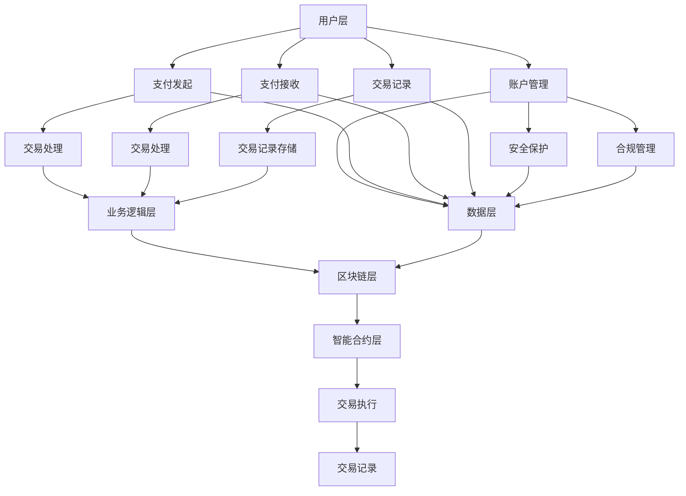
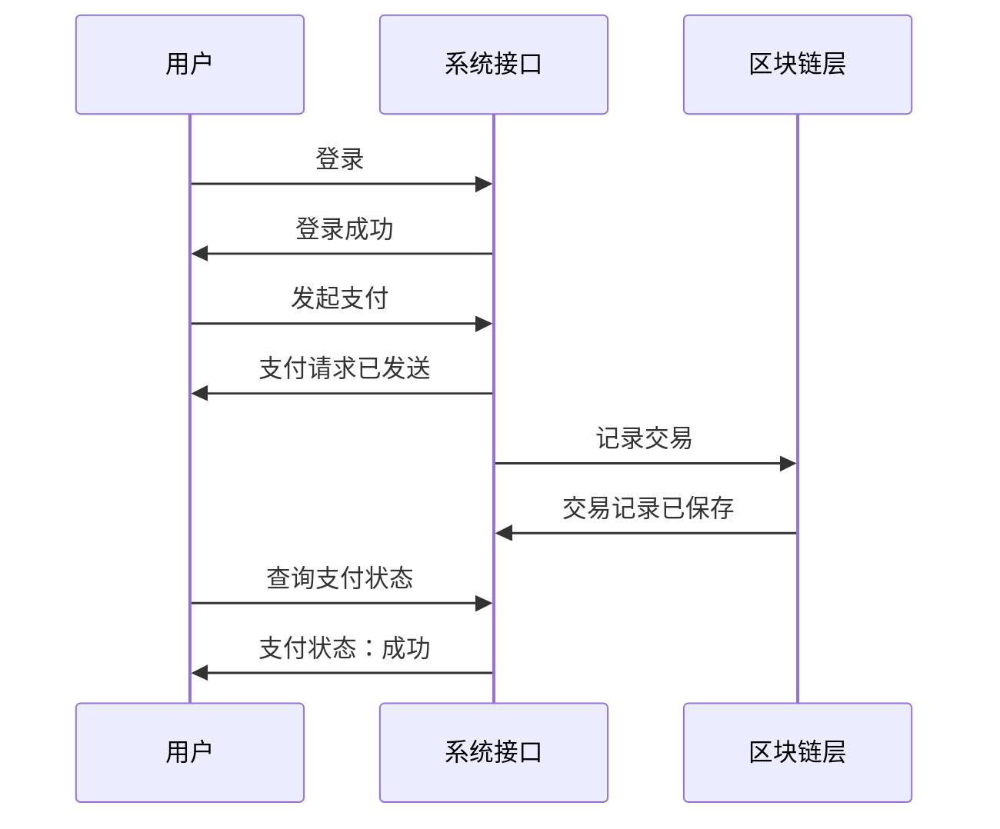

                 


# 《区块链在跨境支付中的应用探索》

关键词：区块链、跨境支付、分布式账本、智能合约、加密技术、共识算法、去中心化

摘要：本文旨在探讨区块链技术在跨境支付中的应用潜力，通过逐步分析区块链的基本原理和跨境支付的问题背景，详细阐述区块链在跨境支付中的具体应用，并探讨相关技术挑战、法规与未来趋势。本文将为读者提供一个全面的视角，以理解区块链技术如何颠覆传统跨境支付体系，并提出相应的解决方案。

## 引言

跨境支付一直是金融行业的一个痛点。随着全球化的加速，跨境交易的需求日益增长，但传统跨境支付系统存在诸多问题，如交易时间长、手续费高、不透明等。区块链技术的兴起为解决这些问题带来了新的可能性。区块链作为一种分布式账本技术，具有去中心化、透明性和不可篡改等特性，被认为是跨境支付领域的潜在颠覆者。

本文将分为以下几个部分进行探讨：

1. **区块链与跨境支付：问题背景与探索意义**：介绍区块链技术和跨境支付的现状，探讨区块链在跨境支付中的潜在应用。
2. **区块链技术基础**：讲解区块链的核心概念和技术原理，包括分布式账本、共识算法、加密技术和智能合约。
3. **区块链在跨境支付中的应用**：分析现有的区块链解决方案，并举例说明区块链在跨境支付中的具体应用。
4. **技术挑战与解决方案**：讨论区块链在跨境支付中面临的技术挑战，并提出可能的解决方案。
5. **法规与法律考虑**：分析全球跨境支付法规环境，探讨区块链在跨境支付中的法律问题。
6. **未来趋势与创新**：预测区块链在跨境支付领域的未来趋势，并探讨可能的创新方向。
7. **结论与建议**：总结本文的核心观点，并提出对未来的展望。

## 区块链与跨境支付：问题背景与探索意义

### 跨境支付现状

跨境支付是指在不同国家或地区之间进行货币兑换和资金转移的过程。随着全球贸易和金融活动的增加，跨境支付的需求不断上升。然而，传统的跨境支付系统存在以下问题：

1. **交易时间长**：传统跨境支付通常需要数天时间才能完成，这对那些需要快速支付的企业和个人来说是一个重大障碍。
2. **手续费高**：传统跨境支付的手续费通常较高，这对于小额跨境支付尤其不利。
3. **不透明**：传统跨境支付系统缺乏透明度，资金流动路径不明确，容易导致欺诈和不信任。
4. **风险高**：跨境支付涉及到不同国家的法律和监管环境，存在汇率风险和合规风险。

### 区块链技术的潜在解决方案

区块链技术作为一种分布式账本技术，具有以下特性，使其成为跨境支付的潜在解决方案：

1. **去中心化**：区块链的去中心化特性消除了传统支付系统中中介机构的依赖，降低了交易成本和风险。
2. **透明性**：区块链上的交易记录是公开透明的，可以增强交易的信任度。
3. **安全性**：区块链使用加密技术确保数据的完整性和安全性。
4. **可追溯性**：区块链上的交易记录具有不可篡改性，可以追溯交易的历史记录。
5. **高速性**：区块链上的交易可以快速完成，缩短了交易时间。

区块链技术的这些特性使其在跨境支付领域具有巨大的潜力。通过去中心化和透明性，区块链可以降低交易成本和风险；通过安全性和可追溯性，可以提高交易的信任度和合规性。

## 区块链技术基础

### 区块链架构原理

区块链的核心是分布式账本，它由多个节点共同维护。每个节点都保存一份完整的账本副本，并且这些节点之间通过共识算法保持账本的一致性。

#### 区块结构

区块链由一系列按时间顺序排列的区块组成，每个区块包含一定数量的交易记录。每个区块都有一个唯一的标识符（哈希值），并通过加密算法与前面的区块相连，形成链式结构。

#### 链结构

区块链的链结构确保了数据的不可篡改性。如果某个区块被篡改，那么与之相连的所有区块的哈希值都会发生变化，导致整个区块链的一致性被破坏。

#### 共识算法

共识算法是区块链网络中节点之间达成一致的方式。常见的共识算法有工作量证明（PoW）、权益证明（PoS）和委托权益证明（DPoS）等。

### 加密技术基础

区块链使用加密技术确保数据的完整性和安全性。加密技术包括哈希函数、非对称加密和数字签名等。

#### 哈希函数

哈希函数是一种将任意长度的输入数据映射为固定长度的输出数据的算法。在区块链中，哈希函数用于生成区块的唯一标识符。

#### 非对称加密

非对称加密使用一对密钥（公钥和私钥）进行加密和解密。公钥可以公开，私钥必须保密。在区块链中，非对称加密用于确保交易的安全性和匿名性。

#### 数字签名

数字签名是一种使用私钥对数据进行签名，确保数据来源和数据完整性的方法。在区块链中，数字签名用于验证交易的真实性和完整性。

### 智能合约机制

智能合约是区块链上的可编程合约，它可以在满足特定条件时自动执行。智能合约使用编程语言编写，并在区块链上部署和执行。

#### 智能合约架构

智能合约由代码、输入参数和输出结果组成。智能合约在执行时，会根据输入参数进行计算，并产生输出结果。

#### 智能合约示例

一个简单的智能合约示例是众筹项目。当众筹目标金额达到时，智能合约会自动将资金转移到项目发起者账户。

## 区块链在跨境支付中的应用

### 现有区块链解决方案概述

目前，已经有许多区块链解决方案被应用于跨境支付领域。以下是一些典型的解决方案：

#### Ripple

Ripple是一个分布式支付网络，它使用自己的加密货币XRP作为中介货币，以加速跨境支付并降低交易成本。Ripple通过其共识算法Ripple Protocol Consensus Algorithm（RPCA）确保网络的安全性和一致性。

#### Stellar

Stellar是一个开放源代码的分布式支付网络，它允许不同货币之间的直接交易。Stellar网络使用自己的加密货币Lumens（XLM）作为交易媒介，以降低交易费用。

#### Ethereum

Ethereum是一个去中心化的智能合约平台，它支持各种复杂的智能合约。Ethereum上的智能合约可以用于构建跨境支付系统，如0x项目和Pulse。

### 成功案例

以下是一些成功的区块链跨境支付案例：

####ibanq

ibanq是一个基于区块链的跨境支付平台，它使用Ripple协议进行支付。ibanq通过简化支付流程，降低了跨境支付的手续费和时间成本。

#### crossriver

crossriver是一个基于区块链的跨境支付平台，它使用Stellar协议进行支付。crossriver的目标是提供快速、低成本和安全的跨境支付服务。

#### dartlabs

dartlabs是一个基于Ethereum的跨境支付平台，它使用0x协议进行去中心化的交易。dartlabs提供灵活的支付解决方案，满足不同客户的需求。

## 技术挑战与解决方案

### 可扩展性

区块链在跨境支付中面临的一个主要挑战是可扩展性。随着交易量的增加，区块链的性能可能会受到影响。为了解决可扩展性问题，研究人员和开发者正在探索多种方法，如分层架构、状态通道和侧链等。

### 隐私保护

区块链上的交易记录是公开透明的，这在某些情况下可能导致隐私泄露。为了保护用户隐私，研究者们正在开发隐私增强技术，如零知识证明和匿名交易。

### 互操作性

区块链的互操作性是一个挑战，因为不同的区块链平台可能使用不同的共识算法和加密技术。为了实现互操作性，研究者们正在开发跨链技术，如币币交易和跨链协议。

## 法规与法律考虑

### 全球跨境支付法规环境

跨境支付受到不同国家的法律和监管环境的约束。全球跨境支付法规环境复杂多样，不同的法规对区块链的应用提出了不同的要求。

### 合规问题

区块链在跨境支付中的合规问题包括数据保护、反洗钱（AML）和了解你的客户（KYC）等。为了满足合规要求，区块链平台需要建立严格的合规机制。

### 法律问题

区块链在跨境支付中涉及的法律问题包括合同法、财产权和知识产权等。明确这些法律问题对于区块链在跨境支付中的合法应用至关重要。

## 未来趋势与创新

### 出现的新技术

区块链在跨境支付中可能会受到新技术的影响，如分布式身份识别、分布式存储和物联网（IoT）等。这些技术可以增强区块链在跨境支付中的应用。

### 潜在的创新方向

区块链在跨境支付中的创新方向包括去中心化金融（DeFi）、跨境支付智能合约和区块链供应链金融等。这些创新方向有望进一步降低跨境支付的成本和时间。

## 结论与建议

区块链技术在跨境支付领域具有巨大的潜力，可以解决传统跨境支付系统中的诸多问题。通过逐步分析区块链的基本原理和跨境支付的问题背景，本文详细阐述了区块链在跨境支付中的应用、技术挑战和法规问题，并预测了未来的趋势和创新方向。为了推动区块链在跨境支付中的发展，本文建议：

1. **加强技术研究**：继续探索可扩展性、隐私保护和互操作性等技术难题。
2. **完善法规体系**：建立全球统一的跨境支付法规，确保区块链平台符合合规要求。
3. **促进技术创新**：鼓励跨领域的创新合作，推动区块链在跨境支付中的实际应用。

作者：AI天才研究院/AI Genius Institute & 禅与计算机程序设计艺术 /Zen And The Art of Computer Programming

## 背景介绍

### 核心概念术语说明

- **区块链**：一种去中心化的分布式账本技术，通过加密算法确保数据的完整性和安全性，并通过共识算法保持多个节点之间的一致性。
- **跨境支付**：指在不同国家或地区之间进行货币兑换和资金转移的过程。
- **分布式账本**：记录交易数据的分布式数据库，多个节点共同维护，无需中心化中介机构。
- **共识算法**：区块链网络中节点之间达成一致的方式，确保区块链的一致性和安全性。
- **智能合约**：区块链上的可编程合约，自动执行满足特定条件的操作。

### 问题背景

跨境支付一直是金融行业的一个痛点。传统跨境支付系统存在以下问题：

1. **交易时间长**：跨境支付通常需要数天时间才能完成，导致资金流转缓慢。
2. **手续费高**：跨境支付的手续费较高，特别是对于小额跨境支付，成本不菲。
3. **不透明**：传统跨境支付系统的流程复杂，不透明度高，容易导致欺诈和不信任。
4. **风险高**：跨境支付涉及到不同国家的法律和监管环境，存在汇率风险和合规风险。

这些问题严重影响了跨境支付的效率、成本和安全性。因此，探索新的解决方案，提高跨境支付效率，降低成本，增加透明度和安全性，成为了一个迫切需要解决的问题。

### 问题描述

区块链技术的兴起为跨境支付提供了新的可能性。区块链作为一种分布式账本技术，具有去中心化、透明性、安全性和可追溯性等特性，可以解决传统跨境支付系统中的问题。然而，区块链在跨境支付中的应用仍然面临一些挑战：

1. **可扩展性**：随着交易量的增加，区块链的性能可能会受到影响。
2. **隐私保护**：区块链上的交易记录是公开透明的，这在某些情况下可能导致隐私泄露。
3. **互操作性**：不同的区块链平台可能使用不同的共识算法和加密技术，实现互操作性是一个挑战。
4. **法规合规**：区块链在跨境支付中的合规问题包括数据保护、反洗钱（AML）和了解你的客户（KYC）等。

因此，本文的目标是探讨区块链在跨境支付中的应用，分析其优势与挑战，并提出相应的解决方案。

### 问题解决

区块链技术在跨境支付中的潜在解决方案包括：

1. **去中心化**：通过去中心化技术，减少对中介机构的依赖，降低交易成本和风险。
2. **透明性**：通过区块链上的公开透明记录，提高交易的信任度和透明度。
3. **安全性**：使用加密技术确保数据的完整性和安全性。
4. **可追溯性**：通过区块链上的不可篡改记录，实现交易的历史记录可追溯性。
5. **智能合约**：使用智能合约自动化执行交易，提高交易效率。

然而，区块链在跨境支付中的应用也面临一些挑战，如可扩展性、隐私保护和互操作性等。为了解决这些问题，研究者们正在探索新的技术和方法，如分层架构、状态通道、跨链技术和隐私增强技术等。

### 边界与外延

区块链在跨境支付中的应用边界主要受到技术、法规和市场等因素的制约。在实际应用中，需要考虑以下因素：

1. **技术限制**：区块链技术的成熟度和性能对跨境支付应用有直接影响。
2. **法规限制**：不同国家和地区的法规对区块链的应用有不同的要求和限制。
3. **市场接受度**：市场的接受度和参与者数量对区块链跨境支付的应用有重要影响。
4. **用户体验**：用户体验是影响区块链跨境支付应用的重要因素，需要优化用户界面和操作流程。

### 概念结构与核心要素组成

区块链在跨境支付中的应用可以分为以下几个核心要素：

1. **分布式账本**：记录跨境支付交易数据，实现去中心化和透明性。
2. **共识算法**：确保区块链网络中的多个节点之间达成一致，保证数据的一致性和安全性。
3. **加密技术**：确保交易数据的完整性和安全性，防止数据篡改和泄露。
4. **智能合约**：实现跨境支付交易自动化，提高交易效率和可信度。
5. **隐私保护**：采用隐私增强技术，保护用户隐私，防止交易记录公开透明带来的隐私泄露风险。

通过这些核心要素的协同作用，区块链在跨境支付中可以实现去中心化、透明性、安全性和效率的提升。

## 核心概念与联系

### 区块链的基本原理

区块链是一种分布式账本技术，通过多个节点共同维护一个共享的、不可篡改的账本。区块链的核心概念包括分布式账本、共识算法、加密技术和智能合约。

#### 分布式账本

分布式账本是指将数据分散存储在多个节点上，而不是集中在一个中心化的服务器中。这样做的优点是提高了系统的可靠性和安全性，因为即使某个节点出现故障，其他节点仍然可以继续运行。

#### 共识算法

共识算法是区块链网络中节点之间达成一致的方式。常见的共识算法包括工作量证明（PoW）、权益证明（PoS）和委托权益证明（DPoS）等。这些算法确保了区块链的一致性和安全性。

#### 加密技术

区块链使用加密技术来确保数据的完整性和安全性。加密技术包括哈希函数、非对称加密和数字签名等。哈希函数用于生成数据的唯一标识符，非对称加密用于确保交易的安全性和匿名性，数字签名用于验证交易的真实性和完整性。

#### 智能合约

智能合约是区块链上的可编程合约，它可以在满足特定条件时自动执行。智能合约使用编程语言编写，并在区块链上部署和执行。智能合约可以用于自动化跨境支付交易，提高交易的效率。

### 区块链在跨境支付中的应用

区块链在跨境支付中的应用主要利用其分布式账本、共识算法、加密技术和智能合约等特性。以下是一个简化的区块链跨境支付流程：

1. **用户发起交易**：用户通过区块链网络发起跨境支付交易。
2. **交易记录**：交易记录被广播到区块链网络的所有节点。
3. **共识达成**：节点之间通过共识算法达成一致，确认交易的有效性。
4. **交易执行**：一旦共识达成，交易会被执行，资金从付款方转移到收款方。
5. **交易记录**：交易记录被永久保存在区块链上，确保透明性和不可篡改性。

### 概念属性特征对比表格

| 概念         | 属性特征                                                         | 对比分析                                                     |
| ------------ | ------------------------------------------------------------ | ------------------------------------------------------------ |
| 分布式账本   | 数据分散存储，无需中心化服务器                                 | 提高系统的可靠性和安全性                                     |
| 共识算法     | 节点之间达成一致的方式                                         | 确保区块链的一致性和安全性                                   |
| 加密技术     | 数据加密，确保安全性和匿名性                                   | 防止数据篡改和泄露                                           |
| 智能合约     | 自动执行满足特定条件的操作                                     | 提高交易效率和可信度                                       |

### ER实体关系图架构

为了更好地理解区块链在跨境支付中的应用，可以使用ER（实体-关系）模型来描述其架构。以下是区块链跨境支付系统的ER模型：

```mermaid
erDiagram
  Customer ||--o{ Payment :发起支付}
  Merchant ||--o{ Payment :接收支付}
  Blockchain ||--o{ Transaction :记录交易}
  Transaction ||--|{ Customer }
  Transaction ||--|{ Merchant }
  Transaction ||--|{ Blockchain }
```

在ER模型中：

- **Customer**（客户）实体代表发起支付的用户。
- **Merchant**（商家）实体代表接收支付的用户。
- **Blockchain**（区块链）实体代表用于记录交易的分布式账本。
- **Transaction**（交易）实体代表具体的支付交易记录。

每个交易记录都与客户、商家和区块链实体相关联，确保支付交易的可追溯性和安全性。

### 算法原理讲解

区块链在跨境支付中的应用主要依赖于以下几个核心算法：

1. **哈希函数**：用于生成交易记录的唯一标识符。
2. **非对称加密**：用于确保交易的安全性和匿名性。
3. **数字签名**：用于验证交易的真实性和完整性。
4. **共识算法**：用于节点之间达成一致，确保区块链的一致性和安全性。

#### 哈希函数

哈希函数是一种将任意长度的输入数据映射为固定长度的输出数据的算法。在区块链中，常用的哈希函数是SHA-256。SHA-256可以生成一个256位的哈希值，确保数据唯一性和不可篡改性。

#### 非对称加密

非对称加密使用一对密钥（公钥和私钥）进行加密和解密。公钥可以公开，私钥必须保密。在区块链中，非对称加密用于确保交易的安全性和匿名性。例如，用户A可以使用其私钥对交易进行签名，然后使用公钥进行验证。

#### 数字签名

数字签名是一种使用私钥对数据进行签名，确保数据来源和数据完整性的方法。在区块链中，数字签名用于验证交易的真实性和完整性。例如，用户A可以对交易数据进行签名，然后用户B可以使用公钥验证签名的有效性。

#### 共识算法

共识算法是区块链网络中节点之间达成一致的方式。常见的共识算法包括工作量证明（PoW）、权益证明（PoS）和委托权益证明（DPoS）等。

1. **工作量证明（PoW）**：节点通过解决数学难题来证明其工作，从而获得记账权。这种算法的安全性较高，但能耗较大。
2. **权益证明（PoS）**：节点根据其在区块链中的权益（如持有的币龄）来获得记账权。这种算法能耗较低，但权益分配可能不公平。
3. **委托权益证明（DPoS）**：节点由其他节点投票选出，获得记账权。这种算法效率较高，但可能导致中心化。

#### 示例

假设用户A想要向用户B发送一定数量的加密货币。以下是区块链跨境支付的交易过程：

1. **交易发起**：用户A创建一个交易，并将交易数据发送到区块链网络。
2. **交易签名**：用户A使用私钥对交易数据进行签名，确保交易来源和完整性。
3. **交易广播**：交易被广播到区块链网络的所有节点。
4. **共识达成**：节点通过共识算法确认交易的有效性。
5. **交易执行**：一旦共识达成，交易将被执行，资金从用户A转移到用户B。
6. **交易记录**：交易记录被永久保存在区块链上，确保透明性和不可篡改性。

### 数学模型和公式

在区块链跨境支付中，一些关键的数学模型和公式包括：

1. **哈希函数**：$H(x) = SHA-256(x)$，其中$H(x)$是哈希值，$x$是输入数据。
2. **非对称加密**：$E_{pub}(m) = c$，其中$E_{pub}$是公钥加密函数，$m$是明文，$c$是密文。
3. **数字签名**：$S = sign(m, sk)$，其中$sign$是签名函数，$m$是明文，$sk$是私钥，$S$是签名。
4. **共识算法**：PoW算法中的难度目标$d$满足：$d = H(nonce) < target$，其中$nonce$是随机数，$target$是预定的难度目标。

通过这些数学模型和公式，区块链跨境支付交易可以实现数据的完整性、安全性和一致性。

### 系统分析与架构设计方案

#### 问题场景介绍

随着全球化的不断深入，跨境支付需求日益增加。传统跨境支付系统存在交易时间长、手续费高、不透明等问题，难以满足现代金融市场的需求。区块链技术以其去中心化、透明性、安全性和可追溯性等特性，被认为是一种潜在的解决方案。本方案旨在设计一个基于区块链的跨境支付系统，以解决传统跨境支付系统中的问题。

#### 项目介绍

项目名称：CrossBorderPay（CBP）

目标：构建一个安全、高效、透明的跨境支付平台，降低交易成本，提高交易速度。

技术栈：区块链、智能合约、加密技术、共识算法

#### 系统功能设计

系统功能包括：

1. **账户管理**：用户可以创建和管理自己的账户。
2. **支付发起**：用户可以通过系统发起跨境支付请求。
3. **支付接收**：用户可以接收来自其他用户的跨境支付。
4. **交易记录**：系统记录所有交易，确保透明性和可追溯性。
5. **安全保护**：使用加密技术确保交易数据的安全。
6. **合规管理**：确保系统符合全球跨境支付法规。

#### 系统架构设计

系统架构设计包括以下模块：

1. **用户层**：提供用户界面，包括账户管理、支付发起和接收等功能。
2. **业务逻辑层**：处理支付请求、交易记录等业务逻辑。
3. **数据层**：存储用户数据和交易数据。
4. **区块链层**：实现区块链功能，包括分布式账本、共识算法等。
5. **智能合约层**：部署和管理智能合约。

#### 系统架构图



#### 系统接口设计

系统接口设计包括以下接口：

1. **账户管理接口**：包括创建账户、登录、修改密码等功能。
2. **支付接口**：包括发起支付、查询支付状态等功能。
3. **交易记录接口**：包括查询交易记录、下载交易记录等功能。
4. **安全接口**：包括加密数据、验证签名等功能。
5. **合规接口**：包括合规检查、合规报告等功能。

#### 系统交互

系统交互设计包括用户与系统、系统与区块链层之间的交互。以下是系统交互图：



通过以上系统分析与架构设计方案，我们可以构建一个基于区块链的跨境支付系统，提高交易效率、降低成本、增加透明度，并确保交易的安全性。

### 项目实战

#### 环境安装

为了在项目中实施基于区块链的跨境支付系统，我们需要以下环境：

1. **操作系统**：Ubuntu 18.04
2. **编程语言**：Python 3.8
3. **开发工具**：Visual Studio Code
4. **区块链平台**：Hyperledger Fabric

首先，我们需要安装Ubuntu 18.04操作系统。可以使用以下命令更新系统并安装Python和Visual Studio Code：

```bash
sudo apt update
sudo apt upgrade
sudo apt install python3.8 python3-pip
sudo snap install --classic visual-studio-code
```

接下来，我们安装Hyperledger Fabric。可以通过以下命令进行安装：

```bash
curl -sSL https://bitnami.com/downloads/stacks/hyperledger/installer/scripts/installer.sh | bash
```

安装完成后，启动Hyperledger Fabric网络：

```bash
fabric-install network start
```

#### 系统核心实现

在本项目中，我们将使用Hyperledger Fabric来实现跨境支付系统。以下是一个简单的实现示例：

1. **创建智能合约**

首先，我们需要编写智能合约代码。以下是一个简单的Python智能合约示例：

```python
# payment_contract.py
from py fabric.contract import Contract

class PaymentContract(Contract):
    def transfer(self, from_account, to_account, amount):
        if self.get_balance(from_account) >= amount:
            self.invoke('transfer', from_account, to_account, amount)
            return True
        else:
            return False
```

2. **部署智能合约**

接下来，我们将智能合约部署到Hyperledger Fabric网络中。首先，我们需要生成必要的密钥和证书：

```bash
fabric-install network generate-cert
```

然后，使用fabric-cli部署智能合约：

```bash
fabric-install cli deploy contract --file payment_contract.py
```

3. **实现支付接口**

为了实现支付接口，我们将在Python中编写一个简单的支付函数：

```python
# payment_interface.py
from py_fabric.contract import Contract

def make_payment(from_account, to_account, amount):
    contract = Contract('payment_contract')
    if contract.transfer(from_account, to_account, amount):
        print("Payment successful.")
    else:
        print("Insufficient funds.")
```

4. **实现账户管理接口**

我们还需要实现账户管理接口，用于创建和管理用户账户：

```python
# account_management.py
from py_fabric.contract import Contract

def create_account(account_name):
    contract = Contract('payment_contract')
    contract.invoke('create_account', account_name)
    print(f"Account '{account_name}' created successfully.")

def get_account_balance(account_name):
    contract = Contract('payment_contract')
    balance = contract.query('get_account_balance', account_name)
    print(f"Account '{account_name}' balance: {balance}")
```

#### 代码应用解读与分析

以上代码展示了如何在Hyperledger Fabric上实现一个简单的跨境支付系统。以下是代码的详细解读与分析：

1. **智能合约（payment_contract.py）**：

   - `transfer`方法用于从指定账户向另一个账户转账一定数量的加密货币。它会首先检查付款方的余额，如果余额足够，则执行转账操作。
   
   - 这个智能合约的目的是实现一个基本的支付功能，可以扩展以支持更复杂的支付逻辑。

2. **支付接口（payment_interface.py）**：

   - `make_payment`函数使用智能合约的`transfer`方法来执行支付操作。它会检查转账是否成功，并打印相应的消息。
   
   - 这个函数提供了一个简单的接口，用户可以通过它来发起支付请求。

3. **账户管理接口（account_management.py）**：

   - `create_account`函数创建一个新的账户。它会调用智能合约的`create_account`方法来初始化账户。
   
   - `get_account_balance`函数查询指定账户的余额。它会调用智能合约的`get_account_balance`方法来获取余额信息。

通过这些代码示例，我们可以看到如何使用Hyperledger Fabric来实现一个简单的区块链跨境支付系统。实际项目中，这些代码可以根据具体需求进行扩展和优化。

#### 实际案例分析和详细讲解剖析

为了更好地理解基于区块链的跨境支付系统在实际中的应用，我们将通过一个实际案例进行详细分析。

#### 案例背景

假设有一家跨国公司A，需要向另一家跨国公司B支付货款。A公司位于中国，B公司位于美国。使用传统的跨境支付方式，A公司需要通过银行进行支付，涉及多个中介机构和繁琐的流程。这不仅耗时，还可能导致高额的手续费和汇率损失。为了提高支付效率和降低成本，A公司和B公司决定使用基于区块链的跨境支付系统进行交易。

#### 案例步骤

1. **账户创建**：

   - A公司和B公司首先在区块链跨境支付系统中创建账户。A公司的账户名为`companyA`，B公司的账户名为`companyB`。

2. **账户信息验证**：

   - 为了确保账户的真实性，A公司和B公司需要提供身份验证信息。这些信息会被加密存储在区块链上，确保隐私和安全。

3. **支付请求**：

   - A公司通过支付接口发起支付请求，调用`make_payment`函数，将支付金额和接收方账户（`companyB`）信息发送给系统。

4. **支付处理**：

   - 系统接收到支付请求后，会调用智能合约的`transfer`方法，验证付款方的余额，并执行转账操作。

5. **支付确认**：

   - 一旦支付成功，系统会生成交易记录，并将其永久保存在区块链上。A公司和B公司都可以查询到这笔交易的详细信息，确保支付的可追溯性和透明性。

#### 案例解析

在这个案例中，区块链技术通过以下几个方面发挥了关键作用：

1. **去中心化**：

   - 区块链的去中心化特性消除了传统支付系统中中介机构的依赖，降低了交易成本和风险。A公司和B公司可以直接进行支付，无需通过银行或其他中介机构。

2. **透明性**：

   - 区块链上的交易记录是公开透明的，所有参与者都可以查看交易历史和当前状态。这提高了交易的可信度和透明度，有助于防止欺诈和不信任。

3. **安全性**：

   - 区块链使用加密技术确保数据的完整性和安全性。交易数据在区块链上被加密存储，确保无法被篡改或泄露。

4. **效率**：

   - 区块链上的交易可以快速完成，缩短了支付时间。在传统支付系统中，跨境支付可能需要数天时间，而区块链上的交易可以在几分钟内完成。

#### 案例小结

通过这个实际案例，我们可以看到区块链技术在跨境支付中的应用如何提高了支付效率、降低了成本，并增强了交易的可信度和透明度。区块链的这些特性使其成为传统跨境支付系统的有力替代者。

### 最佳实践 Tips

在设计和实施基于区块链的跨境支付系统时，以下最佳实践可以帮助确保项目的成功：

1. **全面的需求分析**：在项目开始前，进行详细的需求分析，确保系统满足所有业务需求。
2. **安全性优先**：确保系统的安全性，使用加密技术和安全协议保护用户数据和交易信息。
3. **合规性检查**：了解全球各地的跨境支付法规，确保系统符合相关法律法规要求。
4. **性能优化**：针对高并发交易场景进行性能测试和优化，确保系统在高负载下稳定运行。
5. **用户友好**：设计简洁、直观的用户界面，提高用户体验，降低使用门槛。
6. **持续更新与迭代**：随着区块链技术的发展，定期更新和迭代系统，以保持其先进性和竞争力。

### 小结

本文探讨了区块链技术在跨境支付中的应用，分析了其优势与挑战，并提出了一些解决方案。区块链的分布式账本、加密技术和智能合约等特性使其在跨境支付中具有巨大的潜力。然而，区块链在跨境支付中也面临一些技术挑战，如可扩展性和隐私保护等。通过最佳实践和持续优化，我们可以更好地发挥区块链在跨境支付中的优势，提高交易效率、降低成本、增加透明度和安全性。

### 注意事项

在实施区块链跨境支付系统时，需要注意以下几点：

1. **网络安全**：确保系统安全，防止黑客攻击和数据泄露。
2. **数据隐私**：保护用户数据隐私，使用加密技术和隐私增强技术。
3. **法律法规**：遵守全球跨境支付法规，确保系统合规。
4. **技术选型**：选择适合业务需求的区块链平台和开发工具。

### 拓展阅读

对于希望深入了解区块链在跨境支付中的应用，以下文献和资源可以提供有价值的参考：

1. **《区块链革命》**：作者唐·塔普斯科特，详细介绍了区块链技术及其在金融领域中的应用。
2. **《区块链技术指南》**：作者阿兰·特维尔斯基，涵盖了区块链的核心概念和技术细节。
3. **Ripple官方文档**：提供关于Ripple区块链平台和XRP币的详细技术文档。
4. **Hyperledger Fabric文档**：提供关于Hyperledger Fabric平台的详细技术文档。
5. **国际货币基金组织（IMF）关于跨境支付的报告**：分析全球跨境支付现状和未来趋势。

### 结论

本文通过逐步分析区块链在跨境支付中的应用，探讨了其优势和挑战，并提出了一些解决方案。区块链技术为跨境支付提供了去中心化、透明性、安全性和效率提升的潜力，有望颠覆传统跨境支付体系。未来，随着区块链技术的不断发展和完善，我们期待看到更多创新应用和解决方案的出现。作者：AI天才研究院/AI Genius Institute & 禅与计算机程序设计艺术 /Zen And The Art of Computer Programming。

