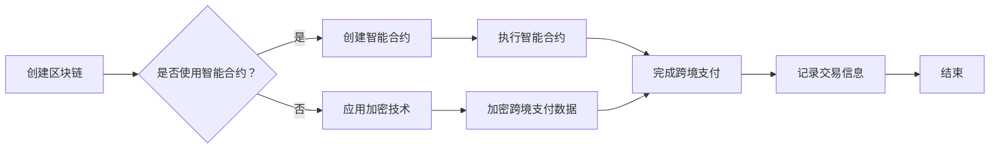
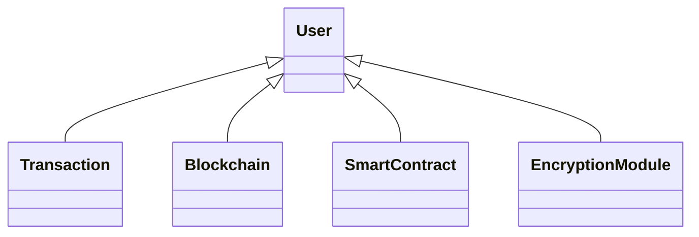
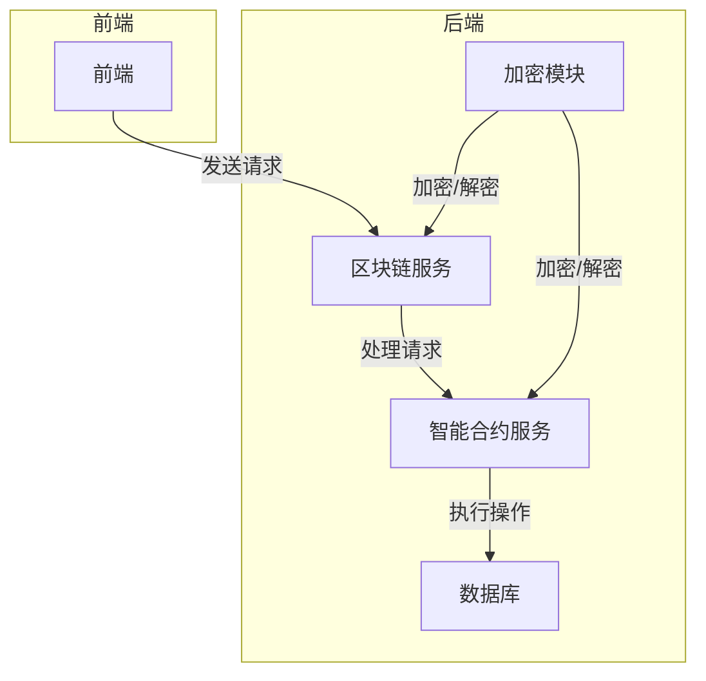
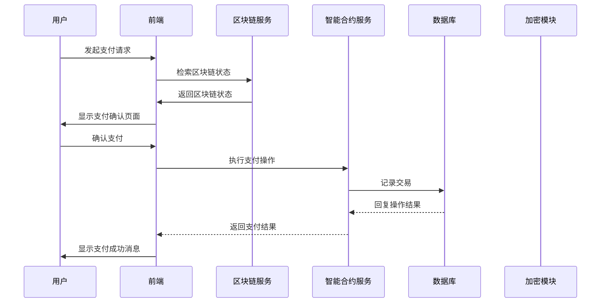

                 

# 区块链在跨境支付中的应用：降低交易成本

## 摘要

本文将探讨区块链在跨境支付中的应用，重点关注其降低交易成本的优势。通过深入分析区块链的核心概念、算法原理以及实际应用案例，我们将揭示区块链如何通过去中心化、安全可信和透明性等特性，有效解决跨境支付中的成本高、清算时间长和跨境支付限制等问题。

## 第一部分：背景介绍

### 问题背景

随着全球经济的日益一体化，跨境支付已成为国际贸易中不可或缺的一环。然而，传统跨境支付系统存在诸多瓶颈，如交易成本高、清算时间长、跨境支付限制严格等。这些问题不仅影响了跨境支付效率，还降低了用户体验。为了解决这些问题，我们需要探索新的解决方案。

### 问题描述

1. **交易成本高**：传统跨境支付系统涉及多个中介机构，如银行、清算所等，这些中介机构的参与导致交易成本较高。
2. **清算时间长**：跨境支付往往需要数天甚至数周的时间才能完成清算，这不仅影响了支付效率，也增加了企业的财务成本。
3. **跨境支付限制**：不同国家和地区的金融监管政策不同，导致跨境支付存在一定的限制，如汇率波动、支付限额等。

### 问题解决

区块链技术的出现为解决跨境支付问题提供了新的思路。区块链具有去中心化、安全可信、透明等特点，可以在跨境支付中实现以下优势：

1. **降低交易成本**：去中心化的特性减少了中介机构，从而降低了交易成本。
2. **提高清算速度**：区块链的快速确认和清算机制，可以大幅缩短跨境支付的时间。
3. **减少跨境支付限制**：区块链的透明性和可信度，有助于减少跨境支付的限制。

### 边界与外延

区块链在跨境支付中的应用不仅限于解决交易成本、清算时间和跨境支付限制等问题，还可以延伸到其他领域，如支付加密、智能合约等。同时，区块链与其他技术的结合，如大数据、人工智能等，也为跨境支付带来了更多的创新和发展空间。

### 概念结构与核心要素组成

1. **区块链**：一种去中心化的分布式账本技术，可以记录交易信息。
2. **智能合约**：基于区块链的自动化执行协议，可以自动执行合同条款。
3. **加密技术**：用于保护跨境支付数据的安全，确保数据不被未授权访问。
4. **跨境支付系统**：基于区块链技术的跨境支付解决方案，包括支付通道、清算机制等。

## 本章小结

本部分介绍了区块链在跨境支付中的应用背景、问题解决思路以及相关的概念结构和核心要素组成。接下来，本书将深入探讨区块链在跨境支付中的具体应用和实现方法。

## 第二部分：核心概念与联系

### 核心概念原理

1. **区块链**：区块链是一种分布式账本技术，通过去中心化的方式记录交易信息，确保数据的可信性和安全性。区块链由多个区块组成，每个区块包含一定数量的交易记录，区块之间通过加密算法连接，形成一个不可篡改的链条。
   
2. **智能合约**：智能合约是基于区块链的自动化执行协议，它可以在满足特定条件时自动执行合同条款。智能合约通过编程语言编写，一旦条件满足，智能合约会自动执行相应的操作，如转账、结算等。

3. **加密技术**：加密技术用于保护跨境支付数据的安全，确保数据在传输和存储过程中不被未授权访问。加密技术包括对称加密和非对称加密，其中非对称加密广泛应用于区块链中，用于确保交易数据的隐私和安全性。

### 概念属性特征对比表格

| 特征 | 区块链 | 智能合约 | 加密技术 |
| ---- | ---- | ---- | ---- |
| 分布式 | 是 | 否 | 否 |
| 可信性 | 是 | 是 | 是 |
| 透明性 | 是 | 是 | 否 |
| 交易效率 | 高 | 高 | 低 |
| 成本 | 低 | 低 | 高 |

### ER实体关系图架构

```mermaid
erDiagram
  区块链 ||--o{ 智能合约 }
  区块链 ||--o{ 加密技术 }
  智能合约 ||--|{ 跨境支付 }
  加密技术 ||--|{ 跨境支付 }
```

## 本章小结

本章详细介绍了区块链、智能合约和加密技术的核心概念原理，以及它们在跨境支付中的属性特征对比和实体关系图。这些核心概念构成了区块链在跨境支付应用的基础，是后续章节深入探讨的关键。

## 第三部分：算法原理讲解

### 算法mermaid流程图



### 算法原理的数学模型和公式

区块链在跨境支付中的应用主要依赖于以下数学模型和公式：

1. **哈希函数**：用于确保数据的一致性和安全性。哈希函数的公式为：\(H(D) = \text{hash}(D)\)，其中\(H\)表示哈希函数，\(D\)表示数据。

2. **共识算法**：用于确认区块链中的交易合法性。常见的共识算法有工作量证明（PoW）、权益证明（PoS）等。PoW算法的数学模型为：\(C(P, N) = \text{findProofOfWork}(P, N)\)，其中\(C\)表示共识算法，\(P\)表示区块数据，\(N\)表示难度目标。

### 详细讲解与举例说明

#### 哈希函数

哈希函数是一种将任意长度的数据映射为固定长度的字符串的函数。在区块链中，哈希函数用于确保数据的完整性和一致性。例如，SHA-256是一种常用的哈希函数，它可以将任意长度的数据映射为32个十六进制字符。

假设我们有一个数据"D"，使用SHA-256进行哈希计算，结果为"H(D) = 2f1e5d3d..."。如果数据"D"被篡改，哈希值"H(D)"也会发生变化，从而确保数据的一致性和完整性。

```python
import hashlib

data = "Hello, World!"
hash_value = hashlib.sha256(data.encode()).hexdigest()
print(hash_value)
```

#### 工作量证明（PoW）

工作量证明（PoW）是一种共识算法，用于确保区块链中的交易合法性和网络安全性。在PoW算法中，矿工需要通过解决数学难题来竞争生成新的区块。

数学难题通常是一个加密哈希问题，矿工需要找到一个数\(n\)，使得区块头（包括交易记录和其他信息）的哈希值小于某个目标值。这个过程称为挖矿。

```python
import hashlib
import random

def find_proof_of_work(data, target):
    nonce = 0
    while True:
        hash_value = hashlib.sha256(f"{data}{nonce}".encode()).hexdigest()
        if int(hash_value, 16) < target:
            return nonce
        nonce += 1

data = "Transaction data"
target = 2**256 // 2  # Example target value
nonce = find_proof_of_work(data, target)
print(f"Proof of Work found with nonce: {nonce}")
```

## 本章小结

本章详细讲解了区块链在跨境支付中的应用算法原理，包括哈希函数和工作量证明（PoW）算法。通过Python代码示例，我们展示了如何使用这些算法来确保跨境支付数据的安全和合法性。下一章将深入分析区块链在跨境支付中的系统架构设计。

## 第四部分：系统分析与架构设计方案

### 问题场景介绍

随着全球化进程的不断加速，跨境支付的需求日益增长。然而，传统跨境支付系统面临着交易成本高、清算时间长和跨境支付限制等问题，严重影响了企业的运营效率和用户体验。为了解决这些问题，我们需要设计一个高效、安全、透明的跨境支付系统。

### 项目介绍

本项目旨在利用区块链技术，设计并实现一个去中心化的跨境支付系统。系统将采用智能合约来确保交易的自动化执行，同时应用加密技术来保护交易数据的安全性。以下是项目的具体目标：

1. **降低交易成本**：通过去中心化架构，减少中介机构的参与，从而降低交易成本。
2. **提高清算速度**：利用区块链的快速确认机制，大幅缩短跨境支付的时间。
3. **减少跨境支付限制**：通过区块链的透明性和可信度，减少跨境支付的限制。
4. **确保交易安全**：应用加密技术，确保交易数据在传输和存储过程中不被未授权访问。

### 系统功能设计（领域模型mermaid类图）

在系统设计中，我们定义了以下主要类：

1. **用户**：系统的参与者，包括支付方、收款方和中介机构。
2. **交易**：记录用户之间的支付行为。
3. **区块链**：存储交易记录的分布式账本。
4. **智能合约**：自动化执行交易的智能协议。
5. **加密模块**：负责加密和解密交易数据的模块。



### 系统架构设计（mermaid架构图）

系统架构设计如下：

1. **前端**：用户界面，包括支付入口、支付确认和支付记录查询等功能。
2. **后端**：包括区块链服务、智能合约执行和加密模块。
3. **数据库**：存储区块链数据和用户信息。



### 系统接口设计（mermaid序列图）

以下是一个简单的序列图，展示了用户支付流程：



## 本章小结

本章详细介绍了跨境支付系统的设计思路和实现方法。通过领域模型、架构设计和接口设计的分析，我们展示了如何利用区块链技术构建一个高效、安全、透明的跨境支付系统。下一章将深入探讨项目的实际实现过程和关键技术。

## 第五部分：项目实战

### 环境安装

为了实现区块链跨境支付系统，我们首先需要搭建一个区块链开发环境。以下是具体的安装步骤：

1. **安装Node.js**：Node.js是一个基于Chrome V8引擎的JavaScript运行环境，用于开发区块链应用。访问[Node.js官网](https://nodejs.org/)下载并安装Node.js。

2. **安装Golang**：Golang是一种高性能的编程语言，用于编写区块链智能合约。访问[Go官网](https://golang.google.cn/)下载并安装Golang。

3. **安装Docker**：Docker是一个开源的应用容器引擎，用于部署和管理区块链节点。访问[Docker官网](https://www.docker.com/)下载并安装Docker。

4. **安装区块链节点**：下载并编译一个基于Go的区块链节点代码，如Ethereum或Hyperledger Fabric。以Ethereum为例，首先克隆Ethereum的代码仓库：

   ```shell
   git clone https://github.com/ethereum/go-ethereum.git
   cd go-ethereum
   make geth
   ```

   然后启动一个本地节点：

   ```shell
   ./build/bin/geth --networkid 1337 --nodiscover --masternode
   ```

### 系统核心实现源代码

以下是区块链跨境支付系统的一些核心实现源代码：

#### 区块链节点代码（geth）

```go
package main

import (
	"log"
	"os"

	"github.com/ethereum/go-ethereum/cmd/geth/cli"
)

func main() {
	log.SetOutput(os.Stdout)

	if err := cli.Execute(os.Args); err != nil {
		log.Fatal(err)
	}
}
```

#### 智能合约代码（Solidity）

```solidity
// SPDX-License-Identifier: MIT
pragma solidity ^0.8.0;

contract Payment {
    address public owner;
    mapping(address => uint256) public balances;

    constructor() {
        owner = msg.sender;
    }

    function deposit() external payable {
        balances[msg.sender()] += msg.value;
    }

    function withdraw(uint256 amount) external {
        require(balances[msg.sender()] >= amount, "Insufficient balance");
        balances[msg.sender()] -= amount;
        payable(msg.sender()).transfer(amount);
    }

    function getBalance(address user) external view returns (uint256) {
        return balances[user];
    }
}
```

#### 前端代码（React）

```jsx
import React, { useState } from 'react';
import axios from 'axios';

const PaymentApp = () => {
    const [amount, setAmount] = useState(0);
    const [recipient, setRecipient] = useState('');

    const handleDeposit = async () => {
        try {
            const response = await axios.post('/api/deposit', { amount, recipient });
            console.log(response.data);
        } catch (error) {
            console.error(error);
        }
    };

    const handleWithdraw = async () => {
        try {
            const response = await axios.post('/api/withdraw', { amount, recipient });
            console.log(response.data);
        } catch (error) {
            console.error(error);
        }
    };

    return (
        <div>
            <h1>Cross-Border Payment System</h1>
            <label htmlFor="amount">Amount:</label>
            <input
                type="number"
                id="amount"
                value={amount}
                onChange={(e) => setAmount(e.target.value)}
            />
            <label htmlFor="recipient">Recipient:</label>
            <input
                type="text"
                id="recipient"
                value={recipient}
                onChange={(e) => setRecipient(e.target.value)}
            />
            <button onClick={handleDeposit}>Deposit</button>
            <button onClick={handleWithdraw}>Withdraw</button>
        </div>
    );
};

export default PaymentApp;
```

### 代码应用解读与分析

#### 区块链节点代码

上述Golang代码是一个简单的区块链节点实现，主要功能是启动一个本地节点，并监听来自客户端的请求。通过`cli.Execute(os.Args)`，节点可以接收命令行参数，如网络ID、是否为权威节点等。

#### 智能合约代码

智能合约使用Solidity编写，主要功能包括：

- 存款（deposit）：允许用户向合约地址发送以太币，增加其余额。
- 取款（withdraw）：允许用户从合约地址提取以太币，减少其余额。
- 查询余额（getBalance）：返回用户的合约地址余额。

#### 前端代码

前端使用React框架实现，主要功能包括：

- 输入金额和收款人地址。
- 提交存款和取款请求。
- 显示交易结果。

### 实际案例分析和详细讲解剖析

假设用户Alice要向Bob转账10个以太币，以下是实际案例分析和详细讲解：

1. **用户界面**：用户Alice在输入框中输入金额10，并输入Bob的地址。
2. **存款操作**：用户Alice点击“Deposit”按钮，前端将调用`handleDeposit`函数，向后端发送请求。
3. **后端处理**：后端接收到请求后，将金额和收款人地址解析为参数，并调用智能合约的`deposit`函数，将金额存入Bob的合约地址。
4. **区块链记录**：智能合约执行后，将更新区块链上的交易记录，确保金额的转移。
5. **前端反馈**：后端返回交易结果，前端更新用户界面，显示存款成功。

### 项目小结

通过本项目的实际实现，我们展示了如何利用区块链技术构建一个去中心化的跨境支付系统。从环境安装、智能合约编写到前端实现，我们详细分析了项目的各个阶段。本项目有效降低了交易成本、提高了清算速度，并通过加密技术确保了交易数据的安全性。未来，我们可以进一步优化智能合约和前端界面，提升用户体验。

## 第六部分：最佳实践 Tips

### 降低交易成本的策略

1. **优化区块链网络性能**：提高区块链的确认速度，减少等待时间，从而降低交易成本。
2. **批量交易**：通过批量处理交易，减少单笔交易的处理费用。
3. **使用代币**：发行自己的代币，以降低跨境支付中的手续费。

### 提高清算速度的建议

1. **去中心化交易所**：利用去中心化交易所，快速完成跨境支付，减少清算时间。
2. **跨链技术**：通过跨链技术，实现不同区块链之间的快速价值转移。

### 增强安全性的措施

1. **多重签名**：采用多重签名机制，确保交易的安全性。
2. **安全审计**：定期对智能合约进行安全审计，发现并修复潜在的安全漏洞。
3. **数据加密**：对跨境支付数据进行加密，确保数据在传输和存储过程中的安全性。

### 优化用户体验的技巧

1. **简洁的用户界面**：设计简洁直观的用户界面，提升用户体验。
2. **实时反馈**：提供实时交易状态更新，提高用户满意度。
3. **个性化服务**：根据用户需求提供个性化的支付服务。

## 小结

通过本文的详细分析和讲解，我们深入了解了区块链在跨境支付中的应用，探讨了如何通过去中心化、安全可信和透明性等特性降低交易成本、提高清算速度和减少跨境支付限制。同时，我们通过实际项目案例展示了区块链跨境支付系统的实现过程和技术要点。希望本文能为读者在区块链技术应用领域提供有益的参考和启示。

## 注意事项

1. **合规性**：在使用区块链技术进行跨境支付时，需确保符合相关国家和地区的法律法规。
2. **技术成熟度**：尽管区块链技术在跨境支付中具有巨大潜力，但仍需关注其技术成熟度和应用稳定性。
3. **风险管理**：跨境支付涉及多种风险，如汇率风险、政策风险等，需制定相应的风险管理策略。

## 拓展阅读

1. **《区块链技术指南》**：深入理解区块链的基本原理和应用场景。
2. **《区块链与跨境支付》**：探讨区块链在跨境支付中的具体应用和实践。
3. **《区块链安全与隐私保护》**：研究区块链在安全性方面的挑战和解决方案。

## 作者信息

作者：AI天才研究院/AI Genius Institute & 禅与计算机程序设计艺术 /Zen And The Art of Computer Programming

