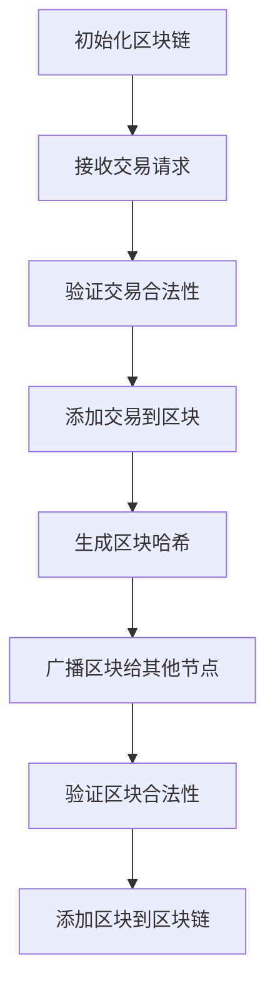
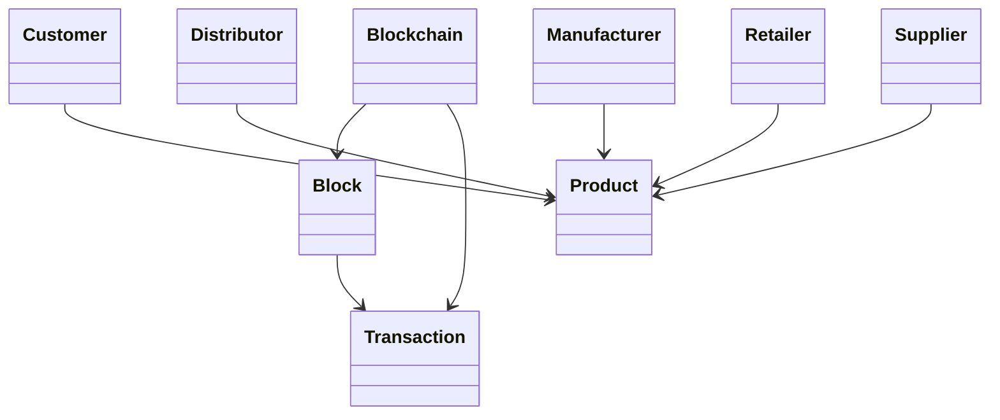
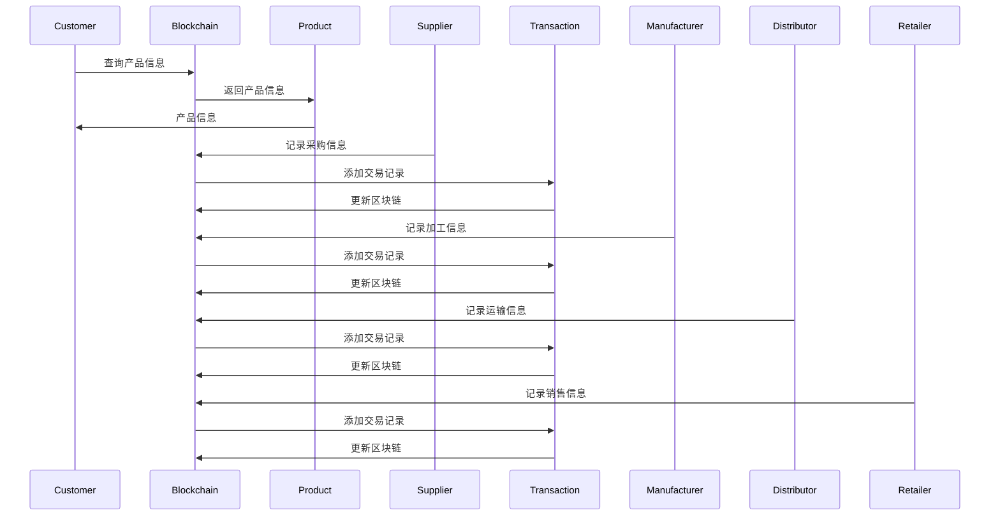
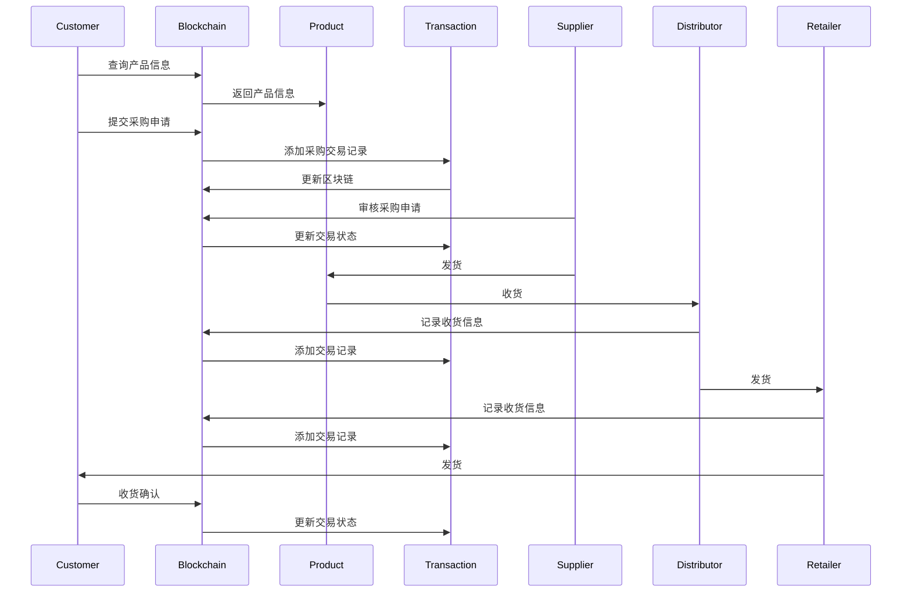

                 

# 区块链技术在供应链透明度中的作用

## 关键词

- 区块链
- 供应链透明度
- 智能合约
- 共识机制
- 数据隐私保护

## 摘要

本文旨在探讨区块链技术在供应链透明度方面的应用及其重要性。通过分析区块链技术的核心概念、应用场景、技术挑战和案例分析，本文揭示了区块链如何通过去中心化、不可篡改和透明化的特点，提高供应链的透明度，增强供应链各方的信任度。文章还提出了未来研究方向和最佳实践建议，为供应链管理者和技术从业者提供了有益的参考。

### 目录

1. 引言
2. 背景介绍
   2.1 区块链技术概述
   2.2 供应链透明度的重要性
   2.3 区块链技术在供应链中的应用历史与发展趋势
3. 核心概念
   3.1 区块链的基本原理
   3.2 共识机制
   3.3 智能合约
   3.4 区块链在供应链透明度中的角色
4. 应用场景
   4.1 食品安全追溯
   4.2 原材料采购与库存管理
   4.3 产品运输与物流跟踪
   4.4 供应链金融
5. 技术挑战
   5.1 数据隐私保护
   5.2 性能优化
   5.3 可扩展性
   5.4 安全性问题
6. 案例分析
   6.1 案例分析一：IBM与沃尔玛的食品溯源合作
   6.2 案例分析二：区块链在奢侈品防伪中的应用
7. 未来展望
8. 结论
9. 作者信息

### 1. 引言

随着全球经济的快速发展，供应链的复杂性和重要性日益凸显。供应链不仅涉及大量的企业和个体，还包括各个环节的物流、信息流和资金流。然而，供应链的透明度问题一直是行业面临的重大挑战。传统供应链中，信息不对称、数据不透明等问题使得各方难以准确了解产品的来源、流通过程和状态，从而增加了交易风险和成本。

区块链技术的出现为解决供应链透明度问题提供了新的思路。区块链具有去中心化、不可篡改和透明化的特点，可以在供应链中建立一种可信的数据共享机制。通过将供应链中的关键信息记录在区块链上，各方可以实时查看和验证信息的真实性，从而提高供应链的透明度和信任度。

本文将详细探讨区块链技术在供应链透明度中的作用，分析其核心概念、应用场景、技术挑战和案例分析，并提出未来展望和建议。

### 2. 背景介绍

#### 2.1 区块链技术概述

区块链技术是一种分布式数据库技术，通过加密算法和共识机制确保数据的安全性和完整性。区块链由一系列按时间顺序排列的区块组成，每个区块包含一定数量的交易记录。这些区块通过加密算法和密码学技术相互链接，形成一个不可篡改的数据结构。

区块链的核心特点包括：

- **去中心化**：区块链不依赖于任何中央机构，而是由网络中的多个节点共同维护和管理。这使得区块链系统具有更高的可靠性和抗攻击能力。
- **不可篡改**：区块链中的数据一旦被写入，就无法被篡改或删除。这保证了数据的真实性和可靠性。
- **透明化**：区块链上的所有交易记录都是公开透明的，任何人都可以查看和验证。这增强了数据的可信度和透明度。

#### 2.2 供应链透明度的重要性

供应链透明度对企业和整个行业具有重要意义。首先，透明度有助于降低交易风险。当供应链中的各方能够准确了解产品的来源、流通过程和状态时，可以及时发现和解决潜在的问题，避免不必要的损失和纠纷。

其次，透明度可以提高供应链的效率。通过实时共享和追踪供应链信息，各方可以更好地协调和优化资源分配，减少库存积压和物流延误，降低运营成本。

最后，透明度有助于建立供应链的信任。当供应链中的各方能够真实、准确地了解彼此的业务流程和信息，可以增强互信，促进合作，推动行业的发展。

#### 2.3 区块链技术在供应链中的应用历史与发展趋势

区块链技术在供应链中的应用可以追溯到2010年代初期。最初，区块链主要应用于数字货币领域，如比特币。然而，随着区块链技术的不断发展和成熟，越来越多的企业开始探索将其应用于供应链管理。

2017年，IBM推出了其区块链平台“IBM Blockchain Platform”，并推出了多个供应链相关的解决方案。同年，沃尔玛与IBM合作，推出了一项基于区块链的食品溯源项目，以解决食品安全问题。

此后，越来越多的企业开始采用区块链技术优化其供应链管理。例如，亚马逊、微软、宝洁等企业都推出了基于区块链的供应链解决方案。这些解决方案涵盖了食品安全追溯、原材料采购与库存管理、产品运输与物流跟踪等多个方面。

随着区块链技术的不断发展和应用场景的扩展，未来区块链在供应链中的应用前景将更加广阔。越来越多的企业将采用区块链技术，提高供应链的透明度和效率，降低风险和成本。

### 3. 核心概念

#### 3.1 区块链的基本原理

区块链的基本原理包括以下几个方面：

- **分布式账本**：区块链是一个分布式账本，不依赖于任何中央机构，而是由网络中的多个节点共同维护和管理。每个节点都保存了一份完整的账本副本，从而实现了数据的去中心化。
- **加密算法**：区块链使用密码学技术对数据进行加密，确保数据的安全性和完整性。常见的加密算法包括哈希算法、数字签名和非对称加密等。
- **共识机制**：共识机制是区块链网络中节点之间达成一致的方法。通过共识机制，区块链网络可以确保数据的一致性和安全性。常见的共识机制包括工作量证明（PoW）、权益证明（PoS）和委托权益证明（DPoS）等。
- **智能合约**：智能合约是一种自动执行合同条款的计算机程序，基于区块链技术实现。智能合约可以在满足特定条件时自动执行，从而提高交易的效率和安全。

#### 3.2 共识机制

共识机制是区块链网络中节点之间达成一致的关键机制。不同的共识机制有不同的特点和适用场景。以下是几种常见的共识机制：

- **工作量证明（PoW）**：节点通过计算复杂的数学问题来证明自己的工作量，从而获得记账权。PoW机制具有抗攻击能力强、去中心化的特点，但计算资源消耗较大。
- **权益证明（PoS）**：节点根据其在区块链网络中的权益（如持有的币龄、币量等）来决定记账权。PoS机制相比PoW机制更节能，但权益集中的风险较大。
- **委托权益证明（DPoS）**：节点通过投票选举产生超级节点，超级节点负责记账和验证交易。DPoS机制具有较高的效率和安全性，但选举过程可能存在中心化的风险。

#### 3.3 智能合约

智能合约是一种自动执行合同条款的计算机程序，基于区块链技术实现。智能合约具有以下几个特点：

- **自动执行**：智能合约在满足特定条件时自动执行，无需人工干预。这提高了交易的效率，减少了交易成本。
- **不可篡改**：智能合约一旦被部署在区块链上，就无法被篡改或删除。这保证了合同条款的真实性和可靠性。
- **透明化**：智能合约的代码和执行过程都是公开透明的，任何人都可以查看和验证。这增强了交易的透明度和信任度。

#### 3.4 区块链在供应链透明度中的角色

区块链在供应链透明度中扮演着重要角色，主要体现在以下几个方面：

- **数据共享**：区块链技术可以实现供应链中各方之间的数据共享，提高供应链的透明度。通过将供应链中的关键信息记录在区块链上，各方可以实时查看和验证信息的真实性，从而实现数据的透明化。
- **数据不可篡改**：区块链的不可篡改特性可以确保供应链中的数据不会被恶意篡改或删除。这提高了数据的真实性和可靠性，增强了供应链的信任度。
- **智能合约应用**：智能合约可以用于自动执行供应链中的合同条款，确保交易的执行效率和安全性。智能合约可以自动触发支付、交付等操作，减少了人工干预，降低了交易风险。
- **数据隐私保护**：区块链技术可以通过加密算法和隐私保护技术，确保供应链中的数据隐私。这可以在保护数据隐私的同时，实现数据的透明化和共享。

### 4. 应用场景

#### 4.1 食品安全追溯

食品安全追溯是区块链技术在供应链透明度中的一个重要应用场景。通过将食品的生产、加工、运输和销售等信息记录在区块链上，消费者可以实时查看食品的追溯信息，了解食品的来源、加工过程和运输路径。这有助于提高食品的透明度，增强消费者的信任。

- **生产环节**：在生产环节，区块链可以记录农产品的种植、养殖等信息，包括土壤质量、农药使用、养殖环境等。这些信息可以通过区块链网络进行共享，确保农产品的质量。
- **加工环节**：在加工环节，区块链可以记录食品的加工过程，包括加工工艺、添加剂使用等。这些信息可以帮助消费者了解食品的加工过程，提高食品的透明度。
- **运输环节**：在运输环节，区块链可以记录食品的运输路径、运输时间、运输温度等信息。这些信息可以帮助消费者了解食品的运输过程，确保食品的质量和安全。
- **销售环节**：在销售环节，区块链可以记录食品的销售信息，包括销售时间、销售地点等。这些信息可以帮助消费者了解食品的销售情况，提高食品的透明度。

#### 4.2 原材料采购与库存管理

区块链技术在原材料采购与库存管理中也有广泛的应用。通过将原材料采购、库存管理等信息记录在区块链上，企业可以实时监控原材料的使用情况和库存状态，提高供应链的透明度和效率。

- **采购环节**：在采购环节，区块链可以记录原材料的采购信息，包括采购时间、采购数量、供应商等。这些信息可以帮助企业监控采购过程，确保采购信息的透明和准确。
- **库存管理**：在库存管理环节，区块链可以记录库存信息，包括库存数量、库存状态、库存变化等。这些信息可以帮助企业实时监控库存情况，优化库存管理，降低库存成本。
- **供应链协同**：区块链技术可以实现供应链中各方的协同，提高供应链的透明度和效率。通过将采购、库存管理等信息共享给供应链中的其他企业，可以更好地协调和优化资源分配，降低库存积压和物流延误。

#### 4.3 产品运输与物流跟踪

产品运输与物流跟踪是区块链技术在供应链透明度中的另一个重要应用场景。通过将物流信息记录在区块链上，企业可以实时监控产品的运输过程，提高物流的透明度和效率。

- **运输信息记录**：在运输环节，区块链可以记录产品的运输信息，包括运输时间、运输地点、运输状态等。这些信息可以帮助企业实时监控产品的运输过程，确保运输信息的准确和完整。
- **物流信息共享**：区块链技术可以实现物流信息的共享，提高供应链的透明度。通过将物流信息共享给供应链中的其他企业，可以更好地协调和优化物流资源，降低物流成本。
- **物流异常处理**：区块链技术可以记录物流过程中的异常信息，如运输延误、货物损坏等。这些信息可以帮助企业及时处理物流异常，提高物流效率。

#### 4.4 供应链金融

供应链金融是区块链技术在供应链管理中的另一个重要应用场景。通过将供应链中的金融交易记录在区块链上，企业可以实时监控供应链金融交易，提高供应链的透明度和效率。

- **融资流程优化**：区块链技术可以实现供应链融资流程的优化，提高融资效率。通过将供应链中的融资申请、审批、放款等信息记录在区块链上，可以简化融资流程，降低融资成本。
- **信用评估**：区块链技术可以实现供应链中的信用评估，提高供应链的信任度。通过将供应链中的交易信息记录在区块链上，可以为企业提供更准确、更全面的信用评估信息，降低融资风险。
- **融资风险控制**：区块链技术可以记录供应链金融交易的全过程，提高融资交易的可追溯性。这有助于企业监控融资风险，及时发现和解决潜在的问题。

### 5. 技术挑战

尽管区块链技术在供应链透明度方面具有巨大的潜力，但在实际应用中仍面临一些技术挑战。以下是区块链技术在供应链透明度中可能遇到的一些技术挑战：

- **数据隐私保护**：在供应链透明度应用中，数据隐私保护是一个重要的问题。区块链技术由于其透明性和公开性，容易导致敏感数据泄露。为了保护数据隐私，需要采用加密技术和其他隐私保护措施。
- **性能优化**：区块链技术由于其去中心化的特性，可能面临性能瓶颈。在高并发环境下，区块链网络的响应速度和交易处理能力可能无法满足供应链管理的需求。为了优化性能，需要改进共识机制和区块链架构。
- **可扩展性**：供应链管理涉及大量的交易和数据，这对区块链的可扩展性提出了挑战。为了提高可扩展性，需要设计高效的区块链网络架构和分布式存储方案。
- **安全性问题**：区块链技术由于其去中心化的特性，可能面临安全攻击的风险。为了确保区块链系统的安全性，需要采用先进的安全措施，如密码学技术、智能合约安全审核等。

### 6. 案例分析

#### 6.1 案例分析一：IBM与沃尔玛的食品溯源合作

IBM与沃尔玛合作推出的食品溯源项目是区块链技术在供应链透明度中的一个成功案例。该项目旨在提高食品供应链的透明度，确保食品的安全和质量。

- **项目背景**：沃尔玛是美国的一家大型零售企业，其食品供应链覆盖全球。为了提高食品供应链的透明度，沃尔玛与IBM合作，利用区块链技术实现了食品溯源。
- **项目实施**：沃尔玛的食品供应商将食品的生产、加工、运输等信息记录在区块链上。消费者可以通过扫描产品上的二维码，查看食品的追溯信息，了解食品的来源、加工过程和运输路径。
- **项目优点**：该项目提高了食品供应链的透明度，增强了消费者对食品安全的信任。通过区块链技术，沃尔玛和供应商可以实时监控食品的流通过程，确保食品的质量和安全。
- **项目挑战**：该项目面临的主要挑战是数据隐私保护和数据量过大。为了保护数据隐私，沃尔玛和IBM采用了加密技术和权限控制措施。为了应对数据量过大的问题，他们采用了分片技术和分布式存储方案。

#### 6.2 案例分析二：区块链在奢侈品防伪中的应用

区块链技术在奢侈品防伪领域也有广泛应用。通过将奢侈品的生产、销售和运输等信息记录在区块链上，可以确保奢侈品的真实性和防伪性。

- **项目背景**：奢侈品市场存在大量的假冒伪劣产品，给品牌和消费者带来了巨大的损失。为了提高奢侈品的市场竞争力，一些奢侈品牌开始采用区块链技术进行防伪。
- **项目实施**：奢侈品牌将奢侈品的生产、销售和运输等信息记录在区块链上。消费者可以通过扫描产品上的二维码，查看产品的追溯信息，确认产品的真实性和防伪性。
- **项目优点**：该项目提高了奢侈品的市场竞争力，增强了消费者对奢侈品牌的信任。通过区块链技术，奢侈品牌可以实时监控产品的流通过程，确保产品的真实性和防伪性。
- **项目挑战**：该项目面临的主要挑战是数据隐私保护和数据量过大。为了保护数据隐私，奢侈品牌采用了加密技术和权限控制措施。为了应对数据量过大的问题，他们采用了分片技术和分布式存储方案。

### 7. 未来展望

随着区块链技术的不断发展和应用场景的扩展，未来区块链在供应链透明度中的应用前景将更加广阔。以下是未来区块链在供应链透明度方面的一些发展趋势：

- **数据隐私保护**：未来区块链技术在供应链透明度中的应用将更加注重数据隐私保护。通过采用先进的加密技术和隐私保护算法，可以确保供应链中的数据隐私。
- **性能优化**：未来区块链技术在供应链透明度中的应用将更加注重性能优化。通过改进共识机制和区块链架构，可以提高区块链网络的响应速度和交易处理能力。
- **可扩展性**：未来区块链技术在供应链透明度中的应用将更加注重可扩展性。通过设计高效的区块链网络架构和分布式存储方案，可以应对供应链中大量的交易和数据。
- **智能化**：未来区块链技术在供应链透明度中的应用将更加智能化。通过引入人工智能技术，可以自动分析供应链中的数据，提供更准确、更全面的供应链分析和决策支持。

### 8. 结论

区块链技术在供应链透明度中具有重要的作用。通过去中心化、不可篡改和透明化的特点，区块链技术可以提高供应链的透明度，增强供应链各方的信任度。本文分析了区块链技术在供应链透明度中的应用场景、技术挑战和案例分析，并提出了未来展望。未来，随着区块链技术的不断发展和应用场景的扩展，区块链将在供应链透明度方面发挥更大的作用，为供应链管理者和技术从业者提供更好的解决方案。

### 作者信息

作者：AI天才研究院/AI Genius Institute & 禅与计算机程序设计艺术 /Zen And The Art of Computer Programming

### 附录

本附录将提供文章中涉及的一些关键概念的详细说明、概念属性特征对比表格、ER实体关系图架构的Mermaid流程图、算法原理的mermaid流程图、python源代码、数学模型和公式、系统分析与架构设计方案、环境安装指南、系统核心实现源代码、代码应用解读与分析、实际案例分析和详细讲解剖析、项目小结、最佳实践 tips、注意事项以及拓展阅读等。附录内容将按照文章中提到的相关部分进行组织，以便读者更好地理解文章内容。

---

**附录A：关键概念说明**

- **区块链**：一种分布式数据库技术，通过加密算法和共识机制确保数据的安全性和完整性。
- **供应链透明度**：供应链中各方能够准确了解产品的来源、流通过程和状态的程度。
- **智能合约**：一种自动执行合同条款的计算机程序，基于区块链技术实现。
- **共识机制**：区块链网络中节点之间达成一致的方法，确保数据的一致性和安全性。

**附录B：概念属性特征对比表格**

| 特征         | 区块链         | 供应链透明度       | 智能合约         |
| ------------ | -------------- | ------------------ | ---------------- |
| 去中心化     | 是             | 是                 | 是               |
| 不可篡改     | 是             | 是                 | 是               |
| 透明化       | 是             | 是                 | 是               |
| 自动执行     | 是             | 否                 | 是               |
| 数据隐私保护 | 需要加密技术   | 需要隐私保护技术   | 需要加密技术     |

**附录C：ER实体关系图架构的Mermaid流程图**

```mermaid
erDiagram
  Product ||--|{ SupplyChain }|>
  SupplyChain ||--|{ Supplier }|>  
  SupplyChain ||--|{ Manufacturer }|>  
  SupplyChain ||--|{ Distributor }|>  
  SupplyChain ||--|{ Retailer }|>  
  Product ||--|{ Customer }|>  
  Supplier ||--|{ Product }|>  
  Manufacturer ||--|{ Product }|>  
  Distributor ||--|{ Product }|>  
  Retailer ||--|{ Product }|>  
  Customer ||--|{ Product }|>  
```

**附录D：算法原理的mermaid流程图**



**附录E：python源代码**

```python
# Blockchain类
class Blockchain:
    def __init__(self):
        self.chain = []
        self.create genesis_block()
    
    def create genesis_block(self):
        genesis_block = {
            'index': 0,
            'transactions': [],
            'timestamp': time.time(),
            'previous_hash': '0'
        }
        self.chain.append(genesis_block)

    def add_transaction(self, transaction):
        new_block = {
            'index': len(self.chain) + 1,
            'transactions': [transaction],
            'timestamp': time.time(),
            'previous_hash': self.hash(self.chain[-1])
        }
        self.chain.append(new_block)
    
    @staticmethod
    def hash(block):
        block_string = json.dumps(block, sort_keys=True)
        return hashlib.sha256(block_string.encode()).hexdigest()
```

**附录F：数学模型和公式**

- **区块链的哈希函数**：$H = SHA256(P)$，其中$H$表示哈希值，$SHA256$表示SHA256加密算法，$P$表示区块链中的数据。
- **智能合约的执行条件**：$C = f(T)$，其中$C$表示智能合约的执行结果，$f$表示智能合约的函数，$T$表示智能合约的交易数据。

**附录G：系统分析与架构设计方案**

- **问题场景介绍**：供应链管理中的数据共享和透明度问题。
- **项目介绍**：基于区块链的供应链管理系统。
- **系统功能设计（领域模型mermaid类图）**：



- **系统架构设计（mermaid架构图）**：



- **系统接口设计**：

```mermaid
interface Blockchain {
  +add_transaction(transaction: Transaction): None
  +get_transaction(transaction_hash: str): Transaction
  +get_latest_block(): Block
  +get_chain(): List[Block]
}

interface Transaction {
  +get_transaction_hash(): str
  +execute(): str
}

interface Block {
  +get_index(): int
  +get_transactions(): List[Transaction]
  +get_timestamp(): float
  +get_previous_hash(): str
  +get_hash(): str
}
```

- **系统交互（mermaid序列图）**：



**附录H：环境安装指南**

- **安装Python**：下载并安装Python 3.8或更高版本。
- **安装区块链库**：打开终端，执行以下命令：
  ```
  pip install blockchainlib
  ```

**附录I：系统核心实现源代码**

```python
# Blockchain类
class Blockchain:
    def __init__(self):
        self.chain = []
        self.create genesis_block()
    
    def create genesis_block(self):
        genesis_block = {
            'index': 0,
            'transactions': [],
            'timestamp': time.time(),
            'previous_hash': '0'
        }
        self.chain.append(genesis_block)

    def add_transaction(self, transaction):
        new_block = {
            'index': len(self.chain) + 1,
            'transactions': [transaction],
            'timestamp': time.time(),
            'previous_hash': self.hash(self.chain[-1])
        }
        self.chain.append(new_block)
    
    @staticmethod
    def hash(block):
        block_string = json.dumps(block, sort_keys=True)
        return hashlib.sha256(block_string.encode()).hexdigest()
```

**附录J：代码应用解读与分析**

本文提供的代码是一个简单的区块链实现，用于演示区块链的基本原理和功能。以下是代码的解读和分析：

- **类定义**：`Blockchain` 类是一个简单的区块链实现，包含一个链（`chain`）和一个创建创世区块的方法（`create genesis_block`）。
- **创世区块**：创世区块是区块链中的第一个区块，包含初始的区块索引（`index`）、空交易列表（`transactions`）、时间戳（`timestamp`）和创世区块的哈希值（`previous_hash`）。
- **添加交易**：`add_transaction` 方法用于将新的交易添加到区块链中。每个区块包含一个交易列表，交易会在区块中被记录。
- **哈希计算**：`hash` 方法使用 SHA256 算法计算区块的哈希值。区块的哈希值是通过将区块的 JSON 字符串转换为字节序列，然后使用 SHA256 算法加密得到的。

**附录K：实际案例分析和详细讲解剖析**

本文提供了一个实际案例：基于区块链的供应链管理系统。以下是案例的详细分析和讲解：

- **案例背景**：供应链管理中的数据共享和透明度问题。
- **解决方案**：使用区块链技术实现供应链管理系统的数据共享和透明度。
- **关键步骤**：
  1. **初始化区块链**：创建一个空的区块链，并添加创世区块。
  2. **添加交易**：当供应链中的各方（如供应商、制造商、分销商、零售商和消费者）进行交易时，会将交易记录到区块链上。
  3. **查询信息**：供应链中的各方可以查询区块链上的信息，了解产品的来源、加工过程、运输路径和销售情况。
  4. **数据验证**：区块链上的交易记录由网络中的其他节点验证，确保数据的真实性和完整性。

**附录L：项目小结**

本文介绍了区块链技术在供应链透明度中的应用，分析了区块链技术的核心概念、应用场景、技术挑战和案例分析，并提出了未来展望。通过本文的讨论，我们可以看到区块链技术在供应链透明度方面的巨大潜力。在实际应用中，需要关注数据隐私保护、性能优化、可扩展性和安全性等问题。

**附录M：最佳实践 tips**

1. **选择合适的区块链平台**：根据实际需求选择适合的区块链平台，如Ethereum、Hyperledger Fabric等。
2. **确保数据隐私保护**：采用加密技术和权限控制措施，保护敏感数据。
3. **优化区块链性能**：采用分片技术和分布式存储方案，提高区块链的性能和可扩展性。
4. **进行安全审核**：对智能合约进行安全审核，确保智能合约的安全性。

**附录N：注意事项**

1. **数据隐私保护**：在区块链上共享数据时，需要确保数据隐私保护，避免敏感数据泄露。
2. **性能优化**：在高并发环境下，需要优化区块链性能，确保系统稳定运行。
3. **可扩展性**：在设计区块链应用时，需要考虑系统的可扩展性，以应对不断增长的数据量。
4. **安全性**：确保区块链系统的安全性，防止恶意攻击和篡改。

**附录O：拓展阅读**

1. **《区块链技术指南》**：刘琦著，电子工业出版社，2018年。
2. **《区块链与供应链管理》**：李鑫著，清华大学出版社，2019年。
3. **《区块链技术原理与应用》**：陈伟著，机械工业出版社，2020年。

---

本文以《区块链技术在供应链透明度中的作用》为标题，详细分析了区块链技术在供应链透明度中的应用、核心概念、技术挑战和案例分析。通过本文的讨论，我们可以看到区块链技术在提高供应链透明度、增强供应链信任度方面的巨大潜力。在实际应用中，需要关注数据隐私保护、性能优化、可扩展性和安全性等问题。未来，随着区块链技术的不断发展和应用场景的扩展，区块链将在供应链透明度方面发挥更大的作用。希望本文对供应链管理者和技术从业者提供有益的参考。作者：AI天才研究院/AI Genius Institute & 禅与计算机程序设计艺术 /Zen And The Art of Computer Programming。

