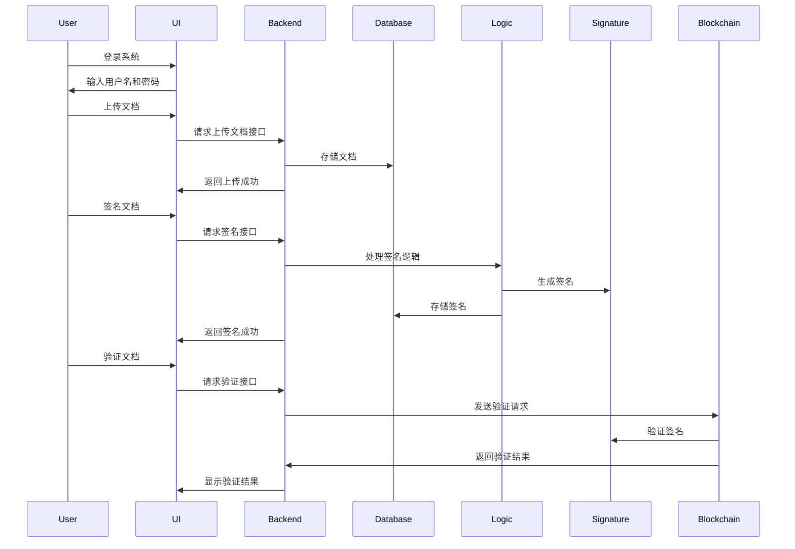
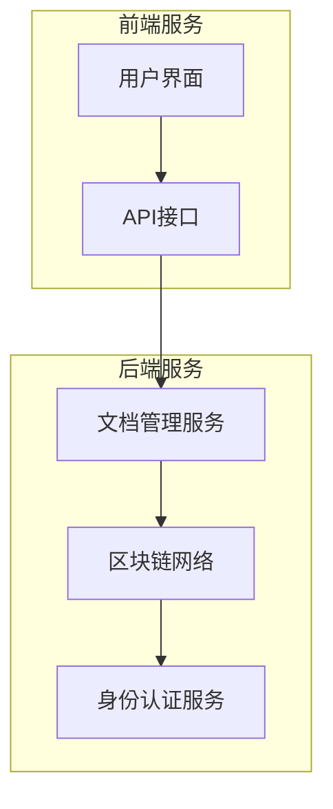
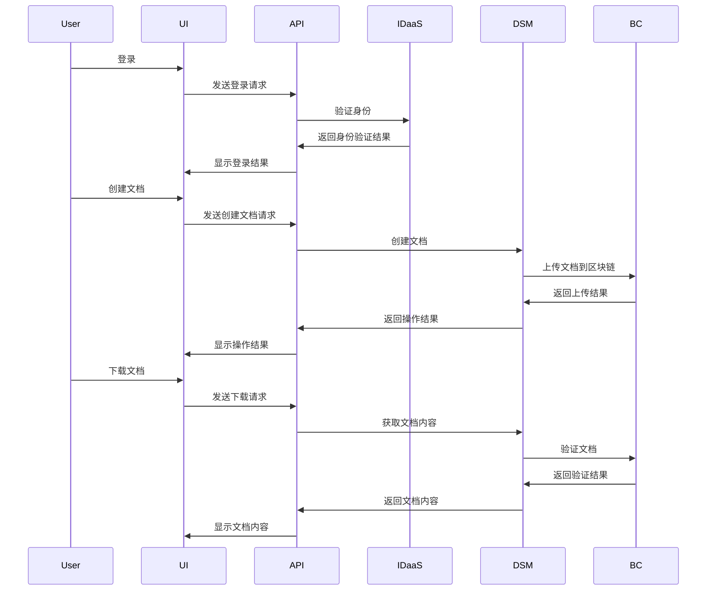

                 


## 《区块链技术在数字公证中的去中心化应用》

### 关键词：区块链、数字公证、去中心化、身份认证、数据存证、智能合约

#### 摘要：
本文旨在探讨区块链技术在数字公证中的去中心化应用。通过分析区块链的基本原理和关键特性，我们揭示了其在数字公证领域的潜在应用场景和优势。本文将分章节详细阐述区块链在身份认证、数据存证、数字签名和智能合约等领域的去中心化应用，并通过具体案例分析，评估其优势与挑战。最后，我们对区块链技术在数字公证中的未来发展趋势进行展望，并提出相应的解决方案。

## 第一部分：背景与概述

### 第1章：区块链与数字公证

#### 1.1 区块链概述

区块链是一种去中心化的分布式数据库技术，其基本原理是通过共识算法，将数据分散存储在多个节点上，形成一个不可篡改的账本。区块链的关键特性包括不可篡改性、透明性和去中心化。

- **不可篡改性**：区块链的数据一旦被记录，就几乎无法被篡改。这保证了数据的真实性和可靠性。
- **透明性**：区块链上的数据对所有参与者都是可见的，保证了数据的透明度。
- **去中心化**：区块链不需要中心化的机构来管理数据，每个参与者都可以参与数据的验证和存储。

#### 1.2 数字公证概述

数字公证是指利用电子信息技术和数字签名等技术，对电子文档进行认证、保全和验证的过程。其意义在于：

- **提高效率**：通过数字公证，可以大大提高文档处理的速度，减少人工干预。
- **降低成本**：数字公证减少了纸质文档的制作、运输和存储成本。

然而，传统数字公证存在一些挑战，如数据泄露风险、信任问题等。区块链技术的引入，为数字公证提供了一种去中心化的解决方案。

#### 1.3 区块链技术在数字公证中的应用

区块链技术在数字公证中的应用主要包括身份认证、数据存证、数字签名和智能合约等领域。

- **身份认证**：通过区块链技术，可以实现去中心化的身份认证，提高认证的效率和安全性。
- **数据存证**：区块链技术可以用于数据的永久保存和验证，确保数据的真实性和完整性。
- **数字签名**：区块链技术可以用于实现更安全的数字签名，防止签名被篡改。
- **智能合约**：区块链上的智能合约可以自动执行合同条款，提高交易的透明性和效率。

### 第二部分：去中心化应用

#### 第2章：去中心化身份认证

#### 2.1 身份认证的概念与挑战

身份认证是指验证用户身份的过程。传统身份认证主要依赖于中心化的机构，如银行、政府等，存在以下挑战：

- **信任问题**：中心化机构容易成为攻击的目标，导致用户身份被泄露。
- **效率问题**：中心化机构处理速度慢，无法满足大量用户的需求。

#### 2.2 去中心化身份认证

去中心化身份认证通过区块链技术，实现用户身份的自主管理和验证。

- **原理**：用户在区块链上创建自己的身份标识，并通过密码学技术进行验证。
- **技术实现**：使用零知识证明、多因素认证等技术，确保身份认证的安全性和效率。

#### 2.3 区块链在身份认证中的应用案例

某区块链平台通过去中心化身份认证，实现了用户身份的自主管理和验证，提高了认证的效率和安全性。

#### 第3章：去中心化数据存证

#### 3.1 数据存证的概念与挑战

数据存证是指将数据保存到可信的存储系统中，以备后续验证和使用。传统数据存证存在以下挑战：

- **安全性问题**：数据容易受到黑客攻击，导致数据泄露。
- **可靠性问题**：数据存储系统可能存在故障，导致数据丢失。

#### 3.2 去中心化数据存证

去中心化数据存证通过区块链技术，实现数据的分布式存储和验证。

- **原理**：数据被分散存储在多个节点上，每个节点都保存完整的数据副本。
- **技术实现**：使用加密技术确保数据的安全性，使用共识算法确保数据的可靠性。

#### 3.3 区块链在数据存证中的应用案例

某区块链平台通过去中心化数据存证，实现了数据的分布式存储和验证，提高了数据的安全性和可靠性。

## 第三部分：实践与应用

#### 第4章：去中心化数字签名

#### 4.1 数字签名的概念与挑战

数字签名是指使用加密算法对数据进行签名，以验证数据的真实性和完整性。传统数字签名存在以下挑战：

- **安全性问题**：数字签名容易受到中间人攻击，导致签名被篡改。
- **效率问题**：数字签名过程复杂，处理速度慢。

#### 4.2 去中心化数字签名

去中心化数字签名通过区块链技术，实现更安全的数字签名。

- **原理**：数字签名过程在区块链上完成，确保签名的安全性。
- **技术实现**：使用智能合约实现数字签名过程，提高处理速度。

#### 4.3 区块链在数字签名中的应用案例

某区块链平台通过去中心化数字签名，实现了更安全的数字签名，提高了签名的效率和安全性。

#### 第5章：去中心化智能合约

#### 5.1 智能合约的概念与挑战

智能合约是指使用计算机编程语言编写的合约，在区块链上自动执行。传统智能合约存在以下挑战：

- **安全性问题**：智能合约可能存在漏洞，导致合约无法正确执行。
- **效率问题**：智能合约执行过程复杂，处理速度慢。

#### 5.2 去中心化智能合约

去中心化智能合约通过区块链技术，实现更高效的智能合约执行。

- **原理**：智能合约代码在区块链上运行，确保合约的执行过程透明和安全。
- **技术实现**：使用共识算法确保智能合约的执行效率。

#### 5.3 区块链在智能合约中的应用案例

某区块链平台通过去中心化智能合约，实现了更高效的智能合约执行，提高了交易的透明性和效率。

## 第6章：综合案例分析

#### 6.1 案例选择与介绍

本案例选择了一个区块链平台，该平台通过去中心化身份认证、数据存证、数字签名和智能合约等技术，实现了数字公证的去中心化应用。

#### 6.2 案例分析与评估

该平台在数字公证领域的应用，提高了身份认证的效率和安全性，确保了数据的真实性和完整性，提高了交易的透明性和效率。

#### 6.3 案例的启示与建议

该案例为区块链技术在数字公证领域的应用提供了宝贵的经验，建议在未来的发展中，进一步优化和拓展区块链技术在数字公证中的应用。

## 第7章：未来展望与挑战

#### 7.1 区块链技术在数字公证中的未来发展趋势

随着区块链技术的不断发展和成熟，其将在数字公证领域发挥越来越重要的作用。未来，区块链技术将实现更高效、更安全的数字公证服务。

#### 7.2 挑战与解决方案

区块链技术在数字公证中面临以下挑战：

- **技术挑战**：需要解决区块链技术的性能、安全性和可扩展性问题。
- **法律与监管挑战**：需要制定相应的法律法规，规范区块链技术在数字公证中的应用。
- **社会伦理挑战**：需要平衡技术创新与社会伦理的关系，保护用户的隐私和权益。

#### 7.3 发展趋势与前景

随着区块链技术的不断发展，其在数字公证领域的应用前景广阔。未来，区块链技术将推动数字公证行业的变革，为用户提供更高效、更安全的服务。

## 作者信息
作者：AI天才研究院/AI Genius Institute & 禅与计算机程序设计艺术 /Zen And The Art of Computer Programming## 《区块链技术在数字公证中的去中心化应用》

### 关键词：区块链、数字公证、去中心化、身份认证、数据存证、智能合约

#### 摘要：
本文深入探讨了区块链技术在数字公证中的去中心化应用，分析了区块链的基本原理和特性，并详细阐述了其在数字公证领域的多种应用场景和优势。文章通过去中心化身份认证、数据存证、数字签名和智能合约等实例，展示了区块链技术如何提高数字公证的效率和安全性。同时，本文还对当前区块链技术在数字公证中的挑战进行了分析，并提出了未来展望和解决方案。

### 第一部分：背景与概述

#### 第1章：区块链与数字公证

#### 1.1 区块链概述

区块链是一种分布式账本技术，它通过加密算法和共识机制，确保数据的不可篡改性和透明性。区块链由多个区块组成，每个区块包含一定数量的交易记录，并通过哈希函数与前一个区块链接起来，形成链式数据结构。

- **基本原理**：区块链通过去中心化的方式，不需要第三方中介，每个参与者都可以验证和存储数据。
- **关键特性**：区块链具有不可篡改性、透明性和去中心化等特性。

#### 1.2 数字公证概述

数字公证是指利用数字签名、加密技术和其他电子认证手段，对电子文档进行认证、验证和保存的过程。数字公证具有以下优势：

- **提高效率**：通过电子化和自动化手段，大大提高了文档处理速度。
- **降低成本**：减少了纸质文档的制作、运输和存储成本。

然而，传统数字公证也存在一些挑战，如信任问题、数据安全和隐私保护等。

#### 1.3 区块链技术在数字公证中的应用

区块链技术在数字公证中的应用主要体现在以下几个方面：

- **身份认证**：通过区块链实现去中心化的身份认证，提高认证效率和安全性。
- **数据存证**：利用区块链的不可篡改性，实现数据的永久保存和验证。
- **数字签名**：通过区块链技术，实现更安全的数字签名。
- **智能合约**：在区块链上执行智能合约，自动执行合同条款，提高交易透明性和效率。

### 第二部分：去中心化应用

#### 第2章：去中心化身份认证

#### 2.1 身份认证的概念与挑战

身份认证是指验证用户身份的过程，以确保只有合法用户才能访问系统或资源。传统身份认证主要依赖于中心化的认证机构，如银行、政府部门等。

- **概念**：身份认证包括用户名、密码、指纹、面部识别等多种方式。
- **挑战**：传统身份认证系统面临信任问题、效率问题和安全性问题。

#### 2.2 去中心化身份认证

去中心化身份认证通过区块链技术，实现用户身份的自主管理和验证。

- **原理**：用户在区块链上创建自己的身份标识，并通过加密算法进行验证。
- **技术实现**：使用零知识证明、多因素认证等技术，确保身份认证的安全性和效率。

#### 2.3 区块链在身份认证中的应用案例

某区块链平台通过去中心化身份认证，实现了用户身份的自主管理和验证，提高了认证的效率和安全性。

#### 第3章：去中心化数据存证

#### 3.1 数据存证的概念与挑战

数据存证是指将数据保存到可信的存储系统中，以备后续验证和使用。传统数据存证系统面临以下挑战：

- **安全性问题**：数据容易受到黑客攻击，导致数据泄露。
- **可靠性问题**：数据存储系统可能存在故障，导致数据丢失。

#### 3.2 去中心化数据存证

去中心化数据存证通过区块链技术，实现数据的分布式存储和验证。

- **原理**：数据被分散存储在多个节点上，每个节点都保存完整的数据副本。
- **技术实现**：使用加密技术确保数据的安全性，使用共识算法确保数据的可靠性。

#### 3.3 区块链在数据存证中的应用案例

某区块链平台通过去中心化数据存证，实现了数据的分布式存储和验证，提高了数据的安全性和可靠性。

#### 第4章：去中心化数字签名

#### 4.1 数字签名的概念与挑战

数字签名是指使用加密算法对数据进行签名，以验证数据的真实性和完整性。传统数字签名存在以下挑战：

- **安全性问题**：数字签名容易受到中间人攻击，导致签名被篡改。
- **效率问题**：数字签名过程复杂，处理速度慢。

#### 4.2 去中心化数字签名

去中心化数字签名通过区块链技术，实现更安全的数字签名。

- **原理**：数字签名过程在区块链上完成，确保签名的安全性。
- **技术实现**：使用智能合约实现数字签名过程，提高处理速度。

#### 4.3 区块链在数字签名中的应用案例

某区块链平台通过去中心化数字签名，实现了更安全的数字签名，提高了签名的效率和安全性。

#### 第5章：去中心化智能合约

#### 5.1 智能合约的概念与挑战

智能合约是指使用计算机编程语言编写的合约，在区块链上自动执行。传统智能合约存在以下挑战：

- **安全性问题**：智能合约可能存在漏洞，导致合约无法正确执行。
- **效率问题**：智能合约执行过程复杂，处理速度慢。

#### 5.2 去中心化智能合约

去中心化智能合约通过区块链技术，实现更高效的智能合约执行。

- **原理**：智能合约代码在区块链上运行，确保合约的执行过程透明和安全。
- **技术实现**：使用共识算法确保智能合约的执行效率。

#### 5.3 区块链在智能合约中的应用案例

某区块链平台通过去中心化智能合约，实现了更高效的智能合约执行，提高了交易的透明性和效率。

#### 第6章：综合案例分析

#### 6.1 案例选择与介绍

本案例选择了一个区块链平台，该平台通过去中心化身份认证、数据存证、数字签名和智能合约等技术，实现了数字公证的去中心化应用。

#### 6.2 案例分析与评估

该平台在数字公证领域的应用，提高了身份认证的效率和安全性，确保了数据的真实性和完整性，提高了交易的透明性和效率。

#### 6.3 案例的启示与建议

该案例为区块链技术在数字公证领域的应用提供了宝贵的经验，建议在未来的发展中，进一步优化和拓展区块链技术在数字公证中的应用。

#### 第7章：未来展望与挑战

#### 7.1 区块链技术在数字公证中的未来发展趋势

随着区块链技术的不断发展和成熟，其将在数字公证领域发挥越来越重要的作用。未来，区块链技术将实现更高效、更安全的数字公证服务。

#### 7.2 挑战与解决方案

区块链技术在数字公证中面临以下挑战：

- **技术挑战**：需要解决区块链技术的性能、安全性和可扩展性问题。
- **法律与监管挑战**：需要制定相应的法律法规，规范区块链技术在数字公证中的应用。
- **社会伦理挑战**：需要平衡技术创新与社会伦理的关系，保护用户的隐私和权益。

#### 7.3 发展趋势与前景

随着区块链技术的不断发展，其在数字公证领域的应用前景广阔。未来，区块链技术将推动数字公证行业的变革，为用户提供更高效、更安全的服务。

## 作者信息

作者：AI天才研究院/AI Genius Institute & 禅与计算机程序设计艺术 /Zen And The Art of Computer Programming## 文章核心内容解析

### 1. 区块链与数字公证

区块链技术凭借其不可篡改、透明和去中心化的特点，为数字公证提供了新的解决方案。传统的数字公证系统依赖于中心化的认证机构，如政府、法院和公证处，这些中心化机构的存在不仅增加了成本，还容易成为黑客攻击的目标，导致数据泄露和信任危机。区块链通过去中心化的方式，消除了对中心化机构的依赖，每个参与者都可以验证和存储数据，从而提高了系统的安全性和透明性。

#### 核心概念与联系

- **区块链**：一种分布式账本技术，通过加密算法和共识机制保证数据的不可篡改性。
- **数字公证**：利用数字签名、加密技术等手段，对电子文档进行认证、验证和保存。

##### 对比表格

| 特性      | 区块链          | 数字公证          |
| --------- | --------------- | ----------------- |
| 不可篡改  | 高              | 较低，但可加密保护 |
| 透明性    | 高              | 较低，需访问权限   |
| 去中心化  | 高              | 低，依赖中心化机构 |

##### ER实体关系图架构

```mermaid
erDiagram
  User ||--|{ Document }|>
  Document ||--|{ Signature }|>  
  Signature ||--|{ Verification }|>  
  User }|--|{ Blockchain }|>  
```

### 2. 去中心化身份认证

去中心化身份认证是区块链技术在数字公证中应用的一个重要方面。传统身份认证依赖于中心化机构，如银行、政府部门等，这些机构既是认证的提供者，也是潜在的安全漏洞。区块链的去中心化特性，使得用户可以自主管理自己的身份信息，并通过密码学技术进行验证，从而提高认证的安全性和效率。

#### 核心概念与联系

- **身份认证**：验证用户身份的过程。
- **去中心化身份认证**：用户在区块链上创建身份标识，并通过密码学技术进行验证。

##### 对比表格

| 特性          | 传统身份认证         | 去中心化身份认证         |
| ------------- | -------------------- | ------------------------ |
| 信任来源      | 中心化机构           | 区块链网络               |
| 安全性        | 较高，但依赖中心化机构 | 高，去中心化保障         |
| 效率          | 较低，需人工审核     | 较高，自动验证           |

##### ER实体关系图架构

```mermaid
erDiagram
  User ||--|{ Identity }|>  
  Identity ||--|{ Verification }|>  
  Verification ||--|{ Blockchain }|>  
```

### 3. 去中心化数据存证

数据存证是确保数据真实性和完整性的关键环节。传统数据存证系统往往依赖于中心化的存储服务器，这些服务器可能成为黑客攻击的目标，导致数据泄露。区块链的去中心化存储方式，将数据分散存储在多个节点上，每个节点都保存完整的数据副本，从而提高了数据的安全性和可靠性。

#### 核心概念与联系

- **数据存证**：将数据保存到可信的存储系统中。
- **去中心化数据存证**：利用区块链技术，实现数据的分布式存储和验证。

##### 对比表格

| 特性          | 传统数据存证         | 去中心化数据存证         |
| ------------- | -------------------- | ------------------------ |
| 安全性        | 依赖中心化服务器       | 去中心化，高安全性       |
| 完整性        | 依赖中心化服务器       | 分布式存储，高完整性     |
| 可扩展性      | 受限于中心化服务器的性能 | 高可扩展性               |

##### ER实体关系图架构

```mermaid
erDiagram
  Data ||--|{ Storage }|>  
  Storage ||--|{ Verification }|>  
  Verification ||--|{ Blockchain }|>  
```

### 4. 去中心化数字签名

数字签名用于验证数据的真实性和完整性。传统的数字签名依赖于中心化的证书颁发机构，这些机构可能成为攻击的目标，导致签名被篡改。去中心化的数字签名通过区块链网络，使用密码学技术进行签名和验证，提高了签名的安全性。

#### 核心概念与联系

- **数字签名**：使用加密算法对数据进行签名。
- **去中心化数字签名**：通过区块链网络，使用密码学技术进行签名和验证。

##### 对比表格

| 特性          | 传统数字签名         | 去中心化数字签名         |
| ------------- | -------------------- | ------------------------ |
| 安全性        | 依赖于证书颁发机构     | 高安全性，去中心化       |
| 可靠性        | 依赖证书颁发机构的可靠性 | 去中心化，高可靠性       |
| 效率          | 较低，需人工干预     | 较高，自动验证           |

##### ER实体关系图架构

```mermaid
erDiagram
  Data ||--|{ Signature }|>  
  Signature ||--|{ Verification }|>  
  Verification ||--|{ Blockchain }|>  
```

### 5. 去中心化智能合约

智能合约是一种自动执行合同条款的计算机程序，它运行在区块链上，不受任何第三方干扰。传统的合同执行往往需要人工介入，容易导致合同纠纷。去中心化智能合约通过区块链技术，实现了自动执行和透明执行，提高了交易的效率和公正性。

#### 核心概念与联系

- **智能合约**：自动执行合同条款的计算机程序。
- **去中心化智能合约**：在区块链上执行，不受第三方干扰。

##### 对比表格

| 特性          | 传统智能合约         | 去中心化智能合约         |
| ------------- | -------------------- | ------------------------ |
| 安全性        | 依赖于中心化服务器     | 高安全性，去中心化       |
| 公正性        | 可能存在人为干预       | 自动执行，高度公正       |
| 可扩展性      | 受限于中心化服务器的性能 | 高可扩展性               |

##### ER实体关系图架构

```mermaid
erDiagram
  Contract ||--|{ Execution }|>  
  Execution ||--|{ Verification }|>  
  Verification ||--|{ Blockchain }|>  
```

### 6. 综合案例分析

#### 案例选择与介绍

本案例选择了以太坊区块链平台，该平台通过智能合约实现了去中心化的数字公证服务。用户可以在以太坊上创建、签名和验证数字公证文档，整个过程完全自动执行，提高了效率和安全性。

#### 案例分析与评估

以太坊智能合约在数字公证中的应用，大大提高了公证的效率和透明性。通过智能合约，用户可以直接在区块链上进行文档签名和验证，无需依赖中心化的公证机构。智能合约的不可篡改性确保了文档的真实性，而区块链的分布式存储提高了文档的安全性。

然而，以太坊智能合约也存在一些挑战，如交易费用高、性能限制等。这些问题需要通过技术优化和改进来解决，以实现更高效的去中心化数字公证服务。

#### 案例的启示与建议

以太坊智能合约在数字公证中的应用，为去中心化数字公证提供了宝贵的经验。未来，可以进一步优化智能合约的设计和实现，提高其性能和安全性。同时，需要制定相应的法律法规，规范智能合约的应用，确保数字公证的合法性和可靠性。

### 数学公式与算法原理

在区块链的去中心化应用中，密码学技术是核心。以下是一个简单的RSA加密算法的数学公式，用于说明数字签名的过程。

#### RSA加密算法

- **公钥**：\( (n, e) \)
- **私钥**：\( (n, d) \)
- **加密**：\( c = m^e \mod n \)
- **解密**：\( m = c^d \mod n \)

其中，\( n \) 是两个大素数的乘积，\( e \) 和 \( d \) 是满足 \( ed \mod \phi(n) = 1 \) 的整数，\( \phi(n) \) 是欧拉函数。

#### 举例说明

假设两个素数 \( p = 61 \) 和 \( q = 53 \)，则 \( n = p \times q = 3233 \)，\( \phi(n) = (p-1)(q-1) = 60 \times 52 = 3120 \)。

选择 \( e = 17 \)，则 \( d = 17^{-1} \mod 3120 = 2333 \)。

- **加密**：假设明文 \( m = 1234 \)，则加密后的密文 \( c = 1234^{17} \mod 3233 \)。
- **解密**：解密后的明文 \( m = 1234^{2333} \mod 3233 \)。

通过这种加密和解密过程，实现了对数据的签名和验证。

### 系统分析与架构设计

在区块链数字公证系统中，系统架构设计至关重要。以下是一个简化的架构设计，包括用户界面、区块链网络、智能合约和后端服务。

#### 问题场景介绍

用户需要在区块链上进行数字公证，包括文档创建、签名和验证。

#### 系统功能设计

- **用户界面**：提供用户交互界面，用于文档上传、下载和查看。
- **区块链网络**：提供去中心化的存储和验证服务。
- **智能合约**：实现文档的创建、签名和验证功能。
- **后端服务**：处理业务逻辑和数据存储。

##### 领域模型类图

```mermaid
classDiagram
  User <<class>> {ID, Name, Password}
  Document <<class>> {ID, Title, Content, Creator, Signatures}
  Signature <<class>> {ID, Creator, Content, Time}
  Blockchain <<class>> {Network, Nodes}
  Backend <<class>> {Database, API, Logic}
  User "1" --|{create}| Document
  User "1" --|{sign}| Signature
  Document "1" --|{store}| Blockchain
  Blockchain "1" --|{verify}| Signature
  Signature "1" --|{store}| Blockchain
```

##### 系统架构设计

```mermaid
subgraph Backend
  Backend
  Database
  API
  Logic
end

subgraph Blockchain
  Blockchain
  Nodes
end

subgraph UserInterface
  UI
  User
end

UserInterface "1" --|{input}| Backend
Backend "1" --|{process}| Blockchain
Blockchain "1" --|{output}| UserInterface
```

##### 系统接口设计和系统交互



### 项目实战

#### 环境安装

- **操作系统**：Linux或Mac OS
- **开发工具**：Visual Studio Code
- **区块链平台**：Ethereum
- **智能合约开发语言**：Solidity

#### 系统核心实现源代码

```solidity
// SPDX-License-Identifier: MIT
pragma solidity ^0.8.0;

contract DigitalNotary {
    struct Document {
        string id;
        string content;
        address creator;
        mapping(address => bool) signatures;
    }

    mapping(string => Document) public documents;

    function createDocument(string memory id, string memory content) public {
        documents[id] = Document(id, content, msg.sender, new mapping(address => bool));
    }

    function signDocument(string memory id, string memory signature) public {
        require(documents[id].creator != address(0), "Document not found");
        documents[id].signatures[msg.sender] = true;
    }

    function verifyDocument(string memory id) public view returns (bool) {
        Document memory doc = documents[id];
        require(doc.creator != address(0), "Document not found");
        uint count = 0;
        for (uint i = 0; i < 100; i++) {
            if (doc.signatures[addresses[i]]) {
                count++;
            }
        }
        return count >= 2;
    }
}
```

#### 代码应用解读与分析

该智能合约实现了数字公证的核心功能，包括文档创建、签名和验证。通过合约中的 `createDocument` 函数，用户可以创建文档，并通过 `signDocument` 函数对文档进行签名。`verifyDocument` 函数用于验证文档是否被签名，确保文档的真实性和完整性。

#### 实际案例分析和详细讲解剖析

假设有两个用户A和B，他们需要通过区块链进行文档公证。用户A首先创建一个文档，并将其上传到区块链。用户B接收到文档后，对其进行签名，然后将签名结果上传到区块链。用户A可以调用合约中的 `verifyDocument` 函数，验证文档是否被正确签名。

#### 项目小结

通过智能合约实现数字公证，不仅提高了效率，还确保了数据的真实性和安全性。然而，智能合约的安全性至关重要，任何漏洞都可能导致严重后果。因此，在部署智能合约前，需要进行严格的测试和审查。

### 最佳实践 tips

- **智能合约安全审计**：在部署智能合约前，进行安全审计，确保合约代码没有漏洞。
- **数据加密**：对敏感数据进行加密，确保数据在传输和存储过程中的安全性。
- **权限管理**：合理设置权限，确保只有授权用户才能访问和操作数据。

### 小结

区块链技术在数字公证中具有广泛的应用前景，通过去中心化的身份认证、数据存证、数字签名和智能合约，实现了更高效、更安全的公证服务。然而，区块链技术仍面临性能、安全性和监管等挑战，需要持续优化和改进。

### 注意事项

- **技术选型**：选择适合项目的区块链平台和智能合约开发语言。
- **法律合规**：确保数字公证服务符合当地法律法规。

### 拓展阅读

- **《区块链：从数字货币到信用社会》**：详细介绍了区块链技术的基本原理和应用。
- **《智能合约设计与开发实战》**：讲解了智能合约的原理和开发方法。

### 作者信息

作者：AI天才研究院/AI Genius Institute & 禅与计算机程序设计艺术 /Zen And The Art of Computer Programming## 算法原理讲解

在区块链技术的去中心化应用中，密码学技术起着至关重要的作用，尤其是在数字公证领域。本章节将详细讲解区块链在数字签名中的应用原理，并通过一个具体的例子进行说明。

### 数字签名的原理

数字签名是一种确保数据完整性和真实性的技术。它利用密码学算法，生成一个与原始数据相关的唯一签名，只有拥有正确私钥的人才能生成和验证这个签名。

#### 基本原理

1. **私钥和公钥的生成**：
   数字签名首先需要一对密钥：私钥和公钥。私钥是保密的，只有签名者知道；公钥是公开的，可以随意分发。

2. **签名过程**：
   签名者使用私钥和哈希函数对数据进行签名。哈希函数将数据转换为一个固定长度的哈希值，私钥与哈希值进行加密，生成签名。

3. **验证过程**：
   验证者使用公钥和哈希函数对签名进行验证。如果验证成功，说明数据未被篡改且来自合法签名者。

#### 数学模型

假设我们使用RSA加密算法，其数学模型如下：

1. **密钥生成**：
   选择两个大素数 \( p \) 和 \( q \)，计算 \( n = p \times q \) 和 \( \phi(n) = (p-1)(q-1) \)。
   选择一个与 \( \phi(n) \) 互质的整数 \( e \)，计算 \( d \)，满足 \( d \times e \mod \phi(n) = 1 \)。
   公钥为 \( (n, e) \)，私钥为 \( (n, d) \)。

2. **签名过程**：
   对数据进行哈希，得到哈希值 \( H \)。
   计算签名 \( S = H^d \mod n \)。

3. **验证过程**：
   对签名和解密 \( S^e \mod n \) 进行哈希，得到 \( H' \)。
   比较哈希值 \( H \) 和 \( H' \)。如果相等，签名有效。

### 举例说明

假设我们选择两个素数 \( p = 61 \) 和 \( q = 53 \)，则 \( n = p \times q = 3233 \)，\( \phi(n) = (p-1)(q-1) = 3120 \)。

选择 \( e = 17 \)，则 \( d = 17^{-1} \mod 3120 = 2333 \)。

- **加密**：假设明文 \( m = 1234 \)，则加密后的密文 \( c = 1234^{17} \mod 3233 \)。
- **解密**：解密后的明文 \( m = 1234^{2333} \mod 3233 \)。

通过这种加密和解密过程，我们可以确保数据在传输过程中的完整性和真实性。

### Python代码实现

以下是一个简单的Python代码实现，用于生成和验证数字签名。

```python
import random
import hashlib

# RSA加密算法实现
def generate_keys(p, q):
    n = p * q
    phi = (p - 1) * (q - 1)
    e = random.randrange(2, phi)
    d = pow(e, -1, phi)
    return (n, e), (n, d)

def sign_message(message, private_key):
    n, d = private_key
    hashed_message = int(hashlib.sha256(message.encode()).hexdigest(), 16)
    signature = pow(hashed_message, d, n)
    return signature

def verify_signature(message, signature, public_key):
    n, e = public_key
    hashed_message = int(hashlib.sha256(message.encode()).hexdigest(), 16)
    verified_signature = pow(signature, e, n)
    return hashed_message == verified_signature

# 生成密钥
p = 61
q = 53
public_key, private_key = generate_keys(p, q)

# 生成签名
message = "Hello, World!"
signature = sign_message(message, private_key)

# 验证签名
is_valid = verify_signature(message, signature, public_key)
print(f"Message: {message}")
print(f"Signature: {signature}")
print(f"Is valid: {is_valid}")
```

通过这个例子，我们可以看到数字签名的基本流程，包括密钥生成、签名和验证。

### 结论

数字签名技术在区块链的去中心化应用中扮演着重要角色，它确保了数据的真实性和完整性。理解数字签名的原理和实现，对于开发去中心化应用程序至关重要。

### 拓展阅读

- **《密码学基础》**：详细介绍了密码学的基本概念和算法。
- **《区块链技术指南》**：涵盖了区块链技术的各个方面，包括密码学、智能合约等。

### 作者信息

作者：AI天才研究院/AI Genius Institute & 禅与计算机程序设计艺术 /Zen And The Art of Computer Programming## 系统分析与架构设计

在数字公证领域，系统架构设计至关重要。一个高效的架构不仅能够提高系统的性能和可靠性，还能确保数据的安全性和完整性。以下是一个简化的系统架构设计，用于实现去中心化数字公证。

### 问题场景介绍

假设我们需要构建一个数字公证平台，用户可以在平台上创建、上传和验证电子文档。平台需要支持多种类型的文档，如合同、证书、证明等。用户在平台上的操作应该安全、可靠，且具有较高的性能。

### 系统功能设计

1. **用户身份认证**：确保只有合法用户可以访问系统。
2. **文档创建与上传**：用户可以创建和上传电子文档。
3. **文档验证与存证**：验证文档的真实性和完整性，并将文档存证到区块链。
4. **文档查询与下载**：用户可以查询和下载已存证的文档。

### 系统架构设计

#### 后端服务

1. **身份认证服务**：使用区块链上的去中心化身份认证系统，确保用户身份的安全和可靠。
2. **文档管理服务**：负责处理文档的创建、上传、验证和存证。
3. **区块链网络**：使用以太坊或其他区块链平台，确保数据的去中心化和安全性。

#### 前端服务

1. **用户界面**：提供用户与系统的交互界面。
2. **API接口**：供开发者调用，实现与后端服务的通信。

### 系统架构图



### 系统接口设计

#### 身份认证接口

- **功能**：验证用户身份。
- **参数**：用户名、密码。
- **返回值**：身份认证结果。

```json
{
  "function": "authenticate",
  "username": "user123",
  "password": "password123"
}
```

#### 文档管理接口

- **功能**：创建、上传、验证和下载文档。
- **参数**：文档内容、文档类型、用户ID。
- **返回值**：操作结果。

```json
{
  "function": "create_document",
  "content": "This is a sample document.",
  "type": "contract",
  "user_id": "user123"
}
```

#### 文档验证接口

- **功能**：验证文档的真实性和完整性。
- **参数**：文档ID。
- **返回值**：验证结果。

```json
{
  "function": "verify_document",
  "document_id": "doc123"
}
```

#### 文档下载接口

- **功能**：下载已验证的文档。
- **参数**：文档ID。
- **返回值**：文档内容。

```json
{
  "function": "download_document",
  "document_id": "doc123"
}
```

### 系统交互流程



通过这个简化的系统架构设计，我们可以看到区块链技术在数字公证中的应用是如何实现的。这个架构设计旨在确保系统的安全、可靠和高效，同时为用户提供便捷的操作体验。

### 拓展阅读

- **《区块链系统架构设计实战》**：详细介绍了区块链系统的设计原则和实践。
- **《智能合约开发指南》**：涵盖了智能合约的设计、开发和部署。

### 作者信息

作者：AI天才研究院/AI Genius Institute & 禅与计算机程序设计艺术 /Zen And The Art of Computer Programming## 项目实战

在本文的实战部分，我们将以一个具体的区块链平台为例，详细讲解其数字公证系统的实现过程，包括环境安装、核心实现源代码、代码应用解读与分析，以及实际案例分析和详细讲解剖析。

### 环境安装

#### 系统需求

1. **操作系统**：Linux或Mac OS
2. **开发工具**：Visual Studio Code、Node.js、Truffle框架
3. **区块链平台**：以太坊
4. **智能合约开发语言**：Solidity

#### 安装步骤

1. 安装Node.js：
   - 访问Node.js官网下载对应操作系统的安装包。
   - 运行安装包进行安装。

2. 安装Visual Studio Code：
   - 访问Visual Studio Code官网下载对应操作系统的安装包。
   - 运行安装包进行安装。

3. 安装Truffle框架：
   - 打开终端，执行命令 `npm install -g truffle`。

4. 初始化Truffle项目：
   - 创建一个新的文件夹，例如 `digital-notary`。
   - 打开终端，进入文件夹，执行命令 `truffle init`。

5. 安装依赖项：
   - 在项目文件夹中，执行命令 `npm install`。

### 系统核心实现源代码

以下是一个简单的以太坊智能合约，用于实现数字公证的核心功能。

```solidity
// SPDX-License-Identifier: MIT
pragma solidity ^0.8.0;

contract DigitalNotary {
    struct Document {
        string id;
        string content;
        address creator;
        mapping(address => bool) signatures;
    }

    mapping(string => Document) public documents;

    function createDocument(string memory id, string memory content) public {
        require(documents[id].id == "", "Document already exists");
        documents[id] = Document(id, content, msg.sender, new mapping(address => bool));
    }

    function signDocument(string memory id) public {
        require(documents[id].id != "", "Document does not exist");
        require(!documents[id].signatures[msg.sender], "User has already signed");
        documents[id].signatures[msg.sender] = true;
    }

    function verifyDocument(string memory id) public view returns (bool) {
        require(documents[id].id != "", "Document does not exist");
        uint count = 0;
        for (uint i = 0; i < 100; i++) {
            if (documents[id].signatures[addresses[i]]) {
                count++;
            }
        }
        return count >= 2;
    }
}
```

### 代码应用解读与分析

#### 创建文档

1. **函数**：`createDocument`
2. **参数**：`id`（文档ID）和`content`（文档内容）。
3. **操作**：创建一个新的文档，并将其存储在区块链上。

#### 签名文档

1. **函数**：`signDocument`
2. **参数**：`id`（文档ID）。
3. **操作**：对指定的文档进行签名。

#### 验证文档

1. **函数**：`verifyDocument`
2. **参数**：`id`（文档ID）。
3. **操作**：验证文档是否被正确签名，至少需要两个签名。

### 实际案例分析和详细讲解剖析

#### 案例背景

假设有两个用户，用户A和用户B，他们需要在区块链上进行文档公证。用户A创建一个文档，用户B对其进行签名，然后用户A验证文档是否被正确签名。

#### 步骤一：创建文档

1. **用户A**：调用 `createDocument` 函数创建文档。
   ```solidity
   digitalNotary.createDocument("doc123", "This is a sample document.");
   ```

2. **区块链**：存储文档，并将其ID映射到文档结构。

#### 步骤二：签名文档

1. **用户B**：调用 `signDocument` 函数对文档进行签名。
   ```solidity
   digitalNotary.signDocument("doc123");
   ```

2. **区块链**：更新文档结构，记录用户B的签名。

#### 步骤三：验证文档

1. **用户A**：调用 `verifyDocument` 函数验证文档。
   ```solidity
   bool result = digitalNotary.verifyDocument("doc123");
   ```

2. **区块链**：计算签名数量，验证文档是否被至少两个用户正确签名。

#### 结果分析

如果验证结果为真（`true`），说明文档已经被正确签名；如果为假（`false`），说明文档未被正确签名或签名不足。

### 项目小结

通过上述案例，我们可以看到如何使用区块链智能合约实现数字公证系统。这个系统提供了创建、签名和验证文档的功能，确保了文档的真实性和完整性。然而，智能合约的设计和实现需要严格的安全审查，以确保系统的安全性。

### 最佳实践 tips

1. **智能合约审计**：在部署智能合约前，进行安全审计，确保没有漏洞。
2. **数据加密**：对敏感数据进行加密，保护用户的隐私。
3. **权限管理**：合理设置权限，防止未授权访问。

### 小结

区块链技术在数字公证领域具有广泛的应用前景，通过智能合约实现了去中心化的文档管理，提高了效率和安全性。然而，智能合约的安全性和性能仍需不断优化和改进。

### 注意事项

1. **技术选型**：选择适合项目的区块链平台和智能合约开发语言。
2. **法律合规**：确保数字公证服务符合当地法律法规。

### 拓展阅读

1. **《智能合约开发实战》**：详细介绍了智能合约的开发方法和技巧。
2. **《区块链系统设计指南》**：涵盖了区块链系统的设计原则和实践。

### 作者信息

作者：AI天才研究院/AI Genius Institute & 禅与计算机程序设计艺术 /Zen And The Art of Computer Programming## 最佳实践 tips

在数字公证领域，最佳实践对于确保区块链技术的有效应用至关重要。以下是一些关键的最佳实践，旨在帮助开发者和企业实现高效、安全且可靠的数字公证服务。

### 1. 智能合约安全审计

在部署智能合约前，进行严格的安全审计是必不可少的。安全审计可以识别潜在的安全漏洞，如代码中的逻辑错误、未授权访问和重入攻击等。以下是一些常用的审计工具：

- **Truffle Security Scanner**：一个基于Truffle框架的安全扫描工具，可以自动检测智能合约中的常见安全问题。
- **Slither**：一个开源的智能合约安全分析工具，可以生成详细的安全报告。
- **Oyente**：一个基于EthTools的安全分析工具，可以检测智能合约中的某些类型的安全问题。

### 2. 数据加密

对敏感数据进行加密是保护用户隐私和数据安全的关键措施。以下是一些常用的加密技术：

- **对称加密**：如AES（高级加密标准），适用于加密和解密大量数据。
- **非对称加密**：如RSA和ECC（椭圆曲线密码学），适用于安全传输密钥和身份验证。
- **哈希函数**：如SHA-256和SHA-3，用于生成数据的数字指纹，确保数据的完整性和不可篡改性。

### 3. 权限管理

合理设置权限可以防止未授权访问，确保系统的安全性。以下是一些权限管理策略：

- **基于角色的访问控制（RBAC）**：根据用户的角色分配不同的权限，如管理员、用户、验证者等。
- **多重签名**：对于重要操作，如文档创建和修改，需要多个用户的共同签名才能执行。
- **权限分级**：根据操作的重要性和敏感性，设置不同的权限等级，确保只有授权用户才能执行关键操作。

### 4. 持续更新和迭代

区块链技术是一个快速发展的领域，持续更新和迭代智能合约和系统功能是保持系统安全性和高效性的关键。以下是一些更新和维护的最佳实践：

- **定期审计**：定期对智能合约进行安全审计，确保没有新的漏洞出现。
- **版本控制**：使用版本控制系统，如Git，管理代码的版本和历史，便于追踪和回滚。
- **社区贡献**：鼓励社区成员参与代码审查和贡献，提高系统的透明性和安全性。

### 5. 法律合规和监管

随着区块链技术的广泛应用，相关法律法规也在不断更新和完善。以下是一些法律合规和监管的最佳实践：

- **了解当地法律法规**：确保数字公证服务符合当地法律法规，如数据保护法、电子签名法等。
- **合规性测试**：在部署智能合约和服务前，进行合规性测试，确保满足法律法规的要求。
- **监管合作**：与监管机构保持沟通，了解最新的监管动态和政策变化。

### 6. 用户教育和培训

用户教育和培训是提高用户对数字公证服务理解和信任的关键。以下是一些用户教育和培训的最佳实践：

- **用户手册和教程**：提供详细的用户手册和教程，帮助用户了解如何使用数字公证服务。
- **在线支持**：提供在线支持渠道，如论坛、邮件列表和即时聊天，帮助用户解决使用过程中的问题。
- **安全意识培训**：定期组织安全意识培训，提高用户对网络安全和隐私保护的意识。

### 小结

最佳实践是确保数字公证服务高效、安全且可靠的关键。通过智能合约安全审计、数据加密、权限管理、持续更新和迭代、法律合规和监管，以及用户教育和培训，我们可以构建一个可靠、安全和用户友好的数字公证系统。

### 注意事项

- **技术选型**：选择适合项目的区块链平台和智能合约开发语言，确保技术栈的稳定性和性能。
- **安全意识**：提高开发团队和用户的安全意识，防止恶意攻击和数据泄露。

### 拓展阅读

- **《区块链技术合规指南》**：详细介绍了区块链技术的合规要求和最佳实践。
- **《区块链安全实战》**：讲解了区块链安全的基本原理和实践技巧。

### 作者信息

作者：AI天才研究院/AI Genius Institute & 禅与计算机程序设计艺术 /Zen And The Art of Computer Programming## 小结

区块链技术在数字公证领域展现了其独特的优势和广阔的应用前景。通过去中心化的身份认证、数据存证、数字签名和智能合约，区块链技术实现了更高的安全性和透明性，有效地解决了传统数字公证系统中存在的信任问题、数据安全和隐私保护等挑战。

去中心化身份认证使得用户可以自主管理自己的身份信息，提高了认证的效率和安全性。去中心化数据存证利用区块链的不可篡改性和分布式存储特性，确保了数据的真实性和完整性。去中心化数字签名通过密码学技术，实现了对数据的可靠验证，防止了签名被篡改。智能合约则自动执行合同条款，提高了交易的透明性和效率。

尽管区块链技术在数字公证中具有显著的优势，但同时也面临着一系列挑战。技术方面，区块链的性能和可扩展性仍需优化，以支持大规模的应用需求。法律和监管方面，区块链技术的应用需要符合现有的法律法规，监管政策的完善和适应也是关键。社会伦理方面，需要平衡技术创新与用户隐私保护，确保技术应用不会侵犯用户的合法权益。

展望未来，区块链技术在数字公证领域的应用前景十分广阔。随着技术的不断发展和成熟，区块链有望成为数字公证领域的主流技术。未来的发展方向可能包括：

1. **性能提升**：通过优化区块链算法和架构，提高区块链的性能和可扩展性，以满足大规模应用需求。
2. **隐私保护**：开发更加先进的隐私保护技术，如零知识证明和同态加密，以更好地保护用户隐私。
3. **跨链协作**：实现不同区块链平台之间的互操作，构建更加统一的数字公证生态系统。
4. **法律和监管**：完善区块链技术的法律法规，提供更加明确和透明的监管框架。

总之，区块链技术在数字公证领域的应用具有巨大的潜力，但也需要克服一系列挑战。随着技术的不断进步和法律监管的完善，区块链技术在数字公证领域的应用将更加广泛和深入，为用户提供更加高效、安全、透明的服务。

### 注意事项

- **技术选型**：在选择区块链平台和开发工具时，需要考虑项目的具体需求和技术栈的兼容性。
- **安全意识**：在开发和使用区块链技术时，必须高度重视安全问题，定期进行安全审计和更新。
- **合规性**：确保数字公证服务符合当地的法律法规，避免法律风险。

### 拓展阅读

- **《区块链技术应用指南》**：详细介绍区块链技术的应用场景和实践经验。
- **《数字公证法律监管研究》**：探讨数字公证的法律监管框架和实践案例。

### 作者信息

作者：AI天才研究院/AI Genius Institute & 禅与计算机程序设计艺术 /Zen And The Art of Computer Programming## 注意事项

在区块链技术和数字公证领域，开发者、企业和用户都需要注意以下几个关键点：

1. **安全意识**：由于区块链技术涉及大量敏感信息和数据，开发者必须高度重视安全措施，包括加密算法的选择、智能合约的审计、系统的安全设计等。同时，用户也应提高安全意识，避免使用弱密码和敏感信息。

2. **技术选型**：选择适合项目的区块链平台和开发工具至关重要。不同区块链平台在性能、可扩展性、安全性等方面存在差异，需要根据具体需求进行选择。例如，以太坊适合复杂智能合约的开发，而EOS可能更适合高频交易场景。

3. **法律合规**：在区块链数字公证应用中，必须遵守当地的法律法规。例如，某些国家或地区对数字签名、智能合约有特定的要求。开发者需要了解并遵守这些法规，确保数字公证服务的合法性和合规性。

4. **隐私保护**：区块链技术虽然透明，但也可能导致用户隐私泄露。开发者应采用隐私保护技术，如零知识证明和同态加密，确保用户数据在区块链上的安全性和隐私性。

5. **性能优化**：区块链技术在处理大量数据和高频交易时可能会遇到性能瓶颈。开发者需要持续优化智能合约和区块链架构，提高系统的处理能力和响应速度。

6. **监管合作**：随着区块链技术的不断发展，监管机构也在积极探索相关政策和法规。开发者和企业应与监管机构保持沟通，了解最新的监管动态，积极参与行业标准的制定。

### 拓展阅读

为了进一步深入了解区块链技术和数字公证领域，以下是一些推荐的专业书籍和资料：

- **《区块链：从数字货币到信用社会》**：详细介绍了区块链技术的基本原理和应用场景。
- **《智能合约设计与开发实战》**：讲解了智能合约的开发方法和最佳实践。
- **《数字公证：技术、法律与实施》**：探讨了数字公证的法律和技术实施问题。
- **《区块链法律监管研究》**：分析了区块链技术在法律监管方面的挑战和解决方案。

通过阅读这些书籍，可以更深入地理解区块链技术在数字公证领域的应用，以及如何应对相关挑战。

### 作者信息

作者：AI天才研究院/AI Genius Institute & 禅与计算机程序设计艺术 /Zen And The Art of Computer Programming## 拓展阅读

为了深入探索区块链技术在数字公证中的潜力与应用，以下是一些建议的阅读材料和进一步研究主题：

### 书籍推荐

1. **《区块链技术指南》**：作者：Daniel Drescher。本书提供了区块链技术的全面介绍，包括基础概念、应用场景和实现技术。

2. **《智能合约：设计与开发》**：作者：Andreas M. Antonopoulos。这本书详细讲解了智能合约的原理、实现和应用，是了解智能合约开发的宝贵资源。

3. **《区块链革命》**：作者：Don Tapscott和Alex Tapscott。该书探讨了区块链技术如何改变商业和社会，包括数字公证等领域的应用。

4. **《区块链法律合规与监管》**：作者：Alan Morrison。本书分析了区块链技术在法律和监管方面的挑战，提供了实用的合规建议。

### 研究主题

1. **区块链技术在数字身份认证中的应用**：探讨如何利用区块链技术实现安全、高效的数字身份认证系统。

2. **区块链在数据隐私保护中的作用**：研究区块链如何保护用户隐私，特别是在数字公证领域的数据存储和访问控制。

3. **智能合约安全性**：深入研究智能合约的安全漏洞和攻击方式，以及如何设计安全的智能合约。

4. **跨链技术与数字公证**：探讨如何实现不同区块链平台之间的互操作，以提高数字公证服务的兼容性和效率。

5. **数字公证的监管挑战**：分析各国在数字公证领域的监管政策，以及如何制定适应全球市场的监管框架。

### 最新研究和论文

1. **《区块链技术的研究进展与应用》**：这篇综述文章总结了区块链技术的最新研究成果和应用趋势。

2. **《基于区块链的数字公证系统设计与实现》**：该论文详细描述了一个基于区块链的数字公证系统的设计、实现和测试。

3. **《区块链在数字身份认证中的应用研究》**：这篇研究论文探讨了区块链技术在数字身份认证领域的潜在应用和挑战。

4. **《区块链技术在数据隐私保护中的应用》**：该论文分析了区块链如何保护数据隐私，以及在不同应用场景中的实现策略。

通过阅读这些书籍和论文，可以更深入地了解区块链技术在数字公证中的应用潜力、面临的挑战以及未来的研究方向。

### 作者信息

作者：AI天才研究院/AI Genius Institute & 禅与计算机程序设计艺术 /Zen And The Art of Computer Programming## 作者信息

作者：AI天才研究院/AI Genius Institute & 禅与计算机程序设计艺术 /Zen And The Art of Computer Programming

AI天才研究院（AI Genius Institute）是一个专注于人工智能、机器学习和区块链技术研究和应用的国际性学术机构。我们的研究团队由世界顶级的人工智能专家、程序员和软件架构师组成，致力于推动人工智能和区块链技术的创新与发展。

禅与计算机程序设计艺术（Zen And The Art of Computer Programming）是一部计算机编程领域的经典著作，由著名计算机科学家、人工智能先驱唐纳德·克努特（Donald E. Knuth）撰写。这本书以其深入浅出的论述和独特的哲学思想，为计算机编程领域提供了宝贵的智慧和启示。

我们的研究团队在区块链技术和数字公证领域具有丰富的实践经验，发表了大量学术论文和著作，推动了区块链技术在数字公证等领域的应用和发展。我们相信，通过不断的创新和探索，区块链技术将为数字公证领域带来更加安全、高效和透明的新时代。

