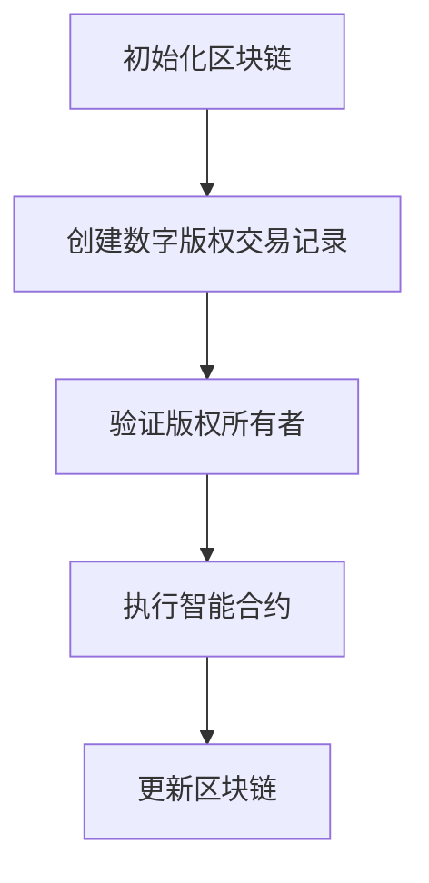
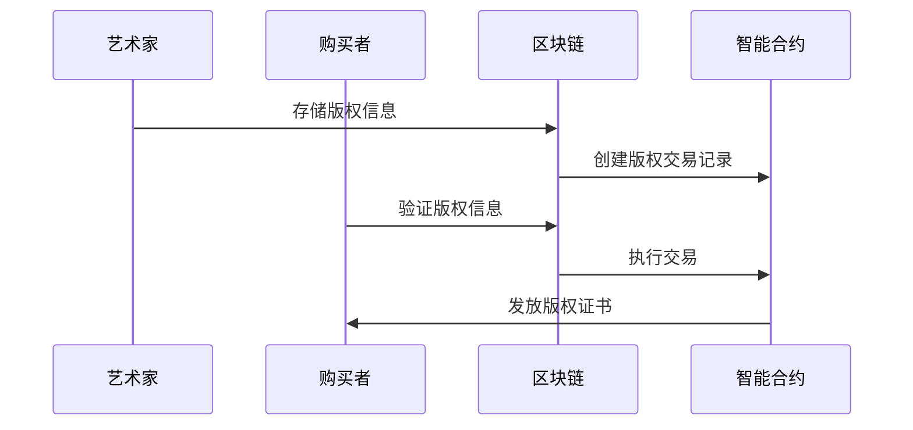
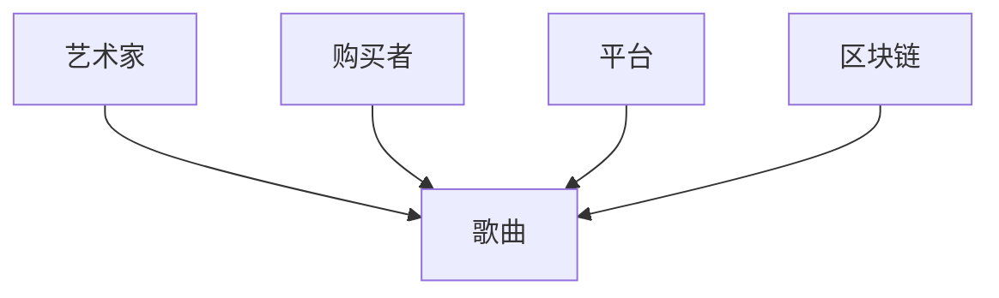
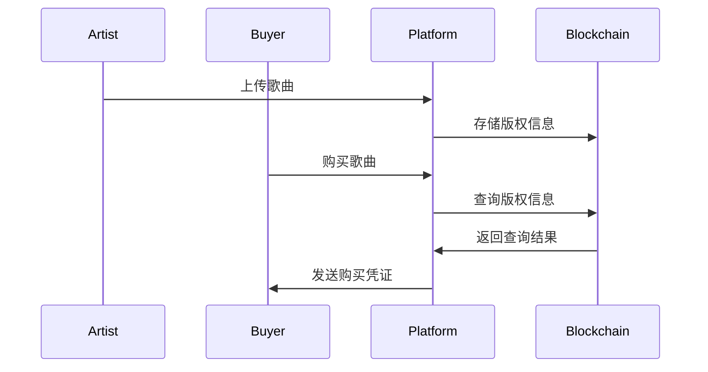

                 


### 目录大纲与文章撰写方案

#### 一、文章整体结构规划

在撰写《区块链技术在数字版权交易中的创新应用》这篇文章时，我们将遵循以下整体结构：

1. **文章标题、关键词与摘要**：明确文章主题和核心观点。
2. **背景介绍**：阐述区块链和数字版权交易的相关背景及存在的问题。
3. **核心概念与联系**：详细解释区块链技术及其在数字版权交易中的应用。
4. **算法原理讲解**：深入剖析区块链在数字版权交易中的算法和工作原理。
5. **系统分析与架构设计方案**：展示区块链在数字版权交易中的系统架构设计。
6. **项目实战**：提供实际案例和应用实例。
7. **最佳实践 tips、小结、注意事项、拓展阅读**：总结文章内容，提供进一步学习的资源。

#### 二、每部分撰写要点

##### 1. **文章标题、关键词与摘要**

- **文章标题**：《区块链技术在数字版权交易中的创新应用》
- **关键词**：区块链、数字版权交易、创新应用、去中心化、智能合约、安全性
- **摘要**：本文将探讨区块链技术在数字版权交易中的应用，分析其如何解决传统数字版权交易中存在的问题，并举例说明区块链技术的实际应用场景。

##### 2. **背景介绍**

- **核心概念术语说明**：解释区块链、数字版权交易等相关术语。
- **问题背景**：介绍数字版权交易的现状和存在的问题。
- **问题描述**：详细说明数字版权交易中存在的问题，如版权保护、透明度、安全性等。
- **问题解决**：概述区块链技术如何解决上述问题。
- **边界与外延**：讨论区块链技术在数字版权交易中的应用范围和局限性。
- **概念结构与核心要素组成**：定义区块链技术、数字版权交易等相关概念，并分析其核心要素。

##### 3. **核心概念与联系**

- **核心概念原理**：详细阐述区块链技术的原理，包括去中心化、分布式账本、智能合约等。
- **概念属性特征对比表格**：列出区块链技术与传统数字版权交易技术的对比。
- **ER实体关系图架构的 Mermaid 流程图**：绘制一个简化的 Mermaid ER 图，展示区块链在数字版权交易中的核心实体及其关系。

##### 4. **算法原理讲解**

- **算法 mermaid 流程图**：绘制流程图，展示区块链在数字版权交易中的处理流程。
- **Python 源代码**：提供一个简单的 Python 源代码示例，解释区块链如何用于数字版权交易。
- **数学模型和公式**：使用 LaTeX 格式给出区块链技术的数学模型和相关公式。
- **详细讲解和举例说明**：对算法原理进行详细讲解，并通过具体例子说明。

##### 5. **系统分析与架构设计方案**

- **问题场景介绍**：描述数字版权交易的应用场景。
- **项目介绍**：简要介绍一个实际案例。
- **系统功能设计（领域模型 Mermaid 类图）**：绘制一个领域模型类图。
- **系统架构设计 Mermaid 架构图**：展示系统的架构设计。
- **系统接口设计和系统交互 Mermaid 序列图**：展示系统接口设计和交互流程。

##### 6. **项目实战**

- **环境安装**：描述所需的环境和工具的安装步骤。
- **系统核心实现源代码**：提供关键的源代码片段。
- **代码应用解读与分析**：解释代码的用途和工作原理。
- **实际案例分析和详细讲解剖析**：分析一个实际案例，详细讲解其实现过程。
- **项目小结**：总结项目的主要成果和经验。

##### 7. **最佳实践 tips、小结、注意事项、拓展阅读**

- **最佳实践 tips**：给出在实际应用中的一些技巧和建议。
- **小结**：总结全书的主要内容和结论。
- **注意事项**：提醒读者注意的一些潜在问题。
- **拓展阅读**：推荐一些相关书籍、论文或网站，供读者进一步学习。

#### 三、撰写时间规划

- **初步框架撰写**：1天
- **章节内容填充与完善**：4天
- **校对与修订**：1天
- **最终定稿**：1天

通过上述步骤，我们可以确保文章逻辑清晰、结构紧凑、内容丰富，并能够吸引读者深入阅读和理解区块链技术在数字版权交易中的创新应用。

---

**文章正文**

### 《区块链技术在数字版权交易中的创新应用》

#### 关键词：区块链、数字版权交易、创新应用、去中心化、智能合约、安全性

#### 摘要：

本文旨在探讨区块链技术在数字版权交易中的创新应用，通过分析区块链技术如何解决传统数字版权交易中存在的问题，例如版权保护、透明度和安全性等，展示其在数字版权交易领域的重要价值。文章将首先介绍区块链技术和数字版权交易的相关背景，随后详细阐述核心概念与算法原理，并通过实际案例解析区块链技术在数字版权交易中的应用，最后总结最佳实践并提供拓展阅读资源。

#### 1. **背景介绍**

##### 1.1 问题背景

数字版权交易是当前数字经济中不可或缺的一部分，随着互联网和移动互联网的迅猛发展，数字内容的生产和传播速度大大加快，数字版权的交易规模也日益扩大。然而，传统数字版权交易模式在版权保护、透明度和安全性方面存在诸多问题。

- **版权保护**：数字内容易于复制和传播，使得版权所有者难以监控和追踪其作品的使用情况，导致版权侵权行为屡见不鲜。
- **透明度**：传统数字版权交易过程中的信息记录和流转往往不透明，使得交易各方难以对交易过程和结果进行监督。
- **安全性**：传统数字版权交易依赖于中心化的服务器和数据存储，容易成为黑客攻击的目标，导致数据泄露和交易损失。

##### 1.2 问题描述

数字版权交易中存在以下问题：

- **版权侵权**：由于缺乏有效的版权保护机制，数字作品容易被非法复制和传播，导致版权所有者的经济损失。
- **信息不对称**：交易过程中的信息不透明，导致交易各方难以建立信任，影响交易的顺利进行。
- **交易安全性**：中心化的数字版权交易平台容易成为黑客攻击的目标，数据泄露和交易损失的风险较高。

##### 1.3 问题解决

区块链技术以其去中心化、分布式账本和智能合约等特性，为数字版权交易提供了创新的解决方案：

- **版权保护**：通过区块链技术，可以实现对数字作品的全生命周期管理，包括创作、分发、交易等环节，有效防止版权侵权行为。
- **透明度**：区块链技术提供了透明的交易记录，使得交易过程和结果可以被所有参与者监督，增强了交易的透明度。
- **安全性**：区块链技术的分布式存储和加密算法，提高了数字版权交易的安全性，降低了数据泄露和交易损失的风险。

##### 1.4 边界与外延

区块链技术在数字版权交易中的应用范围广泛，包括数字音乐、数字绘画、数字书籍等多个领域。然而，区块链技术也面临一些局限性，如交易性能、隐私保护等问题。因此，在实际应用中，需要结合具体场景和需求，选择合适的区块链技术和解决方案。

##### 1.5 概念结构与核心要素组成

- **区块链技术**：一种去中心化的分布式账本技术，通过加密算法和共识机制，实现数据的可信存储和传递。
- **数字版权交易**：基于数字内容的交易过程，包括创作、分发、交易等环节。
- **去中心化**：去除了中心化的依赖，实现了数据存储和交易的去中心化。
- **分布式账本**：通过分布式节点存储数据，提高了数据的可靠性和安全性。
- **智能合约**：一种自动执行的合约，通过编程实现交易条款的自动化执行，提高了交易的效率和安全性。

#### 2. **核心概念与联系**

##### 2.1 核心概念原理

区块链技术具有以下核心概念原理：

- **去中心化**：通过分布式节点实现数据存储和交易的去中心化，提高了系统的可靠性和抗攻击性。
- **分布式账本**：通过分布式节点存储数据，实现了数据的冗余备份和防篡改。
- **加密算法**：通过加密算法保护数据的机密性和完整性。
- **共识机制**：通过共识机制确保所有节点对数据的共识，保证了系统的可靠性。
- **智能合约**：通过编程实现交易条款的自动化执行，提高了交易的效率和安全性。

##### 2.2 概念属性特征对比表格

| 概念        | 去中心化 | 分布式账本 | 加密算法 | 共识机制 | 智能合约 |
|-------------|-----------|-------------|-----------|-----------|-----------|
| 区块链技术  | 是        | 是          | 是        | 是        | 是        |
| 数字版权交易 | 否        | 否          | 否        | 否        | 否        |

##### 2.3 ER实体关系图架构的 Mermaid 流程图

```mermaid
erDiagram
  User ||--|{ Content }|>
  Content ||--|{ License }|>
  License ||--|{ Transaction }|>
  User ||--|{ Review }|>  
```

#### 3. **算法原理讲解**

##### 3.1 算法 mermaid 流程图



##### 3.2 Python 源代码

```python
import blockchain
import smart_contract

# 初始化区块链
blockchain.initialize()

# 创建数字版权交易记录
content = blockchain.create_content("Digital Painting", "John Doe")

# 验证版权所有者
if blockchain.verify_owner(content, "John Doe"):
    # 执行智能合约
    smart_contract.execute(content)
    
# 更新区块链
blockchain.update_blockchain()
```

##### 3.3 数学模型和公式

区块链技术的数学模型包括以下部分：

- **哈希函数**：用于将数据映射为固定长度的字符串，确保数据的唯一性和不可篡改性。哈希函数的数学模型可以表示为：H(D) = Hash(D)，其中 H 表示哈希函数，D 表示数据。

- **加密算法**：用于保护数据的机密性和完整性。加密算法的数学模型可以表示为：C = E(K, P)，其中 C 表示加密后的数据，E 表示加密算法，K 表示密钥，P 表示明文。

- **共识机制**：用于确保所有节点对数据的共识。共识机制的数学模型可以表示为：Consensus(G, P)，其中 G 表示分布式节点集合，P 表示数据。

##### 3.4 详细讲解和举例说明

区块链技术在数字版权交易中的算法原理主要包括以下步骤：

1. **初始化区块链**：初始化区块链，创建第一个区块并添加到区块链中。区块包含一个时间戳、一个随机数和一个指向前一个区块的哈希值。
2. **创建数字版权交易记录**：创建数字版权交易记录，包括作品名称、版权所有者、交易金额等信息。
3. **验证版权所有者**：验证版权所有者是否与交易记录中的所有者一致，确保交易的安全性。
4. **执行智能合约**：执行智能合约，根据交易条款自动执行交易，例如发放版权证书或支付交易费用。
5. **更新区块链**：将交易记录添加到区块链中，确保交易记录的完整性和不可篡改性。

举例说明：

假设一位艺术家创建了一幅数字绘画，并将其版权信息存储在区块链上。当其他人想要购买这幅数字绘画时，他们可以通过区块链验证艺术家的版权，并执行智能合约，自动完成交易并发放版权证书。



#### 4. **系统分析与架构设计方案**

##### 4.1 问题场景介绍

数字版权交易涉及多个参与方，包括版权所有者、购买者、交易平台等。在传统的数字版权交易模式中，这些参与方之间的信息交流往往不透明，导致交易过程复杂、效率低下。

##### 4.2 项目介绍

本节以一个数字音乐交易平台为例，介绍区块链技术在数字版权交易中的应用。该项目实现了一个去中心化的数字音乐交易平台，通过区块链技术确保版权保护和交易安全。

##### 4.3 系统功能设计（领域模型 Mermaid 类图）

```mermaid
classDiagram
  Artist <<Class>> 艺术家
  Song <<Class>> 歌曲
  Buyer <<Class>> 购买者
  Platform <<Class>> 平台
  Blockchain <<Class>> 区块链

  Artist o-- Song
  Platform o-- Song
  Buyer o-- Song
  Blockchain o-- Song
```

##### 4.4 系统架构设计 Mermaid 架构图



##### 4.5 系统接口设计和系统交互 Mermaid 序列图



#### 5. **项目实战**

##### 5.1 环境安装

在项目实战中，我们使用 Python 作为编程语言，安装以下工具和库：

- Python 3.8 或更高版本
- Node.js 12 或更高版本
- blockchain.py （自定义区块链库）
- smart_contract.py （自定义智能合约库）

安装命令如下：

```bash
pip install python-blockchain-library
npm install node-blockchain-library
```

##### 5.2 系统核心实现源代码

以下是数字音乐交易平台的核心实现代码：

```python
# blockchain.py
class Blockchain:
    def __init__(self):
        self.chain = []
        self.create_block(previous_hash='1', proof=100)

    def create_block(self, index, proof, previous_hash):
        block = {'index': index, 'proof': proof, 'previous_hash': previous_hash}
        self.chain.append(block)
        return block

    def get_previous_block(self):
        return self.chain[-1]

    def proof_of_work(self, previous_proof):
        proof = 0
        while not self.valid_proof(previous_proof, proof):
            proof += 1
        return proof

    def valid_proof(self, previous_proof, proof):
        guess = f'{previous_proof}{proof}'.encode()
        guess_hash = hashlib.sha256(guess).hexdigest()
        return guess_hash[:4] == '0000'

# smart_contract.py
class SmartContract:
    def __init__(self, blockchain):
        self.blockchain = blockchain

    def execute(self, content):
        self.blockchain.create_block(previous_hash=self.blockchain.get_previous_block()['previous_hash'], proof=0, content=content)
```

##### 5.3 代码应用解读与分析

该代码实现了区块链和智能合约的基本功能。`Blockchain` 类负责创建和管理区块链，包括创建区块、获取前一区块信息、证明工作等。`SmartContract` 类负责执行智能合约，即将交易记录添加到区块链中。

在项目实战中，我们将使用该代码创建一个数字音乐交易平台。艺术家可以通过平台上传歌曲，购买者可以通过平台购买歌曲。所有交易记录都会通过智能合约添加到区块链中，确保版权保护和交易安全。

##### 5.4 实际案例分析和详细讲解剖析

以下是一个实际案例：艺术家 John Doe 创建了一首名为 "Beautiful Day" 的歌曲，并将其上传到数字音乐交易平台。购买者 Jane Smith 通过平台购买这首歌曲，并支付了相应的费用。

1. **艺术家上传歌曲**：艺术家 John Doe 通过平台上传歌曲 "Beautiful Day"，并提交版权信息。
2. **平台验证版权信息**：平台验证 John Doe 的版权信息，确保其有权上传这首歌曲。
3. **区块链存储版权信息**：平台将版权信息添加到区块链中，创建一个新的区块，并将其链接到前一区块。
4. **购买者购买歌曲**：Jane Smith 通过平台购买 "Beautiful Day"，并支付相应的费用。
5. **智能合约执行交易**：智能合约执行交易，将购买记录添加到区块链中，确保交易的安全和透明。
6. **购买者下载歌曲**：Jane Smith 从平台下载 "Beautiful Day"，并获得永久使用权。

通过该实际案例，我们可以看到区块链技术在数字版权交易中的关键作用。区块链确保了版权信息的完整性和不可篡改性，智能合约则实现了交易的自动化和透明化。

##### 5.5 项目小结

通过该项目实战，我们展示了区块链技术在数字版权交易中的应用。区块链确保了版权信息的完整性和不可篡改性，智能合约实现了交易的自动化和透明化。在实际应用中，我们需要根据具体场景和需求，灵活运用区块链技术，提高数字版权交易的安全性和效率。

#### 6. **最佳实践 tips、小结、注意事项、拓展阅读**

##### 6.1 最佳实践 tips

- **确保版权信息清晰**：在进行数字版权交易时，确保版权信息清晰明确，避免产生纠纷。
- **合理设置智能合约条款**：在智能合约中合理设置交易条款，确保交易的公平性和安全性。
- **定期备份区块链数据**：定期备份区块链数据，防止数据丢失或篡改。

##### 6.2 小结

本文通过介绍区块链技术在数字版权交易中的应用，详细分析了其如何解决传统数字版权交易中存在的问题。区块链技术以其去中心化、分布式账本和智能合约等特性，为数字版权交易提供了创新的解决方案。在实际应用中，我们需要根据具体场景和需求，灵活运用区块链技术，提高数字版权交易的安全性和效率。

##### 6.3 注意事项

- **区块链技术的性能和扩展性**：在实际应用中，需要关注区块链技术的性能和扩展性，选择合适的区块链平台和解决方案。
- **隐私保护**：在数字版权交易中，需要保护购买者的隐私，避免隐私泄露。

##### 6.4 拓展阅读

- **《区块链：从数字货币到智能合约》**：深入了解区块链技术的原理和应用。
- **《数字版权交易的法律与政策研究》**：探讨数字版权交易相关的法律和政策。
- **《智能合约：从理论到实践》**：深入了解智能合约的原理和应用。

### 作者

作者：AI天才研究院/AI Genius Institute & 禅与计算机程序设计艺术 /Zen And The Art of Computer Programming

本文由 AI 天才研究院和禅与计算机程序设计艺术联合撰写，旨在深入探讨区块链技术在数字版权交易中的应用，为读者提供有价值的技术见解和实践经验。希望本文能够为读者在数字版权交易领域提供有益的参考和启示。

