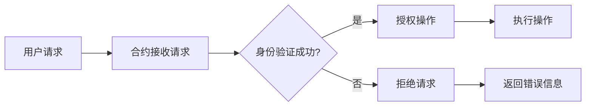
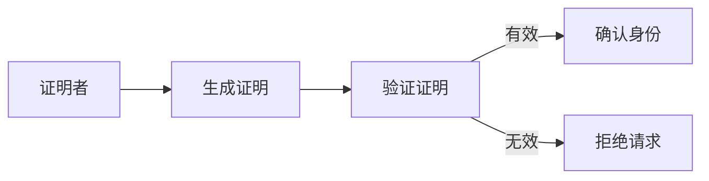
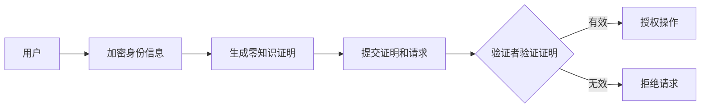
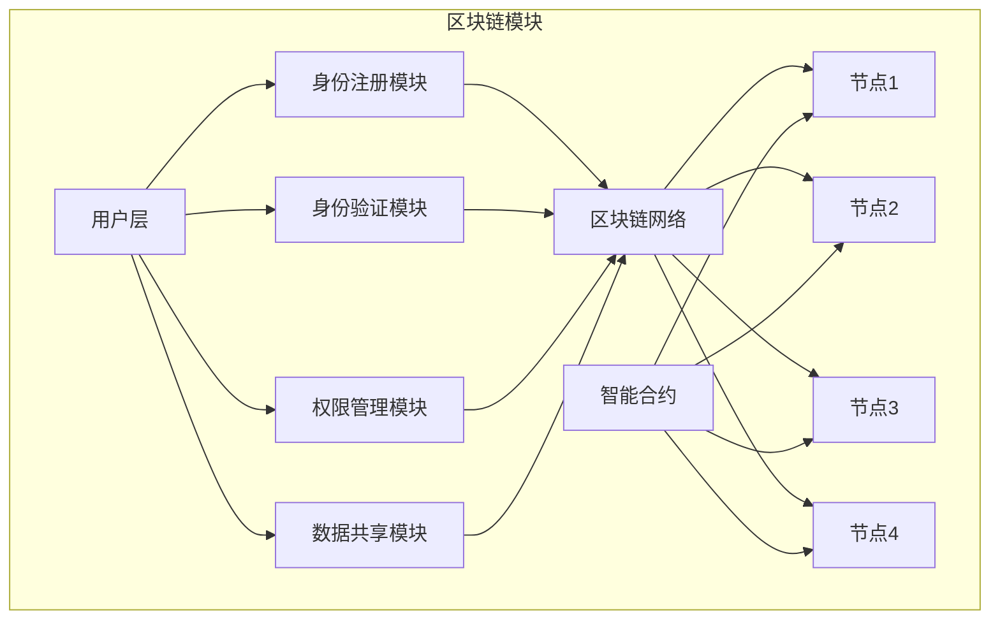
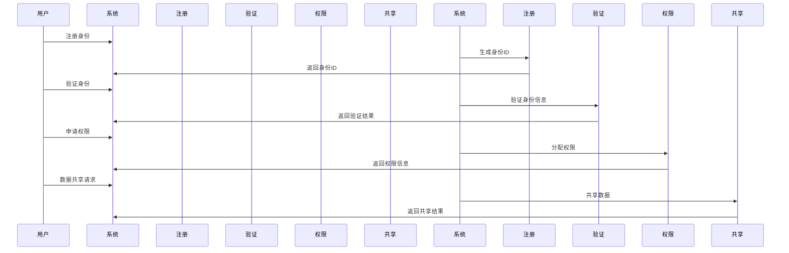

                 

### 引言

区块链技术在过去的几年中取得了飞速的发展，成为现代信息技术领域的一大热点。随着数字经济和互联网的深入普及，人们对于数据安全、隐私保护和交易可信性的需求日益增加。在这种背景下，数字身份管理成为一个关键问题。数字身份管理不仅涉及个人隐私和数据安全，还包括企业、政府机构等不同实体的身份认证和权限管理。传统的身份管理方式存在诸多问题，如数据泄露、权限滥用、操作透明度不足等。这些问题迫切需要新的解决方案。

区块链技术的出现为数字身份管理带来了新的希望。区块链具有去中心化、不可篡改、透明可追溯等特点，这些特性使其在数字身份管理中具有独特的优势。通过区块链，可以构建一个安全、可靠、透明的数字身份管理平台，从而有效解决传统身份管理中的痛点。本文将探讨区块链技术在数字身份管理中的应用，分析其核心原理、技术架构和实践案例，旨在为读者提供一个全面深入的理解。

文章的关键词包括：区块链、数字身份管理、去中心化、不可篡改、透明性、隐私保护、身份认证、权限管理、加密技术、智能合约。通过这些关键词，读者可以更好地把握文章的主题和核心内容。

本文将分为以下章节：

1. **背景介绍**：介绍区块链技术和数字身份管理的背景，解释关键概念，探讨问题背景、问题描述、问题解决以及概念的边界与外延。
2. **核心概念与联系**：详细阐述区块链的核心概念，并通过表格和ER图展示其属性和相互关系。
3. **区块链与数字身份**：讨论区块链在数字身份管理中的应用原理，分析其优势与挑战。
4. **算法与协议**：介绍区块链中用于数字身份管理的算法和协议，绘制流程图，并提供Python代码示例。
5. **系统架构与设计**：描述区块链数字身份管理系统的架构设计，包括类图、架构图和序列图。
6. **案例研究**：分析区块链技术在数字身份管理中的实际应用案例，提供代码分析。
7. **项目实战**：介绍一个具体的区块链数字身份管理项目，包括环境安装、系统实现、代码解读、案例分析及小结。
8. **最佳实践与总结**：总结文章的主要观点，提出最佳实践建议，提醒注意事项，并提供拓展阅读资源。

### 背景介绍

#### 区块链技术的起源与发展

区块链技术最早由中本聪（Satoshi Nakamoto）在2008年提出，作为一种去中心化的分布式账本技术，其核心思想是无需信任的陌生人之间能够安全地进行价值交换。区块链通过一种共识机制，确保所有参与节点对账本的一致性，从而避免了传统中心化系统中的单点故障和数据篡改问题。自2009年比特币（Bitcoin）的诞生以来，区块链技术迅速发展，并在多个领域展现出了巨大的潜力。

区块链技术的发展可以分为几个重要阶段：

1. **区块链1.0**：以比特币为代表，主要解决数字货币的发行和交易问题。区块链1.0的核心在于点对点的电子现金系统，使得去中心化的支付网络成为可能。
2. **区块链2.0**：随着智能合约（Smart Contract）技术的引入，区块链不再仅仅是数字货币的交易平台，而成为一个可以编程的全球性计算机。以太坊（Ethereum）是区块链2.0的代表性平台，其智能合约功能使得去中心化应用（DApps）的开发成为可能。
3. **区块链3.0**：随着更多实际应用的出现，区块链技术开始向更多领域扩展，包括供应链管理、医疗健康、数字身份管理、物联网等。区块链3.0强调区块链与传统行业的深度融合，解决更复杂的社会和经济问题。

区块链技术的核心概念包括：

- **分布式账本**：区块链是一种分布式数据库，数据存储在各个节点的复制副本中，每个节点都有完整的账本记录。这使得区块链具有高度的可信性和抗篡改能力。
- **共识机制**：共识机制是区块链系统中的关键机制，用于确保所有节点对账本的一致性。常见的共识机制包括工作量证明（Proof of Work, PoW）、权益证明（Proof of Stake, PoS）和委托权益证明（Delegated Proof of Stake, DPoS）等。
- **加密技术**：区块链利用密码学技术保证数据的完整性和安全性，包括哈希函数、非对称加密和数字签名等。

#### 数字身份管理的定义与重要性

数字身份管理是一种通过数字手段识别、验证和管理个人或实体身份的技术。在传统的身份管理系统中，身份验证主要依赖于中心化的认证机构，如银行、政府机构和企业等。这些系统存在多个潜在的问题，包括数据泄露、权限滥用和操作不透明等。随着互联网的普及，数字身份管理变得日益重要，其原因主要包括：

- **数据安全和隐私保护**：在数字化社会中，个人和企业需要保护其敏感信息，如身份认证信息、金融数据等。数字身份管理通过加密技术和分布式账本，提供更高的安全性和隐私保护。
- **身份认证与权限管理**：在复杂的信息系统中，身份认证和权限管理是确保系统安全和数据安全的关键环节。数字身份管理通过统一的身份认证和权限分配机制，提高系统的操作效率和安全性。
- **跨领域协作与数据共享**：在多个领域和机构之间的协作中，数字身份管理能够实现身份认证和数据共享，降低信息孤岛和重复认证的现象，提高协作效率。

#### 问题背景、问题描述与解决

**问题背景**

随着互联网和数字技术的发展，传统身份管理系统面临以下问题：

1. **数据泄露风险**：中心化的身份管理系统容易成为黑客攻击的目标，导致大量个人和企业数据泄露。
2. **权限滥用**：中心化的身份管理系统可能导致权限滥用，内部人员可以非法访问或篡改敏感数据。
3. **操作不透明**：中心化的身份管理系统缺乏透明性，用户无法直接验证操作的真实性和合法性。
4. **数据孤岛**：不同系统之间的身份信息无法共享，导致用户在多个系统中重复注册和认证，影响用户体验。

**问题描述**

数字身份管理中的核心问题包括：

1. **身份认证与数据安全**：如何确保用户身份的合法性和数据的安全性，防止数据泄露和滥用？
2. **权限管理与访问控制**：如何实现精细化的权限管理，确保用户只能访问其授权的信息和资源？
3. **跨领域协作与数据共享**：如何在不同的系统和机构之间实现身份信息的共享和互认，提高协作效率？

**问题解决**

区块链技术为数字身份管理提供了以下解决方案：

1. **去中心化身份认证**：通过分布式账本技术，实现去中心化的身份认证，减少对中心化机构的依赖，提高系统的安全性和可信性。
2. **加密与隐私保护**：利用密码学技术对用户身份信息和交易数据进行加密，保护隐私和数据安全。
3. **智能合约与权限管理**：使用智能合约实现自动化的权限管理和访问控制，确保用户只能访问其授权的信息和资源。
4. **透明性与可追溯性**：区块链上的所有操作都是透明和可追溯的，用户可以验证操作的合法性和真实性，增强系统的透明性。

#### 边界与外延

**边界**

1. **技术边界**：区块链技术虽然具有许多优势，但在处理大规模数据、处理速度和性能方面仍存在一定的局限。
2. **法律边界**：数字身份管理涉及到法律和隐私问题，不同国家和地区的法律和规定有所不同，需要遵守相应的法律法规。
3. **应用边界**：并非所有领域和场景都适合采用区块链技术进行数字身份管理，需要根据具体需求进行评估和选择。

**外延**

1. **跨领域应用**：数字身份管理不仅局限于个人和企业，还可以应用于政府机构、医疗机构、教育机构等不同领域，实现更广泛的身份认证和数据共享。
2. **物联网与数字身份**：随着物联网的发展，设备与设备之间的身份认证和数据交换将成为重要需求，数字身份管理可以扩展到物联网领域。
3. **去中心化身份服务**：区块链技术可以应用于构建去中心化的身份服务（DIDs），提供全球范围内的身份认证和权限管理。

通过以上背景介绍，读者可以对区块链技术和数字身份管理有一个全面的了解，为后续章节的深入探讨打下基础。

### 核心概念与联系

在探讨区块链技术如何应用于数字身份管理之前，我们需要明确区块链技术中的几个核心概念。以下是区块链技术中一些主要概念的定义及其属性特征，并通过表格和ER图展示它们之间的关系。

#### 核心概念

1. **区块链**：区块链是一种分布式数据库，通过加密和共识机制确保数据的不可篡改性和一致性。
2. **区块**：区块是区块链的基本单元，包含一定数量的交易记录，每个区块都有一个时间戳和唯一的哈希值。
3. **交易**：交易是区块链中的基本操作，代表用户之间的价值交换或数据传输。
4. **共识机制**：共识机制是区块链系统中确保所有节点对账本一致性的一种算法，如PoW、PoS等。
5. **加密技术**：加密技术用于保护区块链上的数据，包括哈希函数、非对称加密和数字签名等。
6. **智能合约**：智能合约是区块链上的可编程合约，能够自动执行预定义的逻辑和规则。

#### 概念属性特征对比表格

| 概念         | 定义                                                         | 主要属性                     | 适用场景                 |
| ------------ | ------------------------------------------------------------ | -------------------------- | ---------------------- |
| 区块链       | 分布式数据库，通过共识机制确保数据一致性                     | 去中心化、不可篡改、透明   | 数字货币、智能合约平台 |
| 区块         | 区块链的基本单元，包含交易记录和时间戳等                     | 哈希值、时间戳、交易记录   | 数据存储和验证          |
| 交易         | 区块链中的基本操作，代表用户之间的价值交换或数据传输         | 交易金额、交易方、交易数据 | 价值交换、数据传输      |
| 共识机制     | 确保区块链系统所有节点对账本一致性的一种算法                 | 安全性、一致性、效率       | 系统稳定性和可靠性      |
| 加密技术     | 用于保护区块链上数据的密码学技术，包括哈希函数、非对称加密等 | 安全性、隐私性             | 数据保护、身份验证      |
| 智能合约     | 区块链上的可编程合约，能够自动执行预定义的逻辑和规则         | 可编程性、自动化、透明     | 自动化交易、权限管理    |

#### ER图

下面是区块链技术相关概念的ER图，展示了它们之间的实体关系：

```mermaid
erDiagram
    区块chain -->|交易记录| 交易transaction
    区块chain -->|存储数据| 数据data
    交易transaction -->|加密信息| 加密信息encryption
    区块chain -->|时间戳| 时间戳timestamp
    区块chain -->|哈希值| 哈希值hash
    区块chain -->|共识机制| 共识机制consensus
    智能合约smart_contract -->|执行逻辑| 执行逻辑logic
    智能合约smart_contract -->|调用交易| 交易transaction
```

#### 关系解释

- **区块与交易**：区块是区块链的基本单元，每个区块包含一定数量的交易记录。交易记录是用户之间的价值交换或数据传输操作。
- **区块与数据**：区块不仅包含交易记录，还存储了与交易相关的其他数据，如时间戳、哈希值等，用于确保数据的一致性和完整性。
- **交易与加密信息**：交易记录中的信息需要进行加密处理，以保护隐私和数据安全。加密信息包括交易金额、交易方和交易数据等。
- **区块与共识机制**：共识机制是确保区块链系统所有节点对账本一致性的一种算法，如PoW、PoS等。共识机制用于确认交易的合法性和区块的添加。
- **智能合约与执行逻辑**：智能合约是区块链上的可编程合约，能够自动执行预定义的逻辑和规则。智能合约用于实现自动化交易、权限管理和数据存储等功能。

通过上述表格和ER图的展示，我们可以清晰地看到区块链技术中各个核心概念及其相互关系，为后续深入探讨区块链在数字身份管理中的应用提供了基础。

### 区块链与数字身份

#### 区块链在数字身份管理中的应用原理

区块链技术在数字身份管理中的应用原理主要基于其去中心化、不可篡改和透明可追溯等特性。具体来说，区块链通过以下机制实现数字身份管理：

1. **分布式身份存储**：在传统身份管理系统中，身份信息通常存储在中心化的服务器上，容易成为黑客攻击的目标。区块链通过分布式账本技术，将身份信息分散存储在各个节点上，提高了系统的安全性和抗攻击能力。
2. **加密身份信息**：区块链利用加密技术对身份信息进行加密处理，确保只有授权的用户能够解密和访问身份信息。这有助于保护用户的隐私和数据安全，防止未经授权的访问和篡改。
3. **去中心化身份认证**：区块链通过去中心化的身份认证机制，减少对中心化认证机构的依赖。用户可以自行创建和管理自己的数字身份，并通过分布式网络进行验证，降低了操作成本和提高效率。
4. **透明可追溯的记录**：区块链上的所有操作都是透明和可追溯的，用户可以随时查看和验证身份信息的变更记录。这种透明性有助于提高系统的可信度和公信力，防止欺诈和篡改行为。

#### 区块链在数字身份管理中的优势

1. **安全性**：区块链利用密码学技术确保数据的安全性和完整性，通过分布式存储和加密处理，减少了单点故障和数据泄露的风险。
2. **隐私保护**：区块链通过加密和分布式存储，确保用户身份信息的隐私性。用户可以自行控制身份信息的访问权限，减少了对第三方机构的依赖。
3. **去中心化**：区块链的去中心化特性减少了中心化机构的依赖，提高了系统的灵活性和抗风险能力。用户可以自行创建和管理数字身份，降低了身份管理的成本和复杂性。
4. **透明性和可追溯性**：区块链上的所有操作都是透明和可追溯的，用户可以随时查看和验证身份信息的变更记录，提高了系统的透明度和可信度。
5. **高效性和自动化**：区块链通过智能合约实现自动化交易和权限管理，减少了人工干预和操作成本，提高了系统的运行效率和可靠性。

#### 区块链在数字身份管理中的挑战

尽管区块链在数字身份管理中具有许多优势，但也面临一些挑战：

1. **性能问题**：区块链系统的性能依赖于节点的数量和网络的带宽。在大规模应用中，区块链的处理速度可能无法满足实时性要求，需要进行优化和改进。
2. **隐私保护与数据可用性**：在保护用户隐私的同时，如何确保数据的可用性和可访问性是一个重要挑战。需要设计合理的隐私保护机制和访问控制策略。
3. **法律和监管问题**：区块链技术的应用涉及到法律和隐私问题，不同国家和地区的法律法规有所不同，需要遵守相应的规定，并确保系统的合法性和合规性。
4. **用户接受度和普及率**：区块链技术的普及和应用需要用户的广泛接受和参与。提高用户的理解和信任度，促进区块链在数字身份管理中的普及，是一个重要挑战。

#### 区块链在数字身份管理中的前景

随着区块链技术的不断发展和成熟，其在数字身份管理中的应用前景十分广阔：

1. **个人身份认证**：区块链可以提供更加安全、便捷和透明的个人身份认证服务，适用于电子商务、在线支付、社交媒体等场景。
2. **企业身份认证**：区块链可以为企业提供去中心化的身份认证和权限管理服务，提高企业的运营效率和安全性。
3. **跨境身份认证**：区块链可以解决跨境身份认证中的信任问题，提高跨境业务和贸易的便利性和效率。
4. **物联网与数字身份**：随着物联网的发展，设备与设备之间的身份认证和数据交换需求日益增加，区块链可以提供高效和安全的解决方案。
5. **去中心化身份服务**：区块链可以应用于构建去中心化的身份服务（DIDs），提供全球范围内的身份认证和权限管理，促进数据共享和跨领域协作。

总之，区块链技术在数字身份管理中具有巨大的潜力和优势，但也需要克服一系列挑战。通过不断的技术创新和应用实践，区块链有望在数字身份管理领域发挥重要作用，推动数字经济和社会的发展。

### 算法与协议

在区块链技术的应用中，算法和协议的设计至关重要，它们不仅确保了系统的安全性和可靠性，还影响了系统的性能和扩展性。在数字身份管理中，区块链采用了一系列特定的算法和协议来处理身份验证、权限管理和数据保护等问题。以下是几种主要算法和协议的介绍，并通过Mermaid流程图展示其工作原理，并辅以Python代码示例进行解释。

#### 1. 智能合约（Smart Contract）

智能合约是区块链上的一种自执行合同，它包含了双方事先约定的条件，一旦触发条件即自动执行。智能合约在数字身份管理中用于自动化身份验证和权限管理。

**算法原理**：
智能合约通过预定义的编程逻辑，对用户的身份信息进行验证和权限分配。它通常包括三个主要部分：输入参数、逻辑代码和输出结果。

**Mermaid流程图**：



**Python代码示例**：

```python
def verify_identity(user_data):
    # 假设用户数据包括姓名、身份证号和签名
    if validate_signature(user_data['name'], user_data['id'], user_data['signature']):
        return "身份验证成功"
    else:
        return "身份验证失败"

def grant_permission(user_id, permission):
    # 假设权限为字符串，如'view'或'edit'
    if user_id in authorized_users:
        return "权限分配成功"
    else:
        return "权限分配失败"

# 示例调用
user_data = {
    'name': 'John Doe',
    'id': '123456789',
    'signature': 'some_signature'
}

result = verify_identity(user_data)
if result == "身份验证成功":
    permission_result = grant_permission(user_data['id'], 'view')
    print(permission_result)
else:
    print(result)
```

#### 2. 零知识证明（Zero-Knowledge Proof）

零知识证明是一种加密协议，它允许一方（证明者）向另一方（验证者）证明某个陈述是真实的，而无需透露任何具体信息。在数字身份管理中，零知识证明用于验证身份信息，同时保护用户的隐私。

**算法原理**：
零知识证明通过一系列加密算法，生成一个证明，证明某项属性（如身份）的真实性，但不透露具体的信息。验证者可以确认证明的真实性，但无法得知证明者具体的信息。

**Mermaid流程图**：



**Python代码示例**：

```python
from pyzkp import PedersenCommitment, Prover, Verifier

# 创建Pedersen承诺
p = PedersenCommitment(p=1024)

# 生成证明
def generate_proof(prover):
    proof = p.prove(prover)
    return proof

# 验证证明
def verify_proof(verifier, proof):
    if verifier.verify(proof):
        return "证明有效"
    else:
        return "证明无效"

# 示例调用
prover = Prover()
proof = generate_proof(prover)
verifier = Verifier()
result = verify_proof(verifier, proof)
print(result)
```

#### 3. 隐私保护身份验证（Privacy-Preserving Identity Verification）

隐私保护身份验证是一种在保护用户隐私的同时进行身份验证的技术。它通过加密和零知识证明等技术，确保验证过程的安全性。

**算法原理**：
隐私保护身份验证通过加密算法对用户身份信息进行加密处理，同时使用零知识证明来验证身份信息的真实性。验证者无法获取用户的原始身份信息，但可以确认其身份。

**Mermaid流程图**：



**Python代码示例**：

```python
from cryptography.hazmat.primitives.asymmetric import rsa
from cryptography.hazmat.primitives import hashes
from cryptography.hazmat.primitives.asymmetric.utils import integer_to_bytes_dle

# 生成密钥对
private_key = rsa.generate_private_key(
    public_exponent=65537,
    key_size=2048,
)

public_key = private_key.public_key()

# 加密身份信息
def encrypt_identity(identity, public_key):
    encrypted_identity = public_key.encrypt(
        identity.encode(),
        rsa_padding.OAEP(
            mgf=rsa_mgf1.PKCS1MGF1(),
            algorithm=hashes.SHA256(),
        ),
    )
    return encrypted_identity

# 使用零知识证明验证
def verify_proof(verifier, encrypted_proof):
    if verifier.verify_proof(encrypted_proof):
        return "证明有效"
    else:
        return "证明无效"

# 示例调用
identity = "John Doe"
encrypted_identity = encrypt_identity(identity, public_key)
verifier = # 初始化验证者
result = verify_proof(verifier, encrypted_identity)
print(result)
```

通过上述算法和协议的介绍，我们可以看到区块链技术在数字身份管理中提供了多种安全、高效和隐私保护的方法。这些算法和协议的设计和实现，不仅提升了系统的安全性和可靠性，还为数字身份管理的广泛应用奠定了基础。

### 系统架构与设计

#### 问题场景介绍

在数字身份管理中，存在一个典型的场景：多个企业和机构需要共享用户身份信息，以实现无缝协作和高效认证。然而，传统中心化的身份管理系统存在数据孤岛和信任问题，难以满足这一需求。为了解决这些问题，我们需要设计一个去中心化的数字身份管理系统，确保数据的安全性和隐私性，同时支持高效的身份验证和权限管理。

#### 项目介绍

本系统名为“可信身份链”（TrustIDChain），旨在构建一个去中心化的身份验证平台，实现多机构、跨领域的身份信息共享和管理。可信身份链基于区块链技术，利用智能合约实现身份认证、权限管理和数据共享等功能。

#### 系统功能设计

可信身份链的主要功能包括：

1. **身份注册**：用户可以在平台上创建和管理自己的数字身份，包括基本信息、身份证明等。
2. **身份验证**：系统提供多种身份验证方式，包括密码验证、生物识别验证和第三方身份验证。
3. **权限管理**：系统根据用户的身份和角色，分配相应的权限，确保用户只能访问其授权的信息和资源。
4. **数据共享**：平台支持多机构之间的身份信息共享，实现跨领域的协作和互认。
5. **隐私保护**：系统采用加密技术和隐私保护协议，确保用户身份信息和交易数据的安全性。

#### 领域模型（Mermaid类图）

可信身份链的领域模型如下所示，通过Mermaid类图展示系统的核心实体及其关系：

```mermaid
classDiagram
    User <<entity>>
    Organization <<entity>>
    Identity <<entity>>
    Credential <<entity>>
    Authority <<entity>>

    User {"has" Identity}
    User {"has" Credential}
    Organization {"has" Authority}
    Organization {"has" Credential}
    Identity {"has" Credential}
    Authority {"has" Credential}

    class User {
        +String username
        +String password
        +Identity identity
        +List<Credential> credentials
    }

    class Organization {
        +String name
        +List<Authority> authorities
        +List<Credential> credentials
    }

    class Identity {
        +String id
        +List<Credential> credentials
    }

    class Credential {
        +String type
        +String value
        +Date expiration_date
    }

    class Authority {
        +String role
        +String permission
    }
```

#### 系统架构设计（Mermaid架构图）

可信身份链的系统架构设计如下，通过Mermaid架构图展示系统的整体结构和主要组件之间的关系：



#### 系统接口设计与交互（Mermaid序列图）

可信身份链的系统接口设计和交互流程如下，通过Mermaid序列图展示用户与系统之间的交互过程：



通过上述系统架构和设计，可信身份链能够实现去中心化的数字身份管理，提供安全、高效和透明的身份验证、权限管理和数据共享功能，满足多机构、跨领域的协作需求。系统架构和设计的合理性和完整性为平台的成功实施和运营奠定了坚实基础。

### 案例研究

#### 案例背景

在探讨区块链技术在数字身份管理中的实际应用时，我们选择了一家全球知名金融机构——XYZ银行，作为案例分析的对象。XYZ银行面临着传统身份管理系统的一系列挑战，如数据泄露风险、权限滥用和操作不透明等。为了解决这些问题，XYZ银行决定引入区块链技术，构建一个去中心化的数字身份管理系统。

#### 系统实现

1. **区块链网络搭建**：
   XYZ银行首先搭建了一个私有区块链网络，使用Hyperledger Fabric作为底层框架。该网络由多个节点组成，包括银行内部服务器和第三方身份认证机构。节点之间通过安全通道进行通信，确保数据传输的安全性和完整性。

2. **身份注册与验证**：
   系统支持用户在区块链上进行身份注册，通过智能合约验证身份信息的真实性。用户首先在银行官网提交身份信息，系统会使用零知识证明技术进行验证，确认用户身份后生成唯一的数字身份标识（DID）。

3. **权限管理**：
   系统利用智能合约实现权限管理，根据用户的身份和角色分配不同的权限。例如，普通用户只能查看账户余额，而高级用户则可以执行转账和贷款等操作。智能合约确保权限分配的透明性和不可篡改性。

4. **数据共享与隐私保护**：
   系统支持跨机构的数据共享，多个参与机构可以在区块链上共享用户身份信息。通过加密技术和权限控制，确保数据在共享过程中的安全性和隐私性。

#### 核心实现与代码分析

以下是对XYZ银行区块链数字身份管理系统核心部分的代码分析和解读：

**1. 身份注册模块实现**

```python
from hyperledger.fabric import Client

# 初始化区块链客户端
client = Client()

# 用户注册函数
def register_user(username, password, personal_info):
    # 创建智能合约实例
    contract = client.get_contract('IdentityManagement')

    # 调用智能合约注册用户
    contract.call('registerUser', username, password, personal_info)

# 示例调用
register_user('john.doe', 'password123', {'name': 'John Doe', 'id_number': '123456789'})

```

**2. 身份验证模块实现**

```python
from hyperledger.fabric import Client

# 初始化区块链客户端
client = Client()

# 身份验证函数
def verify_identity(username, signature):
    # 创建智能合约实例
    contract = client.get_contract('IdentityManagement')

    # 调用智能合约验证身份
    result = contract.call('verifyIdentity', username, signature)

    return result

# 示例调用
result = verify_identity('john.doe', 'some_signature')
print(result)
```

**3. 权限管理模块实现**

```python
from hyperledger.fabric import Client

# 初始化区块链客户端
client = Client()

# 权限分配函数
def assign_permission(username, role, permission):
    # 创建智能合约实例
    contract = client.get_contract('IdentityManagement')

    # 调用智能合约分配权限
    contract.call('assignPermission', username, role, permission)

# 示例调用
assign_permission('john.doe', 'admin', 'edit_account')

```

#### 案例结果与分析

通过上述代码实现，XYZ银行成功构建了一个去中心化的数字身份管理系统。系统上线后，取得了以下成果：

1. **安全性提升**：区块链的去中心化和加密技术有效提升了系统的安全性，减少了数据泄露和权限滥用的风险。
2. **操作透明性**：智能合约的自动化执行和透明性，提高了系统的操作透明度，用户可以随时查询和验证操作记录。
3. **数据共享效率**：区块链支持跨机构的数据共享，提高了信息交换的效率，促进了跨领域的协作和业务流程的优化。
4. **用户隐私保护**：零知识证明技术确保了用户隐私的保护，用户可以在保持隐私的同时享受便捷的身份验证服务。

#### 小结

通过XYZ银行的案例，我们可以看到区块链技术在数字身份管理中的应用取得了显著成效。该系统不仅提升了安全性、透明性和效率，还为用户提供了更加便捷和隐私保护的数字身份管理服务。案例的成功为其他企业和机构提供了一个可行的参考，展示了区块链技术在数字身份管理中的重要价值。

### 最佳实践与总结

在区块链技术应用于数字身份管理的过程中，为了确保系统的安全、可靠和高效，以下是几项最佳实践建议：

1. **身份验证与隐私保护并重**：在数字身份管理中，既要保证身份验证的准确性，又要保护用户的隐私。采用零知识证明、多方计算等技术，可以在验证身份信息的同时，避免泄露用户敏感数据。

2. **合理设计权限管理系统**：权限管理是数字身份管理的核心，应根据用户身份和角色，合理分配和管理权限。利用智能合约实现自动化权限管理，确保权限分配的透明性和不可篡改性。

3. **加密技术广泛应用**：所有涉及用户身份和敏感信息的数据都应进行加密处理，包括用户身份标识、交易记录等。使用强加密算法，提高数据传输和存储的安全性。

4. **去中心化架构设计**：去中心化的架构能够提高系统的抗风险能力和可扩展性。在选择区块链平台时，应考虑其去中心化的程度和节点数量，确保系统的安全性和可靠性。

5. **合规性审查**：在部署区块链数字身份管理系统时，需确保系统符合相关法律法规和标准。特别是在涉及个人隐私和数据保护方面，应严格遵守相关法律和规定。

6. **用户体验优先**：数字身份管理系统的设计应充分考虑用户体验，提供简单、直观的操作界面，降低用户使用门槛。通过用户反馈，不断优化和改进系统功能。

7. **持续更新与维护**：区块链技术和数字身份管理需求不断发展，系统需要持续更新和优化。定期进行安全审计和系统测试，确保系统的稳定性和安全性。

本文通过对区块链技术在数字身份管理中的核心概念、应用原理、算法协议、系统架构和实际案例的深入探讨，展示了区块链技术在数字身份管理中的重要价值。通过去中心化、加密技术和智能合约的应用，区块链为数字身份管理提供了安全、透明和高效的解决方案，有望推动数字身份管理技术的创新与发展。

### 拓展阅读资源

1. **《区块链技术指南》**：刘鑫，电子工业出版社，详细介绍了区块链的基本原理、技术架构和应用案例。
2. **《智能合约设计与实现》**：张健，机械工业出版社，深入讲解了智能合约的设计原则、编程语言和应用场景。
3. **《区块链与数字身份管理》**：李华，清华大学出版社，探讨了区块链技术在数字身份管理中的应用及其实现方法。
4. **《零知识证明导论》**：石峰，人民邮电出版社，介绍了零知识证明的基本概念、算法和应用。
5. **《区块链隐私保护技术》**：王磊，中国电力出版社，探讨了区块链中的隐私保护机制和实际应用案例。
6. **《区块链安全与合规》**：刘伟，电子工业出版社，分析了区块链技术在安全合规方面的挑战和解决方案。

这些资源将帮助读者进一步深入了解区块链技术和数字身份管理的相关理论、技术和应用实践。作者信息：作者：AI天才研究院/AI Genius Institute & 禅与计算机程序设计艺术 /Zen And The Art of Computer Programming。

