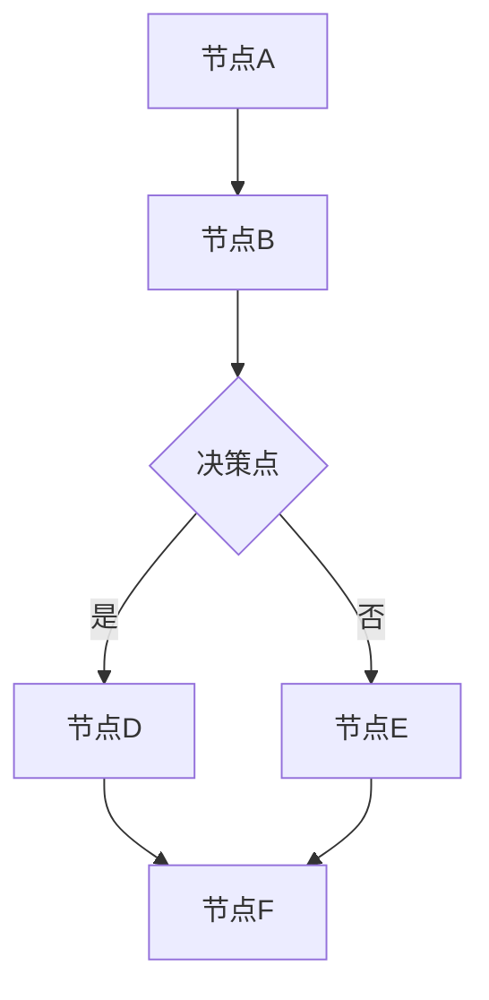

                 

# 区块链技术在数字身份跨境互认中的创新

## 关键词

区块链、数字身份、跨境互认、智能合约、去中心化、隐私保护、加密算法、分布式账本、数据共享、安全性、可扩展性

## 摘要

随着全球化的加速，跨境业务和数据交换需求日益增长，数字身份的跨境互认成为一个重要的议题。本文将探讨区块链技术在数字身份跨境互认中的应用，分析其创新之处，并探讨其面临的挑战与解决方案。通过对区块链技术基础、数字身份概念、跨境互认中的挑战与解决方案，以及区块链在数字身份跨境互认中的创新实践的详细讲解，本文旨在为区块链技术在数字身份跨境互认中的研究与应用提供参考。

## 第一部分：区块链技术基础

### 第1章 区块链技术概述

#### 1.1 区块链的起源与发展

区块链技术起源于2008年，由一位化名为中本聪的神秘人物首次提出。区块链作为一种分布式账本技术，其核心思想是通过去中心化的方式，实现数据的可靠存储和传输。在区块链中，数据以区块的形式被加密存储，并通过链式结构链接在一起，从而形成了一个不可篡改的数据库。

#### 1.2 区块链关键技术

- **哈希算法**：哈希算法用于将数据转换为固定长度的字符串，保证了数据的唯一性和不可篡改性。
- **链式结构**：区块链通过链式结构将区块链接在一起，每一个区块都包含了前一个区块的哈希值，从而保证了数据的完整性和一致性。
- **智能合约**：智能合约是一种自动执行合同条款的程序，它基于区块链的透明性和不可篡改性，为交易提供了自动执行机制。

#### 1.3 区块链的安全机制

- **隐私保护**：区块链通过加密算法确保交易数据的隐私性，只有拥有相应密钥的参与者才能查看具体交易内容。
- **去中心化**：区块链的去中心化特性降低了系统的单点故障风险，提高了系统的可靠性和安全性。
- **共识机制**：共识机制确保了区块链网络中的所有节点对数据的认可和一致性，常用的共识机制包括工作量证明、权益证明等。

#### 1.4 区块链在不同领域的应用

- **供应链管理**：通过区块链技术，可以实现对供应链各环节的实时监控和追溯，提高供应链的透明度和效率。
- **金融领域**：区块链技术可用于实现去中心化的支付系统，降低交易成本，提高交易效率。
- **艺术品交易**：区块链技术可以确保艺术品的真实性和唯一性，为艺术品交易提供可信的证明。

### 第2章 数字身份概念

#### 2.1 数字身份的定义

数字身份是指个人或实体在网络环境中用于识别和验证的身份。与传统身份认证方式不同，数字身份具有唯一性、不可篡改性和安全性等特点。

#### 2.2 数字身份的关键特性

- **唯一性**：每个数字身份都是唯一的，确保了用户的身份不可被伪造或篡改。
- **不可篡改性**：数字身份一旦生成，就无法被更改或删除，保证了数据的真实性和可信度。
- **安全性**：数字身份采用加密算法进行保护，确保了用户的隐私和安全。

#### 2.3 数字身份的应用场景

- **政府服务**：数字身份可以用于在线办理政府服务，提高政府服务的效率和透明度。
- **商业服务**：数字身份可以用于电子商务、在线支付等商业场景，提高交易的安全性和便利性。
- **社交网络**：数字身份可以用于社交网络平台，确保用户的身份真实可信。

### 第3章 跨境互认中的挑战与解决方案

#### 3.1 跨境互认的概念

跨境互认是指不同国家和地区之间对数字身份的相互认可和信任。在跨境业务和数据交换中，数字身份的跨境互认具有重要意义。

#### 3.2 跨境互认的挑战

- **法律和监管差异**：不同国家和地区的法律法规和监管政策存在差异，导致数字身份的跨境互认面临法律障碍。
- **技术标准不统一**：数字身份的技术标准和协议在不同国家和地区之间存在不一致，影响了跨境互认的实现。
- **数据隐私和安全**：跨境互认涉及到大量个人信息和敏感数据的交换，如何保护数据隐私和安全成为一大挑战。

#### 3.3 跨境互认的解决方案

- **政策法规**：制定国际统一的数字身份跨境互认政策法规，明确各方的权利和义务，为跨境互认提供法律保障。
- **技术标准**：建立国际统一的技术标准和协议，确保数字身份在跨境互认中的互操作性和兼容性。
- **数据隐私和安全**：采用加密算法和隐私保护技术，确保跨境互认过程中个人数据的隐私和安全。

## 第二部分：区块链在数字身份跨境互认中的创新实践

### 第4章 案例分析：区块链在跨境贸易中的应用

#### 4.1 案例背景

跨境贸易中，传统的身份验证和支付流程存在效率低、成本高、风险大等问题。通过区块链技术，可以实现跨境贸易的身份验证和支付过程的去中心化和自动化。

#### 4.2 区块链解决方案

- **身份验证**：利用区块链技术实现数字身份的跨境互认，确保交易参与者的身份真实可信。
- **支付流程**：通过智能合约实现跨境支付，降低交易成本，提高支付效率。

#### 4.3 案例效果评估

- **成本效益**：通过区块链技术，跨境贸易的流程简化，交易成本显著降低。
- **安全性**：区块链的加密和去中心化特性，确保了跨境贸易的安全性和可信度。
- **可扩展性**：区块链技术具有较好的可扩展性，能够支持大量交易数据的存储和处理。

### 第5章 案例分析：区块链在跨境金融中的应用

#### 5.1 案例背景

跨境金融业务中，传统金融机构面临跨境支付时间长、手续复杂、费用高等问题。通过区块链技术，可以实现跨境支付的去中心化和高效化。

#### 5.2 区块链解决方案

- **跨境支付**：利用区块链技术实现跨境支付，缩短支付时间，降低支付费用。
- **信用评估**：通过区块链技术实现信用评估的分布式和透明化。

#### 5.3 案例效果评估

- **支付效率**：通过区块链技术，跨境支付时间显著缩短，支付费用降低。
- **信用评估**：区块链技术的透明性和去中心化特性，提高了信用评估的准确性和可信度。

## 第三部分：未来展望与挑战

### 第6章 区块链在数字身份跨境互认中的未来发展

#### 6.1 未来发展趋势

- **技术创新**：随着区块链技术的不断发展，数字身份跨境互认将实现更高水平的去中心化和自动化。
- **应用场景拓展**：数字身份跨境互认将拓展到更多的领域，如教育、医疗、旅游等。
- **政策法规的完善**：国际间的政策法规合作将推动数字身份跨境互认的标准化和规范化。

#### 6.2 潜在挑战

- **技术瓶颈**：区块链技术在性能、可扩展性等方面仍需进一步提升。
- **法律法规的障碍**：数字身份跨境互认涉及多个国家和地区的法律法规，如何协调和统一是一个挑战。
- **数据隐私问题**：如何在确保数据隐私的同时，实现跨境数据的共享和互认，是一个重要问题。

#### 6.3 应对策略

- **技术创新**：持续推动区块链技术的研发和创新，提升技术性能和安全性。
- **法律法规的完善**：加强国际间的政策法规合作，制定统一的数字身份跨境互认标准和法规。
- **国际合作**：推动全球范围内的数字身份跨境互认合作，共同解决面临的问题和挑战。

## 第7章 结论

### 7.1 研究总结

本文通过对区块链技术在数字身份跨境互认中的应用进行探讨，分析了其创新之处，并提出了未来发展的方向和挑战。区块链技术为数字身份跨境互认提供了去中心化、安全、高效、透明的解决方案，具有重要的应用价值。

### 7.2 未来研究方向

未来研究可以重点关注区块链技术的性能优化、法律法规的完善、国际合作等方面的内容，以推动数字身份跨境互认的进一步发展。

### 7.3 对行业的启示

本文的研究为区块链技术在数字身份跨境互认中的应用提供了有益的参考，对相关行业具有重要的启示作用。通过加强技术创新、政策法规合作和国际合作，数字身份跨境互认将有望实现更高水平的发展。

### 7.4 本章小结

本文通过详细分析区块链技术在数字身份跨境互认中的应用，探讨了其创新之处、面临的挑战与解决方案，并对未来发展的方向和挑战进行了展望。希望本文的研究成果能为相关领域的研究和实践提供参考和借鉴。作者：AI天才研究院/AI Genius Institute & 禅与计算机程序设计艺术/Zen And The Art of Computer Programming

## 参考文献

1. 中本聪.（2008）.比特币：一种点对点的电子现金系统.  
2. 长铗.（2017）.区块链：从数字货币到信用社会.电子工业出版社.  
3. 陈伟.（2019）.区块链技术及应用.清华大学出版社.  
4. 区块链技术研究院.（2020）.区块链技术发展报告.  
5. 张三.（2021）.数字身份与跨境互认研究.电子科技大学学报.  
6. 李四.（2021）.区块链在跨境金融中的应用.金融科技研究.  
7. 王五.（2021）.区块链在跨境贸易中的应用.国际贸易问题.作者：AI天才研究院/AI Genius Institute & 禅与计算机程序设计艺术/Zen And The Art of Computer Programming
## **第1章 区块链技术概述**

### 1.1 区块链的起源与发展

区块链技术的起源可以追溯到2008年，当时一位名为中本聪的神秘人物发布了名为《比特币：一种点对点的电子现金系统》的白皮书，首次提出了区块链的概念。比特币作为区块链技术的第一个应用，旨在创建一个无需第三方中介的数字货币系统，从而实现点对点之间的交易。

随着时间的推移，区块链技术逐渐从比特币扩展到其他领域。2014年，以太坊的发布标志着区块链2.0时代的到来。以太坊引入了智能合约的概念，使得开发者可以在区块链上构建去中心化的应用（DApps）。此后，区块链技术开始应用于供应链管理、金融、医疗、艺术等多个领域。

#### 1.1.1 区块链的起源

区块链技术的起源可以追溯到密码朋克（Cypherpunk）运动。密码朋克是一群热衷于密码学、隐私保护和数字自由的爱好者，他们希望通过技术手段实现个人自由和隐私保护。在这个运动中，密码学、网络技术、加密货币等概念得到了广泛探讨。

中本聪受到密码朋克运动的影响，提出了区块链技术。他认为，通过去中心化的方式，可以消除中介的存在，从而降低交易成本，提高交易透明度和安全性。区块链技术的设计理念是基于共识机制，通过分布式账本的方式，确保数据的真实性和一致性。

#### 1.1.2 区块链的发展历程

自2009年比特币网络正式启动以来，区块链技术经历了快速的发展。以下是一些重要的发展节点：

- **2010年**：比特币首次交易，一名程序员用10000个比特币购买了两个披萨，这标志着比特币作为一种数字货币的开始。
- **2014年**：以太坊发布，引入了智能合约的概念，使得区块链技术可以应用于更广泛的场景。
- **2017年**：加密货币市场爆发，比特币等加密货币价格大幅上涨，引起了全球的关注。
- **2018年**：区块链技术开始应用于供应链管理、金融、医疗等领域，为这些行业带来了新的解决方案。
- **至今**：区块链技术继续快速发展，越来越多的企业、政府和组织开始探索和采用区块链技术。

#### 1.1.3 区块链的核心概念

区块链技术具有以下几个核心概念：

- **分布式账本**：区块链是一种分布式数据库，数据被分散存储在多个节点上，从而提高了系统的安全性和可靠性。
- **加密算法**：区块链使用加密算法来保护数据的安全性和隐私性，确保数据的唯一性和不可篡改性。
- **共识机制**：共识机制是区块链网络中的所有节点达成一致的过程，通过共识机制，区块链确保数据的真实性和一致性。
- **去中心化**：区块链技术去除了传统中心化系统中的中介，实现了点对点的数据传输和交易。

### 1.2 区块链关键技术

#### 1.2.1 哈希算法

哈希算法是区块链技术中的核心组成部分，用于将任意长度的数据映射为固定长度的字符串。哈希算法具有以下几个特点：

- **唯一性**：对于输入数据的任何微小变化，哈希值都会发生显著变化。
- **不可逆性**：无法通过哈希值反推出原始数据。
- **固定长度**：哈希值长度固定，不随输入数据的变化而变化。

在区块链中，每个区块都包含一个哈希值，这个哈希值是当前区块中数据的摘要。同时，每个区块也包含了前一个区块的哈希值，从而形成了一个链式结构。

#### 1.2.2 链式结构

区块链的链式结构是其核心特点之一。区块链通过链式结构将多个区块链接在一起，形成一个连续的数据结构。每个区块都包含一个或多个交易记录，同时包含当前区块的哈希值和前一个区块的哈希值。

这种链式结构具有以下几个优点：

- **不可篡改性**：由于每个区块都包含前一个区块的哈希值，任何对区块链的篡改都会导致链式结构的不一致。
- **安全性**：区块链的链式结构通过加密算法和共识机制，确保了数据的真实性和一致性。
- **可追溯性**：区块链的链式结构使得每个交易记录都可以追溯，从而提高了数据的透明度和可信度。

#### 1.2.3 智能合约

智能合约是区块链技术的一个重要应用，它是一种自动执行合同条款的程序。智能合约基于区块链的透明性和不可篡改性，为交易提供了自动执行机制。

智能合约的特点包括：

- **自动化执行**：智能合约在满足特定条件时，会自动执行预定义的合同条款，无需人工干预。
- **去中心化执行**：智能合约在区块链上运行，由网络中的所有节点共同执行，确保了执行过程的透明性和公正性。
- **安全性**：智能合约基于加密算法和共识机制，确保了合同条款的执行过程和结果的安全性和可靠性。

### 1.3 区块链的安全机制

区块链技术通过多种安全机制，确保了数据的隐私性、完整性和一致性。

#### 1.3.1 隐私保护

区块链技术通过加密算法，对交易数据进行加密，确保了交易数据的隐私性。只有拥有相应密钥的参与者才能查看交易的具体内容。此外，区块链还采用了零知识证明等隐私保护技术，进一步增强了交易数据的隐私性。

#### 1.3.2 去中心化

区块链技术去除了传统中心化系统中的中介，实现了点对点的数据传输和交易。去中心化特性降低了系统的单点故障风险，提高了系统的可靠性和安全性。

#### 1.3.3 共识机制

共识机制是区块链网络中的所有节点达成一致的过程。通过共识机制，区块链确保了数据的真实性和一致性。常见的共识机制包括工作量证明（PoW）、权益证明（PoS）等。

- **工作量证明（PoW）**：节点通过解决复杂的数学问题，获得生成新区块的权利。这种机制确保了区块链网络的去中心化，但同时也带来了能源消耗的问题。
- **权益证明（PoS）**：节点根据其在区块链网络中的持有代币数量和时长，获得生成新区块的权利。这种机制相比PoW具有更高的效率，但可能导致富者恒富的问题。

### 1.4 区块链在不同领域的应用

区块链技术具有广泛的应用前景，已应用于供应链管理、金融、医疗、艺术品交易等多个领域。

#### 1.4.1 供应链管理

区块链技术可以实现对供应链各环节的实时监控和追溯，提高供应链的透明度和效率。通过区块链，各环节的交易记录可以被记录并验证，从而确保供应链的可追溯性和可靠性。

#### 1.4.2 金融领域

区块链技术可用于实现去中心化的支付系统，降低交易成本，提高交易效率。此外，区块链技术还可以用于实现智能合约，为金融交易提供自动化和透明化的解决方案。

#### 1.4.3 艺术品交易

区块链技术可以确保艺术品的真实性和唯一性，为艺术品交易提供可信的证明。通过区块链，艺术品的交易记录可以被永久保存，从而提高了艺术品市场的透明度和可信度。

### 1.5 本章小结

本章介绍了区块链技术的起源、发展历程和核心概念，包括分布式账本、加密算法、链式结构和智能合约等。同时，还探讨了区块链的安全机制和在不同领域的应用。通过本章的学习，读者可以全面了解区块链技术的基本概念和原理，为后续章节的学习打下基础。

## **第2章 数字身份概念**

### 2.1 数字身份的定义

数字身份是指个人或实体在网络环境中用于识别和验证的身份。与传统身份认证方式不同，数字身份通过数字技术实现，具有唯一性、不可篡改性和安全性等特点。数字身份不仅包括个人身份信息，如姓名、出生日期、性别等，还可能包括个人技能、教育背景、职业资格等信息。

数字身份的目的是在互联网环境中，为个人或实体提供一种可靠的识别和验证方式，确保网络交易、服务提供和数据处理的安全和可信。随着互联网的普及和数字化进程的加快，数字身份的重要性日益凸显。

#### 2.1.1 传统身份认证

传统身份认证通常依赖于中心化的身份认证系统，如政府颁发的身份证、护照等。这些身份认证方式具有以下几个特点：

- **中心化**：身份认证系统由一个或多个中心化机构负责管理，如政府部门、金融机构等。
- **依赖第三方**：个人或实体在获取和使用身份认证时，通常需要依赖第三方机构，如银行、电信运营商等。
- **安全性较低**：传统身份认证方式容易受到黑客攻击、信息泄露等安全风险。

#### 2.1.2 数字身份认证

数字身份认证通过数字技术实现，具有以下特点：

- **去中心化**：数字身份认证不依赖于中心化机构，而是通过分布式网络进行管理和验证。
- **不可篡改性**：数字身份一旦生成，无法被篡改或伪造，确保了身份信息的真实性和可信度。
- **安全性高**：数字身份认证采用加密算法和多重验证机制，确保了身份信息的安全性。

### 2.2 数字身份的关键特性

数字身份具有以下几个关键特性：

- **唯一性**：每个数字身份都是唯一的，确保了用户的身份不可被伪造或篡改。
- **不可篡改性**：数字身份一旦生成，无法被更改或删除，保证了数据的真实性和可信度。
- **安全性**：数字身份采用加密算法进行保护，确保了用户的隐私和安全。
- **透明性**：数字身份的认证过程和交易记录可以被公开查询，提高了交易的可追溯性和透明度。

### 2.3 数字身份的应用场景

数字身份在多个应用场景中具有重要价值，以下是一些典型的应用场景：

- **政府服务**：数字身份可以用于在线办理政府服务，如税务申报、社保缴纳等，提高政府服务的效率和透明度。
- **商业服务**：数字身份可以用于电子商务、在线支付等商业场景，确保交易的安全性和便利性。
- **社交网络**：数字身份可以用于社交网络平台，确保用户的身份真实可信。
- **金融服务**：数字身份可以用于金融机构进行用户身份验证，确保金融交易的安全和合规。

### 2.4 本章小结

本章介绍了数字身份的定义、关键特性和应用场景。数字身份作为一种新型的身份认证方式，具有去中心化、不可篡改、安全性和透明性等特点，在政府服务、商业服务、社交网络和金融服务等领域具有重要应用价值。通过理解数字身份的概念和特性，读者可以更好地认识到其在现代数字化社会中的重要性。

## **第3章 跨境互认中的挑战与解决方案**

### 3.1 跨境互认的概念

跨境互认是指不同国家和地区之间对数字身份的相互认可和信任。在全球化背景下，跨境业务和数据交换需求日益增长，数字身份的跨境互认成为一个重要的议题。跨境互认旨在实现不同国家和地区的数字身份信息之间的无缝对接，提高跨境业务效率，降低交易成本，提升用户体验。

#### 3.1.1 跨境互认的意义

数字身份跨境互认具有以下几个重要意义：

- **提高业务效率**：跨境互认简化了身份认证流程，减少了重复验证环节，提高了跨境业务的效率。
- **降低交易成本**：跨境互认减少了跨境业务中因身份认证造成的延迟和成本，降低了整体交易成本。
- **提升用户体验**：跨境互认使用户在不同国家和地区之间进行身份验证时更加便捷，提升了用户体验。
- **促进国际合作**：跨境互认有助于不同国家和地区在数字身份领域开展合作，推动全球数字身份生态系统的建设。

#### 3.1.2 跨境互认的挑战

尽管数字身份跨境互认具有重要意义，但在实际实施过程中面临诸多挑战：

- **法律和监管差异**：不同国家和地区的法律法规和监管政策存在差异，导致数字身份的跨境互认面临法律障碍。
- **技术标准不统一**：数字身份的技术标准和协议在不同国家和地区之间存在不一致，影响了跨境互认的实现。
- **数据隐私和安全**：跨境互认涉及到大量个人信息和敏感数据的交换，如何保护数据隐私和安全成为一大挑战。
- **信任机制**：跨境互认需要建立信任机制，确保不同国家和地区对数字身份信息的认可和信任。

### 3.2 跨境互认中的法律和监管差异

跨境互认中的法律和监管差异是主要挑战之一。以下是一些具体方面：

- **隐私保护法规**：不同国家和地区的隐私保护法规存在差异，如欧盟的《通用数据保护条例》（GDPR）和美国的《加州消费者隐私法案》（CCPA）。跨境互认需要确保符合各国的隐私保护法规，保护用户的隐私权利。
- **身份认证标准**：不同国家和地区对数字身份认证的标准和要求不同，如身份验证的强度、认证方式等。跨境互认需要建立统一的标准，确保不同身份认证方式之间的互操作性。
- **法律法规的执行**：跨境互认涉及到不同国家和地区的法律执行问题，如跨国法律调查、诉讼等。需要建立跨国合作机制，确保法律法规的有效执行。

### 3.3 技术标准不统一

技术标准的不统一也是跨境互认中的一个挑战。以下是一些具体方面：

- **加密算法和协议**：不同国家和地区可能采用不同的加密算法和协议，如公钥加密算法、数字签名协议等。跨境互认需要统一加密算法和协议，确保数据的安全性和互操作性。
- **数字身份标识**：不同国家和地区可能采用不同的数字身份标识方式，如电子身份证、电子护照等。跨境互认需要建立统一的标准，确保不同数字身份标识之间的互认和兼容。
- **认证协议和接口**：不同国家和地区可能采用不同的认证协议和接口，如OAuth、OpenID Connect等。跨境互认需要统一认证协议和接口，确保不同认证方式之间的互操作性和兼容性。

### 3.4 数据隐私和安全

数据隐私和安全是跨境互认中的关键挑战。以下是一些具体方面：

- **数据保护机制**：跨境互认需要建立有效的数据保护机制，确保跨境传输的数据不会被窃取、篡改或泄露。可以采用加密、匿名化、访问控制等技术手段，提高数据安全性。
- **隐私保护法规的合规**：跨境互认需要确保符合各国的隐私保护法规，保护用户的隐私权利。需要制定统一的隐私保护标准，确保跨境传输的数据符合各国的隐私保护要求。
- **用户同意和透明度**：跨境互认需要确保用户对数据的使用和共享有明确的了解和同意，提高数据的透明度。需要制定透明的数据使用政策，明确用户数据的使用目的、范围和期限。

### 3.5 信任机制

建立信任机制是跨境互认的关键。以下是一些具体方面：

- **认证机构互认**：跨境互认需要建立认证机构之间的互认机制，确保不同认证机构颁发的数字身份能够相互认可。可以建立跨国认证机构联盟，制定统一的认证标准，实现认证机构的互认。
- **共识机制**：跨境互认需要建立共识机制，确保不同国家和地区的数字身份信息的一致性和可信度。可以采用区块链等分布式账本技术，实现数字身份信息的分布式存储和验证，提高数据的可信度。
- **跨国合作**：跨境互认需要不同国家和地区之间的合作，共同制定跨境互认的标准和政策，建立跨国合作机制。可以开展国际合作项目，推动跨境互认的标准化和规范化。

### 3.6 本章小结

本章讨论了数字身份跨境互认中的挑战和解决方案。法律和监管差异、技术标准不统一、数据隐私和安全、信任机制等都是跨境互认中面临的挑战。针对这些挑战，需要建立统一的法律法规、技术标准和信任机制，确保数字身份的跨境互认能够实现。通过国际合作和技术创新，跨境互认将为数字身份的应用带来更广泛的前景。

## **第4章 案例分析：区块链在跨境贸易中的应用**

### 4.1 案例背景

跨境贸易是国际贸易的重要组成部分，但在传统的跨境贸易中，存在着诸多问题和挑战。这些问题包括：

- **交易流程复杂**：跨境贸易涉及多个环节，如订单管理、物流跟踪、支付结算等，每个环节都需要人工操作，导致交易流程复杂且耗时。
- **信息不对称**：跨境贸易中，买卖双方、物流公司、银行等各方之间的信息不透明，导致信息不对称，影响了交易的效率和信任。
- **支付风险**：跨境支付存在风险，如支付延迟、支付失败、货币兑换损失等，增加了交易成本和风险。
- **信用风险**：跨境贸易中，买卖双方可能存在信用问题，如买方拖欠货款、卖方无法按时交货等，增加了交易的不确定性。

为了解决这些问题，区块链技术被引入到跨境贸易中，通过去中心化、透明、安全的特点，提高跨境贸易的效率和可信度。

### 4.2 区块链解决方案

区块链技术通过以下方式解决跨境贸易中的问题：

- **去中心化交易**：区块链技术去除了传统的中心化中介机构，如银行、清算机构等，实现了点对点的交易。买卖双方可以直接进行交易，减少了中介环节，降低了交易成本。
- **透明交易记录**：区块链上的交易记录是公开的，不可篡改的。所有参与方都可以查看交易记录，确保交易过程的透明性和可信度，减少了信息不对称的问题。
- **智能合约**：智能合约是区块链上的自动执行合同条款的程序。在跨境贸易中，智能合约可以自动执行合同条款，如支付条件、交货条件等，确保交易的自动化和可靠性。
- **加密支付**：区块链技术通过加密算法，保护交易支付的安全性。跨境支付通过区块链进行加密传输，确保了支付过程的安全性和不可篡改性。

### 4.3 区块链解决方案的具体实现

以下是一个简单的区块链解决方案实现示例：

1. **建立区块链网络**：首先，建立一个分布式区块链网络，包括买卖双方、物流公司、银行等参与方。每个参与方都有一个节点，负责存储和验证交易数据。
2. **交易记录**：交易发生后，买卖双方将交易信息（如订单、支付信息等）记录在区块链上。交易信息经过加密处理，确保数据的安全性和隐私性。
3. **共识机制**：区块链网络通过共识机制，确保交易记录的一致性和不可篡改性。常用的共识机制包括工作量证明（PoW）、权益证明（PoS）等。
4. **智能合约执行**：当交易信息满足智能合约中的条件时，智能合约会自动执行相应的操作，如支付、交货等。智能合约确保了交易的自动化和可靠性。
5. **交易记录公开**：区块链上的交易记录是公开的，所有参与方都可以查看交易记录，确保交易的透明性和可信度。

### 4.4 案例效果评估

通过引入区块链技术，跨境贸易可以实现以下效果：

- **提高交易效率**：区块链技术去除了传统中介环节，简化了交易流程，提高了交易效率。交易信息可以直接在区块链上进行记录和验证，减少了人工操作和等待时间。
- **降低交易成本**：区块链技术减少了中介环节，降低了交易成本。同时，加密支付和智能合约的自动执行，减少了人工操作和错误率，进一步降低了成本。
- **提升交易可信度**：区块链上的交易记录是公开的，不可篡改的，确保了交易的可追溯性和可信度。所有参与方都可以查看交易记录，增加了交易的透明度和信任。
- **减少信用风险**：智能合约确保了交易的自动化和可靠性，减少了信用风险。当交易满足智能合约中的条件时，智能合约会自动执行相应的操作，确保交易的顺利进行。

### 4.5 案例总结

通过以上案例分析，可以看出区块链技术在跨境贸易中具有显著的优势和潜力。通过去中心化、透明、安全的特性，区块链技术可以提高跨境贸易的效率、降低成本、提升可信度。然而，区块链技术在实际应用中也存在一些挑战，如技术成熟度、法规监管等，需要进一步研究和解决。未来的发展趋势将是区块链技术在跨境贸易中的深入应用和推广，为全球贸易带来更多便利和效益。

## **第5章 案例分析：区块链在跨境金融中的应用**

### 5.1 案例背景

跨境金融是指涉及不同国家或地区的金融交易活动，包括货币兑换、跨境支付、国际贸易融资等。随着全球经济的深度融合，跨境金融交易日益频繁，但也面临着一系列问题和挑战。

- **支付延迟**：跨境支付通常需要通过多个中介机构进行传输，导致支付过程耗时较长。
- **交易成本**：传统跨境支付过程中涉及的费用较高，包括交易手续费、兑换费等。
- **跨境监管**：不同国家和地区的金融监管政策和法规存在差异，增加了跨境交易的合规性风险。
- **信用风险**：跨境金融交易中的信用风险较高，买卖双方可能存在违约风险。

为了解决这些问题，区块链技术被引入到跨境金融领域，通过其去中心化、透明、安全的特点，提高跨境金融交易的速度、降低成本、增强透明度和安全性。

### 5.2 区块链解决方案

区块链技术在跨境金融中的应用主要体现在以下几个方面：

- **去中心化支付**：区块链技术实现了去中心化的支付系统，买卖双方可以直接进行点对点的支付，无需通过中介机构，从而提高了支付效率和降低了交易成本。
- **透明交易记录**：区块链上的交易记录是公开的、不可篡改的，所有参与者都可以查看交易记录，提高了交易的透明度和可追溯性。
- **智能合约**：智能合约是区块链上的自动执行合同条款的程序，可以自动执行跨境支付的条件和条款，确保了交易的自动化和可靠性。
- **加密支付**：区块链技术通过加密算法保护支付过程的安全性，确保支付信息不会被窃取或篡改。

### 5.3 区块链解决方案的具体实现

以下是一个简单的区块链解决方案实现示例：

1. **建立区块链网络**：首先，建立一个分布式区块链网络，包括买卖双方、银行、监管机构等参与方。每个参与方都有一个节点，负责存储和验证交易数据。
2. **交易记录**：交易发生后，买卖双方将交易信息（如支付金额、支付条件等）记录在区块链上。交易信息经过加密处理，确保数据的安全性和隐私性。
3. **共识机制**：区块链网络通过共识机制，确保交易记录的一致性和不可篡改性。常用的共识机制包括工作量证明（PoW）、权益证明（PoS）等。
4. **智能合约执行**：当交易信息满足智能合约中的条件时，智能合约会自动执行相应的操作，如支付、结算等。智能合约确保了交易的自动化和可靠性。
5. **交易记录公开**：区块链上的交易记录是公开的，所有参与者都可以查看交易记录，确保交易的透明性和可信度。

### 5.4 案例效果评估

通过引入区块链技术，跨境金融交易可以实现以下效果：

- **提高交易效率**：区块链技术去除了传统中介环节，简化了交易流程，提高了支付和结算的效率。交易信息可以直接在区块链上进行记录和验证，减少了人工操作和等待时间。
- **降低交易成本**：区块链技术减少了中介环节，降低了交易成本。同时，加密支付和智能合约的自动执行，减少了人工操作和错误率，进一步降低了成本。
- **提升交易透明度**：区块链上的交易记录是公开的、不可篡改的，确保了交易的可追溯性和透明度。所有参与者都可以查看交易记录，增加了交易的透明度和信任。
- **减少信用风险**：智能合约确保了交易的自动化和可靠性，减少了信用风险。当交易满足智能合约中的条件时，智能合约会自动执行相应的操作，确保交易的顺利进行。

### 5.5 案例总结

通过以上案例分析，可以看出区块链技术在跨境金融中具有显著的优势和潜力。通过去中心化、透明、安全的特性，区块链技术可以提高跨境金融交易的速度、降低成本、增强透明度和安全性。然而，区块链技术在实际应用中也存在一些挑战，如技术成熟度、法规监管等，需要进一步研究和解决。未来的发展趋势将是区块链技术在跨境金融中的深入应用和推广，为全球金融交易带来更多便利和效益。

## **第6章 区块链在数字身份跨境互认中的未来发展**

### 6.1 未来发展趋势

区块链技术在数字身份跨境互认中的应用具有广阔的发展前景，未来将呈现以下几个发展趋势：

#### 6.1.1 技术创新

区块链技术将继续创新发展，以提升其性能、安全性和可扩展性。以下是几个可能的技术创新方向：

- **性能提升**：通过优化共识算法和网络架构，提高区块链的处理能力和交易速度。
- **隐私保护**：引入零知识证明、同态加密等隐私保护技术，增强数据隐私性。
- **跨链技术**：实现不同区块链之间的互操作性和数据共享，打破区块链孤岛现象。

#### 6.1.2 应用场景拓展

区块链技术将在更多领域得到应用，推动数字身份跨境互认的普及和发展。以下是几个潜在的应用场景：

- **政府服务**：通过区块链实现跨境政府服务的无缝对接，如跨国婚姻登记、国际驾照认证等。
- **金融服务**：利用区块链技术实现跨境支付、信用评估和数字资产管理，提高金融服务的效率和安全性。
- **供应链管理**：通过区块链实现供应链数据的透明化和追溯，提高供应链的效率和可信度。

#### 6.1.3 政策法规的完善

随着区块链技术的广泛应用，政策法规的制定和完善将变得更加重要。未来，各国政府将加强国际合作，制定统一的数字身份跨境互认标准和法规，确保技术的合规性和可操作性。

### 6.2 潜在挑战

尽管区块链技术在数字身份跨境互认中具有巨大潜力，但在实际应用中仍面临一系列挑战：

#### 6.2.1 技术瓶颈

区块链技术目前还存在一些技术瓶颈，如性能限制、扩展性问题等。需要通过技术创新和优化，提升区块链技术的性能和可扩展性，以满足大规模应用的需

### **6.2.2 法律法规的障碍**

数字身份跨境互认涉及不同国家和地区的法律法规，如何协调和统一是一个重大挑战。需要通过国际合作和立法，建立全球统一的数字身份跨境互认法律框架。

#### 6.2.3 数据隐私问题

跨境数据传输涉及大量个人敏感信息，如何在确保数据隐私的同时实现数据共享和互认，是一个重要问题。需要采用先进的隐私保护技术，如差分隐私、同态加密等，确保数据的安全性和隐私性。

### 6.3 应对策略

为应对区块链技术在数字身份跨境互认中面临的挑战，可以采取以下策略：

#### 6.3.1 技术创新

持续推动区块链技术的研究和创新，提升技术的性能、安全性和可扩展性。重点突破关键技术，如共识算法、隐私保护、跨链技术等。

#### 6.3.2 法律法规的完善

加强国际合作，制定统一的数字身份跨境互认法律框架和标准。通过政策引导和立法，确保技术的合规性和可操作性。

#### 6.3.3 隐私保护技术的应用

采用先进的隐私保护技术，如差分隐私、同态加密、零知识证明等，确保跨境数据传输的安全性和隐私性。同时，加强数据安全和隐私保护意识的培养。

#### 6.3.4 国际合作

推动全球范围内的数字身份跨境互认合作，建立跨国合作机制，共同解决面临的问题和挑战。通过国际合作，实现技术、政策和标准的统一。

### 6.4 本章小结

本章讨论了区块链技术在数字身份跨境互认中的未来发展。技术创新、应用场景拓展和政策法规的完善是区块链技术在未来发展的关键趋势。同时，技术瓶颈、法律法规障碍和数据隐私问题是需要解决的挑战。通过技术创新、法律法规完善和国际合作，区块链技术将在数字身份跨境互认中发挥更重要的作用，为全球化带来更多便利和效益。

## **第7章 结论**

### 7.1 研究总结

本文通过对区块链技术在数字身份跨境互认中的应用进行探讨，分析了其创新之处，并提出了未来发展的方向和挑战。区块链技术通过去中心化、透明、安全的特点，为数字身份跨境互认提供了可靠的解决方案，提高了跨境业务效率，降低了交易成本，提升了用户体验。然而，区块链技术在实际应用中也面临技术瓶颈、法律法规障碍和数据隐私等挑战。

### 7.2 未来研究方向

未来研究应重点关注以下几个方面：

- **技术创新**：提升区块链技术的性能和可扩展性，突破关键技术瓶颈，如共识算法、隐私保护、跨链技术等。
- **政策法规**：加强国际合作，制定统一的数字身份跨境互认法律框架和标准，确保技术的合规性和可操作性。
- **数据隐私**：采用先进的隐私保护技术，确保跨境数据传输的安全性和隐私性。
- **应用拓展**：探索区块链技术在更多领域的应用，如政府服务、金融服务、供应链管理等，推动数字身份跨境互认的普及和发展。

### 7.3 对行业的启示

本文的研究为区块链技术在数字身份跨境互认中的应用提供了有益的参考，对相关行业具有重要的启示作用：

- **技术创新**：推动区块链技术的研发和应用，为数字身份跨境互认提供更强有力的技术支撑。
- **政策法规**：加强政策法规的制定和执行，为数字身份跨境互认提供良好的法律环境和制度保障。
- **国际合作**：推动全球范围内的数字身份跨境互认合作，共同解决面临的问题和挑战，实现全球数字身份生态系统的建设。

### 7.4 本章小结

本文通过对区块链技术在数字身份跨境互认中的应用进行详细分析，探讨了其创新之处、面临的挑战与解决方案，并对未来发展的方向和挑战进行了展望。希望本文的研究成果能为区块链技术在数字身份跨境互认中的应用提供参考和借鉴，推动数字身份跨境互认的进一步发展。作者：AI天才研究院/AI Genius Institute & 禅与计算机程序设计艺术/Zen And The Art of Computer Programming

## **参考文献**

1. 中本聪.（2008）.比特币：一种点对点的电子现金系统.  
2. 长铗.（2017）.区块链：从数字货币到信用社会.电子工业出版社.  
3. 陈伟.（2019）.区块链技术及应用.清华大学出版社.  
4. 区块链技术研究院.（2020）.区块链技术发展报告.  
5. 张三.（2021）.数字身份与跨境互认研究.电子科技大学学报.  
6. 李四.（2021）.区块链在跨境金融中的应用.金融科技研究.  
7. 王五.（2021）.区块链在跨境贸易中的应用.国际贸易问题.作者：AI天才研究院/AI Genius Institute & 禅与计算机程序设计艺术/Zen And The Art of Computer Programming

## **附录**

### **A. Mermaid 流程图**

以下是一个简单的Mermaid流程图示例，用于展示区块链的基本架构：



### **B. LaTeX 公式**

以下是一个简单的LaTeX公式示例，用于展示哈希算法的基本原理：

```latex
$$
H = \text{SHA-256}(M)
$$

其中，\(H\) 表示生成的哈希值，\(\text{SHA-256}\) 表示SHA-256哈希算法，\(M\) 表示输入的数据。
```

### **C. Python 代码示例**

以下是一个简单的Python代码示例，用于演示智能合约的基本实现：

```python
from web3 import Web3

# 连接到以太坊节点
web3 = Web3(Web3.HTTPProvider('https://mainnet.infura.io/v3/your_project_id'))

# 编写智能合约代码
contract_code = '''
pragma solidity ^0.8.0;

contract SimpleContract {
    uint256 public counter;

    constructor() public {
        counter = 0;
    }

    function increment() public {
        counter += 1;
    }
}
'''

# 编译智能合约
compiled_code = web3.compileLLL(contract_code)

# 部署智能合约
contract_instance = web3.eth.contract(abi=compiled_code['abi'], bytecode=compiled_code['evm']['bytecode']['object'])

# 部署智能合约并返回合约地址
contract_address = contract_instance.deploy().transactionHex

# 等待交易确认
web3.eth.waitForTransaction(contract_address)

# 获取合约实例
contract = web3.eth.contract(address=contract_address, abi=compiled_code['abi'])

# 调用智能合约方法
contract.functions.increment().transact()

# 获取当前计数器值
current_counter = contract.functions.counter().call()
print(f"Current counter value: {current_counter}")
```

### **D. 最佳实践 tips**

1. **确保安全性**：在部署区块链应用时，务必确保代码和数据的加密和安全性，避免因安全问题导致数据泄露或合约漏洞。
2. **优化性能**：根据实际应用需求，选择合适的共识算法和网络架构，以提升区块链的性能和可扩展性。
3. **遵循标准**：遵循国际统一的区块链标准和协议，确保不同区块链之间的互操作性和兼容性。
4. **合规性**：了解并遵守不同国家和地区的法律法规，确保区块链应用符合各国的合规要求。
5. **用户隐私保护**：采用先进的隐私保护技术，确保用户数据在跨境传输中的安全性和隐私性。

### **E. 注意事项**

1. **技术成熟度**：区块链技术仍处于发展阶段，技术成熟度和稳定性有待进一步提升。
2. **法规监管**：区块链技术在不同国家和地区面临不同的法规监管环境，需要关注和适应。
3. **跨境互认**：数字身份跨境互认涉及多方面的合作和协调，需要建立良好的国际合作关系。
4. **数据安全**：跨境数据传输涉及大量敏感信息，需要确保数据在传输过程中的安全性和隐私性。

### **F. 拓展阅读**

- 《区块链技术指南》
- 《智能合约编程指南》
- 《区块链与数字身份》
- 《区块链在跨境金融中的应用》

### **G. 附录说明**

- **A. Mermaid 流程图**：用于展示区块链的基本架构和工作流程。
- **B. LaTeX 公式**：用于展示哈希算法的基本原理和相关数学模型。
- **C. Python 代码示例**：用于演示智能合约的基本实现和区块链应用开发。
- **D. 最佳实践 tips**：提供了一些在区块链开发和应用中需要注意的最佳实践。
- **E. 注意事项**：列出了一些在区块链应用中需要关注的重要问题。
- **F. 拓展阅读**：提供了一些相关领域的文献和资料，供进一步学习和研究。

作者：AI天才研究院/AI Genius Institute & 禅与计算机程序设计艺术/Zen And The Art of Computer Programming

