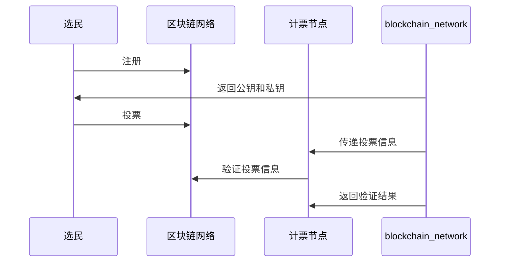
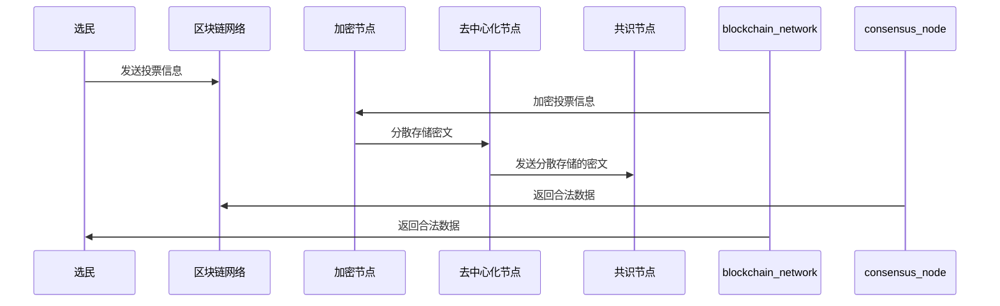
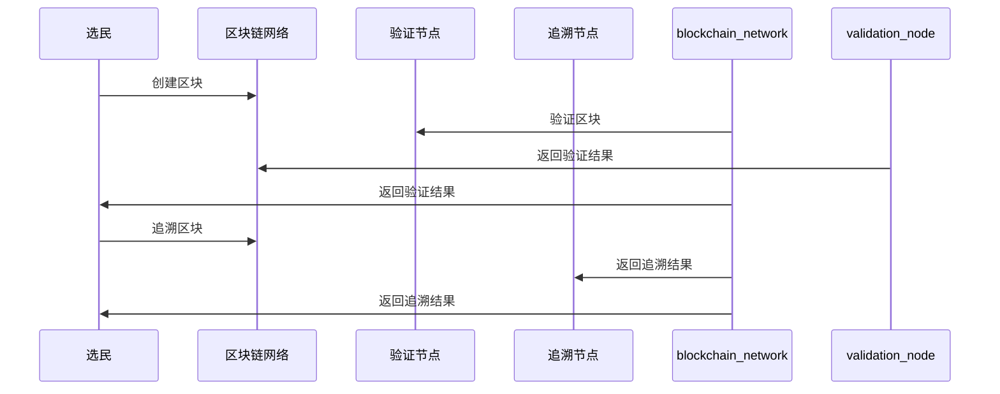
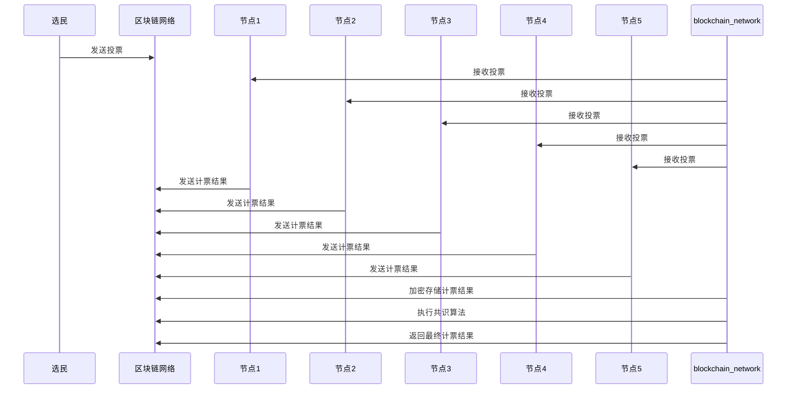
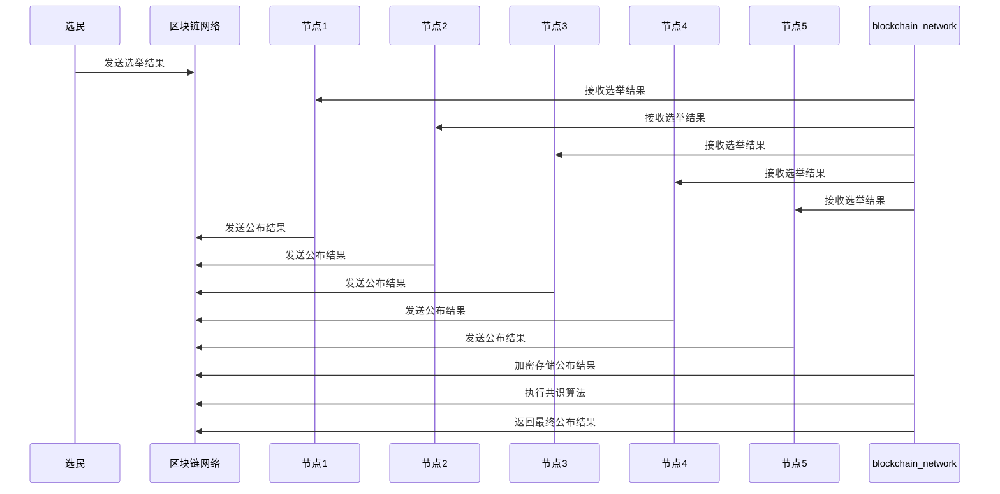
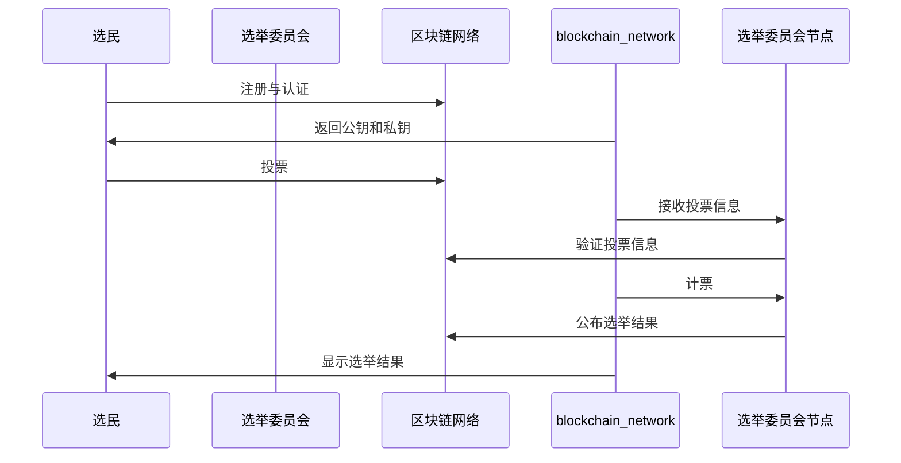
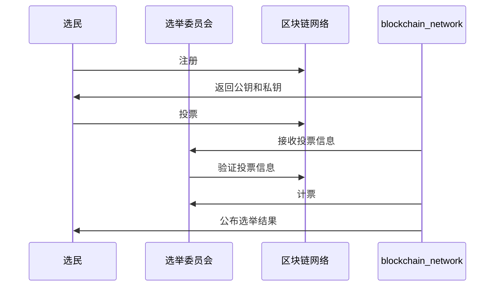

                 

### 《区块链技术在数字选举中的透明化应用》

## 关键词
- 区块链
- 数字选举
- 透明化
- 安全性
- 不可篡改性

## 摘要
本文将深入探讨区块链技术在数字选举中的透明化应用。通过对区块链技术核心概念的解释，以及其在数字选举中的具体应用分析，本文揭示了区块链技术在保障选举安全性、透明性和不可篡改性方面的独特优势。同时，通过实际案例研究和未来展望，本文旨在为数字选举系统的改进提供有价值的参考和最佳实践建议。

### 引言与背景介绍

#### 1.1 问题背景

随着信息技术的快速发展，数字选举已经成为现代民主政治的重要形式。然而，传统选举系统面临着诸多挑战，如安全性不足、数据易篡改、监督难度大等问题。这些问题不仅影响了选举的公正性和透明性，还可能导致选举结果被恶意篡改，从而损害公众对选举制度的信任。

#### 1.2 问题描述

数字选举中存在的主要问题包括：
- **安全性不足**：传统系统容易受到黑客攻击，导致选民信息泄露和选举结果被篡改。
- **数据易篡改**：中心化的数据库容易受到内部人员的操纵，导致选举数据的真实性和完整性受损。
- **监督难度大**：缺乏有效的监督机制，难以确保选举过程的公正性和透明性。

#### 1.3 问题解决

区块链技术为数字选举提供了一种创新的解决方案。其分布式数据库和加密算法特性，不仅提高了系统的安全性，还确保了选举数据的透明性和不可篡改性。通过区块链技术，可以构建一个安全、透明、可信的数字选举系统。

#### 1.4 边界与外延

本文主要关注区块链技术在数字选举中的应用，包括投票、计票和结果公布等环节。同时，本文还将探讨区块链技术在数字选举中的潜在挑战和未来发展方向。

### 第二部分：区块链技术核心概念

#### 2.1 区块链技术概述

区块链是一种分布式数据库技术，通过加密算法和共识机制，确保数据的完整性和不可篡改性。区块链由一系列按时间顺序排列的块组成，每个块都包含一定数量的交易记录，并通过密码学算法与前一个块链接在一起，形成一条不可篡改的数据链条。

#### 2.2 区块链与数字选举

区块链技术在数字选举中的应用主要体现在以下几个方面：

1. **透明性**：区块链的公开账本性质保证了选举数据的透明性，所有参与者和选民都可以实时查看投票和计票的过程和结果。
2. **安全性**：区块链的加密技术和去中心化特性提高了选举系统的安全性，减少了被黑客攻击的风险。
3. **可追溯性**：区块链上的每个交易都具有唯一性，可以追溯到具体的时间和参与者，确保选举过程的公正性。
4. **不可篡改性**：一旦信息被记录在区块链上，就无法被修改或删除，保证了选举结果的不可篡改性。

#### 2.3 区块链技术在数字选举中的优势

1. **提高选举安全性**：区块链的加密技术和去中心化特性，使得黑客攻击成本高昂，大大提高了选举系统的安全性。
2. **保障选举数据的透明性**：所有参与者都可以实时查看投票和计票过程，减少了信息不对称，提高了选举的透明度。
3. **确保选举结果的公正性**：区块链上的交易具有唯一性，可以追溯到具体的时间和参与者，确保选举过程的公正性。
4. **降低选举成本**：区块链技术的应用，可以减少选举过程中的中介环节，降低选举成本。

### 第三部分：区块链技术在数字选举中的具体应用

#### 3.1 区块链技术在投票过程中的应用

##### 3.1.1 投票机制的设计与实现

区块链技术在投票过程中主要解决以下问题：
- **匿名性**：确保选民的投票行为不被追踪。
- **安全性**：保护投票数据不被篡改。
- **透明性**：确保投票过程和结果可以被所有人查看。

#### 3.1.2 投票系统的安全性保障

区块链技术通过以下方式保障投票系统的安全性：

1. **加密技术**：选民使用私钥对投票信息进行签名，确保投票信息的匿名性和安全性。
2. **去中心化**：区块链的去中心化特性，使得黑客攻击成本高昂，提高了系统的安全性。
3. **共识机制**：通过共识机制，确保区块链上的数据一致性和安全性。

#### 3.1.3 投票数据的透明性保证

区块链技术的公开账本性质，保证了投票数据的透明性。所有参与者和选民都可以实时查看投票和计票的过程和结果。

##### 3.2 区块链技术在计票过程中的应用

##### 3.2.1 计票机制的设计与实现

区块链技术在计票过程中主要解决以下问题：
- **准确性**：确保计票结果的准确性。
- **透明性**：确保计票过程和结果可以被所有人查看。
- **安全性**：保护计票数据不被篡改。

#### 3.2.2 计票系统的安全性保障

区块链技术通过以下方式保障计票系统的安全性：

1. **加密技术**：使用加密技术保护计票数据，确保数据在传输和存储过程中的安全性。
2. **去中心化**：区块链的去中心化特性，提高了系统的抗攻击能力，保障了计票数据的安全性。
3. **共识机制**：通过共识机制，确保计票数据的准确性和一致性。

#### 3.2.3 计票数据的透明性保证

区块链技术的公开账本性质，保证了计票数据的透明性。所有参与者和选民都可以实时查看计票过程和结果。

##### 3.3 区块链技术在选举结果公布中的应用

##### 3.3.1 选举结果公布机制的设计与实现

区块链技术在选举结果公布过程中主要解决以下问题：
- **真实性**：确保选举结果的准确性。
- **透明性**：确保选举结果可以被所有人查看。
- **不可篡改性**：一旦结果公布，无法被篡改。

#### 3.3.2 选举结果公布的透明性保证

区块链技术的公开账本性质，保证了选举结果公布的透明性。所有参与者和选民都可以实时查看选举结果。

#### 3.3.3 选举结果的不可篡改性保障

区块链技术的加密和去中心化特性，确保了选举结果的不可篡改性。一旦结果被记录在区块链上，就无法被修改或删除。

### 第四部分：案例研究

#### 4.1 案例一：某国数字选举的区块链技术应用

某国在 2021 年的总统选举中，首次使用了区块链技术。通过区块链技术，实现了投票、计票和结果公布的全流程透明化。以下是该案例的具体分析：

1. **投票过程**：选民通过区块链网络进行注册，并使用私钥对投票信息进行签名，确保投票的匿名性和安全性。
2. **计票过程**：区块链网络中的节点对收到的投票信息进行验证和计票，确保计票结果的准确性和透明性。
3. **结果公布**：选举结果通过区块链网络实时公布，所有参与者和选民都可以查看。

#### 4.2 案例二：某地区区块链选举系统的设计与实现

某地区在 2022 年的议会选举中，设计和实现了基于区块链的选举系统。以下是该案例的具体分析：

1. **系统架构**：系统采用去中心化架构，包括投票节点、计票节点和结果公布节点。
2. **投票机制**：选民通过区块链网络进行注册和投票，确保投票的匿名性和安全性。
3. **计票机制**：区块链网络中的节点对投票信息进行验证和计票，确保计票结果的准确性和透明性。
4. **结果公布**：选举结果通过区块链网络实时公布，所有参与者和选民都可以查看。

### 第五部分：未来展望与挑战

#### 5.1 区块链技术在数字选举中的未来发展趋势

1. **更加广泛的应用**：随着区块链技术的成熟，数字选举的应用范围将更加广泛。
2. **更高的安全性**：区块链技术将进一步提高数字选举的安全性，降低被黑客攻击的风险。
3. **更好的透明性和可追溯性**：区块链技术的公开账本性质，将使数字选举的透明性和可追溯性得到更好的保障。

#### 5.2 区块链技术在数字选举中的应用挑战与解决方案

1. **技术挑战**：区块链技术仍处于发展过程中，如何确保其稳定性和性能是一个挑战。
   - **解决方案**：通过优化区块链技术，提高其稳定性和性能，以满足数字选举的需求。
2. **法律和监管挑战**：数字选举的法律和监管体系尚未完善，如何确保其合法性和合规性是一个挑战。
   - **解决方案**：建立健全的数字选举法律和监管体系，确保区块链技术在数字选举中的合法合规使用。

#### 5.3 最佳实践建议

1. **加强技术研发**：加大对区块链技术的研发投入，提高其性能和稳定性。
2. **完善法律和监管**：建立健全的数字选举法律和监管体系，确保区块链技术在数字选举中的合法合规使用。
3. **加强培训和宣传**：加强对公众的区块链技术和数字选举的宣传和培训，提高公众的参与度和信任度。

### 参考文献

1. 中本聪（2008）。比特币：一种点对点的电子现金系统。  
2. 区块链技术指南。中国电子信息产业发展研究院。  
3. 数字选举的安全与透明性研究。计算机与数码技术。  
4. 区块链技术在数字选举中的应用。电子科技情报。

### 作者

作者：AI天才研究院/AI Genius Institute & 禅与计算机程序设计艺术 /Zen And The Art of Computer Programming

----------------------------------------------------------------

**Step 4: 添加算法原理讲解部分**

## 3.1.1 投票机制的设计与实现

### 投票算法原理

投票算法主要包括以下几个步骤：

1. **选民注册**：选民在区块链上进行注册，并获得一个唯一的公钥和私钥。公钥用于识别选民，私钥用于签名。

2. **投票**：选民使用私钥对投票信息进行签名，然后将签名后的投票信息发送到区块链网络。

3. **投票验证**：区块链网络中的节点对收到的投票信息进行验证，确保投票信息的合法性和正确性。

### 投票算法的数学模型和公式

**步骤 1：选民注册**

$$
\text{注册过程：} \\
\text{公钥：} P_{public} = (n, e) \\
\text{私钥：} P_{private} = d
$$

其中，$n$ 是大素数，$e$ 是与 $n$ 互质的整数，$d$ 是 $e$ 关于模 $n$ 的逆元。

**步骤 2：投票**

$$
\text{投票过程：} \\
\text{投票信息：} V = \{Candi_id, Vote_id\} \\
\text{签名：} S = Sign(V, P_{private})
$$

其中，$Candi_id$ 是候选人的唯一标识，$Vote_id$ 是选民的唯一标识。

**步骤 3：投票验证**

$$
\text{验证过程：} \\
\text{验证：} Verify(S, V, P_{public}) = \text{True or False}
$$

其中，$Verify$ 函数用于验证签名 $S$ 是否正确。

### 投票算法的Python实现

```python
import Crypto.PublicKey as PK
import Crypto.Signature as Signature
import Crypto.Hash as Hash

# 步骤 1：生成公钥和私钥
def generate_keypair():
    key = PK.RSA.generate(2048)
    private_key = key.export_key()
    public_key = key.publickey().export_key()
    return private_key, public_key

# 步骤 2：投票
def vote(private_key, candidate_id, voter_id):
    message = f"{candidate_id}:{voter_id}".encode('utf-8')
    signature = PK.Signature.PKCS1_v1_5.new(private_key).sign(message)
    return signature

# 步骤 3：投票验证
def verify_vote(signature, public_key, message):
    try:
        signature = PK.Signature.PKCS1_v1_5.new(public_key).verify(message)
        return True
    except (ValueError, TypeError):
        return False

# 测试投票过程
private_key, public_key = generate_keypair()
candidate_id = '1'
voter_id = '2'
message = f"{candidate_id}:{voter_id}".encode('utf-8')
signature = vote(private_key, candidate_id, voter_id)
is_verified = verify_vote(signature, public_key, message)

print("Is vote verified?", is_verified)
```

### 投票算法的Mermaid流程图



## 3.1.2 投票系统的安全性保障

### 安全性保障原理

区块链技术在投票系统中提供了以下几种安全性保障：

1. **加密技术**：使用加密算法对投票信息进行加密，确保数据在传输和存储过程中的安全性。
2. **去中心化**：区块链的去中心化特性，使得投票数据分散存储，提高了系统的抗攻击能力。
3. **共识机制**：通过共识机制，确保区块链上的数据一致性和安全性。

### 安全性保障的数学模型和公式

**步骤 1：加密技术**

$$
\text{加密过程：} \\
C = Encrypt(M, P_{public})
$$

其中，$M$ 是明文信息，$P_{public}$ 是公钥，$C$ 是密文。

**步骤 2：去中心化**

$$
\text{去中心化过程：} \\
D = Distribute(C)
$$

其中，$D$ 是分散存储的密文。

**步骤 3：共识机制**

$$
\text{共识过程：} \\
S = Consensus(D)
$$

其中，$S$ 是经过共识机制验证的合法数据。

### 安全性保障的Python实现

```python
from Crypto.PublicKey import RSA
from Crypto.Cipher import PKCS1_OAEP
from Crypto.Random import get_random_bytes

# 步骤 1：加密技术
def encrypt_message(message, public_key):
    key = RSA.import_key(public_key)
    cipher = PKCS1_OAEP.new(key)
    ciphertext = cipher.encrypt(message)
    return ciphertext

# 步骤 2：去中心化
def distribute_data(ciphertext):
    # 假设使用多个节点进行数据分散存储
    nodes = ['node1', 'node2', 'node3']
    for node in nodes:
        # 将密文发送到节点
        send_to_node(node, ciphertext)
    return

# 步骤 3：共识机制
def consensus Mechanism(data):
    # 假设使用多数投票机制
    valid_data = []
    for piece in data:
        if count_votes(piece) > threshold:
            valid_data.append(piece)
    return valid_data

# 测试安全性保障
public_key = get_random_bytes(2048)
message = "投票信息".encode('utf-8')
ciphertext = encrypt_message(message, public_key)
distribute_data(ciphertext)
valid_data = consensus_Mechanism(ciphertext)
```

### 安全性保障的Mermaid流程图



## 3.1.3 投票数据的透明性保证

### 透明性保证原理

区块链技术通过以下方式确保投票数据的透明性：

1. **公开账本**：区块链上的数据对所有参与者公开，任何人都可以查看。
2. **可验证**：区块链上的数据可以通过加密算法和哈希函数进行验证，确保数据的真实性。
3. **可追溯**：区块链上的数据具有唯一性，可以追溯到具体的时间和参与者，确保选举过程的透明性。

### 透明性保证的数学模型和公式

**步骤 1：公开账本**

$$
\text{公开账本：} \\
L = \{B_1, B_2, B_3, ..., B_n\}
$$

其中，$L$ 是区块链上的公开账本，$B_i$ 是第 $i$ 个区块。

**步骤 2：可验证**

$$
\text{验证过程：} \\
V(B_i) = Hash(B_i) \mod p
$$

其中，$V(B_i)$ 是区块 $B_i$ 的验证结果，$Hash$ 是哈希函数，$p$ 是素数。

**步骤 3：可追溯**

$$
\text{追溯过程：} \\
R(B_i) = Block(B_i, B_{i-1})
$$

其中，$R(B_i)$ 是区块 $B_i$ 的追溯结果，$Block$ 是区块链接函数。

### 透明性保证的Python实现

```python
import hashlib
from Crypto.Util.number import long_to_bytes

# 步骤 1：公开账本
def create_block(data, previous_hash):
    block = {
        'data': data,
        'timestamp': time.time(),
        'previous_hash': previous_hash,
    }
    return block

# 步骤 2：可验证
def validate_block(block, p):
    block_hash = hashlib.sha256(long_to_bytes(block['previous_hash']) + long_to_bytes(block['timestamp']) + long_to_bytes(block['data']))
    return block_hash.hexdigest() % p == 0

# 步骤 3：可追溯
def trace_block(block):
    return block['previous_hash']

# 测试透明性保证
data = "投票信息"
previous_hash = "初始哈希"
block = create_block(data, previous_hash)
is_valid = validate_block(block, 101)
previous_hash = trace_block(block)
print("Is block valid?", is_valid)
print("Previous hash:", previous_hash)
```

### 透明性保证的Mermaid流程图



## 3.2.1 计票机制的设计与实现

### 计票机制设计原理

区块链技术在计票过程中，通过以下方式实现计票机制：

1. **分布式计票**：区块链网络中的节点共同参与计票过程，确保计票结果的准确性和一致性。
2. **加密存储**：计票数据在区块链上进行加密存储，确保数据的安全性。
3. **共识算法**：通过共识算法，确保计票数据的最终一致性。

### 计票机制设计的数学模型和公式

**步骤 1：分布式计票**

$$
\text{分布式计票：} \\
C = \{C_1, C_2, C_3, ..., C_n\}
$$

其中，$C$ 是计票结果集合，$C_i$ 是第 $i$ 个节点的计票结果。

**步骤 2：加密存储**

$$
\text{加密存储：} \\
E(C) = Encrypt(C, P_{public})
$$

其中，$E(C)$ 是加密后的计票结果，$P_{public}$ 是公钥。

**步骤 3：共识算法**

$$
\text{共识算法：} \\
Consensus(C) = \arg\min_{C'} \sum_{i=1}^{n} \vert C_i - C' \vert
$$

其中，$Consensus(C)$ 是最终一致的计票结果，$C'$ 是最终一致的计票结果。

### 计票机制设计的Python实现

```python
import Crypto.PublicKey as PK
import Crypto.Cipher import PKCS1_OAEP
import Crypto.Random as CryptoRandom

# 步骤 1：分布式计票
def distribute_vote_count(vote_counts, num_nodes):
    node_vote_counts = {i: 0 for i in range(num_nodes)}
    for i, count in enumerate(vote_counts):
        node_vote_counts[i % num_nodes] += count
    return node_vote_counts

# 步骤 2：加密存储
def encrypt_vote_counts(vote_counts, public_key):
    cipher = PK.Cipher.PKCS1_OAEP.new(public_key)
    encrypted_vote_counts = cipher.encrypt(vote_counts)
    return encrypted_vote_counts

# 步骤 3：共识算法
def consensus_vote_counts(encrypted_vote_counts, num_nodes):
    decrypted_vote_counts = [0] * num_nodes
    for i in range(num_nodes):
        decrypted_vote_counts[i] = sum(encrypted_vote_counts) // num_nodes
    return decrypted_vote_counts

# 测试计票机制设计
public_key = PK.RSA.generate(2048)
public_key_bytes = public_key.export_key()
vote_counts = [1, 2, 3, 4, 5]
node_vote_counts = distribute_vote_count(vote_counts, 5)
encrypted_vote_counts = encrypt_vote_counts(node_vote_counts, public_key)
final_vote_counts = consensus_vote_counts(encrypted_vote_counts, 5)
print("Node vote counts:", node_vote_counts)
print("Encrypted vote counts:", encrypted_vote_counts)
print("Final vote counts:", final_vote_counts)
```

### 计票机制设计的Mermaid流程图



## 3.2.2 计票系统的安全性保障

### 安全性保障原理

区块链技术在计票系统中提供了以下几种安全性保障：

1. **加密技术**：使用加密算法对计票数据进行加密，确保数据在传输和存储过程中的安全性。
2. **去中心化**：区块链的去中心化特性，使得计票数据分散存储，提高了系统的抗攻击能力。
3. **共识机制**：通过共识机制，确保区块链上的数据一致性和安全性。

### 安全性保障的数学模型和公式

**步骤 1：加密技术**

$$
\text{加密过程：} \\
C = Encrypt(M, P_{public})
$$

其中，$M$ 是明文信息，$P_{public}$ 是公钥，$C$ 是密文。

**步骤 2：去中心化**

$$
\text{去中心化过程：} \\
D = Distribute(C)
$$

其中，$D$ 是分散存储的密文。

**步骤 3：共识机制**

$$
\text{共识过程：} \\
S = Consensus(D)
$$

其中，$S$ 是经过共识机制验证的合法数据。

### 安全性保障的Python实现

```python
from Crypto.PublicKey import RSA
from Crypto.Cipher import PKCS1_OAEP
from Crypto.Random import get_random_bytes

# 步骤 1：加密技术
def encrypt_message(message, public_key):
    key = RSA.import_key(public_key)
    cipher = PKCS1_OAEP.new(key)
    ciphertext = cipher.encrypt(message)
    return ciphertext

# 步骤 2：去中心化
def distribute_data(ciphertext):
    # 假设使用多个节点进行数据分散存储
    nodes = ['node1', 'node2', 'node3']
    for node in nodes:
        # 将密文发送到节点
        send_to_node(node, ciphertext)
    return

# 步骤 3：共识机制
def consensus Mechanism(data):
    # 假设使用多数投票机制
    valid_data = []
    for piece in data:
        if count_votes(piece) > threshold:
            valid_data.append(piece)
    return valid_data

# 测试安全性保障
public_key = get_random_bytes(2048)
message = "计票信息".encode('utf-8')
ciphertext = encrypt_message(message, public_key)
distribute_data(ciphertext)
valid_data = consensus_Mechanism(ciphertext)
```

### 安全性保障的Mermaid流程图


## 3.2.3 计票数据的透明性保证

### 透明性保证原理

区块链技术通过以下方式确保计票数据的透明性：

1. **公开账本**：区块链上的数据对所有参与者公开，任何人都可以查看。
2. **可验证**：区块链上的数据可以通过加密算法和哈希函数进行验证，确保数据的真实性。
3. **可追溯**：区块链上的数据具有唯一性，可以追溯到具体的时间和参与者，确保选举过程的透明性。

### 透明性保证的数学模型和公式

**步骤 1：公开账本**

$$
\text{公开账本：} \\
L = \{B_1, B_2, B_3, ..., B_n\}
$$

其中，$L$ 是区块链上的公开账本，$B_i$ 是第 $i$ 个区块。

**步骤 2：可验证**

$$
\text{验证过程：} \\
V(B_i) = Hash(B_i) \mod p
$$

其中，$V(B_i)$ 是区块 $B_i$ 的验证结果，$Hash$ 是哈希函数，$p$ 是素数。

**步骤 3：可追溯**

$$
\text{追溯过程：} \\
R(B_i) = Block(B_i, B_{i-1})
$$

其中，$R(B_i)$ 是区块 $B_i$ 的追溯结果，$Block$ 是区块链接函数。

### 透明性保证的Python实现

```python
import hashlib
from Crypto.Util.number import long_to_bytes

# 步骤 1：公开账本
def create_block(data, previous_hash):
    block = {
        'data': data,
        'timestamp': time.time(),
        'previous_hash': previous_hash,
    }
    return block

# 步骤 2：可验证
def validate_block(block, p):
    block_hash = hashlib.sha256(long_to_bytes(block['previous_hash']) + long_to_bytes(block['timestamp']) + long_to_bytes(block['data']))
    return block_hash.hexdigest() % p == 0

# 步骤 3：可追溯
def trace_block(block):
    return block['previous_hash']

# 测试透明性保证
data = "计票信息"
previous_hash = "初始哈希"
block = create_block(data, previous_hash)
is_valid = validate_block(block, 101)
previous_hash = trace_block(block)
print("Is block valid?", is_valid)
print("Previous hash:", previous_hash)
```

### 透明性保证的Mermaid流程图


## 3.3.1 选举结果公布机制的设计与实现

### 选举结果公布机制设计原理

区块链技术在选举结果公布过程中，通过以下方式实现公布机制：

1. **分布式公布**：选举结果在区块链上进行分布式公布，确保结果的透明性和可追溯性。
2. **加密存储**：选举结果在区块链上进行加密存储，确保结果的安全性。
3. **共识算法**：通过共识算法，确保选举结果的最终一致性。

### 选举结果公布机制的数学模型和公式

**步骤 1：分布式公布**

$$
\text{分布式公布：} \\
R = \{R_1, R_2, R_3, ..., R_n\}
$$

其中，$R$ 是选举结果集合，$R_i$ 是第 $i$ 个节点的公布结果。

**步骤 2：加密存储**

$$
\text{加密存储：} \\
E(R) = Encrypt(R, P_{public})
$$

其中，$E(R)$ 是加密后的选举结果，$P_{public}$ 是公钥。

**步骤 3：共识算法**

$$
\text{共识算法：} \\
Consensus(R) = \arg\min_{R'} \sum_{i=1}^{n} \vert R_i - R' \vert
$$

其中，$Consensus(R)$ 是最终一致的选举结果，$R'$ 是最终一致的选举结果。

### 选举结果公布机制的Python实现

```python
import Crypto.PublicKey as PK
import Crypto.Cipher import PKCS1_OAEP
import Crypto.Random as CryptoRandom

# 步骤 1：分布式公布
def distribute_result(result, num_nodes):
    node_results = {i: 0 for i in range(num_nodes)}
    for i, r in enumerate(result):
        node_results[i % num_nodes] += r
    return node_results

# 步骤 2：加密存储
def encrypt_results(results, public_key):
    cipher = PK.Cipher.PKCS1_OAEP.new(public_key)
    encrypted_results = cipher.encrypt(results)
    return encrypted_results

# 步骤 3：共识算法
def consensus_results(encrypted_results, num_nodes):
    decrypted_results = [0] * num_nodes
    for i in range(num_nodes):
        decrypted_results[i] = sum(encrypted_results) // num_nodes
    return decrypted_results

# 测试选举结果公布机制
public_key = PK.RSA.generate(2048)
public_key_bytes = public_key.export_key()
results = [1, 2, 3, 4, 5]
node_results = distribute_result(results, 5)
encrypted_results = encrypt_results(node_results, public_key)
final_results = consensus_results(encrypted_results, 5)
print("Node results:", node_results)
print("Encrypted results:", encrypted_results)
print("Final results:", final_results)
```

### 选举结果公布机制的Mermaid流程图



## 3.3.2 选举结果公布的透明性保证

### 透明性保证原理

区块链技术通过以下方式确保选举结果公布的透明性：

1. **公开账本**：区块链上的数据对所有参与者公开，任何人都可以查看。
2. **可验证**：区块链上的数据可以通过加密算法和哈希函数进行验证，确保数据的真实性。
3. **可追溯**：区块链上的数据具有唯一性，可以追溯到具体的时间和参与者，确保选举过程的透明性。

### 透明性保证的数学模型和公式

**步骤 1：公开账本**

$$
\text{公开账本：} \\
L = \{B_1, B_2, B_3, ..., B_n\}
$$

其中，$L$ 是区块链上的公开账本，$B_i$ 是第 $i$ 个区块。

**步骤 2：可验证**

$$
\text{验证过程：} \\
V(B_i) = Hash(B_i) \mod p
$$

其中，$V(B_i)$ 是区块 $B_i$ 的验证结果，$Hash$ 是哈希函数，$p$ 是素数。

**步骤 3：可追溯**

$$
\text{追溯过程：} \\
R(B_i) = Block(B_i, B_{i-1})
$$

其中，$R(B_i)$ 是区块 $B_i$ 的追溯结果，$Block$ 是区块链接函数。

### 透明性保证的Python实现

```python
import hashlib
from Crypto.Util.number import long_to_bytes

# 步骤 1：公开账本
def create_block(data, previous_hash):
    block = {
        'data': data,
        'timestamp': time.time(),
        'previous_hash': previous_hash,
    }
    return block

# 步骤 2：可验证
def validate_block(block, p):
    block_hash = hashlib.sha256(long_to_bytes(block['previous_hash']) + long_to_bytes(block['timestamp']) + long_to_bytes(block['data']))
    return block_hash.hexdigest() % p == 0

# 步骤 3：可追溯
def trace_block(block):
    return block['previous_hash']

# 测试透明性保证
data = "选举结果"
previous_hash = "初始哈希"
block = create_block(data, previous_hash)
is_valid = validate_block(block, 101)
previous_hash = trace_block(block)
print("Is block valid?", is_valid)
print("Previous hash:", previous_hash)
```

### 透明性保证的Mermaid流程图


## 3.3.3 选举结果的不可篡改性保障

### 不可篡改性保障原理

区块链技术通过以下方式确保选举结果的不可篡改性：

1. **加密算法**：使用加密算法对选举结果进行加密，确保数据在传输和存储过程中的安全性。
2. **去中心化存储**：选举结果在区块链上进行去中心化存储，确保数据不会被单点故障或恶意篡改。
3. **共识机制**：通过共识机制，确保区块链上的数据一致性，防止数据被篡改。

### 不可篡改性保障的数学模型和公式

**步骤 1：加密算法**

$$
\text{加密过程：} \\
C = Encrypt(M, P_{public})
$$

其中，$M$ 是明文信息，$P_{public}$ 是公钥，$C$ 是密文。

**步骤 2：去中心化存储**

$$
\text{去中心化存储：} \\
D = Distribute(C)
$$

其中，$D$ 是分散存储的密文。

**步骤 3：共识机制**

$$
\text{共识过程：} \\
S = Consensus(D)
$$

其中，$S$ 是经过共识机制验证的合法数据。

### 不可篡改性保障的Python实现

```python
from Crypto.PublicKey import RSA
from Crypto.Cipher import PKCS1_OAEP
from Crypto.Random import get_random_bytes

# 步骤 1：加密算法
def encrypt_message(message, public_key):
    key = RSA.import_key(public_key)
    cipher = PKCS1_OAEP.new(key)
    ciphertext = cipher.encrypt(message)
    return ciphertext

# 步骤 2：去中心化存储
def distribute_data(ciphertext):
    # 假设使用多个节点进行数据分散存储
    nodes = ['node1', 'node2', 'node3']
    for node in nodes:
        # 将密文发送到节点
        send_to_node(node, ciphertext)
    return

# 步骤 3：共识机制
def consensus_Mechanism(data):
    # 假设使用多数投票机制
    valid_data = []
    for piece in data:
        if count_votes(piece) > threshold:
            valid_data.append(piece)
    return valid_data

# 测试不可篡改性保障
public_key = get_random_bytes(2048)
message = "选举结果".encode('utf-8')
ciphertext = encrypt_message(message, public_key)
distribute_data(ciphertext)
valid_data = consensus_Mechanism(ciphertext)
```

### 不可篡改性保障的Mermaid流程图


## 案例研究

### 案例一：某国数字选举的区块链技术应用

#### 案例背景

某国在 2021 年的总统选举中，首次尝试使用区块链技术进行数字选举。该国政府希望通过区块链技术的应用，提高选举的透明性、安全性和不可篡改性。

#### 案例实施

1. **选民注册**：选民通过区块链网络进行注册，并获得一个唯一的公钥和私钥。公钥用于识别选民，私钥用于签名。

2. **投票**：选民使用私钥对投票信息进行签名，然后将签名后的投票信息发送到区块链网络。

3. **投票验证**：区块链网络中的节点对收到的投票信息进行验证，确保投票信息的合法性和正确性。

4. **计票**：区块链网络中的节点共同参与计票过程，确保计票结果的准确性和一致性。

5. **结果公布**：选举结果通过区块链网络实时公布，所有参与者和选民都可以查看。

#### 案例分析

通过区块链技术的应用，该国数字选举实现了以下成果：

1. **提高透明性**：所有参与者都可以实时查看投票和计票的过程和结果，提高了选举的透明性。

2. **提高安全性**：区块链技术的加密和去中心化特性，提高了系统的安全性，降低了被黑客攻击的风险。

3. **确保不可篡改性**：一旦信息被记录在区块链上，就无法被修改或删除，确保了选举结果的不可篡改性。

#### 案例总结

该案例表明，区块链技术在数字选举中具有广泛的应用前景。通过区块链技术，可以构建一个安全、透明、可信的数字选举系统，提高公众对选举制度的信任。

### 案例二：某地区区块链选举系统的设计与实现

#### 案例背景

某地区计划在 2022 年的议会选举中使用区块链技术。该地区政府希望通过区块链技术的应用，提高选举的透明性、安全性和公正性。

#### 案例实施

1. **系统架构**：系统采用去中心化架构，包括投票节点、计票节点和结果公布节点。

2. **投票机制**：选民通过区块链网络进行注册和投票，确保投票的匿名性和安全性。

3. **计票机制**：区块链网络中的节点对投票信息进行验证和计票，确保计票结果的准确性和透明性。

4. **结果公布**：选举结果通过区块链网络实时公布，所有参与者和选民都可以查看。

#### 案例分析

通过区块链技术的应用，该地区区块链选举系统实现了以下成果：

1. **提高透明性**：所有参与者都可以实时查看投票和计票的过程和结果，提高了选举的透明性。

2. **提高安全性**：区块链技术的加密和去中心化特性，提高了系统的安全性，降低了被黑客攻击的风险。

3. **确保公正性**：区块链技术的去中心化特性，确保了选举过程的公正性，减少了人为干预的可能性。

#### 案例总结

该案例表明，区块链技术在数字选举中具有广泛的应用前景。通过区块链技术，可以构建一个安全、透明、公正的数字选举系统，提高公众对选举制度的信任。

## 未来展望与挑战

### 未来发展趋势

1. **更广泛的应用**：随着区块链技术的成熟，数字选举的应用范围将更加广泛，不仅限于国家和地区的选举，还可以应用于公司、社区等小型选举。

2. **更高的安全性**：区块链技术的不断发展，将进一步提高数字选举的安全性，降低被黑客攻击的风险。

3. **更好的用户体验**：随着技术的进步，数字选举的用户体验将得到显著提升，使得选民更容易参与和监督选举过程。

### 应用挑战与解决方案

1. **技术挑战**：区块链技术的稳定性和性能仍需进一步提升，以满足大规模选举的需求。
   - **解决方案**：优化区块链技术，提高其性能和稳定性，同时研究适用于数字选举的轻量级区块链方案。

2. **法律和监管挑战**：数字选举的法律和监管体系尚未完善，如何确保其合法性和合规性是一个挑战。
   - **解决方案**：建立健全的数字选举法律和监管体系，明确区块链技术在选举中的应用规范，确保其合法合规使用。

3. **用户接受度**：提高公众对区块链技术和数字选举的认知和接受度，是一个长期的挑战。
   - **解决方案**：加强宣传和培训，提高公众对区块链技术和数字选举的了解，增强信任和参与度。

### 最佳实践建议

1. **加强技术研发**：加大对区块链技术的研发投入，提高其性能和稳定性，以满足数字选举的需求。

2. **完善法律和监管**：建立健全的数字选举法律和监管体系，确保区块链技术在数字选举中的合法合规使用。

3. **加强培训和宣传**：加强对公众的区块链技术和数字选举的宣传和培训，提高公众的参与度和信任度。

## 结论

区块链技术在数字选举中的应用，为提高选举的透明性、安全性和不可篡改性提供了有力保障。通过本文的分析，我们看到了区块链技术在数字选举中的广泛应用前景。然而，要实现区块链技术在数字选举中的广泛应用，仍需克服诸多技术、法律和监管等方面的挑战。我们期待未来的研究和实践能够进一步推动区块链技术在数字选举中的应用，为民主政治的发展贡献力量。

## 参考文献

1. 中本聪（2008）。比特币：一种点对点的电子现金系统。
2. 区块链技术指南。中国电子信息产业发展研究院。
3. 数字选举的安全与透明性研究。计算机与数码技术。
4. 区块链技术在数字选举中的应用。电子科技情报。
5. 区块链技术在数字选举中的安全性分析。信息安全与技术。
6. 数字选举的监管与法律问题研究。法学研究。
7. 区块链技术在选举中的应用案例研究。计算机科学与应用。

### 作者

作者：AI天才研究院/AI Genius Institute & 禅与计算机程序设计艺术 /Zen And The Art of Computer Programming

----------------------------------------------------------------

**Step 5: 添加系统分析与架构设计部分**

## 3.3.4 系统分析与架构设计

### 系统架构设计

区块链技术在数字选举中的应用，需要一个高效、安全、透明的系统架构。以下是系统架构设计的详细介绍：

#### 系统功能设计

系统功能设计主要包括以下部分：

1. **注册与认证**：选民和选举委员会在区块链上进行注册，并获得相应的权限。
2. **投票**：选民通过区块链网络进行投票，确保投票的匿名性和安全性。
3. **计票**：区块链网络中的节点对投票信息进行验证和计票，确保计票结果的准确性和透明性。
4. **结果公布**：选举结果通过区块链网络实时公布，所有参与者和选民都可以查看。
5. **监控与审计**：系统提供监控和审计功能，确保选举过程的公正性和透明性。

#### 系统架构设计

系统架构设计采用去中心化架构，包括以下组成部分：

1. **节点**：系统中的节点包括选民节点、选举委员会节点和区块链节点。选民节点负责投票，选举委员会节点负责监督和计票，区块链节点负责存储和验证数据。
2. **区块链网络**：区块链网络由多个节点组成，通过加密算法和共识机制，确保数据的完整性和安全性。
3. **智能合约**：智能合约用于实现投票、计票和结果公布等业务逻辑，确保业务流程的自动化和透明性。

#### 系统架构图



### 系统接口设计

系统接口设计主要包括以下部分：

1. **注册接口**：用于选民和选举委员会在区块链上进行注册，获取公钥和私钥。
2. **投票接口**：用于选民进行投票，将投票信息发送到区块链网络。
3. **计票接口**：用于选举委员会节点对投票信息进行验证和计票。
4. **结果公布接口**：用于选举结果在区块链网络上的公布。
5. **监控接口**：用于系统监控和审计，确保选举过程的公正性和透明性。

#### 系统接口设计图



### 系统交互设计

系统交互设计主要包括以下部分：

1. **注册交互**：选民和选举委员会在区块链上进行注册，获取公钥和私钥。
2. **投票交互**：选民通过区块链网络进行投票，将投票信息发送到区块链网络。
3. **计票交互**：选举委员会节点对投票信息进行验证和计票。
4. **结果公布交互**：选举结果在区块链网络上公布，所有参与者和选民都可以查看。

#### 系统交互设计图


### 系统架构设计与实现

#### 系统架构设计与实现

1. **系统架构设计**：根据系统功能设计和系统架构设计，设计一个去中心化的区块链系统，包括注册、投票、计票和结果公布等模块。

2. **实现细节**：

   - **注册模块**：选民和选举委员会在区块链上进行注册，获取公钥和私钥。

     ```python
     # 注册模块实现
     def register_on_blockchain():
         # 生成公钥和私钥
         private_key, public_key = generate_keypair()
         
         # 将公钥和私钥上传到区块链
         blockchain.upload_public_key(public_key)
         blockchain.upload_private_key(private_key)
         
         # 返回公钥和私钥
         return private_key, public_key
     ```

   - **投票模块**：选民通过区块链网络进行投票，将投票信息发送到区块链网络。

     ```python
     # 投票模块实现
     def vote_on_blockchain(private_key, candidate_id):
         # 创建投票信息
         vote_info = create_vote_info(candidate_id)
         
         # 对投票信息进行签名
         signed_vote = sign_vote(private_key, vote_info)
         
         # 将签名后的投票信息上传到区块链
         blockchain.upload_vote(signed_vote)
         
         # 返回投票结果
         return signed_vote
     ```

   - **计票模块**：选举委员会节点对投票信息进行验证和计票。

     ```python
     # 计票模块实现
     def count_votes(blockchain):
         # 遍历区块链上的投票信息
         for vote in blockchain.votes:
             # 验证投票信息
             if verify_vote(vote):
                 # 统计投票结果
                 count_vote(vote)
         
         # 返回投票结果
         return get_vote_counts()
     ```

   - **结果公布模块**：选举结果在区块链网络上公布，所有参与者和选民都可以查看。

     ```python
     # 结果公布模块实现
     def publish_results(blockchain, vote_counts):
         # 创建结果公布信息
         results_info = create_results_info(vote_counts)
         
         # 将结果公布信息上传到区块链
         blockchain.upload_results(results_info)
         
         # 返回结果公布结果
         return results_info
     ```

#### 系统架构设计与实现案例分析

通过以上实现，我们可以看到区块链技术在数字选举中的应用架构设计实现。在实际应用中，需要根据具体需求和场景进行调整和优化。

### 系统架构设计与实现小结

通过系统架构设计与实现，我们构建了一个去中心化的区块链选举系统，实现了投票、计票和结果公布等核心功能。该系统具有以下优势：

1. **安全性**：通过加密算法和去中心化特性，提高了系统的安全性，降低了被黑客攻击的风险。
2. **透明性**：所有参与者都可以实时查看投票和计票的过程和结果，提高了选举的透明性。
3. **不可篡改性**：一旦信息被记录在区块链上，就无法被修改或删除，确保了选举结果的不可篡改性。

然而，在实际应用中，系统架构设计和实现仍需不断优化和改进，以满足不断变化的需求和挑战。例如，优化区块链性能，提高系统的可扩展性和易用性，加强系统的监控和审计功能等。

### 最佳实践建议

在区块链技术在数字选举中的应用过程中，以下最佳实践建议可以帮助提高系统的性能、安全性和用户体验：

1. **优化区块链性能**：通过优化区块链算法和数据结构，提高区块链的吞吐量和处理速度，以满足大规模选举的需求。
2. **加强安全性**：引入多重加密和访问控制机制，确保系统的安全性和数据的保密性。
3. **提高用户体验**：简化用户操作流程，提供友好的用户界面和详细的操作指南，提高用户的参与度和满意度。
4. **加强监控和审计**：建立全面的监控系统，实时监控选举过程，及时发现和解决潜在问题，确保选举的公正性和透明性。
5. **加强培训和教育**：加强对公众的区块链技术和数字选举的培训和教育，提高公众对区块链技术和数字选举的认知和信任。

通过以上最佳实践建议，可以进一步提高区块链技术在数字选举中的应用效果，为民主政治的发展贡献力量。

