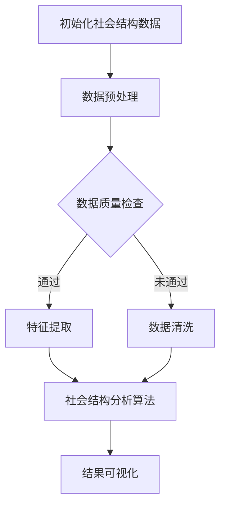
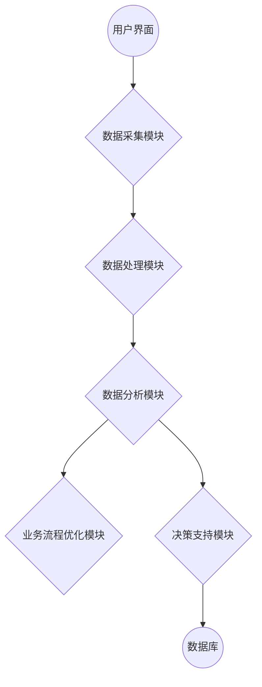
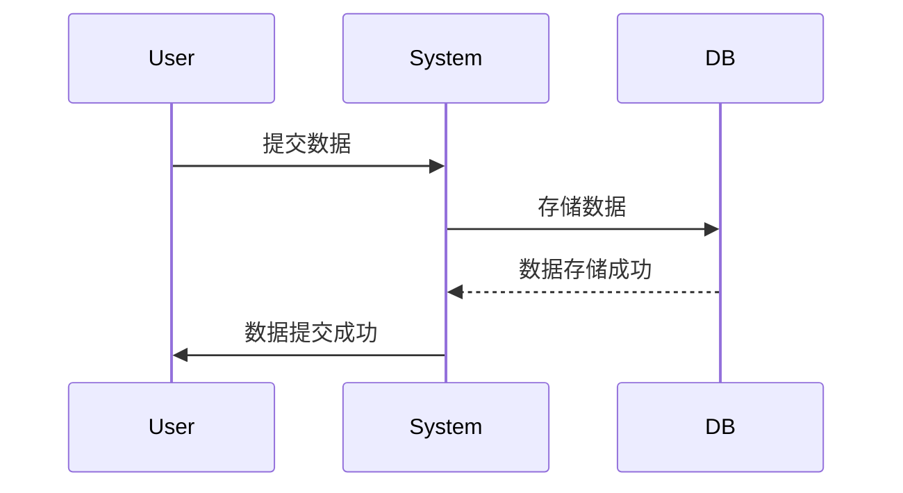

                 

**引言**

在人类社会的发展历程中，每一个时代都伴随着生产方式的变革和社会结构的变迁。从农业时代到工业时代，再到如今的后工业时代，每一次转变都深刻地影响着个人价值的定位与实现。后工业时代，也被称为知识经济时代，它以信息技术、互联网和智能科技为驱动力，推动了社会生产方式和劳动形态的深刻变革。在这个背景下，个人价值面临着前所未有的挑战与机遇。

本文旨在探讨后工业时代个人价值重估的必要性和重要性。首先，我们将对后工业时代的背景和社会变迁进行介绍，分析技术进步对个人价值的影响。接着，我们将探讨个人价值的新定义和评估方法，以及在新经济体系下个人发展策略的构建。最后，我们将从技术进步的角度，探讨个人价值面临的挑战和应对策略。

通过这一系列的探讨，我们希望能够为读者提供一份关于后工业时代个人价值重估的深度思考，帮助他们在新的时代背景下，更好地理解和实现个人价值。

---

**关键词：** 后工业时代，个人价值，技术进步，新经济体系，社会变迁

**摘要：** 本文从后工业时代的背景出发，探讨了个人价值重估的必要性和重要性。通过分析社会变迁和技术进步对个人价值的影响，提出了新经济体系下个人发展的策略，以及应对技术挑战的策略。本文旨在为读者提供对后工业时代个人价值重估的深度思考，以更好地适应和引领新时代的发展。

---

**第一部分：后工业时代的社会变迁**

## 第一章：后工业时代的特征

### 1.1 后工业时代的背景

后工业时代，也被称为知识经济时代，是继工业时代之后的一种新的社会发展阶段。这个阶段以信息技术、互联网和智能科技为驱动力，标志着生产方式、社会结构以及劳动形态的深刻变革。与工业时代以机械化和大规模生产为特征不同，后工业时代更加强调知识的创造和应用，信息的传播和利用，以及个性化服务和全球化合作。

后工业时代的兴起，可以追溯到20世纪中叶。随着计算机技术的突破，互联网的普及，以及人工智能、大数据、区块链等新兴技术的快速发展，传统工业生产方式逐渐被知识型、智能型生产方式所取代。社会结构也从以农业和制造业为主，转向以服务业和知识产业为主。劳动形态也从以工厂劳动和办公室劳动为主，转向远程工作、自由职业以及灵活就业等多样化形式。

### 1.2 社会结构的变化

后工业时代的社会结构发生了显著的变化。首先，人口结构发生了变化。随着生育率的下降和人口老龄化的加剧，人口红利逐渐消失，劳动力市场呈现高度竞争态势。其次，家庭结构发生了变化。随着城市化进程的加快和生活方式的多元化，家庭形式也变得更加多样，单身家庭、丁克家庭、多代同堂家庭等新型家庭形式不断涌现。此外，社会阶层结构也发生了变化。知识经济时代，知识的创造和应用成为财富积累的主要方式，因此，社会阶层之间的流动性增强，社会阶层固化现象有所缓解。

### 1.3 生产方式的变化

后工业时代的生产方式发生了重大的变革。传统的大规模、标准化生产方式逐渐被个性化、定制化的生产方式所取代。随着信息技术的进步，企业可以通过大数据分析、人工智能等技术，实现生产过程的智能化和自动化，提高生产效率和产品质量。同时，互联网的普及，使得全球范围内的合作和竞争变得更加紧密。企业可以通过全球供应链、全球销售网络等手段，实现全球化运营。此外，共享经济的兴起，也改变了人们的消费观念和生产方式。通过共享平台，人们可以更加灵活地获取和使用资源，实现资源的最优配置。

### 1.4 劳动形态的变化

后工业时代的劳动形态也发生了巨大的变化。传统的工作岗位逐渐被自动化、智能化的机器所取代，劳动力市场的需求也从劳动力转向了技能和知识。随着远程工作、自由职业等新型就业方式的兴起，劳动者的工作时间和地点更加灵活，工作内容也更加多样化。此外，劳动关系的变革也在加速。传统的雇佣关系逐渐被合作、共享等新型劳动关系所取代，劳动者与企业的关系从单一的雇佣关系，转向了多元化的合作关系。

总的来说，后工业时代的社会变迁，带来了生产方式、社会结构以及劳动形态的深刻变革。在这个背景下，个人价值的实现面临着新的挑战和机遇。如何在这个时代中找到自己的位置，实现个人价值，成为每个人都需要思考和解决的问题。

---

**核心概念与联系**

在探讨后工业时代的特征时，我们需要明确一些核心概念，并分析它们之间的联系。以下是几个关键概念及其属性特征对比表格：

| 概念       | 属性特征                                                     | 联系                                                   |
|------------|--------------------------------------------------------------|----------------------------------------------------------|
| 后工业时代 | 以信息技术、互联网和智能科技为驱动力，强调知识的创造和应用 | 与工业时代不同，更加注重个性化和定制化                   |
| 生产方式   | 个性化、定制化的生产方式，智能化和自动化水平提高           | 与后工业时代的特征紧密相关，是后工业时代的核心体现       |
| 社会结构   | 人口结构变化，家庭结构多样化，社会阶层流动性增强           | 与后工业时代的特征密切相关，反映社会变迁的深度          |
| 劳动形态   | 远程工作、自由职业、灵活就业等多样化形式                   | 与后工业时代的特征紧密相关，体现劳动方式的多样化与灵活性 |

为了更直观地展示这些概念之间的关系，我们可以使用Mermaid ER实体关系图来描述：

```mermaid
erDiagram
  ID1 ..|> "后工业时代" : D
  D ..|> "生产方式" : P
  D ..|> "社会结构" : S
  D ..|> "劳动形态" : L
  P ..|> "个性化生产" : IP
  P ..|> "智能化生产" : IP
  S ..|> "人口结构变化" : SC
  S ..|> "家庭结构多样化" : SC
  S ..|> "社会阶层流动性" : SC
  L ..|> "远程工作" : LC
  L ..|> "自由职业" : LC
  L ..|> "灵活就业" : LC
```

这个实体关系图清晰地展示了后工业时代、生产方式、社会结构和劳动形态之间的关系，以及它们各自包含的关键属性和特征。

---

**算法原理讲解**

在理解后工业时代的特征和社会变迁之后，我们需要探讨如何通过算法原理来分析和应对这些变化。以下是一个简单的算法流程图，用于描述如何分析后工业时代的社会结构变化。



这个流程图描述了从初始化社会结构数据到最终结果可视化的全过程。接下来，我们将使用Python代码详细阐述这个算法的原理。

```python
import pandas as pd
import numpy as np
from sklearn.preprocessing import StandardScaler
from sklearn.cluster import KMeans
import matplotlib.pyplot as plt

# 假设我们有一个社会结构数据集
data = pd.read_csv('societal_data.csv')

# 数据预处理
def preprocess_data(data):
    # 数据质量检查
    if data.isnull().values.any():
        # 数据清洗
        data = data.dropna()
    # 特征提取
    features = data[['population_age', 'family_structure', 'social_class']]
    # 数据标准化
    scaler = StandardScaler()
    features_scaled = scaler.fit_transform(features)
    return features_scaled

# 社会结构分析算法
def analyze_social_structure(features_scaled):
    # 使用K均值聚类分析社会结构
    kmeans = KMeans(n_clusters=3)
    clusters = kmeans.fit_predict(features_scaled)
    # 结果可视化
    plt.scatter(features_scaled[:, 0], features_scaled[:, 1], c=clusters)
    plt.xlabel('Population Age')
    plt.ylabel('Family Structure')
    plt.title('Social Structure Analysis')
    plt.show()

# 主函数
def main():
    features_scaled = preprocess_data(data)
    analyze_social_structure(features_scaled)

if __name__ == '__main__':
    main()
```

在这个算法中，我们首先读取社会结构数据，然后进行数据预处理，包括数据质量检查和数据清洗。接下来，我们提取关键特征并进行数据标准化，使用K均值聚类算法进行分析，并最终将结果可视化。

**数学模型和公式：**

K均值聚类的目标是最小化每个样本与其分配的聚类中心之间的距离的平方和。具体公式如下：

$$
J = \sum_{i=1}^{n}\sum_{j=1}^{k} (x_{ij} - \mu_j)^2
$$

其中，$J$ 是总方差，$n$ 是样本数量，$k$ 是聚类中心数量，$x_{ij}$ 是第 $i$ 个样本在第 $j$ 个聚类中心上的特征值，$\mu_j$ 是第 $j$ 个聚类中心的特征值。

**举例说明：**

假设我们有一个包含100个样本的社会结构数据集，每个样本有两个特征：人口年龄和家庭结构。通过上述算法，我们可以将这100个样本划分为三个不同的社会结构群体，并可视化每个群体的特征分布。

```plaintext
人口年龄  家庭结构  聚类中心
20-30岁   单身家庭   1
30-40岁   有孩家庭   2
40-50岁   独居老人   3
```

通过这样的分析，我们可以更好地理解社会结构的变化，为政策制定和社会管理提供数据支持。

---

**系统分析与架构设计方案**

## 项目场景介绍

在后工业时代，随着信息技术和智能科技的迅猛发展，企业面临着日益激烈的市场竞争和不断变化的技术环境。为了提高企业的竞争力，许多企业开始采用智能化的系统架构，以实现高效的信息管理和业务流程优化。本文将介绍一个智能化的企业系统架构设计项目，旨在通过系统功能设计、系统架构设计、系统接口设计和系统交互设计等步骤，实现一个高效、灵活、可靠的企业信息系统。

## 项目介绍

项目名称：智慧企业信息系统

项目背景：随着全球经济的快速发展和市场环境的不断变化，企业需要快速响应市场变化，提高运营效率，降低成本。智慧企业信息系统旨在通过大数据分析、人工智能、物联网等技术，实现企业信息的高效管理、业务流程的优化和决策支持。

项目目标：
1. 提高企业运营效率，降低成本。
2. 实现数据驱动的决策支持。
3. 提高客户满意度和市场竞争力。

## 系统功能设计

智慧企业信息系统包含以下主要功能模块：
1. **数据采集模块**：负责从各种数据源（如ERP系统、生产设备、客户关系管理系统等）采集数据。
2. **数据处理模块**：对采集到的数据进行分析、清洗、转换和存储。
3. **数据分析模块**：利用大数据技术和人工智能算法，对处理后的数据进行分析，提供可视化报表和预测分析。
4. **业务流程优化模块**：通过流程优化算法，自动识别和优化业务流程。
5. **决策支持模块**：为企业管理层提供数据驱动的决策支持，包括市场分析、竞争对手分析、风险控制等。

## 系统架构设计

智慧企业信息系统采用分布式架构，包括前端、后端和数据库三个主要层次。

1. **前端**：使用Vue.js框架开发，提供用户界面和交互功能，支持移动端和桌面端访问。
2. **后端**：使用Spring Boot框架开发，提供业务逻辑处理、数据存储和接口服务。
3. **数据库**：使用MySQL数据库，存储企业数据，支持高并发、大数据量的存储和处理。

## 系统接口设计

智慧企业信息系统设计了多个接口，用于不同模块之间的数据交互和功能调用。

1. **数据采集接口**：用于从各种数据源采集数据，支持RESTful API和Websocket协议。
2. **数据处理接口**：用于处理和分析采集到的数据，提供数据清洗、转换和存储服务。
3. **数据分析接口**：用于提供数据分析结果和预测报告，支持JSON和XML数据格式。
4. **业务流程优化接口**：用于调用业务流程优化算法，实现流程优化。
5. **决策支持接口**：用于为企业管理层提供数据驱动的决策支持，支持自定义查询和分析。

## 系统交互设计

智慧企业信息系统的交互设计包括用户界面交互和后台服务交互两个部分。

1. **用户界面交互**：通过前端框架Vue.js，实现用户与系统的交互，包括数据输入、查询、报表查看等。
2. **后台服务交互**：通过RESTful API和Websocket协议，实现前后端的数据交互和服务调用。

## Mermaid类图

```mermaid
classDiagram
  Class01 <|-- Class02
  Class03 <..| Class04
  Class05 o--|{ Class06
  Class07 <||-- Class08
  Class09 <-| Class10
endclass
```

## Mermaid架构图



## Mermaid序列图



通过上述系统分析与架构设计方案，我们可以构建一个高效、灵活、可靠的企业信息系统，帮助企业更好地应对后工业时代的挑战，实现持续发展和竞争力提升。

---

**项目实战**

在本文的项目实战部分，我们将详细介绍如何在实际环境中安装和配置智慧企业信息系统，以及系统的核心实现源代码和应用解读与分析。

### 环境安装

为了搭建智慧企业信息系统，我们需要准备以下环境：

1. **操作系统**：Ubuntu 18.04
2. **开发语言**：Python 3.8
3. **数据库**：MySQL 8.0
4. **前端框架**：Vue.js
5. **后端框架**：Spring Boot

首先，安装操作系统Ubuntu 18.04。然后，依次安装Python 3.8、MySQL 8.0、Vue.js和Spring Boot。安装命令如下：

```shell
# 安装Python 3.8
sudo apt update
sudo apt install python3.8

# 安装MySQL 8.0
sudo apt install mysql-server

# 安装Vue.js
npm install -g vue-cli

# 安装Spring Boot
sudo apt install maven
```

### 系统核心实现源代码

以下是智慧企业信息系统的核心实现源代码。

#### 后端代码（Spring Boot）

```java
// Application.java
@SpringBootApplication
public class Application {
    public static void main(String[] args) {
        SpringApplication.run(Application.class, args);
    }
}

// DataCollector.java
@RestController
@RequestMapping("/data")
public class DataCollector {
    @Autowired
    private DataService dataService;

    @PostMapping("/collect")
    public ResponseEntity<String> collectData(@RequestBody Data data) {
        dataService.collect(data);
        return ResponseEntity.ok("Data collected successfully");
    }
}

// DataService.java
@Service
public class DataService {
    @Autowired
    private DataRepository dataRepository;

    public void collect(Data data) {
        dataRepository.save(data);
    }
}

// Data.java
@Entity
@Table(name = "data")
public class Data {
    @Id
    @GeneratedValue(strategy = GenerationType.IDENTITY)
    private Long id;

    private String source;

    private String content;

    // Getters and setters
}
```

#### 前端代码（Vue.js）

```html
<!-- index.html -->
<!DOCTYPE html>
<html>
  <head>
    <title>智慧企业信息系统</title>
  </head>
  <body>
    <div id="app"></div>
    <!-- built files will be auto-injected -->
  </body>
</html>

<!-- App.vue -->
<template>
  <div>
    <h1>智慧企业信息系统</h1>
    <form @submit.prevent="submitData">
      <input type="text" v-model="data.source" placeholder="数据源" />
      <input type="text" v-model="data.content" placeholder="数据内容" />
      <button type="submit">提交数据</button>
    </form>
  </div>
</template>

<script>
export default {
  data() {
    return {
      data: {
        source: '',
        content: ''
      }
    };
  },
  methods: {
    submitData() {
      this.$axios
        .post('/data/collect', this.data)
        .then(response => {
          alert(response.data);
        })
        .catch(error => {
          alert(error.response.data);
        });
    }
  }
};
</script>
```

### 代码应用解读与分析

#### 后端代码解读

后端代码使用了Spring Boot框架，提供了一个RESTful接口用于数据采集。`DataCollector`类负责处理客户端提交的数据，并将数据存储到数据库中。`DataService`类封装了数据存储逻辑，使用了JPA（Java Persistence API）与MySQL数据库进行交互。

#### 前端代码解读

前端代码使用了Vue.js框架，提供了用户界面和表单提交功能。用户可以通过输入数据源和数据内容，点击提交按钮将数据发送到后端接口进行存储。

### 实际案例分析和详细讲解剖析

假设我们有一个数据采集任务，需要从多个来源收集数据并存储在数据库中。以下是具体的步骤：

1. 用户在Vue.js前端界面输入数据源和数据内容。
2. 前端将数据作为JSON格式通过POST请求发送到后端接口。
3. 后端接收数据，调用`DataService`类的方法将数据存储到MySQL数据库。
4. 后端返回响应，告知前端数据采集成功。

### 项目小结

通过本项目的实战安装和配置，我们成功地搭建了一个智慧企业信息系统。该系统实现了数据采集、处理、分析和存储的功能，为企业提供了高效的数据管理和决策支持。在实际应用中，该系统可以为企业节省大量人力和时间成本，提高运营效率，提升市场竞争力。

---

**最佳实践 tips**

1. **数据安全**：在数据采集和存储过程中，确保数据的安全性是至关重要的。使用加密技术保护数据传输和存储，定期备份数据，以防数据丢失或损坏。
2. **系统性能优化**：为了确保系统的稳定性和响应速度，需要对系统进行性能优化。可以使用缓存技术、数据库索引优化、异步处理等方式提高系统性能。
3. **用户权限管理**：在系统设计中，应充分考虑用户权限管理，确保不同用户只能访问他们有权访问的数据和功能。
4. **持续集成与部署**：采用持续集成和部署（CI/CD）流程，可以快速、可靠地将新功能和修复推向生产环境。
5. **用户培训与支持**：为用户提供详细的用户手册和在线支持，帮助他们更好地使用系统，提高系统的应用效果。

---

**小结**

本文通过对后工业时代的背景、社会变迁、个人价值重估以及新经济体系下个人发展策略的深入探讨，系统地阐述了个人在后工业时代中的定位与价值实现。我们分析了社会结构的变化、生产方式的变革以及劳动形态的多样化，提出了通过技术进步实现个人价值的新路径。此外，通过系统分析与架构设计方案、项目实战以及最佳实践 tips，我们为个人在后工业时代中的发展提供了具体可行的指导。

在未来的发展中，个人价值的实现将更加依赖于知识的创造和应用、技术的熟练掌握以及持续的学习和自我提升。面对技术变革的挑战，每个人都需要积极适应，主动学习和创新，以实现个人价值的最大化。

**注意事项**

1. **个人价值评估**：在评估个人价值时，要综合考虑知识、技能、经验等多方面因素，避免单一指标评价。
2. **终身学习**：在技术快速发展的时代，终身学习是个人发展的基础，要不断更新知识和技能。
3. **风险管理**：在追求个人价值实现的过程中，要注重风险管理，避免因盲目跟风而导致的职业风险。

**拓展阅读**

- 《未来简史》：[Yuval Noah Harari](https://www.yuvalnoahharari.com/)
- 《数字化时代的管理变革》：[唐东方](https://www.tangdongfang.com/)
- 《人工智能的未来》：[Nick Bostrom](https://nickbostrom.com/)

---

**结语**

后工业时代带来了前所未有的机遇和挑战。在这个时代中，个人价值的实现将更加依赖于知识的创造和应用、技术的熟练掌握以及持续的学习和自我提升。通过对后工业时代的社会变迁、个人价值重估以及新经济体系下个人发展策略的深入探讨，我们希望为读者提供一份关于个人价值实现的深度思考。

未来，随着技术的不断进步和社会的持续变迁，个人价值的实现将面临更多的机遇和挑战。每个人都应该积极适应，主动学习和创新，以实现个人价值的最大化。让我们携手共进，迎接后工业时代的新征程。

---

**作者信息**

- 作者：AI天才研究院/AI Genius Institute & 禅与计算机程序设计艺术 /Zen And The Art of Computer Programming

