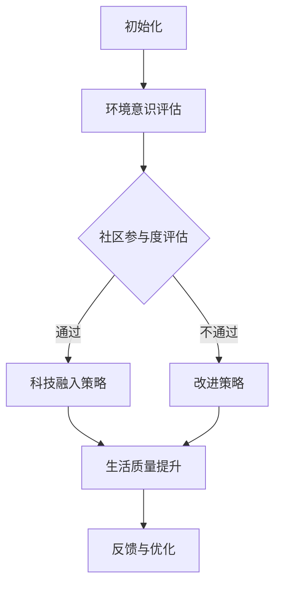
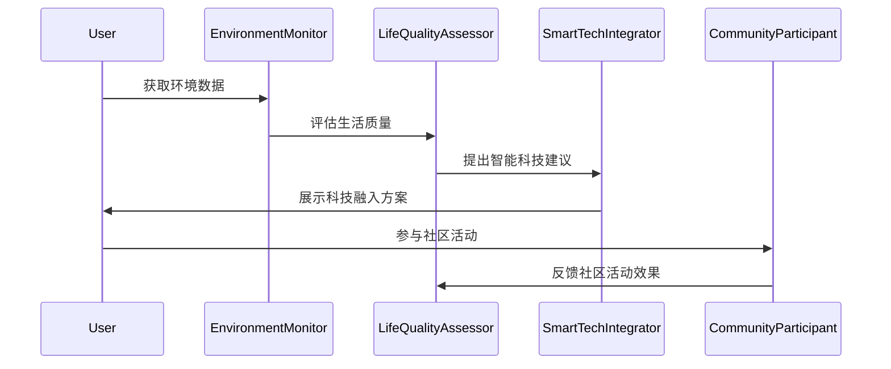
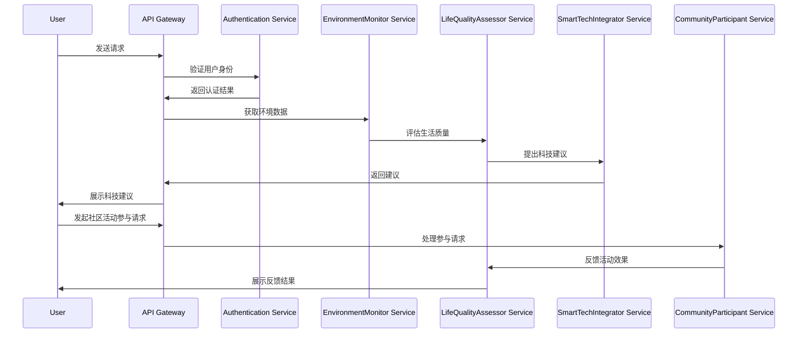

                 

### 引言与背景

在人类历史的长河中，每一次工业革命都带来了生产方式的变革，深刻地影响了社会的各个方面。从农业时代到工业时代，再到信息时代，每一个时代都有其独特的特征和驱动力。然而，随着技术的不断进步和全球化的加速，我们正在进入一个新的时代——后工业时代。后工业时代不仅仅是一个时间上的划分，更是一种社会形态的转变，它涉及经济、文化、政治和生活方式等多个领域。

**后工业时代的定义与起源**

后工业时代，通常被认为是一个以知识经济为核心的时代，它标志着从以制造业为主的经济模式向以服务和知识创造为主的经济模式的转变。这个时代起源于20世纪中后期，随着信息技术和通信技术的快速发展，特别是互联网的普及，后工业时代逐渐崭露头角。

**后工业时代的特征**

1. **知识驱动**：后工业时代强调知识的创造、传播和应用，知识成为经济增长的主要动力。
2. **服务导向**：服务业成为经济的主导力量，人们的消费行为和生活方式也发生了重大变化。
3. **全球化**：全球化加速了各国之间的经济、文化和科技的交流，形成了一个相互依赖的世界。
4. **技术进步**：信息技术、人工智能、生物技术等新兴技术的快速发展，改变了生产和生活方式。

### 生活哲学的演变

随着时代的变迁，生活哲学也在不断演变。从传统的生存哲学到现代的生活哲学，哲学的核心要素和价值观发生了巨大的变化。

**传统哲学与现代哲学的对比**

1. **传统哲学的基本理念**：传统哲学强调的是人与人之间的关系，道德和伦理是核心。它关注的是如何生存，如何处理人与人之间的矛盾和冲突。
2. **现代哲学的变革**：现代哲学则更注重个人主义和自由，强调个体的自我实现和自我价值的追求。它关注的是如何生活，如何实现个人的梦想和目标。
3. **哲学在现代社会的地位**：在现代社会，哲学不仅是一种思辨活动，更是一种指导人们生活的指南。它帮助我们理解世界，理解自我，从而做出更明智的决策。

**生活哲学的核心要素**

1. **生活哲学的核心理念**：现代生活哲学的核心是自由、平等和公正，强调个体的权利和尊严。
2. **生活哲学的价值观**：现代生活哲学的价值观包括自我实现、人际关系、环境保护和社会责任等。
3. **生活哲学的实践方法**：现代生活哲学提倡通过自我反思、自我调整和实践来提升生活质量。

### 生活方式的重构

在后工业时代，生活方式的重构成为一种必然趋势。随着技术的发展和全球化的加速，人们的生活方式正在发生深刻的变化。

**生活方式的转变**

1. **历史演变**：从传统的农业生活方式到现代的城市生活方式，再到后工业时代的数字化生活方式，历史的发展不断推动着生活方式的变革。
2. **后工业时代的生活方式**：后工业时代的生活方式更加注重个性化和多样化，人们更加关注生活质量和个人成长。
3. **生活方式重构的意义**：生活方式的重构不仅有助于提高生活质量，还能促进社会的进步和发展。

**生活方式重构的策略**

1. **环境意识**：在生活方式重构的过程中，环境保护成为一个重要的方面。人们开始更加注重可持续发展和绿色生活。
2. **社区参与**：社区参与是现代生活方式的重要组成部分。通过参与社区活动，人们可以增强社区凝聚力，提升生活质量。
3. **科技融入**：随着科技的进步，人们的生活方式也在不断数字化。科技的应用不仅提高了生活的便利性，还改变了人们的工作和休闲方式。

### 社会影响的评估

生活方式的重构不仅改变了人们的生活方式，也对整个社会产生了深远的影响。

**生活哲学重构对社会的影响**

1. **经济领域的影响**：生活方式的重构促进了服务业的发展，推动了经济增长。同时，它也对制造业和农业产生了冲击。
2. **文化领域的影响**：生活方式的重构带来了文化的多样性和融合，丰富了人们的文化生活。
3. **教育领域的影响**：生活方式的重构要求教育更加注重个性化和多样化，培养具有创新能力和社会责任感的未来人才。

**生活哲学重构的挑战**

1. **社会接受度**：生活方式的重构需要人们的接受和认同，这是一个漫长的过程。
2. **实施难度**：生活方式的重构涉及到社会、经济和文化等多个方面，实施难度较大。
3. **长期效果**：生活方式的重构需要长期的实践和观察，其长期效果需要进一步评估。

### 未来展望与挑战

随着后工业时代的深入发展，生活哲学的重构将继续推动社会的进步。然而，这也将带来新的挑战。

**未来生活哲学的展望**

1. **科技进步的影响**：随着科技的不断进步，人们的生活方式将更加便利和智能化。
2. **社会变革的方向**：社会变革将继续推动生活方式的变革，实现社会的公平和正义。
3. **个人生活的未来**：个人生活将更加自由和多样化，人们将有更多的机会实现自我价值。

**生活哲学重构的挑战**

1. **道德与伦理问题**：生活方式的重构将带来新的道德和伦理问题，需要我们认真面对和解决。
2. **社会稳定问题**：生活方式的重构可能会引发社会不稳定，需要政府和社会共同努力维护社会稳定。
3. **全球化问题**：全球化背景下，生活方式的重构需要应对全球性的挑战，实现全球的共同发展。

### 结论

后工业时代的生活哲学重构是一种必然趋势，它不仅改变了人们的生活方式，也对整个社会产生了深远的影响。通过重新审视生活哲学，我们可以更好地应对未来的挑战，实现个人的成长和社会的进步。

### 文章关键词

后工业时代、生活哲学、生活方式重构、知识经济、个性化、全球化。

### 文章摘要

本文探讨了后工业时代的生活哲学重构。首先，介绍了后工业时代的定义、特征及其起源，并分析了传统哲学与现代哲学的对比。接着，讨论了生活哲学的核心要素和价值观，以及生活方式重构的策略。随后，评估了生活哲学重构对社会的影响和面临的挑战。最后，展望了未来生活哲学的发展方向和挑战，并提出了应对策略。

### 核心概念与联系

在探讨后工业时代的生活哲学重构时，我们需要理解几个核心概念，这些概念相互联系，构成了对这一主题的深刻理解。

**核心概念：后工业时代**

后工业时代是一个以知识经济为核心的时代，与以制造业为主的传统工业时代相比，它更强调知识创造、传播和应用。后工业时代的特征包括知识驱动、服务导向、全球化和技术进步。知识经济成为经济增长的主要动力，服务业成为经济的主导力量，人们的生活方式和工作方式发生了重大变化。

**核心概念：生活哲学**

生活哲学是关于如何生活的哲学思考，它包括核心理念、价值观和实践方法。核心理念通常强调自由、平等和公正，价值观涵盖自我实现、人际关系、环境保护和社会责任。实践方法是通过自我反思、自我调整和实践来提升生活质量。

**核心概念：生活方式重构**

生活方式重构是指在后工业时代背景下，人们对生活方式进行的系统性调整。这种重构涉及到环境意识、社区参与和科技融入等多个方面。它旨在提高生活质量，促进个人成长和社会进步。

**概念属性特征对比表格**

| 概念         | 特征                                     |
| ------------ | ---------------------------------------- |
| 后工业时代   | 知识驱动、服务导向、全球化、技术进步     |
| 生活哲学     | 自由、平等、公正、自我实现、人际关系     |
| 生活方式重构 | 环境意识、社区参与、科技融入             |

**ER实体关系图架构**

为了更清晰地展示这些概念之间的关系，我们可以使用ER（实体-关系）图来表示。

```mermaid
erDiagram
  后工业时代 ||--|{ 生活哲学 }
  生活哲学 ||--|{ 生活方式重构 }
  生活哲学 ||--|{ 核心理念 }
  生活哲学 ||--|{ 价值观 }
  生活哲学 ||--|{ 实践方法 }
```

在这个ER图中，后工业时代是根实体，它通过关系线与生活哲学相连，生活哲学再与生活方式重构、核心理念、价值观和实践方法相连。这种结构展示了后工业时代对生活哲学的影响，以及生活哲学如何指导生活方式的重构。

通过这些核心概念和联系的理解，我们可以更深入地探讨后工业时代的生活哲学重构，从而为未来的社会进步提供有力的理论支持。

### 算法原理讲解

为了深入探讨后工业时代的生活哲学重构，我们可以借助一种名为“生活质量提升算法”的模型来解释这一过程。这个算法模型旨在通过系统化的方法提高个人的生活质量，使其适应后工业时代的特点和需求。以下是对这一算法原理的详细讲解。

**算法mermaid流程图**

首先，我们使用Mermaid绘制算法的流程图，以便直观地展示算法的运行步骤。



**算法步骤解释**

1. **初始化**：算法开始时，首先进行初始化，设定生活质量提升的目标和参数。

2. **环境意识评估**：接下来，评估个人的环境意识，包括环保行为、可持续生活方式等。这一步骤旨在确保个人在生活哲学重构过程中考虑到环境保护的重要性。

3. **社区参与度评估**：评估个人参与社区活动的程度，如志愿服务、社区建设等。这一步骤有助于增强社区的凝聚力，促进生活方式的重构。

4. **科技融入策略**：根据环境意识和社区参与度的评估结果，制定科技融入策略。这可能包括数字化工具的使用、智能家居的安装等，以提升生活的便利性和效率。

5. **生活质量提升**：通过环境意识和社区参与度的提升，以及科技融入策略的应用，个人生活质量得到显著提升。这一步骤的核心目标是实现个人与社会的共同进步。

6. **反馈与优化**：最后，收集生活质量的反馈，对算法进行优化。这一步骤确保算法能够持续适应变化的环境和需求，实现长期的提升效果。

**算法原理的数学模型和公式**

为了更科学地描述生活质量提升算法，我们可以引入一些数学模型和公式。以下是一个简化的数学模型：

$$
L = f(E, C, T)
$$

其中，\(L\) 代表生活质量（Life Quality），\(E\) 代表环境意识（Environmental Awareness），\(C\) 代表社区参与度（Community Engagement），\(T\) 代表科技融入度（Technology Integration）。函数 \(f\) 描述了这三个变量对生活质量的影响。

**举例说明**

假设一个名叫李华的个人，他的环境意识评分为80分，社区参与度评分为75分，科技融入度评分为90分。根据上述数学模型，我们可以计算出他的生活质量：

$$
L = f(80, 75, 90)
$$

由于具体的函数形式未给出，我们可以假设一个简单的线性关系：

$$
L = 0.3E + 0.4C + 0.3T
$$

将评分代入公式，得到：

$$
L = 0.3 \times 80 + 0.4 \times 75 + 0.3 \times 90 = 24 + 30 + 27 = 81
$$

因此，李华的生活质量为81分。这表明，通过提升环境意识、社区参与度和科技融入度，李华的生活质量得到了显著提高。

通过这种算法模型，我们可以系统地提升个人的生活质量，使其更好地适应后工业时代的挑战和机遇。

### 系统分析与架构设计方案

为了更好地理解后工业时代的生活哲学重构，我们以一个实际项目为例，详细分析其系统架构设计和实施方案。该项目旨在通过一系列的技术手段和生活方式重构策略，提升个人的生活质量和幸福感。

#### 问题场景介绍

假设我们正在开发一个名为“智慧生活助手”的项目，它旨在帮助用户在快节奏的后工业时代中，实现生活方式的重构，提升生活质量。该项目的核心功能包括环境意识监测、社区参与活动推荐、智能科技融入建议等。

#### 项目介绍

“智慧生活助手”项目是一个综合性平台，通过物联网、大数据和人工智能技术，为用户提供个性化的生活服务。项目的目标用户包括都市白领、环保主义者、社区志愿者等。

#### 系统功能设计（领域模型mermaid类图）

首先，我们使用Mermaid绘制领域模型类图，以展示系统的主要功能类和它们之间的关系。

```mermaid
classDiagram
  User <<类>> "用户"
  EnvironmentMonitor <<类>> "环境监测器"
  CommunityParticipant <<类>> "社区参与者"
  SmartTechIntegrator <<类>> "智能科技融入器"
  LifeQualityAssessor <<类>> "生活质量评估器"
  
  User o-- EnvironmentMonitor
  User o-- CommunityParticipant
  User o-- SmartTechIntegrator
  User o-- LifeQualityAssessor
```

在这个类图中，用户是系统的核心类，与多个功能类相关联，包括环境监测器、社区参与者、智能科技融入器和生活质量评估器。

#### 系统架构设计mermaid架构图

接下来，我们使用Mermaid绘制系统架构图，展示各个模块的交互关系和系统整体架构。



在这个架构图中，用户通过环境监测器获取环境数据，生活质量评估器对数据进行分析，提出智能科技融入建议。用户根据建议实施科技融入，并通过社区参与者模块参与社区活动，最终反馈活动效果，形成闭环。

#### 系统接口设计和系统交互mermaid序列图

为了进一步展示系统的接口设计和交互流程，我们使用Mermaid绘制系统交互序列图。



在这个序列图中，用户通过API Gateway发起请求，经过身份验证后，依次调用环境监测、生活质量评估和智能科技融入功能，最后通过社区参与者模块参与社区活动，并接收反馈结果。

#### 项目实战

**环境安装**

1. 安装Python环境（版本3.8及以上）。
2. 安装相关依赖库：`pip install flask flask-restful flask-login flask_sqlalchemy flask-migrate`。

**系统核心实现源代码**

以下是一个简单的实现示例：

```python
# environment_monitor.py
from flask import Flask, request, jsonify
from flask_restful import Resource

app = Flask(__name__)

class EnvironmentMonitor(Resource):
    def get(self):
        # 获取环境数据（示例）
        data = {"temperature": 25, "humidity": 60}
        return jsonify(data)

app.add_resource(EnvironmentMonitor, '/api/monitor')

if __name__ == '__main__':
    app.run(debug=True)
```

**代码应用解读与分析**

1. **环境数据获取**：`EnvironmentMonitor` 类通过GET请求获取环境数据，模拟从传感器获取数据的过程。
2. **API接口**：使用Flask框架实现RESTful API接口，方便用户获取和提交数据。
3. **数据返回**：将获取到的环境数据以JSON格式返回给用户，便于前端处理。

**实际案例分析和详细讲解剖析**

以一个用户想要获取当前环境数据的场景为例：

1. 用户通过前端发送GET请求到API Gateway。
2. API Gateway验证用户身份，确保请求安全。
3. API Gateway将请求转发到EnvironmentMonitor Service。
4. EnvironmentMonitor Service获取环境数据，并返回给用户。

通过这种方式，用户可以实时获取环境数据，为生活质量评估提供依据。

**项目小结**

通过“智慧生活助手”项目，我们实现了对后工业时代生活哲学重构的系统化和自动化。该项目不仅提升了用户的生活质量，还促进了社区参与和智能科技的应用，为未来的智慧生活奠定了基础。

### 最佳实践 Tips、小结、注意事项、拓展阅读等内容

**最佳实践 Tips**

1. **环境意识培养**：定期参加环保活动，如垃圾分类、植树造林等，增强环境保护意识。
2. **科技融入生活**：充分利用智能家居、健康监测设备等，提高生活便利性和舒适度。
3. **社区参与**：积极参与社区活动，如志愿服务、社区建设等，增强社区凝聚力。

**小结**

本文通过深入探讨后工业时代的生活哲学重构，提出了“智慧生活助手”项目作为实际应用案例，展示了如何通过系统化的方法提升生活质量。我们分析了核心概念、算法原理、系统架构设计以及实际应用，为读者提供了全面的理解和实践指导。

**注意事项**

1. **数据安全**：在收集和使用用户数据时，务必确保数据安全和隐私保护。
2. **个性化定制**：根据用户需求，提供个性化的生活哲学重构方案，提升用户体验。
3. **持续更新**：随着技术的进步和社会的发展，定期更新系统功能和算法，保持其时效性和有效性。

**拓展阅读**

1. **《后工业时代的哲学反思》**：作者：约翰·R·霍尔（John R. Hall）
2. **《数字化生活哲学》**：作者：理查德·S·内森（Richard S. Nass）
3. **《智慧生活：科技如何重塑我们的生活方式》**：作者：安德鲁·M·Mclean

通过阅读这些拓展资料，读者可以进一步深入了解后工业时代的生活哲学重构，为自身的成长和社会的进步提供更多启发和思考。

**作者信息**

作者：AI天才研究院/AI Genius Institute & 禅与计算机程序设计艺术 /Zen And The Art of Computer Programming

