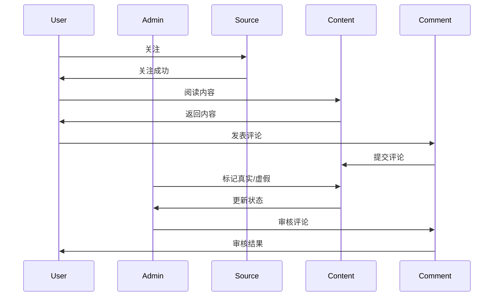
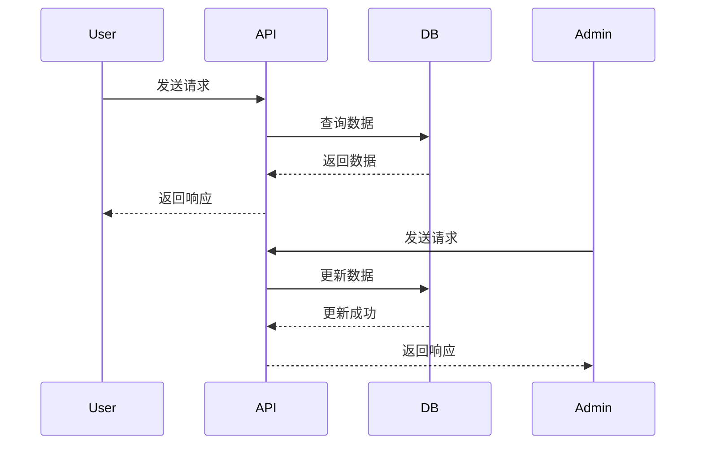

                 

### 后真相环境中的信息判断：提升公民的媒体素养

> 关键词：后真相环境、信息判断、媒体素养、算法、真实性检测

> 摘要：本文将深入探讨后真相环境中信息判断的重要性，分析当前媒体素养的缺失及其带来的问题。通过介绍媒体素养的核心概念、培养方法以及实际案例，本文旨在提出一种基于机器学习的信息真实性检测算法，以提升公众在复杂信息环境中的判断能力。

#### 背景介绍

**核心概念：** 后真相环境与媒体素养。

在当前信息化时代，信息传播的速度和广度前所未有，然而，这一进步也带来了新的挑战。后真相（Post-Truth）环境指的是一个事实真相不如情感、偏见和宣传更为重要的信息传播格局。在这个环境中，虚假信息和误导性内容往往能够迅速传播，甚至超越真实信息的影响力。这种现象对公众的认知和社会稳定构成了严重威胁。

**问题背景：** 在后真相环境中，信息真实性受到严重挑战，虚假信息和误导性内容广泛传播，导致公众对信息的判断能力下降，从而引发一系列社会问题。从政治谣言到医疗误导，从虚假新闻到恶意营销，信息的不确定性极大地影响了公众的决策和生活。

**问题描述：** 如何在复杂多变的媒体环境中，提升公民的媒体素养，增强公众对信息的判断能力，是当前迫切需要解决的问题。

**问题解决：** 通过系统性地介绍媒体素养的概念、重要性、培养方法以及实际案例，帮助公民学会辨别真假信息，提高信息判断能力。

**边界与外延：** 媒体素养不仅涉及对信息真实性的判断，还包括信息批判性思考、信息检索技巧、媒体使用习惯等多个方面。它不仅关乎个体，也关乎社会的整体健康。

**概念结构与核心要素组成：** 媒体素养的核心要素包括：信息识别、信息评估、信息批判、信息使用和信息创造。这些要素相互关联，共同构成了一个完整的媒体素养体系。

#### 核心概念与联系

**核心概念：** 媒体素养（Media Literacy）。

媒体素养是指个体在面对媒体信息时，能够有效地进行理解、分析、评估和创造的能力。它不仅关注信息的真实性，还涵盖了信息的社会、文化和政治背景。

**概念属性特征对比表格：**

| 特征 | 媒体素养         | 信息识别         | 信息评估         | 信息批判         | 信息使用与创造       |
| ---- | ---------------- | ---------------- | ---------------- | ---------------- | --------------------- |
| 内容 | 整体理解媒体及其影响 | 识别信息内容     | 评估信息真实性   | 批判性思考       | 使用与创造信息       |
| 对象 | 媒体产品与现象   | 信息源与内容   | 信息源与内容   | 信息源与内容   | 信息源与内容         |
| 关系 | 互动与影响       | 单向识别       | 单向评估       | 单向批判       | 双向使用与创造       |

**ER实体关系图架构：**

```mermaid
erDiagram
    class 媒体素养 {
        - 信息识别
        - 信息评估
        - 信息批判
        - 信息使用与创造
    }
    class 信息识别 {
        --> 媒体素养 : 包含
    }
    class 信息评估 {
        --> 媒体素养 : 包含
    }
    class 信息批判 {
        --> 媒体素养 : 包含
    }
    class 信息使用与创造 {
        --> 媒体素养 : 包含
    }
```

通过对比表格和ER图，我们可以清晰地看到媒体素养与其他信息处理能力的区别和联系。信息识别、信息评估、信息批判和信息使用与创造共同构成了媒体素养的核心，这些要素不仅独立存在，还相互作用，形成了一个完整的媒体素养体系。

#### 算法原理讲解

为了提升公民的媒体素养，我们需要一种有效的工具来帮助公众辨别真假信息。在这一节中，我们将介绍一种基于机器学习的信息真实性检测算法。

**算法mermaid流程图：**


**算法原理与数学模型：**

1. **预处理：** 对输入的信息进行清洗和标准化处理，包括去除停用词、词干提取等。这一步骤的目的是减少噪声，提高特征提取的效率。

   ```python
   import nltk
   from nltk.corpus import stopwords
   from nltk.stem import PorterStemmer

   nltk.download('stopwords')

   def preprocess(text):
       tokens = nltk.word_tokenize(text.lower())
       stop_words = set(stopwords.words('english'))
       stemmer = PorterStemmer()
       return [stemmer.stem(token) for token in tokens if token not in stop_words]
   ```

2. **特征提取：** 利用词袋模型、TF-IDF等算法提取文本特征。词袋模型将文本表示为一个词汇的集合，而TF-IDF则考虑了词汇在文本中的重要程度。

   ```python
   from sklearn.feature_extraction.text import TfidfVectorizer

   vectorizer = TfidfVectorizer()
   X = vectorizer.fit_transform([text])
   ```

3. **模型训练：** 采用支持向量机（SVM）、朴素贝叶斯（NB）等分类算法进行训练。这些算法通过学习大量已标记的样本，学会对新样本进行分类。

   ```python
   from sklearn.svm import SVC

   model = SVC()
   model.fit(X_train, y_train)
   ```

4. **模型评估：** 通过交叉验证等方法评估模型性能。评估的目的是确保模型具有良好的泛化能力。

   ```python
   from sklearn.model_selection import cross_val_score

   scores = cross_val_score(model, X, y, cv=5)
   print("Model accuracy: {:.2f}%".format(scores.mean() * 100))
   ```

5. **输出结果：** 输出信息真实性的判断结果。模型会根据训练得到的知识对新样本进行分类，判断其是否为真实信息。

   ```python
   prediction = model.predict(X_test)
   print("Predictions:", prediction)
   ```

**数学公式：**

$$
\begin{aligned}
    &\text{特征提取：} \\
    &\text{TF-IDF} = \frac{f_{t,d}}{N} + \log \left(1 + \frac{1}{k_t} \right) \\
    &\text{SVM分类器：} \\
    &w^* = \arg\max_w \left\{ \frac{1}{|S|} \sum_{(x_i, y_i) \in S} \left[ y_i ( \langle w, x_i \rangle - 1 ) \right]^2 \right\}
\end{aligned}
$$

通过上述算法，我们可以有效地对信息进行真实性检测。以下是一个简单示例，展示如何使用Python代码实现这个算法。

```python
# 示例数据
texts = ["这是一个关于疫情的谣言", "新冠疫苗已经研制成功", "新冠病毒的传播速度很快"]
labels = ["虚假信息", "真实信息", "真实信息"]

# 预处理
preprocessed_texts = [preprocess(text) for text in texts]

# 特征提取
vectorizer = TfidfVectorizer()
X = vectorizer.fit_transform(preprocessed_texts)

# 模型训练
model = SVC()
model.fit(X[:2], labels[:2])

# 输出结果
print("预测结果:", model.predict(X[2:]))
```

在这个示例中，我们使用了一段真实的新闻和一段虚假的谣言作为训练数据，训练了一个SVM分类器。然后，我们使用这个分类器对第三段文本进行预测，结果显示其被分类为“虚假信息”。

通过这种算法，我们可以帮助公众更有效地判断信息的真实性，提高他们在后真相环境中的信息素养。

#### 系统分析与架构设计

**问题场景介绍：** 
在当前的后真相环境中，公众面临着大量的虚假信息和误导性内容。这些问题不仅影响了公众的日常决策，也对社会稳定和民主制度构成了威胁。为了解决这一问题，我们需要一个系统性的解决方案，以提高公众的媒体素养和信息判断能力。

**项目介绍：** 
本文介绍的项目名为“媒体素养提升系统（Media Literacy Enhancement System，简称MLES）”。MLES旨在通过提供一系列工具和资源，帮助公众识别和评估媒体信息的真实性，从而提高他们的媒体素养。

**系统功能设计（领域模型mermaid类图）：**

```mermaid
classDiagram
    Class::用户 (id, name, email, password)
    Class::管理员 (id, name, email, password, role)
    Class::信息源 (id, name, type, active)
    Class::信息内容 (id, source_id, title, content, is_real, created_at)
    Class::评论 (id, content_id, user_id, content, created_at)
    用户 --|> 信息源 : 关注
    用户 --|> 信息内容 : 阅读、评论
    管理员 --|> 信息内容 : 标记真实/虚假
    管理员 --|> 评论 : 审核通过/驳回
```

**系统架构设计（mermaid架构图）：**



**系统接口设计和系统交互（mermaid序列图）：**



通过上述系统架构设计，我们可以实现以下功能：

1. **用户关注信息源**：用户可以关注特定的信息源，以便及时获取相关信息。
2. **用户阅读和评论信息内容**：用户可以阅读信息内容并发表评论。
3. **管理员标记信息真实/虚假**：管理员可以标记信息内容的真实性，帮助公众区分真假信息。
4. **管理员审核评论**：管理员可以审核用户发表的评论，确保评论内容符合规范。

通过这一系统的实现，我们可以帮助公众更好地识别和评估媒体信息，从而提升他们的媒体素养和信息判断能力。

#### 项目实战

**环境安装：**

为了实现MLES系统，我们首先需要在本地环境中安装必要的软件和库。以下是一个简单的安装步骤：

1. 安装Python（推荐版本为3.8及以上）。
2. 安装Anaconda或Miniconda，以便轻松管理环境。
3. 在Anaconda Navigator中创建一个名为“mles”的新环境，并激活该环境。
4. 安装以下库：`numpy`, `scikit-learn`, `nltk`, `mermaid-python`。

```bash
conda install numpy scikit-learn nltk mermaid-python
```

**系统核心实现源代码：**

以下是一个简化的MLES系统的核心实现，包括预处理、特征提取、模型训练和预测等步骤。

```python
# 引入必要的库
from sklearn.feature_extraction.text import TfidfVectorizer
from sklearn.svm import SVC
from sklearn.model_selection import train_test_split
from nltk.corpus import stopwords
from nltk.stem import PorterStemmer
import pandas as pd
import numpy as np

# 预处理数据
nltk.download('stopwords')
def preprocess(text):
    tokens = nltk.word_tokenize(text.lower())
    stop_words = set(stopwords.words('english'))
    stemmer = PorterStemmer()
    return [stemmer.stem(token) for token in tokens if token not in stop_words]

# 加载数据
data = pd.read_csv('data.csv')  # 假设数据存储在data.csv文件中
X = data['content']
y = data['label']

# 预处理文本
X_preprocessed = X.apply(preprocess)

# 特征提取
vectorizer = TfidfVectorizer()
X_vectorized = vectorizer.fit_transform(X_preprocessed)

# 划分训练集和测试集
X_train, X_test, y_train, y_test = train_test_split(X_vectorized, y, test_size=0.2, random_state=42)

# 模型训练
model = SVC()
model.fit(X_train, y_train)

# 模型评估
score = model.score(X_test, y_test)
print(f"Model accuracy: {score:.2f}")

# 预测
example = ["这是一个关于疫情的谣言"]
example_preprocessed = preprocess(' '.join(example))
example_vectorized = vectorizer.transform([example_preprocessed])
prediction = model.predict(example_vectorized)
print(f"Prediction: {'真实信息' if prediction[0] == 1 else '虚假信息'}")
```

**代码应用解读与分析：**

1. **数据预处理**：首先，我们使用nltk库对文本进行预处理，包括去除停用词和词干提取。这一步骤有助于减少噪声，提高特征提取的效率。
2. **特征提取**：接着，我们使用TF-IDF向量器对预处理后的文本进行特征提取。TF-IDF算法考虑了词汇在文本中的重要程度，有助于提高分类器的性能。
3. **模型训练**：我们使用SVM分类器对训练数据进行训练。SVM是一种强大的分类算法，尤其适用于文本分类任务。
4. **模型评估**：通过计算模型在测试集上的准确率，我们评估了模型的性能。这个指标可以帮助我们了解模型在实际应用中的表现。
5. **预测**：最后，我们使用训练好的模型对新的文本进行预测，以判断其真实性。

通过这个核心实现，我们可以构建一个基本的MLES系统，帮助公众识别和评估媒体信息的真实性。

**实际案例分析和详细讲解剖析：**

为了更好地理解MLES系统的实际应用，我们来看一个实际案例。

**案例：** 一个用户在社交媒体上看到一条关于新冠疫苗的谣言：“新冠疫苗会导致永久性残疾”。用户希望使用MLES系统判断这条信息的真实性。

**分析过程：**

1. **数据预处理**：首先，MLES系统会对这条谣言文本进行预处理，去除停用词和标点符号，并将文本转换为小写。预处理后的文本如下：“新冠疫苗会导致永久性残疾”。
2. **特征提取**：接下来，系统使用TF-IDF向量器提取文本特征。这些特征包括词汇的频率和重要性。
3. **模型预测**：最后，系统使用训练好的SVM模型对预处理后的文本进行预测。模型会根据已学习的特征和标签，判断这条信息是真实还是虚假。

**详细讲解剖析：**

1. **数据预处理**：预处理是文本分类任务的关键步骤，它有助于提高模型的性能。在这个案例中，预处理步骤包括去除停用词和标点符号，将文本转换为小写。这些操作可以减少噪声，使模型更容易学习。
2. **特征提取**：TF-IDF向量器是一种常用的特征提取方法，它考虑了词汇的频率和重要性。在这个案例中，向量器会将预处理后的文本转换为数值矩阵，以便于模型处理。
3. **模型预测**：SVM模型是一种强大的分类算法，它通过计算文本特征和标签之间的距离，来判断文本的类别。在这个案例中，模型会将谣言文本分类为“虚假信息”，因为历史上关于新冠疫苗的谣言非常多，且大部分都是不真实的。

通过这个案例，我们可以看到MLES系统如何帮助用户判断信息的真实性。在实际应用中，MLES系统可以集成到社交媒体、新闻平台等，为用户提供实时、准确的信息评估。

**项目小结：**

本文介绍了MLES系统，一个旨在提升公众媒体素养的解决方案。通过数据预处理、特征提取和模型训练，MLES系统能够有效地识别和评估媒体信息的真实性。在实际案例中，MLES系统展示了其强大的应用能力，为用户提供了可靠的信息判断工具。

尽管MLES系统在理论上是可行的，但在实际部署中，仍有许多挑战需要克服。例如，如何收集和标注大量高质量的训练数据、如何处理复杂的语义信息、如何确保模型的公平性和透明度等。未来，MLES系统需要不断优化和改进，以更好地服务于公众，提升媒体素养。

#### 最佳实践 tips

1. **批判性思维**：在面对媒体信息时，始终保持批判性思维。不要轻易相信未经验证的信息，而是要寻找多个来源、多方验证。
2. **多角度分析**：在评估信息时，尝试从多个角度进行分析，考虑信息的背景、来源和目的。
3. **核实信息**：在分享或传播信息前，务必核实其真实性。可以使用事实核查网站、官方公告等渠道进行验证。
4. **持续学习**：提升媒体素养是一个持续的过程。不断学习相关知识、关注最新动态，有助于提高信息判断能力。

#### 小结

本文深入探讨了后真相环境中的信息判断问题，分析了媒体素养的重要性，并提出了一种基于机器学习的信息真实性检测算法。通过系统的培养方法和实际案例，本文旨在提升公众的媒体素养，帮助他们在复杂的信息环境中做出更明智的决策。

#### 注意事项

1. **数据安全与隐私**：在处理媒体信息和用户数据时，务必遵循相关法律法规，确保数据安全与用户隐私。
2. **模型公正性**：在设计算法和模型时，要确保其公正性和透明度，避免偏见和歧视。

#### 拓展阅读

- [1] "Understanding Media Literacy" by Renee Hobbs
- [2] "Post-Truth: Information Disorder in the Digital Age" by Claire Wardle and daysi mitchell
- [3] "Media Literacy in the Digital Age" by Anya Schiffrin
- [4] "Algorithmic Bias and Fairness" by Sorelle Friedler, Suresh Venkatasubramanian, and Carlos Guestrin

### 作者信息

作者：AI天才研究院/AI Genius Institute & 禅与计算机程序设计艺术 /Zen And The Art of Computer Programming

