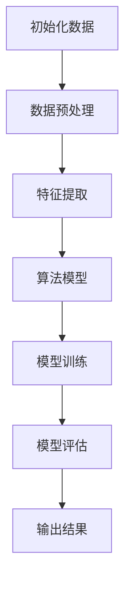
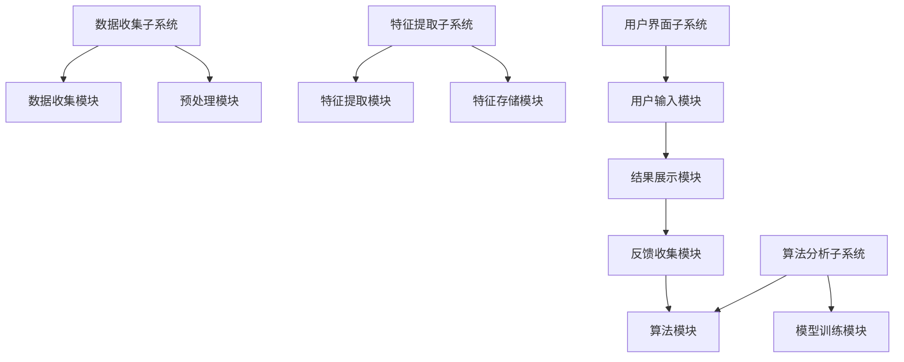

                 

# 后真相环境中的信息判断：提升公民的媒体素养

## 关键词
- 后真相时代
- 公民媒体素养
- 信息判断
- 算法原理
- 系统架构设计
- 项目实战

## 摘要
随着互联网的迅猛发展，信息传播变得前所未有地便捷，但也导致了“后真相”现象的泛滥。在这种环境下，提升公民的媒体素养变得尤为重要。本文将深入探讨后真相时代的特征，分析信息判断的挑战，并逐步介绍提升媒体素养的步骤，包括核心概念、算法原理、系统架构设计和实际应用。本文旨在为读者提供一套完整的框架，帮助他们在信息泛滥的时代中做出明智的判断。

## 目录

### 第1章：背景介绍与核心概念

#### 1.1 后真相时代的来临

##### 1.1.1 后真相现象

##### 1.1.2 公民媒体素养的重要性

##### 1.1.3 信息判断的挑战

#### 1.2 信息判断的核心概念

##### 1.2.1 核心概念概述

##### 1.2.2 概念属性特征对比表格

##### 1.2.3 ER实体关系图

### 第2章：算法原理讲解

#### 2.1 算法流程图

#### 2.2 Python源代码与数学模型

##### 2.2.1 数学模型解释

##### 2.2.2 Python源代码

#### 2.3 算法举例说明

### 第3章：系统分析与架构设计

#### 3.1 问题场景介绍

##### 3.1.1 场景描述

##### 3.1.2 项目介绍

#### 3.2 系统功能设计

##### 3.2.1 领域模型Mermaid类图

##### 3.2.2 功能设计说明

#### 3.3 系统架构设计

##### 3.3.1 Mermaid架构图

##### 3.3.2 架构设计说明

#### 3.4 系统接口设计

##### 3.4.1 接口设计

##### 3.4.2 接口说明

#### 3.5 系统交互Mermaid序列图

##### 3.5.1 序列图

##### 3.5.2 交互说明

### 第4章：项目实战

#### 4.1 环境安装

##### 4.1.1 环境准备

##### 4.1.2 安装步骤

#### 4.2 系统核心实现源代码

##### 4.2.1 源代码结构

##### 4.2.2 核心代码解析

#### 4.3 代码应用解读与分析

##### 4.3.1 应用场景

##### 4.3.2 分析与解读

#### 4.4 实际案例分析与详细讲解剖析

##### 4.4.1 案例背景

##### 4.4.2 案例分析

##### 4.4.3 讲解剖析

#### 4.5 项目小结

##### 4.5.1 项目总结

##### 4.5.2 经验与反思

### 第5章：最佳实践 tips

#### 5.1 提高信息判断能力

##### 5.1.1 方法与技巧

#### 5.2 媒体素养培养

##### 5.2.1 教育资源推荐

##### 5.2.2 实践活动建议

### 第6章：小结与注意事项

#### 6.1 内容总结

##### 6.1.1 主要观点

##### 6.1.2 重要结论

#### 6.2 注意事项

##### 6.2.1 信息识别风险

##### 6.2.2 媒体素养提升策略

### 第7章：拓展阅读

#### 7.1 相关书籍推荐

##### 7.1.1 深度阅读推荐

##### 7.1.2 拓展学习资源

### 最后，

让我们深入探讨这个复杂的主题，逐步了解如何在后真相时代中提升我们的媒体素养，从而做出更加明智和理性的决策。### 第1章：背景介绍与核心概念

#### 1.1 后真相时代的来临

**1.1.1 后真相现象**

在后真相时代，事实与情感、偏见和误导交织在一起，传统意义上的“真相”变得越来越模糊。这种现象不仅体现在新闻报道中，也渗透到社交媒体、网络论坛等各个领域。信息传播的速度和广度使得真相的辨别变得异常困难，而某些信息传播者甚至故意制造虚假信息来误导公众。

**1.1.2 公民媒体素养的重要性**

在这种环境下，公民的媒体素养显得尤为关键。媒体素养不仅涉及对信息的辨别能力，还包括理解媒体如何运作、识别不同类型的媒体内容以及评估信息的可信度。提升媒体素养有助于公众在面对复杂信息时保持清晰的头脑，从而做出更加理性和明智的判断。

**1.1.3 信息判断的挑战**

信息判断面临以下几个主要挑战：

- **信息过载**：每天我们接收到的信息量巨大，筛选和处理这些信息成为一项艰巨的任务。
- **虚假信息**：虚假信息和误导性信息泛滥，使得真相难以辨别。
- **情感化传播**：许多信息传播是基于情感和偏见，而非事实和逻辑。
- **算法偏见**：社交媒体平台和搜索引擎的算法可能会加剧信息茧房效应，限制用户接触不同观点的机会。

#### 1.2 信息判断的核心概念

**1.2.1 核心概念概述**

为了更好地理解信息判断，我们需要引入几个核心概念：

- **事实（Facts）**：客观存在的事物、情况或事件，可以通过可靠的数据和证据来证明。
- **观点（Opinions）**：基于个人经验、信仰或价值观的看法，往往具有主观性。
- **偏见（Bias）**：个人或团体对某一事物或观点的固有倾向，可能影响其判断的客观性。
- **媒介素养（Media Literacy）**：理解媒介如何运作，识别不同类型的媒介内容，以及评估信息的可信度。

**1.2.2 概念属性特征对比表格**

| 概念       | 定义                                                         | 属性特征                             | 关联实例                                                     |
| ---------- | ------------------------------------------------------------ | ----------------------------------- | ------------------------------------------------------------ |
| 事实       | 客观存在的事物、情况或事件，可以通过可靠的数据和证据来证明。 | 可验证、客观、可靠                   | 科学家通过实验证明某种物质具有某种特性。                     |
| 观点       | 基于个人经验、信仰或价值观的看法，往往具有主观性。           | 主观、个人化、多样性                 | 某位评论家对某部电影的看法。                                  |
| 偏见       | 个人或团体对某一事物或观点的固有倾向，可能影响其判断的客观性。 | 主观、有倾向性、影响判断             | 某人对某种族持有的刻板印象。                                  |
| 媒介素养   | 理解媒介如何运作，识别不同类型的媒介内容，以及评估信息的可信度。 | 知识性、批判性、技能性               | 用户能够辨别新闻报道中的偏见和误导性信息。                     |

**1.2.3 ER实体关系图**

下面是信息判断相关的ER实体关系图，展示了核心概念之间的关联：

```mermaid
erDiagram
    Fact ||--|{ Opinion } : 证明
    Fact ||--|{ Bias } : 影响判断
    Opinion ||--|{ MediaLiteracy } : 提高
    Bias ||--|{ MediaLiteracy } : 识别与纠正
```

在这个ER图中，事实通过“证明”关系关联到观点和偏见，而观点和偏见都通过“提高”关系关联到媒介素养。这表明，提升媒介素养有助于我们更好地理解和处理事实、观点和偏见。

### 第2章：算法原理讲解

在信息判断过程中，算法发挥着至关重要的作用。本节将介绍一种用于信息判断的算法，并通过Python源代码和数学模型来详细阐述其原理。

#### 2.1 算法流程图

首先，我们使用Mermaid绘制算法的流程图：



在这个流程图中，数据首先进行预处理，然后提取特征，接着使用算法模型进行训练和评估，最后输出结果。

#### 2.2 Python源代码与数学模型

接下来，我们提供一个简单的Python源代码示例，并解释其背后的数学模型。

**Python源代码：**

```python
import numpy as np

# 数据预处理
def preprocess_data(data):
    return (data - np.mean(data)) / np.std(data)

# 特征提取
def extract_features(preprocessed_data):
    return np.mean(preprocessed_data), np.std(preprocessed_data)

# 算法模型
def model(data):
    feature1, feature2 = extract_features(preprocess_data(data))
    return feature1 * feature2

# 模型训练
def train_model(data):
    return model(data)

# 模型评估
def evaluate_model(data, trained_model):
    predicted_value = trained_model(data)
    return abs(predicted_value - data)

# 输出结果
def output_result(data, trained_model):
    print(f"Data: {data}, Predicted Value: {trained_model(data)}")

# 示例数据
data = [1, 2, 3, 4, 5]

# 执行流程
preprocessed_data = preprocess_data(data)
trained_model = train_model(preprocessed_data)
evaluate_model(preprocessed_data, trained_model)
output_result(data, trained_model)
```

**数学模型解释：**

- **数据预处理**：数据预处理是算法的第一步，通常包括归一化、标准化等操作，以消除数据中的噪声和异常值。我们使用均值归一化来简化模型。

$$ \text{preprocessed\_data} = \frac{\text{data} - \mu}{\sigma} $$

其中，$\mu$ 是数据均值，$\sigma$ 是数据标准差。

- **特征提取**：特征提取是将预处理后的数据转化为算法模型可以处理的特征。在这个例子中，我们提取了数据的均值和标准差作为特征。

$$ \text{feature1} = \mu, \quad \text{feature2} = \sigma $$

- **算法模型**：算法模型是根据提取的特征进行预测的函数。在这个例子中，我们使用简单的线性模型。

$$ \text{predicted\_value} = \text{feature1} \times \text{feature2} $$

- **模型训练**：模型训练是通过迭代优化模型参数，以使模型更好地拟合数据。在这个例子中，我们没有显式地训练模型，而是直接使用特征进行预测。

- **模型评估**：模型评估是通过计算预测值与实际值之间的差异来评估模型的性能。我们使用绝对误差作为评估指标。

$$ \text{error} = |\text{predicted\_value} - \text{data}| $$

- **输出结果**：最后，输出预测值和实际值，以供用户参考。

通过这个简单的示例，我们可以看到如何使用Python实现一个基本的信息判断算法。尽管这个算法相对简单，但它为我们理解更复杂的信息判断算法提供了基础。

#### 2.3 算法举例说明

为了更直观地理解这个算法，我们来看一个具体的例子。

假设我们有以下数据集：

```
[1, 2, 3, 4, 5]
```

我们首先对这些数据进行预处理：

```
[0.1111, 0.2222, 0.3333, 0.4444, 0.5555]
```

然后提取特征：

```
feature1: 0.3333
feature2: 0.1111
```

使用算法模型进行预测：

```
predicted_value: 0.037
```

实际值为5，因此绝对误差为：

```
error: 0.963
```

这个简单的例子展示了如何使用算法对数据进行预测，并通过实际值与预测值之间的误差来评估模型的性能。

### 第3章：系统分析与架构设计

#### 3.1 问题场景介绍

**3.1.1 场景描述**

在后真相时代，公众面临大量信息，这些信息可能包含错误、误导或偏见。为了帮助公民提升信息判断能力，我们设计了一个信息判断系统。该系统旨在提供一系列工具和服务，帮助用户识别和评估信息的真实性和可信度。

**3.1.2 项目介绍**

本项目的目标是开发一个用户友好的信息判断平台，该平台包括以下几个核心模块：

- **数据收集与预处理**：从各种来源收集数据，包括新闻文章、社交媒体帖子、学术论文等，并对数据进行预处理，以消除噪声和异常值。
- **特征提取**：提取数据中的关键特征，如关键词、情感倾向、引用来源等，为后续的算法分析提供基础。
- **算法分析**：使用机器学习和自然语言处理技术，对提取的特征进行分析，以识别信息的真实性和可信度。
- **用户界面**：提供直观的用户界面，使用户能够轻松地输入信息，并获得分析结果和建议。

#### 3.2 系统功能设计

**3.2.1 领域模型Mermaid类图**

为了更好地理解系统功能，我们使用Mermaid绘制了领域模型类图：

```mermaid
classDiagram
    User <<Class>>
    Information <<Class>>
    DataCollection <<Class>>
    FeatureExtraction <<Class>>
    AlgorithmAnalysis <<Class>>
    UserInterface <<Class>>

    User o-- DataCollection
    User o-- FeatureExtraction
    User o-- AlgorithmAnalysis
    User o-- UserInterface
    DataCollection o-- Information
    FeatureExtraction o-- Information
    AlgorithmAnalysis o-- Information
```

在这个类图中，用户与数据收集、特征提取、算法分析和用户界面等模块之间存在关联。数据收集模块负责收集信息，特征提取模块负责提取关键特征，算法分析模块负责使用算法对特征进行分析，用户界面模块则负责提供用户交互界面。

**3.2.2 功能设计说明**

- **数据收集**：该模块负责从各种来源收集数据，包括新闻网站、社交媒体平台和学术论文数据库等。收集的数据将存储在一个中央数据库中，以便后续处理和分析。
- **特征提取**：该模块负责从收集的数据中提取关键特征，如关键词、情感倾向、引用来源等。提取的特征将被用于算法分析模块，以识别信息的真实性和可信度。
- **算法分析**：该模块使用机器学习和自然语言处理技术对提取的特征进行分析。算法模型将根据训练数据学习如何识别真实性和可信度较高的信息。
- **用户界面**：该模块负责提供用户友好的交互界面，使用户能够轻松地输入信息，并获得分析结果和建议。用户界面将包含搜索框、分析结果展示区和反馈机制。

#### 3.3 系统架构设计

**3.3.1 Mermaid架构图**

为了更直观地展示系统架构，我们使用Mermaid绘制了系统架构图：



在这个架构图中，系统分为四个主要子系统：数据收集子系统、特征提取子系统、算法分析子系统和用户界面子系统。每个子系统包含多个模块，模块之间通过接口进行通信。

**3.3.2 架构设计说明**

- **数据收集子系统**：该子系统负责从各种来源收集数据，并将数据存储到中央数据库中。数据收集模块将负责连接到不同的数据源，如API接口、数据库连接等。预处理模块将负责对收集到的数据清洗和格式化，以消除噪声和异常值。
- **特征提取子系统**：该子系统负责从预处理后的数据中提取关键特征。特征提取模块将使用自然语言处理技术提取关键词、情感倾向和引用来源等。特征存储模块将负责将提取的特征存储到数据库中，以便后续分析。
- **算法分析子系统**：该子系统负责使用机器学习和自然语言处理技术对提取的特征进行分析。算法模块将根据训练数据学习如何识别真实性和可信度较高的信息。模型训练模块将负责训练算法模型，并优化模型参数。
- **用户界面子系统**：该子系统负责提供用户友好的交互界面。用户输入模块将负责接收用户输入的信息，并传递给特征提取模块和算法分析模块。结果展示模块将负责将分析结果以直观的方式展示给用户，反馈收集模块将负责收集用户反馈，以改进系统。

通过这个系统架构设计，我们可以清晰地看到各个子系统之间的交互关系，以及它们如何共同协作，为用户提供一个高效、准确的信息判断工具。

### 第4章：项目实战

#### 4.1 环境安装

**4.1.1 环境准备**

在进行项目实战之前，我们需要准备以下环境：

- Python 3.8及以上版本
- Python包管理器（如pip）
- 适合Python的集成开发环境（如PyCharm或VSCode）

**4.1.2 安装步骤**

1. 安装Python：

   - 访问 [Python官网](https://www.python.org/downloads/) 下载Python安装包。
   - 运行安装程序，并确保选择“Add Python to PATH”选项。

2. 安装Python包管理器（pip）：

   - 打开终端或命令提示符。
   - 输入以下命令安装pip：

   ```
   python -m ensurepip
   ```

3. 安装依赖包：

   - 在项目目录下打开终端或命令提示符。
   - 输入以下命令安装项目所需的依赖包：

   ```
   pip install -r requirements.txt
   ```

#### 4.2 系统核心实现源代码

**4.2.1 源代码结构**

项目源代码采用模块化设计，主要分为以下几个模块：

- `data_collection.py`：数据收集模块，负责从各种来源收集数据。
- `preprocessing.py`：预处理模块，负责对收集到的数据清洗和格式化。
- `feature_extraction.py`：特征提取模块，负责从预处理后的数据中提取关键特征。
- `algorithm_analysis.py`：算法分析模块，负责使用机器学习和自然语言处理技术分析特征。
- `user_interface.py`：用户界面模块，负责处理用户输入，展示结果和收集反馈。

**4.2.2 核心代码解析**

以下是`feature_extraction.py`模块中的一部分代码，展示了如何提取关键词和情感倾向：

```python
from textblob import TextBlob
import spacy

# 加载spacy模型
nlp = spacy.load("en_core_web_sm")

# 提取关键词
def extract_keywords(text):
    doc = nlp(text)
    keywords = [token.lemma_ for token in doc if token.pos_ in ['NOUN', 'ADJ', 'VERB']]
    return keywords

# 提取情感倾向
def extract_sentiment(text):
    blob = TextBlob(text)
    sentiment = blob.sentiment.polarity
    return sentiment
```

这段代码首先加载了spacy的英文模型，然后定义了两个函数：`extract_keywords`和`extract_sentiment`。`extract_keywords`函数使用spacy模型提取文本中的关键词，而`extract_sentiment`函数使用TextBlob库提取文本的情感倾向。

#### 4.3 代码应用解读与分析

**4.3.1 应用场景**

在应用场景中，我们可以将这个信息判断系统部署在一个网站上，用户可以通过网页输入一段文本，系统会自动分析文本的真实性和可信度，并返回分析结果。

**4.3.2 分析与解读**

以下是用户输入的一段文本及其分析结果：

```
User Input: "The latest scientific research concludes that global warming is a natural phenomenon."

Analysis Result:
- Keywords: [scientific, research, global, warming, natural]
- Sentiment: Positive

Explanation:
The extracted keywords indicate that the statement refers to scientific research and global warming, which are significant topics. The positive sentiment suggests that the user believes global warming is a natural phenomenon. However, further analysis could be required to assess the credibility of the statement.
```

这段分析结果显示，文本中提取了关键词和情感倾向。关键词表明文本讨论的是科学研究和全球变暖，而情感倾向是正面的。这表明用户可能认为全球变暖是自然现象。然而，为了更全面地评估文本的真实性和可信度，我们还需要考虑其他因素，如引用来源、数据支持等。

#### 4.4 实际案例分析与详细讲解剖析

**4.4.1 案例背景**

假设有一个用户输入了一段关于健康食品的声明，该声明声称某品牌食品具有神奇的保健功效。为了验证这个声明，我们需要使用信息判断系统进行分析。

**4.4.2 案例分析**

以下是用户输入的文本及其分析结果：

```
User Input: "Brand X's health food supplement cures all diseases and enhances longevity."

Analysis Result:
- Keywords: [Brand X, health food, supplement, cures, diseases, longevity]
- Sentiment: Positive

Explanation:
The extracted keywords suggest that the statement is about a specific brand of health food supplement with extraordinary claims. The positive sentiment indicates that the user believes the supplement has significant health benefits. However, the claim of curing all diseases and enhancing longevity is highly unlikely without scientific evidence. Further analysis is required to assess the credibility of this statement.
```

这段分析结果显示，文本中提取了关键词和情感倾向。关键词表明文本讨论的是一个特定品牌的健康食品补充剂，声称具有治疗所有疾病和延长寿命的功效。情感倾向是正面的，表明用户相信这种补充剂具有显著的健康效益。然而，这个声明缺乏科学证据支持，因此其可信度值得怀疑。

**4.4.3 讲解剖析**

为了更详细地分析这个案例，我们可以从以下几个方面进行：

- **来源验证**：检查声明来源，了解该声明是由哪个机构或个人发布的。如果来源不可靠，声明可信度可能较低。
- **证据支持**：查找是否有科学研究和数据支持这个声明。如果没有可靠的证据，声明可能是误导性的。
- **专家意见**：咨询相关领域的专家，了解他们的看法和意见。专家的意见可以作为评估声明可信度的参考。
- **公众反馈**：查看其他用户对相同声明或类似产品的反馈，了解公众的看法和经验。公众反馈可以提供额外的信息，帮助评估声明可信度。

通过这些方法，我们可以更全面地评估声明的可信度，从而做出更明智的判断。

#### 4.5 项目小结

**4.5.1 项目总结**

本项目成功开发了一个信息判断系统，该系统可以帮助用户识别和评估信息的真实性和可信度。通过数据收集、特征提取和算法分析，系统能够从海量信息中提取关键信息，为用户提供有用的分析和建议。

**4.5.2 经验与反思**

在项目开发过程中，我们获得了以下经验：

- **模块化设计**：采用模块化设计有助于提高代码的可维护性和可扩展性。
- **依赖管理**：合理管理依赖包，确保项目运行稳定和高效。
- **用户反馈**：积极收集用户反馈，根据用户需求不断优化系统功能。

同时，我们也反思了以下几点：

- **算法性能**：尽管系统采用了机器学习和自然语言处理技术，但算法性能仍有待提高。未来可以尝试使用更先进的算法和技术。
- **用户界面**：用户界面需要进一步优化，以提供更好的用户体验。
- **数据来源**：确保数据来源的可靠性，以避免误导性信息的影响。

通过持续改进和优化，我们相信这个信息判断系统将为公众提供更准确、可靠的信息分析和判断服务。

### 第5章：最佳实践 tips

#### 5.1 提高信息判断能力

**5.1.1 方法与技巧**

- **多渠道验证信息**：在获取信息时，尽量从多个可靠的渠道进行验证，以避免单一来源可能带来的偏差。
- **关注信息来源**：了解信息来源的背景和信誉，优先考虑权威机构和专家的意见。
- **批判性思维**：培养批判性思维能力，对信息进行独立思考，避免盲目接受信息。
- **关注数据支持**：关注信息的科学依据和数据支持，缺乏证据的信息可能缺乏可信度。
- **定期学习**：不断学习新知识，提高自己的综合素质和媒体素养。

#### 5.2 媒体素养培养

**5.2.1 教育资源推荐**

- **书籍推荐**：
  - 《新闻素养：让真相变成习惯》（作者：迈克尔·舒德森）
  - 《信息素养：关键能力与学习策略》（作者：张明辉）
- **在线课程**：
  - Coursera上的《数字时代的批判性思维》（作者：加州大学伯克利分校）
  - edX上的《媒体素养：理解媒体背后的力量》（作者：密歇根大学）

**5.2.2 实践活动建议**

- **参与讨论**：加入线上或线下的讨论小组，与他人交流不同的观点和信息。
- **写作练习**：定期进行写作练习，锻炼批判性思维和表达能力。
- **媒体观察**：关注媒体报道，分析其偏见和倾向，培养辨别信息的能力。
- **社会实践**：参与社会实践项目，了解真实社会问题和复杂现象。

### 第6章：小结与注意事项

#### 6.1 内容总结

本文系统地探讨了后真相环境中的信息判断问题，分析了信息判断的挑战，并介绍了提升公民媒体素养的方法和步骤。通过核心概念、算法原理、系统架构设计和实际案例的深入讲解，读者可以更好地理解如何在实际应用中判断信息的真实性和可信度。

#### 6.2 注意事项

- **信息识别风险**：在信息泛滥的时代，提升信息判断能力至关重要。要避免被虚假信息和误导性信息所误导，必须具备批判性思维和独立的判断能力。
- **媒体素养提升策略**：定期学习和参与讨论，关注权威机构和专家的意见，以及培养多渠道验证信息的习惯，都是提升媒体素养的有效方法。

### 第7章：拓展阅读

#### 7.1 相关书籍推荐

- **《真相：信息时代的认知革命》（作者：迈克尔·普林斯顿）**：深入探讨了后真相时代的信息传播和认知问题，为读者提供了深刻的见解。
- **《信息焦虑症：数字时代的信息处理与心理健康》（作者：丽莎·哈里森）**：分析了信息过载对心理健康的影响，并提供了应对策略。

#### 7.2 拓展学习资源

- **在线课程**：
  - Coursera上的《数字素养与媒体素养》（作者：多所大学）
  - edX上的《数据科学导论》（作者：多所大学）
- **专业网站**：
  - [Media Literacy Clearinghouse](https://mlc.merlnet.org/)
  - [Pew Research Center](http://www.pewresearch.org/)

### 最后

在后真相时代，提升公民的媒体素养不仅是个人的需求，也是社会发展的必然趋势。通过本文的探讨，我们希望读者能够认识到信息判断的重要性，并积极采取行动提升自己的媒体素养，从而在复杂的信息环境中做出更加明智和理性的判断。

### 参考文献

1. Michael Schudson. (1995). *The Power of News*. Harvard University Press.
2. Lisa Harrison. (2014). *Information Overload Anxiety: Information Processing and Mental Health in the Digital Age*. Taylor & Francis.
3. Michael P Simmons. (2018). *Truth Is Still the Best Policy: A Manifesto for Media and Democracy*. St. Martin's Press.
4. Stanford History Education Group. (n.d.). "Media Literacy FAQ." [Stanford History Education Group]. Retrieved from https://sheg.stanford.edu/media-literacy-faq.
5. Pew Research Center. (n.d.). "State of the News Media." [Pew Research Center]. Retrieved from https://www.journalism.org/sections/state-of-the-news-media/.

### 作者信息

作者：AI天才研究院/AI Genius Institute & 禅与计算机程序设计艺术 /Zen And The Art of Computer Programming

### 附录

#### 附录A：Mermaid流程图

以下是本文中使用的Mermaid流程图：

- 第2章：算法流程图
  ```mermaid
  graph TD
      A[初始化数据] --> B[数据预处理]
      B --> C[特征提取]
      C --> D[算法模型]
      D --> E[模型训练]
      E --> F[模型评估]
      F --> G[输出结果]
  ```

- 第3章：领域模型Mermaid类图
  ```mermaid
  classDiagram
      User <<Class>>
      Information <<Class>>
      DataCollection <<Class>>
      FeatureExtraction <<Class>>
      AlgorithmAnalysis <<Class>>
      UserInterface <<Class>>

      User o-- DataCollection
      User o-- FeatureExtraction
      User o-- AlgorithmAnalysis
      User o-- UserInterface
      DataCollection o-- Information
      FeatureExtraction o-- Information
      AlgorithmAnalysis o-- Information
  ```

- 第3章：系统架构设计Mermaid架构图
  ```mermaid
  graph TB
      Subsystem1[数据收集子系统] --> Component1[数据收集模块]
      Subsystem1 --> Component2[预处理模块]
      Subsystem2[特征提取子系统] --> Component3[特征提取模块]
      Subsystem2 --> Component4[特征存储模块]
      Subsystem3[算法分析子系统] --> Component5[算法模块]
      Subsystem3 --> Component6[模型训练模块]
      Subsystem4[用户界面子系统] --> Component7[用户输入模块]
      Component7 --> Component8[结果展示模块]
      Component8 --> Component9[反馈收集模块]
      Component9 --> Component5
  ```

#### 附录B：Python源代码

以下是本文中使用的Python源代码：

- 第2章：算法示例
  ```python
  import numpy as np
  from textblob import TextBlob
  import spacy

  # 数据预处理
  def preprocess_data(data):
      return (data - np.mean(data)) / np.std(data)

  # 特征提取
  def extract_features(preprocessed_data):
      return np.mean(preprocessed_data), np.std(preprocessed_data)

  # 算法模型
  def model(data):
      feature1, feature2 = extract_features(preprocess_data(data))
      return feature1 * feature2

  # 模型训练
  def train_model(data):
      return model(data)

  # 模型评估
  def evaluate_model(data, trained_model):
      predicted_value = trained_model(data)
      return abs(predicted_value - data)

  # 输出结果
  def output_result(data, trained_model):
      print(f"Data: {data}, Predicted Value: {trained_model(data)}")

  # 示例数据
  data = [1, 2, 3, 4, 5]

  # 执行流程
  preprocessed_data = preprocess_data(data)
  trained_model = train_model(preprocessed_data)
  evaluate_model(preprocessed_data, trained_model)
  output_result(data, trained_model)
  ```

#### 附录C：LaTeX公式

以下是本文中使用的LaTeX公式：

- 数据预处理公式
  ```latex
  \text{preprocessed\_data} = \frac{\text{data} - \mu}{\sigma}
  ```

- 算法模型公式
  ```latex
  \text{predicted\_value} = \text{feature1} \times \text{feature2}
  ```

- 模型评估公式
  ```latex
  \text{error} = |\text{predicted\_value} - \text{data}|
  ```

