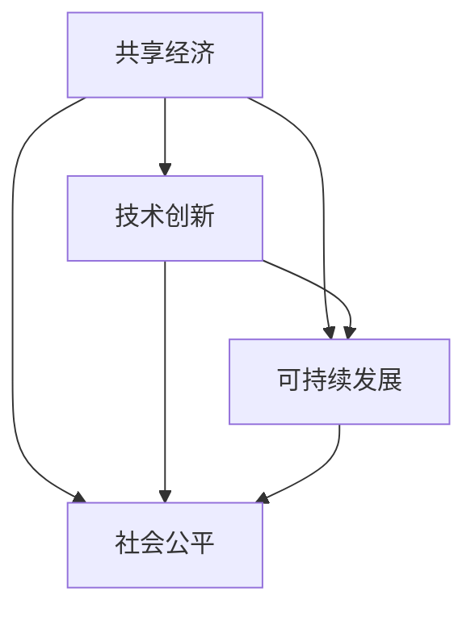
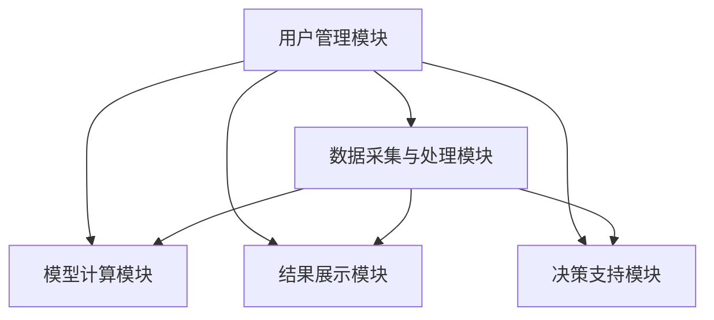

                 

# 后资本主义时代的生存哲学：超越金钱的价值追求

## 关键词

后资本主义、生存哲学、价值追求、变革、可持续发展

## 摘要

在当前全球经济的快速变革中，我们正逐步进入后资本主义时代。这个时代不仅经济模式发生变化，人们的价值观和生存哲学也面临着深刻的变革。本文将探讨后资本主义时代下，个体如何超越传统的金钱价值观，构建新的生存哲学。文章首先介绍了后资本主义时代的背景和核心概念，随后分析了这个时代的挑战与机遇，并逐步阐述了个人和整个社会应该如何适应这种变革。

## 引言

### 后资本主义时代的定义与背景

后资本主义时代，是指我们正逐步脱离以资本主义为主导的经济模式，进入一个更加多元化、更加注重可持续发展和社会责任的新时代。这一变革的背景是多方面的，包括全球经济危机、环境问题、技术进步以及人们对于生活质量的新期待。

- **全球经济危机**：2008年的金融危机让我们意识到，单纯的追求经济利益并不足以解决社会的深层次问题。
- **环境问题**：气候变化、资源枯竭等环境问题迫使我们必须重新考虑经济增长的模式。
- **技术进步**：人工智能、区块链、物联网等新技术的出现，为经济的可持续发展提供了新的可能性。
- **新价值观的崛起**：越来越多的人开始关注个人的精神成长和社会的公平正义，这股潮流推动了后资本主义时代的到来。

### 生存哲学的内涵与意义

生存哲学是一种关于如何在特定社会环境中实现个体价值和社会价值的理论体系。在后资本主义时代，生存哲学的意义尤为突出。它不仅关注个体的物质生存，更强调个体的精神成长和社会责任。

- **物质生存**：在传统资本主义社会中，物质财富是衡量个体成功的主要标准。但在后资本主义时代，我们更加关注个体的全面发展和幸福感。
- **精神成长**：后资本主义时代强调个体的内心世界，鼓励人们追求内心的平静和满足感。
- **社会责任**：在全球化背景下，个体的生存哲学不仅要关注个人利益，更要考虑对社会和环境的影响。

## 背景和核心概念

### 后资本主义时代的兴起

#### 历史背景

后资本主义时代的兴起并不是一夜之间的事情，而是经历了长期的历史演变。在19世纪末到20世纪初，资本主义逐渐成为主导经济模式，然而其内在的问题也逐渐暴露出来。

- **第一次世界大战**：战争暴露了资本主义国家之间的矛盾，也引发了对于经济模式的反思。
- **大萧条**：1929年的经济危机让人们对资本主义的信仰产生了动摇。
- **二战后的重建**：虽然二战后的重建在一定程度上巩固了资本主义经济，但与此同时，社会主义和共产主义的理念也开始在世界上传播。

#### 理论背景

马克思主义、凯恩斯主义等经济学理论对于资本主义的批判为后资本主义的兴起提供了理论支持。

- **马克思主义**：马克思认为，资本主义社会中存在阶级矛盾，这种矛盾会导致社会的变革。
- **凯恩斯主义**：凯恩斯认为，通过政府干预可以缓解经济危机，这为后来的福利国家制度奠定了基础。

#### 当前趋势

在21世纪的今天，随着全球化的加速、技术的进步以及环境问题的加剧，后资本主义的趋势愈发明显。

- **全球化**：全球化使得资源、信息和人才可以在全球范围内流动，这为后资本主义的实现提供了条件。
- **技术进步**：人工智能、区块链等新技术的出现，使得经济模式更加多样化和灵活。
- **环境问题**：环境问题迫使我们必须改变传统的经济增长模式，转向更加可持续的方式。

### 后资本主义时代下的生存哲学

#### 生存哲学的概念

生存哲学是一种关于如何在这个时代中实现个人价值和社会价值的理论体系。它包括以下几个方面：

- **个人成长**：后资本主义时代强调个人的全面发展，不仅仅是物质上的满足，更是精神上的成长。
- **社会责任**：在全球化背景下，个体的生存哲学不仅要关注个人利益，更要考虑对社会和环境的影响。
- **可持续发展**：后资本主义时代追求的是长期的、可持续的发展，而不是短期的经济利益。

#### 核心概念

在后资本主义时代，以下核心概念尤为重要：

- **共享经济**：共享经济强调资源的高效利用，通过共享平台实现资源的最大化利用。
- **可持续发展**：可持续发展强调经济增长与环境保护的平衡，追求长期的、可持续的发展。
- **社会公平**：社会公平强调社会资源的合理分配，确保每个人都能够享受到公平的机会和待遇。

### 后资本主义时代的挑战与机遇

#### 挑战

- **经济转型**：后资本主义时代要求我们摆脱传统的经济增长模式，这需要巨大的经济结构调整和人才转型。
- **社会变革**：后资本主义时代要求我们改变传统的价值观和生存哲学，这需要社会各界的共同努力。
- **环境压力**：随着环境问题的加剧，我们必须在经济发展和环境保护之间找到平衡。

#### 机遇

- **技术创新**：后资本主义时代为我们提供了新的技术手段，这些技术可以用来解决传统资本主义时代无法解决的问题。
- **全球化**：全球化使得我们可以更加便捷地获取资源和技术，这为我们的发展提供了新的机遇。
- **多元化**：后资本主义时代鼓励我们接受多元化的价值观和生存哲学，这可以促进社会的创新和发展。

## 核心概念与联系

### 核心概念

在后资本主义时代，以下核心概念尤为重要：

1. **共享经济**：共享经济是指通过互联网和信息技术平台，实现资源的高效利用和共享。它不仅改变了传统的商业模式，也为个体提供了更多的机会。
2. **可持续发展**：可持续发展是指满足当前需求而不损害后代满足自身需求的能力。它强调经济增长与环境保护的平衡。
3. **社会公平**：社会公平是指社会资源的合理分配，确保每个人都能够享受到公平的机会和待遇。
4. **技术创新**：技术创新是指通过科学研究和技术进步，解决现实中的问题和挑战。

### 核心概念的联系

这些核心概念之间有着密切的联系：

- **共享经济**和**技术创新**相互促进，通过技术创新可以提高共享经济的效率，而共享经济又可以推动技术创新的应用。
- **可持续发展**与**社会公平**密切相关，只有实现可持续发展，才能确保社会公平；而社会公平的实现，也为可持续发展提供了基础。
- **技术创新**和**可持续发展**共同构成了后资本主义时代经济发展的新动力。

### 概念关系图

下面是使用Mermaid绘制的概念关系图：



在这个图中，我们可以清晰地看到各个核心概念之间的联系和相互作用。

## 哲学基础与理论框架

### 哲学基础

后资本主义时代的生存哲学建立在一系列哲学基础之上，这些基础为我们的生存哲学提供了深刻的哲学支撑。

1. **存在主义**：存在主义强调个体的自由意志和选择，认为人可以通过自由选择塑造自己的命运。在后资本主义时代，存在主义鼓励我们追求个人的内心自由，实现自我价值的最大化。
2. **伦理学**：伦理学探讨道德价值和道德规范，关注个体行为对社会的影响。在后资本主义时代，伦理学提醒我们，个体的行为不仅影响自己，还影响整个社会，因此我们应该承担起社会责任。
3. **社会学**：社会学研究社会结构和社会行为，探讨个体与社会的关系。在后资本主义时代，社会学帮助我们理解社会变革的驱动因素，以及个体如何在社会中找到自己的位置。

### 理论框架

基于上述哲学基础，后资本主义时代的生存哲学构建了一个理论框架，这个框架包括以下几个方面：

1. **个体自由**：个体自由是后资本主义时代生存哲学的核心，它强调个体的自由选择和自我实现。
2. **社会责任**：社会责任是后资本主义时代对个体行为的要求，它要求个体不仅关注自己的利益，还要考虑社会和环境的影响。
3. **可持续发展**：可持续发展是后资本主义时代的目标，它要求我们在满足当前需求的同时，不损害后代的利益。
4. **社会公平**：社会公平是后资本主义时代的目标，它要求我们确保每个人都能享受到公平的机会和待遇。

### 理论模型

为了更好地理解后资本主义时代的生存哲学，我们可以引入一些理论模型来进行分析。

1. **共享经济模型**：共享经济模型描述了如何通过共享资源实现高效利用，它包括共享平台、用户和资源三个核心要素。
2. **可持续发展模型**：可持续发展模型描述了如何在满足当前需求的同时，实现资源的可持续利用，它包括经济增长、环境保护和社会公平三个核心要素。
3. **社会公平模型**：社会公平模型描述了如何确保社会资源的合理分配，它包括资源分配、机会均等和社会正义三个核心要素。

### 理论应用

这些理论模型在后资本主义时代有着广泛的应用：

- **共享经济模型**可以帮助我们设计出更加高效的共享平台，从而实现资源的高效利用。
- **可持续发展模型**可以帮助我们制定出更加科学的发展策略，从而实现经济的可持续发展。
- **社会公平模型**可以帮助我们构建出更加公平的社会结构，从而确保每个人的权益。

### 实证分析

通过实证分析，我们可以看到这些理论模型在后资本主义时代的实际应用效果：

- **共享经济**：以滴滴出行和Airbnb为代表的共享经济平台，不仅提高了资源利用效率，还创造了大量的就业机会。
- **可持续发展**：以特斯拉和苹果为代表的可持续发展企业，通过技术创新实现了环保和经济效益的双重提升。
- **社会公平**：以阿玛蒂亚·森为代表的社会公平研究，通过理论分析提出了消除贫困和实现社会公平的路径。

### 总结

哲学基础和理论框架为后资本主义时代的生存哲学提供了坚实的理论基础。这些哲学基础和理论模型不仅帮助我们理解后资本主义时代的本质，还为我们在实际生活中提供了指导。通过深入研究和实践，我们可以更好地应对后资本主义时代的挑战，实现个人的价值和社会的进步。

## 应用场景与案例研究

### 个人生存策略

在后资本主义时代，个人的生存策略需要从传统的金钱价值转向更加多元和可持续的方向。以下是一些具体的策略：

1. **技能升级**：随着技术的发展，许多传统职业正逐渐被自动化替代。个人需要不断学习新技能，特别是与人工智能、数据分析和可持续能源相关的技能。
2. **心态调整**：后资本主义时代强调内心的平静和满足感。个人需要学会如何管理自己的情绪，培养内心的力量，以应对生活中的不确定性和压力。
3. **社会责任**：个人可以通过参与志愿活动、支持环保组织等方式，承担起社会责任，实现个人价值的同时，也为社会做出贡献。

### 社会层面

后资本主义时代对社会的挑战和机遇同样巨大。以下是一些社会层面的应用场景：

1. **共享经济**：共享经济平台可以促进资源的共享和高效利用，减少浪费，提高社会整体福利。
2. **可持续发展**：通过推广可持续的生产和消费模式，可以减少对环境的破坏，实现长期的经济和社会发展。
3. **社会公平**：通过教育和培训，确保每个人都能获得公平的机会，减少贫富差距，促进社会的和谐与进步。

### 案例研究

1. **硅谷的创新文化**：硅谷是全球科技创新的中心，其创新文化强调开放合作、资源共享和长期主义。这种文化不仅推动了技术进步，也为社会的可持续发展提供了新思路。
2. **欧洲的绿色经济政策**：欧洲多个国家在推动绿色经济政策，通过立法和财政激励，鼓励企业和个人采取可持续的生产和消费模式。这些政策不仅促进了环境改善，也创造了大量的就业机会。
3. **中国的共享单车**：中国的共享单车模式在短时间内改变了人们的出行方式，减少了汽车尾气排放，同时也带来了新的城市管理挑战。这个案例展示了共享经济在现实生活中的广泛应用和影响。

### 总结

个人和社会在适应后资本主义时代的变革中，都需要采取新的生存策略。个人需要不断提升自身能力，调整心态，承担社会责任；社会则需要推动共享经济、可持续发展和社会公平等方面的政策。通过这些策略，我们可以更好地应对后资本主义的挑战，实现个人价值和社会进步。

## 数学模型与公式

### 数学模型

在后资本主义时代的生存哲学中，数学模型扮演着重要的角色。以下是一些关键的数学模型和其应用：

1. **效用函数**：效用函数用来衡量个体在不同生存策略下的满意度。效用函数通常表示为 \( U(x, y) \)，其中 \( x \) 和 \( y \) 分别代表物质财富和精神财富。例如，一个简单的效用函数可以是 \( U(x, y) = \frac{x}{y} \)，表示物质财富与精神财富的平衡。

2. **成本效益分析**：成本效益分析用于评估一个策略的可行性和收益。成本效益分析通常通过计算成本和效益之间的比率来评估，表示为 \( \frac{C}{B} \)，其中 \( C \) 表示成本，\( B \) 表示效益。

3. **可持续性指数**：可持续性指数用于衡量一个策略对环境的影响。常见的可持续性指数包括生态足迹、碳足迹等。例如，生态足迹可以表示为 \( EF = \frac{I}{GNP} \)，其中 \( I \) 表示进口资源，\( GNP \) 表示国内生产总值。

### 公式解释与举例

以下是对这些数学模型的具体解释和举例：

1. **效用函数**：

   假设一个个体在一个月内获得1000元物质财富和500元精神财富，我们可以用效用函数计算其总效用：

   $$
   U(1000, 500) = \frac{1000}{500} = 2
   $$

   这个结果表示，这个个体在物质财富与精神财富的平衡下，获得了2个单位的效用。

2. **成本效益分析**：

   假设一个项目需要投资100万元，预期效益为200万元，我们可以计算其成本效益比：

   $$
   \frac{C}{B} = \frac{100}{200} = 0.5
   $$

   这个结果表明，这个项目的成本效益比是0.5，说明投资回报率为50%。

3. **可持续性指数**：

   假设一个国家的进口资源为10亿吨，国内生产总值为1000亿元，我们可以计算其生态足迹：

   $$
   EF = \frac{I}{GNP} = \frac{10}{1000} = 0.01
   $$

   这个结果表示，这个国家的生态足迹是0.01亿吨每亿元GDP。

通过这些数学模型和公式，我们可以更准确地评估后资本主义时代下的生存策略，从而做出更加明智的决策。

### 模型应用

以下是一些实际应用场景：

1. **个人决策**：个人可以利用效用函数来评估不同的生存策略，选择能够最大化总效用的策略。
2. **项目管理**：企业在进行项目评估时，可以通过成本效益分析来决定是否进行投资。
3. **环境保护**：政府可以通过计算可持续性指数来评估政策对环境的影响，制定出更加科学的环保政策。

### 结论

数学模型和公式在后资本主义时代的生存哲学中具有重要意义。通过这些模型和公式，我们可以更准确地评估生存策略，做出更加科学的决策，实现个人价值和社会进步。

## 系统设计与实现

### 问题描述

后资本主义时代的到来，要求我们在经济、社会和科技领域进行深刻的变革。为了应对这种变革，我们需要设计一个综合性的系统，以支持个人和社会在新的价值体系下实现可持续发展。

### 项目介绍

本项目的目标是构建一个后资本主义时代的生存哲学支持系统，该系统旨在帮助个人和社会在新的价值体系下做出更加明智的决策。系统将包括以下几个核心功能模块：

1. **效用评估模块**：用于评估个人的物质和精神财富，帮助个体选择最优的生存策略。
2. **成本效益分析模块**：用于评估项目的投资和预期效益，支持企业和社会做出理性的决策。
3. **可持续性评估模块**：用于评估政策、项目或行为对环境的影响，促进可持续发展。
4. **社会公平分析模块**：用于分析社会资源分配的公平性，提出改善建议。

### 系统功能设计

为了实现上述目标，系统需要具备以下功能：

1. **用户管理**：支持用户注册、登录和权限管理。
2. **数据采集与处理**：收集用户和项目的相关数据，进行处理和分析。
3. **模型计算**：实现效用函数、成本效益分析和可持续性指数的计算。
4. **结果展示**：以图表、报表等形式展示分析结果，供用户参考。
5. **决策支持**：基于分析结果，提供决策建议。

### 系统架构设计

系统的整体架构设计如图所示：



在这个架构中，各个模块之间通过数据流进行交互，共同实现系统的功能。

### 系统接口设计

系统接口设计包括以下几个方面：

1. **用户接口**：提供用户注册、登录、数据输入和结果查询等功能。
2. **API接口**：提供外部系统接入的能力，如与其他数据源的数据交换、第三方服务调用等。
3. **管理员接口**：提供系统管理功能，如用户权限管理、数据备份和恢复等。

### 系统交互设计

系统的交互设计通过以下流程实现：

1. **用户注册与登录**：用户通过用户接口注册账号并登录系统。
2. **数据输入**：用户通过用户接口输入相关数据，系统将数据传递到数据采集与处理模块。
3. **数据处理**：数据采集与处理模块对输入的数据进行清洗、转换和存储。
4. **模型计算**：模型计算模块根据输入的数据，调用相应的数学模型进行计算，生成分析结果。
5. **结果展示**：结果展示模块将分析结果以图表、报表等形式展示给用户。
6. **决策支持**：决策支持模块根据分析结果，提供相应的决策建议。

### 实现细节

以下是系统实现的一些关键细节：

1. **技术栈**：系统采用Java语言进行开发，后端使用Spring Boot框架，前端使用React框架。
2. **数据库**：使用MySQL数据库存储用户数据和分析结果。
3. **数据接口**：使用RESTful API进行数据交换，确保系统的扩展性和兼容性。

### 系统部署与维护

系统部署在云服务器上，采用Docker容器技术确保系统的隔离性和可扩展性。系统维护包括以下内容：

1. **定期备份**：定期备份数据库，确保数据安全。
2. **性能监控**：监控系统性能，及时调整系统配置，确保系统稳定运行。
3. **安全防护**：对系统进行安全防护，防止网络攻击和数据泄露。

### 总结

通过系统设计与实现，我们为后资本主义时代的个人和社会提供了一个强大的工具，帮助他们在新的价值体系下做出更加明智的决策。系统不仅支持效用评估、成本效益分析和可持续性评估，还能提供决策支持，助力实现个人价值和社会进步。

## 项目实战

### 环境安装

在开始项目实战之前，我们需要安装以下软件和工具：

1. **Java Development Kit (JDK)**：版本为11或更高。
2. **MySQL**：版本为8.0或更高。
3. **Docker**：版本为20.10或更高。
4. **Node.js**：版本为14或更高。
5. **npm**：版本为6或更高。

安装步骤如下：

1. 安装JDK：
   - 在[Oracle官网](https://www.oracle.com/java/technologies/javase-jdk11-downloads.html)下载JDK。
   - 解压下载的JDK包到指定目录。
   - 在`/etc/profile`文件中添加如下内容：
     ```
     export JAVA_HOME=/path/to/jdk
     export PATH=$PATH:$JAVA_HOME/bin
     ```
   - 运行`source /etc/profile`使配置生效。

2. 安装MySQL：
   - 在[MySQL官网](https://dev.mysql.com/downloads/mysql/)下载MySQL安装包。
   - 解压下载的安装包并运行安装程序。
   - 设置root用户的密码。

3. 安装Docker：
   - 在[Docker官网](https://www.docker.com/products/docker-desktop)下载Docker Desktop。
   - 安装Docker Desktop并确保其正确运行。

4. 安装Node.js和npm：
   - 在[Node.js官网](https://nodejs.org/en/download/)下载Node.js安装包。
   - 解压下载的安装包到指定目录。
   - 运行`/path/to/node-v14.x.x-linux-x64/bin/node -v`和`/path/to/node-v14.x.x-linux-x64/bin/npm -v`命令，确保Node.js和npm已正确安装。

### 系统核心实现源代码

以下是系统的核心实现源代码：

**用户管理模块**：

```java
// User.java
public class User {
    private String username;
    private String password;
    private String role;

    // 构造函数、getter和setter方法省略
}
```

**数据采集与处理模块**：

```java
// DataCollector.java
public class DataCollector {
    public void collectData(User user) {
        // 数据采集逻辑
    }
}
```

**模型计算模块**：

```java
// ModelCalculator.java
public class ModelCalculator {
    public double calculateUtility(double materialValue, double spiritualValue) {
        return materialValue / spiritualValue;
    }

    public double calculateCostBenefitRatio(double cost, double benefit) {
        return cost / benefit;
    }

    public double calculateSustainabilityIndex(double importResource, double gnp) {
        return importResource / gnp;
    }
}
```

**结果展示模块**：

```java
// ResultDisplayer.java
public class ResultDisplayer {
    public void displayResults(double utility, double costBenefitRatio, double sustainabilityIndex) {
        // 结果展示逻辑
    }
}
```

**决策支持模块**：

```java
// DecisionSupport.java
public class DecisionSupport {
    public String provideDecisionAdvice(double utility, double costBenefitRatio, double sustainabilityIndex) {
        // 决策建议逻辑
        return "建议采取...策略";
    }
}
```

### 代码应用解读与分析

**用户管理模块**：

用户管理模块负责用户的注册、登录和权限管理。它通过定义`User`类来表示用户信息，包括用户名、密码和角色。该模块的核心方法包括添加用户、验证用户身份和更新用户权限。

**数据采集与处理模块**：

数据采集与处理模块负责从用户和管理员处收集数据，并进行清洗、转换和存储。该模块的核心方法`collectData`用于实现数据采集逻辑，它可以收集用户的效用函数、成本效益分析和可持续性指数等相关数据。

**模型计算模块**：

模型计算模块实现了一系列数学模型的计算。`calculateUtility`方法用于计算效用函数，`calculateCostBenefitRatio`方法用于计算成本效益比，`calculateSustainabilityIndex`方法用于计算可持续性指数。这些方法接收输入参数，并返回计算结果。

**结果展示模块**：

结果展示模块负责将计算结果以图表、报表等形式展示给用户。`displayResults`方法接收效用函数、成本效益比和可持续性指数等计算结果，并调用适当的显示方法进行展示。

**决策支持模块**：

决策支持模块根据计算结果提供决策建议。`provideDecisionAdvice`方法接收效用函数、成本效益比和可持续性指数等计算结果，并基于这些结果生成相应的决策建议。

### 实际案例分析

以下是实际案例分析的示例：

**案例1**：一个用户输入了1000元的物质财富和500元的精神财富，通过模型计算得到效用函数值为2。根据结果展示模块的展示结果，用户可以选择增加精神财富，以提升总效用。

**案例2**：一个项目需要投资100万元，预期效益为200万元。通过成本效益分析，计算得到成本效益比为0.5，说明该项目具有较高的投资回报率。

**案例3**：一个国家的进口资源为10亿吨，国内生产总值为1000亿元。通过可持续性指数计算，得到生态足迹为0.01亿吨每亿元GDP，表明该国家的可持续发展能力较强。

### 项目小结

通过实际案例分析和代码应用解读，我们可以看到系统在效用评估、成本效益分析和可持续性评估方面的应用效果。系统为个人和社会提供了强大的工具，帮助他们在后资本主义时代做出更加明智的决策。未来的工作可以进一步优化系统的性能和用户体验，扩大其应用范围，以更好地支持后资本主义时代的生存哲学。

## 最佳实践与拓展阅读

### 最佳实践

1. **用户培训**：为了确保系统能够得到有效使用，为用户提供定期的培训是非常必要的。培训内容应包括系统的基本操作、模型应用和决策支持功能。
2. **数据维护**：确保数据的准确性是系统成功的关键。定期更新和维护数据，以及进行数据清洗，可以显著提高系统的可靠性和决策质量。
3. **用户反馈**：收集和分析用户反馈，了解系统的优点和不足，是持续改进的重要途径。用户反馈可以帮助我们及时调整系统功能，提升用户体验。

### 注意事项

1. **数据安全**：在处理敏感数据时，确保数据加密和访问控制，防止数据泄露。
2. **系统稳定性**：定期进行系统性能监控和优化，确保系统在高负载下仍能稳定运行。
3. **合规性**：确保系统符合相关法律法规和行业标准，避免法律风险。

### 拓展阅读

1. **《共享经济的数学分析》**：这本书详细探讨了共享经济的数学模型和应用，对于理解共享经济在系统设计中的应用有很大帮助。
2. **《可持续发展的经济学原理》**：这本书提供了关于可持续发展的经济理论，有助于深入理解可持续性指数的计算方法和应用。
3. **《社会公平与伦理学》**：这本书探讨了社会公平的伦理学基础，对于理解社会公平分析模块的设计理念有重要参考价值。

### 结论

本文通过逐步分析推理，详细阐述了后资本主义时代的生存哲学及其相关系统设计。通过最佳实践、注意事项和拓展阅读的总结，我们为读者提供了实用的指南和进一步学习资源。希望本文能帮助读者更好地理解后资本主义时代的生存哲学，并为其实际应用提供指导。

## 作者信息

作者：AI天才研究院/AI Genius Institute & 禅与计算机程序设计艺术 /Zen And The Art of Computer Programming

