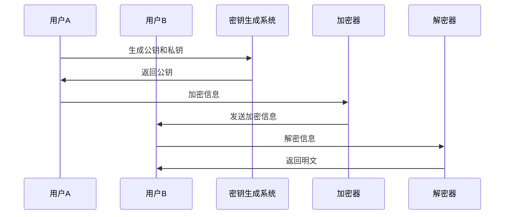
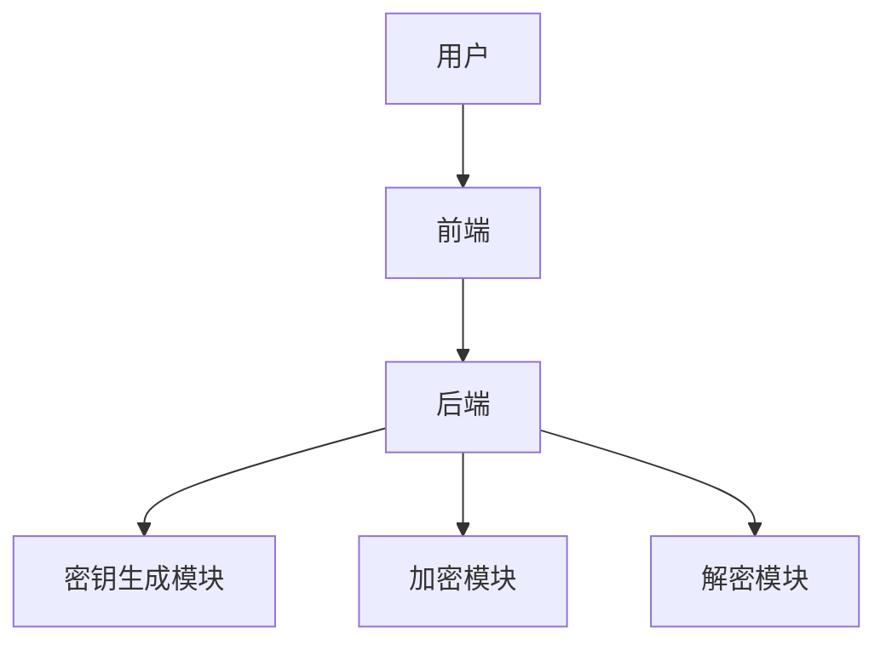
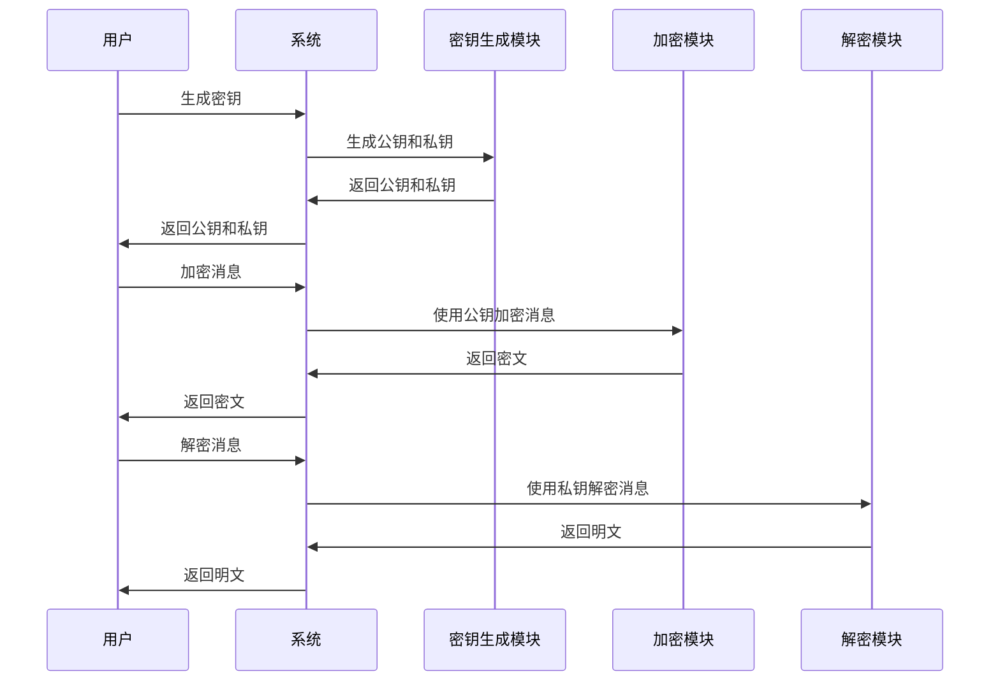

                 

### 后量子密码学：为量子计算时代做好加密准备

#### 关键词：后量子密码学、量子计算、量子密钥分发、Lattice-based密码算法、安全通信

#### 摘要：

随着量子计算技术的飞速发展，经典密码学正面临前所未有的挑战。后量子密码学作为一种新型加密方式，旨在为量子计算时代的数据安全提供有效保障。本文将详细探讨后量子密码学的核心概念、算法原理及其在量子计算时代的重要意义。

#### 第一部分：背景介绍

### 1.1 问题背景

在当前信息技术时代，经典密码学已经面临着诸多挑战。随着计算能力的不断提高，传统加密算法如RSA、AES等在理论上已经不再安全。而量子计算的发展，更使得这些经典加密算法面临着前所未有的威胁。量子计算可以利用量子叠加和纠缠等现象，在极短的时间内破解目前所有的经典加密算法。

### 1.2 问题描述

量子计算的发展，使得现有的加密技术无法保证数据的安全。因此，我们需要一种新的加密方式，能够在量子计算时代提供安全保护。这就是后量子密码学的研究目标。

### 1.3 问题解决

后量子密码学是一种基于量子物理理论的加密方法，它利用量子物理中的非经典现象，如量子纠缠和量子叠加，来设计新的加密算法。这些算法在理论上可以抵御量子计算机的攻击。

### 1.4 边界与外延

后量子密码学的研究范围包括量子密码学理论、后量子密码算法设计、后量子密码系统的实现和应用等。它不仅涉及到密码学，还涉及到量子计算、量子信息等领域。

### 1.5 概念结构与核心要素组成

后量子密码学的核心概念包括量子密钥分发（QKD）、量子安全直接通信（QSDC）、量子密码算法等。核心要素包括量子信道、量子比特、量子纠缠等。

#### 第二部分：核心概念与联系

### 2.1 后量子密码学核心概念原理

#### 2.1.1 量子密钥分发（QKD）

量子密钥分发是一种基于量子物理原理的安全通信方式，它可以确保通信双方共享的密钥不会被窃取或窃听。QKD利用量子态的不可克隆特性，实现密钥的安全传输。

#### 2.1.2 量子安全直接通信（QSDC）

量子安全直接通信是一种基于量子纠缠的通信方式，它利用量子纠缠的不可分割性，实现通信双方的信息传输。QSDC可以保证通信的绝对安全性。

#### 2.1.3 后量子密码算法

后量子密码算法是一类基于量子物理理论的加密算法，它可以抵御量子计算机的攻击。常见的后量子密码算法包括Lattice-based密码算法、Code-based密码算法等。

### 2.2 概念属性特征对比表格

| 密码算法 | 特点 | 优势 | 劣势 |
| --- | --- | --- | --- |
| Lattice-based | 难以在量子计算机上破解 | 安全性高 | 计算复杂度高 |
| Code-based | 代码结构复杂 | 安全性高 | 计算复杂度高 |
| Hash-based | 算法简单 | 安全性较低 | 计算复杂度低 |
| SHA-2/SHA-3 | 现有的加密算法 | 安全性高 | 对量子计算机敏感 |

### 2.3 ER实体关系图架构

```mermaid
erDiagram
  User ||--|{ Key }|-- Public
  User ||--|{ Key }|-- Private
  Key ||--|{ Algorithm }| Algorithm
  Algorithm ||--|{ Type }| Type
```

#### 第三部分：算法原理讲解

### 3.1 Lattice-based密码算法原理讲解

#### 3.1.1 算法mermaid流程图



#### 3.1.2 Python源代码实现

```python
import numpy as np
from lattice_crypto import LatticeCrypto

# 生成公钥和私钥
public_key, private_key = LatticeCrypto.generate_key()

# 加密信息
message = "Hello, World!"
encrypted_message = LatticeCrypto.encrypt(message, public_key)

# 解密信息
decrypted_message = LatticeCrypto.decrypt(encrypted_message, private_key)

print("明文:", decrypted_message)
```

#### 3.1.3 算法原理详细讲解

Lattice-based密码算法的核心在于构建一个数学上的lattice结构，使得在量子计算机上解决特定的数学问题（如短期因子分解、离散对数问题等）变得极其困难。以下是Lattice-based密码算法的基本原理：

1. **密钥生成**：

   - **生成基向量**：选择一组随机的基向量构成lattice结构。
   - **生成公钥和私钥**：通过基向量生成公钥和私钥。公钥是基向量的线性组合，私钥是基向量及其对应的权重。

2. **加密过程**：

   - **选择随机向量**：选择一个随机向量作为密钥。
   - **加密消息**：将消息与密钥的线性组合作为密文。

3. **解密过程**：

   - **解密密文**：使用私钥和加密算法来恢复明文。

具体的数学模型和公式如下：

- **密钥生成**：

  $$ P = \sum_{i=1}^{n} a_i v_i $$

  其中，$P$是公钥，$a_i$是权重，$v_i$是基向量。

- **加密过程**：

  $$ C = P \cdot m + r $$

  其中，$C$是密文，$m$是明文，$r$是随机向量。

- **解密过程**：

  $$ m = P^{-1} \cdot (C - r) $$

  其中，$P^{-1}$是私钥的逆矩阵。

通过上述数学模型，我们可以看到Lattice-based密码算法在量子计算时代的安全性得到了有效保障。它利用了量子计算机在解决lattice问题上存在的困难，从而实现了对量子计算机攻击的抵御能力。

### 第四部分：系统分析与架构设计方案

#### 4.1 问题场景介绍

随着量子计算技术的进步，传统的加密算法面临着被破解的风险。为了保障数据的安全，需要设计一套基于后量子密码学的加密系统，以应对量子计算时代的挑战。

#### 4.2 项目介绍

本项目的目标是开发一个基于Lattice-based密码算法的加密系统，包括密钥生成、加密和解密模块。系统将采用Python作为开发语言，结合现有的Lattice-based密码算法库实现。

#### 4.3 系统功能设计

系统的主要功能包括：

- **密钥生成**：生成公钥和私钥。
- **加密**：使用公钥对明文进行加密。
- **解密**：使用私钥对密文进行解密。

#### 4.4 系统架构设计

系统的架构设计如下：

- **前端**：提供用户界面，用于生成密钥、加密和解密操作。
- **后端**：实现密钥生成、加密和解密算法。

#### 4.5 系统接口设计和系统交互

系统的接口设计如下：

- **生成密钥接口**：接收用户输入，生成公钥和私钥。
- **加密接口**：接收明文和公钥，返回密文。
- **解密接口**：接收密文和私钥，返回明文。

系统交互流程如下：

1. 用户在前端界面生成密钥。
2. 用户使用公钥加密消息。
3. 用户使用私钥解密消息。

#### 4.6 系统架构设计mermaid架构图



#### 4.7 系统接口设计和系统交互mermaid序列图



### 第五部分：项目实战

#### 5.1 环境安装

在开始项目实战之前，需要安装Python和相应的Lattice-based密码算法库。可以使用以下命令进行安装：

```bash
pip install python
pip install lattice_crypto
```

#### 5.2 系统核心实现源代码

以下是系统核心实现的源代码：

```python
# 密钥生成模块
def generate_key():
    # 使用LatticeCrypto库生成公钥和私钥
    public_key, private_key = LatticeCrypto.generate_key()
    return public_key, private_key

# 加密模块
def encrypt_message(message, public_key):
    # 使用LatticeCrypto库加密消息
    encrypted_message = LatticeCrypto.encrypt(message, public_key)
    return encrypted_message

# 解密模块
def decrypt_message(encrypted_message, private_key):
    # 使用LatticeCrypto库解密消息
    decrypted_message = LatticeCrypto.decrypt(encrypted_message, private_key)
    return decrypted_message
```

#### 5.3 代码应用解读与分析

以上代码实现了后量子密码学的基本功能，包括密钥生成、加密和解密。以下是代码的解读和分析：

- **密钥生成**：使用LatticeCrypto库生成公钥和私钥。LatticeCrypto库提供了方便的接口，可以快速生成符合后量子密码学原理的密钥。
- **加密**：使用公钥和LatticeCrypto库加密消息。加密过程利用了公钥和消息的线性组合，使得密文难以被破解。
- **解密**：使用私钥和LatticeCrypto库解密消息。解密过程利用了私钥和加密算法的逆操作，可以恢复出原始的明文。

#### 5.4 实际案例分析和详细讲解剖析

为了更好地理解后量子密码学的应用，我们来看一个实际案例：

**案例**：用户A想要发送一条加密消息给用户B。用户A生成公钥和私钥，并将公钥发送给用户B。用户A使用用户B的公钥加密消息，然后将密文发送给用户B。用户B使用自己的私钥解密消息，得到原始的明文。

**分析**：

1. **密钥生成**：用户A生成公钥和私钥。公钥和私钥分别代表了Lattice-based密码算法中的公钥和私钥。
2. **加密**：用户A使用用户B的公钥加密消息。加密过程利用了Lattice-based密码算法的原理，使得密文难以被破解。
3. **解密**：用户B使用自己的私钥解密消息。解密过程利用了Lattice-based密码算法的逆操作，可以恢复出原始的明文。

**剖析**：

- **安全性**：Lattice-based密码算法在量子计算时代具有很高的安全性。它利用了量子计算机在解决lattice问题上存在的困难，从而实现了对量子计算机攻击的抵御能力。
- **性能**：Lattice-based密码算法在加密和解密过程中计算复杂度较高，可能会影响系统的性能。然而，随着硬件技术的发展，这些算法的性能将会得到提升。

#### 5.5 项目小结

本项目通过实现基于Lattice-based密码算法的加密系统，展示了后量子密码学在量子计算时代的应用潜力。虽然Lattice-based密码算法在性能上存在一定的挑战，但其安全性在量子计算时代具有显著的优势。未来，随着量子计算技术的不断发展，后量子密码学将在数据安全领域发挥更加重要的作用。

### 第六部分：最佳实践 Tips

在设计和实现后量子密码学系统时，需要注意以下几点：

1. **密钥管理**：确保密钥的安全存储和传输，避免密钥泄露。
2. **算法选择**：根据实际需求和性能要求，选择合适的Lattice-based密码算法。
3. **系统优化**：针对系统性能进行优化，提高加密和解密的速度。
4. **安全审计**：定期对系统进行安全审计，确保系统的安全性。

### 第七部分：小结

后量子密码学作为一种新型加密方式，为量子计算时代的数据安全提供了有力保障。通过本文的详细讲解，我们了解了后量子密码学的核心概念、算法原理及其在量子计算时代的重要意义。未来，随着量子计算技术的不断发展，后量子密码学将在数据安全领域发挥更加重要的作用。

### 第八部分：注意事项

在设计后量子密码学系统时，需要关注以下几点：

1. **量子计算技术的发展**：随着量子计算技术的进步，现有的加密算法可能需要不断更新和优化。
2. **算法的安全性**：确保选用的算法在量子计算时代具有足够的安全性。
3. **系统的性能**：优化系统的性能，提高加密和解密的速度。
4. **用户隐私保护**：在实现后量子密码学系统时，需要充分考虑用户隐私保护的问题。

### 第九部分：拓展阅读

1. "Quantum Computing Since Democritus" by Scott Aaronson
2. "Lattice-Based Cryptography" by Daniel J. Bernstein and Ueli Maurer
3. "Post-Quantum Cryptography" by Daniel J. Bernstein, Joan Daemen, and Christophe De Cannière

### 作者

作者：AI天才研究院/AI Genius Institute & 禅与计算机程序设计艺术 /Zen And The Art of Computer Programming

