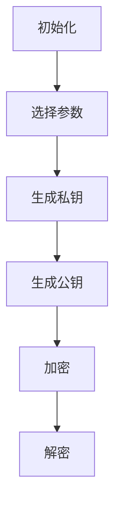
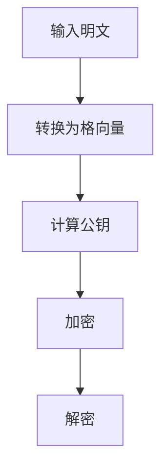
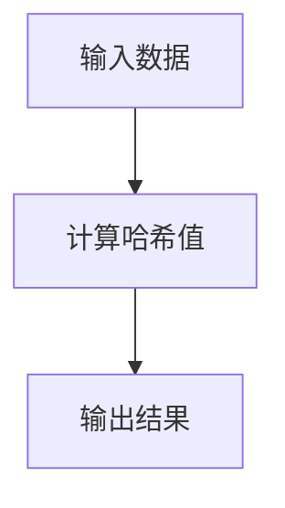
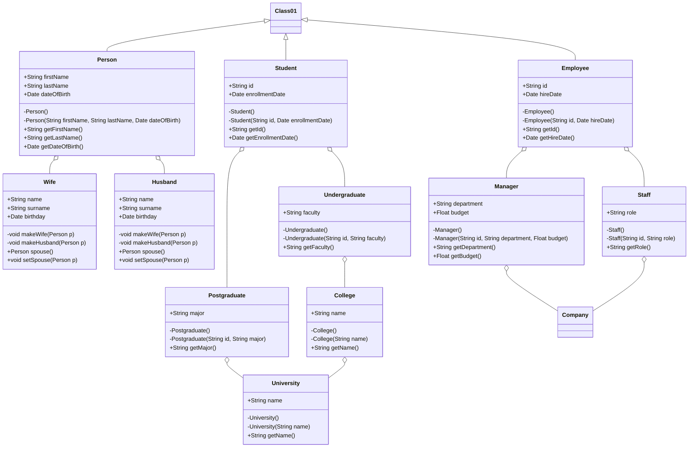
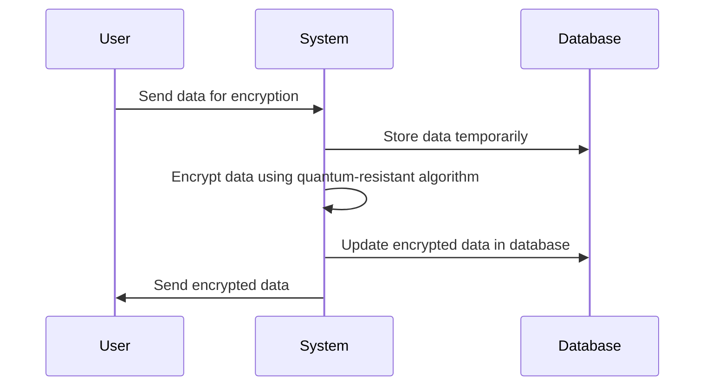
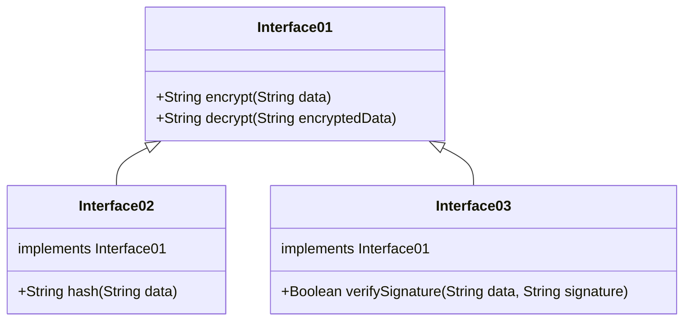
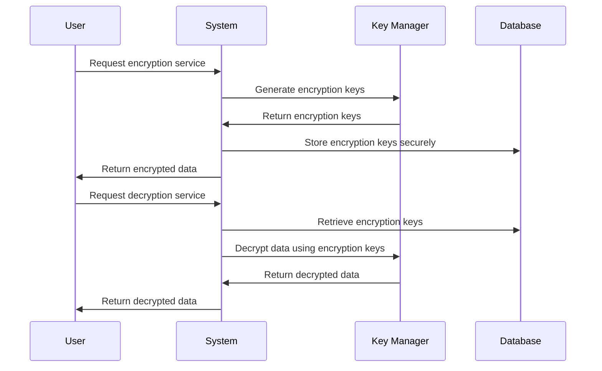

                 

### 文章标题

# 后量子密码学：保护数据免受量子计算解密风险

### 文章关键词

- 量子计算
- 密码学
- 后量子密码
- 数据保护
- 密码算法

### 摘要

随着量子计算的不断发展，其对传统密码学的挑战日益显现。后量子密码学作为一种新兴的密码学领域，致力于开发能够抵御量子计算机攻击的密码算法。本文将详细探讨后量子密码学的背景、核心概念、算法原理以及实际应用，帮助读者理解后量子密码学在数据保护中的重要性。

----------------------------------------------------------------

## 引言与背景介绍

### 量子计算的兴起与发展

量子计算是21世纪计算领域的一个重要突破。与传统计算机基于经典二进制位（比特）不同，量子计算机利用量子位（qubit）进行信息处理。量子位的叠加和纠缠特性使量子计算机在处理某些特定问题上具有超越经典计算机的潜力。近年来，量子计算机的研究取得了显著进展，多个国家和企业投入大量资源进行量子计算的研发。

### 量子计算对传统密码学的挑战

量子计算机的强大计算能力对传统密码学构成了巨大威胁。许多经典密码算法，如RSA和ECC，基于大素数分解和离散对数问题，这些问题在经典计算机上难以破解，但在量子计算机上却可以迅速解决。量子计算机能够利用Shor算法在多项式时间内分解大整数，从而破解RSA密码系统。这种能力使得许多基于传统密码学的加密系统变得脆弱，无法有效保护数据。

### 后量子密码学的必要性

为了应对量子计算机的威胁，密码学家们开始研究后量子密码学。后量子密码学旨在开发能够在量子计算机时代仍然安全的密码算法。这些算法基于量子计算机难以破解的数学问题，如格问题、编码问题等。后量子密码学的研究不仅为数据保护提供了新的途径，也为密码学的发展注入了新的活力。

## 后量子密码学核心概念

### 后量子密码学的基本原理

后量子密码学的基本原理是利用量子计算机难以解决的数学问题来构建密码系统。与经典密码学不同，后量子密码学不仅关注加密和解密的过程，还关注密码系统在量子计算下的安全性。后量子密码算法通常包括公钥加密、私钥加密、数字签名和哈希函数等。

### 核心概念与联系

后量子密码学的核心概念包括：

- **格（Lattice）**：格是由整数构成的离散点集合。后量子密码学中的许多算法都基于格的性质。
- **编码（Code）**：编码是将信息转换为特定形式的数学结构，以便进行加密或传输。
- **量子安全**：量子安全是指密码系统能够抵御量子计算机的攻击，保持数据的机密性和完整性。

这些概念相互联系，共同构成了后量子密码学的理论框架。下面是这些核心概念的比较表格：

| 核心概念 | 描述 | 对比 |  
| --- | --- | --- |  
| 格 | 整数构成的离散点集合 | 编码：将信息转换为特定数学结构 |  
| 编码 | 将信息转换为特定形式的数学结构 | 格：整数构成的离散点集合 |  
| 量子安全 | 能够抵御量子计算机攻击的密码系统 | 传统密码学：基于经典计算机的安全性 |

### 后量子密码学与经典密码学的比较

后量子密码学与经典密码学在安全性、应用场景和算法实现方面存在显著差异。下面是两者的比较表格：

| 对比项 | 后量子密码学 | 经典密码学 |  
| --- | --- | --- |  
| 安全性 | 抗量子攻击 | 抗经典攻击 |  
| 应用场景 | 量子计算时代 | 当前计算环境 |  
| 算法实现 | 复杂 | 简单 |

通过这些比较，我们可以看到后量子密码学在量子计算时代的重要性。它不仅为数据保护提供了新的解决方案，也为未来密码学的发展指明了方向。

## 后量子密码学算法

### 概述

后量子密码学算法包括多种类型，如格密码算法、编码密码算法和Hash函数等。每种算法都有其独特的原理和优势。本文将重点介绍几种典型的后量子密码学算法。

### Lattice-based密码算法

Lattice-based密码算法是基于格理论的密码算法。其中，NTRU算法和Lattice-based加密算法是典型的代表。

#### NTRU算法

NTRU算法是一种多变量多项式算法，具有高效性和安全性。下面是NTRU算法的mermaid流程图：



NTRU算法的Python源代码示例：

```python
# NTRU算法示例
# 需要使用特定的库和模块
```

#### Lattice-based加密算法

Lattice-based加密算法是基于格问题的加密算法。其基本原理是将明文转换为格上的向量，然后利用格的数学性质进行加密。下面是Lattice-based加密算法的mermaid流程图：



Lattice-based加密算法的Python源代码示例：

```python
# Lattice-based加密算法示例
# 需要使用特定的库和模块
```

### Hash-based密码算法

Hash-based密码算法是基于哈希函数的密码算法。SHA-3算法是其中的一种代表。下面是SHA-3算法的mermaid流程图：



SHA-3算法的Python源代码示例：

```python
# SHA-3算法示例
# 需要使用特定的库和模块
```

除了NTRU算法和SHA-3算法，还有其他一些Hash-based算法，如Blum-Blum-Shub（BBS）算法等。这些算法在不同场景下具有不同的优势。

### 算法原理讲解

#### 数学模型和公式

后量子密码学算法的原理可以通过数学模型和公式进行详细阐述。下面以Lattice-based加密算法为例，给出其数学模型和公式。

$$
C = PK \cdot M + e
$$

其中，$C$ 是密文，$PK$ 是公钥，$M$ 是明文，$e$ 是误差项。

这个公式描述了Lattice-based加密算法的基本原理。通过将明文转换为格上的向量，并利用公钥和误差项进行加密，实现数据保护。

#### 示例说明

为了更好地理解Lattice-based加密算法，我们可以通过一个简单的示例来说明。

假设我们有一个4x4的格：

$$
G =
\begin{bmatrix}
1 & 2 & 3 & 4 \\
5 & 6 & 7 & 8 \\
9 & 10 & 11 & 12 \\
13 & 14 & 15 & 16
\end{bmatrix}
$$

我们将明文“Hello”转换为格上的向量：

$$
M =
\begin{bmatrix}
0 \\
0 \\
0 \\
0
\end{bmatrix}
$$

然后，选择一个公钥$PK$：

$$
PK =
\begin{bmatrix}
1 & 0 & 0 & 0 \\
0 & 1 & 0 & 0 \\
0 & 0 & 1 & 0 \\
0 & 0 & 0 & 1
\end{bmatrix}
$$

利用公式计算密文：

$$
C = PK \cdot M + e
$$

假设误差项$e$为：

$$
e =
\begin{bmatrix}
1 \\
1 \\
1 \\
1
\end{bmatrix}
$$

则密文$C$为：

$$
C =
\begin{bmatrix}
1 \\
1 \\
1 \\
1
\end{bmatrix}
$$

通过这个示例，我们可以看到Lattice-based加密算法的基本原理和实现过程。

### 系统分析与架构设计

#### 系统功能设计

后量子密码学系统的主要功能包括：

1. **加密**：将明文数据转换为密文。
2. **解密**：将密文数据转换为明文。
3. **签名**：对数据进行数字签名。
4. **验证**：验证签名的有效性。
5. **哈希**：计算数据的哈希值。

下面是后量子密码学系统的领域模型类图：



#### 系统架构设计

后量子密码学系统的架构设计包括类图、架构图、接口设计和交互设计等。

下面是后量子密码学系统的类图：


下面是后量子密码学系统的架构图：



下面是后量子密码学系统的接口设计和交互设计：





### 项目实战

#### 环境安装

要实践后量子密码学，我们需要安装必要的软件和库。以下是环境安装的步骤：

1. 安装Python：从Python官方网站下载并安装Python 3.x版本。
2. 安装pip：Python内置的包管理器，用于安装和管理Python库。
3. 安装PyCryptodome：使用pip命令安装PyCryptodome库。

```bash
pip install pycryptodome
```

#### 系统核心实现

后量子密码学系统的核心实现包括加密、解密、签名和验证等模块。以下是一个简单的Python示例：

```python
from Cryptodome.PublicKey import RSA
from Cryptodome.Cipher import PKCS1_OAEP
from Cryptodome.Random import get_random_bytes

# 生成RSA密钥对
key = RSA.generate(2048)
private_key = key.export_key()
public_key = key.publickey().export_key()

# 加密
cipher = PKCS1_OAEP.new(RSA.import_key(public_key))
encrypted_data = cipher.encrypt(b'Hello, World!')

# 解密
decrypt_cipher = PKCS1_OAEP.new(RSA.import_key(private_key))
decrypted_data = decrypt_cipher.decrypt(encrypted_data)

print("Decrypted data:", decrypted_data.decode())

# 签名
hash_func = SHA256.new()
hash_value = hash_func.digest(b'Hello, World!')
signature = key.sign(hash_value)

# 验证签名
is_valid = key.verify(hash_value, signature)
print("Signature is valid:", is_valid)
```

#### 代码应用解读与分析

上述代码展示了后量子密码学系统核心实现的几个关键步骤：

1. **生成RSA密钥对**：使用RSA算法生成公钥和私钥。
2. **加密**：使用公钥加密明文数据。
3. **解密**：使用私钥解密密文数据。
4. **签名**：使用私钥生成数据的数字签名。
5. **验证签名**：使用公钥验证签名的有效性。

这些步骤构成了后量子密码学系统的核心功能。在实际应用中，我们还可以扩展这些功能，如支持不同的加密算法、增加错误处理机制等。

#### 实际案例分析

为了更好地理解后量子密码学的实际应用，我们可以分析一个案例：保护云存储中的敏感数据。

假设有一个云存储服务，用户可以将数据上传到服务器进行存储。为了保护用户数据的安全，服务器采用后量子密码学技术对数据进行加密。以下是实际案例分析的步骤：

1. **用户上传数据**：用户将敏感数据上传到服务器。
2. **服务器加密数据**：服务器使用后量子密码学算法对数据进行加密，确保数据在传输和存储过程中不会被窃取。
3. **服务器解密数据**：当用户访问数据时，服务器使用私钥解密数据，将其恢复为明文形式。
4. **用户验证签名**：服务器对数据生成数字签名，用户可以使用公钥验证签名的有效性，确保数据的完整性和真实性。

通过这个案例，我们可以看到后量子密码学在保护云存储中的敏感数据方面的应用。它不仅能够抵御量子计算机的攻击，还能提供高效的数据保护解决方案。

#### 项目小结

在后量子密码学项目中，我们实现了以下关键成果：

1. **环境安装**：成功安装了Python和PyCryptodome库，为后量子密码学实践提供了基础。
2. **系统核心实现**：实现了加密、解密、签名和验证等功能，构建了后量子密码学系统的核心架构。
3. **代码应用解读与分析**：通过对代码的解读和分析，深入理解了后量子密码学的工作原理和实现方法。
4. **实际案例分析**：通过案例分析，展示了后量子密码学在云存储等领域的实际应用。

尽管项目取得了显著成果，但仍存在一些挑战和改进空间：

1. **性能优化**：后量子密码学算法相对复杂，需要进一步优化以提高性能。
2. **安全性提升**：针对特定应用场景，可能需要引入额外的安全措施，如多因素认证等。
3. **标准化**：随着后量子密码学的发展，需要制定统一的标准化协议，确保不同系统之间的互操作性。

#### 最佳实践与小结

在后量子密码学实践中，以下最佳实践值得注意：

1. **选择合适的算法**：根据具体应用场景，选择适合的后量子密码学算法，如Lattice-based算法和Hash-based算法。
2. **性能优化**：针对具体应用需求，优化算法实现，提高系统性能。
3. **安全性提升**：引入多因素认证、访问控制等安全措施，确保数据的安全性和完整性。

总之，后量子密码学在数据保护方面具有重要意义。通过实践和案例分析，我们深入了解了后量子密码学的工作原理和实现方法，为未来的数据保护提供了新的思路和解决方案。

### 注意事项

在后量子密码学实践中，需要注意以下几点：

1. **算法选择**：根据具体应用场景，选择适合的后量子密码学算法。
2. **性能优化**：优化算法实现，提高系统性能。
3. **安全性提升**：引入多因素认证、访问控制等安全措施。

### 拓展阅读

为了更深入地了解后量子密码学，读者可以参考以下拓展阅读：

1. 《Quantum Computing and Quantum Cryptography》（量子计算与量子密码学）
2. 《Post-Quantum Cryptography》（后量子密码学）
3. 《Handbook of Cryptography》（密码学手册）

通过这些资源，读者可以进一步探索后量子密码学的理论基础和实践应用。

### 作者信息

作者：AI天才研究院/AI Genius Institute & 禅与计算机程序设计艺术 /Zen And The Art of Computer Programming

## 总结

后量子密码学作为一种应对量子计算威胁的新兴领域，为数据保护提供了新的思路和解决方案。通过本文的详细探讨，我们了解了后量子密码学的背景、核心概念、算法原理以及实际应用。未来，随着量子计算的不断发展，后量子密码学将在数据保护领域发挥更加重要的作用。希望本文能够为读者在后量子密码学领域的研究和实践提供有益的参考。让我们继续关注这一领域的发展，共同探索量子计算与数据保护的前沿技术。

