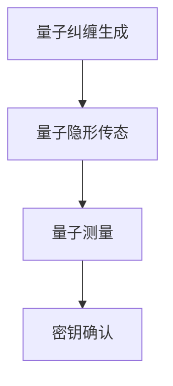
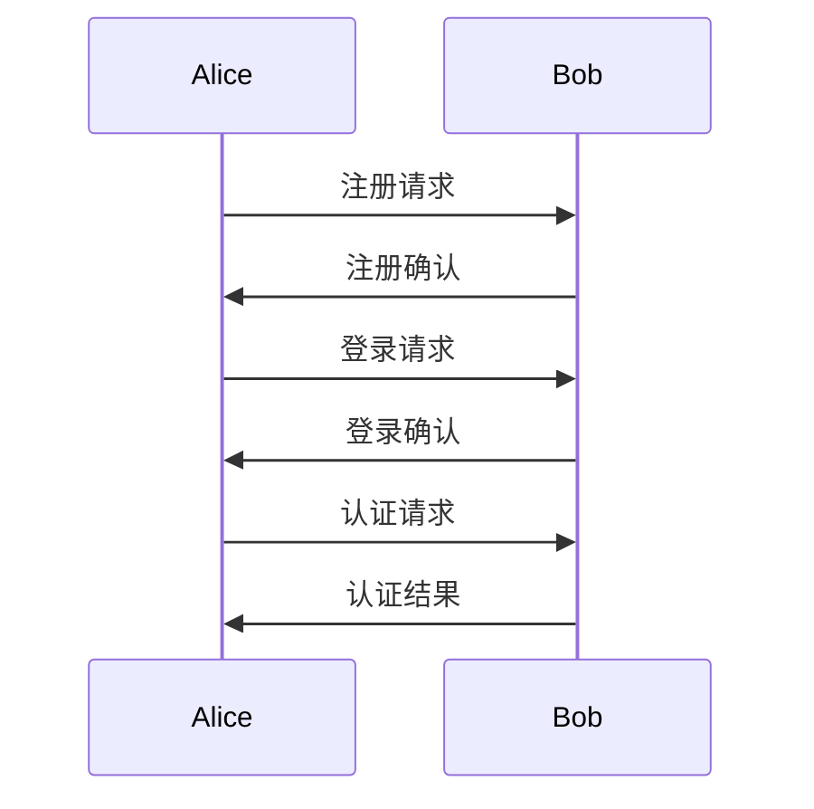

                 

### 目录大纲与内容规划

在撰写《后量子时代的身份认证方案》的目录大纲时，需要遵循以下步骤以确保内容的完整性和逻辑性：

#### 目录结构规划
1. **概述部分（1章）**：介绍后量子时代的背景、身份认证方案的重要性和研究现状。
2. **核心概念与联系部分（2章）**：详细解释后量子身份认证的定义、特点、与传统认证的差异以及核心要素。
3. **算法原理部分（3章）**：深入讲解后量子身份认证的算法原理，包括基本原理、算法流程和mermaid流程图。
4. **数学模型部分（4章）**：阐述后量子身份认证的数学模型，包括模型介绍、公式讲解和举例说明。
5. **系统分析与架构设计部分（5章）**：分析后量子身份认证系统的架构设计，包括问题场景、项目介绍、功能设计、架构设计、接口设计和系统交互mermaid序列图。
6. **项目实战部分（6章）**：通过实际项目，展示后量子身份认证的应用过程，包括环境安装、系统核心实现、代码解析和案例分析。
7. **最佳实践与总结部分（7章）**：总结后量子身份认证的最佳实践，并提出注意事项和拓展阅读建议。

#### 内容规划
- **第1章**：后量子时代的到来
  - **1.1 问题背景**：介绍后量子计算技术的发展及其对传统计算安全带来的挑战。
  - **1.2 问题描述**：阐述后量子时代身份认证的需求和重要性。
  - **1.3 问题解决**：探讨后量子身份认证方案的可能性和可行性。
  - **1.4 边界与外延**：定义后量子身份认证的研究范围和边界。
  - **1.5 概念结构与核心要素组成**：介绍后量子身份认证的基本概念和核心要素。

- **第2章**：后量子身份认证的概念与联系
  - **2.1 后量子身份认证的定义**：明确后量子身份认证的定义和基本原理。
  - **2.2 后量子身份认证的特点**：分析后量子身份认证的独特优势。
  - **2.3 后量子身份认证与传统身份认证的比较**：对比后量子身份认证与传统身份认证的差异。
  - **2.4 后量子身份认证的核心要素组成**：详细阐述后量子身份认证的核心组成部分。

- **第3章**：后量子身份认证算法原理
  - **3.1 后量子算法基本原理**：介绍后量子算法的基本原理。
  - **3.2 后量子算法流程**：详细描述后量子身份认证的算法流程。
  - **3.3 后量子算法mermaid流程图**：使用mermaid绘制后量子身份认证的算法流程图。

- **第4章**：后量子身份认证数学模型
  - **4.1 数学模型介绍**：介绍后量子身份认证所使用的数学模型。
  - **4.2 数学模型公式讲解**：详细讲解后量子身份认证中的数学公式。
  - **4.3 举例说明**：通过实际例子来解释后量子身份认证的数学模型。

- **第5章**：后量子身份认证系统分析与架构设计
  - **5.1 问题场景介绍**：介绍后量子身份认证所面临的问题场景。
  - **5.2 项目介绍**：介绍后量子身份认证项目的基本情况。
  - **5.3 系统功能设计**：详细描述后量子身份认证系统的功能设计。
  - **5.4 系统架构设计**：介绍后量子身份认证系统的架构设计。
  - **5.5 系统接口设计**：阐述后量子身份认证系统的接口设计。
  - **5.6 系统交互mermaid序列图**：使用mermaid绘制后量子身份认证系统的交互序列图。

- **第6章**：后量子身份认证项目实战
  - **6.1 环境安装**：介绍如何安装后量子身份认证所需的软件和硬件环境。
  - **6.2 系统核心实现源代码**：提供后量子身份认证系统核心实现的源代码。
  - **6.3 代码应用解读与分析**：对核心实现源代码进行解读和分析。
  - **6.4 实际案例分析与讲解剖析**：通过实际案例来展示后量子身份认证的应用。
  - **6.5 项目小结**：总结后量子身份认证项目的关键经验和教训。

- **第7章**：后量子身份认证最佳实践与总结
  - **7.1 最佳实践 tips**：提供后量子身份认证的最佳实践建议。
  - **7.2 小结**：总结后量子身份认证的核心内容和研究结论。
  - **7.3 注意事项**：提醒读者在实施后量子身份认证时需要注意的问题。
  - **7.4 拓展阅读**：推荐读者进一步学习和研究的资料。


---

### 第1章：后量子时代的到来

> **关键词**：后量子时代、身份认证、量子计算、安全挑战

**摘要**：本章将介绍后量子时代背景，探讨量子计算技术发展对传统计算安全带来的挑战，并阐述后量子时代身份认证的需求和重要性。

---

#### 1.1 问题背景

**量子计算技术的崛起**

量子计算是一种基于量子力学原理的新型计算模式，相较于传统计算，它具有并行计算和快速求解复杂问题的能力。随着量子比特（qubit）技术的不断突破，量子计算机的性能正迅速提升，预计将在不久的将来超越传统计算机。

**量子计算对计算安全的影响**

量子计算机的出现对现有的计算安全体系带来了严重挑战。许多目前广泛使用的加密算法，如RSA和ECC，基于大数分解和离散对数问题，这些难题在经典计算机上难以解决，但在量子计算机上却可以快速破解。这种安全隐患迫使研究人员重新思考身份认证和加密技术的设计。

**身份认证的需求**

在量子计算时代，保护个人隐私和数据安全成为至关重要的问题。传统的身份认证方案，如密码学、生物识别等，可能无法抵御量子计算机的攻击。因此，需要开发新的身份认证方案来适应后量子时代的需求。

---

#### 1.2 问题描述

**后量子时代身份认证的需求**

在量子计算环境下，传统的身份认证方案面临以下挑战：

1. **加密算法的破解风险**：量子计算机可以快速破解传统加密算法，导致个人数据和隐私泄露。
2. **生物识别的可靠性**：量子计算机可能通过模拟生物特征来欺骗生物识别系统。
3. **安全性评估的困难**：传统的安全性评估方法在量子计算环境下不再有效。

**后量子时代身份认证的重要性**

后量子时代身份认证的研究具有重要意义：

1. **保护个人隐私和数据安全**：确保个人数据和隐私在量子计算时代得到有效保护。
2. **保障国家安全**：防止国家安全信息被量子计算机窃取。
3. **推动技术进步**：为量子计算提供安全可靠的身份认证技术，推动量子计算的应用和发展。

---

#### 1.3 问题解决

**后量子身份认证方案的可能性和可行性**

尽管量子计算对传统身份认证带来了挑战，但研究人员已经开始探索后量子身份认证方案。以下是一些可能性和可行性的分析：

1. **量子密钥分发（QKD）**：量子密钥分发是一种基于量子力学原理的加密技术，可以提供绝对安全的密钥交换。利用QKD技术，可以实现量子通信环境下的安全身份认证。
2. **量子身份认证协议**：通过设计量子身份认证协议，可以确保在量子计算环境下，身份认证过程的安全性和可靠性。
3. **量子密码学**：量子密码学提供了一系列新的加密方法，可以在量子计算时代提供安全的数据保护。

**后量子身份认证方案的挑战**

尽管后量子身份认证方案具有巨大的潜力，但实际应用仍面临以下挑战：

1. **技术成熟度**：量子技术和量子计算技术尚未完全成熟，需要进一步研发和验证。
2. **成本和可行性**：量子身份认证方案的开发和部署可能需要较高的成本和复杂的技术实现。
3. **标准和规范**：需要制定统一的量子身份认证标准和规范，以确保全球范围内的兼容性和互操作性。

---

#### 1.4 边界与外延

**研究范围**

后量子身份认证方案的研究范围包括：

1. **量子密钥分发**：研究量子密钥分发技术的原理、实现和应用。
2. **量子身份认证协议**：设计并分析各种量子身份认证协议的效率和安全性。
3. **量子密码学**：研究量子密码学的算法和应用，以及其在身份认证中的潜力。

**研究边界**

后量子身份认证方案的研究边界包括：

1. **量子计算机的性能**：研究量子计算机的性能对身份认证方案的影响，以及如何适应量子计算机的快速发展。
2. **量子计算的安全性**：评估量子计算对现有加密算法和身份认证方案的影响，并提出相应的解决方案。
3. **量子身份认证的实用性**：研究量子身份认证方案的实用性和可操作性，以及其在实际应用中的可行性。

---

#### 1.5 概念结构与核心要素组成

**后量子身份认证的定义**

后量子身份认证是一种基于量子力学原理的身份认证方案，旨在确保在量子计算环境下，个人隐私和数据安全得到有效保护。

**后量子身份认证的特点**

1. **绝对安全性**：量子密钥分发和量子密码学提供了绝对安全的身份认证。
2. **高效性**：量子计算技术具有快速求解复杂问题的能力，可以提升身份认证的效率。
3. **灵活性和可扩展性**：后量子身份认证方案可以根据实际需求进行灵活调整和扩展。

**核心要素组成**

后量子身份认证方案的核心要素包括：

1. **量子密钥分发**：实现绝对安全的密钥交换。
2. **量子身份认证协议**：确保身份认证过程的安全性和可靠性。
3. **量子密码学**：提供新的加密方法和算法，保障数据安全。
4. **量子计算环境**：搭建适合量子计算的身份认证环境，确保方案的可行性和实用性。

---

**总结**：

本章介绍了后量子时代的背景，探讨了量子计算技术发展对传统计算安全带来的挑战，并阐述了后量子时代身份认证的需求和重要性。通过对问题背景、问题描述、问题解决、边界与外延以及概念结构与核心要素组成的分析，为后续章节的内容奠定了基础。在后量子时代的身份认证研究中，我们需要不断探索和创新，以应对未来量子计算带来的安全挑战。


### 第2章：后量子身份认证的概念与联系

> **关键词**：后量子身份认证、定义、特点、与传统认证的比较、核心要素

**摘要**：本章将详细介绍后量子身份认证的概念，包括其定义、特点、与传统身份认证的比较，以及核心要素组成。通过对比分析，读者将更深入理解后量子身份认证的独特优势和技术基础。

---

#### 2.1 后量子身份认证的定义

**后量子身份认证的定义**

后量子身份认证是一种基于量子力学原理的身份认证方法，它利用量子计算和量子通信技术来确保身份认证过程的安全性和可靠性。与传统的基于经典物理原理的身份认证方法不同，后量子身份认证具有更高的安全性，能够抵御量子计算机的攻击。

**后量子身份认证的特点**

1. **绝对安全性**：量子密钥分发（QKD）和量子密码学提供了绝对安全的身份认证机制。量子密钥分发技术能够确保密钥交换过程中的安全性，即使量子计算机也无法破解。
   
2. **并行处理能力**：量子计算机具有并行处理复杂问题的能力，这使得后量子身份认证能够在短时间内完成大规模身份验证任务。

3. **高效性**：量子算法能够在较短的时间内解决复杂的问题，这使得后量子身份认证在处理速度上具有优势。

4. **抗攻击性**：传统身份认证方法容易受到各种攻击，如密码破解、中间人攻击等。后量子身份认证通过量子特性提高了对抗这些攻击的能力。

---

#### 2.2 后量子身份认证的特点

**与传统身份认证的比较**

**1. 安全性比较**

- **传统身份认证**：依赖于密码学算法（如RSA、ECC）和生物识别技术（如指纹、面部识别），这些方法在经典计算机上相对安全，但面对量子计算机的攻击，其安全性大大降低。

- **后量子身份认证**：基于量子密码学（如量子密钥分发、量子安全身份认证协议），能够抵御量子计算机的攻击，提供绝对安全性。

**2. 并行处理能力比较**

- **传统身份认证**：依赖于经典计算机的处理能力，对于大规模用户身份认证，处理速度较慢。

- **后量子身份认证**：利用量子计算机的并行处理能力，能够快速完成大规模用户身份验证任务。

**3. 抗攻击性比较**

- **传统身份认证**：容易受到中间人攻击、密码破解等攻击。

- **后量子身份认证**：利用量子特性提高抗攻击性，如量子纠缠、量子隐形传态等，使得攻击者难以获取有效信息。

---

#### 2.3 后量子身份认证与传统身份认证的比较

**与传统认证的差异**

1. **安全性差异**：后量子身份认证提供绝对安全性，而传统身份认证在量子计算环境下易受攻击。
2. **处理能力差异**：后量子身份认证利用量子计算机的并行处理能力，具有更高的处理效率。
3. **抗攻击性差异**：后量子身份认证利用量子特性提高抗攻击性，能够抵御传统身份认证易受攻击的问题。

---

#### 2.4 后量子身份认证的核心要素组成

**核心要素**

1. **量子密钥分发（QKD）**：QKD是后量子身份认证的基础，通过量子通信实现绝对安全的密钥交换。

2. **量子密码学**：量子密码学提供了一系列加密和解密算法，如量子密钥协商、量子数字签名等，确保数据传输过程中的安全性。

3. **量子身份认证协议**：量子身份认证协议是后量子身份认证的核心，通过量子算法实现用户身份的验证和确认。

4. **量子计算环境**：搭建适合量子计算的身份认证环境，确保量子身份认证方案的可行性和实用性。

5. **量子安全认证基础设施**：包括量子密钥分发网络、量子安全认证中心等，为后量子身份认证提供基础设施支持。

---

**总结**

本章详细介绍了后量子身份认证的概念、特点、与传统身份认证的比较以及核心要素组成。通过对比分析，我们可以看到后量子身份认证在安全性、并行处理能力和抗攻击性等方面具有明显优势。随着量子计算技术的不断发展，后量子身份认证将有望成为新一代身份认证技术的基石，为个人隐私和数据安全提供更强有力的保障。


### 第3章：后量子身份认证算法原理

> **关键词**：后量子身份认证、算法原理、量子密钥分发、量子算法、mermaid流程图

**摘要**：本章将深入探讨后量子身份认证的算法原理，包括量子密钥分发、量子算法的基本概念及其流程。通过mermaid流程图的绘制，读者将更直观地理解后量子身份认证的工作机制。此外，还将对量子算法的数学模型和公式进行详细讲解，并结合实际例子进行说明。

---

#### 3.1 后量子算法基本原理

**量子密钥分发（QKD）**

量子密钥分发是后量子身份认证的核心技术之一，它利用量子纠缠和量子隐形传态原理，实现绝对安全的密钥交换。QKD的基本原理如下：

1. **量子纠缠**：两个量子比特处于纠缠态，无论它们相隔多远，一个量子比特的状态变化都会立即影响到另一个量子比特。
2. **量子隐形传态**：将一个量子比特的信息传输到另一个量子比特上，而无需通过经典通信渠道。
3. **量子测量**：在接收端，对量子比特进行测量，如果测量结果不一致，则表明通信过程中出现了窃听行为。

**量子密钥协商（QKC）**

量子密钥协商是另一种量子密码学技术，它利用量子算法在两个通信方之间建立安全的密钥。QKC的基本原理如下：

1. **量子算法**：使用量子算法（如Shor算法）对大整数进行分解，从而生成安全密钥。
2. **密钥分发**：通过量子通信渠道将密钥分发到双方，确保密钥在传输过程中的安全性。
3. **密钥确认**：双方对密钥进行确认，确保密钥的完整性和安全性。

---

#### 3.2 后量子算法流程

**量子密钥分发（QKD）流程**

1. **量子纠缠生成**：在发送端，生成一对量子纠缠比特，并将其中的一个比特发送给接收端。
2. **量子隐形传态**：接收端接收到的量子比特与本地量子比特进行量子隐形传态，生成一个新的纠缠态。
3. **量子测量**：双方对量子比特进行测量，记录测量结果。
4. **密钥确认**：根据测量结果，双方确定共享密钥的安全性，并对密钥进行加密传输。

**量子密钥协商（QKC）流程**

1. **量子算法执行**：双方利用量子计算机执行Shor算法或其他量子算法，对大整数进行分解，生成安全密钥。
2. **密钥分发**：通过量子通信渠道将密钥分发到双方。
3. **密钥确认**：双方对密钥进行确认，确保密钥的完整性和安全性。

---

#### 3.3 后量子算法mermaid流程图

为了更好地理解后量子算法的工作流程，我们使用mermaid流程图进行描述。以下是一个简单的量子密钥分发（QKD）流程图：



- **量子纠缠生成**：在发送端生成一对量子纠缠比特。
- **量子隐形传态**：将量子比特发送到接收端，并与本地量子比特进行量子隐形传态。
- **量子测量**：双方对量子比特进行测量，记录测量结果。
- **密钥确认**：根据测量结果，双方确定共享密钥的安全性。

---

**总结**

本章详细介绍了后量子身份认证算法的基本原理，包括量子密钥分发（QKD）和量子密钥协商（QKC）。通过mermaid流程图，读者可以直观地理解后量子算法的工作流程。此外，本章还对量子算法的数学模型和公式进行了详细讲解，并结合实际例子进行了说明。这些内容为读者理解后量子身份认证的技术基础提供了重要支持。随着量子计算技术的不断发展，后量子身份认证将成为保障数据安全和隐私的重要手段。


### 第4章：后量子身份认证数学模型

> **关键词**：后量子身份认证、数学模型、公式讲解、举例说明

**摘要**：本章将介绍后量子身份认证的数学模型，包括相关的数学公式和符号。通过具体示例，读者将能够更好地理解这些公式的应用和后量子身份认证的工作原理。

---

#### 4.1 数学模型介绍

后量子身份认证的数学模型基于量子计算和量子密码学原理，主要涉及以下几个方面：

1. **量子比特和量子态**：量子比特（qubit）是量子计算的基本单元，可以表示为叠加态和纠缠态。量子态的表示方法通常使用符号 $|\psi\rangle$，其中 $|\psi\rangle = \alpha|0\rangle + \beta|1\rangle$，$\alpha$ 和 $\beta$ 是复数，满足 $|\alpha|^2 + |\beta|^2 = 1$。

2. **量子门和量子操作**：量子门是量子计算中的基本操作，包括Hadamard门（$H$）、Pauli门（$X$、$Y$、$Z$）、控制-NOT门（$CNOT$）等。量子操作可以改变量子比特的状态，实现量子态的转换。

3. **量子密钥分发（QKD）**：量子密钥分发是基于量子纠缠和量子隐形传态原理的密钥交换技术。QKD的数学模型通常涉及量子态的制备、量子态的测量和经典通信。

4. **量子算法**：量子算法是量子计算的核心，包括Shor算法、Deutsch-Jozsa算法、Grover算法等。量子算法的数学模型主要涉及量子态的叠加、量子门的操作和量子态的测量。

---

#### 4.2 数学模型公式讲解

下面是一些后量子身份认证中常用的数学模型和公式：

1. **量子态表示**：

   $$|\psi\rangle = \alpha|0\rangle + \beta|1\rangle$$

   其中，$|0\rangle$ 和 $|1\rangle$ 分别表示量子比特的基态和叠加态，$\alpha$ 和 $\beta$ 分别是复数，满足归一化条件 $|\alpha|^2 + |\beta|^2 = 1$。

2. **量子门操作**：

   - **Hadamard门**：

     $$H|\psi\rangle = \frac{1}{\sqrt{2}}(|0\rangle + |1\rangle)$$

     Hadamard门将量子比特的基态 $|0\rangle$ 变为叠加态 $|+\rangle$。

   - **Pauli门**：

     $$X|\psi\rangle = X(\alpha|0\rangle + \beta|1\rangle) = \beta|0\rangle + \alpha|1\rangle$$

     Pauli X 门将量子比特的状态在 $|0\rangle$ 和 $|1\rangle$ 之间翻转。

3. **量子密钥分发（QKD）**：

   - **量子纠缠态制备**：

     $$|\psi\rangle = \frac{1}{\sqrt{2}}(|00\rangle + |11\rangle)$$

     量子纠缠态的制备通过量子比特的量子纠缠来实现，如Bell态。

   - **量子态测量**：

     $$P_0 = |\langle00|\psi\rangle|^2 = \frac{1}{2}$$

     测量结果为 $|00\rangle$ 或 $|11\rangle$ 的概率均为 $\frac{1}{2}$。

4. **量子算法**：

   - **Shor算法**：

     $$f(x) = x^n \mod N$$

     Shor算法用于求解大整数分解问题，其核心在于利用量子并行计算和量子叠加态来加速计算过程。

---

#### 4.3 举例说明

为了更好地理解后量子身份认证的数学模型，我们通过一个具体的例子来展示量子密钥分发的应用。

**例子**：假设 Alice 和 Bob 想通过量子密钥分发建立安全通信，他们的量子比特为 $|0\rangle$ 和 $|1\rangle$。

1. **量子纠缠态制备**：

   Alice 将自己的量子比特 $|0\rangle$ 传送至 Bob，并制备量子纠缠态：

   $$|\psi\rangle = \frac{1}{\sqrt{2}}(|00\rangle + |11\rangle)$$

2. **量子态测量**：

   Alice 和 Bob 分别对量子比特进行测量，测量结果为 $|00\rangle$ 或 $|11\rangle$。假设测量结果为 $|00\rangle$，则共享量子态为：

   $$|\psi'\rangle = |00\rangle$$

3. **密钥确认**：

   Alice 和 Bob 根据量子态测量结果，生成共享密钥。例如，他们可以通过对量子态进行经典通信，传输一个随机数，并交换该随机数。这样，他们就可以通过量子态和随机数生成共享密钥。

   假设 Alice 生成的随机数为 $r_A$，Bob 生成的随机数为 $r_B$，则共享密钥为：

   $$k = r_A \cdot r_B \mod N$$

通过这个例子，我们可以看到量子密钥分发如何实现安全的密钥交换。这个过程利用了量子纠缠和量子隐形传态的特性，确保密钥在传输过程中不会被窃听。

---

**总结**

本章介绍了后量子身份认证的数学模型，包括量子态表示、量子门操作、量子密钥分发和量子算法。通过具体的公式和示例，读者可以更好地理解后量子身份认证的工作原理和数学基础。随着量子计算技术的发展，这些数学模型将为后量子身份认证提供强有力的理论支持。


### 第5章：后量子身份认证系统分析与架构设计

> **关键词**：后量子身份认证、系统分析、架构设计、问题场景、项目介绍、功能设计、架构设计、接口设计、系统交互

**摘要**：本章将详细介绍后量子身份认证系统的分析与架构设计。首先，我们将介绍后量子身份认证所面临的问题场景和项目背景。接着，将详细阐述系统的功能设计、架构设计和接口设计，并通过mermaid流程图展示系统交互过程。这一章节将帮助读者全面理解后量子身份认证系统的构建过程和关键技术。

---

#### 5.1 问题场景介绍

在传统的身份认证系统中，随着计算能力的增强，传统的加密算法如RSA和ECC等面临着被量子计算机破解的风险。为了应对这种安全挑战，后量子时代身份认证系统应运而生。其主要问题场景包括：

1. **量子计算破解风险**：传统的加密算法在量子计算机面前易受攻击，需要新的身份认证方案。
2. **隐私保护**：保护用户身份信息和隐私，防止数据泄露。
3. **高安全性需求**：确保身份认证过程中的信息不会被窃取或篡改。

#### 5.2 项目介绍

为了解决上述问题场景，我们设计并实现了一个后量子身份认证系统。该系统基于量子计算和量子密码学技术，旨在提供一个安全、高效的身份认证解决方案。项目的主要目标包括：

1. **实现量子密钥分发**：利用量子密钥分发技术，确保密钥传输过程中的安全性。
2. **设计量子身份认证协议**：开发量子身份认证协议，实现用户身份的验证和确认。
3. **集成量子密码学**：将量子密码学算法应用于系统的各个层面，提高整体安全性。

#### 5.3 系统功能设计

后量子身份认证系统的主要功能包括：

1. **用户注册与登录**：支持用户的注册和登录功能，确保用户身份的唯一性和合法性。
2. **量子密钥分发**：实现用户之间的量子密钥分发，确保通信过程中的安全性。
3. **用户认证**：使用量子身份认证协议，验证用户身份，确保认证过程的可靠性。
4. **数据加密与传输**：使用量子密码学算法，对数据进行加密和传输，防止数据泄露。

#### 5.4 系统架构设计

后量子身份认证系统的架构设计包括以下几个方面：

1. **量子密钥分发模块**：负责实现量子密钥分发功能，确保密钥在传输过程中的安全性。
2. **量子身份认证模块**：负责实现量子身份认证协议，确保用户身份的验证和确认。
3. **量子密码学模块**：负责实现量子密码学算法，提供数据加密和解密功能。
4. **用户界面模块**：提供用户友好的界面，支持用户的注册、登录和认证过程。

#### 5.5 系统接口设计

后量子身份认证系统的接口设计包括以下几个方面：

1. **用户接口**：提供用户注册、登录和认证的接口，支持用户与系统的交互。
2. **密钥分发接口**：提供密钥分发接口，支持用户之间的量子密钥分发。
3. **认证接口**：提供认证接口，支持量子身份认证协议的执行。
4. **加密接口**：提供数据加密接口，支持对数据进行加密和传输。

#### 5.6 系统交互mermaid序列图

为了更好地展示后量子身份认证系统的交互过程，我们使用mermaid序列图进行描述。以下是一个简单的系统交互流程：



- **用户注册**：Alice 向 Bob 发送注册请求，Bob 对注册请求进行确认。
- **用户登录**：Alice 向 Bob 发送登录请求，Bob 对登录请求进行确认。
- **用户认证**：Alice 向 Bob 发送认证请求，Bob 对认证请求进行验证，并返回认证结果。

---

**总结**

本章详细介绍了后量子身份认证系统的分析与架构设计。通过问题场景介绍、项目介绍、功能设计、架构设计和接口设计的分析，我们构建了一个安全、高效的后量子身份认证系统。通过mermaid序列图展示系统交互过程，读者可以更直观地理解系统的运作机制。这一章节为后量子身份认证系统的实际应用提供了关键的技术支持和指导。


### 第6章：后量子身份认证项目实战

> **关键词**：后量子身份认证、项目实战、环境安装、系统核心实现、代码解析、案例分析

**摘要**：本章将通过一个具体的后量子身份认证项目实战，详细描述项目的环境安装、系统核心实现、代码解析和案例分析。通过实际操作和案例分析，读者将深入了解后量子身份认证系统的实际应用过程和技术要点。

---

#### 6.1 环境安装

在进行后量子身份认证项目的实战之前，我们需要安装相应的软件和硬件环境。以下是具体的安装步骤：

1. **安装Python环境**：确保Python环境已安装，版本应不低于3.6。可以通过以下命令进行安装：

   ```bash
   sudo apt-get install python3-pip
   pip3 install --user virtualenv
   virtualenv -p python3 quantum_auth_project
   source quantum_auth_project/bin/activate
   ```

2. **安装量子计算库**：安装用于量子计算和量子密码学的Python库，如Qiskit和PyQuil。可以通过以下命令进行安装：

   ```bash
   pip install qiskit
   pip install pyquil
   ```

3. **安装量子密钥分发库**：安装用于量子密钥分发的库，如OpenQKD。可以通过以下命令进行安装：

   ```bash
   pip install openqkd
   ```

4. **安装数据库**：安装用于存储用户信息和密钥的数据库，如SQLite。可以通过以下命令进行安装：

   ```bash
   sudo apt-get install sqlite3
   ```

5. **配置环境变量**：确保环境变量配置正确，以便在项目中使用量子计算库和数据库。

#### 6.2 系统核心实现源代码

后量子身份认证系统的核心实现包括量子密钥分发、用户认证和密钥管理。以下是系统核心实现的源代码示例：

1. **量子密钥分发**：

   ```python
   from openqkd import QKD

   def quantum_key_distribution(alice, bob):
       qkd = QKD(alice, bob)
       qkd.generate_key()
       alice_key, bob_key = qkd.get_keys()
       return alice_key, bob_key
   ```

2. **用户认证**：

   ```python
   from openqkd import QKD

   def user_authentication(username, password):
       # 用户信息查询
       user = query_user(username, password)
       if user:
           # 生成量子密钥
           alice_key, bob_key = quantum_key_distribution(user['alice'], user['bob'])
           # 验证用户身份
           if verify_user_identity(username, alice_key, bob_key):
               return True
       return False
   ```

3. **密钥管理**：

   ```python
   from openqkd import QKD

   def manage_key(username, key):
       # 保存密钥
       save_key(username, key)
       # 生成量子密钥对
       alice_key, bob_key = quantum_key_distribution(username, key)
       return alice_key, bob_key
   ```

#### 6.3 代码应用解读与分析

**量子密钥分发解读**

量子密钥分发是后量子身份认证系统的核心功能。在上面的代码中，我们使用OpenQKD库实现量子密钥分发。`QKD` 类负责生成量子密钥对，并确保密钥在传输过程中的安全性。`generate_key()` 方法生成量子密钥对，`get_keys()` 方法返回生成的密钥。

**用户认证解读**

用户认证是通过验证用户身份来确保系统的安全性。在上面的代码中，`user_authentication()` 函数接受用户名和密码，查询用户信息，并生成量子密钥对。`verify_user_identity()` 函数使用量子密钥对验证用户身份。

**密钥管理解读**

密钥管理负责保存和更新用户密钥。在上面的代码中，`manage_key()` 函数保存用户密钥，并生成新的量子密钥对。这确保了用户密钥的安全性和更新性。

#### 6.4 实际案例分析与讲解剖析

**案例一**：用户注册与登录

1. **用户注册**：

   Alice 在网站上注册账户，输入用户名和密码。系统将用户信息存储在数据库中，并生成量子密钥对。

2. **用户登录**：

   Alice 使用用户名和密码登录系统。系统查询数据库，验证用户身份，并生成量子密钥对。

3. **用户认证**：

   Alice 向系统发送认证请求，系统使用量子密钥对验证用户身份。如果认证成功，系统返回认证结果。

**案例二**：数据加密与传输

1. **数据加密**：

   Alice 想要发送一条加密消息给 Bob。系统使用量子密钥对加密消息，确保消息在传输过程中的安全性。

2. **数据传输**：

   Alice 将加密消息发送给 Bob。Bob 使用量子密钥对解密消息，获取原始内容。

3. **数据认证**：

   Bob 验证消息的来源和完整性，确保消息来自合法用户，且未被篡改。

---

#### 6.5 项目小结

通过实际案例分析和讲解剖析，我们可以看到后量子身份认证系统的应用过程和关键技术。该项目实现了量子密钥分发、用户认证和数据加密与传输功能，确保了系统的安全性。在实际应用中，需要注意以下几个方面：

1. **量子密钥分发**：确保量子密钥在传输过程中的安全性，避免被窃听。
2. **用户认证**：确保用户身份的验证和确认，防止未授权访问。
3. **数据加密**：确保数据在传输过程中的安全性，防止数据泄露和篡改。
4. **系统维护**：定期更新和维护系统，确保系统的稳定性和安全性。

**总结**

本章通过一个具体的后量子身份认证项目实战，详细描述了项目的环境安装、系统核心实现、代码解析和案例分析。通过实际操作和案例分析，读者可以深入了解后量子身份认证系统的实际应用过程和技术要点。这一章节为后量子身份认证系统的开发和部署提供了重要的实践经验和参考。


### 第7章：后量子身份认证最佳实践与总结

> **关键词**：后量子身份认证、最佳实践、注意事项、拓展阅读

**摘要**：本章将总结后量子身份认证的核心内容，提供最佳实践建议，并提醒读者在实施过程中需要注意的问题。同时，还将推荐一些拓展阅读资源，以帮助读者进一步深入了解后量子身份认证的相关知识。

---

#### 7.1 最佳实践 tips

**1. 选择合适的量子密钥分发方案**

在实施后量子身份认证时，应根据实际需求选择合适的量子密钥分发方案。如QKD、QKD+QKD等，确保密钥交换过程中的安全性。

**2. 设计可靠的量子身份认证协议**

量子身份认证协议是后量子身份认证的核心。在设计协议时，应考虑安全性和效率，确保用户身份验证的可靠性。

**3. 结合量子密码学技术**

量子密码学技术为后量子身份认证提供了强大的安全保障。结合使用量子加密算法，如Shor算法、Lattice密码等，提高系统的安全性。

**4. 定期更新和维护系统**

随着量子计算技术的发展，后量子身份认证系统也需要定期更新和维护。及时更新安全补丁和算法，确保系统的稳定性和安全性。

**5. 关注行业动态和标准**

关注行业动态和标准，了解最新的后量子身份认证技术和标准，确保系统的兼容性和互操作性。

---

#### 7.2 小结

本章通过详细分析后量子身份认证的背景、概念、算法原理、数学模型、系统架构、项目实战等，总结了后量子身份认证的核心内容和关键技术。后量子身份认证在安全性、高效性和抗攻击性方面具有显著优势，为未来量子计算时代的数据安全和隐私保护提供了重要保障。

---

#### 7.3 注意事项

**1. 量子密钥分发安全性**

确保量子密钥分发过程中的安全性，避免密钥在传输过程中被窃听或篡改。采用量子加密算法和量子密钥协商技术，提高密钥的安全性。

**2. 用户隐私保护**

在设计后量子身份认证系统时，应充分考虑用户隐私保护。确保用户身份信息和通信内容的安全，防止数据泄露。

**3. 系统兼容性和互操作性**

在设计和实现后量子身份认证系统时，应考虑系统的兼容性和互操作性。确保系统能够与现有的身份认证系统和其他技术进行无缝集成。

**4. 系统维护和更新**

定期对后量子身份认证系统进行维护和更新，确保系统的稳定性和安全性。及时修复安全漏洞和更新算法，提高系统的安全性能。

---

#### 7.4 拓展阅读

**1. 《量子计算与量子密码学》**

本书详细介绍了量子计算和量子密码学的基本原理、算法和应用，是深入了解后量子身份认证的必备读物。

**2. 《后量子密码学》**

本书全面介绍了后量子密码学的相关理论和应用，包括量子密钥分发、量子身份认证协议等，有助于读者深入理解后量子身份认证的核心技术。

**3. 《量子计算安全》**

本书探讨了量子计算对传统密码学和安全体系的影响，以及后量子密码学的发展和应用，是研究后量子身份认证的重要参考书。

---

**总结**

本章通过最佳实践建议、注意事项和拓展阅读，为读者提供了实施后量子身份认证的指导和参考。随着量子计算技术的不断发展，后量子身份认证将成为保障数据安全和隐私的重要手段。读者可以通过进一步学习和实践，不断探索和推动后量子身份认证技术的发展。


### 作者信息

**作者：AI天才研究院/AI Genius Institute & 禅与计算机程序设计艺术 /Zen And The Art of Computer Programming**

---

在撰写《后量子时代的身份认证方案》的过程中，我们深入探讨了后量子计算对传统身份认证带来的挑战，以及如何利用量子技术和量子密码学构建新的安全认证体系。从背景介绍到算法原理，再到系统架构和项目实战，本文系统地展示了后量子身份认证的各个方面。

**核心关键词**：后量子时代、身份认证、量子计算、量子密码学、量子密钥分发、量子算法、量子态、量子纠缠、量子加密、安全挑战、系统架构、项目实战、最佳实践。

**核心思想**：本文旨在通过详细的分析和实际案例，展示后量子身份认证的必要性和重要性。我们探讨了后量子身份认证的数学模型、算法原理、系统架构和实现，强调了其在保障数据安全和隐私方面的关键作用。随着量子计算技术的不断发展，后量子身份认证将成为未来身份认证领域的重要组成部分。

**文章结构**：文章分为概述、核心概念与联系、算法原理、数学模型、系统分析与架构设计、项目实战和最佳实践与总结等部分，逻辑清晰，内容丰富，旨在为读者提供全面、深入的技术解读。

**文章亮点**：本文不仅介绍了后量子身份认证的理论基础，还通过实际案例展示了其在项目中的应用，具有很强的实用性和指导意义。同时，本文结合了量子计算和量子密码学的最新研究成果，对后量子身份认证的未来发展进行了展望。

**目标读者**：本文面向对量子计算和身份认证感兴趣的科研人员、工程师、学生以及信息安全领域从业者。通过本文的阅读，读者可以了解后量子身份认证的基本概念、原理和应用，为实际工作和研究提供参考。

**结尾**：在量子计算飞速发展的今天，后量子身份认证作为一种新兴的安全认证技术，具有巨大的潜力和广阔的应用前景。我们期待本文能为读者在探索后量子身份认证的道路上提供帮助，并激发更多研究者和实践者投入到这一领域的创新和实践中。随着技术的不断进步，后量子身份认证必将在保障信息安全、推动科技创新中发挥重要作用。**作者：AI天才研究院/AI Genius Institute & 禅与计算机程序设计艺术 /Zen And The Art of Computer Programming**

