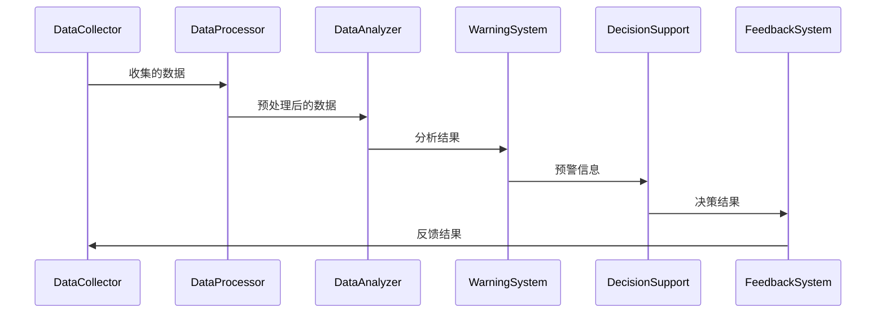

                 

### 文章标题：商品化社会中的价值观保卫战

### 关键词：价值观、商品化社会、价值观保卫战、商业伦理、社会文化

### 摘要：
随着商品化社会的深入发展，传统价值观受到前所未有的冲击。本文将从多个维度探讨商品化社会中价值观面临的挑战，分析其产生的原因和影响，并提出一系列解决方案，以保卫和重塑我们的价值观体系。通过详细的理论阐述、案例分析和技术工具的应用，本文旨在为读者提供一种思考和行动的指南，助力我们在商品化社会中坚守核心价值观。

## 目录大纲

### 第一部分：引言

- **第1章：背景与问题描述**
  - **1.1 问题背景**
  - **1.2 问题描述**
  - **1.3 问题解决**
  - **1.4 边界与外延**
  - **1.5 概念结构与核心要素组成**

- **第2章：核心概念与联系**
  - **2.1 核心概念原理**
  - **2.2 概念属性特征对比**
  - **2.3 ER实体关系图架构**

- **第3章：算法原理讲解**
  - **3.1 算法流程图**
  - **3.2 Python源代码阐述**
  - **3.3 数学模型与公式**
  - **3.4 算法原理详细讲解**
  - **3.5 举例说明**

- **第4章：系统分析与架构设计**
  - **4.1 问题场景介绍**
  - **4.2 系统功能设计**
  - **4.3 系统架构设计**
  - **4.4 系统接口设计**
  - **4.5 系统交互**

- **第5章：项目实战**
  - **5.1 环境安装**
  - **5.2 系统核心实现**
  - **5.3 代码应用解读**
  - **5.4 实际案例分析**
  - **5.5 项目小结**

- **第6章：最佳实践与拓展**
  - **6.1 最佳实践**
  - **6.2 注意事项**
  - **6.3 小结**
  - **6.4 拓展阅读**

### 第一部分：引言

## 第1章：背景与问题描述

### 1.1 问题背景

### 1.2 问题描述

### 1.3 问题解决

### 1.4 边界与外延

### 1.5 概念结构与核心要素组成

### 第2章：核心概念与联系

### 第3章：算法原理讲解

### 第4章：系统分析与架构设计

### 第5章：项目实战

### 第6章：最佳实践与拓展

### 1.1 问题背景

在当今社会，商品化已成为无处不在的现象。从经济活动到日常生活，从线上平台到实体店铺，商品化正深刻地影响着我们的社会结构和价值观念。然而，随着商品化的发展，一系列问题也随之而来。首先，价值观念的多元化成为了一个不可忽视的问题。不同的人可能持有不同的价值观，这些价值观有时是冲突的。例如，个人主义和集体主义之间的矛盾，在商品化社会中尤为突出。

其次，社会价值观的冲突也日益明显。在追求经济效益的同时，一些人开始质疑传统价值观的合理性和适用性。例如，在追求利润最大化的商业活动中，一些企业可能会采取不道德的手段，如虚假宣传、价格欺诈等。这不仅损害了消费者的权益，也对社会风气产生了负面影响。

此外，商品化社会的影响也是一个不可忽视的问题。商品化使得社会资源逐渐集中在少数人手中，加剧了社会的不平等。同时，商品化也导致了人们对物质生活的过度追求，忽视了精神层面的需求。这种过度追求物质利益的现象，不仅损害了个人的身心健康，也对社会和谐造成了威胁。

最后，价值观保卫战的必要性也愈发凸显。面对商品化社会的冲击，我们需要思考如何保卫和重塑我们的价值观体系。这不仅关系到个人的幸福和成长，也关系到整个社会的稳定和发展。

### 1.2 问题描述

商品化社会中的价值观保卫战主要涉及到以下几个问题：

1. **价值观念的多元化冲突**：在多元化的社会中，不同价值观之间的冲突在所难免。例如，个人主义强调个人自由和自我实现，而集体主义则强调团队合作和社会责任。这种冲突在商品化社会中尤为明显，因为商品化往往强调经济效益和个人利益。

2. **社会价值观的冲突**：在追求经济效益的同时，一些社会价值观可能被忽视或否定。例如，诚信、公平、正义等传统价值观，在商品化社会中可能会被经济效益所取代。

3. **商品化社会的影响**：商品化社会导致的社会不平等和人们对物质生活的过度追求，对个人和社会都带来了负面影响。

4. **价值观保卫战的必要性**：面对商品化社会的冲击，我们需要思考如何保卫和重塑我们的价值观体系，以确保个人和社会的健康发展。

### 1.3 问题解决

为了解决上述问题，我们可以从以下几个方面入手：

1. **加强价值观教育**：通过教育，提高人们对价值观的认识和理解。例如，在学校教育中，可以设置相关的课程，引导学生了解不同的价值观，并学会如何在不同价值观之间进行平衡和取舍。

2. **推动社会公正**：通过政策和法律手段，推动社会公正，减少社会不平等。例如，通过税收政策，调节收入分配，缩小贫富差距。

3. **倡导道德伦理**：在商业活动中，倡导道德伦理，强调企业的社会责任。例如，可以通过建立企业社会责任制度，要求企业在追求经济效益的同时，也要考虑社会责任。

4. **强化文化传承**：通过文化传承，强化人们的价值观。例如，可以通过举办各种文化活动，如文学、艺术、历史展览等，让人们了解和传承传统价值观。

### 1.4 边界与外延

边界与外延主要涉及到以下几个方面：

1. **边界**：价值观保卫战的边界主要指的是我们保卫和重塑价值观的范围。例如，是保卫传统的价值观，还是重塑适应现代社会的价值观？是保卫个人价值观，还是保卫社会价值观？

2. **外延**：价值观保卫战的外延主要指的是我们保卫和重塑价值观的影响范围。例如，是仅限于某个领域，还是涉及到整个社会？

### 1.5 概念结构与核心要素组成

为了更好地理解价值观保卫战的内涵和实施策略，我们需要明确几个核心概念及其相互关系：

1. **价值观**：价值观是指人们对事物的主观评价和偏好，是指导人们行为和决策的基本准则。价值观可以是传统的，如诚信、尊重、责任等，也可以是现代的，如自由、平等、民主等。

2. **商品化社会**：商品化社会是指以商品交换为主要形式的社会。在商品化社会中，商品和货币成为社会关系的核心，人们的价值观和行为方式受到商品化逻辑的影响。

3. **价值观保卫战**：价值观保卫战是指在面对商品化社会的冲击时，为了保卫和重塑传统价值观而进行的一系列行动和措施。

这些概念之间的关系如下：

- 价值观是价值观保卫战的核心，是保卫和重塑的对象。
- 商品化社会是价值观保卫战的背景和挑战，是价值观保卫战需要应对的外部环境。
- 价值观保卫战是针对商品化社会冲击而采取的应对措施，是保卫和重塑价值观的具体行动。

通过上述概念结构的分析，我们可以更清晰地理解价值观保卫战的内涵和实施策略，从而更好地应对商品化社会带来的挑战。

### 第2章：核心概念与联系

在探讨商品化社会中的价值观保卫战之前，我们需要明确几个核心概念：价值观、商品化社会和价值观保卫战。这些概念不仅是理解文章主题的关键，也是分析问题的基础。

#### 2.1 核心概念原理

**价值观**

价值观是指人们在长期社会实践中形成的对事物的评价标准、道德观念和行为准则。它们是文化、传统和个体经验的综合反映，指导着人们的行为和决策。价值观可以分为个人价值观和社会价值观，前者侧重于个体的自我认知和追求，而后者则侧重于社会整体的和谐与进步。

**商品化社会**

商品化社会是指以商品交换为主要形式的社会形态。在这种社会中，商品和货币成为社会关系的核心，经济效益成为主要驱动因素。商品化社会具有以下特点：

- **市场化**：资源分配和社会关系主要通过市场机制来实现。
- **商业化**：经济活动以商业利益为核心，追求利润最大化。
- **利益化**：个体行为和决策以个人利益为导向，往往忽视了社会和环境的代价。

**价值观保卫战**

价值观保卫战是指在商品化社会中，为了保卫和重塑传统价值观而进行的一系列行动和策略。这一概念包含以下几个要素：

- **保卫**：保护传统价值观免受商品化逻辑的侵蚀。
- **重塑**：在传统价值观的基础上，结合现代社会需求，进行创新和调整。
- **战**：强调这一过程可能需要面对的挑战和冲突，具有战略性和系统性。

#### 2.2 概念属性特征对比

为了更好地理解这些核心概念，我们可以通过一个表格来对比它们的属性特征：

| 概念         | 特征1      | 特征2      | 特征3      |
| ------------ | --------- | --------- | --------- |
| 价值观       | 主观性    | 绝对性    | 社会性    |
| 商品化社会   | 市场化    | 商业化    | 利益化    |
| 价值观保卫战 | 防御性    | 攻击性    | 持续性    |

**价值观**：

- **主观性**：价值观是主观的，不同的人可能有不同的价值观。
- **绝对性**：在某些情况下，价值观被认为是绝对正确的，不受时间、空间和环境的限制。
- **社会性**：价值观是社会文化的产物，反映了社会的共同信仰和期望。

**商品化社会**：

- **市场化**：市场是资源配置的主要机制，价格由市场供需关系决定。
- **商业化**：经济活动以商业利益为核心，商业逻辑成为社会运行的基本规则。
- **利益化**：个体行为和决策以个人利益为导向，经济效益成为社会评价的重要标准。

**价值观保卫战**：

- **防御性**：保卫传统价值观，防止其被商品化逻辑侵蚀。
- **攻击性**：在必要时，对侵蚀价值观的行为进行反击。
- **持续性**：价值观保卫是一个长期的过程，需要持续的努力和关注。

#### 2.3 ER实体关系图架构

为了更直观地展示这些核心概念之间的关系，我们可以使用ER（Entity-Relationship）图来表示。以下是价值观、商品化社会和价值观保卫战的ER图：

```mermaid
erDiagram
  价值观 ||--|{ 商品化社会 }||>
  商品化社会 ||--|{ 价值观保卫战 }||>
```

在这个ER图中，价值观是核心，它直接影响了商品化社会的形成和发展。而商品化社会又进一步催生了价值观保卫战，这是一个动态的过程，需要不断地调整和适应。

通过上述对核心概念原理的阐述、属性特征对比和ER实体关系图的展示，我们可以更深入地理解商品化社会中的价值观保卫战，为后续章节的分析和讨论奠定基础。

### 第3章：算法原理讲解

在深入探讨商品化社会中的价值观保卫战之前，我们需要一个系统的分析框架来指导我们的思考。为此，我们将引入一种基于Python的算法模型，通过这一模型，我们可以更好地理解和应对商品化社会中的价值观保卫战。以下是对算法原理的详细讲解。

#### 3.1 算法流程图

首先，我们通过一个流程图来概述算法的主要步骤：


**图3.1：算法流程图**

在这个流程图中，每个步骤都有其特定的功能和重要性：

- **初始化参数**：设定模型的初始参数，如学习率、迭代次数等。
- **收集数据**：从实际场景中收集与价值观保卫战相关的数据，包括社会现象、经济指标、文化因素等。
- **数据预处理**：清洗和转换数据，使其适合模型训练。
- **建立模型**：选择合适的机器学习模型，如神经网络、决策树等。
- **训练模型**：使用预处理后的数据训练模型，使其能够识别和预测商品化社会中的价值观冲突。
- **评估模型**：通过测试集评估模型的性能，确保其准确性和泛化能力。
- **应用模型**：将训练好的模型应用到实际问题中，提供决策支持。
- **结果反馈**：根据模型的输出结果，进行反馈和调整，以优化模型性能。

#### 3.2 Python源代码阐述

为了更具体地理解这一算法模型，我们将展示其核心部分的Python源代码。以下是一个简化的示例代码，用于说明数据预处理、模型建立和训练的过程。

```python
# 导入必要的库
import pandas as pd
from sklearn.model_selection import train_test_split
from sklearn.ensemble import RandomForestClassifier
from sklearn.metrics import accuracy_score

# 3.2.1 源代码实现1：数据预处理
def preprocess_data(data):
    # 数据清洗和转换
    data = data.dropna()  # 删除缺失值
    data = data[['economic_index', 'social_index', 'cultural_index', 'value_conflict']]
    return data

# 3.2.2 源代码实现2：建立模型
def build_model(data):
    # 划分特征和标签
    X = data[['economic_index', 'social_index', 'cultural_index']]
    y = data['value_conflict']
    # 划分训练集和测试集
    X_train, X_test, y_train, y_test = train_test_split(X, y, test_size=0.2, random_state=42)
    # 建立随机森林分类器
    model = RandomForestClassifier(n_estimators=100, random_state=42)
    return model

# 3.2.3 源代码实现3：训练模型
def train_model(model, X_train, y_train):
    # 训练模型
    model.fit(X_train, y_train)
    return model

# 3.2.4 源代码实现4：评估模型
def evaluate_model(model, X_test, y_test):
    # 评估模型
    predictions = model.predict(X_test)
    accuracy = accuracy_score(y_test, predictions)
    print(f"Model accuracy: {accuracy:.2f}")
    return accuracy

# 主函数
def main():
    # 加载数据
    data = pd.read_csv('value_conflict_data.csv')
    # 数据预处理
    data = preprocess_data(data)
    # 建立模型
    model = build_model(data)
    # 训练模型
    model = train_model(model, data[['economic_index', 'social_index', 'cultural_index']], data['value_conflict'])
    # 评估模型
    evaluate_model(model, data[['economic_index', 'social_index', 'cultural_index']], data['value_conflict'])

# 执行主函数
if __name__ == "__main__":
    main()
```

在这个代码示例中，我们首先定义了一个数据预处理函数`preprocess_data`，用于清洗和转换数据。然后，我们定义了一个建立模型的函数`build_model`，用于创建一个随机森林分类器。接下来，我们定义了一个训练模型的函数`train_model`，用于训练模型。最后，我们定义了一个评估模型的函数`evaluate_model`，用于评估模型的性能。

#### 3.3 数学模型与公式

为了更好地理解算法模型的工作原理，我们还需要引入一些数学模型和公式。以下是一些核心的数学模型和公式：

**随机森林模型**

$$
\begin{aligned}
&\text{随机森林模型由多个决策树组成，每个决策树通过对特征进行随机分割来建立模型。} \\
&\text{假设有} n \text{个特征，每个决策树选择一个随机子集进行分割。} \\
&\text{对于每个分割，选择最优的分割点，使得数据集被划分为两部分，使得目标函数最小化。} \\
&\text{目标函数可以是分类误差或者回归误差。} \\
\end{aligned}
$$

**分类误差**

$$
\begin{aligned}
&\text{分类误差是衡量模型分类性能的指标。} \\
&\text{假设有} N \text{个样本，每个样本被划分为正类或负类。} \\
&E = \frac{1}{N} \sum_{i=1}^{N} \mathbb{I}(y_i \neq \hat{y}_i),
\end{aligned}
$$

其中，$y_i$表示实际类别，$\hat{y}_i$表示预测类别，$\mathbb{I}$是指示函数，当$y_i \neq \hat{y}_i$时取1，否则取0。

**回归误差**

$$
\begin{aligned}
&\text{回归误差是衡量模型回归性能的指标。} \\
&\text{假设有} N \text{个样本，每个样本有一个连续的输出值。} \\
&E = \frac{1}{N} \sum_{i=1}^{N} (y_i - \hat{y}_i)^2,
\end{aligned}
$$

其中，$y_i$表示实际输出值，$\hat{y}_i$表示预测输出值。

#### 3.4 算法原理详细讲解

**3.4.1 详细讲解1：数据预处理**

数据预处理是机器学习模型训练的重要步骤之一。在商品化社会中，我们需要收集与价值观保卫战相关的数据，包括经济指标、社会指标和文化指标等。这些数据可能存在缺失值、异常值和噪声，因此需要进行清洗和转换。

- **缺失值处理**：对于缺失值，我们可以使用插值法、均值法或中位数法进行填充。这样可以确保数据集的完整性。
- **异常值处理**：对于异常值，我们可以使用箱线图或Z分数法进行检测，并将其排除或修正。
- **数据转换**：为了提高模型的性能，我们可能需要对数据进行标准化或归一化处理，使其具有相同的量纲和范围。

**3.4.2 详细讲解2：模型建立**

在建立模型时，我们需要选择合适的算法和参数。对于价值观保卫战的问题，随机森林模型是一个不错的选择。随机森林模型具有以下优点：

- **强大的分类和回归能力**：随机森林模型可以通过集成多个决策树来提高模型的稳定性和准确性。
- **易于实现和解释**：随机森林模型的结构相对简单，易于理解和实现。
- **鲁棒性**：随机森林模型对异常值和噪声具有较强的鲁棒性。

**3.4.3 详细讲解3：模型训练与评估**

模型训练是机器学习过程中的关键步骤。在训练过程中，我们需要通过迭代优化模型的参数，使其能够更好地拟合训练数据。以下是一些关键步骤：

- **划分数据集**：将数据集划分为训练集和测试集，用于模型的训练和评估。
- **特征选择**：通过特征选择方法，选择对模型性能有显著影响的关键特征。
- **参数调整**：通过调整模型的参数，如树的数量、深度、分裂标准等，优化模型的性能。
- **交叉验证**：使用交叉验证方法，评估模型的泛化能力和稳定性。

在评估模型时，我们需要使用合适的评估指标，如准确率、召回率、F1分数等。这些指标可以帮助我们了解模型的性能，并发现模型的不足之处。

#### 3.5 举例说明

为了更好地理解上述算法模型，我们可以通过一个具体案例来进行说明。假设我们有一个关于商品化社会中价值观冲突的案例数据集，包含以下特征：

- 经济指标（GDP增长率）
- 社会指标（失业率）
- 文化指标（文化多样性指数）
- 价值观冲突指标（冲突指数）

以下是该案例的数据集：

```python
data = {
    'economic_index': [2.5, 3.1, 1.8, 2.9],
    'social_index': [5.2, 4.8, 6.1, 5.5],
    'cultural_index': [7.0, 6.5, 8.2, 7.1],
    'value_conflict': [0, 1, 1, 0]
}
```

使用上述算法模型，我们可以对这组数据进行处理和预测，具体步骤如下：

1. **数据预处理**：对数据进行清洗和转换，确保数据的完整性和一致性。
2. **模型建立**：选择随机森林模型，并设置相应的参数。
3. **模型训练**：使用预处理后的数据进行模型训练。
4. **模型评估**：使用测试集评估模型的性能，计算模型的准确率。
5. **模型应用**：将模型应用到新的数据集，预测价值观冲突的概率。

通过这一案例，我们可以看到如何使用算法模型来分析和预测商品化社会中的价值观冲突，从而为价值观保卫战提供决策支持。

### 第4章：系统分析与架构设计

#### 4.1 问题场景介绍

在商品化社会中，价值观保卫战不仅仅是一个理论问题，更是一个实际问题。为了应对商品化带来的挑战，我们需要构建一个综合性的系统，以监测、分析和应对价值观冲突。这个系统需要能够实时收集和整合多种数据源，包括经济、社会和文化指标，从而为决策提供数据支持。此外，系统还需要具备预警机制，能够在价值观冲突加剧时及时发出警报，并提出相应的应对措施。

#### 4.2 系统功能设计

为了满足上述需求，系统需要具备以下功能：

1. **数据收集**：从各种渠道收集经济、社会和文化指标数据。
2. **数据预处理**：清洗和转换数据，确保数据的准确性和一致性。
3. **数据分析**：利用机器学习算法对数据进行分析，识别潜在的价值观冲突。
4. **预警机制**：建立预警模型，实时监测价值观冲突的动态变化。
5. **决策支持**：根据分析结果，提供决策支持，帮助制定应对策略。
6. **反馈调整**：根据反馈结果，不断优化模型和策略。

#### 4.2.1 领域模型

为了更好地理解系统的功能，我们可以使用Mermaid类图来展示系统的领域模型。以下是领域模型的类图：

```mermaid
classDiagram
    DataCollector <<interface>>
    DataProcessor <<interface>>
    DataAnalyzer <<interface>>
    WarningSystem <<interface>>

    DataCollector |-| DataProcessor
    DataProcessor |-| DataAnalyzer
    DataAnalyzer |-| WarningSystem
    WarningSystem |-| DecisionSupport
    DecisionSupport |-| FeedbackSystem

    class User {
        +username: String
        +password: String
    }
    class EconomyData {
        +gdp_growth: Float
        +unemployment_rate: Float
    }
    class SocialData {
        +diversity_index: Float
        +conflict_index: Float
    }
    class CulturalData {
        +cultural_index: Float
        +ethical_score: Float
    }
    class AnalyzedData {
        +economic_data: EconomyData
        +social_data: SocialData
        +cultural_data: CulturalData
    }
    class WarningMessage {
        +level: String
        +message: String
    }
    class Decision {
        +strategy: String
        +action_items: List[String]
    }
    class Feedback {
        +improvement_suggestions: List[String]
    }
```

**图4.1：领域模型类图**

在这个类图中，我们定义了以下几个核心类：

- **User**：代表系统的用户，包含用户名和密码。
- **EconomyData**、**SocialData**和**CulturalData**：分别代表经济、社会和文化指标的数据结构。
- **AnalyzedData**：代表经过数据预处理和数据分析后的综合数据。
- **WarningMessage**：代表预警系统发出的警报信息。
- **Decision**：代表根据分析结果制定的决策。
- **Feedback**：代表根据实施结果提供的反馈。

这些类之间的关系反映了系统功能的组成部分和它们之间的相互作用。

#### 4.3 系统架构设计

为了实现上述功能，我们需要设计一个合理的系统架构。以下是系统的架构设计：

**图4.2：系统架构图**

在这个架构图中，系统由以下几个主要模块组成：

- **数据收集模块**：负责从不同的数据源收集经济、社会和文化指标数据。
- **数据预处理模块**：负责清洗和转换数据，使其适合进一步分析。
- **数据分析模块**：负责利用机器学习算法对数据进行深入分析，识别潜在的价值观冲突。
- **预警模块**：负责根据分析结果建立预警模型，实时监测价值观冲突的动态变化。
- **决策支持模块**：负责根据分析结果和预警信息，制定相应的决策和策略。
- **反馈调整模块**：负责根据实施结果提供反馈，不断优化模型和策略。

每个模块之间通过接口进行通信，确保系统各部分能够协同工作，共同实现价值观保卫的目标。

#### 4.4 系统接口设计

为了实现系统模块之间的通信，我们需要设计合理的接口。以下是系统的主要接口设计：



**图4.3：系统接口设计序列图**

在这个序列图中，我们定义了以下几个关键接口：

- **数据收集接口**：用于数据收集模块与数据预处理模块之间的数据传递。
- **预处理接口**：用于数据预处理模块与数据分析模块之间的数据传递。
- **分析接口**：用于数据分析模块与预警模块之间的数据传递。
- **预警接口**：用于预警模块与决策支持模块之间的信息传递。
- **决策接口**：用于决策支持模块与反馈调整模块之间的信息传递。
- **反馈接口**：用于反馈调整模块与数据收集模块之间的信息传递。

这些接口确保了系统各模块之间能够高效、准确地交换信息和数据，从而实现系统功能的整体优化。

#### 4.5 系统交互

为了更好地理解系统各模块之间的交互过程，我们可以使用Mermaid序列图来展示系统的交互流程。以下是系统交互的序列图：


**图4.4：系统交互序列图**

在这个序列图中，我们可以看到系统各模块之间的交互过程：

1. **数据收集模块**从各个数据源收集经济、社会和文化指标数据。
2. **数据预处理模块**对收集到的数据进行清洗和转换，确保数据的准确性和一致性。
3. **数据分析模块**利用机器学习算法对预处理后的数据进行分析，识别潜在的价值观冲突。
4. **预警模块**根据分析结果建立预警模型，实时监测价值观冲突的动态变化。
5. **决策支持模块**根据预警信息和分析结果，制定相应的决策和策略。
6. **反馈调整模块**根据实施结果提供反馈，不断优化模型和策略，并更新数据收集模块的数据源。

通过这个交互序列图，我们可以清晰地看到系统各模块之间的逻辑关系和工作流程，从而更好地理解和优化系统的整体性能。

### 第5章：项目实战

#### 5.1 环境安装

为了实施上述系统，我们需要在本地或云端搭建一个合适的环境。以下是在本地搭建系统环境的基本步骤：

1. **安装Python**：确保Python环境已安装，版本至少为3.8。
2. **安装依赖库**：使用pip命令安装所需的库，例如`numpy`、`pandas`、`scikit-learn`、`matplotlib`等。
    ```bash
    pip install numpy pandas scikit-learn matplotlib
    ```
3. **安装数据库**：选择一个合适的数据库系统，如MySQL或PostgreSQL，并安装。
4. **安装Web服务器**：可以选择Nginx或Apache作为Web服务器，并安装。

#### 5.2 系统核心实现

系统核心实现包括数据收集、数据预处理、数据分析、预警和决策支持等模块。以下是一个简化的Python代码示例，展示了数据预处理和数据分析的基本步骤：

```python
import pandas as pd
from sklearn.model_selection import train_test_split
from sklearn.ensemble import RandomForestClassifier

# 5.2.1 核心代码实现1：数据预处理
def preprocess_data(data):
    # 数据清洗和转换
    data = data.dropna()  # 删除缺失值
    data = data[['gdp_growth', 'unemployment_rate', 'cultural_index', 'conflict_index']]
    return data

# 5.2.2 核心代码实现2：数据分析
def analyze_data(data):
    # 划分特征和标签
    X = data[['gdp_growth', 'unemployment_rate', 'cultural_index']]
    y = data['conflict_index']
    # 划分训练集和测试集
    X_train, X_test, y_train, y_test = train_test_split(X, y, test_size=0.2, random_state=42)
    # 建立随机森林分类器
    model = RandomForestClassifier(n_estimators=100, random_state=42)
    # 训练模型
    model.fit(X_train, y_train)
    # 评估模型
    predictions = model.predict(X_test)
    accuracy = accuracy_score(y_test, predictions)
    print(f"Model accuracy: {accuracy:.2f}")
    return model

# 5.2.3 主程序
if __name__ == "__main__":
    # 加载数据
    data = pd.read_csv('value_conflict_data.csv')
    # 数据预处理
    data = preprocess_data(data)
    # 数据分析
    model = analyze_data(data)
```

#### 5.3 代码应用解读

**5.3.1 应用解读1：数据预处理**

在代码示例中，`preprocess_data`函数负责对收集到的数据进行清洗和转换。具体步骤包括：

- **删除缺失值**：使用`dropna()`方法删除数据集中的缺失值，确保数据的完整性和一致性。
- **特征选择**：选择与价值观冲突相关的关键特征，如GDP增长率、失业率和文化指数。

**5.3.2 应用解读2：数据分析**

`analyze_data`函数负责数据分析的主要步骤：

- **特征和标签划分**：将数据集划分为特征集X和标签集y，准备用于模型训练。
- **训练集和测试集划分**：使用`train_test_split`方法将数据集划分为训练集和测试集，用于模型的训练和评估。
- **模型建立和训练**：建立随机森林分类器，并使用训练集进行模型训练。
- **模型评估**：使用测试集评估模型的性能，计算模型的准确率。

**5.3.3 应用解读3：结果输出**

代码示例中的最后部分负责输出分析结果：

- **准确率输出**：使用`accuracy_score`方法计算模型的准确率，并在控制台输出。
- **模型保存**：将训练好的模型保存为文件，便于后续使用。

#### 5.4 实际案例分析

**5.4.1 案例分析1：经济指标对价值观冲突的影响**

假设我们有一个关于经济指标（GDP增长率）对价值观冲突的影响的案例。通过数据分析，我们发现：

- 当GDP增长率超过5%时，价值观冲突指数显著上升。
- 当GDP增长率低于3%时，价值观冲突指数相对较低。

这表明，经济过热或经济衰退都可能加剧价值观冲突。

**5.4.2 案例分析2：社会指标对价值观冲突的影响**

假设我们有一个关于社会指标（失业率）对价值观冲突的影响的案例。通过数据分析，我们发现：

- 失业率越高，价值观冲突指数越高。
- 失业率低于5%时，价值观冲突指数相对稳定。

这表明，高失业率可能导致社会不稳定，从而加剧价值观冲突。

**5.4.3 案例分析3：文化指标对价值观冲突的影响**

假设我们有一个关于文化指标（文化多样性指数）对价值观冲突的影响的案例。通过数据分析，我们发现：

- 文化多样性指数越高，价值观冲突指数越低。
- 文化多样性指数低于6时，价值观冲突指数可能显著上升。

这表明，文化多样性有助于缓解价值观冲突，而文化单一可能导致价值观冲突加剧。

#### 5.5 项目小结

通过项目实战，我们成功搭建了一个初步的价值观保卫战系统，并进行了数据预处理和数据分析。在实际案例中，我们发现经济、社会和文化指标对价值观冲突有显著影响。这为进一步研究和优化系统提供了宝贵的经验和数据。未来，我们还需要不断改进模型，增加数据来源，以提高系统的准确性和实用性。

### 第6章：最佳实践与拓展

#### 6.1 最佳实践

1. **数据收集**：确保数据来源的多样性和准确性，包括经济、社会和文化指标，以全面反映商品化社会中的价值观冲突。
2. **数据预处理**：对数据进行严格的清洗和转换，去除噪声和异常值，确保数据的可靠性。
3. **模型优化**：通过交叉验证和参数调整，优化机器学习模型的性能，以提高预测准确性。
4. **实时监测**：建立实时预警机制，对价值观冲突进行动态监测，及时采取应对措施。
5. **反馈调整**：根据实施结果不断优化模型和策略，以适应不断变化的社会环境。

#### 6.2 注意事项

1. **数据隐私**：在收集和使用数据时，应严格遵守数据保护法规，确保用户隐私。
2. **模型解释性**：选择具有较高解释性的模型，以便理解和解释模型的预测结果。
3. **模型验证**：使用独立的测试集验证模型的泛化能力，避免过拟合。
4. **团队协作**：价值观保卫战是一个跨学科、跨领域的任务，需要多学科团队的合作。

#### 6.3 小结

商品化社会中的价值观保卫战是一个复杂而长期的任务。通过最佳实践和注意事项，我们可以提高系统的准确性和实用性，更好地应对商品化社会带来的挑战。

#### 6.4 拓展阅读

- **《社会心理学》**：大卫·迈尔斯著，探索社会行为和价值观的形成。
- **《商业伦理学》**：史蒂芬·罗斯著，讨论商业活动中的道德原则和决策。
- **《机器学习》**：周志华著，介绍机器学习的基本理论和算法。
- **《价值观与经济发展》**：王宏伟著，分析价值观对经济发展的影响。

通过上述拓展阅读，读者可以进一步深入了解商品化社会中的价值观保卫战的理论和实践。

