                 

# 在人工智能时代寻找人类价值

> 关键词：人工智能、人类价值、价值实现、挑战与机遇

> 摘要：本文旨在探讨在人工智能快速发展的时代，人类如何寻找和实现自身价值。通过分析人工智能的历史与发展、对人类生活方式的影响、教育变革、创新与创业、医疗健康、社会治理等多个方面，探讨人工智能时代人类价值的内涵与演变，以及人类价值与人工智能的协调发展路径。

### 目录大纲设计

#### 第一部分：引言

- **第1章：问题背景与核心概念**
  - **1.1 问题背景**
  - **1.2 核心概念**
  - **1.3 相关理论框架

#### 第二部分：人工智能技术的发展

- **第2章：人工智能的历史与发展**
  - **2.1 人工智能的起源**
  - **2.2 人工智能的关键技术**
  - **2.3 人工智能的应用领域**

#### 第三部分：人工智能时代的人类价值探讨

- **第3章：人工智能对人类生活方式的影响**
  - **3.1 劳动市场与就业**
  - **3.2 社会结构与人际关系**
  - **3.3 人类自我认知与价值观**

#### 第四部分：寻找人工智能时代的人类价值

- **第4章：人工智能时代的教育变革**
  - **4.1 人工智能与教育融合**
  - **4.2 教育者的角色转变**
  - **4.3 教育公平与质量提升**

- **第5章：人工智能时代的创新与创业**
  - **5.1 创新环境的变化**
  - **5.2 创业者素质的培养**
  - **5.3 创新创业生态系统**

#### 第五部分：人工智能时代的人类价值实践

- **第6章：人工智能时代的医疗健康**
  - **6.1 人工智能在医疗健康领域的应用**
  - **6.2 健康管理与服务**
  - **6.3 人工智能伦理与隐私保护**

- **第7章：人工智能时代的社会治理**
  - **7.1 社会治理的智能化**
  - **7.2 公共服务的优化**
  - **7.3 社会治理与人类价值的平衡**

#### 第六部分：结论与展望

- **第8章：人工智能时代的人类价值反思**
  - **8.1 人类价值的内涵与演变**
  - **8.2 人类价值与人工智能的协调发展**
  - **8.3 未来展望**

---

#### 第一部分：引言

### 第1章：问题背景与核心概念

#### 1.1 问题背景

随着人工智能技术的飞速发展，人类社会正经历着前所未有的变革。从工业革命到信息革命，再到如今的人工智能革命，每一次技术的进步都在深刻地影响着人类的生活方式和社会结构。然而，这一过程也带来了许多新的挑战，尤其是在人类价值实现方面。

在人工智能时代，人类的许多传统工作可能被自动化和智能化系统取代，导致就业市场的剧变。同时，人工智能在社交、医疗、教育等领域的广泛应用，也对人类的人际关系、自我认知和价值观产生了深远影响。因此，如何在人工智能时代寻找和实现人类价值，成为了亟待探讨的重要课题。

#### 1.2 核心概念

- **人工智能（Artificial Intelligence，AI）**：模拟人类智能行为的技术和系统，能够感知、学习、推理和决策。
- **人类价值（Human Value）**：人类在社会生活中所追求的目标、意义和尊严。
- **价值实现（Value Realization）**：个体或集体通过行动和实践，达成自身价值目标的过程。

#### 1.3 相关理论框架

本文将结合以下几个方面进行探讨：

- **人力资本理论**：强调人力资本在个人和社会发展中的重要性。
- **人工智能伦理**：探讨人工智能在道德和社会责任方面的原则和规范。
- **社会变迁理论**：分析技术进步对社会结构和人际关系的影响。

---

在接下来的章节中，我们将逐步深入探讨人工智能对人类生活方式的影响，以及如何通过教育变革、创新与创业、医疗健康、社会治理等途径，在人工智能时代寻找和实现人类价值。接下来，我们将回顾人工智能的历史与发展，为我们理解这一时代提供基础。## 人工智能的历史与发展

### 第2章：人工智能的历史与发展

#### 2.1 人工智能的起源

人工智能（AI）的概念最早可以追溯到20世纪40年代。1943年，美国数学家沃伦·麦卡洛克（Warren McCulloch）和心理学家沃尔特·皮茨（Walter Pitts）提出了神经网络的初步模型。1949年，艾伦·图灵（Alan Turing）发表了著名论文《计算机器与智能》（Computing Machinery and Intelligence），首次提出了“图灵测试”，用来衡量机器是否具有智能。

#### 2.2 人工智能的关键技术

随着计算机技术的发展，人工智能逐渐走向成熟。以下是一些关键技术的简要介绍：

- **机器学习（Machine Learning）**：机器学习是人工智能的核心技术之一，通过数据训练模型，使其能够对未知数据进行预测和决策。主要分为监督学习、无监督学习和强化学习。

  - **监督学习（Supervised Learning）**：有已知输入输出数据的训练过程，用于预测和分类。
  - **无监督学习（Unsupervised Learning）**：没有已知输入输出数据的训练过程，用于聚类和降维。
  - **强化学习（Reinforcement Learning）**：通过奖励机制来训练模型，使其在环境中学习最优策略。

- **深度学习（Deep Learning）**：深度学习是机器学习的一个子领域，通过多层神经网络进行数据建模，能够处理复杂的数据结构和模式。代表性算法包括卷积神经网络（CNN）和循环神经网络（RNN）。

- **自然语言处理（Natural Language Processing，NLP）**：NLP是使计算机能够理解、生成和处理自然语言的技术。其主要任务包括文本分类、机器翻译、情感分析等。

- **计算机视觉（Computer Vision）**：计算机视觉是使计算机能够从图像或视频中提取信息的技术。其主要任务包括图像识别、目标检测、图像分割等。

#### 2.3 人工智能的应用领域

人工智能在多个领域都取得了显著的进展和应用：

- **工业领域**：自动化生产线、智能机器人、智能制造等。
- **医疗健康**：医学影像分析、疾病预测、个性化治疗等。
- **教育**：智能教育平台、个性化学习系统、在线教育等。
- **交通**：自动驾驶汽车、智能交通管理、无人机配送等。
- **金融**：风险控制、量化交易、智能投顾等。

这些应用不仅提高了效率和精度，还改变了传统的工作方式和社会结构，对人类的日常生活产生了深远影响。

### 人工智能的未来展望

随着技术的不断进步，人工智能有望在未来实现更多的突破和变革。以下是几个可能的发展方向：

- **人工智能的普及**：人工智能技术将更加普及，应用到更多领域和场景中。
- **人机协同**：人工智能与人类的合作将更加紧密，实现人机协同工作。
- **跨领域融合**：人工智能与其他领域的深度融合，产生新的应用模式和商业模式。
- **伦理与法规**：人工智能的发展将面临更多的伦理和法规挑战，需要制定相应的规范和标准。

总的来说，人工智能的发展不仅带来了巨大的机遇，也提出了诸多挑战。我们需要在技术进步的同时，不断思考和探索如何在人工智能时代寻找和实现人类价值。## 人工智能对人类生活方式的影响

### 第3章：人工智能对人类生活方式的影响

#### 3.1 劳动市场与就业

人工智能技术的发展对劳动市场产生了深远影响。一方面，自动化和智能化系统正在取代许多传统工作，如制造业、客服、交通等领域。这导致了一些职业的消失，同时也催生了新的就业机会，如数据科学家、人工智能工程师等。因此，劳动市场的就业结构发生了显著变化。

**图1：人工智能对就业市场的影响**

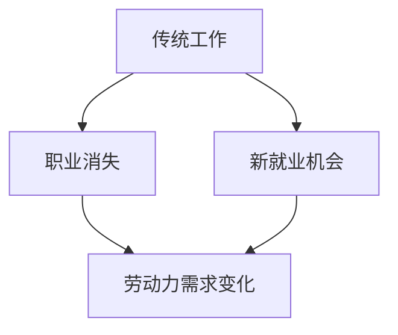

在这种背景下，职业教育和培训变得尤为重要。人们需要不断学习新技能，以适应不断变化的工作环境。

#### 3.2 社会结构与人际关系

人工智能的广泛应用改变了人们的社交方式和人际关系。一方面，社交媒体和智能设备的普及使得人们更容易保持联系，缩短了人与人之间的距离。另一方面，虚拟社交和信息过载也可能导致人际关系变得浅薄和疏离。

**图2：人工智能对社交结构和人际关系的影响**

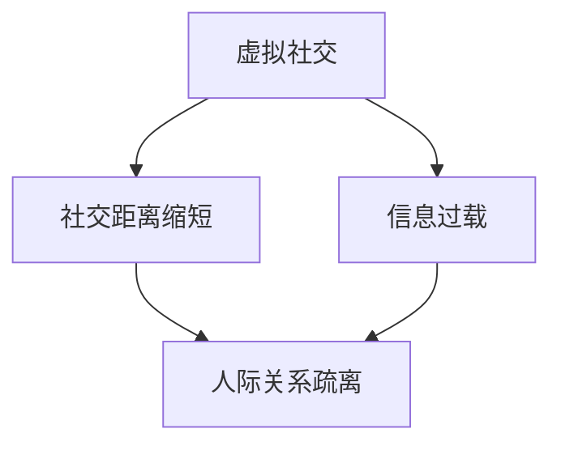

此外，人工智能在信息传播和舆论引导方面的作用也不可忽视。算法推荐和大数据分析使得信息传播更加精准和高效，但也可能导致信息茧房和舆论极化。

#### 3.3 人类自我认知与价值观

人工智能对人类的自我认知和价值观产生了深远影响。一方面，人工智能能够帮助人们更好地了解自身，例如通过心理健康监测、个性化建议等方式。另一方面，人工智能的普及也可能导致人们对于机器的依赖，甚至产生道德和伦理上的困惑。

**图3：人工智能对人类自我认知和价值观的影响**

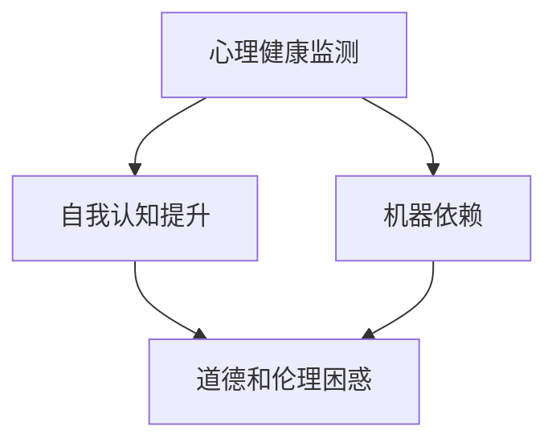

总之，人工智能对人类生活方式的影响是复杂而多元的。我们需要在享受技术带来的便利的同时，深入思考和解决由此产生的问题，确保人类在人工智能时代能够实现自身的价值。## 人工智能时代的教育变革

### 第4章：人工智能时代的教育变革

#### 4.1 人工智能与教育融合

人工智能在教育领域的应用正在改变传统的教育模式。个性化教育、在线教育、虚拟现实（VR）和增强现实（AR）等技术正在被广泛应用，使得教育更加灵活和高效。

**图1：人工智能与教育的融合**

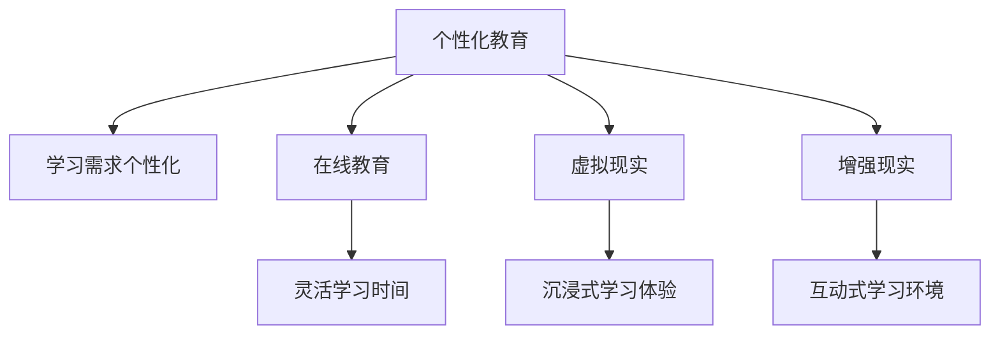

通过这些技术的应用，学生可以根据自己的学习节奏和需求进行学习，教师也能够更精准地提供教学资源和支持。

#### 4.2 教育者的角色转变

在人工智能时代，教育者的角色也在发生转变。他们不再仅仅是知识的传递者，而是更多地成为学生学习的引导者和支持者。教育者需要具备以下能力：

- **技术素养**：掌握和应用人工智能技术，能够利用这些技术提升教学效果。
- **创新思维**：能够创新教育方法和教学模式，以适应人工智能时代的需求。
- **沟通能力**：能够与学生建立良好的沟通，理解学生的需求和困惑。

**图2：教育者的角色转变**

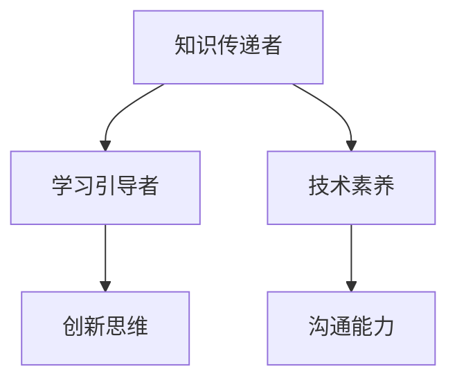

教育者需要不断更新自己的知识体系和教学技能，以适应不断变化的教育环境。

#### 4.3 教育公平与质量提升

人工智能的应用有助于提高教育的公平性和质量。一方面，人工智能可以帮助教育资源在地域和群体之间的分配更加均衡，让更多的学生享受到优质的教育资源。另一方面，人工智能能够通过数据分析和智能推荐，提高教育的个性化程度，从而提升教育质量。

**图3：人工智能对教育公平和质量提升的影响**

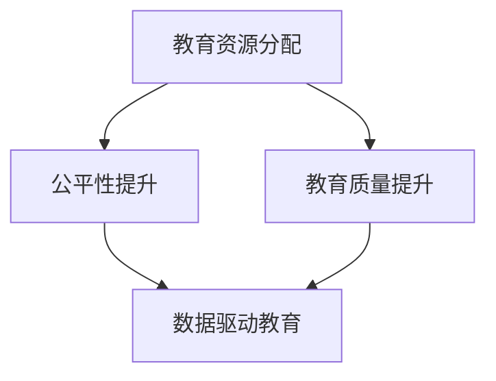

通过人工智能技术的应用，教育不仅变得更加公平，也更加高效，为人类价值的实现提供了新的途径。### 人工智能时代的创新与创业

### 第5章：人工智能时代的创新与创业

#### 5.1 创新环境的变化

人工智能的发展为创新环境带来了深刻的变化。传统的创新模式主要依赖于经验和直觉，而人工智能则通过大数据、机器学习和深度学习等技术，为创新提供了强大的工具和平台。

**图1：人工智能对创新环境的影响**

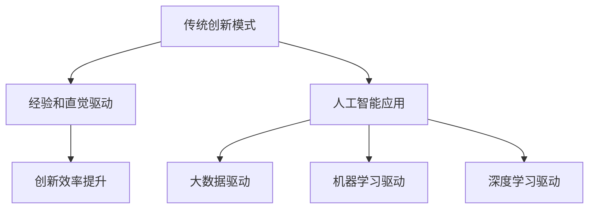

通过人工智能技术，企业可以更快地获取市场信息，更准确地预测趋势，从而实现更加高效和精准的创新。此外，人工智能还降低了创新的门槛，使得更多的创业者能够参与到创新的过程中。

#### 5.2 创业者素质的培养

在人工智能时代，创业者需要具备一系列新的素质和技能，以适应不断变化的市场和技术环境。以下是一些关键素质：

- **技术素养**：了解并掌握人工智能技术的基本原理和应用，能够利用这些技术进行创新。
- **数据思维**：能够运用数据分析的方法，从海量数据中提取有价值的信息。
- **快速学习**：能够快速适应新技术和新模式，持续学习和更新自己的知识和技能。
- **创新思维**：具备强烈的创新意识，能够提出独特和有价值的创新想法。

**图2：创业者素质的培养**

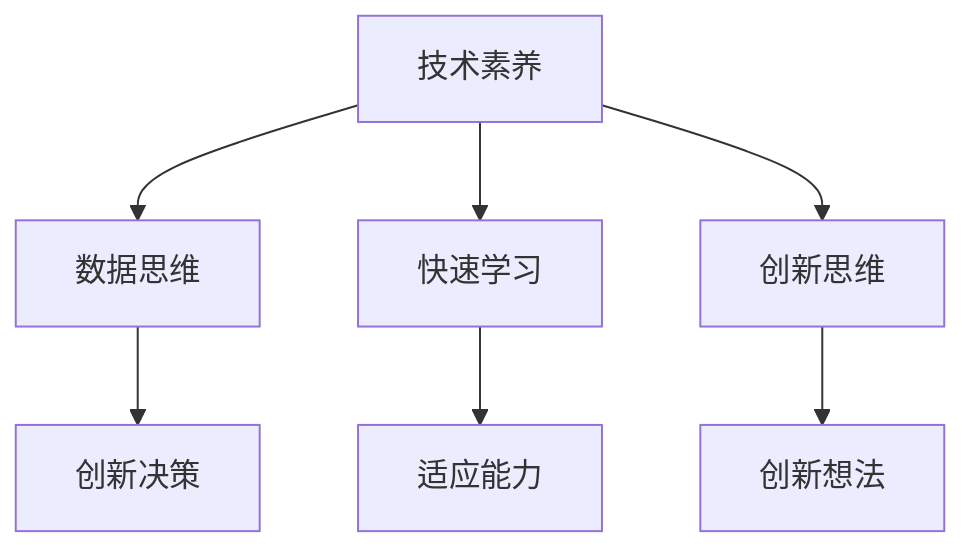

通过不断提升这些素质，创业者能够更好地把握市场机会，实现创业目标。

#### 5.3 创新创业生态系统

人工智能时代，创新创业的生态系统也在不断演变。政府、企业和学术界需要共同努力，构建一个良好的创新环境，以支持创业者的发展。

- **政府支持**：政府可以通过政策扶持、资金支持等方式，为创业者提供必要的支持。
- **企业合作**：企业可以与创业者合作，共同探索新的商业模式和技术应用，实现互利共赢。
- **学术支持**：学术界可以提供前沿的研究成果和技术支持，为创新创业提供理论指导。

**图3：创新创业生态系统的构建**

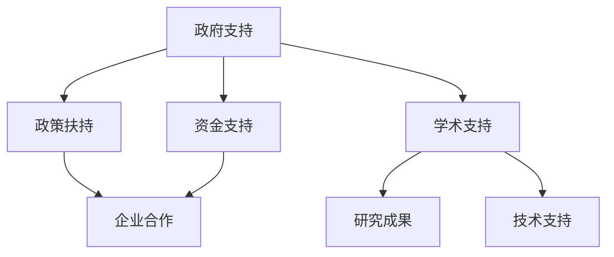

通过多方合作，构建一个完善的创新创业生态系统，可以促进人工智能时代创新创业的繁荣发展。### 人工智能时代的医疗健康

### 第6章：人工智能时代的医疗健康

#### 6.1 人工智能在医疗健康领域的应用

人工智能在医疗健康领域的应用日益广泛，为疾病诊断、治疗和健康管理提供了新的手段和工具。以下是一些关键应用：

- **医学影像分析**：人工智能可以通过深度学习算法，对医学影像（如CT、MRI）进行自动分析和诊断，提高诊断准确率和速度。
- **疾病预测**：通过分析患者的历史病历、基因数据、生活方式等信息，人工智能可以预测疾病的发生风险，有助于提前采取预防措施。
- **个性化治疗**：人工智能可以根据患者的个体差异，提供个性化的治疗方案，提高治疗效果。

**图1：人工智能在医疗健康领域的应用**

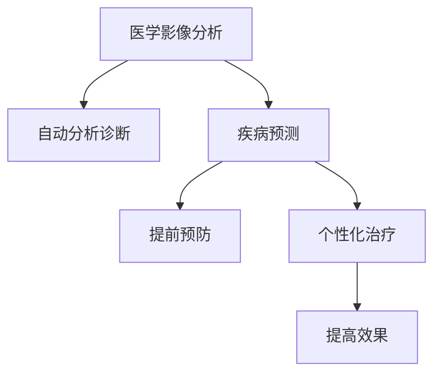

这些应用不仅提高了医疗服务的效率和质量，也为医生提供了更为精准的诊断工具和治疗方案。

#### 6.2 健康管理与服务

人工智能在健康管理和服务方面的应用也取得了显著成果。通过智能穿戴设备、健康数据监测和大数据分析，人工智能可以帮助人们更好地管理自己的健康状况。

- **智能穿戴设备**：如智能手表、健康手环等，可以实时监测心率、血压、睡眠质量等健康指标，为用户提供个性化的健康建议。
- **健康数据分析**：通过对海量健康数据的分析，人工智能可以识别健康风险，提供预防措施和建议。
- **在线医疗服务**：人工智能可以通过在线平台提供咨询服务，如智能问答、健康评估等，为用户提供便捷的医疗服务。

**图2：健康管理与服务应用**

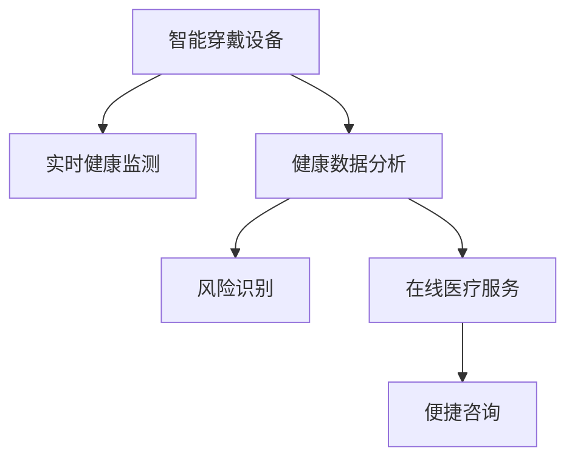

这些应用不仅提高了人们的健康管理水平，也减少了医疗资源的浪费，提高了医疗服务的效率。

#### 6.3 人工智能伦理与隐私保护

随着人工智能在医疗健康领域的广泛应用，伦理和隐私保护问题也日益凸显。以下是一些关键挑战：

- **数据隐私**：医疗健康数据属于敏感信息，如何确保数据的安全性和隐私性，避免数据泄露，是亟待解决的问题。
- **算法偏见**：人工智能算法可能会受到训练数据的影响，导致算法偏见，影响诊断和治疗决策的公正性。
- **责任归属**：在人工智能辅助决策的医疗事故中，如何明确责任归属，确保患者权益，是一个重要的伦理问题。

**图3：人工智能伦理与隐私保护挑战**

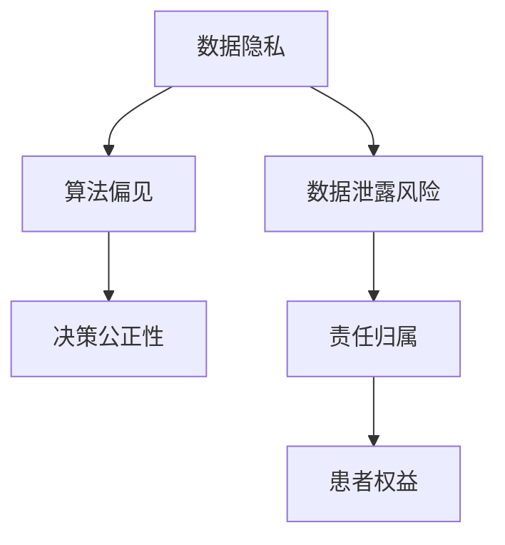

为了应对这些挑战，需要建立完善的伦理规范和法律法规，确保人工智能在医疗健康领域的健康发展。### 人工智能时代的社会治理

### 第7章：人工智能时代的社会治理

#### 7.1 社会治理的智能化

在人工智能时代，社会治理正在经历一场深刻的变革。智能化技术，特别是大数据、机器学习和计算机视觉等，正被广泛应用于社会治理的各个方面，极大地提升了社会治理的效率和质量。

**图1：智能化社会治理的关键技术**

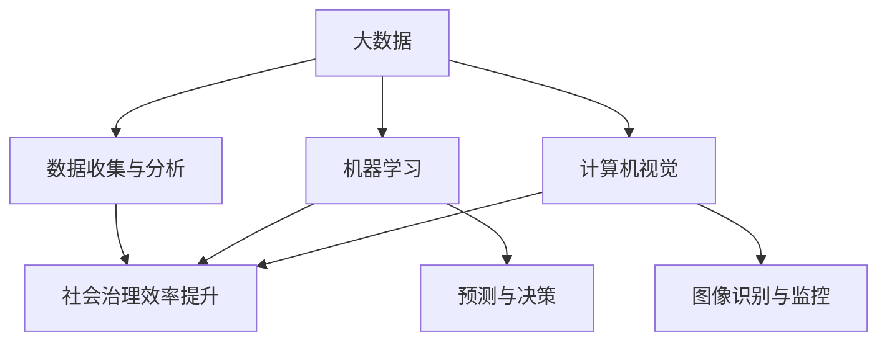

通过大数据技术，政府能够收集和整合海量的社会数据，实现全方位的监控和管理。机器学习技术则可以对这些数据进行分析，预测社会动态，优化决策过程。计算机视觉技术则可以在公共安全、交通管理等方面发挥重要作用，提高社会治理的实时性和精准性。

#### 7.2 公共服务的优化

人工智能在提升公共服务质量方面也展现出巨大潜力。通过人工智能技术，政府可以提供更加个性化、高效和便捷的公共服务。

- **个性化服务**：人工智能可以根据居民的需求和偏好，提供定制化的公共服务，如个性化健康咨询、教育推荐等。
- **高效服务**：通过自动化和智能化流程，政府可以大幅减少服务办理时间，提高服务效率。
- **便捷服务**：人工智能技术使得公共服务可以通过移动应用、在线平台等方式提供，极大地方便了居民的生活。

**图2：人工智能对公共服务优化的影响**

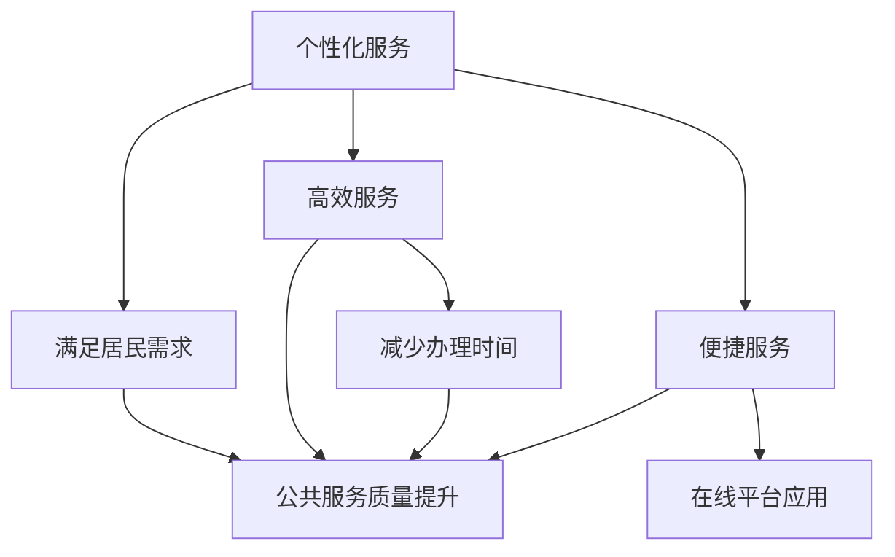

这些优化措施不仅提高了公共服务的满意度，也增强了政府的公信力和居民的幸福指数。

#### 7.3 社会治理与人类价值的平衡

在人工智能时代，如何确保社会治理既能高效运行，又能维护人类价值，是一个重要的课题。以下是一些关键点：

- **伦理与责任**：人工智能技术在社会治理中的应用需要遵循伦理原则，确保技术的使用不损害人类的尊严和权利。同时，明确技术责任，确保在出现问题时能够及时承担责任。
- **透明与可解释性**：人工智能决策过程需要具备透明性和可解释性，使公众能够理解和监督人工智能系统的运作。
- **公平与包容**：社会治理应确保公平性和包容性，避免因技术偏见导致的不公平现象。

**图3：社会治理与人类价值的平衡**

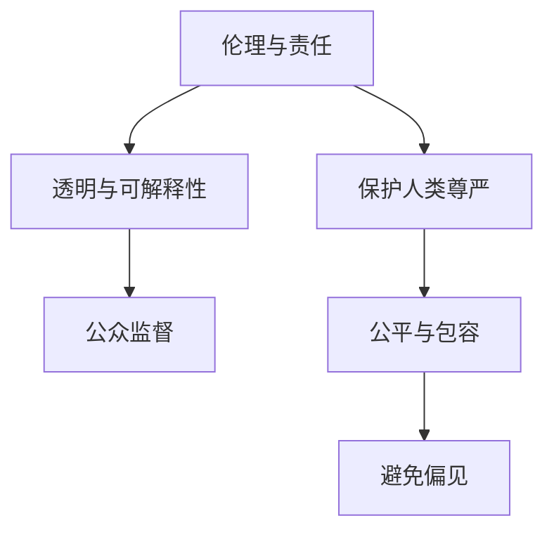

通过这些措施，人工智能时代的社会治理可以在技术进步的同时，维护和促进人类价值。### 结论与展望

### 第8章：人工智能时代的人类价值反思

#### 8.1 人类价值的内涵与演变

在人工智能时代，人类价值的内涵和表现形式发生了深刻的变化。传统的价值观如勤奋、诚实和团结等，仍具有重要的地位，但在人工智能的辅助下，这些价值观的实现方式和意义发生了转变。例如，人工智能可以提升个体的工作效率，使人们有更多时间去追求精神层面的满足和自我实现。同时，人工智能的发展也带来了一些新的价值观，如创新、数据意识和伦理责任等。

**图1：人工智能时代人类价值的变化**

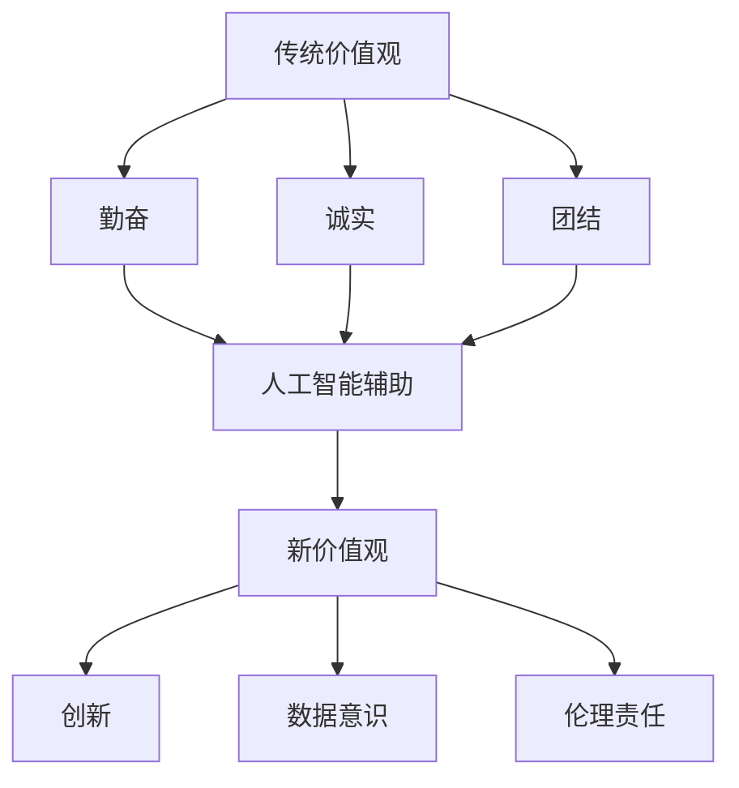

#### 8.2 人类价值与人工智能的协调发展

为了实现人类价值与人工智能的协调发展，需要从以下几个方面进行努力：

1. **技术伦理**：建立和完善人工智能技术的伦理规范，确保技术的发展不会损害人类的利益和尊严。
2. **教育培训**：加强人工智能教育和培训，提高公众对人工智能技术的理解和应用能力，培养具备创新精神和伦理意识的人才。
3. **政策法规**：制定相关政策法规，引导和规范人工智能的发展，确保技术进步与社会需求的协调发展。
4. **跨领域合作**：推动政府、企业、学术界和民间组织之间的合作，共同探索人工智能在各个领域的应用，实现技术与社会价值的共赢。

**图2：人类价值与人工智能的协调发展路径**

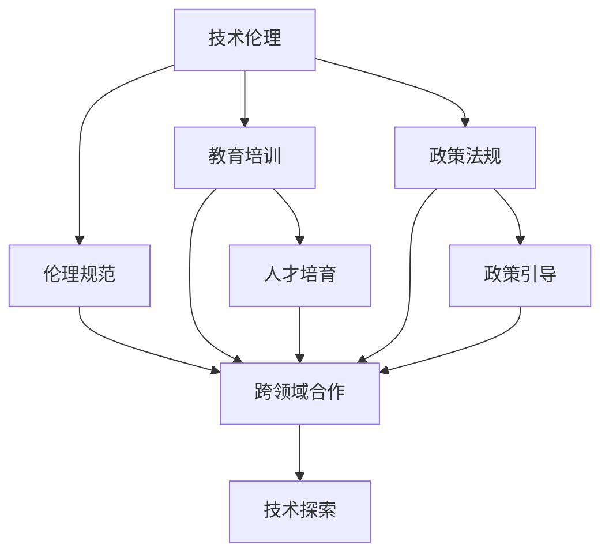

#### 8.3 未来展望

随着人工智能技术的不断进步，未来人类社会将在多个方面迎来新的变革。以下是一些可能的发展趋势：

1. **智能社会**：人工智能技术将在社会管理的各个方面得到广泛应用，实现高度智能化和自动化，提高社会治理的效率和公平性。
2. **个性化服务**：人工智能将根据个体的需求和偏好，提供高度个性化的产品和服务，满足人们多样化的需求。
3. **终身学习**：人工智能技术将推动教育模式的变革，实现个性化教育和终身学习，帮助人们不断更新知识和技能。
4. **人机协同**：人工智能将与人类共同工作，实现人机协同，提高生产效率和生活质量。

**图3：人工智能时代的发展趋势**

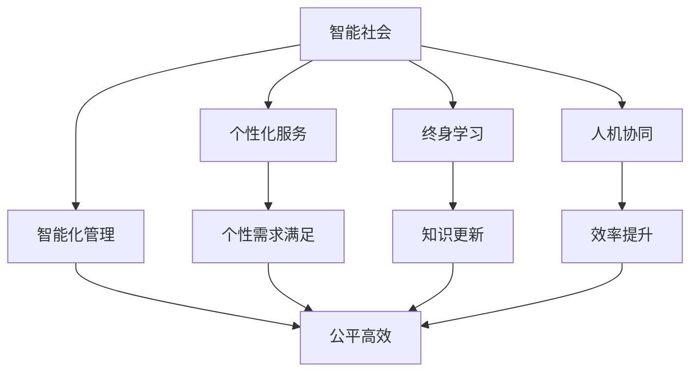

总之，人工智能时代为人类价值实现带来了新的机遇和挑战。我们需要在技术进步的同时，不断思考和探索如何在人工智能时代寻找和实现人类价值，确保人类能够在这个新时代中实现自身的最大价值。### 总结

在人工智能时代，人类价值的实现面临着前所未有的机遇和挑战。通过对人工智能的历史与发展、对人类生活方式的影响、教育变革、创新与创业、医疗健康、社会治理等各方面的深入探讨，我们认识到，人工智能不仅改变了我们的生活方式，也深刻影响了人类自我认知与价值观。

人工智能为人类带来了巨大的便利和效率提升，但同时也引发了劳动市场的变革、社交方式的改变、教育模式的创新、医疗服务的优化、社会治理的智能化等一系列挑战。如何在享受技术红利的同时，确保人类价值不受损害，成为我们亟待解决的问题。

为了实现人类价值与人工智能的协调发展，我们提出了以下几点建议：

1. **强化技术伦理**：建立和完善人工智能技术的伦理规范，确保技术的发展符合人类的道德和法律要求，不损害人类的尊严和权利。
2. **推动教育培训**：加强人工智能教育和培训，提高公众对人工智能技术的理解和应用能力，培养具备创新精神和伦理意识的人才。
3. **完善政策法规**：制定相关政策法规，引导和规范人工智能的发展，确保技术进步与社会需求的协调发展。
4. **促进跨领域合作**：推动政府、企业、学术界和民间组织之间的合作，共同探索人工智能在各个领域的应用，实现技术与社会价值的共赢。

未来，随着人工智能技术的不断进步，我们期待能够在智能社会、个性化服务、终身学习和人机协同等方面取得更多的突破，实现人类价值的新飞跃。人工智能时代，既是机遇，也是挑战。让我们携手前行，共同迎接这个充满希望的新时代。

### 作者信息

**作者：** AI天才研究院/AI Genius Institute & 禅与计算机程序设计艺术 /Zen And The Art of Computer Programming

**备注：** 本文旨在探讨人工智能时代的人类价值，文章内容仅供参考，不代表任何官方立场。如果您有任何建议或意见，欢迎随时联系我们。感谢您的阅读！

