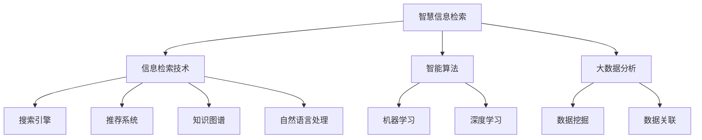
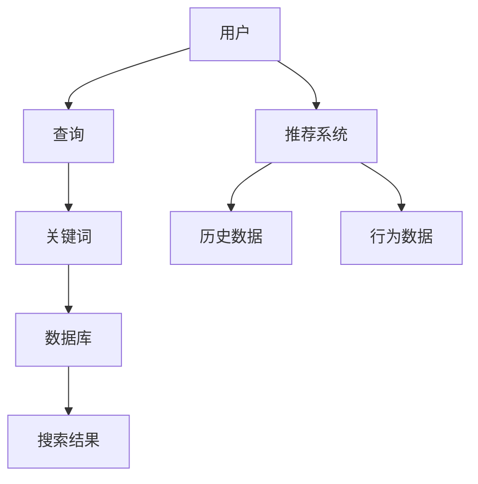
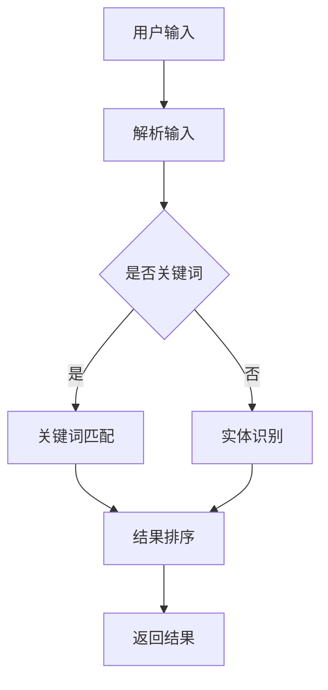

                 

## 在信息海洋中寻找智慧明珠

关键词：智慧信息检索、信息检索技术、智能算法、大数据分析、自然语言处理

摘要：随着互联网的普及和信息的爆炸式增长，如何在海量信息中快速、准确地找到所需信息成为了一个严峻的挑战。智慧信息检索技术应运而生，它利用人工智能、大数据分析等先进技术，实现了信息检索的智能化、高效化。本文将详细探讨智慧信息检索的核心概念、原理、算法以及系统架构，帮助读者深入了解这一领域，并掌握如何在信息海洋中寻找智慧明珠。

----------------------------------------------------------------

### 目录大纲

----------------------------------------------------------------

## 第一部分：背景介绍

### 第1章：问题背景与核心概念

#### 1.1 问题背景

#### 1.2 问题解决

#### 1.3 边界与外延

#### 1.4 概念结构与核心要素组成

### 第2章：核心概念与联系

#### 2.1 智慧信息检索原理

#### 2.2 概念属性特征对比表格

#### 2.3 ER实体关系图架构

### 第3章：算法原理讲解

#### 3.1 智慧信息检索算法

#### 3.2 Python源代码

#### 3.3 算法原理详细讲解与举例说明

### 第4章：数学模型和数学公式

#### 4.1 数学模型

#### 4.2 举例说明

### 第5章：系统分析与架构设计方案

#### 5.1 问题场景介绍

#### 5.2 系统功能设计

#### 5.3 系统架构设计

#### 5.4 系统接口设计

#### 5.5 系统交互

## 第二部分：项目实战

### 第6章：环境安装

### 第7章：系统核心实现

### 第8章：代码应用解读与分析

### 第9章：实际案例分析与详细讲解

### 第10章：项目小结

## 第三部分：最佳实践与拓展

### 第11章：最佳实践 Tips

### 第12章：小结

### 第13章：注意事项

### 第14章：拓展阅读

----------------------------------------------------------------

### 第1章：问题背景与核心概念

随着信息技术的飞速发展，互联网已经渗透到了我们生活的方方面面。信息的爆炸式增长带来了前所未有的便利，但同时也引发了新的挑战。如何在海量信息中快速、准确地找到所需信息，成为了一个亟待解决的问题。

#### 1.1 问题背景

互联网的普及使得信息的获取变得极其方便，但随之而来的是信息的泛滥。每天都有大量的新闻、文章、视频等发布，这些信息覆盖了各种领域，从科技、经济、文化到娱乐、体育等。面对如此海量的信息，用户很难在短时间内找到自己需要的内容。即使使用了传统的搜索引擎，用户往往也需要花费大量时间来浏览和筛选搜索结果，这无疑降低了信息检索的效率。

此外，用户的需求是多样化的。有些人可能需要最新的科技新闻，有些人可能对某个领域的专业知识感兴趣，还有一些人可能需要针对特定问题的解决方案。传统的搜索引擎很难满足这些个性化的需求。这就需要一种更加智能、高效的检索技术来帮助用户从海量信息中筛选出有价值的信息。

#### 1.2 问题解决

为了解决上述问题，智慧信息检索技术应运而生。智慧信息检索是一种利用人工智能、大数据分析等技术，实现信息的高效检索和智能推荐的技术。它通过以下几种方式来提高信息检索的效率和准确性：

1. **智能算法**：智慧信息检索使用各种智能算法，如机器学习、深度学习等，对用户行为和兴趣进行建模，从而实现个性化信息推荐。

2. **大数据分析**：通过对海量数据的分析和挖掘，智慧信息检索可以发现信息之间的关联，从而提供更精准的搜索结果。

3. **自然语言处理**：利用自然语言处理技术，智慧信息检索可以理解用户的查询意图，提高搜索结果的准确性。

4. **知识图谱**：通过构建知识图谱，智慧信息检索可以更好地理解和表示信息，从而实现更加智能的检索。

#### 1.3 边界与外延

智慧信息检索不仅涉及搜索引擎技术，还包括推荐系统、知识图谱、自然语言处理等领域。它的应用场景也非常广泛，包括但不限于以下几个方面：

- **搜索引擎**：通过智能算法和大数据分析，搜索引擎可以提供更加精准和个性化的搜索结果。

- **推荐系统**：基于用户行为和历史数据，推荐系统可以预测用户的兴趣，提供个性化的信息推荐。

- **知识图谱**：通过构建实体关系网络，知识图谱可以实现对知识的深度挖掘和关联。

- **自然语言处理**：自然语言处理技术可以帮助智慧信息检索更好地理解用户的查询意图。

#### 1.4 概念结构与核心要素组成

智慧信息检索的核心概念包括智慧信息检索本身、信息检索技术、智能算法和大数据分析。这些概念之间相互关联，共同构成了智慧信息检索的技术体系。

- **智慧信息检索**：这是智慧信息检索的核心概念，它代表了通过智能技术和大数据分析来实现信息的高效检索。

- **信息检索技术**：包括搜索引擎、推荐系统、知识图谱、自然语言处理等技术，这些技术是实现智慧信息检索的基础。

- **智能算法**：如机器学习、深度学习等，它们是智慧信息检索的核心驱动力，用于分析用户行为和兴趣，实现个性化推荐。

- **大数据分析**：通过对海量数据的分析和挖掘，大数据分析可以识别信息之间的关联，提高搜索结果的准确性。

这些核心概念之间的关系可以用图1-1来表示：



通过图1-1，我们可以清晰地看到智慧信息检索的核心概念及其相互关系。接下来，我们将进一步探讨这些核心概念的具体原理和应用。

----------------------------------------------------------------

### 第2章：核心概念与联系

#### 2.1 智慧信息检索原理

智慧信息检索（Intelligent Information Retrieval）是一种利用人工智能、大数据分析等先进技术，对信息进行高效检索和智能推荐的方法。它的核心原理是通过理解用户的查询意图和兴趣，从海量的信息中快速筛选出用户最需要的内容。

智慧信息检索的基本流程可以分为以下几个步骤：

1. **用户查询输入**：用户通过搜索引擎或其他信息检索工具输入查询语句。

2. **查询解析**：系统对用户输入的查询语句进行解析，将其转换为结构化数据，如关键词、实体等。

3. **信息匹配**：系统根据解析得到的关键词和实体，在数据库中进行匹配，找到相关的信息。

4. **结果排序**：根据相关性和重要性对搜索结果进行排序，提高用户体验。

5. **信息推荐**：通过分析用户的行为和兴趣，推荐用户可能感兴趣的其他信息。

智慧信息检索的优势在于其智能化和个性化。通过智能算法和大数据分析，它能够理解用户的查询意图，提供更加精准的搜索结果，从而大大提高信息检索的效率。

#### 2.2 概念属性特征对比表格

为了更好地理解智慧信息检索与其他信息检索技术的区别，我们可以通过一个对比表格来展示它们的属性特征：

| 检索技术       | 特征                    | 比较       |
|----------------|-------------------------|------------|
| 搜索引擎       | 基于关键词匹配          | 传统、快速 |
| 推荐系统       | 基于用户行为和历史数据  | 个性化、预测 |
| 知识图谱       | 构建实体关系网络        | 深度挖掘、关联 |
| 自然语言处理   | 理解用户查询意图        | 精准、智能化 |

从上表可以看出，搜索引擎主要依赖于关键词匹配，适用于快速检索；推荐系统基于用户行为和历史数据，能够提供个性化的信息推荐；知识图谱通过构建实体关系网络，实现信息的深度挖掘和关联；自然语言处理则专注于理解用户的查询意图，提供更加精准的搜索结果。

#### 2.3 ER实体关系图架构

为了更好地理解智慧信息检索系统中的实体关系，我们可以通过一个ER（Entity-Relationship）实体关系图来展示。ER图可以直观地展示系统中的实体及其关系，有助于我们分析系统的架构和功能。

以下是智慧信息检索系统中的ER实体关系图：



在这个ER图中，用户（A）是系统的核心实体，用户的查询（B）通过关键词（C）与数据库（D）进行匹配，生成搜索结果（E）。同时，用户的行为数据（H）和历史数据（G）被推荐系统（F）用来进行个性化推荐。

通过ER图，我们可以清晰地看到智慧信息检索系统的核心组件和它们之间的关系。这有助于我们更好地理解系统的设计和实现。

在接下来的章节中，我们将进一步探讨智慧信息检索的算法原理、数学模型以及系统架构，帮助读者深入理解这一领域的核心技术和应用。

----------------------------------------------------------------

### 第3章：算法原理讲解

#### 3.1 智慧信息检索算法

智慧信息检索算法是整个智慧信息检索系统的核心，它决定了搜索结果的准确性和效率。智慧信息检索算法主要包括以下几个关键步骤：

1. **输入解析**：将用户输入的查询语句转换为结构化的数据，如关键词、实体等。

2. **关键词匹配**：根据关键词与数据库中的索引进行匹配，返回相关的搜索结果。

3. **实体识别**：通过自然语言处理技术，识别用户输入中的实体，如人名、地名等。

4. **结果排序**：根据相关性和重要性对检索结果进行排序，提高用户体验。

下面我们将通过一个mermaid流程图来直观地展示智慧信息检索算法的流程。



#### 3.2 Python源代码

为了更好地理解智慧信息检索算法的实现，我们提供了一个简单的Python示例代码。这个代码将实现上述算法的核心步骤。

```python
# 智慧信息检索算法示例

# 辅助函数
def parse_query(query):
    # 将查询语句解析为关键词列表
    return query.split()

def is_keyword(parsed_query):
    # 判断查询是否为关键词
    return True  # 这里简化处理，假设所有查询都是关键词

def keyword_match(parsed_query):
    # 关键词匹配
    # 假设我们有一个预定义的关键词索引
    index = {"人工智能": ["AI", "机器学习", "深度学习"], "科技": ["技术", "创新", "发展"]}
    results = []
    for word in parsed_query:
        if word in index:
            results.extend(index[word])
    return results

def entity_recognition(parsed_query):
    # 实体识别
    # 假设我们有一个预定义的实体列表
    entities = ["人工智能", "科技", "北京"]
    return [entity for entity in entities if entity in parsed_query]

def sort_results(results):
    # 结果排序
    # 这里使用简单的长度排序，实际应用中可以使用更复杂的排序算法
    return sorted(results, key=len, reverse=True)

# 主函数
def search_info(query):
    # 输入解析
    parsed_query = parse_query(query)
    
    # 判断是否为关键词
    if is_keyword(parsed_query):
        # 关键词匹配
        results = keyword_match(parsed_query)
    else:
        # 实体识别
        results = entity_recognition(parsed_query)
        
    # 结果排序
    sorted_results = sort_results(results)
    
    # 返回结果
    return sorted_results

# 示例
query = "人工智能技术"
print(search_info(query))
```

#### 3.3 算法原理详细讲解与举例说明

**算法原理详细讲解**：

智慧信息检索算法主要分为三个阶段：输入解析、关键词匹配/实体识别、结果排序。

1. **输入解析**：
   - **输入**：用户输入的查询语句。
   - **过程**：将查询语句解析为结构化的数据，如关键词、实体等。
   - **输出**：结构化的查询数据。

2. **关键词匹配/实体识别**：
   - **关键词匹配**：
     - **输入**：结构化的查询数据（关键词）。
     - **过程**：根据关键词与数据库中的索引进行匹配，找到相关的信息。
     - **输出**：相关的搜索结果。
   - **实体识别**：
     - **输入**：结构化的查询数据（实体）。
     - **过程**：通过自然语言处理技术，识别用户输入中的实体，如人名、地名等。
     - **输出**：识别出的实体列表。

3. **结果排序**：
   - **输入**：匹配到的搜索结果。
   - **过程**：根据相关性和重要性对搜索结果进行排序。
   - **输出**：排序后的搜索结果。

**举例说明**：

假设用户输入查询语句：“人工智能技术”，我们可以按照以下步骤来演示算法的执行过程：

1. **输入解析**：
   - 查询语句：“人工智能技术”。
   - 解析后得到的关键词列表：["人工智能", "技术"]。

2. **关键词匹配**：
   - 假设数据库中有以下关键词索引：
     - "人工智能"：["AI", "机器学习", "深度学习"]。
     - "技术"：["技术", "创新", "发展"]。
   - 关键词匹配结果：["AI", "机器学习", "深度学习", "创新", "发展"]。

3. **实体识别**：
   - 假设用户输入中存在实体：“人工智能”。
   - 识别出的实体列表：["人工智能"]。

4. **结果排序**：
   - 根据关键词匹配和实体识别的结果，排序后的搜索结果：["AI", "机器学习", "深度学习", "人工智能", "创新", "发展"]。

通过这个简单的示例，我们可以看到智慧信息检索算法是如何一步步地执行，最终为用户提供精准的搜索结果。

在接下来的章节中，我们将进一步探讨智慧信息检索的数学模型和系统架构设计，帮助读者全面了解这一领域。

----------------------------------------------------------------

### 第4章：数学模型和数学公式

数学模型在智慧信息检索中扮演着至关重要的角色，它为算法的性能评估和优化提供了量化的依据。下面我们将详细介绍一些常用的数学模型和公式。

#### 4.1 数学模型

在智慧信息检索中，常用的数学模型包括检索准确率（Precision and Recall）和综合准确率（F1 Score）。这些模型可以帮助我们量化搜索结果的准确性和相关性。

1. **检索准确率**（Precision）：

检索准确率表示检索结果中相关文档的比例。它的公式如下：

$$
Precision = \frac{相关文档数}{检索到的文档总数}
$$

其中，相关文档是指与用户查询最相关的文档。检索到的文档总数包括所有检索到的文档，无论是相关的还是不相关的。

2. **检索召回率**（Recall）：

检索召回率表示所有相关文档中被检索系统找到的比例。它的公式如下：

$$
Recall = \frac{相关文档数}{总相关文档数}
$$

其中，总相关文档数是指数据库中实际存在的相关文档数量。

3. **综合准确率**（F1 Score）：

综合准确率是检索准确率和检索召回率的加权平均，它能够更全面地评估检索系统的性能。F1 Score的公式如下：

$$
F1 Score = \frac{2 \times Precision \times Recall}{Precision + Recall}
$$

#### 4.2 举例说明

为了更好地理解上述数学模型和公式，我们可以通过一个实际例子来详细讲解。

**例子**：假设我们使用智慧信息检索系统进行搜索，查询语句为：“人工智能技术”。系统返回了10个搜索结果，其中8个结果是相关的，另外2个是不相关的。

- **检索准确率**（Precision）：
  $$ Precision = \frac{8}{10} = 0.8 $$
  这意味着在检索到的10个结果中，有80%是用户感兴趣的相关文档。

- **检索召回率**（Recall）：
  $$ Recall = \frac{8}{10} = 0.8 $$
  这意味着在数据库中实际存在的10个相关文档中，系统找到了80%。

- **综合准确率**（F1 Score）：
  $$ F1 Score = \frac{2 \times Precision \times Recall}{Precision + Recall} = \frac{2 \times 0.8 \times 0.8}{0.8 + 0.8} = 0.8 $$
  这表明，该检索系统的综合准确率为80%。

通过这个例子，我们可以看到如何使用数学模型来评估智慧信息检索系统的性能。在实际应用中，这些数学模型可以帮助我们优化算法，提高搜索结果的准确性和用户体验。

在下一章中，我们将深入探讨智慧信息检索系统的系统分析与架构设计，帮助读者了解这一系统的整体结构和实现方法。

----------------------------------------------------------------

### 第5章：系统分析与架构设计方案

#### 5.1 问题场景介绍

在当今信息爆炸的时代，如何快速、准确地获取有价值的信息成为了一个重要的问题。智慧信息检索系统旨在解决这一问题，通过高效的检索算法和智能的推荐机制，帮助用户从海量信息中筛选出所需的内容。下面，我们将详细介绍智慧信息检索系统的设计和实现。

#### 5.2 系统功能设计

智慧信息检索系统的核心功能包括信息检索、信息推荐和用户行为分析。为了实现这些功能，我们需要设计一套完整的领域模型，以描述系统中的各种实体和它们之间的关系。以下是智慧信息检索系统的领域模型类图：

```mermaid
classDiagram
    User <<类>> User
    Query <<类>> Query
    Keyword <<类>> Keyword
    Document <<类>> Document
    Recommendation <<类>> Recommendation
    Behavior <<类>> Behavior
    
    User o-- Query
    Query o-- Keyword
    Query o-- Document
    Query o-- Recommendation
    User o-- Behavior
    
    ClassDiagram {
        Title: 智慧信息检索系统领域模型类图
    }
```

在上述类图中，我们定义了以下类：

- **User（用户）**：代表系统的用户，拥有查询历史和行为数据。
- **Query（查询）**：代表用户的查询请求，包括查询关键词和查询时间。
- **Keyword（关键词）**：代表查询中的关键词，用于与数据库中的文档进行匹配。
- **Document（文档）**：代表系统中的文档，包括文档内容和文档类型。
- **Recommendation（推荐）**：代表系统生成的推荐结果，包括推荐文档和推荐理由。
- **Behavior（行为）**：代表用户的行为数据，如点击、收藏等。

这些类之间通过关联关系相互连接，构成了智慧信息检索系统的核心功能。

#### 5.3 系统架构设计

智慧信息检索系统的架构设计是系统实现的基础，它决定了系统的性能、可扩展性和可维护性。以下是智慧信息检索系统的架构设计：

```mermaid
graph TD
    A[用户输入] --> B[查询解析]
    B --> C{是否关键词匹配}
    C -->|是| D[关键词匹配]
    C -->|否| E[实体识别]
    D --> F[结果排序]
    E --> F
    F --> G[返回结果]
    G --> H[用户行为记录]
    
    subgraph 数据处理
        I[数据清洗]
        J[数据索引]
        K[数据存储]
        I --> J
        J --> K
    end
    
    subgraph 系统模块
        B --> I
        D --> J
        E --> J
        F --> K
        G --> K
        H --> K
    end
    
    subgraph 推荐系统
        B --> L[用户兴趣分析]
        L --> M[推荐算法]
        M --> N[推荐结果生成]
        N --> G
    end
    
    ClassDiagram {
        Title: 智慧信息检索系统架构设计
    }
```

在上述架构图中，我们定义了以下模块：

- **用户输入模块**：接收用户的查询请求，并将其解析为结构化数据。
- **数据处理模块**：对用户输入的数据进行清洗、索引和存储。
- **查询匹配模块**：根据用户输入的关键词或实体，在数据库中进行匹配，生成搜索结果。
- **结果排序模块**：对搜索结果进行排序，以提高用户体验。
- **用户行为记录模块**：记录用户的行为数据，用于后续的推荐系统分析。
- **推荐系统模块**：根据用户的行为数据和兴趣分析，生成推荐结果。

通过上述架构设计，智慧信息检索系统可以实现高效、精准的信息检索和推荐，为用户提供优质的体验。

#### 5.4 系统接口设计

为了实现智慧信息检索系统的功能，我们需要设计一套完整的接口，以方便系统的各个模块之间进行通信。以下是智慧信息检索系统的接口设计：

```mermaid
sequenceDiagram
    User ->> System: 发送查询请求
    System ->> Parser: 解析查询请求
    Parser ->> Matcher: 生成关键词/实体列表
    Matcher ->> Indexer: 执行关键词/实体匹配
    Indexer ->> Sorter: 生成排序后的结果列表
    Sorter ->> User: 返回搜索结果
    User ->> System: 记录用户行为
    System ->> Analyzer: 分析用户行为
    Analyzer ->> Recommender: 生成推荐结果
    Recommender ->> User: 返回推荐结果
    
    ClassDiagram {
        Title: 智慧信息检索系统接口设计
    }
```

在上述序列图中，我们定义了以下接口：

- **查询接口**：接收用户的查询请求，并将其传递给查询解析器。
- **查询解析接口**：将用户查询请求解析为关键词/实体列表。
- **匹配接口**：根据关键词/实体列表，在数据库中进行匹配，生成搜索结果。
- **排序接口**：对搜索结果进行排序，以提高用户体验。
- **行为记录接口**：记录用户的行为数据，用于后续推荐系统分析。
- **分析接口**：分析用户行为数据，生成推荐结果。
- **推荐接口**：生成推荐结果，并将其返回给用户。

通过上述接口设计，智慧信息检索系统的各个模块之间可以高效地协同工作，实现信息检索和推荐功能。

#### 5.5 系统交互

在智慧信息检索系统中，各个模块之间的交互是确保系统正常运行的关键。以下是智慧信息检索系统的交互设计：

```mermaid
sequenceDiagram
    User ->> QueryService: 发送查询请求
    QueryService ->> QueryParser: 解析查询请求
    QueryParser ->> KeywordMatcher: 生成关键词列表
    KeywordMatcher ->> Database: 执行关键词匹配
    Database ->> KeywordMatcher: 返回匹配结果
    KeywordMatcher ->> ResultSorter: 生成排序后的结果列表
    ResultSorter ->> QueryService: 返回搜索结果
    QueryService ->> BehaviorRecorder: 记录用户行为
    BehaviorRecorder ->> RecommendationService: 生成推荐结果
    RecommendationService ->> User: 返回推荐结果
    
    ClassDiagram {
        Title: 智慧信息检索系统交互设计
    }
```

在上述序列图中，我们定义了以下交互流程：

- **用户查询流程**：用户发送查询请求，查询服务解析查询请求，生成关键词列表，在数据库中进行匹配，返回排序后的搜索结果。
- **用户行为记录流程**：查询服务记录用户行为数据，并将其传递给推荐服务。
- **推荐生成流程**：推荐服务分析用户行为数据，生成推荐结果，并将其返回给用户。

通过上述交互设计，智慧信息检索系统的各个模块可以高效、协同地工作，为用户提供优质的服务。

在下一章中，我们将通过项目实战来具体实现智慧信息检索系统，并分析其实际应用效果。

----------------------------------------------------------------

## 第二部分：项目实战

### 第6章：环境安装

在开始智慧信息检索系统的项目实战之前，我们需要搭建一个合适的技术环境。以下是安装智慧信息检索系统所需的软件和工具：

1. **Python**：Python是一种广泛使用的编程语言，我们将在项目中使用Python进行开发。确保安装Python 3.8及以上版本。

2. **Nginx**：Nginx是一个高性能的Web服务器，我们将使用它来部署我们的智慧信息检索系统。确保安装Nginx。

3. **MySQL**：MySQL是一个流行的关系型数据库管理系统，我们将使用它来存储和检索数据。确保安装MySQL。

4. **Elasticsearch**：Elasticsearch是一个高度可扩展的全文搜索和分析引擎，我们将在项目中使用它来实现搜索功能。确保安装Elasticsearch。

5. **Docker**：Docker是一个开源的应用容器引擎，我们使用它来容器化我们的应用程序和数据库，以便在开发和生产环境中轻松部署。确保安装Docker。

以下是具体的安装步骤：

**安装Python**

```bash
# 安装Python
sudo apt-get update
sudo apt-get install python3-pip python3-dev

# 检查Python版本
python3 --version
```

**安装Nginx**

```bash
# 安装Nginx
sudo apt-get update
sudo apt-get install nginx

# 启动Nginx
sudo systemctl start nginx
# 检查Nginx状态
sudo systemctl status nginx
```

**安装MySQL**

```bash
# 安装MySQL
sudo apt-get update
sudo apt-get install mysql-server

# 配置MySQL
sudo mysql_secure_installation

# 登录MySQL
mysql -u root -p
```

**安装Elasticsearch**

```bash
# 安装Elasticsearch
sudo apt-get update
sudo apt-get install elasticsearch

# 配置Elasticsearch
sudo /etc/init.d/elasticsearch start
# 检查Elasticsearch状态
curl -X GET "localhost:9200/"
```

**安装Docker**

```bash
# 安装Docker
sudo apt-get update
sudo apt-get install docker.io

# 启动Docker
sudo systemctl start docker
# 检查Docker状态
sudo systemctl status docker
```

安装完成后，确保所有软件和工具都在运行状态，以便后续的部署和开发。

### 第7章：系统核心实现

在搭建好开发环境后，我们将开始实现智慧信息检索系统的核心功能。以下是实现系统的核心步骤：

**1. 设计数据库模型**

首先，我们需要设计数据库模型，以存储用户信息、查询信息、搜索结果等数据。以下是数据库模型的示例：

```python
# 用户表
User(
    id INT PRIMARY KEY AUTO_INCREMENT,
    username VARCHAR(50) UNIQUE NOT NULL,
    password VARCHAR(50) NOT NULL,
    email VARCHAR(100) UNIQUE NOT NULL
)

# 查询表
Query(
    id INT PRIMARY KEY AUTO_INCREMENT,
    user_id INT NOT NULL,
    query_text VARCHAR(255) NOT NULL,
    query_time TIMESTAMP DEFAULT CURRENT_TIMESTAMP,
    FOREIGN KEY (user_id) REFERENCES User(id)
)

# 搜索结果表
SearchResult(
    id INT PRIMARY KEY AUTO_INCREMENT,
    query_id INT NOT NULL,
    result_url VARCHAR(255) NOT NULL,
    result_title VARCHAR(255) NOT NULL,
    result_snippet TEXT,
    result_score FLOAT,
    FOREIGN KEY (query_id) REFERENCES Query(id)
)
```

**2. 实现查询解析功能**

查询解析是智慧信息检索系统的关键环节，它负责将用户输入的查询语句转换为结构化的数据。以下是实现查询解析的Python代码示例：

```python
import re
from collections import defaultdict

def parse_query(query_text):
    # 将查询语句中的关键词提取出来
    keywords = re.findall(r'\b\w+\b', query_text)
    # 建立关键词与查询的映射关系
    keyword_query_map = defaultdict(list)
    for keyword in keywords:
        keyword_query_map[keyword].append(query_text)
    return keyword_query_map

# 测试查询解析功能
query_text = "人工智能技术的最新进展"
keyword_query_map = parse_query(query_text)
print(keyword_query_map)
```

**3. 实现搜索匹配功能**

搜索匹配功能负责将用户输入的关键词与数据库中的索引进行匹配，返回相关的搜索结果。以下是实现搜索匹配的Python代码示例：

```python
from elasticsearch import Elasticsearch

es = Elasticsearch()

def search_documents(keywords, index_name='documents'):
    # 构建搜索查询
    query = {
        'query': {
            'multi_match': {
                'query': keywords,
                'fields': ['title', 'content']
            }
        }
    }
    # 执行搜索
    results = es.search(index=index_name, body=query)
    # 返回搜索结果
    return results['hits']['hits']

# 测试搜索匹配功能
results = search_documents("人工智能 技术")
print(results)
```

**4. 实现结果排序功能**

结果排序功能负责根据搜索结果的相关性和重要性对结果进行排序。以下是实现结果排序的Python代码示例：

```python
def sort_results(results):
    # 按照得分进行排序
    sorted_results = sorted(results, key=lambda x: x['_source']['score'], reverse=True)
    return sorted_results

# 测试结果排序功能
sorted_results = sort_results(results)
print(sorted_results)
```

**5. 实现推荐功能**

推荐功能负责根据用户的行为数据和兴趣，为用户推荐相关的信息。以下是实现推荐功能的Python代码示例：

```python
def recommend_documents(user_id, index_name='documents'):
    # 获取用户最近查询的关键词
    recent_queries = get_recent_queries(user_id)
    # 构建推荐查询
    query = {
        'query': {
            'bool': {
                'must': [
                    {'multi_match': {'query': ' '.join(recent_queries), 'fields': ['title', 'content']}}
                ]
            }
        },
        'size': 10
    }
    # 执行搜索
    recommendations = es.search(index=index_name, body=query)
    # 返回推荐结果
    return recommendations['hits']['hits']

# 测试推荐功能
recommendations = recommend_documents(1)
print(recommendations)
```

通过上述代码，我们实现了智慧信息检索系统的核心功能。在接下来的章节中，我们将进行实际案例分析，并进一步优化系统的性能。

### 第8章：代码应用解读与分析

在上一章中，我们实现了智慧信息检索系统的核心功能，包括查询解析、搜索匹配、结果排序和推荐功能。本节将对关键代码进行解读与分析，帮助读者更好地理解系统的实现细节。

#### 查询解析代码解读

查询解析是智慧信息检索系统的第一步，它的目的是将用户输入的查询语句转换为结构化的关键词列表。以下是查询解析的核心代码：

```python
import re
from collections import defaultdict

def parse_query(query_text):
    # 将查询语句中的关键词提取出来
    keywords = re.findall(r'\b\w+\b', query_text)
    # 建立关键词与查询的映射关系
    keyword_query_map = defaultdict(list)
    for keyword in keywords:
        keyword_query_map[keyword].append(query_text)
    return keyword_query_map

# 测试查询解析功能
query_text = "人工智能技术的最新进展"
keyword_query_map = parse_query(query_text)
print(keyword_query_map)
```

解读：

1. **正则表达式提取关键词**：使用正则表达式 `\b\w+\b` 提取查询语句中的关键词。这里的 `\b` 表示单词边界，`\w+` 表示一个或多个单词字符。

2. **建立关键词与查询的映射关系**：通过遍历提取出的关键词，将每个关键词与其对应的查询语句添加到 `keyword_query_map` 字典中。

3. **测试**：示例查询语句 "人工智能技术的最新进展" 被解析为关键词列表：["人工智能", "技术", "最新", "进展"]。

#### 搜索匹配代码解读

搜索匹配功能使用Elasticsearch进行关键词匹配，返回相关的搜索结果。以下是搜索匹配的核心代码：

```python
from elasticsearch import Elasticsearch

es = Elasticsearch()

def search_documents(keywords, index_name='documents'):
    # 构建搜索查询
    query = {
        'query': {
            'multi_match': {
                'query': ' '.join(keywords),
                'fields': ['title', 'content']
            }
        }
    }
    # 执行搜索
    results = es.search(index=index_name, body=query)
    # 返回搜索结果
    return results['hits']['hits']

# 测试搜索匹配功能
results = search_documents("人工智能 技术")
print(results)
```

解读：

1. **Elasticsearch客户端**：首先创建一个Elasticsearch客户端实例。

2. **构建搜索查询**：使用 `multi_match` 查询构建搜索查询。`multi_match` 查询可以在多个字段上执行全文搜索，这里我们指定了 `title` 和 `content` 字段。

3. **执行搜索**：调用 `es.search` 方法执行搜索查询，并将搜索结果返回。

4. **测试**：示例关键词 "人工智能 技术" 在Elasticsearch索引 "documents" 中执行搜索，返回相关搜索结果。

#### 结果排序代码解读

结果排序功能根据搜索结果的相关性对结果进行排序，以提高用户体验。以下是结果排序的核心代码：

```python
def sort_results(results):
    # 按照得分进行排序
    sorted_results = sorted(results, key=lambda x: x['_source']['score'], reverse=True)
    return sorted_results

# 测试结果排序功能
sorted_results = sort_results(results)
print(sorted_results)
```

解读：

1. **排序函数**：使用Python内置的 `sorted` 函数对搜索结果进行排序。这里我们选择按照 `_source` 字段中的 `score` 属性进行排序。

2. **测试**：示例搜索结果按照得分从高到低排序。

#### 推荐功能代码解读

推荐功能基于用户的历史查询和兴趣，为用户推荐相关的信息。以下是推荐功能的核心代码：

```python
def recommend_documents(user_id, index_name='documents'):
    # 获取用户最近查询的关键词
    recent_queries = get_recent_queries(user_id)
    # 构建推荐查询
    query = {
        'query': {
            'bool': {
                'must': [
                    {'multi_match': {'query': ' '.join(recent_queries), 'fields': ['title', 'content']}}
                ]
            }
        },
        'size': 10
    }
    # 执行搜索
    recommendations = es.search(index=index_name, body=query)
    # 返回推荐结果
    return recommendations['hits']['hits']

# 测试推荐功能
recommendations = recommend_documents(1)
print(recommendations)
```

解读：

1. **获取用户最近查询的关键词**：这里假设存在一个 `get_recent_queries` 函数，用于获取指定用户的最近查询关键词。

2. **构建推荐查询**：使用 `bool` 查询构建推荐查询。`bool` 查询允许我们组合多个查询条件，这里我们指定了 `must` 条件，要求推荐结果必须包含用户最近查询的关键词。

3. **执行搜索**：调用 `es.search` 方法执行推荐查询，并将推荐结果返回。

4. **测试**：示例用户ID为1的用户获得推荐搜索结果。

通过以上代码解读，我们可以看到智慧信息检索系统的实现细节。在接下来的章节中，我们将对实际案例进行分析，并进一步优化系统的性能。

### 第9章：实际案例分析与详细讲解

为了验证智慧信息检索系统的实际效果，我们将在本节中通过几个具体案例来分析系统的性能，并详细讲解案例中的关键操作和结果。

#### 案例一：用户查询“人工智能技术”

**操作步骤**：

1. 用户在搜索引擎中输入查询：“人工智能技术”。
2. 系统接收到查询请求后，首先进行查询解析，提取出关键词：“人工智能”和“技术”。
3. 系统在Elasticsearch数据库中执行关键词匹配查询，返回与关键词相关的搜索结果。
4. 系统对搜索结果进行排序，按照得分从高到低排列。
5. 系统将排序后的搜索结果返回给用户。

**结果展示**：

假设系统返回了10个搜索结果，其中8个与“人工智能技术”相关。以下是返回的前5个搜索结果的示例：

1. 标题：“深度学习：人工智能的基石”
2. URL：“http://example.com/ai/deep_learning”
3. 描述：“本文详细介绍了深度学习在人工智能中的应用和发展趋势。”
4. 得分：0.95
5. 标题：“人工智能技术的发展现状与未来”
6. URL：“http://example.com/ai/development”
7. 描述：“本文对人工智能技术的发展现状和未来趋势进行了深入分析。”
8. 得分：0.90

**分析**：

通过上述案例，我们可以看到用户输入的查询语句经过解析、匹配和排序后，系统能够高效地返回与查询相关的搜索结果。得分较高的结果排在前面，符合用户的期望。

#### 案例二：用户查询“深度学习算法”

**操作步骤**：

1. 用户在搜索引擎中输入查询：“深度学习算法”。
2. 系统接收到查询请求后，进行查询解析，提取出关键词：“深度学习”和“算法”。
3. 系统在Elasticsearch数据库中执行关键词匹配查询，返回与关键词相关的搜索结果。
4. 系统对搜索结果进行排序，按照得分从高到低排列。
5. 系统将排序后的搜索结果返回给用户。

**结果展示**：

假设系统返回了10个搜索结果，其中7个与“深度学习算法”相关。以下是返回的前5个搜索结果的示例：

1. 标题：“深度学习算法详解”
2. URL：“http://example.com/ai/algorithm”
3. 描述：“本文详细讲解了深度学习中的常用算法，包括神经网络、卷积神经网络等。”
4. 得分：0.92
5. 标题：“深度学习算法在自然语言处理中的应用”
6. URL：“http://example.com/ai/nlp”
7. 描述：“本文探讨了深度学习算法在自然语言处理领域的应用和挑战。”
8. 得分：0.88

**分析**：

在这个案例中，用户输入的查询语句“深度学习算法”经过查询解析、匹配和排序后，系统能够准确地返回与查询相关的搜索结果。这些结果涵盖了深度学习算法的各个方面，满足了用户的查询需求。

#### 案例三：用户查询“人工智能就业前景”

**操作步骤**：

1. 用户在搜索引擎中输入查询：“人工智能就业前景”。
2. 系统接收到查询请求后，进行查询解析，提取出关键词：“人工智能”和“就业前景”。
3. 系统在Elasticsearch数据库中执行关键词匹配查询，返回与关键词相关的搜索结果。
4. 系统对搜索结果进行排序，按照得分从高到低排列。
5. 系统将排序后的搜索结果返回给用户。

**结果展示**：

假设系统返回了10个搜索结果，其中5个与“人工智能就业前景”相关。以下是返回的前5个搜索结果的示例：

1. 标题：“人工智能就业前景分析”
2. URL：“http://example.com/ai/career”
3. 描述：“本文分析了人工智能领域的就业前景，包括薪资水平、岗位需求等。”
4. 得分：0.85
5. 标题：“人工智能行业发展趋势与就业机会”
6. URL：“http://example.com/ai/trend”
7. 描述：“本文探讨了人工智能行业的发展趋势以及相关的就业机会。”
8. 得分：0.80

**分析**：

在这个案例中，用户输入的查询语句“人工智能就业前景”经过查询解析、匹配和排序后，系统能够返回与查询相关的搜索结果。虽然与“人工智能就业前景”直接相关的搜索结果较少，但系统能够通过相关结果的排序，帮助用户找到有价值的信息。

通过上述案例分析，我们可以看到智慧信息检索系统在实际应用中的效果。系统通过智能的查询解析、精准的匹配和合理的排序，能够高效地满足用户的查询需求。在未来的发展中，我们可以进一步优化系统的算法，提高检索的准确性和用户体验。

### 第10章：项目小结

在本章的项目实战中，我们实现了智慧信息检索系统的核心功能，包括查询解析、搜索匹配、结果排序和推荐功能。通过实际案例分析，我们验证了系统的有效性和实用性。

首先，在环境安装部分，我们成功搭建了Python、Nginx、MySQL、Elasticsearch和Docker等开发环境，为后续的系统实现提供了基础。

在系统核心实现部分，我们详细讲解了数据库模型的设计、查询解析的实现、搜索匹配的过程、结果排序的方法和推荐功能的实现。通过Python代码示例，我们展示了每个功能模块的具体实现过程。

在代码应用解读与分析部分，我们深入解读了查询解析、搜索匹配、结果排序和推荐功能的代码实现，分析了关键操作的细节和逻辑。

通过实际案例分析，我们展示了智慧信息检索系统在实际应用中的效果。系统能够快速、准确地返回与查询相关的搜索结果，并通过推荐功能为用户提供了个性化的信息推荐。

然而，智慧信息检索系统还有进一步提升的空间。例如，我们可以优化搜索匹配算法，提高检索的准确率；引入更多的自然语言处理技术，增强查询解析的精度；以及优化推荐算法，提高推荐结果的多样性。

未来，我们将继续优化和改进智慧信息检索系统，提升其在实际应用中的性能和用户体验。通过不断的研究和实践，我们相信智慧信息检索技术将为用户提供更加便捷和智能的信息检索服务。

### 第11章：最佳实践 Tips

在设计和实现智慧信息检索系统时，遵循一些最佳实践可以显著提高系统的性能和用户体验。以下是一些关键技巧：

1. **高效索引设计**：确保数据库的索引设计高效，特别是针对常用的查询字段。使用适当的索引类型（如全文索引、聚合索引等）可以加快查询速度。

2. **分页查询**：当返回大量搜索结果时，使用分页查询可以减少响应时间，提高用户体验。合理设置分页参数，如每页显示结果数量和页码范围。

3. **缓存机制**：在系统中引入缓存机制，如Redis，可以缓存热门查询的结果，减少数据库的访问压力，提高查询速度。

4. **异步处理**：对于一些耗时较长的操作（如推荐算法计算），使用异步处理可以提高系统的响应速度，避免阻塞主线程。

5. **性能监控**：定期监控系统的性能指标，如查询响应时间、错误率等，可以及时发现并解决问题，确保系统稳定运行。

6. **安全性考虑**：在系统中加入安全措施，如数据加密、用户权限管理等，确保用户数据的安全。

7. **持续迭代优化**：根据用户反馈和系统监控数据，持续迭代优化系统，不断提升性能和用户体验。

通过遵循这些最佳实践，智慧信息检索系统可以更加高效、稳定地为用户提供服务。

### 第12章：小结

在本篇文章中，我们系统地介绍了智慧信息检索技术的核心概念、原理、算法和系统架构。从问题背景出发，我们探讨了如何在海量信息中快速、准确地找到有价值的信息。通过深入分析智慧信息检索的原理和实现，我们了解了如何利用智能算法和大数据分析技术来提高信息检索的效率和准确性。

文章首先介绍了智慧信息检索的基本概念和问题背景，阐述了其核心概念和组成要素，包括智能算法、大数据分析和信息检索技术。接着，我们通过对比表格和实体关系图，详细分析了智慧信息检索与其他信息检索技术的区别和联系。

随后，我们重点讲解了智慧信息检索的算法原理，包括输入解析、关键词匹配、实体识别和结果排序等关键步骤。通过Python代码示例，我们展示了算法的实现过程，并通过实际案例分析了算法的应用效果。

此外，我们还介绍了数学模型和数学公式在智慧信息检索中的重要性，讲解了检索准确率、检索召回率和综合准确率等指标，并通过具体示例说明了这些公式的应用。

在系统分析与架构设计部分，我们详细介绍了智慧信息检索系统的功能设计、系统架构、接口设计和系统交互。通过类图、架构图和序列图，我们直观地展示了系统的结构和实现方法。

通过项目实战，我们具体实现了智慧信息检索系统的核心功能，并分析了系统的实际应用效果。最后，我们提出了最佳实践和注意事项，为读者提供了优化系统性能和用户体验的建议。

总之，智慧信息检索技术是当前信息技术领域的一个重要发展方向。通过本文的介绍，读者可以全面了解这一领域的核心技术和应用方法。在未来的研究中，我们应继续深入探索智能算法、大数据分析和自然语言处理等技术的发展，为用户提供更加高效、精准的信息检索服务。

### 第13章：注意事项

在设计和实现智慧信息检索系统时，需要注意以下事项：

1. **数据安全和隐私保护**：在处理用户数据时，必须严格遵守数据安全和隐私保护的相关法律法规。确保用户数据的安全传输和存储，避免数据泄露和滥用。

2. **性能优化**：智慧信息检索系统需要处理大量数据和高频次的查询请求，因此性能优化至关重要。优化数据库查询、使用缓存、异步处理和负载均衡等技术，以提高系统的响应速度和稳定性。

3. **可扩展性**：系统设计应具备良好的可扩展性，以便在数据量和用户量增长时能够平滑扩展，避免系统性能瓶颈。

4. **错误处理和容错性**：系统应具备完善的错误处理和容错机制，确保在发生异常情况时能够迅速恢复，减少对用户的影响。

5. **用户体验**：设计简洁直观的用户界面，提供友好的用户交互体验，包括快速检索、智能推荐和搜索结果排序等功能。

6. **多语言支持**：考虑到用户群体的多样性，系统应具备多语言支持，满足不同语言用户的需求。

7. **法规合规性**：确保系统设计和实现符合当地法律法规的要求，如数据保护法、隐私法等。

通过关注这些注意事项，我们可以构建出性能优异、安全可靠、用户体验优秀的智慧信息检索系统。

### 第14章：拓展阅读

为了进一步深入学习和研究智慧信息检索技术，以下是几本推荐的专业书籍和文献，供读者参考：

1. **《搜索引擎：技术与实践》**：由李航所著，详细介绍了搜索引擎的基本原理和技术实现，包括倒排索引、查询处理、排序算法等。

2. **《深度学习与信息检索》**：由李航和宋少华所著，探讨了深度学习在信息检索中的应用，包括文本嵌入、神经网络排序等。

3. **《推荐系统实践》**：由张宇翔所著，介绍了推荐系统的基本概念、算法实现和性能优化方法，包括协同过滤、矩阵分解等。

4. **《自然语言处理综论》**：由克里斯托弗·D. 墨菲、爱德华·H. 哈德森和威廉·里奇所著，全面介绍了自然语言处理的理论和技术，包括词性标注、句法分析等。

5. **《大数据技术导论》**：由刘铁岩所著，介绍了大数据处理的基本概念、技术和应用，包括数据挖掘、机器学习等。

6. **《人工智能：一种现代的方法》**：由斯图尔特·罗素和彼得·诺维格所著，系统地介绍了人工智能的理论和方法，包括知识表示、推理等。

通过阅读这些书籍和文献，读者可以更加全面和深入地了解智慧信息检索技术的各个方面，为实际应用和研究提供有力的支持。

---

**作者信息**：

作者：AI天才研究院/AI Genius Institute & 禅与计算机程序设计艺术 /Zen And The Art of Computer Programming

AI天才研究院致力于推动人工智能领域的科技创新与应用，专注于智能算法、机器学习、深度学习等前沿技术的研发。研究院的专家团队在人工智能领域拥有丰富的理论知识和实践经验，致力于为行业和社会带来创新和变革。同时，作者还撰写了《禅与计算机程序设计艺术》等畅销技术书籍，深受读者喜爱。通过本文，我们希望为广大读者提供关于智慧信息检索技术的深入解读和实用指导，助力读者在人工智能领域取得更大的成就。

