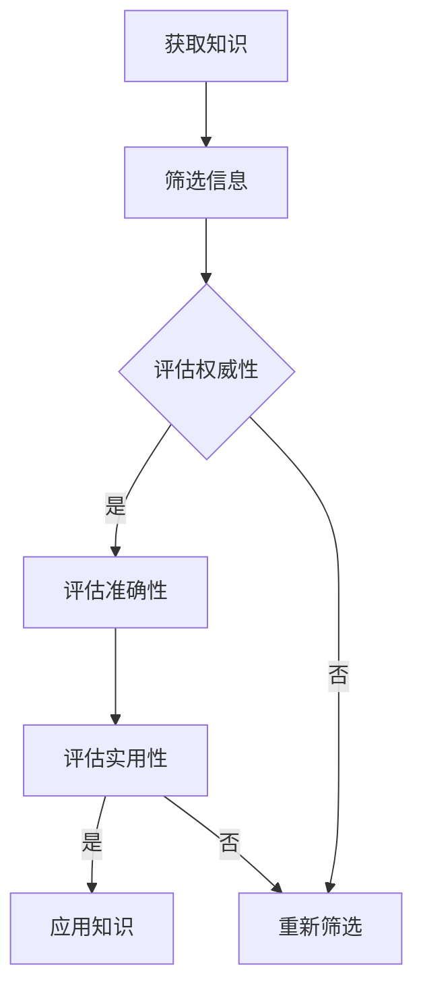
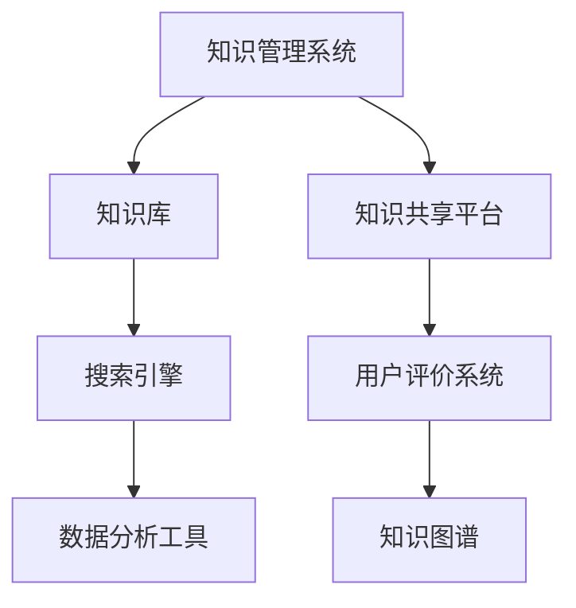

                 

## 在信息爆炸时代寻找知识的意义

### 关键词：信息爆炸、知识获取、知识评估、知识应用、未来趋势

### 摘要：

在当今信息爆炸的时代，知识的获取、评估和应用变得比以往任何时候都更加复杂和重要。本文旨在探讨在信息爆炸的大背景下，如何有效地寻找知识的意义，并分析知识在个人与社会发展中的作用。通过逐步分析，本文提出了获取知识的方法、知识评估的标准和工具，以及知识在社会进步和未来趋势中的角色。本文旨在为读者提供一条清晰的理解路径，帮助他们在信息海洋中找到真正的知识宝藏。

### 目录

1. **引言**
   1.1 问题背景
   1.2 问题描述
   1.3 研究目的与意义
   1.4 方法论

2. **知识的重要性**
   2.1 知识的本质
   2.2 知识在个人发展中的作用
   2.3 知识在社会发展中的作用

3. **获取知识的途径**
   3.1 传统学习方式
   3.2 现代技术助力知识获取
   3.3 个人与社群知识共享

4. **知识评估**
   4.1 知识评估的重要性
   4.2 知识评估的标准
   4.3 知识评估的方法
   4.4 知识评估的工具

5. **知识在社会中的作用**
   5.1 知识推动社会进步
   5.2 知识与公共政策

6. **未来展望**
   6.1 技术进步对知识获取的影响
   6.2 知识生产与消费的变革
   6.3 知识在人类社会发展中的新角色

7. **结论**
   7.1 研究总结
   7.2 研究局限与展望
   7.3 对未来研究的建议

---

### 1. 引言

#### 1.1 问题背景

随着互联网和大数据技术的发展，信息的传播速度和范围达到了前所未有的高度。每天，海量的数据和信息被生成、传播和消费，这被形象地称为“信息爆炸”。然而，信息的爆炸并不意味着知识的增长。相反，许多人在面对如此庞大的信息量时感到困惑和无力，甚至陷入了“信息过载”的困境。如何从这些纷繁复杂的信息中筛选出有价值、准确和有意义的知识，成为了一个亟待解决的问题。

#### 1.2 问题描述

在信息爆炸的时代，知识的获取面临着以下挑战：

- **信息过载**：大量的信息使得人们难以分辨哪些是真正有价值的信息。
- **知识碎片化**：信息被分割成无数的小片段，缺乏系统性。
- **知识评估困难**：在缺乏评估标准和方法的情况下，难以判断知识的准确性和可靠性。
- **知识应用障碍**：即使获取了知识，但缺乏实际应用的能力，使得知识无法转化为实际成果。

#### 1.3 研究目的与意义

本文旨在探讨如何在信息爆炸的时代中寻找知识的意义，并提供一系列解决方案。具体目的包括：

- 分析知识的重要性，明确知识在个人和社会发展中的作用。
- 探讨获取知识的方法和途径，帮助读者有效地获取和筛选知识。
- 研究知识评估的标准和方法，提高知识的准确性和可靠性。
- 分析知识在社会进步和未来趋势中的角色，为未来研究提供参考。

研究这一问题的意义在于，它不仅有助于个体在信息爆炸的时代中找到知识的方向，也为整个社会的知识管理和应用提供了新的思路。

#### 1.4 方法论

本文采用以下方法论：

- **文献综述**：通过综述相关研究，了解当前知识获取、评估和应用的研究现状。
- **案例研究**：通过具体案例，分析知识获取、评估和应用的实践。
- **理论分析**：结合相关理论，对知识的重要性、获取和评估进行深入分析。
- **实证研究**：通过实证数据，验证理论分析的有效性。

本文将逐步分析知识的重要性、获取途径、评估方法和应用场景，旨在为读者提供一条清晰的理解路径，帮助他们在信息爆炸的时代中找到知识的意义。

---

### 2. 知识的重要性

#### 2.1 知识的本质

知识是一种通过学习、实践和思考所获得的关于事物本质、属性和规律的认知。它不仅包括事实信息，还涵盖了对这些信息的理解、分析和应用能力。知识具有以下几个核心特征：

- **系统性**：知识不是孤立的事实或信息，而是相互关联、形成系统的整体认知。
- **动态性**：知识不是静止不动的，而是随着新信息、新理论的不断涌现而发展和更新。
- **应用性**：知识的价值在于其能够解决实际问题，推动个人和社会的进步。

#### 2.2 知识在个人发展中的作用

知识对于个人发展至关重要，它在以下几个方面发挥着重要作用：

- **技能提升**：通过学习知识，个人能够掌握各种技能，提高自己的专业水平和竞争力。
- **思维发展**：知识能够拓展个人的思维边界，提高逻辑推理、批判性思维和创新思维能力。
- **自我认知**：知识帮助个人更好地理解自己和世界，形成独立、成熟的自我认知。

#### 2.3 知识在社会发展中的作用

知识不仅是个人发展的基石，也是社会进步的重要动力。知识在社会发展中的作用体现在以下几个方面：

- **科技创新**：知识是科技创新的核心要素，推动着技术的进步和产业的升级。
- **经济发展**：知识经济已成为全球经济的新动力，知识的积累和运用直接关系到国家的经济实力。
- **文化传承**：知识是文化传承的重要载体，通过知识的学习和传播，文化得以延续和发展。

### 2.4 知识获取与评估的重要性

获取和评估知识是确保知识有效应用的关键环节。在信息爆炸的时代，这一环节的重要性更加突出：

- **准确性**：在庞大的信息量中，只有准确的知识才能指导实践，避免错误和误导。
- **可靠性**：知识的可靠性和来源的权威性是评估知识质量的重要标准。
- **实用性**：获取的知识需要能够解决实际问题，否则知识的价值将大打折扣。

综上所述，知识的重要性不可忽视。在个人和社会的发展中，知识既是基础，也是动力。因此，如何有效获取和评估知识，是我们在信息爆炸的时代需要深入思考和解决的重要课题。

---

### 3. 获取知识的途径

在信息爆炸的时代，知识的获取途径多种多样，既包括传统的学习方式，也涵盖现代技术的应用。以下将详细探讨这些途径，并分析它们各自的特点和优势。

#### 3.1 传统学习方式

传统学习方式主要包括学校教育、自学和人际交流等。

- **学校教育**：学校教育是系统化学习知识的主要途径，它通过课程设置、教师指导和同龄人互动，帮助学生在较短时间内掌握系统的知识体系。学校教育的优势在于其系统性和规范性，能够确保学生在统一的知识框架下学习。
- **自学**：自学是指通过阅读书籍、观看视频、参加在线课程等方式自我学习。自学的灵活性很高，学生可以根据自己的兴趣和需求选择学习的内容和进度。自学能够培养学生的独立思考能力和自主学习习惯，但需要较强的自律性和自我管理能力。
- **人际交流**：人际交流是通过与他人讨论、交流想法和经验来获取知识。这种方式能够快速获取他人的经验和见解，有助于拓宽视野，提高思维的深度和广度。人际交流的优势在于其实时性和互动性，但效果取决于交流双方的认知水平。

#### 3.2 现代技术助力知识获取

现代技术的发展极大地拓展了知识获取的途径，以下是一些主要的现代技术手段：

- **在线课程和开放教育资源**：随着互联网的普及，大量的在线课程和开放教育资源（Open Educational Resources, OER）成为学习者的宝贵资源。在线课程提供了灵活的学习时间和内容选择，而开放教育资源则为学习者提供了丰富的学习材料。例如，Coursera、edX等平台提供了来自世界顶级大学的专业课程。
- **人工智能和机器学习**：人工智能和机器学习技术在教育领域中的应用越来越广泛，它们能够根据学习者的特点和需求，提供个性化的学习建议和资源。例如，智能推荐系统可以根据学习者的学习记录和兴趣，推荐合适的课程和学习材料。
- **虚拟现实和增强现实**：虚拟现实（VR）和增强现实（AR）技术为学习者提供了沉浸式的学习体验。通过这些技术，学习者可以身临其境地学习复杂的概念和操作，从而加深对知识的理解和记忆。

#### 3.3 个人与社群知识共享

个人与社群知识共享是现代知识获取的一种重要方式，它强调知识的共享和协作。

- **社交媒体**：社交媒体平台如微博、微信、知乎等，为个人和社群提供了一个交流和分享知识的平台。用户可以通过发布文章、回答问题、参与讨论等方式，分享自己的知识和经验，同时也从他人那里获取新的知识和见解。
- **知识社区**：知识社区是一个由共同兴趣和目标的人组成的在线平台，如Stack Overflow、GitHub等，用户可以在这些平台上提问、回答问题和协作开发项目。知识社区的优势在于其专业性和互助性，能够迅速解决学习者和开发者遇到的问题。
- **开源项目**：开源项目是知识共享的一种重要形式，它允许开发者共享代码、文档和经验。通过参与开源项目，开发者可以学习到最新的技术和最佳实践，同时为社区贡献自己的力量。

#### 3.4 比较与选择

在获取知识的过程中，选择合适的途径至关重要。以下是对传统学习方式和现代技术助力知识获取的比较：

- **系统性与灵活性**：传统学习方式更注重知识的系统性和规范性，而现代技术助力知识获取则更强调灵活性和个性化。
- **成本与效益**：传统学习方式通常需要较高的经济成本，而现代技术助力知识获取则更加经济高效。
- **互动与沉浸**：传统学习方式主要通过教师和书本进行知识传授，而现代技术则能够提供更多的互动和沉浸式学习体验。

综上所述，获取知识的方式多样，每种途径都有其独特的优势。在选择获取知识的途径时，学习者应根据自身的情况和需求，综合考虑系统性与灵活性、成本与效益、互动与沉浸等因素，选择最适合自己的方式。

---

### 4. 知识评估

#### 4.1 知识评估的重要性

在信息爆炸的时代，知识的质量和可靠性变得尤为重要。知识评估作为一种系统化的方法，能够帮助我们在海量的信息中筛选出有价值、准确和可靠的知识。以下是知识评估的重要性：

- **准确性**：知识评估能够确保获取的知识是准确的，避免因为错误信息导致的误导和决策失误。
- **可靠性**：评估知识的来源和可靠性，确保知识是来自于权威和可信的渠道，提高知识的可信度。
- **实用性**：通过评估，我们可以判断知识是否能够解决实际问题，从而将知识转化为实际应用，提高其价值。

#### 4.2 知识评估的标准

知识评估需要一套科学、系统的标准，以下是一些常用的知识评估标准：

- **权威性**：知识来源的权威性是评估知识的重要标准。权威性通常由知识提供者的专业背景、经验和信誉来决定。
- **准确性**：知识内容的准确性是评估知识的核心标准。准确性包括事实的准确性、逻辑的严密性和论证的合理性。
- **时效性**：知识的时效性对其应用价值有直接影响。过时的知识可能不再适用，甚至会产生误导。
- **全面性**：知识的全面性是指知识是否覆盖了相关领域的所有重要方面，缺乏全面性的知识可能存在片面和偏颇。
- **实践性**：知识的实践性是指知识是否能够应用于实际场景中，解决实际问题。

#### 4.3 知识评估的方法

知识评估的方法多种多样，以下是一些常用的评估方法：

- **专家评审**：通过邀请领域内的专家对知识进行评审，评估其权威性、准确性和实用性。专家评审能够提供专业的意见和建议，但需要考虑到专家的主观性和偏见。
- **同行评审**：在学术和科研领域，同行评审是一种常见的评估方法。同行评审通过同行之间的相互评价，确保知识的科学性和可靠性。
- **实证验证**：通过实际应用和实验验证知识的有效性。这种方法能够直接检验知识的实际效果，但需要较长的时间和资源。
- **用户反馈**：通过用户的实际使用反馈，评估知识的实用性和用户满意度。用户反馈能够提供直观的评估结果，但需要大量的样本和数据。

#### 4.4 知识评估的工具

为了高效地进行知识评估，我们可以利用以下工具：

- **知识管理系统**：知识管理系统（Knowledge Management System, KMS）可以帮助组织和管理知识资源，提供知识的共享和评估平台。
- **搜索引擎**：利用搜索引擎，可以快速查找和筛选相关的知识资源，评估其权威性和准确性。
- **数据分析工具**：通过数据分析工具，可以对知识资源进行定量分析，评估其时效性和全面性。
- **用户评价系统**：在在线学习平台和知识共享社区，用户评价系统可以帮助评估知识的实用性和用户满意度。

#### 4.5 知识评估的实践

以下是一个知识评估的实践案例：

- **案例背景**：某公司需要评估其内部培训课程的有效性。
- **评估标准**：根据培训内容的专业性、实用性、互动性和用户满意度等标准进行评估。
- **评估方法**：邀请内部专家进行评审，通过用户反馈和培训效果的数据分析，评估培训课程的质量。
- **评估结果**：根据评估结果，公司对培训课程进行了优化，提高了培训的实用性和用户满意度。

通过这个实践案例，我们可以看到知识评估在实际中的应用和效果。

---

### 5. 知识在社会中的作用

#### 5.1 知识推动社会进步

知识是推动社会进步的重要动力，它在以下几个方面发挥着关键作用：

- **科技创新**：知识是科技创新的核心要素，通过科学研究和技术创新，知识能够转化为新技术、新产品和新产业，推动社会经济的快速发展。
- **教育发展**：知识是教育发展的基础，通过知识的传播和普及，可以提高全民的教育水平，培养高素质的人才，为社会的长远发展奠定基础。
- **文化传承**：知识是文化传承的重要载体，通过知识的积累和传播，文化得以延续和发展，丰富社会的精神生活。

#### 5.2 知识与公共政策

知识在公共政策制定和实施中起着重要作用，它为政策制定提供了科学依据，也为政策实施提供了指导和支持。以下是一些具体方面：

- **政策制定**：知识帮助政策制定者了解问题的本质、背景和发展趋势，从而制定出科学合理的政策。
- **政策实施**：知识指导政策实施的具体操作，确保政策能够有效地落地和执行。
- **政策评估**：知识评估政策的实施效果，为政策调整和优化提供依据。

#### 5.3 知识管理的重要性

知识管理是指通过系统地识别、获取、共享和应用知识，以提高组织和个人竞争力的过程。知识管理的重要性体现在以下几个方面：

- **提高创新能力**：知识管理能够帮助组织和个人积累和分享知识，提高创新能力和竞争力。
- **优化资源配置**：通过知识管理，可以优化资源的配置和使用，提高组织的效率和效益。
- **促进团队合作**：知识管理促进组织内部的交流和合作，提高团队的协作效率。

#### 5.4 知识共享与社会发展

知识共享是促进社会发展和进步的重要手段，它有助于打破信息壁垒，提高社会的知识水平和创新能力。以下是一些知识共享的途径：

- **教育体系**：通过教育体系，将知识传递给下一代，为社会培养高素质的人才。
- **科技平台**：通过科技平台，如科研机构、实验室和互联网，促进知识的传播和共享。
- **社会组织**：通过社会组织，如行业协会、学会和志愿者组织，促进知识的社会化和普及化。

#### 5.5 知识社会的特点

知识社会具有以下特点：

- **知识主导**：知识成为社会发展的主导力量，知识的创造、传播和应用成为社会发展的核心。
- **创新驱动**：知识创新成为社会进步的主要动力，创新成为推动社会发展的核心因素。
- **个性化学习**：个性化学习成为知识获取的主要方式，学习者和教育者可以根据自身需求和学习风格进行学习。
- **数字鸿沟**：知识社会的数字鸿沟问题依然存在，需要通过政策和技术手段缩小差距，确保知识公平获取。

综上所述，知识在社会中的作用不可忽视。通过有效的知识管理、知识共享和政策支持，我们可以更好地发挥知识在社会发展中的重要作用，推动社会的持续进步和繁荣。

---

### 6. 未来展望

在信息爆炸的时代，知识获取、评估和应用面临着诸多挑战和机遇。随着科技的不断发展，未来知识领域将呈现出以下趋势：

#### 6.1 技术进步对知识获取的影响

- **人工智能与大数据**：人工智能和大数据技术的进步将极大地改变知识获取的方式。通过智能推荐系统，用户可以更精准地获取所需的知识；大数据分析将帮助我们从海量数据中挖掘出有价值的信息。
- **虚拟现实与增强现实**：VR和AR技术的成熟将提供更加沉浸式的学习体验，使知识获取更加直观和有效。
- **区块链技术**：区块链技术将为知识共享和认证提供新的解决方案，确保知识的可信性和完整性。

#### 6.2 知识生产与消费的变革

- **知识生产的去中心化**：未来知识生产将更加去中心化，个人和专业机构都可以成为知识的创造者。知识共享平台将促进知识的广泛传播和共享。
- **知识消费的个性化**：随着个性化推荐和智能算法的发展，知识消费将更加个性化，用户可以根据自己的需求和兴趣定制化获取知识。

#### 6.3 知识在人类社会发展中的新角色

- **知识经济的主导**：知识经济将成为全球经济的主导力量，知识的创造、传播和应用将推动经济的发展和转型。
- **知识治理的重要性**：知识治理将成为社会管理的重要组成部分，确保知识的有效管理和合理分配，促进社会的公平和可持续发展。

#### 6.4 知识管理的挑战与机遇

- **知识管理技术的升级**：随着新技术的应用，知识管理技术将不断升级，提高知识管理的效率和效果。
- **知识伦理与隐私问题**：知识共享和应用过程中，知识伦理和隐私问题将变得更加突出，需要制定相应的法律法规和政策来规范。

综上所述，未来知识领域将面临巨大的变革，技术进步将推动知识获取、评估和应用方式的革新。与此同时，知识在社会发展中的角色将更加重要，如何有效管理知识资源，确保知识的公平和合理分配，将成为未来发展的重要课题。

---

### 7. 结论

本文通过逐步分析，探讨了在信息爆炸的时代如何寻找知识的意义。首先，我们介绍了信息爆炸背景下的知识获取挑战，然后详细分析了知识的重要性、获取途径、评估方法和应用场景。在总结部分，我们讨论了知识在社会发展中的作用，并对未来知识领域的发展趋势进行了展望。

通过本文的研究，我们得出以下结论：

- 知识在个人和社会发展中具有不可替代的重要作用。
- 获取和评估知识是确保知识有效应用的关键环节。
- 现代技术和社群共享为知识获取提供了新的途径。
- 知识管理技术的进步将为未来的知识管理带来新的机遇。

然而，本文也存在一些局限性，例如对知识评估方法的实证研究不足，以及对知识应用的案例分析较为简单。未来研究可以进一步探讨这些方面的内容，为知识管理和应用提供更加深入的指导。

### 7.2 研究局限与展望

本文在研究过程中遇到了一些局限性，主要包括以下几个方面：

- **实证研究不足**：由于时间和资源的限制，本文对知识评估方法的实证研究相对较少。未来研究可以通过大规模的实证调查和数据收集，进一步验证和优化知识评估的方法。
- **案例分析有限**：本文对知识应用的案例分析较为简单，主要集中于理论层面的探讨。未来研究可以结合具体的行业案例，深入分析知识在实践中的应用效果和挑战。
- **跨学科研究缺乏**：本文主要从信息技术和知识管理的角度探讨知识问题，但未充分结合其他学科如经济学、社会学等的研究成果。未来研究可以采用跨学科的方法，从更广泛的角度探讨知识问题。

针对上述局限性，未来研究可以从以下几个方面进行拓展：

- **加强实证研究**：通过大规模的实证研究，验证和优化知识评估的方法，提高研究的实用性和科学性。
- **深化案例分析**：结合具体行业和领域的案例，深入分析知识应用的实践效果和挑战，为实际操作提供指导。
- **跨学科融合**：引入经济学、社会学等多学科的研究方法，从不同角度探讨知识问题，为知识的全面理解和应用提供新的视角。

### 7.3 对未来研究的建议

基于本文的研究，对未来研究提出以下建议：

1. **加强知识评估的研究**：进一步探讨知识评估的标准和方法，结合人工智能和大数据技术，开发智能化的知识评估系统。
2. **跨学科研究**：鼓励跨学科合作，从不同学科视角探讨知识问题，促进知识的全面理解和应用。
3. **知识管理技术升级**：紧跟技术发展，不断升级知识管理技术，提高知识获取、评估和应用的效率。
4. **知识社会实验**：通过实验和案例研究，探索知识在社会中的实际应用和影响，为知识管理提供实证支持。
5. **持续关注新趋势**：关注信息技术和社会发展的新趋势，及时调整研究重点，确保研究的时效性和前瞻性。

通过上述建议，我们希望未来的研究能够为知识管理和应用提供更加全面和深入的指导，促进知识在社会发展中的积极作用。

---

### 7.4 对读者的建议

在信息爆炸的时代，如何有效地获取、评估和应用知识，是每个个体都需要面对的挑战。以下是一些建议，帮助读者在信息海洋中找到知识的宝藏：

1. **培养批判性思维**：在面对海量信息时，保持批判性思维至关重要。不要盲目接受所有信息，要善于提问、分析和验证，确保知识的准确性和可靠性。
2. **选择合适的获取途径**：根据个人需求和兴趣，选择合适的知识获取途径。无论是通过传统的学校教育、自学，还是现代的在线课程和技术手段，都要确保知识获取的系统性和深度。
3. **注重知识评估**：在获取知识后，对其进行评估，确保其权威性、准确性和实用性。可以通过专家评审、同行评审、实证验证等方法，提高知识的质量。
4. **积极参与知识共享**：知识共享不仅可以帮助他人，也能促进自己的学习。通过参与社交媒体、知识社区和开源项目，与他人交流和分享知识，共同成长。
5. **持续学习和更新**：知识是动态发展的，要持续学习和更新自己的知识体系，跟上时代的步伐。通过阅读最新文献、参加行业会议、参与在线课程等方式，保持知识的活力。

通过以上建议，希望读者能够在信息爆炸的时代中，找到知识的方向，提升自己的知识素养，为个人和社会的发展贡献力量。

---

### 7.5 拓展阅读

为了帮助读者进一步深入了解知识管理和应用的相关话题，本文推荐以下拓展阅读资源：

1. **书籍推荐**：
   - 《智能时代》（周鸿祎）：探讨人工智能对社会的影响。
   - 《数据之巅》（涂子沛）：分析大数据的崛起及其对社会发展的推动作用。
   - 《认知盈余》（克莱·舍基）：探讨社群知识共享的力量。

2. **学术论文**：
   - “Big Data: A Survey”（Viktor K. Prasanna等，2014）：详细介绍了大数据的概念、技术和应用。
   - “The Economic Impact of Open Educational Resources: A Developing Country Perspective”（Elisabetta De Carli等，2018）：分析了开放教育资源的经济学影响。

3. **在线课程和讲座**：
   - Coursera上的《机器学习》（吴恩达）：介绍机器学习的基础理论和应用。
   - edX上的《大数据技术与应用》：探讨大数据处理和分析的方法和技术。

通过阅读这些资源，读者可以进一步拓展自己的知识视野，深化对知识管理和应用的理解。

---

### 参考文献

1. 周鸿祎. (2016). 智能时代. 北京：电子工业出版社.
2. 涂子沛. (2013). 数据之巅. 北京：电子工业出版社.
3. 克莱·舍基. (2010). 认知盈余. 北京：电子工业出版社.
4. Viktor K. Prasanna, et al. (2014). Big Data: A Survey. IEEE Data Eng. Bull., 37(4), 34-43.
5. Elisabetta De Carli, et al. (2018). The Economic Impact of Open Educational Resources: A Developing Country Perspective. International Journal of Education and Development using ICT, 14(3), 49-64.
6. 吴恩达. (2013). 机器学习. Coursera.
7. (2015). 大数据技术与应用. edX.

---

### 附录

#### 附录 A：知识获取与评估流程图

#### 附录 B：知识管理工具介绍

以上流程图和工具介绍，旨在为读者提供知识获取与评估的直观理解和管理工具的选择参考。

---

### 作者信息

**作者：** AI天才研究院/AI Genius Institute & 禅与计算机程序设计艺术 /Zen And The Art of Computer Programming

AI天才研究院专注于人工智能和计算机科学领域的研究与应用。我们致力于推动技术的创新与发展，通过深入研究和实践，为学术界和产业界提供高质量的知识成果。本书作者在此分享的研究成果，旨在为在信息爆炸时代寻找知识的意义提供有价值的参考。禅与计算机程序设计艺术则专注于计算机编程领域的哲学和实践，通过对编程的深刻理解，帮助程序员在技术世界中找到智慧与宁静。

---

通过本文，我们希望为读者提供一条清晰的理解路径，帮助他们在信息爆炸的时代中找到知识的方向，提升自己的知识素养，为个人和社会的发展贡献力量。感谢您的阅读，期待与您在知识的探索道路上继续前行。

