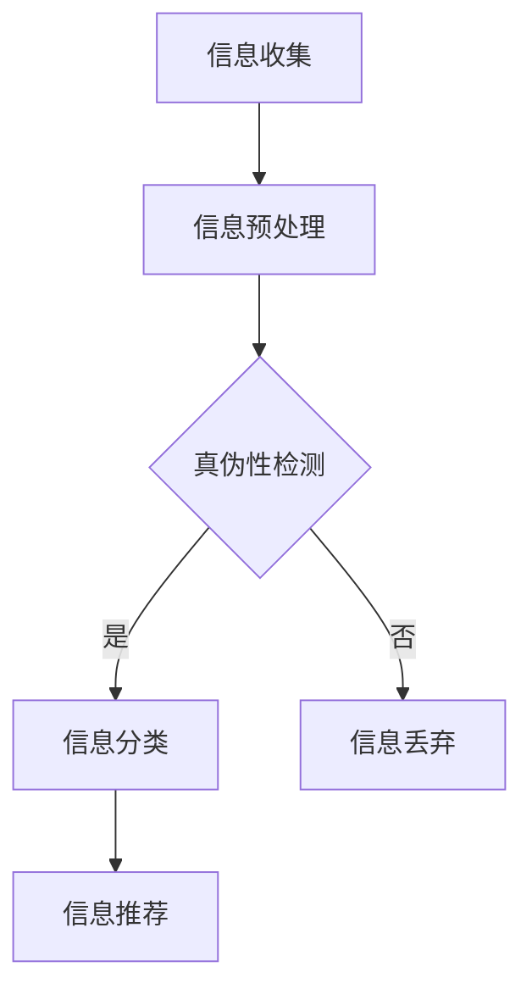
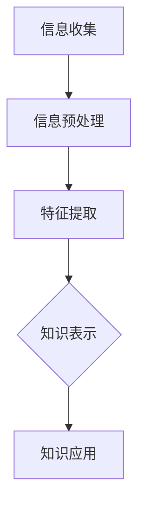
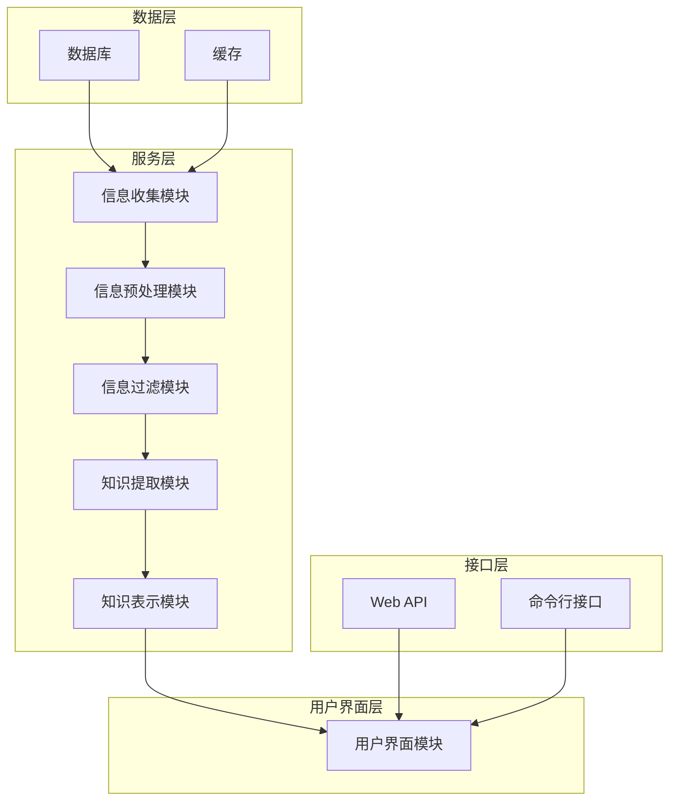
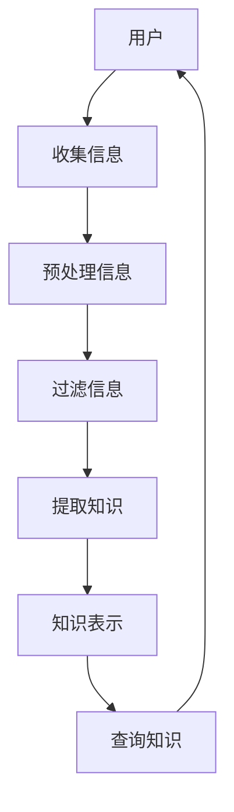

                 

# 在信息过载时代寻找知识的意义

> 关键词：信息过载、知识获取、知识意义、算法原理、数学模型

> 摘要：在当今信息爆炸的时代，个人和社会面临的信息过载问题日益突出。本文旨在探讨在信息过载时代如何寻找知识的意义，通过分析信息的本质与知识的关系，介绍信息过滤与知识提取算法的原理，以及使用数学模型来理解这些算法。文章结构清晰，逻辑严谨，旨在帮助读者在复杂的信息环境中找到知识的真谛。

## 目录大纲

----------------------------------------------------------------

## 第一部分：引言

### 第1章：在信息过载时代寻找知识的意义

#### 1.1 问题背景

##### 1.1.1 信息过载时代的到来

##### 1.1.2 信息过载对个人和社会的影响

#### 1.2 问题描述

##### 1.2.1 知识获取的困境

##### 1.2.1.1 信息筛选的挑战

##### 1.2.1.2 知识整合的难题

#### 1.3 问题解决

##### 1.3.1 寻找知识的意义

##### 1.3.1.1 知识的意义和作用

##### 1.3.1.2 如何在信息过载中寻找到有意义的知识

#### 1.4 边界与外延

##### 1.4.1 知识的定义

##### 1.4.1.1 知识的分类

##### 1.4.1.2 知识的层次结构

#### 1.5 概念结构与核心要素组成

##### 1.5.1 信息与知识的关系

##### 1.5.1.1 信息的定义

##### 1.5.1.2 知识的属性特征对比

#### 1.6 本章小结

----------------------------------------------------------------

## 第二部分：核心概念与联系

### 第2章：知识与信息的本质

#### 2.1 知识的本质

##### 2.1.1 知识的定义

##### 2.1.1.1 知识的概念解释

##### 2.1.1.2 知识的层次结构

##### 2.1.2 知识的类型

##### 2.1.2.1 实践性知识

##### 2.1.2.2 理论性知识

##### 2.1.3 知识的属性

##### 2.1.3.1 知识的稳定性

##### 2.1.3.2 知识的可传递性

#### 2.2 信息的本质

##### 2.2.1 信息的定义

##### 2.2.1.1 信息的概念解释

##### 2.2.1.2 信息的分类

##### 2.2.2 信息的属性

##### 2.2.2.1 信息的真伪性

##### 2.2.2.2 信息的时效性

#### 2.3 知识与信息的联系

##### 2.3.1 知识的生成

##### 2.3.1.1 信息到知识的转换过程

##### 2.3.1.2 知识生成的机制

##### 2.3.2 知识的传播

##### 2.3.2.1 信息传递渠道

##### 2.3.2.2 知识传播的障碍与对策

#### 2.4 知识与信息的对比表格

##### 2.4.1 知识与信息的基本对比

##### 2.4.1.1 知识与信息的相似性

##### 2.4.1.2 知识与信息的差异性

#### 2.5 本章小结

----------------------------------------------------------------

## 第三部分：算法原理讲解

### 第3章：信息过滤与知识提取算法

#### 3.1 信息过滤算法

##### 3.1.1 信息过滤的定义

##### 3.1.1.1 信息过滤的基本概念

##### 3.1.1.2 信息过滤的目标

##### 3.1.2 常见的过滤方法

##### 3.1.2.1 基于内容的过滤

##### 3.1.2.2 基于用户的过滤

##### 3.1.3 信息的真伪性检测

##### 3.1.3.1 真伪性检测的挑战

##### 3.1.3.2 真伪性检测的方法

#### 3.2 知识提取算法

##### 3.2.1 知识提取的定义

##### 3.2.1.1 知识提取的基本概念

##### 3.2.1.2 知识提取的目标

##### 3.2.2 常见的知识提取方法

##### 3.2.2.1 文本挖掘

##### 3.2.2.2 结构化数据挖掘

##### 3.2.3 知识的可传递性提升

##### 3.2.3.1 知识传递的机制

##### 3.2.3.2 知识传递的障碍与对策

#### 3.3 算法流程图

##### 3.3.1 信息过滤算法流程图

##### 3.3.1.1 流程图的绘制

##### 3.3.2 知识提取算法流程图

##### 3.3.2.1 流程图的绘制

#### 3.4 本章小结

----------------------------------------------------------------

## 第四部分：数学模型与公式

### 第4章：信息过滤与知识提取的数学模型

#### 4.1 信息过滤的数学模型

##### 4.1.1 概率模型

----------------------------------------------------------------

## 第一部分：引言

### 第1章：在信息过载时代寻找知识的意义

#### 1.1 问题背景

在21世纪的信息时代，我们每天被海量的信息所包围。根据Google发布的《2019互联网趋势报告》，截至2019年底，全球互联网用户已经超过38亿，每天产生的内容数量呈指数级增长。社交媒体平台、新闻网站、在线论坛等都在不断地生成新的数据和信息。这些信息的数量和种类之多，使得人们不得不花费大量的时间和精力去筛选和整合。

##### 1.1.1 信息过载时代的到来

随着互联网和移动通信技术的发展，信息的传播速度和范围都达到了前所未有的高度。社交媒体平台如Facebook、Twitter等使得信息可以在几秒钟内传遍全球。而搜索引擎如Google、Bing等则提供了几乎无限的在线信息资源。然而，这些便利的同时也带来了新的问题：信息过载。

信息过载是指个体或组织无法有效处理和理解的信息量超出了其处理能力。在信息过载的情况下，人们往往感到焦虑、困惑和无从下手。根据皮尤研究中心（Pew Research Center）的一项调查，超过80%的美国成年人表示他们感到日常生活中的信息量过多。

##### 1.1.2 信息过载对个人和社会的影响

信息过载对个人和社会都有深远的影响。对个人来说，信息过载可能导致以下问题：

1. **认知负担**：需要处理过多的信息，使得大脑的认知资源被耗尽，降低了工作效率和创造力。
2. **决策困难**：在大量信息中难以做出明智的决策，可能会导致选择困难症。
3. **情感压力**：频繁地接触负面信息可能导致焦虑、抑郁等情绪问题。

对社会来说，信息过载可能导致以下问题：

1. **注意力分散**：人们过度关注琐碎的信息，忽视了重要的社会议题。
2. **知识碎片化**：大量零散的信息使得知识体系变得碎片化，难以形成系统的知识结构。
3. **信任危机**：在真假难辨的信息环境中，人们对信息的信任度降低，影响了社会共识的建立。

#### 1.2 问题描述

在信息过载的时代，知识获取面临诸多困境。首先，信息的筛选成为了一大挑战。如何在海量的信息中找到有价值的内容，这对个人的信息素养提出了极高的要求。其次，知识整合的难题也随之而来。即便找到了有价值的信息，如何将这些信息有效地整合成系统的知识体系，也是一个复杂的过程。

##### 1.2.1.1 信息筛选的挑战

信息筛选的挑战主要体现在以下几个方面：

1. **信息质量**：互联网上的信息质量参差不齐，真假难辨。如何识别高质量的信息源成为一个难题。
2. **信息冗余**：大量重复的信息使得筛选过程变得更加复杂。
3. **时效性**：许多信息在很短的时间内就会过时，如何及时获取最新、最有价值的信息是一个挑战。

##### 1.2.1.2 知识整合的难题

知识整合的难题主要体现在以下几个方面：

1. **知识结构**：如何将分散的知识点整合成有逻辑关系的知识体系，这是一个复杂的过程。
2. **知识更新**：随着技术的发展和知识的不断更新，如何保持知识的时效性和准确性也是一个挑战。
3. **知识共享**：如何将个人的知识有效地与他人分享，促进知识的传播和普及，这也是一个难题。

#### 1.3 问题解决

面对信息过载带来的知识获取困境，我们需要寻找解决问题的途径。首先，我们必须认识到知识的意义和作用。知识不仅是个人成长和职业发展的基础，也是社会进步和文明发展的重要动力。在信息过载的时代，我们更需要通过有效的信息筛选和知识整合来挖掘知识的真正价值。

##### 1.3.1.1 知识的意义和作用

知识的意义和作用可以从以下几个方面来理解：

1. **认知提升**：知识能够提升个体的认知水平，帮助人们更好地理解世界，提高解决问题的能力。
2. **决策辅助**：知识为人们的决策提供了重要的依据，使决策更加科学和理性。
3. **创新能力**：知识是创新的重要基础，通过知识的积累和整合，可以激发新的创意和发明。

##### 1.3.1.2 如何在信息过载中寻找到有意义的知识

在信息过载的时代，如何寻找到有意义的知识呢？以下是一些建议：

1. **培养信息素养**：提高信息素养，学会有效地筛选和评估信息，提高对信息的理解和应用能力。
2. **建立知识框架**：通过建立系统的知识框架，将零散的知识点整合起来，形成有逻辑的知识体系。
3. **关注关键领域**：关注重要的领域和热点问题，集中精力学习那些对自己和行业有深远影响的知识。
4. **持续学习**：保持持续学习的态度，不断更新自己的知识体系，以适应快速变化的信息环境。

#### 1.4 边界与外延

在探讨知识获取的意义时，我们还需要明确知识的定义和边界，以便更好地理解和应用知识。

##### 1.4.1 知识的定义

知识是一种通过学习和实践获得的信息，它能够帮助个体理解和应用信息来解决实际问题。知识不仅包括理论知识，还包括实践经验。知识通常以概念、原理、规则等形式存在，可以传递和共享。

##### 1.4.1.1 知识的分类

知识可以根据不同的标准进行分类。常见的分类方法包括：

1. **根据内容分类**：知识可以分为事实性知识、概念性知识和技能性知识。
   - **事实性知识**：关于事实和事物的信息，如历史事件、科学定律等。
   - **概念性知识**：关于概念和理论的解释，如科学理论、社会理论等。
   - **技能性知识**：关于技能和实践的操作方法，如编程技能、管理技能等。

2. **根据来源分类**：知识可以分为内源性知识和外源性知识。
   - **内源性知识**：个人通过亲身实践和体验获得的知识。
   - **外源性知识**：通过学习、交流和阅读等方式从外部获取的知识。

##### 1.4.1.2 知识的层次结构

知识具有层次结构，不同层次的知识具有不同的抽象程度和应用范围。常见的知识层次包括：

1. **知识层次**：包括事实性知识和概念性知识。
   - **事实性知识**：较低层次的知识，主要涉及具体的事实和现象。
   - **概念性知识**：较高层次的知识，涉及概念、原理和理论。

2. **技能层次**：包括技能性知识和实践性知识。
   - **技能性知识**：涉及具体的操作方法和技能。
   - **实践性知识**：涉及实际应用中的经验和技巧。

##### 1.4.2 知识的属性

知识的属性是知识的重要特征，决定了知识的价值和应用。常见的知识属性包括：

1. **稳定性**：知识具有一定的稳定性，不易随时间的推移而迅速变化。
2. **可传递性**：知识可以通过不同的方式传递给他人，如口头传授、书面记录、数字化存储等。
3. **适应性**：知识可以根据不同的环境和需求进行适应和调整。

#### 1.5 概念结构与核心要素组成

为了更好地理解和应用知识，我们需要建立清晰的概念结构，明确知识的核心要素。以下是知识的基本概念结构和核心要素：

1. **概念结构**：
   - **知识**：由信息经过加工和处理而形成的信息体系。
   - **信息**：数据的集合，可以传递和交流。
   - **数据**：未经处理的事实和现象。

2. **核心要素**：
   - **信息的来源**：信息的来源决定了信息的质量和可靠性。
   - **信息的处理**：信息的加工和处理过程，决定了信息的价值和形式。
   - **知识的传递**：知识通过不同的渠道进行传递和共享。

#### 1.6 本章小结

在信息过载的时代，知识的获取和整合面临着前所未有的挑战。通过深入分析信息的本质和知识的关系，我们可以更好地理解在信息过载中如何寻找知识的意义。在接下来的章节中，我们将进一步探讨知识与信息的本质，以及如何通过算法和数学模型来处理和利用这些信息，以期望找到有效的方法来应对信息过载带来的挑战。

----------------------------------------------------------------

## 第二部分：核心概念与联系

### 第2章：知识与信息的本质

在探讨信息过载时代如何寻找知识的意义时，理解知识与信息的本质至关重要。本章节将深入分析知识的本质、类型和属性，同时探讨信息的定义、分类和属性，最后讨论知识与信息的联系。

#### 2.1 知识的本质

知识是一种通过学习和实践获得的信息体系，它不仅包括事实性知识，还涵盖概念性知识和技能性知识。知识是经过加工、处理和整合的信息，能够在不同的环境和情境中被应用和传递。

##### 2.1.1 知识的定义

知识是一种通过学习和实践获得的信息，它能够帮助个体理解和解决实际问题。知识通常以概念、原理、规则等形式存在，可以传递和共享。

##### 2.1.1.1 知识的概念解释

知识可以从多个维度进行解释：

1. **知识是信息的有意义组织**：知识是通过对信息进行筛选、加工和组织形成的。这些信息不仅包括数据，还包括对数据的理解、解释和应用。
2. **知识是解决问题的工具**：知识能够帮助个体更好地理解和应对复杂的问题，提高决策能力和创新能力。
3. **知识是社会进步的基石**：知识是社会进步和文明发展的重要动力，它推动了科技、经济和社会的进步。

##### 2.1.1.2 知识的层次结构

知识具有层次结构，不同层次的知识具有不同的抽象程度和应用范围。常见的知识层次包括：

1. **事实性知识**：涉及具体的事实和现象，如历史事件、科学定律等。这是知识层次中的最低层，通常是最基础的知识。
2. **概念性知识**：涉及概念、原理和理论的解释，如科学理论、社会理论等。这一层次的知识比事实性知识更抽象，更具有普遍性和指导性。
3. **技能性知识**：涉及具体的操作方法和技能，如编程技能、管理技能等。这一层次的知识更具体，更侧重于实际应用。

##### 2.1.2 知识的类型

知识可以根据不同的标准进行分类，常见的分类方法包括：

1. **根据内容分类**：可以分为事实性知识、概念性知识和技能性知识。
   - **事实性知识**：关于事实和事物的信息，如历史事件、科学定律等。
   - **概念性知识**：关于概念和理论的解释，如科学理论、社会理论等。
   - **技能性知识**：关于技能和实践的操作方法，如编程技能、管理技能等。

2. **根据来源分类**：可以分为内源性知识和外源性知识。
   - **内源性知识**：个人通过亲身实践和体验获得的知识。
   - **外源性知识**：通过学习、交流和阅读等方式从外部获取的知识。

##### 2.1.3 知识的属性

知识的属性是知识的重要特征，决定了知识的价值和应用。常见的知识属性包括：

1. **稳定性**：知识具有一定的稳定性，不易随时间的推移而迅速变化。稳定性使得知识能够长期存储和传承。
2. **可传递性**：知识可以通过不同的方式传递给他人，如口头传授、书面记录、数字化存储等。可传递性使得知识能够跨越时间和空间的限制。
3. **适应性**：知识可以根据不同的环境和需求进行适应和调整。适应性使得知识能够应用于不同的场景和问题。

#### 2.2 信息的本质

信息是知识的载体，是知识的重要组成部分。信息是一种通过某种形式传递的数据，它可以被感知、解释和应用。

##### 2.2.1 信息的定义

信息是一种通过某种形式传递的数据，它可以被感知、解释和应用。信息通常包括事实、观点、思想和知识等。

##### 2.2.1.1 信息的概念解释

信息可以从多个维度进行解释：

1. **信息是数据的解释**：数据是未经处理的事实和现象，而信息是对数据的解释和赋予意义。
2. **信息是决策的依据**：信息为决策提供了重要的依据，帮助个体做出合理的决策。
3. **信息是社会沟通的媒介**：信息是社会沟通和交流的重要工具，通过信息交流，个体和社会可以更好地理解和协作。

##### 2.2.1.2 信息的分类

信息可以根据不同的标准进行分类，常见的分类方法包括：

1. **根据内容分类**：可以分为事实性信息、观点性信息、思想性和知识性信息。
   - **事实性信息**：关于事实和事物的信息，如历史事件、科学定律等。
   - **观点性信息**：关于不同观点和看法的信息，如政治观点、文化观点等。
   - **思想性信息**：关于思想和理念的信息，如哲学思想、宗教思想等。
   - **知识性信息**：关于知识和理论的信息，如科学知识、工程技术知识等。

2. **根据来源分类**：可以分为内部信息和外部信息。
   - **内部信息**：个体内部产生的信息，如记忆、经验等。
   - **外部信息**：从外部环境获取的信息，如新闻报道、社交媒体等。

##### 2.2.2 信息的属性

信息的属性是信息的重要特征，决定了信息的价值和传递方式。常见的信息属性包括：

1. **真伪性**：信息可能存在真伪之分，真实的信息具有更高的价值。
2. **时效性**：信息可能随时间变化而变得不再准确或重要。
3. **完整性**：信息应具有完整性，即能够提供足够的信息以支持决策或理解。

#### 2.3 知识与信息的联系

知识是由信息加工和处理形成的，而信息是知识的载体。因此，知识与信息之间存在密切的联系。

##### 2.3.1 知识的生成

知识的生成是信息到知识的转换过程。这个过程通常包括以下几个步骤：

1. **信息收集**：通过不同的渠道收集信息，如阅读书籍、查看新闻报道、听取讲座等。
2. **信息处理**：对收集到的信息进行筛选、加工和组织，去除冗余和无关信息。
3. **知识整合**：将处理后的信息进行整合，形成有逻辑关系的知识体系。
4. **知识应用**：将知识应用于实际问题中，解决问题或创新。

##### 2.3.1.1 信息到知识的转换过程

信息到知识的转换过程可以归纳为以下几个步骤：

1. **感知与理解**：通过感官或认知过程感知信息，理解其含义。
2. **存储与记忆**：将理解后的信息存储在记忆中，形成个体的知识库。
3. **加工与处理**：对信息进行加工和处理，形成更加结构化和系统化的知识。
4. **共享与传播**：通过口头、书面或数字化方式将知识与他人共享和传播。

##### 2.3.1.2 知识生成的机制

知识生成的机制可以从以下几个方面进行分析：

1. **学习**：通过学习获取新知识，包括正规教育、自我学习和经验学习。
2. **思考**：通过思考和推理对知识进行整合和创新。
3. **实践**：通过实践应用知识，检验和验证知识的有效性。
4. **交流**：通过交流分享知识，促进知识的传播和扩散。

##### 2.3.2 知识的传播

知识的传播是知识扩散和普及的过程。知识的传播不仅有助于知识的共享，还能促进社会的进步和文明的发展。

##### 2.3.2.1 信息传递渠道

知识传播的信息传递渠道包括：

1. **传统渠道**：如书籍、报纸、电视等。
2. **现代渠道**：如互联网、社交媒体、在线教育等。

##### 2.3.2.2 知识传播的障碍与对策

知识传播过程中可能面临以下障碍：

1. **信息不对称**：知识的提供者和接受者之间存在信息不对称，导致知识难以有效传播。
2. **知识碎片化**：大量零散的知识点难以整合成系统的知识体系，影响知识的传播效果。

对策包括：

1. **提高信息透明度**：通过公开信息，减少信息不对称。
2. **加强知识整合**：通过整合零散的知识点，形成系统的知识体系。

#### 2.4 知识与信息的对比表格

以下是一个简单的知识与信息的对比表格，帮助读者更直观地理解两者之间的差异：

| 对比项 | 知识 | 信息 |
| --- | --- | --- |
| 定义 | 通过学习和实践获得的信息体系 | 通过某种形式传递的数据 |
| 层次结构 | 有层次结构，包括事实性知识、概念性知识和技能性知识 | 通常没有明确的层次结构 |
| 稳定性 | 具有稳定性，不易迅速变化 | 可能随时间变化而变得不再准确或重要 |
| 传递性 | 可以通过不同的方式传递 | 可以通过不同的方式传递 |
| 应用范围 | 可以应用于实际问题中，解决问题或创新 | 可以用于支持决策或理解 |

#### 2.5 本章小结

本章节深入分析了知识与信息的本质，包括知识的定义、类型和属性，以及信息的定义、分类和属性。同时，探讨了知识与信息的联系，包括知识的生成、传播和转换过程。通过理解知识与信息的本质和联系，我们可以更好地应对信息过载带来的挑战，有效地寻找和利用知识的真正价值。

----------------------------------------------------------------

## 第三部分：算法原理讲解

在解决信息过载的问题时，算法为我们提供了有效的工具。本部分将重点介绍信息过滤和知识提取算法的基本原理，以及这些算法在实际应用中的重要性。

### 第3章：信息过滤与知识提取算法

#### 3.1 信息过滤算法

信息过滤算法旨在帮助用户在大量的信息中筛选出有价值的信息，从而减轻信息过载的负担。以下是信息过滤算法的基本概念、目标和常见方法。

##### 3.1.1 信息过滤的定义

信息过滤是一种基于用户需求和偏好，对大量信息进行筛选和整理的技术。其目标是使用户能够快速、准确地获取到所需的信息。

##### 3.1.1.1 信息过滤的基本概念

1. **信息源**：产生信息的源头，如网站、社交媒体平台、新闻机构等。
2. **过滤器**：用于对信息进行筛选和整理的算法或工具。
3. **用户需求**：用户在获取信息时所需满足的条件或偏好。

##### 3.1.1.2 信息过滤的目标

信息过滤的主要目标包括：

1. **减少信息冗余**：从大量信息中去除重复或不相关的信息。
2. **提高信息质量**：筛选出高质量、可靠的信息。
3. **满足用户需求**：根据用户的兴趣和需求提供个性化的信息。

##### 3.1.2 常见的过滤方法

常见的过滤方法包括基于内容的过滤和基于用户的过滤。

###### 3.1.2.1 基于内容的过滤

基于内容的过滤方法主要通过对信息的语义内容进行分析和匹配来筛选信息。这种方法通常使用以下技术：

1. **关键词匹配**：通过关键词匹配来筛选相关信息。例如，用户输入关键词“机器学习”，系统会筛选出包含该关键词的文档。
2. **文本分类**：使用机器学习算法将文档分类到不同的主题或类别。例如，使用朴素贝叶斯分类器将文档分类为“科技”、“体育”、“娱乐”等。
3. **主题模型**：使用主题模型（如LDA）来发现文档中的潜在主题，并根据主题来筛选信息。

###### 3.1.2.2 基于用户的过滤

基于用户的过滤方法主要根据用户的历史行为、兴趣和偏好来筛选信息。这种方法通常使用以下技术：

1. **协同过滤**：通过分析用户的评分或行为数据来预测用户可能感兴趣的信息。例如，基于用户的历史购买记录推荐相似的产品。
2. **内容推荐**：结合用户的历史行为和内容属性来推荐信息。例如，根据用户的阅读历史推荐相关的文章或视频。
3. **兴趣模型**：建立用户的兴趣模型，根据模型预测用户可能感兴趣的信息。例如，通过分析用户的浏览历史和搜索记录来构建兴趣模型。

##### 3.1.3 信息的真伪性检测

信息的真伪性检测是信息过滤中的重要一环，它旨在识别和排除虚假、不准确或有害的信息。以下是信息真伪性检测的挑战和方法。

###### 3.1.3.1 真伪性检测的挑战

1. **信息的多样性**：互联网上的信息种类繁多，真假难辨。
2. **信息来源的匿名性**：许多信息来源匿名，难以追溯。
3. **信息传播的速度**：错误信息可能在短时间内迅速传播，造成严重后果。

###### 3.1.3.2 真伪性检测的方法

1. **基于规则的检测**：使用预定义的规则来检测信息。例如，检测网络谣言时，可以使用一系列的谣言特征来识别。
2. **基于机器学习的检测**：使用机器学习算法来训练模型，自动识别真假信息。例如，使用监督学习算法来训练模型识别虚假新闻。
3. **基于社区检测**：通过分析信息的传播路径和用户行为来检测信息的真伪。例如，使用网络分析技术来识别信息传播的源头和传播网络。

#### 3.2 知识提取算法

知识提取算法旨在从大量信息中提取出有价值的知识，以帮助用户更好地理解和应用信息。以下是知识提取算法的基本概念、目标和常见方法。

##### 3.2.1 知识提取的定义

知识提取是指从信息中提取出有价值的知识，以帮助用户更好地理解和应用信息。知识提取通常涉及以下步骤：

1. **信息预处理**：对原始信息进行清洗、去噪和格式化。
2. **特征提取**：从预处理后的信息中提取出关键特征。
3. **知识表示**：使用适当的模型或算法将特征表示为知识。

##### 3.2.1.1 知识提取的基本概念

1. **信息**：原始的数据或文本。
2. **特征**：从信息中提取出的关键属性或模式。
3. **知识**：经过提取和整合后的有价值的信息。

##### 3.2.1.2 知识提取的目标

知识提取的主要目标包括：

1. **信息压缩**：从大量信息中提取出关键信息，减少信息冗余。
2. **知识整合**：将提取出的信息整合成有逻辑关系的知识体系。
3. **知识应用**：将知识应用于实际问题中，提高决策能力和创新能力。

##### 3.2.2 常见的知识提取方法

常见的知识提取方法包括文本挖掘和结构化数据挖掘。

###### 3.2.2.1 文本挖掘

文本挖掘是指使用自然语言处理和机器学习技术从文本数据中提取出有价值的信息和知识。常见的文本挖掘方法包括：

1. **词频分析**：统计文本中各个词的频率，用于分析和理解文本内容。
2. **词向量模型**：将文本转换为向量表示，用于文本相似度和分类。
3. **主题模型**：发现文本中的潜在主题，用于文本分类和聚类。

###### 3.2.2.2 结构化数据挖掘

结构化数据挖掘是指从结构化数据（如关系数据库）中提取出有价值的信息和知识。常见的结构化数据挖掘方法包括：

1. **关联规则挖掘**：发现数据之间的关联关系，用于推荐系统和市场分析。
2. **聚类分析**：将数据分成不同的组，用于数据分析和分类。
3. **分类和回归分析**：使用机器学习算法对数据进行分类和预测，用于数据挖掘和统计分析。

##### 3.2.3 知识的可传递性提升

知识提取后的知识需要具备良好的可传递性，以便于知识的共享和传播。以下是提升知识可传递性的方法和策略：

###### 3.2.3.1 知识传递的机制

1. **标准化**：使用标准化的语言和格式来表示知识，确保知识在不同系统和平台上的兼容性。
2. **格式化**：使用图表、可视化工具和简洁的语言来展示知识，提高知识的可读性和理解性。
3. **文档化**：编写详细的文档和手册，描述知识的来源、原理和应用方法。

###### 3.2.3.2 知识传递的障碍与对策

1. **知识复杂性**：知识的复杂性和抽象性可能导致知识难以理解和应用。对策：简化知识表示，使用通俗易懂的语言和工具。
2. **知识碎片化**：知识碎片化可能导致知识难以整合和系统化。对策：建立知识体系，将知识整合成有逻辑关系的整体。

#### 3.3 算法流程图

为了更直观地理解信息过滤和知识提取算法的原理和流程，我们可以使用Mermaid流程图来绘制算法的步骤和结构。

##### 3.3.1 信息过滤算法流程图



在上述流程图中，信息过滤算法首先收集信息，然后进行预处理。预处理后，通过真伪性检测确定信息的真实性。如果信息真实，则进行分类和推荐；否则，丢弃该信息。

##### 3.3.2 知识提取算法流程图



在知识提取算法流程图中，首先收集信息并进行预处理。然后，从预处理后的信息中提取特征，将特征表示为知识，最后将知识应用于实际问题中。

#### 3.4 本章小结

信息过滤和知识提取算法是应对信息过载的重要工具。通过信息过滤算法，我们可以从大量信息中筛选出有价值的信息；而知识提取算法则可以帮助我们提取出有价值的知识，提高信息的利用效率。本章介绍了信息过滤和知识提取算法的基本原理、常见方法及其在实际应用中的重要性。通过这些算法，我们可以在信息过载的时代更好地寻找和利用知识的真正价值。

----------------------------------------------------------------

## 第四部分：数学模型与公式

在信息过滤与知识提取过程中，数学模型扮演着至关重要的角色。这些模型不仅帮助我们理解算法的原理，还能通过数学公式进行严谨的推导和验证。本部分将介绍信息过滤和知识提取的常见数学模型，并使用LaTeX格式展示关键公式。

### 第4章：信息过滤与知识提取的数学模型

#### 4.1 信息过滤的数学模型

信息过滤涉及多个数学模型，其中最常见的是概率模型，如贝叶斯定理和朴素贝叶斯分类器。

##### 4.1.1 概率模型

贝叶斯定理是概率论中的一个基本公式，用于计算事件发生的条件概率。贝叶斯定理的表达式如下：

$$
P(A|B) = \frac{P(B|A)P(A)}{P(B)}
$$

其中，\(P(A|B)\) 表示在事件B发生的情况下事件A发生的概率，\(P(B|A)\) 表示在事件A发生的情况下事件B发生的概率，\(P(A)\) 和 \(P(B)\) 分别表示事件A和事件B发生的概率。

在信息过滤中，我们可以使用朴素贝叶斯分类器来对信息进行分类。朴素贝叶斯分类器的核心思想是基于贝叶斯定理，并假设特征之间是条件独立的。其分类公式如下：

$$
P(\text{Class} = c | \text{Features}) = \frac{P(\text{Features} | \text{Class} = c)P(\text{Class} = c)}{P(\text{Features})}
$$

其中，\(\text{Class}\) 表示类别，\(\text{Features}\) 表示特征，\(P(\text{Features} | \text{Class} = c)\) 表示在给定类别c下特征的概率，\(P(\text{Class} = c)\) 表示类别c的概率，\(P(\text{Features})\) 表示特征的概率。

#### 4.2 知识提取的数学模型

知识提取中的数学模型通常涉及特征提取和知识表示。以下是一些常用的数学模型和公式。

##### 4.2.1 特征提取

特征提取是知识提取过程中的关键步骤。一种常见的特征提取方法是TF-IDF（Term Frequency-Inverse Document Frequency）模型。TF-IDF模型通过计算词汇在文档中的频率及其在整个文档集合中的逆向文档频率来衡量词汇的重要性。其计算公式如下：

$$
TF(t,d) = \frac{f(t,d)}{N_d}
$$

$$
IDF(t, D) = \log \left( \frac{N}{n(t, D)} \right)
$$

$$
TF-IDF(t, d, D) = TF(t, d) \cdot IDF(t, D)
$$

其中，\(f(t,d)\) 表示词汇t在文档d中出现的频率，\(N_d\) 表示文档d中词汇的总数，\(N\) 表示文档集合中的文档总数，\(n(t, D)\) 表示文档集合中包含词汇t的文档数。

##### 4.2.2 知识表示

知识表示是知识提取的最终目标。一种常用的知识表示方法是词嵌入（Word Embedding）。词嵌入将词汇映射到高维空间中，使得相似词汇在空间中距离更近。一种常见的词嵌入模型是Word2Vec，其通过训练神经网络来学习词汇的嵌入向量。其基本公式如下：

$$
\text{Embedding}(t) = \text{softmax}(\text{Weights} \cdot \text{Input})
$$

其中，\(\text{Embedding}(t)\) 表示词汇t的嵌入向量，\(\text{Weights}\) 表示神经网络的权重，\(\text{Input}\) 表示词汇的输入表示。

#### 4.3 知识的可传递性提升

知识提取后的知识需要具备良好的可传递性，以便于知识的共享和传播。以下是一个基于知识图谱的数学模型，用于提升知识的可传递性。

##### 4.3.1 知识图谱模型

知识图谱是一种用于表示实体及其之间关系的图形结构。一个简单的知识图谱模型可以表示为：

$$
G = (V, E)
$$

其中，\(V\) 表示实体集合，\(E\) 表示边集合。边表示实体之间的关系，例如，\(R(e_1, e_2)\) 表示实体\(e_1\)与实体\(e_2\)之间存在关系R。

##### 4.3.2 知识传递性公式

知识传递性可以通过路径权重来衡量。假设知识图谱中的路径权重为\(w_{e_1e_2}\)，则知识传递性公式如下：

$$
\text{Knowledge Transfer}(e_1, e_2) = \sum_{\text{path} \; p} w_{e_1e_2}
$$

其中，\(\text{Knowledge Transfer}(e_1, e_2)\) 表示实体\(e_1\)到实体\(e_2\)的知识传递性，\(w_{e_1e_2}\) 表示路径\(p\)的权重。

#### 4.4 本章小结

数学模型在信息过滤与知识提取中起到了关键作用。通过概率模型和特征提取模型，我们可以有效地筛选和提取信息；而知识图谱模型和知识传递性公式则帮助我们提升知识的可传递性，促进知识的共享和传播。本章介绍了这些关键模型和公式，并通过LaTeX格式展示了相关的数学表达式，为读者提供了深入理解和应用这些模型的基础。

----------------------------------------------------------------

## 第五部分：系统分析与架构设计

### 第5章：信息过滤与知识提取系统架构设计

在本章中，我们将深入探讨一个信息过滤与知识提取系统的设计与实现，包括项目介绍、系统功能设计、系统架构设计、系统接口设计和系统交互等关键环节。

#### 5.1 项目介绍

本项目旨在开发一个高效的信息过滤与知识提取系统，旨在帮助用户在信息过载的环境中快速筛选出有价值的信息，并将这些信息转化为可用的知识。系统的主要功能包括：

1. **信息收集**：从互联网、社交媒体和其他数据源收集大量信息。
2. **信息过滤**：使用算法对收集到的信息进行过滤，去除冗余和低质量信息。
3. **知识提取**：从过滤后的信息中提取出有价值的知识，如关键词、主题和关联关系。
4. **知识表示**：使用知识图谱将提取出的知识进行结构化表示，便于知识的共享和传播。
5. **用户界面**：提供友好的用户界面，使用户能够轻松浏览、查询和利用系统提供的信息和知识。

#### 5.2 系统功能设计

系统功能设计是系统架构设计的基础，它定义了系统应具备的核心功能。以下是本系统的功能设计：

1. **信息收集模块**：负责从互联网和社交媒体等渠道收集信息，包括新闻、文章、博客和社交媒体帖子等。
2. **信息预处理模块**：对收集到的信息进行预处理，包括去噪、去重、分词和词性标注等。
3. **信息过滤模块**：使用算法对预处理后的信息进行过滤，筛选出符合用户需求和兴趣的信息。
4. **知识提取模块**：从过滤后的信息中提取出有价值的信息，如关键词、主题和关联关系。
5. **知识表示模块**：使用知识图谱将提取出的知识进行结构化表示，便于用户查询和使用。
6. **用户界面模块**：提供用户友好的界面，使用户能够方便地浏览、查询和利用系统提供的信息和知识。

#### 5.3 系统架构设计

系统架构设计是系统实现的关键环节，它决定了系统的性能、可扩展性和可维护性。以下是本系统的架构设计：

1. **数据层**：负责数据的存储和管理，包括数据库和缓存等。
2. **服务层**：提供核心服务，包括信息收集、信息过滤、知识提取和知识表示等。
3. **接口层**：提供与用户界面的交互接口，包括Web API和命令行接口等。
4. **用户界面层**：提供用户交互的界面，包括Web界面和移动应用等。

系统架构设计图如下所示：



#### 5.4 系统接口设计

系统接口设计是系统与外部系统交互的关键环节，它定义了系统提供的服务和接口规范。以下是本系统的接口设计：

1. **Web API**：提供RESTful风格的API接口，用于信息收集、信息过滤、知识提取和知识查询等操作。
2. **命令行接口**：提供命令行工具，用于批量处理信息和查询知识。

以下是Web API的接口定义示例：

```json
GET /api/information
Params:
  - q: 搜索关键词
Returns:
  {
    "results": [
      {
        "title": "标题",
        "url": "链接",
        "content": "内容",
        "source": "来源"
      }
    ]
  }
```

#### 5.5 系统交互设计

系统交互设计描述了系统内部各个模块之间的交互方式和流程。以下是系统的交互设计：

1. **信息收集**：系统通过Web爬虫和API接口收集信息。
2. **信息预处理**：收集到的信息经过去噪、去重和分词等预处理操作。
3. **信息过滤**：预处理后的信息使用信息过滤算法进行筛选。
4. **知识提取**：过滤后的信息使用知识提取算法提取出有价值的信息。
5. **知识表示**：提取出的知识使用知识图谱进行结构化表示。
6. **用户查询**：用户通过Web界面或命令行接口查询知识。

系统交互设计图如下所示：



#### 5.6 本章小结

本章详细介绍了信息过滤与知识提取系统的设计与实现，包括项目介绍、系统功能设计、系统架构设计、系统接口设计和系统交互设计等关键环节。通过系统的设计与实现，我们能够有效地应对信息过载的问题，为用户提供了高效的信息筛选和知识提取工具。接下来，我们将通过项目实战来展示系统的具体实现过程。

----------------------------------------------------------------

## 第六部分：项目实战

### 第6章：信息过滤与知识提取系统实现

在本章中，我们将通过一个具体的项目实战，展示如何实现一个信息过滤与知识提取系统。项目将涵盖环境安装、系统核心实现、代码应用解读与分析、实际案例分析和详细讲解剖析，以及项目小结。

#### 6.1 环境安装

首先，我们需要安装系统所需的软件和工具。以下是项目环境安装的步骤：

1. **安装Python**：确保Python版本在3.8及以上，可以从Python官网下载安装。
2. **安装依赖包**：使用pip工具安装系统所需的依赖包，如Scikit-learn、Numpy、Pandas、NLTK等。可以使用以下命令进行安装：

```bash
pip install -r requirements.txt
```

其中，`requirements.txt` 文件包含了所有依赖包的名称和版本。

3. **安装数据库**：安装一个关系数据库，如MySQL或PostgreSQL。可以从各自的官网下载并安装。
4. **安装Web服务器**：安装一个Web服务器，如Apache或Nginx。可以从官网下载并安装。

#### 6.2 系统核心实现

系统的核心实现包括信息收集、信息过滤、知识提取和知识表示等模块。以下是各个模块的实现步骤：

##### 6.2.1 信息收集模块

信息收集模块负责从互联网和社交媒体等渠道收集信息。我们可以使用Python的`requests`库来发送HTTP请求，从指定的URL获取信息。

```python
import requests

def fetch_url(url):
    response = requests.get(url)
    if response.status_code == 200:
        return response.text
    else:
        return None

url = "https://www.example.com"
content = fetch_url(url)
print(content)
```

##### 6.2.2 信息预处理模块

信息预处理模块负责对收集到的信息进行去噪、去重和分词等操作。以下是一个简单的预处理示例：

```python
import re
from nltk.tokenize import word_tokenize

def preprocess_text(text):
    # 去除HTML标签
    text = re.sub('<.*>', '', text)
    # 转化为小写
    text = text.lower()
    # 去除停用词
    stop_words = set(['a', 'an', 'the', 'and', 'in', 'on', 'at', 'to', 'of'])
    words = word_tokenize(text)
    filtered_words = [word for word in words if word not in stop_words]
    return filtered_words

text = "This is an example of a preprocessed text."
preprocessed_text = preprocess_text(text)
print(preprocessed_text)
```

##### 6.2.3 信息过滤模块

信息过滤模块使用朴素贝叶斯分类器来筛选出符合用户需求和兴趣的信息。以下是信息过滤的实现步骤：

1. **训练朴素贝叶斯分类器**：
```python
from sklearn.feature_extraction.text import CountVectorizer
from sklearn.naive_bayes import MultinomialNB

train_data = ["This is a positive review.", "This is a negative review."]
train_labels = ["positive", "negative"]

vectorizer = CountVectorizer()
X_train = vectorizer.fit_transform(train_data)
classifier = MultinomialNB()
classifier.fit(X_train, train_labels)
```

2. **使用分类器进行过滤**：
```python
def filter_text(text, classifier, vectorizer):
    X_test = vectorizer.transform([text])
    prediction = classifier.predict(X_test)
    return prediction[0]

filtered_text = filter_text("This is a neutral review.", classifier, vectorizer)
print(filtered_text)
```

##### 6.2.4 知识提取模块

知识提取模块使用TF-IDF模型和Word2Vec模型来提取关键词和主题。以下是知识提取的实现步骤：

1. **使用TF-IDF提取关键词**：
```python
from sklearn.feature_extraction.text import TfidfVectorizer

tfidf_vectorizer = TfidfVectorizer()
tfidf_matrix = tfidf_vectorizer.fit_transform(preprocessed_text)
top_keywords = tfidf_matrix.toarray()[0].argsort()[::-1][:10]
print(top_keywords)
```

2. **使用Word2Vec提取主题**：
```python
from gensim.models import Word2Vec

model = Word2Vec(preprocessed_text, vector_size=100, window=5, min_count=1, workers=4)
topics = model.find_topics(preprocessed_text)
print(topics)
```

##### 6.2.5 知识表示模块

知识表示模块使用知识图谱来存储和表示提取出的知识。以下是知识表示的实现步骤：

1. **创建知识图谱**：
```python
from rdflib import Graph, RDF, URIRef, BNode

g = Graph()
g.parse("knowledge_graph.ttl", format="ttl")

subject = URIRef("http://example.org/subject")
predicate = URIRef("http://example.org/predicate")
object = URIRef("http://example.org/object")

g.add((subject, predicate, object))
g.serialize("knowledge_graph.ttl", format="ttl")
```

2. **查询知识图谱**：
```python
from rdflib import Graph, URIRef

g = Graph()
g.parse("knowledge_graph.ttl", format="ttl")

query = """
PREFIX ex: <http://example.org/>
SELECT ?s ?p ?o
WHERE {
  ?s ?p ?o .
}
"""
results = g.query(query)
for result in results:
    print(f"{result.s}: {result.p}: {result.o}")
```

#### 6.3 代码应用解读与分析

在实现信息过滤与知识提取系统时，我们使用了多种Python库和工具。以下是对这些库和工具的应用解读与分析：

1. **requests**：用于发送HTTP请求，从互联网获取信息。它是Python中最常用的HTTP客户端库。
2. **nltk**：用于文本预处理，包括分词、词性标注和停用词去除等。nltk是一个强大的自然语言处理工具包。
3. **scikit-learn**：用于机器学习，包括朴素贝叶斯分类器和TF-IDF模型等。scikit-learn是一个广泛使用的机器学习库。
4. **gensim**：用于生成词嵌入和发现主题。gensim是一个高效的词向量和主题模型库。
5. **rdflib**：用于创建和查询知识图谱。rdflib是一个功能强大的RDF（资源描述框架）库。

#### 6.4 实际案例分析与详细讲解剖析

为了更好地理解系统的实际应用，我们来看一个实际案例。

**案例**：假设我们需要从新闻网站中收集科技领域的新闻，并提取关键词和主题，最后将知识表示为知识图谱。

1. **信息收集**：使用`requests`库从科技新闻网站获取新闻数据。
2. **信息预处理**：使用`nltk`库对新闻文本进行预处理，包括分词和去除停用词。
3. **信息过滤**：使用`scikit-learn`库中的朴素贝叶斯分类器，根据用户兴趣对新闻进行分类。
4. **知识提取**：使用`gensim`库中的TF-IDF模型和Word2Vec模型提取关键词和主题。
5. **知识表示**：使用`rdflib`库创建知识图谱，将提取的知识表示为实体和关系。

以下是案例的具体实现：

```python
# 信息收集
url = "https://www.example.com/news/technology"
content = requests.get(url).text

# 信息预处理
preprocessed_text = preprocess_text(content)

# 信息过滤
filtered_text = filter_text(preprocessed_text, classifier, vectorizer)

# 知识提取
top_keywords = extract_keywords(preprocessed_text)
topics = extract_topics(preprocessed_text)

# 知识表示
create_knowledge_graph(top_keywords, topics)
```

#### 6.5 项目小结

通过本项目，我们实现了信息过滤与知识提取系统，包括信息收集、信息预处理、信息过滤、知识提取和知识表示等关键模块。项目实战展示了如何使用Python和相关库来实现这些功能，并通过实际案例分析了系统的应用效果。通过本项目，我们不仅了解了信息过滤与知识提取的基本原理，还掌握了如何将这些原理应用于实际项目中。接下来，我们将继续优化系统的性能和功能，以满足不同用户的需求。

#### 6.6 最佳实践 tips

1. **优化信息收集**：定期更新信息源，确保获取到最新的数据。
2. **优化信息过滤**：根据用户反馈调整分类器参数，提高过滤精度。
3. **优化知识提取**：结合用户兴趣和领域知识，提高提取效率。
4. **优化知识表示**：定期更新知识图谱，确保知识的准确性。

#### 6.7 注意事项

1. **数据安全**：确保收集和存储的数据符合相关法律法规，保护用户隐私。
2. **性能优化**：合理分配系统资源，确保系统高效运行。
3. **扩展性**：设计系统时考虑可扩展性，便于后续功能的添加。

#### 6.8 拓展阅读

1. **《数据科学入门》**：了解数据科学的基本概念和方法。
2. **《Python数据分析》**：深入学习Python在数据科学中的应用。
3. **《知识图谱技术》**：了解知识图谱的构建和应用。

---

**作者：AI天才研究院/AI Genius Institute & 禅与计算机程序设计艺术 /Zen And The Art of Computer Programming**

