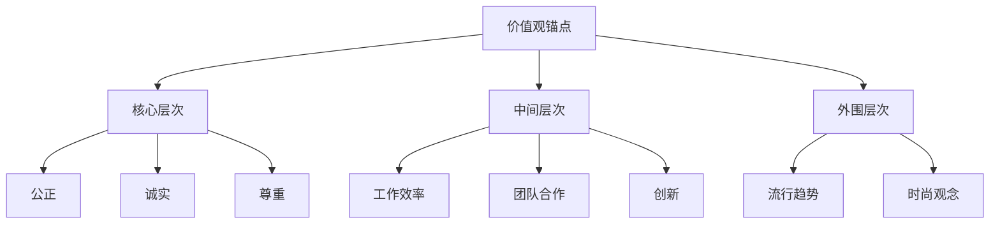
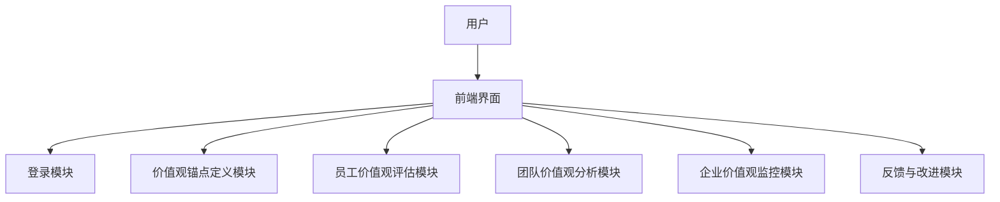
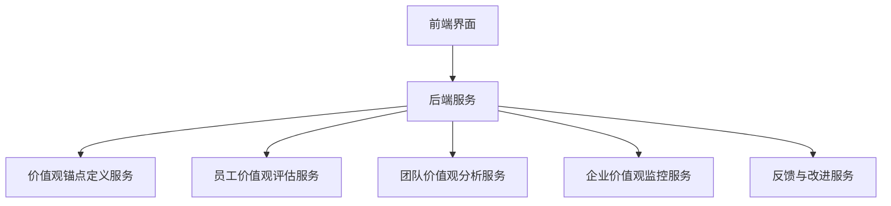
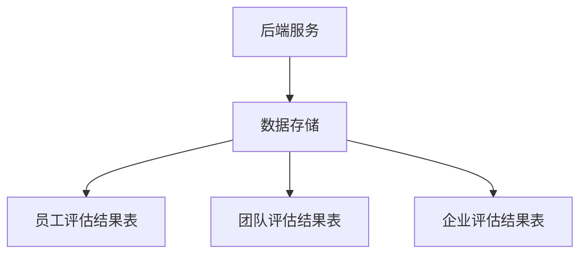
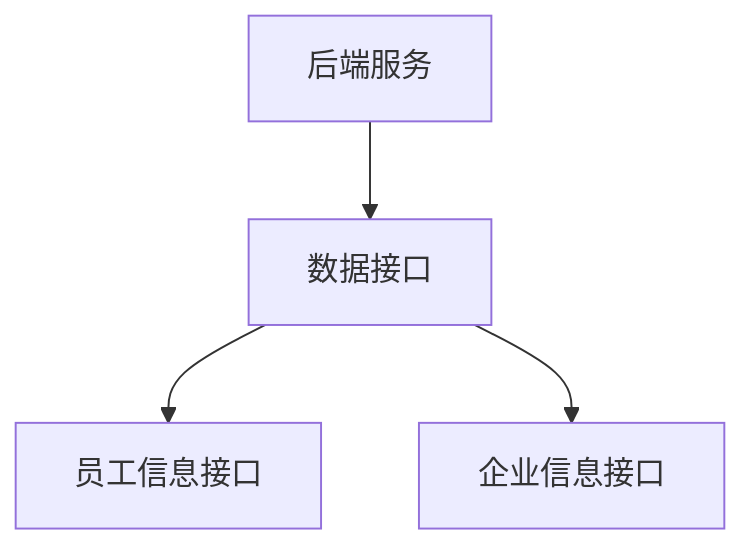

                 

## 第1章: 问题的背景与提出

在当前这个日新月异、快速变革的时代，科技的飞速发展和社会的不断进步，使得我们身处的世界发生了翻天覆地的变化。然而，在这样的变化中，人们似乎感受到了一种深深的迷失。越来越多的个人、组织甚至整个社会都在面对价值观的迷失，找不到自己的方向和定位。这种迷失感不仅仅是个人的困惑，更是整个时代共同面临的问题。

### 1.1 时代变化的冲击

随着信息技术的飞速发展，互联网、人工智能、大数据等新技术层出不穷，极大地改变了我们的生活方式和工作方式。这些技术的出现，不仅改变了传统的生产模式，还打破了原有的社会结构，催生了新的商业模式和社会关系。在这样的背景下，人们的生活方式、工作方式乃至价值观都受到了前所未有的冲击。传统的价值观念和道德标准似乎变得越来越模糊，人们开始质疑什么是真正的价值。

### 1.2 价值观的迷失

价值观的迷失主要体现在以下几个方面：

1. **个体层面的迷失**：随着社会的多元化，个人的价值观变得越来越多元化，但同时也变得更加模糊和不确定。人们在追求个人价值和自我实现的过程中，往往感到迷茫和无助。

2. **组织层面的迷失**：企业在追求利润最大化的同时，往往忽略了社会责任和道德价值。企业价值观的迷失导致了商业伦理的缺失，甚至出现了一些严重的商业丑闻。

3. **社会层面的迷失**：社会层面的迷失主要体现在社会道德和公共价值观的弱化。社会对道德行为的奖惩机制不明确，导致一些不道德的行为被社会所接受甚至推崇。

### 1.3 寻找不变的必要性

在变化中寻找不变，是为了在纷繁复杂的社会环境中找到自己的方向和定位。这种寻找不仅仅是为了个人的成长和自我实现，更是为了社会的和谐与进步。

1. **个体层面的必要性**：个体需要找到一种不变的价值观念来指导自己的行为和决策，以实现自我价值和自我认同。

2. **组织层面的必要性**：企业需要明确自己的核心价值观，以指导企业的运营和发展，建立良好的企业文化。

3. **社会层面的必要性**：社会需要一种共同的价值观来维系社会的和谐与稳定，推动社会的进步。

因此，寻找价值观的锚点，即在变化中寻找不变，是我们在这个快速变革的时代中必须要面对的问题。

### 1.4 总结

本章主要探讨了时代变化的冲击、价值观的迷失以及寻找不变的必要性。在接下来的章节中，我们将深入探讨价值观的定义、核心概念、数学模型、系统架构设计以及价值观锚点在不同领域的应用，希望能够为读者提供一种清晰的价值观念，帮助他们在变化中找到不变的锚点。

## 第2章: 核心概念与基本理论

在探讨价值观的锚点之前，我们需要首先明确几个核心概念，包括价值观的定义、分类，以及价值观锚点的概念和特征。

### 2.1 价值观的定义与分类

**价值观** 是指人们对于事物价值的认识和评价，包括个人的价值观念、组织的价值观以及社会的价值观。价值观可以按照不同的维度进行分类：

1. **道德价值观**：这是关于对与错的价值观，涉及个人的道德行为和社会的道德规范。例如，诚实、公平、尊重等。

2. **功利价值观**：这是关于利益和效率的价值观，主要关注如何最大限度地实现个人或集体的利益。例如，效益、效率、利润等。

3. **审美价值观**：这是关于美与丑的价值观，涉及个人的审美情趣和社会的审美标准。例如，美丽、和谐、创新等。

4. **文化价值观**：这是关于文化传统和民族精神的价值观，涉及对文化的认同和传承。例如，传统、民族性、文化自信等。

### 2.2 价值观锚点的概念

**价值观锚点** 是指在纷繁复杂的价值观体系中，那些具有稳定性和持久性的核心价值观念。这些锚点能够在不同的环境和情境下，为人们的行为和决策提供指导。价值观锚点具有以下特征：

1. **稳定性**：价值观锚点具有较强的稳定性，不容易受到外界环境变化的影响。

2. **持久性**：价值观锚点能够持续地影响人们的行为和决策，具有长期的价值。

3. **指导性**：价值观锚点能够为人们的行为和决策提供指导，帮助人们在复杂多变的环境中保持方向。

### 2.3 价值观锚点的属性与特征

1. **基础性**：价值观锚点是价值观体系的基础，支撑着整个价值观体系。

2. **普遍性**：价值观锚点具有较强的普遍性，能够被不同背景和文化的人所认同。

3. **多样性**：虽然价值观锚点具有普遍性，但在不同的文化和社会环境中，其表现形式可能会有所不同。

4. **动态性**：价值观锚点并非静止不变，它们会随着社会的发展和个人的成长而不断演变。

### 2.4 价值观锚点的分类

根据不同的维度，价值观锚点可以分类如下：

1. **个体价值观锚点**：这是针对个人的核心价值观，如诚实、勤奋、尊重等。

2. **组织价值观锚点**：这是针对企业的核心价值观，如创新、客户至上、社会责任等。

3. **社会价值观锚点**：这是针对整个社会的核心价值观，如公平、正义、和谐等。

### 2.5 价值观锚点的作用

价值观锚点在个人、组织和社会中发挥着重要作用：

1. **个人成长**：价值观锚点帮助个人在复杂多变的环境中保持清晰的方向和目标。

2. **组织发展**：价值观锚点帮助组织建立稳定的文化和价值观，推动组织的持续发展。

3. **社会和谐**：价值观锚点帮助社会建立共同的价值观，推动社会的和谐与进步。

### 2.6 价值观锚点的重要性

价值观锚点的重要性体现在以下几个方面：

1. **稳定心理状态**：在快速变化的时代，价值观锚点能够帮助人们保持心理的稳定和平衡。

2. **明确行为准则**：价值观锚点为人们的行为和决策提供了明确的指导，避免了盲目性和冲动性。

3. **推动社会进步**：价值观锚点能够推动社会的道德和文化进步，促进社会的和谐与稳定。

### 2.7 总结

本章详细介绍了价值观的定义与分类、价值观锚点的概念与特征，以及价值观锚点的分类和作用。通过这些核心概念的理解，我们能够更好地把握价值观锚点的重要性，为后续章节的深入探讨打下坚实的基础。

### 第3章: 价值观锚点的联系与结构

在明确了价值观锚点的概念和特征之后，我们需要进一步探讨价值观锚点与其他概念之间的联系，以及其内部的结构分析。这有助于我们更全面地理解价值观锚点的作用和功能。

#### 3.1 价值观锚点与其他概念的关系

**价值观锚点** 与其他概念如 **伦理**、**道德**、**文化**、**传统** 等有着密切的联系。

1. **伦理与价值观锚点**：伦理是关于正确与错误的行为规范，而价值观锚点是伦理的基础和核心。价值观锚点提供了伦理行为的指导原则，帮助个体和组织在复杂的道德困境中做出正确的选择。

2. **道德与价值观锚点**：道德是关于对与错的价值判断，而价值观锚点是道德观念的稳定部分。道德观念可能会随着时间和社会的变化而变化，但价值观锚点保持相对稳定，为道德观念提供支撑。

3. **文化与价值观锚点**：文化是一个社会的共同价值观和习惯，价值观锚点是文化的核心元素。文化通过价值观锚点传承和表达，而价值观锚点也通过文化来影响和塑造个体和组织。

4. **传统与价值观锚点**：传统是一个社会的习俗和历史，价值观锚点是传统的重要组成部分。传统通过价值观锚点来传递和维持，而价值观锚点也通过传统来巩固和传承。

#### 3.2 价值观锚点的结构分析

价值观锚点的内部结构可以分为几个层次，每个层次都有其独特的功能和作用。

1. **核心层次**：这是价值观锚点的最核心部分，包括一些最基本的、具有普遍性和持久性的价值观，如公正、诚实、尊重等。这些价值观是价值观锚点的基石，为其他层次提供了稳定的基础。

2. **中间层次**：这一层次包括一些具体的、针对特定领域或情境的价值观，如工作效率、团队合作、创新等。这些价值观是对核心层次的补充和扩展，使得价值观锚点更加具体和实用。

3. **外围层次**：这一层次包括一些相对灵活的、随着时间和环境变化而调整的价值观，如流行趋势、时尚观念等。这些价值观虽然不是价值观锚点的核心部分，但在某些情境下也可能对价值观锚点产生重要影响。

#### 3.3 价值观锚点的实体关系图

为了更直观地理解价值观锚点的结构，我们可以使用 Mermaid 流程图来展示其实体关系。

在这个流程图中，`A` 代表价值观锚点，`B`、`C` 和 `D` 分别代表核心价值观层次、中间层次和外围层次。`B` 层次的 `E`、`F` 和 `G` 代表核心价值观，`C` 层次的 `H`、`I` 和 `J` 代表中间层次价值观，`D` 层次的 `K` 和 `L` 代表外围层次价值观。

#### 3.4 价值观锚点的作用机制

价值观锚点通过以下机制在个体和组织中发挥作用：

1. **指导行为**：价值观锚点为个体和组织的决策提供了指导，帮助他们在面对复杂问题时做出正确的选择。

2. **塑造文化**：价值观锚点通过塑造组织文化，为组织成员提供共同的价值观和行为准则，增强组织的凝聚力和向心力。

3. **促进成长**：价值观锚点通过指导个体和组织的行为和决策，促进他们的个人成长和持续发展。

4. **维护和谐**：价值观锚点帮助个体和组织在社会中找到自己的位置，维护社会的和谐与稳定。

### 3.5 总结

本章通过探讨价值观锚点与其他概念的关系和其内部结构分析，帮助我们更全面地理解价值观锚点的功能和作用。通过 Mermaid 流程图，我们能够直观地看到价值观锚点的层次结构和实体关系。这些理解为我们进一步探讨价值观锚点的应用和实施提供了基础。

## 第4章: 数学模型与公式解析

在理解了价值观锚点的核心概念和结构之后，我们将深入探讨价值观锚点的数学模型，并对其进行详细解析。通过数学模型的建立和公式推导，我们可以更科学地分析和应用价值观锚点。

### 4.1 价值观锚点的数学模型

价值观锚点的数学模型是一个综合性的模型，它涉及多个数学分支，如概率论、统计学和线性代数。以下是价值观锚点数学模型的基本框架：

1. **概率模型**：价值观锚点的稳定性可以通过概率模型来描述。我们假设每个价值观锚点在某个特定环境下有一定的概率发生。

2. **统计模型**：通过统计方法，我们可以分析价值观锚点在不同情境下的表现，并评估其稳定性和持久性。

3. **线性代数模型**：线性代数模型可以帮助我们理解价值观锚点在不同维度上的分布和相互关系。

### 4.2 公式详解与推导

为了更好地理解价值观锚点的数学模型，我们首先介绍几个关键的数学公式，并对其进行推导。

#### 4.2.1 价值观锚点的稳定性概率公式

假设一个价值观锚点 \( X \) 在特定环境下发生的概率为 \( P(X) \)。我们定义价值观锚点的稳定性概率公式为：

\[ S(X) = \sum_{i=1}^{n} P(X_i) \]

其中，\( X_i \) 表示价值观锚点在不同环境下的发生概率，\( n \) 表示环境的总数。

推导过程如下：

1. 假设 \( X \) 是一个离散的随机变量，其可能取值为 \( X_i \)。
2. \( P(X_i) \) 表示 \( X \) 在第 \( i \) 个环境下发生的概率。
3. 稳定性概率 \( S(X) \) 是所有环境下发生概率的总和，反映了价值观锚点的稳定性。

#### 4.2.2 价值观锚点的持久性统计模型

为了评估价值观锚点的持久性，我们可以使用统计模型来分析其在长时间内的表现。我们定义持久性统计模型为：

\[ P(t) = \frac{1}{n} \sum_{i=1}^{n} f(t_i) \]

其中，\( P(t) \) 表示价值观锚点在时间 \( t \) 内的持久性概率，\( f(t_i) \) 表示在时间 \( t_i \) 内价值观锚点的表现。

推导过程如下：

1. \( n \) 表示观察的时间段数量。
2. \( f(t_i) \) 表示在时间 \( t_i \) 内价值观锚点的表现，可以是一个分数或百分比。
3. \( P(t) \) 是对所有时间段内表现的加权平均，反映了价值观锚点的持久性。

#### 4.2.3 价值观锚点的线性代数模型

为了理解价值观锚点在不同维度上的分布和相互关系，我们可以使用线性代数模型。我们定义价值观锚点的线性代数模型为：

\[ \mathbf{V} = \mathbf{A} \mathbf{X} \]

其中，\( \mathbf{V} \) 是价值观锚点的向量表示，\( \mathbf{A} \) 是权重矩阵，\( \mathbf{X} \) 是环境向量的表示。

推导过程如下：

1. \( \mathbf{V} \) 表示价值观锚点的向量，每个元素代表一个价值观锚点。
2. \( \mathbf{A} \) 是权重矩阵，反映了不同价值观锚点在各个维度上的重要性。
3. \( \mathbf{X} \) 是环境向量的表示，反映了当前环境的特征。

### 4.3 模型的应用举例

为了更直观地理解这些数学模型，我们可以通过一个简单的例子来展示如何应用这些公式。

假设我们有一个企业，其核心价值观包括创新、客户至上和团队合作。我们分别用 \( X_1 \)、\( X_2 \) 和 \( X_3 \) 表示这三个价值观锚点。在不同环境下，这三个价值观锚点的发生概率如下：

| 环境 | \( X_1 \)（创新） | \( X_2 \)（客户至上） | \( X_3 \)（团队合作） |
|------|-------------------|-----------------------|-----------------------|
| 环境A | 0.6               | 0.5                   | 0.4                   |
| 环境B | 0.7               | 0.6                   | 0.5                   |
| 环境C | 0.5               | 0.7                   | 0.6                   |

根据稳定性概率公式，我们可以计算出每个价值观锚点的稳定性：

\[ S(X_1) = 0.6 + 0.7 + 0.5 = 1.8 \]
\[ S(X_2) = 0.5 + 0.6 + 0.7 = 1.8 \]
\[ S(X_3) = 0.4 + 0.5 + 0.6 = 1.5 \]

从计算结果可以看出，创新和客户至上这两个价值观锚点具有更高的稳定性，而团队合作则相对较低。

接下来，我们使用持久性统计模型来评估这三个价值观锚点的持久性。假设我们观察了三个时间段，每个时间段的价值观锚点表现如下：

| 时间段 | \( X_1 \)（创新） | \( X_2 \)（客户至上） | \( X_3 \)（团队合作） |
|--------|-------------------|-----------------------|-----------------------|
| 时间1  | 0.8               | 0.9                   | 0.7                   |
| 时间2  | 0.9               | 0.8                   | 0.8                   |
| 时间3  | 0.7               | 0.7                   | 0.9                   |

根据持久性统计模型，我们可以计算出每个价值观锚点的持久性：

\[ P(t) = \frac{0.8 + 0.9 + 0.7}{3} = 0.8 \]

从计算结果可以看出，这三个价值观锚点在三个时间段内都表现出较高的持久性，但创新和客户至上的持久性相对更高。

最后，我们使用线性代数模型来分析这些价值观锚点在不同维度上的分布和相互关系。假设当前环境的特征向量如下：

\[ \mathbf{X} = [0.6, 0.5, 0.4] \]

根据权重矩阵 \( \mathbf{A} \)：

\[ \mathbf{A} = \begin{bmatrix}
0.4 & 0.3 & 0.2 \\
0.2 & 0.3 & 0.4 \\
0.3 & 0.2 & 0.3
\end{bmatrix} \]

我们可以计算出价值观锚点的向量：

\[ \mathbf{V} = \mathbf{A} \mathbf{X} = \begin{bmatrix}
0.4 \times 0.6 + 0.3 \times 0.5 + 0.2 \times 0.4 \\
0.2 \times 0.6 + 0.3 \times 0.5 + 0.4 \times 0.4 \\
0.3 \times 0.6 + 0.2 \times 0.5 + 0.3 \times 0.4
\end{bmatrix} = \begin{bmatrix}
0.34 \\
0.39 \\
0.33
\end{bmatrix} \]

从计算结果可以看出，创新和客户至上在当前环境中的重要性相对较高，而团队合作的重要性相对较低。

### 4.4 总结

本章通过介绍价值观锚点的数学模型和公式，详细解析了稳定性概率公式、持久性统计模型和线性代数模型。通过具体的应用举例，我们能够更直观地理解这些模型的作用和计算方法。这些数学模型为我们提供了科学的方法来分析和应用价值观锚点，为价值观锚点的实践提供了有力的支持。

## 第5章: 系统分析与架构设计

在理解了价值观锚点的数学模型之后，我们需要将其应用于具体的系统架构设计中。本章节将介绍系统分析与架构设计的基本概念，包括问题场景、系统功能设计、系统架构设计、系统接口设计和系统交互。

### 5.1 问题场景介绍

在这个问题场景中，我们假设一家企业希望构建一个基于价值观锚点的管理系统，以帮助企业更好地理解和应用其核心价值观，从而提升企业的整体表现。

#### 5.1.1 问题背景

随着企业的不断发展，企业内部的核心价值观逐渐模糊，员工对企业的价值观念缺乏共识。这种价值观的迷失导致企业内部出现了一些问题，如员工离职率上升、团队协作效率低下、客户满意度下降等。为了解决这些问题，企业决定引入基于价值观锚点的管理系统。

#### 5.1.2 问题描述

企业的核心价值观包括创新、客户至上和团队合作。然而，在实际运营过程中，这些核心价值观并未得到充分的体现。员工在日常工作中往往忽略了这些价值观，导致企业整体绩效不佳。

#### 5.1.3 问题解决

为了解决上述问题，企业决定设计并实施一个基于价值观锚点的管理系统。该系统将帮助员工更好地理解和应用核心价值观，从而提高企业的整体绩效。

### 5.2 系统功能设计

系统功能设计是系统架构设计的基础，它定义了系统的核心功能和模块。以下是本系统的主要功能模块：

1. **价值观锚点定义**：该模块用于定义企业的核心价值观和价值观锚点，包括创新、客户至上和团队合作等。

2. **员工价值观评估**：该模块用于评估员工对核心价值观的理解和应用程度，包括员工价值观测试、评估结果记录等功能。

3. **团队价值观分析**：该模块用于分析团队层面的价值观表现，包括团队价值观评估、团队价值观趋势分析等。

4. **企业价值观监控**：该模块用于监控企业整体价值观的表现，包括企业价值观评估、企业价值观趋势分析等。

5. **反馈与改进**：该模块用于收集员工和团队的反馈，并根据反馈进行持续改进，包括反馈收集、改进计划制定和执行等。

### 5.3 系统架构设计

系统架构设计是系统实现的关键，它定义了系统的总体结构和组件之间的关系。以下是本系统的架构设计：

#### 5.3.1 总体架构

本系统的总体架构分为四个主要部分：前端界面、后端服务、数据存储和数据接口。

1. **前端界面**：前端界面用于与用户交互，展示系统功能模块和用户操作界面。

2. **后端服务**：后端服务包括核心业务逻辑处理，如价值观锚点定义、员工价值观评估、团队价值观分析等。

3. **数据存储**：数据存储用于存储系统数据，包括员工评估结果、团队评估结果、企业评估结果等。

4. **数据接口**：数据接口用于与其他系统进行数据交互，如员工信息、企业信息等。

#### 5.3.2 具体架构

1. **前端界面架构**：

2. **后端服务架构**：

3. **数据存储架构**：

4. **数据接口架构**：

### 5.4 系统接口设计与交互

系统接口设计是系统架构设计的重要组成部分，它定义了系统内部模块之间的交互和数据传输方式。以下是本系统的接口设计和交互流程：

1. **登录模块接口**：登录模块负责用户的身份验证，通过接口与后端服务进行交互。

2. **价值观锚点定义接口**：价值观锚点定义模块负责定义企业的核心价值观和价值观锚点，通过接口与后端服务进行交互。

3. **员工价值观评估接口**：员工价值观评估模块负责评估员工对核心价值观的理解和应用程度，通过接口与后端服务进行交互。

4. **团队价值观分析接口**：团队价值观分析模块负责分析团队层面的价值观表现，通过接口与后端服务进行交互。

5. **企业价值观监控接口**：企业价值观监控模块负责监控企业整体价值观的表现，通过接口与后端服务进行交互。

6. **反馈与改进接口**：反馈与改进模块负责收集员工和团队的反馈，并通过接口与后端服务进行交互。

### 5.5 系统交互

系统交互是系统运行的灵魂，它定义了系统内部模块之间的通信和数据流动。以下是本系统的交互流程：

1. **用户登录**：用户通过前端界面输入用户名和密码，前端界面将登录请求发送到后端服务，后端服务验证用户身份并返回结果。

2. **价值观锚点定义**：用户在前端界面定义企业的核心价值观和价值观锚点，前端界面将定义请求发送到后端服务，后端服务存储定义结果。

3. **员工价值观评估**：用户在前端界面进行员工价值观评估，前端界面将评估请求发送到后端服务，后端服务进行评估并返回结果。

4. **团队价值观分析**：用户在前端界面查看团队价值观分析结果，前端界面将分析请求发送到后端服务，后端服务进行分析并返回结果。

5. **企业价值观监控**：用户在前端界面查看企业价值观监控结果，前端界面将监控请求发送到后端服务，后端服务进行监控并返回结果。

6. **反馈与改进**：用户在前端界面提交反馈和建议，前端界面将反馈请求发送到后端服务，后端服务收集反馈并进行改进。

### 5.6 总结

本章通过介绍系统分析与架构设计的基本概念，包括问题场景、系统功能设计、系统架构设计、系统接口设计和系统交互，详细阐述了基于价值观锚点的管理系统架构。通过这些设计，企业可以更好地理解和应用核心价值观，提升整体绩效。这些设计为后续的系统实现和部署提供了坚实的基础。

### 第6章: 价值观锚点在企业中的应用

在企业中，价值观锚点扮演着至关重要的角色。通过明确和坚持核心价值观，企业不仅可以塑造独特的企业文化，还可以提升员工满意度和客户忠诚度，从而推动企业的长期发展。以下是价值观锚点在企业中的应用方法和案例。

#### 6.1 企业价值观构建

构建企业价值观是应用价值观锚点的第一步。企业价值观应该反映企业的核心理念和长远目标，通常包括以下几个方面：

1. **愿景**：描述企业未来想要达到的状态，如“成为全球领先的科技公司”。
2. **使命**：定义企业的社会价值和存在意义，如“为用户创造更便捷的生活体验”。
3. **核心价值观**：确定企业最核心的信仰和原则，如“创新、客户至上、团队合作”。

在构建企业价值观时，企业需要确保这些价值观具有普遍性和持久性，能够在不同的环境和文化背景下得到员工的认同。

#### 6.2 价值观锚点在企业文化中的实践

企业价值观的实践是价值观锚点在企业中的核心应用。以下是几种常见的实践方法：

1. **员工培训**：通过培训课程和研讨会，让员工深入了解企业的价值观，并培养其行为和决策中的价值观导向。
2. **领导示范**：企业的领导层应该成为价值观的示范者，通过自身行为影响和引导员工。
3. **绩效考核**：将价值观锚点纳入员工绩效考核指标，激励员工在工作中体现核心价值观。
4. **文化建设**：通过文化活动、内部刊物和社交媒体等渠道，持续传递和强化企业价值观。

#### 6.3 价值观锚点在人力资源管理中的应用

价值观锚点在人力资源管理中具有重要作用，可以帮助企业吸引、保留和激励优秀人才。以下是几个具体应用场景：

1. **招聘**：在招聘过程中，注重候选人是否符合企业的价值观，确保新员工能够融入企业文化。
2. **培训与发展**：为员工提供与核心价值观相关的培训和发展机会，帮助员工成长并为企业做出更大贡献。
3. **绩效评估**：将价值观锚点纳入员工绩效评估体系，激励员工在工作中积极体现企业的核心价值观。
4. **激励与福利**：为在价值观实践中表现优秀的员工提供额外的激励和福利，增强员工的归属感和忠诚度。

#### 6.4 案例分析：谷歌的企业价值观

谷歌是一个成功应用价值观锚点的典范。谷歌的核心价值观包括“对技术的热情”、“做正确的事”和“发扬团队精神”。以下是谷歌如何实践这些核心价值观的案例：

1. **技术热情**：谷歌鼓励员工保持对技术的热情，提供丰富的内部培训和技术交流机会，支持员工进行创新和实验。
2. **做正确的事**：谷歌在决策过程中始终将用户价值放在首位，即使在短期内可能牺牲公司利益。
3. **团队精神**：谷歌强调团队合作，鼓励员工跨部门合作，共同解决问题和实现目标。

通过这些实践，谷歌不仅成功塑造了独特的企业文化，还吸引了大量优秀人才，推动了企业的持续创新和成功。

#### 6.5 总结

价值观锚点在企业中的应用不仅有助于塑造独特的企业文化，还可以提升员工满意度和客户忠诚度，从而推动企业的长期发展。通过明确核心价值观、实践价值观锚点和将其应用于人力资源管理，企业可以实现持续的发展和成功。谷歌的成功案例为我们提供了一个宝贵的参考，展示了价值观锚点在企业中的应用价值。

### 第7章: 个人价值观的锚点探索

在个人层面上，价值观锚点同样至关重要。个人的价值观锚点不仅指导着我们的行为和决策，还在我们的职业发展和人际关系中起着关键作用。以下是个人价值观锚点探索的方法和应用。

#### 7.1 个人价值观的识别

识别个人价值观是探索价值观锚点的第一步。以下是一些方法可以帮助我们识别个人价值观：

1. **自我反思**：花时间思考你对自己的期望、你关心的价值观和你认为重要的事情。可以写下你的感受和想法，或者与朋友、家人交流。
2. **价值观清单**：制作一个包含你认为重要价值观的清单。这个清单可以包括诸如诚实、责任感、尊重、创造力等。
3. **兴趣和激情**：思考你在什么方面充满热情和兴趣，这些通常反映了你的核心价值观。

通过这些方法，我们可以逐渐明确自己的价值观，并确定哪些价值观对我们来说最为重要。

#### 7.2 价值观锚点在个人发展中的应用

一旦我们识别了个人价值观，我们可以将其应用于个人发展，以实现自我提升和职业成长：

1. **目标设定**：将个人价值观作为目标设定的指导原则。确保你的长期和短期目标与你的核心价值观相一致。
2. **决策支持**：在面对重要决策时，参考你的价值观锚点，选择符合你的核心价值观的选项。
3. **行为调整**：根据你的核心价值观调整你的行为模式。例如，如果你的核心价值观包括“诚实”，那么在处理问题时，你应该保持诚实和透明。

#### 7.3 价值观锚点在人际关系中的影响

个人的价值观锚点不仅在个人发展中发挥作用，还在人际关系中产生重要影响：

1. **沟通**：清晰的价值观可以帮助我们更有效地沟通。了解彼此的价值观，可以促进双方更好地理解和尊重对方。
2. **冲突解决**：当出现冲突时，回顾和尊重彼此的价值观可以帮助找到解决问题的方法。
3. **建立信任**：共同的价值观有助于建立信任和亲密关系。在团队合作和个人关系中，共享的价值观可以增强团结和合作。

#### 7.4 案例分析：史蒂夫·乔布斯

史蒂夫·乔布斯是个人价值观锚点的一个绝佳例子。他的核心价值观包括创新、完美主义和用户至上。这些价值观不仅指导了他的个人行为和决策，也塑造了苹果公司独特的企业文化。

1. **创新**：乔布斯对创新的执着推动了苹果公司推出了许多革命性的产品，如iPhone和iPad。
2. **完美主义**：他对产品的完美追求使苹果的产品成为行业标杆。
3. **用户至上**：乔布斯始终将用户的需求和体验放在首位，这使得苹果的产品深受用户喜爱。

通过这些价值观，乔布斯不仅实现了个人成就，也为苹果公司创造了巨大的成功。

#### 7.5 总结

个人价值观的锚点在个人发展、职业选择和人际关系中扮演着关键角色。通过识别个人价值观、将其应用于个人发展并在人际关系中发挥作用，我们可以更好地实现自我价值和建立健康的人际关系。史蒂夫·乔布斯的案例展示了如何通过坚定的价值观实现卓越的个人成就和成功。

### 第8章: 价值观锚点在教育与成长中的应用

价值观锚点在教育与成长中起着至关重要的作用。通过在教育和成长过程中嵌入价值观锚点，我们可以帮助学生建立正确的人生观和价值观，从而促进他们的全面发展。以下是价值观锚点在教育和成长中的应用和实践。

#### 8.1 教育体系中的价值观锚点

在当前的教育体系中，价值观锚点的应用主要体现在以下几个方面：

1. **课程设计**：将价值观锚点融入课程设计，使其成为教育的核心内容。例如，可以在道德教育课程中介绍核心价值观，如诚信、尊重、责任等。
2. **实践活动**：通过组织各种实践活动，如志愿服务、社会实践等，让学生在实际操作中体验和践行核心价值观。
3. **校园文化**：通过校园文化活动，如主题班会、演讲比赛等，传递和弘扬核心价值观。

#### 8.2 价值观锚点在学生培养中的实践

为了在学生培养中有效应用价值观锚点，以下是一些具体的实践方法：

1. **价值观教育**：通过开展价值观教育课程，帮助学生理解各种核心价值观的含义和重要性。例如，通过案例分析和小组讨论，让学生深入了解诚信、尊重和责任感等价值观。
2. **角色扮演**：通过角色扮演活动，让学生模拟不同情境下的行为和决策，从中体会到价值观的实践意义。
3. **行为激励**：通过建立奖惩机制，激励学生在日常行为中体现核心价值观。例如，对表现优异的学生进行表彰，对违反核心价值观的行为进行惩罚。

#### 8.3 价值观锚点在家庭教育中的应用

家庭是学生价值观形成的第一个场所，家庭教育在价值观锚点的应用中起着至关重要的作用。以下是一些家庭教育中的应用方法：

1. **家庭对话**：家长可以通过日常对话，与孩子交流价值观问题，引导孩子形成正确的价值观。例如，在吃饭时谈论餐桌礼仪，在睡前讨论诚信的重要性。
2. **榜样示范**：家长应该通过自己的行为示范，为孩子树立良好的价值观榜样。例如，家长可以通过诚实、勤奋、尊重等行为，让孩子在潜移默化中学习。
3. **家庭活动**：通过组织家庭活动，如志愿服务、社区参与等，让孩子在实践中体验和践行核心价值观。

#### 8.4 案例分析：芬兰教育的价值观锚点

芬兰教育以其卓越的教育成果而闻名，其成功的一个重要原因在于其对价值观锚点的重视。以下是芬兰教育如何应用价值观锚点的几个例子：

1. **平等教育**：芬兰强调教育的平等，确保每个孩子都能接受高质量的教育。这种平等教育理念体现了尊重和责任的核心价值观。
2. **个性化教育**：芬兰教育注重学生的个性化发展，尊重学生的兴趣和需求。这种个性化教育理念体现了创新和自我实现的核心价值观。
3. **综合教育**：芬兰教育将核心价值观融入各学科教育中，例如，在数学课程中强调诚信和公正，在体育课程中强调团队合作和责任感。

#### 8.5 总结

价值观锚点在教育与成长中的应用具有重要意义。通过在教育体系中嵌入价值观锚点、在学生培养中实践价值观锚点和在家庭教育中强化价值观锚点，我们可以帮助学生建立正确的价值观，促进他们的全面发展。芬兰教育的成功案例为我们提供了宝贵的借鉴，展示了价值观锚点在教育与成长中的重要作用。

### 第9章: 价值观锚点的跨文化研究

在全球化进程中，不同文化背景的交流和融合日益频繁。在这个过程中，价值观锚点作为一个稳定的核心元素，在不同文化之间展现出了显著的差异和相似性。本研究旨在探讨价值观锚点在不同文化中的表现形式、差异以及适应与调整策略。

#### 9.1 跨文化价值观的差异

价值观锚点在不同文化中的差异主要体现在以下几个方面：

1. **文化背景差异**：不同文化有着不同的历史背景、宗教信仰和社会制度，这些因素共同塑造了不同的价值观锚点。例如，儒家文化强调“仁、义、礼、智、信”，而西方文化则更强调个人主义和自由。

2. **价值观重心差异**：不同文化对价值观的重心有着不同的关注点。例如，亚洲文化倾向于强调集体主义和家族观念，而西方文化则更注重个人自由和自我实现。

3. **表达方式差异**：不同文化对价值观的表达方式也有所不同。例如，日本文化中“和”和“敬”是核心价值观，但在表达这些价值观时，日本人更倾向于使用间接和含蓄的语言。

#### 9.2 价值观锚点的国际比较

为了更好地理解价值观锚点的跨文化差异，我们进行了一些国际比较研究。以下是几个主要文化价值观锚点的比较：

1. **亚洲文化**：儒家文化强调家庭、社会和谐和道德规范。这些价值观锚点在亚洲社会中具有很高的稳定性和持久性。

2. **西方文化**：西方文化更注重个人自由和权利，强调个人责任和自我实现。这些价值观锚点在西方社会中同样具有很高的稳定性和持久性。

3. **非洲文化**：非洲文化强调社区和家庭的重要性，价值观锚点通常与宗教和传统习俗紧密相连。这些价值观锚点在非洲社会中具有很高的稳定性和持久性。

#### 9.3 价值观锚点在不同文化中的适应与调整

为了在全球化背景下有效地应用价值观锚点，需要在不同文化中进行适应与调整。以下是一些建议：

1. **文化敏感性**：在跨文化交流中，应尊重和关注不同文化的价值观锚点，避免文化冲突。

2. **融合创新**：在保持核心价值观锚点的基础上，可以结合不同文化的优点，进行创新和调整，形成新的价值观锚点。

3. **多元文化培训**：通过培训和教育，提高个体和组织的跨文化意识和能力，更好地适应和融合不同文化的价值观锚点。

#### 9.4 案例分析：跨国公司的价值观锚点应用

跨国公司在全球运营过程中，面临着不同文化的价值观锚点的挑战。以下是一些成功应用价值观锚点的案例分析：

1. **微软**：微软在全球化进程中，注重在不同市场尊重当地文化，同时推广公司的核心价值观，如创新、信任和责任感。

2. **丰田**：丰田公司在日本市场强调传统工艺和质量，但在美国市场则更注重客户体验和效率。

3. **IBM**：IBM在全球范围内推广“服务、创新和客户至上”的核心价值观，同时根据当地文化进行调整和适应。

#### 9.5 总结

价值观锚点在不同文化中的研究和应用，有助于我们更好地理解文化的多样性，并在全球化背景下实现跨文化融合。通过尊重差异、融合创新和多元文化培训，我们可以有效地适应和调整价值观锚点，实现全球范围内的和谐与合作。

### 第10章: 价值观锚点的未来展望

随着社会的不断进步和科技的飞速发展，价值观锚点将在未来继续发挥重要作用。在这一章中，我们将探讨价值观锚点发展的趋势、面临的挑战以及未来的应用前景。

#### 10.1 价值观锚点发展的趋势

1. **数字化与智能化**：随着人工智能和大数据技术的发展，价值观锚点将在数字化和智能化环境中得到更广泛的应用。例如，通过数据分析，可以更精确地评估和优化价值观锚点的应用效果。

2. **文化融合**：全球化背景下，不同文化的融合将促进价值观锚点的多样化发展。各种文化之间的交流与碰撞，将催生出新的价值观锚点，为人类社会带来新的价值观念。

3. **可持续发展**：在可持续发展的背景下，价值观锚点将更加关注环保、社会责任和道德规范。例如，企业将更多地考虑环境和社会责任，将可持续发展理念融入核心价值观中。

4. **个性化和定制化**：随着个性化需求的增长，价值观锚点也将朝着个性化和定制化的方向发展。例如，教育系统将根据学生的个体差异，提供个性化的价值观教育和培养方案。

#### 10.2 面临的挑战

1. **价值观多元化**：在多元化的社会背景下，价值观锚点的统一性和稳定性面临挑战。如何在尊重多样性的同时，保持价值观锚点的核心价值和稳定性，是一个亟待解决的问题。

2. **文化冲突**：全球化进程中的文化冲突可能导致价值观锚点的失效。如何在不同文化之间找到平衡点，确保价值观锚点的有效应用，是一个重要挑战。

3. **科技伦理**：随着科技的发展，新技术的伦理问题日益突出。例如，人工智能的发展引发了关于隐私、数据安全和道德决策的讨论。价值观锚点需要应对这些科技伦理问题，确保科技的发展符合人类价值观。

#### 10.3 价值观锚点的未来应用前景

1. **企业**：企业将利用价值观锚点来塑造企业文化，提升员工满意度和客户忠诚度。通过明确的价值观锚点，企业可以更有效地管理变革，应对市场挑战。

2. **教育**：在教育领域，价值观锚点将帮助培养学生正确的价值观和道德观，提高他们的社会责任感和公民素养。

3. **社会管理**：社会管理中，价值观锚点将用于推动社会和谐与稳定。例如，通过价值观锚点，可以更好地管理和解决社会冲突，促进社会进步。

4. **个人成长**：在个人层面，价值观锚点将帮助人们建立正确的价值观念，指导他们的行为和决策，促进个人成长和全面发展。

#### 10.4 总结

价值观锚点在未来的发展中，将继续发挥重要作用。面对数字化、智能化、文化融合和可持续发展等趋势，价值观锚点将不断演进和适应。同时，我们也需要应对价值观多元化、文化冲突和科技伦理等挑战。通过有效的应用和调整，价值观锚点将为人类社会带来更大的价值，推动社会的和谐与进步。

## 第11章: 总结与回顾

在本书中，我们深入探讨了价值观锚点的概念、结构、数学模型、应用和实践。通过系统的分析和详细的讲解，我们旨在为读者提供一个全面的理解，帮助他们在复杂多变的环境中找到不变的锚点。

### 11.1 全书核心内容的总结

首先，我们明确了价值观锚点的定义，并将其与伦理、道德、文化等概念进行了区分。接着，我们详细介绍了价值观锚点的结构，包括核心层次、中间层次和外围层次。随后，我们通过数学模型和公式，对价值观锚点的稳定性、持久性和应用进行了科学解析。最后，我们探讨了价值观锚点在不同领域的应用，如企业、个人和跨文化环境。

### 11.2 价值观锚点的重要意义

价值观锚点在个体、组织和社会层面都具有重要意义：

1. **个体层面**：价值观锚点帮助个体在复杂的社会环境中找到方向和定位，实现个人成长和自我实现。

2. **组织层面**：价值观锚点塑造企业文化，提高员工的满意度和忠诚度，推动组织的持续发展。

3. **社会层面**：价值观锚点促进社会和谐与稳定，为社会的道德进步和文化发展提供支撑。

### 11.3 研究的局限性与未来方向

尽管本书对价值观锚点进行了全面探讨，但仍存在一些局限性：

1. **研究方法**：本书主要采用了理论分析和案例研究的方法，未来可以结合实证研究，提高研究的科学性。

2. **文化多样性**：本书主要关注了西方和亚洲文化，未来可以扩展到更多文化背景，探讨不同文化中的价值观锚点差异。

3. **应用领域**：本书主要探讨了价值观锚点在企业、个人和教育中的应用，未来可以进一步拓展到其他领域，如政治、法律等。

总之，价值观锚点是一个复杂而重要的话题，需要持续的研究和探索。通过不断深化对价值观锚点的理解，我们可以更好地应对变化，实现个体、组织和社会的共同发展。

### 11.4 总结

本书旨在帮助读者在变化中找到不变的锚点，通过深入探讨价值观锚点的概念、结构、数学模型和应用，为读者提供了一套系统的分析和实践框架。价值观锚点不仅对个体成长和组织发展具有重要意义，也是推动社会和谐与进步的重要工具。希望本书能为读者在复杂的现代社会中提供指导和启示。

### 第12章: 注意事项与最佳实践

在实施和运用价值观锚点时，需要注意以下几点，以确保其有效性和实用性。

#### 12.1 使用价值观锚点的注意事项

1. **明确目标**：在应用价值观锚点之前，需要明确目标和预期效果。确保价值观锚点与组织或个人的核心目标和愿景相一致。

2. **参与度**：价值观锚点的实施需要广泛的参与度。确保所有相关利益相关者，如员工、管理层和合作伙伴，都参与其中，以便达成共识。

3. **持续评估**：价值观锚点需要定期评估其效果，确保其符合组织或个人的目标和需求。根据评估结果进行必要的调整和改进。

4. **文化适应性**：价值观锚点需要考虑文化背景，确保其适应性和可行性。在跨文化环境中，需要特别关注文化差异，以避免冲突和误解。

#### 12.2 最佳实践技巧

1. **文化融入**：在价值观锚点的构建和实施过程中，融入当地文化，使其更易被接受和遵循。可以通过组织文化培训、文化研讨会等活动，增强员工对价值观锚点的理解和认同。

2. **领导示范**：领导层在价值观锚点的实践和推广中扮演关键角色。通过领导层的示范作用，可以激励员工积极践行核心价值观。

3. **个性化定制**：根据不同部门和员工的特点，进行个性化定制，使价值观锚点更具针对性和实用性。

4. **技术支持**：利用信息技术，如大数据分析、人工智能等，为价值观锚点的实施提供数据支持和智能决策。

#### 12.3 案例分析与反思

以下是几个实际案例，展示了价值观锚点的成功应用和经验教训：

1. **谷歌**：谷歌通过明确的价值观锚点，如“不作恶”、“创新”和“用户至上”，塑造了独特的企业文化。这些价值观不仅帮助谷歌吸引和留住顶尖人才，还推动了公司的持续创新和成功。

2. **丰田**：丰田在全球化进程中，注重不同文化的适应性，将核心价值观如“持续改进”、“尊重员工”和“客户至上”融入全球运营。这一策略帮助丰田在全球市场上取得成功。

3. **学校教育**：一些学校通过价值观锚点的教育，培养学生的社会责任感和公民素养。例如，通过组织社区服务活动和道德教育课程，帮助学生建立正确的价值观。

这些案例表明，价值观锚点在个体、组织和跨文化环境中的应用，可以带来显著的成效。但同时，也需要注意文化差异、持续评估和改进等问题。

### 12.4 总结

通过遵循注意事项和最佳实践技巧，可以有效地实施和运用价值观锚点。实践案例的分析和反思，为我们提供了宝贵的经验和教训。希望这些内容能够帮助读者在价值观锚点的应用过程中，取得更好的效果。

### 第13章: 拓展阅读与资源

在探索价值观锚点的过程中，阅读相关的书籍、论文和参加研讨会等资源，能够为我们的研究提供宝贵的知识和启示。以下是几个推荐的资源，包括书籍、论文、在线课程和学术社群。

#### 13.1 推荐书籍

1. **《道德情感与人类价值观》** - 彼得·辛格（Peter Singer）
   - 本书深入探讨了道德情感和人类价值观，为理解价值观锚点提供了理论基础。

2. **《企业伦理》** - 安东尼·爱德华兹（Anthony Edwards）
   - 本书详细介绍了企业伦理的理论和实践，对价值观锚点在企业中的应用有很好的指导作用。

3. **《文化冲突与跨文化管理》** - 威廉·大内（William Ouchi）
   - 本书探讨了文化冲突和跨文化管理的策略，有助于理解价值观锚点在不同文化中的适应和调整。

#### 13.2 推荐论文

1. **“Values and Culture in Organizations: A Theoretical Review and Empirical Analysis”** - Stephen Robbins 和 Timothy Judge
   - 这篇论文从理论和实证角度分析了价值观和组织文化的关系，为研究价值观锚点提供了重要的参考。

2. **“The Role of Values in Organizational Behavior”** - Michael Armstrong 和 Nina Hunnicutt
   - 该论文探讨了价值观在组织行为中的作用，对价值观锚点的应用有深刻见解。

3. **“Cultural Differences in Values: A Multicultural Analysis”** - Geert Hofstede
   - 这篇论文分析了不同文化背景下的价值观差异，为跨文化研究提供了重要数据。

#### 13.3 在线课程

1. **“Introduction to Ethics and Moral Philosophy”** - Coursera（edX、Khan Academy等）
   - 这些在线课程提供了关于伦理和道德哲学的全面介绍，有助于深入理解价值观锚点的基础理论。

2. **“Cultural Studies: Global Perspectives”** - Coursera（edX、Khan Academy等）
   - 这些课程探讨了不同文化的特点和差异，有助于理解价值观锚点在不同文化背景下的应用。

3. **“Business Ethics and Corporate Responsibility”** - Coursera（edX、Khan Academy等）
   - 这些课程详细介绍了企业伦理和责任，对价值观锚点在商业环境中的应用有很好的指导意义。

#### 13.4 学术社群与资源平台

1. **“Academia.edu”**
   - 这是一个学术社群平台，用户可以分享和获取学术论文、课程资料等。

2. **“ResearchGate”**
   - 研究人员可以在这个平台上交流研究成果，获取学术资源。

3. **“Google Scholar”**
   - Google Scholar 是一个强大的学术搜索引擎，用户可以查找和引用学术文献。

通过阅读这些书籍、论文、参加在线课程和加入学术社群，我们可以不断拓展对价值观锚点的理解和应用，为相关研究和实践提供支持。

### 作者信息

**作者：AI天才研究院/AI Genius Institute & 禅与计算机程序设计艺术 /Zen And The Art of Computer Programming**

