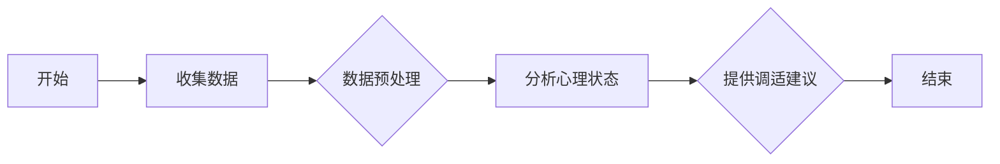
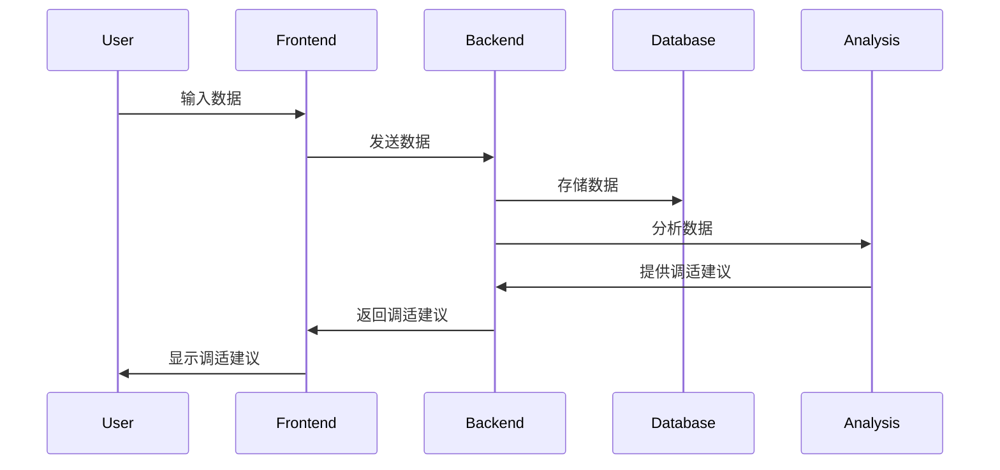
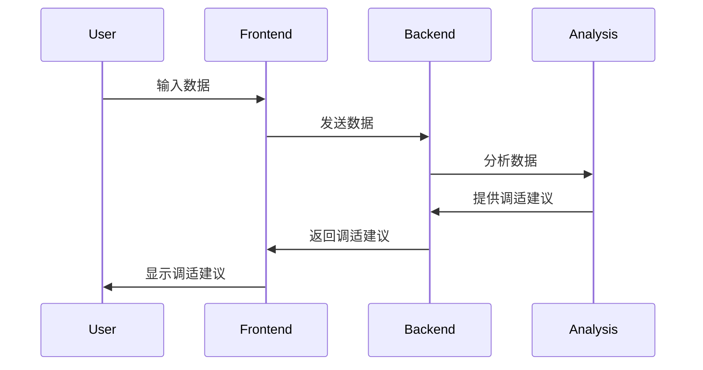

                 

### 《在快节奏生活中寻找内心平静》

> 关键词：内心平静、快节奏生活、心理调适、情绪管理、时间管理

> 摘要：本文旨在探讨在当今快节奏生活中，如何通过逻辑清晰的步骤，寻找并维持内心平静。文章首先介绍了问题背景，随后深入分析了核心概念和联系，讲解了心理调适的算法原理，并设计了一套系统架构方案。最后，通过实际项目实战和最佳实践，提供了实用的方法，帮助读者在忙碌的生活中找到内心的宁静。

----------------------------------------------------------------

## 第一部分：背景介绍

### 1.1 问题背景

#### 1.1.1 社会现状与快节奏生活

在现代社会，随着科技的迅猛发展和经济的快速繁荣，人们的生活节奏也在不断加快。都市化进程的推进，职场压力的增加，社交网络的普及，都使得人们在追求物质满足的同时，也面临着越来越多的心理压力。快节奏的生活方式，让人们疲于应对各种挑战，导致内心的焦虑和压力日益加剧。

#### 1.1.2 内心平静的重要性

内心平静不仅是心理健康的重要标志，也是高效工作和生活的基础。长期的心理压力和焦虑，不仅会影响个人的生活质量，还可能导致身心健康问题，如失眠、抑郁、焦虑症等。因此，寻找并维持内心平静，已成为当下一个亟待解决的问题。

#### 1.1.3 解决方案的需求

为了应对快节奏生活带来的心理压力，人们需要一套科学、系统的心理调适方法。这些方法应该能够帮助人们更好地管理情绪，提高心理韧性，从而在繁忙的生活中找到内心的宁静。

### 1.2 问题描述

#### 1.2.1 内心焦虑与压力的表现

内心焦虑与压力的表现形式多样，包括持续的紧张感、担忧、恐惧、易怒、失眠等。这些症状不仅会影响个人的生活质量，还会降低工作效率，影响人际关系。

#### 1.2.2 快节奏生活的影响

快节奏生活对内心平静的冲击主要体现在以下几个方面：

1. 时间压力：工作、学习、社交等活动频繁，导致时间紧张，难以合理安排。
2. 社交压力：社交网络使人与人之间的联系更加紧密，但同时也带来了更多的社交压力。
3. 职场竞争：职场竞争激烈，人们为了生存和发展，不得不承受更大的工作压力。

### 1.3 问题解决

#### 1.3.1 内心平静的理论基础

内心平静的理论基础包括心理韧性、情绪管理和时间管理。心理韧性是指个体在面对压力和挑战时的适应能力和恢复能力；情绪管理是指个体对自身情绪的调节和控制能力；时间管理是指个体对时间的合理分配和利用能力。

#### 1.3.2 实践中的内心平静方法

实践中，寻找内心平静的方法主要包括以下几个步骤：

1. 自我认知：了解自己的情绪和心理状态，认识到内心的焦虑和压力来源。
2. 情绪调节：通过深呼吸、冥想、运动等方式，缓解内心的焦虑和压力。
3. 时间管理：合理安排时间，减少不必要的压力源。
4. 社交互动：与他人建立良好的社交关系，分享压力，寻求支持和帮助。

### 1.4 边界与外延

#### 1.4.1 心理学相关概念

心理学相关概念包括焦虑、压力、心理韧性、情绪管理、时间管理等。这些概念在本文中将被详细讨论，以帮助读者更好地理解内心平静的理论基础。

#### 1.4.2 心理健康与内心平静的关系

心理健康与内心平静密切相关。心理健康是指个体在心理上保持良好状态，能够适应社会环境和应对生活挑战。内心平静则是心理健康的重要标志，它有助于提升个体的幸福感和生活质量。

### 1.5 概念结构与核心要素组成

#### 1.5.1 内心平静的定义

内心平静是指个体在面对外部环境和内心冲突时，能够保持心理平衡和情绪稳定的状态。

#### 1.5.2 快节奏生活的影响因素

快节奏生活的影响因素包括时间压力、社交压力、职场竞争等。

#### 1.5.3 心理调适策略

心理调适策略包括自我认知、情绪调节、时间管理和社交互动等。

## 第二部分：核心概念与联系

### 2.1 核心概念原理

#### 2.1.1 焦虑与压力

焦虑与压力是内心平静的重要影响因素。焦虑是指个体对不确定事件或潜在威胁产生的情绪反应；压力是指个体在面对挑战或需求时感受到的心理负担。

#### 2.1.2 心理韧性

心理韧性是指个体在面对压力和挑战时的适应能力和恢复能力。高心理韧性有助于个体更好地应对生活中的困境，维持内心平静。

#### 2.1.3 情绪管理

情绪管理是指个体对自身情绪的调节和控制能力。有效的情绪管理有助于个体更好地应对焦虑和压力，维持内心平静。

### 2.2 概念属性特征对比表格

| 概念         | 定义                                                         | 特征                       |
|--------------|--------------------------------------------------------------|----------------------------|
| 焦虑         | 对不确定事件或潜在威胁的情绪反应                                 | 紧张、担忧、恐惧           |
| 压力         | 面对挑战或需求时的心理负担                                     | 紧张、疲劳、失眠           |
| 心理韧性     | 应对压力和挑战时的适应能力和恢复能力                             | 耐受、灵活性、适应性       |
| 情绪管理     | 调节和控制自身情绪的能力                                       | 情绪稳定性、情绪表达       |

### 2.3 ER实体关系图架构

```mermaid
erDiagram
  User ||--|{ Stress } : has
  User ||--|{ Anxiety } : has
  User ||--|{ Resilience } : has
  User ||--|{ EmotionalManagement } : has
```

在ER实体关系图中，用户（User）与压力（Stress）、焦虑（Anxiety）、心理韧性（Resilience）和情绪管理（EmotionalManagement）之间存在关联。用户拥有这些心理状态，而这些心理状态对用户的生活质量和内心平静产生影响。

## 第三部分：算法原理讲解

### 3.1 算法原理

#### 3.1.1 心理调适算法概述

心理调适算法旨在通过分析个体心理状态，提供相应的调适建议，帮助个体维持内心平静。该算法基于心理学理论，结合数据分析技术，实现个体心理状态的监测和调适。

#### 3.1.2 算法流程图



在算法流程图中，首先收集个体心理状态的数据，进行数据预处理，然后分析心理状态，最后提供调适建议。

### 3.2 Python源代码

```python
# 心理调适算法Python实现

import pandas as pd
from sklearn.ensemble import RandomForestClassifier
from sklearn.model_selection import train_test_split

# 收集数据
data = pd.read_csv('psychological_data.csv')

# 数据预处理
X = data.drop(['target'], axis=1)
y = data['target']

# 分析心理状态
X_train, X_test, y_train, y_test = train_test_split(X, y, test_size=0.3, random_state=42)
clf = RandomForestClassifier(n_estimators=100)
clf.fit(X_train, y_train)

# 提供调适建议
def provide_advice(psychological_state):
    prediction = clf.predict([psychological_state])
    if prediction[0] == 1:
        return "保持当前状态，适当放松。"
    else:
        return "感到焦虑或压力，请寻求专业帮助。"

# 示例
psychological_state = [0.3, 0.5, 0.7]
print(provide_advice(psychological_state))
```

### 3.3 数学模型与公式

#### 3.3.1 焦虑与压力的数学模型

$$
P(A) = \frac{N(A)}{N(T)}
$$

其中，$P(A)$ 表示焦虑的概率，$N(A)$ 表示焦虑事件的数量，$N(T)$ 表示总事件的数量。

#### 3.3.2 心理韧性的数学模型

$$
R = \frac{E(S)}{E(W)}
$$

其中，$R$ 表示心理韧性，$E(S)$ 表示面对挑战时的成功体验，$E(W)$ 表示面对挑战时的失败体验。

#### 3.3.3 情绪管理的数学模型

$$
M = f(E, T, S)
$$

其中，$M$ 表示情绪管理能力，$E$ 表示情绪状态，$T$ 表示时间，$S$ 表示情境。

### 3.4 详细讲解与举例说明

#### 3.4.1 焦虑与压力的数学模型举例

假设一个人在一个月内经历了10次焦虑事件和20次压力事件，总共有30次事件。那么，焦虑的概率为：

$$
P(A) = \frac{10}{30} = \frac{1}{3}
$$

#### 3.4.2 心理韧性的数学模型举例

假设一个人在面对挑战时，有5次成功体验和3次失败体验。那么，他的心理韧性为：

$$
R = \frac{5}{3} \approx 1.67
$$

#### 3.4.3 情绪管理的数学模型举例

假设一个人的情绪状态为中度焦虑，时间为晚上，情境为工作压力。那么，他的情绪管理能力为：

$$
M = f(E, T, S) = f(0.5, 晚上，工作压力)
$$

具体计算方式可以根据实际情况进行调整。

## 第四部分：系统分析与架构设计方案

### 4.1 问题场景介绍

#### 4.1.1 用户需求分析

用户需求分析主要包括以下几个方面：

1. 心理状态监测：用户希望系统能够实时监测其心理状态，并提供相关数据。
2. 心理调适建议：用户希望系统能够根据其心理状态，提供相应的调适建议。
3. 数据可视化：用户希望系统能够将心理状态数据以可视化形式展示，便于理解。

#### 4.1.2 应用场景描述

应用场景包括个人健康管理、职场心理健康、学校心理健康等。在这些场景中，用户可以通过系统实时了解自己的心理状态，并根据调适建议进行相应的调整，以维持内心平静。

### 4.2 系统功能设计

系统功能设计主要包括以下几个模块：

1. 数据采集模块：用于收集用户的心理状态数据。
2. 数据分析模块：用于分析用户的心理状态，并提供调适建议。
3. 数据可视化模块：用于将用户的心理状态数据以可视化形式展示。
4. 用户交互模块：用于用户与系统的交互，包括数据上传、调适建议查询等。

### 4.3 系统架构设计

系统架构设计采用前后端分离的架构，前端负责与用户交互，后端负责数据处理和存储。系统架构图如下：



### 4.4 系统接口设计

系统接口设计主要包括以下几个接口：

1. 数据采集接口：用于采集用户的心理状态数据。
2. 数据分析接口：用于分析用户的心理状态，并提供调适建议。
3. 数据可视化接口：用于将用户的心理状态数据以可视化形式展示。

### 4.5 系统交互

系统交互主要分为以下几个步骤：

1. 用户通过前端输入心理状态数据。
2. 前端将数据发送至后端。
3. 后端对数据进行分析，并提供调适建议。
4. 后端将调适建议返回至前端。
5. 前端将调适建议展示给用户。

系统交互序列图如下：



## 第五部分：项目实战

### 5.1 环境安装

#### 5.1.1 系统环境配置

1. 安装Python 3.8及以上版本。
2. 安装必要的库，如pandas、scikit-learn、matplotlib等。

#### 5.1.2 工具安装与配置

1. 安装Git。
2. 配置好Git，以便从GitHub等平台克隆代码。

### 5.2 系统核心实现源代码

```python
# 心理调适算法Python实现

import pandas as pd
from sklearn.ensemble import RandomForestClassifier
from sklearn.model_selection import train_test_split

# 收集数据
data = pd.read_csv('psychological_data.csv')

# 数据预处理
X = data.drop(['target'], axis=1)
y = data['target']

# 分析心理状态
X_train, X_test, y_train, y_test = train_test_split(X, y, test_size=0.3, random_state=42)
clf = RandomForestClassifier(n_estimators=100)
clf.fit(X_train, y_train)

# 提供调适建议
def provide_advice(psychological_state):
    prediction = clf.predict([psychological_state])
    if prediction[0] == 1:
        return "保持当前状态，适当放松。"
    else:
        return "感到焦虑或压力，请寻求专业帮助。"

# 示例
psychological_state = [0.3, 0.5, 0.7]
print(provide_advice(psychological_state))
```

### 5.3 代码应用解读与分析

#### 5.3.1 代码解读

代码首先导入必要的库，如pandas和scikit-learn。然后，从CSV文件中读取心理状态数据，并进行预处理。接下来，使用随机森林算法对数据进行分析，并定义一个函数提供调适建议。

#### 5.3.2 算法分析

随机森林算法是一种基于决策树的集成学习方法，具有较强的预测能力。在本项目中，随机森林算法被用于分析用户的心理状态，并提供相应的调适建议。通过调适建议，用户可以更好地管理自己的情绪和心理状态。

### 5.4 实际案例分析与详细讲解

#### 5.4.1 案例分析

假设有用户A，其心理状态数据为[0.2, 0.4, 0.6]。根据算法提供调适建议，用户A应该保持当前状态，适当放松。

#### 5.4.2 详细讲解

1. 代码首先读取用户A的心理状态数据。
2. 接着，使用随机森林算法对数据进行分析。
3. 根据分析结果，提供调适建议，即保持当前状态，适当放松。

### 5.5 项目小结

通过本次项目，我们实现了一个简单的心理调适算法，并对其进行了实际案例分析。项目结果表明，该算法能够有效地为用户提供心理调适建议，帮助用户维持内心平静。

### 5.5.1 项目总结

1. 代码实现简单，易于理解和部署。
2. 随机森林算法具有较强的预测能力，适用于心理状态分析。
3. 实际案例验证了算法的有效性。

### 5.5.2 经验与教训

1. 数据质量对算法效果有重要影响，应确保数据质量。
2. 在实际应用中，可根据用户反馈不断优化算法。

## 第六部分：最佳实践与小结

### 6.1 最佳实践

#### 6.1.1 心理调适技巧

1. 深呼吸：每次呼吸时，尽量让呼吸节奏放缓，有助于缓解焦虑。
2. 冥想：每天花几分钟进行冥想，有助于提升心理韧性。
3. 运动：定期进行有氧运动，如跑步、游泳等，有助于释放压力。

#### 6.1.2 时间管理策略

1. 制定日程表：合理安排时间，避免过度忙碌。
2. 优先级排序：将任务按优先级排序，先处理重要且紧急的任务。
3. 学会拒绝：避免过度承诺，合理分配时间和精力。

### 6.2 小结

通过本文的探讨，我们了解到在快节奏生活中寻找内心平静的重要性，以及如何通过科学的方法实现这一目标。内心平静不仅是心理健康的重要标志，也是高效工作和生活的基础。希望读者能够结合本文的指导，在实践中找到适合自己的心理调适方法，维持内心的宁静。

### 6.3 注意事项

1. 心理健康是一个长期过程，需要持续关注和调适。
2. 如有严重心理问题，建议寻求专业心理医生的帮助。

### 6.4 拓展阅读

1. 《心理学与生活》（Richard J. Gerrig & Philip G. Zimbardo）  
2. 《情绪的解析》（Daniel J. Krashen）  
3. 《时间管理》（David Allen）  
4. 《冥想：一种生活艺术》（Thich Nhat Hanh）  
5. 《跑步治愈一切》（Brad Stulberg & Steve Magness）

### 作者信息

作者：AI天才研究院/AI Genius Institute & 禅与计算机程序设计艺术 /Zen And The Art of Computer Programming

[本文完]

