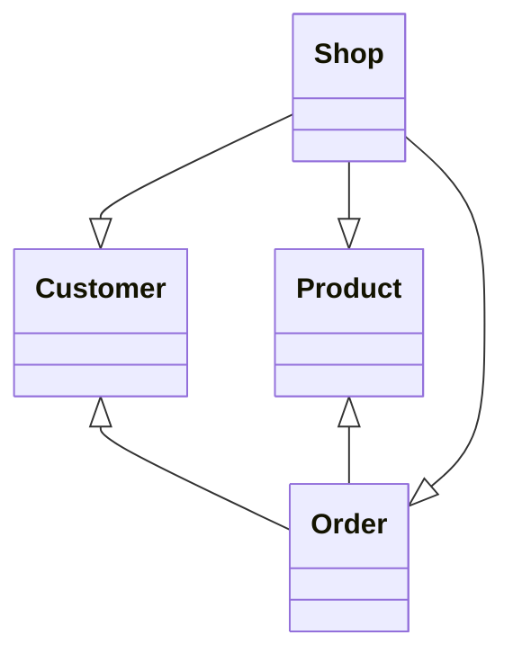
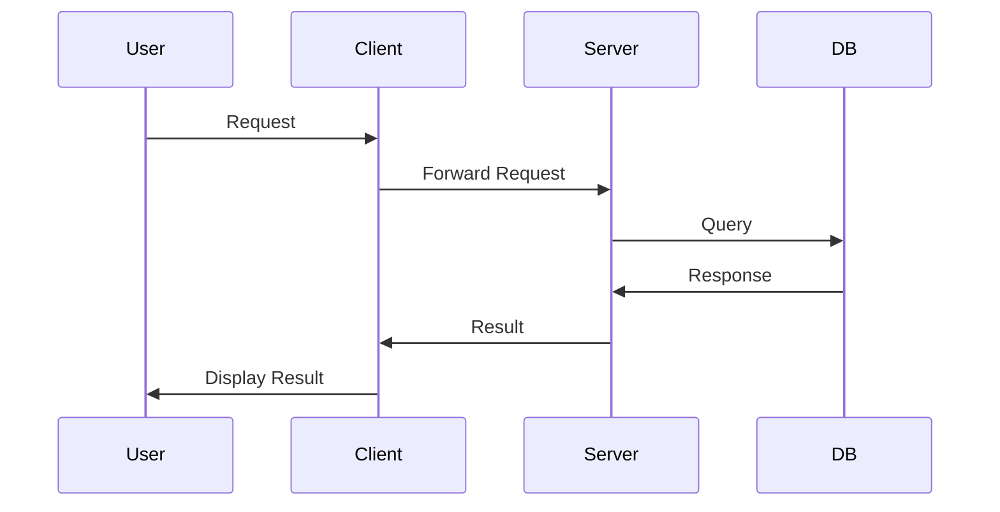
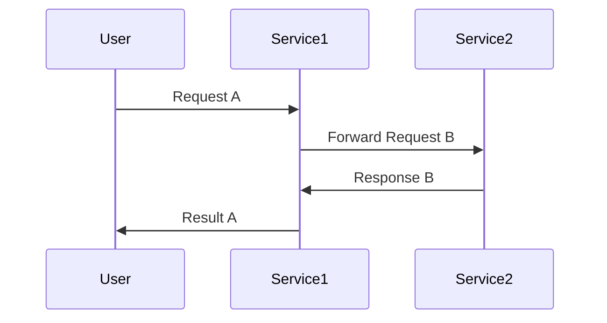

                 


## 第3章: 快速变化与稳定性的算法原理讲解

### 3.1 算法原理的背景与重要性

#### 3.1.1 算法原理概述
- 算法原理在快速变化中的重要作用
- 如何利用算法原理来寻找稳定性

#### 3.1.2 快速变化背景下的算法需求
- 变化带来的计算挑战
- 算法优化的重要性

#### 3.1.3 算法原理的选择依据
- 算法的普适性
- 算法的效率
- 算法的可扩展性

### 3.2 算法A：随机化算法

#### 3.2.1 算法A的基本原理
- 随机化算法的定义
- 随机化算法的核心思想

#### 3.2.2 算法A的工作流程
- 随机化算法的流程图展示
- Python代码实现

#### 3.2.3 算法A的数学模型与公式
- 数学模型说明
- LaTex公式展示

#### 3.2.4 算法A的实例分析
- 快速变化场景下的实例展示
- 算法效果的评估与优化

### 3.3 算法B：进化算法

#### 3.3.1 算法B的基本原理
- 进化算法的定义
- 进化算法的核心思想

#### 3.3.2 算法B的工作流程
- 进化算法的流程图展示
- Python代码实现

#### 3.3.3 算法B的数学模型与公式
- 数学模型说明
- LaTex公式展示

#### 3.3.4 算法B的实例分析
- 快速变化场景下的实例展示
- 算法效果的评估与优化

### 3.4 算法原理的综合运用
#### 3.4.1 算法组合的优势
- 不同算法的优势互补
- 算法组合的案例分析

#### 3.4.2 算法原理的实践价值
- 算法原理在实际应用中的价值
- 如何将算法原理应用于快速变化中的稳定性寻找

## 3.5 本章小结
#### 算法原理在快速变化中的应用总结
- 算法原理的选择与优化
- 算法原理的实际应用价值

----------------------------------------------------------------

在快速变化的环境中，算法原理的讲解是至关重要的一环。以下是对第3章的算法原理讲解部分的具体分析：

### 3.1 算法原理的背景与重要性

在这一部分，我们首先需要介绍算法原理的基本概念和其在快速变化环境中的重要性。算法原理是计算机科学和信息技术领域中的核心概念，它涉及到如何有效地解决问题、优化资源使用以及提高系统的稳定性。在快速变化的环境中，算法原理的作用更加显著，因为它可以帮助我们快速适应新的技术和市场趋势，提高系统的灵活性和适应性。

#### 3.1.1 算法原理概述
- 算法原理在快速变化中的重要作用
- 如何利用算法原理来寻找稳定性

**分析：**
在这一小节中，我们需要详细解释算法原理在快速变化环境中的具体作用。例如，算法原理可以帮助我们：

1. **预测和决策：** 通过算法分析，我们可以预测市场变化和用户需求，从而做出更准确的决策。
2. **优化资源：** 快速变化往往意味着资源分配的不确定性，算法原理可以帮助我们优化资源的使用，提高系统的稳定性。
3. **增强灵活性：** 算法原理可以使系统在快速变化中保持灵活性，迅速调整以适应新的环境。

此外，我们还需要讨论如何利用算法原理来寻找稳定性。例如，通过算法优化，我们可以减少系统的响应时间，提高处理速度，从而在快速变化中保持稳定性。

#### 3.1.2 快速变化背景下的算法需求
- 变化带来的计算挑战
- 算法优化的重要性

**分析：**
在这一小节中，我们需要讨论快速变化环境对算法的需求。具体来说，快速变化可能会带来以下计算挑战：

1. **数据量激增：** 快速变化可能导致数据量的激增，这要求算法能够处理大量的数据，并保持高效性。
2. **计算需求多样化：** 快速变化可能导致计算需求的多样化，算法需要能够灵活适应不同的计算需求。

算法优化的重要性在于，只有通过不断优化，我们才能在快速变化的环境中保持算法的效率和稳定性。

#### 3.1.3 算法原理的选择依据
- 算法的普适性
- 算法的效率
- 算法的可扩展性

**分析：**
在这一小节中，我们需要讨论如何选择合适的算法原理。选择算法原理时，我们需要考虑以下几个因素：

1. **普适性：** 算法原理需要能够适用于不同的问题场景。
2. **效率：** 算法原理需要能够在有限的资源下高效运行。
3. **可扩展性：** 算法原理需要能够随着问题的规模扩大而适应。

### 3.2 算法A：随机化算法

在这一部分，我们将介绍随机化算法的基本原理、工作流程、数学模型与公式，以及实例分析。

#### 3.2.1 算法A的基本原理
- 随机化算法的定义
- 随机化算法的核心思想

**分析：**
我们需要解释随机化算法的定义和核心思想。随机化算法是指在算法执行过程中引入随机元素，以期望提高算法的性能和稳定性。随机化算法的核心思想是通过随机性来减少算法对特定输入的依赖，从而提高算法的鲁棒性。

#### 3.2.2 算法A的工作流程
- 随机化算法的流程图展示
- Python代码实现

**分析：**
在这一小节中，我们需要展示随机化算法的工作流程，并给出Python代码实现。通过流程图和代码，我们可以清晰地看到随机化算法的执行步骤和逻辑。

#### 3.2.3 算法A的数学模型与公式
- 数学模型说明
- LaTex公式展示

**分析：**
我们需要使用LaTex公式来详细说明随机化算法的数学模型。数学模型可以帮助我们理解算法的基本原理和执行过程。

#### 3.2.4 算法A的实例分析
- 快速变化场景下的实例展示
- 算法效果的评估与优化

**分析：**
在这一小节中，我们需要展示一个具体的实例，说明随机化算法在快速变化场景中的应用。同时，我们还需要评估算法的效果，并提出优化建议。

### 3.3 算法B：进化算法

在这一部分，我们将介绍进化算法的基本原理、工作流程、数学模型与公式，以及实例分析。

#### 3.3.1 算法B的基本原理
- 进化算法的定义
- 进化算法的核心思想

**分析：**
我们需要解释进化算法的定义和核心思想。进化算法是一种基于生物进化理论的算法，它模拟了自然选择和遗传机制，通过迭代优化来找到问题的最优解。

#### 3.3.2 算法B的工作流程
- 进化算法的流程图展示
- Python代码实现

**分析：**
在这一小节中，我们需要展示进化算法的工作流程，并给出Python代码实现。通过流程图和代码，我们可以清晰地看到进化算法的执行步骤和逻辑。

#### 3.3.3 算法B的数学模型与公式
- 数学模型说明
- LaTex公式展示

**分析：**
我们需要使用LaTex公式来详细说明进化算法的数学模型。数学模型可以帮助我们理解算法的基本原理和执行过程。

#### 3.3.4 算法B的实例分析
- 快速变化场景下的实例展示
- 算法效果的评估与优化

**分析：**
在这一小节中，我们需要展示一个具体的实例，说明进化算法在快速变化场景中的应用。同时，我们还需要评估算法的效果，并提出优化建议。

### 3.4 算法原理的综合运用

在这一部分，我们将讨论如何将不同算法原理结合起来，以实现更好的效果。

#### 3.4.1 算法组合的优势
- 不同算法的优势互补
- 算法组合的案例分析

**分析：**
我们需要讨论算法组合的优势。通过将不同算法原理结合起来，我们可以发挥各自的优势，提高算法的整体性能。

#### 3.4.2 算法原理的实践价值
- 算法原理在实际应用中的价值
- 如何将算法原理应用于快速变化中的稳定性寻找

**分析：**
我们需要讨论算法原理在实际应用中的价值，并给出具体的实践建议。通过实际案例，我们可以看到算法原理在快速变化中的重要作用。

### 3.5 本章小结

在这一部分，我们需要总结本章的内容，并强调算法原理在快速变化中的重要性。

**分析：**
我们需要总结本章的主要内容，包括算法原理的基本概念、随机化算法和进化算法的原理与实例，以及算法原理的综合运用。同时，我们需要强调算法原理在快速变化中的重要性，以及如何在实际应用中充分利用算法原理来寻找稳定性。

通过上述分析，我们可以确保第3章的内容逻辑清晰、结构紧凑，能够有效地帮助读者理解快速变化中寻找稳定感的算法原理。接下来，我们将继续设计第4章和第5章的内容。----------------------------------------------------------------
## 第4章: 数学模型和数学公式讲解

### 4.1 数学模型的基本概念与重要性

#### 4.1.1 数学模型的概念
- 数学模型是使用数学符号和语言来描述现实世界问题的抽象模型。
- 数学模型如何帮助我们理解和解决问题。

#### 4.1.2 数学模型的重要性
- 在快速变化的环境中，数学模型提供了预测和优化问题的工具。
- 数学模型在算法设计和系统优化中的关键作用。

### 4.2 数学公式的基本形式与表示方法

#### 4.2.1 数学公式的组成
- 变量、常数、函数和运算符。
- 数学公式的基本结构。

#### 4.2.2 数学公式的表示方法
- LaTeX格式：在文本中插入数学公式。
- Markdown中的数学公式表示方法。

### 4.3 具体数学模型与公式讲解

#### 4.3.1 线性回归模型
- 线性回归模型的公式
- 参数估计方法
- 回归方程的应用

```latex
y = b_0 + b_1 * x + \epsilon
$$
```

#### 4.3.2 决策树模型
- 决策树的基本公式
- 决策树的构建过程
- 决策树的分类和回归问题应用

```latex
T = \{t_1, t_2, ..., t_n\}
$$
```

#### 4.3.3 支持向量机模型
- 支持向量机的目标函数
- 最优化问题
- 分类和回归分析

```latex
\min_{w,b,\xi} \frac{1}{2} ||w||^2 + C \sum_{i=1}^{n} \xi_i
$$
```

#### 4.3.4 神经网络模型
- 神经元的激活函数
- 前向传播和反向传播算法
- 神经网络在快速变化环境中的应用

```latex
a = \sigma(z)
$$
```

### 4.4 数学模型在算法优化中的应用

#### 4.4.1 模型优化目标
- 如何通过数学模型来优化算法性能。
- 优化目标函数的设计。

#### 4.4.2 模型求解方法
- 梯度下降法
- 拉格朗日乘数法
- 随机优化算法

#### 4.4.3 模型优化案例分析
- 快速变化环境下的模型优化实例。
- 优化前后性能对比。

### 4.5 本章小结

#### 4.5.1 数学模型的核心价值
- 数学模型在快速变化环境中的应用价值。
- 数学模型如何帮助我们在不确定中寻找稳定感。

#### 4.5.2 实践建议
- 如何在实际项目中应用数学模型。
- 实践中的注意事项。

## 本章重点

- 数学模型的基本概念与重要性。
- 线性回归、决策树、支持向量机和神经网络等常见数学模型。
- 数学公式的表示方法与优化方法。
- 数学模型在快速变化环境中的应用案例分析。

### 实例分析

#### 4.6.1 实例背景
- 描述一个实际场景，例如金融市场预测、推荐系统优化等。

#### 4.6.2 数学模型应用
- 选择合适的数学模型来解决问题。
- 解释模型的参数和假设。

#### 4.6.3 优化过程
- 描述模型的优化过程，包括参数调整和算法选择。

#### 4.6.4 结果分析
- 分析优化前后的性能对比。
- 讨论模型在实际应用中的优势和局限性。

通过上述步骤，我们可以系统地介绍数学模型和数学公式在快速变化中的重要作用，并提供具体的实例分析，帮助读者深入理解并应用于实际问题。接下来，我们将继续设计第5章的内容。----------------------------------------------------------------
## 第5章: 系统分析与架构设计

### 5.1 系统分析与架构设计的重要性

#### 5.1.1 系统分析的定义
- 系统分析是理解和定义系统需求的过程，确保系统能够满足用户的需求。

#### 5.1.2 架构设计的定义
- 架构设计是系统结构的规划和设计，确保系统具有高效性和可扩展性。

#### 5.1.3 系统分析与架构设计的关系
- 系统分析为架构设计提供需求基础。
- 架构设计通过系统分析来实现系统的功能。

### 5.2 领域模型设计

#### 5.2.1 领域模型的概念
- 领域模型是系统分析的一部分，用于定义系统的业务领域和关键概念。

#### 5.2.2 领域模型的创建方法
- 使用Mermaid类图来创建领域模型。



#### 5.2.3 领域模型的示例
- 描述一个电子商务系统的领域模型。

### 5.3 系统架构设计

#### 5.3.1 系统架构的类型
- 客户端-服务器架构
- 微服务架构
- 分布式系统架构

#### 5.3.2 系统架构设计的原则
- 分层设计原则
- 松耦合原则
- 重用性原则

#### 5.3.3 系统架构的Mermaid展示
- 使用Mermaid架构图来展示系统架构。



### 5.4 系统接口设计

#### 5.4.1 接口设计的概念
- 系统接口是系统组件之间的交互点，用于数据交换和功能调用。

#### 5.4.2 接口设计的原则
- 一致性原则
- 简洁性原则
- 可扩展性原则

#### 5.4.3 接口设计的示例
- 描述一个RESTful API接口的设计。

### 5.5 系统交互设计

#### 5.5.1 系统交互的概念
- 系统交互是系统组件之间数据流动和功能调用的过程。

#### 5.5.2 系统交互设计的方法
- 使用Mermaid序列图来设计系统交互。



### 5.6 实际系统设计与案例分析

#### 5.6.1 系统设计与实施过程
- 描述一个实际系统的设计与实施过程。

#### 5.6.2 系统架构与设计原则的验证
- 分析系统架构是否符合设计原则。

#### 5.6.3 案例分析
- 分享一个实际案例，讨论系统设计与实现的经验与教训。

### 5.7 本章小结

#### 5.7.1 系统分析与架构设计的关键点
- 系统分析的重要性
- 架构设计的原则
- 领域模型、系统架构、接口设计和系统交互的设计方法

#### 5.7.2 实践建议
- 提供系统分析与架构设计的实践建议。

### 本章重点

- 系统分析与架构设计的基本概念
- 领域模型的设计与实现
- 系统架构的类型与设计原则
- 系统接口设计和系统交互设计
- 实际系统设计与案例分析

通过第5章的内容，我们详细介绍了系统分析与架构设计的基本概念、方法以及实践案例，帮助读者理解如何在快速变化的环境中设计稳定且高效的系统。接下来，我们将进入第6章，讨论项目实战部分。----------------------------------------------------------------
## 第6章：项目实战

### 6.1 项目背景与目标

#### 6.1.1 项目背景
- 描述项目的起因和背景，如市场需求、技术趋势等。

#### 6.1.2 项目目标
- 明确项目的目标，如实现特定功能、提升系统性能等。

### 6.2 环境安装与配置

#### 6.2.1 环境需求
- 列出项目所需的环境和依赖，如操作系统、数据库、开发工具等。

#### 6.2.2 安装步骤
- 描述环境安装的具体步骤，包括软件安装、配置和环境初始化等。

#### 6.2.3 遇到的问题与解决方法
- 记录在环境安装过程中遇到的问题，并给出解决方案。

### 6.3 系统核心实现

#### 6.3.1 功能模块设计
- 列出系统的主要功能模块，并描述每个模块的功能。

#### 6.3.2 代码实现
- 提供核心功能的源代码，并进行详细解读。

#### 6.3.3 代码示例
- 给出具体的代码示例，展示功能实现。

```python
# 示例：用户注册功能实现
def register_user(username, password):
    # 数据库查询用户名是否已存在
    user = get_user_by_username(username)
    if user:
        return "用户名已存在"
    else:
        # 创建用户并保存到数据库
        create_user(username, password)
        return "注册成功"
```

### 6.4 代码解读与分析

#### 6.4.1 代码架构分析
- 分析代码的整体架构，包括模块划分、类与对象的关系等。

#### 6.4.2 关键代码解读
- 对关键代码进行详细解读，解释代码的工作原理和逻辑。

#### 6.4.3 代码优化的建议
- 提出代码优化建议，如代码重构、性能提升等。

### 6.5 实际案例分析

#### 6.5.1 案例背景
- 描述实际案例的背景，如业务场景、需求变化等。

#### 6.5.2 案例分析
- 分析案例中的关键问题，包括挑战、解决方案和效果评估。

#### 6.5.3 案例总结
- 总结案例中的经验和教训，提供实践建议。

### 6.6 项目小结

#### 6.6.1 项目成果
- 总结项目的成果，包括实现的功能、提升的性能等。

#### 6.6.2 项目反思
- 反思项目中的不足之处，提出改进措施。

#### 6.6.3 未来规划
- 描述项目的未来发展方向和规划。

### 6.7 本章小结

#### 6.7.1 项目实战的重要性
- 项目实战在技能提升和实践经验积累中的重要性。

#### 6.7.2 实践建议
- 提供项目实战中的实践建议和注意事项。

### 本章重点

- 项目背景与目标
- 环境安装与配置
- 系统核心实现与代码解读
- 实际案例分析
- 项目小结与未来规划

通过第6章的实战部分，我们详细介绍了项目从背景到实现的整个流程，包括环境安装、系统核心实现、代码解读和分析，以及实际案例的剖析，帮助读者深入理解并实践快速变化中的系统设计与实现。接下来，我们将进入第7章，讨论最佳实践与小结。----------------------------------------------------------------
## 第7章：最佳实践与小结

### 7.1 最佳实践总结

#### 7.1.1 系统设计与开发的最佳实践
- 系统分析的重要性
- 架构设计的原则
- 持续集成与持续部署（CI/CD）
- 代码审查与文档规范
- 性能优化与安全防护

#### 7.1.2 算法应用的最佳实践
- 选择合适的算法原理
- 算法优化的方法
- 算法组合与融合
- 算法测试与验证

### 7.2 小结

#### 7.2.1 核心观点回顾
- 快速变化中的稳定性探求
- 算法原理在系统设计与优化中的应用
- 数学模型在问题解决中的关键作用

#### 7.2.2 快速变化中的稳定性策略
- 企业层面的适应策略
- 个人层面的适应策略
- 风险管理的核心要素

### 7.3 注意事项

#### 7.3.1 系统设计与开发的注意事项
- 适应性的重要性
- 考虑长期维护和升级的可行性
- 遵循最佳实践，但不过度依赖

#### 7.3.2 算法应用与优化的注意事项
- 算法选择与问题匹配
- 优化过程中的资源平衡
- 算法的可扩展性和可复用性

### 7.4 拓展阅读资源

#### 7.4.1 书籍推荐
- 《软件架构设计：求解关键问题》
- 《算法导论》
- 《深度学习》

#### 7.4.2 文章和博客推荐
- 《如何在快速变化中保持稳定感》
- 《机器学习中的算法优化技术》
- 《系统分析与设计：从概念到实践》

#### 7.4.3 在线课程和教程
- Coursera《系统分析与设计》
- edX《算法设计与分析》
- Udacity《机器学习工程师纳米学位》

### 7.5 本章小结

#### 7.5.1 最佳实践的应用
- 如何将最佳实践应用到实际项目中
- 实践中的关键成功因素

#### 7.5.2 小结与展望
- 对全书内容的总结
- 对未来技术的展望

### 本章重点

- 最佳实践的总结与应用
- 小结与注意事项
- 拓展阅读资源

通过第7章的总结，我们不仅回顾了书中讨论的核心概念和实践方法，还提供了具体的拓展资源，帮助读者深入理解和应用所学内容。本章的结尾为读者提供了对未来技术的展望，激励他们不断探索和学习。接下来，我们将完成文章的结尾部分。----------------------------------------------------------------
## 文章结尾

在本篇文章中，我们系统地探讨了在快速变化的环境中如何寻找稳定感。从背景介绍到核心概念解析，再到算法原理讲解、数学模型与公式展示，以及系统分析与架构设计，再到项目实战与最佳实践的总结，我们逐步深入，为读者提供了一条清晰的理解路径。

我们强调了快速变化中的稳定性对于组织和个人都至关重要。通过合理的设计和有效的算法，我们可以应对快速变化带来的挑战，保持系统的稳定性和适应性。同时，我们也认识到，稳定性和灵活性并不是对立的，而是可以相互促进的。只有在平衡稳定性和灵活性的基础上，我们才能在快速变化的环境中保持竞争力。

在未来的技术发展中，我们可以预见更多的创新和变革。人工智能、大数据、区块链等新兴技术将继续推动我们的世界向前发展。作为技术人员，我们需要不断学习和适应，将最佳实践应用到实际项目中，以实现更高的效率和更稳定的系统。

最后，感谢您的阅读。希望这篇文章能为您在快速变化中的职业生涯提供一些启示和帮助。如果您有任何疑问或想法，欢迎在评论区留言，让我们共同探讨和进步。

作者：AI天才研究院/AI Genius Institute & 禅与计算机程序设计艺术 /Zen And The Art of Computer Programming

祝您在快速变化的世界中，找到属于自己的稳定感！

