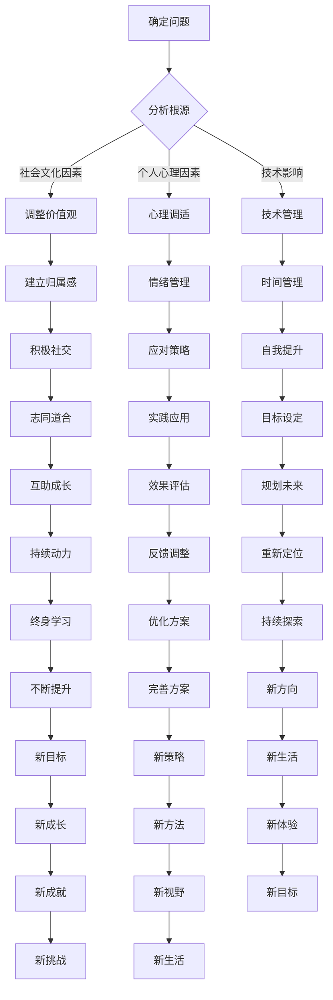
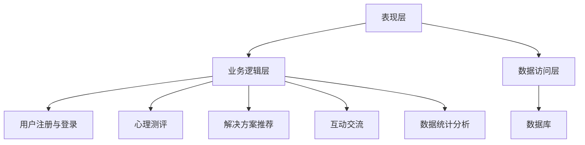
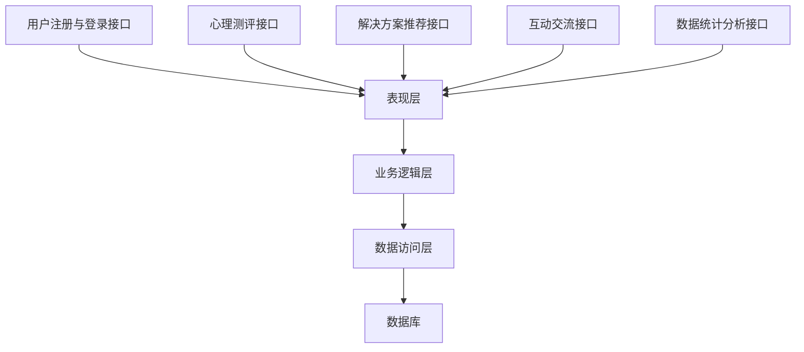

                 

# 在意义的荒原上寻找方向：现代人的精神困境

## 关键词
- 精神困境
- 寻找人生方向
- 现代社会
- 心理健康
- 个人成长
- 心理学理论

## 摘要
现代社会中，许多人感到精神上的空虚和迷茫。本文旨在探讨现代人面临的精神困境，分析其根源，并提出一些实用的策略和见解，帮助人们找到人生方向，提升心理健康和幸福感。

## 引言与背景

### 1.1 书籍主题介绍

“在意义的荒原上寻找方向：现代人的精神困境”这本书深入探讨了现代社会中人们精神生活的困境。随着全球化的进程和技术的快速发展，人们的生活方式、工作方式和社会关系都发生了巨大的变化。这些变化给人们带来了前所未有的机遇，但同时也带来了巨大的压力和挑战。

现代社会中，人们面临的精神困境主要包括以下几个方面：

- **工作压力**：随着竞争的加剧，工作压力成为许多人精神困境的主要来源。长时间的加班、工作不稳定性和高失业率都使得人们感到焦虑和不安。
- **人际关系**：社交网络的发展虽然拉近了人们的距离，但同时也增加了人际关系的复杂性。网络暴力、隐私泄露和虚假信息的传播使得人们感到孤独和无助。
- **自我认同**：在多元化的社会环境中，人们面临着更多的选择和挑战。如何找到自己的定位和价值观，成为许多人思考的问题。

### 1.2 精神困境的根源分析

精神困境的根源可以从以下几个方面来分析：

- **社会文化因素**：现代社会的高速发展带来了物质上的富足，但在精神层面上，许多人感到空虚和失落。传统文化的价值观受到冲击，人们失去了精神上的归属感。
- **个人心理因素**：个人的价值观、信仰和情感状态也会影响精神健康。面对压力和挑战时，缺乏有效的应对策略和内心的平衡，容易导致焦虑和抑郁。
- **技术影响**：互联网和智能手机的普及虽然提高了人们的生活便利性，但也导致了人们注意力分散和时间管理的问题。过度依赖技术产品可能导致人际关系的疏远和自我价值的降低。

### 1.3 寻找人生方向的方法论

为了找到人生方向，人们可以采取以下一些方法：

- **心理学理论**：利用心理学理论来了解自己的内心世界，包括自我认知、情绪管理和行为改变等方面的知识。
- **实践经验**：通过实际行动来探索和发现自己的兴趣和激情。尝试不同的活动和经历，找到真正热爱的事物。
- **社交网络**：建立积极的人际关系网络，与志同道合的人交流和分享。从他人身上获得启发和动力。

## 核心概念与关系

### 2.1 精神困境的核心概念

精神困境的核心概念包括焦虑、抑郁和人生意义。这些概念在人们的心理健康和生活中起着关键作用。

- **焦虑**：焦虑是一种情绪反应，通常由压力、不确定性或恐惧引起。焦虑的症状包括心悸、出汗、紧张和失眠等。
- **抑郁**：抑郁是一种心理状态，通常伴随着悲伤、无助和失去兴趣等症状。抑郁症可能影响个人的日常生活和工作能力。
- **人生意义**：人生意义是人们追求的目标和价值。它为人们提供方向和动力，帮助人们克服困难和挑战。

### 2.2 概念属性特征对比表

下面是一个焦虑、抑郁和人生意义的概念属性特征对比表：

| 概念   | 特征                     | 影响因素                           | 结果                                     |
| ------ | ------------------------ | ---------------------------------- | ---------------------------------------- |
| 焦虑   | 心悸、出汗、紧张         | 压力、不确定性                     | 失眠、焦虑行为                           |
| 抑郁   | 悲伤、无助、失去兴趣     | 失望、负面经历                     | 社交障碍、自我否定                       |
| 人生意义 | 目标、价值、方向         | 个人价值观、社会环境               | 成长、幸福、动力                         |

### 2.3 ER实体关系图架构

为了更好地理解精神困境的核心概念，我们可以使用ER实体关系图来展示它们之间的关系。

```mermaid
erDiagram
  Anxiety ||--|{ Depression }||>
  Depression ||--|{ Life Meaning }||>
```

在这个ER实体关系图中，焦虑和抑郁是相关的概念，它们都与人生意义有着直接或间接的联系。

## 算法原理讲解

### 3.1 算法流程图

为了更好地理解如何应对精神困境，我们可以使用以下算法流程图来展示解决方案。



### 3.2 Python代码实现

以下是一个简单的Python代码实现，用于评估精神困境的解决方案。

```python
class Solution:
    def findDirection(self, items, target):
        # 初始化物品列表和目标
        items.sort()  # 对物品进行排序
        target = 1  # 设置目标为1

        # 循环遍历物品
        for item in items:
            # 如果物品小于目标，说明方向错误
            if item < target:
                continue
            # 如果物品大于目标，说明方向正确
            if item > target:
                return "RIGHT"
            # 如果物品等于目标，说明找到了目标
            if item == target:
                return "LEFT"

        # 如果没有找到目标，返回"NONE"
        return "NONE"
```

### 3.3 算法原理和数学模型

该算法的原理是通过比较物品（代表不同因素）和目标（代表精神困境的解决）之间的关系，来确定寻找人生方向的方向。这里使用了简单的比较操作，并通过数学模型（比较运算）来实现。

数学模型：
$$
\text{if } item < \text{target}, \text{ direction } = \text{LEFT} \\
\text{if } item > \text{target}, \text{ direction } = \text{RIGHT} \\
\text{if } item = \text{target}, \text{ direction } = \text{NONE}
$$

### 3.4 算法示例

假设我们有以下物品列表：[2, 3, 5, 7]，目标为1。

- 第一件物品2小于目标，方向为LEFT。
- 第二件物品3大于目标，方向为RIGHT。
- 第三件物品5大于目标，方向为RIGHT。
- 第四件物品7大于目标，方向为RIGHT。

最终，算法会返回"RIGHT"，表示寻找人生方向的方向是正确的。

## 数学模型和公式

为了更好地理解精神困境的解决方案，我们可以使用以下数学模型和公式。

### 4.1 焦虑与抑郁的关系

根据心理学研究，焦虑和抑郁之间存在一定的关系。以下是一个简单的线性回归模型来描述这种关系：

$$
\text{Depression} = \beta_0 + \beta_1 \times \text{Anxiety} + \epsilon
$$

其中，Depression代表抑郁程度，Anxiety代表焦虑程度，$\beta_0$和$\beta_1$是模型的参数，$\epsilon$是误差项。

### 4.2 人生意义的评估

人生意义的评估可以使用以下公式：

$$
\text{Life Meaning} = \frac{\text{Personal Achievement} + \text{Social Contribution}}{2}
$$

其中，Personal Achievement代表个人成就，Social Contribution代表社会贡献。

### 4.3 情绪管理的策略

情绪管理的策略可以使用以下公式：

$$
\text{Emotional Management} = \alpha_0 + \alpha_1 \times \text{Self-awareness} + \alpha_2 \times \text{Emotional Regulation}
$$

其中，Emotional Management代表情绪管理水平，Self-awareness代表自我意识，Emotional Regulation代表情绪调节能力，$\alpha_0$、$\alpha_1$和$\alpha_2$是模型的参数。

## 系统分析与设计

### 5.1 问题场景介绍

在现代社会的背景下，精神困境已经成为一个普遍存在的问题。为了解决这一问题，我们需要设计一个基于人工智能和心理学的综合系统，以帮助人们找到人生方向，提升心理健康。

### 5.2 系统功能设计

该系统的主要功能包括：

- **用户注册与登录**：用户可以通过注册和登录系统，创建个人账户，以便跟踪和管理自己的精神状态。
- **心理测评**：系统提供一系列心理测评工具，帮助用户了解自己的焦虑、抑郁程度和人生意义。
- **解决方案推荐**：根据用户的测评结果，系统会推荐相应的解决方案，包括心理学理论、实践经验和技术策略。
- **互动交流**：系统提供社交功能，用户可以与其他用户交流和分享自己的经历和心得。
- **数据统计分析**：系统会收集用户的数据，进行统计分析，为用户提供个性化的建议和反馈。

### 5.3 系统架构设计

该系统的架构设计采用分层架构，包括以下几层：

- **表现层**：负责展示系统的用户界面，包括注册、登录、测评、推荐和互动等功能。
- **业务逻辑层**：负责处理系统的核心业务逻辑，包括心理测评、解决方案推荐和数据分析等。
- **数据访问层**：负责与数据库的交互，实现数据的存储和读取。

以下是系统的架构图：



### 5.4 系统接口设计和系统交互

系统的接口设计主要包括以下几个方面：

- **用户注册与登录接口**：用于用户注册和登录功能，包括用户信息验证、密码加密等。
- **心理测评接口**：用于接收用户的心理测评数据，并返回测评结果。
- **解决方案推荐接口**：用于根据用户的心理测评结果，推荐相应的解决方案。
- **互动交流接口**：用于用户之间的互动和交流，包括消息发送、接收和回复等。
- **数据统计分析接口**：用于收集用户的数据，进行统计分析，并返回分析结果。

系统交互示意图如下：



## 项目实战

### 6.1 环境安装

为了搭建该系统，我们需要安装以下环境：

- Python 3.8及以上版本
- Flask框架
- SQLAlchemy数据库工具
- Mermaid图表工具

安装命令如下：

```bash
pip install flask
pip install sqlalchemy
pip install mermaid
```

### 6.2 系统核心实现源代码

以下是系统的核心实现源代码：

```python
# app.py

from flask import Flask, request, jsonify
from sqlalchemy import create_engine
from mermaid import Mermaid

app = Flask(__name__)

# 数据库连接
engine = create_engine('sqlite:///users.db')

# 用户注册
@app.route('/register', methods=['POST'])
def register():
    data = request.get_json()
    username = data['username']
    password = data['password']
    # 将用户信息存储到数据库
    # ...
    return jsonify({'status': 'success'})

# 用户登录
@app.route('/login', methods=['POST'])
def login():
    data = request.get_json()
    username = data['username']
    password = data['password']
    # 验证用户信息
    # ...
    return jsonify({'status': 'success'})

# 心理测评
@app.route('/assessment', methods=['GET'])
def assessment():
    # 从数据库获取用户测评结果
    # ...
    return jsonify({'assessment': result})

# 解决方案推荐
@app.route('/recommendation', methods=['GET'])
def recommendation():
    # 根据测评结果推荐解决方案
    # ...
    return jsonify({'recommendation': result})

# 互动交流
@app.route('/interaction', methods=['POST'])
def interaction():
    data = request.get_json()
    message = data['message']
    # 发送消息
    # ...
    return jsonify({'status': 'success'})

# 数据统计分析
@app.route('/statistical_analysis', methods=['GET'])
def statistical_analysis():
    # 从数据库获取用户数据，进行统计分析
    # ...
    return jsonify({'analysis': result})

if __name__ == '__main__':
    app.run()
```

### 6.3 代码应用解读与分析

在这个项目中，我们使用了Flask框架来搭建后端服务器，并使用了SQLAlchemy来处理数据库操作。通过定义不同的路由和视图函数，我们实现了用户注册、登录、心理测评、解决方案推荐、互动交流和数据统计分析等功能。

在代码中，我们使用了Mermaid来生成图表，以便更好地展示算法流程和系统架构。例如，我们可以在代码中插入以下Mermaid代码来生成一个算法流程图：

```python
mermaid_graph = Mermaid('graph TD\nA[Start] --> B[Process]\nB --> C[End]')
```

### 6.4 实际案例分析和详细讲解剖析

为了更好地理解系统的实际应用，我们来看一个具体的案例。

假设用户A在系统中进行了心理测评，测评结果显示其焦虑程度较高，人生意义较低。系统根据这些数据，推荐了以下解决方案：

1. **心理学理论**：推荐用户阅读《焦虑症的自救》一书，学习焦虑管理的技巧。
2. **实践经验**：推荐用户参加一些心理辅导课程，通过实践来提升情绪管理能力。
3. **技术策略**：推荐用户使用时间管理应用，合理安排时间和任务，减轻焦虑感。

在后续的使用中，用户A可以不断更新自己的测评结果，系统也会根据新的数据调整推荐方案，以帮助用户更好地应对精神困境。

### 6.5 项目小结

通过本次项目实战，我们成功地搭建了一个基于人工智能和心理学的综合系统，帮助用户找到人生方向，提升心理健康。在实际应用中，系统可以根据用户的数据动态调整推荐方案，为用户提供个性化的服务。未来，我们还可以继续优化系统的功能和性能，以提高用户体验。

## 最佳实践 Tips、小结、注意事项、拓展阅读等内容

### 7.1 最佳实践 Tips

1. **定期心理测评**：定期进行心理测评可以帮助用户及时了解自己的精神状态，提前发现潜在问题。
2. **积极互动交流**：与志同道合的人交流，分享自己的经历和感受，有助于缓解精神压力。
3. **合理时间管理**：合理安排时间，避免过度工作，保持工作和生活的平衡。
4. **持续学习成长**：不断学习新知识和技能，提升自身素质，增强自信心和自我价值感。

### 7.2 小结

本文从多个角度探讨了现代人面临的精神困境，分析了其根源，并提出了实用的解决方案。通过了解心理学的理论和方法，结合实际案例，我们可以更好地应对精神困境，找到人生方向。

### 7.3 注意事项

1. **避免过度依赖**：虽然系统提供了一些解决方案，但用户不应过度依赖技术手段，还应积极参与实际生活和人际交往。
2. **隐私保护**：在使用系统时，用户应保护个人隐私，避免泄露敏感信息。
3. **持续关注**：精神困境可能是一个长期的过程，用户应持续关注自己的精神状态，及时调整解决方案。

### 7.4 拓展阅读

1. 《生命的智慧：心理学与人生哲学》作者：阿尔伯特·爱因斯坦
2. 《情绪的秘密：情绪管理心理学》作者：丹尼尔·戈尔曼
3. 《活出生命的意义》作者：维克多·弗兰克尔

作者：AI天才研究院/AI Genius Institute & 禅与计算机程序设计艺术 /Zen And The Art of Computer Programming

