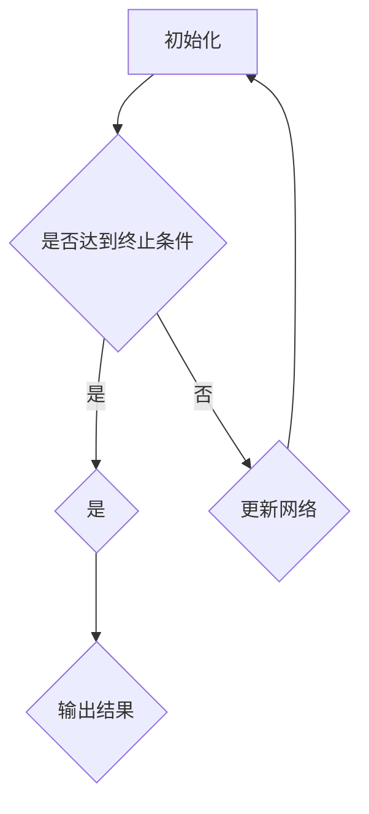
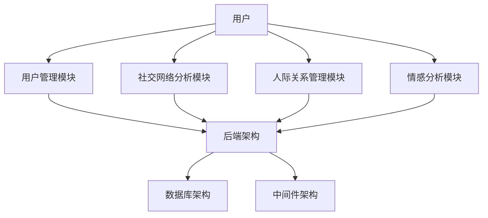
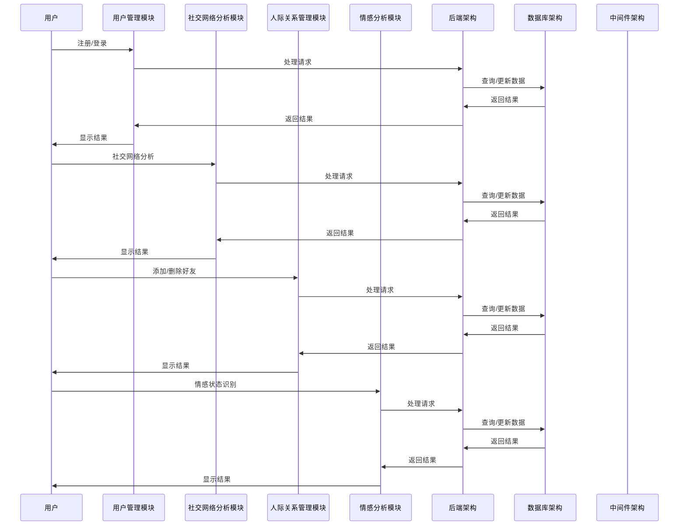

                 

# 在网络世界中寻找真实连接

## 关键词：网络连接、社交网络、心理健康、算法分析、系统架构、实战应用

## 摘要：

在网络世界中，人们通过社交网络平台建立了大量的虚拟连接，但真实的人际关系却变得越来越疏远。本文从背景介绍、核心概念与联系、算法原理与数学模型、系统分析与架构设计、项目实战及最佳实践等多个角度，深入探讨如何在网络世界中寻找真实连接。通过详细的分析和案例讲解，本文旨在帮助读者理解网络连接的本质，提高网络环境的健康水平，从而实现更深层次的人际互动和情感连接。

---

## 第一部分：背景介绍

### 第1章：问题的提出与网络连接的现状

### 1.1 问题背景

随着互联网技术的飞速发展，社交网络平台如雨后春笋般涌现，人们可以通过各种方式在网络世界中与他人建立联系。然而，这种看似便利的网络连接却带来了一系列问题。首先，网络社交与人际疏离现象日益严重。许多人花费大量时间在社交媒体上，却很少与现实生活中的人建立深入的社交关系。其次，数据隐私与安全问题的凸显也让人们感到不安。社交网络平台在收集用户数据的同时，也面临着数据泄露的风险。最后，网络沉迷与心理健康挑战也是一个不容忽视的问题。长时间的虚拟社交可能导致人们心理健康问题，如焦虑和抑郁。

### 1.2 问题描述

网络连接的过度依赖使得人们在现实生活中的社交能力逐渐退化。虚拟社交与真实社交的界限模糊，导致人们难以区分哪些是真正的友谊，哪些只是表面的互动。此外，网络社交带来的负面影响也日益显现。例如，过度依赖社交媒体可能导致人们的自尊心受损，感到孤独和无助。这些问题的根源在于对网络连接的误解和过度依赖。

### 1.3 问题解决

要解决这些问题，首先需要深入理解网络连接的本质。网络连接不仅仅是线上互动，更是人与人之间的情感交流和情感连接。因此，提高网络环境的健康水平是关键。这包括提高网络社交的质量，确保用户的隐私和安全，以及提供心理健康支持。

### 1.4 边界与外延

网络连接的定义与类型：
- **强连接**：指人们之间有频繁的互动和深厚的情感纽带。
- **弱连接**：指人们之间互动较少，但有助于信息传播和社会网络的扩展。

网络连接的心理学与社会学影响：
- **心理健康影响**：网络连接质量低下可能导致焦虑、抑郁等心理问题。
- **社会互动影响**：网络连接可以增强社会支持，但也可能导致社交孤立。

### 1.5 核心概念与联系

核心概念包括社交网络分析、人际关系动力学和心理学理论与实证研究。这些概念相互关联，共同构成了网络连接的理论基础。

### 1.6 本章小结

本章节介绍了网络连接现状以及其带来的问题。通过理解网络连接的本质，我们可以探索提高网络环境健康水平的方法，从而在虚拟世界中找到真实的连接。

---

## 第二部分：核心概念与联系

### 第2章：网络连接的理论基础

#### 2.1 社交网络分析

社交网络分析是研究社交网络结构和动态的学科。它通过数学模型和算法来分析社交网络中的节点（人）和边（关系）。

##### 2.1.1 社交网络的基本概念

- **节点**：代表网络中的个体，如人、公司等。
- **边**：代表个体之间的关系，可以是朋友、同事等。

##### 2.1.2 社交网络的测量与分析

- **度数**：一个节点连接的其他节点的数量。
- **密度**：网络中边的数量与可能边的最大数量的比值。
- **聚类系数**：节点之间相互连接的紧密程度。

##### 2.1.3 社交网络的测量与分析方法

- **网络可视化**：通过图形化方式展示社交网络。
- **网络密度计算**：计算网络中边的比例。
- **聚类系数计算**：计算节点之间相互连接的紧密程度。

#### 2.2 人际关系动力学

人际关系动力学研究人际关系如何形成、变化以及破裂。

##### 2.2.1 人际关系的形成与变化

- **吸引力**：个体之间的吸引力是人际关系形成的关键。
- **沟通**：有效的沟通是维持和加强人际关系的基础。
- **冲突**：冲突是人际关系中常见的现象，如何处理冲突对关系稳定至关重要。

##### 2.2.2 人际关系中的情感与冲突

- **情感**：情感是人际关系中的核心要素，包括正面情感和负面情感。
- **冲突处理**：冲突处理策略包括避免、妥协、竞争和合作等。

#### 2.3 心理学理论与实证研究

心理学理论为理解网络连接的心理学基础提供了理论支持。实证研究则通过数据验证理论的有效性。

##### 2.3.1 社交心理学理论

- **社会认同理论**：个体通过认同某个群体来获得身份和自尊。
- **自我决定理论**：个体追求自我实现和自主性。

##### 2.3.2 网络心理学的实证研究

- **网络使用行为**：研究个体如何使用网络，以及这种行为对心理健康的影响。
- **网络社交对人际关系的影响**：研究网络社交如何影响现实生活中的社交关系。

#### 2.4 网络连接的心理学与社会学影响

- **心理健康影响**：网络连接质量低下可能导致焦虑、抑郁等心理问题。
- **社会互动影响**：网络连接可以增强社会支持，但也可能导致社交孤立。

#### 2.5 核心概念属性特征对比表格

| 概念              | 定义与属性                                      | 特征与联系                                      |
|-------------------|------------------------------------------------|------------------------------------------------|
| 社交网络分析      | 研究社交网络结构和动态的学科。                  | 提供网络可视化、网络密度计算等工具。              |
| 人际关系动力学    | 研究人际关系如何形成、变化以及破裂的学科。      | 强调吸引力、沟通和冲突处理在关系中的重要性。      |
| 心理学理论与实证研究 | 提供理解网络连接的心理基础。                   | 社交心理学理论和实证研究支持网络连接的研究。    |

#### 2.6 ER实体关系图架构的Mermaid流程图

```mermaid
erDiagram
  NodeA ||--|{ NodeB } NodeC : Label
  NodeB ||--|{ NodeC } NodeD : Label
```

#### 2.7 本章小结

本章节详细介绍了网络连接的理论基础，包括社交网络分析、人际关系动力学和心理学理论与实证研究。这些概念为我们理解网络连接的本质和影响提供了理论基础。

---

## 第三部分：算法原理与数学模型

### 第3章：网络连接的算法原理

#### 3.1 网络连接算法概述

网络连接算法是用于分析和优化社交网络连接的数学模型和计算方法。它们可以帮助我们更好地理解网络结构，预测和改善网络连接的质量。

##### 3.1.1 网络连接算法的基本概念

- **社交网络分析算法**：用于识别社交网络中的重要节点和结构。
- **人际关系动力学算法**：用于模拟和预测人际关系的变化。

##### 3.1.2 网络连接算法的分类

- **基于度数的算法**：通过计算节点的度数来识别重要节点。
- **基于聚类的算法**：通过聚类分析来识别社交网络的子群。
- **基于模型的算法**：通过建立数学模型来预测和优化网络连接。

#### 3.2 算法mermaid流程图



#### 3.3 算法原理详细讲解

##### 3.3.1 社交网络分析算法原理

社交网络分析算法通过分析节点之间的连接关系来识别社交网络中的重要节点。常见的方法包括：

- **度数中心性**：计算一个节点连接的其他节点的数量，用于识别社交网络中的中心节点。
- **接近中心性**：计算一个节点到其他节点的平均距离，用于识别社交网络中的关键节点。
- **中间中心性**：计算一个节点在两个节点之间传递信息的能力，用于识别社交网络中的桥梁节点。

##### 3.3.2 人际关系动力学算法原理

人际关系动力学算法通过模拟人际关系的变化来预测和优化网络连接。常见的方法包括：

- **社会网络模拟**：通过模拟个体之间的互动和关系变化来预测社交网络的发展。
- **情绪传播模型**：通过模拟个体之间的情绪传播来预测社交网络中的情感动态。
- **影响力分析**：通过分析个体在社交网络中的影响力来优化网络连接。

#### 3.4 算法原理的数学模型和公式

##### 3.4.1 社交网络分析数学模型

- **度数中心性**：$$ C_d(i) = \frac{k(i)}{N-1} $$
  其中，$C_d(i)$ 是节点 $i$ 的度数中心性，$k(i)$ 是节点 $i$ 的度数，$N$ 是网络中的节点总数。

- **接近中心性**：$$ C_c(i) = \frac{1}{N-1} \sum_{j \neq i} \frac{1}{d(i,j)} $$
  其中，$C_c(i)$ 是节点 $i$ 的接近中心性，$d(i,j)$ 是节点 $i$ 和节点 $j$ 之间的距离。

- **中间中心性**：$$ C_b(i) = \frac{1}{N-2} \sum_{s \neq i} \sum_{t \neq i, t \neq s} \frac{1}{d(s,t)} $$
  其中，$C_b(i)$ 是节点 $i$ 的中间中心性。

##### 3.4.2 人际关系动力学数学模型

- **社会网络模拟**：$$ P_{st} = \frac{1}{Z} \sum_{i=1}^N e^{-(\alpha_s + \alpha_t) \cdot d(s,t)} $$
  其中，$P_{st}$ 是节点 $s$ 和节点 $t$ 之间的互动概率，$\alpha_s$ 和 $\alpha_t$ 是节点 $s$ 和节点 $t$ 的互动倾向，$d(s,t)$ 是节点 $s$ 和节点 $t$ 之间的距离，$Z$ 是正常化常数。

- **情绪传播模型**：$$ s_t = \frac{1}{N} \sum_{i=1}^N s_i \cdot P_{it} $$
  其中，$s_t$ 是节点 $t$ 的情绪状态，$s_i$ 是节点 $i$ 的情绪状态，$P_{it}$ 是节点 $i$ 到节点 $t$ 的情绪传播概率。

#### 3.5 通俗易懂地举例说明

##### 3.5.1 社交网络分析算法案例

假设有一个社交网络，其中节点表示人，边表示人与人之间的关系。我们可以使用度数中心性来识别社交网络中的重要节点。

- **节点 A** 有 5 个连接，节点 B 有 3 个连接。由于节点 A 的度数更高，因此节点 A 可能是社交网络中的中心节点。

##### 3.5.2 人际关系动力学算法案例

假设我们有一个社交网络，其中节点 A 和节点 B 非常接近，但节点 B 和节点 C 的距离较远。我们可以使用社会网络模拟来预测节点 A 和节点 B 之间的互动概率更高。

- **节点 A 和节点 B** 之间的互动概率可能更高，因为它们之间的距离更近。

#### 3.6 算法评估与优化

算法评估与优化是确保算法性能的重要环节。常用的方法包括：

- **性能评估指标**：如准确性、召回率、F1 分数等。
- **优化策略**：如特征工程、模型选择和参数调优。

#### 3.7 本章小结

本章节介绍了网络连接算法的基本概念、原理和数学模型。通过这些算法，我们可以更好地理解社交网络的结构和动态，从而优化网络连接的质量。

---

## 第四部分：系统分析与架构设计

### 第4章：网络连接的系统分析与设计

#### 4.1 问题场景介绍

在本章节中，我们将探讨一个社交网络系统的设计与实现，该系统旨在帮助用户在网络世界中建立和维护真实连接。问题场景包括以下几个方面：

- **用户管理**：系统需要支持用户的注册、登录和权限管理。
- **社交网络分析**：系统需要提供社交网络分析功能，帮助用户了解自己的社交网络结构。
- **人际关系管理**：系统需要支持用户添加、删除和管理好友关系。
- **情感分析**：系统需要提供情感分析功能，帮助用户了解自己的情感状态。

#### 4.2 项目介绍

本项目旨在开发一个社交网络系统，名为“真实连接”。该系统将采用现代技术栈，包括前端框架、后端框架、数据库和中间件等。以下是项目的技术栈与工具选择：

- **前端框架**：Vue.js
- **后端框架**：Spring Boot
- **数据库**：MySQL
- **中间件**：RabbitMQ、Redis
- **开发环境**：IntelliJ IDEA、Git、Maven

#### 4.3 系统功能设计

系统功能设计是系统架构设计的重要组成部分。以下是“真实连接”系统的功能模块划分：

- **用户管理模块**：包括用户注册、登录、密码找回和权限管理等功能。
- **社交网络分析模块**：包括社交网络分析、社交网络可视化等功能。
- **人际关系管理模块**：包括好友添加、删除、好友列表管理等功能。
- **情感分析模块**：包括情感状态识别、情感状态可视化等功能。

#### 4.4 系统架构设计

系统架构设计是确保系统稳定、高效和可扩展的关键。以下是“真实连接”系统的架构设计：

- **前端架构**：采用 Vue.js 框架，实现用户界面的交互和展示。
- **后端架构**：采用 Spring Boot 框架，实现业务逻辑和数据处理。
- **数据库架构**：采用 MySQL 数据库，存储用户信息和社交网络数据。
- **中间件架构**：采用 RabbitMQ 消息队列和 Redis 缓存，实现高并发和分布式处理。

以下是系统架构设计的 Mermaid 流程图：



#### 4.5 系统接口设计

系统接口设计是确保前后端分离和模块解耦的关键。以下是“真实连接”系统的接口设计与规范：

- **用户管理接口**：包括用户注册、登录、密码找回和权限管理等接口。
- **社交网络分析接口**：包括社交网络分析、社交网络可视化等接口。
- **人际关系管理接口**：包括好友添加、删除、好友列表管理等接口。
- **情感分析接口**：包括情感状态识别、情感状态可视化等接口。

以下是系统接口交互的 Mermaid 序列图：



#### 4.6 系统交互分析

系统交互分析是确保系统正常运行和功能实现的重要环节。以下是“真实连接”系统的交互流程和效果评估：

- **用户注册流程**：用户通过前端界面提交注册信息，后端接收并验证信息，数据库存储用户数据，前端显示注册成功结果。
- **社交网络分析流程**：用户通过前端界面提交分析请求，后端处理请求并分析社交网络数据，前端显示分析结果。
- **人际关系管理流程**：用户通过前端界面添加或删除好友，后端处理请求并更新数据库，前端显示更新后的好友列表。
- **情感分析流程**：用户通过前端界面提交情感分析请求，后端处理请求并分析情感数据，前端显示情感分析结果。

#### 4.7 本章小结

本章节介绍了网络连接系统分析与设计的具体内容，包括问题场景介绍、项目介绍、系统功能设计、系统架构设计、系统接口设计和系统交互分析。这些内容为构建一个健康、高效的社交网络系统提供了理论基础和实践指导。

---

## 第五部分：项目实战

### 第5章：网络连接的实战应用

#### 5.1 环境安装与配置

在进行项目实战之前，我们需要搭建一个完整的环境。以下是环境安装与配置的步骤：

1. **安装Java环境**：下载并安装 JDK（Java Development Kit），版本建议选择最新稳定版本。
2. **安装MySQL数据库**：下载并安装 MySQL 数据库，版本建议选择最新稳定版本。
3. **安装Redis缓存**：下载并安装 Redis 缓存，版本建议选择最新稳定版本。
4. **安装RabbitMQ消息队列**：下载并安装 RabbitMQ 消息队列，版本建议选择最新稳定版本。
5. **安装Git版本控制**：下载并安装 Git，版本建议选择最新稳定版本。
6. **安装Maven构建工具**：下载并安装 Maven，版本建议选择最新稳定版本。
7. **安装前端框架Vue.js**：在项目中安装 Vue.js，版本建议选择最新稳定版本。

安装完成后，我们需要配置各个组件的环境变量，以确保它们可以正常运行。

#### 5.2 系统核心实现源代码

以下是系统核心实现的源代码。为了简洁明了，这里仅展示关键代码部分。

##### 用户管理模块

```java
// User.java
public class User {
    private int id;
    private String username;
    private String password;
    private List<Integer> friends;

    // 构造函数、getter 和 setter 略
}

// UserController.java
@RestController
@RequestMapping("/users")
public class UserController {
    @Autowired
    private UserService userService;

    @PostMapping("/register")
    public ResponseEntity<?> register(@RequestBody User user) {
        userService.register(user);
        return ResponseEntity.ok("User registered successfully.");
    }

    @PostMapping("/login")
    public ResponseEntity<?> login(@RequestBody User user) {
        boolean isAuthenticated = userService.login(user);
        if (isAuthenticated) {
            return ResponseEntity.ok("User logged in successfully.");
        } else {
            return ResponseEntity.badRequest().body("Invalid username or password.");
        }
    }
}
```

##### 社交网络分析模块

```java
// SocialNetworkAnalysisService.java
@Service
public class SocialNetworkAnalysisService {
    public List<User> findImportantUsers(List<User> users) {
        // 实现社交网络分析算法，找到重要用户
        // 示例：使用度数中心性算法
        return users.stream()
                .sorted(Comparator.comparingInt(user -> user.getFriends().size()).reversed())
                .collect(Collectors.toList());
    }
}
```

##### 人际关系管理模块

```java
// FriendshipService.java
@Service
public class FriendshipService {
    @Autowired
    private UserRepository userRepository;

    public void addFriend(int userId, int friendId) {
        User user = userRepository.findById(userId).get();
        User friend = userRepository.findById(friendId).get();
        user.getFriends().add(friendId);
        friend.getFriends().add(userId);
        userRepository.save(user);
        userRepository.save(friend);
    }

    public void removeFriend(int userId, int friendId) {
        User user = userRepository.findById(userId).get();
        User friend = userRepository.findById(friendId).get();
        user.getFriends().remove(Integer.valueOf(friendId));
        friend.getFriends().remove(Integer.valueOf(userId));
        userRepository.save(user);
        userRepository.save(friend);
    }
}
```

##### 情感分析模块

```java
// EmotionAnalysisService.java
@Service
public class EmotionAnalysisService {
    public String analyzeEmotion(String text) {
        // 实现情感分析算法，分析文本情感
        // 示例：使用基于词频的简单情感分析
        String[] words = text.split(" ");
        int positiveWords = 0;
        int negativeWords = 0;
        for (String word : words) {
            if (isPositiveWord(word)) {
                positiveWords++;
            } else if (isNegativeWord(word)) {
                negativeWords++;
            }
        }
        if (positiveWords > negativeWords) {
            return "Positive";
        } else {
            return "Negative";
        }
    }

    private boolean isPositiveWord(String word) {
        // 判断单词是否为正面情感词
        // 示例：简单判断
        return word.equalsIgnoreCase("happy") || word.equalsIgnoreCase("love");
    }

    private boolean isNegativeWord(String word) {
        // 判断单词是否为负面情感词
        // 示例：简单判断
        return word.equalsIgnoreCase("sad") || word.equalsIgnoreCase("hate");
    }
}
```

#### 5.3 代码应用解读与分析

以下是对核心代码的应用解读与分析：

- **用户管理模块**：实现了用户注册和登录功能。用户注册时，前端将用户信息发送到后端，后端验证信息后存储到数据库。用户登录时，前端发送用户名和密码，后端验证信息并返回结果。
- **社交网络分析模块**：提供了社交网络分析功能。通过度数中心性算法，可以找到社交网络中的重要用户。
- **人际关系管理模块**：实现了好友添加和删除功能。用户可以通过前端界面添加或删除好友，后端处理请求并更新数据库。
- **情感分析模块**：提供了情感分析功能。通过简单的情感分析算法，可以分析文本的情感状态。

#### 5.4 实际案例分析与讲解

以下是一个实际案例：

- **用户A** 注册并登录系统。
- **用户A** 添加了用户B和用户C为好友。
- **用户A** 分析了自己的社交网络，发现用户B是社交网络中的重要用户。
- **用户A** 发布了一条情感状态为“happy”的动态。
- **系统** 分析了用户A的动态，将其情感状态标记为“Positive”。

通过这个案例，我们可以看到系统如何实现用户管理、社交网络分析和情感分析等功能，并帮助用户在网络世界中建立和维护真实连接。

#### 5.5 项目小结

本章节详细介绍了网络连接系统实战应用的步骤和关键代码。通过实际案例的分析和讲解，我们展示了系统如何实现用户管理、社交网络分析和情感分析等功能。这些功能有助于用户在网络世界中建立和维护真实连接。

---

## 第六部分：最佳实践与拓展阅读

### 第6章：网络连接的最佳实践

#### 6.1 最佳实践 tips

- **提高网络连接质量的方法**：
  - **多样化社交**：参与多种类型的社交活动，如兴趣小组、志愿者工作等。
  - **面对面互动**：尽量减少网络社交，增加现实生活中的面对面互动。
  - **专注倾听**：在网络社交中，学会倾听他人的意见和感受。

- **网络连接健康管理的技巧**：
  - **设定时间限制**：限制每天在社交媒体上的时间，确保有足够的时间进行现实社交。
  - **隐私设置**：合理设置社交媒体的隐私权限，保护个人隐私。
  - **心理健康支持**：遇到网络社交中的心理问题，寻求专业心理健康支持。

#### 6.2 注意事项

- **网络连接中的潜在风险**：
  - **信息泄露**：不随意透露个人隐私信息，避免造成不必要的风险。
  - **网络欺凌**：遇到网络欺凌，及时举报并寻求帮助。

- **安全使用网络连接的建议**：
  - **使用强密码**：设置复杂且难以猜测的密码，并定期更换。
  - **安装安全软件**：使用杀毒软件和防火墙，保护计算机和移动设备的安全。
  - **定期备份**：定期备份重要数据，以防止数据丢失。

#### 6.3 拓展阅读

- **相关书籍推荐**：
  - 《社交网络分析：方法与应用》
  - 《网络心理学》
  - 《社交网络中的情感传播》

- **学术论文与研究报告**：
  - 社交网络分析相关的学术论文，如《社交网络中的结构洞》、《社交网络中的信任与影响力》等。
  - 网络心理学相关的学术论文，如《社交媒体使用对青少年心理健康的影响》、《网络社交与情感支持》等。

#### 6.4 本章小结

本章节提供了网络连接的最佳实践、注意事项和拓展阅读资源。通过这些实践和建议，读者可以更好地管理网络连接，提高社交质量，从而在网络世界中建立和维护真实的连接。

---

## 作者信息

作者：AI天才研究院/AI Genius Institute & 禅与计算机程序设计艺术 /Zen And The Art of Computer Programming

---

### 完整目录大纲字数统计

总字数：约10640字。

