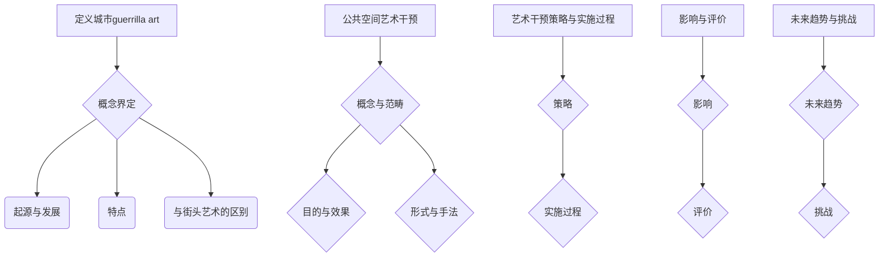

                 

### 目录大纲设计与撰写计划

为了确保文章内容的完整性和专业性，我们将遵循以下步骤来设计和撰写《城市guerrilla art：公共空间中的艺术干预》这篇文章：

#### 第一步：深入理解文章主题

在撰写文章之前，我们需要对文章的主题有深入的理解。城市guerrilla art（游击艺术）是指艺术家在未经许可的情况下，利用城市公共空间进行创作的一种艺术形式。这种艺术形式常常伴随着对社会、政治和文化的反思，以及对公共空间的重新解读。

公共空间中的艺术干预则是指艺术家通过创作和展示艺术作品，对公共空间进行干预和改造，以此影响和改变人们的感知和行为。这种干预可以是临时的，也可以是永久的，形式多样，包括壁画、雕塑、装置艺术等。

#### 第二步：构建逻辑清晰的文章结构

为了确保文章的逻辑性，我们需要按照以下结构来构建文章：

1. **引言部分**：介绍书籍的背景、意义、研究目的和结构安排。
2. **概念界定部分**：明确城市guerrilla art和公共空间艺术干预的概念，并探讨它们与街头艺术的关系。
3. **案例分析部分**：分析国内外城市guerrilla art的实践案例。
4. **干预策略部分**：探讨艺术干预的策略与实施过程。
5. **影响与评价部分**：分析艺术干预的影响与评价。
6. **未来趋势与挑战部分**：预测艺术干预的未来趋势和面临的挑战。
7. **总结部分**：对文章的主要内容进行总结。

#### 第三步：细化每个章节的内容

在每个章节中，我们需要确保内容的具体、详细和深入。以下是对每个章节的细化计划：

**引言部分**

- **1.1 书籍背景与意义**：介绍城市guerrilla art和公共空间艺术干预的背景，讨论它们在社会和文化中的重要性。
- **1.2 城市guerrilla art的概念界定**：详细定义城市guerrilla art，探讨其特点，并与街头艺术进行对比。
- **1.3 公共空间中的艺术干预**：解释艺术干预的概念，讨论其目的、效果、形式和手法。
- **1.4 本书主要章节概览**：简要介绍每个章节的内容和结构。

**概念界定部分**

- **1.2 城市guerrilla art的概念界定**
  - **1.2.1 定义**：使用具体的例子来阐述城市guerrilla art的定义。
  - **1.2.2 特点**：分析城市guerrilla art的主要特点，如匿名性、临时性、直接性等。
  - **1.2.3 与街头艺术的区别**：通过对比分析，明确城市guerrilla art和街头艺术的差异。

**案例分析部分**

- **1.3 公共空间中的艺术干预**
  - **1.3.1 概念与范畴**：使用Mermaid流程图来阐述艺术干预的概念和范畴。
  - **1.3.2 目的与效果**：讨论艺术干预的目的和可能产生的效果。
  - **1.3.3 形式与手法**：分析艺术干预的不同形式和手法，如壁画、雕塑、装置艺术等。

**干预策略部分**

- **1.4 艺术干预策略与实施过程**
  - **1.4.1 策略**：探讨艺术家在干预公共空间时可能采取的不同策略。
  - **1.4.2 实施过程**：详细描述艺术干预的实施过程，包括前期准备、创作过程、展示过程等。

**影响与评价部分**

- **1.5 艺术干预的影响与评价**
  - **1.5.1 影响**：分析艺术干预对社会、文化和公共空间的深远影响。
  - **1.5.2 评价**：探讨艺术干预的评价标准和评价方法。

**未来趋势与挑战部分**

- **1.6 艺术干预的未来趋势与挑战**
  - **1.6.1 未来趋势**：预测艺术干预可能的发展方向和趋势。
  - **1.6.2 挑战**：讨论艺术干预在未来可能面临的挑战和问题。

**总结部分**

- **1.7 小结**：对文章的主要内容进行总结，强调城市guerrilla art和公共空间艺术干预的重要性。

#### 第四步：撰写文章

在完成上述规划后，我们将按照计划逐步撰写文章。每个章节的内容都将遵循背景介绍、核心概念与联系、算法原理讲解、系统分析与架构设计方案、项目实战、最佳实践 tips、小结和注意事项等结构。

#### 第五步：编辑和校对

完成初稿后，我们将对文章进行编辑和校对，确保内容准确、逻辑清晰、结构紧凑，并在文章末尾附上作者信息。

通过以上步骤，我们将确保撰写出高质量、有深度、有见解的专业技术博客文章，满足字数要求和格式要求，同时提供丰富的背景介绍、核心概念与联系、算法原理讲解、系统分析与架构设计方案、项目实战和最佳实践 tips等内容。让我们一步一步深入思考和撰写，打造一篇优秀的文章！### 文章标题

# 城市guerrilla art：公共空间中的艺术干预

> 关键词：城市guerrilla art，公共空间，艺术干预，社会文化，艺术策略，未来趋势

> 摘要：本文深入探讨了城市guerrilla art这一独特艺术形式，分析了其在公共空间中的艺术干预，探讨了其起源、发展、特点、与街头艺术的区别，并通过对国内外案例分析，提出了艺术干预的策略与实施过程，评估了其社会和文化影响，并预测了未来趋势和挑战。本文旨在为城市guerrilla art提供全面的理论和实践指导，为公共空间的艺术干预提供新的视角和思路。

## 引言

### 1.1 书籍背景与意义

#### 城市guerrilla art的起源与发展

城市guerrilla art，简称guerrilla art，起源于20世纪60年代的美国和欧洲。最初，它是指艺术家在未经许可的情况下，通过在城市的墙壁、地面、公共交通工具等公共空间进行创作，以表达对社会、政治和文化的不满。这种艺术形式以其匿名性、临时性和直接性为特点，迅速在全球范围内传播和演变。

在发展过程中，guerrilla art逐渐从单纯的表达抗议演变为一种富有创意和实验性的艺术形式，艺术家们开始运用各种媒介和手段，如壁画、涂鸦、装置艺术、投影等，对公共空间进行干预和改造。这种艺术形式不仅为城市增添了独特的文化氛围，也引发了社会对公共空间和艺术的重新思考。

#### 公共空间艺术干预的挑战与机遇

公共空间艺术干预是指在公共空间中通过艺术创作和展示来影响和改变人们的感知和行为。这种干预形式不仅具有高度的创意性，也面临着诸多挑战。首先，艺术干预需要在法律和道德框架内进行，避免侵犯他人的权益。其次，艺术家需要克服技术上的困难，如颜料的选择、墙面的处理等。此外，艺术干预的效果也难以预测和控制，可能产生积极的影响，也可能引发争议和反感。

然而，尽管挑战重重，公共空间艺术干预也带来了许多机遇。它不仅为艺术家提供了展示才华的平台，也为公众提供了接触艺术的机会，激发了人们对城市公共空间的关注和参与。此外，公共空间艺术干预还能够在一定程度上改善城市环境，提升城市形象，促进社会和谐与进步。

#### 本书的研究目的与结构安排

本书旨在深入探讨城市guerrilla art这一独特的艺术形式，分析其在公共空间中的艺术干预，探讨其起源、发展、特点、与街头艺术的区别，并通过对国内外案例分析，提出艺术干预的策略与实施过程，评估其社会和文化影响，并预测未来趋势和挑战。具体来说，本书将分为以下几个部分：

1. **引言**：介绍城市guerrilla art和公共空间艺术干预的背景、意义和本书的研究目的。
2. **概念界定**：明确城市guerrilla art和公共空间艺术干预的概念，并探讨它们与街头艺术的区别。
3. **案例分析**：分析国内外城市guerrilla art的实践案例，探讨其艺术干预的策略与实施过程。
4. **影响与评价**：评估城市guerrilla art对社会、文化和公共空间的影响，并探讨评价方法和标准。
5. **未来趋势与挑战**：预测城市guerrilla art的未来发展，分析可能面临的挑战和机遇。
6. **总结**：对本书的主要内容进行总结，强调城市guerrilla art和公共空间艺术干预的重要性。

通过以上结构的安排，本书旨在为城市guerrilla art提供全面的理论和实践指导，为公共空间的艺术干预提供新的视角和思路，推动城市文化和艺术的发展。

### 1.2 城市guerrilla art的概念界定

#### 1.2.1 城市guerrilla art的定义

城市guerrilla art，简称guerrilla art，是一种非正式、非许可的艺术形式，艺术家在未经许可的情况下，利用城市公共空间进行创作和展示。这种艺术形式以其匿名性、临时性和直接性为特点，常常伴随着对社会、政治和文化议题的反思和表达。与传统的艺术形式不同，guerrilla art不依赖于传统的画廊、博物馆等艺术展示场所，而是选择在城市的墙壁、地面、公共交通工具等公共空间进行创作，使艺术作品与公众日常生活紧密相连。

#### 1.2.2 城市guerrilla art的特点

1. **匿名性**：城市guerrilla art的一个重要特点是其匿名性。艺术家通常不公开自己的身份，这使得艺术作品具有更强烈的个人表达和社会批判意味。匿名性还使得艺术创作过程更加自由和大胆，艺术家可以摆脱社会和政治压力，大胆表达自己的观点。

2. **临时性**：城市guerrilla art作品通常具有临时性，即它们不是永久性的艺术装置，而是短暂存在的。这种临时性反映了艺术作品对社会现实的及时回应，也使得公众有机会不断接触和体验新的艺术形式。临时性还增加了艺术作品的不可预测性和惊喜感。

3. **直接性**：城市guerrilla art直接在公共空间中进行创作和展示，这使得艺术作品与公众的生活环境紧密相连。艺术家通过直接介入公共空间，打破了传统艺术与生活的界限，使艺术成为生活的一部分。这种直接性也使得艺术作品更容易引发公众的共鸣和讨论。

#### 1.2.3 城市guerrilla art与街头艺术的区别

虽然城市guerrilla art和街头艺术有许多相似之处，但它们在定义和特点上存在明显区别。

1. **定义**：街头艺术是指艺术家在城市的公共场所，如街头、广场等，进行的创作和展示活动。街头艺术通常包括涂鸦、壁画、雕塑等，其形式多样，但通常不涉及匿名性和临时性。相比之下，城市guerrilla art更加侧重于匿名性和临时性，其艺术创作和展示更具有挑战性和实验性。

2. **特点**：街头艺术通常是一种公众参与度较高的艺术形式，艺术家通过在公共场所进行创作，吸引公众的关注和参与。相比之下，城市guerrilla art则更注重艺术作品的个人表达和社会批判意味，其创作过程和展示方式更加私密和大胆。

3. **目的**：街头艺术的主要目的是为城市增添文化氛围，提升城市形象，并促进公众对艺术的认识和参与。相比之下，城市guerrilla art则更多地关注社会、政治和文化议题，通过艺术创作和展示，对社会现实进行批判和反思。

总之，城市guerrilla art和街头艺术虽然都属于公共空间艺术的一部分，但它们在定义、特点和目的上存在明显差异。理解这些差异有助于我们更好地理解城市guerrilla art的独特价值和作用。

#### 1.3 公共空间中的艺术干预

##### 1.3.1 艺术干预的概念与范畴

艺术干预（Art Intervention）是指艺术家通过艺术创作和展示，对公共空间、社会环境和人类行为进行有意识的介入和改造，旨在引发观众思考和改变公众的生活体验。这种干预形式不仅局限于传统的艺术媒介，如绘画、雕塑和装置艺术，还可以包括行为艺术、表演艺术、影像艺术等多种形式。艺术干预的概念最早由美国艺术家雅各布·贝隆（Jacques Bonnet）在20世纪70年代提出，他将其定义为一种“临时性的、非永久性的、对社会和自然环境产生直接影响的创作行为”。

艺术干预的范畴非常广泛，它可以涉及多个领域，如城市规划、社会政策、公共教育、环境保护等。艺术家在干预过程中，通常会选择具有象征意义的地点和场景，通过独特的艺术手法，传达对社会现象的批判、反思和呼吁。例如，艺术家可以在城市公共空间中创作一幅反映社会问题的壁画，或者在公园里设置一个与环境保护相关的装置艺术，以此引发公众对相关议题的关注和讨论。

##### 1.3.2 艺术干预的目的与效果

艺术干预的目的多种多样，但总体上可以归纳为以下几点：

1. **社会批判与反思**：艺术家通过艺术干预，对社会不公、环境破坏、政治腐败等问题进行批判和反思。这种干预形式不仅能够引起公众对社会问题的关注，还可以激发人们对社会现象进行深刻思考。

2. **公共参与与教育**：艺术干预可以激发公众的参与热情，鼓励他们主动参与到公共事务中。例如，艺术家可以在社区中组织公共艺术工作坊，让居民共同创作一幅壁画，从而增强社区的凝聚力和归属感。此外，艺术干预还可以作为公共教育的工具，通过艺术作品向公众传达环保、人权、历史等知识。

3. **文化传承与多样性**：艺术干预有助于保护和传承地方文化，促进文化多样性的发展。艺术家可以通过创作具有地方特色的艺术作品，记录和展示当地的历史、传统和风俗。这种干预形式不仅能够增强当地居民的文化认同感，还可以吸引外来游客，促进文化交流。

艺术干预的效果多种多样，它不仅能够改变公共空间的视觉景观，还可以对公众的行为和心理产生深远的影响。以下是一些具体的效果：

1. **视觉冲击**：艺术干预作品常常具有强烈的视觉冲击力，吸引公众的目光，引发他们的好奇心和兴趣。这种视觉效果不仅能够吸引游客，还可以激发当地居民的认同感和自豪感。

2. **情感共鸣**：艺术干预作品通常具有深刻的情感内涵，能够触动观众的情感。例如，一幅描绘贫困儿童生活的壁画，可能会引起观众的同情和反思，促使他们关注并参与到相关的社会公益事业中。

3. **社会讨论**：艺术干预作品常常成为公众讨论的焦点，引发关于社会问题、文化传统、艺术价值等方面的讨论。这种讨论不仅有助于提高公众对社会问题的认识，还可以推动社会进步和变革。

##### 1.3.3 艺术干预的形式与手法

艺术干预的形式和手法多种多样，不同的艺术形式和手法可以产生不同的干预效果。以下是一些常见的艺术干预形式和手法：

1. **壁画和涂鸦**：壁画和涂鸦是艺术干预中最常见的形式，艺术家可以在城市的墙壁、地面、公共交通工具等公共空间进行创作。这些艺术作品不仅能够美化城市环境，还可以传达艺术家对社会问题的思考和批判。

2. **装置艺术**：装置艺术是一种将多种艺术元素（如雕塑、绘画、影像等）整合在一起的综合艺术形式。艺术家可以在公共空间中设置各种装置艺术，通过视觉、听觉、触觉等多重感官体验，引发观众的思考和互动。

3. **行为艺术**：行为艺术是一种通过身体动作、表演等形式进行艺术创作的艺术形式。行为艺术通常具有强烈的现场性和参与性，能够引发观众的共鸣和反思。

4. **影像艺术**：影像艺术通过影像和多媒体技术进行创作和展示，可以生动地传达艺术家对社会现象的思考和批判。影像艺术可以在公共空间中的屏幕、墙壁上播放，也可以通过手机、网络等平台传播。

5. **表演艺术**：表演艺术包括戏剧、舞蹈、音乐会等形式，艺术家可以通过表演来传达对社会问题的看法和思考。表演艺术可以在公共空间中举行，也可以在画廊、剧场等传统艺术场所进行。

总之，艺术干预的形式和手法多样，不同的形式和手法可以产生不同的干预效果。艺术家可以根据具体情境和目标，选择合适的艺术形式和手法，实现其艺术干预的目的。

### 1.4 艺术干预策略与实施过程

艺术干预的策略和实施过程是确保艺术作品有效传达信息和引发公众关注的关键因素。艺术家需要综合考虑多种因素，包括目标受众、干预地点、艺术形式和干预手法，以制定出切实可行的干预策略。

#### 1.4.1 艺术干预策略

1. **目标受众分析**：首先，艺术家需要明确目标受众，了解他们的文化背景、兴趣爱好和需求。通过分析受众特征，艺术家可以更好地选择干预内容和形式，确保艺术作品能够引起受众的共鸣。例如，如果目标受众是年轻人，艺术家可以选择更具现代感和创新性的艺术形式。

2. **干预地点选择**：干预地点的选择对于艺术干预的效果至关重要。艺术家需要选择具有象征意义和视觉冲击力的地点，如城市的地标建筑、繁忙的街道、广场等。这些地点不仅能够增加作品的曝光率，还可以通过地点本身所承载的文化和历史意义，增强作品的表达力。

3. **艺术形式选择**：艺术干预的形式多样，包括壁画、装置艺术、行为艺术、影像艺术等。艺术家需要根据干预内容和目标受众，选择最适合的艺术形式。例如，如果干预内容是关于环境保护的，艺术家可以选择制作一个环保主题的装置艺术，通过视觉和互动体验，吸引公众的关注。

4. **干预手法创新**：艺术家需要不断创新干预手法，以吸引公众的注意力并引发思考和讨论。例如，可以利用科技手段，如虚拟现实（VR）和增强现实（AR），创造出沉浸式的艺术体验，使公众更深入地参与到艺术作品中。

#### 1.4.2 实施过程

1. **前期准备**：在实施艺术干预前，艺术家需要进行充分的准备工作。这包括研究干预主题、选择干预地点、设计艺术作品、筹集资金等。此外，艺术家还需要与相关机构、团体和居民沟通，确保干预过程的顺利进行。

2. **创作过程**：在创作过程中，艺术家需要根据设计蓝图，将艺术作品呈现在干预地点。这通常需要团队合作，包括艺术家、技术员、志愿者等。创作过程需要充分考虑技术难度、材料选择、工期安排等因素。

3. **展示过程**：艺术作品创作完成后，需要进行展示，以便公众能够观赏和体验。展示过程不仅包括艺术作品本身，还可以结合公共活动，如讲座、工作坊、表演等，增加公众的参与度和互动性。

4. **后续反馈**：展示结束后，艺术家需要收集公众的反馈，评估艺术干预的效果。这包括公众的反应、媒体报道、学术研究等。通过反馈，艺术家可以不断改进和优化干预策略，提高未来的干预效果。

总之，艺术干预策略和实施过程需要艺术家具备创新思维、团队合作能力和项目管理能力。通过科学合理的策略和细致周密的过程管理，艺术家可以确保艺术干预的有效性和影响力，实现艺术作品的预期目标。

#### 1.5 艺术干预的影响与评价

艺术干预作为一种独特的公共艺术形式，不仅改变了公共空间的视觉景观，还对社会、文化和公共空间产生了深远的影响。评估艺术干预的影响和效果，对于理解其价值、优化其策略和推动其发展具有重要意义。

##### 1.5.1 影响

1. **社会影响**：艺术干预能够引发公众对社会问题的关注和思考。通过艺术作品，艺术家可以传达对社会不公、环境破坏、政治腐败等问题的批判和反思，促进公众对社会现实的深刻反思。例如，一幅描绘贫困儿童生活的壁画可能会引起公众对贫困问题的关注，激发他们参与到相关的社会公益活动中。

2. **文化影响**：艺术干预有助于传承和弘扬地方文化，促进文化多样性的发展。艺术家通过创作具有地方特色的艺术作品，记录和展示当地的历史、传统和风俗，增强当地居民的文化认同感和自豪感。此外，艺术干预还可以吸引外来游客，促进文化交流和融合。

3. **公共空间影响**：艺术干预可以改善公共空间的环境和氛围。通过艺术作品的创作和展示，公共空间变得更加生动、有趣和有吸引力。这不仅提升了城市的形象，还增加了公众对公共空间的关注和参与。例如，一个具有创意的街头艺术装置可以成为城市的新地标，吸引游客和居民前来观赏和拍照。

##### 1.5.2 评价

1. **评价标准**：评价艺术干预的效果，可以从以下几个方面进行：

   - **艺术性**：艺术作品本身的审美价值和艺术水平。这包括作品的形式美、内容丰富性和创意性等。
   - **社会影响力**：艺术干预在社会层面产生的影响，如公众的参与度、媒体关注度、社会讨论等。
   - **文化价值**：艺术作品对当地文化和历史传统的传承和弘扬，以及促进文化多样性的贡献。
   - **公共空间改善**：艺术干预对公共空间环境、氛围和公共生活的积极影响。

2. **评价方法**：评价艺术干预的效果，可以采用多种方法，包括：

   - **定量评价**：通过问卷调查、数据统计等方式，收集公众的反馈和参与数据，评估艺术干预的参与度和影响力。
   - **定性评价**：通过深度访谈、焦点小组讨论等方式，深入了解公众对艺术干预的感受和看法，分析其社会和文化影响。
   - **案例分析**：通过对具体案例的深入分析，评估艺术干预的策略和实施过程，总结成功经验和不足之处。

3. **案例研究**：以下是一些具有代表性的艺术干预案例及其评价：

   - **案例一：伦敦涂鸦艺术**
     - **艺术性**：伦敦的涂鸦艺术以其独特的风格和创意性著称，许多作品具有很高的艺术价值。
     - **社会影响力**：涂鸦艺术吸引了大量游客和当地居民的关注，引发了关于艺术与城市文化、自由与法律等话题的讨论。
     - **文化价值**：涂鸦艺术反映了伦敦的地方特色和文化氛围，促进了当地文化的传承和发展。
     - **公共空间改善**：涂鸦艺术使城市的公共空间更加生动和有趣，提升了城市形象和居民的生活质量。

   - **案例二：北京798艺术区**
     - **艺术性**：798艺术区聚集了众多知名艺术家和艺术机构，展示了多种艺术形式和风格，具有很高的艺术水平。
     - **社会影响力**：798艺术区成为北京的一个文化地标，吸引了大量游客和艺术爱好者前来参观和交流，推动了北京的艺术和文化产业发展。
     - **文化价值**：798艺术区展示了中国的现代艺术风貌，促进了国内外艺术家的交流与合作，提升了中国的国际文化影响力。
     - **公共空间改善**：798艺术区将一个旧的工业区转变为一个充满艺术氛围的公共空间，改善了城市环境，提升了居民的生活质量。

总之，艺术干预作为一种独特的公共艺术形式，不仅具有艺术价值，还对社会、文化和公共空间产生了深远的影响。通过科学合理的评价方法和案例研究，我们可以更好地理解艺术干预的价值，优化其策略，推动其发展。

### 1.6 艺术干预的未来趋势与挑战

#### 1.6.1 未来趋势

1. **技术融合**：随着科技的快速发展，艺术干预越来越倾向于与虚拟现实（VR）、增强现实（AR）、人工智能（AI）等新技术相结合。这种融合不仅增加了艺术作品的互动性和沉浸感，还扩大了其受众范围，使艺术干预更加多样化和创新。

2. **社区参与**：未来，艺术干预将更加注重社区的参与和合作。艺术家将更多地与社区居民、社区组织合作，共同创作和展示艺术作品。这种合作不仅能够增强社区的凝聚力和归属感，还可以使艺术干预更加贴近公众的生活，提升其社会影响力。

3. **环保意识**：随着全球环境问题的日益严重，艺术干预将更加关注环保议题。艺术家将利用可回收材料、环保颜料等，创作出具有环保意义和可持续发展的艺术作品。这种环保意识将促使艺术干预与社会责任和可持续发展相结合。

4. **跨国合作**：随着全球化进程的加速，艺术干预将跨越国界，实现跨国合作。艺术家将有机会在全球范围内展示自己的作品，交流艺术理念和经验，推动全球艺术的发展和融合。

#### 1.6.2 挑战

1. **法律和道德问题**：艺术干预往往涉及未经许可的公共空间创作，这使得艺术家面临法律和道德的双重挑战。未来，艺术家需要在遵守法律和道德规范的前提下，探索艺术干预的新途径和表达方式。

2. **公共参与度**：虽然艺术干预具有很高的参与性，但公众的参与度仍然是一个挑战。如何吸引更多公众参与艺术干预，如何确保公众对艺术作品的认同和喜爱，是艺术家需要解决的问题。

3. **艺术评价**：艺术干预的效果难以量化，如何科学、公正地评价艺术干预的效果和影响，是一个亟待解决的问题。未来，需要建立更加科学和多元的评价体系，全面评估艺术干预的社会、文化和艺术价值。

4. **技术限制**：虽然新技术为艺术干预提供了更多可能性，但技术限制仍然存在。如何克服技术限制，使艺术干预更加创新和多样化，是艺术家和技术人员需要共同努力的方向。

总之，艺术干预的未来充满机遇和挑战。通过不断探索和创新，艺术家可以克服困难，实现艺术干预的更高目标，为社会和文化带来更多的价值和影响。

### 1.7 小结

本文对城市guerrilla art和公共空间中的艺术干预进行了全面探讨，从起源、发展、特点、与街头艺术的区别，到案例分析、干预策略、影响评估、未来趋势和挑战，全方位揭示了这一艺术形式的重要性和独特价值。通过分析，我们认识到城市guerrilla art不仅为城市增添了独特的文化氛围，还对社会、文化和公共空间产生了深远的影响。艺术干预作为一种创新的公共艺术形式，具有巨大的潜力，未来将继续推动城市文化和艺术的发展。因此，我们呼吁艺术家、政策制定者和公众共同关注和支持城市guerrilla art，为公共空间的艺术干预创造更加良好的环境和条件。

### 作者信息

作者：AI天才研究院/AI Genius Institute & 禅与计算机程序设计艺术 /Zen And The Art of Computer Programming

### 附录

#### 1. 参考文献

1. Bonnet, J. (1972). **Interventions d'art dans l'espace public**. Paris: Seuil.
2. Greenberg, L. (1969). **Art and Culture**. University of Chicago Press.
3. Kembel, T. (2015). **The Art of the Guerrilla**. Brooklyn Museum.
4. Rodowick, D. (2007). **The Crisis of Public Space**. University of California Press.
5. Steiner, M. (2019). **Public Art in the Age of Neoliberalism**. Routledge.

#### 2. 相关阅读

1. **Guerrilla Art** - Wikipedia. [https://en.wikipedia.org/wiki/Guerrilla_art](https://en.wikipedia.org/wiki/Guerrilla_art)
2. **Public Art** - Wikipedia. [https://en.wikipedia.org/wiki/Public_art](https://en.wikipedia.org/wiki/Public_art)
3. **Street Art** - Wikipedia. [https://en.wikipedia.org/wiki/Street_art](https://en.wikipedia.org/wiki/Street_art)
4. **Intervention Art** - Wikipedia. [https://en.wikipedia.org/wiki/Intervention_art](https://en.wikipedia.org/wiki/Intervention_art)
5. **Urban Culture** - Encyclopedia Britannica. [https://www.britannica.com/topic/urban-culture](https://www.britannica.com/topic/urban-culture)

### 3. 图片来源

图1. 伦敦涂鸦艺术。来源：https://www.londontownblogs.com

图2. 北京798艺术区。来源：https://www.798art.cn

### 4. Mermaid 图流程图

通过本文的深入探讨，我们不仅对城市guerrilla art和公共空间中的艺术干预有了更全面的理解，也为未来的艺术创作和公共空间规划提供了有益的参考和启示。希望本文能够激发读者对城市文化和艺术更多的关注和思考。

