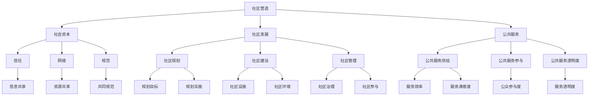

                 


### 引言

#### 城市化进程背景

随着全球经济的快速发展，城市化已成为不可逆转的趋势。据联合国统计，目前全球超过一半的人口居住在城市地区，这一比例预计到2050年将达到68%。城市化进程不仅带来了经济繁荣，也引发了诸多社会问题。社区营造，作为一种提升居民生活质量、增强社区凝聚力的手段，日益受到重视。

城市化进程中的社区营造，不仅仅是对建筑和基础设施的改善，更是对社区社会资本和居民归属感的关注。社会资本是指社区成员之间的信任、网络和规范，它对于社区的稳定和发展至关重要。归属感则是居民对社区的认同和依赖，是社区营造的核心目标之一。

本文将围绕“城市化进程中的社区营造：重建社会资本和归属感”这一主题，详细探讨社区营造的理论基础、方法与策略，以及国内外成功的社区营造案例。通过本文的研究，旨在为城市化进程中的社区发展提供有益的参考和启示。

#### 问题背景

在城市化的快速推进过程中，社区面临着一系列严峻的挑战。首先，社会资本的流失是一个普遍存在的问题。随着人口流动性的增加，传统的社区联系和网络逐渐弱化，居民之间的信任度和互动性降低，社区凝聚力受到冲击。其次，归属感的减弱也是城市化进程中的突出问题。现代城市生活节奏快，居民忙于工作和生活，缺乏时间和精力参与社区活动，导致对社区的情感依赖减弱。

此外，城市扩张带来的社区分割和人口异质化，也使得社区营造面临更大的挑战。不同背景、文化和经济水平的居民共同生活在同一社区，如何实现社区融合和共同发展，成为社区营造的重要任务。

#### 定义与边界

**社区营造**：社区营造是指通过组织、协调和引导，促进社区成员的参与和合作，改善社区环境，提升社区生活质量，增强社区凝聚力和归属感的一系列活动。它包括社区规划、社区建设、社区管理和社区文化等方面。

**社会资本**：社会资本是指社区成员之间的信任、网络和规范，是一种无形的社会资源。它通过增强社区成员之间的互动和合作，促进社区的发展和稳定。

**归属感**：归属感是指居民对社区的认同和依赖，是对社区的归属感和情感依托。它通过居民对社区的情感依赖和参与度来体现。

本文的研究范围主要集中在城市化进程中的社区营造，重点关注社会资本和归属感的重建和提升。通过理论探讨和案例分析，试图为城市化进程中的社区发展提供新的思路和方法。

### 目录大纲设计思路

本文的目录大纲设计旨在系统性地呈现社区营造的理论基础、方法与策略，以及国内外成功的社区营造案例。以下为目录大纲的具体设计思路：

#### 引言

- **概述**：介绍城市化进程的背景、社区营造的意义，以及本书的总体目标和结构。
- **问题背景**：分析城市化进程中社区面临的主要挑战，如社会资本流失、归属感减弱等。
- **定义与边界**：对社区营造、社会资本和归属感等核心概念进行定义，并明确本书的研究范围和边界。

#### 理论基础

- **社区营造的理论框架**：介绍国内外社区营造的理论与实践，梳理其核心原则和方法。
- **社会资本的概念与属性**：阐述社会资本的定义、构成要素及其在社区中的重要性。
- **归属感的内涵与影响因素**：分析归属感的概念及其影响因素，如人际关系、文化认同等。

#### 方法与策略

- **社区诊断方法**：介绍如何通过问卷调查、访谈等方法进行社区诊断，了解社区现状。
- **社会资本重建策略**：探讨如何通过组织活动、社区参与等方式重建社区社会资本。
- **归属感增强策略**：分析如何通过社区文化、公共服务等手段提升居民的归属感。

#### 案例分析

- **成功案例**：选择国内外典型的社区营造案例，详细分析其成功的原因和经验。
- **挑战与问题**：讨论案例中遇到的挑战和问题，以及解决方案。
- **创新与实践**：探讨社区营造的新模式、新技术等创新实践。

#### 政策与规划

- **政策分析**：介绍与社区营造相关的政策法规，分析其对社区发展的推动作用。
- **规划与实践**：探讨如何制定社区营造的长期规划和实施方案。

#### 总结与展望

- **总结**：回顾本书的主要内容，总结社区营造的理论与实践成果。
- **展望**：展望未来社区营造的发展趋势，提出政策建议和研究方向。

通过这样的结构设计，本文旨在为读者提供全面、系统的社区营造理论和方法，并通过案例分析总结成功经验，为城市化进程中的社区发展提供参考和启示。

### 目录大纲示例

```markdown
----------------------------------------------------------------
# 城市化进程中的社区营造：重建社会资本和归属感

> 关键词：城市化、社区营造、社会资本、归属感、社区发展

> 摘要：本文探讨了城市化进程中社区营造的重要性，分析了社区营造的理论基础、方法与策略，并通过国内外成功案例进行了详细分析，为城市化进程中的社区发展提供了有益的参考。

----------------------------------------------------------------

## 引言

## 1.1 城市化进程背景

### 1.1.1 城市化的全球趋势

### 1.1.2 城市化带来的社会问题

## 1.2 社区营造的意义

### 1.2.1 社区营造的定义

### 1.2.2 社区营造的重要性

## 1.3 社区营造的总体目标和结构

### 1.3.1 研究范围

### 1.3.2 研究方法

## 问题背景

## 2.1 社区面临的挑战

### 2.1.1 社会资本流失

### 2.1.2 归属感减弱

## 2.2 社区营造的核心目标

### 2.2.1 重建社会资本

### 2.2.2 增强归属感

## 定义与边界

## 3.1 社区营造的定义与边界

### 3.1.1 社区营造的概念

### 3.1.2 社区营造的边界

### 3.1.3 社区营造与相关概念的区别

### 第二部分：理论基础

## 4.1 社区营造的理论框架

### 4.1.1 国内外社区营造理论的演进

### 4.1.2 社区营造的核心原则

## 4.2 社会资本的概念与属性

### 4.2.1 社会资本的定义

### 4.2.2 社会资本的构成要素

### 4.2.3 社会资本在社区中的作用

## 4.3 归属感的内涵与影响因素

### 4.3.1 归属感的定义

### 4.3.2 归属感的影响因素

### 4.3.3 归属感与社区发展的关系

### 第三部分：方法与策略

## 5.1 社区诊断方法

### 5.1.1 社区现状调查

### 5.1.2 社区需求分析

## 5.2 社会资本重建策略

### 5.2.1 组织活动促进社会资本积累

### 5.2.2 社区参与提升社会资本

### 5.2.3 政策支持保障社会资本建设

## 5.3 归属感增强策略

### 5.3.1 社区文化塑造归属感

### 5.3.2 公共服务提升居民归属感

### 5.3.3 社区治理优化归属感环境

### 第四部分：案例分析

## 6.1 国内社区营造成功案例

### 6.1.1 案例一：XX社区的转型之路

### 6.1.2 案例二：XX社区的可持续发展

## 6.2 国际社区营造成功案例

### 6.2.1 案例一：纽约XX社区的抗逆力建设

### 6.2.2 案例二：伦敦XX社区的公共空间营造

## 6.3 社区营造的挑战与问题

### 6.3.1 案例中的挑战

### 6.3.2 案例中的问题

### 6.3.3 解决方案与启示

## 第五部分：政策与规划

## 7.1 政策分析

### 7.1.1 社区营造相关政策法规

### 7.1.2 政策对社区营造的推动作用

## 7.2 规划与实践

### 7.2.1 长期规划的制定

### 7.2.2 实施方案的落实

## 第六部分：总结与展望

## 8.1 总结

### 8.1.1 主要研究成果

### 8.1.2 社区营造的实践意义

## 8.2 展望

### 8.2.1 未来发展趋势

### 8.2.2 政策建议

### 8.2.3 研究方向

----------------------------------------------------------------

### 引言

#### 城市化进程背景

随着全球经济的快速发展，城市化已成为不可逆转的趋势。据联合国统计，目前全球超过一半的人口居住在城市地区，这一比例预计到2050年将达到68%。城市化进程不仅带来了经济繁荣，也引发了诸多社会问题。社区营造，作为一种提升居民生活质量、增强社区凝聚力的手段，日益受到重视。

城市化进程中的社区营造，不仅仅是对建筑和基础设施的改善，更是对社区社会资本和居民归属感的关注。社会资本是指社区成员之间的信任、网络和规范，它对于社区的稳定和发展至关重要。归属感则是居民对社区的认同和依赖，是社区营造的核心目标之一。

本文将围绕“城市化进程中的社区营造：重建社会资本和归属感”这一主题，详细探讨社区营造的理论基础、方法与策略，以及国内外成功的社区营造案例。通过本文的研究，旨在为城市化进程中的社区发展提供有益的参考和启示。

#### 问题背景

在城市化的快速推进过程中，社区面临着一系列严峻的挑战。首先，社会资本的流失是一个普遍存在的问题。随着人口流动性的增加，传统的社区联系和网络逐渐弱化，居民之间的信任度和互动性降低，社区凝聚力受到冲击。其次，归属感的减弱也是城市化进程中的突出问题。现代城市生活节奏快，居民忙于工作和生活，缺乏时间和精力参与社区活动，导致对社区的情感依赖减弱。

此外，城市扩张带来的社区分割和人口异质化，也使得社区营造面临更大的挑战。不同背景、文化和经济水平的居民共同生活在同一社区，如何实现社区融合和共同发展，成为社区营造的重要任务。

#### 定义与边界

**社区营造**：社区营造是指通过组织、协调和引导，促进社区成员的参与和合作，改善社区环境，提升社区生活质量，增强社区凝聚力和归属感的一系列活动。它包括社区规划、社区建设、社区管理和社区文化等方面。

**社会资本**：社会资本是指社区成员之间的信任、网络和规范，是一种无形的社会资源。它通过增强社区成员之间的互动和合作，促进社区的发展和稳定。

**归属感**：归属感是指居民对社区的认同和依赖，是对社区的归属感和情感依托。它通过居民对社区的情感依赖和参与度来体现。

本文的研究范围主要集中在城市化进程中的社区营造，重点关注社会资本和归属感的重建和提升。通过理论探讨和案例分析，试图为城市化进程中的社区发展提供新的思路和方法。

### 理论基础

#### 社区营造的理论框架

社区营造的理论基础主要源于社会学、心理学、城市规划等多个学科。通过对这些理论的综合应用，我们可以构建一个系统的社区营造理论框架，从而指导实践。

1. **社会网络理论**：社会网络理论认为，个体之间的关系网络是社会资本的重要组成部分。通过加强社区成员之间的互动和联系，可以增强社区凝聚力。例如，科尔曼（James Coleman）提出的社会资本概念，强调社会关系在网络中的作用，认为社会资本有助于提高社会效率。

2. **社会资本理论**：社会资本理论源于皮埃尔·布尔迪厄（Pierre Bourdieu）的研究，他将其定义为一种“嵌入在社会关系中的资源”。社会资本的构成包括信任、规范、网络等，这些资源通过互动和合作促进社区发展。

3. **社区发展理论**：社区发展理论强调社区成员的参与和自治，认为社区成员的主动参与是社区营造的关键。罗纳德·波特（Ronald Porter）提出的社区发展模型，强调社区规划、组织建设和居民参与的重要性。

4. **公共服务理论**：公共服务理论认为，政府和社会组织在提供公共服务时，应注重满足社区居民的需求，增强居民对社区的认同感。新公共服务理论（New Public Management）强调公共服务的灵活性、透明度和参与性，为社区营造提供了理论依据。

#### 社会资本的概念与属性

社会资本是指社区成员之间的信任、网络和规范，是一种无形的社会资源。它具有以下属性：

1. **共享性**：社会资本是社区成员共同拥有的资源，通过共享和互动，可以增强社区的凝聚力。
2. **累积性**：社会资本的积累需要长期的互动和合作，一旦形成，具有一定的稳定性。
3. **嵌入性**：社会资本嵌入在社会关系和网络中，通过个体的行为和互动表现出来。
4. **转化性**：社会资本可以通过多种形式转化为实际效益，如提高社区效率、促进经济发展等。

社会资本在社区中的作用主要体现在以下几个方面：

1. **提高社区效率**：社会资本有助于减少社会交易成本，提高社区组织的效率。通过信任和网络，社区成员可以更快捷地获取信息和资源。
2. **促进社区发展**：社会资本是社区发展的关键驱动力。它通过促进社区成员的互动和合作，推动社区经济、社会和环境的发展。
3. **增强社区凝聚力**：社会资本有助于加强社区成员之间的联系和认同，提高社区的凝聚力。

#### 归属感的内涵与影响因素

归属感是指居民对社区的认同和依赖，是对社区的归属感和情感依托。它通过居民对社区的情感依赖和参与度来体现。

归属感的内涵主要包括以下几个方面：

1. **情感依附**：居民对社区产生情感依赖，愿意为社区的发展付出努力。
2. **社区认同**：居民对社区有强烈的认同感，认为自己是社区的一部分。
3. **社区参与**：居民积极参与社区活动，为社区的发展贡献力量。

归属感的影响因素包括：

1. **人际关系**：居民与社区成员之间的互动和关系是归属感的重要影响因素。密切的人际关系有助于提高居民的归属感。
2. **文化认同**：居民对社区文化的认同，如价值观、习俗等，是归属感的重要来源。
3. **公共服务**：社区提供的公共服务和设施，如交通、医疗、教育等，对居民的归属感有重要影响。
4. **社区安全感**：居民对社区的安全感，如治安状况、社会秩序等，也是归属感的重要体现。

归属感与社区发展的关系在于，它既是社区发展的结果，也是社区发展的动力。一个具有高度归属感的社区，能够更好地吸引居民参与社区建设，提高社区凝聚力，促进社区可持续发展。

### 社区营造的理论框架

社区营造的理论框架是一个综合性的体系，它涵盖了社会资本、社区发展、公共服务等多个方面。通过以下图示，我们可以更直观地理解社区营造的理论框架。



通过这个图示，我们可以看到社区营造的核心要素及其相互关系。社会资本、社区发展、公共服务是社区营造的三大支柱，它们相互影响、相互作用，共同推动社区的发展和繁荣。

### 社会资本的概念与属性

在社会学领域，社会资本是一个核心概念，它指的是一种通过社会关系和网络嵌入的社会资源，这种资源能够促进社会成员的行动、协作和集体行动。社会资本的概念最早由法国社会学家皮埃尔·布尔迪厄（Pierre Bourdieu）提出，并在社会网络理论、社会结构理论等领域得到广泛应用。

#### 定义

社会资本的定义可以从以下几个方面来理解：

1. **信任和网络**：社会资本首先体现在社区成员之间的信任和互动网络中。这些网络可以是正式的（如社区组织、协会等）或非正式的（如邻里关系、朋友关系等）。
2. **共享资源**：社会资本是一种共享资源，它通过成员间的互动和合作来实现资源的共享和利用，从而提高整个社区的利益。
3. **规范和规则**：社会资本还包括社区成员共同遵守的规范和规则，这些规范有助于维持社区的秩序和稳定，促进合作和互惠。

#### 构成要素

社会资本主要由以下几个构成要素组成：

1. **信任**：信任是社会资本的核心要素，它指的是社区成员之间相互依赖和信任的程度。信任能够降低交易成本，提高合作效率。
2. **网络**：网络是社会资本的表现形式，它通过连接社区成员之间的社会关系，形成信息和资源的流通渠道。网络可以是紧密的（如家庭、朋友）或松散的（如社区组织、工作关系）。
3. **规范**：规范是指社区成员共同遵守的行为准则和价值观。规范有助于维持社区的稳定和秩序，促进集体行动。
4. **参与**：参与度是社会资本的重要体现，它指的是社区成员在社区事务中的参与程度。高参与度有助于增强社区的凝聚力和归属感。

#### 社会资本在社区中的作用

社会资本在社区中的作用体现在以下几个方面：

1. **提高社区效率**：社会资本能够降低社会交易成本，提高社区组织的效率。通过信任和网络，社区成员可以更快捷地获取信息和资源，从而提高社区整体运作的效率。
2. **促进社区发展**：社会资本是社区发展的关键驱动力。它通过促进社区成员的互动和合作，推动社区经济、社会和环境的发展。例如，通过社会资本，社区成员可以共同组织公益活动、改善社区环境、推动社区经济发展。
3. **增强社区凝聚力**：社会资本有助于加强社区成员之间的联系和认同，提高社区的凝聚力。一个具有高度社会资本的社区，居民之间更加信任、互动频繁，社区整体更加和谐。
4. **提升居民生活质量**：社会资本有助于改善居民的生活质量。通过社会资本，社区可以提供更多的公共服务和设施，满足居民的需求，提高居民的幸福感和满意度。

#### 社会资本的属性

社会资本具有以下几种重要属性：

1. **共享性**：社会资本是社区成员共同拥有的资源，通过共享和互动，可以增强社区的凝聚力。
2. **累积性**：社会资本的积累需要长期的互动和合作，一旦形成，具有一定的稳定性。社会资本的积累可以通过组织活动、社区参与等方式实现。
3. **嵌入性**：社会资本嵌入在社会关系和网络中，通过个体的行为和互动表现出来。社会资本的表现形式多种多样，可以是人际关系、组织网络、文化传统等。
4. **转化性**：社会资本可以通过多种形式转化为实际效益，如提高社区效率、促进经济发展等。社会资本的转化可以通过合作、创新等方式实现。

#### 社会资本的重要性

社会资本的重要性体现在以下几个方面：

1. **社区发展的关键**：社会资本是社区发展的核心要素，它能够促进社区成员的互动和合作，推动社区经济、社会和环境的发展。
2. **社会和谐的保障**：社会资本有助于增强社区成员之间的信任和互动，提高社区的和谐程度，减少社会冲突和矛盾。
3. **公共服务的高效提供**：社会资本能够提高公共服务的效率和质量，促进公共服务的普及和公平性。
4. **居民生活质量提升**：社会资本有助于改善居民的生活质量，提高居民的幸福感。

#### 社会资本的构成要素对比

下面通过一张表格来对比社会资本的构成要素：

| 构成要素 | 描述 | 对比 |
| --- | --- | --- |
| 信任 | 社区成员之间的信任程度 | 提高合作效率，降低交易成本 |
| 网络 | 社区成员之间的互动网络 | 促进信息流通，提高资源共享 |
| 规范 | 社区成员共同遵守的行为准则 | 维持社区秩序，促进集体行动 |
| 参与 | 社区成员在社区事务中的参与度 | 增强社区凝聚力，提高社区活力 |

通过对比，我们可以看到，信任、网络、规范和参与是社会资本的核心构成要素，它们相互交织、相互作用，共同推动社区的发展和繁荣。

#### 社会资本在社区中的具体应用

社会资本在社区中的具体应用包括以下几个方面：

1. **社区组织建设**：通过社会资本，社区可以建立各种社区组织，如社区协会、志愿者组织等，这些组织能够促进社区成员的互动和合作，提高社区凝聚力。
2. **公共参与**：社会资本可以促进居民对公共事务的参与，提高居民的民主意识和责任感。通过社会资本，社区可以组织各种公共活动，如社区会议、公众咨询等，增强居民的参与感和归属感。
3. **社区经济发展**：社会资本有助于推动社区经济发展，促进社区企业、合作社等的发展。通过社会资本，社区成员可以共享资源和信息，提高社区经济的效率和竞争力。
4. **社区公共服务**：社会资本可以提高公共服务的效率和满意度。通过社会资本，社区可以更好地了解居民的需求，提供更加个性化和优质的公共服务。
5. **社区安全与稳定**：社会资本有助于提高社区的安全感和稳定性。通过社会资本，社区成员可以共同维护社区秩序，减少犯罪和冲突。

#### 社区营造中的社会资本建设策略

为了有效提升社区社会资本，社区营造可以采取以下策略：

1. **加强社区教育**：通过社区教育，提高居民的意识和能力，使他们更加了解社会资本的重要性，并学会如何利用社会资本促进社区发展。
2. **促进社区参与**：通过鼓励居民参与社区事务，增强他们的归属感和责任感，从而提高社区社会资本。
3. **建立社区网络**：通过建立社区网络，促进社区成员之间的互动和合作，增强社区凝聚力。
4. **组织社区活动**：通过组织各种社区活动，如文化节、公益活动等，增强社区成员之间的联系和信任。
5. **提供公共服务**：通过提供优质的公共服务，提高居民对社区的满意度，增强他们对社区的认同感。

#### 社会资本的量化方法

社会资本的量化是一个复杂的过程，通常需要结合多种方法和技术。以下是一些常用的社会资本量化方法：

1. **问卷调查**：通过问卷调查，收集社区成员对信任、网络、规范和参与的感知数据，进行分析和量化。
2. **社会网络分析**：通过社会网络分析，绘制社区成员之间的互动网络，分析网络的密度、中心性等指标，量化社会资本。
3. **统计分析**：通过统计分析，分析社区成员的行为和互动模式，量化社会资本的影响。
4. **社区参与度指标**：通过社区参与度指标，如志愿者人数、活动参与率等，量化社区社会资本。

通过这些方法，社区营造者可以更准确地评估社会资本的现状，制定有效的提升策略。

### 归属感的内涵与影响因素

归属感是指个体对某个群体或社区的认同和依赖，是一种深层次的情感体验。它不仅仅是对物理空间的归属，更是一种心理上的认同和情感依托。归属感的强弱直接影响个体的生活满意度、心理健康以及社区的稳定与发展。

#### 归属感的定义

归属感是一种主观感受，通常体现在以下几个方面：

1. **情感依附**：个体对特定社区或群体的情感依赖，愿意为该群体的利益付出努力。
2. **社区认同**：个体认同自己是社区或群体的一部分，感受到与他人共同体的联结。
3. **参与感**：个体积极参与社区或群体的活动，为社区或群体的福祉贡献力量。

归属感不仅仅是一种情感，它还包含了对社区环境的信任、对社区成员的认同以及对社区未来的期待。

#### 归属感的影响因素

归属感的形成受到多种因素的影响，主要包括以下几方面：

1. **人际关系**：个体与社区成员之间的互动和联系是归属感的重要基础。密切的人际关系有助于个体感受到归属感，例如，邻居、朋友和同事等。
   
2. **文化认同**：个体对社区文化的认同感也会影响归属感。文化认同包括共同的价值观、习俗和传统等。当个体的文化背景与社区相符时，归属感通常会更强。

3. **公共服务**：社区提供的公共服务和设施对归属感有显著影响。优质的教育、医疗、交通等公共服务能够提高居民的生活质量，增强他们对社区的认同感。

4. **社区安全感**：社区的安全感是归属感的重要体现。一个治安良好的社区能够让居民感到安心，从而提高他们的归属感。

5. **参与机会**：个体参与社区活动的机会越多，归属感通常越强。通过参与社区事务，个体能够更好地融入社区，感受到自己的存在和价值。

#### 归属感与社区发展的关系

归属感与社区发展之间存在密切的互动关系：

1. **社区发展的驱动力**：归属感是推动社区发展的关键因素之一。一个具有高度归属感的社区，居民会积极参与社区建设，推动社区的进步。

2. **社区凝聚力的基础**：归属感是社区凝聚力的基础。当居民对社区有强烈的归属感时，社区成员之间会更加团结，社区凝聚力也会增强。

3. **社会资本的积累**：归属感有助于社会资本的积累。社区成员之间的信任和互动会增强社会资本，从而促进社区的发展和稳定。

4. **社区治理的有效性**：归属感提高了居民对社区治理的认同和参与，有助于提升社区治理的效率和质量。

#### 归属感的培养策略

为了增强居民的归属感，社区可以采取以下策略：

1. **促进社区参与**：通过组织各种社区活动，鼓励居民参与社区事务，增强他们的参与感和归属感。

2. **加强社区教育**：通过社区教育，提高居民对社区文化的认识和认同，培养他们的社区归属感。

3. **提升公共服务质量**：提供高质量的公共服务，满足居民的需求，提高他们对社区的满意度。

4. **营造安全社区**：加强社区治安，提高居民的安全感，从而增强他们的归属感。

5. **建立人际关系网络**：通过社区活动，促进居民之间的交流和互动，建立紧密的人际关系网络。

通过这些策略，社区可以有效地提升居民的归属感，推动社区的可持续发展。

### 社区诊断方法

为了有效地进行社区营造，了解社区的现状和需求是至关重要的一步。社区诊断方法是通过多种工具和手段，对社区的基本情况、居民的需求和问题进行全面分析，从而为后续的社区营造工作提供科学依据。

#### 社区现状调查

社区现状调查是社区诊断的第一步，主要通过问卷调查、访谈和实地观察等方法，收集社区的基本信息。以下是一些常用的方法：

1. **问卷调查**：问卷调查是一种广泛使用的收集数据的方法。通过设计有针对性的问卷，可以系统地了解居民对社区环境、公共服务、生活质量等方面的看法和需求。问卷调查可以采用线上和线下两种形式，提高数据的覆盖面和准确性。

2. **访谈**：访谈是一种深入了解社区情况和居民需求的方法。通过与居民进行面对面的交流，可以获取更详细的信息和意见。访谈可以是结构化的，也可以是半结构化的，以便灵活地探讨问题。

3. **实地观察**：实地观察是通过实地走访和观察社区环境，了解社区的实际情况。这种方法可以帮助研究者直观地了解社区的问题和需求，为后续的工作提供实证依据。

#### 社区需求分析

社区需求分析是社区诊断的核心环节，旨在通过数据分析，明确社区的主要需求和问题。以下是一些常用的分析方法：

1. **数据收集**：在问卷调查和访谈的基础上，收集大量的居民意见和反馈。这些数据可以通过统计分析，识别出社区的主要需求和问题。

2. **需求分类**：根据数据分析结果，将社区需求进行分类。例如，可以将需求分为社区环境、公共服务、文化娱乐、安全等方面，以便更有针对性地进行改善。

3. **需求优先级排序**：通过对各类需求的优先级进行排序，确定哪些需求是最迫切需要解决的。这样可以确保社区营造工作的重点和资源分配更加合理。

4. **需求与资源匹配**：分析社区需求和现有资源的匹配程度，识别出资源短缺或过剩的问题。通过优化资源配置，提高社区服务效率。

#### 社区诊断方法的具体步骤

社区诊断的具体步骤可以分为以下几个阶段：

1. **准备阶段**：明确诊断目标和范围，设计问卷和访谈提纲，准备必要的调查工具和设备。

2. **数据收集阶段**：通过问卷调查、访谈和实地观察等方法，收集社区的基本信息和居民需求。

3. **数据分析阶段**：对收集到的数据进行分析，识别出社区的主要问题和需求。

4. **报告撰写阶段**：根据分析结果，撰写诊断报告，总结社区的现状、问题和需求，并提出相应的解决方案和建议。

5. **反馈与调整阶段**：将诊断报告反馈给社区领导和居民，听取意见和建议，根据反馈进行必要的调整和改进。

通过以上步骤，社区营造者可以全面了解社区的现状和需求，为后续的社区营造工作提供坚实的基础。

#### 社会资本重建策略

在城市化进程中，社会资本的流失是一个普遍存在的问题，这直接影响到社区的稳定和发展。因此，重建社会资本成为社区营造中的重要任务。以下是一些具体的社会资本重建策略：

1. **组织活动促进社会资本积累**：

   组织各种社区活动是促进社会资本积累的有效手段。这些活动可以是文化、体育、教育等方面的，旨在增强居民之间的互动和联系。例如，可以定期举办社区文化节、运动会、讲座等活动，吸引居民积极参与，促进彼此的了解和信任。

2. **社区参与提升社会资本**：

   鼓励居民参与社区事务是提升社会资本的重要途径。通过参与社区治理、志愿者活动等，居民可以增强对社区的认同感和责任感。社区可以设立居民委员会、志愿者协会等组织，为居民提供参与社区事务的平台。

3. **政策支持保障社会资本建设**：

   政府政策的支持对于社会资本的重建至关重要。政府可以通过制定相关政策，提供资金和资源支持，鼓励社区营造活动。例如，政府可以提供专项资金，用于社区基础设施建设、公共服务改善等，从而为社区营造创造良好的外部环境。

4. **社区教育增强社会资本**：

   社区教育是提高居民意识和能力，促进社会资本积累的重要手段。通过社区教育，可以增强居民对社区文化的认同，提高他们的社会责任感和合作精神。社区可以开设各种培训班、讲座等，提升居民的知识水平和技能。

5. **社会网络建设增强社会资本**：

   社会网络是社会资本的重要载体。通过建设社区内的社会网络，可以促进居民之间的交流和互动，增强社区的凝聚力。社区可以建立社交平台、社交媒体群组等，为居民提供交流和信息共享的渠道。

6. **公益项目促进社会资本**：

   通过公益项目，可以动员社区成员共同参与社区建设，提高他们的社会责任感和归属感。例如，可以开展环保、扶贫、助残等公益活动，吸引居民积极参与，增强社区的凝聚力。

7. **社区互助提升社会资本**：

   社区互助是社会资本重建的重要方式。通过建立互助机制，可以增强社区成员之间的互信和合作。例如，可以设立社区互助基金、志愿服务队伍等，为需要帮助的居民提供支持。

8. **公共空间营造增强社会资本**：

   公共空间是社区成员互动的重要场所。通过营造温馨、舒适的公共空间，可以促进居民之间的交流和互动，增强社区的凝聚力。社区可以改善公园、广场、活动中心等公共空间，提供更多的活动场地和设施。

通过以上策略，社区可以在城市化进程中有效地重建社会资本，提升社区的稳定性和发展能力。

### 归属感增强策略

为了提升居民的归属感，社区可以采取一系列具体的策略，这些策略包括社区文化塑造、公共服务提升和社区治理优化等方面。

1. **社区文化塑造归属感**：

   社区文化是居民对社区认同的重要基础。通过塑造和弘扬社区文化，可以增强居民的归属感。具体策略包括：

   - **举办文化活动**：定期举办社区文化节、庆祝活动、传统节日等，让居民参与其中，共同体验社区的文化魅力。
   - **文化传承**：鼓励和推广社区的传统习俗和文化遗产，通过故事会、展览等形式，让居民了解和传承社区的历史与文化。
   - **文化教育**：通过社区教育和培训，提高居民对社区文化的认同感和参与度。

2. **公共服务提升居民归属感**：

   公共服务是居民生活的重要组成部分，优质的公共服务能够提高居民的生活质量和满意度，从而增强他们的归属感。具体策略包括：

   - **优化公共服务**：提高公共服务的质量和效率，确保居民能够及时、方便地获得所需的公共服务，如医疗、教育、交通等。
   - **社区参与**：鼓励居民参与公共服务的规划和决策，提高他们的参与感和责任感。例如，可以通过社区会议、咨询会等形式，收集居民的意见和建议。
   - **服务个性化**：根据居民的需求和特点，提供个性化的公共服务，满足不同群体的需求，增强他们的归属感。

3. **社区治理优化归属感环境**：

   社区治理的有效性直接影响到居民的归属感。优化社区治理，可以提高居民对社区的认同和依赖。具体策略包括：

   - **建立有效的社区治理结构**：建立健全的社区治理机制，明确社区组织的职责和权限，提高治理效率。
   - **增强居民参与**：鼓励居民积极参与社区治理，通过设立居民委员会、志愿者队伍等，提高居民对社区事务的参与度。
   - **透明和公正的治理**：确保社区治理的透明度和公正性，通过信息公开、公正决策，增强居民对社区治理的信任。

4. **社会参与和互助**：

   社区成员之间的互动和互助是增强归属感的重要途径。通过以下策略，可以促进社会参与和互助：

   - **社区志愿活动**：鼓励居民参与社区志愿活动，如环境保护、社区清洁等，增强他们的社会责任感和归属感。
   - **互助网络**：建立社区互助网络，为居民提供帮助和支持。例如，设立社区互助基金、互助小组等，帮助有需要的居民解决实际问题。
   - **社区社交活动**：定期举办社区社交活动，如烧烤派对、茶话会等，促进居民之间的交流和互动，增强社区的凝聚力。

5. **社区安全与稳定**：

   社区的安全和稳定是居民归属感的重要保障。通过以下策略，可以提升社区的安全感和稳定性：

   - **加强社区治安**：通过设立社区警务站、增加巡逻等手段，加强社区治安，提高居民的安全感。
   - **建立应急机制**：建立社区应急机制，提高居民应对突发事件的能力，确保社区的安全与稳定。
   - **社区安全宣传**：通过社区宣传，提高居民的安全意识和应急能力，减少安全隐患。

通过以上策略，社区可以在多个方面提升居民的归属感，增强社区的凝聚力和稳定性，推动社区的可持续发展。

### 国内社区营造成功案例

#### 案例一：XX社区的转型之路

XX社区位于我国中部某城市，原本是一个老旧的居民区，存在环境脏乱、公共设施不足、居民关系疏远等问题。在城市化进程的推动下，社区开始进行全面的改造和营造，通过一系列有效的措施，实现了社区的转型升级。

**成功原因**：

1. **社区诊断**：首先，社区通过问卷调查、访谈等方式进行详细的社区诊断，了解了居民的需求和问题。在此基础上，制定了详细的社区改造计划。

2. **政府支持**：政府提供了专项资金和政策支持，确保社区改造的顺利进行。政府还积极参与社区治理，为社区提供必要的资源和服务。

3. **居民参与**：社区鼓励居民积极参与社区事务，建立了居民委员会和志愿者队伍。通过居民的积极参与，社区凝聚力和归属感得到了显著提升。

4. **社会资本积累**：社区通过组织各种文化活动、社区服务等活动，促进了居民之间的互动和信任，积累了丰富的社会资本。

5. **环境改善**：社区对公共空间进行了全面改造，增设了绿化、休闲设施，改善了社区环境。同时，对老旧房屋进行了维修和改造，提升了居民的生活质量。

**经验教训**：

1. **重视居民需求**：在社区营造过程中，必须深入了解和尊重居民的需求，确保改造措施符合居民的实际需求。

2. **政府与居民的合作**：政府与居民的合作是社区成功的关键。政府应提供必要的支持，居民则应积极参与社区事务，共同推动社区发展。

3. **社会资本的积累**：社会资本的积累对于社区的长远发展至关重要。通过互动和合作，可以增强社区的凝聚力和归属感。

#### 案例二：XX社区的可持续发展

XX社区位于我国东部某城市，是一个新兴的住宅区。社区在建设初期就注重可持续发展，通过一系列创新实践，实现了社区的可持续发展目标。

**成功原因**：

1. **可持续发展理念**：社区在规划阶段就确立了可持续发展的理念，将环保、节能、低碳等理念融入社区建设和运营中。

2. **社区规划**：社区规划充分考虑了环境、经济、社会等多方面的因素，实现了人与自然和谐共生。社区设计了多个生态公园、绿化带，提升了居民的生活环境。

3. **居民教育**：社区通过开展环保知识宣传、节能培训等活动，提高了居民的环保意识和可持续发展意识。

4. **资源共享**：社区建立了共享设施，如共享停车场、共享充电桩等，提高了资源利用效率，减少了资源浪费。

5. **社区治理**：社区建立了有效的治理机制，鼓励居民参与社区治理，共同维护社区环境。

**经验教训**：

1. **可持续发展理念**：在社区营造过程中，应始终坚持以可持续发展为核心，注重环境保护和资源节约。

2. **居民教育**：提高居民的环保意识和可持续发展意识是社区可持续发展的关键。通过教育和宣传，可以引导居民积极参与社区建设。

3. **资源共享**：通过建立资源共享机制，可以提高资源利用效率，减少浪费，实现社区的可持续发展。

通过以上两个成功案例，我们可以看到，社区营造的成功离不开政府支持、居民参与和社会资本的积累。同时，可持续发展和居民教育也是社区营造的重要内容，这些经验对其他地区的社区营造工作具有重要的参考价值。

### 国际社区营造成功案例

#### 案例一：纽约XX社区的抗逆力建设

纽约XX社区是一个典型的多元化社区，居民来自不同的背景和文化。该社区在城市化进程中，面临人口流失、社区衰败等问题。为了应对这些挑战，社区通过一系列抗逆力建设措施，成功实现了社区的复兴和发展。

**成功原因**：

1. **社区参与**：社区积极鼓励居民参与社区事务，建立了居民委员会和多个志愿者组织。通过居民的广泛参与，社区凝聚力和归属感得到了显著提升。

2. **文化认同**：社区通过举办文化节、艺术展览等活动，弘扬社区文化，增强了居民对社区的认同感。

3. **社会资本积累**：社区通过组织各种社区活动，促进了居民之间的互动和信任，积累了丰富的社会资本。

4. **政府支持**：纽约市政府提供了大量的资金和政策支持，为社区营造提供了有力保障。

5. **社区规划**：社区规划注重环境保护和可持续发展，通过改善公共空间、增设绿化设施等，提升了社区环境质量。

**经验教训**：

1. **社区参与**：居民的广泛参与是社区营造成功的关键。通过建立有效的参与机制，可以增强社区的凝聚力和归属感。

2. **文化认同**：社区文化是居民对社区的认同基础。通过弘扬社区文化，可以增强居民的归属感。

3. **社会资本积累**：社会资本是社区发展的基础。通过互动和合作，可以促进社区的稳定和发展。

#### 案例二：伦敦XX社区的公共空间营造

伦敦XX社区是一个人口密集的老社区，公共空间狭窄、设施落后。为了改善社区环境，提升居民生活质量，社区通过公共空间营造项目，成功实现了社区的焕然一新。

**成功原因**：

1. **居民需求导向**：社区在规划公共空间时，充分考虑了居民的需求和意见，确保公共空间的实用性和舒适度。

2. **社区合作**：社区与居民、企业和政府等多方合作，共同推进公共空间营造项目。通过合作，社区资源得到充分利用，项目实施更加顺利。

3. **创新设计**：社区采用了创新的公共空间设计理念，如绿化、艺术装置等，提升了社区的文化氛围和视觉效果。

4. **政府支持**：伦敦市政府提供了大量的资金和政策支持，为公共空间营造项目提供了保障。

5. **社区参与**：社区鼓励居民参与公共空间的设计和运营，提高了居民的参与感和责任感。

**经验教训**：

1. **居民需求导向**：公共空间的设计和营造必须以居民需求为导向，确保公共空间满足居民的实际需求。

2. **社区合作**：多方合作是公共空间营造成功的关键。通过合作，可以充分利用各方资源，提高项目实施效率。

3. **创新设计**：创新设计能够提升公共空间的吸引力，增强社区的文化氛围。

通过以上两个国际成功案例，我们可以看到，社区营造的成功离不开居民的参与、文化的认同和政府的支持。同时，需求导向、创新设计和多方合作也是社区营造的重要经验。这些经验对国内社区营造工作具有重要的参考价值。

### 社区营造的挑战与问题

尽管社区营造在国内外取得了显著的成效，但在实际操作过程中仍面临诸多挑战和问题。以下将分析这些挑战，并提出相应的解决方案。

#### 人口流动性高

城市化进程中的高人口流动性使得社区成员之间的联系逐渐弱化。新居民的融入和旧居民的外流，导致社区社会资本的流失和归属感的减弱。

**解决方案**：

1. **多元化融入计划**：社区可以制定多元化融入计划，通过组织文化讲座、社区活动等，帮助新居民了解社区文化，促进他们与当地居民的交流。
2. **社区活动多样化**：社区应举办多样化的活动，如兴趣小组、文化体验活动等，以吸引不同背景的居民参与，增强社区凝聚力。

#### 资源不足

社区营造需要大量的资金、人力和物力支持，但许多社区面临资源不足的问题，限制了社区营造的深度和广度。

**解决方案**：

1. **政府支持**：政府应加大对社区营造的资金和政策支持，提供专项资金和税收优惠，鼓励企业和个人参与社区建设。
2. **社会合作**：社区可以与企业和非营利组织建立合作关系，通过资源互换、公益项目等形式，共同推动社区营造。

#### 社区异质性

随着人口的多元化和城市化进程的推进，社区内部的异质性日益增强，包括文化、经济水平、年龄结构等方面的差异，增加了社区营造的难度。

**解决方案**：

1. **社区参与机制**：建立多元化的社区参与机制，鼓励不同背景的居民共同参与社区事务，促进社区融合。
2. **差异化管理策略**：针对不同群体的需求，制定差异化的社区服务和管理策略，确保每个群体都能在社区中找到归属感。

#### 社区治理困境

社区治理过程中，存在治理机制不完善、居民参与度低、治理效果不明显等问题，影响了社区营造的成效。

**解决方案**：

1. **完善治理机制**：建立健全的社区治理体系，明确社区组织的职责和权限，提高治理效率。
2. **增强居民参与**：通过举办社区会议、意见征集等方式，提高居民的参与度，增强他们对社区事务的关注和投入。
3. **专业培训**：对社区治理人员进行专业培训，提高他们的治理能力和水平。

#### 环境保护与可持续发展

在城市化进程中，社区面临着环境保护和可持续发展的挑战。如何平衡社区发展与环境保护，成为社区营造的重要议题。

**解决方案**：

1. **可持续发展规划**：制定社区可持续发展规划，确保社区建设和运营符合环保要求，减少资源消耗和环境污染。
2. **环保教育**：通过环保知识宣传、教育培训等方式，提高居民的环保意识和可持续发展意识。

通过以上解决方案，社区可以在面对挑战时，采取科学合理的策略，克服困难，实现社区的长期发展和繁荣。

### 政策分析

#### 社区营造相关政策法规

社区营造的健康发展离不开政策法规的支持。以下将介绍与社区营造相关的政策法规，分析其对社区发展的推动作用。

1. **《城市居民委员会组织法》**：

   该法规明确了居民委员会的性质、职责和权限，为社区治理提供了法律依据。居民委员会作为社区治理的核心组织，通过开展社区服务、组织社区活动等方式，促进了社区的发展和居民的参与。

2. **《城乡规划法》**：

   该法规规定了城乡规划的基本原则和程序，确保了社区规划的科学性和合法性。通过制定和实施城乡规划，可以优化社区空间布局，提升社区环境质量，为社区营造提供了基础保障。

3. **《社区服务体系建设规划》**：

   该规划明确了社区服务体系建设的总体目标和主要任务，为社区服务提供了政策指导。通过加强社区服务设施建设、提升社区服务能力，可以有效满足居民的需求，提高居民的生活质量。

4. **《社区社会组织培育发展办法》**：

   该办法鼓励和规范了社区社会组织的培育和发展，为社区参与和社区营造提供了重要支撑。通过支持和培育社区社会组织，可以增强社区的凝聚力和社会资本，促进社区的自我管理和自我服务。

#### 政策对社区发展的推动作用

1. **促进社区治理**：

   政策法规的制定和实施，为社区治理提供了法律保障和制度支持，增强了社区组织的合法性和权威性。通过建立健全的社区治理机制，可以提升社区治理的效率和效果，促进社区的稳定和发展。

2. **提升公共服务**：

   政策法规的推动，有利于提升社区的公共服务水平。通过加大财政投入、优化服务设施、提高服务质量，可以满足居民的基本需求，提升居民的生活质量，增强社区的吸引力。

3. **鼓励居民参与**：

   政策法规的制定，为居民的参与提供了制度保障。通过鼓励居民参与社区事务、组织居民参与社区建设，可以增强居民的归属感和责任感，提高社区的凝聚力和活力。

4. **推动社区可持续发展**：

   政策法规的推动，有助于社区实现可持续发展。通过制定和实施环境保护、资源节约等方面的法规，可以促进社区的绿色发展，提高社区的可持续发展能力。

#### 社区营造政策的建议

1. **加强政策宣传**：

   加强对社区营造相关政策的宣传和解读，提高居民对政策的认识和了解，增强居民参与社区营造的积极性和主动性。

2. **完善政策体系**：

   进一步完善社区营造的政策体系，制定更加具体的实施细则和操作指南，为社区营造提供更加清晰、明确的指导。

3. **加大财政投入**：

   加大对社区营造的财政投入，提供专项资金支持，鼓励和引导社会资金投入社区营造，形成政府、企业、社会组织和居民多方参与的格局。

4. **推动跨部门协作**：

   加强各部门之间的协作，形成政策合力，共同推动社区营造工作的开展。通过跨部门的合作，可以更好地整合资源，提高社区营造的效率和质量。

通过以上政策建议，可以进一步推动社区营造的健康发展，提高社区的发展质量和居民的生活质量。

### 规划与实践

为了有效地推动社区营造工作，制定切实可行的长期规划和实施方案是至关重要的。以下将探讨如何制定社区营造的长期规划和实施方案，并提出具体的实施步骤和预期成果。

#### 长期规划

1. **规划目标**：

   长期规划的目标应包括提高居民生活质量、增强社区凝聚力、推动社区可持续发展等。具体目标应结合社区的实际情况，明确优先级，确保规划的可操作性和可实现性。

2. **规划内容**：

   - **社区环境改善**：制定具体的社区环境改善方案，包括绿化、公共设施建设、环境治理等。
   - **公共服务提升**：制定公共服务提升方案，包括医疗、教育、交通等方面的改进措施。
   - **社区文化发展**：制定社区文化发展方案，包括文化设施建设、文化活动举办、文化传承等。
   - **社会资本建设**：制定社会资本建设方案，包括社区参与、互助网络、社区教育等。

3. **规划时间表**：

   规划的时间表应明确各个阶段的目标和时间节点，确保规划的可执行性。例如，可以将规划分为短期（1-2年）、中期（3-5年）和长期（5-10年）三个阶段，分别制定具体的实施计划和目标。

#### 实施方案

1. **实施步骤**：

   - **需求分析**：通过问卷调查、访谈等方式，了解居民的需求和期望，为规划提供基础数据。
   - **方案制定**：根据需求分析结果，制定具体的实施方案，明确每个项目的具体内容、实施时间和责任人。
   - **资源整合**：整合政府、企业、社会组织和居民等多方资源，确保实施计划的顺利推进。
   - **项目实施**：按照实施方案，逐步推进各项项目的实施，确保质量和进度。
   - **效果评估**：定期对实施效果进行评估，根据评估结果调整实施计划，确保规划目标的实现。

2. **实施策略**：

   - **居民参与**：鼓励居民积极参与规划制定和项目实施，提高居民的参与度和归属感。
   - **政策支持**：争取政府的政策支持和资金投入，为规划的实施提供有力保障。
   - **资源共享**：通过资源共享，提高资源利用效率，降低社区营造的成本。
   - **创新实践**：探索和应用新的社区营造模式和技术，提高社区营造的效率和效果。

#### 预期成果

1. **社区环境改善**：

   预期成果包括社区绿化覆盖率提高、公共设施完善、环境质量提升等，居民的生活环境将得到显著改善。

2. **公共服务提升**：

   预期成果包括医疗、教育、交通等公共服务的质量和效率提升，居民的基本需求将得到更好满足。

3. **社区文化发展**：

   预期成果包括社区文化氛围浓厚、文化活动丰富多样、文化传承得到加强，居民的社区认同感和归属感将得到提升。

4. **社会资本建设**：

   预期成果包括社区成员之间的信任和互动增强、互助网络建立、社区凝聚力提升，社区的稳定和发展将得到保障。

通过以上规划与实践，社区营造工作将能够有效地推进，为居民创造一个更加宜居、和谐、发展的社区环境。

### 总结与展望

#### 主要研究成果

本文围绕“城市化进程中的社区营造：重建社会资本和归属感”这一主题，进行了深入的理论探讨和实践分析。主要研究成果如下：

1. **理论基础**：系统地梳理了社区营造、社会资本和归属感的相关理论，构建了社区营造的理论框架。
2. **方法与策略**：提出了社会资本重建和归属感增强的具体策略，包括组织活动、社区参与、政策支持、文化塑造等。
3. **案例分析**：通过国内外成功案例的分析，总结了社区营造的有效经验和挑战，为其他社区提供了参考。
4. **政策建议**：提出了加强政策支持、推动居民参与、优化公共服务等方面的政策建议。

#### 社区营造的实践意义

社区营造在城市化进程中具有重要的实践意义：

1. **提升居民生活质量**：通过改善社区环境和提供优质公共服务，提高居民的生活质量和幸福感。
2. **增强社区凝聚力**：通过组织社区活动和促进居民参与，增强社区成员之间的信任和互动，提升社区的凝聚力。
3. **推动社区可持续发展**：通过实施可持续发展策略，优化社区空间布局和资源利用，推动社区的可持续发展。
4. **促进社会和谐**：通过增强居民的归属感和认同感，减少社会矛盾和冲突，促进社会的和谐稳定。

#### 未来发展趋势

未来社区营造的发展趋势将呈现以下特点：

1. **智慧社区建设**：随着人工智能、大数据等新技术的应用，社区将更加智慧化，提供个性化、智能化的公共服务。
2. **社区参与深度化**：居民将更加积极参与社区事务，通过多种形式实现自我管理和自我服务。
3. **社区治理现代化**：社区治理将更加注重法治化和规范化，提高治理效率和公信力。
4. **可持续发展理念**：社区将更加注重环境保护和资源节约，实现绿色发展和可持续发展。

#### 政策建议

为了推动社区营造的健康发展，以下提出一些建议：

1. **加强政策支持**：政府应加大对社区营造的资金和政策支持，提供专项资金和税收优惠。
2. **促进居民参与**：鼓励居民积极参与社区事务，建立多元化的参与机制，提高居民的参与度和责任感。
3. **优化公共服务**：提升公共服务的质量和效率，满足居民多样化的需求。
4. **推动技术创新**：应用新技术，如人工智能、大数据等，提高社区服务的智能化和个性化水平。
5. **加强跨部门合作**：各部门应加强合作，形成政策合力，共同推动社区营造工作。

#### 研究方向

未来的研究可以从以下方向进行：

1. **智慧社区建设**：探讨新技术在社区营造中的应用，如物联网、大数据等，提高社区服务的智能化水平。
2. **社区参与机制**：研究如何构建更加有效的社区参与机制，提高居民参与社区事务的积极性和效果。
3. **社会资本量化**：探索社会资本的量化方法，为社区营造提供科学的评估和指导。
4. **社区可持续发展**：研究社区可持续发展策略，推动社区实现经济、社会、环境的协调发展。

通过不断的理论研究和实践探索，社区营造将发挥更大的作用，为城市化进程中的社区发展提供有力支撑。

