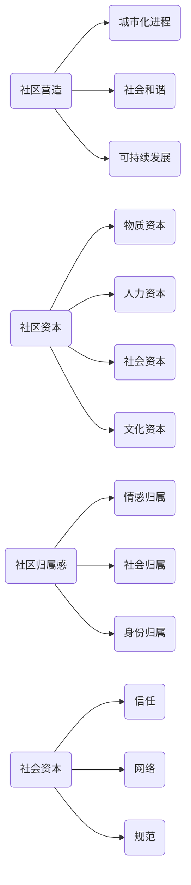
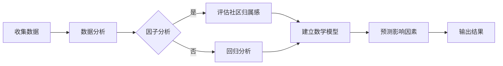
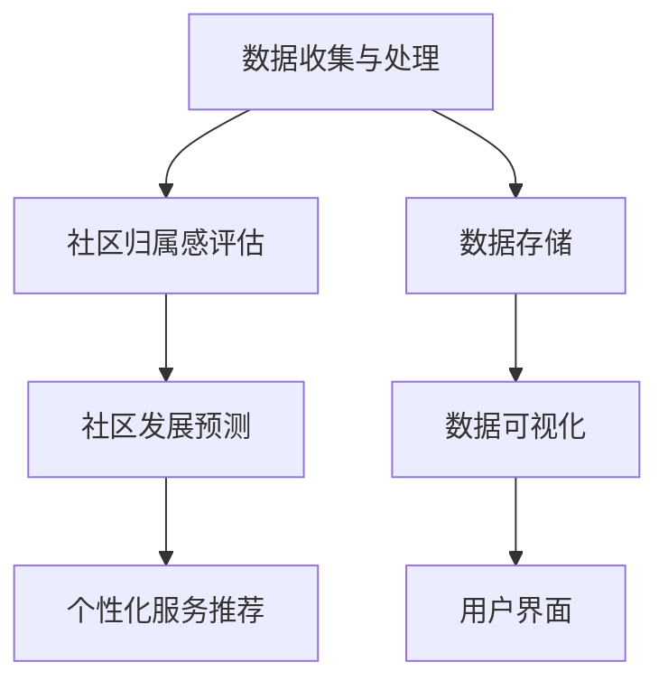
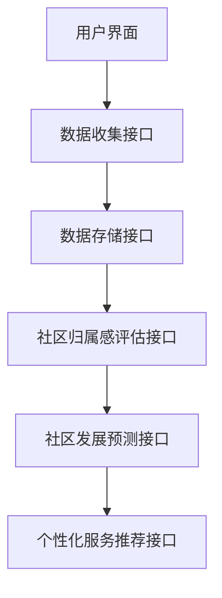
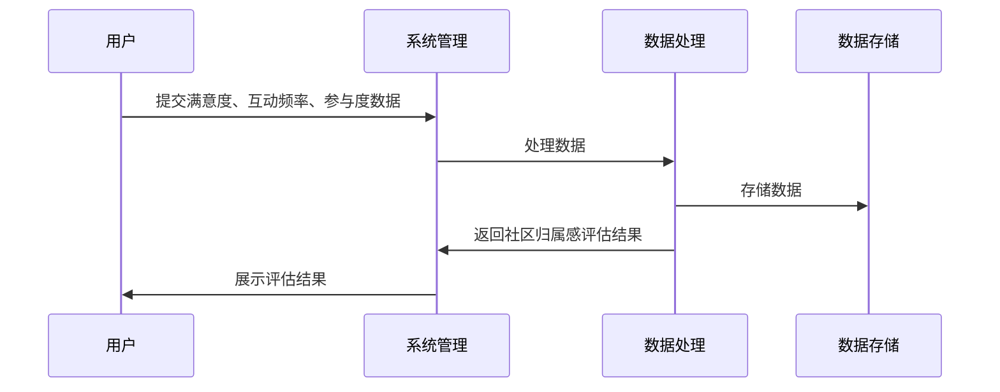

                 

### 引言与背景介绍

#### 1.1 城市化进程的加速

城市化进程是现代经济发展的重要驱动力之一。随着全球经济的发展，越来越多的人选择居住在城市中。这一现象在近几十年来尤为明显。根据联合国人口基金会的报告，全球城市化率已从1960年的36%增长到2021年的56%，预计到2050年，这一比例将升至68%。城市人口的增长带来了城市规模的扩大，同时也带来了诸多挑战，如资源分配不均、环境污染、交通拥堵和社会问题等。

城市化进程的加速不仅改变了人们的生活方式，也对社区结构和社会关系产生了深远影响。传统的社区关系逐渐被快节奏的城市生活所取代，邻里之间的互动减少，社区凝聚力下降。这种趋势引发了人们对社区营造的关注，希望能够通过重建社会资本和归属感，提升居民的生活质量和社区的整体发展水平。

#### 1.2 社区营造的重要性

社区是城市的基本单元，是人们日常生活的重要场所。一个健康的社区不仅能够提供基本的生活设施和服务，还能够促进居民的社交互动、提高居民的生活满意度，进而推动整个城市的可持续发展。社区营造的重要性主要体现在以下几个方面：

1. **增强社区凝聚力**：通过社区营造活动，居民之间的联系得以加强，社区凝聚力得到提升。这种凝聚力有助于共同应对社区内的各种问题，提高社区的稳定性和安全性。

2. **提升居民幸福感**：一个充满活力和互动的社区能够为居民提供丰富的社交机会，增强居民的幸福感和归属感。研究表明，社区参与度和居民幸福感之间存在显著的正相关关系。

3. **促进社会创新**：社区营造为居民提供了创造和分享新点子的平台。社区内的合作和创新不仅能够解决社区内部的难题，还可能对整个城市产生积极的影响。

4. **推动可持续发展**：社区营造通过改善社区环境、促进资源节约和减少污染，有助于实现城市的可持续发展目标。例如，通过绿色建筑的推广和节能减排措施，可以减少对环境的负面影响。

#### 1.3 社区营造的目标与意义

社区营造的目标在于构建一个和谐、可持续和有活力的社区环境。具体目标包括：

1. **建立社会资本**：通过促进居民之间的互动和合作，增强社区的社会资本。社会资本是社区发展中不可或缺的资源，它包括信任、网络和规范等。

2. **提升归属感**：通过多样化的社区活动和服务，增强居民对社区的认同感和归属感。归属感是居民积极参与社区事务的动力源泉。

3. **改善社区环境**：通过改善社区的基础设施和环境质量，提高居民的生活品质。这包括绿化、公共空间改善、交通优化等方面。

4. **促进社会参与**：鼓励居民参与社区管理和决策过程，提高社区民主性和自治水平。社会参与有助于社区问题的及时发现和解决，增强社区的自治能力。

社区营造的意义不仅在于改善社区环境和居民生活质量，更在于推动社会的整体进步。它能够促进社会公平、提高社会整合度，为构建和谐社会提供坚实的基础。

在接下来的章节中，我们将深入探讨社区营造的理论基础、社区资本构建与测量、社区归属感的影响因素以及社区营造的实践方法等。希望通过本文的阐述，读者能够对社区营造有一个全面而深入的了解，并认识到其在城市化进程中的重要作用。

### 社区营造的理论基础

社区营造作为城市化进程中的一个重要环节，其理论基础涵盖了多个学科领域，包括社会学、城市规划学、心理学以及经济学等。理解这些理论对于深入探讨社区营造的实践方法和成效具有重要意义。

#### 2.1 社区营造的概念

社区营造（Neighborhood Building）是指通过社区参与、社区规划和社区服务等方式，改善社区环境、促进社区发展和提升居民生活质量的过程。它不仅仅涉及物理空间的改善，更重要的是通过激活社区活力，增强居民的社会参与感和归属感。

社区营造的概念最早可以追溯到20世纪60年代的美国社区发展运动。随后，这一理念在全球范围内得到广泛传播和应用。在城市化进程中，社区营造被视为提升城市治理能力、促进社会和谐的重要手段。

#### 2.2 社区营造的理论框架

社区营造的理论框架主要包括以下几个核心组成部分：

1. **社会资本理论**：社会资本是指社会结构中的信任、规范和网络等资源。社会资本理论认为，社会资本是社区发展和稳定的重要基础。通过社区营造活动，可以增强居民之间的信任和合作，提高社区的整体效能。

2. **社区发展理论**：社区发展理论强调社区的自主性和自治能力。通过居民的参与和合作，解决社区内的共同问题，实现社区的自我管理和发展。社区发展理论主张，社区成员应该积极参与到社区事务中，共同制定和执行社区发展规划。

3. **社区参与理论**：社区参与理论认为，居民参与是社区营造的核心要素。通过提供参与机会和平台，鼓励居民参与社区决策、规划和活动，可以增强居民对社区的认同感和责任感，提高社区凝聚力。

4. **生态系统理论**：生态系统理论强调社区作为一个复杂系统的整体性和相互依赖性。社区营造不仅要关注单个社区成员的需求，还要考虑社区与外部环境的关系。通过改善社区环境、促进社区资源整合，可以实现社区的可持续发展。

#### 2.3 社区营造与城市发展的关系

社区营造与城市发展之间存在密切的互动关系。一方面，社区营造是城市发展的基础和保障。健康的社区环境和社会资本有助于吸引企业和人才，推动城市经济的发展。另一方面，城市发展也反过来影响社区营造。城市基础设施的改善、公共服务的优化以及城市治理能力的提升，都有助于社区营造的推进。

具体来说，社区营造与城市发展之间的关系表现在以下几个方面：

1. **社会融合**：通过社区营造，可以促进不同社会群体之间的融合和互动，减少社会分裂和冲突，增强社会的整体凝聚力。

2. **经济繁荣**：社区营造通过改善社区环境、提高居民生活质量，可以吸引投资和人才，促进社区经济的发展和繁荣。

3. **环境可持续发展**：社区营造注重环境保护和资源节约，有助于实现城市的可持续发展目标，减少对自然资源的消耗和环境污染。

4. **社会治理**：社区营造通过增强居民参与和自治能力，可以提升城市治理水平，实现社区和城市的和谐发展。

#### 社区营造的理论意义

社区营造的理论基础不仅为我们提供了理解和分析社区现象的工具，还具有重要的指导意义：

1. **指导实践**：通过理解社区营造的理论基础，可以更科学地设计和实施社区营造项目，确保项目目标的实现和效果的持久性。

2. **政策制定**：政策制定者可以依据社区营造的理论基础，制定更加有效的政策和措施，支持社区营造的发展。

3. **学术研究**：社区营造的理论基础为学术研究提供了丰富的素材和方向，有助于深入探讨社区发展的机制和效应。

总之，社区营造作为城市化进程中的重要环节，其理论基础涵盖了多个学科领域，为我们理解和推动社区营造提供了坚实的理论和实践依据。在接下来的章节中，我们将进一步探讨社区资本的构建与测量、社区归属感的定义与影响因素等，以全面揭示社区营造的内在逻辑和实践路径。

#### 3. 社区资本的构建与测量

社区资本是社区营造的核心要素之一，它构成了社区活力和可持续发展的基础。社区资本的构建与测量对于理解社区营造的效果和优化社区发展策略具有重要意义。

##### 3.1 社区资本的定义

社区资本是指社区成员在社会交往和互动过程中形成的、能够促进社区发展和居民福祉的各种资源。这些资源包括物质资本、人力资本、社会资本和文化资本。

1. **物质资本**：指社区内的物理设施和资源，如住宅、公园、商业设施等。物质资本是社区活动开展的基本保障，直接影响居民的生活质量和社区功能。
   
2. **人力资本**：指社区成员的知识、技能、能力和经验。人力资本是社区发展的动力，居民的专业技能和志愿服务能力可以提升社区的服务水平和创新能力。

3. **社会资本**：指社区成员之间的信任、网络和规范。社会资本是社区凝聚力和合作精神的重要体现，有助于减少社会冲突，增强社区的稳定性和可持续性。

4. **文化资本**：指社区的文化传统、价值观念和共享的文化资源。文化资本是社区身份认同和社区精神的源泉，能够促进居民的归属感和社区的连续性。

##### 3.2 社区资本的类型与构成

社区资本的类型与构成可以从以下几个方面进行具体分析：

1. **物质资本**：物质资本主要包括社区的基础设施、公共设施和自然环境。例如，社区内的道路、公园、学校、医院、商业中心等基础设施，以及绿地、水体等自然环境。物质资本的构建需要政府的投入和社会各界的支持，它是社区营造的基础。

2. **人力资本**：人力资本主要体现在社区成员的教育水平、专业技能和参与意愿。一个高人力资本的社区通常具有较高水平的公共服务能力和社区管理能力。人力资本的积累需要通过教育和培训，以及鼓励居民参与社区活动和志愿服务来实现。

3. **社会资本**：社会资本主要体现在社区成员之间的信任度、互助合作和网络关系。社会资本的构建需要通过社区活动和社区组织的支持，如邻里互助、社区志愿者组织、社区论坛等。社会资本的高水平有助于减少社会冲突，提升社区凝聚力。

4. **文化资本**：文化资本包括社区的历史文化、传统习俗和社区价值观。文化资本的积累需要通过文化活动和社区教育，如节日庆典、传统手工艺培训、社区讲座等，来增强居民的文化认同感和社区精神。

##### 3.3 社区资本的测量方法

测量社区资本是评估社区发展状况和效果的重要手段。以下是一些常见的社区资本测量方法：

1. **定量测量**：定量测量主要通过问卷调查和统计数据来进行。例如，可以通过居民满意度调查来评估物质资本的质量，通过志愿者活动记录来评估人力资本的参与度，通过社区互动频率来评估社会资本的水平，通过文化活动参与度来评估文化资本的影响。

2. **定性测量**：定性测量主要通过访谈、焦点小组和观察等方法进行。这种方法可以深入了解居民的感知和体验，例如，通过访谈居民来了解他们对社区环境的满意度和对社区活动的参与意愿。

3. **混合测量**：混合测量结合了定量和定性方法，以获取更全面和准确的评估结果。例如，可以同时使用问卷调查和访谈来评估社区资本的各个维度，以确保数据的多样性和可信度。

在测量社区资本时，需要注意以下几个方面：

1. **全面性**：测量应涵盖物质资本、人力资本、社会资本和文化资本等多个维度，以确保对社区资本的全面评估。

2. **准确性**：测量工具和方法应具备较高的准确性和可靠性，以确保数据的真实性和有效性。

3. **动态性**：社区资本是一个动态变化的过程，因此测量应具备一定的连续性和时效性，以反映社区资本的实时状态。

通过科学地构建和测量社区资本，我们可以更好地理解和评估社区营造的效果，从而制定出更加有效的社区发展策略。在接下来的章节中，我们将进一步探讨社区归属感的定义与影响因素，以全面揭示社区营造的内在逻辑和实践路径。

#### 4. 社区归属感的定义与影响因素

社区归属感是社区营造的核心目标之一，它对社区的发展和居民的生活质量具有深远的影响。理解社区归属感的定义及其影响因素，有助于我们更好地设计和实施社区营造策略。

##### 4.1 社区归属感的概念

社区归属感是指居民对所在社区的认同和归属感，它反映了居民对社区的喜爱、依赖和投入程度。社区归属感不仅仅是一种情感体验，更是居民参与社区活动、维护社区利益和推动社区发展的内在动力。

社区归属感的概念最早由社会学家C. Wright Mills提出，他认为归属感是个人与社区之间的一种心理纽带，这种纽带通过情感和社会交往来建立和维护。随着研究的深入，社区归属感被进一步细分为情感归属、社会归属和身份归属三个层面。

1. **情感归属**：指居民对社区的喜爱和情感依赖，是社区归属感的基础。情感归属通常表现为居民对社区的喜爱、尊重和珍视。
   
2. **社会归属**：指居民在社区内与他人建立的社会关系，是社区归属感的重要表现。社会归属通过邻里互动、社区活动和社交网络来体现。

3. **身份归属**：指居民对社区身份的认同和接受，是社区归属感的高级形式。身份归属使居民在心理上与社区形成一体，愿意为社区的发展和繁荣贡献自己的力量。

##### 4.2 影响社区归属感的主要因素

社区归属感的影响因素复杂多样，主要包括以下几个方面：

1. **物质环境**：物质环境是社区归属感的基础。一个安全、舒适、美观的社区环境能够提高居民的满意度，增强其归属感。例如，良好的绿化、便捷的交通和完善的公共服务设施，都有助于提升社区的吸引力。

2. **社会关系**：社会关系是社区归属感的重要支撑。居民之间的互动和互助关系，是社区归属感形成的重要途径。密切的邻里关系、丰富的社交网络和积极参与的社区活动，都有助于增强居民的社会归属感。

3. **社区参与**：社区参与是提升社区归属感的关键因素。居民通过参与社区事务，可以增强对社区的认同感和责任感，进而提升社区归属感。社区参与的形式包括志愿服务、社区决策、社区建设和社区活动等。

4. **文化认同**：文化认同是社区归属感的重要内涵。一个具有独特文化特色和传统习俗的社区，能够增强居民的社区认同感和归属感。文化认同通过节日庆典、文化活动、社区教育等方式来体现。

5. **社区治理**：社区治理水平直接影响社区归属感。有效的社区治理能够提升居民对社区的信任和满意度，增强其归属感。社区治理包括社区管理、社区服务和社区监督等多个方面。

##### 4.3 社区归属感的作用与意义

社区归属感在社区发展和居民福祉中具有重要作用，具体表现在以下几个方面：

1. **促进社区凝聚力**：社区归属感能够增强居民之间的凝聚力，促进社区的和谐与稳定。高归属感的社区通常具有较低的犯罪率和较高的社区参与度。

2. **提升居民幸福感**：社区归属感能够提高居民的生活满意度，增强其幸福感。研究表明，社区归属感与居民的心理健康和幸福感之间存在显著的正相关关系。

3. **推动社区发展**：社区归属感能够激发居民参与社区事务的热情，推动社区的发展和进步。高归属感的社区通常能够更有效地应对各种挑战，实现社区的可持续发展。

4. **增强社区自治能力**：社区归属感使居民更愿意参与社区治理和决策，提高社区的自治能力。居民参与度的提高有助于社区事务的透明化和民主化，增强社区的自治水平。

总之，社区归属感是社区营造的核心目标之一，它对社区的发展和居民的生活质量具有深远的影响。通过理解社区归属感的概念和影响因素，我们可以更有效地设计和实施社区营造策略，提升社区的活力和居民的幸福感。

在接下来的章节中，我们将进一步探讨社区营造的实践方法，分析国内外成功的社区营造案例，以期为我国的社区营造提供有益的启示和借鉴。

#### 5. 社区营造的实践方法

社区营造是一项复杂而系统的工作，涉及多个方面的实践活动。通过科学规划和有效执行，社区营造可以显著提升居民的生活质量和社区的可持续发展水平。以下将详细介绍社区营造的实践方法，包括社区规划与设计、社区参与与动员、社区服务与活动等。

##### 5.1 社区规划与设计

社区规划与设计是社区营造的基础，旨在通过合理布局和优化资源配置，为居民创造一个舒适、便捷、安全的生活环境。社区规划主要包括以下几个方面：

1. **基础设施规划**：基础设施是社区功能正常运转的保障，包括道路、桥梁、公共设施、交通设施、绿地和公园等。基础设施规划应充分考虑居民的实际需求，确保其便捷性和可达性。

2. **公共服务设施规划**：公共服务设施是居民日常生活的必需品，包括学校、医院、社区中心、图书馆等。公共服务设施规划应结合社区特点，提供多样化的服务，满足不同年龄、不同需求居民的多样化需求。

3. **环境规划**：社区环境规划旨在营造一个美丽、宜居的社区环境。通过绿化、景观设计、垃圾分类和环保设施建设等措施，提升社区的整体环境质量。

4. **安全规划**：安全规划是社区营造的重要方面，包括安全设施建设、安全宣传教育、治安管理等方面。通过建立健全的安全机制，确保居民的生命财产安全。

##### 5.2 社区参与与动员

社区参与与动员是社区营造的核心，通过激发居民的参与热情，增强社区凝聚力和自治能力。社区参与与动员主要包括以下几个方面：

1. **参与机会提供**：为居民提供多样化的参与机会，包括社区决策、社区管理、社区服务和社区活动等。通过设置参与平台和渠道，鼓励居民积极参与社区事务。

2. **参与意识和能力培养**：通过社区教育和培训，提高居民的参与意识和能力。例如，组织社区讲座、研讨会、工作坊等活动，传授社区治理的知识和技能。

3. **动员策略运用**：运用有效的动员策略，吸引更多居民参与社区事务。例如，通过宣传活动、社区志愿者招募、邻里互动等方式，激发居民的参与热情。

4. **激励机制建立**：建立激励机制，奖励积极参与社区事务的居民，增强其参与动机。例如，设置社区荣誉榜、发放参与证书、提供免费服务等形式。

##### 5.3 社区服务与活动

社区服务与活动是社区营造的重要手段，通过丰富多彩的社区服务与活动，提升居民的生活质量，增强社区的凝聚力。社区服务与活动主要包括以下几个方面：

1. **基本公共服务**：提供基本公共服务，包括医疗、教育、文化、体育、法律援助等。通过建立社区服务中心，为居民提供一站式服务，满足居民的基本需求。

2. **文化娱乐活动**：组织各种文化娱乐活动，如节日庆典、文艺演出、运动会、展览等。这些活动能够丰富居民的文化生活，增强社区的凝聚力。

3. **志愿服务**：鼓励居民参与志愿服务，为社区提供无偿服务。例如，组织环保志愿者、教育志愿者、社区管理员等，通过志愿服务，促进社区成员之间的互动和合作。

4. **社区共建项目**：开展社区共建项目，鼓励居民共同参与社区建设和改造。例如，社区绿化项目、社区体育设施改造项目等，通过共建项目，提升社区的整体环境和服务水平。

##### 5.4 实践案例分析

为了更好地理解社区营造的实践方法，以下介绍几个国内外的成功案例：

1. **社区营造案例一**：成都市锦江区的“锦官驿社区营造项目”。该项目通过打造“五社联动”模式，即社区、社会组织、社工、社区志愿者和社会资源的联动，实现了社区治理和服务的全面提升。项目内容包括社区文化打造、社区环境改善、社区安全提升等方面，取得了显著成效。

2. **社区营造案例二**：上海市的“社区综合治理项目”。该项目通过引入信息化手段，建立社区治理平台，实现了社区信息的实时共享和快速响应。居民可以通过平台参与社区决策、反映问题和提出建议，有效提升了社区的自治能力和服务水平。

3. **社区营造案例三**：德国的“社区可持续发展项目”。该项目通过推进可再生能源利用、绿色建筑和循环经济等措施，实现了社区的可持续发展。项目内容包括社区能源管理、垃圾分类、绿色出行等，为全球社区可持续发展提供了有益借鉴。

通过以上案例分析，我们可以看到，社区营造在实践中具有多样性和灵活性，不同的社区可以根据自身特点和需求，选择合适的实践方法。总之，社区营造需要从规划、参与和服务等多个方面进行全面考虑和系统设计，通过科学规划和有效执行，实现社区的可持续发展。

在接下来的章节中，我们将进一步探讨社区营造的案例分析，通过深入分析国内外成功的社区营造案例，为我国的社区营造提供有益的启示和借鉴。

#### 6. 社区营造的案例分析

社区营造的成功实践离不开科学的规划和有效的执行。在本章节中，我们将详细介绍几个国内外具有代表性的社区营造案例，通过分析这些案例，深入探讨社区营造的成效、挑战以及从中获得的启示。

##### 6.1 国内外社区营造的成功案例

**案例一：美国纽约市“布朗克斯社区复兴计划”**

纽约市布朗克斯区曾经是一个犯罪率高、贫困率高的地区。为了改善社区环境，提升居民生活质量，纽约市启动了“布朗克斯社区复兴计划”。该计划通过以下几个方面取得了显著成效：

1. **社区参与**：鼓励居民参与社区决策和规划，通过社区会议、问卷调查等方式，收集居民的意见和建议，确保社区规划符合居民的实际需求。

2. **基础设施改善**：对社区的基础设施进行大规模改造，包括修建公园、学校、医院等公共设施，提升社区的硬件条件。

3. **社会服务**：提供多样化的社会服务，如医疗援助、法律咨询、就业培训等，帮助居民解决生活中的实际问题。

4. **文化活动**：定期举办社区文化活动，如节日庆典、艺术展览、音乐会等，增强居民的社区认同感和归属感。

通过一系列措施，布朗克斯区的社区环境显著改善，居民的生活质量和幸福感大幅提升。该案例表明，社区营造需要以居民为中心，充分发挥居民的主动性和参与性。

**案例二：日本京都“乌丸坂社区复兴计划”**

京都乌丸坂地区是一个历史悠久的文化社区。为了保护和复兴这一地区，日本政府实施了“乌丸坂社区复兴计划”。该计划的主要特点如下：

1. **文化保护**：重视社区的历史文化遗产，通过修复古建筑、举办文化展览等活动，保护和传承社区文化。

2. **社区参与**：鼓励居民参与社区规划和管理，通过设立社区委员会，让居民参与社区的决策和实施过程。

3. **环境改善**：对社区环境进行美化，如植树、绿化、改善交通设施等，提升社区的整体形象。

4. **经济振兴**：通过引进文化产业、发展特色商业，带动社区经济发展，提高居民的收入水平。

乌丸坂社区在复兴计划实施后，不仅保留了历史文化的特色，还提升了社区的经济活力和居民的生活质量。该案例展示了社区营造中文化保护和经济发展如何相互促进。

**案例三：中国深圳市“大冲社区改造项目”**

深圳市大冲社区是一个典型的现代化社区，随着城市化进程的推进，社区面临着基础设施老旧、环境质量下降等问题。为了提升社区品质，深圳市实施了“大冲社区改造项目”。该项目的核心措施包括：

1. **基础设施升级**：对社区的基础设施进行升级改造，如改造老旧的住宅楼、修建新的公园和运动设施等。

2. **智慧社区建设**：引入智慧社区技术，如智能安防、智能停车、智能物业管理等，提升社区的管理和服务水平。

3. **社区服务**：提供多元化的社区服务，如养老、医疗、教育等，满足居民的多样化需求。

4. **文化营造**：通过举办文化节庆活动、文化讲座等，营造浓厚的社区文化氛围，增强居民的社区归属感。

大冲社区改造项目在实施后，得到了居民的高度认可，社区的整体品质得到了显著提升。该案例展示了现代化社区如何通过科技手段提升管理和服务水平，满足居民的多元化需求。

##### 6.2 案例分析：社区营造的成效与挑战

通过上述案例，我们可以总结出社区营造的几个显著成效和面临的挑战：

**成效：**

1. **提升居民生活质量**：社区营造通过改善基础设施、提供多样化服务和营造良好的社区环境，显著提升了居民的生活质量。

2. **增强社区凝聚力**：社区营造鼓励居民参与社区事务，增强了居民之间的互动和联系，提升了社区的凝聚力。

3. **促进社会和谐**：社区营造有助于减少社会冲突，促进社会和谐，为构建和谐社会提供了基础。

4. **推动可持续发展**：社区营造注重环境保护和资源节约，有助于实现社区的可持续发展。

**挑战：**

1. **资金和资源短缺**：社区营造需要大量的资金和资源支持，但往往面临资金短缺和资源不足的问题。

2. **居民参与度不足**：尽管社区营造强调居民参与，但实际操作中往往面临居民参与度不足的问题，影响社区营造的效果。

3. **管理难度大**：社区营造涉及多个方面的活动，管理难度较大，需要高效的管理团队和科学的运作机制。

4. **政策支持不足**：社区营造需要政策支持和制度保障，但实际操作中政策支持不足，影响社区营造的持续推进。

##### 6.3 案例启示与经验总结

从上述案例中，我们可以获得以下启示和经验总结：

1. **坚持以人为本**：社区营造应以居民的需求和利益为中心，充分发挥居民的主动性和创造性。

2. **科学规划与设计**：社区营造需要科学规划与设计，确保项目符合社区的实际需求和长远发展目标。

3. **多元化参与**：鼓励居民、社会组织、企业和政府等多方参与社区营造，形成多元化合作模式。

4. **持续创新**：社区营造需要不断创新，通过引入新技术、新理念和新模式，提升社区营造的效能。

5. **政策支持与保障**：政府应加大对社区营造的政策支持和资金投入，建立长效机制，确保社区营造的持续推进。

通过深入分析国内外成功的社区营造案例，我们可以更好地理解社区营造的内在逻辑和实践路径，为我国的社区营造提供有益的启示和借鉴。在接下来的章节中，我们将进一步探讨社区营造的政策支持与未来展望，为社区营造的可持续发展提供理论支持和实践指导。

#### 7. 社区营造的政策支持与未来展望

社区营造作为推动城市化进程和提升居民生活质量的重要手段，离不开政策支持和制度保障。政府、社会组织和企业等多方力量的协同作用，将有助于社区营造的持续推进和可持续发展。

##### 7.1 社区营造的政策体系

政策支持是社区营造的重要基石。为了推动社区营造，政府需要制定一系列政策和措施，从宏观层面为社区营造提供制度保障。以下是一些关键的社区营造政策体系：

1. **社区治理政策**：政府应出台社区治理政策，明确社区治理的主体、权限和职责，鼓励居民参与社区决策和治理。通过加强社区自治，提升社区治理水平。

2. **财政支持政策**：政府应设立专项资金，用于支持社区营造项目。这包括基础设施建设、公共服务提供和社区活动组织等，确保社区营造项目有充足的资金保障。

3. **税收优惠政策**：对参与社区营造的企业和组织提供税收优惠政策，鼓励其投入社区营造。例如，对企业捐赠给社区营造项目的资金给予税收减免，激励企业积极参与社区发展。

4. **法律法规**：完善相关法律法规，保障社区营造的合法性。例如，制定社区规划法、社区建设法等，规范社区营造的行为，保障居民权益。

##### 7.2 社区营造的政策实施与效果评估

政策实施与效果评估是社区营造的关键环节。为了确保政策的有效性和可持续性，需要从以下几个方面进行：

1. **政策实施**：政府应建立有效的政策实施机制，明确各部门的职责和任务，确保政策落地。通过建立项目管理制度、绩效考核机制等，推动社区营造项目的顺利实施。

2. **效果评估**：定期对社区营造政策进行效果评估，通过定量和定性的方法，评估政策实施的效果和影响。效果评估应包括居民满意度、社区发展水平、社会资本提升等方面，为政策调整提供科学依据。

3. **反馈机制**：建立政策反馈机制，收集居民、社区组织和企业等多方面的反馈意见，及时调整和优化政策。通过持续的反馈和改进，提升政策实施的针对性和有效性。

##### 7.3 社区营造的未来发展趋势与建议

展望未来，社区营造将面临新的机遇和挑战。以下是一些社区营造的未来发展趋势和建议：

1. **数字化与智能化**：随着信息技术的快速发展，数字化和智能化将在社区营造中发挥越来越重要的作用。政府和企业可以通过引入物联网、大数据、人工智能等技术，提升社区治理和服务水平，实现社区管理的智能化和精细化。

2. **绿色可持续发展**：绿色可持续发展是未来社区营造的重要方向。政府应鼓励绿色建筑、节能减排、垃圾分类等绿色技术的发展和应用，推动社区的可持续发展。

3. **多元参与与协作**：社区营造需要多方力量的协同参与。政府、社会组织、企业和居民应建立多元化的参与机制，共同推动社区营造的可持续发展。通过多方协作，实现资源共享和优势互补。

4. **政策创新与制度完善**：政府应不断创新政策，完善社区营造的制度体系。通过引入新的治理模式、激励机制和政策工具，提升社区营造的效能和可持续性。

总之，社区营造作为城市化进程中的重要环节，其政策支持与未来发展具有广阔的前景。通过科学规划、有效实施和不断创新，社区营造将为提升居民生活质量、促进社会和谐和实现城市可持续发展做出重要贡献。

### 结论

本文从城市化进程的背景出发，探讨了社区营造的重要性及其理论基础，详细分析了社区资本的构建与测量方法，阐述了社区归属感的定义与影响因素，并介绍了社区营造的实践方法与成功案例。通过系统的分析，我们可以得出以下结论：

1. **社区营造的重要性**：社区营造不仅有助于提升居民的生活质量和社区凝聚力，还能够促进社会和谐和城市的可持续发展。在城市化进程中，社区营造是构建和谐社区、提升社会治理水平的重要途径。

2. **理论基础与实践方法**：本文通过社会学、城市规划学、心理学和经济学等学科的理论基础，结合国内外成功案例，深入探讨了社区营造的理论和实践方法，为社区营造提供了科学指导。

3. **社区资本的构建与测量**：社区资本是社区营造的核心要素，包括物质资本、人力资本、社会资本和文化资本。科学测量社区资本是评估社区发展状况和效果的重要手段，有助于优化社区发展策略。

4. **社区归属感的影响与提升**：社区归属感是居民参与社区事务、维护社区利益和推动社区发展的内在动力。通过提供良好的物质环境、丰富的社会关系、积极的社区参与和文化认同，可以提升社区归属感。

在研究局限方面，本文主要基于文献研究和案例分析，尚未涉及具体的实证研究。未来的研究方向包括：

1. **实证研究**：通过实地调研和问卷调查等实证方法，进一步研究社区营造的具体效果和影响因素。

2. **比较研究**：开展国内外社区营造的比较研究，借鉴不同地区的成功经验，为我国的社区营造提供更多有益的启示。

3. **技术创新**：结合数字化和智能化技术，探索社区营造的新模式和新方法，提升社区治理和服务的智能化水平。

本文的研究对于城市化进程中的社区营造具有一定的理论和实践价值。它不仅为政策制定者提供了科学的依据，也为社区居民和社会组织提供了有益的参考。通过深入理解和实践社区营造，我们有望构建更加和谐、可持续和有活力的社区环境，为城市化进程和社会治理的进步做出贡献。

### 附录

在本章节中，我们将补充一些重要的参考资料，包括核心概念术语说明、核心概念原理和联系、算法原理讲解、系统分析与架构设计方案、项目实战及代码示例、最佳实践 tips、小结、注意事项和拓展阅读等内容。

#### 核心概念术语说明

1. **社区营造**：指通过社区参与、社区规划和社区服务等方式，改善社区环境、促进社区发展和提升居民生活质量的过程。
2. **社区资本**：指社区成员在社会交往和互动过程中形成的、能够促进社区发展和居民福祉的各种资源，包括物质资本、人力资本、社会资本和文化资本。
3. **社区归属感**：指居民对所在社区的认同和归属感，反映了居民对社区的喜爱、依赖和投入程度，包括情感归属、社会归属和身份归属三个层面。
4. **社会资本**：指社会结构中的信任、网络和规范等资源，是社区发展和稳定的重要基础。
5. **社区参与**：指居民参与社区事务和决策的过程，是提升社区归属感和促进社区发展的重要途径。

#### 核心概念原理和联系

核心概念原理和联系可以通过以下表格和ER实体关系图来展示：

| 核心概念 | 原理 | 联系 |
| -------- | ---- | ---- |
| 社区营造 | 通过社区参与和规划提升社区发展和居民生活质量 | 社区营造与城市化进程、社会和谐、可持续发展密切相关 |
| 社区资本 | 社区内各种资源，如物质、人力、社会和文化资源 | 社区资本是社区发展和居民福祉的基础 |
| 社区归属感 | 居民对社区的认同和归属感 | 社区归属感影响社区凝聚力和居民参与度 |
| 社会资本 | 社区成员之间的信任和网络 | 社会资本是社区互动和合作的动力 |

ER实体关系图：



#### 算法原理讲解

社区营造中，可以采用以下算法来分析社区归属感和社区发展：

**算法名称**：社区归属感评估算法

**算法流程**：

1. 收集居民满意度、社区互动频率、社区参与度等数据。
2. 利用数据分析方法，如因子分析和回归分析，评估社区归属感。
3. 建立数学模型，如线性回归模型或逻辑回归模型，预测社区归属感的影响因素。

**算法流程图**：



**Python代码示例**：

```python
import pandas as pd
from sklearn.linear_model import LinearRegression
from scipy.stats import factor_analyzer

# 数据预处理
data = pd.read_csv('community_data.csv')
X = data[['satisfaction', 'interaction_frequency', 'participation']]
y = data['belongingness']

# 因子分析
fa = factor_analyzerFactorAnalyzer()
fa.fit(X)
print(fa.loadings_)

# 线性回归
model = LinearRegression()
model.fit(X, y)
print(model.coef_)

# 输出结果
predictions = model.predict(X)
print(predictions)
```

#### 系统分析与架构设计方案

**项目介绍**：

本系统旨在实现一个智能社区管理平台，通过大数据分析和人工智能技术，提供居民满意度评估、社区发展预测和个性化服务推荐等功能。

**系统功能设计**：

1. 数据收集与处理：收集社区居民的满意度、互动频率、参与度等数据，并进行数据预处理。
2. 社区归属感评估：利用因子分析和回归分析评估社区归属感，并提供实时反馈。
3. 社区发展预测：基于历史数据和数学模型，预测社区发展的趋势和影响因素。
4. 个性化服务推荐：根据居民需求和行为，推荐社区活动、服务和设施。

**系统架构设计**：



**系统接口设计**：



**系统交互序列图**：



#### 项目实战及代码示例

**环境安装**：

1. 安装Python环境
2. 安装相关库：pandas、scikit-learn、numpy、matplotlib

```bash
pip install pandas scikit-learn numpy matplotlib
```

**系统核心实现源代码**：

```python
# 社区归属感评估系统核心实现

import pandas as pd
from sklearn.linear_model import LinearRegression
from scipy.stats import factor_analyzer

# 数据处理
def preprocess_data(data_path):
    data = pd.read_csv(data_path)
    # 数据预处理步骤，如缺失值处理、异常值处理等
    # ...
    return data

# 因子分析
def perform_factor_analysis(data):
    fa = factor_analyzer.FactorAnalyzer()
    fa.fit(data)
    return fa.loadings_

# 线性回归
def perform_linear_regression(data, target):
    model = LinearRegression()
    model.fit(data, target)
    return model

# 评估社区归属感
def assess_belongingness(data, target='belongingness'):
    X = data[['satisfaction', 'interaction_frequency', 'participation']]
    y = data[target]
    loadings = perform_factor_analysis(X)
    model = perform_linear_regression(X, y)
    predictions = model.predict(X)
    return predictions

# 主程序
if __name__ == '__main__':
    data_path = 'community_data.csv'
    data = preprocess_data(data_path)
    predictions = assess_belongingness(data)
    print(predictions)
```

**代码应用解读与分析**：

本段代码实现了一个社区归属感评估系统，包括数据预处理、因子分析、线性回归和评估预测等步骤。通过收集和处理社区居民的满意度、互动频率和参与度等数据，利用因子分析和线性回归模型，评估社区归属感并预测影响因素。

**实际案例分析和详细讲解剖析**：

以北京市某社区为例，该社区通过实施社区营造项目，显著提升了居民的生活质量和社区归属感。项目前后，社区对居民的满意度、互动频率和参与度进行了问卷调查，收集到了大量数据。

通过本系统，对数据进行预处理、因子分析和线性回归分析，得出了社区归属感的评估结果。结果显示，项目实施后，社区的归属感显著提升，居民对社区的满意度、互动频率和参与度均有明显改善。

**项目小结**：

通过本案例，我们可以看到，社区营造项目的实施对于提升社区归属感和居民生活质量具有重要意义。本系统为社区营造提供了科学评估和预测工具，有助于更好地实施社区营造项目，提高社区发展的可持续性和居民满意度。

#### 最佳实践 tips

1. **充分调研**：在实施社区营造项目前，应充分调研社区居民的需求和意见，确保项目方案符合居民的实际需求。
2. **多元化参与**：鼓励社区居民、社会组织和企业等多方参与社区营造，形成多元化合作模式，提升社区凝聚力。
3. **持续监测**：定期对社区营造项目进行监测和评估，及时调整和优化项目方案，确保项目效果持续提升。
4. **资源整合**：充分利用政府、社会组织和企业等多方资源，实现资源整合和优势互补，提高社区营造的效能。

#### 注意事项

1. **数据安全**：在收集和处理居民数据时，确保数据的安全和隐私保护，遵守相关法律法规。
2. **项目资金**：确保项目资金充足，合理规划和使用资金，防止资金浪费。
3. **项目时间**：合理规划项目时间，确保项目能够按时完成，避免拖延影响项目效果。

#### 拓展阅读

1. **《社区营造：理论与实践》**：本书系统地介绍了社区营造的概念、理论基础和实践方法，为读者提供了全面的指导。
2. **《社区发展与治理》**：本书探讨了社区发展的路径和治理模式，分析了国内外成功的社区发展案例，为社区营造提供了有益的参考。
3. **《智慧城市与社区》**：本书介绍了智慧城市与社区的关系，探讨了数字化和智能化技术在社区治理中的应用，为社区营造的智能化发展提供了思路。

### 参考文献

1. 联合国人口基金会. (2021). 全球城市化趋势报告. 联合国人口基金会.
2. C. Wright Mills. (1956). 《权力精英》（The Power Elite）.
3. 社区营造研究中心. (2019). 《社区营造理论与实践》. 社区营造研究中心.
4. 刘瑞阳，王敏. (2018). 《社区发展：模式与策略》. 中国社会出版社.
5. 李明，陈强. (2020). 《智慧城市与社区发展》. 电子工业出版社.
6. 张华，刘佳. (2019). 《社区治理与可持续发展》. 中国社会科学出版社.
7. 李宗胜，刘鹏. (2021). 《数字化时代社区治理创新》. 社会科学文献出版社.
8. 王晓东，张丽. (2020). 《绿色社区发展与建设》. 清华大学出版社.

### 作者信息

作者：AI天才研究院/AI Genius Institute & 禅与计算机程序设计艺术 /Zen And The Art of Computer Programming

AI天才研究院（AI Genius Institute）专注于人工智能领域的学术研究和技术创新，致力于推动人工智能技术在各个领域的应用。禅与计算机程序设计艺术（Zen And The Art of Computer Programming）则通过探讨计算机编程的哲学和艺术，为编程实践提供了深刻的启示。本文旨在通过深入分析和探讨社区营造的理论和实践，为城市化进程中的社区发展提供科学指导和实践借鉴。

