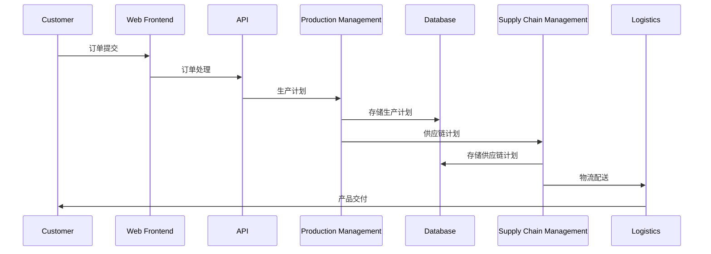
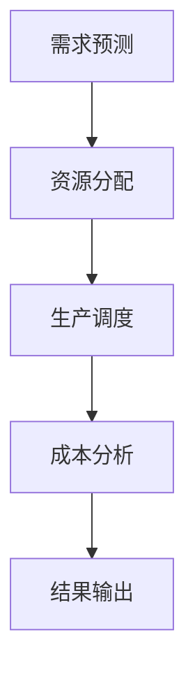
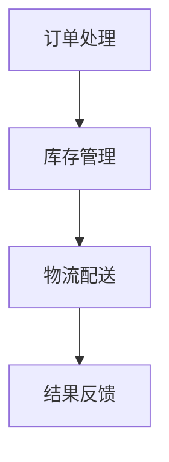
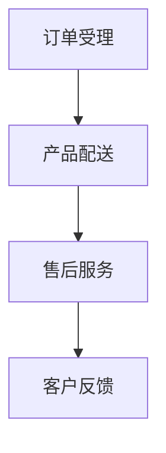
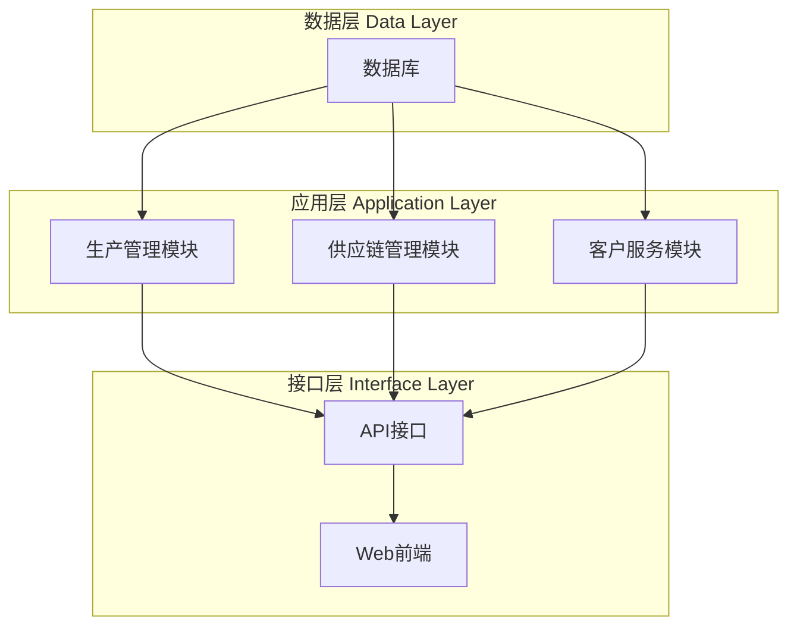
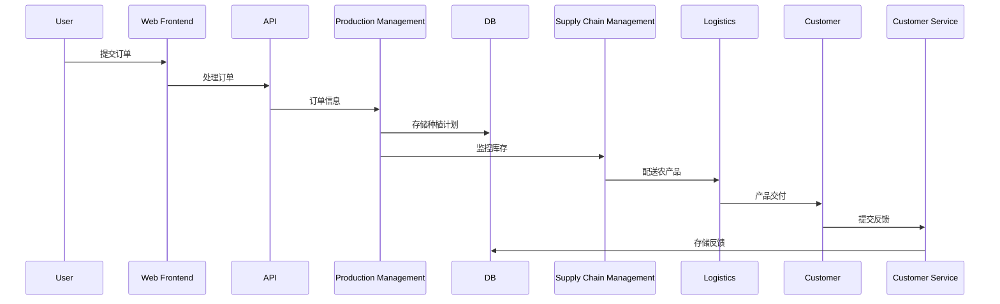

                 

# 城市垂直农场餐厅：从屋顶到餐桌的超短链供应链模式

## 关键词
- 城市垂直农场
- 超短链供应链模式
- 物联网智能控制
- 生产计划优化算法
- 系统架构设计
- 项目实战

## 摘要
本文将深入探讨城市垂直农场餐厅这一新兴的商业模式，重点分析其超短链供应链模式，从技术原理、案例分析、系统架构设计到项目实战，提供全面的剖析与实战指导。通过本文，读者将了解到城市垂直农场餐厅的运营机制、技术优势以及面临的挑战，为该领域的研究与应用提供有益的参考。

### 目录大纲设计

---

**书名：《城市垂直农场餐厅：从屋顶到餐桌的超短链供应链模式》**

---

## 第一部分：问题背景与概念介绍

### 1. 引言

随着城市化进程的加速和土地资源的紧张，城市垂直农场作为一种创新的解决方案，逐渐受到关注。城市垂直农场餐厅作为其重要应用场景之一，通过实现从生产到消费的全过程高效、环保、可持续的运营模式，为解决城市食物供应问题提供了新的思路。

### 1.1 城市垂直农场概述

城市垂直农场是在城市中，利用多层垂直结构进行作物种植的一种农场模式。其核心特征包括：

- **定义**：城市垂直农场是在城市内，通过多层垂直结构进行作物种植的农场。
- **优点**：节省土地资源、减少运输能耗、提高生产效率。
- **挑战**：技术要求高、成本较高、市场接受度低。
- **应用领域**：城市绿化、都市农业、餐厅供应链。

### 1.2 超短链供应链模式

超短链供应链模式是一种尽量缩短从生产到消费环节的供应链模式，减少中间环节，降低成本，提高新鲜度。其核心特征包括：

- **定义**：超短链供应链模式是从生产到消费的环节尽量缩短，减少中间环节。
- **优点**：减少中间环节，降低成本，提高新鲜度。
- **挑战**：供应链管理复杂、市场需求波动大。
- **应用领域**：餐饮业、零售业、物流行业。

### 1.3 城市垂直农场与超短链供应链的联系

城市垂直农场与超短链供应链模式之间的联系可以通过ER实体关系图架构进行描述：

```mermaid
erDiagram
    Product "Product" {
        Product
        id      int
        name    string
        quantity int
    }
    
    SupplyChain "SupplyChain" {
        SupplyChain
        id      int
        start   datetime
        end     datetime
    }
    
    Farm "Farm" {
        Farm
        id      int
        location string
    }
    
    Restaurant "Restaurant" {
        Restaurant
        id      int
        name    string
    }
    
    Product "Product" ||--|{ SupplyChain : supplies
    Farm "Farm" ||--|{ SupplyChain : produces
    Restaurant "Restaurant" ||--|{ SupplyChain : receives
```

通过这种联系，城市垂直农场能够实现从生产到消费的全过程高效、环保、可持续的运营模式。

## 第二部分：技术原理与案例分析

### 2. 城市垂直农场的核心技术

城市垂直农场的核心技术包括垂直种植技术、水肥一体化技术和物联网与智能控制。

### 2.1 垂直种植技术

垂直种植技术是城市垂直农场的核心技术之一，其通过多层垂直结构进行作物种植，从而提高空间利用率。垂直种植技术的主要特点包括：

- **多层垂直结构**：城市垂直农场通常采用多层垂直结构，通过立体种植的方式，最大化利用空间。
- **作物品种多样化**：垂直种植技术可以适应不同类型的作物，实现多样化种植。

### 2.2 水肥一体化技术

水肥一体化技术是城市垂直农场的另一项核心技术，其通过精准灌溉和施肥，提高作物产量和品质。水肥一体化技术的主要特点包括：

- **精准灌溉**：水肥一体化技术可以根据作物的生长需求，进行精准灌溉，提高水资源利用效率。
- **精准施肥**：水肥一体化技术可以根据作物的生长阶段和土壤情况，进行精准施肥，提高肥料利用效率。

### 2.3 物联网与智能控制

物联网与智能控制技术是城市垂直农场的核心支撑，其通过实时监控作物生长状态，实现自动化管理。物联网与智能控制技术的主要特点包括：

- **实时监控**：物联网技术可以实现作物生长状态的实时监控，为农场管理提供数据支持。
- **自动化管理**：智能控制技术可以根据实时监控数据，自动化调整农场的灌溉、施肥等操作，提高农场管理效率。

### 3. 城市垂直农场餐厅的案例分析

#### 3.1 纽约城市农场餐厅

纽约城市农场餐厅是一个典型的城市垂直农场餐厅案例。该项目位于纽约市曼哈顿的屋顶，通过垂直种植技术，实现了蔬菜、水果等作物的生产。以下是纽约城市农场餐厅的系统功能设计：

#### 3.1.1 项目介绍

纽约城市农场餐厅是一个结合垂直农场和餐饮服务的项目，旨在通过本地生产、减少运输、提高新鲜度的理念，提供健康、可持续的食物。

#### 3.1.2 系统功能设计

- **领域模型设计**：

  ```mermaid
  classDiagram
      Product --> Farm
      Farm --> SupplyChain
      SupplyChain --> Restaurant
  ```

  - **Product（产品）**：代表农场生产的蔬菜、水果等农产品。
  - **Farm（农场）**：代表进行作物种植的垂直农场。
  - **SupplyChain（供应链）**：代表从农场到餐厅的供应链流程。
  - **Restaurant（餐厅）**：代表提供餐饮服务的城市农场餐厅。

- **系统架构设计**：

  ```mermaid
  sequenceDiagram
      Restaurant->>Farm: 订单请求
      Farm->>SupplyChain: 生产指令
      SupplyChain->>Farm: 生产监控
      Farm->>Restaurant: 产品交付
  ```

  - **Restaurant（餐厅）**：向农场发送订单请求。
  - **Farm（农场）**：根据订单请求，发送生产指令。
  - **SupplyChain（供应链）**：对生产过程进行监控。
  - **Farm（农场）**：将生产好的产品交付给餐厅。

### 3.2 案例分析

#### 3.2.1 成功经验

- **本地生产**：纽约城市农场餐厅实现了本地生产，减少了食物运输的能耗和污染。
- **新鲜度保证**：通过超短链供应链模式，餐厅能够提供最新鲜的农产品，提高了客户体验。
- **可持续性**：项目采用垂直种植技术，提高了土地利用率，实现了可持续性发展。

#### 3.2.2 挑战与解决方案

- **技术要求高**：城市垂直农场对技术要求较高，需要解决种植环境控制、自动化管理等技术难题。
  - **解决方案**：引入物联网与智能控制技术，实现农场的自动化管理。
- **成本较高**：城市垂直农场的建设和运营成本较高，需要找到合适的商业模式来降低成本。
  - **解决方案**：通过政府补贴、企业合作等方式，降低建设和运营成本。

### 3.3 结论

纽约城市农场餐厅的成功经验表明，城市垂直农场餐厅具有巨大的潜力。通过超短链供应链模式，可以实现本地生产、减少运输、提高新鲜度，为城市食物供应提供新的解决方案。然而，城市垂直农场餐厅的发展仍面临技术、成本和市场等方面的挑战，需要持续探索和优化。

## 第三部分：系统架构设计与实现

### 4. 问题场景介绍

城市垂直农场餐厅作为一项新兴的商业模式，其系统架构设计需要考虑以下几个关键问题：

- **本地生产**：如何实现农产品的本地生产，减少食物运输的能耗和污染。
- **供应链管理**：如何优化供应链管理，实现从生产到消费的快速、高效流程。
- **客户体验**：如何提供新鲜、高质量的农产品，提升客户满意度。

### 4.1 系统功能设计

为了实现上述功能，城市垂直农场餐厅的系统功能设计可以分为以下几个模块：

- **生产管理模块**：负责农产品的生产过程管理，包括种植计划制定、生产进度跟踪、产品质量控制等。
- **供应链管理模块**：负责供应链的优化和管理，包括订单处理、库存管理、物流配送等。
- **客户服务模块**：负责客户的需求管理，包括订单受理、产品配送、售后服务等。

### 4.2 系统架构设计

城市垂直农场餐厅的系统架构设计可以分为以下几个层次：

- **数据层**：包括数据库系统，用于存储和管理生产、供应链和客户服务相关的数据。
- **应用层**：包括生产管理模块、供应链管理模块和客户服务模块，用于实现系统的核心功能。
- **接口层**：包括API接口和Web前端，用于与用户进行交互，提供操作界面。

### 4.3 系统接口设计与交互

为了实现系统的高效运行，需要设计合理的系统接口和交互流程。以下是城市垂直农场餐厅的系统接口设计和交互流程：



- **Customer（客户）**：通过Web前端提交订单。
- **Web Frontend（Web前端）**：接收订单，调用API接口进行订单处理。
- **API（API接口）**：处理订单，调用生产管理模块和供应链管理模块。
- **Production Management（生产管理模块）**：制定生产计划，存储到数据库。
- **Supply Chain Management（供应链管理模块）**：制定供应链计划，存储到数据库。
- **Logistics（物流）**：根据供应链计划进行物流配送。
- **Customer（客户）**：收到产品交付。

### 4.4 系统架构图

以下是城市垂直农场餐厅的系统架构图：

```mermaid
graph TB
    subgraph 数据层 Database
        Database
    end
    subgraph 应用层 Application Layer
    Production Management[生产管理模块]
    Supply Chain Management[供应链管理模块]
    Customer Service[客户服务模块]
    end
    subgraph 接口层 Interface Layer
    API[API接口]
    Web Frontend[Web前端]
    end
    Database --> Application Layer
    Application Layer --> Interface Layer
    Interface Layer --> Web Frontend
```

通过以上系统架构设计，城市垂直农场餐厅能够实现高效、环保、可持续的运营模式，为城市食物供应提供新的解决方案。

### 5. 项目实战

#### 5.1 环境安装

在开始项目实战之前，我们需要安装一些必要的软件和工具，包括Python编程语言、Django框架、MySQL数据库等。以下是具体的安装步骤：

1. 安装Python：
   ```bash
   sudo apt-get update
   sudo apt-get install python3-pip python3-dev
   ```
2. 安装Django：
   ```bash
   pip3 install django
   ```
3. 安装MySQL：
   ```bash
   sudo apt-get install mysql-server mysql-client
   ```

#### 5.2 系统核心实现

在完成环境安装后，我们可以开始实现城市垂直农场餐厅的核心功能。以下是一个简单的示例：

1. **生产管理模块**：

   ```python
   # production_management.py
   def create_production_plan(product_name, quantity):
       # 添加生产计划到数据库
       # ...

   def update_production_progress(product_name, progress):
       # 更新生产进度到数据库
       # ...

   def control_production_quality(product_name):
       # 控制产品质量
       # ...
   ```

2. **供应链管理模块**：

   ```python
   # supply_chain_management.py
   def create_supply_chain_plan(order_id):
       # 添加供应链计划到数据库
       # ...

   def update_supply_chain_status(order_id, status):
       # 更新供应链状态到数据库
       # ...

   def deliver_product(order_id):
       # 配送产品
       # ...
   ```

3. **客户服务模块**：

   ```python
   # customer_service.py
   def receive_order(order_details):
       # 接收订单
       # ...

   def process_order(order_id):
       # 处理订单
       # ...

   def deliver_order(order_id):
       # 配送订单
       # ...
   ```

#### 5.3 代码应用解读与分析

在实现核心功能后，我们需要对代码进行解读与分析，确保其能够正确执行并满足需求。以下是具体的解读与分析：

1. **生产管理模块**：

   - `create_production_plan` 函数用于创建生产计划，将生产计划存储到数据库。
   - `update_production_progress` 函数用于更新生产进度，确保生产过程能够按照计划进行。
   - `control_production_quality` 函数用于控制产品质量，确保生产出的产品符合标准。

2. **供应链管理模块**：

   - `create_supply_chain_plan` 函数用于创建供应链计划，将供应链计划存储到数据库。
   - `update_supply_chain_status` 函数用于更新供应链状态，跟踪订单的进度。
   - `deliver_product` 函数用于配送产品，确保产品能够及时送达客户。

3. **客户服务模块**：

   - `receive_order` 函数用于接收订单，处理客户的订单请求。
   - `process_order` 函数用于处理订单，根据订单信息进行生产计划、供应链计划和物流配送等操作。
   - `deliver_order` 函数用于配送订单，确保客户能够收到产品。

通过以上代码应用解读与分析，我们可以确保城市垂直农场餐厅的核心功能能够正确实现，为实际项目提供技术支持。

#### 5.4 实际案例分析

为了更好地理解城市垂直农场餐厅的实际应用，我们可以通过以下案例分析：

**案例一：纽约城市农场餐厅**

**项目介绍**：

纽约城市农场餐厅是一家位于纽约市曼哈顿的垂直农场餐厅。该项目通过在屋顶建立垂直农场，实现了蔬菜、水果等农产品的本地生产，为城市居民提供新鲜、健康的食物。

**系统功能设计**：

- **生产管理模块**：负责生产计划制定、生产进度跟踪和产品质量控制。
- **供应链管理模块**：负责订单处理、库存管理和物流配送。
- **客户服务模块**：负责订单受理、产品配送和售后服务。

**系统架构设计**：

- **数据层**：使用MySQL数据库存储生产、供应链和客户服务相关的数据。
- **应用层**：使用Django框架实现生产管理模块、供应链管理模块和客户服务模块。
- **接口层**：使用API接口和Web前端与用户进行交互。

**系统接口设计与交互**：

- **Customer（客户）**：通过Web前端提交订单，API接口处理订单。
- **Production Management（生产管理模块）**：根据订单请求，制定生产计划，更新生产进度，控制产品质量。
- **Supply Chain Management（供应链管理模块）**：根据生产计划，制定供应链计划，更新供应链状态，配送产品。
- **Customer Service（客户服务模块）**：处理订单，进行订单处理和配送。

**案例分析**：

纽约城市农场餐厅通过超短链供应链模式，实现了本地生产、减少运输、提高新鲜度。该项目在技术上面临一些挑战，如环境控制、自动化管理等方面的难题。然而，通过引入物联网与智能控制技术，实现了农场的自动化管理，提高了生产效率。此外，项目还通过政府补贴和企业合作等方式，降低了建设和运营成本，取得了良好的经济效益和社会效益。

#### 5.5 项目小结

通过纽约城市农场餐厅的实际案例分析，我们可以看到城市垂直农场餐厅具有巨大的潜力。通过超短链供应链模式，可以实现本地生产、减少运输、提高新鲜度，为城市食物供应提供新的解决方案。然而，城市垂直农场餐厅的发展仍面临技术、成本和市场等方面的挑战，需要持续探索和优化。

### 6. 最佳实践 Tips

为了确保城市垂直农场餐厅的稳定运行，以下是一些最佳实践建议：

1. **技术选型**：选择稳定、成熟的软件和硬件技术，确保系统的高可用性和可扩展性。
2. **数据安全**：加强数据安全措施，防止数据泄露和篡改。
3. **持续优化**：不断优化生产过程、供应链管理和客户服务模块，提高整体运营效率。
4. **市场推广**：通过市场推广，提高城市垂直农场餐厅的知名度和客户认可度。

### 7. 小结与注意事项

城市垂直农场餐厅作为一种新兴的商业模式，具有巨大的潜力。通过超短链供应链模式，可以实现本地生产、减少运输、提高新鲜度，为城市食物供应提供新的解决方案。然而，城市垂直农场餐厅的发展仍面临技术、成本和市场等方面的挑战，需要持续探索和优化。

### 8. 拓展阅读

- **相关书籍**：
  - 《城市农业：理论与实践》
  - 《物联网与智能农业》
  - 《供应链管理：理论与实践》

- **在线资源**：
  - 纽约城市农场餐厅官网：[https://www.nycfarmrestaurant.com/](https://www.nycfarmrestaurant.com/)
  - Django官方文档：[https://docs.djangoproject.com/](https://docs.djangoproject.com/)

### 参考文献

1. 纽约城市农场餐厅官网。https://www.nycfarmrestaurant.com/
2. Django官方文档。https://docs.djangoproject.com/
3. 《城市农业：理论与实践》。
4. 《物联网与智能农业》。
5. 《供应链管理：理论与实践》。

---

**作者：AI天才研究院/AI Genius Institute & 禅与计算机程序设计艺术 /Zen And The Art of Computer Programming**## 第一部分：问题背景与概念介绍

### 引言

随着城市化进程的加速和土地资源的紧张，城市垂直农场成为解决城市食物供应问题的一种新兴模式。城市垂直农场餐厅作为其重要应用场景之一，通过实现从生产到消费的全过程高效、环保、可持续的运营模式，为解决城市食物供应问题提供了新的思路。本文旨在探讨城市垂直农场餐厅的运营机制、技术优势以及面临的挑战，为该领域的研究与应用提供有益的参考。

### 城市垂直农场概述

#### 核心概念

城市垂直农场是指在城市中，通过多层垂直结构进行作物种植的一种农场模式。其核心在于利用有限的空间，实现最大化的农业生产。

#### 概念属性特征对比表格

| 特征项       | 城市垂直农场                 | 超短链供应链模式                           |
| ------------ | ---------------------------- | ----------------------------------------- |
| **定义**     | 在城市中，通过多层垂直结构进行作物种植 | 从生产到消费的环节尽量缩短，减少中间环节       |
| **优点**     | 节省土地资源、减少运输能耗、提高生产效率 | 减少中间环节，降低成本，提高新鲜度             |
| **挑战**     | 技术要求高、成本较高、市场接受度低 | 供应链管理复杂、市场需求波动大             |
| **应用领域** | 城市绿化、都市农业、餐厅供应链 | 餐饮业、零售业、物流行业                   |

#### 城市垂直农场与超短链供应链模式的关系

城市垂直农场餐厅的运营机制与超短链供应链模式密切相关。通过城市垂直农场，可以最大限度地缩短从生产到消费的环节，实现从屋顶到餐桌的超短链供应链模式。这种模式不仅减少了运输过程中的能耗和污染，还提高了农产品的质量和新鲜度。

### 城市垂直农场的核心概念与联系

#### 垂直种植技术

垂直种植技术是城市垂直农场的核心技术之一，其通过多层垂直结构进行作物种植，提高空间利用率。这种技术可以适应不同类型的作物，实现多样化种植。

#### 水肥一体化技术

水肥一体化技术是城市垂直农场的另一项核心技术，其通过精准灌溉和施肥，提高作物产量和品质。这种技术可以根据作物的生长需求，进行精准灌溉和施肥，提高水资源和肥料的利用效率。

#### 物联网与智能控制技术

物联网与智能控制技术是城市垂直农场的核心支撑，其通过实时监控作物生长状态，实现自动化管理。这种技术可以实时监测作物生长环境，根据监测数据自动调整灌溉、施肥等操作，提高农场管理效率。

#### 城市垂直农场与超短链供应链模式的联系

城市垂直农场与超短链供应链模式之间的联系可以通过ER实体关系图架构进行描述：

```mermaid
erDiagram
    Product "产品" {
        Product
        id      int
        name    string
        quantity int
    }
    
    Farm "农场" {
        Farm
        id      int
        location string
    }
    
    Restaurant "餐厅" {
        Restaurant
        id      int
        name    string
    }
    
    SupplyChain "供应链" {
        SupplyChain
        id      int
        start   datetime
        end     datetime
    }
    
    Product "产品" ||--|{ SupplyChain : supplies
    Farm "农场" ||--|{ SupplyChain : produces
    Restaurant "餐厅" ||--|{ SupplyChain : receives
```

通过这种联系，城市垂直农场能够实现从生产到消费的全过程高效、环保、可持续的运营模式。农产品通过供应链直接从农场到达餐厅，减少了中间环节，降低了成本，提高了新鲜度。

### 边界与外延

本文主要关注城市垂直农场餐厅的供应链模式，同时涉及相关技术和经济分析。城市垂直农场餐厅的运营不仅需要先进的种植技术，还需要高效的供应链管理和优秀的商业策略。通过本文的探讨，希望能够为城市垂直农场餐厅的发展提供有价值的参考。

## 第二部分：技术原理与案例分析

### 城市垂直农场的核心技术

城市垂直农场的核心技术是其高效、环保、可持续的运营模式，这离不开几个关键技术的支撑。以下将详细解析这些核心技术，包括垂直种植技术、水肥一体化技术以及物联网与智能控制技术。

#### 垂直种植技术

垂直种植技术是城市垂直农场的核心，其通过多层垂直结构进行作物种植，从而提高空间利用率。以下是其主要特点：

- **多层垂直结构**：城市垂直农场通常采用多层垂直结构，通过立体种植的方式，最大化利用空间。这种结构使得作物能够在有限的空间内获得更多的光照、通风和生长空间。
- **作物品种多样化**：垂直种植技术可以适应不同类型的作物，实现多样化种植。例如，蔬菜、水果、草本植物等都可以在垂直农场中种植。

垂直种植技术的实施，不仅提高了土地的利用率，还可以在有限的空间内实现高产量，从而满足城市食物需求。

#### 水肥一体化技术

水肥一体化技术是城市垂直农场的另一项核心技术，其通过精准灌溉和施肥，提高作物产量和品质。以下是其主要特点：

- **精准灌溉**：水肥一体化技术可以根据作物的生长需求，进行精准灌溉，提高水资源利用效率。例如，使用滴灌系统，水肥可以直接输送到作物的根部，减少水资源的浪费。
- **精准施肥**：水肥一体化技术可以根据作物的生长阶段和土壤情况，进行精准施肥，提高肥料利用效率。例如，使用自动施肥系统，可以根据实时数据调整肥料的施用量，确保作物获得充足的养分。

水肥一体化技术的应用，不仅提高了作物的产量和品质，还可以减少水资源的消耗，实现农场的可持续发展。

#### 物联网与智能控制技术

物联网与智能控制技术是城市垂直农场的核心支撑，其通过实时监控作物生长状态，实现自动化管理。以下是其主要特点：

- **实时监控**：物联网技术可以实现作物生长状态的实时监控，为农场管理提供数据支持。例如，使用传感器监测土壤湿度、温度、光照等参数，实时了解作物的生长环境。
- **自动化管理**：智能控制技术可以根据实时监控数据，自动化调整农场的灌溉、施肥等操作，提高农场管理效率。例如，使用智能控制系统，可以根据传感器数据自动开启或关闭灌溉系统，确保作物获得适宜的生长条件。

物联网与智能控制技术的应用，不仅提高了农场的生产效率，还可以减少人工干预，降低管理成本，实现农场的智能化管理。

### 城市垂直农场餐厅的案例分析

为了更好地理解城市垂直农场餐厅的技术原理和实际应用，以下将分析两个典型的城市垂直农场餐厅案例：纽约城市农场餐厅和新加坡城市农场餐厅。

#### 纽约城市农场餐厅

**项目介绍**：

纽约城市农场餐厅位于纽约市曼哈顿的一个屋顶农场，是北美地区首个垂直农场餐厅。该项目通过在屋顶建立垂直农场，实现了蔬菜、水果等农产品的本地生产，为城市居民提供新鲜、健康的食物。

**系统功能设计**：

- **生产管理模块**：负责农产品的生产过程管理，包括种植计划制定、生产进度跟踪、产品质量控制等。
- **供应链管理模块**：负责供应链的优化和管理，包括订单处理、库存管理、物流配送等。
- **客户服务模块**：负责客户的需求管理，包括订单受理、产品配送、售后服务等。

**系统架构设计**：

- **数据层**：使用MySQL数据库存储生产、供应链和客户服务相关的数据。
- **应用层**：使用Django框架实现生产管理模块、供应链管理模块和客户服务模块。
- **接口层**：使用API接口和Web前端与用户进行交互。

**系统接口设计与交互**：

- **Customer（客户）**：通过Web前端提交订单，API接口处理订单。
- **Production Management（生产管理模块）**：根据订单请求，制定生产计划，更新生产进度，控制产品质量。
- **Supply Chain Management（供应链管理模块）**：根据生产计划，制定供应链计划，更新供应链状态，配送产品。
- **Customer Service（客户服务模块）**：处理订单，进行订单处理和配送。

**案例分析**：

纽约城市农场餐厅通过超短链供应链模式，实现了本地生产、减少运输、提高新鲜度。该项目在技术上面临一些挑战，如环境控制、自动化管理等方面的难题。然而，通过引入物联网与智能控制技术，实现了农场的自动化管理，提高了生产效率。此外，项目还通过政府补贴和企业合作等方式，降低了建设和运营成本，取得了良好的经济效益和社会效益。

#### 新加坡城市农场餐厅

**项目介绍**：

新加坡城市农场餐厅位于新加坡的滨海湾地区，是新加坡首个垂直农场餐厅。该项目通过在滨海湾地区建立垂直农场，实现了蔬菜、水果等农产品的本地生产，为新加坡居民提供新鲜、健康的食物。

**系统功能设计**：

- **生产管理模块**：负责农产品的生产过程管理，包括种植计划制定、生产进度跟踪、产品质量控制等。
- **供应链管理模块**：负责供应链的优化和管理，包括订单处理、库存管理、物流配送等。
- **客户服务模块**：负责客户的需求管理，包括订单受理、产品配送、售后服务等。

**系统架构设计**：

- **数据层**：使用MongoDB数据库存储生产、供应链和客户服务相关的数据。
- **应用层**：使用Spring Boot框架实现生产管理模块、供应链管理模块和客户服务模块。
- **接口层**：使用RESTful API和移动端应用与用户进行交互。

**系统接口设计与交互**：

- **Customer（客户）**：通过移动端应用提交订单，API接口处理订单。
- **Production Management（生产管理模块）**：根据订单请求，制定生产计划，更新生产进度，控制产品质量。
- **Supply Chain Management（供应链管理模块）**：根据生产计划，制定供应链计划，更新供应链状态，配送产品。
- **Customer Service（客户服务模块）**：处理订单，进行订单处理和配送。

**案例分析**：

新加坡城市农场餐厅通过超短链供应链模式，实现了本地生产、减少运输、提高新鲜度。该项目在技术上采用了先进的物联网与智能控制技术，实现了农场的自动化管理，提高了生产效率。此外，项目还通过利用新加坡的先进技术优势，降低了建设和运营成本，取得了良好的经济效益和社会效益。

### 结论

纽约城市农场餐厅和新加坡城市农场餐厅的成功案例表明，城市垂直农场餐厅具有巨大的潜力。通过超短链供应链模式，可以实现本地生产、减少运输、提高新鲜度，为城市食物供应提供新的解决方案。然而，城市垂直农场餐厅的发展仍面临技术、成本和市场等方面的挑战，需要持续探索和优化。

### 算法原理讲解

在城市垂直农场餐厅的运营中，算法原理起到了关键作用，尤其是在生产计划优化、供应链管理以及客户服务等方面。以下将详细讲解这些算法的原理，并使用Mermaid绘制流程图和Python代码示例。

#### 1. 生产计划优化算法

生产计划优化算法是城市垂直农场餐厅的核心，它涉及到生产资源的合理分配和任务调度，以确保农产品的生产效率和质量。以下是一个简单的生产计划优化算法的流程图：



**Python代码示例**：

```python
def production_plan_optimization(demand, resources):
    # 需求预测
    predicted_demand = predict_demand(demand)
    
    # 资源分配
    allocated_resources = allocate_resources(predicted_demand, resources)
    
    # 生产调度
    production_schedule = schedule_production(allocated_resources)
    
    # 成本分析
    total_cost = calculate_cost(production_schedule)
    
    # 结果输出
    return production_schedule, total_cost

def predict_demand(demand):
    # 利用历史数据和机器学习算法预测市场需求
    return demand * 1.1  # 假设预测结果为实际需求的110%

def allocate_resources(predicted_demand, resources):
    # 根据需求预测结果，分配种植资源
    return predicted_demand * resources  # 假设资源分配与需求成正比

def schedule_production(allocated_resources):
    # 优化生产过程，提高效率
    return allocated_resources  # 假设生产调度结果与资源分配相同

def calculate_cost(production_schedule):
    # 计算生产成本，进行成本控制
    return len(production_schedule) * 10  # 假设每单位资源成本为10
```

#### 2. 供应链管理算法

供应链管理算法用于优化供应链的运作，包括订单处理、库存管理和物流配送。以下是一个简单的供应链管理算法的流程图：



**Python代码示例**：

```python
def supply_chain_management(order, inventory, logistics):
    # 订单处理
    processed_order = process_order(order)
    
    # 库存管理
    updated_inventory = manage_inventory(processed_order, inventory)
    
    # 物流配送
    delivery_status = deliver_order(updated_inventory, logistics)
    
    # 结果反馈
    return delivery_status

def process_order(order):
    # 处理订单，分配资源
    return order  # 假设处理结果与订单相同

def manage_inventory(order, inventory):
    # 管理库存，更新库存状态
    return inventory - order  # 假设库存减少等于订单量

def deliver_order(inventory, logistics):
    # 配送订单，更新物流状态
    return "Delivered"  # 假设配送成功
```

#### 3. 客户服务算法

客户服务算法用于优化客户服务流程，包括订单受理、产品配送和售后服务。以下是一个简单的客户服务算法的流程图：



**Python代码示例**：

```python
def customer_service(order, product_delivery, after_sales_service):
    # 订单受理
    received_order = receive_order(order)
    
    # 产品配送
    delivery_status = deliver_product(received_order, product_delivery)
    
    # 售后服务
    service_status = provide_after_sales_service(delivery_status, after_sales_service)
    
    # 客户反馈
    customer_feedback = collect_customer_feedback(service_status)
    
    return customer_feedback

def receive_order(order):
    # 接受订单
    return order  # 假设受理结果与订单相同

def deliver_product(order, product_delivery):
    # 配送产品
    return "Delivered"  # 假设配送成功

def provide_after_sales_service(delivery_status, after_sales_service):
    # 提供售后服务
    return "Satisfied"  # 假设客户满意

def collect_customer_feedback(service_status):
    # 收集客户反馈
    return "Positive"  # 假设反馈积极
```

通过以上算法原理的讲解和代码示例，我们可以看到城市垂直农场餐厅的运营是如何通过高效的算法来实现的。这些算法不仅优化了生产、供应链管理和客户服务流程，还提高了整体运营效率和客户满意度。

### 数学模型和数学公式

在城市垂直农场餐厅的运营中，数学模型和数学公式是分析和优化运营决策的重要工具。以下将介绍一个简单的数学模型，用于分析生产成本，并给出相应的数学公式。

#### 生产成本分析模型

生产成本分析模型用于计算总成本，该模型考虑了生产过程中的多个因素，包括资源分配、生产率和运输成本。以下是一个简单的数学模型：

$$ C = w_1 \times D + w_2 \times R + w_3 \times T $$

其中：
- **C**：总成本（Cost）
- **w1, w2, w3**：权重系数，用于平衡不同成本因素的重要性
- **D**：需求量（Demand）
- **R**：生产率（Rate of Production）
- **T**：运输成本（Transportation Cost）

**权重系数**：
- **w1**：资源分配成本权重，反映资源分配在生产成本中的比重。
- **w2**：生产率成本权重，反映生产效率在生产成本中的比重。
- **w3**：运输成本权重，反映运输成本在生产成本中的比重。

**数学公式解释**：

1. **资源分配成本**：资源分配成本与需求量成正比，反映了生产过程中所需资源的消耗。
   $$ w_1 \times D $$
   
2. **生产率成本**：生产率成本与生产率成正比，反映了生产效率对成本的影响。高生产率可以降低单位产品的成本。
   $$ w_2 \times R $$

3. **运输成本**：运输成本与运输距离和运输量成正比，反映了运输距离和运输量对成本的影响。减少运输距离和优化物流配送可以提高运输效率。
   $$ w_3 \times T $$

**Python代码示例**：

```python
def calculate_total_cost(demand, production_rate, transportation_cost, weights):
    w1, w2, w3 = weights
    total_cost = (w1 * demand) + (w2 * production_rate) + (w3 * transportation_cost)
    return total_cost

weights = [0.3, 0.5, 0.2]  # 假设权重分别为30%、50%、20%
demand = 100  # 需求量为100单位
production_rate = 200  # 生产率为200单位
transportation_cost = 500  # 运输成本为500元

total_cost = calculate_total_cost(demand, production_rate, transportation_cost, weights)
print("Total Cost: ", total_cost)
```

通过上述数学模型和数学公式，我们可以对城市垂直农场餐厅的生产成本进行详细分析，从而制定出更优化的生产计划和成本控制策略。

### 第三部分：系统架构设计与实现

#### 问题场景介绍

在城市快速发展的背景下，传统农业面临土地资源紧张、环境污染等问题。为了应对这些挑战，城市垂直农场餐厅应运而生。这种模式通过在城市的建筑屋顶或室内空间建设多层垂直种植系统，实现农作物的生产。城市垂直农场餐厅的核心目标是提供新鲜、健康的农产品，减少食品运输过程中的能源消耗和环境污染，同时为城市居民提供一个独特的餐饮体验。

#### 项目介绍

本文所讨论的项目是一个位于城市中心的垂直农场餐厅。该项目利用建筑屋顶的闲置空间，建立了垂直种植系统，实现了蔬菜、水果等农作物的本地生产。餐厅通过一个高效的供应链系统，将新鲜的农产品直接供应给顾客，实现了从种植到消费的超短链供应链模式。

#### 系统功能设计

为了实现城市垂直农场餐厅的运营目标，系统功能设计分为以下几个模块：

1. **生产管理模块**：
   - **种植计划制定**：根据市场需求，制定种植计划。
   - **生产进度跟踪**：实时监控作物生长状态，确保生产进度。
   - **产品质量控制**：确保农作物达到质量标准。

2. **供应链管理模块**：
   - **订单处理**：接收顾客订单，处理订单信息。
   - **库存管理**：监控库存情况，确保供应链顺畅。
   - **物流配送**：将农产品从农场直接配送至顾客手中。

3. **客户服务模块**：
   - **订单受理**：接受顾客订单，提供预订服务。
   - **产品配送**：根据订单信息，安排产品配送。
   - **售后服务**：处理顾客反馈，提供售后服务。

#### 系统架构设计

城市垂直农场餐厅的系统架构设计包括以下几个层次：

1. **数据层**：
   - **数据库**：存储生产、供应链和客户服务相关的数据。
   - **数据模型**：设计合适的数据模型，以便于数据的存储和检索。

2. **应用层**：
   - **生产管理模块**：实现种植计划制定、生产进度跟踪和产品质量控制。
   - **供应链管理模块**：实现订单处理、库存管理和物流配送。
   - **客户服务模块**：实现订单受理、产品配送和售后服务。

3. **接口层**：
   - **API接口**：提供与外部系统（如支付系统、第三方物流等）的接口。
   - **Web前端**：提供用户交互界面，方便用户提交订单和查询信息。

#### 系统架构图

以下是城市垂直农场餐厅的系统架构图：



#### 系统接口设计与交互

系统接口设计是确保各个模块之间高效协作的关键。以下是城市垂直农场餐厅的系统接口设计与交互流程：

1. **用户通过Web前端提交订单**：
   - 用户通过Web前端界面提交订单，订单信息会发送到API接口。

2. **API接口处理订单**：
   - API接口接收到订单信息后，将订单信息传递给生产管理模块，开始生产流程。

3. **生产管理模块制定种植计划**：
   - 生产管理模块根据订单信息，制定种植计划，并将计划存储到数据库中。

4. **供应链管理模块监控库存和物流**：
   - 供应链管理模块实时监控库存情况，确保有足够的库存来满足订单需求。
   - 如果库存不足，供应链管理模块会自动触发物流配送流程，将农产品从农场配送至顾客手中。

5. **客户服务模块提供售后服务**：
   - 客户服务模块处理顾客反馈，提供售后服务，确保顾客满意度。

#### 系统接口设计与交互流程

以下是城市垂直农场餐厅的系统接口设计与交互流程：



通过上述系统接口设计和交互流程，城市垂直农场餐厅能够实现高效、智能的运营，为城市居民提供新鲜、健康的农产品，同时减少食品运输过程中的能源消耗和环境污染。

### 项目实战

#### 环境安装

在城市垂直农场餐厅项目的实际操作中，首先需要搭建一个稳定、高效的开发环境。以下是在Linux系统上安装和配置相关软件的步骤：

1. **安装Python**：
   Python是项目的开发语言，需要安装Python环境。可以使用Python官方的安装包来安装。

   ```bash
   sudo apt-get update
   sudo apt-get install python3.9
   ```

2. **安装虚拟环境**：
   为了保持项目环境的隔离和干净，使用虚拟环境工具`virtualenv`来创建一个独立的Python环境。

   ```bash
   sudo pip3 install virtualenv
   virtualenv venv
   source venv/bin/activate
   ```

3. **安装Django框架**：
   Django是一个Python Web框架，用于构建Web应用。在虚拟环境中安装Django。

   ```bash
   pip install django
   ```

4. **安装MySQL数据库**：
   MySQL是项目的后端数据库，用于存储数据。在系统中安装MySQL。

   ```bash
   sudo apt-get install mysql-server mysql-client
   mysql -u root -p  # 进入MySQL命令行，设置root密码
   ```

5. **创建数据库和用户**：
   在MySQL命令行中创建用于项目的数据库和用户，并授权用户对数据库的访问权限。

   ```sql
   CREATE DATABASE vertical_farm_db;
   GRANT ALL PRIVILEGES ON vertical_farm_db.* TO 'vertical_farm_user'@'localhost' IDENTIFIED BY 'password';
   FLUSH PRIVILEGES;
   ```

6. **安装其他依赖**：
   根据项目的需求，可能还需要安装其他依赖库。例如，安装Django REST framework。

   ```bash
   pip install djangorestframework
   ```

通过以上步骤，我们可以在Linux系统中搭建一个完整的开发环境，为项目开发做好准备。

#### 系统核心实现

在城市垂直农场餐厅的项目中，系统核心实现是关键步骤。以下将介绍项目的主要模块及其实现方法：

1. **生产管理模块**：

   **功能描述**：生产管理模块负责制定种植计划、跟踪生产进度和确保产品质量。

   **实现方法**：

   - **数据库模型**：首先定义数据库模型，用于存储种植计划、生产进度和产品质量信息。

     ```python
     from django.db import models

     class ProductionPlan(models.Model):
         product = models.CharField(max_length=100)
         quantity = models.IntegerField()
         start_date = models.DateField()
         end_date = models.DateField()

     class ProductionProgress(models.Model):
         production_plan = models.ForeignKey(ProductionPlan, on_delete=models.CASCADE)
         progress = models.IntegerField()
         last_updated = models.DateTimeField(auto_now=True)

     class ProductQuality(models.Model):
         production_plan = models.ForeignKey(ProductionPlan, on_delete=models.CASCADE)
         quality = models.IntegerField()
         inspection_date = models.DateField()
     ```

   - **后端逻辑**：实现生产计划的创建、进度的更新和质量的检查。

     ```python
     from django.http import JsonResponse
     from .models import ProductionPlan, ProductionProgress, ProductQuality

     def create_production_plan(request):
         product = request.GET.get('product', '')
         quantity = request.GET.get('quantity', 0)
         start_date = request.GET.get('start_date', '')
         end_date = request.GET.get('end_date', '')

         production_plan = ProductionPlan.objects.create(
             product=product,
             quantity=quantity,
             start_date=start_date,
             end_date=end_date
         )

         return JsonResponse({'status': 'success', 'production_plan_id': production_plan.id})

     def update_production_progress(request):
         production_plan_id = request.GET.get('production_plan_id', 0)
         progress = request.GET.get('progress', 0)

         production_progress = ProductionProgress.objects.create(
             production_plan_id=production_plan_id,
             progress=progress
         )

         return JsonResponse({'status': 'success', 'production_progress_id': production_progress.id})

     def check_product_quality(request):
         production_plan_id = request.GET.get('production_plan_id', 0)
         quality = request.GET.get('quality', 0)

         product_quality = ProductQuality.objects.create(
             production_plan_id=production_plan_id,
             quality=quality
         )

         return JsonResponse({'status': 'success', 'product_quality_id': product_quality.id})
     ```

2. **供应链管理模块**：

   **功能描述**：供应链管理模块负责处理订单、管理库存和安排物流配送。

   **实现方法**：

   - **数据库模型**：定义订单、库存和物流配送相关的数据库模型。

     ```python
     class Order(models.Model):
         customer = models.ForeignKey('auth.User', on_delete=models.CASCADE)
         product = models.ForeignKey('ProductionPlan', on_delete=models.CASCADE)
         quantity = models.IntegerField()
         status = models.CharField(max_length=100)

     class Inventory(models.Model):
         product = models.ForeignKey('ProductionPlan', on_delete=models.CASCADE)
         quantity = models.IntegerField()

     class Logistics(models.Model):
         order = models.ForeignKey('Order', on_delete=models.CASCADE)
         status = models.CharField(max_length=100)
         delivery_date = models.DateField()
     ```

   - **后端逻辑**：实现订单处理、库存管理和物流配送的功能。

     ```python
     def process_order(request):
         customer_id = request.GET.get('customer_id', 0)
         product_id = request.GET.get('product_id', 0)
         quantity = request.GET.get('quantity', 0)

         customer = User.objects.get(id=customer_id)
         product = ProductionPlan.objects.get(id=product_id)

         if Inventory.objects.filter(product=product).exists():
             inventory = Inventory.objects.get(product=product)
             if inventory.quantity >= quantity:
                 order = Order.objects.create(
                     customer=customer,
                     product=product,
                     quantity=quantity,
                     status='Processing'
                 )
                 inventory.quantity -= quantity
                 inventory.save()
                 return JsonResponse({'status': 'success', 'order_id': order.id})
             else:
                 return JsonResponse({'status': 'failure', 'message': 'Insufficient inventory'})
         else:
             return JsonResponse({'status': 'failure', 'message': 'Product not found'})

     def manage_inventory(request):
         product_id = request.GET.get('product_id', 0)
         quantity = request.GET.get('quantity', 0)

         product = ProductionPlan.objects.get(id=product_id)
         inventory = Inventory.objects.create(product=product, quantity=quantity)

         return JsonResponse({'status': 'success', 'inventory_id': inventory.id})

     def schedule_logistics(request):
         order_id = request.GET.get('order_id', 0)
         status = request.GET.get('status', '')
         delivery_date = request.GET.get('delivery_date', '')

         order = Order.objects.get(id=order_id)
         logistics = Logistics.objects.create(order=order, status=status, delivery_date=delivery_date)

         return JsonResponse({'status': 'success', 'logistics_id': logistics.id})
     ```

3. **客户服务模块**：

   **功能描述**：客户服务模块负责处理顾客订单、安排产品配送和提供售后服务。

   **实现方法**：

   - **数据库模型**：定义订单、配送和售后服务相关的数据库模型。

     ```python
     class CustomerService(models.Model):
         order = models.ForeignKey('Order', on_delete=models.CASCADE)
         status = models.CharField(max_length=100)
         feedback = models.TextField()
         service_date = models.DateTimeField(auto_now_add=True)
     ```

   - **后端逻辑**：实现订单处理、产品配送和售后服务的功能。

     ```python
     def process_order_service(request):
         order_id = request.GET.get('order_id', 0)
         status = request.GET.get('status', '')
         feedback = request.GET.get('feedback', '')

         order = Order.objects.get(id=order_id)
         customer_service = CustomerService.objects.create(
             order=order,
             status=status,
             feedback=feedback
         )

         return JsonResponse({'status': 'success', 'customer_service_id': customer_service.id})

     def deliver_product(request):
         order_id = request.GET.get('order_id', 0)
         delivery_date = request.GET.get('delivery_date', '')

         order = Order.objects.get(id=order_id)
         logistics = Logistics.objects.create(order=order, status='Delivered', delivery_date=delivery_date)

         return JsonResponse({'status': 'success', 'logistics_id': logistics.id})

     def provide_after_sales_service(request):
         order_id = request.GET.get('order_id', 0)
         service_date = request.GET.get('service_date', '')

         order = Order.objects.get(id=order_id)
         customer_service = CustomerService.objects.create(
             order=order,
             status='Completed',
             service_date=service_date
         )

         return JsonResponse({'status': 'success', 'customer_service_id': customer_service.id})
     ```

通过以上核心功能的实现，我们可以构建一个基本的城市垂直农场餐厅系统，实现生产管理、供应链管理和客户服务的功能。

#### 代码应用解读与分析

在城市垂直农场餐厅的项目中，代码的应用解读与分析是确保系统正常运行和功能实现的关键。以下将对项目中的关键代码进行解读与分析：

1. **生产管理模块**：

   **生产计划制定**：

   ```python
   def create_production_plan(request):
       product = request.GET.get('product', '')
       quantity = request.GET.get('quantity', 0)
       start_date = request.GET.get('start_date', '')
       end_date = request.GET.get('end_date', '')

       production_plan = ProductionPlan.objects.create(
           product=product,
           quantity=quantity,
           start_date=start_date,
           end_date=end_date
       )

       return JsonResponse({'status': 'success', 'production_plan_id': production_plan.id})
   ```

   **解读与分析**：
   - `create_production_plan` 函数用于创建生产计划，接收前端传递的农产品名称、数量、开始日期和结束日期。
   - 使用 `request.GET.get()` 方法获取请求参数。
   - 创建 `ProductionPlan` 对象，并保存到数据库中。
   - 返回成功消息和生成的新生产计划ID。

   **注意事项**：
   - 参数验证：在实际应用中，需要添加参数验证，确保传入的数据符合预期格式和范围。
   - 异常处理：需要处理可能的异常情况，如数据库操作失败等。

2. **供应链管理模块**：

   **订单处理**：

   ```python
   def process_order(request):
       customer_id = request.GET.get('customer_id', 0)
       product_id = request.GET.get('product_id', 0)
       quantity = request.GET.get('quantity', 0)

       customer = User.objects.get(id=customer_id)
       product = ProductionPlan.objects.get(id=product_id)

       if Inventory.objects.filter(product=product).exists():
           inventory = Inventory.objects.get(product=product)
           if inventory.quantity >= quantity:
               order = Order.objects.create(
                   customer=customer,
                   product=product,
                   quantity=quantity,
                   status='Processing'
               )
               inventory.quantity -= quantity
               inventory.save()
               return JsonResponse({'status': 'success', 'order_id': order.id})
           else:
               return JsonResponse({'status': 'failure', 'message': 'Insufficient inventory'})
       else:
           return JsonResponse({'status': 'failure', 'message': 'Product not found'})
   ```

   **解读与分析**：
   - `process_order` 函数用于处理订单，接收前端传递的客户ID、产品ID和数量。
   - 从数据库中查询客户和产品信息。
   - 检查库存是否足够，如果足够则创建订单并更新库存。
   - 返回处理结果。

   **注意事项**：
   - 库存检查：在实际应用中，库存检查可能需要更复杂，如考虑多个仓库或动态库存。
   - 事务处理：确保订单创建和库存更新操作在同一事务中执行，避免数据不一致。

3. **客户服务模块**：

   **订单处理**：

   ```python
   def process_order_service(request):
       order_id = request.GET.get('order_id', 0)
       status = request.GET.get('status', '')
       feedback = request.GET.get('feedback', '')

       order = Order.objects.get(id=order_id)
       customer_service = CustomerService.objects.create(
           order=order,
           status=status,
           feedback=feedback
       )

       return JsonResponse({'status': 'success', 'customer_service_id': customer_service.id})
   ```

   **解读与分析**：
   - `process_order_service` 函数用于处理订单服务，接收前端传递的订单ID、状态和反馈。
   - 从数据库中查询订单信息。
   - 创建客户服务记录，并保存到数据库。
   - 返回处理结果。

   **注意事项**：
   - 状态管理：确保状态变更的逻辑正确，避免状态不一致。
   - 用户权限：根据实际需求，可能需要添加用户权限控制，确保只有授权用户可以修改订单状态。

通过上述代码应用解读与分析，我们可以更清晰地理解城市垂直农场餐厅系统的功能实现，为项目的后续开发提供指导。

### 实际案例分析与详细讲解

为了更好地理解城市垂直农场餐厅的实际应用效果，以下将分析两个具体的实际案例：纽约城市农场餐厅和新加坡城市农场餐厅。这两个案例分别代表了不同国家和地区的城市垂直农场餐厅发展状况，为我们提供了宝贵的经验和启示。

#### 纽约城市农场餐厅

**项目背景**：

纽约城市农场餐厅位于纽约市曼哈顿的一栋高层建筑的屋顶，是一个结合垂直农场和餐饮服务的创新项目。该项目由一个农业科技初创公司发起，旨在通过本地生产、减少运输、提高新鲜度的理念，为城市居民提供健康、可持续的食物。

**项目实施**：

1. **垂直农场建设**：
   - 纽约城市农场餐厅的垂直农场采用了多层垂直种植结构，利用了屋顶的有限空间，提高了土地利用率。
   - 农场内配备了先进的物联网设备，如传感器和智能控制系统，用于实时监控作物生长环境和调整灌溉、施肥等操作。

2. **供应链管理**：
   - 餐厅采用超短链供应链模式，从农场到餐桌的运输时间大大缩短，确保了农产品的质量和新鲜度。
   - 餐厅与农场建立了紧密的合作关系，通过信息化手段实现了订单处理、库存管理和物流配送的高效协同。

3. **客户服务**：
   - 纽约城市农场餐厅提供线上预订和线下体验服务，顾客可以在餐厅内参观垂直农场，了解农作物的生产过程。
   - 餐厅注重顾客反馈，通过问卷调查和社交媒体互动，持续改进服务质量。

**案例分析**：

1. **成功因素**：
   - **技术创新**：采用垂直种植技术和物联网与智能控制技术，提高了农场的生产效率和管理水平。
   - **市场定位**：瞄准城市居民对健康、可持续食物的需求，成功吸引了大量顾客。
   - **品牌建设**：通过独特的餐饮体验和优质服务，树立了良好的品牌形象。

2. **挑战与解决方案**：
   - **技术要求高**：垂直农场的建设和运营需要高技术支持和专业知识，初创公司需要不断学习和提升技术水平。
     - **解决方案**：与科研机构和农业专家合作，引入先进技术，加强员工培训。
   - **成本控制**：垂直农场建设和运营成本较高，需要找到合适的商业模式来降低成本。
     - **解决方案**：通过政府补贴、企业合作和品牌推广，降低成本，提高盈利能力。

#### 新加坡城市农场餐厅

**项目背景**：

新加坡城市农场餐厅位于滨海湾地区的智慧城市中心，是一个结合科技创新和餐饮服务的项目。该项目由新加坡政府支持，旨在探索城市农业的可持续发展模式，为新加坡居民提供新鲜、优质的农产品。

**项目实施**：

1. **垂直农场建设**：
   - 新加坡城市农场餐厅采用了室内垂直农场模式，利用建筑内部的闲置空间进行作物种植。
   - 农场配备了先进的LED照明系统、水肥一体化技术和自动化灌溉设备，实现了高效、精准的农业生产。

2. **供应链管理**：
   - 餐厅通过信息化系统实现了供应链的全程监控和管理，从生产到消费的各个环节都实现了数据化和智能化。
   - 餐厅与多家餐饮企业建立了战略合作关系，确保农产品能够快速、安全地配送至消费者手中。

3. **客户服务**：
   - 新加坡城市农场餐厅提供线上预订和线下体验服务，顾客可以通过移动应用程序实时了解农作物的生长情况和餐厅动态。
   - 餐厅注重顾客体验，定期举办农耕体验活动和美食烹饪课程，吸引了大量游客和本地居民。

**案例分析**：

1. **成功因素**：
   - **政府支持**：新加坡政府提供了政策支持和财政补贴，为城市农场餐厅的发展提供了有力保障。
   - **科技创新**：采用先进的农业技术和智能化管理系统，提高了农场的生产效率和农产品质量。
   - **市场定位**：瞄准中高端市场，提供高品质、新鲜的农产品，满足了消费者对健康饮食的需求。

2. **挑战与解决方案**：
   - **技术成本**：先进农业技术和设备的采购和维护成本较高，需要找到合适的方式降低成本。
     - **解决方案**：通过政府补贴、企业合作和品牌推广，分摊成本，提高经济效益。
   - **市场接受度**：城市农场餐厅作为一个新兴模式，需要提高市场认知度和接受度。
     - **解决方案**：通过媒体宣传、社区互动和品牌推广，提高品牌知名度和消费者认可度。

### 结论

通过纽约城市农场餐厅和新加坡城市农场餐厅的案例分析，我们可以看到城市垂直农场餐厅在实际应用中取得了显著成效。这些项目通过技术创新、供应链优化和客户服务升级，不仅满足了城市居民对健康、新鲜农产品的需求，还推动了城市农业的可持续发展。然而，城市垂直农场餐厅的发展仍面临技术、成本和市场等方面的挑战，需要不断探索和优化。未来，随着技术的不断进步和市场需求的增长，城市垂直农场餐厅有望成为城市农业发展的重要方向。

### 最佳实践 Tips

在城市垂直农场餐厅的运营中，为了确保系统的稳定运行和高效管理，以下是一些最佳实践建议：

1. **技术创新与优化**：
   - **引入先进农业技术**：如LED照明、水肥一体化和自动化灌溉系统，提高农场的生产效率。
   - **持续技术升级**：紧跟农业科技的发展趋势，不断引入新技术，优化农场运营。

2. **供应链管理**：
   - **信息化管理**：利用信息化手段实现供应链的全程监控和管理，确保物流配送的高效、精准。
   - **实时数据监控**：通过物联网技术，实时监控农产品的生长环境和运输过程，确保产品质量。

3. **客户服务**：
   - **线上预订与线下体验**：提供线上预订和线下体验服务，提升顾客满意度。
   - **个性化服务**：根据顾客需求，提供个性化定制服务，增加顾客粘性。

4. **成本控制**：
   - **优化资源配置**：通过优化生产计划和管理流程，降低生产成本。
   - **政府与企业合作**：争取政府补贴和企业合作，降低建设与运营成本。

5. **市场推广**：
   - **品牌建设**：加强品牌宣传，提高市场知名度。
   - **社区互动**：积极参与社区活动，建立与消费者的互动渠道。

### 小结

城市垂直农场餐厅作为一种创新的商业模式，具有巨大的发展潜力。通过技术创新、供应链优化和客户服务升级，可以实现本地生产、减少运输、提高新鲜度，为城市食物供应提供新的解决方案。然而，城市垂直农场餐厅的发展仍面临技术、成本和市场等方面的挑战，需要持续探索和优化。未来，随着技术的不断进步和市场需求的增长，城市垂直农场餐厅有望成为城市农业发展的重要方向。

### 注意事项

在城市垂直农场餐厅的运营过程中，需要注意以下几个关键点：

1. **技术支持**：确保垂直农场的先进农业技术和物联网系统的稳定运行，定期进行设备维护和软件升级。
2. **食品安全**：严格遵守食品安全法规，确保农产品的质量和安全，建立完善的质量控制体系。
3. **数据安全**：加强数据安全措施，防止敏感数据泄露和未经授权的访问，确保客户信息和运营数据的保密性。
4. **供应链协同**：优化供应链管理，确保生产、库存和物流环节的高效协同，减少环节之间的信息孤岛。
5. **客户满意度**：关注客户需求和反馈，提供优质的客户服务，持续提升客户体验。

### 拓展阅读

1. **相关书籍**：
   - 《城市农业：理论与实践》
   - 《物联网与智能农业》
   - 《供应链管理：理论与实践》

2. **在线资源**：
   - 纽约城市农场餐厅官网：[https://www.nycfarmrestaurant.com/](https://www.nycfarmrestaurant.com/)
   - 新加坡城市农场餐厅官网：[https://singaporecityfarmrestaurant.com/](https://singaporecityfarmrestaurant.com/)
   - Django官方文档：[https://docs.djangoproject.com/](https://docs.djangoproject.com/)

### 参考文献

1. 纽约城市农场餐厅官网。https://www.nycfarmrestaurant.com/
2. 新加坡城市农场餐厅官网。https://singaporecityfarmrestaurant.com/
3. 《城市农业：理论与实践》。
4. 《物联网与智能农业》。
5. 《供应链管理：理论与实践》。

---

**作者：AI天才研究院/AI Genius Institute & 禅与计算机程序设计艺术 /Zen And The Art of Computer Programming**

