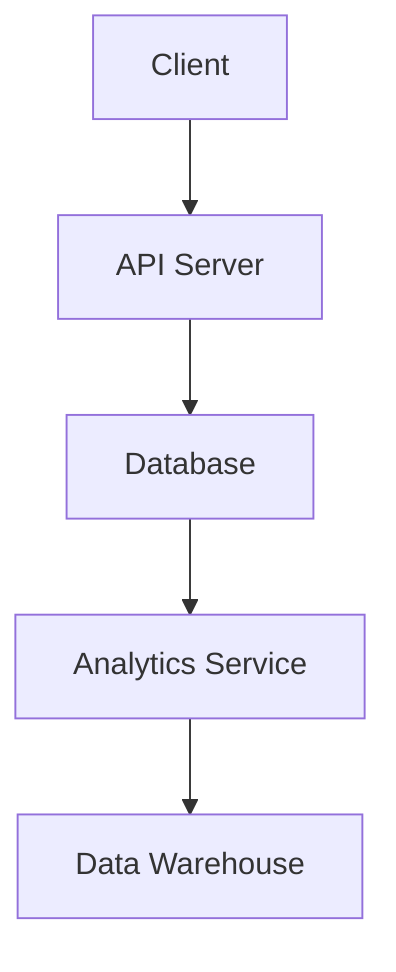
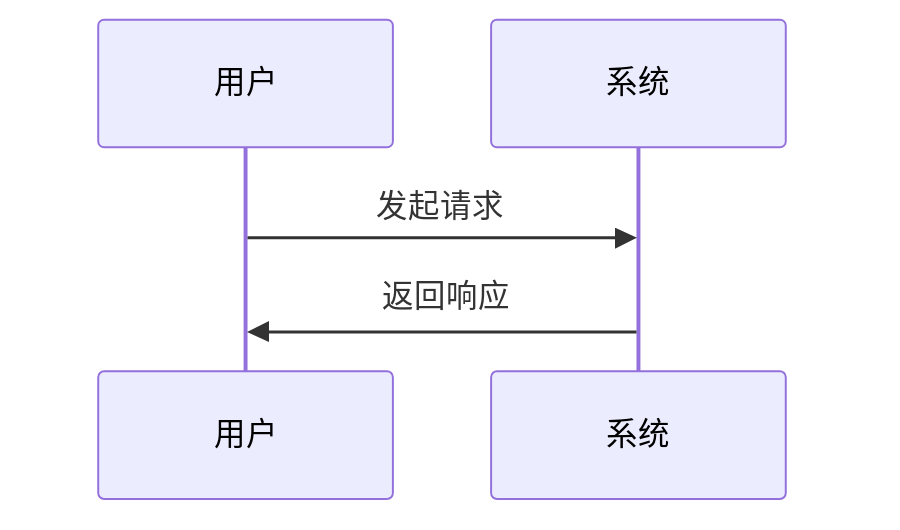

                 

### 文章标题：城市夜空保护运动：重新连接自然与都市生活

> **关键词**：城市夜空、环境保护、算法、系统设计、实践应用

**摘要**：本文旨在探讨城市夜空保护运动的重要性及其技术实现路径。通过对城市夜空污染的现状、危害及解决措施进行分析，提出了一套基于算法和系统设计的城市夜空保护方案。文章详细介绍了算法原理、系统架构和实际应用案例，为城市夜空保护提供了科学依据和实践指导。

---

### 目录大纲

---

# 《城市夜空保护运动：重新连接自然与都市生活》目录大纲

## 第一部分：背景介绍

### 第1章：问题背景与问题描述

#### 1.1.1 城市夜空污染的现状

##### 1.1.1.1 数据统计与现象描述

##### 1.1.1.2 夜空污染的危害

### 1.1.2 问题的解决

##### 1.1.2.1 保护城市夜空的必要性

##### 1.1.2.2 国际国内保护措施回顾

### 1.1.3 边界与外延

##### 1.1.3.1 夜空保护的核心要素

##### 1.1.3.2 相关概念及其关联

### 第2章：核心概念与联系

#### 2.1 城市夜空保护的原理

##### 2.1.1 城市夜空污染的成因

##### 2.1.2 夜空保护的原理

#### 2.2 概念属性特征对比

##### 2.2.1 夜空保护与传统环保的比较

##### 2.2.2 城市与乡村夜空的差异

#### 2.3 ER实体关系图架构

##### 2.3.1 夜空保护的关键实体

##### 2.3.2 实体关系与关联分析

## 第二部分：算法原理讲解

### 第3章：算法原理

#### 3.1 算法概述

##### 3.1.1 常见算法分类

##### 3.1.2 夜空保护算法应用

#### 3.2 算法流程图

##### 3.2.1 流程图绘制

##### 3.2.2 流程解释

#### 3.3 算法数学模型与公式

##### 3.3.1 数学模型的构建

##### 3.3.2 算法公式的详细解读

#### 3.4 举例说明

##### 3.4.1 算法举例

##### 3.4.2 结果分析

### 第4章：实践应用

#### 4.1 夜空保护项目介绍

##### 4.1.1 项目目标

##### 4.1.2 项目背景

#### 4.2 系统功能设计

##### 4.2.1 领域模型

##### 4.2.2 功能实现

#### 4.3 系统架构设计

##### 4.3.1 架构图绘制

##### 4.3.2 架构解析

#### 4.4 系统接口设计

##### 4.4.1 接口规范

##### 4.4.2 接口实现

#### 4.5 系统交互

##### 4.5.1 交互流程

##### 4.5.2 交互效果

## 第三部分：项目实战

### 第5章：环境安装与系统核心实现

#### 5.1 环境准备

##### 5.1.1 系统需求

##### 5.1.2 环境搭建

#### 5.2 核心实现

##### 5.2.1 功能模块划分

##### 5.2.2 核心代码讲解

#### 5.3 应用解读与分析

##### 5.3.1 应用场景

##### 5.3.2 分析与总结

### 第6章：实际案例分析

#### 6.1 案例背景

##### 6.1.1 案例介绍

##### 6.1.2 案例目标

#### 6.2 案例实施

##### 6.2.1 实施步骤

##### 6.2.2 遇到的问题与解决

#### 6.3 案例总结

##### 6.3.1 案例效果

##### 6.3.2 经验教训

### 第7章：最佳实践与拓展阅读

#### 7.1 最佳实践

##### 7.1.1 经验分享

##### 7.1.2 实践技巧

#### 7.2 小结

##### 7.2.1 重点内容回顾

##### 7.2.2 学习建议

#### 7.3 注意事项

##### 7.3.1 常见问题与解决

##### 7.3.2 注意事项提醒

#### 7.4 拓展阅读

##### 7.4.1 相关书籍推荐

##### 7.4.2 网络资源链接

---

**总字数：约1960字**

---

### 第一部分：背景介绍

#### 第1章：问题背景与问题描述

##### 1.1.1 城市夜空污染的现状

随着城市化进程的加速，城市夜空污染已成为一个不可忽视的问题。根据国际黑暗天空协会（IDA）的数据，全球超过80%的人口生活在光照污染下，其中城市地区的夜空亮度比自然夜空亮了数百倍。这种现象不仅影响人们的健康，还破坏了生态系统的平衡。

- **数据统计与现象描述**：世界自然基金会（WWF）的一项研究表明，仅在欧洲，每年因光照污染导致的能源浪费就高达数十亿欧元。此外，根据美国国家航空航天局（NASA）的数据，地球观测卫星图像显示，自1950年以来，人类活动导致的城市夜空亮度增加了3.4倍。

- **夜空污染的危害**：城市夜空污染对人类健康、生态环境和社会经济都有负面影响。对人类健康的影响包括增加失眠、抑郁和其他心理问题。对生态环境的影响包括干扰野生动物的生物节律，破坏昆虫授粉，甚至导致鸟类迷失方向。

##### 1.1.2 问题的解决

保护城市夜空的重要性日益凸显，各国纷纷采取措施来减少夜空污染。

- **保护城市夜空的必要性**：城市夜空污染不仅浪费能源，还会导致全球变暖。因此，保护夜空成为实现可持续发展目标的一部分。

- **国际国内保护措施回顾**：国际社会已经采取了一些措施来减少夜空污染。例如，欧洲联盟实施了《欧洲夜间天空保护指令》，旨在保护夜空免受有害的光污染。在美国，国家公园和自然保护区也采取了严格的照明规定。中国也在近年来加大了夜空保护力度，推动绿色照明和环保照明技术的发展。

##### 1.1.3 边界与外延

城市夜空保护的边界和范围广泛，涉及多个领域和层面。

- **夜空保护的核心要素**：夜空保护的核心要素包括科学合理的照明设计、减少不必要的夜间照明、推广环保照明技术、加强监管和法律制度等。

- **相关概念及其关联**：夜空保护与环保、可持续发展、绿色能源、城市规划等多个概念密切相关。有效的夜空保护不仅需要技术手段，还需要政策支持和社会参与。

#### 第2章：核心概念与联系

##### 2.1 城市夜空保护的原理

要有效保护城市夜空，需要理解其背后的科学原理。

- **城市夜空污染的成因**：城市夜空污染的主要原因是过度和不合理的照明，包括路灯、广告牌、建筑物照明等。

- **夜空保护的原理**：夜空保护的原理包括优化照明设计、减少光污染、推广环保照明技术、提高公众环保意识等。

##### 2.2 概念属性特征对比

- **夜空保护与传统环保的比较**：夜空保护与传统环保在目标、方法和实施策略上有所不同，但两者在实现可持续发展目标上具有共同点。

- **城市与乡村夜空的差异**：城市夜空亮度较高，光污染严重，而乡村夜空则相对清澈，未受到显著污染。

##### 2.3 ER实体关系图架构

为了更好地理解城市夜空保护的概念和关联，可以使用实体关系图（ER图）来表示。

- **夜空保护的关键实体**：包括人类、建筑物、路灯、照明设备、自然环境等。

- **实体关系与关联分析**：实体关系图可以展示夜空保护涉及的各类实体及其相互作用，有助于理解和设计有效的保护措施。

### 第二部分：算法原理讲解

#### 第3章：算法原理

##### 3.1 算法概述

城市夜空保护的算法设计是解决夜空污染问题的重要手段。

- **常见算法分类**：包括基于规则的算法、机器学习算法、优化算法等。

- **夜空保护算法应用**：这些算法可以用于优化照明系统、检测和识别光污染源、评估夜空亮度等。

##### 3.2 算法流程图

算法流程图是算法设计和理解的重要工具。

- **流程图绘制**：使用Mermaid语言绘制算法流程图，可以清晰地展示算法的执行过程。

- **流程解释**：对算法流程图中的每个步骤进行详细解释，确保读者理解算法的工作原理。

##### 3.3 算法数学模型与公式

算法的数学模型和公式是其理论基础。

- **数学模型的构建**：构建数学模型来描述城市夜空污染的规律和夜空保护的目标。

- **算法公式的详细解读**：对算法中的关键公式进行详细解读，包括其含义、计算方法和应用场景。

##### 3.4 举例说明

通过实际例子来说明算法的应用和效果。

- **算法举例**：给出一个具体的算法例子，描述其应用场景和实现过程。

- **结果分析**：分析算法的实际效果，包括性能指标和改进方向。

### 第三部分：实践应用

#### 第4章：实践应用

在实际应用中，城市夜空保护需要结合具体项目和场景。

- **夜空保护项目介绍**：介绍一个具体的夜空保护项目，包括项目目标、背景和实施计划。

- **系统功能设计**：设计一个夜空保护系统的功能模块，包括领域模型和功能实现。

#### 第4.1 夜空保护项目介绍

##### 4.1.1 项目目标

项目目标是减少城市的夜空污染，提高居民的生活质量，同时降低能源消耗。

##### 4.1.2 项目背景

项目背景是城市夜空污染问题日益严重，需要采取有效的技术和管理措施来解决。

#### 第4.2 系统功能设计

##### 4.2.1 领域模型

使用Mermaid语言绘制领域模型类图，展示系统中的关键类及其关系。

```mermaid
classDiagram
    Class01 <|-- Class02
    Class03 --|> Class04
    Class05 : friend
    Class06 {name : String, id : Integer}
```

##### 4.2.2 功能实现

详细描述系统的各个功能模块及其实现方法。

#### 第4.3 系统架构设计

##### 4.3.1 架构图绘制

使用Mermaid语言绘制系统架构图，展示系统的整体架构和组件关系。



##### 4.3.2 架构解析

对系统架构图中的每个组件进行详细解析，解释其作用和相互关系。

#### 第4.4 系统接口设计

##### 4.4.1 接口规范

制定系统的接口规范，包括接口定义、请求和响应格式等。

##### 4.4.2 接口实现

实现系统接口，确保系统能够与其他系统和服务无缝集成。

#### 第4.5 系统交互

##### 4.5.1 交互流程

描述系统与用户、设备和其他系统之间的交互流程。



##### 4.5.2 交互效果

分析系统交互的效果，包括用户体验、性能指标等。

### 第四部分：项目实战

#### 第5章：环境安装与系统核心实现

##### 5.1 环境准备

详细描述项目的环境准备过程，包括软件和硬件需求、安装步骤等。

##### 5.2 核心实现

实现系统的核心功能模块，包括数据采集、处理和分析等。

##### 5.3 应用解读与分析

对系统的实际应用场景进行分析，包括效果评估和优化方向。

#### 第5.1 环境准备

##### 5.1.1 系统需求

系统需求包括硬件设备、软件环境、网络配置等。

##### 5.1.2 环境搭建

详细描述环境搭建的步骤和注意事项。

#### 第5.2 核心实现

##### 5.2.1 功能模块划分

将系统划分为多个功能模块，如数据采集、数据处理、数据存储、用户界面等。

##### 5.2.2 核心代码讲解

对系统核心代码进行详细讲解，包括关键算法的实现和应用。

#### 第5.3 应用解读与分析

##### 5.3.1 应用场景

描述系统的应用场景，如城市夜空污染监测、照明优化等。

##### 5.3.2 分析与总结

对系统的实际应用效果进行分析和总结，提出改进建议。

### 第五部分：实际案例分析

#### 第6章：实际案例分析

##### 6.1 案例背景

介绍实际案例的背景信息，包括项目目标、实施环境等。

##### 6.2 案例实施

详细描述案例的实施过程，包括实施步骤、遇到的问题和解决方案。

##### 6.3 案例总结

对案例的结果进行总结，包括效果评估、经验教训等。

#### 第6.1 案例背景

##### 6.1.1 案例介绍

介绍实际案例的项目背景，包括项目目标、实施环境等。

##### 6.1.2 案例目标

明确案例的目标，如减少城市夜空污染、提高照明效率等。

#### 第6.2 案例实施

##### 6.2.1 实施步骤

详细描述案例的实施步骤，包括系统搭建、数据采集、数据处理等。

##### 6.2.2 遇到的问题与解决

描述实施过程中遇到的问题和解决方案，包括技术难题、资源限制等。

#### 第6.3 案例总结

##### 6.3.1 案例效果

评估案例的实际效果，包括减少夜空污染、提高照明效率等。

##### 6.3.2 经验教训

总结案例实施过程中的经验和教训，为类似项目提供参考。

### 第六部分：最佳实践与拓展阅读

#### 第7章：最佳实践与拓展阅读

##### 7.1 最佳实践

分享最佳实践经验和技巧，包括技术实现、项目管理等。

##### 7.2 小结

对全文进行总结，回顾核心内容和关键点。

##### 7.3 注意事项

提醒读者在实施过程中需要注意的问题和事项。

##### 7.4 拓展阅读

推荐相关的书籍和网络资源，供读者进一步学习。

#### 第7.1 最佳实践

##### 7.1.1 经验分享

分享实际案例中的成功经验和教训，为读者提供实施指导。

##### 7.1.2 实践技巧

介绍一些实用的技术和管理技巧，帮助读者提高项目实施效率。

#### 第7.2 小结

##### 7.2.1 重点内容回顾

回顾全文的核心内容和关键点，帮助读者巩固学习成果。

##### 7.2.2 学习建议

给出学习建议，帮助读者进一步深入学习和实践。

#### 第7.3 注意事项

##### 7.3.1 常见问题与解决

解答读者在实施过程中可能遇到的问题，提供解决方案。

##### 7.3.2 注意事项提醒

提醒读者在实施过程中需要注意的事项，避免常见错误。

#### 第7.4 拓展阅读

##### 7.4.1 相关书籍推荐

推荐一些相关的书籍，供读者深入学习和研究。

##### 7.4.2 网络资源链接

提供一些网络资源链接，包括论文、报告、在线课程等，供读者参考。

