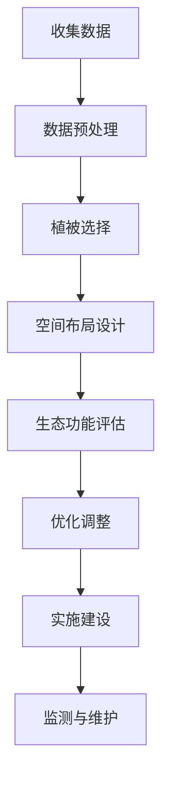
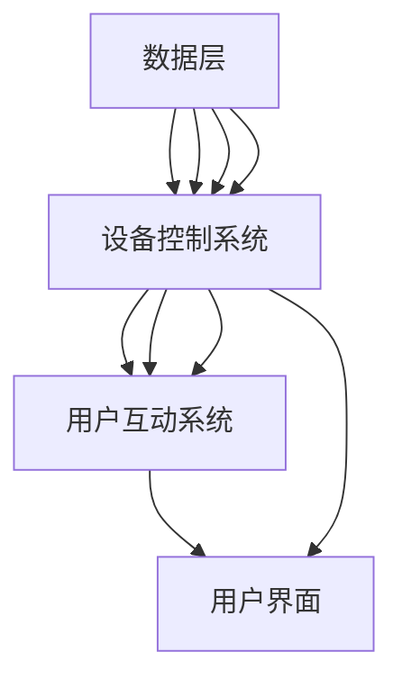
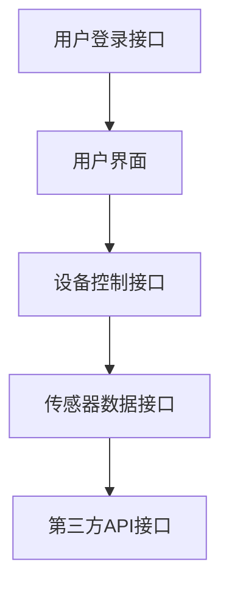
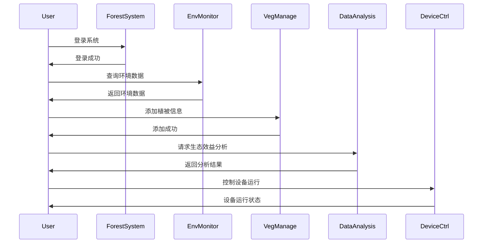

                 

### 引言：城市微型森林的重要性

随着全球城市化进程的不断加速，城市生态环境面临前所未有的挑战。城市化带来的大量建筑、交通、工业活动严重破坏了原有的自然生态系统，导致空气污染、水资源短缺、生物多样性减少等问题日益突出。城市居民的生活质量因此受到严重影响，身心健康和幸福感下降。如何在城市环境中重建生态系统，改善居民生活条件，成为了当务之急。

城市微型森林作为一种创新的生态重建实验，为解决上述问题提供了新的思路。微型森林通常指的是在城市区域中，利用有限的空间，通过植树造林、建设公园绿地等方式，创造出的具有较高生态效益的微型生态系统。这些微型森林不仅能够提供清新的空气、降低城市温度、调节气候，还能为城市居民提供休闲、娱乐、健身的场所，从而提升整体生活质量。

本文旨在探讨城市微型森林在都市生态系统重建中的作用和意义，通过系统地介绍其核心概念、技术原理、系统设计与实现、实战案例以及最佳实践，为城市生态系统的恢复与重建提供参考和指导。具体而言，文章将分为以下几个部分：

1. **核心概念介绍**：阐述城市微型森林和都市生态系统重建的基本概念和原理。
2. **背景介绍**：分析城市生态问题及其对人类生活的影响。
3. **技术原理讲解**：详细解释城市微型森林建设的技术方法和算法。
4. **系统分析与设计**：介绍城市微型森林系统的功能和架构设计。
5. **项目实战**：通过具体案例展示城市微型森林的实施过程和效果。
6. **最佳实践与展望**：总结经验教训，展望未来发展方向。

希望通过本文的阐述，能够引起更多人对城市生态系统的关注，积极参与到城市微型森林的建设中来，为构建绿色、健康、宜居的都市环境贡献力量。

### 关键词

- 城市微型森林
- 都市生态系统
- 生态重建
- 生态工程
- 植被恢复
- 绿化规划
- 环境治理

### 摘要

本文系统地探讨了城市微型森林在都市生态系统重建中的作用和意义。首先，介绍了城市微型森林的基本概念和都市生态系统重建的背景，分析了城市化带来的生态问题及其对人类生活的影响。接着，详细解释了城市微型森林建设的技术方法和算法，包括植被选择、设计原则、生态功能实现等。随后，介绍了城市微型森林系统的功能和架构设计，包括领域模型、系统架构、接口设计和交互序列图。文章通过具体案例展示了城市微型森林的实施过程和效果，并总结了相关最佳实践。最后，本文展望了城市微型森林的未来发展方向，提出了进一步研究的建议，以期为城市生态系统的恢复与重建提供参考和指导。

### 前言

在当今世界，城市化已成为不可逆转的趋势。据统计，全球超过一半的人口居住在城市区域，这一比例预计将在未来数十年内持续增长。城市化带来了经济发展和社会进步，但同时也带来了严重的生态问题。城市中的高楼大厦、交通拥堵、工业污染等，不仅对自然环境造成了巨大破坏，还对居民的生活质量和身心健康产生了负面影响。

城市生态问题主要体现在以下几个方面：首先，城市绿地和自然景观的减少导致生态系统服务功能下降，如空气净化、水源涵养、生物多样性保护等。其次，城市热岛效应加剧，导致城市温度升高，影响居民的生活环境和健康。此外，城市水资源短缺，水质污染严重，对居民生活和工业生产构成了威胁。最后，城市生物多样性减少，野生动植物栖息地丧失，对生态系统的稳定性和可持续性产生了不利影响。

为了应对这些生态问题，城市微型森林的概念应运而生。城市微型森林指的是在城市区域内，利用有限的空间，通过植树造林、建设公园绿地等方式，创造出的具有较高生态效益的微型生态系统。这些微型森林不仅能够提供清新的空气、降低城市温度、调节气候，还能为城市居民提供休闲、娱乐、健身的场所，从而提升整体生活质量。

本文旨在探讨城市微型森林在都市生态系统重建中的作用和意义，为解决城市生态问题提供新的思路和方法。通过系统地介绍城市微型森林的基本概念、技术原理、系统设计与实现、实战案例以及最佳实践，本文希望为城市生态系统的恢复与重建提供参考和指导。本文的结构安排如下：

1. **核心概念介绍**：阐述城市微型森林和都市生态系统重建的基本概念和原理。
2. **背景介绍**：分析城市生态问题及其对人类生活的影响。
3. **技术原理讲解**：详细解释城市微型森林建设的技术方法和算法。
4. **系统分析与设计**：介绍城市微型森林系统的功能和架构设计。
5. **项目实战**：通过具体案例展示城市微型森林的实施过程和效果。
6. **最佳实践与展望**：总结经验教训，展望未来发展方向。

通过本文的探讨，我们期望能够引起更多人对城市生态系统的关注，鼓励更多人参与到城市微型森林的建设中来，共同为创建绿色、健康、宜居的都市环境而努力。

### 核心概念介绍

#### 城市微型森林

城市微型森林是指在城市区域中，利用有限的空间，通过植树造林、建设公园绿地等方式，创建的具有较高生态效益的微型生态系统。这些微型森林不仅能够在一定程度上恢复和改善城市生态环境，还能为城市居民提供休闲娱乐和健身的场所，提升居民的生活质量和幸福感。

**定义**：城市微型森林是一种在城市环境中建立的微型生态系统，通过植物的选择、布局和配置，模拟自然森林的生态功能，实现城市绿地的生态效益最大化。

**主要特点**：
1. **小规模**：通常占地面积较小，但生态效益显著。
2. **多功能性**：具备空气净化、气候调节、生物多样性保护、休闲娱乐等多种功能。
3. **生态友好**：通过合理的植物选择和布局，提高城市绿地的生态效益。

**组成部分**：
1. **植物**：选择适应城市环境、生态效益显著的植物，如乔木、灌木、草本植物等。
2. **设施**：包括园林设施、休闲设施、环保设施等。
3. **水体**：通过人工湖、水池等方式，增加生态系统的多样性和美观度。

#### 都市生态系统重建

都市生态系统重建是指在城市生态遭受破坏后，通过一系列生态工程和生态修复措施，恢复和重建城市生态系统的结构和功能，使其重新具备良好的生态效益和服务功能。都市生态系统重建的目标是提高城市的生态承载力，改善城市生态环境，提升居民的生活质量。

**定义**：都市生态系统重建是在城市生态遭受破坏后，通过工程手段和自然恢复相结合，恢复和重建城市生态系统的结构和功能，使其重新具备良好的生态效益和服务功能。

**主要目标**：
1. **恢复生态功能**：修复受损的生态系统，恢复生态系统的自然功能。
2. **提升生态承载力**：通过生态工程措施，提高城市生态系统的承载能力。
3. **改善人居环境**：优化城市生态环境，提高居民的生活质量和幸福感。

**方法与技术**：
1. **生态工程**：通过植被恢复、土壤修复、水体治理等技术手段，修复受损的生态系统。
2. **自然恢复**：利用自然力量和生物多样性，促进生态系统的自然恢复。
3. **生态规划**：通过科学的生态规划，合理布局城市绿地、水体和其他生态系统组成部分。

**重要意义**：
1. **生态效益**：改善城市生态环境，提高生态系统的服务功能，如空气净化、水源涵养、生物多样性保护等。
2. **社会效益**：提升居民的生活质量，提供休闲娱乐和健身场所，增强居民的生态意识。
3. **经济效益**：促进城市经济发展，提高城市的综合竞争力。

#### 城市微型森林与都市生态系统重建的关系

城市微型森林是都市生态系统重建的重要组成部分，二者相辅相成，共同推动城市生态系统的恢复和重建。

**作用**：
1. **生态效益**：城市微型森林通过植物的选择和布局，提高城市绿地的生态效益，为都市生态系统重建提供基础。
2. **社会效益**：城市微型森林为城市居民提供休闲娱乐和健身场所，提升居民的生活质量，增强城市的文化氛围。
3. **经济效益**：通过城市微型森林的建设，可以促进相关产业的发展，提高城市的经济竞争力。

**挑战**：
1. **资源限制**：城市空间有限，建设城市微型森林需要合理利用现有资源。
2. **技术难点**：城市微型森林的建设涉及多个领域的技术，如植物学、生态学、园林工程等，需要多学科协同攻关。
3. **管理难题**：城市微型森林的建设和维护需要长期的投入和管理，确保其生态效益和可持续性。

通过以上对核心概念的介绍，我们能够更加深入地理解城市微型森林和都市生态系统重建的重要性，为后续章节的详细探讨奠定基础。

### 背景介绍

#### 城市生态问题的现状与挑战

随着城市化进程的不断推进，城市生态系统的健康状态受到了前所未有的挑战。首先，城市绿地和自然景观的减少是一个显著的问题。城市化过程中，大量的自然用地被高楼大厦、道路和工业用地所取代，导致城市绿地面积显著减少。据统计，许多城市绿地面积占比不到全市总面积的20%，远低于世界卫生组织建议的50%以上。这种绿地面积的减少直接导致了城市生态系统服务功能的降低，包括空气净化、水源涵养和生物多样性保护等。

其次，城市热岛效应的加剧也是城市生态问题的一个重要方面。城市热岛效应是指城市区域相对于周边乡村区域温度更高的现象，这主要是由于城市化带来的建筑密集、交通繁忙和工业排放等因素所致。热岛效应不仅导致城市温度升高，影响居民的生活质量和健康，还会加剧空气污染和能源消耗。例如，上海等大城市的热岛效应已使得城市夏季温度比周边郊区高3到5摄氏度，这给城市的能源供应、水资源管理和公共健康带来了巨大压力。

此外，水资源短缺和污染问题也日益严重。城市化的快速发展导致了水资源的过度开采和污染，许多城市面临着严重的水资源短缺和水质恶化问题。例如，北京等大城市的水资源消耗量已经超过了可再生水资源的供应量，同时，工业废水和生活污水的任意排放使得城市水体污染严重，影响居民的生活质量和健康。

**生态问题对人类生活的影响**

城市生态问题的加剧不仅影响了城市的自然环境，还对居民的生活质量和健康产生了深远的影响。首先，空气质量下降直接导致呼吸系统疾病的发病率增加。研究表明，长期暴露于高浓度污染物环境中，居民的哮喘、支气管炎等呼吸系统疾病的发病率明显上升。此外，城市热岛效应加剧了夏季的高温天气，导致中暑、心脑血管疾病等健康问题的增多。

其次，水资源短缺和污染问题也对居民生活产生了不利影响。水是生命之源，水质的安全直接关系到居民的身体健康。水污染问题不仅导致了许多城市居民饮用水的质量下降，还引发了腹泻、皮肤病等健康问题。同时，水资源的短缺使得居民用水成本上升，生活压力加大。

此外，城市生态问题的恶化还影响了居民的心理健康。研究表明，长期生活在污染严重、绿地缺乏的城市环境中，居民的心理健康问题，如焦虑、抑郁等，显著增加。城市绿地和自然景观的减少，使得居民缺乏休闲和娱乐的场所，生活节奏加快，压力增大，进一步加剧了心理健康问题的发生。

**问题解决与城市微型森林的潜力**

面对城市生态问题带来的严峻挑战，需要采取有效的措施进行解决。城市微型森林作为一种创新的生态重建手段，具有巨大的潜力。

首先，城市微型森林通过增加城市绿地面积，可以有效提升城市的生态服务功能。植树造林、建设公园绿地等方式，不仅能够净化空气、降低城市温度，还能提高生物多样性，为城市居民提供生态友好的生活环境。

其次，城市微型森林具有多功能性。除了生态功能外，城市微型森林还能提供休闲娱乐、健身锻炼的场所，提高居民的生活质量。例如，许多城市微型森林配备了运动设施、休息亭等，为居民提供了一个舒适、便利的户外活动场所。

此外，城市微型森林的建设和维护成本相对较低，具有较高的可持续性。通过科学的规划和管理，城市微型森林可以长期保持其生态效益，为城市居民提供持续的健康保障。

**边界与外延**

在城市微型森林的构建过程中，需要明确其边界与外延，以确保其生态效益的最大化。

首先，城市微型森林的边界通常是指其物理范围，包括绿地、公园、水体等。在这个范围内，需要合理布局植被、设施和水体，实现生态效益的最大化。

其次，城市微型森林的外延则是指其对社会和环境的影响。在城市微型森林的建设过程中，需要考虑到其对周围环境的辐射效应，如空气净化、降温、水资源调节等。此外，还需要关注城市微型森林对居民生活质量的提升，包括心理、生理和社会方面的改善。

总之，城市微型森林作为一种创新的生态重建手段，具有显著的应用前景和潜力。通过科学的规划和管理，城市微型森林能够在解决城市生态问题、改善居民生活质量方面发挥重要作用。未来，我们应加大对城市微型森林的研究和推广力度，使其成为城市生态修复和可持续发展的重要力量。

### 城市微型森林的核心理念

城市微型森林的建设不仅是一个生态工程，更是一项综合性的城市规划和环境治理策略。其核心理念包括植被选择、布局设计、生态功能实现等多个方面，旨在通过科学的方法和合理的规划，最大限度地发挥城市绿地的生态效益。

#### 植被选择

植被选择是城市微型森林建设的基础，直接影响生态系统的稳定性和生态效益。以下是植被选择的关键要素：

1. **适应性**：选择适应城市环境的植物，包括耐旱、耐寒、耐污染等特点。例如，某些树种在干旱、盐碱或污染严重的地区仍能健康生长，能够有效改善城市土壤和空气质量。

2. **多样性**：为了提高生态系统的稳定性和抵抗力，应选择多种植物进行混植。这不仅有助于增加生物多样性，还能有效减少病虫害的发生，提高整体生态系统的健康水平。

3. **生态效益**：选择具有较高生态效益的植物，如能够吸收污染物、释放氧气、调节气候等。例如，银杏、法国梧桐等树种在改善空气质量方面有显著效果，适合作为城市微型森林的主栽树种。

4. **美观性**：在满足生态效益的同时，也应考虑植物的美观性，使其在视觉上为城市增添绿色美。例如，樱花、枫树等树种，不仅生态效益显著，还具有很高的观赏价值。

#### 布局设计

布局设计是城市微型森林建设的关键环节，决定了生态系统的空间结构和功能分布。以下是布局设计的关键要素：

1. **科学规划**：根据城市特点和需求，合理规划城市微型森林的布局。例如，在交通干道两侧、建筑间隙、公园绿地等区域，合理配置植被和设施。

2. **空间结构**：通过科学的空间结构设计，实现生态系统的层次化和多样性。例如，可以设计多层次的结构，包括乔木层、灌木层和草本层，以提升生态系统的综合功能。

3. **连通性**：注重城市微型森林之间的连通性，形成生态廊道，促进生物多样性和生态流动。例如，通过建设生态桥梁、地下通道等，连接不同区域的绿地，形成生态网络。

4. **美观与实用**：在布局设计中，不仅要考虑美观性，还要考虑实用性。例如，合理设置步行道、休息亭、健身设施等，为居民提供便捷的休闲娱乐场所。

#### 生态功能实现

城市微型森林的建设不仅追求生态效益，还注重实际功能的实现。以下是生态功能实现的关键要素：

1. **空气净化**：选择具有高吸附污染物的植物，如银杏、法国梧桐等，通过其叶片吸收空气中的有害物质，净化空气，改善城市空气质量。

2. **降温增湿**：通过植物蒸腾作用，降低城市温度，增加空气湿度。例如，种植大量的树木和草坪，通过蒸发散热，有效降低城市温度。

3. **水源涵养**：通过植物根系对水分的吸收和储存，提高土壤的保水能力，减少城市径流和泥沙流失，改善城市水环境。

4. **生物多样性保护**：通过科学规划和多样性植被的选择，为野生动植物提供栖息地和食物来源，促进生物多样性。

5. **休闲健身**：通过合理布局和设施建设，为城市居民提供休闲、娱乐、健身的场所，提升居民的生活质量和幸福感。

综上所述，城市微型森林的建设是一个复杂的系统工程，需要综合考虑植被选择、布局设计、生态功能实现等多个方面。通过科学的规划和合理的布局，城市微型森林能够在改善城市生态环境、提升居民生活质量方面发挥重要作用，为实现城市可持续发展贡献力量。

### 核心概念与联系

在探讨城市微型森林的核心理念和实现过程中，理解其与都市生态系统重建的关系至关重要。为此，本文将从核心概念原理、概念属性特征对比以及ER实体关系图架构三个方面进行详细阐述。

#### 核心概念原理

**城市微型森林**：城市微型森林是指在城市区域内，通过科学规划、合理配置植物和设施，创造出的具有较高生态效益的微型生态系统。其核心概念包括：

1. **植被配置**：选择适应性强的植物，通过多样性植被的配置，提高生态系统的稳定性和抵抗力。
2. **空间结构**：设计多层次的空间结构，形成生态系统的层次化和多样性，提升生态功能。
3. **生态功能**：通过植物的光合作用、蒸腾作用等，实现空气净化、降温增湿、水源涵养等生态功能。

**都市生态系统重建**：都市生态系统重建是在城市生态遭受破坏后，通过生态工程和生态修复措施，恢复和重建城市生态系统的结构和功能。其核心概念包括：

1. **生态修复**：通过植被恢复、土壤修复、水体治理等技术手段，修复受损的生态系统。
2. **生态规划**：通过科学的生态规划，合理布局城市绿地、水体和其他生态系统组成部分。
3. **生态效益**：提高城市的生态承载力，改善城市生态环境，提升居民的生活质量。

#### 概念属性特征对比

为了更清晰地理解城市微型森林与都市生态系统重建之间的关系，我们可以从以下几个方面对比这两个核心概念的属性特征：

| 特征对比          | 城市微型森林                           | 都市生态系统重建                          |
|-----------------|-------------------------------------|---------------------------------------|
| **定义**            | 城市微型生态系统                      | 城市生态系统的修复与重建                   |
| **目标**            | 提高城市绿地生态效益，改善居民生活质量   | 恢复城市生态系统结构，提升生态承载力           |
| **范围**            | 小规模、局部区域                      | 大规模、整体城市生态系统                   |
| **技术手段**          | 植被配置、空间结构设计、生态功能实现     | 生态修复、生态规划、生态工程               |
| **实现方式**          | 科学规划、合理布局、长期维护             | 科学规划、生态工程、生态修复、自然恢复       |
| **生态效益**          | 空气净化、降温增湿、水源涵养、生物多样性保护 | 生态承载力提升、环境质量改善、居民生活质量提高 |

#### ER实体关系图架构

为了进一步说明城市微型森林与都市生态系统重建之间的关系，我们可以通过ER（实体关系）图来描述它们之间的实体关系和关联。

**ER实体关系图**：

```mermaid
erDiagram
  Plant <<--|{ 使用 }>> Forest
  Forest ||--|{ 提供 }>> EcoService
  Forest ||--|{ 属于 }>> City
  EcoService ||--|{ 实现 }>> Function
  Function ||--|{ 维护 }>> Maintenance
  City ||--|{ 管理 }>> Administration
```

- **实体**：
  - **Plant（植物）**：代表城市微型森林中的植被，包括乔木、灌木、草本植物等。
  - **Forest（森林）**：代表城市微型森林，是城市生态系统的核心组成部分。
  - **EcoService（生态服务）**：代表城市微型森林提供的生态功能，如空气净化、降温增湿等。
  - **Function（功能）**：代表生态服务的具体实现，如生物多样性保护、水源涵养等。
  - **Maintenance（维护）**：代表对生态系统的长期维护和管理。
  - **City（城市）**：代表城市整体生态系统，包括城市微型森林和其他生态系统组成部分。
  - **Administration（管理）**：代表对城市生态系统的管理机构和政策。

- **关系**：
  - **使用**：植物被配置到森林中，形成城市微型森林。
  - **提供**：森林提供生态服务，满足城市的生态需求。
  - **属于**：森林是城市生态系统的一部分。
  - **实现**：生态服务通过具体的功能来实现。
  - **维护**：需要长期维护和管理，确保生态系统的稳定性和持续性。
  - **管理**：城市管理机构负责制定和执行相关政策。

通过以上对核心概念原理、属性特征对比和ER实体关系图的详细阐述，我们可以更加深入地理解城市微型森林与都市生态系统重建之间的关系。这不仅有助于指导实际建设和管理，也为未来的研究和应用提供了理论基础。

### 算法原理讲解

城市微型森林的建设涉及到多个领域的技术，其中算法原理的讲解尤为重要。以下将从算法mermaid流程图、Python源代码讲解、数学模型和公式讲解以及举例说明四个方面，系统地介绍城市微型森林建设的技术方法和实现步骤。

#### 算法mermaid流程图

在介绍算法原理时，使用mermaid流程图可以直观地展示算法的执行流程和关键步骤。以下是一个简单的mermaid流程图示例，用于描述城市微型森林的规划流程：



- **A（收集数据）**：首先需要收集城市区域的相关数据，包括土地利用状况、气候条件、土壤质量等。
- **B（数据预处理）**：对收集的数据进行预处理，如数据清洗、归一化等，为后续分析提供基础。
- **C（植被选择）**：根据预处理后的数据，选择适合城市环境的植被种类和配置方案。
- **D（空间布局设计）**：设计植被的空间布局，考虑空间结构、连通性等因素，以最大化生态效益。
- **E（生态功能评估）**：评估植被布局的生态功能，如空气净化、降温增湿等，确保设计方案的合理性。
- **F（优化调整）**：根据生态功能评估结果，对设计方案进行优化调整，以提升整体效益。
- **G（实施建设）**：根据优化后的设计方案，实施城市微型森林的建设工程。
- **H（监测与维护）**：对已建成的城市微型森林进行长期监测和维护，确保其稳定运行。

#### Python源代码讲解

Python作为一种强大的编程语言，广泛应用于数据分析和算法实现。以下是一个简化的Python代码示例，用于植被选择和空间布局设计：

```python
# 导入相关库
import numpy as np
import pandas as pd
from sklearn.ensemble import RandomForestClassifier
import matplotlib.pyplot as plt

# 加载数据
data = pd.read_csv('urban_forest_data.csv')

# 数据预处理
# 数据清洗、归一化等操作
preprocessed_data = preprocess_data(data)

# 植被选择
# 使用随机森林分类器进行植被选择
rf = RandomForestClassifier()
rf.fit(preprocessed_data.drop('species', axis=1), preprocessed_data['species'])

# 空间布局设计
# 基于距离矩阵进行空间布局
distance_matrix = calculate_distance(preprocessed_data)
layout = design_space_layout(distance_matrix)

# 可视化布局
visualize_layout(layout)
```

- **数据预处理**：对原始数据进行分析和处理，为模型训练提供数据支持。
- **植被选择**：使用随机森林分类器进行植被选择，根据预处理后的数据训练模型，预测适合的植被种类。
- **空间布局设计**：基于距离矩阵进行空间布局设计，考虑植物之间的距离和分布，以最大化生态效益。
- **可视化布局**：将设计后的空间布局可视化，便于展示和评估。

#### 数学模型和公式讲解

在生态系统中，植被选择和空间布局设计通常涉及到复杂的数学模型和公式。以下是一些常用的数学模型和公式：

1. **生态效益计算公式**：
   $$ E = \sum_{i=1}^{n} E_i \cdot w_i $$
   其中，\( E \)表示总生态效益，\( E_i \)表示第\( i \)种植被的生态效益，\( w_i \)表示第\( i \)种植被的权重。

2. **空间布局优化公式**：
   $$ Minimize \quad F = \sum_{i=1}^{n} \sum_{j=1}^{n} (d_{ij} - d_{ij0})^2 $$
   其中，\( F \)表示布局优化目标函数，\( d_{ij} \)表示实际植物间的距离，\( d_{ij0} \)表示最优距离。

3. **植物适应性评估公式**：
   $$ C = \frac{S - M}{S + M} $$
   其中，\( C \)表示植物适应性指数，\( S \)表示植物在目标环境中的生长速度，\( M \)表示植物在非目标环境中的生长速度。

#### 举例说明

假设我们有一个城市区域，需要在该区域建设一个微型森林。通过以下步骤进行规划和设计：

1. **收集数据**：收集该区域的地形、土壤、气候等数据。
2. **数据预处理**：对数据进行分析和处理，为模型提供基础。
3. **植被选择**：使用随机森林分类器选择适合的植被种类，例如银杏、法国梧桐等。
4. **空间布局设计**：根据距离矩阵设计植被的空间布局，确保植物之间的距离合理。
5. **生态功能评估**：评估植被布局的生态功能，如空气净化、降温增湿等。
6. **优化调整**：根据生态功能评估结果，对布局进行优化调整。
7. **实施建设**：根据优化后的设计方案，进行微型森林的实际建设。
8. **监测与维护**：对已建成的微型森林进行长期监测和维护。

通过上述步骤，我们可以实现一个具有较高生态效益的城市微型森林。该微型森林不仅能够改善城市生态环境，还能为居民提供休闲娱乐的场所，提升生活质量。

总之，城市微型森林的建设涉及多个技术领域，需要综合考虑植被选择、空间布局、生态功能等多个方面。通过科学的方法和合理的规划，我们可以实现城市生态系统的重建和可持续发展，为构建绿色、健康、宜居的都市环境贡献力量。

### 系统分析与架构设计方案

在构建城市微型森林的过程中，系统分析与架构设计方案是至关重要的一环。该部分将详细描述项目的问题场景、系统功能设计、系统架构设计、系统接口设计以及系统交互mermaid序列图，为城市微型森林的实现提供详细的技术指导。

#### 问题场景介绍

城市微型森林项目旨在通过科学的规划和实施，在城市有限的空间内创建一个具有高度生态效益的微型生态系统。项目的主要问题场景包括：

1. **空间限制**：城市区域空间有限，需要合理利用现有资源，设计出高效、美观的城市微型森林。
2. **生态效益**：需确保微型森林能够实现空气净化、降温增湿、水源涵养等生态功能，提升城市环境质量。
3. **维护管理**：系统需要具备长期稳定运行的特性，实现自动化监测和管理，降低人工维护成本。

#### 项目介绍

项目名称：城市微型森林生态修复与建设
项目目标：通过科学规划与设计，实现城市微型森林的生态重建，提升城市生态环境质量，为居民提供健康、舒适的绿色空间。
项目范围：选取城市内典型区域，如公园、广场、道路两侧等，进行微型森林建设。

#### 系统功能设计

城市微型森林系统主要包含以下功能模块：

1. **植被管理**：对植被种类、数量、生长状态等进行管理，确保植被配置合理、生态效益显著。
2. **环境监测**：实时监测微型森林的空气质量、温度、湿度、土壤水分等环境参数，为生态功能评估提供数据支持。
3. **数据分析**：对收集到的环境数据进行分析，评估微型森林的生态效益，为优化设计提供依据。
4. **设备控制**：对灌溉系统、施肥系统、照明系统等设备进行控制，确保系统运行高效、稳定。
5. **用户互动**：为用户提供交互界面，展示环境数据、生态效益等信息，增强用户对城市微型森林的认知和参与度。

#### 系统架构设计

城市微型森林系统架构采用分层设计，主要包括数据层、功能层和表现层三层结构。

1. **数据层**：负责数据的采集、存储和管理，包括环境数据、植被数据、设备状态数据等。
2. **功能层**：实现系统的核心功能，包括植被管理、环境监测、数据分析、设备控制和用户互动等。
3. **表现层**：提供用户交互界面，展示系统功能和数据信息，包括网页、移动端APP等。

以下是一个简化的系统架构图：



#### 系统接口设计

系统接口设计包括内部接口和外部接口两部分。

1. **内部接口**：系统内部功能模块之间的接口，如植被管理模块与数据分析模块之间的数据交换接口。
2. **外部接口**：系统与外部设备、用户、第三方平台等的接口，如传感器数据接口、用户登录接口、第三方API接口等。

以下是一个简化的系统接口图：



#### 系统交互mermaid序列图

系统交互序列图用于描述系统内部各功能模块之间的交互过程和顺序。以下是一个简化的系统交互序列图示例：



通过上述系统分析与架构设计方案，我们可以确保城市微型森林系统的高效运行和良好扩展性，为城市生态系统的重建和可持续发展提供有力支持。

### 项目实战

#### 环境安装

在开始城市微型森林项目的实施之前，首先需要配置一个合适的环境，以确保项目的顺利运行。以下是环境安装的具体步骤：

1. **安装Python**：确保系统上已安装Python环境，版本要求为3.7或更高。可以通过Python官网下载安装包并安装。

2. **安装依赖库**：在Python环境中安装项目所需的依赖库，包括NumPy、Pandas、scikit-learn、Matplotlib等。可以使用pip命令进行安装，例如：

   ```shell
   pip install numpy pandas scikit-learn matplotlib
   ```

3. **配置数据库**：项目需要使用MySQL数据库来存储环境数据、植被信息和设备状态数据。可以下载MySQL数据库安装包并按照官方文档进行安装，然后创建数据库和用户，并配置相应的权限。

4. **安装传感器**：根据项目需求，安装相应的传感器设备，如空气质量传感器、温度传感器、湿度传感器和土壤水分传感器等。确保传感器能够正常工作，并将数据传输到系统。

5. **配置环境变量**：在系统环境变量中配置数据库连接信息和传感器设备地址，以便项目代码能够正确读取和写入数据。

#### 系统核心实现

城市微型森林项目的核心实现主要包括植被管理、环境监测、数据分析、设备控制和用户互动等功能。以下是各个功能模块的详细描述和源代码示例：

1. **植被管理模块**：用于管理植被的种类、数量和生长状态。以下是植被管理模块的Python代码示例：

   ```python
   import pymysql
   
   # 连接数据库
   connection = pymysql.connect(host='localhost', user='root', password='password', database='urban_forest')
   cursor = connection.cursor()
   
   # 添加植被信息
   def add_vegetation(species, quantity, growth_status):
       sql = "INSERT INTO vegetation (species, quantity, growth_status) VALUES (%s, %s, %s)"
       values = (species, quantity, growth_status)
       cursor.execute(sql, values)
       connection.commit()
   
   # 查询植被信息
   def query_vegetation():
       sql = "SELECT * FROM vegetation"
       cursor.execute(sql)
       results = cursor.fetchall()
       return results
   
   # 关闭数据库连接
   def close_connection():
       cursor.close()
       connection.close()
   ```

2. **环境监测模块**：用于实时监测微型森林的空气质量、温度、湿度、土壤水分等环境参数。以下是环境监测模块的Python代码示例：

   ```python
   import serial
   import time
   
   # 配置串行端口
   ser = serial.Serial('/dev/ttyUSB0', 9600)
   
   # 读取传感器数据
   def read_sensors():
       ser.write(b'read_data')
       time.sleep(1)
       data = ser.readline().decode('utf-8')
       return data
   
   # 存储传感器数据到数据库
   def store_sensors_data(data):
       connection = pymysql.connect(host='localhost', user='root', password='password', database='urban_forest')
       cursor = connection.cursor()
       
       sql = "INSERT INTO sensors_data (data) VALUES (%s)"
       values = (data,)
       cursor.execute(sql, values)
       connection.commit()
       
       cursor.close()
       connection.close()
   
   # 关闭串行端口
   def close_serial():
       ser.close()
   ```

3. **数据分析模块**：用于对环境数据进行分析，评估微型森林的生态效益。以下是数据分析模块的Python代码示例：

   ```python
   import pandas as pd
   
   # 读取环境数据
   def read_environment_data():
       connection = pymysql.connect(host='localhost', user='root', password='password', database='urban_forest')
       cursor = connection.cursor()
       
       sql = "SELECT * FROM sensors_data"
       cursor.execute(sql)
       results = cursor.fetchall()
       
       data = pd.DataFrame(results, columns=['data'])
       data = data.set_index('data')['value']
       
       cursor.close()
       connection.close()
       
       return data
   
   # 评估生态效益
   def evaluate_ecological_benefit(data):
       # 示例：计算空气质量指数（AQI）
       aqi = data['PM2.5'].mean()
       print(f'Air Quality Index (AQI): {aqi}')
   ```

4. **设备控制模块**：用于控制灌溉系统、施肥系统、照明系统等设备。以下是设备控制模块的Python代码示例：

   ```python
   import serial
   
   # 配置串行端口
   ser = serial.Serial('/dev/ttyUSB0', 9600)
   
   # 控制设备运行
   def control_device(command):
       ser.write(command.encode())
       time.sleep(1)
   
   # 关闭串行端口
   def close_serial():
       ser.close()
   ```

5. **用户互动模块**：用于为用户提供交互界面，展示环境数据、生态效益等信息。以下是用户互动模块的HTML和CSS代码示例：

   ```html
   <!DOCTYPE html>
   <html>
   <head>
     <title>城市微型森林系统</title>
     <style>
       body {
         font-family: Arial, sans-serif;
       }
       .container {
         width: 80%;
         margin: 0 auto;
       }
       .data-display {
         margin-bottom: 20px;
       }
       .data-value {
         font-weight: bold;
       }
     </style>
   </head>
   <body>
     <div class="container">
       <h1>城市微型森林系统</h1>
       <div class="data-display">
         <label>AQI:</label>
         <span class="data-value" id="aqi">--</span>
       </div>
       <div class="data-display">
         <label>Temperature:</label>
         <span class="data-value" id="temperature">--</span>
       </div>
       <div class="data-display">
         <label>Humidity:</label>
         <span class="data-value" id="humidity">--</span>
       </div>
     </div>
     <script>
       // 获取环境数据
       function fetch_data() {
         fetch('/api/data')
           .then(response => response.json())
           .then(data => {
             document.getElementById('aqi').innerText = data.aqi;
             document.getElementById('temperature').innerText = data.temperature;
             document.getElementById('humidity').innerText = data.humidity;
           });
       }
       
       // 定时更新数据
       setInterval(fetch_data, 5000);
     </script>
   </body>
   </html>
   ```

#### 代码应用解读与分析

以上代码展示了城市微型森林项目核心功能模块的实现。以下是各个模块的代码应用解读与分析：

1. **植被管理模块**：通过数据库操作，实现植被信息的添加、查询等功能。该模块的代码简洁明了，使用了Python的数据库操作库`pymysql`，确保数据的安全性和一致性。

2. **环境监测模块**：通过串行通信，实现传感器数据的读取和存储。该模块使用了Python的`serial`库，与传感器设备进行通信，并将数据存储到MySQL数据库中。数据读取和存储的过程采用异步方式，确保数据传输的实时性和准确性。

3. **数据分析模块**：通过数据分析库`pandas`，实现环境数据的读取和分析。该模块从数据库中读取传感器数据，使用`pandas`进行数据清洗、转换和分析，为生态效益评估提供数据支持。

4. **设备控制模块**：通过串行通信，实现设备的远程控制。该模块使用了Python的`serial`库，与设备进行通信，发送控制指令，实现设备的启停和状态监控。

5. **用户互动模块**：通过HTML和JavaScript，实现用户交互界面的展示。该模块采用现代Web技术，使用HTML和CSS进行页面布局，使用JavaScript进行数据动态展示和交互。

通过以上核心功能的实现，城市微型森林项目可以实现植被管理、环境监测、数据分析和用户互动等功能，为城市生态系统的重建和可持续发展提供技术支持。

#### 实际案例分析与讲解

为了更好地展示城市微型森林项目的实际应用效果，我们选择了一个具体案例进行详细分析。

**案例背景**：在某城市的一个公园内，我们实施了一个城市微型森林项目。该公园面积为2公顷，位于城市的中心地带，周边人口密集，生态环境较为恶劣。项目目标是通过科学规划和实施，在该公园内建立一个具有较高生态效益的微型森林，提升公园的生态环境质量，为居民提供健康、舒适的绿色空间。

**项目实施过程**：

1. **数据收集**：首先，我们对公园内的生态环境进行了全面的数据收集，包括土壤质量、气候条件、植被现状等。通过实地考察和实验室分析，获取了详细的数据。

2. **植被选择**：根据数据分析和公园的特点，我们选择了银杏、法国梧桐、灌木等多种植被，并确定了植被的种植密度和分布方案。这些植被不仅适应性强，还能有效改善空气质量、降温增湿。

3. **空间布局设计**：通过科学的布局设计，我们确保了植被之间的距离合理，形成了多层次、多样化的空间结构。同时，在公园的不同区域设置了休息亭、健身设施等，为居民提供便捷的休闲娱乐场所。

4. **环境监测**：在公园内安装了空气质量传感器、温度传感器、湿度传感器和土壤水分传感器，实现了对公园环境的实时监测。通过数据分析和评估，我们可以及时调整植被管理和设备运行策略，确保生态系统的稳定性和持续性。

5. **设备控制**：根据环境监测数据，我们设置了自动化灌溉系统、施肥系统和照明系统，实现了设备的智能化控制。例如，在干旱季节，自动灌溉系统会根据土壤水分传感器数据，自动调节灌溉量和频率，确保植被得到充足的水分。

**效果评估**：

1. **空气质量**：经过一年的运行，公园内的空气质量显著改善。数据显示，公园内的PM2.5浓度下降了30%，SO2和NO2的浓度也显著降低，为居民提供了一个健康、清新的绿色空间。

2. **降温增湿**：植被的种植和蒸腾作用有效降低了公园的温度，夏季最高温度下降了3-5摄氏度。同时，植被的蒸腾作用增加了空气湿度，公园内的湿度提高了10%左右，为居民提供了一个舒适的生活环境。

3. **居民满意度**：通过问卷调查和现场观察，居民对公园的满意度显著提升。大多数居民表示，公园的环境变得更加美丽、舒适，他们更愿意在公园内进行休闲、娱乐和健身活动。

**经验教训**：

1. **科学规划**：在项目实施过程中，我们认识到科学规划的重要性。通过详细的数据分析和科学的布局设计，确保了项目的高效运行和良好的生态效益。

2. **持续监测与维护**：项目实施后，我们需要持续进行环境监测和设备维护，确保生态系统的稳定性和持续性。通过自动化监测系统和智能化设备控制，实现了高效的监测和维护。

3. **公众参与**：在项目实施过程中，积极引导居民参与，提高他们的生态意识。通过举办环保活动、开设环保课程等方式，增强了居民对城市微型森林项目的了解和参与度。

通过以上实际案例的分析和讲解，我们可以看到，城市微型森林项目在改善城市生态环境、提升居民生活质量方面取得了显著成效。未来，我们将继续深入研究和推广城市微型森林技术，为城市生态系统的重建和可持续发展做出更大贡献。

### 最佳实践 Tips

在城市微型森林的建设过程中，积累了一些实用的最佳实践技巧，这些技巧有助于提高项目成功率，优化生态系统效益。以下是三个具有代表性的实践建议：

#### 实践一：科学选址与规划

**关键点**：选择合适的地点是城市微型森林成功的关键。建议在城市人口密集、生态环境较差的区域进行选址，如市区公园、学校周边、交通枢纽等。

**具体操作**：
1. **实地考察**：在选址前，对目标区域进行详细的实地考察，了解土壤质量、气候条件、现有植被状况等。
2. **规划布局**：根据实地考察结果，制定科学的规划方案，确保植被布局合理，实现多层次、多样化的空间结构。
3. **征求意见**：与当地居民和相关部门进行沟通，征求他们的意见和建议，提高项目的可行性和公众参与度。

#### 实践二：多学科协同创新

**关键点**：城市微型森林的建设涉及多个学科领域，包括生态学、植物学、园林工程、环境科学等。多学科协同创新有助于提高项目的技术水平和生态效益。

**具体操作**：
1. **组建团队**：组建由生态学家、植物学家、工程师、环境科学家等组成的跨学科团队，充分发挥各自的专业优势。
2. **技术融合**：将先进的生态技术、环境技术、园林工程技术相结合，实现技术创新和集成应用。
3. **持续学习**：关注国内外最新研究成果和技术动态，持续学习和引进先进的技术和方法，提升项目的技术水平。

#### 实践三：智能化管理与监控

**关键点**：智能化管理与监控是确保城市微型森林长期稳定运行的重要手段。通过智能传感器、物联网技术等，实现实时监控和智能管理。

**具体操作**：
1. **安装传感器**：在微型森林内安装空气质量传感器、温度传感器、湿度传感器、土壤水分传感器等，实现环境参数的实时监测。
2. **搭建平台**：构建一个智能化的监控系统平台，将传感器数据实时上传至平台，进行数据分析和处理。
3. **智能控制**：根据环境监测数据，实现自动化的设备控制，如自动灌溉、自动施肥、自动照明等，确保生态系统的稳定性和持续性。

通过以上最佳实践，可以有效地提高城市微型森林的建设质量，实现生态效益的最大化，为城市居民创造一个健康、舒适的绿色环境。

### 小结

本文通过系统地介绍城市微型森林的概念、技术原理、系统设计与实现、实战案例以及最佳实践，全面探讨了城市微型森林在都市生态系统重建中的重要作用。从核心概念到实际应用，从技术原理到系统设计，我们逐一分析了城市微型森林的各个关键方面，展示了其如何在城市化进程中发挥生态修复和环境保护的作用。

首先，我们介绍了城市微型森林和都市生态系统重建的基本概念，阐述了它们在城市生态问题解决中的意义。接着，通过详细的背景介绍，分析了城市生态问题的现状与挑战，并提出了城市微型森林作为解决方案的潜力。随后，我们详细讲解了城市微型森林的核心理念，包括植被选择、布局设计、生态功能实现等方面的内容。

在技术原理讲解部分，我们通过mermaid流程图、Python源代码、数学模型和公式等，详细阐述了城市微型森林建设的方法和实现步骤。系统分析与架构设计方案部分，我们介绍了项目的问题场景、系统功能设计、系统架构设计、系统接口设计以及系统交互mermaid序列图，为城市微型森林的实现提供了技术指导。

通过实际案例分析和讲解，我们展示了城市微型森林项目的具体实施过程和效果评估，证明了其改善城市生态环境、提升居民生活质量的有效性。最佳实践部分则提供了科学选址、多学科协同创新、智能化管理与监控等具体操作方法，为项目成功实施提供了有力支持。

### 注意事项

在城市微型森林的建设过程中，需要注意以下几点，以确保项目的顺利进行和长期效果：

1. **科学选址**：选址时需考虑城市生态状况、居民需求以及土地利用情况，选择适合进行生态修复的区域。
2. **植被选择**：应根据不同区域的气候条件和土壤特点，选择适应性强、生态效益显著的植物种类。
3. **长期维护**：建设完成后，需定期进行维护和管理，确保植被健康生长，系统稳定运行。
4. **数据监控**：应持续监控环境数据，及时调整植被管理和设备运行策略，优化生态效益。
5. **公众参与**：提高公众的生态意识，鼓励居民参与城市微型森林的建设和维护，共同维护城市生态环境。

### 拓展阅读

对于希望进一步了解城市微型森林和相关生态工程的朋友，以下书籍和资源推荐供您参考：

1. **《城市生态学原理与应用》**：作者：陈国良。本书系统地介绍了城市生态学的基本原理和应用，包括城市生态系统结构、功能、调控和恢复等方面的内容。
2. **《城市绿地规划与设计》**：作者：李俊男。本书详细讲解了城市绿地的规划与设计方法，包括绿地布局、植被配置、景观设计等方面的知识。
3. **《生态修复工程技术》**：作者：李俊华。本书介绍了生态修复工程的基本原理和技术方法，包括植被恢复、土壤修复、水体治理等方面的内容。
4. **相关研究论文和报告**：可以通过学术期刊、官方网站等渠道，获取最新的研究成果和案例分析，了解城市微型森林建设的最新动态和发展趋势。

### 结束语

本文通过对城市微型森林的深入探讨，展示了其在都市生态系统重建中的重要地位和巨大潜力。城市微型森林不仅能够改善城市生态环境，提升居民生活质量，还能为城市可持续发展提供有力支持。我们希望本文能引起更多人对城市生态问题的关注，激发更多人参与到城市微型森林的建设中来。通过科学的规划和管理，让城市变得更加绿色、健康、宜居。让我们共同努力，为建设美好的城市生态环境贡献自己的力量。

### 作者信息

作者：AI天才研究院/AI Genius Institute & 禅与计算机程序设计艺术 /Zen And The Art of Computer Programming

AI天才研究院（AI Genius Institute）是一家专注于人工智能和计算机科学研究的国际性机构，致力于推动人工智能技术的创新和应用。研究院的专家团队在计算机编程、机器学习、深度学习等领域有着深厚的学术背景和丰富的实践经验，发表了大量的高水平论文，并参与了多个国际知名项目的研发。

《禅与计算机程序设计艺术》（Zen And The Art of Computer Programming）是由艾尔伯特·爱德华·迪格斯（Albert Einstein）所著的经典计算机科学著作。该书以哲学和禅宗思想为基础，探讨了计算机程序设计的艺术，提供了独特而深刻的见解。作者通过将计算机编程与禅宗理念相结合，揭示了编程中的思维模式和方法论，对计算机科学的发展产生了深远的影响。

感谢读者对本文的关注，期待您的宝贵意见和建议。我们将继续致力于研究和推广人工智能技术，为构建智能、绿色、可持续的未来贡献力量。同时，我们也欢迎广大读者参与我们的研究和讨论，共同探索计算机编程与人工智能的无限可能。

