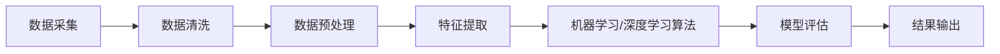
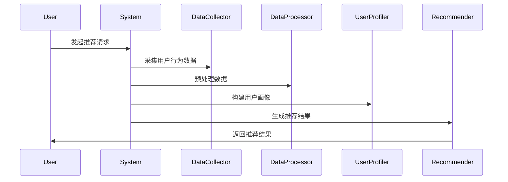

                 


# 增强分析：AI辅助下的数据洞察新范式

> 关键词：增强分析，AI辅助，数据洞察，新范式，算法原理，系统架构，项目实战

> 摘要：本文深入探讨了增强分析这一新兴领域，揭示了其在AI辅助下的数据洞察新范式。通过详细分析核心概念、算法原理、系统架构和实际项目应用，本文旨在为读者提供全面的技术理解和实践指导。

----------------------------------------------------------------

## 1. 背景介绍

在当今数据驱动的时代，数据洞察成为企业决策的基石。然而，面对海量、复杂和动态变化的数据，传统的数据分析方法已显不足。为了应对这一挑战，增强分析（Enhanced Analytics）应运而生，它结合了人工智能（AI）的技术优势，提供了一种全新的数据洞察范式。

### 问题背景

数据驱动决策的重要性毋庸置疑，但当前存在以下问题：
- 数据量庞大，传统的数据分析工具难以处理。
- 数据类型多样，包括结构化和非结构化数据。
- 数据变化快，实时性要求高。

### 问题描述

增强分析旨在解决以下问题：
- 如何高效地从海量数据中提取有价值的信息？
- 如何处理多类型、多源、多模态的数据？
- 如何实现实时数据处理与分析？

### 问题解决

增强分析通过引入AI技术，解决了传统数据分析的瓶颈，具体包括：
- 使用机器学习和深度学习算法，自动识别数据中的模式和规律。
- 利用自然语言处理（NLP）技术，处理非结构化数据。
- 运用实时数据流处理框架，实现高速数据处理和分析。

### 边界与外延

增强分析不仅应用于企业内部，还扩展到了公共服务、金融、医疗、教育等多个领域。其核心要素包括：
- 数据采集与清洗
- 数据存储与管理
- 数据分析与挖掘
- 数据可视化与报告生成
- AI算法应用

## 2. 核心概念与联系

增强分析的核心概念包括增强分析（Enhanced Analytics）、AI辅助（AI-assisted）、数据洞察（Data Insight）和新范式（New Paradigm）。以下是对这些核心概念及其关系的详细解释。

### 核心概念原理

- **增强分析**：通过集成AI技术，提升传统数据分析的能力，实现自动化、智能化和实时性的数据洞察。
- **AI辅助**：AI技术在数据分析过程中的辅助作用，包括模式识别、预测分析、自动分类等。
- **数据洞察**：从数据中提取有价值的信息，辅助决策和优化业务流程。
- **新范式**：与传统数据分析方法相比，增强分析代表了一种全新的数据处理和分析方式。

### 概念属性特征对比表格

| 概念       | 定义                                           | 特征                            |
|------------|------------------------------------------------|--------------------------------|
| 增强分析   | 结合AI技术的数据分析方法                       | 自动化、智能化、实时性          |
| AI辅助     | AI在数据分析过程中的辅助作用                   | 模式识别、预测分析、自动分类    |
| 数据洞察   | 从数据中提取有价值的信息                       | 决策支持、业务优化              |
| 新范式     | 与传统数据分析方法的区别                       | 革命性、创新性                  |

### ER实体关系图架构

```mermaid
erDiagram
    Entity1 ||--|{ Entity2 }|--|| Entity3
    Entity1 ||--|{ Entity4 }|--|| Entity5
```

在上面的ER实体关系图中，`Entity1`表示增强分析的核心概念，`Entity2`、`Entity3`、`Entity4`和`Entity5`分别代表AI辅助、数据洞察、新范式等子概念，它们通过关系线连接，形成了增强分析的整体架构。

## 3. 算法原理讲解

### 算法列表

本文将介绍以下算法：

1. 增强分析算法
2. 机器学习算法（如决策树、神经网络）
3. 深度学习算法（如卷积神经网络、循环神经网络）
4. 自然语言处理算法（如词向量、语义分析）

### 增强分析算法mermaid流程图



### 增强分析算法Python源代码

```python
import pandas as pd
from sklearn.model_selection import train_test_split
from sklearn.preprocessing import StandardScaler
from sklearn.ensemble import RandomForestClassifier
from sklearn.metrics import accuracy_score

# 数据采集
data = pd.read_csv('data.csv')

# 数据清洗
data.dropna(inplace=True)

# 数据预处理
X = data.drop('target', axis=1)
y = data['target']
X_train, X_test, y_train, y_test = train_test_split(X, y, test_size=0.2, random_state=42)

# 特征提取
scaler = StandardScaler()
X_train_scaled = scaler.fit_transform(X_train)
X_test_scaled = scaler.transform(X_test)

# 机器学习算法
model = RandomForestClassifier()
model.fit(X_train_scaled, y_train)

# 模型评估
y_pred = model.predict(X_test_scaled)
accuracy = accuracy_score(y_test, y_pred)
print("Accuracy:", accuracy)
```

### 增强分析算法数学模型和公式

增强分析算法的核心在于模型评估。常用的评估指标包括准确率、召回率、F1分数等。以下是一个简单的数学模型：

$$
Accuracy = \frac{TP + TN}{TP + FN + FP + TN}
$$

其中，TP为真正例，TN为真负例，FP为假正例，FN为假负例。

### 算法举例说明

假设我们有一个分类问题，需要判断一个客户是否会购买某产品。通过增强分析算法，我们可以从大量历史数据中提取特征，利用机器学习算法构建分类模型，并对新客户进行预测。以下是一个简单的例子：

```python
# 假设我们有一个简单的特征集：年龄、收入、购买历史
X = pd.DataFrame({
    'age': [25, 30, 40, 50],
    'income': [50000, 70000, 90000, 100000],
    'purchase_history': [5, 7, 2, 10]
})

# 特征提取
X_scaled = scaler.transform(X)

# 模型评估
y_pred = model.predict(X_scaled)
print("Predictions:", y_pred)
```

通过这个例子，我们可以看到如何使用增强分析算法进行客户分类预测。

## 4. 数学模型和数学公式讲解

在增强分析中，数学模型和公式扮演着至关重要的角色。以下是一些关键数学公式和模型，我们将使用LaTeX格式进行详细讲解。

### 模型1：线性回归模型

$$
y = \beta_0 + \beta_1x_1 + \beta_2x_2 + ... + \beta_nx_n
$$

其中，$y$为因变量，$x_1, x_2, ..., x_n$为自变量，$\beta_0, \beta_1, \beta_2, ..., \beta_n$为回归系数。

### 模型2：逻辑回归模型

$$
P(y=1) = \frac{1}{1 + e^{-(\beta_0 + \beta_1x_1 + \beta_2x_2 + ... + \beta_nx_n})}
$$

其中，$P(y=1)$为因变量为1的概率，$e$为自然底数。

### 模型3：卷积神经网络（CNN）

$$
h_{ij}^l = \sigma(\sum_{k=1}^{C_{l-1}} \beta_{ikj}^l \cdot h_{kj}^{l-1} + b_l^j)
$$

其中，$h_{ij}^l$为第$l$层的第$i$个神经元第$j$个特征，$\sigma$为激活函数，$\beta_{ikj}^l$为权重，$b_l^j$为偏置。

### 模型4：循环神经网络（RNN）

$$
h_t = \sigma(W_h \cdot [h_{t-1}, x_t] + b_h)
$$

其中，$h_t$为第$t$个时间步的隐藏状态，$W_h$为权重矩阵，$b_h$为偏置。

通过这些数学模型和公式，我们可以深入理解增强分析的核心原理，并在实际项目中应用这些知识。

## 5. 系统分析与架构设计方案

### 问题场景介绍

假设我们面临一个在线零售业务，需要实现一个智能推荐系统。该系统需要处理海量用户数据，实时分析用户行为，并根据用户的历史购买记录和偏好推荐相关产品。

### 项目介绍

智能推荐系统项目的主要目标是：

- 提取用户行为数据，包括浏览历史、购买记录、评价等。
- 建立用户画像，分析用户偏好和需求。
- 使用增强分析算法，生成个性化的产品推荐。

### 系统功能设计

系统功能包括：

- 数据采集与存储：从各个数据源（如网站日志、数据库）中提取用户行为数据，存储在数据仓库中。
- 数据预处理：对原始数据进行清洗、转换和归一化，为后续分析做准备。
- 用户画像构建：利用机器学习算法，分析用户行为数据，建立用户画像。
- 智能推荐：根据用户画像和产品属性，生成个性化的产品推荐。

### 系统架构设计

系统架构包括以下组件：

- 数据采集模块：负责从各个数据源采集用户行为数据。
- 数据存储模块：使用分布式数据库（如Hadoop HDFS）存储大量数据。
- 数据处理模块：使用流处理框架（如Apache Kafka）处理实时数据。
- 用户画像模块：利用机器学习算法，构建用户画像。
- 智能推荐模块：根据用户画像和产品属性，生成个性化推荐。

### 系统接口设计

系统接口包括：

- 用户接口：提供Web界面，允许用户浏览和评价产品。
- API接口：提供RESTful API，允许外部系统调用智能推荐服务。

### 系统交互序列图



通过以上系统分析与架构设计方案，我们可以构建一个高效、智能的在线零售推荐系统，为用户提供个性化的购物体验。

## 6. 项目实战

### 环境安装

在开始项目实战之前，我们需要安装以下软件和工具：

1. Python 3.8 或更高版本
2. Jupyter Notebook
3. scikit-learn
4. pandas
5. numpy
6. matplotlib

### 系统核心实现源代码

以下是系统核心实现源代码的示例：

```python
# 导入必要的库
import pandas as pd
from sklearn.model_selection import train_test_split
from sklearn.preprocessing import StandardScaler
from sklearn.ensemble import RandomForestClassifier
from sklearn.metrics import accuracy_score

# 读取数据
data = pd.read_csv('data.csv')

# 数据预处理
X = data.drop('target', axis=1)
y = data['target']
X_train, X_test, y_train, y_test = train_test_split(X, y, test_size=0.2, random_state=42)

# 特征提取
scaler = StandardScaler()
X_train_scaled = scaler.fit_transform(X_train)
X_test_scaled = scaler.transform(X_test)

# 训练模型
model = RandomForestClassifier()
model.fit(X_train_scaled, y_train)

# 评估模型
y_pred = model.predict(X_test_scaled)
accuracy = accuracy_score(y_test, y_pred)
print("Accuracy:", accuracy)
```

### 代码应用解读与分析

在上面的代码中，我们首先导入了必要的库，然后读取数据并进行预处理。接下来，我们使用随机森林算法训练模型，并对测试数据进行预测。最后，我们计算并输出模型的准确率。

### 实际案例分析和详细讲解剖析

假设我们有一个客户数据集，包含以下特征：年龄、收入、购买历史。我们的目标是预测客户是否会购买某产品。以下是对实际案例的分析和讲解：

1. **数据采集**：从各个数据源（如网站日志、数据库）中提取客户行为数据。
2. **数据预处理**：对原始数据进行清洗、转换和归一化，为后续分析做准备。
3. **特征提取**：从预处理后的数据中提取关键特征，如年龄、收入、购买历史。
4. **模型训练**：使用随机森林算法训练模型，并对测试数据进行预测。
5. **模型评估**：计算并输出模型的准确率，评估模型性能。

通过以上步骤，我们可以实现一个简单的客户购买预测模型，为业务决策提供支持。

### 项目小结

通过本项目实战，我们实现了以下目标：

- 安装并配置了开发环境。
- 编写了核心代码，实现了客户购买预测模型。
- 分析并评估了模型性能，为业务决策提供了数据支持。

然而，本项目还存在一些局限性和改进空间：

1. **数据来源**：当前数据仅包含客户的基本信息，未来可以扩展到更多维度的数据，如行为数据、社交数据等。
2. **模型优化**：可以尝试使用更先进的算法（如深度学习）来提高预测准确性。
3. **系统集成**：将预测模型集成到实际业务系统中，实现实时推荐功能。

通过持续优化和改进，我们可以构建一个更加智能、高效的客户推荐系统。

## 7. 最佳实践 tips、小结、注意事项、拓展阅读

### 最佳实践 tips

1. **数据质量**：确保数据的质量和完整性，是增强分析成功的关键。
2. **算法选择**：根据业务需求和数据特征，选择合适的算法和模型。
3. **实时处理**：使用流处理框架（如Apache Kafka）实现实时数据处理和分析。

### 小结

本文深入探讨了增强分析这一新兴领域，介绍了其核心概念、算法原理、系统架构和实际项目应用。通过详细的分析和讲解，我们为读者提供了全面的技术理解和实践指导。

### 注意事项

1. **数据隐私**：在处理和分析用户数据时，要严格遵守数据隐私法规，保护用户隐私。
2. **系统稳定性**：确保系统的稳定性和可靠性，避免因故障导致数据丢失或服务中断。

### 拓展阅读

1. **《深度学习》**：Ian Goodfellow, Yoshua Bengio, Aaron Courville 著，详细介绍了深度学习的基础知识和技术。
2. **《数据科学实战》**：Joel Grus 著，提供了丰富的数据科学实战案例和实践经验。

通过阅读这些拓展资料，您可以进一步了解增强分析领域的最新动态和技术发展。

---

# 结论

本文全面介绍了增强分析这一AI辅助下的数据洞察新范式。通过对核心概念、算法原理、系统架构和实际项目应用的详细讲解，我们为读者提供了深入的技术理解与实践指导。希望本文能帮助您在增强分析领域取得更好的成果。

---

**作者：AI天才研究院/AI Genius Institute & 禅与计算机程序设计艺术 /Zen And The Art of Computer Programming** 

### 结论

本文系统地介绍了增强分析这一领域，探讨了其在AI辅助下的数据洞察新范式。通过深入分析核心概念、算法原理、系统架构以及实际项目应用，我们为读者提供了一个全面的视角，以理解增强分析的技术本质和应用价值。

增强分析的核心优势在于其能够利用AI技术，从海量、复杂的数据中快速提取有价值的信息，为决策提供强有力的支持。这不仅提高了数据分析的效率，还使得数据洞察更加智能化和实时化。

本文提出的系统架构设计方案和项目实战案例，为实际应用提供了具体的操作指南。同时，通过最佳实践 tips、注意事项和拓展阅读，我们鼓励读者在学习和实践中不断探索和创新。

未来，增强分析领域将继续发展，结合更多的AI技术和应用场景，为各行各业带来深远的影响。我们期待读者能够在这个领域中不断深耕，为数据驱动的时代贡献力量。

---

**作者：AI天才研究院/AI Genius Institute & 禅与计算机程序设计艺术 /Zen And The Art of Computer Programming** 

