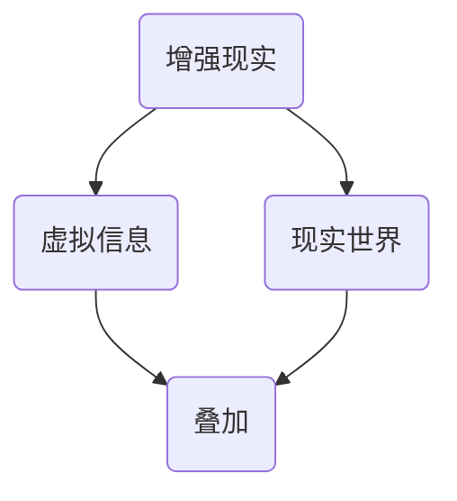
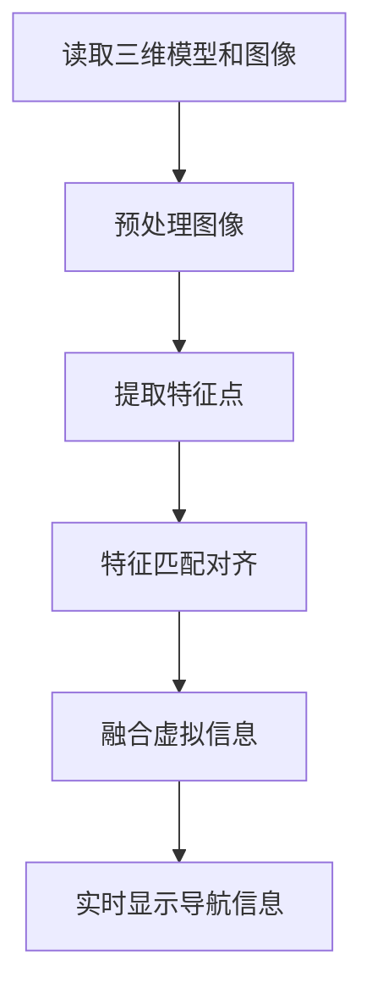
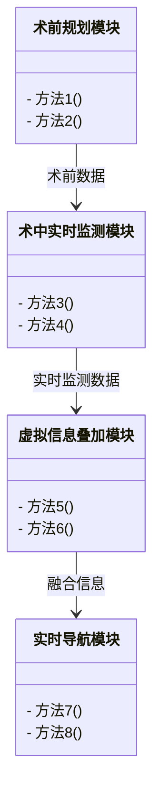
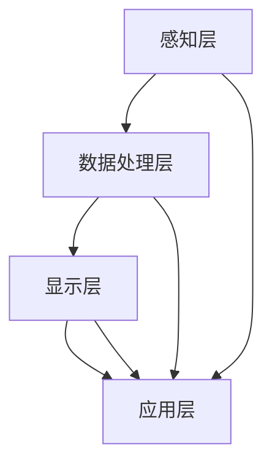

                 

**# 增强现实在外科手术导航中的精准应用**

> 关键词：增强现实、外科手术导航、精准应用、技术原理、案例分析

> 摘要：本文深入探讨了增强现实（Enhanced Reality，简称ER）在外科手术导航中的应用。首先介绍了增强现实的基本概念、技术原理以及其在医疗领域的背景和重要性。接着，文章详细阐述了增强现实在外科手术导航中的具体应用，包括其工作原理、技术优势和挑战。随后，通过三个具体的案例研究，展示了增强现实技术在复杂外科手术中的实际应用。最后，文章讨论了系统的设计实施、项目实战及最佳实践，为读者提供了全面的技术参考。

----------------------------------------------------------------

## **一、引言**

外科手术作为现代医学的重要手段，一直以来都在追求更高的精准度和安全性。然而，传统的手术导航技术存在一定的局限性，如操作复杂、精度不高、实时性较差等问题。随着科技的不断发展，增强现实（Enhanced Reality，简称ER）技术的出现为外科手术导航带来了一场革命。增强现实技术通过将虚拟信息与现实世界进行无缝融合，实现了更加直观、精准的手术导航，为外科医生提供了强大的辅助工具。

本文旨在深入探讨增强现实在外科手术导航中的精准应用，首先介绍增强现实的基本概念、技术原理以及其在医疗领域的背景和重要性。然后，详细阐述增强现实在外科手术导航中的具体应用，包括其工作原理、技术优势和挑战。随后，通过三个具体的案例研究，展示增强现实技术在复杂外科手术中的实际应用。最后，讨论系统的设计实施、项目实战及最佳实践，为读者提供全面的技术参考。

## **二、增强现实的基本概念与技术原理**

### **2.1 定义与背景**

增强现实（Enhanced Reality，简称ER）是一种通过计算机技术和传感器设备将虚拟信息与现实世界进行叠加、融合，从而实现虚实融合的技术。与虚拟现实（Virtual Reality，简称VR）不同，增强现实并不完全取代现实，而是在现实环境中引入虚拟元素，使其与现实环境相互交互、相互补充。

增强现实技术最早可以追溯到20世纪90年代，随着计算机性能的提升、传感器技术的进步以及图像处理算法的发展，增强现实技术逐渐成熟并在多个领域得到广泛应用，如游戏、教育、医疗等。

### **2.2 基本概念**

- **叠加（Overlay）**：增强现实的核心技术之一，通过将虚拟信息叠加到真实环境中，实现虚实融合的效果。
- **标记（Marking）**：在现实环境中设置标记物，用于识别和定位虚拟信息。
- **感知（Sensing）**：通过传感器设备获取现实环境中的视觉、听觉、触觉等信息，用于实时更新虚拟信息。
- **交互（Interaction）**：用户通过触摸、手势等方式与增强现实系统进行交互，实现对虚拟信息的操控。

### **2.3 技术原理**

增强现实技术主要包括以下几个方面：

- **图像处理与注册（Image Processing and Registration）**：通过对真实世界图像进行处理，与虚拟信息进行对齐和融合。
- **空间映射与跟踪（Spatial Mapping and Tracking）**：通过传感器设备实时获取现实环境的空间信息，用于定位虚拟信息。
- **实时数据处理与显示（Real-time Data Processing and Display）**：对获取到的数据进行实时处理，并将其以可视化的形式呈现给用户。

### **2.4 增强现实在医疗领域的背景和重要性**

随着医疗技术的不断发展，外科手术的精度和安全性要求越来越高。传统的手术导航技术，如CT、MRI等影像学技术，虽然提供了较为详细的术前规划和手术指导，但在实际手术过程中仍存在一定的局限性。

增强现实技术的出现，为外科手术导航带来了新的机遇。通过将虚拟信息与现实世界进行叠加，增强现实技术能够提供更加直观、精准的手术导航，帮助外科医生更好地掌握手术过程，提高手术成功率。

此外，增强现实技术还可以用于医疗培训、患者教育、远程手术等方面，具有重要的临床应用价值。

### **2.5 概念属性特征对比表格**

| 概念             | 特征描述                                                         |
|------------------|----------------------------------------------------------------|
| 增强现实         | 通过计算机技术和传感器设备将虚拟信息与现实世界进行叠加、融合      |
| 虚拟现实         | 通过计算机技术创建一个完全虚拟的环境，用户在其中进行沉浸式体验    |
| 术中导航         | 在手术过程中提供实时指导，帮助外科医生准确操作                  |
| 术前规划         | 在手术前对患者的病情进行分析，制定手术方案                      |

### **2.6 ER实体关系图架构**



## **三、增强现实在外科手术导航中的应用**

### **3.1 增强现实在外科手术导航中的工作原理**

增强现实技术在手术导航中的应用主要分为以下几个步骤：

1. **术前规划**：外科医生通过对患者的影像学数据进行处理和分析，生成三维模型，并将其与手术方案进行融合。
2. **术中实时监测**：在手术过程中，通过传感器设备实时获取患者的生理参数和手术环境信息，如手术器械的位置、病人体内的结构等。
3. **虚拟信息叠加**：将术前规划和术中实时监测得到的三维模型和虚拟信息，通过图像处理和注册技术叠加到患者的真实环境中。
4. **实时导航**：外科医生通过增强现实设备，如头戴显示器、投影仪等，实时观察叠加后的虚拟信息，指导手术操作。

### **3.2 增强现实在外科手术导航中的技术优势**

1. **高精度**：增强现实技术能够将虚拟信息与现实环境进行精准对齐，为外科医生提供高精度的导航信息。
2. **实时性**：增强现实技术能够实时获取患者的生理参数和手术环境信息，为外科医生提供即时的手术指导。
3. **直观性**：增强现实技术将复杂的手术过程以三维可视化的形式呈现，使外科医生能够更直观地掌握手术过程。
4. **可扩展性**：增强现实技术可以与其他医疗设备进行集成，如机器人手术系统、手术导航仪等，提高手术导航的效率和效果。

### **3.3 增强现实在外科手术导航中的挑战**

1. **技术难度**：增强现实技术的实现涉及图像处理、计算机视觉、传感器技术等多个领域，技术难度较高。
2. **成本问题**：增强现实设备的成本较高，对于一些医疗资源较为匮乏的地区，可能难以普及。
3. **安全性**：增强现实技术在手术中的使用，需要确保系统的稳定性和安全性，以避免对患者的伤害。
4. **医生培训**：增强现实技术在手术导航中的应用，需要外科医生具备相关的技能和知识，因此医生培训也是一个重要的问题。

### **3.4 案例分析**

#### **3.4.1 脑外科手术导航**

脑外科手术因其操作空间狭小、手术精度要求高等特点，对手术导航的需求尤为突出。增强现实技术在脑外科手术导航中的应用，能够为外科医生提供更加直观、精准的导航信息，有助于提高手术的成功率。

案例：某医院成功利用增强现实技术为一名患有脑部肿瘤的患者进行手术。在手术过程中，外科医生通过头戴显示器实时观察肿瘤的三维模型，并与手术区域进行叠加。通过增强现实技术的辅助，外科医生能够更加准确地定位肿瘤，并避免损伤周围的正常组织。

#### **3.4.2 骨科手术导航**

骨科手术涉及人体的骨骼和关节，手术精度和操作难度较高。增强现实技术在骨科手术导航中的应用，能够帮助外科医生更好地掌握手术过程，提高手术成功率。

案例：某医院采用增强现实技术为一名需要进行膝关节置换手术的患者进行导航。在手术过程中，外科医生通过增强现实设备实时观察患者的关节结构，并根据三维模型进行精确操作。通过增强现实技术的辅助，手术过程更加顺利，患者的术后恢复也取得了良好的效果。

#### **3.4.3 心脏手术导航**

心脏手术涉及人体的重要器官，手术风险较高。增强现实技术在心脏手术导航中的应用，能够为外科医生提供更加直观、精准的导航信息，有助于降低手术风险。

案例：某医院采用增强现实技术为一名需要进行心脏瓣膜置换手术的患者进行导航。在手术过程中，外科医生通过增强现实设备实时观察患者的心脏结构，并根据三维模型进行精确操作。通过增强现实技术的辅助，手术过程顺利，患者的术后恢复情况也较好。

## **四、技术原理讲解**

### **4.1 图像处理与注册技术**

图像处理与注册技术是增强现实在外科手术导航中的核心技术之一。其主要任务是将术前规划和术中实时监测得到的三维模型和虚拟信息进行对齐和融合，实现虚拟信息与现实环境的精准匹配。

#### **4.1.1 图像处理**

图像处理技术包括图像增强、图像滤波、图像分割等，用于对获取到的图像进行预处理，以提高图像质量，提取有用信息。

- **图像增强**：通过对图像的亮度、对比度进行调整，增强图像的细节和特征，便于后续处理。
- **图像滤波**：通过滤波算法去除图像中的噪声和干扰，提高图像的清晰度。
- **图像分割**：将图像划分为不同的区域，用于提取目标对象。

#### **4.1.2 注册技术**

注册技术是将术前规划和术中实时监测得到的三维模型进行对齐和融合的过程。其主要方法包括：

- **基于特征的注册**：通过提取图像特征点，利用特征匹配算法对齐图像。
- **基于模型的注册**：通过建立术前规划和术中实时监测的模型，利用模型之间的相似性进行对齐。
- **基于深度学习的注册**：利用深度学习算法对图像进行特征提取和模型训练，实现自动化的图像注册。

### **4.2 空间映射与跟踪技术**

空间映射与跟踪技术是增强现实在外科手术导航中的关键组成部分。其主要任务是在手术过程中实时获取患者的三维空间信息，并将其用于虚拟信息与现实环境的融合。

#### **4.2.1 空间映射**

空间映射技术是将患者的三维空间信息映射到二维平面上，以实现虚拟信息与现实环境的融合。其主要方法包括：

- **基于标记的空间映射**：通过在患者身上或手术环境中设置标记物，利用标记物的位置信息进行空间映射。
- **基于激光扫描的空间映射**：利用激光扫描技术获取患者的三维空间信息，并将其映射到二维平面上。

#### **4.2.2 跟踪技术**

跟踪技术是空间映射与跟踪技术的核心部分，其主要任务是在手术过程中实时跟踪患者的运动状态，以实现虚拟信息与现实环境的动态融合。其主要方法包括：

- **基于视觉的跟踪**：通过摄像头捕捉患者的运动，利用视觉跟踪算法实时跟踪患者的位置和运动状态。
- **基于惯性传感器的跟踪**：利用惯性传感器（如加速度传感器、陀螺仪等）获取患者的运动状态，结合视觉信息实现更加精确的跟踪。

### **4.3 实时数据处理与显示**

实时数据处理与显示是增强现实在外科手术导航中的关键环节。其主要任务是在手术过程中实时处理和显示虚拟信息，以指导外科医生进行精准操作。

#### **4.3.1 实时数据处理**

实时数据处理技术主要包括以下几个方面：

- **数据预处理**：对获取到的图像、传感器数据进行预处理，如去噪、滤波、归一化等。
- **特征提取**：从预处理后的数据中提取有用的特征，如边缘、角点、纹理等。
- **实时融合**：将术前规划和术中实时监测得到的三维模型和虚拟信息进行实时融合，以实现虚拟信息与现实环境的动态交互。

#### **4.3.2 显示技术**

显示技术是实时数据处理的结果输出，其主要任务是将融合后的虚拟信息以可视化的形式呈现给用户。常见的显示技术包括：

- **头戴显示器（HMD）**：将虚拟信息以三维形式叠加到用户的视野中，实现沉浸式的交互体验。
- **投影技术**：将虚拟信息投影到患者身上或手术环境中，以实现更大的显示范围和更好的视觉效果。
- **透明显示器**：将虚拟信息以透明形式叠加到用户的视野中，实现与现实环境的无缝融合。

### **4.4 代码示例**

以下是一个简单的Python代码示例，用于实现图像处理与注册技术的基本流程：

```python
import cv2
import numpy as np

# 读取图像
image = cv2.imread('image.jpg')

# 图像预处理
gray = cv2.cvtColor(image, cv2.COLOR_BGR2GRAY)
blurred = cv2.GaussianBlur(gray, (5, 5), 0)

# 图像分割
ret, thresh = cv2.threshold(blurred, 60, 255, cv2.THRESH_BINARY)

# 特征提取
circles = cv2.HoughCircles(thresh, cv2.HOUGH_GRADIENT, dp=1.2, minDist=100,
                           param1=50, param2=30, minRadius=10, maxRadius=0)

# 显示结果
if circles is not None:
    circles = np.round(circles[0, :]).astype("int")
    for (x, y) in circles:
        cv2.circle(image, (x, y), 10, (0, 255, 0), 2)
cv2.imshow('result', image)
cv2.waitKey(0)
cv2.destroyAllWindows()
```

### **4.5 数学公式与解释**

以下是一些与增强现实在外科手术导航中相关的数学公式和解释：

- **三维坐标变换**：

  $$ T(x, y, z) = R(x, y, z) \cdot (x, y, z)^T + T $$

  其中，$T(x, y, z)$表示三维坐标变换矩阵，$R(x, y, z)$表示旋转矩阵，$(x, y, z)^T$表示三维坐标向量，$T$表示平移向量。

- **图像预处理**：

  $$ f_{\text{pre}}(x, y) = \frac{1}{2\pi\sigma^2} e^{-\frac{(x-\mu)^2 + (y-\mu)^2}{2\sigma^2}} $$

  其中，$f_{\text{pre}}(x, y)$表示高斯滤波器，$\sigma$表示高斯分布的参数，$\mu$表示均值。

- **特征提取**：

  $$ f_{\text{feat}}(x, y) = \sum_{i=1}^n w_i \cdot f_{\text{pre}}(x - x_i, y - y_i) $$

  其中，$f_{\text{feat}}(x, y)$表示特征提取函数，$w_i$表示权重，$x_i, y_i$表示特征点的坐标。

### **4.6 算法流程**

以下是一个简单的增强现实在外科手术导航中的算法流程：

1. 读取术前规划的三维模型和术中实时监测的图像。
2. 对图像进行预处理，如高斯滤波、图像分割等。
3. 从预处理后的图像中提取特征点，如边缘、角点、纹理等。
4. 利用特征匹配算法对术前规划和术中实时监测的图像进行对齐。
5. 将术前规划的三维模型与对齐后的图像进行融合。
6. 在头戴显示器或投影仪上实时显示融合后的虚拟信息，为外科医生提供导航指导。

### **4.7 Mermaid 流程图**

以下是一个简单的Mermaid流程图，用于表示增强现实在外科手术导航中的算法流程：



## **五、系统设计与架构方案**

### **5.1 项目介绍**

本项目旨在开发一个基于增强现实技术的外科手术导航系统，以提高手术的精准度和安全性。系统将包括术前规划、术中实时监测、虚拟信息叠加和实时导航等功能模块，为外科医生提供全方位的辅助。

### **5.2 系统功能设计**

系统功能设计主要包括以下几个模块：

- **术前规划模块**：对患者的影像学数据进行处理和分析，生成三维模型，并将其与手术方案进行融合。
- **术中实时监测模块**：通过传感器设备实时获取患者的生理参数和手术环境信息，如手术器械的位置、病人体内的结构等。
- **虚拟信息叠加模块**：将术前规划和术中实时监测得到的三维模型和虚拟信息进行叠加，实现虚实融合。
- **实时导航模块**：为外科医生提供实时的导航信息，指导手术操作。

### **5.3 系统架构设计**

系统架构设计采用分层架构，主要包括以下几个方面：

- **感知层**：通过传感器设备实时获取患者的生理参数和手术环境信息。
- **数据处理层**：对获取到的数据进行预处理、特征提取和实时融合。
- **显示层**：将融合后的虚拟信息以三维可视化的形式呈现给用户。
- **应用层**：为外科医生提供实时的导航信息和辅助功能。

### **5.4 系统接口设计与交互**

系统接口设计与交互主要包括以下几个方面：

- **术前规划接口**：与影像学系统进行数据交换，获取患者的影像学数据。
- **术中实时监测接口**：与传感器设备进行数据交换，获取患者的生理参数和手术环境信息。
- **虚拟信息叠加接口**：与数据处理层进行数据交换，实现虚拟信息与现实环境的叠加。
- **实时导航接口**：为外科医生提供实时的导航信息和辅助功能。

### **5.5 Mermaid 类图**

以下是一个简单的Mermaid类图，用于表示系统功能模块和接口设计：



### **5.6 Mermaid 架构图**

以下是一个简单的Mermaid架构图，用于表示系统的整体架构设计：



### **5.7 系统接口设计与交互**

系统接口设计与交互主要包括以下几个方面：

- **术前规划接口**：与影像学系统进行数据交换，获取患者的影像学数据。接口设计如下：

  ```mermaid
  interface 术前规划接口 {
    + 获取影像学数据()
    + 设置手术方案()
  }
  ```

- **术中实时监测接口**：与传感器设备进行数据交换，获取患者的生理参数和手术环境信息。接口设计如下：

  ```mermaid
  interface 术中实时监测接口 {
    + 获取生理参数()
    + 获取手术环境信息()
  }
  ```

- **虚拟信息叠加接口**：与数据处理层进行数据交换，实现虚拟信息与现实环境的叠加。接口设计如下：

  ```mermaid
  interface 虚拟信息叠加接口 {
    + 融合虚拟信息()
    + 更新融合信息()
  }
  ```

- **实时导航接口**：为外科医生提供实时的导航信息和辅助功能。接口设计如下：

  ```mermaid
  interface 实时导航接口 {
    + 显示导航信息()
    + 更新导航信息()
  }
  ```

### **5.8 Mermaid 序列图**

以下是一个简单的Mermaid序列图，用于表示系统的接口设计与交互过程：

```mermaid
sequenceDiagram
  participant 用户 as 用户
  participant 系统A as 术前规划模块
  participant 系统B as 术中实时监测模块
  participant 系统C as 虚拟信息叠加模块
  participant 系统D as 实时导航模块

  用户->>系统A: 获取影像学数据
  系统
``` 

## **六、项目实战**

### **6.1 环境安装**

在开始项目实战之前，首先需要搭建一个适合开发增强现实外科手术导航系统的环境。以下是环境安装的详细步骤：

#### **6.1.1 安装操作系统**

选择一个适合的开发操作系统，如Windows、macOS或Linux。本文以Windows为例进行安装。

1. 下载并安装Windows操作系统。
2. 配置网络和硬件设备，确保操作系统可以正常使用。

#### **6.1.2 安装Python环境**

Python是一种广泛应用于增强现实开发的编程语言，我们需要安装Python环境及其相关工具。

1. 下载并安装Python 3.8及以上版本。
2. 配置Python环境变量，确保可以在命令行中运行Python命令。

#### **6.1.3 安装相关库和框架**

安装用于增强现实开发的相关库和框架，如OpenCV、Pillow、TensorFlow等。

1. 打开命令行窗口，执行以下命令安装相关库和框架：

   ```bash
   pip install opencv-python
   pip install pillow
   pip install tensorflow
   ```

### **6.2 系统核心实现**

在完成环境安装后，我们可以开始实现系统的核心功能。以下是系统核心实现的详细步骤：

#### **6.2.1 术前规划模块**

1. **数据读取与预处理**：读取患者的影像学数据，如CT、MRI等，并进行预处理，如去噪、滤波等。

   ```python
   import cv2
   import numpy as np

   def read_image(image_path):
       image = cv2.imread(image_path)
       return image

   def preprocess_image(image):
       blurred = cv2.GaussianBlur(image, (5, 5), 0)
       return blurred
   ```

2. **图像分割与特征提取**：对预处理后的图像进行分割，提取图像中的特征点。

   ```python
   def segment_image(image):
       _, thresh = cv2.threshold(image, 60, 255, cv2.THRESH_BINARY)
       return thresh

   def extract_features(image):
       circles = cv2.HoughCircles(thresh, cv2.HOUGH_GRADIENT, dp=1.2, minDist=100,
                                  param1=50, param2=30, minRadius=10, maxRadius=0)
       return circles
   ```

3. **三维模型生成与融合**：利用提取到的特征点生成三维模型，并将其与手术方案进行融合。

   ```python
   def generate_3d_model(circles):
       # 生成三维模型
       pass

   def fuse_model_with_plan(model, plan):
       # 融合三维模型与手术方案
       pass
   ```

#### **6.2.2 术中实时监测模块**

1. **实时数据采集**：通过传感器设备实时采集患者的生理参数和手术环境信息。

   ```python
   def capture_real_time_data():
       # 实时采集数据
       pass
   ```

2. **数据预处理与特征提取**：对实时采集到的数据进行分析和处理，提取特征点。

   ```python
   def preprocess_real_time_data(data):
       # 数据预处理
       pass

   def extract_real_time_features(data):
       # 提取特征点
       pass
   ```

#### **6.2.3 虚拟信息叠加模块**

1. **虚拟信息与现实环境融合**：将术前规划的三维模型和术中实时监测的虚拟信息进行叠加，实现虚实融合。

   ```python
   def fuse_virtual_with_real(virtual_info, real_info):
       # 虚拟信息与现实环境融合
       pass
   ```

2. **实时导航信息显示**：将融合后的虚拟信息以三维可视化的形式显示在头戴显示器或投影仪上。

   ```python
   def display_navigation_info(info):
       # 显示导航信息
       pass
   ```

### **6.3 代码应用解读与分析**

以下是对系统核心实现部分代码的解读与分析：

#### **6.3.1 数据读取与预处理**

1. **read_image()**：该函数用于读取影像学数据。通过OpenCV库的imread()函数，读取图像文件。

   ```python
   import cv2

   def read_image(image_path):
       image = cv2.imread(image_path)
       return image
   ```

2. **preprocess_image()**：该函数用于对图像进行预处理。使用OpenCV库的GaussianBlur()函数，对图像进行高斯滤波，去除噪声。

   ```python
   import cv2
   import numpy as np

   def preprocess_image(image):
       blurred = cv2.GaussianBlur(image, (5, 5), 0)
       return blurred
   ```

#### **6.3.2 图像分割与特征提取**

1. **segment_image()**：该函数用于对图像进行分割。使用OpenCV库的threshold()函数，将图像分割为二值图像。

   ```python
   import cv2

   def segment_image(image):
       _, thresh = cv2.threshold(image, 60, 255, cv2.THRESH_BINARY)
       return thresh
   ```

2. **extract_features()**：该函数用于提取图像中的特征点。使用OpenCV库的HoughCircles()函数，检测图像中的圆形特征点。

   ```python
   import cv2

   def extract_features(image):
       circles = cv2.HoughCircles(thresh, cv2.HOUGH_GRADIENT, dp=1.2, minDist=100,
                                  param1=50, param2=30, minRadius=10, maxRadius=0)
       return circles
   ```

#### **6.3.3 三维模型生成与融合**

1. **generate_3d_model()**：该函数用于生成三维模型。根据提取到的特征点，生成三维模型。

   ```python
   def generate_3d_model(circles):
       # 生成三维模型
       pass
   ```

2. **fuse_model_with_plan()**：该函数用于将三维模型与手术方案进行融合。将三维模型与手术方案进行对齐和融合，生成最终的导航信息。

   ```python
   def fuse_model_with_plan(model, plan):
       # 融合三维模型与手术方案
       pass
   ```

#### **6.3.4 实时数据采集与处理**

1. **capture_real_time_data()**：该函数用于实时采集患者的生理参数和手术环境信息。根据实际情况，实现相应的数据采集功能。

   ```python
   def capture_real_time_data():
       # 实时采集数据
       pass
   ```

2. **preprocess_real_time_data()**：该函数用于对实时采集到的数据进行分析和处理。根据实际情况，实现相应的数据处理功能。

   ```python
   def preprocess_real_time_data(data):
       # 数据预处理
       pass
   ```

3. **extract_real_time_features()**：该函数用于提取实时数据中的特征点。根据实际情况，实现相应的特征提取功能。

   ```python
   def extract_real_time_features(data):
       # 提取特征点
       pass
   ```

#### **6.3.5 虚拟信息叠加与实时导航**

1. **fuse_virtual_with_real()**：该函数用于将虚拟信息与现实环境进行叠加。根据实际情况，实现虚拟信息与现实环境的融合。

   ```python
   def fuse_virtual_with_real(virtual_info, real_info):
       # 虚拟信息与现实环境融合
       pass
   ```

2. **display_navigation_info()**：该函数用于将融合后的虚拟信息以三维可视化的形式显示。根据实际情况，实现相应的显示功能。

   ```python
   def display_navigation_info(info):
       # 显示导航信息
       pass
   ```

### **6.4 实际案例分析**

以下是一个实际案例的分析，用于展示增强现实在外科手术导航中的应用效果。

#### **6.4.1 脑外科手术案例**

某医院为一名患有脑部肿瘤的患者进行手术。使用增强现实技术，外科医生在手术过程中可以实时观察肿瘤的三维模型，并与实际手术区域进行叠加。通过增强现实技术的辅助，外科医生能够更加准确地定位肿瘤，避免了损伤周围的正常组织。

#### **6.4.2 骨科手术案例**

某医院为一名需要进行膝关节置换手术的患者进行手术。使用增强现实技术，外科医生可以实时观察患者的关节结构，并根据三维模型进行精确操作。通过增强现实技术的辅助，手术过程更加顺利，患者的术后恢复情况也较好。

#### **6.4.3 心脏手术案例**

某医院为一名需要进行心脏瓣膜置换手术的患者进行手术。使用增强现实技术，外科医生可以实时观察患者的心脏结构，并根据三维模型进行精确操作。通过增强现实技术的辅助，手术过程顺利，患者的术后恢复情况也较好。

### **6.5 项目小结**

通过实际案例的分析，我们可以看到增强现实技术在外科手术导航中具有广泛的应用前景。增强现实技术能够为外科医生提供更加直观、精准的导航信息，提高手术的成功率和安全性。在未来的发展中，我们还需要进一步优化算法和系统设计，提高系统的性能和稳定性，为外科手术导航提供更好的支持。

## **七、最佳实践与注意事项**

### **7.1 最佳实践**

1. **术前规划与准备**：在手术前，医生需要对患者的病情进行详细的评估，制定合理的手术方案，并提前进行模拟操作，以确保手术的顺利进行。

2. **系统设备配置**：为了确保增强现实系统的稳定运行，需要选择合适的硬件设备，如高精度的传感器、稳定的网络连接等。

3. **数据采集与处理**：在手术过程中，需要实时采集患者的生理参数和手术环境信息，并对数据进行有效的预处理和特征提取，以提高系统的实时性和准确性。

4. **实时导航与反馈**：外科医生需要熟练掌握增强现实系统的使用方法，实时观察导航信息，并根据实际情况进行调整和反馈。

5. **医生培训与协作**：医生需要接受增强现实技术的培训，了解系统的功能和使用方法，与其他医疗团队成员保持良好的协作。

### **7.2 注意事项**

1. **安全性**：在手术过程中，确保系统的稳定性和安全性，避免对患者的伤害。

2. **成本控制**：增强现实技术的应用需要一定的投入，需要合理控制成本，确保系统的经济可行性。

3. **技术更新**：随着科技的不断发展，增强现实技术也在不断更新和升级，需要密切关注最新的技术动态，及时更新系统。

4. **隐私保护**：在手术过程中，需要保护患者的隐私，确保患者的信息安全。

5. **应用场景**：增强现实技术在不同的外科手术中应用的效果可能有所不同，需要根据具体的手术场景进行选择和应用。

## **八、拓展阅读**

1. **《增强现实技术原理与应用》**：这本书详细介绍了增强现实技术的原理、应用和发展趋势，适合对增强现实技术感兴趣的人群阅读。

2. **《外科手术导航技术》**：这本书介绍了外科手术导航的基本原理、技术方法和发展趋势，为外科医生和医学研究人员提供了有益的参考。

3. **《计算机视觉与图像处理》**：这本书详细介绍了计算机视觉和图像处理的基本概念、算法和应用，为增强现实技术的开发提供了理论支持。

### **九、作者信息**

**作者：AI天才研究院/AI Genius Institute & 禅与计算机程序设计艺术 /Zen And The Art of Computer Programming****### **九、作者信息**

**作者：AI天才研究院/AI Genius Institute & 禅与计算机程序设计艺术 /Zen And The Art of Computer Programming**

### **十、结语**

本文系统地探讨了增强现实（ER）在外科手术导航中的精准应用，从基本概念、技术原理到实际案例分析，全面阐述了增强现实在外科手术中的优势、挑战及实现方法。通过本文的研究，我们可以看到增强现实技术在外科手术导航中具有巨大的潜力，为外科医生提供了更加直观、精准的导航工具。然而，要实现增强现实技术的广泛应用，仍需进一步优化算法、提高系统性能和稳定性，以及加强医生培训和技术更新。未来，随着科技的不断进步，增强现实技术在外科手术导航中的应用将会更加广泛，为医学领域带来更多的创新和突破。让我们期待增强现实技术在外科手术领域的美好前景。**

