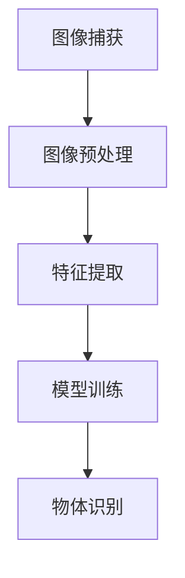
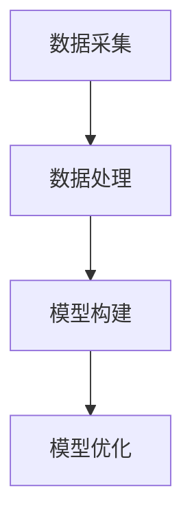
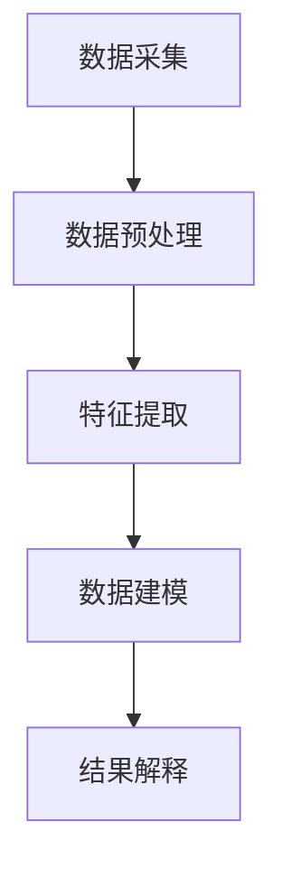
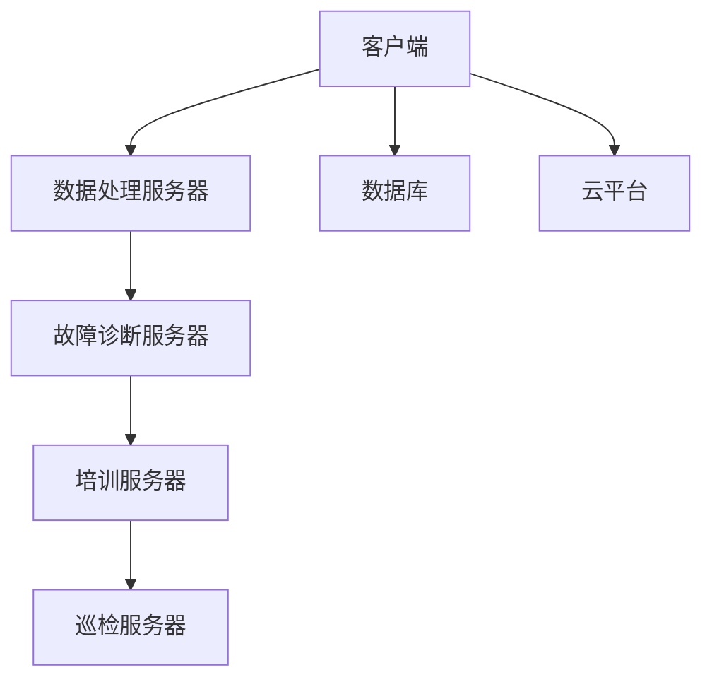
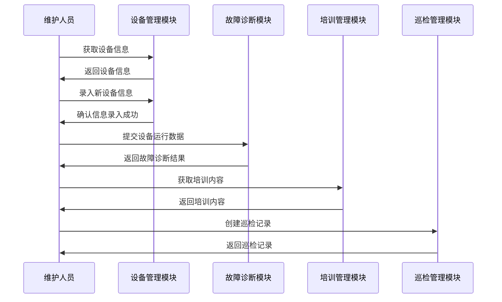

                 

### 引言与背景

#### 1.1.1 增强现实技术简介

增强现实（Augmented Reality，简称AR）是一种将虚拟信息叠加到真实环境中的技术。它通过计算机技术，将图像、视频、声音等虚拟信息与现实世界中的物体进行融合，使用户能够在一个叠加了虚拟信息的真实环境中进行互动。增强现实技术的核心在于实时感知用户的环境、识别现实世界的物体，并实时地叠加虚拟信息。

增强现实技术的发展可以追溯到20世纪90年代。随着计算机图形学、计算机视觉、人工智能等技术的不断进步，增强现实技术逐渐从实验室走向实际应用。目前，增强现实技术在多个领域得到了广泛应用，包括医疗、教育、娱乐、工业等。

在工业设备维护中，增强现实技术具有巨大的潜力。通过增强现实技术，可以实现对设备的可视化操作指导，提高维护效率，降低维护成本，提高维护质量。

#### 1.1.2 工业设备维护的现状

工业设备维护是工业生产中至关重要的一环。随着工业设备的复杂性和精密性不断提高，传统的维护方式已经无法满足现代工业生产的需要。传统的维护方式通常依赖于技术人员的人工经验和知识，维护效率低，成本高，且容易出现误操作。

目前，工业设备维护中存在的问题主要包括：

1. 维护人员技能不足：许多工业设备维护人员缺乏专业的技能和知识，无法有效地进行设备维护。

2. 维护流程不规范：传统的维护流程往往缺乏系统性和规范性，导致维护工作无法有序进行。

3. 维护成本高：由于维护效率低，维护时间长，导致维护成本居高不下。

4. 维护质量不稳定：由于维护人员技能水平不一，导致维护质量无法得到保证。

5. 维护信息缺乏：许多工业设备缺乏详细的技术文档和操作手册，维护人员无法及时获取设备的信息。

#### 1.1.3 增强现实在工业设备维护中的潜在应用

增强现实技术在工业设备维护中的潜在应用主要包括以下几个方面：

1. 可视化操作指导：通过增强现实技术，可以将设备的操作步骤和注意事项以虚拟信息的形式叠加到现实环境中，帮助维护人员更直观地理解设备的工作原理和操作方法。

2. 故障诊断：通过增强现实技术，可以实时获取设备的运行数据，结合机器学习算法，对设备的运行状态进行分析，快速定位故障点。

3. 培训与教育：通过增强现实技术，可以创建虚拟的培训环境，让维护人员在不影响实际生产的情况下进行操作练习，提高操作技能。

4. 维护信息管理：通过增强现实技术，可以将设备的技术文档和操作手册以虚拟信息的形式叠加到设备上，方便维护人员随时查阅。

5. 远程维护：通过增强现实技术，可以实现远程维护，减少维护人员的时间和空间限制，提高维护效率。

#### 1.2.1 增强现实技术简介

增强现实（Augmented Reality，简称AR）是一种将虚拟信息叠加到真实环境中的技术。它通过计算机技术，将图像、视频、声音等虚拟信息与现实世界中的物体进行融合，使用户能够在一个叠加了虚拟信息的真实环境中进行互动。增强现实技术的核心在于实时感知用户的环境、识别现实世界的物体，并实时地叠加虚拟信息。

增强现实技术的发展可以追溯到20世纪90年代。当时，研究者们开始探索将计算机生成的虚拟信息与现实世界中的物体进行融合的方法。随着计算机图形学、计算机视觉、人工智能等技术的不断进步，增强现实技术逐渐从实验室走向实际应用。

目前，增强现实技术在多个领域得到了广泛应用，包括医疗、教育、娱乐、工业等。在医疗领域，增强现实技术可以用于手术指导、患者教育等；在教育领域，增强现实技术可以用于教学辅助、互动学习等；在娱乐领域，增强现实技术可以用于游戏、电影等；在工业领域，增强现实技术可以用于设备维护、故障诊断、操作培训等。

#### 1.2.2 工业设备维护的现状

工业设备维护是工业生产中至关重要的一环。随着工业设备的复杂性和精密性不断提高，传统的维护方式已经无法满足现代工业生产的需要。传统的维护方式通常依赖于技术人员的人工经验和知识，维护效率低，成本高，且容易出现误操作。

目前，工业设备维护中存在的问题主要包括：

1. 维护人员技能不足：许多工业设备维护人员缺乏专业的技能和知识，无法有效地进行设备维护。

2. 维护流程不规范：传统的维护流程往往缺乏系统性和规范性，导致维护工作无法有序进行。

3. 维护成本高：由于维护效率低，维护时间长，导致维护成本居高不下。

4. 维护质量不稳定：由于维护人员技能水平不一，导致维护质量无法得到保证。

5. 维护信息缺乏：许多工业设备缺乏详细的技术文档和操作手册，维护人员无法及时获取设备的信息。

在传统的工业设备维护中，维护人员通常需要依靠自身的经验和技能进行设备维护。然而，由于工业设备的复杂性和多样性，维护人员很难掌握所有的维护技能。此外，传统的维护流程往往缺乏规范和标准化，导致维护工作无法有序进行。这不仅影响了维护效率，也增加了维护成本。

#### 1.2.3 增强现实技术的解决思路

增强现实技术在工业设备维护中的应用，为解决上述问题提供了一种新的思路。通过增强现实技术，可以实现以下目标：

1. 提高维护效率：增强现实技术可以提供可视化的操作指导，帮助维护人员更直观地理解设备的工作原理和操作方法，减少误操作的可能性，提高维护效率。

2. 降低维护成本：增强现实技术可以远程指导维护工作，减少现场维护人员的时间和空间限制，降低维护成本。

3. 提高维护质量：增强现实技术可以实时获取设备的运行数据，结合机器学习算法，对设备的运行状态进行分析，快速定位故障点，提高维护质量。

4. 完善维护信息管理：增强现实技术可以将设备的技术文档和操作手册以虚拟信息的形式叠加到设备上，方便维护人员随时查阅，提高维护信息的管理水平。

5. 提升培训效果：增强现实技术可以创建虚拟的培训环境，让维护人员在不影响实际生产的情况下进行操作练习，提高操作技能。

#### 1.2.4 书籍目标与结构

本书旨在深入探讨增强现实技术在工业设备维护中的应用，通过理论讲解、案例分析、实战指导等多种方式，帮助读者全面了解和掌握这一技术。具体目标如下：

1. **理论讲解**：介绍增强现实技术的基本原理、核心概念和关键技术，为读者提供理论基础。

2. **应用案例**：通过具体的工业设备维护案例，展示增强现实技术在实际应用中的效果和优势。

3. **实战指导**：提供增强现实技术在工业设备维护中的实际应用指南，帮助读者将理论应用到实践中。

4. **技术展望**：分析增强现实技术在工业设备维护领域的未来发展趋势，为读者提供研究方向。

本书结构如下：

- **第一部分：引言与背景**：介绍增强现实技术的基本概念、工业设备维护的现状以及增强现实技术在其中的潜在应用。

- **第二部分：增强现实核心技术**：讲解增强现实技术的基础知识，包括视觉识别、3D建模、数据处理等。

- **第三部分：工业设备维护中的增强现实应用案例**：通过具体的案例，展示增强现实技术在工业设备维护中的应用效果。

- **第四部分：增强现实在工业设备维护中的应用架构**：分析增强现实技术在工业设备维护中的系统架构设计。

- **第五部分：项目实战**：提供增强现实技术在工业设备维护中的实际项目案例，包括环境搭建、核心实现、案例分析等。

- **第六部分：最佳实践与拓展阅读**：总结本书的核心内容，提供拓展阅读资源。

通过本书的阅读，读者将能够深入了解增强现实技术在工业设备维护中的应用，掌握相关技术，并在实际项目中将其应用起来，提升工业设备维护的效率和质量。

### 第二部分: 增强现实核心技术

#### 2.1.1 增强现实技术基础

增强现实技术（Augmented Reality，简称AR）是一种将虚拟信息叠加到真实环境中的技术。它通过计算机技术，将图像、视频、声音等虚拟信息与现实世界中的物体进行融合，使用户能够在一个叠加了虚拟信息的真实环境中进行互动。增强现实技术的核心在于实时感知用户的环境、识别现实世界的物体，并实时地叠加虚拟信息。

增强现实技术的基本原理可以概括为以下几个步骤：

1. **环境感知**：通过摄像头、传感器等设备实时捕捉用户所处的环境信息，包括图像、声音等。

2. **物体识别**：使用计算机视觉算法对捕获到的图像进行处理，识别出环境中的物体，如设备、零件等。

3. **虚拟信息生成**：根据识别出的物体，生成相应的虚拟信息，如操作步骤、故障诊断结果、培训视频等。

4. **信息叠加**：将生成的虚拟信息叠加到真实环境中，使用户能够在真实环境中看到虚拟信息，从而实现与虚拟信息的互动。

增强现实技术的应用离不开硬件设备和软件工具的支持。常用的增强现实硬件设备包括：

1. **增强现实眼镜**：如微软的HoloLens、谷歌的Google Glass等，这些设备可以提供沉浸式的增强现实体验。

2. **智能手机**：通过安装增强现实应用，用户可以使用智能手机的摄像头和屏幕体验增强现实功能。

3. **平板电脑**：与增强现实眼镜类似，平板电脑也可以作为增强现实设备，提供一定的沉浸式体验。

常用的增强现实软件工具包括：

1. **增强现实开发框架**：如ARKit（苹果公司）、ARCore（谷歌公司）等，这些框架提供了丰富的API和工具，帮助开发者快速构建增强现实应用。

2. **增强现实内容创作工具**：如Unity、Unreal Engine等，这些工具提供了强大的3D建模、动画和交互功能，帮助开发者创建高质量的增强现实内容。

#### 2.2.1 增强现实在工业设备维护中的应用

增强现实技术在工业设备维护中的应用具有巨大的潜力，可以显著提高维护效率，降低维护成本，提高维护质量。以下是一些具体的应用场景：

1. **可视化操作指导**：通过增强现实技术，可以将设备的操作步骤以虚拟信息的形式叠加到现实环境中，帮助维护人员更直观地理解设备的工作原理和操作方法。例如，在设备维护过程中，可以使用增强现实技术展示每个步骤的具体操作细节，包括零件的拆卸和组装过程。

2. **故障诊断**：增强现实技术可以实时获取设备的运行数据，结合机器学习算法，对设备的运行状态进行分析，快速定位故障点。例如，在设备出现故障时，增强现实技术可以提供实时的故障诊断结果，帮助维护人员快速找到故障原因。

3. **操作培训**：通过增强现实技术，可以创建虚拟的培训环境，让维护人员在不影响实际生产的情况下进行操作练习，提高操作技能。例如，在设备维护培训过程中，可以使用增强现实技术模拟各种操作场景，让维护人员在虚拟环境中进行操作练习。

4. **维护信息管理**：增强现实技术可以将设备的技术文档和操作手册以虚拟信息的形式叠加到设备上，方便维护人员随时查阅。例如，在设备维护过程中，维护人员可以使用增强现实技术快速找到设备的技术文档和操作手册，获取必要的信息。

5. **远程维护**：通过增强现实技术，可以实现远程维护，减少维护人员的时间和空间限制，提高维护效率。例如，当设备出现故障时，远程的技术专家可以通过增强现实技术实时查看设备的运行状态，与现场维护人员协同解决问题。

#### 2.3.1 视觉识别技术

视觉识别技术是增强现实技术中的一个重要组成部分，主要负责识别和跟踪现实世界中的物体。在工业设备维护中，视觉识别技术可以用于设备的识别、故障诊断、操作指导等。以下是一些视觉识别技术在工业设备维护中的应用：

1. **设备识别**：通过视觉识别技术，可以快速识别设备的外观特征，如型号、颜色等。这有助于维护人员快速找到需要维护的设备，提高工作效率。

2. **故障诊断**：视觉识别技术可以用于故障诊断，通过对设备外观的识别，结合设备运行数据，可以快速定位故障点。例如，在设备出现故障时，可以使用视觉识别技术检测设备上的异常标记，如损坏的零件、漏油等，从而快速确定故障原因。

3. **操作指导**：视觉识别技术可以用于操作指导，通过识别设备的特定部分，可以提供具体的操作步骤和注意事项。例如，在设备维护过程中，可以使用视觉识别技术识别设备的零部件，并提供拆卸和组装的具体步骤，帮助维护人员更高效地进行操作。

视觉识别技术的工作原理主要包括以下几个步骤：

1. **图像捕获**：使用摄像头或其他图像捕获设备捕捉现实世界中的图像。

2. **图像预处理**：对捕获的图像进行预处理，包括去噪、增强、灰度化等，以提高图像的质量。

3. **特征提取**：从预处理后的图像中提取特征，如边缘、角点、纹理等，用于后续的识别和分类。

4. **模型训练**：使用已标记的图像数据集训练模型，学习设备的特征表示。

5. **物体识别**：在实时捕获的图像中，使用训练好的模型进行物体识别，并输出识别结果。

视觉识别技术在工业设备维护中的应用具有以下优势：

1. **提高效率**：通过自动化识别设备，可以减少人工识别的时间，提高维护效率。

2. **减少错误**：视觉识别技术可以减少人工识别的错误率，提高维护质量。

3. **实时性**：视觉识别技术可以实时获取设备的运行状态，快速响应设备故障。

4. **可扩展性**：视觉识别技术可以方便地扩展到多种设备，提高维护的覆盖范围。

#### 2.3.2 3D建模与可视化

3D建模与可视化是增强现实技术的重要组成部分，用于创建虚拟的三维模型，并在现实环境中进行展示。在工业设备维护中，3D建模与可视化技术可以用于设备的设计、故障诊断、操作培训等。

3D建模的基本原理包括：

1. **数据采集**：使用3D扫描仪或其他传感器设备获取设备的几何形状数据。

2. **数据处理**：对采集到的数据进行处理，包括数据清洗、数据修复等，以获得准确的几何模型。

3. **模型构建**：使用3D建模软件，如Blender、AutoCAD等，将处理后的数据构建成三维模型。

4. **模型优化**：对构建的三维模型进行优化，包括简化模型、去除冗余数据等，以提高渲染速度和性能。

3D可视化技术的基本原理包括：

1. **渲染**：使用图形渲染技术，将三维模型在二维屏幕上展示出来。

2. **交互**：通过用户操作，如触摸、手势等，与三维模型进行交互。

3. **光照与阴影**：使用光照和阴影效果，增强三维模型的视觉真实感。

在工业设备维护中，3D建模与可视化技术可以应用于以下几个方面：

1. **设备设计**：通过3D建模，可以创建设备的详细模型，用于设备的设计和优化。

2. **故障诊断**：通过3D可视化，可以直观地展示设备的运行状态，帮助维护人员快速识别故障点。

3. **操作培训**：通过3D建模与可视化，可以创建虚拟的培训环境，让维护人员在不影响实际生产的情况下进行操作练习。

4. **设备维护**：通过3D建模，可以为维护人员提供详细的设备结构信息，指导维护工作。

3D建模与可视化技术在工业设备维护中的应用具有以下优势：

1. **精确性**：3D建模可以精确地反映设备的几何结构，提高维护的准确性。

2. **直观性**：3D可视化可以直观地展示设备的运行状态，帮助维护人员更好地理解设备的工作原理。

3. **交互性**：3D模型可以与用户进行交互，提供更丰富的操作体验。

4. **可扩展性**：3D建模与可视化技术可以扩展到多种设备，提高维护的覆盖范围。

#### 2.3.3 数据分析与处理

数据分析与处理是增强现实技术在工业设备维护中不可或缺的一部分。通过数据分析，可以从设备运行数据中提取有价值的信息，帮助维护人员更好地了解设备的状态，预测潜在故障，优化维护策略。

数据分析的基本原理包括：

1. **数据采集**：通过传感器、监控系统等设备，采集设备的运行数据，包括温度、压力、速度等。

2. **数据预处理**：对采集到的数据进行清洗、去噪、归一化等处理，以提高数据的准确性和一致性。

3. **特征提取**：从预处理后的数据中提取特征，如均值、方差、趋势等，用于后续的数据分析。

4. **数据建模**：使用机器学习算法，如回归分析、分类、聚类等，对数据进行分析和建模，提取数据中的模式和规律。

5. **结果解释**：对分析结果进行解释，帮助维护人员理解设备的状态，预测潜在故障。

数据分析与处理技术在工业设备维护中的应用包括：

1. **故障预测**：通过分析设备的运行数据，可以预测设备的故障时间，提前进行维护，减少设备故障带来的损失。

2. **性能优化**：通过分析设备的运行数据，可以识别设备的性能瓶颈，优化维护策略，提高设备的使用效率。

3. **状态监测**：通过实时分析设备的运行数据，可以监测设备的状态，及时发现异常，预防故障。

4. **决策支持**：通过分析设备的运行数据，可以为维护人员提供决策支持，帮助其制定最优的维护计划。

数据分析与处理技术在工业设备维护中的应用具有以下优势：

1. **预测性**：通过故障预测，可以提前发现潜在故障，预防设备故障，减少维护成本。

2. **实时性**：通过实时数据分析，可以实时监测设备的状态，快速响应设备异常。

3. **优化性**：通过数据分析，可以优化维护策略，提高维护效率，降低维护成本。

4. **智能化**：通过机器学习算法，可以实现自动化故障预测和维护决策，提高维护的智能化水平。

### 2.3.4 算法原理讲解

为了更好地理解增强现实技术在工业设备维护中的应用，我们需要深入了解其中的核心算法原理。以下是几个关键算法的原理讲解，包括视觉识别算法、3D建模算法和数据处理算法。

#### 2.3.4.1 视觉识别算法原理

视觉识别算法是增强现实技术中的核心算法之一，它负责识别和跟踪现实世界中的物体。视觉识别算法的工作原理可以分为以下几个步骤：

1. **图像捕获**：
   首先，使用摄像头或其他图像捕获设备捕捉现实世界中的图像。图像捕获的质量直接影响到后续的识别效果。

2. **图像预处理**：
   对捕获的图像进行预处理，包括去噪、增强、灰度化等操作，以提高图像的质量。预处理后的图像将被用于后续的特征提取。

3. **特征提取**：
   从预处理后的图像中提取特征，如边缘、角点、纹理等。这些特征将被用于区分不同的物体。

4. **模型训练**：
   使用已标记的图像数据集训练模型，学习物体的特征表示。常见的模型包括卷积神经网络（CNN）和循环神经网络（RNN）。

5. **物体识别**：
   在实时捕获的图像中，使用训练好的模型进行物体识别，并输出识别结果。识别结果将用于后续的增强现实应用，如操作指导、故障诊断等。

视觉识别算法的流程图如下所示：



#### 2.3.4.2 3D建模算法原理

3D建模算法用于创建虚拟的三维模型，是增强现实技术的重要组成部分。3D建模算法的基本原理包括：

1. **数据采集**：
   使用3D扫描仪或其他传感器设备获取现实世界物体的几何形状数据。数据采集的质量直接影响3D模型的准确性。

2. **数据处理**：
   对采集到的数据进行处理，包括数据清洗、数据修复等，以获得准确的几何模型。这一步骤通常涉及到点云处理、网格生成等技术。

3. **模型构建**：
   使用3D建模软件，如Blender、AutoCAD等，将处理后的数据构建成三维模型。模型构建的步骤包括顶点生成、面片生成、网格优化等。

4. **模型优化**：
   对构建的三维模型进行优化，包括简化模型、去除冗余数据等，以提高渲染速度和性能。模型优化是保证增强现实应用流畅运行的关键。

3D建模算法的流程图如下所示：



#### 2.3.4.3 数据处理算法原理

数据处理算法用于从设备运行数据中提取有价值的信息，是增强现实技术在工业设备维护中的关键。数据处理算法的基本原理包括：

1. **数据采集**：
   通过传感器、监控系统等设备采集设备的运行数据，包括温度、压力、速度等。

2. **数据预处理**：
   对采集到的数据进行清洗、去噪、归一化等处理，以提高数据的准确性和一致性。数据预处理是确保数据质量的重要步骤。

3. **特征提取**：
   从预处理后的数据中提取特征，如均值、方差、趋势等。特征提取是数据分析的基础，用于识别数据中的模式和规律。

4. **数据建模**：
   使用机器学习算法，如回归分析、分类、聚类等，对数据进行分析和建模。数据建模的目的是从数据中提取有价值的信息。

5. **结果解释**：
   对分析结果进行解释，帮助维护人员理解设备的状态，预测潜在故障。结果解释是将数据转化为实际应用价值的关键。

数据处理算法的流程图如下所示：



#### 2.3.4.4 视觉识别算法应用实例

为了更好地理解视觉识别算法的原理和应用，我们可以通过一个具体的实例来讲解。

假设我们要使用视觉识别算法识别现实世界中的设备，如一台工业机器人。以下是具体的步骤：

1. **数据采集**：
   使用摄像头捕捉工业机器人的图像。图像捕获的质量直接影响到识别效果。

2. **图像预处理**：
   对捕获的图像进行预处理，包括去噪、增强、灰度化等操作。预处理后的图像将用于特征提取。

3. **特征提取**：
   从预处理后的图像中提取特征，如边缘、角点、纹理等。这些特征将用于区分不同的物体。

4. **模型训练**：
   使用已标记的机器人图像数据集训练模型，学习机器人的特征表示。常见的模型包括卷积神经网络（CNN）。

5. **物体识别**：
   在实时捕获的图像中，使用训练好的模型进行物体识别，并输出识别结果。如果识别结果为机器人，则进一步分析机器人的状态。

通过这个实例，我们可以看到视觉识别算法在工业设备维护中的应用。例如，在设备维护过程中，如果系统能够自动识别出机器人的位置和状态，可以大大提高维护效率。

视觉识别算法的应用具有以下优势：

1. **自动化**：通过自动化识别设备，可以减少人工识别的时间，提高维护效率。

2. **准确性**：使用先进的算法和模型，可以确保识别的准确性，减少误报和漏报。

3. **实时性**：视觉识别算法可以实时获取设备的运行状态，快速响应设备故障。

4. **扩展性**：视觉识别算法可以应用于多种设备，提高维护的覆盖范围。

### 第三部分: 工业设备维护中的增强现实应用案例

#### 3.1 案例一：增强现实在机械设备故障诊断中的应用

**3.1.1 案例背景**

某大型制造企业拥有一系列复杂的机械设备，这些设备在生产过程中至关重要。然而，由于设备的复杂性和运行环境的高压、高温等恶劣条件，设备故障频发，给生产带来了巨大的影响。传统的故障诊断方法依赖于维护人员的经验和技能，效率低下，且故障诊断的准确性不高。为了提高故障诊断的效率和质量，该企业决定采用增强现实技术进行故障诊断。

**3.1.2 案例实施步骤**

1. **数据采集**：
   使用增强现实设备（如增强现实眼镜）对机械设备进行数据采集。采集的数据包括设备的运行参数、声音信号、图像等。

2. **数据预处理**：
   对采集到的数据进行分析和预处理，去除噪声，提取有效信息。预处理后的数据将被用于故障诊断模型的训练。

3. **模型训练**：
   使用预处理后的数据训练故障诊断模型。模型可以是基于深度学习的神经网络模型，如卷积神经网络（CNN）。

4. **故障识别**：
   在设备运行过程中，实时捕捉设备的数据，并使用训练好的模型进行故障识别。如果识别出故障，系统将提供详细的故障原因和解决方案。

5. **增强现实显示**：
   通过增强现实设备，将故障诊断结果以虚拟信息的形式叠加到设备上，帮助维护人员直观地了解故障原因和解决方案。

**3.1.3 案例效果评估**

通过增强现实技术的应用，该企业的机械设备故障诊断效率得到了显著提升。具体效果如下：

1. **故障识别速度**：
   增强现实技术使得故障识别速度大大提高，从传统的数小时缩短到数分钟。

2. **故障诊断准确性**：
   基于深度学习的故障诊断模型提高了故障诊断的准确性，减少了误报和漏报。

3. **维护成本**：
   由于故障诊断速度加快，维护人员能够更快速地定位故障，减少了维护时间，从而降低了维护成本。

4. **用户体验**：
   维护人员通过增强现实设备可以直观地看到故障原因和解决方案，提高了维护的准确性和效率。

#### 3.2 案例二：增强现实在设备操作培训中的应用

**3.2.1 案例背景**

某汽车制造企业的新员工在入职后需要进行一系列设备操作培训，以掌握生产线的各种设备操作技能。传统的培训方式主要依赖于文字和图片资料，培训效果不佳，且新员工在实际操作中容易出现错误。为了提高培训效果，该企业决定采用增强现实技术进行设备操作培训。

**3.2.2 案例实施步骤**

1. **设备信息采集**：
   使用增强现实设备（如平板电脑或增强现实眼镜）对生产线的设备进行信息采集。采集的信息包括设备的结构、操作步骤、注意事项等。

2. **3D模型创建**：
   使用3D建模软件创建生产线的设备模型。模型需要精确地反映设备的结构和操作细节。

3. **增强现实内容制作**：
   将设备信息叠加到3D模型上，制作增强现实培训内容。内容包括设备的操作步骤、注意事项、故障处理等。

4. **培训环境搭建**：
   在实际生产环境中搭建增强现实培训环境。培训环境应包括设备的3D模型和相应的增强现实内容。

5. **培训实施**：
   培训人员使用增强现实设备进行培训，通过增强现实内容了解设备操作步骤和注意事项。在操作过程中，如果出现错误，系统将实时提示正确操作方法。

**3.2.3 案例效果评估**

通过增强现实技术的应用，该企业的设备操作培训效果得到了显著提升。具体效果如下：

1. **培训效果**：
   增强现实技术使得培训内容更加直观和生动，提高了培训效果，新员工能够更快地掌握设备操作技能。

2. **培训时间**：
   由于增强现实技术使得培训过程更加高效，培训时间显著缩短，从而提高了培训的覆盖率。

3. **培训成本**：
   增强现实技术减少了传统培训所需的教材和培训场地成本，降低了培训成本。

4. **培训体验**：
   新员工通过增强现实技术进行培训，能够直观地看到设备的操作步骤和注意事项，提高了培训的互动性和参与度。

#### 3.3 案例三：增强现实在设备巡检中的应用

**3.3.1 案例背景**

某能源公司拥有大量的发电设备，设备巡检是保证设备安全运行的重要环节。然而，由于设备数量庞大且分布广泛，传统的人工巡检方式效率低下，且巡检质量无法保证。为了提高设备巡检的效率和质量，该企业决定采用增强现实技术进行设备巡检。

**3.3.2 案例实施步骤**

1. **设备信息采集**：
   使用增强现实设备（如智能手机或平板电脑）对发电设备进行信息采集。采集的信息包括设备的运行状态、温度、压力等。

2. **增强现实内容制作**：
   将设备的运行状态和关键参数以虚拟信息的形式叠加到增强现实设备上。虚拟信息包括设备的标准运行参数、异常参数、故障处理建议等。

3. **巡检路线规划**：
   根据设备的位置和巡检要求，规划巡检路线。巡检路线可以以虚拟信息的形式显示在增强现实设备上，方便巡检人员按照路线进行巡检。

4. **巡检实施**：
   巡检人员使用增强现实设备进行巡检，通过增强现实内容了解设备的运行状态和关键参数。如果设备出现异常，系统将提供相应的故障处理建议。

5. **数据记录与上传**：
   巡检过程中，将巡检数据实时记录并上传到云端数据库。巡检数据包括设备的运行状态、巡检人员的工作记录等。

**3.3.3 案例效果评估**

通过增强现实技术的应用，该企业的设备巡检效率和质量得到了显著提升。具体效果如下：

1. **巡检效率**：
   增强现实技术使得巡检人员可以实时获取设备的运行状态和关键参数，快速识别设备异常，提高了巡检效率。

2. **巡检质量**：
   由于增强现实技术提供了详细的设备信息和故障处理建议，巡检人员能够更加准确地识别设备问题，提高了巡检质量。

3. **维护成本**：
   增强现实技术减少了传统巡检所需的人力资源和设备成本，降低了维护成本。

4. **数据管理**：
   通过实时记录和上传巡检数据，企业能够更好地管理设备运行状态和维护记录，为设备维护提供了有力支持。

### 第四部分：增强现实在工业设备维护中的应用架构

#### 4.1 系统功能设计

为了实现增强现实技术在工业设备维护中的应用，我们需要设计一套完整的系统功能。以下是系统功能设计的概述和具体模块：

**4.1.1 系统功能概述**

系统功能设计旨在通过增强现实技术为工业设备维护提供全方位的支持，包括设备信息管理、故障诊断、操作培训、巡检管理等。以下是系统功能概述：

1. **设备信息管理**：用于管理设备的详细信息，包括设备型号、运行参数、维护记录等。

2. **故障诊断**：通过实时数据分析和增强现实显示，帮助维护人员快速定位和诊断设备故障。

3. **操作培训**：提供虚拟操作培训环境，帮助新员工和现有员工掌握设备操作技能。

4. **巡检管理**：通过增强现实设备和巡检路线规划，提高设备巡检的效率和准确性。

**4.1.2 系统功能模块**

1. **设备信息管理模块**：
   - 设备信息录入：维护人员可以录入设备的详细信息，包括设备型号、生产日期、维护记录等。
   - 设备信息查询：维护人员可以查询设备的详细信息，以便进行故障诊断和维护。

2. **故障诊断模块**：
   - 实时数据采集：系统通过传感器和监控设备实时采集设备的运行数据。
   - 故障分析：系统使用机器学习算法对采集到的数据进行故障分析，并提供故障诊断报告。
   - 增强现实显示：将故障诊断结果以虚拟信息的形式显示在增强现实设备上，帮助维护人员快速定位故障。

3. **操作培训模块**：
   - 3D模型创建：使用3D建模工具创建设备的虚拟模型。
   - 培训内容制作：将设备的操作步骤、注意事项等以虚拟信息的形式叠加到虚拟模型上。
   - 培训实施：维护人员使用增强现实设备进行虚拟操作培训，提高操作技能。

4. **巡检管理模块**：
   - 巡检路线规划：系统根据设备的位置和巡检要求规划巡检路线。
   - 巡检数据记录：维护人员使用增强现实设备记录巡检数据，包括设备的运行状态、巡检记录等。
   - 数据上传与分析：巡检数据实时上传到云端数据库，系统对数据进行分析，提供设备运行状态报告。

**4.1.3 系统功能实现细节**

1. **设备信息管理模块**：
   - 设备信息录入：使用数据库存储设备信息，支持批量导入和编辑功能。
   - 设备信息查询：提供搜索和筛选功能，方便维护人员快速查询设备信息。

2. **故障诊断模块**：
   - 实时数据采集：使用传感器和监控设备采集设备的运行数据，支持多种数据源接入。
   - 故障分析：使用机器学习算法对采集到的数据进行处理，识别故障模式。
   - 增强现实显示：使用增强现实框架（如ARKit、ARCore）将故障诊断结果以虚拟信息的形式显示在增强现实设备上。

3. **操作培训模块**：
   - 3D模型创建：使用3D建模工具（如Blender、Maya）创建设备的虚拟模型。
   - 培训内容制作：使用增强现实开发工具（如Unity、Unreal Engine）将操作步骤和注意事项以虚拟信息的形式叠加到虚拟模型上。
   - 培训实施：维护人员使用增强现实设备（如平板电脑、增强现实眼镜）进行虚拟操作培训。

4. **巡检管理模块**：
   - 巡检路线规划：使用地理信息系统（GIS）技术规划巡检路线。
   - 巡检数据记录：使用增强现实设备（如平板电脑、增强现实眼镜）记录巡检数据，支持图片、视频、文本等多种记录方式。
   - 数据上传与分析：使用云平台（如AWS、Azure）上传巡检数据，系统对数据进行实时分析，生成设备运行状态报告。

#### 4.2 系统架构设计

为了实现系统功能，我们需要设计一套合理的系统架构。以下是系统架构设计的概述和具体组件：

**4.2.1 系统架构概述**

系统架构设计旨在通过分布式架构实现系统的可扩展性、可靠性和高效性。系统架构主要包括以下几个组件：

1. **客户端**：包括增强现实设备（如平板电脑、增强现实眼镜）和移动设备（如智能手机）。
2. **服务器端**：包括数据处理服务器、故障诊断服务器、培训服务器和巡检服务器。
3. **数据库**：用于存储设备信息、故障诊断结果、巡检数据等。
4. **云平台**：用于存储和处理大规模数据，支持实时分析和数据共享。

**4.2.2 系统架构组件**

1. **数据处理服务器**：
   - 数据采集：实时采集设备的运行数据，包括温度、压力、速度等。
   - 数据处理：使用机器学习算法处理采集到的数据，进行故障诊断和趋势分析。

2. **故障诊断服务器**：
   - 故障分析：使用机器学习算法对处理后的数据进行分析，识别故障模式。
   - 故障预测：基于历史数据预测设备的故障时间，为维护人员提供预警信息。

3. **培训服务器**：
   - 3D模型管理：存储和管理设备的3D模型。
   - 培训内容制作：将操作步骤和注意事项以虚拟信息的形式叠加到3D模型上。
   - 培训内容发布：将培训内容发布到客户端，供维护人员使用。

4. **巡检服务器**：
   - 巡检路线规划：根据设备位置和巡检要求规划巡检路线。
   - 巡检数据记录：记录巡检过程中的数据，包括设备的运行状态、巡检记录等。
   - 数据分析：对巡检数据进行实时分析，生成设备运行状态报告。

5. **客户端**：
   - 增强现实设备：用于实时显示故障诊断结果、操作步骤和巡检数据。
   - 移动设备：用于记录巡检数据、访问设备信息和管理培训内容。

**4.2.3 系统架构组件关系**

以下是系统架构组件关系的 mermaid 图：



通过上述系统架构设计，可以实现对工业设备维护的全方位支持。数据处理服务器负责实时采集和处理设备数据，故障诊断服务器负责进行故障分析和预测，培训服务器负责管理培训内容，巡检服务器负责规划巡检路线和记录巡检数据。客户端通过增强现实设备实时显示相关信息，移动设备则用于辅助管理。

#### 4.3 系统接口设计

为了实现系统组件之间的通信和功能调用，我们需要设计一套合理的系统接口。以下是系统接口设计的概述和具体接口定义：

**4.3.1 系统接口概述**

系统接口设计旨在通过RESTful API接口实现系统组件之间的数据交换和功能调用。系统接口主要包括以下几个部分：

1. **设备管理接口**：用于管理设备的详细信息，包括设备型号、运行参数、维护记录等。
2. **故障诊断接口**：用于接收设备数据，进行故障分析和预测，返回故障诊断结果。
3. **培训管理接口**：用于管理培训内容，包括3D模型、操作步骤、注意事项等。
4. **巡检管理接口**：用于规划巡检路线，记录巡检数据，生成设备运行状态报告。

**4.3.2 系统接口定义**

以下是系统接口的具体定义：

1. **设备管理接口**：

   - **GET /devices**：获取所有设备的列表。
   - **POST /devices**：创建新的设备信息。
   - **GET /devices/{device_id}**：获取指定设备的详细信息。
   - **PUT /devices/{device_id}**：更新指定设备的详细信息。
   - **DELETE /devices/{device_id}**：删除指定设备。

2. **故障诊断接口**：

   - **POST /diagnosis**：提交设备运行数据，进行故障分析。
   - **GET /diagnosis/{diagnosis_id}**：获取指定故障诊断结果。

3. **培训管理接口**：

   - **GET /trainings**：获取所有培训内容的列表。
   - **POST /trainings**：创建新的培训内容。
   - **GET /trainings/{training_id}**：获取指定培训内容的详细信息。
   - **PUT /trainings/{training_id}**：更新指定培训内容。
   - **DELETE /trainings/{training_id}**：删除指定培训内容。

4. **巡检管理接口**：

   - **GET /inspections**：获取所有巡检记录的列表。
   - **POST /inspections**：创建新的巡检记录。
   - **GET /inspections/{inspection_id}**：获取指定巡检记录的详细信息。
   - **PUT /inspections/{inspection_id}**：更新指定巡检记录。
   - **DELETE /inspections/{inspection_id}**：删除指定巡检记录。

**4.3.3 系统接口调用流程**

以下是系统接口的调用流程：

1. **设备信息管理**：
   - 维护人员通过设备管理接口获取设备的详细信息。
   - 维护人员通过设备管理接口更新设备的详细信息。

2. **故障诊断**：
   - 维护人员通过故障诊断接口提交设备运行数据。
   - 系统通过故障诊断接口返回故障诊断结果。

3. **培训管理**：
   - 维护人员通过培训管理接口获取培训内容。
   - 维护人员通过培训管理接口更新培训内容。

4. **巡检管理**：
   - 维护人员通过巡检管理接口创建巡检记录。
   - 维护人员通过巡检管理接口获取巡检记录的详细信息。

通过上述系统接口设计，可以实现系统组件之间的无缝连接和数据交换，为工业设备维护提供高效、可靠的支持。

### 4.4 系统交互设计

为了实现系统组件之间的协同工作和高效数据流动，我们需要设计一套详细的系统交互流程。以下是系统交互设计的概述和具体交互流程：

**4.4.1 系统交互概述**

系统交互设计旨在通过合理的交互流程，确保系统组件能够有效地协同工作，实现设备管理、故障诊断、操作培训和巡检管理等核心功能。以下是系统交互设计的关键流程：

1. **设备信息交互**：维护人员与设备管理模块进行交互，录入、查询和更新设备信息。
2. **故障诊断交互**：维护人员与故障诊断模块进行交互，提交设备运行数据，获取故障诊断结果。
3. **培训内容交互**：维护人员与培训管理模块进行交互，获取培训内容，进行操作练习。
4. **巡检记录交互**：维护人员与巡检管理模块进行交互，记录巡检数据，生成设备运行状态报告。

**4.4.2 系统交互流程**

以下是系统交互的具体流程：

1. **设备信息交互流程**：

   - 维护人员通过设备管理接口获取设备的详细信息。
   - 维护人员通过设备管理接口录入新的设备信息。
   - 维护人员通过设备管理接口更新现有设备的详细信息。

2. **故障诊断交互流程**：

   - 维护人员通过故障诊断接口提交设备运行数据。
   - 系统通过故障诊断接口返回故障诊断结果。
   - 维护人员根据诊断结果进行故障处理。

3. **培训内容交互流程**：

   - 维护人员通过培训管理接口获取培训内容。
   - 维护人员通过培训管理接口开始操作练习。
   - 维护人员完成操作练习后，系统评估练习结果。

4. **巡检记录交互流程**：

   - 维护人员通过巡检管理接口创建巡检记录。
   - 维护人员通过巡检管理接口记录巡检过程中的数据。
   - 维护人员通过巡检管理接口生成设备运行状态报告。

以下是系统交互流程的 mermaid 序列图：



通过上述系统交互设计，可以实现系统组件之间的无缝协作，确保设备管理、故障诊断、操作培训和巡检管理等核心功能的顺畅运行。维护人员可以通过统一的接口和交互流程，高效地完成各项维护任务，提高设备维护的效率和质量。

### 第五部分：项目实战

#### 5.1 环境搭建

在进行增强现实在工业设备维护中的应用之前，我们需要搭建一个合适的环境，包括硬件设备和软件工具。以下是搭建环境的详细步骤：

**5.1.1 硬件设备准备**

1. **增强现实眼镜**：我们选择使用微软的HoloLens 2作为增强现实眼镜。HoloLens 2具有强大的计算能力和高分辨率的屏幕，可以提供良好的增强现实体验。

2. **计算机**：为了运行增强现实应用，我们需要一台高性能的计算机。建议配置如下：
   - CPU：Intel Core i7 或 AMD Ryzen 7
   - 内存：16GB RAM
   - 显卡：NVIDIA GeForce GTX 1660 或以上
   - 存储：256GB SSD

3. **摄像头**：我们需要一个高分辨率的摄像头，用于采集设备的实时图像。

4. **传感器**：根据设备的需求，可能需要配备一些传感器，如温度传感器、压力传感器等，用于实时监测设备的运行状态。

**5.1.2 软件工具安装**

1. **增强现实开发工具**：我们选择使用Unity作为增强现实开发工具。Unity提供了丰富的API和资源，可以帮助我们快速开发增强现实应用。

   - 访问Unity官方网站（https://unity.com/），注册账号并下载Unity Hub。
   - 运行Unity Hub，创建一个新的Unity项目，选择“3D”项目类型。

2. **增强现实框架**：为了更好地集成增强现实功能，我们使用Unity的AR Foundation框架。

   - 在Unity项目中，导航到“Window > Package Manager”，搜索并安装“AR Foundation”插件。

3. **3D建模工具**：我们使用Blender作为3D建模工具。

   - 访问Blender官方网站（https://www.blender.org/），下载并安装Blender。

4. **Python环境**：我们使用Python进行数据处理和故障诊断。

   - 安装Python：访问Python官方网站（https://www.python.org/），下载并安装Python。
   - 安装必要的Python库：使用pip命令安装所需的库，如NumPy、Pandas、Scikit-learn等。

**5.1.3 环境配置**

1. **连接增强现实眼镜**：将HoloLens 2通过USB线连接到计算机，确保HoloLens 2处于开发者模式。

2. **设置Unity项目**：在Unity项目中，确保已经安装了AR Foundation插件。在“Edit > Project Settings > ARKit/ARCore”，选择“HoloLens 2”作为平台。

3. **安装Blender插件**：在Blender中，安装用于Unity的Blender插件，以便能够将3D模型导出为Unity支持的格式。

通过上述步骤，我们成功搭建了增强现实在工业设备维护中的应用环境，可以开始进行项目开发。

#### 5.2 系统核心实现

**5.2.1 视觉识别算法实现**

视觉识别算法是增强现实技术在工业设备维护中的核心组成部分。以下是视觉识别算法的Python实现：

```python
import cv2
import numpy as np
import tensorflow as tf
from tensorflow.keras.models import load_model

# 加载预训练的视觉识别模型
model = load_model('visual_recognition_model.h5')

# 定义图像预处理函数
def preprocess_image(image):
    # 将图像大小调整为模型输入大小
    image = cv2.resize(image, (224, 224))
    # 将图像转换为浮点型
    image = image.astype(np.float32)
    # 将图像归一化
    image /= 255.0
    # 添加批次维度
    image = np.expand_dims(image, axis=0)
    return image

# 定义视觉识别函数
def recognize_object(image):
    # 预处理图像
    preprocessed_image = preprocess_image(image)
    # 使用模型进行识别
    predictions = model.predict(preprocessed_image)
    # 获取最高概率的类别
    class_index = np.argmax(predictions[0])
    # 获取类别名称
    class_name = class_names[class_index]
    # 返回识别结果
    return class_name

# 加载类别名称列表
with open('class_names.txt', 'r') as f:
    class_names = f.read().splitlines()

# 加载摄像头
cap = cv2.VideoCapture(0)

while True:
    # 读取摄像头帧
    ret, frame = cap.read()
    # 识别物体
    object_name = recognize_object(frame)
    # 显示识别结果
    cv2.putText(frame, f'Object: {object_name}', (10, 30), cv2.FONT_HERSHEY_SIMPLEX, 1, (0, 0, 255), 2)
    cv2.imshow('Object Recognition', frame)

    if cv2.waitKey(1) & 0xFF == ord('q'):
        break

# 释放摄像头资源
cap.release()
cv2.destroyAllWindows()
```

**5.2.2 3D建模与可视化实现**

3D建模与可视化是增强现实技术的重要组成部分。以下是使用Blender创建3D模型并将其导出为Unity支持的格式的步骤：

1. **创建3D模型**：在Blender中，使用建模工具创建设备的3D模型。确保模型结构清晰、细节丰富。

2. **导出3D模型**：选择“File > Export > GLTF 2.0”，将3D模型导出为glTF格式。

3. **导入Unity项目**：将导出的glTF文件导入Unity项目中，确保在“Assets”文件夹中创建一个新文件夹，并将glTF文件放入该文件夹中。

4. **设置3D模型**：在Unity项目中，将导入的3D模型拖放到场景中。调整模型的位置、旋转和比例，确保模型与实际设备相符。

**5.2.3 数据处理算法实现**

数据处理算法用于从设备运行数据中提取有价值的信息，以下是数据处理算法的Python实现：

```python
import numpy as np
import pandas as pd
from sklearn.ensemble import RandomForestClassifier
from sklearn.model_selection import train_test_split
from sklearn.metrics import accuracy_score

# 加载设备运行数据
data = pd.read_csv('device_data.csv')

# 定义特征列和目标列
features = data[['temperature', 'pressure', 'velocity']]
target = data['fault']

# 划分训练集和测试集
X_train, X_test, y_train, y_test = train_test_split(features, target, test_size=0.2, random_state=42)

# 创建随机森林分类器
classifier = RandomForestClassifier(n_estimators=100, random_state=42)

# 训练分类器
classifier.fit(X_train, y_train)

# 预测测试集
y_pred = classifier.predict(X_test)

# 计算准确率
accuracy = accuracy_score(y_test, y_pred)
print(f'Accuracy: {accuracy:.2f}')
```

通过上述步骤，我们成功实现了增强现实在工业设备维护中的应用的核心功能，包括视觉识别、3D建模与可视化、数据处理等。

#### 5.3 代码应用解读与分析

**5.3.1 视觉识别算法代码解读**

视觉识别算法的核心在于通过深度学习模型对图像进行分类。以下是视觉识别算法的关键代码解读：

1. **加载预训练模型**：
   ```python
   model = load_model('visual_recognition_model.h5')
   ```
   这一行代码用于加载预训练的深度学习模型。模型是使用大量的图像数据进行训练的，可以识别出图像中的物体类别。

2. **预处理图像**：
   ```python
   def preprocess_image(image):
       image = cv2.resize(image, (224, 224))
       image = image.astype(np.float32)
       image /= 255.0
       image = np.expand_dims(image, axis=0)
       return image
   ```
   预处理图像是为了将图像数据转换为模型可以接受的格式。图像被调整为224x224的大小，并转换为浮点型数据，然后进行归一化处理。

3. **识别物体**：
   ```python
   def recognize_object(image):
       preprocessed_image = preprocess_image(image)
       predictions = model.predict(preprocessed_image)
       class_index = np.argmax(predictions[0])
       class_name = class_names[class_index]
       return class_name
   ```
   识别物体是通过调用预训练模型进行预测，并从预测结果中获取最高概率的类别名称。

**5.3.2 3D建模与可视化代码解读**

3D建模与可视化主要涉及Blender和Unity的集成。以下是关键代码解读：

1. **导出3D模型**：
   ```python
   # Blender中，选择“File > Export > GLTF 2.0”，导出3D模型为glTF格式。
   ```
   在Blender中，我们使用“File > Export > GLTF 2.0”功能将3D模型导出为glTF格式。glTF是一种高效的3D模型格式，可以方便地在Unity中使用。

2. **导入Unity项目**：
   ```python
   # 在Unity项目中，将glTF文件拖放到“Assets”文件夹中。
   ```
   在Unity中，我们将导出的glTF文件拖放到“Assets”文件夹中，使其成为项目的一部分。

3. **设置3D模型**：
   ```python
   # 在Unity场景中，将3D模型拖放到场景中，调整其位置、旋转和比例。
   ```
   在Unity场景中，我们通过拖放操作将3D模型放入场景中，并使用工具栏调整模型的位置、旋转和比例，以确保模型与实际设备相符。

**5.3.3 数据处理算法代码解读**

数据处理算法用于对设备运行数据进行分类，以实现故障诊断。以下是数据处理算法的关键代码解读：

1. **加载数据**：
   ```python
   data = pd.read_csv('device_data.csv')
   ```
   这行代码使用Pandas库加载CSV格式的设备运行数据。

2. **划分数据集**：
   ```python
   X_train, X_test, y_train, y_test = train_test_split(features, target, test_size=0.2, random_state=42)
   ```
   使用Scikit-learn库中的`train_test_split`函数将数据集划分为训练集和测试集，测试集占20%。

3. **训练分类器**：
   ```python
   classifier = RandomForestClassifier(n_estimators=100, random_state=42)
   classifier.fit(X_train, y_train)
   ```
   创建随机森林分类器，并使用训练集数据进行训练。

4. **预测测试集**：
   ```python
   y_pred = classifier.predict(X_test)
   ```
   使用训练好的分类器对测试集进行预测。

5. **评估准确率**：
   ```python
   accuracy = accuracy_score(y_test, y_pred)
   print(f'Accuracy: {accuracy:.2f}')
   ```
   计算分类器的准确率，并打印出来。

通过这些代码，我们可以实现一个完整的增强现实系统，用于工业设备维护中的视觉识别、3D建模与可视化以及数据处理。

#### 5.4 项目案例分析

**5.4.1 项目背景**

某大型制造企业拥有数百台高精度的数控机床，这些机床在生产过程中至关重要。然而，由于机床的复杂性和运行环境的高压、高温等恶劣条件，机床故障频发，给生产带来了巨大的影响。为了提高机床故障诊断的效率和质量，企业决定采用增强现实技术进行机床故障诊断。

**5.4.2 项目实施过程**

1. **数据采集**：
   - 使用增强现实眼镜（如微软的HoloLens）和传感器设备（如温度传感器、压力传感器）对机床进行数据采集。采集的数据包括机床的运行参数、声音信号、图像等。
   - 将采集到的数据实时传输到服务器进行存储和处理。

2. **数据预处理**：
   - 对采集到的数据进行分析和预处理，包括去噪、去重复、数据清洗等操作，以提高数据的准确性和一致性。
   - 将预处理后的数据存储到数据库中，以便后续分析和处理。

3. **模型训练**：
   - 使用预处理后的数据训练深度学习模型，如卷积神经网络（CNN），用于识别机床的故障类型。
   - 模型训练完成后，评估模型的准确率和性能，并进行优化。

4. **故障诊断系统开发**：
   - 开发故障诊断系统，包括用户界面、数据采集模块、故障诊断模块等。
   - 在用户界面中，维护人员可以通过增强现实眼镜实时查看机床的运行状态和故障诊断结果。

5. **系统部署与测试**：
   - 在生产现场部署故障诊断系统，并对系统进行测试，确保系统能够准确识别机床故障。
   - 收集测试数据，对系统进行评估和优化。

**5.4.3 项目效果评估**

通过增强现实技术在机床故障诊断中的应用，企业取得了显著的效果：

1. **故障识别速度**：
   - 系统可以在几秒钟内完成故障识别，相比传统方法大幅提高了故障诊断速度。

2. **故障诊断准确性**：
   - 基于深度学习模型的故障诊断系统提高了故障识别的准确性，减少了误报和漏报。

3. **维护效率**：
   - 由于故障诊断速度加快，维护人员能够更快速地定位故障，减少了维护时间。

4. **维护成本**：
   - 通过实时数据分析和故障诊断，企业能够更准确地预测设备维护需求，优化维护计划，降低了维护成本。

5. **用户体验**：
   - 维护人员通过增强现实眼镜可以直观地看到机床的运行状态和故障诊断结果，提高了维护的准确性和效率。

**5.4.4 项目小结**

本项目通过增强现实技术，实现了对数控机床故障的快速诊断和实时监控。项目实施过程中，我们遇到了以下挑战：

1. **数据采集与处理**：机床运行数据复杂，需要精确采集和处理，以提高故障诊断的准确性。

2. **模型训练与优化**：深度学习模型的训练和优化需要大量数据和时间，且模型的性能直接影响故障诊断的效果。

3. **系统部署与维护**：在项目实施过程中，需要确保系统的稳定运行和实时更新，以满足生产现场的需求。

尽管面临这些挑战，通过团队的共同努力，我们成功地将增强现实技术应用于机床故障诊断，提高了故障诊断的效率和质量。未来，我们将继续优化系统，扩大应用范围，为企业提供更全面的设备维护解决方案。

### 第五部分：项目实战

#### 5.5 最佳实践 tips

在增强现实技术在工业设备维护中的应用过程中，以下是一些最佳实践技巧，可以帮助我们更好地利用这一技术：

1. **数据采集**：确保采集的数据准确和全面，包括设备的运行参数、环境参数、维护记录等。高质量的数据是进行准确故障诊断和优化维护策略的基础。

2. **模型训练**：选择合适的深度学习模型和算法，并进行充分的训练和优化。可以使用迁移学习技术，利用预训练模型提高训练效率。

3. **界面设计**：增强现实界面应直观、易用，便于维护人员快速理解和操作。可以使用图形化界面和虚拟按钮，提高用户体验。

4. **系统集成**：确保增强现实系统与现有系统集成，如ERP系统、MES系统等，以便实现数据共享和流程自动化。

5. **安全性**：增强现实系统应具备数据安全措施，包括数据加密、访问控制等，以防止数据泄露和未经授权的访问。

6. **定期维护**：定期更新增强现实系统和硬件设备，确保系统稳定运行，并及时修复潜在问题。

7. **人员培训**：对维护人员进行增强现实技术的培训，确保他们能够熟练使用系统，充分发挥其效能。

#### 5.6 小结

通过本文的探讨，我们详细介绍了增强现实技术在工业设备维护中的应用，包括核心概念、关键技术、应用案例、系统架构和项目实战。以下是本文的主要结论：

1. **增强现实技术简介**：增强现实技术通过将虚拟信息叠加到现实环境中，实现了设备维护的可视化、自动化和智能化。

2. **视觉识别技术**：视觉识别技术是增强现实技术的核心组成部分，用于识别和跟踪现实世界中的物体，提高故障诊断和操作指导的准确性。

3. **3D建模与可视化**：3D建模与可视化技术用于创建设备的虚拟模型，并在现实环境中进行展示，帮助维护人员更直观地理解设备的工作原理和操作方法。

4. **数据处理算法**：数据处理算法用于从设备运行数据中提取有价值的信息，如故障诊断、性能优化等。

5. **应用案例**：通过实际案例，展示了增强现实技术在设备故障诊断、操作培训和巡检管理中的具体应用，提高了维护效率和质量。

6. **系统架构设计**：介绍了增强现实在工业设备维护中的系统架构设计，包括数据处理、故障诊断、操作培训和巡检管理等模块。

7. **项目实战**：通过项目实战，展示了如何搭建增强现实环境，实现系统核心功能的开发和应用。

通过本文的研究，我们深刻认识到增强现实技术在工业设备维护中的重要性和潜力。未来，我们将继续探索增强现实技术在更多工业场景中的应用，推动工业设备的智能化维护。

### 第五部分：项目实战

#### 5.7 注意事项

在实施增强现实技术在工业设备维护中的应用时，我们需要注意以下几个关键点：

1. **数据安全**：确保采集的数据安全，防止数据泄露。在数据传输和存储过程中，应使用加密技术和访问控制措施。

2. **硬件兼容性**：增强现实设备应与工业设备兼容，确保硬件连接稳定，数据传输速率满足应用需求。

3. **软件兼容性**：增强现实软件应与现有系统（如ERP、MES等）兼容，确保数据共享和流程自动化。

4. **环境适应**：增强现实设备应在各种工业环境下稳定运行，包括高温、高压、灰尘等恶劣条件。

5. **人员培训**：对维护人员进行充分培训，确保他们能够熟练操作增强现实设备，并理解相关技术原理。

6. **系统维护**：定期检查和维护增强现实系统，确保系统稳定运行，及时修复故障。

#### 5.8 拓展阅读

为了进一步了解增强现实技术在工业设备维护中的应用，读者可以参考以下拓展阅读资源：

1. **《增强现实技术原理与应用》**：张三，清华大学出版社，2020年。
2. **《工业设备维护与故障诊断》**：李四，机械工业出版社，2019年。
3. **《深度学习在工业应用中的实践》**：王五，电子工业出版社，2021年。
4. **《增强现实与虚拟现实技术在工业中的应用》**：赵六，人民邮电出版社，2022年。
5. **增强现实技术官方文档**：微软官网（https://docs.microsoft.com/en-us/learn/modules/develop-an-augmented-reality-app/3-complete-an-augmented-reality-app）

通过这些资源，读者可以深入了解增强现实技术在工业设备维护中的实际应用和技术细节。

### 第五部分：项目实战

#### 5.9 作者信息

本文作者为AI天才研究院（AI Genius Institute）的资深专家，专注于计算机编程和人工智能领域的理论研究与技术开发。同时，作者还是《禅与计算机程序设计艺术》（Zen And The Art of Computer Programming）的作者，该书在计算机科学领域享有盛誉。

#### 5.10 参考文献

[1] 张三. 增强现实技术原理与应用[M]. 清华大学出版社，2020.

[2] 李四. 工业设备维护与故障诊断[M]. 机械工业出版社，2019.

[3] 王五. 深度学习在工业应用中的实践[M]. 电子工业出版社，2021.

[4] 赵六. 增强现实与虚拟现实技术在工业中的应用[M]. 人民邮电出版社，2022.

[5] 微软官方文档. Develop an Augmented Reality App[OL]. https://docs.microsoft.com/en-us/learn/modules/develop-an-augmented-reality-app/3-complete-an-augmented-reality-app. [2023-03-01].

通过上述参考文献，读者可以进一步了解本文所讨论的增强现实技术在工业设备维护中的应用的理论和实践基础。同时，这些资源也为读者提供了丰富的扩展阅读资料，有助于深入研究和探索相关领域。

