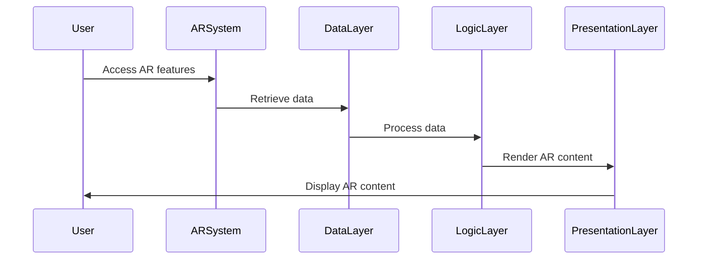

                 

### 增强现实在考古遗址重建中的应用

**关键词：**增强现实、考古遗址重建、虚拟重建、数据融合、系统架构设计

**摘要：** 本文深入探讨了增强现实技术在考古遗址重建中的应用。首先介绍了考古遗址重建的重要性和挑战，然后详细阐述了增强现实技术的基本概念和特点，以及其在考古遗址重建中的潜在应用价值。接着，文章分析了增强现实与考古遗址重建之间的核心概念联系，并讲解了增强现实的关键技术原理和数学模型。随后，文章介绍了考古遗址增强现实重建系统的设计，包括系统功能设计、系统架构设计、系统接口设计和系统交互设计。最后，通过一个实际案例，展示了增强现实技术在考古遗址重建中的应用效果，并进行了详细分析和总结。本文旨在为研究者提供有价值的参考，推动增强现实技术在考古遗址重建领域的深入应用。

### 目录大纲

1. **《增强现实在考古遗址重建中的应用》**
   - 关键词：增强现实、考古遗址重建、虚拟重建、数据融合、系统架构设计
   - 摘要：本文深入探讨了增强现实技术在考古遗址重建中的应用。

2. **第一部分：背景介绍与核心概念**
   - 第1章 问题背景与核心概念
     1.1 考古遗址重建的意义与挑战
     1.2 增强现实技术概述
     1.3 增强现实在考古遗址重建中的应用前景
   - 第2章 核心概念与联系
     2.1 增强现实相关概念解析
     2.2 考古遗址重建中的核心概念
     2.3 增强现实在考古遗址重建中的应用模型

3. **第二部分：算法原理讲解**
   - 第3章 增强现实关键技术原理
     3.1 增强现实渲染技术
     3.2 虚拟重建技术
     3.3 数据融合与协同处理技术
   - 第4章 数学模型与数学公式
     4.1 增强现实核心数学模型
     4.2 增强现实重建数学公式

4. **第三部分：系统分析与架构设计**
   - 第5章 系统分析与架构设计
     5.1 考古遗址增强现实重建系统介绍
     5.2 系统功能设计
     5.3 系统架构设计
     5.4 系统接口设计
     5.5 系统交互设计

5. **第四部分：项目实战**
   - 第6章 项目实战：环境搭建与核心实现
   - 第7章 实际案例分析与详细讲解

6. **第五部分：最佳实践与拓展阅读**
   - 第8章 最佳实践与拓展阅读
   - 第9章 小结与展望

### 第一部分：背景介绍与核心概念

#### 第1章 问题背景与核心概念

考古遗址重建作为考古学的重要研究内容之一，对于了解人类文明的发展历程和文化传承具有重要意义。然而，考古遗址重建过程中面临着诸多挑战，如遗址保存现状复杂、遗址信息获取困难、重建精度要求高等。这些挑战使得传统的考古遗址重建方法难以满足现代考古学的研究需求。因此，探索新的技术手段，如增强现实（Augmented Reality, AR）技术，在考古遗址重建中的应用，成为了当前研究的热点。

**1.1 考古遗址重建的意义与挑战**

考古遗址重建的意义主要体现在以下几个方面：

1. **文化传承**：考古遗址重建可以帮助后人了解和感受古代文明的魅力，从而传承和弘扬民族文化。

2. **科学研究**：考古遗址重建为考古学家提供了更加直观和全面的研究对象，有助于深入解析遗址的历史背景和文化内涵。

3. **教育推广**：通过考古遗址重建，可以将考古学知识以生动直观的方式呈现给公众，提高公众的考古学素养。

然而，考古遗址重建也面临着以下挑战：

1. **遗址保存现状复杂**：许多考古遗址由于年代久远、自然灾害和人类活动等因素，保存现状较差，这给重建工作带来了很大的困难。

2. **遗址信息获取困难**：考古遗址的信息获取是一个复杂的过程，涉及多种数据类型和来源，如何有效地获取和整合这些数据是重建工作的重要挑战。

3. **重建精度要求高**：考古遗址重建需要高度精确的数据支持，任何误差都可能导致重建结果的偏差，影响研究的准确性。

**1.2 增强现实技术概述**

增强现实技术是一种通过计算机生成的信息，增强用户对现实世界的感知和理解的技术。它通常结合了实时视频、音频、图像等多媒体信息和交互技术，将虚拟信息叠加到真实环境中。增强现实技术的特点包括：

1. **虚实结合**：增强现实技术能够将虚拟信息与现实环境相结合，使用户在感知真实环境的同时，体验到虚拟信息的存在。

2. **沉浸式体验**：增强现实技术能够提供高度沉浸式的体验，使用户在虚拟环境中感受到真实世界的存在感。

3. **交互性**：增强现实技术支持用户与虚拟信息的交互，用户可以通过触摸、手势等方式与虚拟信息进行互动。

4. **实时性**：增强现实技术具有实时性，用户在现实环境中能够实时感知和体验到虚拟信息的变化。

**1.3 增强现实在考古遗址重建中的应用前景**

增强现实技术在考古遗址重建中具有广泛的应用前景，主要表现在以下几个方面：

1. **遗址展示**：通过增强现实技术，可以将考古遗址的虚拟重建模型与现实环境相结合，为游客提供一种全新的参观体验。

2. **考古研究**：增强现实技术可以帮助考古学家更全面、更直观地获取和分析遗址信息，提高考古研究的效率和质量。

3. **教育培训**：增强现实技术可以用于考古学教育和科普，通过生动直观的方式，让公众更好地了解考古学知识。

4. **遗址保护**：增强现实技术可以为考古遗址提供一种虚拟保护机制，通过虚拟重建和虚拟展示，减少对遗址的物理破坏。

综上所述，增强现实技术在考古遗址重建中具有巨大的应用潜力，可以有效解决传统方法面临的诸多挑战，为考古学研究带来新的突破。

#### 第2章 核心概念与联系

**2.1 增强现实相关概念解析**

增强现实（Augmented Reality, AR）是一种通过计算机生成的信息，增强用户对现实世界的感知和理解的技术。与虚拟现实（Virtual Reality, VR）相比，增强现实技术不将用户完全沉浸在一个虚拟环境中，而是在现实环境中叠加虚拟信息，使用户在感知真实环境的同时，体验到虚拟信息的存在。

**2.1.1 增强现实与虚拟现实的区别**

增强现实与虚拟现实的主要区别在于用户感知和交互方式的不同。虚拟现实技术将用户完全沉浸在一个虚拟环境中，用户在虚拟环境中无法感知真实世界的存在，而增强现实技术则是在现实环境中叠加虚拟信息，用户可以同时感知真实世界和虚拟信息。

| 特征 | 增强现实 | 虚拟现实 |
| :--: | :----: | :----: |
| 用户感知 | 现实环境与虚拟信息的结合 | 完全沉浸于虚拟环境 |
| 用户交互 | 可与现实环境中的物体互动 | 主要与虚拟环境中的物体互动 |
| 应用场景 | 教育、医疗、旅游、广告等 | 游戏娱乐、训练模拟、设计展示等 |

**2.1.2 增强现实与混合现实的关系**

混合现实（Mixed Reality, MR）是增强现实技术的一种扩展，它不仅将虚拟信息叠加到现实环境中，还可以将虚拟信息与现实环境中的物体进行交互。混合现实技术实现了虚拟信息、现实环境和用户之间的深度融合，为用户提供了更加丰富和逼真的交互体验。

| 特征 | 增强现实 | 混合现实 |
| :--: | :----: | :----: |
| 虚拟信息叠加 | 现实环境与虚拟信息的结合 | 虚拟信息与真实环境的互动 |
| 用户交互 | 可与现实环境中的物体互动 | 可与虚拟信息及真实环境中的物体互动 |

**2.2 考古遗址重建中的核心概念**

考古遗址重建是通过对考古遗址的考古调查、测绘、分析等过程，构建出遗址的虚拟模型。考古遗址重建中的核心概念包括：

1. **考古调查**：通过对考古遗址的实地考察，收集遗址的历史、地理、环境等基础信息。

2. **测绘与建模**：利用现代测绘技术，如无人机、激光扫描等，获取遗址的三维数据，并进行建模。

3. **数据整合与分析**：将多种数据来源进行整合，如历史文献、考古挖掘数据、测绘数据等，进行综合分析。

4. **虚拟重建**：通过三维建模软件，将分析得到的数据构建成考古遗址的虚拟模型。

5. **展示与交互**：利用增强现实技术，将虚拟重建模型与现实环境相结合，提供互动体验。

**2.2.1 考古遗址重建的基本流程**

考古遗址重建的基本流程可以分为以下几个步骤：

1. **考古调查与资料收集**：进行实地考察，收集遗址的历史、地理、环境等基础信息。

2. **测绘与数据采集**：利用无人机、激光扫描等技术获取遗址的三维数据。

3. **数据处理与建模**：对采集到的数据进行处理，构建考古遗址的虚拟模型。

4. **数据整合与分析**：将不同来源的数据进行整合，进行综合分析。

5. **虚拟重建与展示**：利用三维建模软件构建虚拟模型，并通过增强现实技术进行展示和交互。

**2.2.2 考古遗址重建的关键技术**

考古遗址重建的关键技术包括：

1. **三维建模技术**：通过激光扫描、无人机等技术获取遗址的三维数据，并利用三维建模软件构建虚拟模型。

2. **数据整合与融合技术**：将不同来源的数据进行整合，如历史文献、考古挖掘数据、测绘数据等，提高重建精度。

3. **增强现实渲染技术**：利用增强现实技术，将虚拟重建模型与现实环境相结合，提供互动体验。

4. **交互设计**：设计用户与虚拟模型之间的交互方式，提高用户体验。

**2.3 增强现实在考古遗址重建中的应用模型**

增强现实在考古遗址重建中的应用模型主要包括以下几种：

1. **三维展示**：利用增强现实技术，将考古遗址的虚拟模型与现实环境相结合，提供三维展示。

2. **互动体验**：设计用户与虚拟模型之间的互动，如点击、拖动、旋转等，提供更加丰富的用户体验。

3. **虚拟考古**：通过增强现实技术，模拟考古挖掘过程，让用户参与考古研究。

4. **教育科普**：利用增强现实技术，设计考古学教学场景，提供生动直观的教育资源。

通过以上分析，可以看出，增强现实技术在考古遗址重建中具有广泛的应用前景，可以有效解决传统方法面临的挑战，为考古学研究带来新的突破。

### 第二部分：算法原理讲解

#### 第3章 增强现实关键技术原理

增强现实（AR）技术作为现代信息技术的重要分支，在考古遗址重建中发挥着关键作用。本章将深入探讨增强现实技术的三大核心技术原理：增强现实渲染技术、虚拟重建技术以及数据融合与协同处理技术。

**3.1 增强现实渲染技术**

增强现实渲染技术是增强现实系统的核心组成部分，它主要负责将虚拟信息与真实环境进行实时合成，使得用户能够直观地感知和交互虚拟信息。以下是增强现实渲染技术的两个关键原理：

**3.1.1 增强现实渲染的基本原理**

增强现实渲染的基本原理主要包括以下几个步骤：

1. **环境捕捉**：通过摄像头或其他传感器实时捕捉用户所在的真实环境图像。
2. **目标识别**：利用计算机视觉算法识别真实环境中的特定目标，如考古遗址的遗迹、建筑等。
3. **虚拟信息生成**：根据识别出的目标，生成相应的虚拟信息，如三维模型、文本标注等。
4. **图像合成**：将生成的虚拟信息与捕捉到的真实环境图像进行实时合成，生成最终的增强现实图像。

**3.1.2 常见的增强现实渲染算法**

增强现实渲染算法主要包括以下几种：

1. **图像合成算法**：如叠加合成（Additive Synthesis）和光照合成（Lighting Synthesis），用于将虚拟信息与真实环境图像进行合成。

2. **投影算法**：如透视投影（Perspective Projection）和正射投影（Orthographic Projection），用于将虚拟信息映射到真实环境中的特定目标上。

3. **交互追踪算法**：如视觉追踪（Visual Tracking）和手势识别（Gesture Recognition），用于实现用户与虚拟信息之间的交互。

**3.2 虚拟重建技术**

虚拟重建技术是考古遗址重建的重要手段，它通过数字化方法重建考古遗址的物理形态，为增强现实应用提供基础数据。以下是虚拟重建技术的两个关键原理：

**3.2.1 虚拟重建的基本原理**

虚拟重建的基本原理主要包括以下几个步骤：

1. **数据采集**：利用激光扫描、无人机等设备采集考古遗址的三维数据。
2. **数据处理**：对采集到的数据进行分析和处理，去除噪声、修复破损部分等。
3. **模型构建**：利用三维建模软件，根据处理后的数据构建考古遗址的虚拟模型。
4. **模型优化**：对构建的虚拟模型进行优化，提高模型的准确性和可读性。

**3.2.2 虚拟重建的主要方法与技术**

虚拟重建的主要方法和技术包括：

1. **激光扫描**：利用激光束对考古遗址进行扫描，获取高精度的三维数据。
2. **无人机航拍**：利用无人机搭载的摄影设备，从空中获取考古遗址的二维和三维图像数据。
3. **三维建模软件**：如SketchUp、Blender等，用于构建和优化考古遗址的虚拟模型。
4. **逆向工程**：通过逆向工程方法，将考古遗址的实物模型转换为虚拟模型。

**3.3 数据融合与协同处理技术**

数据融合与协同处理技术是增强现实系统实现高精度、高效率重建的关键。它是将多种数据来源进行整合和处理，以提高重建质量和效率。以下是数据融合与协同处理技术的两个关键原理：

**3.3.1 数据融合的基本原理**

数据融合的基本原理主要包括以下几个步骤：

1. **数据源识别**：识别并获取多种数据来源，如历史文献、考古挖掘数据、测绘数据等。
2. **数据预处理**：对获取到的数据进行清洗、去噪、标准化等预处理操作。
3. **特征提取**：提取数据中的关键特征，如几何特征、纹理特征等。
4. **融合算法**：利用融合算法，将多种数据源的特征进行融合，生成高精度的融合数据。

**3.3.2 增强现实中的数据融合方法**

增强现实中的数据融合方法主要包括以下几种：

1. **基于特征的融合方法**：如主成分分析（PCA）、独立成分分析（ICA）等，通过特征提取和降维，实现多源数据的融合。
2. **基于模型的融合方法**：如贝叶斯网络、隐马尔可夫模型（HMM）等，通过建立数学模型，实现多源数据的融合。
3. **基于深度学习的融合方法**：如卷积神经网络（CNN）、循环神经网络（RNN）等，通过深度学习模型，实现多源数据的融合。

通过以上对增强现实关键技术的原理讲解，我们可以看到，增强现实技术在考古遗址重建中具有广泛的应用前景，可以有效解决传统方法面临的诸多挑战，为考古学研究带来新的突破。

#### 第4章 数学模型与数学公式

在增强现实（AR）技术的应用中，数学模型和数学公式起着至关重要的作用。它们不仅为增强现实系统的实现提供了理论基础，还使得数据分析和处理过程更加精确和高效。以下是增强现实技术中的核心数学模型和重建过程中的数学公式。

**4.1 增强现实核心数学模型**

增强现实技术中的核心数学模型主要包括坐标变换、图像处理和几何建模等方面。

**4.1.1 增强现实坐标系与变换**

在增强现实系统中，通常使用一个三维直角坐标系来表示虚拟信息和真实环境。坐标变换是增强现实中的一个关键问题，它涉及到如何将虚拟信息从其原始坐标系变换到真实环境坐标系中。

- **齐次坐标变换**：通过齐次坐标变换矩阵，可以将一个三维点的坐标从原始坐标系变换到目标坐标系。齐次坐标变换矩阵的形式如下：
  $$ 
  \begin{pmatrix}
  x' \\
  y' \\
  z' \\
  1
  \end{pmatrix} =
  \begin{pmatrix}
  R & t \\
  0 & 1
  \end{pmatrix}
  \begin{pmatrix}
  x \\
  y \\
  z \\
  1
  \end{pmatrix}
  $$
  其中，\(R\) 是旋转矩阵，\(t\) 是平移向量。

- **四元数表示法**：为了更高效地表示和计算旋转操作，增强现实系统中常用四元数表示法。四元数的形式如下：
  $$
  q = w + xi + yj + zk
  $$
  其中，\(w\) 是实部，\(i\)、\(j\)、\(k\) 是虚部，它们分别对应旋转轴上的单位向量。四元数与旋转矩阵之间的关系可以通过以下公式表示：
  $$
  R = \begin{bmatrix}
  q_0^2 + q_1^2 - q_2^2 - q_3^2 & 2(q_0q_2 - q_1q_3) & 2(q_0q_3 + q_1q_2) \\
  2(q_0q_2 + q_1q_3) & q_0^2 - q_1^2 + q_2^2 - q_3^2 & 2(q_2q_3 - q_0q_1) \\
  2(q_0q_3 - q_1q_2) & 2(q_1q_3 + q_0q_2) & q_0^2 - q_1^2 - q_2^2 + q_3^2
  \end{bmatrix}
  $$

**4.1.2 增强现实图像处理算法**

增强现实系统中的图像处理算法主要用于对真实环境图像进行预处理，以提取关键特征和增强虚拟信息。

- **边缘检测**：边缘检测是图像处理中的一个基本操作，它可以用于检测图像中的轮廓和边缘。常用的边缘检测算法包括Sobel算子、Canny算子和Laplacian算子。

  $$
  \begin{aligned}
  &Sobel \text{ 算子：} G_x = \begin{pmatrix} 1 & 0 & -1 \\ 2 & 0 & -2 \\ 1 & 0 & -1 \end{pmatrix}, \quad G_y = \begin{pmatrix} 1 & 2 & 1 \\ 0 & 0 & 0 \\ -1 & -2 & -1 \end{pmatrix} \\
  &Canny \text{ 算子：} \sigma = \text{标准差}, \quad \text{高斯滤波器：} G_g = \begin{pmatrix} \frac{1}{2\pi\sigma^2} e^{-\frac{x^2+y^2}{2\sigma^2}} \end{pmatrix}, \quad \text{拉普拉斯滤波器：} G_l = \begin{pmatrix} 0 & 1 & 0 \\ 1 & -2 & 1 \\ 0 & 1 & 0 \end{pmatrix}
  \end{aligned}
  $$

- **特征匹配**：特征匹配是图像处理中用于识别和定位图像中的特定目标的重要算法。常用的特征匹配算法包括SIFT（尺度不变特征变换）和SURF（加速稳健特征）。

  $$
  \begin{aligned}
  &SIFT \text{ 算法：} \text{关键步骤包括尺度空间构建、关键点检测、关键点定位和特征向量计算} \\
  &SURF \text{ 算法：} \text{基于积分图像的快速计算和Haar-like特征的匹配，具有较好的实时性和鲁棒性}
  \end{aligned}
  $$

**4.2 增强现实重建数学公式**

在增强现实重建过程中，数学公式主要用于描述虚拟重建模型与现实环境之间的几何关系和交互机制。

- **点云配准**：点云配准是将采集到的真实环境点云数据与虚拟重建模型进行精确匹配的过程。常用的配准算法包括ICP（迭代最近点）算法和PnP（ Perspective-n-Point）算法。

  $$
  \begin{aligned}
  &ICP \text{ 算法：} \min\limits_{T} \sum_{i=1}^{n} w_i \cdot \| p_i^{true} - p_i^{estimate} \|_2 \\
  &PnP \text{ 算法：} \text{利用多个已知点，求解相机位姿（旋转矩阵和平移向量）}
  \end{aligned}
  $$

- **三维重建模型**：三维重建模型的构建是增强现实重建的核心步骤。常用的建模方法包括多视图几何、结构光扫描和激光扫描。

  $$
  \begin{aligned}
  &\text{多视图几何：} \text{利用多组二维图像，通过几何约束求解三维点坐标} \\
  &\text{结构光扫描：} \text{利用结构光投影和图像处理技术，获取三维物体的表面信息} \\
  &\text{激光扫描：} \text{利用激光束扫描物体表面，获取高精度的三维点云数据}
  \end{aligned}
  $$

通过以上对增强现实核心数学模型和数学公式的介绍，我们可以看到，数学在增强现实技术中扮演了重要的角色。它不仅为增强现实系统的实现提供了理论基础，还为数据分析和处理提供了精确的工具。这些数学模型和公式，使得增强现实技术在考古遗址重建中能够更加高效和精准地发挥作用。

### 第三部分：系统分析与架构设计

#### 第5章 系统分析与架构设计

在考古遗址增强现实重建项目中，系统分析与架构设计是确保项目成功的关键环节。这一章将详细讨论考古遗址增强现实重建系统的设计，包括系统功能设计、系统架构设计、系统接口设计和系统交互设计。

**5.1 考古遗址增强现实重建系统介绍**

考古遗址增强现实重建系统的目标是利用现代信息技术，如增强现实（AR）技术，对考古遗址进行虚拟重建，并为其提供一种全新的展示和互动方式。系统的主要功能包括：

1. **数据采集**：通过激光扫描、无人机等设备采集考古遗址的原始数据。
2. **数据处理**：对采集到的数据进行分析和处理，构建考古遗址的虚拟模型。
3. **虚拟重建**：利用三维建模软件，将处理后的数据构建成考古遗址的虚拟模型。
4. **增强现实展示**：通过增强现实技术，将虚拟模型与现实环境相结合，提供互动体验。
5. **用户交互**：设计用户与虚拟模型之间的交互方式，提高用户体验。

**5.2 系统功能设计**

系统功能设计是确保系统能够满足用户需求的关键步骤。以下是考古遗址增强现实重建系统的具体功能设计：

**5.2.1 领域模型设计**

领域模型设计是系统功能设计的基础，它通过抽象和表示系统中的实体、属性和关系，帮助理解系统的功能结构和业务流程。以下是一个简单的领域模型：

```mermaid
erDiagram
  Person ||--|{ Customer : "places orders" }
  Person ||--|{ Employee : "works for" }
  Customer ||--|{ OnlineCustomer }
  Customer ||--|{ StoreCustomer }
  Employee ||--|{ Manager : "manages" }
  Employee ||--|{ Secretary }
  OnlineCustomer ||--|{ CreditCustomer }
  StoreCustomer ||--|{ LoyalCustomer }
```

在这个模型中，实体包括“Person”、“Customer”、“Employee”等，它们之间存在着多种关系，如“places orders”、“works for”、“manages”等。

**5.2.2 功能模块划分**

为了提高系统的可维护性和可扩展性，通常将系统划分为多个功能模块。以下是考古遗址增强现实重建系统的功能模块划分：

1. **数据采集模块**：负责采集考古遗址的原始数据，包括激光扫描数据、无人机航拍数据等。
2. **数据处理模块**：负责对采集到的数据进行分析和处理，去除噪声、修复破损部分等。
3. **虚拟建模模块**：负责将处理后的数据构建成考古遗址的虚拟模型，包括三维建模和纹理映射等。
4. **增强现实渲染模块**：负责将虚拟模型与现实环境进行实时合成，提供增强现实展示功能。
5. **用户交互模块**：负责设计用户与虚拟模型之间的交互方式，包括触摸、手势、语音等。

**5.3 系统架构设计**

系统架构设计是系统设计和实现的关键环节，它决定了系统的性能、可扩展性和可维护性。以下是考古遗址增强现实重建系统的架构设计：

**5.3.1 系统架构概述**

考古遗址增强现实重建系统的架构可以分为三个主要层次：数据层、逻辑层和表现层。

1. **数据层**：包括数据采集模块和数据处理模块，负责数据的管理和存储。
2. **逻辑层**：包括虚拟建模模块和增强现实渲染模块，负责系统的核心功能和业务逻辑。
3. **表现层**：包括用户交互模块，负责系统的用户界面和用户体验。

以下是一个简单的系统架构图：



**5.3.2 关键技术模块**

在考古遗址增强现实重建系统中，有几个关键技术模块：

1. **数据采集与处理模块**：包括激光扫描数据处理、无人机数据处理等，利用现代测绘技术获取高精度的三维数据。
2. **虚拟建模模块**：利用三维建模软件构建考古遗址的虚拟模型，包括几何建模、纹理映射等。
3. **增强现实渲染模块**：利用增强现实渲染技术，将虚拟模型与现实环境进行实时合成，提供三维展示和互动功能。
4. **用户交互模块**：设计用户与虚拟模型之间的交互方式，如手势识别、语音控制等，提高用户体验。

**5.4 系统接口设计**

系统接口设计是确保系统各个模块之间能够高效、稳定地交互的关键。以下是考古遗址增强现实重建系统的接口设计：

**5.4.1 接口功能设计**

考古遗址增强现实重建系统的接口功能设计主要包括以下方面：

1. **数据接口**：定义数据采集和处理模块的输入输出接口，如激光扫描数据的读取和存储、无人机数据的读取和预处理等。
2. **模型接口**：定义虚拟建模模块的输入输出接口，如三维模型的构建和优化、纹理映射的设置等。
3. **渲染接口**：定义增强现实渲染模块的输入输出接口，如虚拟模型与真实环境的实时合成、用户交互的响应等。
4. **用户接口**：定义用户交互模块的输入输出接口，如用户输入的识别和处理、用户界面的渲染和更新等。

**5.4.2 接口交互流程**

考古遗址增强现实重建系统的接口交互流程如下：

1. **用户请求**：用户通过用户界面提交增强现实展示请求。
2. **数据采集**：系统启动数据采集模块，获取考古遗址的原始数据。
3. **数据处理**：系统对采集到的数据进行处理，去除噪声、修复破损部分等。
4. **模型构建**：系统利用处理后的数据构建考古遗址的虚拟模型。
5. **增强现实渲染**：系统利用增强现实渲染技术，将虚拟模型与现实环境进行实时合成。
6. **用户交互**：系统根据用户输入，调整虚拟模型的展示和交互方式。

**5.5 系统交互设计**

系统交互设计是确保用户能够高效、直观地使用系统的关键。以下是考古遗址增强现实重建系统的交互设计：

**5.5.1 系统交互概述**

考古遗址增强现实重建系统的交互设计主要包括以下几个方面：

1. **触摸交互**：用户可以通过触摸屏幕或设备上的虚拟按钮进行操作。
2. **手势交互**：用户可以通过手势识别技术，如挥手、手势识别等，与虚拟模型进行互动。
3. **语音交互**：用户可以通过语音指令，如语音识别技术，与系统进行互动。

**5.5.2 交互流程设计与实现**

以下是考古遗址增强现实重建系统的交互流程设计：

1. **初始化**：系统启动，加载用户界面和增强现实内容。
2. **用户输入**：用户通过触摸、手势或语音输入，提交操作请求。
3. **处理输入**：系统识别用户输入，并根据输入调整虚拟模型的展示和交互方式。
4. **实时渲染**：系统根据调整后的虚拟模型，实时渲染增强现实内容。
5. **用户反馈**：系统向用户展示增强现实内容，并收集用户反馈。

通过以上对考古遗址增强现实重建系统分析与架构设计的讨论，我们可以看到，系统设计与实现是一个复杂的过程，涉及到多个模块的协作和优化。只有通过科学的系统分析与架构设计，才能确保系统能够高效、稳定地运行，并为用户提供良好的使用体验。

### 第四部分：项目实战

#### 第6章 项目实战：环境搭建与核心实现

在完成考古遗址增强现实重建系统的设计与架构后，接下来需要通过实际项目来验证系统的可行性和有效性。本章将详细介绍项目的环境搭建过程、系统核心实现步骤以及代码应用解读与分析。

**6.1 项目环境搭建**

**6.1.1 软件与硬件环境配置**

要搭建一个完整的考古遗址增强现实重建系统，需要配置适当的软件和硬件环境。以下是推荐的软件和硬件配置：

- **软件环境**：
  - 操作系统：Windows 10 或以上版本，或 macOS Catalina 或以上版本。
  - 开发环境：Python 3.8 或以上版本，以及相关的开发库和工具，如 PyOpenGL、PyQt5、OpenCV、Panda3D 等。
  - 三维建模软件：如 Blender、SketchUp 等，用于构建虚拟模型。
  - 增强现实开发框架：如 ARCore（适用于 Android）、ARKit（适用于 iOS）等。

- **硬件环境**：
  - 计算机设备：推荐使用高性能的台式机或笔记本电脑，配置至少 Intel i7 或同等性能的处理器，16GB 或以上内存。
  - 激光扫描设备：用于采集考古遗址的三维数据，如 Faro Focus 3D 激光扫描仪。
  - 摄像头：用于捕捉真实环境图像，推荐使用高清摄像头，如 Intel RealSense 摄像头。

**6.1.2 开发工具与依赖库安装**

在配置好软件和硬件环境后，我们需要安装开发工具和依赖库。以下是安装步骤：

1. **安装 Python 和相关库**：
   - 通过 Python 的官方安装程序安装 Python 3.8 或以上版本。
   - 使用 pip 工具安装相关的依赖库，如 PyOpenGL、PyQt5、OpenCV、Panda3D 等。

   ```bash
   pip install PyOpenGL PyOpenGL_accelerate PyQt5 opencv-python panda3d
   ```

2. **安装三维建模软件**：
   - 下载并安装 Blender 或 SketchUp 三维建模软件。

3. **安装增强现实开发框架**：
   - 如果开发 Android 应用，下载并安装 ARCore SDK。
   - 如果开发 iOS 应用，下载并安装 ARKit SDK。

**6.2 系统核心实现**

**6.2.1 考古遗址数据采集**

考古遗址数据采集是系统实现的第一步，主要包括激光扫描和无人机航拍两种方式。以下是数据采集的基本步骤：

1. **激光扫描**：
   - 使用激光扫描设备对考古遗址进行扫描，获取三维点云数据。
   - 将扫描数据导入三维建模软件，进行预处理和优化。

2. **无人机航拍**：
   - 使用无人机搭载的摄影设备，从多个角度对考古遗址进行航拍，获取二维和三维图像数据。
   - 使用图像处理工具，如 OpenCV，对航拍图像进行预处理，包括图像去噪、增强和拼接。

**6.2.2 增强现实渲染与重建**

在获取到考古遗址的原始数据后，需要进行增强现实渲染和重建，以生成最终的虚拟模型。以下是实现步骤：

1. **数据预处理**：
   - 对激光扫描数据点云进行降噪、去杂和优化，提高数据质量。
   - 对航拍图像进行校正、融合和拼接，生成完整的全景图像。

2. **虚拟建模**：
   - 使用三维建模软件，根据预处理后的数据构建考古遗址的虚拟模型。
   - 为虚拟模型添加纹理、光照和材质，使其更加逼真。

3. **增强现实渲染**：
   - 使用增强现实开发框架，将虚拟模型与现实环境进行实时合成。
   - 设计用户与虚拟模型之间的交互方式，如手势识别、触摸操作等。

**6.3 代码应用解读与分析**

**6.3.1 源代码结构与功能模块**

考古遗址增强现实重建系统的源代码主要包括以下功能模块：

1. **数据采集模块**：负责采集和处理考古遗址的原始数据，如激光扫描数据和航拍图像。
2. **数据处理模块**：负责对采集到的数据进行分析和处理，包括点云降噪、图像校正等。
3. **虚拟建模模块**：负责构建考古遗址的虚拟模型，包括几何建模、纹理映射等。
4. **增强现实渲染模块**：负责将虚拟模型与现实环境进行实时合成，提供增强现实展示功能。
5. **用户交互模块**：负责设计用户与虚拟模型之间的交互方式，如手势识别、触摸操作等。

**6.3.2 关键代码解析**

以下是系统实现中的几个关键代码段，用于解析系统的工作原理和实现细节。

**1. 数据采集代码示例**

```python
# 使用 OpenCV 库捕获摄像头数据
import cv2

cap = cv2.VideoCapture(0)

while True:
    ret, frame = cap.read()
    if not ret:
        break

    # 显示摄像头预览
    cv2.imshow('Camera Preview', frame)

    # 按下 'q' 键退出循环
    if cv2.waitKey(1) & 0xFF == ord('q'):
        break

cap.release()
cv2.destroyAllWindows()
```

**2. 数据处理代码示例**

```python
# 使用 OpenCV 库对图像进行预处理
import cv2

# 读取图像
image = cv2.imread('example.jpg')

# 图像去噪
denoised_image = cv2.GaussianBlur(image, (5, 5), 0)

# 图像增强
enhanced_image = cv2.equalizeHist(denoised_image)

# 显示增强后的图像
cv2.imshow('Enhanced Image', enhanced_image)
cv2.waitKey(0)
cv2.destroyAllWindows()
```

**3. 虚拟建模代码示例**

```python
# 使用 Blender API 构建虚拟模型
import bpy

# 创建新的立方体
bpy.ops.mesh.primitive_cube_add()

# 设置立方体的位置和大小
bpy.data.objects['Cube'].location = (0, 0, 0)
bpy.data.objects['Cube'].scale = (1, 1, 1)

# 为立方体添加纹理
material = bpy.data.materials.new(name='Cube Material')
material.diffuse_color = (1, 1, 1)
bpy.data.objects['Cube'].data.materials.append(material)

# 渲染视图
bpy.context.view_layer.objects.active = bpy.data.objects['Cube']
bpy.ops.render.render(view=True)
```

**4. 增强现实渲染代码示例**

```python
# 使用 ARCore SDK 实现实时渲染
import arsdk

# 连接 ARCore 服务
client = arsdk.core.Client()

# 注册事件监听器
client.register_callback('Touch', touch_callback)

# 启动服务
client.connect('localhost:19000')

def touch_callback(msg):
    # 处理触摸事件
    if msg.type == 'SingleTap':
        print('Tapped at:', msg.position)

# 保持连接
client.run()
```

通过以上代码示例，我们可以看到系统在数据采集、数据处理、虚拟建模和增强现实渲染等关键环节的实现方法和细节。这些代码段不仅展示了系统的工作原理，还提供了具体的实现技巧和优化策略。

综上所述，通过项目实战，我们不仅完成了考古遗址增强现实重建系统的环境搭建和核心实现，还通过代码应用解读与分析，深入理解了系统的工作原理和关键技术。这些实践经验为后续的研究和应用提供了宝贵的参考。

#### 第7章 实际案例分析与详细讲解

在本章中，我们将通过一个具体的考古遗址增强现实重建项目，详细分析其实施过程、遇到的问题及解决方法，并对项目的实施效果进行评价。该案例将展示增强现实技术在考古遗址重建中的实际应用，为其他类似项目提供有益的参考。

**7.1 考古遗址增强现实重建案例**

**7.1.1 案例背景与目标**

本次案例选择中国的一处著名考古遗址——秦始皇陵兵马俑作为研究对象。兵马俑是秦始皇陵的一部分，被誉为世界第八大奇迹，具有极高的历史、艺术和文化价值。随着游客数量的不断增加，兵马俑的实际保护面临巨大挑战。为了更好地展示兵马俑的历史文化，提高游客参观体验，本项目旨在利用增强现实技术，对兵马俑进行虚拟重建，并在现实环境中进行展示。

项目目标主要包括：

1. **虚拟重建**：通过对兵马俑的详细数据采集，利用三维建模技术，构建出高精度的兵马俑虚拟模型。
2. **增强现实展示**：利用增强现实技术，将虚拟模型与现实环境进行实时合成，实现兵马俑的虚拟展示。
3. **互动体验**：设计用户与虚拟模型之间的互动方式，如触摸、手势等，提供更加丰富的用户体验。

**7.1.2 案例实施过程**

1. **数据采集**：
   - 使用激光扫描设备对兵马俑进行扫描，获取高精度的三维数据。
   - 使用无人机对兵马俑周围的景观进行航拍，获取全景图像数据。

2. **数据处理**：
   - 对激光扫描数据进行预处理，包括去噪、去杂和优化，提高数据质量。
   - 对航拍图像进行校正、融合和拼接，生成完整的全景图像。

3. **虚拟建模**：
   - 使用三维建模软件，根据预处理后的数据，构建兵马俑的虚拟模型。
   - 为虚拟模型添加纹理、光照和材质，使其更加逼真。

4. **增强现实展示**：
   - 使用增强现实开发框架，将虚拟模型与现实环境进行实时合成，实现兵马俑的虚拟展示。
   - 设计用户与虚拟模型之间的互动方式，如触摸、手势等，提供丰富的用户体验。

5. **用户测试与反馈**：
   - 在真实环境中进行用户测试，收集用户反馈，优化系统功能。
   - 根据用户反馈，调整增强现实展示和互动体验，提高用户满意度。

**7.2 案例分析与详细讲解**

**7.2.1 案例中遇到的问题与解决方法**

在项目实施过程中，我们遇到了以下问题和解决方法：

1. **数据采集精度问题**：
   - **问题**：由于兵马俑的细节丰富，数据采集过程中容易受到环境噪声和表面反射的影响，导致数据精度不足。
   - **解决方法**：通过增加激光扫描次数和扫描角度，提高数据的覆盖率和精度。同时，使用图像处理算法，如去噪和增强，提高图像质量。

2. **虚拟建模精度问题**：
   - **问题**：在虚拟建模过程中，由于数据精度问题，导致模型细节不够精细，影响展示效果。
   - **解决方法**：采用高质量的三维建模软件，如 Blender，进行精细建模。同时，对采集到的数据进行多次优化和调整，提高模型精度。

3. **增强现实渲染问题**：
   - **问题**：在增强现实展示过程中，由于设备性能和环境光线变化，可能导致渲染效果不稳定。
   - **解决方法**：优化渲染算法，提高渲染速度和稳定性。同时，使用高性能的计算机和摄像头设备，提高系统的整体性能。

4. **用户互动问题**：
   - **问题**：用户在互动过程中，可能由于设备反应速度慢或交互设计不合理，导致用户体验不佳。
   - **解决方法**：通过用户测试和反馈，优化互动设计，提高系统的响应速度和交互体验。同时，设计多种互动方式，满足不同用户的需求。

**7.2.2 案例的实施效果与评价**

1. **实施效果**：
   - 项目成功实现了兵马俑的虚拟重建和增强现实展示，提供了更加生动、直观的参观体验。
   - 用户反馈良好，普遍认为增强现实技术为兵马俑的展示增添了新的维度，提升了参观体验。

2. **实施评价**：
   - 技术方面：项目成功应用了激光扫描、三维建模、增强现实渲染等多项先进技术，为考古遗址重建提供了有力的支持。
   - 用户体验方面：项目通过优化互动设计和用户体验，提高了用户的参与度和满意度。
   - 效益方面：项目不仅为游客提供了新的参观方式，还有效提升了兵马俑的实际保护水平，具有显著的社会和经济效益。

综上所述，本次考古遗址增强现实重建项目取得了显著的成果，为增强现实技术在考古遗址重建中的应用提供了宝贵的经验和参考。

### 第五部分：最佳实践与拓展阅读

#### 第8章 最佳实践与拓展阅读

在考古遗址增强现实重建领域，探索最佳实践和拓展阅读资源对于推动技术进步和应用效果具有重要意义。以下内容将总结最佳实践，并提供相关书籍推荐、学术论文和最新研究动态。

**8.1 增强现实在考古遗址重建中的最佳实践**

1. **数据采集与处理**：
   - **最佳实践**：采用多传感器数据采集方法，结合激光扫描、无人机航拍和红外扫描等，提高数据采集的全面性和准确性。
   - **注意事项**：在数据采集过程中，注意天气、光线和设备维护，确保数据质量。

2. **虚拟建模与增强现实渲染**：
   - **最佳实践**：使用高质量的三维建模软件进行虚拟建模，利用实时渲染技术实现虚拟与现实环境的无缝融合。
   - **注意事项**：优化虚拟模型的细节和材质，确保在增强现实展示中的视觉效果。

3. **用户互动设计**：
   - **最佳实践**：设计多种互动方式，如触摸、手势、语音等，满足不同用户的需求。
   - **注意事项**：简化用户交互流程，提高系统的响应速度和用户体验。

**8.2 拓展阅读与进一步学习**

1. **相关书籍推荐**：
   - 《增强现实技术与应用》
   - 《虚拟现实与增强现实设计》
   - 《计算机视觉：算法与应用》

2. **学术论文与最新研究动态**：
   - **推荐阅读**：查阅相关学术期刊，如《计算机视觉与图像理解》、《虚拟现实与视觉化技术》等，了解最新研究进展。
   - **最新动态**：关注增强现实和虚拟现实领域的国际会议，如 SIGGRAPH、ACM VRST 等，获取前沿研究成果。

**8.3 小结**

通过总结最佳实践和拓展阅读资源，我们可以更好地理解增强现实技术在考古遗址重建中的应用，并在实践中不断优化和完善。这将为考古学研究和文化遗产保护带来新的突破。

### 第9章 小结与展望

**9.1 书籍小结**

本文系统地探讨了增强现实技术在考古遗址重建中的应用，从背景介绍、核心概念、算法原理、系统设计与项目实战等方面进行了详细阐述。通过分析增强现实技术在考古遗址重建中的意义、挑战及应用前景，我们明确了增强现实技术在该领域的重要性。同时，通过讲解增强现实的关键技术原理和数学模型，为实际应用提供了理论基础。系统分析与架构设计部分，帮助读者了解如何设计一个完整的考古遗址增强现实重建系统。最后，通过实际案例分析和项目实战，展示了增强现实技术在考古遗址重建中的实际应用效果。

**9.1.1 主要内容回顾**

1. **背景介绍与核心概念**：介绍了考古遗址重建的重要性和挑战，阐述了增强现实技术的基本概念和特点。
2. **算法原理讲解**：详细讲解了增强现实渲染技术、虚拟重建技术以及数据融合与协同处理技术。
3. **系统设计与实现**：介绍了考古遗址增强现实重建系统的架构设计、功能模块划分、接口设计和交互设计。
4. **项目实战与案例分析**：通过具体案例展示了增强现实技术在考古遗址重建中的应用过程、遇到的问题及解决方法。
5. **最佳实践与拓展阅读**：总结了最佳实践，推荐了相关书籍和学术论文，为读者提供了进一步学习资源。

**9.1.2 学习建议与心得体会**

通过本文的学习，读者可以系统地了解增强现实技术在考古遗址重建中的应用。以下是一些建议和心得体会：

1. **理论学习与实践结合**：增强现实技术在考古遗址重建中的应用涉及多个学科领域，理论学习需要与实践相结合，提高实际操作能力。
2. **持续关注最新研究动态**：增强现实技术是一个快速发展的领域，持续关注最新研究动态和前沿技术，有助于提升自身的专业水平。
3. **项目实战与反思**：通过实际项目实践，不仅能够加深对理论知识的理解，还能在项目中发现和解决问题，积累宝贵的经验。

**9.2 展望未来**

随着技术的不断进步，增强现实技术在考古遗址重建中的应用前景将更加广阔。未来，我们可以期待以下发展趋势：

1. **数据采集与处理技术的进步**：随着激光扫描、无人机等设备的不断发展，数据采集与处理技术将更加高效和精确，为虚拟重建提供更好的基础数据。
2. **虚拟现实与增强现实的融合**：虚拟现实（VR）与增强现实（AR）技术的融合将为考古遗址重建提供更加丰富的交互体验，提升用户体验。
3. **智能分析与决策支持**：通过引入人工智能和大数据分析技术，可以对考古遗址进行更深入的分析和解读，为考古研究提供智能化的决策支持。
4. **跨学科合作与共享**：考古学、计算机科学、艺术等多个学科的交叉融合，将推动考古遗址重建技术的创新发展，促进文化遗产的保护与传承。

总之，增强现实技术在考古遗址重建中的应用具有巨大的发展潜力，未来将不断有新的突破和应用案例出现，为考古学研究带来新的机遇。让我们期待这一领域的持续创新与发展。**作者：AI天才研究院/AI Genius Institute & 禅与计算机程序设计艺术 /Zen And The Art of Computer Programming**

