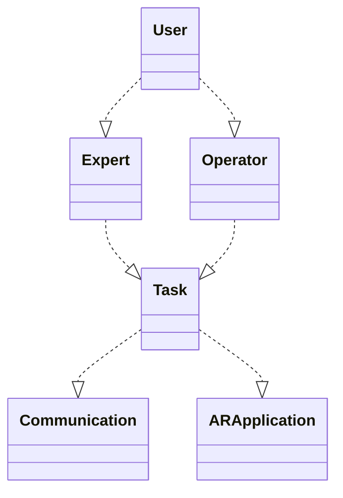
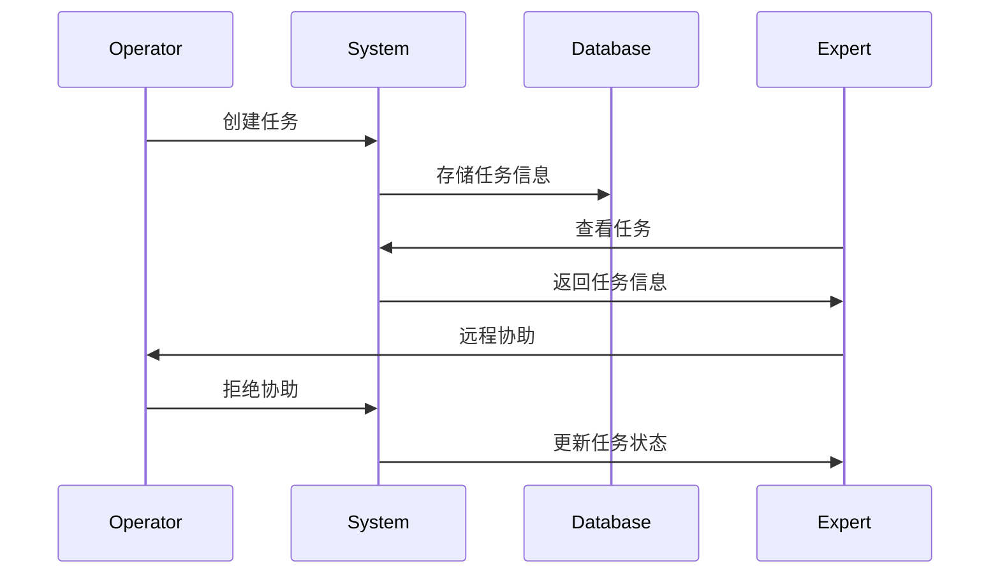

                 

### 增强现实在远程专家协助中的实时应用

> **关键词**：增强现实、远程专家协助、实时互动、数据传输、数据处理、人机交互

> **摘要**：本文探讨了增强现实技术在远程专家协助中的实时应用，分析了相关核心概念与原理，详细讲解了数据传输、数据处理和人机交互算法，并通过实际项目案例进行了深入剖析。文章旨在为读者提供全面的技术指导，推动增强现实技术在远程专家协助领域的广泛应用。

## 第一部分：背景介绍

### 第1章：问题背景与问题描述

#### 1.1 问题背景

随着全球信息化进程的不断加速，远程专家协助逐渐成为许多行业解决复杂问题和提高工作效率的重要手段。然而，传统的远程协助方式往往存在交互效率低、实时性不足等问题，难以满足实际需求。增强现实（AR）技术的兴起，为远程专家协助带来了新的机遇。AR技术能够将虚拟信息与现实场景进行叠加，实现直观、实时且高效的交互方式，从而提高远程专家协助的效果。

#### 1.2 问题描述

在远程专家协助中，实现实时应用的关键在于以下几个方面：

1. **高效数据传输**：远程专家协助需要实时传输大量的数据，包括视频、音频、图像等，如何高效地传输和处理这些数据，确保实时性，是一个重要问题。

2. **优化人机交互**：人机交互的体验直接影响远程专家协助的效率。如何设计简单易用的人机交互界面，提高用户满意度，是另一个关键问题。

3. **确保系统稳定性**：在复杂的网络环境下，如何保证系统的稳定性和可靠性，避免因网络延迟或设备故障而影响协作效果，也是亟待解决的问题。

#### 1.3 问题解决

为了解决上述问题，本文将围绕增强现实技术在远程专家协助中的实时应用进行深入探讨。通过分析当前的技术现状和发展趋势，介绍实现实时应用的技术原理和方法，以及在实际项目中如何进行应用和优化。

### 1.4 边界与外延

本文所讨论的远程专家协助主要涉及以下边界与外延：

- **边界**：本文仅关注增强现实技术在远程专家协助中的实时应用，不包括其他技术手段的应用。

- **外延**：本文不仅关注技术实现，还将探讨增强现实技术在远程专家协助中的实际应用场景和效益。

### 1.5 概念结构与核心要素组成

为了更好地理解本文的内容，我们首先需要明确以下几个核心概念和要素：

- **增强现实（AR）技术**：通过计算机生成信息与真实世界场景进行叠加，使用户能够直观地感知信息。

- **远程专家协助**：通过互联网实现远程专家与现场操作人员之间的实时互动和协作。

- **实时应用**：在远程专家协助过程中，实现信息的实时传输、处理和反馈，以提高协作效率。

### 第2章：核心概念与联系

#### 2.1 增强现实技术原理

##### 2.1.1 增强现实技术定义

增强现实技术（Augmented Reality，AR）是一种将虚拟信息与现实世界进行叠加的技术，通过计算机生成的信息与真实场景相结合，使用户能够直观地感知信息。

##### 2.1.2 增强现实技术核心特点

- **实时性**：增强现实技术能够实时地生成和更新虚拟信息，与真实场景同步。

- **交互性**：用户可以通过手势、语音等交互方式与虚拟信息进行交互。

- **沉浸性**：增强现实技术能够将虚拟信息与真实场景无缝融合，使用户产生沉浸式体验。

#### 2.2 远程专家协助原理

##### 2.2.1 远程专家协助定义

远程专家协助是一种通过互联网实现远程专家与现场操作人员之间实时互动和协作的方式，以提高工作效率和解决复杂问题。

##### 2.2.2 远程专家协助核心特点

- **实时互动**：远程专家与现场操作人员之间可以实时沟通、交流，共享信息。

- **高效协作**：远程专家可以远程指导现场操作人员，提高问题解决的效率和准确性。

- **灵活性**：远程专家协助不受地理位置限制，可以随时随地进行协作。

#### 2.3 实时应用原理

##### 2.3.1 实时应用定义

实时应用是指在远程专家协助过程中，实现信息的实时传输、处理和反馈，以提高协作效率。

##### 2.3.2 实时应用核心特点

- **实时性**：信息的传输、处理和反馈能够在极短时间内完成，确保协作的实时性。

- **高效性**：实时应用可以减少信息传递的延迟，提高协作效率。

- **稳定性**：在实时应用中，确保系统的稳定性和可靠性，避免因网络延迟或设备故障而影响协作效果。

### 第3章：算法原理讲解

#### 3.1 数据传输算法

##### 3.1.1 数据传输算法定义

数据传输算法是指在远程专家协助过程中，如何高效、稳定地传输数据，确保实时性。

##### 3.1.2 数据传输算法核心特点

- **高效性**：采用合适的传输协议和压缩算法，提高数据传输速度。

- **稳定性**：在复杂的网络环境下，保证数据传输的稳定性。

#### 3.2 数据处理算法

##### 3.2.1 数据处理算法定义

数据处理算法是指在远程专家协助过程中，如何对传输来的数据进行实时处理，为用户提供有效的信息。

##### 3.2.2 数据处理算法核心特点

- **实时性**：在极短的时间内完成数据处理，确保实时性。

- **准确性**：确保处理结果准确无误，为用户提供可靠的信息。

#### 3.3 人机交互算法

##### 3.3.1 人机交互算法定义

人机交互算法是指在远程专家协助过程中，如何设计用户界面，提高人机交互的体验。

##### 3.3.2 人机交互算法核心特点

- **直观性**：用户界面设计直观易用，提高用户操作效率。

- **适应性**：根据用户操作习惯和需求，动态调整界面布局和交互方式。

## 第二部分：系统分析与架构设计

### 第4章：系统功能设计

#### 4.1 问题场景介绍

在许多行业，如医疗、制造、维修等，远程专家协助的需求日益增长。例如，在医疗领域，远程专家可以通过AR技术协助现场医生进行诊断和治疗；在制造领域，远程专家可以协助现场工程师解决生产故障；在维修领域，远程专家可以协助现场技术人员进行设备维修。

#### 4.2 系统功能设计

为了实现远程专家协助，系统需要具备以下功能：

1. **用户管理**：系统需要支持用户注册、登录、权限管理等功能。

2. **实时通信**：系统需要支持实时语音、视频通信，确保远程专家与现场操作人员之间的实时互动。

3. **数据传输**：系统需要支持高效、稳定的数据传输，确保远程专家与现场操作人员之间的信息实时共享。

4. **增强现实应用**：系统需要支持AR技术，将虚拟信息与现实场景进行叠加，提高远程专家协助的直观性和沉浸性。

5. **任务管理**：系统需要支持任务创建、分配、跟踪和反馈等功能，确保远程专家协助的有序进行。

#### 4.3 领域模型

为了更好地理解系统功能，我们使用Mermaid绘制了系统的领域模型，如下所示：



在该领域模型中，User表示用户，包括Expert（远程专家）和Operator（现场操作人员）；Task表示任务，包括Communication（实时通信）和ARApplication（增强现实应用）。

### 第5章：系统架构设计

#### 5.1 系统架构设计

为了实现系统功能，我们设计了一个分布式架构，包括前端、后端和数据库三个部分，如下所示：


在该架构中，前端负责用户交互，包括用户注册、登录、任务创建和查看等；后端负责业务逻辑处理，包括实时通信、数据传输和增强现实应用等；数据库用于存储用户信息、任务数据和通信记录等。

#### 5.2 系统接口设计

系统接口设计如下：

1. **用户管理接口**：用于用户注册、登录、权限管理等。

2. **任务管理接口**：用于任务创建、分配、跟踪和反馈等。

3. **实时通信接口**：用于语音、视频通信等。

4. **数据传输接口**：用于数据上传、下载和同步等。

5. **增强现实应用接口**：用于AR应用的相关功能。

#### 5.3 系统交互

系统交互设计如下：



在该交互过程中，Operator创建任务后，系统将任务信息存储到数据库，Expert查看任务信息，Expert可以远程协助Operator，Operator可以选择拒绝协助，系统将更新任务状态。

### 第6章：项目实战

#### 6.1 环境安装

在进行项目实战之前，需要安装以下环境：

1. **Python 3.8**：用于编写后端代码。

2. **Django**：用于构建后端框架。

3. **OpenGL**：用于实现增强现实功能。

4. **PyQt5**：用于实现前端用户界面。

5. **ARToolKit**：用于实现增强现实功能。

#### 6.2 系统核心实现

以下是一个简单的系统核心实现示例：

```python
from PyQt5 import QtWidgets
from PyQt5.QtWidgets import QApplication
from myapp import views

app = QApplication([])
window = QtWidgets.QMainWindow()
window.setFixedSize(800, 600)
window.setWindowIcon(QtWidgets.QIcon('icon.png'))
window.show()

# 注册路由
from django.urls import path, include
urlpatterns = [
    path('tasks/', include('myapp.urls')),
]

# 运行后端服务器
from django.core.management import execute_from_command_line
execute_from_command_line(['manage.py', 'runserver'])
```

#### 6.3 代码应用解读与分析

在上述代码中，我们首先导入了所需的库和模块，然后创建了一个`QApplication`对象，用于初始化Qt应用。接着，我们创建了一个`QMainWindow`对象，并设置了窗口大小、图标和显示。然后，我们注册了路由，并运行了后端服务器。

#### 6.4 实际案例分析和详细讲解剖析

在实际应用中，我们可以通过以下步骤实现远程专家协助：

1. **任务创建**：现场操作人员（Operator）通过前端界面创建任务，并将任务信息上传到服务器。

2. **任务分配**：远程专家（Expert）查看任务列表，选择合适的任务进行远程协助。

3. **实时通信**：远程专家和现场操作人员通过语音、视频进行实时通信，交流任务细节。

4. **数据传输**：远程专家和现场操作人员共享数据，如图像、文档等，以便更好地解决问题。

5. **增强现实应用**：远程专家通过AR技术将虚拟信息叠加到现实场景中，提高问题的直观性和沉浸性。

6. **任务完成**：远程协助完成后，现场操作人员将任务状态更新为已完成，并提交反馈。

#### 6.5 项目小结

通过本次项目实战，我们实现了基于增强现实技术的远程专家协助系统。在实际应用中，该系统可以显著提高远程协作的效率，帮助现场操作人员更快地解决问题。

### 第7章：最佳实践与拓展阅读

#### 7.1 最佳实践

1. **优化数据传输**：在数据传输过程中，可以采用压缩算法和传输优化技术，如HTTP/2、WebSocket等，提高数据传输速度和稳定性。

2. **提高人机交互体验**：在设计用户界面时，可以采用简洁直观的设计风格，提高用户操作效率。同时，可以结合语音、手势等交互方式，提升用户体验。

3. **确保系统稳定性**：在系统开发过程中，需要进行充分的测试和优化，确保系统在各种网络环境下具有良好的稳定性和可靠性。

#### 7.2 拓展阅读

1. **《增强现实技术与应用》**：详细介绍了增强现实技术的基本原理和应用场景。

2. **《远程专家协助系统设计与实现》**：探讨了远程专家协助系统的设计方法和实现技术。

3. **《Django 框架实战》**：介绍了Django框架的基本使用方法和实际项目开发经验。

### 作者信息

作者：AI天才研究院/AI Genius Institute & 禅与计算机程序设计艺术 /Zen And The Art of Computer Programming

---

本文通过深入分析增强现实在远程专家协助中的实时应用，探讨了相关核心概念、算法原理和系统架构设计，并通过实际项目案例进行了详细讲解。希望本文能够为读者提供有益的技术指导，推动增强现实技术在远程专家协助领域的广泛应用。在未来的研究中，我们将继续关注增强现实技术的最新发展，探索更多的应用场景和优化方法。

