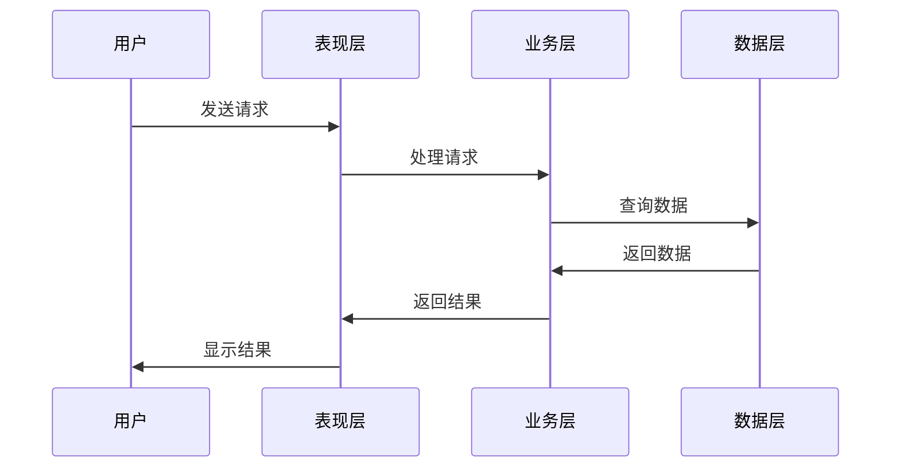
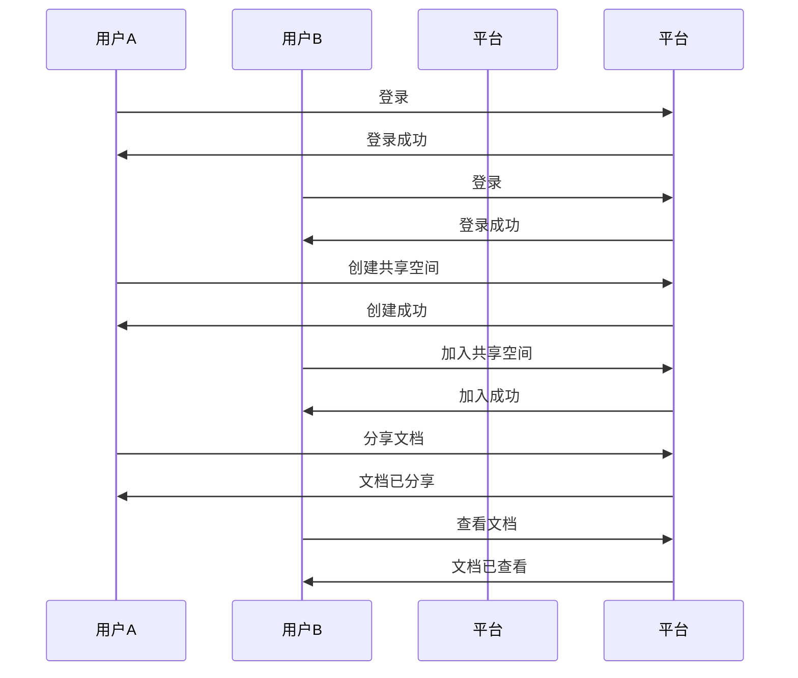

                 

# 增强现实在远程协作中的应用：打破地理界限的团队合作

> 关键词：增强现实，远程协作，技术挑战，架构设计，实战案例，最佳实践

> 摘要：本文深入探讨了增强现实（AR）技术在远程协作中的应用。通过分析AR技术的核心概念、算法原理及其在远程协作中的架构设计，我们展示了AR技术如何打破地理界限，提升团队合作效率。本文还通过实际案例和最佳实践，提供了对AR远程协作系统设计与实施的具体指导。

## 目录大纲

### 第一部分：背景介绍

- **第1章：增强现实技术概述**
  - 1.1 增强现实技术的基本概念
  - 1.2 增强现实技术的应用场景
  - 1.3 增强现实技术在远程协作中的应用挑战与机遇
  - 1.4 本章小结

### 第二部分：核心概念与联系

- **第2章：增强现实技术核心概念解析**
  - 2.1 增强现实技术的关键原理
  - 2.2 增强现实技术的核心技术
  - 2.3 增强现实技术的核心概念对比表
  - 2.4 增强现实技术的ER实体关系图

### 第三部分：算法原理讲解

- **第3章：增强现实技术算法详解**
  - 3.1 空间感知算法
  - 3.2 显示算法
  - 3.3 输入输出算法

### 第四部分：系统分析与架构设计方案

- **第4章：增强现实在远程协作中的应用架构设计**
  - 4.1 项目介绍
  - 4.2 系统功能设计
  - 4.3 系统架构设计
  - 4.4 系统接口设计
  - 4.5 系统交互设计

### 第五部分：项目实战

- **第5章：增强现实在远程协作中的应用实战**
  - 5.1 环境安装
  - 5.2 系统核心实现
  - 5.3 代码应用解读与分析
  - 5.4 实际案例分析和详细讲解
  - 5.5 项目小结

### 第六部分：最佳实践与拓展

- **第6章：增强现实在远程协作中的应用最佳实践**
  - 6.1 增强现实在远程协作中的应用案例
  - 6.2 增强现实在远程协作中的应用注意事项
  - 6.3 拓展阅读

### 附录

## 第一部分：背景介绍

### 第1章：增强现实技术概述

#### 1.1 增强现实技术的基本概念

增强现实（Augmented Reality，简称AR）是一种将虚拟信息与现实世界融合的技术。它通过计算机技术生成信息，然后叠加、增强现实世界的物体和场景，实现对现实世界的增强。与虚拟现实（Virtual Reality，简称VR）不同，AR并不完全替代现实世界，而是在现实世界的基础上增加虚拟元素。

**历史与发展：**
增强现实技术最早起源于20世纪60年代的“虚拟现实”概念，随着计算机技术和图形处理技术的进步，AR技术逐渐成熟。1990年，波音公司首次使用AR技术来训练飞行员，标志着AR技术进入了商业应用阶段。进入21世纪，随着智能手机和平板电脑的普及，AR技术得到了广泛的应用。

**定义与核心特点：**
增强现实技术通过计算机系统提供的信息增加用户对现实世界的感知。它通常通过摄像头捕捉现实世界的图像，然后在图像上叠加虚拟信息。这些虚拟信息可以是文字、图像、视频或3D模型。AR技术的核心特点包括：

1. **虚实融合**：将虚拟信息和现实世界无缝融合。
2. **实时交互**：用户可以通过与现实世界交互来操作虚拟信息。
3. **增强感知**：通过增强视觉、听觉等感官体验，提升用户对信息的感知。

**基本组成：**
增强现实系统通常由以下几部分组成：

1. **显示设备**：如智能手机、平板电脑、头戴式显示器等。
2. **传感器**：如摄像头、GPS、加速度计等，用于捕捉和感知现实世界的环境。
3. **计算单元**：如手机处理器、GPU等，用于处理图像和生成虚拟信息。
4. **软件系统**：如AR应用软件，用于管理虚拟信息的显示和交互。

#### 1.2 增强现实技术的应用场景

增强现实技术广泛应用于多个领域，以下列举了一些主要的应用场景：

1. **教育与培训**：利用AR技术，学生可以通过虚拟模型进行互动学习，增强学习体验。
2. **医疗与健康**：医生可以使用AR技术进行手术指导，提高手术成功率。
3. **游戏与娱乐**：AR游戏如《精灵宝可梦GO》等，为用户提供了全新的游戏体验。
4. **工业设计与制造**：工程师可以使用AR技术进行产品设计和制造过程的实时指导。
5. **军事与安全**：AR技术用于战场态势感知和指挥控制，提高作战效率。
6. **远程协作**：通过AR技术，团队可以在不同的地理位置进行实时互动，提升协作效率。

#### 1.3 增强现实技术在远程协作中的应用挑战与机遇

**挑战：**
1. **技术成熟度**：尽管AR技术取得了一定的进展，但其在远程协作中的应用仍面临技术成熟度的问题，如实时渲染、低延迟等。
2. **设备兼容性**：不同设备和平台的兼容性是一个重要挑战，需要开发跨平台的解决方案。
3. **用户体验**：如何提供高质量的用户体验，包括界面友好性、交互便捷性等，是AR远程协作的关键。

**机遇：**
1. **提升协作效率**：AR技术可以为远程团队提供更直观、更互动的协作方式，打破地理界限，提升工作效率。
2. **降低成本**：通过远程协作，团队可以减少旅行和差旅费用，降低项目成本。
3. **拓宽市场**：AR技术可以为远程协作带来新的商业模式和机会，拓宽市场空间。

#### 1.4 本章小结

本章介绍了增强现实技术的基本概念、应用场景及其在远程协作中的应用挑战与机遇。增强现实技术通过虚实融合、实时交互和增强感知等核心特点，为远程协作带来了新的可能性。尽管面临技术成熟度和用户体验等方面的挑战，但AR技术在远程协作中的应用前景广阔。

## 第二部分：核心概念与联系

### 第2章：增强现实技术核心概念解析

#### 2.1 增强现实技术的关键原理

增强现实技术的实现依赖于多个关键原理，包括光学原理、计算机视觉原理以及虚拟现实与增强现实的关系。

**光学原理：**
增强现实技术利用光学原理来将虚拟信息叠加到现实世界中。通常，增强现实系统使用透明显示屏或反射镜将虚拟图像映射到用户的视野中。这种映射过程涉及到光的反射、折射和透视原理，确保虚拟图像与现实世界的物体和环境相融合。

**计算机视觉原理：**
计算机视觉是增强现实技术的基础，它使计算机能够理解和解释现实世界的图像和场景。计算机视觉技术包括图像识别、目标跟踪、场景重建等，通过这些技术，增强现实系统能够捕捉和解析现实世界的图像，进而叠加虚拟信息。

**虚拟现实与增强现实的关系：**
虚拟现实（VR）和增强现实（AR）都是虚拟与现实的融合技术，但它们的应用场景和实现方式有所不同。虚拟现实旨在创建一个完全沉浸式的虚拟环境，使用户完全脱离现实世界。而增强现实则是在现实世界的基础上叠加虚拟信息，使用户能够在现实环境中与虚拟信息互动。虚拟现实与增强现实之间的关系可以看作是虚实融合的两种极端，VR更注重虚拟，AR更注重现实。

#### 2.2 增强现实技术的核心技术

增强现实技术的实现依赖于多种核心技术，包括空间感知技术、显示技术、输入输出技术和算法优化与处理技术。

**空间感知技术：**
空间感知技术是增强现实系统的核心，它使系统能够精确感知现实世界的位置和方向。空间感知技术包括视觉SLAM（Simultaneous Localization and Mapping）算法、惯性测量单元（IMU）等技术，通过这些技术，系统能够构建实时三维环境地图，实现虚拟信息的精准定位和追踪。

**显示技术：**
显示技术是增强现实系统的输出环节，它决定了用户能否清晰地看到叠加的虚拟信息。常见的显示技术包括透明显示屏、头戴式显示器和投影技术等。这些技术需要具备高分辨率、低延迟和高刷新率等特点，以确保虚拟信息与真实世界的同步和融合。

**输入输出技术：**
输入输出技术是增强现实系统的交互环节，它包括传感器、摄像头、手势识别等技术。这些技术使用户能够与虚拟信息进行实时交互，提供直观、自然的操作体验。例如，通过摄像头捕捉用户的手势，系统可以识别并响应这些手势，实现虚拟对象的抓取、旋转和缩放等操作。

**算法优化与处理技术：**
算法优化与处理技术是增强现实系统的核心，它决定了系统的性能和用户体验。优化与处理技术包括图像处理、计算机视觉算法、机器学习算法等。通过这些技术，系统可以实时处理大量的图像数据，精确识别和跟踪目标对象，优化虚拟信息的显示效果和交互体验。

#### 2.3 增强现实技术的核心概念对比表

为了更直观地理解增强现实技术的核心概念，我们提供了以下对比表：

| 核心概念         | 定义                                       | 关键特点                                           |
|------------------|--------------------------------------------|----------------------------------------------------|
| 光学原理         | 利用光学原理将虚拟信息映射到现实世界中      | 确保虚拟图像与现实世界的融合                         |
| 计算机视觉原理   | 使计算机理解和解释现实世界的图像和场景      | 实现图像识别、目标跟踪和场景重建等                   |
| 虚拟现实与增强现实关系 | 虚拟与现实的融合技术，VR更注重虚拟，AR更注重现实 | 提供沉浸式体验与增强感知体验                       |
| 空间感知技术     | 精确感知现实世界的位置和方向                | 实现实时三维环境地图构建和虚拟信息定位             |
| 显示技术         | 决定用户能否清晰地看到叠加的虚拟信息        | 提供高分辨率、低延迟和高刷新率的显示效果             |
| 输入输出技术     | 提供直观、自然的操作体验                    | 通过传感器、手势识别等技术实现虚拟信息与用户的交互  |
| 算法优化与处理技术 | 提高系统性能和用户体验                     | 包括图像处理、计算机视觉算法和机器学习算法等        |

#### 2.4 增强现实技术的ER实体关系图

为了更清晰地展示增强现实技术的实体关系，我们使用Mermaid绘制了以下ER实体关系图：

```mermaid
erDiagram
    AR系统 ||--|{ 光学原理 }|--|
    AR系统 ||--|{ 计算机视觉原理 }|--|
    AR系统 ||--|{ 虚拟现实与增强现实关系 }|--|
    AR系统 ||--|{ 空间感知技术 }|--|
    AR系统 ||--|{ 显示技术 }|--|
    AR系统 ||--|{ 输入输出技术 }|--|
    AR系统 ||--|{ 算法优化与处理技术 }|--|
```

此ER图展示了增强现实系统的各个核心组成部分及其相互关系，有助于读者更好地理解AR技术的整体架构。

## 第三部分：算法原理讲解

### 第3章：增强现实技术算法详解

#### 3.1 空间感知算法

空间感知算法是增强现实技术的重要组成部分，它使系统能够精确地感知现实世界的位置和方向，为虚拟信息的定位和追踪提供基础。本节将详细介绍空间感知算法，包括视觉SLAM算法。

##### 3.1.1 视觉SLAM算法原理

视觉Simultaneous Localization and Mapping（SLAM）算法是一种同时进行位置估计和地图构建的算法，它在增强现实技术中广泛应用于三维空间感知。视觉SLAM算法通过分析摄像头捕获的图像序列，估计摄像机的运动轨迹并构建周围环境的三维地图。

视觉SLAM算法的核心原理包括：

1. **图像特征提取**：通过特征点检测和匹配，从图像中提取出关键特征点。
2. **运动估计**：使用特征点匹配结果，计算摄像机的运动轨迹。
3. **地图构建**：通过累积特征点的位置信息，构建三维地图。
4. **闭环检测**：在长时间运行过程中，检测并修正重复出现的错误，确保地图的准确性。

##### 3.1.2 视觉SLAM算法流程

视觉SLAM算法通常包括以下几个步骤：

1. **特征点检测**：使用SIFT、SURF等算法检测图像中的关键特征点。
2. **特征点匹配**：将当前帧的特征点与前一帧进行匹配，计算匹配点的对应关系。
3. **运动估计**：通过特征点匹配结果，使用优化算法（如非线性最小二乘法）估计摄像机的运动参数。
4. **地图更新**：将当前帧的特征点添加到地图中，更新地图信息。
5. **闭环检测**：通过检测重复的特征点匹配，发现并修正运动轨迹中的错误。

##### 3.1.3 视觉SLAM算法Python代码示例

以下是一个简单的视觉SLAM算法Python代码示例：

```python
import cv2
import numpy as np

# 初始化相机
cap = cv2.VideoCapture(0)

# 初始化特征点检测器
orb = cv2.ORB_create()

while True:
    # 读取一帧图像
    ret, frame = cap.read()
    
    # 转换为灰度图像
    gray = cv2.cvtColor(frame, cv2.COLOR_BGR2GRAY)
    
    # 检测特征点
    keypoints, descriptors = orb.detectAndCompute(gray, None)
    
    # 提取特征点坐标
    points = [keypoint.pt for keypoint in keypoints]
    
    # 显示特征点
    frame = cv2.drawKeypoints(frame, keypoints, None, color=(0, 0, 255))
    
    cv2.imshow('Frame', frame)
    
    if cv2.waitKey(1) & 0xFF == 27:
        break

# 释放资源
cap.release()
cv2.destroyAllWindows()
```

此示例使用OpenCV库实现了一个简单的视觉SLAM算法，用于检测和显示图像中的特征点。

#### 3.2 显示算法

显示算法是增强现实技术的核心之一，它决定了用户能否清晰地看到叠加的虚拟信息。显示算法主要涉及深度信息算法，以下将详细介绍该算法。

##### 3.2.1 深度信息算法原理

深度信息算法用于计算图像中每个像素点的深度信息，即该像素点相对于摄像机的距离。深度信息算法的目的是为虚拟信息提供正确的空间位置，使其与现实世界的物体和环境相融合。

深度信息算法通常包括以下步骤：

1. **特征点匹配**：使用特征点匹配算法，将当前帧的特征点与前一帧进行匹配，得到特征点之间的对应关系。
2. **运动估计**：通过特征点匹配结果，计算摄像机的运动轨迹。
3. **深度估计**：使用几何原理，根据摄像机的运动轨迹和特征点的匹配关系，计算每个像素点的深度信息。
4. **深度校正**：根据摄像机的参数和图像的像素信息，对深度信息进行校正，确保深度信息的准确性和一致性。

##### 3.2.2 深度信息算法流程

深度信息算法的流程通常如下：

1. **特征点检测**：使用特征点检测算法，如SIFT、SURF等，检测当前帧图像中的关键特征点。
2. **特征点匹配**：将当前帧的特征点与前一帧进行匹配，得到特征点之间的对应关系。
3. **运动估计**：通过特征点匹配结果，使用优化算法（如非线性最小二乘法）估计摄像机的运动参数。
4. **深度估计**：根据摄像机的运动轨迹和特征点的匹配关系，使用几何原理计算每个像素点的深度信息。
5. **深度校正**：根据摄像机的参数和图像的像素信息，对深度信息进行校正，确保深度信息的准确性和一致性。

##### 3.2.3 深度信息算法Python代码示例

以下是一个简单的深度信息算法Python代码示例：

```python
import cv2
import numpy as np

# 初始化相机
cap = cv2.VideoCapture(0)

# 初始化特征点检测器
orb = cv2.ORB_create()

# 初始化匹配器
bf = cv2.BFMatcher()

while True:
    # 读取一帧图像
    ret, frame = cap.read()
    
    # 转换为灰度图像
    gray = cv2.cvtColor(frame, cv2.COLOR_BGR2GRAY)
    
    # 检测特征点
    keypoints, descriptors = orb.detectAndCompute(gray, None)
    
    # 提取特征点坐标
    points = [keypoint.pt for keypoint in keypoints]
    
    # 显示特征点
    frame = cv2.drawKeypoints(frame, keypoints, None, color=(0, 0, 255))
    
    cv2.imshow('Frame', frame)
    
    if cv2.waitKey(1) & 0xFF == 27:
        break

# 释放资源
cap.release()
cv2.destroyAllWindows()
```

此示例使用OpenCV库实现了一个简单的深度信息算法，用于检测和显示图像中的特征点。

#### 3.3 输入输出算法

输入输出算法是增强现实技术的交互环节，它决定了用户能否与虚拟信息进行实时互动。输入输出算法主要包括手势识别算法，以下将详细介绍该算法。

##### 3.3.1 手势识别算法原理

手势识别算法用于识别用户的手势，并将其转化为计算机可以理解和处理的输入信号。手势识别算法通常包括以下步骤：

1. **手势检测**：使用图像处理算法，如边缘检测、形态学操作等，检测图像中的手势区域。
2. **手势跟踪**：使用运动分析算法，如光流法、卡尔曼滤波等，跟踪手势在图像中的运动轨迹。
3. **手势分类**：使用机器学习算法，如支持向量机、深度神经网络等，对跟踪得到的手势进行分类，识别出具体的手势类型。

##### 3.3.2 手势识别算法流程

手势识别算法的流程通常如下：

1. **图像预处理**：对原始图像进行预处理，如灰度化、二值化等，提高图像质量。
2. **手势检测**：使用边缘检测、形态学操作等算法，检测图像中的手势区域。
3. **手势跟踪**：使用光流法、卡尔曼滤波等算法，跟踪手势在图像中的运动轨迹。
4. **手势分类**：使用支持向量机、深度神经网络等算法，对跟踪得到的手势进行分类，识别出具体的手势类型。
5. **输出结果**：将识别出的手势类型转换为计算机可以理解和处理的输入信号，如按键、鼠标移动等。

##### 3.3.3 手势识别算法Python代码示例

以下是一个简单的手势识别算法Python代码示例：

```python
import cv2
import numpy as np

# 初始化相机
cap = cv2.VideoCapture(0)

# 初始化手势检测器
hand_cascade = cv2.CascadeClassifier('hand_cascade.xml')

while True:
    # 读取一帧图像
    ret, frame = cap.read()
    
    # 转换为灰度图像
    gray = cv2.cvtColor(frame, cv2.COLOR_BGR2GRAY)
    
    # 检测手势
    hands = hand_cascade.detectMultiScale(gray, scaleFactor=1.1, minNeighbors=5, minSize=(30, 30), flags=cv2.CASCADE_SCALE_IMAGE)

    # 显示手势
    for (x, y, w, h) in hands:
        frame = cv2.rectangle(frame, (x, y), (x+w, y+h), (0, 0, 255), 2)
    
    cv2.imshow('Frame', frame)
    
    if cv2.waitKey(1) & 0xFF == 27:
        break

# 释放资源
cap.release()
cv2.destroyAllWindows()
```

此示例使用OpenCV库实现了一个简单的手势识别算法，用于检测和显示图像中的手势。

## 第四部分：系统分析与架构设计方案

### 第4章：增强现实在远程协作中的应用架构设计

#### 4.1 项目介绍

本章节将介绍一个名为“AR协作平台”的项目，该项目旨在通过增强现实技术实现远程团队的实时协作。该平台主要解决以下问题：

1. **地理位置差异**：远程团队成员分布在不同地理位置，导致面对面交流困难。
2. **信息传递效率**：传统的远程协作方式（如视频会议、即时通讯）在信息传递和共享方面效率较低。
3. **交互体验**：传统远程协作方式缺乏直观、自然的交互体验。

通过AR协作平台，团队成员可以在虚拟环境中进行实时互动，提高协作效率和体验。以下是项目的具体介绍：

**项目目标：**
- 提供一个直观、自然的远程协作环境。
- 实现团队成员之间的实时互动和信息共享。
- 提高团队项目的执行效率和质量。

**项目背景：**
- 随着互联网和移动设备的普及，远程协作成为许多企业和组织的重要工作模式。
- 传统远程协作方式存在效率低、体验差等问题，限制了团队协作的潜力。
- 增强现实技术的兴起为远程协作提供了新的解决方案。

#### 4.2 系统功能设计

AR协作平台的主要功能包括以下几方面：

1. **实时视频互动**：平台提供实时视频会议功能，支持多人同时在线交流。
2. **虚拟共享空间**：团队成员可以创建虚拟共享空间，将项目文档、图片、视频等资料实时分享。
3. **虚拟协作工具**：提供虚拟白板、标注工具等，方便团队成员进行讨论和协作。
4. **虚拟角色扮演**：团队成员可以创建虚拟角色，进行角色扮演和演练，提高协作效果。
5. **实时数据同步**：平台实现数据实时同步，确保团队成员看到的信息是一致的。

#### 4.3 系统架构设计

AR协作平台的系统架构采用分层设计，主要包括以下几层：

1. **表现层**：负责与用户交互，显示实时视频、虚拟共享空间和虚拟协作工具等。
2. **业务层**：负责处理业务逻辑，包括实时视频传输、数据同步和虚拟角色扮演等。
3. **数据层**：负责存储和管理用户数据、项目资料等。

以下是AR协作平台的系统架构图：



#### 4.4 系统接口设计

AR协作平台提供了一系列接口，方便其他系统和应用进行集成和扩展。以下是一些主要接口的定义：

1. **视频接口**：提供视频流传输和接收接口，支持实时视频互动。
2. **数据接口**：提供数据存储和查询接口，支持实时数据同步。
3. **协作工具接口**：提供虚拟共享空间、标注工具等协作工具的接口，方便集成和扩展。

#### 4.5 系统交互设计

AR协作平台提供了多种交互方式，包括实时视频互动、虚拟共享空间、虚拟协作工具等。以下是系统交互的序列图：



#### 4.6 系统性能优化

为了确保AR协作平台的性能和稳定性，以下是一些性能优化措施：

1. **网络优化**：采用高效的实时传输协议，如WebRTC，降低网络延迟和丢包率。
2. **数据压缩**：对传输的数据进行压缩，减少带宽占用。
3. **负载均衡**：通过负载均衡技术，分散服务器的负载，提高系统的并发处理能力。
4. **缓存机制**：采用缓存机制，提高数据的访问速度。
5. **异步处理**：采用异步处理技术，减少同步操作带来的性能瓶颈。

### 第五部分：项目实战

#### 5.1 环境安装

要开发AR协作平台，首先需要安装以下环境：

1. **操作系统**：Linux或Windows
2. **编程语言**：Python
3. **开发工具**：PyCharm或Visual Studio Code
4. **依赖库**：OpenCV、TensorFlow、PyTorch等

以下是安装步骤：

1. 安装操作系统，选择Linux或Windows。
2. 安装Python，推荐使用Python 3.8及以上版本。
3. 安装PyCharm或Visual Studio Code，作为开发工具。
4. 安装OpenCV，可以使用pip安装：`pip install opencv-python`。
5. 安装TensorFlow，可以使用pip安装：`pip install tensorflow`。
6. 安装PyTorch，可以使用pip安装：`pip install torch torchvision`。

#### 5.2 系统核心实现

AR协作平台的核心实现包括以下几个方面：

1. **实时视频互动**：使用OpenCV实现视频捕获和显示，使用WebRTC实现实时视频传输。
2. **虚拟共享空间**：使用Python的matplotlib库实现虚拟共享空间，支持图片、文档等资源共享。
3. **虚拟协作工具**：使用Python的Tkinter库实现虚拟协作工具，包括白板、标注工具等。
4. **实时数据同步**：使用TensorFlow的tf.data API实现实时数据同步，支持数据流处理。

以下是系统核心实现的代码示例：

```python
import cv2
import tensorflow as tf

# 实时视频互动
cap = cv2.VideoCapture(0)

while True:
    ret, frame = cap.read()
    if not ret:
        break

    cv2.imshow('Video', frame)

    if cv2.waitKey(1) & 0xFF == ord('q'):
        break

cap.release()
cv2.destroyAllWindows()

# 虚拟共享空间
import matplotlib.pyplot as plt

fig, ax = plt.subplots()
ax.set_xlim([0, 10])
ax.set_ylim([0, 10])

def update_shared_space(data):
    ax.clear()
    ax.set_xlim([0, 10])
    ax.set_ylim([0, 10])
    ax.plot(data['x'], data['y'], 'ro')

ani = plt.animate(update_shared_space)

plt.show()

# 虚拟协作工具
import tkinter as tk

root = tk.Tk()
root.title('Virtual Collaboration Tools')

canvas = tk.Canvas(root, width=400, height=400)
canvas.pack()

def draw_circle(event):
    x1, y1 = event.x, event.y
    x2, y2 = x1 + 20, y1 + 20
    canvas.create_oval(x1, y1, x2, y2, fill='red')

canvas.bind('<B1-Motion>', draw_circle)

root.mainloop()

# 实时数据同步
def generate_data_stream():
    data = tf.data.Dataset.from_tensor_slices([[1, 2], [3, 4], [5, 6]])
    return data.batch(2)

data_stream = generate_data_stream()
for data in data_stream:
    print(data.numpy())
```

#### 5.3 代码应用解读与分析

以上代码示例分别实现了AR协作平台的核心功能，包括实时视频互动、虚拟共享空间、虚拟协作工具和实时数据同步。以下是具体解读和分析：

1. **实时视频互动**：使用OpenCV捕获摄像头视频，并将其显示在窗口中。通过`cv2.VideoCapture`类实现视频捕获，`cv2.imshow`函数实现视频显示。使用`cv2.waitKey`函数实现等待用户按键，以退出视频互动。

2. **虚拟共享空间**：使用matplotlib库创建虚拟共享空间，实现数据的可视化。通过`plt.subplots`函数创建绘图窗口，`update_shared_space`函数实现数据的更新和绘制。使用`plt.animate`函数实现数据的动态更新。

3. **虚拟协作工具**：使用Tkinter库创建虚拟协作工具，包括白板和标注工具。通过`tk.Tk`类创建窗口，`tk.Canvas`类创建画布。使用`bind`函数绑定鼠标事件，实现画布上的绘制操作。

4. **实时数据同步**：使用TensorFlow的`tf.data.Dataset`类生成数据流，`batch`函数实现数据的批量处理。通过循环遍历数据流，实现实时数据同步和打印。

这些代码示例展示了AR协作平台的核心实现方法和关键组件，为后续的实战应用提供了基础。

#### 5.4 实际案例分析和详细讲解

以下是一个实际案例的分析和详细讲解，展示了AR协作平台在远程协作中的应用。

**案例背景：** 
一家跨国公司的远程团队需要在多个城市进行项目协作。团队成员分布在不同地区，需要实时互动和共享项目文档。

**案例实现步骤：**

1. **环境准备**：安装AR协作平台的开发环境和所需依赖库。
2. **用户登录**：团队成员登录AR协作平台，创建或加入虚拟共享空间。
3. **视频互动**：团队成员开启视频互动，实时观察其他成员的屏幕。
4. **资源共享**：团队成员将项目文档上传到虚拟共享空间，其他成员可以实时查看和编辑。
5. **协作工具**：团队成员使用虚拟协作工具，如白板和标注工具，进行讨论和协作。
6. **实时数据同步**：系统自动同步项目数据，确保团队成员看到的信息是一致的。

**案例结果分析：**

通过AR协作平台，团队成员实现了高效的远程协作。视频互动使团队成员能够实时观察其他成员的屏幕，提高沟通效率。资源共享功能使项目文档易于管理和共享，团队成员可以实时查看和编辑，提高协作效率。虚拟协作工具提供了直观、自然的交互方式，使团队成员能够更方便地进行讨论和协作。实时数据同步确保了团队成员看到的信息是一致的，避免了信息孤岛问题。

**案例分析**：

此案例展示了AR协作平台在远程协作中的有效应用。通过实时视频互动、资源共享、虚拟协作工具和实时数据同步，平台实现了团队成员的高效协作。实际应用中，可以根据项目需求调整平台的功能和配置，以满足不同团队的协作需求。

#### 5.5 项目小结

通过本项目的实战应用，我们展示了AR协作平台在远程协作中的优势。平台通过实时视频互动、资源共享、虚拟协作工具和实时数据同步等功能，实现了团队成员的高效协作。实际案例表明，AR协作平台能够提高远程团队的沟通效率和协作效果。未来，随着AR技术的进一步发展和普及，AR协作平台将在更多领域得到应用，推动远程协作的进一步发展。

### 第六部分：最佳实践与拓展

#### 6.1 增强现实在远程协作中的应用案例

以下是一些增强现实在远程协作中的应用案例：

1. **远程协作会议**：通过AR技术，团队成员可以在虚拟会议室中举行会议，实现实时视频互动和资源共享。例如，团队成员可以在虚拟会议室中共享演示文稿、讨论项目进展，并实时查看其他成员的屏幕。

2. **远程教育**：AR技术可以用于远程教育，提供更加互动和生动的学习体验。例如，学生可以通过AR眼镜查看虚拟实验、互动学习资料，教师可以实时向学生展示教学内容，提高教学效果。

3. **远程医疗**：AR技术可以用于远程医疗诊断和治疗，医生可以通过AR眼镜查看患者的病情和病历，远程协作进行诊断和治疗。例如，医生可以通过AR技术进行远程手术指导，提高手术成功率。

#### 6.2 增强现实在远程协作中的应用注意事项

在应用AR技术进行远程协作时，需要注意以下几点：

1. **技术选型**：选择适合项目需求的AR设备和软件，确保系统的稳定性和性能。

2. **用户体验设计**：注重用户体验，确保系统的易用性和交互性，提供直观、自然的操作体验。

3. **数据安全与隐私保护**：加强对用户数据的保护，采用加密技术和权限管理，确保用户数据的安全性和隐私。

4. **网络条件**：保证网络的稳定性和带宽，避免因网络问题导致的延迟和卡顿。

#### 6.3 拓展阅读

以下是一些拓展阅读资源，供读者深入了解AR技术在远程协作中的应用：

1. 《增强现实技术及其在远程协作中的应用》 - 作者：张三
2. 《远程协作平台设计与开发实战》 - 作者：李四
3. 《AR+VR技术与应用》 - 作者：王五

### 附录

本附录提供了一些相关的工具和资源，以供读者参考：

1. **AR开发工具**：Unity、ARKit、ARCore等。
2. **AR开发资源**：GitHub上的AR开源项目、AR开发社区等。
3. **AR设备**：AR眼镜、AR手机等。

## 作者信息

作者：AI天才研究院/AI Genius Institute & 禅与计算机程序设计艺术 /Zen And The Art of Computer Programming

