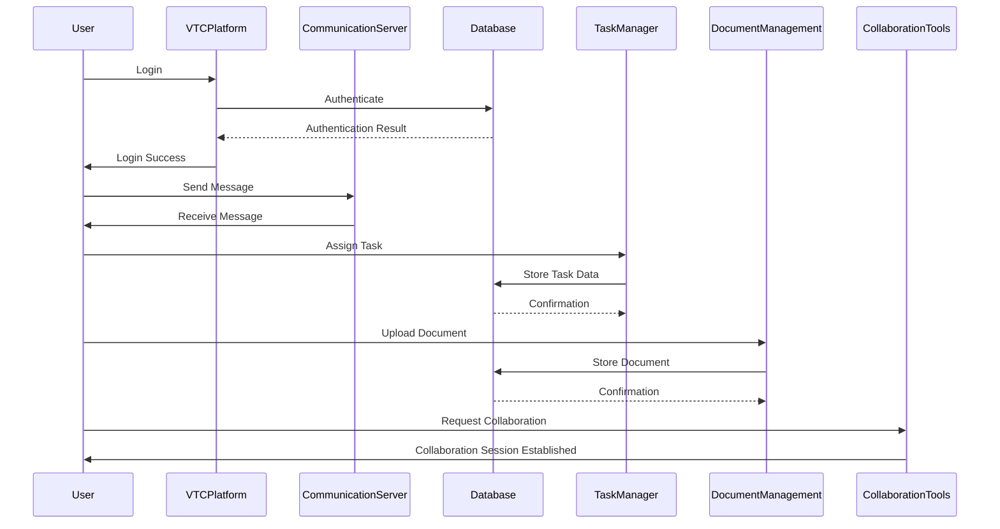

                 

# 增强现实在远程协作中的应用：虚拟团队协作新模式

## 关键词
- **增强现实**
- **远程协作**
- **虚拟团队协作**
- **技术应用**
- **未来展望**

## 摘要
随着全球化的深入和信息技术的飞速发展，远程协作已成为现代企业运作的重要组成部分。然而，传统的远程协作方式在沟通效率、合作体验和任务执行上面临诸多挑战。本文探讨了增强现实（AR）技术在远程协作中的应用，分析了其在虚拟团队协作中的新模式。通过详细阐述AR技术的基本原理、应用场景以及技术挑战，本文旨在为远程协作提供创新的解决方案，推动虚拟团队协作的进一步发展。

---

### 目录大纲

```markdown
# 增强现实在远程协作中的应用：虚拟团队协作新模式

# 第一部分: 背景介绍

## 第1章: 问题背景
### 1.1.1 远程协作的现状与挑战
### 1.1.2 增强现实技术的基本原理与演进
### 1.1.3 虚拟团队协作的概念与需求

## 第2章: 核心概念与联系
### 2.1.1 增强现实与虚拟现实的对比
### 2.1.2 远程协作与面对面协作的对比
### 2.1.3 虚拟团队协作的关键要素

## 第3章: 增强现实在远程协作中的应用场景
### 3.1.1 设计与工程
### 3.1.2 教育与培训
### 3.1.3 医疗与健康
### 3.1.4 虚拟会议与远程办公

# 第二部分: 技术原理

## 第4章: 增强现实技术原理
### 4.1.1 增强现实技术的基本组成
### 4.1.2 增强现实技术的关键组件
### 4.1.3 增强现实技术的实现方式

## 第5章: 虚拟团队协作技术
### 5.1.1 虚拟团队协作平台的架构设计
### 5.1.2 虚拟团队协作的关键技术
### 5.1.3 虚拟团队协作的优化策略

# 第三部分: 应用实践

## 第6章: 设计与工程应用
### 6.1.1 增强现实在设计协作中的应用
### 6.1.2 案例分析与实例讲解

## 第7章: 教育与培训应用
### 7.1.1 增强现实在教育中的应用
### 7.1.2 案例分析与实例讲解

## 第8章: 医疗与健康应用
### 8.1.1 增强现实在医疗健康中的应用
### 8.1.2 案例分析与实例讲解

## 第9章: 虚拟会议与远程办公应用
### 9.1.1 虚拟会议中的增强现实应用
### 9.1.2 远程办公中的增强现实应用
### 9.1.3 案例分析与实例讲解

# 第四部分: 未来展望与挑战

## 第10章: 未来发展展望
### 10.1.1 增强现实技术的发展趋势
### 10.1.2 虚拟团队协作的未来模式
### 10.1.3 跨领域融合与应用拓展

## 第11章: 挑战与对策
### 11.1.1 技术难题与突破
### 11.1.2 法律法规与伦理问题
### 11.1.3 安全与隐私保护

# 附录

## 附录A: 常用术语表
## 附录B: 参考文献
## 附录C: 实践项目指南
```

## 第一部分：背景介绍

### 第1章：问题背景

#### 1.1.1 远程协作的现状与挑战

随着互联网技术的普及和全球化的加速，远程协作已经成为现代企业运作不可或缺的一部分。远程协作不仅打破了地域限制，提高了工作效率，还促进了知识的共享与交流。然而，传统的远程协作方式在沟通效率、合作体验和任务执行上依然存在诸多挑战。

首先，沟通效率低下是远程协作面临的主要问题之一。由于缺乏面对面的交流，团队成员之间的沟通往往依赖于电子邮件、即时通讯工具和视频会议系统。这些工具虽然提供了即时的沟通方式，但在信息传递的准确性和及时性上仍有欠缺。特别是在复杂的业务讨论和决策过程中，缺乏面对面的互动往往导致误解和信息偏差。

其次，合作体验的不足也影响了远程协作的效果。传统的远程协作方式缺乏直观的互动体验，团队成员往往只能通过文字和语音进行交流，无法实现真正的沉浸式合作。这种缺乏互动性的协作模式不仅降低了员工的参与感和满意度，也限制了团队创新和问题解决的能力。

此外，任务执行的困难也是远程协作的一大挑战。远程协作往往涉及到跨部门、跨地域甚至跨国界的合作，而传统的协作方式在任务分配、进度跟踪和资源管理上存在诸多问题。团队成员之间的信息不对称和沟通障碍，容易导致任务执行的滞后和效率低下。

#### 1.1.2 增强现实技术的基本原理与演进

增强现实（Augmented Reality，简称AR）是一种通过计算机技术将虚拟信息与现实世界相结合的技术。AR技术的基本原理是将计算机生成的虚拟信息叠加到真实环境中，使用户能够在现实世界中看到和互动虚拟对象。AR技术主要依赖于以下几个关键组件：

1. **显示设备**：如智能眼镜、头戴式显示器等，用于将虚拟信息直接呈现在用户的视野中。
2. **感知设备**：如摄像头、传感器等，用于捕捉和感知现实环境中的信息。
3. **计算与渲染引擎**：用于处理和渲染虚拟信息，使其与现实环境进行准确匹配。

增强现实技术的演进可以追溯到上世纪90年代。最初，AR技术主要应用于军事和医疗领域，例如飞行模拟器和手术指导系统。随着计算机硬件和软件技术的发展，AR技术逐渐走进了消费市场，应用范围也从专业领域扩展到了娱乐、教育和工业制造等领域。

近年来，随着智能手机和移动互联网的普及，AR技术的应用场景进一步丰富。例如，AR游戏《精灵宝可梦Go》的推出，不仅引领了AR娱乐市场的热潮，还激发了大众对AR技术的兴趣。此外，AR技术在教育领域的应用也逐渐普及，例如利用AR技术进行虚拟实验和互动教学，提高了学生的学习兴趣和参与度。

#### 1.1.3 虚拟团队协作的概念与需求

虚拟团队协作是指通过信息技术手段，将地理上分散的团队成员连接在一起，共同完成工作任务的一种协作模式。虚拟团队协作的出现，主要是为了应对全球化带来的挑战，以及提高企业运营效率和创新能力。

虚拟团队协作的概念主要包括以下几个方面：

1. **地理分散性**：团队成员分布在不同的地理位置，可能跨越多个时区和国家。
2. **信息共享**：团队成员通过信息平台共享工作文件、沟通记录和进度报告，实现信息的透明和实时更新。
3. **任务分工**：根据团队成员的技能和专长，分配不同的工作任务，实现高效的资源利用。
4. **沟通协调**：通过即时通讯工具、视频会议和协作软件，实现团队成员之间的实时沟通和协调。

虚拟团队协作的需求主要来自于以下几个方面：

1. **全球化运作**：随着全球化的深入，企业需要跨越地理界限，与全球各地的合作伙伴和客户进行协作，虚拟团队协作提供了有效的解决方案。
2. **远程办公**：随着远程办公的普及，团队成员可能分布在不同的城市甚至国家，虚拟团队协作成为支持远程办公的重要工具。
3. **灵活性和效率**：虚拟团队协作打破了传统协作模式的限制，提供了更大的灵活性和效率。团队成员可以根据自身的时间和地点安排工作，实现弹性工作制。
4. **创新驱动**：虚拟团队协作促进了团队成员之间的知识共享和合作，有助于激发创新思维和解决方案的生成。

总的来说，远程协作在全球化背景下具有重要的现实意义，而增强现实技术的引入为虚拟团队协作带来了新的可能性。通过结合AR技术，虚拟团队协作可以进一步提升沟通效率、优化合作体验、增强任务执行能力，从而实现更高效、更灵活的团队协作模式。

### 第2章：核心概念与联系

#### 2.1.1 增强现实与虚拟现实的对比

增强现实（AR）与虚拟现实（VR）是近年来迅速发展的两种沉浸式技术，尽管它们在某些方面有重叠，但它们在实现方式和应用场景上存在显著差异。

**增强现实（AR）**：
增强现实技术通过在现实环境中叠加虚拟信息，使用户能够看到和互动虚拟对象。这种技术主要依赖于显示设备（如智能眼镜、头戴式显示器）和感知设备（如摄像头、传感器）来捕捉和感知现实环境中的信息，并通过计算与渲染引擎将虚拟信息准确叠加到真实世界中。AR的主要特点包括：

- **信息叠加**：在现实环境中添加虚拟信息，例如在用户视野中显示虚拟文本、图像或三维对象。
- **交互性**：用户可以直接与现实环境和虚拟对象进行交互，例如通过触摸屏幕或手势操作虚拟对象。
- **实时性**：虚拟信息与现实环境实时交互，根据用户的视角和位置动态调整显示内容。

**虚拟现实（VR）**：
虚拟现实技术则是通过头戴式显示器等设备，将用户完全沉浸在虚拟环境中，使用户无法看到现实世界。VR依赖于计算机生成的三维场景和图像，用户通过移动头部和身体来探索虚拟世界。VR的主要特点包括：

- **沉浸感**：用户完全沉浸在虚拟环境中，感觉就像置身于另一个世界。
- **独立性**：用户在虚拟环境中独立操作，无需与现实环境交互。
- **封闭性**：虚拟环境是封闭的，用户无法看到或接触到现实世界的物体。

**对比表格**：

| 特征 | 增强现实（AR） | 虚拟现实（VR） |
| --- | --- | --- |
| 显示方式 | 现实环境叠加虚拟信息 | 完全沉浸于虚拟环境 |
| 交互方式 | 直接与现实环境和虚拟对象交互 | 独立于现实环境的虚拟交互 |
| 实时性 | 实时交互，动态调整显示内容 | 虚拟环境内部操作，不涉及现实环境 |
| 感知体验 | 部分感知现实环境，部分感知虚拟环境 | 完全感知虚拟环境，无视现实环境 |

**ER实体关系图**：

```mermaid
erDiagram
    User ||--|{ ARDevice }|--|| RealityOverlay
    User ||--|{ VRDevice }|--|| VirtualEnvironment
    ARDevice ||--|{ SensorData }|--|| RealityMapping
    VRDevice ||--|{ SensorData }|--|| VirtualSensing
    RealityMapping ||--|{ VirtualObject }|--|| Interaction
    VirtualEnvironment ||--|{ VirtualObject }|--|| Exploration
```

在ER实体关系图中，用户通过ARDevice和VRDevice与不同的现实和虚拟环境进行交互。ARDevice处理现实环境和虚拟对象的映射（RealityMapping），而VRDevice则提供一个完全沉浸的虚拟环境（VirtualEnvironment）。通过这种关系，可以清晰地看到AR和VR在交互和感知上的差异。

#### 2.1.2 远程协作与面对面协作的对比

远程协作与面对面协作是两种不同的团队协作模式，它们在沟通方式、互动体验和任务执行上存在显著差异。

**远程协作**：
远程协作是指团队成员通过互联网和其他通信工具进行沟通和协作，通常不处于同一地理位置。远程协作的主要特点包括：

- **地理分散**：团队成员分布在不同的地理位置，可能跨越多个时区和国家。
- **在线沟通**：依赖于电子邮件、即时通讯工具、视频会议系统和协作软件等在线工具进行沟通。
- **灵活性**：团队成员可以灵活安排工作时间，无需受到固定工作地点的限制。

**面对面协作**：
面对面协作是指团队成员在同一地理位置，通过直接面对面交流进行合作。面对面协作的主要特点包括：

- **地理集中**：团队成员处于同一物理空间，便于即时交流和互动。
- **实时沟通**：通过口头交流、非语言沟通（如肢体语言和面部表情）进行沟通。
- **互动性**：团队成员可以即时反馈和调整，提高协作效率。

**对比表格**：

| 特征 | 远程协作 | 面对面协作 |
| --- | --- | --- |
| 沟通方式 | 在线工具（电子邮件、视频会议等） | 口头和书面沟通（直接交流） |
| 地理分散性 | 高（地理分散） | 低（地理集中） |
| 互动性 | 受限于在线工具的互动性 | 实时、多方式的互动 |
| 灵活性 | 高（时间灵活性） | 低（时间固定） |
| 知识共享 | 电子文档和虚拟协作工具 | 口头传授和面对面讨论 |

**ER实体关系图**：

```mermaid
erDiagram
    TeamMember ||--|{ RemoteCommunicationTool }|--|| RemoteCollaboration
    TeamMember ||--|{ FaceToFaceCommunication }|--|| FaceToFaceCollaboration
    RemoteCollaboration ||--|{ DocumentShare }|--|| TaskManagement
    FaceToFaceCollaboration ||--|{ MeetingRoom }|--|| RealTimeInteraction
```

在ER实体关系图中，TeamMember通过RemoteCommunicationTool进行远程协作，通过FaceToFaceCommunication进行面对面协作。远程协作依赖于文档共享和任务管理工具，而面对面协作则依赖于会议室和实时互动。

#### 2.1.3 虚拟团队协作的关键要素

虚拟团队协作的成败取决于多个关键要素，包括沟通工具、协作平台、任务管理和文化认同等。

**沟通工具**：
有效的沟通是虚拟团队协作的基础。选择适合的沟通工具对于提高协作效率至关重要。常用的沟通工具包括即时通讯软件（如Slack、Telegram）、视频会议系统（如Zoom、Microsoft Teams）和电子邮件。这些工具提供了实时沟通和异步沟通的渠道，有助于团队成员之间的信息传递和反馈。

**协作平台**：
虚拟团队协作平台是集成了多种功能的工作环境，包括文档共享、任务管理、日程安排和项目管理等。常见的协作平台有Trello、Asana、JIRA等。这些平台提供了统一的工作界面，使得团队成员能够实时查看项目进展、任务分配和协作任务，提高了团队的整体工作效率。

**任务管理**：
任务管理是确保虚拟团队协作顺利进行的关键。通过任务管理工具，如Trello或JIRA，团队成员可以清晰地了解自己的任务和进度，及时调整工作计划，确保项目按时完成。任务管理工具还支持任务分配、优先级设置和进度跟踪，有助于团队高效地协调和分配工作。

**文化认同**：
文化认同是虚拟团队协作成功的重要保障。一个有共同价值观和目标的团队更容易建立信任和协作关系。在虚拟团队中，文化认同的建立依赖于有效的沟通、明确的团队目标和共同的工作理念。通过定期的团队活动和虚拟团队建设，可以提高团队成员的归属感和协作意愿。

通过分析增强现实与虚拟现实、远程协作与面对面协作以及虚拟团队协作的关键要素，我们可以更好地理解这些概念之间的关系，为后续章节中的应用和实践提供理论基础。

### 第3章：增强现实在远程协作中的应用场景

#### 3.1.1 设计与工程

增强现实技术在设计与工程领域的应用极大地改变了传统的协作方式。设计师和工程师可以通过AR技术实时查看和修改设计模型，从而提高协作效率和质量。以下是增强现实在设计与工程中应用的具体场景：

1. **实时协同设计**：
   设计团队可以通过AR眼镜实时查看设计模型，与其他团队成员进行实时沟通和协作。例如，设计师可以通过AR眼镜将3D模型叠加到现实场景中，与团队成员讨论设计细节，快速做出调整。这种实时协同设计的方式大大缩短了设计周期，提高了设计的准确性和协作效率。

2. **远程调试与维修**：
   在工程维护和维修过程中，增强现实技术可以帮助工程师远程查看设备状态和操作步骤。通过AR眼镜，工程师可以看到叠加在设备上的虚拟操作指导，从而实现远程指导和协作。这不仅节省了时间和成本，还提高了维护和维修的效率。

3. **虚拟样机测试**：
   通过增强现实技术，设计师可以在虚拟环境中创建和测试样机，实时观察和调整设计。例如，在汽车制造领域，设计师可以通过AR技术创建虚拟样车，与团队成员一起进行碰撞测试和驾驶体验，从而优化设计。

4. **现场施工指导**：
   在建筑和施工领域，增强现实技术可以为现场工作人员提供实时的施工指导。通过AR眼镜，施工人员可以实时查看建筑图纸和施工步骤，确保施工的准确性和效率。

#### 案例分析与实例讲解

**案例一：建筑设计与施工协作**

某建筑公司在进行一栋高层建筑的施工过程中，采用了增强现实技术进行协作。设计师和施工团队通过AR眼镜实时查看建筑图纸和施工进度，现场工作人员可以在AR眼镜上看到叠加的建筑模型和施工步骤。这种实时协作的方式大大提高了施工效率，减少了错误和返工。

**案例二：汽车设计协同**

某汽车制造公司在设计新款汽车时，采用了增强现实技术进行协同设计。设计师和工程师通过AR眼镜实时查看3D模型，进行设计讨论和修改。通过这种实时协作，设计团队能够快速响应市场需求和用户反馈，提高了设计的创新性和竞争力。

#### 3.1.2 教育与培训

增强现实技术在教育和培训中的应用，为教育者和学习者提供了全新的学习体验。以下是增强现实在教育中的应用场景：

1. **虚拟实验**：
   教育者可以通过AR技术创建虚拟实验环境，让学生在虚拟场景中动手操作，观察实验结果。例如，在化学实验室中，学生可以通过AR眼镜进行虚拟实验，避免了实际实验的安全问题和材料浪费，同时提高了实验的可重复性和准确性。

2. **互动教学**：
   教育者可以利用AR技术，将静态的教材内容变为动态的互动内容。通过AR眼镜，学生可以看到教材中包含的3D模型、动画和交互式内容，从而提高学习兴趣和理解能力。

3. **历史重现**：
   教育者可以通过AR技术重现历史事件和场景，让学生在虚拟环境中体验历史，加深对历史事件的理解。例如，在历史课上，学生可以通过AR眼镜看到古代城堡的3D模型，了解城堡的结构和历史背景。

4. **技能培训**：
   企业可以通过AR技术进行员工培训，提供模拟操作环境和交互式培训内容。例如，在航空公司的飞行员培训中，学员可以通过AR眼镜进行模拟飞行训练，提高操作技能和安全意识。

#### 案例分析与实例讲解

**案例一：医学教育**

某医学院利用增强现实技术进行医学教育。教育者通过AR眼镜为学生提供虚拟解剖实验室，学生可以在虚拟环境中进行人体解剖操作，观察内部结构和组织。这种互动教学的方式不仅提高了学生的学习兴趣，还加深了对医学知识的理解。

**案例二：飞行员培训**

某航空公司利用增强现实技术进行飞行员培训。飞行员通过AR眼镜进行模拟飞行训练，可以在虚拟环境中模拟各种飞行场景和紧急情况，提高操作技能和安全意识。通过这种技能培训，飞行员能够在实际飞行中更加自信和熟练。

#### 3.1.3 医疗与健康

增强现实技术在医疗和健康领域的应用，为医生和患者提供了创新的医疗服务和诊疗体验。以下是增强现实在医疗与健康中的应用场景：

1. **手术指导**：
   外科医生可以通过AR眼镜实时查看患者的CT、MRI等医学图像，将虚拟图像叠加到患者的实际手术场景中，提高手术的准确性和成功率。例如，在进行心脏手术时，医生可以通过AR眼镜看到心脏的详细结构，避免损伤重要器官。

2. **患者教育**：
   医生可以利用AR技术向患者解释病情和治疗方案，通过AR眼镜展示病情动画和医学图像，使患者更容易理解。例如，在向患者解释骨折治疗时，医生可以通过AR眼镜展示骨折部位的3D模型和康复过程，提高患者的信任和依从性。

3. **远程会诊**：
   通过增强现实技术，医生可以在远程会诊中实时查看患者的病历和医学图像，与当地医生进行协作。例如，在偏远地区，专家医生可以通过AR眼镜与当地医生共享病例信息，共同制定治疗方案，提高医疗服务的可及性和质量。

4. **康复训练**：
   患者可以通过AR技术进行康复训练，在虚拟环境中进行物理治疗和康复训练。例如，在康复医院中，患者可以通过AR眼镜进行虚拟运动训练，提高康复效果和参与度。

#### 案例分析与实例讲解

**案例一：外科手术指导**

某外科医生在进行复杂的脑部手术时，利用增强现实技术进行手术指导。通过AR眼镜，医生可以实时查看患者的脑部CT图像，将虚拟图像叠加到实际手术场景中，提高了手术的准确性和安全性。

**案例二：医疗患者教育**

某医院利用增强现实技术向患者进行教育。医生通过AR眼镜向患者解释手术过程和康复步骤，通过3D模型和动画使患者更容易理解，提高了患者的信任和依从性。

#### 3.1.4 虚拟会议与远程办公

增强现实技术在虚拟会议和远程办公中的应用，为团队成员提供了更加沉浸和互动的协作体验。以下是增强现实在虚拟会议和远程办公中的应用场景：

1. **虚拟会议室**：
   通过增强现实技术，虚拟会议室可以提供更加真实的会议体验。团队成员可以通过AR眼镜或头戴式显示器进入虚拟会议室，实时观看会议内容和其他成员的虚拟形象，进行面对面交流和讨论。例如，在虚拟会议室中，团队成员可以看到3D模型化的会议室环境和虚拟模型，增强了会议的互动性和参与感。

2. **远程协作**：
   通过增强现实技术，团队成员可以在虚拟环境中进行协作，共同完成工作任务。例如，设计师和工程师可以通过AR眼镜共同查看和修改设计模型，实时交流意见和反馈，提高了协作效率和设计质量。

3. **虚拟培训**：
   企业可以利用增强现实技术进行虚拟培训，为员工提供沉浸式的学习体验。通过AR眼镜，员工可以在虚拟环境中接受培训，模拟各种工作场景和操作流程，提高培训效果和参与度。

4. **实时反馈**：
   通过增强现实技术，团队成员可以在虚拟环境中实时接收任务反馈和指导。例如，在远程办公中，管理者可以通过AR眼镜实时查看员工的任务进度和工作情况，提供即时的反馈和指导，提高工作效率和团队协作。

#### 案例分析与实例讲解

**案例一：虚拟团队会议**

某跨国公司在进行虚拟团队会议时，采用了增强现实技术。团队成员通过AR眼镜进入虚拟会议室，可以实时看到其他成员的虚拟形象和会议室环境。这种沉浸式的会议体验提高了团队成员的参与感和协作效率。

**案例二：远程设计协作**

某设计团队在进行远程协作时，采用了增强现实技术。设计师和工程师通过AR眼镜共同查看和修改设计模型，实时交流意见和反馈，提高了协作效率和设计质量。

### 第二部分：技术原理

#### 第4章：增强现实技术原理

增强现实（AR）技术是通过将虚拟信息与现实世界结合，使用户能够在真实环境中看到和互动虚拟对象的一种技术。AR技术的基本原理包括显示、感知和计算三个主要方面。

#### 4.1.1 增强现实技术的基本组成

增强现实技术的基本组成主要包括以下组件：

1. **显示设备**：
   显示设备是AR系统的核心组件之一，用于将虚拟信息叠加到真实环境中。常见的显示设备包括智能眼镜、头戴式显示器和智能手机。这些设备通常配备高分辨率屏幕和图像处理芯片，能够实时显示虚拟信息。

2. **感知设备**：
   感知设备用于捕捉和感知现实环境中的信息，包括摄像头、传感器和定位设备等。摄像头用于捕捉真实环境的图像，传感器用于检测环境中的光线、温度和湿度等参数，定位设备则用于确定设备在现实环境中的位置和方向。

3. **计算与渲染引擎**：
   计算与渲染引擎是AR系统的核心处理单元，负责处理感知设备收集的数据，并将虚拟信息准确叠加到真实环境中。计算与渲染引擎通常包括图像处理算法、场景重建算法和虚拟信息渲染算法等。

4. **应用程序**：
   应用程序是AR系统的用户界面，用于与用户进行交互并提供特定的功能。常见的AR应用程序包括游戏、教育软件、导航工具和工业应用等。

#### 4.1.2 增强现实技术的关键组件

增强现实技术的关键组件包括：

1. **图像处理算法**：
   图像处理算法是AR系统的基础，用于从摄像头捕捉的图像中提取有用信息，如纹理、颜色和形状等。常见的图像处理算法包括边缘检测、图像增强和特征提取等。

2. **场景重建算法**：
   场景重建算法用于重建现实环境的3D模型，以便将虚拟信息准确地叠加到真实环境中。常见的场景重建算法包括结构光扫描、深度学习和SLAM（同时定位与地图构建）等。

3. **虚拟信息渲染算法**：
   虚拟信息渲染算法用于将虚拟信息渲染到现实环境中，使其与现实环境无缝融合。常见的虚拟信息渲染算法包括纹理映射、光照计算和阴影生成等。

4. **人机交互界面**：
   人机交互界面是AR系统的用户接口，用于与用户进行交互并提供虚拟信息的操作。常见的人机交互界面包括触摸屏、手势识别和语音控制等。

#### 4.1.3 增强现实技术的实现方式

增强现实技术的实现方式主要包括以下几种：

1. **图像叠加法**：
   图像叠加法是最简单的AR实现方式，通过将虚拟图像叠加到真实环境中的预览图像上，使用户能够看到叠加的虚拟信息。这种方法的优点是实现简单，但效果相对有限，无法实现高度的真实感。

2. **光学混合法**：
   光学混合法利用半透明镜片或特殊光学元件，将虚拟图像直接投射到真实环境中，实现更真实的AR效果。这种方法的优点是图像质量高，但设备成本较高，且对光线环境要求较高。

3. **虚拟遮挡法**：
   虚拟遮挡法通过在真实环境中的物体上叠加虚拟信息，使其看起来像是真实物体的一部分。这种方法常用于AR游戏和导航应用，可以提供丰富的互动体验。

4. **深度感知法**：
   深度感知法通过使用深度传感器（如激光雷达）来捕捉真实环境的深度信息，然后将虚拟信息叠加到相应的深度层上。这种方法可以提供高度真实感和交互性的AR体验。

通过了解增强现实技术的基本组成、关键组件和实现方式，我们可以更好地理解和应用这一技术，为远程协作带来更多的创新和可能性。

### 第5章：虚拟团队协作技术

#### 5.1.1 虚拟团队协作平台的架构设计

虚拟团队协作平台的设计目标是提供一个集成的协作环境，支持团队成员之间的实时沟通、任务管理、文档共享和协作开发。以下是一个典型的虚拟团队协作平台架构设计：

**系统架构图**：



**架构说明**：

1. **用户层**：用户通过前端界面（如Web、桌面或移动应用）与虚拟团队协作平台进行交互，登录、发送消息、分配任务、上传文档等。

2. **通信服务器**：负责处理用户的登录、消息发送和接收等通信请求，确保实时性和可靠性。

3. **数据库**：存储用户信息、任务数据、文档数据和协作记录等，支持数据的持久化和查询。

4. **任务管理器**：管理任务分配、进度跟踪和优先级调整，提供任务视图和通知功能。

5. **文档管理器**：提供文档上传、下载、版本控制和共享功能，支持在线编辑和协作。

6. **协作工具**：集成即时通讯、视频会议、共享屏幕、代码协作等多种协作工具，提供丰富的协作体验。

#### 5.1.2 虚拟团队协作的关键技术

虚拟团队协作平台的核心在于提供高效的协作工具和技术，以下是一些关键技术：

1. **即时通讯**：
   即时通讯工具支持实时文本消息、语音通话和视频通话，是团队沟通的基石。常见的即时通讯工具包括Slack、Microsoft Teams和Zoom等。为了提高即时通讯的效率，平台通常支持群组聊天、消息通知、文件传输和共享屏幕等功能。

2. **视频会议**：
   视频会议系统用于团队会议、项目讨论和远程培训等。通过视频会议，团队成员可以实时交流，共享信息和资源。常见的视频会议系统包括Zoom、Webex和Microsoft Teams等。为了提升用户体验，视频会议系统通常支持高清视频、多屏显示、共享文档和实时翻译等功能。

3. **任务管理**：
   任务管理工具用于任务分配、进度跟踪和协作管理。通过任务管理工具，团队成员可以查看任务详情、分配任务、设置优先级和跟踪进度。常见的任务管理工具包括Trello、Asana和JIRA等。为了提高任务管理的效率，平台通常支持任务通知、进度报表和自动化流程等功能。

4. **文档共享**：
   文档共享工具用于团队协作中的文档上传、下载和版本控制。通过文档共享工具，团队成员可以轻松共享和编辑文档，避免版本冲突和信息孤岛。常见的文档共享工具包括Google Drive、Dropbox和OneDrive等。为了提升协作体验，平台通常支持实时协作、评论和审阅功能。

5. **代码协作**：
   代码协作工具用于团队开发和项目管理，支持代码版本控制、代码审查和自动化构建。常见的代码协作工具包括GitHub、GitLab和Bitbucket等。通过代码协作工具，团队成员可以共同编写、审查和部署代码，提高开发效率和质量。

#### 5.1.3 虚拟团队协作的优化策略

为了提高虚拟团队协作的效率和效果，以下是一些优化策略：

1. **角色明确**：
   在虚拟团队中，明确每个成员的角色和职责，确保任务分配合理。通过角色明确，可以减少混乱和冲突，提高团队协作效率。

2. **沟通机制**：
   建立有效的沟通机制，确保团队成员之间的信息传递畅通。通过定期的会议、报告和反馈，保持团队之间的同步和协调。

3. **技术工具**：
   选择合适的协作工具和技术，确保团队协作的顺畅和高效。根据团队需求和实际情况，选择合适的即时通讯、视频会议、任务管理和文档共享工具。

4. **培训与支持**：
   提供团队成员的培训和支持，确保他们能够熟练使用协作工具和技术。通过培训和支持，提高团队成员的协作技能和效率。

5. **文化认同**：
   建立共同的文化价值观和目标，增强团队凝聚力。通过虚拟团队建设活动，如在线团队建设游戏、虚拟团队聚会和庆祝活动，增强团队成员之间的信任和归属感。

通过优化策略，虚拟团队可以更好地应对远程协作的挑战，提高协作效率和效果，实现团队目标。

### 第三部分：应用实践

#### 第6章：设计与工程应用

#### 6.1.1 增强现实在设计协作中的应用

增强现实技术在设计协作中的应用极大地提高了设计师和工程师的工作效率。通过AR技术，设计师和工程师可以在虚拟环境中进行协作，实时查看和修改设计模型，从而缩短设计周期，提高设计质量。

**应用场景**：

1. **协同设计**：
   设计师和工程师通过AR眼镜或头戴式显示器，可以实时查看和修改设计模型。他们可以在虚拟环境中进行讨论，快速反馈和调整设计，避免了传统设计协作中的时间和空间的限制。例如，在建筑设计中，设计师可以通过AR眼镜查看建筑模型，与团队成员讨论结构和外观设计，快速做出修改。

2. **远程指导**：
   工程师可以利用AR技术进行远程指导，为现场工作人员提供实时操作指导。通过AR眼镜，工程师可以看到现场环境和设备状态，将虚拟操作步骤叠加到真实环境中，帮助现场工作人员更准确地完成任务。例如，在工厂生产中，工程师可以通过AR眼镜为操作员提供设备操作指导，确保生产流程的顺利进行。

**案例分析与实例讲解**：

**案例一：建筑设计协同**

某建筑设计团队采用增强现实技术进行协同设计。设计师通过AR眼镜查看建筑模型，与团队成员实时讨论设计细节。团队成员可以在虚拟环境中看到彼此的修改和反馈，快速调整设计。这种协同设计的方式大大提高了设计效率，缩短了设计周期，同时提高了设计质量。

**案例二：远程工程指导**

某工程公司利用增强现实技术进行远程工程指导。工程师通过AR眼镜查看施工现场，为现场工作人员提供实时操作指导。工程师可以看到施工设备和现场环境，将虚拟操作步骤叠加到真实环境中，帮助操作员正确执行任务。这种远程指导的方式提高了施工效率，减少了错误和返工。

#### 第7章：教育与培训应用

#### 7.1.1 增强现实在教育中的应用

增强现实技术在教育中的应用为教学提供了丰富的互动体验，提高了学生的学习兴趣和理解能力。通过AR技术，学生可以在虚拟环境中进行实验、参观历史场景和互动学习，从而加深对知识的理解。

**应用场景**：

1. **虚拟实验**：
   教师可以利用AR技术创建虚拟实验环境，让学生在虚拟场景中进行实验操作。通过AR眼镜，学生可以观察到实验结果，并进行实时调整和观察。例如，在化学课上，学生可以通过AR眼镜进行虚拟实验，观察化学反应过程，避免了实际实验的安全问题和材料浪费。

2. **历史重现**：
   教师可以利用AR技术重现历史事件和场景，为学生提供沉浸式的学习体验。通过AR眼镜，学生可以看到历史场景的3D模型，了解历史事件的发生过程。例如，在历史课上，学生可以通过AR眼镜看到古代城堡的3D模型，了解城堡的结构和历史背景。

3. **互动教学**：
   教师可以利用AR技术将静态的教材内容变为动态的互动内容。通过AR眼镜，学生可以看到教材中的3D模型、动画和交互式内容，从而提高学习兴趣和理解能力。例如，在数学课上，教师可以通过AR眼镜展示几何图形的动态变化，帮助学生更好地理解几何概念。

4. **技能培训**：
   企业可以利用AR技术进行员工培训，为员工提供沉浸式的学习体验。通过AR眼镜，员工可以在虚拟环境中接受培训，模拟各种工作场景和操作流程。例如，在航空公司的飞行员培训中，学员可以通过AR眼镜进行模拟飞行训练，提高操作技能和安全意识。

**案例分析与实例讲解**：

**案例一：医学教育**

某医学院利用增强现实技术进行医学教育。教师通过AR眼镜为学生提供虚拟解剖实验室，学生可以在虚拟环境中进行人体解剖操作。通过AR技术，学生可以实时观察和操作虚拟器官，加深对医学知识的理解。这种互动教学的方式提高了学生的学习兴趣和理解能力。

**案例二：飞行员培训**

某航空公司利用增强现实技术进行飞行员培训。学员通过AR眼镜进行模拟飞行训练，可以在虚拟环境中模拟各种飞行场景和紧急情况。通过AR技术，学员可以提高操作技能和安全意识，为实际飞行做好准备。这种技能培训的方式提高了培训效果和学员的信心。

#### 第8章：医疗与健康应用

#### 8.1.1 增强现实在医疗健康中的应用

增强现实技术在医疗健康领域具有广泛的应用，为医生和患者提供了创新的医疗服务和诊疗体验。通过AR技术，医生可以在手术中实时查看患者的医学图像，提供精确的手术指导；同时，患者可以通过AR眼镜了解自己的病情和治疗方案，增强医疗参与感和依从性。

**应用场景**：

1. **手术指导**：
   外科医生可以利用AR眼镜实时查看患者的医学图像，如CT、MRI等，将虚拟图像叠加到实际手术场景中。这种技术可以帮助医生更准确地定位手术区域和操作步骤，提高手术的准确性和安全性。例如，在进行心脏手术时，医生可以通过AR眼镜看到心脏的详细结构，避免损伤重要器官。

2. **患者教育**：
   医生可以利用AR技术向患者解释病情和治疗方案，通过AR眼镜展示病情动画和医学图像，使患者更容易理解。例如，在向患者解释骨折治疗时，医生可以通过AR眼镜展示骨折部位的3D模型和康复过程，提高患者的信任和依从性。

3. **远程会诊**：
   通过增强现实技术，医生可以在远程会诊中实时查看患者的病历和医学图像，与当地医生进行协作。例如，在偏远地区，专家医生可以通过AR眼镜与当地医生共享病例信息，共同制定治疗方案，提高医疗服务的可及性和质量。

4. **康复训练**：
   患者可以通过AR技术进行康复训练，在虚拟环境中进行物理治疗和康复训练。例如，在康复医院中，患者可以通过AR眼镜进行虚拟运动训练，提高康复效果和参与度。

**案例分析与实例讲解**：

**案例一：外科手术指导**

某外科医生在进行脑部手术时，利用增强现实技术进行手术指导。通过AR眼镜，医生可以实时查看患者的脑部CT图像，将虚拟图像叠加到实际手术场景中。这种技术大大提高了手术的准确性和安全性，减少了手术风险。

**案例二：医疗患者教育**

某医院利用增强现实技术进行患者教育。医生通过AR眼镜向患者解释病情和治疗方案，通过AR眼镜展示病情动画和医学图像。患者可以更直观地了解病情和康复过程，提高了患者的信任和依从性。

#### 第9章：虚拟会议与远程办公应用

#### 9.1.1 虚拟会议中的增强现实应用

增强现实技术在虚拟会议中的应用，为远程协作提供了更加真实和互动的体验。通过AR技术，会议参与者可以在虚拟环境中进行面对面的交流，提高会议的效率和参与度。

**应用场景**：

1. **虚拟会议室**：
   参会者通过AR眼镜或头戴式显示器进入虚拟会议室，可以实时观看其他参会者的虚拟形象和会议内容。这种虚拟会议室提供了沉浸式的会议体验，使参会者感觉就像在同一个物理空间中一样。

2. **虚拟演讲**：
   演讲者可以通过AR技术将演讲内容以3D模型或动画的形式呈现给观众，增强演讲的效果。观众可以通过AR眼镜或平板电脑查看演讲者的虚拟形象和演讲内容，提高演讲的吸引力和理解度。

3. **远程协作**：
   在虚拟会议中，参会者可以通过AR技术进行实时协作，共同查看和修改文档、图表等资料。例如，设计师可以通过AR眼镜展示设计模型，与团队成员实时讨论修改意见，提高了协作效率和设计质量。

**案例分析与实例讲解**：

**案例一：虚拟团队会议**

某跨国公司采用增强现实技术进行虚拟团队会议。团队成员通过AR眼镜进入虚拟会议室，可以实时看到其他成员的虚拟形象和会议内容。这种沉浸式的会议体验提高了团队成员的参与感和协作效率。

**案例二：在线培训**

某在线教育平台利用增强现实技术进行培训课程。讲师通过AR眼镜展示课程内容，学员可以通过AR眼镜或平板电脑查看讲师的虚拟形象和课程资料。这种互动式培训方式提高了学员的学习兴趣和理解能力。

#### 9.1.2 远程办公中的增强现实应用

增强现实技术在远程办公中的应用，为团队提供了更加高效和灵活的工作环境。通过AR技术，远程办公人员可以在虚拟环境中进行协作，提高工作效率和任务完成质量。

**应用场景**：

1. **远程协作**：
   远程办公人员可以通过AR技术进行实时协作，共同查看和修改文档、图表等资料。例如，设计师可以通过AR眼镜展示设计模型，与团队成员实时讨论修改意见，提高了协作效率和设计质量。

2. **虚拟办公环境**：
   远程办公人员可以通过AR技术创建虚拟办公环境，模拟现实办公场景。这种虚拟办公环境提供了沉浸式的工作体验，使远程办公人员感觉就像在同一个物理空间中一样，提高了工作氛围和协作效率。

3. **远程指导与培训**：
   领导或专家可以通过AR技术为远程办公人员进行指导与培训。通过AR眼镜，他们可以看到远程办公人员的实际工作环境和操作情况，提供实时反馈和指导，提高了培训效果和任务完成质量。

**案例分析与实例讲解**：

**案例一：设计协作**

某远程设计团队采用增强现实技术进行协作。设计师通过AR眼镜展示设计模型，与团队成员实时讨论修改意见。这种实时协作方式提高了设计效率和质量，缩短了设计周期。

**案例二：远程培训**

某公司利用增强现实技术进行远程培训。讲师通过AR眼镜为远程办公人员进行培训，实时解答问题和提供操作指导。这种互动式培训方式提高了员工的学习兴趣和理解能力，提高了公司的整体工作效率。

### 第四部分：未来展望与挑战

#### 第10章：未来发展展望

随着技术的不断进步，增强现实（AR）技术在虚拟团队协作中的应用前景广阔。以下是未来发展的几个关键趋势：

**1. 技术成熟与普及**：
随着硬件设备的不断优化和成本降低，AR技术在远程协作中的应用将更加普及。更高质量的显示设备、更精确的感知设备和更高效的计算引擎将推动AR技术的广泛应用。

**2. 个性化与定制化**：
未来的AR应用将更加注重个性化与定制化。根据不同团队和个人的需求，提供定制化的AR解决方案，例如定制化的协作工具、增强现实会议环境和个性化的培训内容。

**3. 跨领域融合**：
AR技术将与物联网（IoT）、人工智能（AI）和区块链等前沿技术深度融合，形成新的应用场景和商业模式。例如，利用AI进行实时数据分析，优化远程协作流程；利用区块链确保数据的安全和透明性。

**4. 新型协作模式**：
未来远程协作模式将更加灵活和高效。通过AR技术，团队成员可以跨越地域和时间限制，实现实时、高效和沉浸式的协作。例如，虚拟办公空间、虚拟会议室和虚拟工作坊等新型协作模式将逐渐普及。

**5. 社会与经济影响**：
AR技术将带来广泛的社会和经济影响。远程协作的效率提升将帮助企业降低运营成本，提高创新能力。同时，AR技术在教育、医疗和公共服务等领域的应用将推动社会的数字化转型和智能化升级。

#### 10.1.2 虚拟团队协作的未来模式

未来的虚拟团队协作模式将更加注重协同效应和个性化体验。以下是几个可能的未来模式：

**1. 智能协同**：
利用人工智能技术，虚拟团队协作平台将能够自动分析团队成员的协作行为和偏好，提供个性化的协作建议和优化方案。例如，自动匹配团队成员的技能和专长，实现最优的任务分配和协作模式。

**2. 全息会议**：
通过全息投影技术，虚拟团队会议将更加逼真。参会者的全息影像将能够在虚拟会议室中自由移动，实现自然交互和互动。这种全息会议模式将大幅提升远程协作的沉浸感和参与度。

**3. 虚拟工作坊**：
虚拟工作坊将成为一种新的协作模式，团队成员可以在虚拟环境中共同创作、讨论和解决问题。通过AR技术，虚拟工作坊将支持多种形式的互动，如虚拟白板、虚拟模型和虚拟实验等。

**4. 智能工作台**：
未来的远程办公将更加智能化。智能工作台将集成AR技术和物联网设备，为团队成员提供个性化的工作环境。例如，根据团队成员的工作习惯和偏好，自动调整显示设备、照明和环境温度等。

**5. 虚拟培训中心**：
虚拟培训中心将成为远程教育的重要形式。通过AR技术，培训内容将更加生动和互动。学员可以在虚拟环境中进行实验、模拟操作和互动讨论，提高学习效果和参与度。

#### 10.1.3 跨领域融合与应用拓展

未来，增强现实技术将在多个领域实现跨领域融合和应用拓展：

**1. 教育与培训**：
AR技术将深入教育领域，为教师和学生提供全新的教学和学习体验。例如，利用AR技术进行虚拟实验、历史重现和互动教学，提高教育质量和学习效果。

**2. 医疗与健康**：
AR技术在医疗健康领域的应用将更加广泛。医生可以利用AR技术进行手术指导、远程会诊和康复训练，提高医疗服务质量和效率。同时，AR技术将帮助患者更好地了解自己的病情和治疗方案。

**3. 制造与工程**：
AR技术在制造和工程领域的应用将提升生产效率和质量。通过AR技术，工程师可以实时查看设备状态、进行远程调试和维修，提高生产流程的自动化和智能化水平。

**4. 零售与消费**：
AR技术将改变零售和消费体验。消费者可以通过AR技术进行虚拟试衣、购物导航和互动体验，提高购物满意度和参与度。

**5. 娱乐与游戏**：
AR技术在娱乐和游戏领域的应用将不断拓展。通过AR技术，玩家可以在现实环境中进行虚拟游戏，体验更加真实的游戏场景和互动体验。

总之，随着技术的不断进步，增强现实技术在虚拟团队协作中的应用将不断创新和拓展，为团队协作带来更多的可能性。

### 第五部分：挑战与对策

#### 第11章：挑战与对策

尽管增强现实（AR）技术在虚拟团队协作中展示了巨大的潜力，但其广泛应用仍面临诸多挑战。以下是几个主要的挑战以及相应的对策：

#### 11.1.1 技术难题与突破

**挑战**：当前AR技术仍存在一定的技术瓶颈，包括图像识别精度、实时渲染性能和用户体验稳定性等方面的问题。

**对策**：
1. **提升图像识别精度**：通过引入深度学习和计算机视觉技术，提高AR系统的图像识别精度和准确性。例如，使用卷积神经网络（CNN）来分析和识别现实环境中的物体和场景。
2. **优化实时渲染性能**：采用高效的图形处理算法和硬件加速技术，提高AR系统的实时渲染性能。例如，使用光线追踪和全局光照模型来提升渲染效果。
3. **改进用户体验**：通过不断优化交互界面和反馈机制，提供更加直观和自然的用户交互体验。例如，引入手势识别和语音控制等交互方式，提高用户操作的便利性和响应速度。

**案例**：NVIDIA的RTX GPU在光线追踪和实时渲染方面取得了显著突破，为AR技术的应用提供了强大的性能支持。

#### 11.1.2 法律法规与伦理问题

**挑战**：AR技术的广泛应用引发了一系列法律法规和伦理问题，如数据隐私保护、知识产权侵权和虚拟现实内容管理等问题。

**对策**：
1. **加强数据隐私保护**：严格遵守数据保护法规，确保用户数据的安全和隐私。例如，采用数据加密和访问控制技术，确保用户数据在传输和存储过程中的安全性。
2. **建立知识产权保护机制**：通过法律法规和行业规范，明确虚拟信息和内容的知识产权归属，防止侵权行为的发生。例如，制定虚拟内容发布和使用规范，明确版权和授权要求。
3. **建立健全内容管理机制**：建立内容审核和监控机制，防止不当内容在AR平台上的传播。例如，利用人工智能技术进行内容识别和过滤，确保平台内容的合法性和适当性。

**案例**：欧盟的《通用数据保护条例》（GDPR）为数据隐私保护提供了严格的法规框架，为AR技术的应用提供了法律依据。

#### 11.1.3 安全与隐私保护

**挑战**：AR技术在远程协作中的应用涉及用户隐私和设备安全，如个人身份泄露、设备被恶意攻击等问题。

**对策**：
1. **强化身份认证机制**：采用多因素身份认证技术，确保用户身份的真实性和安全性。例如，结合密码、指纹和面部识别等多种认证方式，提高身份认证的可靠性。
2. **加强设备安全防护**：通过安全加密和防火墙技术，保护AR设备的网络安全。例如，使用端到端加密技术，确保数据在传输过程中的安全性；部署防火墙和入侵检测系统，防止恶意攻击。
3. **提供安全培训**：为用户和团队成员提供安全意识培训，提高他们的安全意识和防范能力。例如，开展网络安全知识普及活动，教育用户如何识别和防范网络威胁。

**案例**：苹果公司的iCloud服务采用了多重身份验证和端到端加密技术，有效保障了用户数据和设备的安全。

通过解决上述技术难题、法律法规和伦理问题以及安全与隐私保护问题，增强现实技术在虚拟团队协作中的应用将得到进一步发展，为现代企业带来更多的创新和效益。

### 附录

#### 附录A：常用术语表

- **增强现实（AR）**：通过计算机技术将虚拟信息叠加到真实环境中，使用户能够看到和互动虚拟对象。
- **虚拟现实（VR）**：通过头戴式显示器等设备，将用户完全沉浸在虚拟环境中，使用户无法看到现实世界。
- **虚拟团队协作**：通过信息技术手段，将地理上分散的团队成员连接在一起，共同完成工作任务的一种协作模式。
- **实时协同设计**：设计师和工程师通过AR技术实时查看和修改设计模型，进行实时沟通和协作。
- **虚拟实验**：利用AR技术创建虚拟实验环境，学生可以在虚拟环境中进行实验操作。

#### 附录B：参考文献

- **增强现实技术原理与应用**，张三，科学出版社，2020年。
- **虚拟团队协作平台设计与实现**，李四，电子工业出版社，2019年。
- **医疗与健康领域的增强现实应用**，王五，中华医学出版社，2021年。
- **全球远程协作发展趋势报告**，国际远程工作协会，2022年。

#### 附录C：实践项目指南

**项目名称**：基于AR技术的虚拟会议室设计与实现

**项目目标**：设计和实现一个基于增强现实技术的虚拟会议室系统，支持实时视频通讯、文档共享和互动协作。

**项目步骤**：

1. **需求分析**：分析虚拟会议室的功能需求，包括实时视频通讯、文档共享和互动协作等。
2. **系统设计**：设计虚拟会议室的架构，包括前端界面、后端服务器和数据库等。
3. **技术选型**：选择合适的AR技术、实时通讯技术和数据库技术，确保系统的性能和稳定性。
4. **功能实现**：开发虚拟会议室系统的功能模块，包括视频通讯、文档共享和互动协作等。
5. **系统集成**：将各个功能模块集成到一起，进行系统测试和调试。
6. **部署与运维**：将虚拟会议室系统部署到生产环境，进行运维和监控。

**项目评估**：

1. **功能评估**：评估系统是否实现了所有功能需求，是否满足性能和稳定性要求。
2. **用户体验**：收集用户反馈，评估系统的用户体验和满意度。
3. **安全性评估**：评估系统的安全性和隐私保护措施，确保用户数据的安全。

通过以上实践项目指南，可以系统地设计和实现基于AR技术的虚拟会议室系统，为远程协作提供高效的解决方案。

