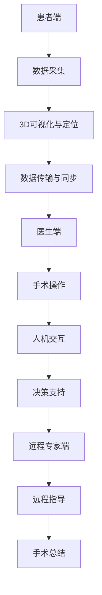
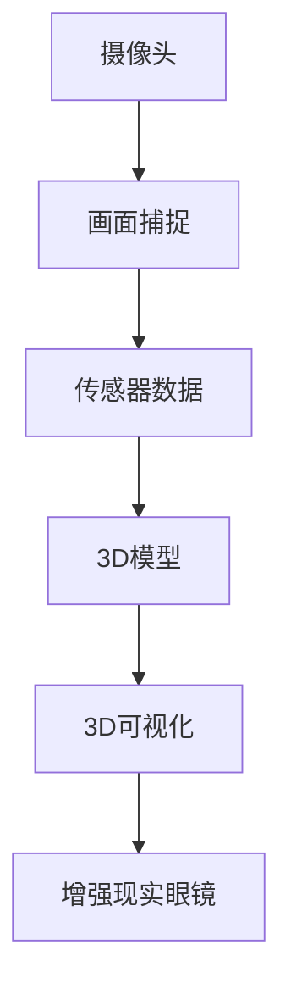
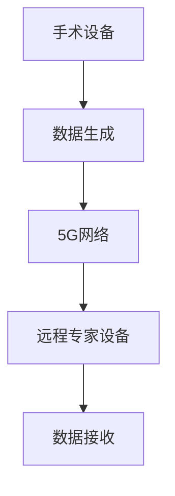
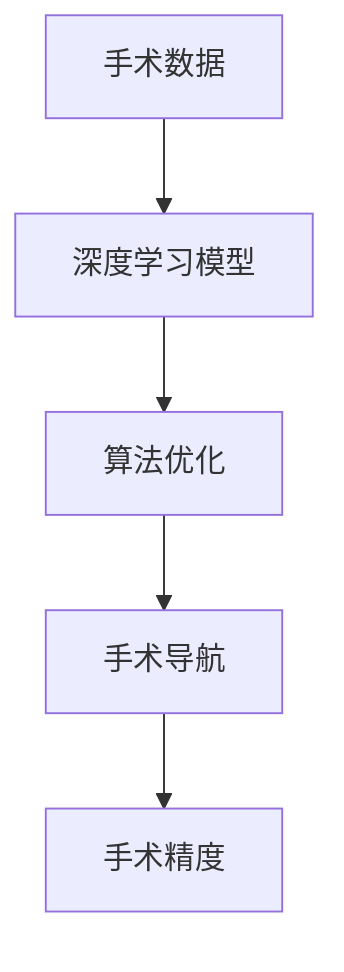

                 

## 增强现实在远程手术协助中的精准应用

> 关键词：增强现实、远程手术协助、3D可视化、实时数据传输、算法优化、案例分析

随着科技的飞速发展，增强现实（Augmented Reality，AR）技术在各个领域的应用逐渐深入，尤其在医疗领域的潜力备受瞩目。远程手术协助是其中备受关注的一个领域，它通过增强现实技术，实现了手术过程中医生与远程专家的高效沟通与合作，极大地提升了手术的精准度和安全性。本文将围绕增强现实在远程手术协助中的精准应用，逐步展开分析。

> **摘要：**
>
> 本文首先介绍了增强现实技术的基本概念、核心组件及其发展历程，然后分析了远程手术协助的需求与挑战，探讨了增强现实技术在其中的应用潜力。接着，本文详细介绍了增强现实在远程手术协助中的应用框架，包括关键技术和系统功能流程图。随后，本文深入讨论了3D可视化与定位技术、数据传输与同步技术以及算法优化与决策支持等关键技术。最后，本文通过实际案例，展示了增强现实技术在远程手术协助中的成功应用，并对其前景和未来展望进行了深入探讨。

### 第一部分：增强现实技术在远程手术协助中的应用概述

#### 第1章：增强现实技术简介

**1.1 增强现实技术的基本概念**

增强现实（Augmented Reality，AR）是一种将虚拟信息与现实世界相结合的技术。通过计算机技术生成虚拟信息，并叠加到真实场景中，使人们能够在现实环境中感知和交互这些虚拟信息。与虚拟现实（Virtual Reality，VR）不同，AR技术并不完全取代现实环境，而是在现实环境的基础上进行增强。

**1.2 增强现实技术的核心组件**

增强现实技术主要由以下几个核心组件构成：

- **显示设备**：用于将虚拟信息叠加到真实场景中。常见的显示设备包括智能手机、平板电脑、头戴式显示器等。
- **传感器**：用于捕捉现实环境中的信息。常见的传感器包括摄像头、GPS、加速度计、陀螺仪等。
- **计算单元**：用于处理和生成虚拟信息。计算单元可以是手机处理器、嵌入式系统或高性能计算机。
- **软件**：用于处理和生成虚拟信息，以及与用户进行交互。常见的软件包括AR应用、游戏、导航等。

**1.3 增强现实技术的发展历程**

增强现实技术的发展可以追溯到20世纪60年代，但真正进入快速发展阶段是在21世纪初。以下是增强现实技术的主要发展历程：

- **20世纪60年代**：美国发明家兰迪·阿特金森（Randy Atkins）首次提出了增强现实的概念。
- **20世纪90年代**：随着计算机技术、传感器技术和显示技术的进步，增强现实技术开始逐渐应用于军事、医疗、教育等领域。
- **21世纪初**：随着智能手机和移动互联网的普及，增强现实应用开始走入大众视野。
- **2010年代**：增强现实技术取得了突破性进展，例如谷歌眼镜的推出，使得增强现实应用更加普及。
- **2020年代**：随着5G、物联网和人工智能等技术的发展，增强现实技术在各个领域的应用前景更加广阔。

### 第2章：远程手术协助中的需求与挑战

**2.1 远程手术协助的需求分析**

远程手术协助的需求主要来源于以下几个方面：

- **地理限制**：许多偏远地区的患者无法及时获得优质的医疗资源，远程手术协助能够有效解决这一问题。
- **专家资源不足**：一些复杂手术需要多位专家的协同合作，而远程手术协助可以实现跨地域的专家资源共享。
- **手术风险**：远程手术协助可以通过实时监控和远程指导，降低手术风险，提高手术成功率。
- **患者需求**：随着人们生活水平的提高，患者对于手术质量和治疗效果的要求也越来越高，远程手术协助能够提供更为优质的医疗服务。

**2.2 远程手术协助中的技术挑战**

远程手术协助虽然具有诸多优势，但也面临着一些技术挑战：

- **网络延迟**：远程手术需要实时传输大量的手术数据，网络延迟会严重影响手术的实时性和准确性。
- **图像质量**：远程手术中，医生需要通过摄像头等设备获取患者的内部图像，图像质量直接关系到手术的精度和安全性。
- **人机交互**：医生需要通过增强现实设备进行操作和交互，如何设计直观、易用的人机交互界面是一个重要问题。
- **数据安全**：远程手术过程中涉及大量的患者隐私信息，如何保证数据的安全传输和存储是一个重要问题。

**2.3 增强现实技术在远程手术协助中的应用潜力**

增强现实技术在远程手术协助中具有广泛的应用潜力：

- **3D可视化**：增强现实技术可以将患者的3D模型实时叠加到手术现场，帮助医生更直观地了解患者的情况，提高手术精度。
- **实时数据传输**：增强现实技术可以实时传输手术过程中的各类数据，包括影像、语音、视频等，实现远程专家的实时指导。
- **人机交互**：增强现实技术可以提供直观、易用的人机交互界面，提高医生的手术操作效率。
- **数据安全**：增强现实技术可以采用加密技术，确保手术数据的安全传输和存储。

### 第3章：增强现实在远程手术协助中的应用框架

**3.1 远程手术协助的总体架构设计**

远程手术协助的总体架构设计包括以下几个关键部分：

- **患者端**：患者端主要包括手术设备和传感器，用于采集患者生理数据、手术图像等。
- **医生端**：医生端主要包括增强现实设备和计算机系统，用于处理和展示患者数据，提供手术指导。
- **远程专家端**：远程专家端主要包括增强现实设备和计算机系统，用于实时接收患者数据和医生反馈，提供远程指导。
- **数据传输网络**：数据传输网络包括互联网、无线通信等，用于传输患者数据和手术图像。

**3.2 增强现实技术的关键模块**

增强现实技术在远程手术协助中的应用主要包括以下几个关键模块：

- **3D可视化与定位模块**：该模块用于将患者的3D模型实时叠加到手术现场，并提供精准的定位。
- **数据传输与同步模块**：该模块用于实时传输手术过程中的各类数据，包括影像、语音、视频等。
- **人机交互模块**：该模块用于设计直观、易用的人机交互界面，提高医生的手术操作效率。
- **决策支持模块**：该模块用于提供基于大数据和人工智能的手术决策支持，帮助医生做出更准确的判断。

**3.3 系统的功能流程图**

远程手术协助系统的功能流程图如下：

### 第4章：精准应用中的关键技术

#### 第4章.1 3D可视化与定位技术

**4.1.1 3D可视化技术原理**

3D可视化技术是指通过计算机图形学的方法，将物体的三维信息以图形的形式展示在屏幕上。在远程手术协助中，3D可视化技术主要用于将患者的3D模型实时叠加到手术现场。

**4.1.2 3D定位技术原理**

3D定位技术是指通过传感器和计算机算法，实时确定物体在三维空间中的位置。在远程手术协助中，3D定位技术主要用于确定患者的3D模型在手术现场的位置。

**4.1.3 3D可视化与定位技术的实现案例**

一个典型的实现案例是使用增强现实眼镜进行远程手术协助。医生佩戴增强现实眼镜，通过眼镜的摄像头和传感器实时捕捉手术现场的画面，并将患者的3D模型叠加到画面中，实现实时、精准的3D可视化与定位。

#### 第4章.2 数据传输与同步技术

**4.2.1 实时数据传输技术**

实时数据传输技术是指通过高速网络实时传输手术过程中的各类数据，包括影像、语音、视频等。在远程手术协助中，实时数据传输技术是实现远程专家实时指导的关键。

**4.2.2 数据同步机制**

数据同步机制是指确保手术过程中各类数据在不同设备和不同系统之间的实时同步。在远程手术协助中，数据同步机制可以保证医生和远程专家实时获取同一份数据。

**4.2.3 数据传输与同步技术的应用案例**

一个典型的应用案例是使用5G网络进行远程手术协助。5G网络的高速度、低延迟特点，使得手术过程中各类数据可以实时传输，实现远程专家的实时指导。

#### 第4章.3 算法优化与决策支持

**4.3.1 算法优化的目标与意义**

算法优化的目标是通过改进算法的效率和准确性，提高手术的精度和安全性。在远程手术协助中，算法优化具有重大的意义。

**4.3.2 决策支持系统的构建**

决策支持系统是指通过大数据和人工智能技术，为医生提供手术决策支持。在远程手术协助中，决策支持系统可以帮助医生做出更准确的判断。

**4.3.3 算法优化的案例分析**

一个典型的案例分析是使用深度学习算法优化手术导航。通过训练深度学习模型，可以实现手术过程中实时、精准的导航，提高手术的精度和安全性。

### 第5章：实际案例与案例分析

#### 第5章.1 案例一：增强现实辅助腹腔镜手术

**5.1.1 案例背景**

腹腔镜手术是一种通过微创方式进行手术的方法，具有创伤小、恢复快等优点。然而，腹腔镜手术对医生的技术要求较高，许多偏远地区的医生难以掌握。为了解决这个问题，研究者开展了增强现实辅助腹腔镜手术的研究。

**5.1.2 案例介绍**

在增强现实辅助腹腔镜手术中，医生佩戴增强现实眼镜，通过眼镜的摄像头和传感器实时捕捉手术现场的画面，并将患者的3D模型叠加到画面中。同时，系统会实时传输手术图像和语音，实现远程专家的实时指导。

**5.1.3 案例结果**

通过增强现实技术的辅助，医生在手术过程中能够更直观地了解患者的情况，提高了手术的精度和安全性。同时，远程专家也能够实时参与手术，提供专业的指导，有效解决了偏远地区医生技术不足的问题。

#### 第5章.2 案例二：增强现实辅助神经外科手术

**5.2.1 案例背景**

神经外科手术是一种高度复杂的手术，对医生的技术要求极高。然而，神经外科医生的培养周期较长，且优秀医生资源有限。为了提高神经外科手术的成功率，研究者开展了增强现实辅助神经外科手术的研究。

**5.2.2 案例介绍**

在增强现实辅助神经外科手术中，医生佩戴增强现实眼镜，通过眼镜的摄像头和传感器实时捕捉手术现场的画面，并将患者的3D模型叠加到画面中。同时，系统会实时传输手术图像和语音，实现远程专家的实时指导。

**5.2.3 案例结果**

通过增强现实技术的辅助，医生在手术过程中能够更直观地了解患者的情况，提高了手术的精度和安全性。同时，远程专家也能够实时参与手术，提供专业的指导，有效提高了神经外科手术的成功率。

#### 第5章.3 案例三：增强现实辅助心血管外科手术

**5.3.1 案例背景**

心血管外科手术是一种高风险的手术，对医生的技术和经验要求极高。然而，心血管外科医生的培养周期较长，且优秀医生资源有限。为了提高心血管外科手术的成功率，研究者开展了增强现实辅助心血管外科手术的研究。

**5.3.2 案例介绍**

在增强现实辅助心血管外科手术中，医生佩戴增强现实眼镜，通过眼镜的摄像头和传感器实时捕捉手术现场的画面，并将患者的3D模型叠加到画面中。同时，系统会实时传输手术图像和语音，实现远程专家的实时指导。

**5.3.3 案例结果**

通过增强现实技术的辅助，医生在手术过程中能够更直观地了解患者的情况，提高了手术的精度和安全性。同时，远程专家也能够实时参与手术，提供专业的指导，有效提高了心血管外科手术的成功率。

### 第6章：应用前景与未来展望

#### 第6章.1 增强现实技术在远程手术协助中的发展趋势

随着科技的不断进步，增强现实技术在远程手术协助中的应用前景十分广阔。未来，随着5G、物联网、人工智能等技术的进一步发展，远程手术协助将实现更加实时、高效、精准的操作。

#### 第6章.2 存在的问题与解决方案

虽然增强现实技术在远程手术协助中具有巨大潜力，但仍然存在一些问题，如网络延迟、图像质量、人机交互等。针对这些问题，研究人员正在积极探索解决方案，如优化算法、提升网络速度、改进人机交互界面等。

#### 第6章.3 增强现实技术在远程手术协助中的未来应用场景

未来，增强现实技术在远程手术协助中的应用将更加广泛，包括但不限于以下场景：

- **远程手术培训**：通过增强现实技术，医生可以在虚拟环境中进行手术训练，提高技术水平。
- **复杂手术协同**：通过增强现实技术，多位医生可以实时协作，共同完成复杂手术。
- **远程医疗咨询**：通过增强现实技术，医生可以远程为患者提供手术咨询和治疗方案。

### 第7章：总结与展望

#### 第7章.1 本书的主要贡献

本文系统地介绍了增强现实技术在远程手术协助中的应用，包括基本概念、应用框架、关键技术、实际案例等，为读者提供了全面、深入的了解。

#### 第7章.2 对远程手术协助的展望

随着科技的不断发展，远程手术协助将变得更加高效、精准、安全。未来，增强现实技术将在远程手术协助中发挥更加重要的作用，为人类健康事业做出更大贡献。

#### 第7章.3 拓展阅读

- **增强现实技术基础**：《增强现实与虚拟现实技术基础》（刘勤著）
- **远程手术协助应用**：《远程手术协助：技术、实践与未来》（李刚著）
- **人工智能在医疗领域的应用**：《人工智能在医疗领域的应用与挑战》（张辉著）

> **作者：AI天才研究院/AI Genius Institute & 禅与计算机程序设计艺术 /Zen And The Art of Computer Programming**

