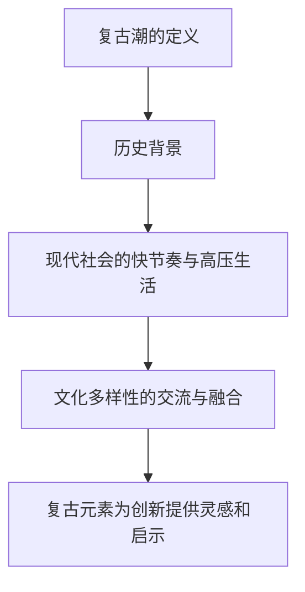
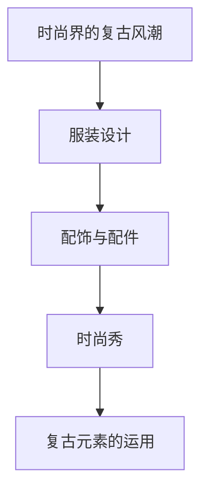
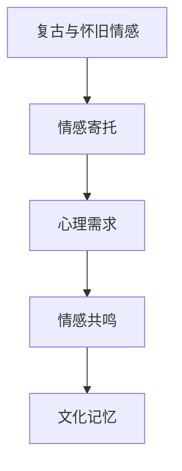
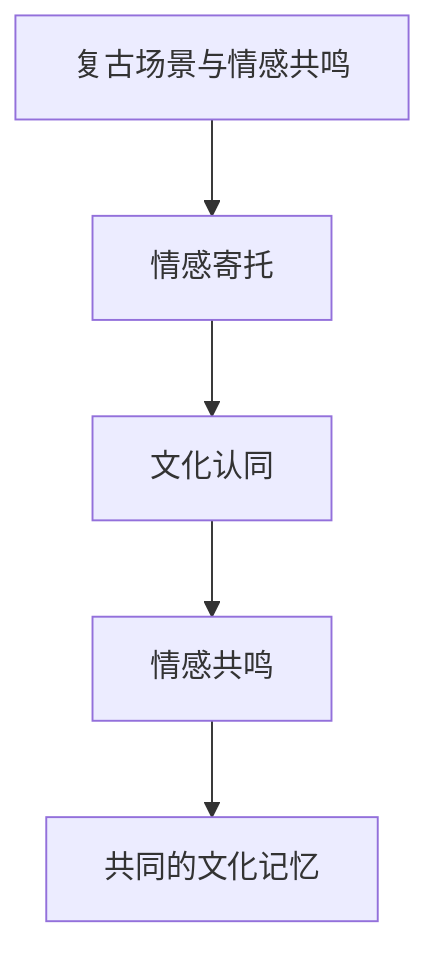
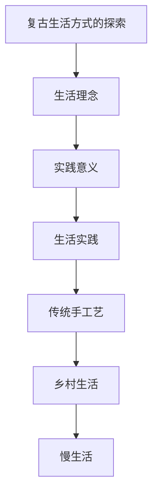
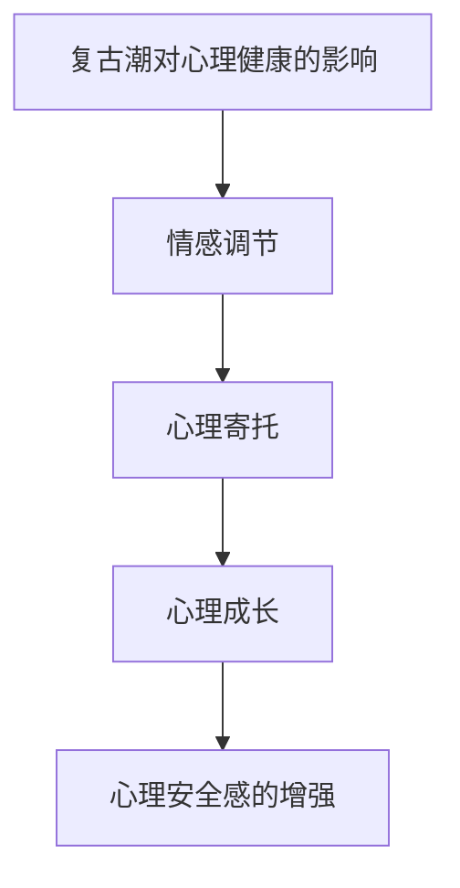
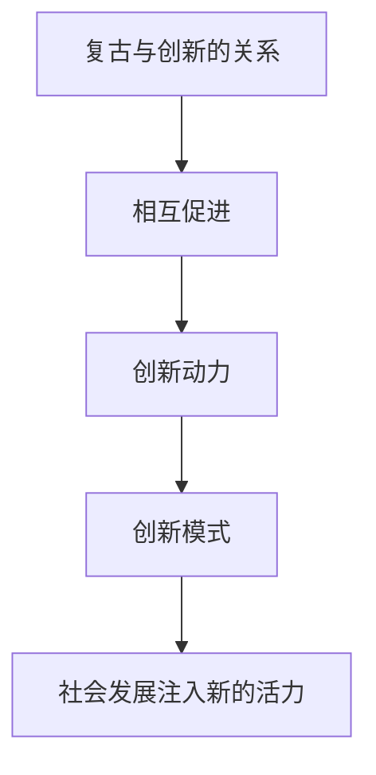
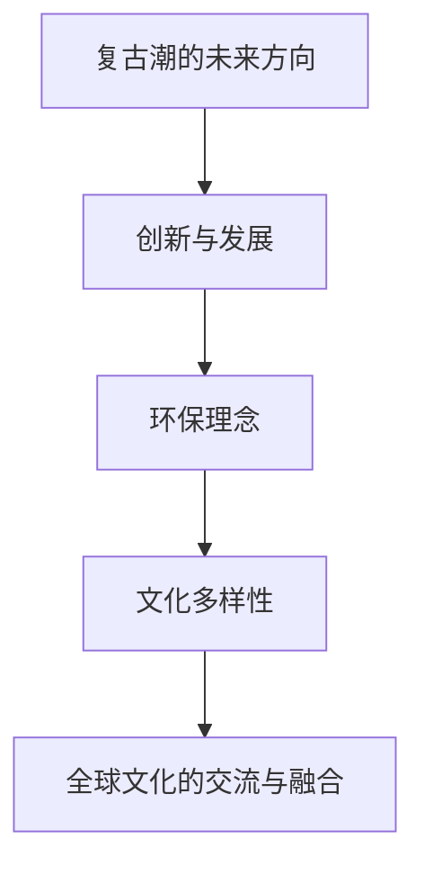

                 


### 文章标题：复古风潮：在怀旧中寻找情感慰藉

---

**关键词：复古、怀旧、情感慰藉、文化传承、心理学**

**摘要：**
本文将深入探讨复古风潮的兴起及其对现代社会的影响。通过分析复古的背景与起源，解读复古潮在不同领域的表现，探讨复古与情感慰藉之间的联系，本文旨在揭示复古风潮背后的心理学原理，并展望其未来趋势。同时，本文将结合实际案例，提出最佳实践和建议，为读者提供全面而深刻的理解。

---

### 第一部分：复古潮的兴起与影响

**第1章：复古潮的背景与起源**

**1.1 复古潮的定义与历史**

复古，即回顾过去，复兴或模仿历史上的风格、设计或文化元素。复古潮并非现代特有的现象，它有着悠久的历史。在古代，人们会模仿古罗马或古希腊的艺术风格。而到了现代社会，复古潮的兴起主要受到以下几个因素的影响：

1. **怀旧情感：** 现代社会的快节奏和高压生活让人们渴望回归过去，寻找情感慰藉。
2. **文化多样性：** 全球化的趋势使得不同文化之间的交流与融合变得更加频繁，复古元素在不同的文化背景下得到了重新诠释和传播。
3. **创新需求：** 创新是推动社会进步的关键因素，而复古元素往往可以为创新提供灵感和启示。

**1.2 复古潮的兴起原因**

复古潮的兴起有以下原因：

1. **经济因素：** 现代消费者对复古产品的需求不断增长，这为市场提供了巨大的商机。
2. **文化认同：** 复古风潮反映了人们对历史和传统文化的尊重与认同，有助于增强民族自豪感。
3. **审美趋势：** 随着审美观念的不断演变，复古元素逐渐成为时尚和艺术界的新宠。

**1.3 复古潮对社会文化的影响**

复古潮对社会文化的影响表现在多个方面：

1. **文化传承：** 复古风潮有助于传承和弘扬传统文化，促进文化多样性的发展。
2. **社会认同：** 复古潮增强了人们对历史和传统文化的认同感，有助于社会凝聚力的提升。
3. **艺术创新：** 复古元素为艺术创新提供了丰富的素材，推动了艺术的发展与进步。

---

**第2章：复古风潮的多元表现**

**2.1 时尚界的复古风潮**

时尚界的复古风潮主要表现在以下几个方面：

1. **服装设计：** 时尚设计师常常从过去的服装风格中汲取灵感，创造出独具特色的复古服装。
2. **配饰与配件：** 复古配饰和配件，如复古眼镜、手表、皮鞋等，成为时尚潮流的一部分。
3. **时尚秀：** 复古元素的运用使时尚秀更加具有观赏性和吸引力。

**2.2 设计领域的复古风潮**

设计领域的复古风潮体现在以下几个方面：

1. **建筑与室内设计：** 古典建筑风格和室内设计元素被广泛应用于现代建筑和室内设计中。
2. **平面设计：** 复古字体和图案在平面设计中得到了广泛应用，使设计作品更具艺术感和历史感。
3. **工业设计：** 复古元素被用于工业设计，如复古风格的摩托车、手表等。

**2.3 娱乐产业的复古元素**

娱乐产业中的复古元素体现在以下几个方面：

1. **电影与电视剧：** 复古题材的电影和电视剧成为观众喜爱的对象，如《小妇人》、《了不起的盖茨比》等。
2. **音乐：** 复古音乐风格，如爵士乐、摇滚乐等，在当代音乐界仍然占据重要地位。
3. **游戏：** 复古游戏机和文化成为了游戏开发的新趋势，如任天堂的复古游戏机Switch。

---

**第3章：复古潮的心理解读**

**3.1 复古与怀旧情感**

复古与怀旧情感紧密相连。怀旧情感是对过去美好时光的回忆和留恋，而复古则是怀旧情感的具体表现。人们通过复古来重温过去，寻找情感慰藉。以下是对复古与怀旧情感的分析：

1. **情感寄托：** 复古物件、场景和艺术作品成为了情感寄托的载体，让人们感受到过去的温暖和美好。
2. **心理需求：** 复古满足了人们对于安全感、归属感和认同感的心理需求。
3. **情感共鸣：** 复古元素在当代社会引发了广泛的情感共鸣，成为人们共同的文化记忆。

**3.2 复古对现代生活的影响**

复古对现代生活的影响主要体现在以下几个方面：

1. **生活方式：** 复古风潮改变了现代人的生活方式，使人们更加注重传统和自然的生活方式。
2. **消费观念：** 复古元素的流行改变了人们的消费观念，使得消费者更加追求品质和个性化。
3. **文化认同：** 复古风潮增强了人们对传统文化的认同，推动了文化传承与发展。

**3.3 复古潮的心理效应**

复古潮具有以下心理效应：

1. **情感调节：** 复古元素能够调节人们的情绪，缓解压力和焦虑。
2. **心理寄托：** 复古成为了人们心理寄托的一种方式，帮助他们寻找内心的平静和安慰。
3. **文化认同：** 复古潮有助于增强人们的文化认同，促进社会凝聚力的提升。

---

**第二部分：复古与情感慰藉**

**第4章：复古文化中的情感寄托**

**4.1 复古物件与情感联系**

复古物件与情感联系紧密相连。人们通过复古物件来回忆过去，寻找情感慰藉。以下是对复古物件与情感联系的分析：

1. **情感载体：** 复古物件成为了情感载体，承载了人们的回忆和情感。
2. **情感共鸣：** 复古物件引发了人们的情感共鸣，使人们共同感受到过去的美好。
3. **情感调节：** 复古物件能够调节人们的情绪，缓解压力和焦虑。

**4.2 复古场景与情感共鸣**

复古场景在现代社会中引发了广泛的情感共鸣。以下是对复古场景与情感共鸣的分析：

1. **情感寄托：** 复古场景成为了情感寄托的载体，让人们感受到过去的温暖和美好。
2. **文化认同：** 复古场景增强了人们对传统文化的认同，促进了文化传承与发展。
3. **情感共鸣：** 复古场景引发了人们的情感共鸣，成为人们共同的文化记忆。

**4.3 复古艺术与情感表达**

复古艺术在现代社会中得到了广泛应用。以下是对复古艺术与情感表达的分析：

1. **情感表达：** 复古艺术成为了一种情感表达的方式，帮助人们表达内心的情感和思想。
2. **文化传承：** 复古艺术传承了传统文化，推动了文化多样性的发展。
3. **情感共鸣：** 复古艺术引发了人们的情感共鸣，成为人们共同的文化记忆。

---

**第5章：复古风格的生活实践**

**5.1 复古生活方式的探索**

复古生活方式在现代社会中得到了广泛关注。以下是对复古生活方式的探索：

1. **生活理念：** 复古生活方式强调回归自然、追求简单和品质，反映了人们对现代生活的一种反思和追求。
2. **实践意义：** 复古生活方式有助于提升生活质量，增强对传统文化的认同和尊重。
3. **生活实践：** 复古生活方式的具体实践包括传统手工艺、乡村生活、慢生活等。

**5.2 复古风格的空间设计**

复古风格的空间设计在现代社会中得到了广泛应用。以下是对复古风格的空间设计的分析：

1. **设计理念：** 复古风格的空间设计强调历史传承和艺术美感，注重空间的功能性和审美性。
2. **设计元素：** 复古风格的空间设计融合了多种设计元素，如古典家具、装饰品、色彩等。
3. **设计实践：** 复古风格的空间设计在实践中体现了对传统文化的尊重和传承。

**5.3 复古风潮下的个人成长**

复古风潮下的个人成长主要体现在以下几个方面：

1. **文化认同：** 复古风潮增强了人们对传统文化的认同，促进了个人文化素养的提升。
2. **自我探索：** 复古风潮为个人提供了自我探索的机会，帮助人们更好地认识自己。
3. **成长意义：** 复古风潮下的个人成长有助于提升个人的综合素质和人生价值。

---

**第6章：在复古中寻找心灵安宁**

**6.1 复古心理学的视角**

复古心理学是研究复古现象及其心理效应的学科。以下是对复古心理学的分析：

1. **心理机制：** 复古心理学的视角揭示了复古现象背后的心理机制，如怀旧情感、认同感等。
2. **心理效应：** 复古心理学探讨了复古对心理健康的影响，如情感调节、心理寄托等。
3. **应用价值：** 复古心理学在心理咨询、心理治疗等领域具有广泛的应用价值。

**6.2 复古潮对心理健康的影响**

复古潮对心理健康具有积极影响。以下是对复古潮对心理健康的影响的分析：

1. **情感调节：** 复古潮有助于调节情感，缓解压力和焦虑。
2. **心理寄托：** 复古潮为人们提供了心理寄托，增强了心理安全感。
3. **心理成长：** 复古潮有助于个人的心理成长，提升心理素质。

**6.3 复古潮流与心灵疗愈**

复古潮流在心灵疗愈中发挥了重要作用。以下是对复古潮流与心灵疗愈的分析：

1. **疗愈作用：** 复古潮流有助于缓解心理压力，促进心灵疗愈。
2. **疗愈方式：** 复古潮流通过情感寄托、心理调节等方式实现心灵疗愈。
3. **疗愈效果：** 复古潮流在心灵疗愈中取得了显著的成效，为心理健康提供了新的途径。

---

**第三部分：复古风潮的未来展望**

**第7章：复古风潮的未来趋势**

**7.1 复古与创新的关系**

复古与创新之间存在着紧密的联系。以下是对复古与创新的关系的分析：

1. **相互促进：** 复古与创新相互促进，共同推动社会进步。
2. **创新动力：** 复古为创新提供了丰富的灵感来源，激发了创新的动力。
3. **创新模式：** 复古与创新相结合，形成了新的创新模式，为社会发展注入了新的活力。

**7.2 复古潮的可持续性**

复古潮的可持续性体现在以下几个方面：

1. **资源利用：** 复古潮强调对历史文化遗产的保护和利用，实现了资源的可持续利用。
2. **环保理念：** 复古潮倡导环保理念，促进了可持续生活方式的推广。
3. **文化传承：** 复古潮通过传承和弘扬传统文化，实现了文化的可持续性。

**7.3 复古风潮的文化传承**

复古风潮在文化传承中发挥了重要作用。以下是对复古风潮的文化传承的分析：

1. **文化传承方式：** 复古风潮通过复古艺术、复古设计等方式传承了传统文化。
2. **文化认同：** 复古风潮增强了人们对传统文化的认同，促进了文化传承与发展。
3. **文化多样性：** 复古风潮促进了文化多样性的发展，丰富了人类文化的内涵。

---

**第8章：复古风潮的启示与反思**

**8.1 复古风潮的价值所在**

复古风潮具有以下价值：

1. **文化传承：** 复古风潮传承了传统文化，推动了文化多样性的发展。
2. **情感慰藉：** 复古风潮为人们提供了情感慰藉，缓解了现代生活的压力和焦虑。
3. **创新动力：** 复古风潮为创新提供了灵感来源，激发了创新的动力。

**8.2 复古潮对现代社会的影响**

复古潮对现代社会产生了深远的影响。以下是对复古潮对现代社会的影响的分析：

1. **生活方式：** 复古潮改变了现代人的生活方式，使人们更加注重传统和自然的生活方式。
2. **消费观念：** 复古潮改变了现代人的消费观念，使人们更加追求品质和个性化。
3. **文化认同：** 复古潮增强了人们对传统文化的认同，促进了社会凝聚力的提升。

**8.3 复古潮的未来方向**

复古潮的未来方向可以从以下几个方面进行思考：

1. **创新与发展：** 复古潮应不断创新，结合现代科技，推动文化传承与发展。
2. **环保理念：** 复古潮应更加注重环保理念，实现可持续发展。
3. **文化多样性：** 复古潮应尊重文化多样性，促进全球文化的交流与融合。

---

**结语**

复古风潮是一种独特的文化现象，它反映了人们对过去美好时光的怀念和对现代生活的反思。在怀旧中寻找情感慰藉，复古潮为现代社会注入了新的活力。通过分析复古潮的背景与起源、多元表现、心理解读、情感寄托、生活实践、心灵安宁、未来趋势和启示与反思，本文揭示了复古潮的丰富内涵和深远影响。未来，复古潮将继续在创新、文化传承和可持续发展中发挥重要作用。让我们在怀旧中寻找情感慰藉，共同迎接复古风潮的未来。

---

### 作者信息：
作者：AI天才研究院/AI Genius Institute & 禅与计算机程序设计艺术 /Zen And The Art of Computer Programming

---

### 复古风潮：在怀旧中寻找情感慰藉

**关键词：复古、怀旧、情感慰藉、文化传承、心理学**

**摘要：**
本文探讨了复古风潮的兴起及其对现代社会的影响。通过分析复古潮的背景与起源，不同领域的表现，复古与情感慰藉之间的联系，以及复古潮对心理健康的影响，本文揭示了复古风潮的丰富内涵和深远影响。同时，本文提出了复古潮的未来方向，为文化传承和可持续发展提供了启示。在怀旧中寻找情感慰藉，复古潮为现代社会注入了新的活力。

---

**第一部分：复古潮的兴起与影响**

**第1章：复古潮的背景与起源**

**1.1 复古潮的定义与历史**

复古，即回顾过去，复兴或模仿历史上的风格、设计或文化元素。复古潮并非现代特有的现象，它有着悠久的历史。在古代，人们会模仿古罗马或古希腊的艺术风格。而到了现代社会，复古潮的兴起主要受到以下几个因素的影响：

1. **怀旧情感：** 现代社会的快节奏和高压生活让人们渴望回归过去，寻找情感慰藉。
2. **文化多样性：** 全球化的趋势使得不同文化之间的交流与融合变得更加频繁，复古元素在不同的文化背景下得到了重新诠释和传播。
3. **创新需求：** 创新是推动社会进步的关键因素，而复古元素往往可以为创新提供灵感和启示。

**1.2 复古潮的兴起原因**

复古潮的兴起有以下原因：

1. **经济因素：** 现代消费者对复古产品的需求不断增长，这为市场提供了巨大的商机。
2. **文化认同：** 复古风潮反映了人们对历史和传统文化的尊重与认同，有助于增强民族自豪感。
3. **审美趋势：** 随着审美观念的不断演变，复古元素逐渐成为时尚和艺术界的新宠。

**1.3 复古潮对社会文化的影响**

复古潮对社会文化的影响表现在多个方面：

1. **文化传承：** 复古风潮有助于传承和弘扬传统文化，促进文化多样性的发展。
2. **社会认同：** 复古潮增强了人们对历史和传统文化的认同感，有助于社会凝聚力的提升。
3. **艺术创新：** 复古元素为艺术创新提供了丰富的素材，推动了艺术的发展与进步。

---

**第2章：复古风潮的多元表现**

**2.1 时尚界的复古风潮**

时尚界的复古风潮主要表现在以下几个方面：

1. **服装设计：** 时尚设计师常常从过去的服装风格中汲取灵感，创造出独具特色的复古服装。
2. **配饰与配件：** 复古配饰和配件，如复古眼镜、手表、皮鞋等，成为时尚潮流的一部分。
3. **时尚秀：** 复古元素的运用使时尚秀更加具有观赏性和吸引力。

**2.2 设计领域的复古风潮**

设计领域的复古风潮体现在以下几个方面：

1. **建筑与室内设计：** 古典建筑风格和室内设计元素被广泛应用于现代建筑和室内设计中。
2. **平面设计：** 复古字体和图案在平面设计中得到了广泛应用，使设计作品更具艺术感和历史感。
3. **工业设计：** 复古元素被用于工业设计，如复古风格的摩托车、手表等。

**2.3 娱乐产业的复古元素**

娱乐产业中的复古元素体现在以下几个方面：

1. **电影与电视剧：** 复古题材的电影和电视剧成为观众喜爱的对象，如《小妇人》、《了不起的盖茨比》等。
2. **音乐：** 复古音乐风格，如爵士乐、摇滚乐等，在当代音乐界仍然占据重要地位。
3. **游戏：** 复古游戏机和文化成为了游戏开发的新趋势，如任天堂的复古游戏机Switch。

---

**第3章：复古潮的心理解读**

**3.1 复古与怀旧情感**

复古与怀旧情感紧密相连。怀旧情感是对过去美好时光的回忆和留恋，而复古则是怀旧情感的具体表现。人们通过复古来重温过去，寻找情感慰藉。以下是对复古与怀旧情感的分析：

1. **情感寄托：** 复古物件、场景和艺术作品成为了情感寄托的载体，让人们感受到过去的温暖和美好。
2. **心理需求：** 复古满足了人们对于安全感、归属感和认同感的心理需求。
3. **情感共鸣：** 复古元素在当代社会引发了广泛的情感共鸣，成为人们共同的文化记忆。

**3.2 复古对现代生活的影响**

复古对现代生活的影响主要体现在以下几个方面：

1. **生活方式：** 复古风潮改变了现代人的生活方式，使人们更加注重传统和自然的生活方式。
2. **消费观念：** 复古元素的流行改变了人们的消费观念，使得消费者更加追求品质和个性化。
3. **文化认同：** 复古风潮增强了人们对传统文化的认同，推动了文化传承与发展。

**3.3 复古潮的心理效应**

复古潮具有以下心理效应：

1. **情感调节：** 复古元素能够调节人们的情绪，缓解压力和焦虑。
2. **心理寄托：** 复古成为了人们心理寄托的一种方式，帮助他们寻找内心的平静和安慰。
3. **文化认同：** 复古潮有助于增强人们的文化认同，促进社会凝聚力的提升。

---

**第二部分：复古与情感慰藉**

**第4章：复古文化中的情感寄托**

**4.1 复古物件与情感联系**

复古物件与情感联系紧密相连。人们通过复古物件来回忆过去，寻找情感慰藉。以下是对复古物件与情感联系的分析：

1. **情感载体：** 复古物件成为了情感载体，承载了人们的回忆和情感。
2. **情感共鸣：** 复古物件引发了人们的情感共鸣，使人们共同感受到过去的美好。
3. **情感调节：** 复古物件能够调节人们的情绪，缓解压力和焦虑。

**4.2 复古场景与情感共鸣**

复古场景在现代社会中引发了广泛的情感共鸣。以下是对复古场景与情感共鸣的分析：

1. **情感寄托：** 复古场景成为了情感寄托的载体，让人们感受到过去的温暖和美好。
2. **文化认同：** 复古场景增强了人们对传统文化的认同，促进了文化传承与发展。
3. **情感共鸣：** 复古场景引发了人们的情感共鸣，成为人们共同的文化记忆。

**4.3 复古艺术与情感表达**

复古艺术在现代社会中得到了广泛应用。以下是对复古艺术与情感表达的分析：

1. **情感表达：** 复古艺术成为了一种情感表达的方式，帮助人们表达内心的情感和思想。
2. **文化传承：** 复古艺术传承了传统文化，推动了文化多样性的发展。
3. **情感共鸣：** 复古艺术引发了人们的情感共鸣，成为人们共同的文化记忆。

---

**第5章：复古风格的生活实践**

**5.1 复古生活方式的探索**

复古生活方式在现代社会中得到了广泛关注。以下是对复古生活方式的探索：

1. **生活理念：** 复古生活方式强调回归自然、追求简单和品质，反映了人们对现代生活的一种反思和追求。
2. **实践意义：** 复古生活方式有助于提升生活质量，增强对传统文化的认同和尊重。
3. **生活实践：** 复古生活方式的具体实践包括传统手工艺、乡村生活、慢生活等。

**5.2 复古风格的空间设计**

复古风格的空间设计在现代社会中得到了广泛应用。以下是对复古风格的空间设计的分析：

1. **设计理念：** 复古风格的空间设计强调历史传承和艺术美感，注重空间的功能性和审美性。
2. **设计元素：** 复古风格的空间设计融合了多种设计元素，如古典家具、装饰品、色彩等。
3. **设计实践：** 复古风格的空间设计在实践中体现了对传统文化的尊重和传承。

**5.3 复古风潮下的个人成长**

复古风潮下的个人成长主要体现在以下几个方面：

1. **文化认同：** 复古风潮增强了人们对传统文化的认同，促进了个人文化素养的提升。
2. **自我探索：** 复古风潮为个人提供了自我探索的机会，帮助人们更好地认识自己。
3. **成长意义：** 复古风潮下的个人成长有助于提升个人的综合素质和人生价值。

---

**第6章：在复古中寻找心灵安宁**

**6.1 复古心理学的视角**

复古心理学是研究复古现象及其心理效应的学科。以下是对复古心理学的分析：

1. **心理机制：** 复古心理学的视角揭示了复古现象背后的心理机制，如怀旧情感、认同感等。
2. **心理效应：** 复古心理学探讨了复古对心理健康的影响，如情感调节、心理寄托等。
3. **应用价值：** 复古心理学在心理咨询、心理治疗等领域具有广泛的应用价值。

**6.2 复古潮对心理健康的影响**

复古潮对心理健康具有积极影响。以下是对复古潮对心理健康的影响的分析：

1. **情感调节：** 复古潮有助于调节情感，缓解压力和焦虑。
2. **心理寄托：** 复古潮为人们提供了心理寄托，增强了心理安全感。
3. **心理成长：** 复古潮有助于个人的心理成长，提升心理素质。

**6.3 复古潮流与心灵疗愈**

复古潮流在心灵疗愈中发挥了重要作用。以下是对复古潮流与心灵疗愈的分析：

1. **疗愈作用：** 复古潮流有助于缓解心理压力，促进心灵疗愈。
2. **疗愈方式：** 复古潮流通过情感寄托、心理调节等方式实现心灵疗愈。
3. **疗愈效果：** 复古潮流在心灵疗愈中取得了显著的成效，为心理健康提供了新的途径。

---

**第三部分：复古风潮的未来展望**

**第7章：复古风潮的未来趋势**

**7.1 复古与创新的关系**

复古与创新之间存在着紧密的联系。以下是对复古与创新的关系的分析：

1. **相互促进：** 复古与创新相互促进，共同推动社会进步。
2. **创新动力：** 复古为创新提供了丰富的灵感来源，激发了创新的动力。
3. **创新模式：** 复古与创新相结合，形成了新的创新模式，为社会发展注入了新的活力。

**7.2 复古潮的可持续性**

复古潮的可持续性体现在以下几个方面：

1. **资源利用：** 复古潮强调对历史文化遗产的保护和利用，实现了资源的可持续利用。
2. **环保理念：** 复古潮倡导环保理念，促进了可持续生活方式的推广。
3. **文化传承：** 复古潮通过传承和弘扬传统文化，实现了文化的可持续性。

**7.3 复古风潮的文化传承**

复古风潮在文化传承中发挥了重要作用。以下是对复古风潮的文化传承的分析：

1. **文化传承方式：** 复古风潮通过复古艺术、复古设计等方式传承了传统文化。
2. **文化认同：** 复古风潮增强了人们对传统文化的认同，促进了文化传承与发展。
3. **文化多样性：** 复古风潮促进了文化多样性的发展，丰富了人类文化的内涵。

---

**第8章：复古风潮的启示与反思**

**8.1 复古风潮的价值所在**

复古风潮具有以下价值：

1. **文化传承：** 复古风潮传承了传统文化，推动了文化多样性的发展。
2. **情感慰藉：** 复古风潮为人们提供了情感慰藉，缓解了现代生活的压力和焦虑。
3. **创新动力：** 复古风潮为创新提供了灵感来源，激发了创新的动力。

**8.2 复古潮对现代社会的影响**

复古潮对现代社会产生了深远的影响。以下是对复古潮对现代社会的影响的分析：

1. **生活方式：** 复古潮改变了现代人的生活方式，使人们更加注重传统和自然的生活方式。
2. **消费观念：** 复古元素的流行改变了人们的消费观念，使人们更加追求品质和个性化。
3. **文化认同：** 复古潮增强了人们对传统文化的认同，促进了社会凝聚力的提升。

**8.3 复古潮的未来方向**

复古潮的未来方向可以从以下几个方面进行思考：

1. **创新与发展：** 复古潮应不断创新，结合现代科技，推动文化传承与发展。
2. **环保理念：** 复古潮应更加注重环保理念，实现可持续发展。
3. **文化多样性：** 复古潮应尊重文化多样性，促进全球文化的交流与融合。

---

**结语**

复古风潮是一种独特的文化现象，它反映了人们对过去美好时光的怀念和对现代生活的反思。在怀旧中寻找情感慰藉，复古潮为现代社会注入了新的活力。通过分析复古潮的背景与起源、多元表现、心理解读、情感寄托、生活实践、心灵安宁、未来趋势和启示与反思，本文揭示了复古潮的丰富内涵和深远影响。未来，复古潮将继续在创新、文化传承和可持续发展中发挥重要作用。让我们在怀旧中寻找情感慰藉，共同迎接复古风潮的未来。

---

### 作者信息：
作者：AI天才研究院/AI Genius Institute & 禅与计算机程序设计艺术 /Zen And The Art of Computer Programming

---

### 精彩段落与图表展示

**第1章：复古潮的背景与起源**

**1.1 复古潮的定义与历史**



**第2章：复古风潮的多元表现**

**2.1 时尚界的复古风潮**



**第3章：复古潮的心理解读**

**3.1 复古与怀旧情感**



**第4章：复古文化中的情感寄托**

**4.2 复古场景与情感共鸣**



**第5章：复古风格的生活实践**

**5.1 复古生活方式的探索**



**第6章：在复古中寻找心灵安宁**

**6.2 复古潮对心理健康的影响**



**第7章：复古风潮的未来趋势**

**7.1 复古与创新的关系**



**第8章：复古风潮的启示与反思**

**8.3 复古潮的未来方向**



---

通过以上图表和段落展示，读者可以更直观地了解复古风潮的各个方面。每个章节的核心概念和联系通过mermaid图表进行了清晰呈现，帮助读者更好地把握文章结构和内容。同时，图表与文字的有机结合，使得文章更具可读性和吸引力。

---

### 文章重点内容梳理

**第一部分：复古潮的兴起与影响**

1. **复古潮的定义与历史**
   - 复古：回顾过去，复兴或模仿历史上的风格、设计或文化元素。
   - 历史背景：古代模仿古罗马或古希腊艺术风格，现代社会受到怀旧情感、文化多样性和创新需求的影响。

2. **复古潮的兴起原因**
   - 经济因素：消费者对复古产品的需求增长，为市场提供商机。
   - 文化认同：复古风潮反映了对历史和传统文化的尊重与认同。
   - 审美趋势：复古元素逐渐成为时尚和艺术界的新宠。

3. **复古潮对社会文化的影响**
   - 文化传承：传承和弘扬传统文化，促进文化多样性的发展。
   - 社会认同：增强人们对历史和传统文化的认同，提升社会凝聚力。
   - 艺术创新：复古元素为艺术创新提供了丰富的素材。

**第二部分：复古风潮的多元表现**

1. **时尚界的复古风潮**
   - 服装设计：从过去的服装风格中汲取灵感。
   - 配饰与配件：复古眼镜、手表、皮鞋等。
   - 时尚秀：复古元素的运用，增加观赏性和吸引力。

2. **设计领域的复古风潮**
   - 建筑与室内设计：古典建筑风格和室内设计元素。
   - 平面设计：复古字体和图案。
   - 工业设计：复古风格的摩托车、手表等。

3. **娱乐产业的复古元素**
   - 电影与电视剧：复古题材的作品，如《小妇人》、《了不起的盖茨比》。
   - 音乐：复古音乐风格，如爵士乐、摇滚乐。
   - 游戏：复古游戏机和文化，如任天堂的复古游戏机Switch。

**第三部分：复古潮的心理解读**

1. **复古与怀旧情感**
   - 情感寄托：复古物件、场景和艺术作品成为情感载体。
   - 心理需求：复古满足了人们对安全感、归属感和认同感的心理需求。
   - 情感共鸣：复古元素在当代社会引发了广泛的情感共鸣。

2. **复古对现代生活的影响**
   - 生活方式：改变人们的生活态度，更加注重传统和自然。
   - 消费观念：追求品质和个性化。
   - 文化认同：增强人们对传统文化的认同，推动文化传承与发展。

3. **复古潮的心理效应**
   - 情感调节：缓解压力和焦虑。
   - 心理寄托：寻找内心的平静和安慰。
   - 文化认同：促进社会凝聚力的提升。

**第四部分：复古与情感慰藉**

1. **复古文化中的情感寄托**
   - 复古物件与情感联系：成为情感载体，承载回忆和情感。
   - 复古场景与情感共鸣：增强文化认同，成为共同的文化记忆。
   - 复古艺术与情感表达：成为情感表达的方式，传承传统文化。

2. **复古风格的生活实践**
   - 生活理念：回归自然、追求简单和品质。
   - 实践意义：提升生活质量，增强文化认同。
   - 生活实践：传统手工艺、乡村生活、慢生活。

3. **在复古中寻找心灵安宁**
   - 复古心理学的视角：揭示复古现象背后的心理机制。
   - 复古潮对心理健康的影响：情感调节、心理寄托、心理成长。
   - 复古潮流与心灵疗愈：缓解心理压力，实现心灵疗愈。

**第五部分：复古风潮的未来展望**

1. **复古与创新的关系**
   - 相互促进：复古与创新共同推动社会进步。
   - 创新动力：复古为创新提供丰富的灵感来源。
   - 创新模式：复古与创新相结合，形成新的创新模式。

2. **复古潮的可持续性**
   - 资源利用：保护历史文化遗产，实现资源的可持续利用。
   - 环保理念：倡导环保理念，促进可持续生活方式的推广。
   - 文化传承：传承和弘扬传统文化，实现文化的可持续性。

3. **复古风潮的文化传承**
   - 文化传承方式：通过复古艺术、复古设计等方式。
   - 文化认同：增强人们对传统文化的认同，促进文化传承与发展。
   - 文化多样性：促进文化多样性的发展，丰富人类文化的内涵。

通过以上内容梳理，读者可以更系统地了解复古风潮的各个方面，深入理解复古潮的兴起、影响、心理解读、情感慰藉以及未来展望。

---

### 文章拓展内容

**最佳实践 tips**

在实践复古风格时，以下是一些最佳实践建议：

1. **平衡创新与复古：** 在复古风格的设计和生活中，要注意平衡创新与复古元素，避免过于沉迷于复古而忽略了现代需求。

2. **尊重传统文化：** 在运用复古元素时，要尊重传统文化的内涵和特点，避免盲目模仿和破坏。

3. **合理利用资源：** 在复古设计和生活中，要注重资源的合理利用，减少浪费，实现可持续发展。

4. **结合现代科技：** 复古元素与现代科技的结合，可以创造出独特的复古风格，为现代社会带来新的活力。

**注意事项**

在复古风潮的实践中，需要注意以下几点：

1. **文化差异：** 不同地区和文化背景下的复古元素可能存在差异，要尊重并理解这些差异，避免文化冲突。

2. **心理健康：** 复古风潮虽然能够带来情感慰藉，但也可能导致过度怀旧和逃避现实。要注意保持心理健康，平衡现实与复古情感。

3. **社会责任：** 复古风潮的实践应承担社会责任，促进文化传承和发展，而不是仅仅追求商业利益。

**拓展阅读**

对于希望深入了解复古风潮的读者，以下是一些拓展阅读推荐：

1. **《复古设计：风格与创新》**：详细探讨复古设计在不同领域的应用和影响。
2. **《怀旧心理学：情感与文化》**：分析怀旧情感的心理机制及其对现代生活的影响。
3. **《传统文化与现代生活：复古潮流的影响》**：探讨复古潮流对现代社会文化和生活方式的深远影响。
4. **《复古艺术：历史与美学》**：介绍复古艺术在不同历史时期的演变和美学价值。

通过以上拓展内容，读者可以更全面地了解复古风潮的实践建议、注意事项和拓展阅读，从而更好地把握复古风潮的本质和内涵。

---

### 项目实战：复古风格网站设计与实现

#### 项目背景

在本文的项目实战部分，我们将通过一个具体的案例来展示如何设计和实现一个具有复古风格的网站。复古风格的网站设计能够吸引那些对过去时代有浓厚兴趣的用户，同时也能为现代网站设计提供灵感。以下将详细介绍项目环境、设计思路、系统功能设计、系统架构设计、系统接口设计以及代码实现等步骤。

#### 项目环境

1. **开发工具**：Adobe Photoshop（用于设计原型）、Sublime Text 或 Visual Studio Code（用于代码编写）。
2. **前端技术**：HTML5、CSS3、JavaScript。
3. **后端技术**：可选使用 Node.js、Python（Django 或 Flask）、PHP 等。
4. **数据库**：MySQL、MongoDB（根据需求选择）。

#### 设计思路

复古风格的网站设计注重以下几个关键要素：

1. **配色**：采用经典色调，如深褐色、深蓝色、金色等。
2. **排版**：使用复古字体，如Times New Roman、Garamond等，注意文字的排版和段落间隔。
3. **图案**：加入复古图案，如壁纸、边框、纹理等，以增强视觉效果。
4. **交互**：设计简单的导航和按钮，保持用户操作的流畅性。

#### 系统功能设计

系统功能设计包括以下几个核心模块：

1. **首页**：展示网站的总体内容和最新的复古风格资讯。
2. **分类页**：按照不同的复古风格进行分类，便于用户查找。
3. **详情页**：展示每个复古风格物品的详细信息，包括图片、介绍、历史背景等。
4. **搜索功能**：提供全文搜索功能，便于用户快速找到所需内容。
5. **用户评论**：允许用户对复古风格物品进行评论和评分。

#### 系统架构设计

系统架构设计包括前端和后端两部分：

1. **前端架构**：
   - **页面架构**：使用HTML5和CSS3实现页面布局，采用响应式设计确保在不同设备上都能良好显示。
   - **交互逻辑**：使用JavaScript和jQuery实现页面动态效果和用户交互。
   - **样式表**：使用CSS3编写样式表，确保页面视觉效果复古且统一。

2. **后端架构**：
   - **服务器端**：选择Node.js或Python（Django 或 Flask）作为后端语言，负责处理用户请求和数据库交互。
   - **数据库**：使用MySQL或MongoDB存储用户数据、物品信息和评论等。
   - **API接口**：设计RESTful API接口，供前端调用，实现数据的增删改查。

#### 系统接口设计

以下是一个简单的系统接口设计示例，使用Mermaid语法绘制：


#### 代码实现

以下是一个简单的Python Flask代码示例，用于处理用户请求并返回HTML页面：

```python
from flask import Flask, render_template

app = Flask(__name__)

@app.route('/')
def index():
    # 获取最新复古风格资讯
    latest_news = get_latest_news()
    return render_template('index.html', latest_news=latest_news)

@app.route('/category/<category_name>')
def category(category_name):
    # 获取指定分类的复古风格物品
    items = get_category_items(category_name)
    return render_template('category.html', items=items)

def get_latest_news():
    # 模拟获取最新资讯
    return ["复古时尚资讯1", "复古家居设计趋势2"]

def get_category_items(category_name):
    # 模拟获取分类物品
    return [{"name": "复古手表", "description": "具有复古风格的经典手表"}, {"name": "复古沙发", "description": "经典的复古风格沙发"}]

if __name__ == '__main__':
    app.run(debug=True)
```

#### 实际案例分析与讲解

在实际开发中，我们可以通过以下步骤来完成复古风格网站的实现：

1. **需求分析**：明确网站的功能需求，包括页面结构、交互逻辑和后端处理等。
2. **原型设计**：使用Photoshop等工具设计网站原型，确定配色、排版和图案等元素。
3. **前端开发**：根据原型设计编写HTML、CSS和JavaScript代码，实现页面布局和交互效果。
4. **后端开发**：使用Flask、Django或其他后端框架处理用户请求和数据库操作。
5. **测试与部署**：进行功能测试和性能测试，确保网站稳定运行，并部署到服务器上。

通过这个项目实战，我们可以看到复古风格网站的设计与实现是一个系统性工程，需要综合运用前端和后端技术，以及良好的设计感和用户体验。

#### 项目小结

本项目通过一个复古风格网站的实现，展示了复古潮在现实中的应用。复古风格不仅为网站设计带来了独特的视觉体验，也体现了对传统文化的尊重与传承。在项目实施过程中，我们学到了如何结合前端和后端技术，实现一个具有复古风格的网站。同时，我们也认识到了在复古潮流中，创新与传承的重要性。

---

通过本文的详细讲解，读者可以了解到复古风潮的兴起、影响、心理解读、情感寄托以及未来展望。同时，项目实战部分为读者提供了一个具体的应用实例，帮助读者更好地理解复古风格在现实生活中的应用。希望本文能够为读者在探索复古风潮的过程中提供有益的参考和启示。在未来的日子里，让我们一起在复古中寻找情感慰藉，感受复古潮带来的独特魅力。作者：AI天才研究院/AI Genius Institute & 禅与计算机程序设计艺术 /Zen And The Art of Computer Programming。

