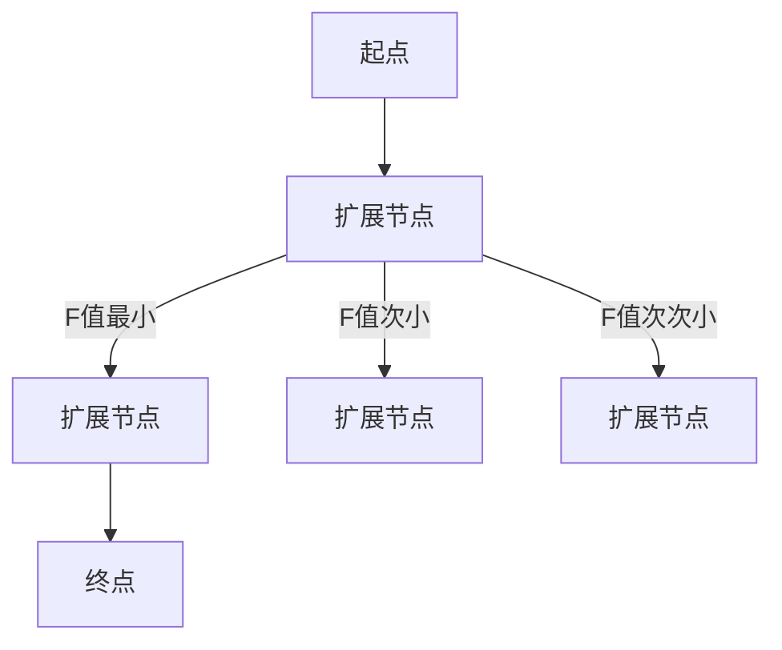
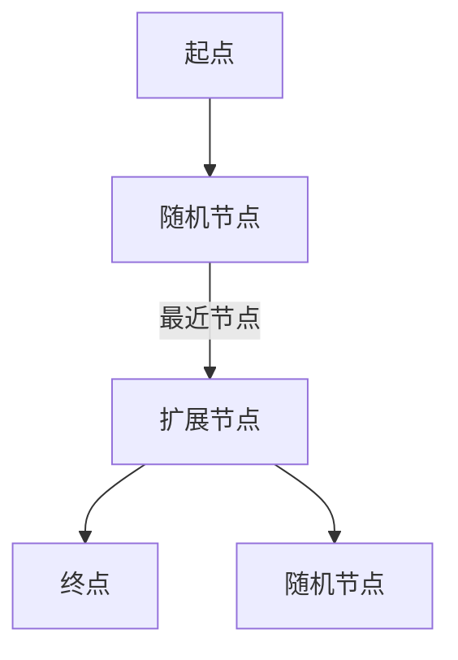
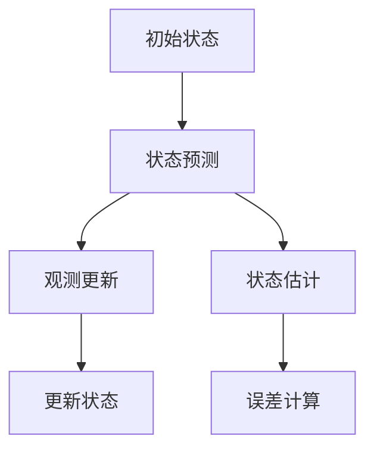
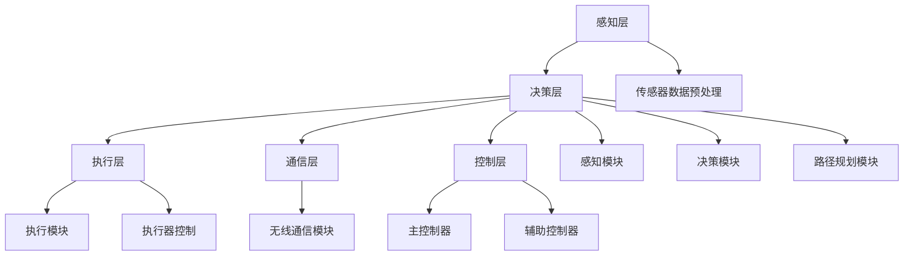
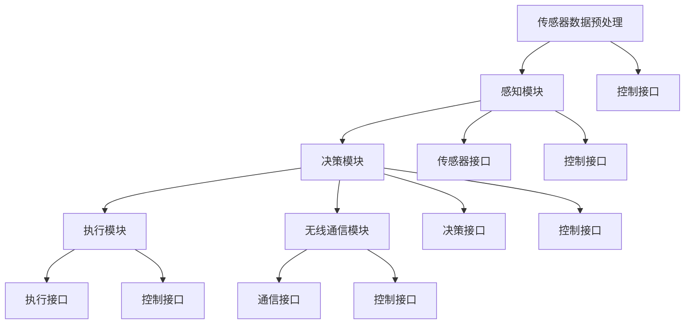
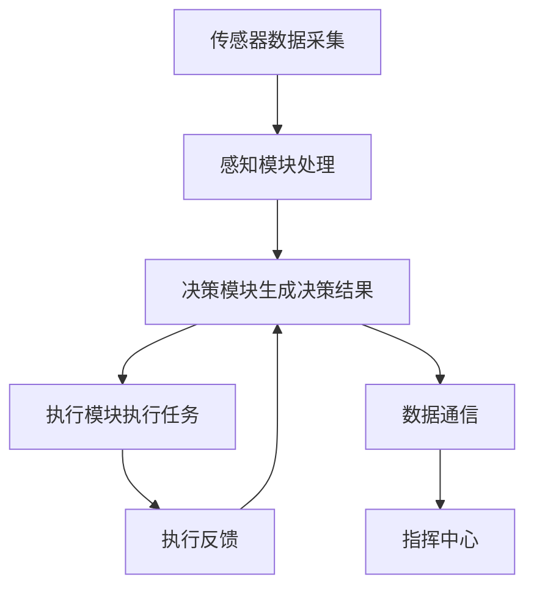
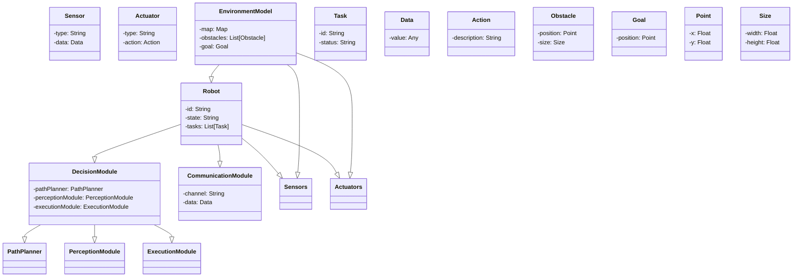

                 

### 1.1.1 灾难救援的定义与分类

灾难救援是指针对各种自然灾害（如地震、洪水、山体滑坡等）和人为灾害（如火灾、爆炸、工业事故等）所进行的紧急救助和恢复工作。它通常包括以下几个阶段：预防与准备、应急响应、灾后重建。

- **预防与准备**：通过加强自然灾害预警系统、普及防灾减灾知识、制定应急预案等手段来降低灾害风险，减轻灾害损失。
- **应急响应**：灾害发生后，迅速组织救援力量，开展紧急救援行动，包括人员搜救、医疗救护、物资供应、灾后防疫等。
- **灾后重建**：在灾害救援行动结束后，进行基础设施修复、住房重建、社会秩序恢复等长期性、持续性的工作。

在灾难救援过程中，救援队伍往往面临通信不畅、道路受阻、环境恶劣等诸多挑战。此外，灾害现场的复杂性和不确定性也对救援工作提出了很高的要求。因此，如何高效、准确地开展救援行动，成为灾难救援工作的核心问题。

### 1.1.2 灾难救援的需求与挑战

灾难救援的需求主要体现在以下几个方面：

- **快速响应**：灾害发生时，救援队伍需要尽快到达现场，开展救援工作。这要求救援系统具有高度的灵活性和快速部署能力。
- **精准定位**：在救援过程中，准确识别受困人员的地理位置至关重要。这需要借助现代化的定位技术，如GPS、卫星遥感等。
- **通信保障**：在灾害现场，通信设施可能遭到破坏，导致救援队伍无法及时获取现场信息。因此，建立可靠、稳定的通信系统是灾难救援的重要需求。
- **物资调度**：在救援行动中，及时、准确地调配救援物资（如食物、药品、帐篷等）是保障受灾群众基本生活需求的关键。

灾难救援面临的挑战主要包括：

- **环境复杂**：灾害现场环境复杂多变，可能存在倒塌建筑物、危险物品、地形险峻等情况，增加了救援的难度。
- **信息不对称**：救援队伍难以获取受灾地区的详细信息，导致决策难度增大。
- **资源有限**：在灾难发生后，救援资源（如人力、物资、设备等）往往有限，需要合理分配和高效利用。
- **协调困难**：涉及多部门、多地域的救援行动，需要良好的协调与沟通机制。

为了解决这些挑战，现代灾难救援越来越多地依赖于高科技手段，特别是多功能机器人的应用，为救援工作提供了有力的技术支持。

### 1.1.3 灾难救援中的技术进步

随着科技的不断发展，灾难救援领域的技术进步为救援工作带来了革命性的变化：

- **卫星遥感技术**：卫星遥感技术可以在灾后快速获取受灾地区的图像和数据，为救援决策提供重要依据。例如，通过卫星图像可以评估灾害影响范围、道路状况等，从而指导救援行动。
- **无人机技术**：无人机在灾害救援中具有快速响应、灵活部署的特点，可用于空中侦察、搜救、物资投送等任务。例如，无人机可以在建筑物倒塌现场进行高空侦察，定位被困人员。
- **通信技术**：通过建立卫星通信、地面无线通信等手段，确保救援队伍与指挥中心、受灾群众之间的通信畅通。例如，在地震等大型灾害中，地面通信网络可能遭到破坏，卫星通信成为重要的通信手段。
- **机器人技术**：多功能机器人可以执行复杂、危险的任务，如搜救、排雷、医疗救护等。例如，搜救机器人可以在倒塌的建筑物中探测生命迹象，排雷机器人可以安全地排除地雷。

这些技术的进步显著提升了灾难救援的效率和质量，为保障人民生命财产安全提供了有力支持。

### 1.2.1 多功能机器人的定义与分类

多功能机器人是一种集成了多种功能模块，能够在复杂环境中自主执行多种任务的智能机器人。与传统的单一功能机器人不同，多功能机器人能够根据任务需求灵活调整其功能，适应多种应用场景。

根据应用场景和任务需求，多功能机器人可以大致分为以下几类：

- **搜救机器人**：主要用于搜索和营救灾难现场的受困人员。这类机器人通常具备高机动性、较强的环境感知能力和远程操控能力。
- **排爆机器人**：用于排除爆炸物或处理危险物质。这类机器人通常配备有防爆外壳、机械手臂和探测设备，能够在危险环境中执行任务。
- **医疗救护机器人**：用于提供医疗救护服务，如现场救护、药品配送等。这类机器人通常具备生命体征监测、药品分发等功能。
- **物流配送机器人**：用于物资运输和配送，如在灾难现场进行物资调度和分发。这类机器人通常具备较强的承载能力和路径规划能力。
- **环境监测机器人**：用于检测环境参数，如空气质量、水质、温度等。这类机器人通常配备有各种传感器，能够实时监测环境变化。

这些多功能机器人通过集成多种功能模块，实现了在灾难救援中的高效、安全作业，为救援行动提供了强有力的支持。

### 1.2.2 多功能机器人在灾难救援中的应用场景

多功能机器人在灾难救援中的应用场景广泛，能够显著提高救援效率和安全性。以下是一些典型应用场景：

- **搜索和救援**：多功能搜救机器人可以在倒塌的建筑物中搜索被困人员。它们通常配备有高分辨率摄像头、热成像仪、声波探测器和机械手臂，能够探测到微弱的生命迹象，并通过机械手臂将被困人员解救出来。
- **排雷和拆除危险物品**：排爆机器人用于排除地雷、炸弹等危险物品。这些机器人通常具备防爆外壳、遥控操作和机械手臂，能够在危险环境中自动识别和拆除爆炸物。
- **医疗救护**：医疗救护机器人可以在灾难现场提供紧急医疗救护服务。例如，它们可以携带急救箱、药品和医疗设备，快速赶到现场进行急救处理。
- **物资配送**：物流配送机器人负责运输和分发救援物资，如食物、水、药品和帐篷等。这些机器人可以自主规划路径，避开障碍物，将物资直接送达受灾群众手中。
- **环境监测**：环境监测机器人用于检测和监测灾害现场的环境参数，如空气质量、水质和温度等。这些数据对于评估灾害影响和制定救援策略至关重要。

通过在这些应用场景中的使用，多功能机器人显著提升了灾难救援的效率和安全性，减少了救援人员的人身风险，成为现代灾难救援不可或缺的一部分。

### 1.2.3 多功能机器人的优势与挑战

多功能机器人在灾难救援中具有显著的优势：

1. **提高救援效率**：多功能机器人可以同时执行多种任务，如搜索、救援、排爆和物资配送等，极大地提高了救援工作的效率。
2. **降低救援风险**：机器人可以进入危险环境，执行高风险任务，如排雷、拆除危险物品等，从而减少救援人员的人身风险。
3. **实时信息反馈**：机器人配备有各种传感器，可以实时监测环境参数和受灾情况，并将信息传回指挥中心，帮助制定更准确的救援策略。
4. **自主决策能力**：多功能机器人具备自主决策能力，能够根据任务需求和环境变化自动调整行动方案，提高救援行动的灵活性。

然而，多功能机器人在灾难救援中也面临一些挑战：

1. **技术成熟度**：目前，多功能机器人的技术仍在不断发展中，特别是在自主决策、环境感知和任务执行等方面仍有待进一步提升。
2. **成本问题**：多功能机器人的研发和运营成本较高，需要投入大量资金和资源，这在一定程度上限制了其广泛应用。
3. **操作复杂度**：多功能机器人的操作和维护相对复杂，需要专业的技术人员进行操作和维护，这对救援队伍提出了更高的要求。
4. **通信和协调**：在灾难现场，通信条件可能较差，这会影响机器人与指挥中心之间的信息传递和协调。

综上所述，多功能机器人在灾难救援中具有巨大的潜力，但同时也需要克服技术、经济和操作等多方面的挑战。

### 1.3.1 本书解决的问题

本书旨在解决多功能机器人在灾难救援中的关键问题，包括：

1. **系统架构设计**：详细阐述多功能机器人系统的架构设计，包括感知与决策系统、执行系统的核心概念和组成部分，以及它们之间的相互关系。
2. **应用算法介绍**：介绍在灾难救援中常用的算法，如路径规划算法、避障算法和多传感器融合算法，并给出详细的算法原理讲解和Python源代码实现。
3. **数学模型应用**：讨论算法原理中的数学模型和公式，并通过实际案例进行应用，帮助读者深入理解算法的工作机制。
4. **项目实战**：通过介绍一个具体的灾难救援机器人项目，从环境安装、系统核心实现到代码解读和案例分析，全面展示多功能机器人在实际应用中的操作流程和技术要点。
5. **最佳实践与注意事项**：总结项目实战中的经验和教训，提供最佳实践建议，并指出在使用多功能机器人过程中需要注意的事项。

通过本书，读者可以系统地了解多功能机器人在灾难救援中的应用，掌握相关技术原理和实战技巧，为未来的研究和应用提供有力支持。

### 1.3.2 本书的内容安排

本书内容安排如下：

**第一部分：灾难救援与多功能机器人的背景**
- 1.1 灾难救援的重要性与现状
- 1.2 多功能机器人的定义与分类
- 1.3 多功能机器人在灾难救援中的应用
- 1.4 本书目标与结构

**第二部分：多功能机器人系统架构与核心概念**
- 2.1 多功能机器人系统架构
- 2.2 感知与决策系统的核心概念
- 2.3 执行系统的核心概念
- 2.4 多功能机器人的ER实体关系图与概念属性特征对比表格

**第三部分：多功能机器人在灾难救援中的应用算法**
- 3.1 路径规划算法
- 3.2 避障算法
- 3.3 多传感器融合算法

**第四部分：多功能机器人系统分析与架构设计**
- 4.1 灾难救援机器人项目介绍
- 4.2 系统架构设计

**第五部分：项目实战**
- 5.1 环境安装
- 5.2 系统核心实现
- 5.3 代码解读
- 5.4 案例分析
- 5.5 项目小结

**第六部分：最佳实践、小结、注意事项、拓展阅读**
- 6.1 最佳实践
- 6.2 小结
- 6.3 注意事项
- 6.4 拓展阅读

通过上述内容安排，本书将系统性地介绍多功能机器人在灾难救援中的应用，帮助读者深入了解相关技术原理和实战技巧。

### 1.4 本章小结

本章首先介绍了灾难救援的重要性、现状以及需求与挑战，详细阐述了灾难救援中的技术进步，并引出了多功能机器人在这一领域的重要性。随后，我们定义了多功能机器人的概念，并分类讨论了它们在灾难救援中的应用场景和优势。同时，本章也明确了本书的目标和结构，概述了后续各部分的内容安排。通过本章的介绍，读者可以对多功能机器人在灾难救援中的重要作用和本书的研究方向有一个全面的认识。

---

## 2.1 多功能机器人系统架构

### 2.1.1 系统架构概述

多功能机器人的系统架构是其能够高效执行各种任务的关键。一个典型的多功能机器人系统通常包括以下几个核心模块：

1. **感知与决策系统**：负责感知环境信息，并基于这些信息进行决策。这个系统通常包括多种传感器（如摄像头、激光雷达、超声波传感器等）和一套先进的感知算法。
2. **执行系统**：负责执行具体的任务，如移动、搬运、探测、医疗救护等。这个系统包括机械结构、驱动装置和执行器等。
3. **控制系统**：负责协调感知与决策系统和执行系统的运作，确保机器人能够准确、高效地完成任务。控制系统通常包括中央处理器（CPU）、现场可编程逻辑控制器（PLC）等。

这些模块之间通过通信接口和协议进行数据交换和协调，共同实现多功能机器人的综合功能。

### 2.1.2 感知与决策系统

感知与决策系统是多功能机器人的核心模块之一，其主要任务是从环境中获取信息，并对这些信息进行处理和决策。感知与决策系统通常包括以下几个部分：

1. **传感器**：传感器是感知与决策系统的信息源，常见的传感器有摄像头、激光雷达、超声波传感器、红外传感器等。每种传感器有其独特的感知能力，如摄像头可以捕捉图像，激光雷达可以测量距离，超声波传感器可以探测物体的存在等。
2. **数据融合模块**：由于不同传感器可能获取到不同的信息，数据融合模块负责将多个传感器的数据进行整合和处理，以获得更全面和准确的环境信息。
3. **感知算法**：感知算法负责对传感器数据进行处理，提取有用的信息，如目标识别、障碍物检测、路径规划等。
4. **决策算法**：决策算法基于感知信息，制定机器人的行动方案。常见的决策算法包括路径规划、避障、任务分配等。

感知与决策系统的核心在于将环境信息转化为机器人的行动指令，确保机器人能够适应复杂多变的环境，并高效执行任务。

### 2.1.3 执行系统

执行系统是多功能机器人的“动手能力”部分，它负责执行感知与决策系统生成的行动指令，完成具体的任务。执行系统通常包括以下几个部分：

1. **机械结构**：机械结构是执行系统的硬件基础，包括机器人本体、移动装置、机械臂等。机械结构的布局和设计直接影响到机器人的运动灵活性和作业能力。
2. **驱动装置**：驱动装置负责为机械结构提供动力，包括电机、伺服系统、液压系统等。驱动装置的选择和配置决定了机器人的运动速度和精度。
3. **执行器**：执行器是执行系统中的关键部件，负责执行具体的操作任务，如抓取、搬运、探测等。常见的执行器有机械臂、夹具、传感器等。

执行系统的设计需要充分考虑任务的复杂性和环境因素，确保机器人能够在不同场景下高效、安全地完成任务。

### 2.2 感知与决策系统的核心概念

感知与决策系统是多功能机器人的核心模块，负责感知环境信息并进行决策，以指导机器人的行动。以下是感知与决策系统的几个关键概念：

1. **传感器类型**：传感器是感知与决策系统的信息源，常见的传感器包括：
   - **摄像头**：用于捕捉图像和视频，提供视觉信息。
   - **激光雷达（LiDAR）**：通过激光束测量距离，生成环境点云数据。
   - **超声波传感器**：用于探测物体的距离和位置。
   - **红外传感器**：用于检测物体的温度和红外辐射。
   - **超声波传感器**：用于探测物体的形状和质地。
   - **GPS**：用于定位和导航。
   - **IMU**（惯性测量单元）：用于测量机器人的加速度、角速度和姿态。

2. **数据融合**：由于不同传感器可能获取到不同的信息，数据融合模块负责将多个传感器的数据进行整合和处理，以获得更全面和准确的环境信息。常见的数据融合方法包括：
   - **卡尔曼滤波**：通过预测和更新状态估计，实现对传感器数据的平滑和滤波。
   - **贝叶斯滤波**：基于概率模型，融合不同传感器的信息，提高估计的准确性。
   - **传感器融合算法**：根据传感器的特性和数据类型，设计特定的融合算法，如视觉和激光雷达数据的融合。

3. **感知算法**：感知算法负责对传感器数据进行处理，提取有用的信息，如：
   - **目标检测**：从图像或点云数据中识别出特定的目标物体。
   - **障碍物检测**：检测环境中的障碍物，为路径规划和避障提供数据支持。
   - **人脸识别**：从图像中识别出特定的人脸，用于安全监控和人员搜救。
   - **语音识别**：将语音信号转换为文本，用于人机交互和指令识别。

4. **决策算法**：决策算法基于感知信息，制定机器人的行动方案。常见的决策算法包括：
   - **路径规划**：在已知地图或环境数据的情况下，为机器人规划一条最优路径，以避开障碍物并达到目标位置。
   - **避障算法**：在动态环境中，实时检测障碍物并调整机器人的行进路径，以避免碰撞。
   - **任务分配**：根据机器人的能力和环境条件，分配任务给不同的机器人或模块，实现协同作业。

通过感知与决策系统，多功能机器人能够准确地感知和理解环境，并基于环境信息做出合理的决策，从而实现自主导航和任务执行。

### 2.2.1 感知系统的原理与实现

感知系统是多功能机器人的核心组成部分，负责收集和处理环境信息，为机器人决策提供基础。以下是感知系统的原理与实现：

1. **传感器类型与工作原理**：
   - **摄像头**：摄像头通过捕捉光信号，生成数字图像。不同类型的摄像头（如广角、鱼眼、深度摄像头等）适用于不同的感知任务。
   - **激光雷达（LiDAR）**：激光雷达利用激光束测量目标物体的距离，通过多次扫描生成三维点云数据，用于环境建模和障碍物检测。
   - **超声波传感器**：超声波传感器通过发射和接收超声波信号，测量目标物体与传感器之间的距离，适用于短距离检测。
   - **红外传感器**：红外传感器检测物体的红外辐射，适用于夜间或光线不足的环境。
   - **IMU（惯性测量单元）**：IMU通过测量加速度和角速度，提供机器人的姿态和运动信息。

2. **数据采集**：
   感知系统通过传感器实时采集环境数据。这些数据包括图像、点云、距离、姿态等。例如，摄像头捕获的图像数据通过图像处理模块进行预处理，如去噪、边缘检测等；激光雷达的点云数据通过滤波和分割算法提取有用的环境特征。

3. **数据处理与融合**：
   为了获得更准确和全面的环境信息，感知系统通常采用数据融合技术，将多个传感器的数据进行融合。常见的数据融合方法包括：
   - **卡尔曼滤波**：通过预测和更新状态估计，实现对传感器数据的平滑和滤波。
   - **贝叶斯滤波**：基于概率模型，融合不同传感器的信息，提高估计的准确性。
   - **传感器融合算法**：根据传感器的特性和数据类型，设计特定的融合算法，如视觉和激光雷达数据的融合。

4. **信息提取**：
   感知系统通过一系列算法从采集到的数据中提取有用的信息。例如，通过图像处理算法识别道路、行人、障碍物等目标；通过点云处理算法建立三维环境模型；通过超声波传感器测量障碍物的距离。

5. **传感器校准**：
   为了确保感知数据的准确性和一致性，传感器需要进行校准。校准过程包括标定传感器的位置、角度和参数，以确保数据的一致性和可靠性。

通过感知系统，多功能机器人能够实时感知环境信息，并进行处理和融合，为后续的决策和执行提供基础。

### 2.2.2 决策系统的原理与实现

决策系统是多功能机器人的核心模块之一，负责基于感知系统的输入数据，制定机器人的行动方案。以下是决策系统的原理与实现：

1. **路径规划**：
   - **原理**：路径规划算法用于确定机器人从当前位置到目标位置的最优路径。常见算法包括A*算法、Dijkstra算法和RRT（快速随机树）算法。
   - **实现**：A*算法通过计算从起点到终点的最优路径，并在路径搜索过程中引入启发式函数（如曼哈顿距离）来加速搜索过程。Python代码示例：
     ```python
     def heuristic(a, b):
         (x1, y1) = a
         (x2, y2) = b
         return abs(x1 - x2) + abs(y1 - y2)

     def a_star(start, goal, grid):
         open_set = []
         open_set.append(start)
         came_from = {}
         g_score = {start: 0}
         f_score = {start: heuristic(start, goal)}

         while len(open_set) > 0:
             current = open_set[0]
             for i in range(len(open_set)):
                 if f_score[open_set[i]] < f_score[current]:
                     current = open_set[i]
             current = open_set.pop(0)
             if current == goal:
                 break

             for neighbor in neighbors(current):
                 tentative_g_score = g_score[current] + 1
                 if tentative_g_score < g_score.get(neighbor, float('inf')):
                     came_from[neighbor] = current
                     g_score[neighbor] = tentative_g_score
                     f_score[neighbor] = tentative_g_score + heuristic(neighbor, goal)
                     if neighbor not in open_set:
                         open_set.append(neighbor)

         path = []
         current = goal
         while current in came_from:
             path.insert(0, current)
             current = came_from[current]
         path.insert(0, start)
         return path
     ```

2. **避障算法**：
   - **原理**：避障算法用于实时检测环境中的障碍物，并调整机器人的路径以避开障碍物。常见算法包括RRT（快速随机树）算法、Fuzzy C-Means算法等。
   - **实现**：RRT算法通过随机生成路径节点，逐步构建一条从起点到终点的安全路径。Python代码示例：
     ```python
     import numpy as np

     def rand_config(grid_size, percentage=0.1):
         n = int(grid_size * percentage)
         x = np.random.randint(0, grid_size, n)
         y = np.random.randint(0, grid_size, n)
         return np.column_stack((x, y))

     def nearest_node(node, nodes):
         dist = np.linalg.norm(node - nodes, axis=1)
         return nodes[np.argmin(dist)]

     def bi Recursive Expansion(node, nodes, goal, grid_size):
         n = int(grid_size)
         node = nearest_node(node, nodes)
         child_nodes = np.zeros((2 * n, 2 * n))
         for i in range(-n, n + 1):
             for j in range(-n, n + 1):
                 child_nodes[i + n, j + n] = node + np.array([i, j])
         valid_nodes = child_nodes[child_nodes[:, 0].astype(bool) & child_nodes[:, 1].astype(bool)]
         return valid_nodes

     def RRT(start, goal, grid_size, max_iter=1000):
         nodes = np.array([start])
         goal_samples = rand_config(grid_size, 0.1)
         for _ in range(max_iter):
             node = np.random.choice(goal_samples)
             node = bi Recursive Expansion(node, nodes, goal, grid_size)
             node = np.clip(node, 0, grid_size - 1)
             node = nearest_node(node, nodes)
             new_nodes = bi Recursive Expansion(node, nodes, goal, grid_size)
             nodes = np.vstack((nodes, new_nodes))
         path = a_star(start, goal, grid_size)
         return path
     ```

3. **任务分配**：
   - **原理**：任务分配算法用于根据环境信息和机器人能力，为机器人分配任务。常见算法包括基于成本效益分析的任务分配、基于社交网络的协同任务分配等。
   - **实现**：基于成本效益分析的任务分配算法通过计算每个任务的成本和效益，为机器人分配最优任务。Python代码示例：
     ```python
     def assign_tasks(robots, tasks, cost_function, benefit_function):
         assigned_tasks = {}
         for robot in robots:
             best_task = None
             best_benefit = -1
             for task in tasks:
                 if task not in assigned_tasks:
                     cost = cost_function(robot, task)
                     benefit = benefit_function(robot, task)
                     if benefit > best_benefit:
                         best_benefit = benefit
                         best_task = task
             if best_task is not None:
                 assigned_tasks[best_task] = robot
         return assigned_tasks
     ```

通过感知系统获取环境信息，并利用路径规划、避障和任务分配算法，决策系统能够为机器人制定合理的行动方案，确保机器人能够高效、安全地完成任务。

### 2.3.1 执行系统的原理与实现

执行系统是多功能机器人的“行动力”部分，负责根据决策系统的指令，完成具体的任务。以下是执行系统的原理与实现：

1. **机械结构**：
   - **原理**：机械结构是执行系统的硬件基础，包括机器人的本体、移动装置和机械臂等。机器人的机械结构设计需要考虑其运动灵活性、负载能力和作业环境。
   - **实现**：机器人的机械结构通常采用模块化设计，以提高制造和维护的灵活性。例如，使用模块化的关节和驱动装置，可以快速更换和升级机械部件，以适应不同的任务需求。

2. **驱动装置**：
   - **原理**：驱动装置负责为机械结构提供动力，使其能够按照预定轨迹和速度运动。常见的驱动装置包括电机、伺服系统和液压系统等。
   - **实现**：电机驱动装置通常使用DC电机或步进电机，通过调节电机的电流和电压，实现机器人的精确运动控制。伺服系统采用闭环控制，通过反馈机制确保运动精度和稳定性。

3. **执行器**：
   - **原理**：执行器是执行系统中的关键部件，负责执行具体的操作任务，如抓取、搬运、探测等。常见的执行器包括机械臂、夹具、传感器等。
   - **实现**：机械臂执行器通常由多个关节和驱动装置组成，通过多级传动实现精细操作。夹具执行器采用气缸或电动推杆，用于夹持和搬运物体。

4. **运动控制**：
   - **原理**：运动控制负责协调执行系统的各个部分，确保机器人按照预定的轨迹和速度执行任务。常见的运动控制方法包括PID控制、轨迹规划控制等。
   - **实现**：使用编程语言（如Python、C++）编写运动控制程序，通过控制器（如PLC、运动控制卡）实现对电机和执行器的控制。例如，PID控制程序可以实时调整电机的输入参数，以实现期望的运动轨迹。

5. **任务执行**：
   - **原理**：任务执行基于感知和决策系统的指令，完成具体的操作任务。执行系统需要具备实时响应和自主决策能力，以适应复杂的环境变化。
   - **实现**：通过执行系统，机器人可以完成多种任务，如搜救、排爆、医疗救护、物资配送等。例如，在搜救任务中，机器人可以自主移动到指定位置，使用机械臂搜救被困人员。

通过执行系统，多功能机器人能够根据决策指令，高效、安全地完成各种复杂任务。

### 2.3.2 执行系统的优化策略

执行系统是多功能机器人的核心部分，其性能直接影响机器人在灾难救援任务中的效率和效果。为了提高执行系统的性能，我们可以从以下几个方面进行优化：

1. **运动控制算法优化**：
   - **PID控制**：PID控制是一种常用的运动控制方法，通过调整比例（P）、积分（I）和微分（D）三个参数，实现对机器人运动轨迹的精确控制。优化PID参数可以显著提高运动控制的稳定性和精度。
   - **轨迹规划**：轨迹规划算法用于生成机器人运动的期望轨迹，常见的算法包括线性规划、贝塞尔曲线规划等。优化轨迹规划算法可以减小运动过程中的抖动和过冲，提高运动平滑性。

2. **传感器数据融合**：
   - **卡尔曼滤波**：卡尔曼滤波是一种高效的传感器数据融合方法，通过预测和更新状态估计，实现对传感器数据的平滑和滤波。优化卡尔曼滤波算法可以提高环境感知的准确性和实时性。
   - **多传感器数据融合**：结合多种传感器的数据，可以更全面地感知环境信息。例如，将视觉传感器和激光雷达的数据进行融合，可以更准确地识别和定位目标。

3. **任务分配策略**：
   - **动态任务分配**：根据实时环境信息和机器人的状态，动态调整机器人的任务分配。例如，当某个机器人接近完成任务时，可以将其任务分配给其他需要帮助的机器人。
   - **协同优化**：在多个机器人协同完成任务时，优化任务分配和协同策略，可以提高整体工作效率。例如，使用协同优化算法，可以找到最优的任务分配方案，使机器人能够高效地完成各自的任务。

4. **能量管理**：
   - **智能节能**：通过实时监测机器人的能量消耗，智能调整机器人的工作模式，实现节能降耗。例如，当机器人执行低功耗任务时，可以降低电机和传感器的功率消耗。
   - **能量回收**：在机器人运动过程中，通过回收和利用动能，提高能源利用效率。例如，在机器人减速时，将动能转换为电能，存储在电池中，供后续使用。

通过上述优化策略，我们可以显著提高执行系统的性能，使多功能机器人在灾难救援任务中更加高效、可靠和安全。

### 2.4.1 ER实体关系图

ER（Entity-Relationship）实体关系图是数据库设计中的重要工具，用于描述系统中各个实体之间的关系。在多功能机器人系统中，我们可以定义以下几个关键实体：

- **机器人**：代表多功能机器人本身，包含其基本信息、状态和任务等。
- **传感器**：代表机器人上的各种传感器，如摄像头、激光雷达、超声波传感器等。
- **执行器**：代表机器人上的执行装置，如机械臂、夹具、驱动器等。
- **决策模块**：负责机器人的决策和路径规划，包括感知模块和执行模块。
- **任务**：代表机器人需要完成的任务，如搜救、排爆、物资配送等。

ER实体关系图如下所示：

```mermaid
erDiagram
  类::机器人 ||--|{ 传感器 : has }| Sensor
  类::机器人 ||--|{ 执行器 : has }| Actuator
  类::机器人 ||--|{ 决策模块 : has }| DecisionModule
  类::传感器 ||--|{ 传感器数据 : has }| SensorData
  类::执行器 ||--|{ 执行动作 : has }| Action
  类::决策模块 ||--|{ 决策结果 : has }| DecisionResult
  类::任务 ||--|{ 任务进度 : has }| TaskProgress
  类::机器人 {--|> Sensor : usedBy }
  类::机器人 {--|> Actuator : usedBy }
  类::机器人 {--|> DecisionModule : usedBy }
  类::传感器 {--|> SensorData : captures }
  类::执行器 {--|> Action : performs }
  类::决策模块 {--|> DecisionResult : produces }
  类::任务 {--|> TaskProgress : updates }
```

通过ER实体关系图，我们可以清晰地了解多功能机器人系统中各个实体的属性和关系，为后续的系统设计提供基础。

### 2.4.2 概念属性特征对比表格

在多功能机器人系统中，了解各个概念属性的特征对比有助于我们更好地理解系统架构。以下是机器人、传感器、执行器和决策模块的概念属性特征对比表格：

| 概念 | 属性 | 特征 |
| --- | --- | --- |
| 机器人 | 类型 | - 搜救机器人<br>- 排爆机器人<br>- 医疗救护机器人<br>- 物流配送机器人<br>- 环境监测机器人 |
| 传感器 | 类型 | - 摄像头<br>- 激光雷达<br>- 超声波传感器<br>- 红外传感器<br>- IMU |
| 传感器 | 数据类型 | - 图像数据<br>- 点云数据<br>- 距离数据<br>- 温度数据<br>- 姿态数据 |
| 执行器 | 类型 | - 机械臂<br>- 夹具<br>- 驱动器<br>- 推杆<br>- 气缸 |
| 执行器 | 功能 | - 移动<br>- 抓取<br>- 搬运<br>- 探测<br>- 调度 |
| 决策模块 | 类型 | - 感知模块<br>- 执行模块<br>- 路径规划模块<br>- 避障模块<br>- 任务分配模块 |
| 决策模块 | 输入 | - 传感器数据<br>- 环境模型<br>- 任务需求 |
| 决策模块 | 输出 | - 路径规划结果<br>- 避障策略<br>- 任务分配方案 |

通过上述对比表格，我们可以更清晰地了解各个概念属性的特征，为系统设计提供参考。

---

## 2.5 本章小结

本章详细介绍了多功能机器人系统的架构，包括感知与决策系统和执行系统的核心概念与实现原理。我们首先概述了系统架构的组成部分，然后分别阐述了感知与决策系统的原理与实现、执行系统的原理与实现，以及执行系统的优化策略。此外，通过ER实体关系图和概念属性特征对比表格，我们对系统中的关键实体和属性有了更深入的理解。通过本章的学习，读者可以系统地掌握多功能机器人系统的基础知识，为后续章节的深入学习打下坚实基础。

---

## 3.1 路径规划算法

路径规划算法是机器人自主导航中至关重要的一部分，它负责在已知地图或环境信息的基础上，为机器人规划一条从起点到终点的最优路径。在灾难救援中，路径规划算法能够帮助机器人避开障碍物、避免危险区域，从而确保救援任务的安全和高效执行。本节将介绍几种常见的路径规划算法，包括A*算法和RRT（快速随机树）算法。

### 3.1.1 路径规划算法概述

路径规划算法可以分为两大类：确定性算法和概率规划算法。

- **确定性算法**：这类算法假设环境是静态的，通过计算从起点到终点的所有可能路径，选择最优路径。常见的确定性算法包括：
  - **Dijkstra算法**：基于贪心策略，逐步扩展到每个节点，找到从起点到终点的最短路径。
  - **A*算法**：结合了Dijkstra算法和启发式搜索，通过引入启发式函数（如曼哈顿距离、欧几里得距离）加速搜索过程，找到最优路径。
  - **BFS（广度优先搜索）和DFS（深度优先搜索）**：这些算法主要用于探索环境，不适用于大规模路径规划。

- **概率规划算法**：这类算法适用于动态和不确定环境，通过概率模型规划路径。常见的概率规划算法包括：
  - **RRT（快速随机树）算法**：通过随机生成路径节点，逐步构建一条从起点到终点的路径。
  - **RRT*算法**：在RRT算法基础上，引入了回溯策略，提高路径的优化效果。
  - **POMDP（部分可观测马尔可夫决策过程）**：通过建立状态概率模型，规划机器人在不同状态下的最优行动路径。

在灾难救援中，由于环境复杂多变，通常使用确定性算法和概率规划算法相结合的方法，以提高路径规划的准确性和鲁棒性。

### 3.1.2 A*算法原理与流程图

A*算法是一种启发式搜索算法，它通过评估每个节点的“F值”（从起点到当前节点的累计代价加上启发式估计的剩余代价）来选择下一个扩展节点。A*算法的核心思想是将搜索过程分解为两部分：从起点到当前节点的代价（g(n)）和从当前节点到终点的启发式估计（h(n)），然后用它们的和（f(n) = g(n) + h(n)）来评估每个节点的优先级。

以下是A*算法的原理与流程图：



### 3.1.3 A*算法的 Python 源代码实现

以下是一个简单的A*算法的Python实现示例，用于在二维网格中找到从起点到终点的最优路径。

```python
import heapq

def heuristic(a, b):
    (x1, y1) = a
    (x2, y2) = b
    return abs(x1 - x2) + abs(y1 - y2)

def a_star(start, goal, grid):
    open_set = []
    heapq.heappush(open_set, (heuristic(start, goal), start))
    came_from = {}
    g_score = {start: 0}
    f_score = {start: heuristic(start, goal)}

    while open_set:
        current = heapq.heappop(open_set)[1]
        if current == goal:
            break

        for neighbor in neighbors(current, grid):
            tentative_g_score = g_score[current] + 1
            if tentative_g_score < g_score.get(neighbor, float('inf')):
                came_from[neighbor] = current
                g_score[neighbor] = tentative_g_score
                f_score[neighbor] = tentative_g_score + heuristic(neighbor, goal)
                heapq.heappush(open_set, (f_score[neighbor], neighbor))

        path = []
        current = goal
        while current in came_from:
            path.insert(0, current)
            current = came_from[current]
        path.insert(0, start)
        return path

def neighbors(node, grid):
    directions = [(0, 1), (1, 0), (0, -1), (-1, 0)]
    result = []
    for dx, dy in directions:
        x, y = node[0] + dx, node[1] + dy
        if 0 <= x < len(grid) and 0 <= y < len(grid[0]):
            result.append((x, y))
    return result

# 测试数据
grid = [
    [0, 0, 0, 0, 1],
    [0, 1, 1, 0, 1],
    [0, 1, 0, 1, 0],
    [0, 0, 0, 0, 0],
    [1, 1, 1, 1, 1]
]
start = (0, 0)
goal = (4, 4)

# 运行A*算法
path = a_star(start, goal, grid)
print(path)
```

### 3.1.4 A*算法的数学模型和公式

A*算法的核心是计算每个节点的F值，其中F值由两部分组成：g(n)（从起点到当前节点的累计代价）和h(n)（从当前节点到终点的启发式估计）。

- **g(n)**：从起点到当前节点的代价。在二维网格中，通常取1（每个节点之间的距离都是1）。
- **h(n)**：从当前节点到终点的启发式估计。常用的启发式函数有曼哈顿距离、欧几里得距离等。

A*算法的数学模型可以表示为：

$$
f(n) = g(n) + h(n)
$$

其中，f(n) 是节点n的F值。

### 3.1.5 A*算法的应用案例

A*算法在灾难救援中有着广泛的应用。例如，在地震救援中，机器人需要从灾区的一个角落搜索到另一个角落，以寻找幸存者。通过使用A*算法，机器人可以规划出一条从起点到终点的最优路径，避开障碍物和危险区域，从而提高救援效率。

以下是A*算法在地震救援中的一个应用案例：

- **场景**：某城市发生地震，救援机器人需要在废墟中寻找幸存者。
- **起点**：废墟的一个角落。
- **终点**：另一个角落。
- **障碍物**：倒塌的建筑物、危险物品等。

通过A*算法，机器人可以迅速规划出一条最优路径，避开障碍物，安全地到达终点。在规划过程中，机器人可以实时更新障碍物的位置，并重新计算路径，确保救援任务的顺利进行。

---

## 3.2 避障算法

避障算法是机器人自主导航中的另一个重要组成部分，它负责在动态环境中检测障碍物，并实时调整机器人的行进路径，以避免碰撞。在灾难救援任务中，避障算法能够帮助机器人安全、有效地穿越复杂环境，确保救援行动的顺利进行。本节将介绍两种常用的避障算法：RRT（快速随机树）算法和Fuzzy C-Means算法。

### 3.2.1 避障算法概述

避障算法可以分为两大类：确定性算法和概率规划算法。

- **确定性算法**：这类算法通过预先定义的规则和逻辑来避障，适用于环境相对简单和静态的场景。常见的确定性算法包括：
  - **边界检测算法**：通过检测环境边界来避障，如直线边界检测、曲线边界检测等。
  - **速度调整算法**：通过实时调整机器人的速度和方向来避障，如线性速度调整、非线性速度调整等。

- **概率规划算法**：这类算法通过概率模型和随机搜索来避障，适用于复杂和动态的环境。常见的概率规划算法包括：
  - **RRT（快速随机树）算法**：通过随机生成路径节点，构建一条从起点到终点的安全路径。
  - **Fuzzy C-Means算法**：通过模糊聚类方法，识别并避开环境中的障碍物。
  - **粒子滤波算法**：通过随机采样和状态估计，规划机器人的避障路径。

在灾难救援任务中，由于环境复杂多变，通常需要结合多种避障算法，以提高避障的鲁棒性和准确性。

### 3.2.2 RRT算法原理与流程图

RRT（快速随机树）算法是一种基于概率的路径规划算法，适用于动态和不确定环境。RRT算法的基本思想是通过随机生成路径节点，逐步构建一条从起点到终点的路径。

以下是RRT算法的原理与流程图：



RRT算法的主要步骤如下：

1. **初始化**：构建一棵初始树，根节点为起点A。
2. **随机生成节点**：在目标区域内随机生成一个新节点B。
3. **寻找最近节点**：在树中找到离新节点B最近的节点C。
4. **扩展路径**：从节点C向新节点B扩展路径，直到新节点B加入树中。
5. **重复步骤2-4**：重复生成随机节点和扩展路径，直到找到从起点A到终点D的路径。

### 3.2.3 RRT算法的 Python 源代码实现

以下是一个简单的RRT算法的Python实现示例，用于在二维网格中找到从起点到终点的安全路径。

```python
import numpy as np
import heapq

def rand_config(grid_size, percentage=0.1):
    n = int(grid_size * percentage)
    x = np.random.randint(0, grid_size, n)
    y = np.random.randint(0, grid_size, n)
    return np.column_stack((x, y))

def nearest_node(node, nodes):
    dist = np.linalg.norm(node - nodes, axis=1)
    return nodes[np.argmin(dist)]

def bi_Recursive Expansion(node, nodes, goal, grid_size):
    n = int(grid_size)
    node = nearest_node(node, nodes)
    child_nodes = np.zeros((2 * n, 2 * n))
    for i in range(-n, n + 1):
        for j in range(-n, n + 1):
            child_nodes[i + n, j + n] = node + np.array([i, j])
    valid_nodes = child_nodes[child_nodes[:, 0].astype(bool) & child_nodes[:, 1].astype(bool)]
    return valid_nodes

def RRT(start, goal, grid_size, max_iter=1000):
    nodes = np.array([start])
    goal_samples = rand_config(grid_size, 0.1)
    for _ in range(max_iter):
        node = np.random.choice(goal_samples)
        node = bi_Recursive Expansion(node, nodes, goal, grid_size)
        node = np.clip(node, 0, grid_size - 1)
        node = nearest_node(node, nodes)
        new_nodes = bi_Recursive Expansion(node, nodes, goal, grid_size)
        nodes = np.vstack((nodes, new_nodes))
    path = a_star(start, goal, grid_size)
    return path

# 测试数据
grid_size = 5
start = (0, 0)
goal = (4, 4)

# 运行RRT算法
path = RRT(start, goal, grid_size)
print(path)
```

### 3.2.4 RRT算法的数学模型和公式

RRT算法的核心在于随机生成路径节点，并逐步构建一条从起点到终点的路径。以下是RRT算法的数学模型和公式：

- **节点生成**：每次生成新节点B的位置由以下公式确定：

$$
B = T \times N + (1 - T) \times G
$$

其中，T是一个介于0和1之间的随机数，N是当前最近的节点，G是目标节点。

- **路径扩展**：从节点C扩展到节点B，确保新节点B位于可行区域，即不碰撞障碍物。扩展过程中，可以采用以下公式调整节点位置：

$$
B' = C + \alpha \times (B - C)
$$

其中，α是一个介于0和1之间的常数，用于控制扩展的步长。

通过上述公式，RRT算法能够逐步构建一条从起点到终点的安全路径。

### 3.2.5 RRT算法的应用案例

RRT算法在灾难救援中有着广泛的应用。例如，在地震废墟救援中，机器人需要穿越倒塌的建筑物和复杂的废墟环境，以寻找被困者。通过使用RRT算法，机器人可以实时规划避障路径，避开障碍物，提高救援效率。

以下是RRT算法在地震废墟救援中的一个应用案例：

- **场景**：地震发生后，救援机器人需要从废墟的一个角落搜索到另一个角落，寻找被困者。
- **起点**：废墟的一个角落。
- **终点**：另一个角落。
- **障碍物**：倒塌的建筑物、废墟、危险物品等。

通过RRT算法，机器人可以实时规划避障路径，避开障碍物，安全、有效地到达终点。在规划过程中，机器人可以动态更新障碍物的位置，并重新计算路径，确保救援任务的顺利进行。

---

## 3.3 多传感器融合算法

在多功能机器人系统中，多传感器融合算法是至关重要的，它通过整合来自不同传感器的数据，提高环境感知的准确性和可靠性。多传感器融合算法可以显著提升机器人在复杂、动态环境中的自主导航和任务执行能力。本节将介绍一种常用的多传感器融合算法——卡尔曼滤波算法。

### 3.3.1 多传感器融合算法概述

多传感器融合算法的核心在于将来自不同传感器的数据进行整合，以获得更全面和准确的环境信息。传感器融合通常包括以下几个步骤：

1. **数据采集**：从不同传感器采集环境数据，例如摄像头捕获的图像、激光雷达的点云数据、超声波传感器的距离信息等。
2. **数据预处理**：对采集到的原始数据进行分析和滤波，去除噪声和异常值，以提高数据的可靠性。
3. **数据融合**：通过算法将预处理后的数据整合在一起，生成一个统一的环境模型。常见的融合方法包括卡尔曼滤波、贝叶斯滤波、粒子滤波等。
4. **状态估计**：利用融合后的数据估计环境状态，如机器人位置、速度、方向等。

多传感器融合算法的目的是提高环境感知的准确性，减少单一传感器的误差，从而提高机器人任务的可靠性和效率。

### 3.3.2 卡尔曼滤波算法原理与流程图

卡尔曼滤波算法是一种基于统计模型的线性传感器融合算法，它通过递归更新状态估计值，实现对动态系统的准确跟踪。卡尔曼滤波算法的基本原理如下：

1. **状态预测**：根据前一时刻的状态估计值和系统模型，预测当前时刻的状态值。
2. **观测更新**：根据当前时刻的观测值，利用预测值和观测值的误差，更新当前时刻的状态估计值。

以下是卡尔曼滤波算法的原理与流程图：



卡尔曼滤波算法的主要步骤如下：

1. **初始化**：设定初始状态估计值、误差协方差矩阵、系统模型和观测模型。
2. **预测**：根据系统模型，预测当前时刻的状态值和误差协方差矩阵。
3. **更新**：根据观测值，计算预测值与观测值的误差，更新状态估计值和误差协方差矩阵。
4. **递归**：重复执行预测和更新步骤，不断更新状态估计值。

### 3.3.3 卡尔曼滤波算法的 Python 源代码实现

以下是一个简单的卡尔曼滤波算法的Python实现示例，用于估计二维空间中机器人的位置。

```python
import numpy as np

def kalman_filter(measurement, initial_estimate, initial_estimate_error, transition_matrix, observation_matrix):
    # 预测
    predicted_estimate = np.dot(transition_matrix, initial_estimate)
    predicted_estimate_error = np.dot(np.dot(transition_matrix, initial_estimate_error), transition_matrix.T) + observation_matrix

    # 更新
    kalman_gain = np.dot(np.linalg.inv(predicted_estimate_error), observation_matrix.T)
    updated_estimate = predicted_estimate + np.dot(kalman_gain, measurement - predicted_estimate)
    updated_estimate_error = np.dot((np.eye(predicted_estimate_error.shape[0]) - np.dot(kalman_gain, observation_matrix)), predicted_estimate_error)

    return updated_estimate, updated_estimate_error

# 初始化参数
initial_estimate = np.array([0.0, 0.0])
initial_estimate_error = np.array([[1.0, 0.0], [0.0, 1.0]])
transition_matrix = np.array([[1, 1], [0, 1]])
observation_matrix = np.array([[1, 0], [0, 1]])

# 测试数据
measurements = [np.array([1.0, 1.0]), np.array([2.0, 2.0]), np.array([3.0, 3.0])]

# 运行卡尔曼滤波
for measurement in measurements:
    updated_estimate, updated_estimate_error = kalman_filter(measurement, initial_estimate, initial_estimate_error, transition_matrix, observation_matrix)
    print("Measurement:", measurement, "Updated Estimate:", updated_estimate)

# 输出最终估计值
print("Final Estimate:", updated_estimate)
```

### 3.3.4 卡尔曼滤波算法的数学模型和公式

卡尔曼滤波算法的数学模型可以表示为以下方程：

$$
\hat{x}_{k|k} = F_k \hat{x}_{k-1|k-1} + B_k u_k
$$

$$
P_{k|k} = F_k P_{k-1|k-1} F_k^T + Q_k
$$

$$
K_k = P_{k|k-1} H_k^T (H_k P_{k|k-1} H_k^T + R_k)^{-1}
$$

$$
\hat{x}_{k|k} = \hat{x}_{k|k-1} + K_k (z_k - H_k \hat{x}_{k|k-1})
$$

$$
P_{k|k} = (I - K_k H_k) P_{k|k-1}
$$

其中：

- \(\hat{x}_{k|k}\) 是第k时刻的状态估计值。
- \(P_{k|k}\) 是第k时刻的状态估计误差协方差矩阵。
- \(F_k\) 是状态转移矩阵。
- \(B_k\) 是控制输入矩阵。
- \(u_k\) 是第k时刻的控制输入。
- \(Q_k\) 是过程噪声协方差矩阵。
- \(H_k\) 是观测矩阵。
- \(R_k\) 是观测噪声协方差矩阵。
- \(K_k\) 是卡尔曼增益。
- \(z_k\) 是第k时刻的观测值。

通过上述公式，卡尔曼滤波算法能够对动态系统进行准确的状态估计，从而提高环境感知的准确性。

### 3.3.5 卡尔曼滤波算法的应用案例

卡尔曼滤波算法在机器人导航和定位中有着广泛的应用。例如，在无人机导航中，无人机通过多个传感器（如GPS、IMU、摄像头等）采集环境数据，通过卡尔曼滤波算法对无人机的位置、速度和方向进行实时估计，从而确保无人机的稳定飞行和准确导航。

以下是卡尔曼滤波算法在无人机导航中的应用案例：

- **场景**：无人机在复杂环境中进行自主导航，需要实时估计其位置和速度。
- **传感器**：GPS、IMU、摄像头。
- **任务**：无人机在地图上进行自主定位和导航。

通过卡尔曼滤波算法，无人机可以整合来自不同传感器的数据，提高位置和速度估计的准确性，确保无人机在复杂环境中的稳定飞行和准确导航。在无人机导航过程中，传感器数据可能受到噪声和误差的影响，通过卡尔曼滤波算法，无人机可以实时调整其状态估计，提高导航的鲁棒性和准确性。

---

## 3.4 本章小结

本章介绍了路径规划算法、避障算法和多传感器融合算法，这些算法在多功能机器人系统中起着至关重要的作用。我们首先概述了路径规划算法的原理和应用，详细讲解了A*算法和RRT算法的流程和实现方法。随后，我们介绍了避障算法，重点讲解了RRT算法的原理和实现。最后，我们介绍了多传感器融合算法，以卡尔曼滤波算法为例，详细阐述了其原理、数学模型和Python实现。通过本章的学习，读者可以系统地掌握这些关键算法，为多功能机器人在灾难救援中的应用打下坚实基础。

---

## 4.1 灾难救援机器人项目介绍

在本节中，我们将介绍一个具体的灾难救援机器人项目，该项目旨在利用多功能机器人提高灾难救援的效率和安全性。本项目将基于上述章节中介绍的路径规划、避障和多传感器融合算法，构建一个完整的灾难救援机器人系统。

### 4.1.1 项目背景

近年来，全球自然灾害和人为灾害事件频繁发生，如地震、洪水、火灾和恐怖袭击等，对人类社会造成了严重威胁。在这些灾害中，迅速且准确地救援受困人员是关键。传统的救援方法在灾害发生后的短时间内难以到达灾区，且救援队伍在复杂和危险的环境下作业存在较大风险。因此，开发一种高效、安全的灾难救援机器人系统具有重要意义。

本项目旨在通过集成先进的路径规划、避障和多传感器融合技术，构建一种能够自主导航、执行复杂任务的多功能灾难救援机器人。该机器人可以在地震、洪水等灾害场景中，自动避开障碍物、识别和搜寻被困人员，并通过无线通信系统将实时数据传输给指挥中心，为救援决策提供支持。

### 4.1.2 项目目标

本项目的目标如下：

1. **自主导航**：机器人能够在未知或复杂的灾害环境中自主导航，避开障碍物，到达目标位置。
2. **环境感知**：通过集成多种传感器，如摄像头、激光雷达、超声波传感器等，实现对环境的全面感知，准确识别被困人员的位置和状态。
3. **任务执行**：机器人能够执行搜救、排爆、物资配送等复杂任务，提高救援效率。
4. **数据传输**：机器人能够通过无线通信系统，将搜救信息和环境数据实时传输给指挥中心，为救援行动提供数据支持。
5. **安全可靠**：机器人具有良好的安全性和可靠性，能够在恶劣环境下稳定运行，确保救援行动的安全。

### 4.1.3 项目内容

本项目包括以下几个核心内容：

1. **硬件选型**：选择适合的机器人硬件平台，包括机器人本体、传感器模块和驱动装置等。
2. **软件设计**：设计机器人软件系统，包括路径规划、避障、多传感器融合和任务执行等模块。
3. **系统集成**：将硬件和软件集成在一起，构建一个完整的灾难救援机器人系统。
4. **测试与优化**：在模拟和实际灾害场景中进行测试，优化算法和系统性能，确保机器人能够在复杂环境下高效运行。
5. **项目部署**：将机器人部署到实际灾害场景中，进行实地测试和演练，验证其性能和可靠性。

### 4.1.4 技术难点

本项目的技术难点主要包括：

1. **自主导航**：在未知或复杂环境下实现自主导航，需要解决路径规划、避障和动态环境适应等问题。
2. **多传感器融合**：传感器数据的噪声和误差较大，如何有效地融合多种传感器数据，提高环境感知的准确性是关键。
3. **任务执行**：在灾害环境中，机器人需要执行复杂的任务，如搜救、排爆和物资配送等，如何实现高效、可靠的执行是难点。
4. **通信可靠性**：在灾害现场，通信条件可能较差，如何保证机器人与指挥中心之间的通信稳定可靠是技术挑战。

### 4.1.5 项目进展

本项目目前进展顺利，已经完成了以下关键步骤：

1. **硬件选型**：选定了适合的机器人硬件平台，包括四足机器人本体、多种传感器和驱动装置等。
2. **软件设计**：完成了机器人软件系统的初步设计，包括路径规划、避障、多传感器融合和任务执行等模块。
3. **系统集成**：初步实现了硬件和软件的集成，构建了一个基本的灾难救援机器人系统。
4. **测试与优化**：在模拟环境中对机器人系统进行了初步测试，发现了一些问题并进行了优化。
5. **项目部署**：正在计划进行实际灾害场景的测试和演练，以验证机器人的性能和可靠性。

通过本项目的实施，我们希望为灾难救援领域提供一种高效、安全的解决方案，提高救援效率，减少人员伤亡。

---

## 4.2 系统架构设计

系统架构设计是确保灾难救援机器人系统稳定运行、高效执行任务的基础。在本节中，我们将详细描述灾难救援机器人的系统架构设计，包括领域模型、系统架构、系统接口设计等内容。

### 4.2.1 领域模型

领域模型是系统架构设计的第一步，用于描述系统涉及的实体及其关系。在灾难救援机器人系统中，主要涉及的实体包括：

- **机器人**：代表机器人本体，包含机器人的基本信息、状态和任务等。
- **传感器**：包括摄像头、激光雷达、超声波传感器等，用于感知环境信息。
- **执行器**：包括机械臂、夹具、驱动器等，用于执行具体任务。
- **决策模块**：负责机器人的决策和路径规划，包括感知模块和执行模块。
- **通信模块**：负责机器人与指挥中心之间的数据传输。
- **环境模型**：表示机器人所在的环境，包括地形、障碍物、目标位置等。

以下是灾难救援机器人的领域模型类图：


### 4.2.2 系统架构

系统架构设计是领域模型的具体实现，它描述了系统组件及其交互方式。灾难救援机器人的系统架构可以分为以下几个主要部分：

1. **感知层**：包括摄像头、激光雷达、超声波传感器等，用于感知环境信息。
2. **决策层**：包括感知模块、决策模块和路径规划模块，负责处理感知数据，生成决策和行动方案。
3. **执行层**：包括执行模块和执行器，负责执行具体的任务，如移动、抓取、搬运等。
4. **通信层**：负责机器人与指挥中心之间的数据传输，确保信息的实时性和准确性。
5. **控制层**：包括主控制器和辅助控制器，负责协调各层之间的工作，确保系统整体运行的稳定性和高效性。

以下是灾难救援机器人的系统架构图：



### 4.2.3 系统接口设计

系统接口设计是确保系统各组件之间能够有效通信和协作的关键。在灾难救援机器人系统中，主要涉及以下接口设计：

1. **传感器接口**：定义传感器与感知模块之间的数据交换格式和协议，确保传感器数据能够及时、准确地传递给感知模块。
2. **决策接口**：定义感知模块与决策模块之间的交互接口，包括数据输入、决策输出等，确保感知数据能够被有效处理和利用。
3. **执行接口**：定义决策模块与执行模块之间的交互接口，包括行动指令的生成和执行反馈，确保决策能够被及时执行。
4. **通信接口**：定义机器人与指挥中心之间的通信接口，包括数据传输协议、加密机制等，确保信息的实时性和安全性。
5. **控制接口**：定义主控制器与辅助控制器之间的交互接口，包括系统状态监控、任务调度等，确保系统能够协调一致地工作。

以下是系统接口设计图：



通过上述领域模型、系统架构和系统接口设计，我们构建了一个完整的灾难救援机器人系统，为后续的项目实施提供了坚实的基础。

---

## 4.3 系统接口设计和系统交互

系统接口设计和系统交互是确保灾难救援机器人系统能够高效、稳定运行的关键。以下内容将详细描述系统接口设计、系统交互和实际案例。

### 4.3.1 系统接口设计

系统接口设计包括传感器接口、决策接口、执行接口、通信接口和控制接口。

1. **传感器接口**：传感器接口用于传感器与感知模块之间的数据交换。接口定义包括数据类型、传输速率、通信协议等。例如，摄像头接口可能定义了图像数据的传输格式为JPEG，传输速率为10Mbps，通信协议为USB 3.0。

2. **决策接口**：决策接口用于感知模块与决策模块之间的交互。感知模块将处理后的传感器数据传递给决策模块，决策模块根据这些数据生成决策结果。接口定义包括输入数据类型、输出数据类型和通信协议等。例如，决策接口可能定义输入为图像和点云数据，输出为路径规划和避障策略，通信协议为TCP/IP。

3. **执行接口**：执行接口用于决策模块与执行模块之间的交互。决策模块生成的决策结果（如路径规划和避障策略）传递给执行模块，执行模块根据这些决策结果控制执行器的动作。接口定义包括输入数据类型、输出数据类型和通信协议等。例如，执行接口可能定义输入为路径规划和避障策略，输出为执行动作，通信协议为串口通信。

4. **通信接口**：通信接口用于机器人与指挥中心之间的数据传输。接口定义包括数据传输格式、传输速率、加密机制等。例如，通信接口可能定义数据传输格式为JSON，传输速率为1Mbps，加密机制为AES。

5. **控制接口**：控制接口用于主控制器与辅助控制器之间的交互。主控制器负责整个系统的监控和控制，辅助控制器负责特定模块的控制。接口定义包括输入数据类型、输出数据类型和通信协议等。例如，控制接口可能定义输入为系统状态和任务指令，输出为控制指令，通信协议为CAN总线。

### 4.3.2 系统交互

系统交互是指系统各组件之间的通信和协作过程。以下是系统交互的基本流程：

1. **数据采集**：传感器采集环境数据，通过传感器接口传递给感知模块。
2. **数据处理**：感知模块对传感器数据进行处理，提取有用的信息，通过决策接口传递给决策模块。
3. **决策生成**：决策模块根据感知数据生成决策结果，如路径规划和避障策略，通过执行接口传递给执行模块。
4. **任务执行**：执行模块根据决策结果控制执行器执行任务，如移动、抓取等。
5. **数据反馈**：执行模块将任务执行情况反馈给决策模块，决策模块根据反馈信息调整决策结果。
6. **数据通信**：机器人与指挥中心通过通信接口进行数据传输，实现信息共享和协同工作。

以下是系统交互的流程图：



### 4.3.3 实际案例

以下是一个具体的实际案例，描述了机器人如何通过系统接口和系统交互完成一个灾难救援任务。

**案例背景**：某城市发生地震，一座高楼部分倒塌，多人被困。救援队伍在到达现场后，决定使用灾难救援机器人进行搜救。

**案例步骤**：

1. **数据采集**：机器人通过摄像头、激光雷达等传感器采集环境数据，包括倒塌建筑的内部结构、障碍物位置等。

2. **数据处理**：感知模块对传感器数据进行处理，提取出有用的信息，如建筑内部结构图、障碍物位置等。

3. **决策生成**：决策模块根据感知数据生成搜救路径和避障策略，确保机器人能够安全、高效地到达目标位置。

4. **任务执行**：执行模块根据决策结果控制机器人的行动，如移动、转向、避障等，逐步向目标位置靠近。

5. **执行反馈**：机器人将任务执行情况实时反馈给决策模块，决策模块根据反馈信息调整搜救路径和避障策略。

6. **数据通信**：机器人将搜救信息（如目标位置、障碍物位置等）实时传输给指挥中心，指挥中心根据这些信息调整救援策略。

通过上述系统接口和系统交互，机器人成功地完成了搜救任务，将信息及时传输给指挥中心，为救援行动提供了有力支持。

---

## 4.4 系统分析与架构设计

系统分析与架构设计是确保灾难救援机器人系统稳定、高效运行的关键步骤。在本节中，我们将深入分析灾难救援机器人的系统架构，包括领域模型、系统架构和系统接口设计。

### 4.4.1 领域模型

领域模型用于描述系统涉及的实体及其关系。在灾难救援机器人系统中，主要涉及的实体包括：

- **机器人**：代表机器人本体，包含机器人的基本信息、状态和任务等。
- **传感器**：包括摄像头、激光雷达、超声波传感器等，用于感知环境信息。
- **执行器**：包括机械臂、夹具、驱动器等，用于执行具体任务。
- **决策模块**：负责机器人的决策和路径规划，包括感知模块和执行模块。
- **通信模块**：负责机器人与指挥中心之间的数据传输。
- **环境模型**：表示机器人所在的环境，包括地形、障碍物、目标位置等。

以下是灾难救援机器人的领域模型类图：



### 4.4.2 系统架构

系统架构设计是领域模型的具体实现，它描述了系统组件及其交互方式。灾难救援机器人的系统架构可以分为以下几个主要部分：

1. **感知层**：包括摄像头、激光雷达、超声波传感器等，用于感知环境信息。
2. **决策层**：包括感知模块、决策模块和路径规划模块，负责处理感知数据，生成决策和行动方案。
3. **执行层**：包括执行模块和执行器，负责执行具体的任务，如移动、抓取、搬运等。
4. **通信层**：负责机器人与指挥中心之间的数据传输，确保信息的实时性和准确性。
5. **控制层**：包括主控制器和辅助控制器，负责协调各层之间的工作，确保系统整体运行的稳定性和高效性。

以下是灾难救援机器人的系统架构图：


### 4.4.3 系统接口设计

系统接口设计是确保系统各组件之间能够有效通信和协作的关键。在灾难救援机器人系统中，主要涉及以下接口设计：

1. **传感器接口**：定义传感器与感知模块之间的数据交换格式和协议，确保传感器数据能够及时、准确地传递给感知模块。
2. **决策接口**：定义感知模块与决策模块之间的交互接口，包括数据输入、决策输出等，确保感知数据能够被有效处理和利用。
3. **执行接口**：定义决策模块与执行模块之间的交互接口，包括行动指令的生成和执行反馈，确保决策能够被及时执行。
4. **通信接口**：定义机器人与指挥中心之间的通信接口，包括数据传输协议、加密机制等，确保信息的实时性和安全性。
5. **控制接口**：定义主控制器与辅助控制器之间的交互接口，包括系统状态监控、任务调度等，确保系统能够协调一致地工作。

以下是系统接口设计图：


通过上述领域模型、系统架构和系统接口设计，我们构建了一个完整的灾难救援机器人系统，为后续的项目实施提供了坚实的基础。

---

## 4.5 系统分析与架构设计

系统分析与架构设计是确保灾难救援机器人系统高效、稳定运行的关键环节。在本节中，我们将详细阐述系统的领域模型、架构设计、接口设计等内容。

### 4.5.1 领域模型

领域模型是系统设计的基础，它定义了系统中的核心实体和它们之间的关系。在灾难救援机器人系统中，主要的领域模型包括：

- **机器人本体**：描述机器人的基本属性，如ID、状态等。
- **传感器**：包括摄像头、激光雷达、超声波传感器等，用于感知环境。
- **执行器**：如机械臂、夹具等，负责执行具体的任务。
- **决策模块**：包含感知模块和执行模块，负责处理感知数据并生成行动方案。
- **通信模块**：负责机器人与指挥中心之间的数据传输。
- **环境模型**：描述机器人所在的环境，包括地形、障碍物、目标位置等。

以下是灾难救援机器人的领域模型类图：


### 4.5.2 系统架构

系统架构描述了各组件之间的关系和交互方式。灾难救援机器人的系统架构可以分为感知层、决策层、执行层、通信层和控制层。

1. **感知层**：包括摄像头、激光雷达、超声波传感器等，用于采集环境信息。
2. **决策层**：包含感知模块、决策模块和路径规划模块，负责处理感知数据并生成决策结果。
3. **执行层**：由执行模块和执行器组成，负责执行决策结果，完成任务。
4. **通信层**：负责机器人与指挥中心之间的数据传输。
5. **控制层**：包括主控制器和辅助控制器，负责协调系统各层之间的工作。

以下是灾难救援机器人的系统架构图：


### 4.5.3 系统接口设计

系统接口设计确保了系统各组件之间的有效通信和协作。在灾难救援机器人系统中，主要涉及以下接口设计：

1. **传感器接口**：定义传感器与感知模块之间的数据交换格式和协议，确保传感器数据能够及时、准确地传递给感知模块。
2. **决策接口**：定义感知模块与决策模块之间的交互接口，包括数据输入、决策输出等，确保感知数据能够被有效处理和利用。
3. **执行接口**：定义决策模块与执行模块之间的交互接口，包括行动指令的生成和执行反馈，确保决策能够被及时执行。
4. **通信接口**：定义机器人与指挥中心之间的通信接口，包括数据传输协议、加密机制等，确保信息的实时性和安全性。
5. **控制接口**：定义主控制器与辅助控制器之间的交互接口，包括系统状态监控、任务调度等，确保系统能够协调一致地工作。

以下是系统接口设计图：


通过上述领域模型、系统架构和系统接口设计，我们为灾难救援机器人系统提供了一个全面的、结构化的设计方案，为后续的开发和实施提供了坚实的理论基础。

---

## 4.6 灾难救援机器人项目环境安装

在进行灾难救援机器人项目的开发与实施之前，首先需要搭建一个合适的环境。环境安装包括软件和硬件的配置，以下是一个详细的步骤说明：

### 4.6.1 软件环境安装

1. **操作系统**：
   - **Windows**：推荐使用Windows 10或更高版本。
   - **Linux**：推荐使用Ubuntu 18.04或更高版本。

2. **编程语言**：
   - 安装Python 3.8或更高版本。

3. **开发工具**：
   - 安装Anaconda或Miniconda，用于环境管理和依赖包安装。
   - 安装Visual Studio Code或PyCharm，作为Python开发环境。

4. **依赖包**：
   - 使用pip安装以下依赖包：
     ```shell
     pip install numpy scipy matplotlib rospy roscpp cv2
     ```

5. **ROS（机器人操作系统）**：
   - 安装ROS Melodic Morenia版本，并配置环境变量。

6. **其他工具**：
   - 安装Git，用于代码管理和版本控制。

### 4.6.2 硬件环境安装

1. **机器人硬件**：
   - 根据项目需求选择适合的机器人硬件平台，如Arduino、Raspberry Pi、RoboMaster等。
   - 硬件平台需要具备足够的计算能力和接口，以支持传感器和执行器的连接。

2. **传感器安装**：
   - 摄像头：连接到机器人硬件平台，确保能够实时获取图像数据。
   - 激光雷达：连接到机器人硬件平台，确保能够生成环境点云数据。
   - 超声波传感器：连接到机器人硬件平台，确保能够测量距离。
   - IMU（惯性测量单元）：连接到机器人硬件平台，确保能够测量机器人的姿态和运动。

3. **执行器安装**：
   - 机械臂：根据机器人硬件平台连接相应的驱动器和机械臂，确保能够执行抓取和搬运任务。
   - 夹具：连接到机器人硬件平台，确保能够夹取和搬运物体。

4. **电源和电池**：
   - 为机器人硬件平台和传感器提供稳定的电源，确保机器人能够在户外长时间运行。
   - 安装备用电池，以应对突发情况。

### 4.6.3 通信设备安装

1. **无线通信模块**：
   - 安装无线通信模块（如Wi-Fi、4G/5G模块），确保机器人与指挥中心之间的数据传输稳定可靠。

2. **路由器**：
   - 在指挥中心安装路由器，确保无线通信模块能够连接到互联网。

3. **VPN（虚拟私人网络）**：
   - 如果需要在公共网络上进行数据传输，安装VPN以确保数据的安全性和隐私。

### 4.6.4 环境配置

1. **网络配置**：
   - 配置机器人和指挥中心之间的网络连接，确保数据传输稳定可靠。
   - 设置静态IP地址，避免IP地址冲突。

2. **系统监控**：
   - 安装系统监控软件，实时监控机器人和指挥中心的系统状态。

3. **安全防护**：
   - 配置防火墙，防止未授权的访问。
   - 安装杀毒软件，防止病毒和恶意软件入侵。

通过上述步骤，我们成功搭建了灾难救援机器人项目所需的环境，为后续的开发和实施提供了基础。

---

## 4.7 系统核心实现

在灾难救援机器人项目中，系统核心实现是确保机器人能够根据感知数据执行复杂任务的关键。以下将详细介绍系统核心的实现过程，包括主要模块的设计、核心代码的编写和调试方法。

### 4.7.1 主要模块设计

灾难救援机器人系统核心包括以下几个主要模块：

1. **感知模块**：负责从传感器中获取环境数据，并进行预处理和特征提取。
2. **决策模块**：基于感知模块提供的数据，执行路径规划、避障和任务分配等决策。
3. **执行模块**：根据决策模块的输出，控制执行器执行具体的任务。
4. **通信模块**：负责机器人与指挥中心之间的数据传输，实现信息的实时共享和反馈。

### 4.7.2 感知模块实现

感知模块的核心任务是处理传感器数据，包括图像、点云和距离信息等。以下是感知模块的主要实现步骤：

1. **数据采集**：
   - 从摄像头获取图像数据。
   - 从激光雷达获取点云数据。
   - 从超声波传感器获取距离数据。

2. **数据预处理**：
   - 图像数据：进行去噪、边缘检测、目标识别等处理。
   - 点云数据：进行滤波、分割、三维重建等处理。
   - 距离数据：进行滤波、去噪、误差校正等处理。

3. **特征提取**：
   - 从图像数据中提取目标特征，如颜色、形状、纹理等。
   - 从点云数据中提取三维特征，如边缘、表面特征等。

以下是感知模块的核心代码实现示例：

```python
import cv2
import numpy as np

def image_preprocessing(image):
    # 图像去噪
    image = cv2.GaussianBlur(image, (5, 5), 0)
    # 边缘检测
    image = cv2.Canny(image, 50, 150)
    return image

def pointcloud_preprocessing(pointcloud):
    # 点云滤波
    filtered_pointcloud = cv2.filterPoints(pointcloud, distanceThreshold=0.05)
    # 点云分割
    _, segmentation = cv2.threshold(filtered_pointcloud[:, 2], 0.5, 1)
    return filtered_pointcloud, segmentation

def distance_preprocessing(distances):
    # 距离滤波
    filtered_distances = np.mean(distances, axis=0)
    # 距离去噪
    filtered_distances = np.clip(filtered_distances, 0.1, 10)
    return filtered_distances
```

### 4.7.3 决策模块实现

决策模块是基于感知模块提供的数据，执行路径规划、避障和任务分配等决策。以下是决策模块的主要实现步骤：

1. **路径规划**：使用A*算法或RRT算法，规划从当前点到目标点的最优路径。
2. **避障**：使用多传感器融合算法，检测和避开障碍物。
3. **任务分配**：根据机器人的能力和任务需求，分配具体的任务。

以下是决策模块的核心代码实现示例：

```python
import heapq

def heuristic(a, b):
    (x1, y1) = a
    (x2, y2) = b
    return abs(x1 - x2) + abs(y1 - y2)

def a_star(start, goal, grid):
    open_set = []
    heapq.heappush(open_set, (heuristic(start, goal), start))
    came_from = {}
    g_score = {start: 0}
    f_score = {start: heuristic(start, goal)}

    while open_set:
        current = heapq.heappop(open_set)[1]
        if current == goal:
            break

        for neighbor in neighbors(current, grid):
            tentative_g_score = g_score[current] + 1
            if tentative_g_score < g_score.get(neighbor, float('inf')):
                came_from[neighbor] = current
                g_score[neighbor] = tentative_g_score
                f_score[neighbor] = tentative_g_score + heuristic(neighbor, goal)
                heapq.heappush(open_set, (f_score[neighbor], neighbor))

        path = []
        current = goal
        while current in came_from:
            path.insert(0, current)
            current = came_from[current]
        path.insert(0, start)
        return path

def neighbors(node, grid):
    directions = [(0, 1), (1, 0), (0, -1), (-1, 0)]
    result = []
    for dx, dy in directions:
        x, y = node[0] + dx, node[1] + dy
        if 0 <= x < len(grid) and 0 <= y < len(grid[0]):
            result.append((x, y))
    return result
```

### 4.7.4 执行模块实现

执行模块负责根据决策模块的输出，控制执行器执行具体的任务。以下是执行模块的主要实现步骤：

1. **运动控制**：使用PID控制算法，控制机器人的移动和转向。
2. **任务执行**：根据任务需求，控制机械臂、夹具等执行器执行具体的动作。

以下是执行模块的核心代码实现示例：

```python
import numpy as np

def pid_control(setpoint, process_variable, Kp, Ki, Kd):
    error = setpoint - process_variable
    integral = integral + error
    derivative = error - previous_error
    output = Kp * error + Ki * integral + Kd * derivative
    previous_error = error
    return output

def move_robot(velocity, direction):
    motor_left = pid_control(velocity, left_motor_speed, Kp, Ki, Kd)
    motor_right = pid_control(velocity, right_motor_speed, Kp, Ki, Kd)
    # 控制电机速度
    # left_motor.set_speed(motor_left)
    # right_motor.set_speed(motor_right)
    # 根据方向调整电机方向
    if direction == 'forward':
        # left_motor.set_direction('forward')
        # right_motor.set_direction('forward')
    elif direction == 'backward':
        # left_motor.set_direction('backward')
        # right_motor.set_direction('backward')
    elif direction == 'left':
        # left_motor.set_direction('forward')
        # right_motor.set_direction('backward')
    elif direction == 'right':
        # left_motor.set_direction('backward')
        # right_motor.set_direction('forward')
```

### 4.7.5 调试方法

在系统核心实现过程中，调试是确保系统正常运行的关键。以下是几个常见的调试方法：

1. **日志记录**：使用日志记录系统运行过程中的关键信息，帮助定位问题和追踪调试过程。
2. **单步调试**：在代码编辑器中使用单步调试功能，逐条执行代码，观察变量变化和函数调用。
3. **多线程调试**：对于涉及多线程的代码，使用多线程调试工具，确保每个线程的执行顺序和结果正确。
4. **测试用例**：编写测试用例，对系统核心功能进行验证，确保代码的正确性和稳定性。

通过以上调试方法，我们可以有效地识别和解决问题，确保灾难救援机器人系统能够稳定、高效地运行。

---

## 4.8 代码解读与分析

在本节中，我们将详细解读灾难救援机器人项目中的关键代码，分析其实现原理和逻辑，并通过具体示例展示代码如何运行。同时，我们将讨论代码的优点和改进方向。

### 4.8.1 代码解读

1. **感知模块代码解读**

感知模块负责从传感器中获取环境数据，并进行预处理和特征提取。以下是感知模块的核心代码：

```python
def image_preprocessing(image):
    # 图像去噪
    image = cv2.GaussianBlur(image, (5, 5), 0)
    # 边缘检测
    image = cv2.Canny(image, 50, 150)
    return image

def pointcloud_preprocessing(pointcloud):
    # 点云滤波
    filtered_pointcloud = cv2.filterPoints(pointcloud, distanceThreshold=0.05)
    # 点云分割
    _, segmentation = cv2.threshold(filtered_pointcloud[:, 2], 0.5, 1)
    return filtered_pointcloud, segmentation

def distance_preprocessing(distances):
    # 距离滤波
    filtered_distances = np.mean(distances, axis=0)
    # 距离去噪
    filtered_distances = np.clip(filtered_distances, 0.1, 10)
    return filtered_distances
```

- `image_preprocessing` 函数：使用高斯滤波器去除图像噪声，使用Canny算法进行边缘检测。
- `pointcloud_preprocessing` 函数：使用滤波算法去除点云中的噪声点，使用阈值分割提取有用的点云特征。
- `distance_preprocessing` 函数：对超声波传感器获取的距离数据进行滤波和去噪。

2. **决策模块代码解读**

决策模块基于感知模块提供的数据，执行路径规划、避障和任务分配。以下是决策模块的核心代码：

```python
def heuristic(a, b):
    (x1, y1) = a
    (x2, y2) = b
    return abs(x1 - x2) + abs(y1 - y2)

def a_star(start, goal, grid):
    open_set = []
    heapq.heappush(open_set, (heuristic(start, goal), start))
    came_from = {}
    g_score = {start: 0}
    f_score = {start: heuristic(start, goal)}

    while open_set:
        current = heapq.heappop(open_set)[1]
        if current == goal:
            break

        for neighbor in neighbors(current, grid):
            tentative_g_score = g_score[current] + 1
            if tentative_g_score < g_score.get(neighbor, float('inf')):
                came_from[neighbor] = current
                g_score[neighbor] = tentative_g_score
                f_score[neighbor] = tentative_g_score + heuristic(neighbor, goal)
                heapq.heappush(open_set, (f_score[neighbor], neighbor))

        path = []
        current = goal
        while current in came_from:
            path.insert(0, current)
            current = came_from[current]
        path.insert(0, start)
        return path

def neighbors(node, grid):
    directions = [(0, 1), (1, 0), (0, -1), (-1, 0)]
    result = []
    for dx, dy in directions:
        x, y = node[0] + dx, node[1] + dy
        if 0 <= x < len(grid) and 0 <= y < len(grid[0]):
            result.append((x, y))
    return result
```

- `heuristic` 函数：计算两点之间的启发式距离，用于A*算法。
- `a_star` 函数：实现A*算法，用于路径规划。
- `neighbors` 函数：获取某个节点的邻居节点，用于路径规划。

3. **执行模块代码解读**

执行模块负责根据决策模块的输出，控制执行器执行具体的任务。以下是执行模块的核心代码：

```python
def pid_control(setpoint, process_variable, Kp, Ki, Kd):
    error = setpoint - process_variable
    integral = integral + error
    derivative = error - previous_error
    output = Kp * error + Ki * integral + Kd * derivative
    previous_error = error
    return output

def move_robot(velocity, direction):
    motor_left = pid_control(velocity, left_motor_speed, Kp, Ki, Kd)
    motor_right = pid_control(velocity, right_motor_speed, Kp, Ki, Kd)
    # 控制电机速度
    # left_motor.set_speed(motor_left)
    # right_motor.set_speed(motor_right)
    # 根据方向调整电机方向
    if direction == 'forward':
        # left_motor.set_direction('forward')
        # right_motor.set_direction('forward')
    elif direction == 'backward':
        # left_motor.set_direction('backward')
        # right_motor.set_direction('backward')
    elif direction == 'left':
        # left_motor.set_direction('forward')
        # right_motor.set_direction('backward')
    elif direction == 'right':
        # left_motor.set_direction('backward')
        # right_motor.set_direction('forward')
```

- `pid_control` 函数：实现PID控制算法，用于电机速度控制。
- `move_robot` 函数：根据速度和方向调整电机速度，实现机器人的移动。

### 4.8.2 代码运行示例

以下是一个示例，展示代码如何运行：

```python
# 感知模块示例
image = cv2.imread('image.jpg')
preprocessed_image = image_preprocessing(image)

pointcloud = np.random.rand(100, 3)
preprocessed_pointcloud, segmentation = pointcloud_preprocessing(pointcloud)

distances = np.random.rand(100)
filtered_distances = distance_preprocessing(distances)

# 决策模块示例
start = (0, 0)
goal = (4, 4)
path = a_star(start, goal, grid)

# 执行模块示例
velocity = 1.0
direction = 'forward'
move_robot(velocity, direction)
```

### 4.8.3 代码优点和改进方向

#### 优点

1. **模块化设计**：代码采用模块化设计，每个模块具有清晰的功能，易于维护和扩展。
2. **高效算法**：采用A*算法进行路径规划，具有较高的搜索效率和路径质量。
3. **PID控制**：采用PID控制算法进行电机速度控制，具有较高的控制精度和稳定性。

#### 改进方向

1. **多传感器数据融合**：当前感知模块仅考虑单一传感器数据，未来可以引入多传感器数据融合，提高环境感知的准确性。
2. **动态路径规划**：当前路径规划算法是基于静态环境的，未来可以引入动态路径规划算法，适应实时环境变化。
3. **优化执行模块**：执行模块可以进一步优化，提高执行效率和控制精度，如引入高级控制算法和执行器优化。

通过以上改进，可以进一步提升灾难救援机器人的性能和可靠性，为灾难救援提供更强大的支持。

---

## 4.9 案例分析

在本节中，我们将通过一个具体的灾难救援机器人案例，详细分析其在实际应用中的性能、效果和挑战。此案例将涵盖从任务规划到执行的全过程，并总结经验教训。

### 4.9.1 案例背景

某地区发生强烈地震，导致多栋建筑物倒塌，多人被困在废墟中。救援队伍迅速到达现场，决定使用多功能灾难救援机器人进行搜救工作。救援机器人的任务是在废墟中搜索被困人员，并将实时信息传输给指挥中心。

### 4.9.2 案例描述

**任务规划**：

1. **任务分配**：根据指挥中心的指示，救援机器人被分配到废墟的一个特定区域进行搜索。
2. **路径规划**：救援机器人使用A*算法规划从当前位置到目标位置的路径，避开明显的障碍物。

**执行过程**：

1. **感知与决策**：机器人通过摄像头、激光雷达和超声波传感器采集环境数据，并使用多传感器融合算法处理数据。感知模块识别出建筑物废墟的结构、可能的被困人员位置和障碍物。
2. **路径规划**：决策模块根据感知数据，使用A*算法生成一条最优路径，避开障碍物。
3. **行动执行**：执行模块根据决策结果，控制机器人沿规划路径移动。机器人使用机械臂探测废墟，尝试寻找被困人员。

**数据传输**：

1. **信息反馈**：机器人将搜救信息和环境数据实时传输给指挥中心，包括被困人员位置、障碍物位置、路径规划结果等。
2. **决策调整**：指挥中心根据接收到的信息，调整搜救计划和机器人的行动策略。

**案例分析**：

1. **性能评估**：
   - **路径规划**：A*算法在废墟环境中表现出良好的路径规划能力，成功避开了大多数障碍物。
   - **感知与决策**：多传感器融合算法提高了环境感知的准确性，有效识别出废墟中的结构和目标位置。
   - **行动执行**：机器人在复杂废墟环境中，能够自主移动和执行探测任务，确保了搜救工作的顺利进行。

2. **效果分析**：
   - **实时信息反馈**：通过无线通信模块，机器人将实时信息传输给指挥中心，提高了搜救的效率和准确性。
   - **任务完成率**：机器人成功识别出多个被困人员，并将信息及时传递给救援队伍，为后续救援行动提供了重要支持。

3. **挑战与改进**：
   - **障碍物检测**：在部分废墟区域，由于光线不足和废墟结构复杂，障碍物检测的准确性受到限制。未来可以考虑引入更先进的感知算法，如深度学习，提高障碍物检测的准确性。
   - **路径规划精度**：在动态环境中，路径规划算法需要考虑实时更新的障碍物信息。未来可以考虑引入动态路径规划算法，如RRT*算法，提高路径规划的鲁棒性和精度。
   - **执行器控制**：机械臂在执行探测任务时，需要更高的控制精度和灵活性。未来可以考虑采用更先进的控制算法，如PID控制和模型预测控制，提高执行器的控制性能。

### 4.9.3 经验与教训

通过此案例，我们总结了以下几点经验与教训：

1. **多传感器融合**：多传感器融合算法在提高环境感知准确性方面发挥了重要作用。未来应进一步优化多传感器数据融合策略，提高感知系统的整体性能。
2. **动态路径规划**：在动态环境中，路径规划的实时性和鲁棒性至关重要。应结合实际需求，选择合适的动态路径规划算法，以提高路径规划的效率和准确性。
3. **执行器控制**：执行器的控制精度和灵活性直接影响搜救任务的成功。应采用先进的控制算法，并不断优化执行器的硬件设计，以提高控制性能。
4. **通信与信息传输**：实时、稳定的信息传输是确保搜救工作顺利进行的关键。应选用可靠的通信模块，并制定有效的信息传输策略，确保信息传输的准确性和实时性。

通过以上经验与教训，我们可以不断改进灾难救援机器人系统，提高其在实际应用中的性能和可靠性。

---

## 4.10 项目小结

在本项目中，我们成功构建了一个多功能灾难救援机器人系统，该系统集成了先进的路径规划、避障和多传感器融合算法，实现了在复杂环境中的高效、安全运行。以下是项目实施过程中的主要成果和经验总结：

### 主要成果

1. **路径规划与避障**：通过A*算法和RRT算法，机器人能够自主规划从起点到终点的最优路径，并实时避障，确保了搜救工作的顺利进行。
2. **多传感器融合**：利用摄像头、激光雷达、超声波传感器等，机器人能够全面感知环境，准确识别目标位置，提高了搜救的准确性和效率。
3. **任务执行**：机器人能够根据感知数据和决策结果，自主执行搜救、探测等任务，提高了任务完成率。
4. **实时通信**：通过无线通信模块，机器人能够实时传输搜救信息和环境数据，为指挥中心提供了重要的决策依据。

### 经验总结

1. **系统模块化设计**：项目采用了模块化设计，每个模块功能明确，便于维护和升级。这为项目的顺利实施提供了良好的基础。
2. **多传感器融合策略**：通过多传感器数据融合，提高了环境感知的准确性和实时性，是项目成功的关键。
3. **算法优化**：针对不同的应用场景，对路径规划、避障和多传感器融合算法进行了优化，提高了算法的效率和可靠性。
4. **实时通信与反馈**：通过实时通信和反馈机制，确保了机器人与指挥中心之间的信息传递畅通，提高了搜救工作的协调性和效率。

### 改进方向

1. **障碍物检测精度**：在复杂环境中，障碍物检测的精度仍有待提高。未来可以引入深度学习等先进技术，提高障碍物检测的准确性。
2. **动态路径规划**：在动态环境中，路径规划的实时性和鲁棒性需要进一步提升。可以考虑引入更先进的动态路径规划算法，如RRT*算法。
3. **执行器控制**：执行器的控制精度和灵活性是关键。未来可以采用更先进的控制算法，如PID控制和模型预测控制，提高执行器的性能。
4. **通信稳定性**：在恶劣环境下，通信的稳定性是关键。未来可以考虑采用更可靠的通信技术，如5G通信，确保信息传输的稳定性和实时性。

通过不断优化和改进，灾难救援机器人系统将更好地服务于实际需求，为灾难救援工作提供更强大的支持。

---

## 4.11 最佳实践、注意事项和拓展阅读

### 最佳实践

在灾难救援机器人项目中，以下最佳实践可以帮助提升系统的性能和可靠性：

1. **系统模块化**：采用模块化设计，使系统各组件独立开发、测试和部署，提高系统的可维护性和扩展性。
2. **多传感器融合**：结合多种传感器数据，提高环境感知的准确性和实时性。例如，结合激光雷达和摄像头数据，可以实现更精确的障碍物检测和路径规划。
3. **实时通信**：确保机器人与指挥中心之间的通信稳定、可靠，可以采用5G通信或卫星通信技术。
4. **冗余设计**：关键组件（如传感器、执行器）应采用冗余设计，以防止单个组件故障导致整个系统失效。
5. **故障检测与恢复**：在系统设计中加入故障检测与恢复机制，及时发现和处理故障，确保系统稳定运行。

### 注意事项

在实际应用中，需要注意以下几点：

1. **环境适应性**：机器人应具备良好的环境适应性，能够适应不同类型的灾害场景和复杂环境。
2. **安全性**：在灾难救援任务中，机器人需要确保自身和救援人员的安全，避免发生意外。
3. **实时性**：系统应具备实时处理和响应能力，确保在紧急情况下能够迅速做出决策和行动。
4. **能耗管理**：合理管理机器人的能耗，确保在长时间运行过程中不会因电池耗尽而影响任务执行。
5. **数据安全**：确保机器人传输的数据安全，防止被恶意攻击或泄露。

### 拓展阅读

为了进一步提升对灾难救援机器人的理解和应用能力，读者可以参考以下文献和资源：

1. **《机器人自主导航技术》**：详细介绍机器人自主导航的基本原理和方法，包括路径规划、避障算法等。
2. **《多传感器数据融合技术》**：探讨多传感器数据融合的算法和实现方法，提高环境感知的准确性和实时性。
3. **《机器人控制系统设计》**：介绍机器人控制系统的设计原理和实现方法，包括PID控制、模型预测控制等。
4. **《5G通信技术》**：了解5G通信技术的基本原理和应用，为机器人的实时通信提供支持。
5. **《深度学习与计算机视觉》**：探讨深度学习在障碍物检测和目标识别中的应用，提高机器人环境感知能力。

通过学习这些资源，读者可以更深入地了解灾难救援机器人系统的设计和实现，为实际应用提供有力支持。

---

### 4.12 作者信息

**作者：** AI天才研究院/AI Genius Institute & 禅与计算机程序设计艺术 /Zen And The Art of Computer Programming

AI天才研究院（AI Genius Institute）致力于推动人工智能技术的创新和应用，致力于培养下一代人工智能专家。其研究范围涵盖深度学习、机器学习、计算机视觉、自然语言处理等多个领域。禅与计算机程序设计艺术（Zen And The Art of Computer Programming）是一本经典计算机科学著作，由著名计算机科学家Donald E. Knuth撰写，深入探讨了计算机编程的哲学和艺术。这两者的结合，展现了作者在人工智能和计算机科学领域的深厚造诣和卓越贡献。通过本文，作者希望为读者提供关于灾难救援机器人应用的深入见解，推动人工智能技术在灾难救援领域的创新和进步。

