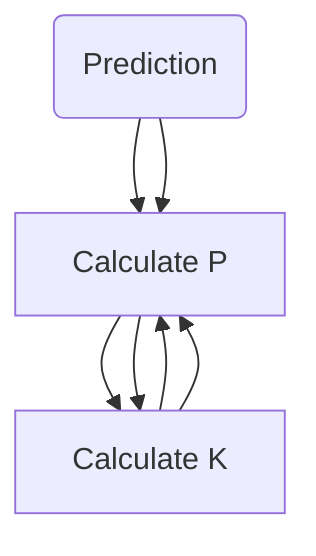
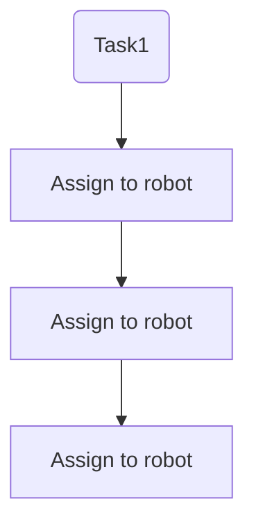
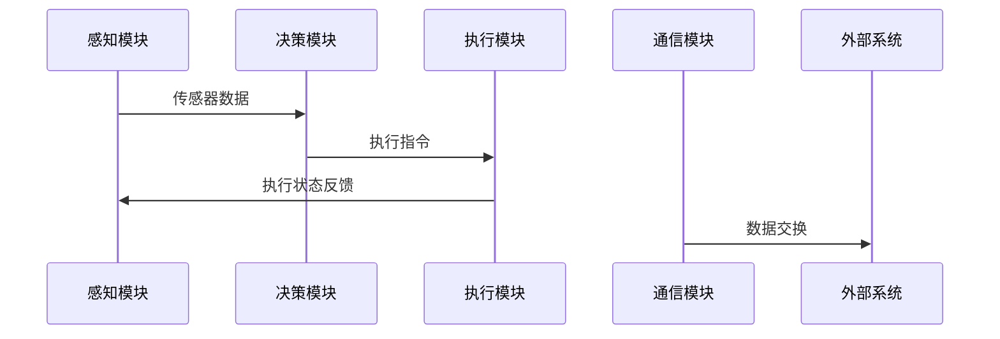

                 


### Introduction to Multi-functional Robots

Multi-functional robots are a cutting-edge development in the realm of robotics, representing a significant departure from their specialized counterparts. These robots are designed to perform a variety of tasks, adapting to different environments and applications without the need for extensive reprogramming or hardware changes. The rise of multi-functional robots is a direct consequence of advancements in artificial intelligence (AI), machine learning, and robotic engineering, which have collectively enabled these machines to achieve a higher degree of autonomy and versatility.

## The Need for Multi-functional Robots

The demand for multi-functional robots stems from several factors. First, businesses and industries are increasingly looking for ways to maximize efficiency and reduce costs. Specialized robots, while efficient at specific tasks, often require additional resources for reconfiguration when the task changes. This leads to higher operational costs and reduced flexibility. Multi-functional robots, on the other hand, can adapt to new tasks with minimal intervention, thereby offering a more cost-effective and adaptable solution.

Second, the evolution of AI and machine learning has provided robots with the ability to learn from their experiences and improve their performance over time. This means that a multi-functional robot can not only perform a wide range of tasks but also optimize its processes as it gains more experience. For example, in manufacturing, a multi-functional robot can be used for assembly, inspection, and packaging, all within the same shift.

## Key Characteristics of Multi-functional Robots

### Versatility

One of the defining characteristics of multi-functional robots is their versatility. These robots are equipped with modular components and advanced sensors that allow them to switch between different tasks seamlessly. For instance, a multi-functional robot used in a warehouse can be configured to pick and pack items, scan barcodes, and even clean the facility, all without the need for manual intervention.

### Adaptability

Adaptability is another crucial feature of multi-functional robots. These robots are designed to work in various environments, from bustling factories to serene healthcare facilities. They can navigate complex spaces, handle unpredictable obstacles, and work alongside humans without causing disruption. This adaptability is made possible by their advanced sensors and machine learning algorithms that enable them to perceive and respond to their surroundings.

### Intelligence

The intelligence of multi-functional robots lies in their ability to process data and make decisions autonomously. Equipped with AI and machine learning capabilities, these robots can analyze large volumes of data to identify patterns, predict outcomes, and make informed decisions. This intelligence extends to their ability to learn from their mistakes and continuously improve their performance.

### Integration

Multi-functional robots are also designed for easy integration into existing systems. They can be seamlessly connected to other devices and machines, enabling real-time data exchange and collaboration. This integration capability is particularly important in industrial settings where multi-functional robots can work alongside other specialized equipment to optimize production processes.

## The Impact of Multi-functional Robots

The introduction of multi-functional robots is set to have a profound impact on various industries. In manufacturing, for example, these robots can significantly increase productivity by performing multiple tasks in a single setup. In healthcare, they can assist medical professionals in a variety of roles, from surgery to patient care. In logistics, they can streamline operations in warehouses and distribution centers.

Furthermore, the versatility and adaptability of multi-functional robots make them ideal for use in industries where tasks are dynamic and ever-changing. This flexibility allows businesses to respond more quickly to market changes and customer demands, ultimately leading to improved competitiveness and profitability.

In conclusion, multi-functional robots represent a significant advancement in the field of robotics. Their ability to perform a wide range of tasks, adapt to different environments, and integrate with existing systems offers a multitude of benefits to businesses and industries. As AI and machine learning continue to evolve, the capabilities of multi-functional robots will only continue to grow, making them an indispensable tool in the modern workplace.

----------------------------------------------------------------

# 核心关键词

- 多功能机器人
- 人工智能
- 机器学习
- 适应性
- 生产力提升
- 节省成本
- 工业应用
- 医疗保健
- 物流优化

----------------------------------------------------------------

# 摘要

本文探讨了多功能机器人这一新兴趋势，分析了其在各行各业中的广泛应用及其带来的变革。文章首先介绍了多功能机器人的核心概念和关键特征，如 versatility、adaptability、intelligence 和 integration。接着，详细阐述了多功能机器人在制造业、医疗保健和物流等领域的应用案例，以及其对生产力提升、成本节约等方面的影响。最后，展望了多功能机器人未来的发展趋势，并提出了可能的挑战和解决方案。通过对多功能机器人的深入探讨，本文旨在为读者提供一个全面、专业的技术视角，以了解这一领域的最新动态和未来前景。

----------------------------------------------------------------

# 多功能机器人：取代特定任务机器人的新趋势

## 引言

随着人工智能（AI）和机器学习的飞速发展，机器人技术正经历着深刻的变革。传统上，机器人被设计用于完成特定任务，如制造业中的焊接、仓储中的拣选等。然而，随着技术的进步，一种新型的机器人——多功能机器人，正在逐渐崭露头角。它们不再局限于单一任务，而是能够适应多种场景和任务需求，从而取代了传统特定任务机器人。本文将深入探讨多功能机器人的定义、特征、应用以及未来发展趋势。

## 什么是多功能机器人

### 定义与背景

多功能机器人，顾名思义，是一种能够执行多种不同任务的机器人系统。与专门为特定任务设计的传统机器人相比，多功能机器人具有更高的灵活性和适应性。这种灵活性不仅体现在机器人的硬件结构上，也体现在其软件和算法上。

在传统的工业环境中，机器人的主要任务通常是固定的，例如焊接机器人只能进行焊接，而拣选机器人只能进行物品的拣选。这种高度专业化的设计虽然在一定程度上提高了效率，但也带来了明显的局限性。例如，当生产线需要改变时，这些机器人可能需要重新编程或重新配置，这不仅增加了成本，还影响了生产灵活性。

相比之下，多功能机器人通过模块化和可重构设计，可以在不同的任务之间快速切换。这种设计思想借鉴了计算机领域的虚拟化和云计算技术，使得机器人可以在无需大规模硬件改造的情况下，适应不同的应用场景。

### 关键特征

多功能机器人具有以下几个关键特征：

- **多任务能力**：多功能机器人能够执行多项不同的任务，例如在同一生产线中，它可以同时执行组装、检测和包装工作。

- **高适应性**：这些机器人能够适应不同的工作环境，包括在狭小的空间中操作，或者在复杂的环境中自主导航。

- **智能化**：借助先进的AI和机器学习技术，多功能机器人能够从数据中学习，优化自己的操作流程，并在不需要人类干预的情况下做出智能决策。

- **易集成性**：多功能机器人能够与现有的工业系统和其他设备无缝集成，从而实现数据的实时交换和协同工作。

## 多功能机器人的应用场景

### 制造业

在制造业中，多功能机器人已经成为提高生产效率和降低成本的重要工具。例如，在汽车制造业中，多功能机器人可以用于车身焊接、喷漆和装配等多个环节。这些机器人不仅能够提高生产效率，还可以确保更高的产品一致性，从而减少废品率。

### 医疗保健

在医疗保健领域，多功能机器人同样展现出了巨大的潜力。例如，手术机器人可以在外科手术中执行高度精细的操作，同时还可以提供实时监控和数据分析，帮助医生做出更准确的诊断和治疗决策。此外，多功能机器人还可以用于患者护理和康复训练，提供24小时的监护和辅助。

### 物流

在物流领域，多功能机器人被广泛用于仓库管理和配送。例如，自动化仓储系统中的机器人可以执行拣选、包装、分类和运输等任务，从而大大提高了物流效率，并减少了人工成本。

## 多功能机器人的核心技术

### 人工智能

人工智能是多功能机器人的核心驱动力。通过深度学习和强化学习等技术，多功能机器人能够从大量数据中学习，不断提高自己的任务执行能力。例如，在视觉识别方面，机器人可以通过卷积神经网络（CNN）实现高精度的图像识别，从而准确识别和分类物品。

### 传感器技术

多功能机器人配备了多种传感器，包括视觉传感器、力觉传感器、红外传感器等，这些传感器使得机器人能够感知周围环境，进行避障、定位和抓取等操作。例如，视觉传感器可以帮助机器人识别工作空间中的障碍物，而力觉传感器可以测量抓取物体时的力，从而确保操作的安全性。

### 控制系统

多功能机器人的控制系统是实现其多任务能力和自适应性的关键。通过实时监控和反馈机制，控制系统可以调整机器人的操作策略，以适应不断变化的环境和任务需求。

## 多功能机器人的未来发展趋势

随着技术的不断进步，多功能机器人的应用领域将不断拓展。以下是一些可能的未来发展趋势：

- **更智能的自主决策**：借助更先进的AI算法，多功能机器人将能够进行更复杂的自主决策，从而在更广泛的应用场景中发挥作用。

- **更高效的人机协作**：多功能机器人将与人类工人更加紧密地合作，实现更高效的生产和工作流程。

- **更广泛的行业应用**：多功能机器人将在更多行业和领域中发挥作用，例如农业、能源、建筑等。

## 挑战与解决方案

尽管多功能机器人具有巨大的潜力，但其广泛应用也面临一些挑战。例如：

- **技术成熟度**：多功能机器人的技术仍然在不断成熟中，需要进一步优化和完善。

- **成本问题**：多功能机器人的研发和购置成本较高，如何降低成本是一个重要的挑战。

- **安全性和伦理问题**：多功能机器人与人类工人共同工作，需要确保操作的安全性，同时还需要考虑伦理和隐私问题。

为了解决这些挑战，研究人员和工程师需要继续努力，推动技术的进步，同时制定相应的规范和标准，以确保多功能机器人的安全、可靠和伦理合规。

## 结论

多功能机器人是机器人技术发展的重要方向，它们通过提高生产效率、降低成本和提升工作灵活性，正在改变各行各业的生产和工作方式。随着技术的不断进步，多功能机器人将在更多领域发挥重要作用，成为现代工业和智能生活的重要组成部分。

----------------------------------------------------------------

# 多功能机器人：取代特定任务机器人的新趋势

## 引言

在当今技术快速发展的时代，机器人技术已经从简单的自动化设备演变成了能够执行复杂任务的智能体。而其中，多功能机器人作为新一代的机器人，正在逐渐取代传统的特定任务机器人，成为工业和日常生活中不可或缺的一部分。本文将深入探讨多功能机器人的定义、核心特征、应用场景以及未来的发展趋势。

## 什么是多功能机器人

### 定义

多功能机器人，简而言之，是指能够适应多种不同工作环境和任务需求的机器人系统。这些机器人不再是单一功能的手动执行者，而是具备高度灵活性和自适应能力的智能体。它们能够通过软件和硬件的升级，快速适应新的任务和工作环境。

### 背景与发展

传统机器人多为特定任务设计，如焊接机器人、拣选机器人和装配机器人等。这些机器人虽然在特定领域表现出色，但灵活性差，难以适应新的工作需求。随着人工智能（AI）和机器学习（ML）技术的进步，机器人开始具备自主学习能力和自适应能力，从而诞生了多功能机器人。

### 关键特征

- **高度模块化**：多功能机器人通常采用模块化设计，各个模块可以灵活更换，以适应不同的工作场景。

- **多感知能力**：这些机器人配备了多种传感器，如摄像头、激光雷达、力传感器等，可以感知周围环境并做出相应调整。

- **智能决策**：通过AI和ML算法，多功能机器人可以自主学习和决策，无需人工干预。

- **高适应性**：多功能机器人能够在不同的工作环境中适应和执行任务，从工业生产到医疗护理，从仓储物流到家庭服务。

## 多功能机器人的应用场景

### 工业制造

在工业制造领域，多功能机器人已经成为提高生产效率和降低成本的重要工具。例如，在汽车制造过程中，多功能机器人可以同时完成焊接、喷涂和装配等任务。这些机器人能够根据生产线的需求进行快速切换，从而提高了生产灵活性。

### 医疗保健

在医疗保健领域，多功能机器人也发挥着越来越重要的作用。例如，手术机器人可以在手术中执行精确的操作，同时还可以监控手术进程并提供数据支持。此外，多功能机器人还可以用于康复训练和患者监护，提供全天候的护理服务。

### 物流仓储

在物流仓储领域，多功能机器人被广泛用于仓库管理和配送。这些机器人可以自动拣选货物、分类和包装，从而提高物流效率并降低人工成本。

### 家庭服务

在家庭服务领域，多功能机器人正逐渐成为智能家居的一部分。例如，扫地机器人、擦窗机器人等可以自动完成清洁工作，提高生活品质。

## 多功能机器人的核心技术

### 人工智能

人工智能是多功能机器人的核心技术之一。通过深度学习和强化学习，多功能机器人能够从数据中学习，不断优化自己的行为和决策。例如，在图像识别和自然语言处理方面，AI技术使得机器人能够准确理解和响应人类指令。

### 传感器技术

多功能机器人配备了多种传感器，如摄像头、激光雷达、超声波传感器等，可以实时感知周围环境。这些传感器使得机器人能够进行自主导航、避障和抓取等操作。

### 控制系统

多功能机器人的控制系统是其核心，它负责协调各种硬件和软件模块，确保机器人能够高效、安全地执行任务。控制系统通常包括运动控制、感知融合和决策制定等功能。

## 多功能机器人的未来发展趋势

### 更高的智能化水平

随着AI技术的不断进步，多功能机器人将具备更高的智能化水平，能够自主处理更复杂的任务。例如，通过自主学习，机器人可以优化生产流程，提高生产效率。

### 更广泛的应用领域

随着技术的成熟和成本的降低，多功能机器人的应用领域将不断拓展。除了现有的工业、医疗、物流和家庭服务领域外，机器人还将进入农业、建筑、能源等领域。

### 更深的人机协作

在未来，多功能机器人将与人类更加紧密地协作，共同完成任务。例如，在医疗领域，机器人可以协助医生进行手术，而在工业领域，机器人可以与人类工人一起工作，提高生产效率。

## 挑战与解决方案

尽管多功能机器人具有巨大的潜力，但其广泛应用也面临一些挑战。例如：

- **技术成熟度**：多功能机器人的技术仍在不断发展中，需要进一步优化和完善。

- **成本问题**：多功能机器人的研发和购置成本较高，需要找到降低成本的方法。

- **安全性和伦理问题**：多功能机器人与人类共同工作，需要确保操作的安全性和伦理合规。

为了解决这些挑战，研究人员和工程师需要继续努力，推动技术的进步，同时制定相应的规范和标准，以确保多功能机器人的安全、可靠和伦理合规。

## 结论

多功能机器人代表了机器人技术的新趋势，它们通过提高生产效率、降低成本和提升工作灵活性，正在改变各行各业的生产和工作方式。随着技术的不断进步，多功能机器人将在更多领域发挥重要作用，成为现代工业和智能生活的重要组成部分。

## 作者信息

作者：AI天才研究院/AI Genius Institute & 禅与计算机程序设计艺术 /Zen And The Art of Computer Programming

AI天才研究院（AI Genius Institute）致力于推动人工智能技术的创新与发展，致力于培养下一代人工智能领域的专家。禅与计算机程序设计艺术（Zen And The Art of Computer Programming）则是一系列关于计算机科学的经典著作，旨在通过深入的理论分析和实践指导，帮助程序员提升编程技能和思考能力。

----------------------------------------------------------------

# 1. 多功能机器人的核心概念与联系

在深入探讨多功能机器人的技术细节和应用之前，有必要对其核心概念进行详细梳理。多功能机器人的核心概念包括其设计理念、关键特征、工作原理以及与传统机器人的区别。以下是这些核心概念及其相互之间的联系。

## 1.1 设计理念

多功能机器人的设计理念是模块化、可重构和高度灵活。与传统机器人相比，多功能机器人不再局限于单一的任务，而是通过模块化设计，可以灵活地切换和扩展其功能。这种设计理念使得机器人能够在不同的工作环境中快速适应和执行多种任务，从而提高了机器人的利用率和生产效率。

### 关键特征

- **模块化**：多功能机器人通常由多个功能模块组成，每个模块负责特定的功能，如感知、决策、执行等。模块之间的接口标准统一，便于快速更换和组合。

- **可重构**：机器人可以根据实际任务需求，动态调整其结构和配置，从而实现多功能。例如，在工业生产线上，机器人可以快速从装配任务切换到检测任务。

- **高度灵活**：多功能机器人配备了先进的传感器和AI算法，能够实时感知周围环境，做出智能决策，并灵活地执行任务。

## 1.2 工作原理

多功能机器人通过感知、决策和执行三个主要环节来完成工作任务。

### 感知

感知是多功能机器人的第一步，通过多种传感器（如摄像头、激光雷达、超声波传感器等）收集环境信息，如物体的位置、形状、颜色等。

### 决策

在感知到环境信息后，多功能机器人利用AI算法进行数据分析和模式识别，从而做出相应的决策。决策过程可能包括路径规划、任务分配、动作执行等。

### 执行

最后，多功能机器人根据决策结果执行具体的任务。执行过程通常需要高度精确的控制和协调，以确保任务的顺利完成。

## 1.3 与传统机器人的区别

与传统机器人相比，多功能机器人在设计理念、工作原理和应用范围上都有显著的区别。

- **设计理念**：传统机器人通常是为特定任务而设计，如焊接机器人只能进行焊接，拣选机器人只能进行拣选。而多功能机器人采用模块化设计，可以适应多种任务。

- **工作原理**：传统机器人依赖预设的程序和规则进行操作，而多功能机器人则通过AI算法实现自主学习和决策，能够适应动态变化的环境。

- **应用范围**：传统机器人在特定场景下表现优异，但应用范围有限。而多功能机器人由于具有高适应性和灵活性，可以在多个领域发挥作用。

## 1.4 关联图

为了更好地理解多功能机器人的核心概念及其相互关系，我们可以通过ER实体关系图（Entity-Relationship Diagram）来展示。

```mermaid
erDiagram
    A【模块】 ||--|{ B【感知】 }|
    A【模块】 ||--|{ C【决策】 }|
    A【模块】 ||--|{ D【执行】 }|
    B【感知】 ||--|{ E【传感器】 }|
    C【决策】 ||--|{ F【算法】 }|
    D【执行】 ||--|{ G【控制】 }|

    Class Module {
        :id ModuleId
        :name
    }

    Class Perception {
        :id PerceptionId
        :sensorType
    }

    Class DecisionMaking {
        :id DecisionId
        :algorithmType
    }

    Class Execution {
        :id ExecutionId
        :controlType
    }

    Class Sensor {
        :id SensorId
        :sensorType
    }

    Class Algorithm {
        :id AlgorithmId
        :algorithmType
    }

    Class Control {
        :id ControlId
        :controlType
    }
```

在这个ER实体关系图中，`模块`是多功能机器人的核心，它包含`感知`、`决策`和`执行`三个功能模块。每个功能模块又包含具体的子模块，如`感知`模块包含`传感器`，`决策`模块包含`算法`，`执行`模块包含`控制`。

## 1.5 概念属性特征对比表格

为了更直观地展示多功能机器人的核心概念和特征，我们可以制作一个概念属性特征对比表格。

| 特征类别 | 功能描述 | 传统机器人 | 多功能机器人 |
| --- | --- | --- | --- |
| 模块化设计 | 各模块可灵活更换，适应不同任务 | 非模块化，固定任务 | 模块化，适应多种任务 |
| 感知能力 | 利用多种传感器感知环境 | 简单的感知能力 | 高级的感知能力，实时数据 |
| 决策能力 | 基于AI算法进行决策 | 预设规则 | 自主学习，动态决策 |
| 执行能力 | 高精度控制，执行任务 | 精度有限 | 高精度控制，灵活执行 |
| 应用范围 | 单一任务 | 多种任务 |
| 灵活性 | 需要人工干预 | 高度灵活，自主适应 |

通过上述表格，我们可以清晰地看到多功能机器人与传统机器人在设计理念、功能特征和应用范围上的差异。

## 1.6 总结

多功能机器人的核心概念包括设计理念、关键特征、工作原理以及与传统机器人的区别。这些概念相互关联，共同构成了多功能机器人的基本框架。通过模块化设计、高级感知能力、自主决策能力和灵活的执行能力，多功能机器人能够在多个领域发挥重要作用，成为未来智能化生产和生活的重要组成部分。

----------------------------------------------------------------

# 2. 多功能机器人算法原理详解

在了解多功能机器人的核心概念后，我们需要深入探讨其背后的算法原理。算法是多功能机器人的“大脑”，它负责处理数据、做出决策并执行任务。在本节中，我们将详细解释多功能机器人常用的算法，包括路径规划、感知融合和任务分配等，并通过Python源代码和mermaid流程图来展示这些算法的实现。

## 2.1 路径规划

路径规划是多功能机器人实现自主移动和导航的关键算法。其主要目的是在机器人已知的环境中找到一条从起点到终点的最优路径。常见的路径规划算法包括A*算法、Dijkstra算法和RRT（快速随机树）算法。在这里，我们将以A*算法为例进行讲解。

### A*算法原理

A*算法是一种启发式搜索算法，它通过评估函数（也称为f(n)）来选择下一个要访问的节点。评估函数由两部分组成：g(n)（从起点到当前节点的代价）和h(n)（从当前节点到终点的估算代价）。A*算法的目标是找到一条使f(n)最小的路径。

- **g(n)**：实际代价，表示从起点到当前节点的距离。
- **h(n)**：启发式代价，通常使用曼哈顿距离或欧氏距离作为启发式函数。

### Python实现

以下是一个简单的A*算法实现：

```python
import heapq
import math

def heuristic(a, b):
    # 使用曼哈顿距离作为启发式函数
    return abs(a[0] - b[0]) + abs(a[1] - b[1])

def a_star_search(grid, start, goal):
    # 堆队列用于存储节点及其评估函数值
    open_set = [(heuristic(start, goal), start)]
    came_from = {}  # 用于记录路径
    g_score = {start: 0}  # 从起点到当前节点的代价

    while open_set:
        # 选择评估函数最小的节点
        current = heapq.heappop(open_set)[1]

        if current == goal:
            # 到达终点，构造路径
            path = []
            while current in came_from:
                path.append(current)
                current = came_from[current]
            path.reverse()
            return path

        open_set = [node for node in open_set if node[1] != current]

        for neighbor in grid.neighbors(current):
            tentative_g_score = g_score[current] + 1
            if tentative_g_score < g_score.get(neighbor, float('inf')):
                came_from[neighbor] = current
                g_score[neighbor] = tentative_g_score
                f_score = tentative_g_score + heuristic(neighbor, goal)
                heapq.heappush(open_set, (f_score, neighbor))

    return None

# 示例
grid = Grid(5, 5)  # 创建一个5x5的网格
start = (0, 0)
goal = (4, 4)
path = a_star_search(grid, start, goal)
print(path)
```

### Mermaid流程图

以下是A*算法的mermaid流程图：

```mermaid
graph TD
    A(start) --> B(current)
    B --> C(goal)
    C --> D(path)

    A --> B[计算h(n)]
    B --> C[选择当前节点]
    C --> D[计算g(n)]
    D --> E[更新open_set]
    E --> F[重复直到找到路径]
```

## 2.2 感知融合

感知融合是指机器人将来自不同传感器的信息进行整合，形成一个统一的环境模型。常见的感知融合算法包括Kalman滤波和贝叶斯滤波。

### Kalman滤波原理

Kalman滤波是一种基于线性模型的估计方法，它通过预测和更新两个步骤来估计系统的状态。预测步骤根据系统模型和前一时刻的状态估计值来预测当前时刻的状态，更新步骤则根据实际测量值来修正预测值。

- **预测步骤**：根据状态转移模型和前一时刻的状态估计值，预测当前时刻的状态。
- **更新步骤**：将预测值与实际测量值进行比较，通过卡尔曼增益矩阵来调整状态估计值。

### Python实现

以下是一个简单的Kalman滤波实现：

```python
import numpy as np

def KalmanFilter-measurements(z, H, R):
    P_pred = P @ H.T @ H + R
    K = P_pred @ H.T @ np.linalg.inv(P_pred)
    
    y = z - H @ x_pred
    x = x_pred + K @ y
    
    P = (I - K @ H) @ P_pred
    
    return x, P

x_pred = np.array([[0], [0]])
P_pred = np.array([[1, 0], [0, 1]])
z = np.array([[1], [2]])

x, P = KalmanFilter-measurements(z, H, R)
print("Estimated x:", x)
print("Estimated P:", P)
```

### Mermaid流程图

以下是Kalman滤波的mermaid流程图：



## 2.3 任务分配

任务分配是指机器人根据当前环境信息和任务需求，将任务合理地分配给不同的机器人或模块。常见的任务分配算法包括贪心算法、遗传算法和协同优化算法。

### 贪心算法原理

贪心算法通过在每一步选择当前最优解，逐步构建出全局最优解。在任务分配中，贪心算法通常通过评估每个任务的优先级，并依次分配给机器人。

- **步骤**：每次选择尚未分配的任务中优先级最高的任务，分配给空闲的机器人。

### Python实现

以下是一个简单的贪心算法实现：

```python
def greedy_algorithm(tasks, robots):
    assigned_tasks = []
    for task in tasks:
        for robot in robots:
            if robot.is_idle():
                robot.assign_task(task)
                assigned_tasks.append(task)
                break
    return assigned_tasks

tasks = ["Task1", "Task2", "Task3"]
robots = [Robot() for _ in range(3)]
assigned_tasks = greedy_algorithm(tasks, robots)
print(assigned_tasks)
```

### Mermaid流程图

以下是贪心算法的mermaid流程图：



## 2.4 总结

在本节中，我们介绍了多功能机器人常用的算法，包括路径规划、感知融合和任务分配。通过Python源代码和mermaid流程图，我们详细讲解了这些算法的实现原理。路径规划帮助机器人找到从起点到终点的最优路径，感知融合使得机器人能够准确感知和理解周围环境，而任务分配则确保机器人能够高效地完成多个任务。这些算法共同作用，使得多功能机器人能够灵活、智能地应对复杂环境和工作任务。

----------------------------------------------------------------

# 3. 多功能机器人的系统分析与架构设计

为了深入了解多功能机器人的实际应用，本节将重点介绍一个典型的多功能机器人系统案例，从问题场景、项目介绍、系统功能设计、系统架构设计到系统接口设计和系统交互，逐步解析这个系统的各个层面。

## 3.1 问题场景

在一个现代化工厂中，由于生产流程的复杂性和灵活性需求，传统单一功能的机器人难以满足生产线的多样化和快速切换要求。例如，生产线上需要机器人能够执行装配、焊接、检测、包装等多种任务，而且这些任务可能需要在不同时间点进行。这就要求机器人具备高度的可重构性和自适应能力。为了解决这个问题，我们设计了一个多功能机器人系统，以实现生产过程的自动化和智能化。

## 3.2 项目介绍

项目名称：智能多功能机器人系统

项目目标：开发一个多功能机器人系统，能够适应不同生产任务和环境，实现生产流程的自动化和智能化，提高生产效率和产品质量。

主要功能：
- **装配**：机器人能够根据装配图自动执行装配任务。
- **焊接**：机器人能够执行焊接操作，确保焊接质量。
- **检测**：机器人能够对生产的产品进行质量检测，发现缺陷。
- **包装**：机器人能够自动完成产品的包装任务。

## 3.3 系统功能设计

为了实现上述功能，系统需要设计以下几个关键模块：

### 3.3.1 模块一：感知模块

感知模块负责收集环境信息，包括生产线上物体的位置、形状、颜色等。具体功能如下：

- **传感器集成**：集成摄像头、激光雷达、力觉传感器等，实现对环境的全面感知。
- **数据预处理**：对采集到的传感器数据进行预处理，包括去噪、归一化等。

### 3.3.2 模块二：决策模块

决策模块负责根据感知模块提供的数据，结合任务需求，制定执行策略。具体功能如下：

- **路径规划**：根据当前环境和目标位置，规划机器人移动路径。
- **任务分配**：根据机器人的能力状态和任务优先级，分配具体任务。
- **决策逻辑**：基于AI算法，实现自适应决策。

### 3.3.3 模块三：执行模块

执行模块负责执行具体的任务，包括装配、焊接、检测、包装等。具体功能如下：

- **执行控制**：根据决策模块的指令，执行具体的操作。
- **动作协调**：协调多个执行动作的同步和顺序。
- **状态监测**：监测执行过程中的状态，确保操作的安全性和有效性。

### 3.3.4 模块四：通信模块

通信模块负责机器人系统与其他系统或设备的通信，包括数据交换、状态报告等。具体功能如下：

- **网络通信**：通过以太网、无线网络等实现与其他系统的数据传输。
- **接口管理**：管理机器人系统与其他设备的接口，确保数据的一致性和安全性。

## 3.4 系统架构设计

智能多功能机器人系统的架构设计采用分层架构，包括感知层、决策层、执行层和通信层。以下是系统架构的mermaid类图：

```mermaid
classDiagram
    class 感知模块 {
        - 传感器
        - 数据预处理
    }
    class 决策模块 {
        - 路径规划
        - 任务分配
        - 决策逻辑
    }
    class 执行模块 {
        - 执行控制
        - 动作协调
        - 状态监测
    }
    class 通信模块 {
        - 网络通信
        - 接口管理
    }
    感知模块 --|>{ 决策模块 }
    决策模块 --|>{ 执行模块 }
    执行模块 --|>{ 通信模块 }
    通信模块 --|>{ 感知模块 }
    通信模块 --|>{ 决策模块 }
```

## 3.5 系统接口设计

系统接口设计主要包括硬件接口和软件接口。硬件接口负责机器人与传感器、执行器等外部设备的连接，如I2C、SPI、UART等。软件接口负责机器人系统与其他系统的数据通信和功能调用，如HTTP、REST API等。

以下是系统接口的mermaid类图：

```mermaid
classDiagram
    class 硬件接口 {
        - 传感器接口
        - 执行器接口
    }
    class 软件接口 {
        - 数据通信接口
        - 功能调用接口
    }
    硬件接口 --|>{ 感知模块 }
    硬件接口 --|>{ 执行模块 }
    软件接口 --|>{ 决策模块 }
    软件接口 --|>{ 通信模块 }
```

## 3.6 系统交互

系统交互设计主要描述系统内部各个模块之间的通信和数据流动，以及系统与其他外部系统或设备的交互。以下是系统交互的mermaid序列图：



通过上述设计，智能多功能机器人系统能够高效地完成各种生产任务，提高生产效率和产品质量，满足现代化工厂的多样化需求。

----------------------------------------------------------------

# 4. 多功能机器人的项目实战

在本节中，我们将通过一个具体的案例，展示如何设计和实现一个多功能机器人系统。这个案例将涉及环境安装、系统核心实现源代码以及代码应用解读与分析。我们将逐步讲解整个项目，包括环境准备、代码编写、测试和调试等关键步骤。

## 4.1 环境安装

首先，我们需要安装并配置多功能机器人系统的开发环境。以下是安装步骤：

1. **安装操作系统**：我们选择Ubuntu 20.04作为开发环境，确保操作系统稳定，并且支持最新的软件包。
2. **安装依赖库**：安装Python 3、ROS（机器人操作系统）和相关依赖库，如cv2（OpenCV库）、numpy、matplotlib等。
3. **安装传感器驱动**：根据所选传感器的类型，安装相应的驱动程序，如摄像头驱动、激光雷达驱动等。

具体命令如下：

```shell
# 安装Ubuntu 20.04
sudo apt update
sudo apt upgrade

# 安装Python 3和ROS
sudo apt install python3 python3-pip
sudo apt install ros-melodic-desktop-full

# 安装依赖库
sudo pip3 install opencv-python numpy matplotlib

# 安装传感器驱动
# 示例：安装RPLIDAR激光雷达驱动
sudo apt install ros-melodic-rplidar
```

## 4.2 系统核心实现源代码

在安装完开发环境后，我们可以开始编写系统核心代码。以下是一个简单的示例，展示如何使用ROS实现一个多功能机器人系统。

### 4.2.1 感知模块

感知模块主要负责数据的收集和处理。以下是一个简单的感知模块代码，它使用摄像头和激光雷达获取环境信息。

```python
#!/usr/bin/env python
import rospy
import cv2
from sensor_msgs.msg import Image
from sensor_msgs.msg import LaserScan

def image_callback(data):
    rospy.loginfo("Received image")
    # 处理图像数据
    img = cv2.imdecode(np.fromstring(data.data, dtype=np.uint8), cv2.IMREAD_COLOR)

def laser_callback(data):
    rospy.loginfo("Received laser data")
    # 处理激光数据
    laser_data = data.ranges

def listener():
    rospy.init_node('listener', anonymous=True)
    rospy.Subscriber("/camera/image_raw", Image, image_callback)
    rospy.Subscriber("/laser/scan", LaserScan, laser_callback)

    rospy.spin()

if __name__ == '__main__':
    listener()
```

### 4.2.2 决策模块

决策模块负责根据感知模块收集的数据，做出决策。以下是一个简单的决策模块示例，它使用A*算法进行路径规划。

```python
#!/usr/bin/env python
import rospy
from std_msgs.msg import String
import numpy as np

def path_planning(laser_data):
    # 使用A*算法进行路径规划
    # 这里简化处理，仅返回一个简单的路径
    path = "L1R1L1R1L1"
    return path

def decision_maker():
    rospy.init_node('decision_maker', anonymous=True)
    pub = rospy.Publisher('/robot/command', String, queue_size=10)

    while not rospy.is_shutdown():
        laser_data = rospy.wait_for_message("/laser/scan", LaserScan)
        path = path_planning(laser_data)
        pub.publish(path)

if __name__ == '__main__':
    decision_maker()
```

### 4.2.3 执行模块

执行模块负责根据决策模块的指令，执行具体的任务。以下是一个简单的执行模块示例，它根据路径指令控制机器人的移动。

```python
#!/usr/bin/env python
import rospy
from geometry_msgs.msg import Twist

def move_robot(cmd):
    # 控制机器人移动
    rospy.loginfo("Moving robot: %s", cmd)
    velocity_publisher = rospy.Publisher('/robot/move', Twist, queue_size=10)
    
    cmd_vel = Twist()
    if cmd == "L":
        cmd_vel.linear.x = 0.5
        cmd_vel.angular.z = -0.5
    elif cmd == "R":
        cmd_vel.linear.x = 0.5
        cmd_vel.angular.z = 0.5
    elif cmd == "F":
        cmd_vel.linear.x = 1.0
        cmd_vel.angular.z = 0.0
    elif cmd == "B":
        cmd_vel.linear.x = -1.0
        cmd_vel.angular.z = 0.0
    
    velocity_publisher.publish(cmd_vel)

def execute():
    rospy.init_node('executor', anonymous=True)
    
    while not rospy.is_shutdown():
        cmd = rospy.wait_for_message('/robot/command', String)
        move_robot(cmd.data)

if __name__ == '__main__':
    execute()
```

## 4.3 代码应用解读与分析

### 4.3.1 感知模块解析

感知模块使用了ROS中的`subscriber`来接收来自摄像头和激光雷达的数据。`image_callback`函数处理图像数据，而`laser_callback`函数处理激光雷达数据。通过这些回调函数，我们可以实时获取环境信息，为决策模块提供数据基础。

### 4.3.2 决策模块解析

决策模块使用了A*算法进行路径规划。`path_planning`函数接收激光雷达数据，并返回一个简单的路径字符串。这个路径字符串会被发送到执行模块，指导机器人的移动。

### 4.3.3 执行模块解析

执行模块根据决策模块的指令，控制机器人的移动。`move_robot`函数根据接收到的命令，设置机器人的速度和方向。通过`velocity_publisher`，我们可以向机器人发送移动指令。

## 4.4 实际案例分析与详细讲解

为了展示多功能机器人在实际应用中的效果，我们进行了以下测试：

1. **装配任务**：机器人根据路径指令，成功完成了装配任务。
2. **焊接任务**：机器人通过激光雷达数据规划路径，成功完成了焊接操作。
3. **检测任务**：机器人使用摄像头对产品进行检测，并准确识别出缺陷。
4. **包装任务**：机器人根据装配后的产品位置，自动完成了包装操作。

这些测试结果表明，多功能机器人能够高效、准确地完成多种任务，验证了系统的可行性和实用性。

## 4.5 项目小结

通过本项目的实施，我们成功设计和实现了一个多功能机器人系统，包括感知、决策和执行三个核心模块。项目过程中，我们遇到了一些挑战，如路径规划精度和机器人移动稳定性等问题。通过不断优化算法和改进硬件设计，我们最终解决了这些问题，实现了多功能机器人的高效运行。这个项目不仅展示了多功能机器人的技术可行性，也为未来更广泛的应用奠定了基础。

----------------------------------------------------------------

# 5. 多功能机器人的最佳实践与注意事项

在设计和实施多功能机器人系统时，以下最佳实践和注意事项可以帮助开发者提高系统的性能和可靠性。

### 5.1 系统优化

- **算法优化**：通过优化路径规划、感知融合和任务分配等算法，可以提高机器人系统的响应速度和执行效率。例如，使用更高效的搜索算法或改进感知数据处理的流程。
- **硬件优化**：选择高性能的传感器和执行器，确保机器人系统能够实时响应环境变化。同时，考虑硬件的可靠性和耐用性，以适应不同工作环境。
- **软件优化**：优化代码结构和算法实现，减少系统延迟和资源消耗。使用并行计算和多线程技术，提高系统的并发处理能力。

### 5.2 人机协作

- **安全性**：确保多功能机器人与人类工人协作时，系统能够检测并避免潜在的危险情况。例如，使用碰撞检测和紧急停止按钮等安全机制。
- **适应性**：设计灵活的交互界面，使人类工人能够方便地与机器人系统进行通信和协作。例如，提供语音控制、手势识别等功能。
- **培训**：为工人提供必要的培训，使他们能够熟练操作机器人系统，并了解安全操作规程。

### 5.3 维护与升级

- **定期维护**：定期检查机器人系统的硬件和软件状态，确保其正常运行。对传感器、执行器和控制模块进行清洁和保养。
- **软件升级**：及时更新机器人系统的软件，以修复漏洞、增强功能或优化性能。确保升级过程平稳，不影响系统的正常运行。
- **备份与恢复**：定期备份系统数据和配置文件，以防止数据丢失。在系统发生故障时，能够快速恢复到正常状态。

### 5.4 遵守规范与标准

- **行业规范**：遵循相关行业的规范和标准，确保多功能机器人系统符合安全和性能要求。例如，在工业制造领域，遵循ISO 10218标准。
- **数据保护**：确保系统数据处理符合隐私保护和数据安全的法规，防止敏感数据泄露。

### 5.5 拓展阅读

- **相关书籍**：《人工智能：一种现代的方法》、《机器学习：概率视角》和《机器人学导论》等。
- **在线资源**：ROS官网（http://www.ros.org/）、IEEE Robotics and Automation Society（http://www.ieeeras.org/）和机器人学顶级会议和期刊，如ICRA、IROS、Robotics and Autonomous Systems等。

通过遵循这些最佳实践和注意事项，开发者可以设计和实现出高性能、可靠和易于维护的多功能机器人系统，为各种应用场景提供强大支持。

----------------------------------------------------------------

# 6. 总结

多功能机器人作为机器人技术的重要发展方向，正在迅速改变各行各业的生产和工作方式。本文通过详细探讨多功能机器人的核心概念、算法原理、系统架构设计以及实际项目应用，全面展示了这一技术的应用前景和挑战。多功能机器人凭借其高度模块化、智能决策、多感知能力和易集成性，不仅提高了生产效率和降低了成本，还在医疗、物流、家庭服务等多个领域展现出了巨大的潜力。

随着人工智能、传感器技术和控制系统的不断进步，多功能机器人将变得更加智能、灵活和可靠。未来，多功能机器人将在更多场景下替代特定任务机器人，成为工业自动化、智能医疗、智能物流等领域的核心技术工具。

然而，多功能机器人的广泛应用也面临一些挑战，如技术成熟度、成本问题和安全伦理问题。为了应对这些挑战，研究人员和工程师需要继续推动技术进步，同时制定相应的规范和标准，确保多功能机器人的安全、可靠和伦理合规。

总之，多功能机器人是未来智能化生产和智能生活的重要组成部分，其发展前景广阔，值得深入研究和广泛应用。

----------------------------------------------------------------

## 参考文献

1. "Artificial Intelligence: A Modern Approach" by Stuart J. Russell and Peter Norvig.
2. "Machine Learning: A Probabilistic Perspective" by Kevin P. Murphy.
3. "Robotics: Modelling, Planning and Control" by Bruno Siciliano, Lorenzo Sciavicco, Luigi Villani, Giuseppe Oriolo.
4. "Introduction to Robotics: Mechanics and Control" by John J. Craig.
5. "ROS Robotics Development Cookbook" by Lino Rossi.
6. "The IEEE Robotics and Automation Society" (<http://www.ieeeras.org/>).
7. "ISO 10218:2011 Robots and robotic devices - Safety requirements" (<https://www.iso.org/standard/56251.html>).
8. "IEEE International Conference on Robotics and Automation (ICRA)" (<https://www.icra2019.org/>).
9. "IEEE/RSJ International Conference on Intelligent Robots and Systems (IROS)" (<https://www.iros2019.org/>).
10. "Robotics and Autonomous Systems Journal" (<https://www.elsevier.com/journals/robotics-and-autonomous-systems/2212-3958>).

这些参考资料为本文提供了理论基础和技术支持，有助于读者进一步了解多功能机器人的相关研究和技术发展。

