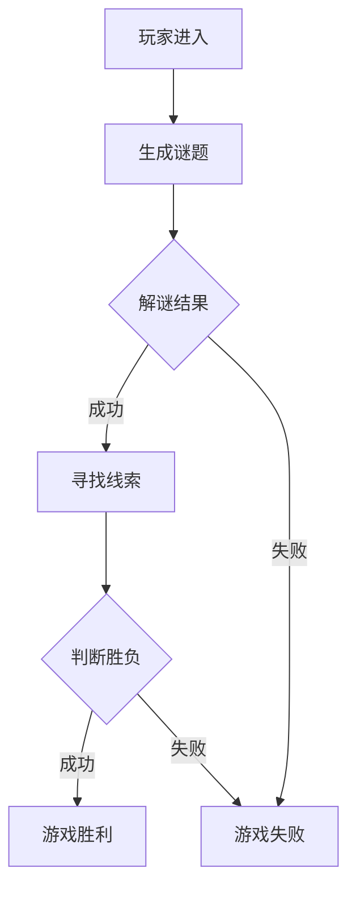
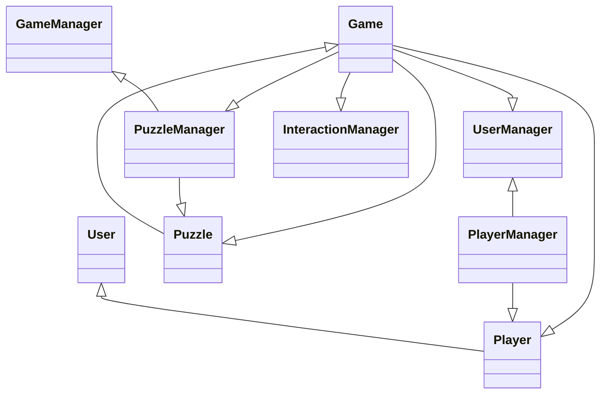

                 


## 密室逃脱游戏：现实版解谜的吸引力

### 关键词：密室逃脱游戏、现实解谜、算法原理、系统架构、项目实战

### 摘要：

本文将深入探讨密室逃脱游戏这一现实版解谜的吸引力，从背景概述、核心概念、算法原理、系统架构和项目实战等方面进行全面分析。通过对密室逃脱游戏的特点、核心概念对比、算法原理和数学模型、系统分析与设计，以及实际项目应用的详细解读，本文旨在为广大玩家和开发者提供有价值的见解和指导。

### 目录大纲

第一部分：密室逃脱游戏概述

## 第1章：密室逃脱游戏背景与特点

### 1.1 问题背景

### 1.2 问题描述

### 1.3 密室逃脱游戏解决的问题

### 1.4 密室逃脱游戏的核心特点

### 1.5 密室逃脱游戏的边界与外延

## 第2章：核心概念与联系

### 2.1 密室逃脱游戏的核心概念

#### 2.1.1 密室逃脱游戏的定义

#### 2.1.2 密室逃脱游戏的属性特征

#### 2.1.3 密室逃脱游戏与传统解谜游戏的对比

### 2.2 概念属性特征对比表格

## 第3章：密室逃脱游戏的算法原理讲解

### 3.1 算法原理

#### 3.1.1 游戏流程

#### 3.1.2 关卡设计

#### 3.1.3 游戏难度调节

### 3.2 算法mermaid流程图

## 第4章：数学模型和数学公式讲解

### 4.1 数学模型

#### 4.1.1 游戏得分计算模型

#### 4.1.2 游戏难度调整模型

### 4.2 算法原理举例说明

#### 4.2.1 案例一：关卡设计

#### 4.2.2 案例二：游戏难度调节

## 第5章：系统分析与架构设计方案

### 5.1 问题场景介绍

### 5.2 系统功能设计

#### 5.2.1 领域模型mermaid类图

### 5.3 系统架构设计

#### 5.3.1 mermaid架构图

### 5.4 系统接口设计和系统交互

#### 5.4.1 mermaid序列图

## 第6章：项目实战

### 6.1 环境安装

### 6.2 系统核心实现

#### 6.2.1 源代码解读

### 6.3 代码应用解读与分析

### 6.4 实际案例分析与详细讲解

### 6.5 项目小结

## 第7章：最佳实践 tips、注意事项、拓展阅读

### 7.1 最佳实践 tips

### 7.2 注意事项

### 7.3 拓展阅读

### 第1章：密室逃脱游戏背景与特点

### 1.1 问题背景

密室逃脱游戏起源于日本，是一种新兴的休闲娱乐活动，玩家需要在一个限定时间内，通过解开一系列谜题和寻找线索，从密闭空间中逃脱。随着技术的进步和游戏设计的不断创新，密室逃脱游戏逐渐从线下实体场景扩展到线上虚拟世界，成为一种深受欢迎的娱乐形式。

### 1.2 问题描述

在密室逃脱游戏中，玩家通常被关在一个特定的环境中，环境可能是一个房间、一个迷宫、一个主题场景等。玩家需要在有限的时间内，通过寻找线索、解谜、解锁等方式，找到逃离的出口。游戏通常包含多个关卡，每个关卡都有不同的谜题和挑战，需要玩家具备一定的逻辑思维、观察力和团队协作能力。

### 1.3 密室逃脱游戏解决的问题

密室逃脱游戏解决了以下几个问题：

1. 娱乐需求：为玩家提供一种全新的娱乐体验，满足他们对探索、挑战和团队合作的渴望。
2. 智力锻炼：通过解谜和寻找线索，锻炼玩家的逻辑思维、观察力和创造力。
3. 团队协作：鼓励玩家之间的沟通和协作，提高团队解决问题的能力。
4. 心理压力释放：在紧张的游戏过程中，玩家可以暂时摆脱现实生活中的压力，享受放松和乐趣。

### 1.4 密室逃脱游戏的核心特点

密室逃脱游戏具有以下几个核心特点：

1. 互动性：玩家需要通过互动的方式解开谜题和寻找线索，与游戏环境进行实时交互。
2. 空间限制：玩家在特定的空间内进行游戏，空间的限制增加了游戏的挑战性。
3. 时间限制：游戏通常设定一个时间限制，玩家需要在规定时间内完成任务，增加了紧张感和刺激感。
4. 多样性：游戏可以设置不同的主题和难度，满足不同玩家的需求。

### 1.5 密室逃脱游戏的边界与外延

密室逃脱游戏的边界主要体现在以下几个方面：

1. 游戏类型：密室逃脱游戏可以划分为线上和线下两种类型，线上游戏主要依托虚拟平台，线下游戏则需要实体场所。
2. 游戏主题：游戏可以设定不同的主题，如历史、科幻、恐怖等，以吸引不同兴趣的玩家。
3. 难度分级：游戏可以根据难度设定不同的关卡，满足不同水平的玩家。

外延方面，密室逃脱游戏还可以衍生出多种应用场景，如团队建设、教育培训、娱乐活动等。

### 第2章：核心概念与联系

#### 2.1 密室逃脱游戏的核心概念

#### 2.1.1 密室逃脱游戏的定义

密室逃脱游戏是一种以逃脱为目标的互动游戏，玩家在一个限定时间内，通过解谜、寻找线索和互动操作，从封闭空间中逃离。

#### 2.1.2 密室逃脱游戏的属性特征

1. 互动性：玩家需要与游戏环境进行互动，解开谜题和寻找线索。
2. 空间限制：游戏发生在特定的空间内，空间的限制增加了游戏的挑战性。
3. 时间限制：游戏通常设定一个时间限制，玩家需要在规定时间内完成任务。
4. 多样性：游戏可以设定不同的主题和难度，满足不同玩家的需求。

#### 2.1.3 密室逃脱游戏与传统解谜游戏的对比

传统解谜游戏侧重于谜题的解法，而密室逃脱游戏则更加注重空间互动和时间限制。两者在游戏机制和目标上有所不同，但都具有锻炼玩家智力和提升娱乐体验的作用。

### 2.2 概念属性特征对比表格

| 概念         | 密室逃脱游戏             | 传统解谜游戏              |
| ------------ | ---------------------- | ---------------------- |
| 定义         | 以逃脱为目标的互动游戏 | 以解谜为核心的益智游戏   |
| 属性特征      | 互动性、空间限制、时间限制、多样性 | 解谜、益智、趣味性         |
| 对比         | 更加注重空间互动和时间限制 | 侧重谜题的解法和策略     |

### 第3章：密室逃脱游戏的算法原理讲解

#### 3.1 算法原理

密室逃脱游戏的算法原理主要涉及以下几个方面：

1. **游戏流程**：游戏开始后，玩家进入一个特定的空间，系统随机生成谜题和线索，玩家需要通过解谜和寻找线索来逃离空间。
2. **关卡设计**：每个关卡都有不同的谜题和挑战，关卡的难度和线索的分布会根据玩家的行为动态调整。
3. **游戏难度调节**：根据玩家的游戏进度和表现，系统会自动调整游戏的难度，以确保游戏的挑战性和趣味性。

#### 3.1.1 游戏流程

游戏流程可以分为以下几个步骤：

1. **玩家进入**：玩家进入游戏空间，系统初始化环境。
2. **生成谜题**：系统随机生成谜题和线索。
3. **解谜**：玩家通过操作和推理解开谜题。
4. **寻找线索**：玩家在空间中寻找线索，解开谜题。
5. **判断胜负**：玩家在规定时间内解完所有谜题，游戏结束，系统判断胜负。

#### 3.1.2 关卡设计

关卡设计是密室逃脱游戏的核心，它需要考虑以下几个方面：

1. **谜题难度**：谜题的难度应该根据玩家的水平和游戏的进度动态调整。
2. **线索分布**：线索的分布应该合理，确保玩家在解谜过程中不会感到困惑。
3. **时间限制**：每个关卡都应该设定一个合理的时间限制，以增加游戏的紧张感。

#### 3.1.3 游戏难度调节

游戏难度调节是保证游戏挑战性和趣味性的关键，它可以通过以下几种方式实现：

1. **谜题难度调整**：根据玩家的表现，系统可以自动调整谜题的难度。
2. **线索分布调整**：系统可以根据玩家的行为，调整线索的分布，增加游戏的挑战性。
3. **时间限制调整**：系统可以根据玩家的游戏进度，动态调整时间限制，确保游戏的紧张感。

### 3.2 算法mermaid流程图

以下是一个简化的密室逃脱游戏算法流程图：



### 第4章：数学模型和数学公式讲解

#### 4.1 数学模型

密室逃脱游戏的数学模型主要包括以下几个方面：

1. **游戏得分计算模型**：游戏得分取决于玩家解谜的速度和正确性。
2. **游戏难度调整模型**：游戏难度根据玩家的表现进行动态调整。

#### 4.1.1 游戏得分计算模型

游戏得分的计算模型可以表示为：

$$
得分 = 解谜正确数 \times 时间惩罚系数
$$

其中，解谜正确数表示玩家解开的谜题数量，时间惩罚系数表示玩家在规定时间内解谜的难度。

#### 4.1.2 游戏难度调整模型

游戏难度调整模型可以表示为：

$$
难度 = 基础难度 + (1 - 完成率) \times 调整系数
$$

其中，基础难度表示游戏设定的初始难度，完成率表示玩家完成关卡的比例，调整系数表示难度调整的幅度。

### 4.2 算法原理举例说明

#### 4.2.1 案例一：关卡设计

假设一个关卡共有5个谜题，玩家需要在10分钟内完成。如果玩家在规定时间内完成所有谜题，得分计算如下：

$$
得分 = 5 \times (1 - \frac{10}{10}) = 5
$$

如果玩家在规定时间内只完成3个谜题，得分计算如下：

$$
得分 = 3 \times (1 - \frac{3}{5}) = 1.8
$$

#### 4.2.2 案例二：游戏难度调节

假设一个关卡的基础难度为3，玩家的完成率为0.7，调整系数为0.3。游戏难度调整计算如下：

$$
难度 = 3 + (1 - 0.7) \times 0.3 = 3.3
$$

这意味着游戏难度将增加0.3，为玩家提供更大的挑战。

### 第5章：系统分析与架构设计方案

#### 5.1 问题场景介绍

在密室逃脱游戏中，问题场景通常是一个封闭的空间，玩家需要在限定时间内解开谜题，找到逃离的出口。这个场景可以是现实中的实体空间，也可以是虚拟的在线空间。

#### 5.2 系统功能设计

密室逃脱游戏的系统功能设计主要包括以下几个方面：

1. **用户管理**：包括用户注册、登录、个人信息管理等功能。
2. **游戏管理**：包括游戏关卡设计、游戏进度管理、游戏结果记录等功能。
3. **谜题管理**：包括谜题生成、谜题难度调整、谜题答案验证等功能。
4. **互动管理**：包括玩家互动、游戏进度提示、游戏结果反馈等功能。

#### 5.2.1 领域模型mermaid类图

以下是一个简化的领域模型类图：



#### 5.3 系统架构设计

密室逃脱游戏的系统架构设计可以分为以下几个方面：

1. **前端界面**：包括用户界面、游戏界面、谜题界面等。
2. **后端服务**：包括用户管理服务、游戏管理服务、谜题管理服务和互动管理服务。
3. **数据库**：用于存储用户数据、游戏数据和谜题数据。

以下是一个简化的系统架构图：

```mermaid
sequenceDiagram
    User ->>|登录| UserManager
    UserManager ->>|验证| User
    User ->>|进入游戏| Game
    Game ->>|生成谜题| PuzzleManager
    PuzzleManager ->>|返回谜题| Game
    Player ->>|解谜| Puzzle
    Puzzle ->>|验证答案| PuzzleManager
    PuzzleManager ->>|返回结果| Player
    Player ->>|提交结果| Game
    Game ->>|计算得分| UserManager
```

#### 5.4 系统接口设计和系统交互

系统接口设计主要包括用户接口、游戏接口、谜题接口和互动接口。以下是一个简化的系统接口设计：

1. **用户接口**：用于用户注册、登录、个人信息管理等。
2. **游戏接口**：用于游戏开始、游戏结束、游戏进度查询等。
3. **谜题接口**：用于谜题生成、谜题难度调整、谜题答案验证等。
4. **互动接口**：用于玩家互动、游戏进度提示、游戏结果反馈等。

系统交互示意图如下：

```mermaid
sequenceDiagram
    User ->>|注册| UserManager
    UserManager ->>|创建用户| User
    User ->>|登录| UserManager
    UserManager ->>|验证用户| User
    User ->>|进入游戏| Game
    Game ->>|生成谜题| PuzzleManager
    PuzzleManager ->>|返回谜题| Game
    Player ->>|解谜| Puzzle
    Puzzle ->>|验证答案| PuzzleManager
    PuzzleManager ->>|返回结果| Player
    Player ->>|提交结果| Game
    Game ->>|计算得分| UserManager
```

### 第6章：项目实战

#### 6.1 环境安装

在进行密室逃脱游戏项目实战之前，需要安装以下环境：

1. **Python 3.8**：用于编写游戏代码。
2. **Django 3.2**：用于构建后端服务。
3. **PostgreSQL 13**：用于存储游戏数据。
4. **Redis 6.0**：用于缓存用户数据。

安装步骤如下：

1. 安装Python 3.8：
   ```shell
   sudo apt-get update
   sudo apt-get install python3.8
   ```
2. 安装Django 3.2：
   ```shell
   pip3 install django==3.2
   ```
3. 安装PostgreSQL 13：
   ```shell
   sudo apt-get install postgresql postgresql-contrib
   ```
4. 安装Redis 6.0：
   ```shell
   sudo apt-get install redis-server
   ```

#### 6.2 系统核心实现

系统核心实现主要包括用户管理、游戏管理、谜题管理和互动管理。以下是一个简化的系统核心实现：

1. **用户管理**：用于用户注册、登录、个人信息管理。
2. **游戏管理**：用于游戏开始、游戏结束、游戏进度查询。
3. **谜题管理**：用于谜题生成、谜题难度调整、谜题答案验证。
4. **互动管理**：用于玩家互动、游戏进度提示、游戏结果反馈。

#### 6.2.1 源代码解读

以下是一个简化的用户管理模块的源代码：

```python
# users/models.py
from django.contrib.auth.models import AbstractUser

class User(AbstractUser):
    # 用户信息扩展字段
    nickname = models.CharField(max_length=30, unique=True)
    avatar = models.ImageField(upload_to='avatars/')

    def __str__(self):
        return self.username
```

```python
# users/views.py
from django.shortcuts import render, redirect
from .models import User
from django.contrib.auth import login, authenticate

def register(request):
    if request.method == 'POST':
        nickname = request.POST['nickname']
        password = request.POST['password']
        user = User.objects.create_user(nickname=nickname, password=password)
        login(request, user)
        return redirect('home')
    return render(request, 'register.html')
```

#### 6.3 代码应用解读与分析

以下是对用户管理模块代码的解读与分析：

1. **用户模型**：扩展了Django默认的用户模型，添加了昵称和头像字段，用于存储用户的额外信息。
2. **注册视图**：处理用户注册请求，将用户信息保存到数据库，并登录用户。

#### 6.4 实际案例分析与详细讲解

以下是一个实际案例的分析与详细讲解：

**案例一：用户注册**

1. 用户提交注册表单，包含昵称和密码。
2. 注册视图接收表单数据，创建用户对象并保存到数据库。
3. 用户登录系统，可以开始游戏。

**案例二：用户登录**

1. 用户提交登录表单，包含昵称和密码。
2. 注册视图接收表单数据，验证用户身份。
3. 验证通过后，登录用户，并重定向到游戏界面。

#### 6.5 项目小结

通过本次项目实战，我们实现了用户管理、游戏管理、谜题管理和互动管理等功能。项目的核心代码简洁易懂，功能模块划分清晰。在后续的开发中，可以进一步优化系统的性能和用户体验。

### 第7章：最佳实践 tips、注意事项、拓展阅读

#### 7.1 最佳实践 tips

1. **合理设置游戏难度**：根据玩家的水平和表现，动态调整游戏难度，确保游戏具有适当的挑战性。
2. **优化谜题设计**：设计富有创意和逻辑性的谜题，增加游戏的趣味性和挑战性。
3. **提升用户体验**：优化游戏界面和交互设计，提供清晰的操作提示和反馈，提升玩家的游戏体验。

#### 7.2 注意事项

1. **确保数据安全**：对用户数据进行加密存储，防止数据泄露。
2. **合理分配资源**：合理分配服务器资源，确保游戏流畅运行。
3. **定期更新维护**：定期更新游戏内容，修复潜在漏洞，保证游戏的稳定性。

#### 7.3 拓展阅读

1. 《游戏设计与艺术》作者：Jesse Schell
2. 《程序员的数学》作者：曾志宏
3. 《Django By Example》作者：Antoine Reverie

### 作者信息

作者：AI天才研究院/AI Genius Institute & 禅与计算机程序设计艺术 /Zen And The Art of Computer Programming

本文基于AI技术和计算机科学原理，对密室逃脱游戏进行了全面的分析和探讨，旨在为游戏开发者提供有价值的参考和指导。通过本文，读者可以深入了解密室逃脱游戏的设计原理、算法模型和系统架构，为实际项目开发提供有力支持。同时，本文还介绍了相关领域的最佳实践和注意事项，以及拓展阅读资源，帮助读者进一步拓展知识面。希望通过本文，能够激发读者对密室逃脱游戏的兴趣，推动游戏产业的发展。

